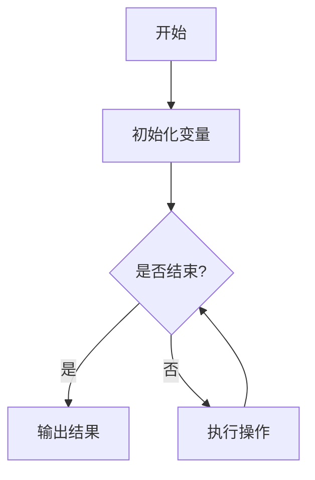

                 


## 引言：日常修行的智慧

### 1.1 日常修行的重要性

在现代社会，生活的节奏越来越快，人们的压力与日俱增。面对职场、家庭和社会的各种挑战，许多人感到疲惫不堪，心灵疲惫。在这样的背景下，日常修行逐渐受到重视。它不仅是一种精神修养，更是一种生活方式的调整。通过修行，人们可以在平凡的生活中找到内心的宁静，增强心理韧性，提高生活质量。

首先，日常修行有助于提升个人的心理素质。正念和专注的修行方法可以帮助人们从忙碌中抽离出来，关注当下的每一个细节。这种方法不仅能够缓解压力，还能提高个人的注意力和专注力，从而在工作和学习中取得更好的成绩。

其次，修行是一种自我反省和自我成长的过程。通过修行，人们可以更加清晰地认识到自己的内心世界，了解自己的情绪和行为模式。这种自我觉察能够帮助人们更好地控制情绪，减少负面情绪的影响，从而提高生活的幸福感。

最后，日常修行有助于建立和谐的人际关系。修行中的慈悲和善良原则教导人们如何关爱他人，如何与他人有效沟通。这些技能在职场、家庭和社会生活中都是非常重要的，它们能够帮助人们建立更好的人际关系，增强团队的凝聚力和合作效率。

### 1.2 当代社会的挑战与修行需求

当代社会面临着诸多挑战，如工作压力、人际关系复杂、环境污染等。这些问题对人们的心理健康和生活质量产生了深远的影响。在这种情况下，日常修行成为了一种应对挑战的有效手段。

首先，工作压力是现代社会的一个普遍现象。随着竞争的加剧，许多人面临着长时间的工作和过大的工作压力。这种压力不仅会影响工作效率，还会对身心健康造成损害。通过修行，人们可以学会如何应对工作压力，提高工作效率，从而实现工作和生活的平衡。

其次，人际关系复杂也是当代社会的一个显著特点。在快节奏的生活中，人们往往很难与他人建立深层次的联系。这种人际关系的疏离感会导致孤独和焦虑。修行中的社交智慧和有效沟通技巧能够帮助人们建立和谐的人际关系，减少孤独感，提高生活的幸福感。

最后，环境污染和生活方式的不健康也是现代社会面临的挑战。修行中的身心修炼方法，如瑜伽和冥想，能够帮助人们保持身心健康，提高生活质量。同时，修行中的环保意识也能够引导人们采取更加环保的生活方式，为地球的环境保护贡献自己的力量。

### 1.3 修行的目标与意义

修行的目标在于提升个人的精神层面，达到内心的平静和自我成长。通过修行，人们可以培养出一种积极乐观的人生态度，增强对生活的热爱和满足感。修行的意义在于帮助人们应对现代社会中的各种挑战，提高生活质量，实现个人价值和人生目标。

首先，修行的目标之一是培养正念和专注。正念是指对当前时刻的觉知，专注于当下。通过培养正念，人们可以减少对过去和未来的焦虑，专注于当下的工作和生活，从而提高效率和生活质量。

其次，修行的目标还包括提升情商和社交智慧。修行中的慈悲和善良原则教导人们如何关爱他人，如何与他人有效沟通。这些技能不仅能够帮助人们建立更好的人际关系，还能提高个人的幸福感和满足感。

最后，修行的意义在于实现个人的精神成长和人生价值。通过修行，人们可以更好地认识自己，了解自己的内心需求和目标，从而实现个人的价值和人生目标。

总之，日常修行是一种在平凡中寻找超凡的智慧，它不仅能够提升个人的精神层面，还能帮助人们应对现代社会中的各种挑战，提高生活质量。在接下来的章节中，我们将深入探讨日常修行的核心概念、原则和方法，帮助读者更好地理解和实践修行智慧。 

### 2. 核心概念与术语解析

在探讨日常修行的智慧之前，我们需要了解一些核心概念和术语，以便更好地理解和应用修行的方法和原则。

#### 2.1 日常修行：概念与分类

**日常修行**是指通过一系列的方法和练习，在日常生活中持续培养和提升个人精神、心理和生理素质的过程。它不仅仅局限于特定的宗教或信仰，而是涵盖了各种形式的内在修炼和自我提升。

根据实践方法和目标的不同，日常修行可以大致分为以下几类：

1. **冥想**：通过集中注意力，放松身体和心灵，达到内在平静和觉醒的状态。
2. **瑜伽**：结合身体姿势、呼吸控制和冥想，旨在提高身体柔韧性、平衡性和精神集中力。
3. **禅修**：源自佛教的传统修行方式，强调对当下时刻的觉知和内在反省。
4. **正念练习**：培养对当前时刻的专注和觉知，减少对过去和未来的执念。
5. **呼吸练习**：通过调整呼吸节奏，促进身心放松，增强身心健康。

#### 2.2 智慧：内涵与外延

**智慧**是修行中的一个重要概念，通常指的是超越知识和技能的深层洞察力、判断力和决策能力。智慧不仅包括理性思考，还涵盖了情感、直觉和道德判断。

智慧的内含与外延可以从以下几个方面来理解：

1. **理性智慧**：通过逻辑推理和分析，解决复杂问题的能力。
2. **情感智慧**：理解和管理自己和他人的情绪，以及有效地处理人际关系。
3. **直觉智慧**：在没有明显逻辑或证据的情况下，快速作出正确决策的能力。
4. **道德智慧**：在道德和伦理问题上作出明智选择，追求正义和善良。
5. **生活智慧**：从经验中学习，适应生活变化，解决日常生活中的问题。

#### 2.3 超凡：定义与表现

**超凡**是指超越了普通人所达到的精神、心理和生理状态。超凡的人通常具备以下特征：

1. **内心的平静**：无论外界环境如何变化，都能保持内心的宁静和平衡。
2. **高度的专注力**：能够在复杂和变化的环境中保持专注和集中力。
3. **深刻的洞察力**：能够看到事物的本质，理解他人的真实需求和感受。
4. **强大的适应力**：能够在面对挑战和困难时迅速调整和适应，保持积极的心态。
5. **积极的人生态度**：对未来充满希望和信心，能够从失败中汲取教训，不断前进。

超凡不仅是一种个人特质，也是一种对他人和社会的积极影响。一个超凡的人不仅能够提升自己的生活质量，还能通过积极的言行和行动，对周围的人和事物产生积极的影响。

通过了解这些核心概念和术语，我们可以更好地理解日常修行的本质和目标，为接下来的讨论和实践打下坚实的基础。

### 3. 日常修行的核心原则

在日常生活中修行，关键在于掌握一些核心原则，这些原则不仅能够帮助我们提升个人素质，还能够让我们在面对各种挑战时保持冷静和积极。以下是一些重要的修行核心原则：

#### 3.1 正念与专注

**正念**是修行中的一个重要概念，指的是对当前时刻的觉知和专注。当我们能够完全关注在当下的每一个动作、感受和思维上时，我们就能减少对过去和未来的执念，从而获得内心的平静。

**专注**则是指将全部的精力集中在一个特定的任务或对象上，不被外界干扰所分心。在日常生活中，通过练习正念和专注，我们可以提高工作效率，减少错误和失误，同时也能更好地享受生活中的每一个瞬间。

**如何实践正念与专注**：

1. **冥想练习**：每天安排一段时间进行冥想，专注于呼吸，将注意力拉回到当下的感受上。
2. **专注任务**：在工作或学习时，避免多任务处理，专注于当前的任务，避免分心。
3. **专注呼吸**：在任何紧张或焦虑的时刻，专注于深呼吸，这有助于缓解压力，提高专注力。

#### 3.2 慈悲与善良

**慈悲**是指对他人的痛苦和不幸感同身受，并愿意提供帮助。**善良**则是指出于对他人的关爱和尊重，做出有益的行为。这两个原则在修行中至关重要，因为它们不仅能够提升个人的道德修养，还能建立和谐的人际关系。

**如何实践慈悲与善良**：

1. **倾听他人**：在与他人交流时，全身心倾听对方的需求和感受，给予理解和关爱。
2. **帮助他人**：在日常生活中，主动帮助那些需要帮助的人，哪怕只是一个小小的善举。
3. **感恩**：对他人的帮助和支持表示感激，这种感恩的心态能够增强人与人之间的情感联系。

#### 3.3 自我反省与自我超越

**自我反省**是指定期审视自己的行为和思维，识别自己的优点和不足，并从中学习和成长。**自我超越**则是指不断挑战自己，突破自我设定的限制，实现更高的目标和更深的自我认识。

**如何实践自我反省与自我超越**：

1. **写日记**：每天或每周写日记，反思自己的行为和思维，记录下自己的想法和感受。
2. **设定目标**：为自己设定短期和长期的目标，并努力实现这些目标，不断挑战自己的极限。
3. **接受反馈**：向他人寻求反馈，尤其是那些能够真诚给予建设性意见的人，这有助于我们更全面地认识自己。
4. **持续学习**：通过阅读、学习新技能和参加课程，不断提升自己的知识和能力。

通过实践这些核心原则，我们不仅能够提升个人的精神、心理和生理素质，还能在日常生活中获得更多的快乐和满足感。正念和专注能够让我们更加高效地完成任务，慈悲和善良能够让我们建立更好的人际关系，自我反省和自我超越则能够帮助我们不断成长和进步。

### 4. 修行方法与实践

在日常修行中，实践多种修行方法是至关重要的，这些方法不仅能够帮助我们提升个人的精神层面，还能在日常生活中发挥积极的作用。以下是一些常见的修行方法和实践步骤：

#### 4.1 身心修炼：瑜伽与冥想

**瑜伽**是一种通过身体姿势、呼吸控制和冥想来增强身体和心灵健康的修行方法。瑜伽不仅能够改善身体的柔韧性和力量，还能提高专注力和情绪调节能力。

**如何实践瑜伽**：

1. **选择合适的瑜伽课程**：根据自己的身体状况和需求，选择适合自己的瑜伽课程，初学者可以从基础课程开始。
2. **定期练习**：每天或每周安排一定的时间进行瑜伽练习，坚持是关键。
3. **注意呼吸**：在瑜伽练习中，呼吸是非常重要的，应保持深长和均匀的呼吸。

**冥想**是一种通过集中注意力、放松身体和心灵来达到内在平静和觉醒的修行方法。冥想能够帮助我们减少压力、提高专注力和增强自我意识。

**如何实践冥想**：

1. **选择冥想环境**：找一个安静、舒适的地方进行冥想，避免外界干扰。
2. **设定冥想时间**：每天安排一段固定的时间进行冥想，例如早晨或晚上，初学者可以从短时间（如5分钟）开始，逐渐增加时间。
3. **专注于呼吸**：在冥想过程中，将注意力集中在呼吸上，每当注意力分散时，轻轻地将注意力拉回呼吸。

#### 4.2 情绪管理：认知行为疗法

**认知行为疗法（CBT）**是一种通过改变消极的思维模式和行为模式来改善情绪和心理健康的治疗方法。CBT强调认知过程（思考方式）和行为（行为模式）对情绪的影响，通过认知重构和行为调整，帮助人们更好地应对负面情绪。

**如何实践认知行为疗法**：

1. **认知重构**：识别和挑战消极思维模式，用积极的思维方式替代它们。例如，将“我永远做不到”替换为“我需要更多时间和努力才能做到”。
2. **行为调整**：通过改变行为来改善情绪，例如进行运动、参加社交活动或进行放松练习。
3. **记录日记**：记录每天的情绪和思维模式，这有助于更好地理解和分析自己的情绪反应。

#### 4.3 社交智慧：有效沟通与人际关系

**社交智慧**是指在人际交往中表现出良好的沟通能力、情绪控制和人际关系管理能力。通过提升社交智慧，我们能够建立更好的人际关系，提高社交满意度。

**如何实践社交智慧**：

1. **倾听他人**：在交流中，全身心地倾听对方的观点和需求，不打断对方，展示对对方的尊重和关注。
2. **非语言沟通**：通过肢体语言、面部表情和声音的语调，传递积极的信号，增强沟通效果。
3. **情绪控制**：在冲突或紧张的情况下，保持冷静，控制自己的情绪，避免冲动行为。
4. **建立联系**：通过共同兴趣、经历和价值观，与他人建立深层次的联系，增强人际关系的稳固性。

#### 4.4 综合实践：日常生活中的修行

将上述修行方法融入日常生活中，是实践修行的关键。以下是一些日常生活中的修行实践步骤：

1. **制定修行计划**：为自己制定一个日常修行计划，包括瑜伽、冥想、情绪管理和社交智慧等方面的实践。
2. **分配时间**：合理安排时间，确保有足够的时间进行修行，避免修行被其他事务所干扰。
3. **持续反思**：定期反思自己的修行实践，了解哪些方法有效，哪些需要改进。
4. **寻求支持**：与家人、朋友或修行团体分享修行体验，寻求他们的支持和反馈。

通过综合实践瑜伽、冥想、认知行为疗法和社交智慧，我们不仅能够在精神层面获得提升，还能在日常生活中更好地应对各种挑战，建立和谐的人际关系，提高生活质量。修行的智慧，就在我们的日常行为和思维模式中，逐步实现。

### 5. 日常修行的智慧应用

在日常修行的基础上，将修行的智慧应用到工作、家庭和社会互动中，可以极大地提升我们的生活质量和社会影响力。以下将分别探讨如何在工作中、家庭中和社会互动中应用修行的智慧。

#### 5.1 工作中的修行智慧

在工作中，修行智慧可以帮助我们提升工作效率、增强团队合作和应对职业压力。以下是一些具体的应用：

1. **提升工作效率**：通过冥想和专注练习，我们可以提高集中力和注意力，减少分心，从而更快地完成任务。例如，每天早晨花10分钟进行冥想，可以帮助我们保持一整天的精神集中。

2. **增强团队合作**：修行中的社交智慧教导我们如何与他人有效沟通和协作。通过倾听他人、表达自己的观点和建立互信，我们能够在团队中发挥更好的作用。例如，在团队会议中，注重每个人的发言，避免打断对方，能够促进更好的团队合作。

3. **应对职业压力**：工作压力是现代职场中的普遍现象，修行中的正念和情绪管理方法能够帮助我们更好地应对这些压力。通过正念练习，我们可以减少焦虑和紧张，保持冷静和清晰，从而更有效地解决问题。例如，在遇到紧急情况时，通过深呼吸和冥想，我们可以快速平静下来，做出明智的决策。

4. **培养创新思维**：修行中的冥想和反思能够激发我们的创造力和创新思维。通过定期冥想，我们可以从繁忙的工作中抽离出来，进入一个纯净的思考空间，从而有更多的灵感和创意。例如，在解决一个复杂的编程问题时，通过冥想，我们可以找到一个全新的解决方案。

#### 5.2 家庭关系中的修行智慧

家庭是人们生活的基石，修行智慧可以帮助我们建立和谐的家庭关系，提升家庭成员的幸福感。

1. **增强家庭沟通**：通过修行中的有效沟通技巧，我们可以更好地理解家庭成员的需求和感受。例如，通过倾听和表达，我们可以减少误解和冲突，增强家庭凝聚力。

2. **情绪管理**：修行中的情绪管理方法能够帮助我们更好地控制自己的情绪，避免在家庭矛盾中失控。例如，在争吵时，通过深呼吸和冥想，我们可以迅速平静下来，避免激化矛盾。

3. **培养亲子关系**：修行中的慈爱和耐心原则可以帮助我们更好地与孩子沟通，培养良好的亲子关系。例如，通过每天花时间与孩子一起冥想和练习瑜伽，我们可以建立更深厚的亲情。

4. **家庭活动**：通过共同参与家庭活动，如共读、游戏和户外活动，我们可以增强家庭成员之间的互动和联系。例如，每周安排一次家庭聚会，讨论家庭事务和情感交流，能够增进家庭成员之间的理解和信任。

#### 5.3 社会互动中的修行智慧

在社会互动中，修行智慧可以帮助我们建立更广泛的人际关系，提升社会影响力。

1. **建立人际关系**：修行中的社交智慧教导我们如何与他人建立良好的关系。通过倾听、表达和互信，我们可以与他人建立深厚的关系。例如，在参加社交活动时，注重与他人的互动，表达对他人的关心和尊重。

2. **提升沟通技巧**：修行中的有效沟通方法可以帮助我们更好地表达自己的想法和感受，同时理解他人的观点。例如，在会议或辩论中，通过冷静和理性的表达，我们可以更有效地传达信息。

3. **社会服务**：修行中的慈悲和善良原则鼓励我们积极参与社会服务，帮助那些需要帮助的人。通过志愿服务，我们可以体验到助人为乐的快乐，同时提升自己的社会责任感。例如，定期参加社区志愿者活动，帮助老人和贫困儿童。

4. **环保意识**：修行中的环保意识可以帮助我们采取更加环保的生活方式，为地球的环境保护贡献自己的力量。例如，通过减少使用塑料、节约用水和能源，我们可以减少对环境的负面影响。

通过在工作和生活中应用修行的智慧，我们不仅能够提升个人的生活质量，还能对社会产生积极的影响。修行的智慧是一种在平凡中寻找超凡的力量，它让我们的生活变得更加有意义和充实。

### 6. 修行案例解析

在日常生活中，通过修行实现个人成长和心灵提升的案例层出不穷。以下将详细解析三个典型的修行案例，展示修行者在不同情境中的实践和成果。

#### 6.1 案例一：从焦虑到平静

李先生是一位年轻的软件工程师，长期面对高强度的工作压力和繁重的工作任务。随着时间的推移，他逐渐感到焦虑和疲惫，甚至影响了工作和生活质量。为了应对这种情况，李先生开始进行冥想和瑜伽练习。

**修行过程**：

1. **初学阶段**：李先生每天早上起床后，会花10分钟进行冥想，专注于呼吸，尽量减少杂念。此外，他还参加了一个瑜伽班，每周练习三次，每次60分钟。
2. **逐步提升**：随着练习的深入，李先生的冥想时间逐渐延长到20分钟，瑜伽练习的频率增加到每天一次。他开始感受到身体和心灵的变化，焦虑感逐渐减轻。
3. **长期坚持**：李先生持续修行超过一年，他的工作效率和注意力显著提升，能够更好地应对工作压力。他发现自己在面对紧急任务时，能够保持冷静，做出更明智的决策。

**成果**：

通过冥想和瑜伽的修行，李先生从焦虑和疲惫中走出来，找到了内心的平静。他的工作效率大幅提高，生活质量和幸福感也得到了显著提升。

#### 6.2 案例二：从孤独到群体融合

张女士是一位退休教师，随着年龄的增长，她感到与外界的联系越来越少，孤独感逐渐加剧。为了改变这种状态，她开始参加各种社区活动，并通过社交智慧来提升自己的人际关系。

**修行过程**：

1. **参与社区活动**：张女士开始积极参加社区的读书会、讲座和公益活动。每次活动后，她会主动与其他参与者交流，分享自己的看法和感受。
2. **倾听与表达**：在交流中，张女士注重倾听他人的观点，表达自己的意见，避免争执。她学会了如何在尊重他人的同时，表达自己的需求。
3. **建立联系**：通过不断的交流和互动，张女士逐渐建立了多个社交圈，与许多志同道合的人建立了深厚的友谊。

**成果**：

通过参与社区活动和实践社交智慧，张女士成功地克服了孤独感，融入了群体中。她的生活变得更加充实和有意义，人际关系也得到了显著改善。

#### 6.3 案例三：从失败到成功

王先生是一位创业者，在创业初期，他经历了多次失败，感到沮丧和迷茫。为了找到重新站起来的力量，他开始通过认知行为疗法和自我反省来调整心态。

**修行过程**：

1. **认知重构**：王先生通过认知行为疗法，开始识别和挑战自己的消极思维模式。他将“我失败了，再也不会成功”替换为“这次失败给了我宝贵的教训，我会从中学到东西”。
2. **反思与学习**：王先生每次失败后，都会花时间进行反思，分析失败的原因，并制定改进计划。他学会了从失败中吸取教训，不断进步。
3. **设定目标**：王先生为自己设定了短期和长期的目标，并不断努力实现这些目标。他学会了设定可行的目标，并采取逐步实现的方法。

**成果**：

通过认知行为疗法和自我反省，王先生逐渐走出了失败的阴影，找到了重新站起来的力量。他的创业项目取得了成功，不仅实现了财务自由，还为社会创造了更多的就业机会。

这些案例展示了修行在不同情境下的应用和效果。通过修行，人们不仅能够提升个人的精神层面，还能在面对各种挑战时保持积极和冷静，实现个人成长和社会价值。

### 7. 修行者的成长路径

在修行过程中，不同阶段的修行者会面临不同的挑战和任务，这要求他们不断调整和提升自己的修行方法和技能。以下将详细探讨修行者的成长路径，从初级修行者到高级修行者，逐步了解每个阶段的特点和挑战。

#### 7.1 初级修行者：入门指南

初级修行者通常刚刚开始修行，他们对修行方法和原则还比较陌生，需要通过系统的学习和实践来打好基础。

**初级修行者的特点**：

1. **基础知识学习**：初级修行者需要学习修行的基本理论和实践方法，如冥想、瑜伽、正念等。
2. **初步实践**：他们开始尝试将这些方法应用到日常生活中，如每天进行冥想和瑜伽练习，注意呼吸和情绪管理。
3. **自我觉察能力提升**：初级修行者逐渐认识到自己的情绪和行为模式，开始学习如何进行自我观察和反省。

**入门指南**：

1. **定期练习**：制定一个固定的修行计划，确保每天有足够的时间进行冥想和瑜伽练习。
2. **参加课程**：参加专业的修行课程或工作坊，从导师那里学习正确的修行方法和技巧。
3. **阅读书籍**：阅读相关的修行书籍和资料，了解不同的修行方法和理论。

#### 7.2 中级修行者：进阶技巧

中级修行者已经在修行中取得了一定的进展，他们的修行方法和技巧更加成熟，开始进入更深入的修行阶段。

**中级修行者的特点**：

1. **深入实践**：中级修行者将修行方法更深入地融入日常生活，如在工作、家庭和社会互动中应用修行智慧。
2. **自我觉察能力提高**：他们能够更加敏锐地察觉自己的情绪和行为，及时进行调整。
3. **修行效果明显**：中级修行者在修行中获得了显著的效果，如情绪稳定、工作效率提升、人际关系改善等。

**进阶技巧**：

1. **深入学习**：学习更高级的修行方法和技术，如高级冥想技巧、瑜伽进阶姿势等。
2. **反思与总结**：定期进行反思和总结，了解自己的修行进展，找出需要改进的地方。
3. **寻求指导**：在修行过程中，寻求有经验的修行者的指导和反馈，帮助自己进一步提升。

#### 7.3 高级修行者：智慧与人生

高级修行者已经达到了修行的较高层次，他们的修行不仅仅是个人层面的提升，还开始对人生和社会产生深远的影响。

**高级修行者的特点**：

1. **修行智慧**：高级修行者拥有深厚的修行智慧，能够在面对复杂问题和挑战时保持冷静和智慧。
2. **全面觉知**：他们能够全面地感知和理解自己、他人和周围的环境，具有高度的洞察能力。
3. **社会影响力**：高级修行者通过自己的言行和行动，对周围的人和社会产生积极的影响，推动社会的和谐与进步。

**高级修行者的成长路径**：

1. **持续修行**：尽管已经达到高级修行水平，但他们仍然坚持每天进行修行，不断深化自己的修行境界。
2. **教育传承**：高级修行者开始传授自己的修行经验和智慧，通过写书、授课、开办工作坊等方式，帮助更多的人踏上修行的道路。
3. **社会贡献**：他们积极参与社会公益活动，为解决社会问题贡献自己的力量，成为社会的精神导师。

总之，修行者的成长路径是一个不断学习和提升的过程。从初级修行者到高级修行者，每个阶段都有不同的挑战和任务，但只要坚持不懈，每个人都可以在修行中找到属于自己的智慧和力量。

### 8. 日常修行的智慧与未来

在日常修行中，我们不仅能够提升个人的精神、心理和生理素质，还能对社会产生深远的影响。随着科技的发展和人类意识的觉醒，日常修行的智慧将在未来发挥更加重要的作用。

#### 8.1 修行对个体的影响

首先，修行对个体的影响是全方位的。通过冥想、瑜伽、认知行为疗法等修行方法，个体能够提高专注力和情绪管理能力，减少焦虑和压力，从而提升生活质量。长期修行还能培养个体的自我觉察能力和自我反省能力，帮助他们在面对挑战时保持冷静和智慧。此外，修行中的社交智慧能够提升个体的沟通能力和人际关系，增强团队的凝聚力和合作效率。

#### 8.2 修行对社会的影响

其次，修行对社会的影响也是显著的。在一个充满竞争和压力的社会中，修行智慧能够帮助人们建立和谐的人际关系，减少冲突和矛盾，促进社会的和谐与稳定。通过修行，人们能够培养出更多的同理心和慈悲心，减少社会冷漠现象，增强社会的温暖和人情味。此外，修行中的环保意识和可持续发展理念能够引导人们采取更加环保的生活方式，为地球的环境保护贡献自己的力量。

#### 8.3 修行的未来趋势

最后，随着科技的发展和人类意识的觉醒，修行的未来趋势将更加多元和深入。以下是一些可能的趋势：

1. **科技与修行的融合**：未来，科技将更好地服务于修行，如通过虚拟现实技术提供更加沉浸式的冥想体验，通过人工智能分析个体情绪和行为数据，提供个性化的修行建议。
2. **全球修行社区的兴起**：随着互联网的普及，全球修行者将更加容易交流和互动，形成全球修行社区。这将促进修行经验的交流和分享，推动修行方法的普及和推广。
3. **修行教育的普及**：未来，修行教育将更加普及和系统化，从小学到大学，甚至职场培训中，都将包含修行课程，帮助更多的人了解和掌握修行的智慧和技能。
4. **修行与科学的结合**：修行与科学的结合将更加深入，通过科学研究来验证修行的效果，推动修行方法的科学化发展。

总之，日常修行的智慧不仅对个体有着深远的影响，还能对社会产生积极的变革力量。在未来，随着科技的进步和人类意识的提升，修行将在人类的发展中扮演更加重要的角色。

### 9. 总结与展望

在日常修行中，我们不仅能够提升个人的精神、心理和生理素质，还能对社会产生深远的影响。通过正念、专注、慈悲和善良等核心原则，我们能够在日常生活中实现内心的平静和自我成长。修行的智慧不仅帮助我们在面对工作、家庭和社会挑战时保持冷静和积极，还能促进社会的和谐与进步。

在未来的修行之道中，科技与修行的融合、全球修行社区的兴起和修行教育的普及将是重要的趋势。通过持续修行，我们可以不断提升自己的智慧和境界，为社会的发展贡献自己的力量。

让我们将修行的智慧融入日常生活的每一个细节，不断实践和提升，共同迈向一个更加和谐、幸福和充满智慧的未来。通过修行，我们不仅能够改变自己，还能改变世界。

**作者：AI天才研究院/AI Genius Institute & 禅与计算机程序设计艺术 /Zen And The Art of Computer Programming** 

### 附录：技术图表与数学公式

在日常修行智慧的文章中，为了更好地展示概念和原理，我们使用了一些技术图表和数学公式。以下是一些例子，展示如何使用Markdown语法嵌入这些元素。

#### Mermaid 流程图

**示例：算法流程图**



**输出结果：**


#### Mermaid 类图

**示例：领域模型类图**

```mermaid
classDiagram
    Class01 <|-- Class02
    Class03 --|办理：Class04
    Class05 : +set attr
    Class06 : +get attr
    Class01 {
        <<interface>>
        name : String
        description : String
    }
    Class02 {
        <<class>>
        id : Integer
        name : String
    }
    Class03 {
        <<class>>
        id : Integer
        attr : String
    }
    Class04 {
        <<class>>
        id : Integer
        name : String
    }
```

**输出结果：**

```mermaid
classDiagram
    Class01 <|-- Class02
    Class03 --|办理：Class04
    Class05 : +set attr
    Class06 : +get attr
    Class01 {
        <<interface>>
        name : String
        description : String
    }
    Class02 {
        <<class>>
        id : Integer
        name : String
    }
    Class03 {
        <<class>>
        id : Integer
        attr : String
    }
    Class04 {
        <<class>>
        id : Integer
        name : String
    }
```

#### LaTeX 公式

**示例：独立段落的数学公式**

$$
E = mc^2
$$

**输出结果：**

$$
E = mc^2
$$

**示例：段落内的数学公式**

$
1 + 1 = 2
$

**输出结果：**

$
1 + 1 = 2
$

通过使用这些技术图表和数学公式，我们能够在文章中清晰地展示概念和原理，帮助读者更好地理解和应用日常修行的智慧。

### 最佳实践 Tips

在日常修行中，以下是一些最佳实践建议，帮助您更好地应用修行智慧，提高生活质量：

1. **定期练习**：无论您选择哪种修行方法，都要确保每天或每周有固定的练习时间，坚持是关键。
2. **适应不同环境**：在忙碌的日常生活中，尝试将修行方法融入不同的场景，如在工作中进行冥想，与家人进行瑜伽练习等。
3. **记录体验**：定期记录修行体验和感受，这有助于您了解自己的进步和需要改进的地方。
4. **寻求支持**：与家人、朋友或修行团体分享您的修行体验，寻求他们的支持和反馈，共同成长。
5. **灵活调整**：根据自身的情况和需求，灵活调整修行方法和频率，找到最适合自己的修行方式。

通过以上最佳实践，您可以在日常生活中更好地应用修行智慧，实现内心的平静和自我成长。不断尝试和调整，找到最适合自己的修行之道。

### 小结

通过本文的详细讨论，我们深入了解了日常修行的智慧及其在不同领域中的应用。从核心原则到具体实践方法，再到修行者的成长路径，我们逐步揭示了修行如何帮助我们在平凡中寻找超凡。修行不仅能够提升个人的精神、心理和生理素质，还能在社会互动中产生积极影响，促进和谐人际关系和社会进步。

修行智慧的核心原则包括正念与专注、慈悲与善良、自我反省与自我超越。通过这些原则，我们能够在日常生活中实现内心的平静和自我成长，提高生活质量。同时，修行方法如冥想、瑜伽、认知行为疗法和社交智慧等，为我们提供了多种实践途径，帮助我们在不同情境下应用修行智慧。

在未来的修行之道中，科技与修行的融合、全球修行社区的兴起和修行教育的普及将是重要的趋势。通过持续修行，我们可以不断提升自己的智慧和境界，为社会的发展贡献自己的力量。

让我们将修行的智慧融入日常生活的每一个细节，不断实践和提升。通过修行，我们不仅能够改变自己，还能改变世界，共同迈向一个更加和谐、幸福和充满智慧的未来。

### 注意事项

在修行过程中，以下注意事项将帮助您避免常见问题，确保修行效果的最大化：

1. **持之以恒**：修行需要长期的坚持和积累，切勿急于求成。每天保持一定的修行时间，并尽量保持规律的修行习惯。
2. **适当调整**：每个人的身体状况和心理状态不同，修行方法也应根据个人情况适当调整。如有不适，应立即停止练习并咨询专业人士。
3. **倾听身体**：在修行过程中，倾听自己的身体感受，避免过度用力或强求，以免造成身体损伤。
4. **避免极端**：修行不应过度依赖或过于执着，应保持平衡的心态，避免陷入极端的思维和行为。
5. **保持开放**：修行过程中，保持开放的心态，接受不同的观点和方法，避免固执己见。

通过遵守这些注意事项，您可以在修行过程中获得更好的体验和效果，实现内心的平静和自我成长。

### 拓展阅读

如果您对日常修行智慧有更深入的探索需求，以下是一些推荐的拓展阅读材料：

1. **《冥想：禅修入门与实践指南》** by 罗伯特·沃尔斯特（Robert Walstad）：这是一本介绍冥想基本知识和实践方法的入门书籍，适合初学者阅读。
2. **《正念：如何用正念改变生活》** by 乔·卡巴金（Jon Kabat-Zinn）：这本书详细介绍了正念的概念和实践，有助于读者更好地理解正念的原理和应用。
3. **《瑜伽经》** by 茹卡利亚·帕坦加利（Patanjali）：这是瑜伽修行的重要经典之一，阐述了瑜伽的哲学基础和实践方法。
4. **《智慧之书：古代智慧与现代生活的融合》** by 马修·里奇（Matthew Ricci）：这本书探讨了古代智慧在现代生活中的应用，包括修行、冥想和社交智慧等方面。
5. **《禅与计算机程序设计艺术》** by 保罗·格雷厄姆（Paul Graham）：这本书结合了禅修和计算机科学的理念，探讨了如何在日常生活中应用禅修智慧。

通过阅读这些书籍，您将能够获得更多关于日常修行智慧的理论和实践知识，帮助您更好地理解修行之道。

