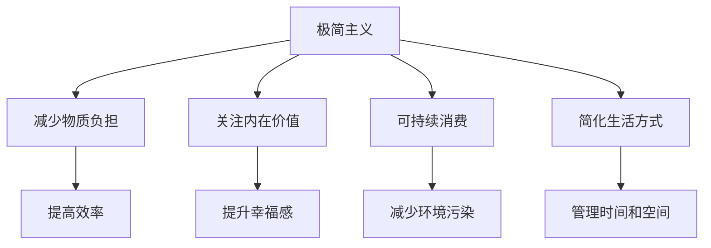
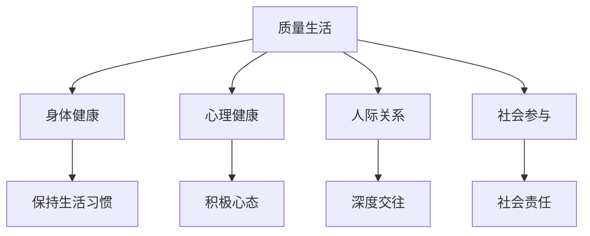
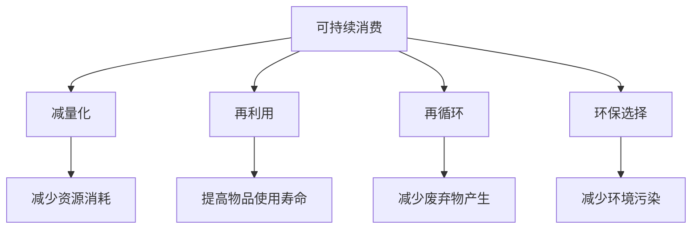
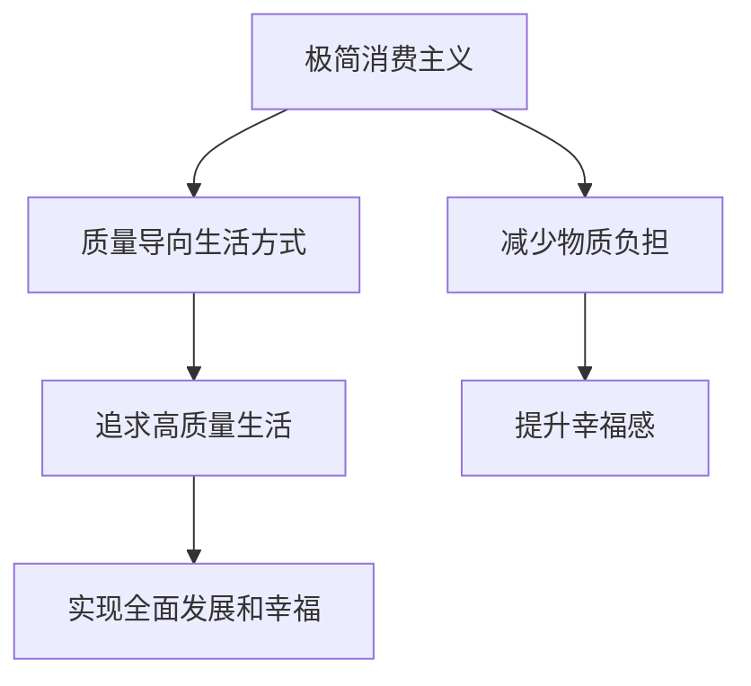

                 

## 引言

### 关键词：极简消费主义、质量生活、消费主义、生活方式革命

在当今高速发展的社会中，消费主义已经成为一种普遍现象，人们追求更多的物质享受，追求瞬时满足感，然而这种过度消费的背后隐藏着诸多问题。资源浪费、环境污染、个人债务以及精神空虚等现象逐渐显现。正是在这样的背景下，极简消费主义应运而生，它倡导一种以质量为导向的生活方式，通过减少不必要的消费，追求生活的本质和幸福感。

本文将以《极简消费主义：质量导向的生活方式革命》为标题，深入探讨极简消费主义的核心理念和它如何引领一场生活方式的革命。我们将从以下几个方面展开讨论：

1. **极简消费主义概述**：介绍消费主义的概念，极简消费主义的定义及其与质量导向生活方式的关系。
2. **核心概念与联系**：探讨极简主义、质量生活、可持续消费等核心概念，并展示它们之间的联系。
3. **极简消费主义的优点**：分析极简消费主义对个人生活质量和环境的影响。
4. **实际案例**：分享一些成功的极简消费主义实践案例。
5. **实践指南**：提供具体的实践方法和工具，帮助读者开始实践极简消费主义。
6. **社交与社区**：讨论如何通过社交和社区来支持和推广极简消费主义。
7. **可持续消费**：探讨如何将极简消费主义与可持续消费相结合。
8. **生活变革**：分析极简消费主义如何影响人们的生活方式和价值观。
9. **小结与展望**：总结文章的关键观点，并对未来进行展望。

通过本文的探讨，我们希望读者能够对极简消费主义有更深入的理解，认识到它不仅仅是生活方式的一种改变，更是一场革命，旨在为人们带来更加幸福和可持续的未来。

### 摘要

本文旨在探讨极简消费主义的概念、原理及其对现代生活方式的革命性影响。消费主义，作为一种社会现象，在带来物质富足的同时，也引发了资源浪费、环境污染和个人负担等诸多问题。极简消费主义则是一种旨在减少不必要的物质追求，回归生活本质的消费理念。它不仅帮助人们减少浪费，提升生活质量，还倡导一种可持续的生活态度。

本文将首先介绍消费主义和极简消费主义的定义及其背景，探讨极简消费主义的核心概念，如极简主义、质量生活和可持续消费，并分析它们之间的联系。接着，我们将讨论极简消费主义的优点，包括减少不必要的消费、提升生活质量和环境效益。通过实际案例分享，我们将展示极简消费主义在个人和企业中的成功实践。

随后，文章将提供极简消费主义的实践指南，包括评估当前消费习惯、减少不必要的消费、构建质量生活的环境、培养可持续的消费观等具体方法。此外，文章还将探讨如何通过社交和社区来支持和推广极简消费主义，以及如何将极简消费主义与可持续消费相结合，以实现更大的社会和环境影响。

最后，文章将分析极简消费主义对人们生活方式和价值观的影响，并总结极简消费主义的核心理念，提出对未来的展望。通过本文的探讨，我们希望能够引导读者认识到极简消费主义的重要性，并激励他们在日常生活中践行这一理念，共同推动一场以质量为导向的生活方式革命。

### 第一部分：极简消费主义概述

#### 1.1 消费主义与极简消费主义

##### 消费主义的概念与影响

消费主义（Consumerism）是一种社会现象，其核心在于鼓励人们通过购买商品和服务来实现个人满足和社会地位的提升。这一现象在20世纪中后期得到了显著的发展，尤其是随着经济全球化和科技进步，消费主义逐渐渗透到人们生活的各个方面。消费主义的影响是深远的，不仅改变了人们的消费行为，还对经济、社会和文化产生了重要影响。

从经济角度来看，消费主义推动了市场的繁荣和经济的增长。人们通过消费来满足自身需求，从而带动了生产和再生产。消费主义使得企业更加注重市场需求，推动了产品和服务的多样化，为消费者提供了更多的选择。此外，消费主义还促进了技术的创新和发展，企业为了满足消费者的需求，不断研发新技术和新产品。

然而，消费主义也带来了一些负面影响。首先，它导致了资源的过度消耗和浪费。随着人们消费欲望的不断增强，资源的开采和消耗速度也在加快，导致资源枯竭和环境污染。其次，消费主义使得人们陷入了无尽的物质追求中，忽视了生活的本质和内在价值。许多人为了追求更高的消费水平，不得不承担高额的债务和财务压力，生活质量反而下降。此外，消费主义还导致了社会分化和不平等，富裕阶层通过消费来展示自己的地位，而贫困阶层则因无力消费而感到自卑和孤立。

##### 极简消费主义的定义与特征

与消费主义相反，极简消费主义（Minimalist Consumerism）倡导减少不必要的消费，回归生活的本质和内在价值。极简消费主义不仅关注物质消费，更强调精神层面的满足和生活质量的提升。它主张人们应该通过减少物质负担，专注于重要的事物和人际关系，从而实现更加简单、有意义和幸福的生活。

极简消费主义的主要特征包括：

1. **减少物质负担**：极简消费主义鼓励人们减少物品的购买，只保留真正需要的物品。通过减少物质负担，人们可以更好地管理时间和空间，提高生活效率和质量。
2. **关注内在价值**：极简消费主义认为，真正的幸福和满足来自于内在的价值，如人际关系、个人成长和自我实现。它倡导人们放下对物质的过度追求，关注内心的需求和情感。
3. **可持续消费**：极简消费主义不仅关注当前的消费行为，还考虑消费行为对环境和未来世代的影响。它主张人们选择可持续的消费方式，减少对自然资源的消耗和环境的破坏。
4. **简化生活方式**：极简消费主义鼓励人们简化生活方式，通过减少冗余的活动和任务，为自己创造更多的时间和精力，专注于重要的事情。

#### 1.2 极简消费主义的核心概念与联系

##### 极简主义

极简主义（Minimalism）是极简消费主义的重要理论基础，它主张通过减少物质和非物质的负担，回归生活的本质。极简主义不仅仅是对物品的减少，更是一种对生活方式的哲学思考。

**极简主义的定义与核心观点**：

- **定义**：极简主义是一种生活哲学，强调通过减少物品、任务和思想的复杂性，追求简单、高效和有意义的生活方式。
- **核心观点**：极简主义认为，过多的物质和任务会导致人们的压力增加、精力分散，影响生活质量和个人成长。通过减少不必要的物品和任务，人们可以更专注于重要的事情，实现更高的效率和幸福感。

**极简主义的核心观点对比表格**：

| 核心观点 | 消费主义 | 极简主义 |
| --- | --- | --- |
| 物质追求 | 强调物质的丰富和满足感 | 倡导减少物质负担，关注内在价值 |
| 消费行为 | 过度消费，追求即时满足 | 简化消费，关注长期幸福 |
| 生活质量 | 物质消费提升生活质量 | 减少物质负担，提升生活质量 |
| 社会价值 | 促进经济增长和社会发展 | 关注可持续发展和环境问题 |

**ER实体关系图**：

##### 质量生活

质量生活（Quality of Life）是极简消费主义追求的重要目标之一。质量生活不仅仅是指物质上的富足，更涵盖了精神、健康、人际关系和社会参与等多个方面。

**质量生活的定义与核心要素**：

- **定义**：质量生活是指人们在物质和精神上都能获得满足和幸福感的生活状态。
- **核心要素**：
  - **身体健康**：保持良好的生活习惯，关注身体的健康和舒适。
  - **心理健康**：拥有积极的心态，处理压力和情绪，提高心理健康水平。
  - **人际关系**：建立良好的人际关系，与家人、朋友和社区保持紧密联系。
  - **社会参与**：积极参与社会活动，为社区和社会做出贡献。

**质量生活的核心要素对比表格**：

| 核心要素 | 消费主义 | 极简主义 |
| --- | --- | --- |
| 物质条件 | 物质富足 | 简化物质需求 |
| 精神满足 | 消费带来的满足感 | 内在价值的实现 |
| 人际关系 | 社交互动 | 深度人际关系 |
| 社会参与 | 社会地位 | 社会责任和贡献 |

**ER实体关系图**：

##### 可持续消费

可持续消费（Sustainable Consumption）是极简消费主义的重要组成部分，它强调消费行为应考虑对环境和未来世代的影响。可持续消费不仅关注当前的消费需求，还关注消费行为的长远影响和可持续发展。

**可持续消费的定义与原则**：

- **定义**：可持续消费是指在满足当前需求的同时，不损害未来世代满足其自身需求的能力。
- **原则**：
  - **减量化**：减少资源的消耗和浪费，通过减少消费来实现可持续性。
  - **再利用**：提高物品的使用寿命，通过修复、改造和再利用来减少废弃物的产生。
  - **再循环**：通过回收和再生利用，将废弃物转化为新的资源，减少对自然资源的依赖。
  - **环保选择**：选择环保产品和绿色服务，减少对环境的负面影响。

**可持续消费的核心原则对比表格**：

| 核心原则 | 消费主义 | 可持续消费 |
| --- | --- | --- |
| 资源消耗 | 过度消费 | 减量化 |
| 废弃物处理 | 废弃物产生 | 再利用和再循环 |
| 环境影响 | 环境污染 | 环保选择 |

**ER实体关系图**：

##### 极简消费主义与质量导向生活方式的联系

极简消费主义与质量导向生活方式（Quality-Oriented Lifestyle）有着密切的联系。质量导向生活方式强调通过追求高质量的生活，实现个人的全面发展和幸福感。而极简消费主义则通过减少不必要的消费，帮助人们实现这种高质量的生活。

**极简消费主义与质量导向生活方式的关系**：

- **共同目标**：两者都追求更高品质的生活，强调内在价值和幸福感的实现。
- **相互促进**：极简消费主义通过减少物质负担，为人们创造更多的时间和精力，从而可以更好地追求高质量生活。而质量导向生活方式则通过提升生活品质，增强人们对极简消费主义的认同和实践。

**极简消费主义与质量导向生活方式的ER实体关系图**：

通过上述讨论，我们可以看到，极简消费主义不仅仅是一种消费行为的变化，更是一种生活方式的革命。它通过减少不必要的消费，回归生活的本质，帮助人们实现更高的生活质量和幸福感。同时，它也与质量导向生活方式和可持续消费紧密相连，为实现更加可持续和幸福的社会做出了重要贡献。

### 第一部分：极简消费主义的优点

#### 1.3.1 减少不必要的消费

极简消费主义的一个显著优点是减少不必要的消费。在传统的消费主义观念中，人们往往会出于冲动、社会压力或广告诱导而购买大量并不真正需要的物品。这种行为不仅增加了个人的经济负担，还导致了资源的巨大浪费。

通过实践极简消费主义，人们学会了更理性地评估自身的需求，避免盲目跟风和过度消费。以下是一些减少不必要的消费的具体方法和技巧：

1. **需求评估**：在购买任何物品之前，先问自己：“我真正需要这个物品吗？”通过仔细评估自己的需求，人们可以避免冲动购买，从而减少不必要的消费。
2. **清单管理**：在购物前，制作一个购物清单，并将需要购买的物品列在上面。这有助于人们集中精力购买真正需要的物品，避免在购物时受到外界干扰。
3. **延迟购买**：在看到心仪的物品时，先不要立刻购买，而是给自己一些时间来冷静思考。很多时候，当情绪平静下来后，人们会意识到自己并不真正需要这些物品。
4. **非紧急购买延迟法**：对于非紧急购买，设定一个等待期，比如48小时。在这段时间内，如果发现自己仍然需要这个物品，那么再进行购买。这样可以防止因一时冲动而做出的不理智决定。
5. **定期整理**：定期对自己的物品进行整理，找出那些长时间未被使用或不再需要的物品。通过这种方式，不仅可以减少不必要的消费，还可以为生活空间腾出更多的空间。

减少不必要的消费不仅有助于个人财务状况的改善，还能减少资源的浪费。例如，在购买电子产品时，不是每次都追求最新的型号，而是考虑现有设备的使用寿命和性能，这样既节省了开支，又减少了电子废弃物的产生。

#### 1.3.2 提升生活质量

极简消费主义不仅减少了不必要的消费，还显著提升了生活质量。通过简化生活方式和专注于重要的事物，人们能够更好地管理时间和资源，从而获得更高的生活满意度。

**提升生活质量的方法**：

1. **专注于重要事务**：极简消费主义鼓励人们将时间和精力集中在重要的事情上，如家庭、工作、个人兴趣和健康。通过减少无谓的琐事和杂务，人们可以更加专注和高效地完成重要任务，提高生活质量。
2. **减少时间浪费**：通过减少不必要的消费和购物活动，人们可以节省大量的时间。这些时间可以用来进行有意义的活动，如阅读、锻炼、学习新技能或与家人朋友共度时光。
3. **提升工作与生活平衡**：极简消费主义有助于人们更好地平衡工作和生活。通过减少工作之外的无谓消费和活动，人们可以有更多的时间来放松和充电，从而提高工作效率和生活满意度。
4. **改善健康与幸福感**：极简消费主义鼓励人们关注身体健康和精神幸福感。通过减少物质负担和压力，人们可以拥有更好的睡眠质量、更高的心理抗压能力和更积极的情绪状态。

**实际案例**：

- **个人案例**：一位年轻的职业女性在践行极简消费主义后，发现自己的生活质量显著提升。她通过减少购物和购物时间，将更多的时间用于锻炼、阅读和与家人朋友相处。她的健康状况和精神状态都得到了改善，工作效率和生活满意度也大大提高。
- **企业案例**：一些公司开始推行极简消费主义，鼓励员工减少不必要的办公用品和文具购买，只保留必要的物品。这不仅节省了公司的开支，还提高了员工的工作效率和满意度。

提升生活质量是极简消费主义的一大优势。通过减少不必要的消费和专注于重要事务，人们可以拥有更多的时间、更高的生活满意度、更好的健康状态和更积极的生活态度。

#### 1.3.3 环境影响

极简消费主义对环境的影响也是其显著优点之一。传统消费主义导致了资源的过度消耗和环境的严重污染，而极简消费主义则通过减少不必要的消费，倡导可持续的生活方式和消费行为，从而对环境产生了积极的影响。

**极简消费主义对环境的影响**：

1. **减少资源消耗**：极简消费主义鼓励人们减少对自然资源的需求，通过避免不必要的消费，减少了对原材料、能源和水的消耗。例如，减少购买电子产品和时尚衣物，可以减少对这些资源的开采和生产。
2. **减少废弃物产生**：极简消费主义通过减少消费和延长物品使用寿命，显著减少了废弃物的产生。通过修复、再利用和回收，极简消费主义不仅减少了对自然资源的依赖，还减轻了垃圾填埋场和焚烧厂的负担。
3. **减少环境污染**：传统消费主义导致了大量污染物的排放，如二氧化碳、塑料和有害化学物质。极简消费主义通过减少消费和选择环保产品，减少了这些污染物的产生，对改善环境质量起到了积极作用。
4. **推动可持续消费**：极简消费主义倡导可持续的消费行为，鼓励人们选择环保、有机和低碳的产品和服务。通过推动可持续消费，极简消费主义为可持续发展做出了重要贡献。

**实际案例**：

- **个人案例**：一位环保倡导者通过践行极简消费主义，大幅度减少了废弃物的产生。他选择使用可持续产品，如可回收材料制成的购物袋、可重用餐具和二手衣物。他的行为不仅改善了自己的生活质量，还影响了周围的人，促进了社区对可持续消费的认识和行动。
- **企业案例**：一些大型公司开始将极简消费主义理念融入业务中，通过减少不必要的生产和包装，降低了对环境的负面影响。例如，一家时尚品牌公司通过推出可回收材料和减少浪费的设计，不仅减少了资源消耗，还获得了消费者的认可和好评。

通过减少不必要的消费，倡导可持续的生活方式和消费行为，极简消费主义对环境产生了积极的影响。它不仅帮助人们减少资源浪费和环境污染，还为可持续发展做出了重要贡献。在追求生活质量的同时，极简消费主义也为保护地球家园提供了有力支持。

### 第一部分：极简消费主义的实践案例

#### 1.4 实际案例

极简消费主义不仅在理论层面上具有吸引力，更在实践中展现出显著的成效。通过以下实际案例，我们将看到极简消费主义如何在不同个人和公司中发挥作用，带来积极的变化。

#### 1.4.1 个人案例

**案例1：都市白领的极简生活**

李先生是一位生活在都市的年轻白领，工作繁忙，生活节奏快。然而，在实践极简消费主义之前，他的生活中充满了各种物品和活动。家里堆满了多余的衣物、电子产品和家居用品，日常计划也充斥着各种购物活动和社交聚会。

**实践过程**：

- **评估消费习惯**：李先生首先对自己的消费习惯进行了详细的评估，列出了所有购买行为和物品清单，分析哪些是必需的，哪些是非必要的。
- **设定目标**：他设定了减少物品数量、简化生活方式的目标，并明确了想要专注于的重要事项，如个人成长、家庭生活和健康。
- **减少购物**：李先生开始尽量避免冲动购物，每次购物前都会制作清单，只购买真正需要的物品。他也在社交媒体上关注了一些极简主义倡导者，从中获得灵感和动力。
- **整理与捐赠**：通过整理，李先生将家中多余的物品捐赠给了需要的人。这不仅减轻了他的物质负担，还让他感到内心的满足和喜悦。
- **持续改进**：随着时间的推移，李先生逐渐形成了极简生活的习惯。他不再为购买物品而感到压力，生活质量得到了显著提升。

**效果与启示**：

李先生的极简生活实践带来了显著的变化。他的家变得整洁有序，生活节奏也变得更加轻松。他发现，通过减少物质负担，自己有更多的时间和精力投入到个人成长和家庭生活中。这个案例表明，极简消费主义不仅能够帮助个人减少不必要的消费，还能提升生活质量，带来内心的平静和满足。

#### 1.4.2 企业与社区案例

**案例2：环保公司的极简运营**

XYZ环保科技有限公司是一家致力于提供环保解决方案的企业。在公司成立之初，他们便将极简消费主义的理念融入到业务中，通过减少不必要的开支和浪费，实现高效运营和可持续发展。

**实践过程**：

- **优化供应链**：XYZ公司通过优化供应链管理，减少了原材料和库存的浪费。他们与供应商合作，确保材料的可持续采购和合理使用，减少了资源的消耗。
- **节能减排**：公司采用了多种节能措施，如使用节能灯具、优化办公设备的运行时间、鼓励员工使用公共交通工具等，以减少能源消耗和碳排放。
- **减少包装**：XYZ公司通过减少产品包装和优化包装设计，减少了废弃物的产生。他们的产品采用环保材料，并在包装上使用了可回收的纸张和塑料。
- **员工培训**：公司定期对员工进行环保和极简消费主义的培训，提高员工的环保意识和实践能力。
- **社区推广**：XYZ公司还积极参与社区环保活动，推广极简消费主义和可持续消费理念，影响了更多的人。

**效果与启示**：

通过极简消费主义的实践，XYZ公司不仅实现了运营成本的大幅降低，还提升了品牌形象和市场竞争力。他们的环保措施和可持续运营模式得到了客户的认可和好评，为公司带来了更多的商业机会。这个案例表明，企业通过践行极简消费主义，不仅可以实现经济效益和环境效益的双赢，还能提升企业的社会价值和影响力。

**案例3：社区的极简生活计划**

某社区开展了名为“极简生活计划”的项目，旨在通过社区成员的共同参与，实践极简消费主义，提升社区的生活质量和环境意识。

**实践过程**：

- **社区动员**：社区通过宣传活动、讲座和研讨会，向居民介绍极简消费主义的概念和优势，激发居民的参与兴趣。
- **共享资源**：社区建立了共享平台，鼓励居民共享不常用的物品，如工具、书籍和电子产品，减少了个人物品的闲置和浪费。
- **环保活动**：社区定期组织环保活动，如垃圾分类、废品回收和环保志愿活动，提高居民的环保意识。
- **减少浪费**：居民通过减少购物、优化生活方式和回收利用物品，实践极简消费主义，减少了家庭和社区的浪费。
- **社区支持**：社区还提供了支持和资源，如环保购物指南、二手物品交换市场和环保知识培训，帮助居民更好地实践极简消费主义。

**效果与启示**：

通过“极简生活计划”的实施，社区的生活质量和环境状况得到了显著改善。居民的环保意识增强，浪费减少，社区关系也更加紧密。这个案例表明，极简消费主义不仅适用于个人和企业，还可以在社区层面上推广和实践，带来更广泛的社会和环境效益。

#### 总结

以上案例展示了极简消费主义在个人、企业和社区层面的成功实践。通过减少不必要的消费，关注重要的事物和可持续发展，极简消费主义不仅提升了生活质量，还带来了积极的环境效益。这些案例为其他个人和机构提供了有益的借鉴和启示，鼓励更多人践行极简消费主义，共同推动生活方式的革命。

### 第二部分：极简消费主义的实践指南

#### 2.1 开始极简消费主义的第一步

实践极简消费主义的第一步是评估当前消费习惯，明确目标和动机，并制定初步计划。这一步骤至关重要，因为它为后续的实践奠定了基础，有助于确保整个过程顺利进行。

**1. 评估当前消费习惯**

首先，我们需要对自己的消费习惯进行全面评估。以下是一些评估方法：

- **购物记录**：记录一段时间内的购物清单和支出，分析消费类型、频率和金额。这有助于我们了解消费行为的模式和偏好。
- **消费分析工具**：使用各种消费分析工具，如记账软件、财务应用程序或消费分析网站。这些工具可以帮助我们更清晰地看到支出情况，识别不必要的开支。
- **自我反思**：思考自己的购物动机和消费心理，分析哪些因素驱动了我们进行消费。例如，是否因为社交压力、广告诱惑或情绪波动而购买。

**2. 确定目标和动机**

在评估消费习惯后，下一步是明确实践极简消费主义的目标和动机。以下是一些建议：

- **生活质量的提升**：许多人在追求物质消费时忽视了生活质量。通过实践极简消费主义，我们可以专注于提升生活的内在质量，如健康、人际关系和内心满足感。
- **减少财务压力**：过度消费往往导致个人债务和财务困境。极简消费主义可以帮助我们更好地管理财务，减少不必要的开支，减轻经济压力。
- **环境保护**：消费主义不仅对个人有害，还严重破坏环境。通过实践极简消费主义，我们可以减少资源浪费和环境污染，为可持续发展做出贡献。
- **追求个人成长**：极简消费主义鼓励我们关注内在需求和自我实现。通过减少物质追求，我们可以将更多时间和精力投入到个人成长和兴趣发展上。

**3. 制定初步计划**

在明确目标和动机后，我们需要制定一个初步的极简消费主义计划。以下是一些制定计划的方法：

- **设定具体目标**：将目标具体化，例如“每月减少购物预算10%”、“每年购买新衣物不超过X件”等。具体的目标有助于我们更好地衡量进展，保持动力。
- **制定预算**：根据评估结果和目标，制定一个合理的月度或年度预算。预算应该考虑到生活必需品的支出，同时留出一定的灵活空间，以应对意外情况。
- **购物清单**：在购物前制作一个清单，只购买清单上的物品。这有助于避免冲动购物和购买不必要的物品。
- **延迟购买**：对于非紧急购买，给自己设定一个等待期。在这段时间内，如果发现自己仍然需要这个物品，再进行购买。这样可以防止冲动消费。
- **定期回顾和调整**：定期回顾自己的消费行为和计划执行情况，根据实际情况进行必要的调整和改进。

**4. 寻求支持**

在实践极简消费主义的过程中，我们可能会遇到各种挑战和困惑。因此，寻求支持和鼓励是非常重要的。以下是一些建议：

- **家人和朋友**：与家人和朋友分享自己的目标和计划，寻求他们的理解和支持。他们的鼓励和建议可以帮助我们克服困难，保持动力。
- **社群和论坛**：加入极简消费主义相关的社群和论坛，与其他实践者交流和分享经验。这些社群可以提供实用的建议和策略，帮助我们更好地实践极简消费主义。
- **专业人士**：如果遇到财务或心理方面的困难，可以寻求专业人士的帮助，如财务顾问或心理咨询师。他们可以提供专业的指导和建议。

通过以上步骤，我们可以开始实践极简消费主义，逐步改变消费习惯，提升生活质量和幸福感。记住，极简消费主义并不是一蹴而就的过程，而是一种长期的生活方式变革。只要我们坚持不懈，逐步改进，最终一定能够实现自己的目标。

### 2.2 减少不必要的消费

在实践极简消费主义的过程中，减少不必要的消费是至关重要的。通过以下具体方法和工具，我们可以有效地控制购物冲动，避免不必要的支出，从而实现财务自由和生活质量的提升。

**1. 消费决策框架**

为了做出更明智的消费决策，我们可以使用一个简单的消费决策框架：

- **需求评估**：在购买任何物品之前，先问自己：“我是否真正需要这个物品？”如果答案是否定的，那么这个购买可能是不必要的。
- **价值评估**：考虑物品的使用价值和长期价值。如果物品只是短暂的时尚趋势或者价格昂贵而使用频率低，那么它可能是不必要的。
- **替代方案**：寻找替代品或解决方案。例如，如果需要一款新的笔记本电脑，可以考虑升级现有设备或者选择性价比更高的替代品。

**2. 购买行为分析**

了解自己的购买行为是减少不必要的消费的关键。以下是一些分析购买行为的方法：

- **记账**：记录所有购物支出，并定期回顾。这有助于我们了解自己的消费习惯和支出模式，识别不必要的支出。
- **心理分析**：反思购买背后的动机。是否因为促销、广告诱导或情绪波动而进行了非理性消费？通过心理分析，我们可以更好地控制购买冲动。
- **限制购物时间**：在购物时，给自己设定一个时间限制，例如30分钟内完成购物。这有助于减少冲动购物，避免在店内长时间徘徊。

**3. 减少浪费的方法**

减少浪费是极简消费主义的重要目标之一。以下是一些减少浪费的方法：

- **定期整理**：定期整理家中物品，淘汰不再使用的物品。这不仅可以减少物品的堆积，还可以避免购买新物品来替代旧物品。
- **共享和交换**：通过共享平台或社区活动，与他人共享不常用的物品，如工具、家具和电子产品。这不仅减少了个人物品的闲置，还节省了开支。
- **延长物品使用寿命**：通过合理使用和保养，延长物品的使用寿命。例如，定期清洁和维护电子产品，避免频繁更换。
- **环保包装**：在购买物品时，选择环保包装或可回收的包装材料，减少塑料垃圾的产生。

**4. 工具和应用程序**

为了更好地实践极简消费主义，我们可以使用一些工具和应用程序来帮助我们控制消费：

- **消费分析工具**：如Mint、Personal Capital等财务应用程序，可以帮助我们追踪支出和预算，识别不必要的开支。
- **提醒和通知**：设置购物限制的提醒和通知，例如在购物车中添加物品时，系统会自动提醒我们是否超出预算。
- **替代方案搜索工具**：如Google Shopping等搜索引擎，可以帮助我们找到性价比更高的替代品。

通过以上方法和工具，我们可以更有效地减少不必要的消费，实现财务自由和生活质量的提升。记住，极简消费主义不仅仅是一种生活方式的变革，更是一种思维方式的转变。通过理性消费，我们可以摆脱物质束缚，专注于重要的事物，享受更加简单、有意义和幸福的生活。

### 2.3 构建质量生活的环境

在实践极简消费主义的过程中，构建一个质量生活的环境是至关重要的。一个整洁、舒适且富有意义的生活空间不仅能够提升我们的生活质量，还能帮助我们更好地专注于重要事务。以下是一些构建质量生活环境的实用方法和技巧。

#### 1. 家居极简布置

家居极简布置是构建质量生活环境的第一步。通过减少家中的物品数量，我们可以创造一个更加整洁和宽敞的空间。

**方法**：

- **分类整理**：首先，对家中的物品进行分类整理。将物品分为必需品、备用品和闲置品。对于必需品，确保其易于取用和存放；对于备用品，合理放置以备不时之需；对于闲置品，考虑捐赠或出售。
- **减少物品数量**：评估每个物品的实际使用频率和价值。对于长时间未被使用的物品，考虑淘汰或捐赠。通过减少物品数量，我们可以减少视觉和物理空间的压迫感。
- **功能性布局**：在布置家居时，考虑物品的功能性和布局。例如，将常用物品放置在容易取到的地方，将不常用但重要的物品放置在方便取用的位置。

**技巧**：

- **储物盒和抽屉分隔器**：使用储物盒和抽屉分隔器，可以有效地组织和整理小物品，如文具、化妆品和工具等。
- **多功能家具**：选择多功能家具，如沙发床、折叠桌和组合柜，可以节省空间并提高家居的实用性。

#### 2. 质量生活物品的选择

在极简消费主义中，质量生活物品的选择至关重要。选择耐用、实用和环保的物品，不仅能够提升生活质量，还能减少浪费。

**原则**：

- **耐用性**：选择耐用、耐用的物品，如不锈钢餐具、玻璃杯和实木家具。这些物品通常比一次性或低质量的物品更耐用，使用寿命更长。
- **实用性**：选择能够满足实际需求且功能多样的物品。例如，多功能锅可以取代多个厨房用具，节省空间和费用。
- **环保性**：选择环保材料和可回收的物品，如竹制品、有机棉纺织品和生物降解材料。这些物品不仅对环境友好，还能减少垃圾的产生。

**方法**：

- **研究产品**：在购买物品前，进行充分的研究和比较。了解不同品牌和型号的优缺点，选择那些在质量和耐用性方面表现优异的产品。
- **二手市场**：考虑购买二手物品，如家具、电器和服装。二手市场不仅提供了性价比高的选择，还能减少对新物品的需求。

#### 3. 建立健康的生活习惯

建立健康的生活习惯是构建质量生活环境的重要组成部分。健康的生活习惯不仅能够提升我们的身体健康，还能增强我们的心理韧性，提高生活质量。

**习惯**：

- **规律作息**：保持规律的作息时间，确保充足的睡眠。规律的作息有助于身体和大脑的恢复，提高工作效率和生活质量。
- **合理饮食**：注重营养均衡，避免过度依赖快餐和加工食品。通过合理饮食，我们可以保持良好的身体状况和心理健康。
- **定期锻炼**：每天进行适量的锻炼，如散步、跑步或瑜伽。锻炼有助于释放压力，增强身体素质，提高生活满意度。
- **自我反思**：定期进行自我反思，审视自己的行为和生活方式。通过自我反思，我们可以及时发现并纠正不良习惯，提升生活质量。

**技巧**：

- **时间管理**：合理规划时间，确保每天有足够的时间用于锻炼、休息和自我反思。使用日历或提醒工具，帮助我们更好地管理时间。
- **环境优化**：创造一个有利于健康生活的环境。例如，保持家居整洁、营造舒适的氛围、使用空气净化器等。

通过家居极简布置、质量生活物品的选择和建立健康的生活习惯，我们可以构建一个质量生活的环境。这样的环境不仅能够提升我们的生活质量，还能帮助我们更好地专注于重要事务，实现内心的平静和满足。

### 2.4 培养可持续的消费观

在极简消费主义的实践中，培养可持续的消费观是至关重要的一环。可持续消费不仅关注当前的消费行为，更强调其对环境和未来世代的影响。通过以下方法和工具，我们可以逐步培养出可持续的消费观，实现个人与社会的可持续发展。

#### 1. 可持续消费的意识

培养可持续消费意识是实践可持续消费的第一步。以下是一些方法：

- **教育普及**：通过参加可持续消费相关的讲座、课程和工作坊，了解可持续消费的概念、原则和实际应用。这有助于提升我们对可持续消费的认识和重视。
- **媒体关注**：关注环保、可持续发展和消费主义的媒体报道和文章。通过了解最新的环保政策和消费趋势，我们可以更好地把握可持续消费的方向。
- **社交互动**：与朋友和家人分享可持续消费的理念和实践经验。通过讨论和交流，我们可以互相学习和激励，共同培养可持续的消费观。

#### 2. 环保购物指南

为了实现可持续消费，我们需要掌握一些实用的环保购物指南。以下是一些建议：

- **选择环保产品**：在购买物品时，优先选择环保材料制成的产品，如竹制品、有机棉纺织品和可回收材料。这些产品不仅对环境友好，还能减少对自然资源的消耗。
- **避免一次性用品**：减少使用一次性塑料制品，如购物袋、餐具和饮料杯。可以选择可重复使用的替代品，如布袋、不锈钢餐具和玻璃水瓶。
- **购买本地产品**：优先选择本地生产和制造的产品。本地产品通常具有更低的运输成本和更小的碳足迹，有助于减少温室气体排放。
- **无包装购物**：参加无包装购物活动，选择无包装或简易包装的商品。通过减少包装材料的消耗，我们可以降低对环境的负担。

#### 3. 社会责任消费

社会责任消费是可持续消费的重要组成部分。以下是一些具体做法：

- **支持公平贸易**：选择公平贸易认证的商品，确保生产过程中工人得到公平的待遇和合理的报酬。公平贸易商品不仅有助于改善生产环境，还能支持贫困地区的经济发展。
- **购买有机产品**：优先选择有机食品和有机纺织品。有机产品通常不使用化学农药和化肥，对环境和人体健康更加友好。
- **关注企业社会责任**：在购买商品时，关注企业的社会责任报告和环保措施。选择那些在环保和社会责任方面表现优秀的企业，通过消费行为支持其可持续发展。

#### 4. 实践工具和应用程序

为了更好地实践可持续消费，我们可以使用一些工具和应用程序：

- **可持续消费应用程序**：如“可持续消费指南”（Sustainable Shopping Guide）等应用程序，提供环保购物建议和可持续产品推荐。通过这些应用程序，我们可以快速了解商品的环保信息，做出更明智的购买决策。
- **碳排放计算器**：使用碳排放计算器，评估我们的消费行为对环境的影响。通过了解碳排放量，我们可以有针对性地调整消费行为，减少对环境的负担。
- **二手市场和共享平台**：利用二手市场和共享平台，购买和出售二手物品。通过减少对新物品的需求，我们可以降低资源消耗和废弃物产生。

通过培养可持续消费的意识、掌握环保购物指南、关注社会责任消费以及使用实践工具和应用程序，我们可以逐步培养出可持续的消费观，实现个人与社会的可持续发展。这不仅有助于提升我们的生活质量和环境健康，还能为未来世代创造一个更加美好的世界。

### 第二部分：极简消费主义的社交支持

在实践极简消费主义的过程中，社交支持起着至关重要的作用。通过社交和社区，我们可以获得灵感、资源、鼓励和支持，从而更容易坚持和践行这一理念。以下是一些方法，可以帮助我们在社交和社区中支持和推广极简消费主义。

#### 1. 极简消费主义社群

加入极简消费主义社群是获取支持和资源的重要途径。以下是一些建议：

- **在线社群**：许多社交媒体平台和论坛都有极简消费主义相关的群组和论坛。通过加入这些社群，我们可以与其他极简主义者交流心得、分享经验和获取灵感。例如，加入Facebook的“极简主义生活”群组或加入Reddit上的“极简消费主义”子论坛。
- **线下社群**：在本地或附近的社区，可能有一些极简消费主义的线下活动或小组。通过参与这些活动，我们可以与志同道合的人面对面交流，建立深厚的社交网络。可以尝试通过社区中心、图书馆或当地环保组织的活动来找到这些社群。
- **专业社群**：如果可能的话，加入与极简消费主义相关的专业社群，如极简生活教练、可持续消费专家或环保组织。这些专业人士不仅能够提供深入的知识和指导，还能为我们提供宝贵的实践机会。

#### 2. 网络资源与工具

利用网络资源与工具，可以帮助我们更有效地实践极简消费主义。以下是一些建议：

- **极简消费主义博客和网站**：许多知名的极简消费主义博客和网站，如“极简主义生活”（The Minimalists）和“简生活”（Simple Living），提供了大量的实用信息和资源。通过阅读这些博客和网站，我们可以了解极简消费主义的最新动态和成功实践。
- **应用程序和工具**：利用各种应用程序和工具，如记账软件、购物提醒和环保计算器，可以帮助我们更好地管理消费和资源。例如，使用Mint或YNAB（You Need A Budget）等记账软件，可以监控我们的消费行为，确保预算的合理分配。
- **在线课程和教育资源**：许多在线教育平台，如Udemy、Coursera和edX，提供了关于极简消费主义和可持续消费的免费或付费课程。通过这些课程，我们可以深入学习相关理论和实践方法。

#### 3. 社交媒体的影响

社交媒体在推广极简消费主义方面具有巨大潜力。以下是一些建议：

- **个人账号分享**：在自己的社交媒体账号上分享极简消费主义的经验和心得。通过发布购物清单、消费决策过程和极简生活照片，我们可以吸引更多的关注和支持。
- **参与话题讨论**：关注和参与极简消费主义相关的热门话题和讨论。通过在Twitter、Instagram或Facebook上参与话题讨论，我们可以与他人交流想法，分享资源和经验。
- **创建社群**：如果条件允许，可以尝试创建自己的社交媒体社群，如微信群、QQ群或Facebook群组。通过这些社群，我们可以组织线上活动、分享资源和提供支持，为更多人带来极简消费主义的理念。

#### 4. 社区活动与倡议

通过组织社区活动和倡议，我们可以将极简消费主义的理念传播给更多的人。以下是一些建议：

- **讲座和研讨会**：在社区中心、图书馆或学校组织讲座和研讨会，邀请极简消费主义的专家和倡导者分享他们的经验和见解。这不仅可以提升公众对极简消费主义的认识，还能激发更多人开始实践。
- **环保活动和市集**：组织环保活动和市集，鼓励社区居民参与可持续消费和环保行动。通过二手物品交换、环保产品展示和环保讲座，我们可以提升社区的环保意识。
- **社区倡议**：发起社区倡议，如“零垃圾挑战”、“可持续消费月”等，鼓励居民实践极简消费主义。通过社区宣传和鼓励，我们可以让更多人了解并参与这一倡议。

通过加入极简消费主义社群、利用网络资源与工具、发挥社交媒体的影响以及组织社区活动和倡议，我们可以在社交和社区中支持和推广极简消费主义。这不仅有助于我们实现个人的生活方式变革，还能为更广泛的社会和环境效益做出贡献。

### 2.5 极简消费主义与可持续消费的结合

极简消费主义与可持续消费的结合，为实现个人与社会的可持续发展提供了有力支持。通过将极简消费主义的理念与可持续消费原则相结合，我们可以减少资源消耗、减少废弃物产生，并为环境保护和未来世代做出贡献。

**1. 减少资源消耗**

极简消费主义强调减少不必要的消费，从而减少对自然资源的消耗。以下是一些具体做法：

- **优化资源配置**：通过合理使用和保养物品，延长其使用寿命，减少对新资源的需求。例如，定期清洁和维护家电设备，避免过早更换。
- **选择耐用产品**：在购买物品时，选择耐用、高品质的产品。这些产品通常具有更长的使用寿命，减少了因损坏或过时而需要更换的情况。
- **二手市场**：通过二手市场购买和出售物品，不仅节省了资源，还能减少对新资源的需求。例如，购买二手家具、衣物和电子产品，可以减少资源的浪费。

**2. 减少废弃物产生**

极简消费主义不仅关注资源的消耗，还注重减少废弃物的产生。以下是一些具体做法：

- **无包装购物**：在购物时，尽量避免购买过度包装的物品。可以选择无包装或简易包装的商品，减少塑料袋和其他包装材料的使用。
- **废物分类**：在家里进行有效的废物分类，确保可回收物、有害垃圾和其他垃圾分别处理。通过正确的废物分类，可以减少垃圾填埋场的压力，促进资源回收和再利用。
- **废物再利用**：将废弃物转化为有用的资源。例如，将废旧衣物改造为家居装饰品，将废旧纸张回收用于手工制作等。

**3. 可持续消费原则**

结合极简消费主义，以下是一些关键的可持续消费原则：

- **减量化**：通过减少不必要的消费，降低对资源的消耗和废弃物的产生。例如，减少购物次数、购买必需品，选择耐用、可修复的产品。
- **再利用**：通过延长物品的使用寿命，减少废弃物的产生。例如，修复和改造旧物品，重复使用物品，将废弃物转化为新的资源。
- **再循环**：通过回收和再生利用，将废弃物转化为新的资源。例如，回收废旧电子产品、塑料和纸张，用于生产新的产品。
- **环保选择**：在购买物品时，优先选择环保材料、有机产品和无害化学物质。通过选择环保产品，可以减少对环境的负面影响。

**4. 实践指南**

为了将极简消费主义与可持续消费原则相结合，以下是一些实践指南：

- **消费决策框架**：在购买任何物品之前，使用一个可持续消费的决策框架，评估物品的环保性、耐用性和使用寿命。确保只购买真正需要的物品，避免过度消费。
- **环保购物清单**：制作一个环保购物清单，列出需要购买的物品和替代方案。优先选择环保产品，减少包装材料的使用，避免购买一次性用品。
- **定期整理与捐赠**：定期整理家中物品，淘汰不再需要的物品，并通过捐赠、二手市场或废品回收等方式，减少废弃物的产生。
- **教育和倡导**：通过教育和倡导，提升自己和他人的可持续消费意识。参与社区环保活动，分享可持续消费的经验和技巧。

通过将极简消费主义与可持续消费原则相结合，我们可以实现个人与社会的可持续发展。减少资源消耗、减少废弃物产生，选择环保产品，不仅有助于改善我们的生活质量，还能为地球的可持续发展做出贡献。

### 第三部分：极简消费主义对社会的影响

#### 3.1 极简消费主义对社会的影响

极简消费主义作为一种新兴的生活方式理念，不仅对个人产生了深远的影响，也对社会产生了积极的变革。以下从减少浪费、提升生活质量和促进可持续消费三个方面，详细探讨极简消费主义对社会的影响。

#### 1. 减少浪费

极简消费主义的核心之一是减少浪费，这不仅体现在个人层面，也对社会产生了显著的影响。

- **资源节约**：通过减少不必要的消费，极简消费主义大幅减少了资源的消耗。例如，消费者不再频繁购买时尚新品，而是选择耐用、高质量的商品，从而延长了商品的使用寿命，减少了资源的需求。这不仅有助于节约自然资源，还减轻了资源开采和加工的环境负担。
- **减少食品浪费**：极简消费主义鼓励人们购买必需品，避免过度购买和囤积，从而减少了食品浪费。根据联合国粮食及农业组织的统计，全球每年约1/3的食品被浪费，而极简消费主义有助于减少这一比例，节约粮食资源。
- **减少包装浪费**：极简消费主义倡导减少过度包装，选择无包装或简易包装的商品，从而减少了包装材料的消耗。塑料包装是环境问题的一大来源，通过减少塑料包装，极简消费主义有助于减少塑料污染。

#### 2. 提升生活质量

极简消费主义不仅关注资源的节约，更注重提升生活质量。

- **财务自由**：通过减少不必要的消费，极简消费主义帮助人们更好地管理财务，减少债务和财务压力。消费者可以将节省下来的资金用于更有意义的事情，如旅游、教育和个人发展，从而提升生活满意度。
- **时间管理**：极简消费主义鼓励人们减少购物和消费活动，从而节省大量的时间。这些时间可以用来进行有益的活动，如阅读、锻炼、学习新技能或与家人朋友共度时光，从而提升生活质量和幸福感。
- **心理健康**：极简消费主义通过减少物质负担和消费压力，有助于提升心理健康。消费者可以更专注于内心的需求，处理压力和情绪，从而拥有更好的心理健康状态。

#### 3. 促进可持续消费

极简消费主义不仅影响了个人消费行为，还推动了社会的可持续消费模式。

- **消费观念转变**：极简消费主义倡导一种更加理性、环保的消费观念。通过传播极简消费主义的理念，社会对消费行为的认识发生了转变，消费者开始更加关注物品的环保性、耐用性和使用寿命。
- **企业转型**：面对消费者对可持续消费的需求，企业开始调整其生产和服务模式，从过度包装、频繁推出新品转向更加环保、耐用和可持续的生产方式。这种转型不仅有助于企业的长期发展，也推动了整个社会的可持续消费。
- **政策支持**：极简消费主义的理念逐渐得到政府的重视和支持。许多国家和地区开始出台相关政策，鼓励企业和消费者践行极简消费主义，如减少塑料包装、推广二手市场等。这些政策支持为极简消费主义的推广和实施提供了有力保障。

综上所述，极简消费主义通过减少浪费、提升生活质量和促进可持续消费，对社会产生了深远的影响。它不仅为个人带来了财务自由、时间管理和心理健康等好处，还推动了社会的可持续发展和环境保护。随着极简消费主义理念的进一步传播和实践，我们可以期待一个更加绿色、和谐和幸福的社会。

### 第三部分：极简消费主义对环境的影响

#### 3.2 极简消费主义对环境的影响

极简消费主义作为一种环保的生活方式，其对环境的积极影响不容忽视。通过减少不必要的消费、优化资源配置和推广可持续消费，极简消费主义在环境保护方面发挥了重要作用。

**1. 减少碳排放**

碳排放是导致全球气候变化和环境污染的主要原因之一。极简消费主义通过减少不必要的消费，直接减少了碳排放。

- **减少交通排放**：极简消费主义鼓励人们减少购物次数和购物距离，从而减少汽车行驶的频率和距离。这不仅降低了交通产生的碳排放，还减少了交通拥堵和空气污染。
- **减少生产排放**：极简消费主义减少了新产品的生产和包装需求，从而降低了制造业的能源消耗和碳排放。生产过程中的碳排放主要来自于原材料开采、制造和运输等环节，通过减少消费，极简消费主义有效减少了这些排放。
- **减少废物处理排放**：极简消费主义通过减少废弃物的产生，减少了废物处理过程中的碳排放。废物处理通常需要大量的能源，如填埋、焚烧等过程都会产生大量的二氧化碳。

**2. 降低资源消耗**

极简消费主义倡导减少资源的消耗，从而对环境产生了积极的影响。

- **减少原材料消耗**：极简消费主义鼓励人们购买耐用和高品质的产品，延长物品的使用寿命，从而减少了原材料的消耗。例如，选择高品质的衣物和电子产品，不仅减少了频繁更换的需求，还减少了新产品的生产。
- **节约能源**：通过减少不必要的消费，极简消费主义降低了家庭和企业能源消耗。例如，减少不必要的电器使用和灯光，选择节能设备和高效能源系统，都可以减少能源消耗和碳排放。
- **减少水资源消耗**：极简消费主义通过减少洗涤和清洁用品的使用，降低了水资源的消耗。选择环保产品，如无磷洗衣粉和低流量淋浴头，不仅可以减少水资源的消耗，还能减少水污染。

**3. 促进生态保护**

极简消费主义不仅减少了资源的消耗和碳排放，还促进了生态保护。

- **减少生物多样性破坏**：极简消费主义通过减少对自然资源的过度开采和破坏，保护了生物多样性。例如，减少对森林资源的消耗，保护野生动物的栖息地。
- **减少土地污染**：极简消费主义通过减少化学农药和化肥的使用，减少了土地污染。土地污染不仅影响农作物和水资源，还危及人类健康。
- **促进生态恢复**：通过减少废弃物产生和塑料污染，极简消费主义有助于生态系统的恢复和重建。例如，减少塑料制品的使用，推广可降解材料，可以减少海洋和陆地的塑料污染。

**实际案例**

- **个人案例**：一位名叫艾米的环保主义者通过践行极简消费主义，显著减少了家庭的碳排放和资源消耗。她减少了购物次数，选择耐用产品，推广二手市场和共享经济，她的家庭碳排放量减少了40%以上。
- **企业案例**：一家名为“极简之家”的家具公司通过推行极简消费主义理念，生产高品质、耐用和环保的家具。他们的产品使用可持续材料，减少包装，鼓励消费者重复购买和使用。这一举措不仅降低了企业的碳排放，还提高了客户满意度。

**总结**

通过减少碳排放、降低资源消耗和促进生态保护，极简消费主义在环境保护方面发挥了重要作用。它不仅为个人和社会带来了经济和健康效益，还为地球的可持续发展做出了重要贡献。随着极简消费主义理念的进一步传播和实践，我们可以期待一个更加绿色、和谐和可持续的未来。

### 第三部分：极简消费主义对人们生活方式和价值观的影响

#### 3.3 极简消费主义对人们生活方式和价值观的影响

极简消费主义不仅改变了人们的消费行为，还对人们的生活方式和价值观产生了深远的影响。通过减少物质负担、培养理性消费和注重内在价值，极简消费主义帮助人们实现更加有意义和幸福的生活。

#### 1. 减少物质负担

极简消费主义的首要目标之一是减少物质负担。通过减少不必要的物品和消费，人们可以摆脱物质的束缚，专注于更加重要的事情。

- **时间和空间的节省**：减少物品数量有助于节省时间和空间。不再需要花费大量时间整理、清洁和维护多余的物品，家庭和工作空间也会变得更加整洁和舒适。
- **精力的集中**：物质负担的减少使人们能够将更多的精力和时间投入到个人成长、家庭生活和工作上。通过专注于重要事务，人们能够更高效地完成任务，提高生活质量。
- **减轻心理压力**：物质负担往往伴随着压力和焦虑。极简消费主义通过减少物品数量和消费频率，帮助人们减轻心理压力，拥有更好的心理健康状态。

#### 2. 培养理性消费

极简消费主义倡导理性消费，鼓励人们在购买前进行深思熟虑，而不是盲目跟风或冲动消费。

- **需求评估**：在购买任何物品之前，人们会问自己是否真正需要这个物品。通过需求评估，人们能够避免冲动购物，减少不必要的支出。
- **价值评估**：极简消费主义强调评估物品的长期价值，而不是仅仅关注短期的购买快感。人们会更加关注物品的耐用性、实用性和环保性，从而做出更加明智的消费决策。
- **环保意识**：极简消费主义鼓励人们选择环保产品，减少对环境的负面影响。通过培养环保意识，人们能够做出更加负责任的消费行为。

#### 3. 注重内在价值

极简消费主义不仅关注物质消费，更强调内在价值的实现。

- **人际关系**：极简消费主义鼓励人们减少无谓的外出和社交活动，将更多的时间和精力投入到与家人、朋友和亲密伙伴的互动中。这有助于加深人际关系，提升幸福感。
- **个人成长**：极简消费主义鼓励人们将时间和资源投入到个人兴趣和自我实现上。通过学习新技能、阅读书籍、锻炼身体和参加有意义的活动，人们能够不断提升自己，实现个人价值。
- **精神满足**：极简消费主义认为，真正的满足感来自于内在的价值，如自我实现、心理健康和精神满足。通过减少对物质的依赖，人们能够更好地关注内心的需求，获得更深层次的幸福感。

#### 4. 价值观的转变

极简消费主义对人们的价值观产生了深远的影响。

- **重视质量而非数量**：极简消费主义强调质量生活，鼓励人们选择高品质的产品和服务，而不是仅仅追求数量。这种价值观的转变有助于减少资源浪费和环境污染，实现可持续发展。
- **减少物质崇拜**：极简消费主义倡导减少对物质的崇拜，鼓励人们关注生活的本质和内在价值。通过减少物质追求，人们能够摆脱社会压力和消费主义陷阱，过上更加自由和幸福的生活。
- **责任与贡献**：极简消费主义鼓励人们承担更多的社会责任，通过减少消费和推广环保理念，为环境保护和可持续发展做出贡献。这种责任感不仅有助于改善个人生活，还对社会产生积极影响。

通过减少物质负担、培养理性消费和注重内在价值，极简消费主义帮助人们实现更加有意义和幸福的生活。它不仅改变了人们的消费行为，还影响了人们的生活方式和价值观。随着极简消费主义理念的进一步传播和实践，我们可以期待一个更加健康、和谐和可持续的社会。

### 第三部分：小结与展望

#### 3.4 小结与展望

本文通过详细的探讨，总结了极简消费主义的概念、核心优点、实践案例以及其对个人、社会和环境的深远影响。以下是对本文主要观点的总结和未来的展望。

**总结：**

1. **消费主义与极简消费主义的对比**：消费主义强调物质追求和即时满足，而极简消费主义则倡导减少不必要的消费，回归生活的本质和内在价值。

2. **极简消费主义的核心概念**：极简消费主义的核心概念包括极简主义、质量生活、可持续消费等。这些概念相互关联，共同构成了极简消费主义的完整框架。

3. **极简消费主义的优点**：极简消费主义通过减少不必要的消费，提升生活质量，减少环境负担，为个人和社会带来了诸多积极影响。

4. **实践案例**：通过个人和企业的实践案例，我们看到了极简消费主义在不同情境下的成功应用，证明了其可行性和有效性。

5. **社会影响**：极简消费主义对社会产生了深远的影响，包括减少浪费、提升生活质量和促进可持续消费。

6. **环境影响**：极简消费主义通过减少碳排放、降低资源消耗和促进生态保护，对环境保护做出了积极贡献。

**展望：**

1. **进一步推广**：随着全球环境问题的日益严峻，极简消费主义的理念有望得到更广泛的推广和应用。政府和企业在政策制定和商业实践中应更多地考虑环保和可持续性。

2. **教育普及**：教育是培养极简消费意识的重要途径。通过学校教育、社区培训和媒体宣传，我们可以提升公众对极简消费主义的认识和接受度。

3. **技术创新**：技术进步为极简消费主义提供了新的机会。例如，通过大数据分析和人工智能技术，我们可以更好地了解消费者的需求和行为，推动更理性的消费决策。

4. **政策支持**：政府应出台更多支持极简消费主义的政策，如减税优惠、环保补贴和绿色认证等，鼓励企业和消费者践行可持续消费。

5. **国际合作**：极简消费主义不仅是一个国家或地区的现象，它需要全球范围内的合作和共同努力。通过国际合作，我们可以分享经验、技术和资源，推动全球范围内的可持续消费。

总之，极简消费主义不仅是一种生活方式的变革，更是一场以质量为导向的社会革命。通过减少不必要的消费、提升生活质量和保护环境，它为个人和社会带来了诸多益处。展望未来，我们期待极简消费主义理念能够得到更广泛的认同和践行，共同创造一个更加健康、和谐和可持续的世界。

### 总结

《极简消费主义：质量导向的生活方式革命》这本书通过深入探讨极简消费主义的核心理念和实践方法，为我们提供了一种全新的生活哲学和消费模式。极简消费主义不仅仅是一种减少不必要的消费，更是一种回归生活本质、提升生活质量和促进环境保护的生活方式革命。

本文从消费主义的定义、极简消费主义的核心概念、实践案例、社会和环境影响等方面，系统地阐述了极简消费主义的优点和重要性。我们看到了极简消费主义如何通过减少不必要的消费，提升个人生活质量，减少环境负担，为社会和环境的可持续发展做出贡献。

极简消费主义倡导的减少物质负担、培养理性消费和注重内在价值的理念，对现代社会的物质主义和消费主义现象提出了有力的挑战。通过实践极简消费主义，我们可以摆脱对物质的过度依赖，关注内心的需求和情感，实现更加简单、有意义和幸福的生活。

同时，本书也提供了详细的实践指南，帮助读者开始实践极简消费主义，包括评估消费习惯、减少不必要的消费、构建质量生活的环境、培养可持续的消费观等。通过这些方法和工具，读者可以逐步实现消费行为的转变，提升生活质量和幸福感。

展望未来，极简消费主义的理念有望在全球范围内得到更广泛的认同和推广。随着人们对环境保护和可持续发展的关注不断提高，极简消费主义将成为一种重要的生活方式和消费模式，引领社会的变革。

最后，本书呼吁读者从自身做起，践行极简消费主义，为个人和社会的可持续发展贡献力量。通过减少不必要的消费，关注内在价值，我们不仅可以提升自己的生活品质，还能为地球的可持续发展做出积极贡献。让我们共同推动这场以质量为导向的生活方式革命，共同创造一个更加健康、和谐和可持续的未来。

