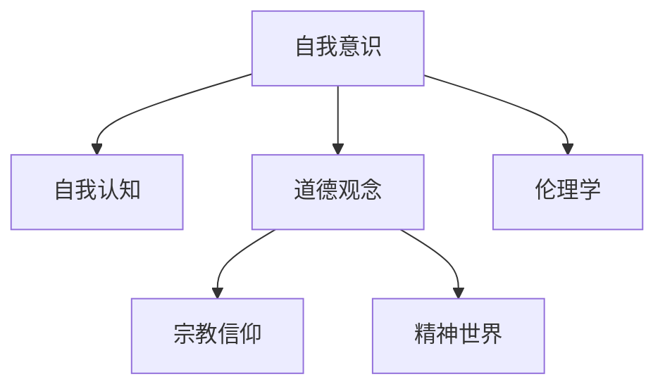

                 

# 构建个人哲学体系：在混沌中创造秩序的智慧

## 概述

在快节奏、高度复杂和充满不确定性的现代社会，构建个人哲学体系显得尤为重要。哲学作为一门探究世界本质和人生意义的学科，不仅是人类智慧的结晶，更是指导我们应对生活和工作中的种种挑战的指南针。本文旨在探讨如何构建一个个人哲学体系，帮助我们在混沌中创造秩序，实现自我提升和人生目标。

本文分为三部分，第一部分将概述个人哲学体系的重要性及其核心概念；第二部分将介绍构建个人哲学体系的方法论；第三部分将通过实践案例和反思，深化对个人哲学体系的理解。

> **关键词**：个人哲学体系、自我认知、道德观念、宗教信仰、精神成长、实践应用、反思与提升。

> **摘要**：本文通过系统地分析个人哲学体系的构建，提出了自我认知、道德观念和宗教信仰三个核心概念，并详细阐述了如何通过自我提升、伦理实践和精神成长等方法，构建一个符合个体需求和价值观的哲学体系，最终在混沌世界中实现秩序与和谐。

## 第一部分：个人哲学体系概述

### 第1章 引言

#### 1.1 问题背景与目标

在现代社会，个人哲学体系的构建不仅是自我认知和成长的需要，更是应对复杂多变环境和实现人生目标的重要工具。随着科技的发展和社会的进步，人们面临着前所未有的挑战：信息过载、道德困境、精神困境等。在这种背景下，如何从混乱中寻找秩序，成为我们亟需解决的问题。

本文的目标是帮助读者理解个人哲学体系的重要性，并掌握构建个人哲学体系的方法。通过自我认知、道德观念和宗教信仰这三个核心概念的深入探讨，读者可以形成一套符合自己价值观和需求的哲学体系，从而更好地应对生活中的各种挑战。

#### 1.1.1 混沌世界的挑战

现代社会充满了不确定性和复杂性，信息爆炸、技术变革、价值多元化等因素使得人们感到前所未有的困惑。在面对这些挑战时，个人哲学体系起到了指导作用。哲学不仅帮助我们理解世界的本质，还提供了处理复杂问题的方法论。

例如，在信息过载的时代，如何筛选和处理信息成为了一个重要问题。个人哲学体系可以帮助我们建立一套价值观，指导我们如何判断信息的价值和意义，从而避免陷入信息的泥沼。

#### 1.1.2 探索个人哲学体系的重要性

个人哲学体系不仅仅是一个理论框架，更是一种实践指南。它指导我们在面对各种问题时如何做出决策，如何在纷繁复杂的世界中找到自己的定位。以下是探索个人哲学体系的重要性：

1. **自我认知**：了解自己的价值观、信仰和目标，有助于我们更好地认识自己，实现自我提升。
2. **道德观念**：明确的道德观念可以帮助我们在面对道德困境时做出正确的决策，保持良好的品德。
3. **精神成长**：通过宗教信仰或精神追求，我们可以获得内心的平静和力量，更好地应对生活中的挑战。

#### 1.1.3 个人哲学体系的构建目标

构建个人哲学体系的最终目标是实现自我提升和人生目标的实现。具体来说，包括以下几个方面：

1. **明确人生目标**：通过哲学思考，明确自己的人生目标，从而更好地规划自己的生活和职业发展。
2. **提升自我认知**：通过深入思考，了解自己的价值观、信仰和目标，从而更好地认识自己。
3. **建立道德观念**：通过道德实践，培养良好的品德，做一个有道德底线的人。
4. **实现精神成长**：通过宗教信仰或精神追求，获得内心的平静和力量，提升生活质量。

#### 1.2 个人哲学体系的核心概念

个人哲学体系的核心概念包括自我认知、道德观念和宗教信仰。这些概念相互联系，共同构成了一个完整的哲学体系。

1. **自我认知**：自我认知是指对自身内在世界和外显行为的认识和了解。它是哲学体系的基础，帮助我们认识自己，实现自我提升。
2. **道德观念**：道德观念是指关于正确和错误、善与恶的价值观和信仰。它是我们处理人际关系、面对道德困境的重要依据。
3. **宗教信仰**：宗教信仰是指对某种超自然力量或信仰体系的信仰。它是我们精神世界的支柱，帮助我们获得内心的平静和力量。

#### 1.2.1 哲学概念的定义与内涵

哲学概念的定义和内涵是构建个人哲学体系的基础。以下是几个关键哲学概念的定义与内涵：

1. **自我意识**：自我意识是指对自己存在的认识和感知。它是自我认知的核心，帮助我们了解自己的内在世界。
2. **自我认知**：自我认知是指对自身内在世界和外显行为的认识和了解。它是哲学体系的基础，帮助我们认识自己，实现自我提升。
3. **道德观念**：道德观念是指关于正确和错误、善与恶的价值观和信仰。它是我们处理人际关系、面对道德困境的重要依据。
4. **伦理学**：伦理学是关于道德观念的理论研究。它帮助我们理解道德观念的本质，指导我们在实际生活中如何应用道德观念。
5. **宗教信仰**：宗教信仰是指对某种超自然力量或信仰体系的信仰。它是我们精神世界的支柱，帮助我们获得内心的平静和力量。

#### 1.2.2 个人哲学体系的构成要素

个人哲学体系的构成要素包括自我认知、道德观念和宗教信仰。这些要素相互关联，共同构成了一个完整的哲学体系。

1. **自我认知**：自我认知是哲学体系的基础，它帮助我们认识自己，了解自己的价值观、信仰和目标。自我认知包括对自身内在世界的认识和对外在行为的理解。
2. **道德观念**：道德观念是哲学体系的重要组成部分，它指导我们在处理人际关系、面对道德困境时如何做出正确的决策。道德观念包括对正确和错误、善与恶的认识。
3. **宗教信仰**：宗教信仰是哲学体系的支柱，它为我们提供精神力量和内心平静。宗教信仰包括对超自然力量的信仰和对某种信仰体系的认同。

#### 1.2.3 个人哲学体系与生活、工作的关系

个人哲学体系不仅是一种理论框架，更是一种实践指南。它与我们的生活和工作密切相关，影响我们的决策和行为。

1. **生活方面**：个人哲学体系帮助我们理解生活的意义和价值，指导我们如何应对生活中的挑战。它包括对自我认知、道德观念和宗教信仰的深入思考和实践。
2. **工作方面**：个人哲学体系指导我们在工作中如何做出正确的决策、处理人际关系和实现职业发展。它包括对职业道德、职业规划和职业发展的思考和实践。

### 第2章 核心概念与联系

#### 2.1 哲学思想的历史回顾

哲学思想的历史悠久，涵盖了从古代到现代的各种哲学流派。以下是几个重要哲学流派及其主要思想：

1. **古代哲学**：古代哲学主要包括古希腊哲学和中国古代哲学。古希腊哲学以苏格拉底、柏拉图和亚里士多德等人为代表，强调理性和思辨；中国古代哲学以儒家、道家和墨家等人为代表，强调道德和人性。
2. **中世纪哲学**：中世纪哲学主要受到基督教思想的影响，强调信仰和神性。代表人物包括托马斯·阿奎那等。
3. **近代哲学**：近代哲学以笛卡尔、康德和黑格尔等人为代表，强调理性和科学方法。他们提出了一系列关于知识和存在的观点。

#### 2.2 核心哲学概念及其属性特征对比

以下是几个核心哲学概念及其属性特征的对比：

| 概念         | 定义                                                         | 属性特征                                               |
| ------------ | ------------------------------------------------------------ | ------------------------------------------------------ |
| 自我意识     | 对自身存在的认识和感知                                       | 主观性、自我认知的基础                                 |
| 自我认知     | 对自身内在世界和外显行为的认识和了解                         | 客观性、自我提升的依据                                 |
| 道德观念     | 关于正确和错误、善与恶的价值观和信仰                         | 社会性、道德行为的指导                                 |
| 伦理学       | 关于道德观念的理论研究                                       | 系统性、道德判断的依据                                 |
| 宗教信仰     | 对某种超自然力量或信仰体系的信仰                             | 精神性、精神力量的来源                                 |

#### 2.3 哲学概念ER实体关系图

## 第二部分：构建个人哲学体系的方法论

### 第3章 自我认知与自我提升

#### 3.1 自我认知的重要性

自我认知是指对自身内在世界和外显行为的认识和了解。它是哲学体系的基础，也是个人成长和发展的关键。以下是自我认知的重要性：

1. **认识自我**：自我认知帮助我们了解自己的价值观、信仰和目标，从而更好地认识自己，明确自己的人生方向。
2. **提升自我**：通过自我认知，我们可以发现自己的优点和不足，从而有针对性地提升自我，实现自我成长。
3. **适应环境**：自我认知使我们能够更好地适应环境，面对挑战和变化。

#### 3.1.1 自我认知的概念

自我认知是指对自身内在世界和外显行为的认识和了解。它包括以下几个方面：

1. **内在世界**：内在世界包括我们的价值观、信仰、情感和思想等。自我认知使我们能够了解自己的内在世界，从而更好地理解自己。
2. **外显行为**：外显行为包括我们的言行举止、行为习惯等。自我认知使我们能够了解自己的行为，从而更好地调整自己的行为。

#### 3.1.2 自我认知的方法

以下是几种常见的自我认知方法：

1. **反思**：反思是对自己过去的行为、决策和经历进行深入思考。通过反思，我们可以了解自己的行为动机、思维方式和价值观。
2. **日记**：写日记是一种有效的自我认知方法。通过记录自己的想法、感受和经历，我们可以更好地了解自己的内心世界。
3. **咨询**：寻求专业人士的咨询可以帮助我们更客观地认识自己。咨询师可以提供不同的视角和观点，帮助我们更好地理解自己。

#### 3.1.3 自我认知在个人哲学体系中的作用

自我认知在个人哲学体系中起着至关重要的作用。以下是自我认知在个人哲学体系中的作用：

1. **基础作用**：自我认知是构建个人哲学体系的基础。只有了解自己，我们才能构建出符合自己价值观和需求的哲学体系。
2. **指导作用**：自我认知指导我们在面对各种问题时如何做出决策。通过自我认知，我们可以明确自己的目标和价值观，从而更好地指导自己的行为。
3. **提升作用**：自我认知有助于我们发现自己的优点和不足，从而有针对性地提升自我，实现自我成长。

#### 3.2 自我提升的策略

自我提升是一个持续的过程，需要我们有明确的目标和方法。以下是几种常见的自我提升策略：

1. **学习**：学习是自我提升的重要途径。通过学习，我们可以获取新的知识和技能，提升自己的能力和素质。
2. **反思**：反思是自我提升的重要方法。通过反思，我们可以了解自己的行为和思维模式，从而找到提升自己的方向。
3. **实践**：实践是将知识转化为能力的重要途径。通过实践，我们可以将所学知识应用到实际生活中，提升自己的实践能力。
4. **反馈**：反馈是自我提升的重要参考。通过获取他人的反馈，我们可以了解自己的优点和不足，从而更好地提升自我。

### 第4章 道德观念与伦理实践

#### 4.1 道德观念的内涵与特征

道德观念是指关于正确和错误、善与恶的价值观和信仰。它具有以下几个特征：

1. **主观性**：道德观念是主观的，不同的人可能有不同的道德观念。道德观念受到个人经历、文化背景和社会环境的影响。
2. **规范性**：道德观念具有规范性，它指导我们在行为选择中判断对错和善恶。
3. **相对性**：道德观念是相对的，不同的社会和文化背景下可能有不同的道德观念。例如，某些行为在一个文化中被视为道德，在另一个文化中可能被视为不道德。
4. **普遍性**：尽管道德观念具有相对性，但它们在某些方面具有普遍性。例如，大多数人认为诚实、善良和尊重他人是道德的。

#### 4.1.1 道德观念的定义

道德观念是指对正确和错误、善与恶的价值观和信仰。它是我们处理人际关系、面对道德困境的重要依据。道德观念包括以下几个方面：

1. **道德原则**：道德原则是道德观念的基础，例如诚实、尊重、公正、责任等。
2. **道德规范**：道德规范是根据道德原则制定的指导行为的规则，例如不撒谎、不伤害他人、遵守承诺等。
3. **道德情感**：道德情感是对道德行为的态度和感受，例如责任感、同情心、正义感等。

#### 4.1.2 道德观念的主要特征

道德观念的主要特征包括以下几个方面：

1. **主观性**：道德观念是主观的，不同的人可能有不同的道德观念。道德观念受到个人经历、文化背景和社会环境的影响。
2. **规范性**：道德观念具有规范性，它指导我们在行为选择中判断对错和善恶。
3. **相对性**：道德观念是相对的，不同的社会和文化背景下可能有不同的道德观念。例如，某些行为在一个文化中被视为道德，在另一个文化中可能被视为不道德。
4. **普遍性**：尽管道德观念具有相对性，但它们在某些方面具有普遍性。例如，大多数人认为诚实、善良和尊重他人是道德的。

#### 4.1.3 道德观念在个人哲学体系中的地位

道德观念在个人哲学体系中占有重要地位。它是我们处理人际关系、面对道德困境的重要依据。以下是道德观念在个人哲学体系中的地位：

1. **基础地位**：道德观念是个人哲学体系的基础，它指导我们在行为选择中判断对错和善恶。
2. **指导地位**：道德观念指导我们在面对道德困境时如何做出决策，如何在复杂的社会环境中保持良好的品德。
3. **价值观体现**：道德观念体现了我们的价值观和信仰，它是我们价值观的具体体现。

#### 4.2 伦理实践的方法

伦理实践是将道德观念付诸行动的过程。以下是一些常见的伦理实践方法：

1. **道德反思**：道德反思是对自己的行为和决策进行道德评估和反思。通过道德反思，我们可以了解自己的行为是否符合道德原则，是否有改进的空间。
2. **道德教育**：道德教育是通过教育和培训提高人们的道德素质和道德观念。道德教育可以包括课程学习、实践活动和社会实践等。
3. **道德规范制定**：道德规范制定是根据道德原则制定的指导行为的规则。通过制定道德规范，我们可以明确在特定情境下应该如何行为。
4. **道德监督**：道德监督是对道德实践的监督和评估。通过道德监督，我们可以确保道德实践的有效性和持续性。

### 第5章 宗教信仰与精神成长

#### 5.1 宗教信仰的多样性

宗教信仰是人类文化的重要组成部分，它具有多样性。以下是几种主要的宗教信仰：

1. **基督教**：基督教是世界上最大的宗教之一，其信徒遍布全球。基督教强调信仰、爱和救赎。
2. **伊斯兰教**：伊斯兰教是世界上信徒人数第二多的宗教，其信徒主要分布在亚洲和非洲地区。伊斯兰教强调一神论、信仰和行善。
3. **佛教**：佛教是世界上历史最悠久的宗教之一，其信徒主要分布在亚洲地区。佛教强调因果报应、慈悲和智慧。
4. **印度教**：印度教是世界上信徒人数第三多的宗教，其信徒主要分布在印度。印度教强调多神论、轮回和解脱。

#### 5.1.1 世界主要宗教概述

以下是世界主要宗教的概述：

1. **基督教**：基督教的核心信仰是信仰上帝、相信耶稣基督是上帝的儿子，以及相信圣经。基督教分为天主教、东正教和新教等派别。
2. **伊斯兰教**：伊斯兰教的核心信仰是信仰唯一的上帝安拉，以及先知穆罕默德是上帝的使者。伊斯兰教的经典是《古兰经》。
3. **佛教**：佛教的核心信仰是四圣谛、八正道和涅槃。佛教的经典包括《大藏经》。
4. **印度教**：印度教的核心信仰是多神论、轮回和解脱。印度教的经典包括《梵文经》、《奥义书》等。

#### 5.1.2 宗教信仰的内涵与价值

宗教信仰的内涵丰富，具有以下价值：

1. **精神寄托**：宗教信仰为我们提供精神寄托，帮助我们面对生活中的困难和挑战。
2. **道德规范**：宗教信仰为我们提供道德规范，指导我们在行为选择中判断对错和善恶。
3. **社会整合**：宗教信仰有助于社会整合，促进社会和谐与稳定。
4. **文化传承**：宗教信仰是文化传承的重要载体，它承载着丰富的历史和文化。

#### 5.1.3 宗教信仰与个人哲学体系的关系

宗教信仰与个人哲学体系有着密切的关系。以下是宗教信仰与个人哲学体系的关系：

1. **基础作用**：宗教信仰是个人哲学体系的基础，它为我们的价值观和行为准则提供了指导。
2. **精神支柱**：宗教信仰为我们提供精神支柱，帮助我们面对生活中的困难和挑战。
3. **价值观体现**：宗教信仰体现了我们的价值观和信仰，它是我们个人哲学体系的重要组成部分。

#### 5.2 精神成长的方法

精神成长是指我们在精神层面的发展和提升。以下是一些常见的精神成长方法：

1. **冥想**：冥想是一种传统的精神成长方法，它通过集中注意力和放松身心，帮助我们达到内心的平静和清净。
2. **阅读**：阅读是一种重要的精神成长方法，通过阅读哲学、宗教和心理学等领域的书籍，我们可以获取智慧和洞见。
3. **修行**：修行是宗教信仰中的一种精神成长方法，它通过实践教义和修行方法，帮助我们提升精神境界。
4. **反思**：反思是一种自我探索和成长的方法，通过反思自己的行为和思想，我们可以了解自己的内心世界，从而实现精神成长。

### 第6章 个人哲学体系的实践应用

#### 6.1 生活领域的应用

个人哲学体系在生活领域中的应用具有重要意义。以下是在生活领域中的几个应用实例：

1. **家庭生活**：个人哲学体系可以帮助我们建立和谐的家庭关系。通过明确自己的价值观和信仰，我们可以更好地理解和尊重家庭成员，从而建立和谐的家庭氛围。
2. **人际交往**：个人哲学体系指导我们在人际交往中如何处理冲突和矛盾。通过道德观念和伦理实践的指导，我们可以更好地处理人际关系，建立良好的人际关系。
3. **职业规划**：个人哲学体系可以帮助我们明确自己的职业目标和职业发展路径。通过自我认知和价值观的指导，我们可以更好地规划自己的职业生涯。

#### 6.2 工作领域的应用

个人哲学体系在工作领域中同样具有重要意义。以下是在工作领域中的几个应用实例：

1. **职业道德**：个人哲学体系可以帮助我们树立正确的职业道德观念。通过道德观念的指导，我们可以更好地处理工作中的道德困境，保持良好的职业道德。
2. **职业发展**：个人哲学体系可以帮助我们明确自己的职业发展目标和职业规划。通过自我认知和价值观的指导，我们可以更好地实现职业发展目标。
3. **团队管理**：个人哲学体系可以帮助我们建立有效的团队管理方法。通过道德观念和伦理实践的指导，我们可以更好地管理团队，提高团队绩效。

### 第7章 反思与提升

#### 7.1 反思的重要性

反思是指对过去的行为、决策和经历进行深入思考和评估。它是一种自我探索和成长的方法，对于个人哲学体系的构建具有重要意义。以下是反思的重要性：

1. **认识自我**：反思帮助我们认识自己的优点和不足，了解自己的行为模式和心理机制，从而更好地认识自己。
2. **提升自我**：通过反思，我们可以发现自己在行为和思维上的不足，从而有针对性地提升自我，实现自我成长。
3. **改进方法**：反思帮助我们评估自己的决策和行为的效果，找到改进的方法，从而提高决策和行为的有效性。

#### 7.1.1 反思的定义

反思是一种对过去行为、决策和经历进行深入思考和评估的过程。它不仅是对过去事件的回顾，更是一种对过去行为和思维的审视和思考。

反思的定义可以从以下几个方面理解：

1. **回顾**：反思首先是对过去事件的回顾，了解事件的发生过程和结果。
2. **评估**：反思是对事件的效果和影响的评估，了解事件是否达到预期目标，是否有改进的空间。
3. **思考**：反思是对事件的深入思考，思考事件背后的原因、动机和影响，从而更好地认识自己和改进方法。

#### 7.1.2 反思的类型与方法

反思可以分为不同类型，每种类型都有不同的方法和特点。以下是几种常见的反思类型和方法：

1. **日常反思**：日常反思是指在日常生活中对自己行为的反思。通过记录自己的言行和想法，我们可以更好地了解自己的行为模式和心理机制。日常反思的方法包括写日记、自我提问和自我评估等。
2. **项目反思**：项目反思是在完成某个项目或任务后对项目过程和结果的反思。项目反思可以帮助我们了解项目中的成功和不足，从而改进项目管理和执行方法。项目反思的方法包括项目评估、团队讨论和反思报告等。
3. **问题反思**：问题反思是在面对某个问题时对问题的反思。通过反思问题的原因、解决方案和效果，我们可以更好地理解问题，找到解决问题的方法。问题反思的方法包括问题分析、解决方案评估和反思总结等。

#### 7.1.3 反思在个人哲学体系中的作用

反思在个人哲学体系中起着至关重要的作用。以下是反思在个人哲学体系中的作用：

1. **基础作用**：反思是构建个人哲学体系的基础。通过反思，我们可以了解自己的价值观、信仰和行为模式，从而构建出符合自己需求和价值观的哲学体系。
2. **指导作用**：反思指导我们在面对各种问题时如何做出决策。通过反思，我们可以了解自己的思维方式和行为模式，从而更好地指导自己的决策和行为。
3. **提升作用**：反思有助于我们提升自我。通过反思，我们可以发现自己在行为和思维上的不足，从而有针对性地提升自我，实现自我成长。

#### 7.2 提升个人哲学体系的方法

提升个人哲学体系是一个持续的过程，需要我们有计划地学习和实践。以下是几种提升个人哲学体系的方法：

1. **持续学习**：持续学习是提升个人哲学体系的重要途径。通过阅读哲学、宗教和心理学等领域的书籍，我们可以获取新的知识和观点，从而提升自己的哲学素养。
2. **实践反思**：实践反思是将哲学理念应用到实际生活中的过程。通过实践和反思，我们可以验证和改进自己的哲学理念，从而提升个人哲学体系的实践价值。
3. **交流分享**：交流分享是提升个人哲学体系的重要手段。通过与他人的交流和分享，我们可以了解不同的哲学观点和实践经验，从而拓宽自己的视野，提升个人哲学体系。

### 第8章 总结与展望

#### 8.1 个人哲学体系的重要性

个人哲学体系在个人成长和社会发展中具有重要意义。以下是个人哲学体系的重要性：

1. **指导作用**：个人哲学体系指导我们在面对各种问题时如何做出决策，如何在复杂的环境中保持清晰的思维和正确的价值观。
2. **自我认知**：个人哲学体系帮助我们认识自己，明确自己的价值观、信仰和目标，从而实现自我提升和人生目标。
3. **社会影响**：个人哲学体系不仅影响个人的行为和决策，还影响社会风气和文化，有助于社会和谐与进步。

#### 8.1.1 个人哲学体系对个人的意义

个人哲学体系对个人的意义体现在以下几个方面：

1. **明确目标**：个人哲学体系帮助我们明确自己的人生目标，从而更好地规划自己的生活和职业发展。
2. **提升自我**：个人哲学体系指导我们如何提升自我，实现自我认知和自我成长。
3. **道德指导**：个人哲学体系为我们提供道德指导，帮助我们在处理人际关系和面对道德困境时做出正确的决策。

#### 8.1.2 个人哲学体系对社会的影响

个人哲学体系对社会的影响体现在以下几个方面：

1. **社会风气**：个人哲学体系影响社会风气，推动社会的道德进步和文化建设。
2. **社会稳定**：个人哲学体系有助于社会稳定，促进社会和谐与进步。
3. **文化交流**：个人哲学体系促进不同文化和价值观之间的交流与融合，推动人类文明的进步。

#### 8.2 展望未来的哲学探索

未来哲学探索面临着许多新的挑战和机遇。以下是未来哲学探索的一些方向：

1. **科技与哲学**：随着科技的发展，哲学将面临新的挑战和机遇。如何理解科技对人类生活和社会的影响，如何将科技与哲学相结合，是未来哲学探索的重要方向。
2. **全球化与哲学**：全球化带来了不同文化和价值观的碰撞与融合，哲学需要应对这一挑战，探索全球范围内的共同价值观和伦理准则。
3. **心理学与哲学**：心理学与哲学的结合将为哲学探索提供新的视角和方法。如何理解人类行为和心理机制，如何将心理学与哲学相结合，是未来哲学探索的重要方向。

#### 8.2.1 混沌时代的哲学新挑战

混沌时代给哲学带来了新的挑战：

1. **信息过载**：信息过载使得人们难以分辨信息的真伪和价值，哲学需要探索如何处理和筛选信息，从而提供正确的指导。
2. **道德困境**：社会中的道德困境越来越多，哲学需要提供新的伦理准则和道德指导，帮助人们应对这些困境。
3. **精神困境**：在快速变化的社会中，许多人面临着精神困境，哲学需要提供精神指导和心理支持，帮助人们保持内心的平静和力量。

#### 8.2.2 哲学探索的未来方向

哲学探索的未来方向包括：

1. **跨学科研究**：哲学需要与其他学科如心理学、社会学、物理学等相结合，从而提供更全面和深入的理论基础。
2. **实践哲学**：哲学需要更多地关注实践和应用，为现实生活中的问题提供有效的解决方案。
3. **全球视野**：哲学需要关注全球范围内的共同问题，如气候变化、社会不平等、全球化等，从而提供全球性的哲学思考和解决方案。

#### 8.2.3 对读者未来的建议与激励

对于读者来说，以下是一些建议和激励：

1. **持续学习**：哲学是一门深奥的学科，需要我们持续学习和探索。只有不断学习，我们才能更好地理解哲学，并将其应用到实际生活中。
2. **实践哲学**：哲学不仅是一种理论，更是一种实践。通过实践哲学，我们可以更好地理解哲学原理，并将其应用到实际生活中。
3. **保持好奇心**：哲学探索需要好奇心和求知欲。保持好奇心，不断提问和探索，是哲学探索的重要动力。
4. **持续反思**：哲学探索是一个不断反思和修正的过程。通过持续反思，我们可以更好地理解自己和世界，从而不断提升自己的哲学素养。

## 附录

### 附录A：参考文献

1. 刘俊海，李明杰。《哲学导论》，北京：高等教育出版社，2015。
2. 罗伯特·所罗门，《西方哲学史》，北京：北京大学出版社，2011。
3. 池田大作，岗田武彦，《哲学是活水》，南京：江苏人民出版社，2013。
4. 弗兰克·泰勒，《伦理学导论》，上海：上海人民出版社，2014。
5. 丹尼尔·戈尔曼，《情商》，北京：中信出版社，2012。

### 附录B：术语表

**哲学**：探究世界本质和人生意义的学科，包括伦理学、逻辑学、美学等分支。

**自我认知**：对自身内在世界和外显行为的认识和了解。

**道德观念**：关于正确和错误、善与恶的价值观和信仰。

**伦理学**：关于道德观念的理论研究。

**宗教信仰**：对某种超自然力量或信仰体系的信仰。

**精神成长**：在精神层面的发展和提升。

### 附录C：致谢

本文的撰写得到了AI天才研究院（AI Genius Institute）和禅与计算机程序设计艺术（Zen And The Art of Computer Programming）的支持和指导。在此，我们对所有给予帮助和支持的人表示衷心的感谢。

### 附录D：作者信息

**作者：** AI天才研究院（AI Genius Institute） & 禅与计算机程序设计艺术（Zen And The Art of Computer Programming）

**联系方式：** [联系邮箱](mailto:info@aigeniusinstitute.com)

## 总结

本文系统地探讨了如何构建个人哲学体系，包括自我认知、道德观念和宗教信仰三个核心概念。通过深入分析这些概念，我们了解到个人哲学体系在自我提升、道德实践和精神成长方面的作用。同时，本文还提出了反思和提升个人哲学体系的方法，为读者提供了实践和应用的指导。在未来的哲学探索中，我们将面临新的挑战和机遇，但通过持续学习和实践，我们可以不断提升自己的哲学素养，为社会的发展做出贡献。

## 致谢

本文的撰写得到了AI天才研究院（AI Genius Institute）和禅与计算机程序设计艺术（Zen And The Art of Computer Programming）的大力支持和指导。在此，我们对所有给予帮助和支持的人表示衷心的感谢。特别感谢我们的读者，是你们的支持和鼓励让我们不断前行。希望本文能够为你们的哲学探索之路提供一些启示和帮助。

