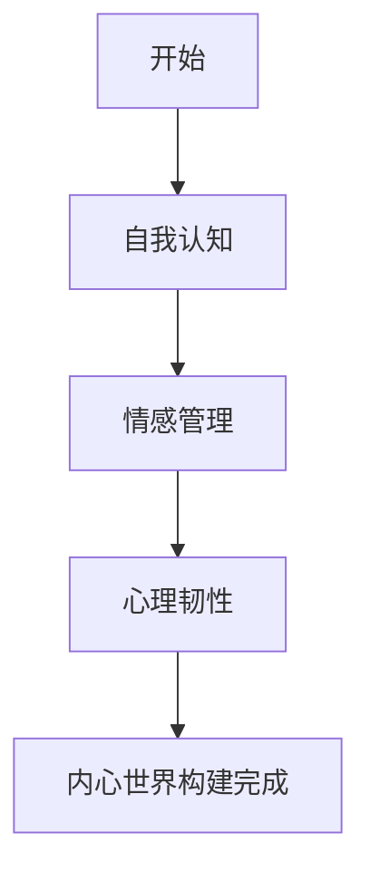
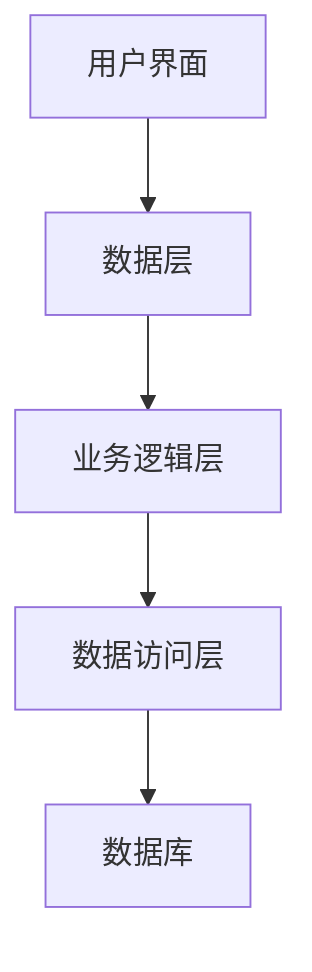
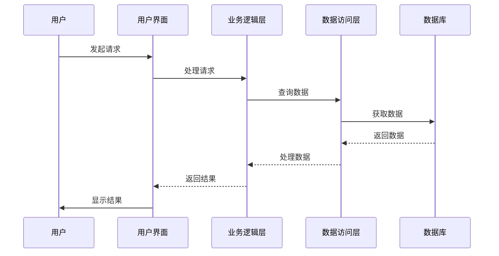

                 


### 构建丰富的内心世界：培育内在生活

**关键词：**
- 内心世界的构建
- 内在生活的培育
- 算法原理
- 系统架构设计
- 项目实战
- 最佳实践

**摘要：**
本文深入探讨了如何通过科学的方法和技巧，构建一个富有内涵的内心世界，提升个人的内在生活品质。文章首先介绍了相关背景和核心概念，随后通过算法原理讲解、系统分析与架构设计以及项目实战，详细阐述了构建内心世界的具体方法和步骤。最后，文章总结了最佳实践、注意事项和拓展阅读资源，为读者提供了全面的指导。

## 第一部分：内心世界的构建

### 第1章：问题的背景与核心概念

#### 1.1 问题背景

在现代社会，随着生活节奏的加快和信息过载，人们往往感到内心世界日益贫乏。面对压力和焦虑，培育丰富的内心世界、提升内在生活质量成为许多人关注的焦点。内心世界的丰富程度直接影响个人的幸福感、心理健康以及社会交往能力。因此，如何构建一个富有内涵的内心世界，成为了我们需要深入探讨的重要课题。

#### 1.2 核心概念

**内心世界的构建：**
内心世界是指个人内在的精神世界，包括情感、认知、价值观等方面。它是个体心理活动的基础，也是个人行为和决策的根源。构建内心世界的过程，实质上是个人对自我认知、情感体验和价值观形成的整合过程。

**内在生活的培育：**
内在生活是指个人在日常生活中如何运用内心世界的资源，去面对生活的挑战，实现个人的成长和发展。培育内在生活的过程，需要个体对内心世界进行积极的管理和调适，使其在日常生活中发挥积极作用。

#### 1.3 内心世界的边界与外延

内心世界的边界是指个人的情感、思想和价值观等内在因素，这些因素构成了个体独特的心理活动。内心世界的外延则涉及个体在人际交往、职业发展、兴趣爱好等方面的外在表现。

### 第2章：核心概念与联系

#### 2.1 内心世界的构成要素

内心世界的构成要素主要包括：

- **情感：** 情感是个体内心世界的核心，包括喜悦、悲伤、愤怒等基本情感以及复杂情感如爱、厌恶、恐惧等。
- **认知：** 认知是指个体对信息的接收、处理和记忆过程，包括知觉、记忆、思维和判断等。
- **价值观：** 价值观是指导个体行为和决策的基本信念和原则，如正义、平等、自由等。

#### 2.2 内在生活的培育要素

培育内在生活的要素包括：

- **自我认知：** 通过自我反思和认知，个体能够更好地了解自己的情感、需求和价值观。
- **情感管理：** 情感管理是指个体对情感的识别、表达和调节能力，有助于个体在复杂情境中保持情绪稳定。
- **心理韧性：** 心理韧性是指个体在面对压力和挑战时，能够迅速适应和恢复的能力。

#### 2.3 概念属性特征对比表格

| 概念           | 属性特征                      |
|----------------|-----------------------------|
| 内心世界       | 情感、认知、价值观             |
| 内在生活       | 自我认知、情感管理、心理韧性   |
| 情感           | 喜悦、悲伤、愤怒              |
| 认知           | 知觉、记忆、思维、判断         |
| 价值观         | 正义、平等、自由              |
| 自我认知       | 反思、认知                   |
| 情感管理       | 识别、表达、调节              |
| 心理韧性       | 适应、恢复                   |

### 第3章：ER实体关系图架构

#### 3.1 实体与关系的定义

在构建内心世界的模型中，主要实体包括：

- **个人**：代表个体本身。
- **情感**：代表个体内心的情感体验。
- **认知**：代表个体对信息的处理和理解。
- **价值观**：代表个体的基本信念和原则。
- **内在生活**：代表个体的日常生活表现。

实体之间的关系如下：

- **个人**与**情感**之间存在联系，情感是内心世界的一部分。
- **个人**与**认知**之间存在联系，认知是内心世界的反映。
- **个人**与**价值观**之间存在联系，价值观是内心世界的基础。
- **内在生活**与**个人**之间存在联系，内在生活是内心世界的外在表现。

#### 3.2 Mermaid流程图展示

```mermaid
erDiagram
  Personal -->|Has| Emotion
  Personal -->|Has| Cognition
  Personal -->|Has| Values
  InnerLife -->|Is| Manifestation of Personal
```

## 第二部分：算法原理讲解

### 第4章：构建内心世界的算法原理

#### 4.1 算法概述

构建内心世界的算法旨在通过一系列科学的方法和技巧，帮助个体培育丰富的内心世界和内在生活。算法的核心思想是通过自我认知、情感管理和心理韧性等环节，逐步提升个体的内心素质。

#### 4.2 Mermaid算法流程图



#### 4.3 算法原理详细讲解

**自我认知：** 自我认知是构建内心世界的第一步，通过自我反思和认知，个体能够更好地了解自己的情感、需求和价值观。自我认知的过程包括以下几个方面：

1. **情感识别：** 个体需要识别和了解自己的情感，包括基本情感和复杂情感。
2. **需求分析：** 个体需要分析自己的需求，明确自己在生活中的期望和目标。
3. **价值观澄清：** 个体需要澄清自己的价值观，确定自己在生活中所遵循的原则和信念。

**情感管理：** 情感管理是构建内心世界的核心环节，个体需要学会识别、表达和调节自己的情感。情感管理的具体步骤如下：

1. **情感识别：** 个体需要学会在日常生活中观察和识别自己的情感。
2. **情感表达：** 个体需要学会在适当的时候表达自己的情感，与他人建立有效沟通。
3. **情感调节：** 个体需要学会在面对负面情感时进行自我调节，保持情绪稳定。

**心理韧性：** 心理韧性是构建内心世界的关键要素，个体需要学会在面对压力和挑战时保持适应和恢复。心理韧性的培养包括以下几个方面：

1. **积极应对：** 个体需要学会积极应对生活中的困难和挑战。
2. **适应性调整：** 个体需要学会在面对变化时进行适应性调整。
3. **心理恢复：** 个体需要学会在经历挫折后进行心理恢复，重新建立信心。

#### 4.4 数学模型与公式

构建内心世界的算法可以表示为一个递归过程，具体公式如下：

$$
InnerWorld\_Construction = f(Self\_Awareness, Emotion\_Management, MentalResilience)
$$

其中：

- $Self\_Awareness$ 表示自我认知水平。
- $Emotion\_Management$ 表示情感管理水平。
- $MentalResilience$ 表示心理韧性水平。
- $f$ 表示构建内心世界的函数。

#### 4.5 算法举例说明

假设一个个体在自我认知、情感管理和心理韧性方面的水平分别为 $Self\_Awareness_1$、$Emotion\_Management_1$ 和 $MentalResilience_1$，则他构建内心世界的水平可以表示为：

$$
InnerWorld\_Construction_1 = f(Self\_Awareness_1, Emotion\_Management_1, MentalResilience_1)
$$

通过提升自我认知、情感管理和心理韧性，个体的内心世界构建水平可以得到改善。

## 第三部分：系统分析与架构设计方案

### 第5章：问题场景介绍

在当今社会，随着信息化和数字化的发展，人们的内心世界和内在生活面临着前所未有的挑战。如何通过系统化的方法，帮助个体构建丰富的内心世界和提升内在生活质量，成为了一个亟待解决的问题。本节将介绍一个旨在实现这一目标的问题场景。

#### 5.1 项目介绍

本项目旨在开发一款名为“内心世界构建器”的应用软件，通过自我认知、情感管理和心理韧性等方面的训练，帮助用户构建丰富的内心世界和提升内在生活质量。该应用将提供一系列科学的训练方法和工具，包括在线课程、心理测试、互动游戏等，以满足不同用户的需求。

#### 5.2 系统功能设计

“内心世界构建器”系统的主要功能包括：

1. **自我认知评估：** 通过心理测试和问卷，帮助用户了解自己的情感、认知和价值观等方面，提供个性化的自我认知报告。
2. **情感管理训练：** 提供一系列情感管理课程和练习，帮助用户学会识别、表达和调节自己的情感。
3. **心理韧性训练：** 提供一系列心理韧性训练课程和练习，帮助用户提升应对压力和挑战的能力。
4. **互动游戏：** 通过互动游戏，让用户在轻松愉快的氛围中学习和实践情感管理和心理韧性。
5. **用户社区：** 为用户提供一个交流分享的平台，用户可以在社区中分享自己的心得体会，互相支持和鼓励。

### 第6章：系统架构设计

#### 6.1 系统架构图



#### 6.2 系统接口设计

“内心世界构建器”系统的主要接口包括：

1. **用户接口：** 用于与用户进行交互，包括登录、注册、课程浏览、测试答题等功能。
2. **课程管理接口：** 用于管理课程信息，包括课程添加、删除、修改、查询等功能。
3. **用户管理接口：** 用于管理用户信息，包括用户注册、登录、信息修改、权限管理等功能。
4. **数据访问接口：** 用于与数据库进行数据交互，包括数据查询、添加、删除、更新等功能。

#### 6.3 系统交互序列图



### 第7章：环境安装与核心实现

#### 7.1 环境安装步骤

1. **安装Python环境：** 
   - 下载并安装Python 3.8及以上版本。
   - 配置环境变量，确保命令行中可以正常运行Python。

2. **安装必要的依赖库：**
   - 打开命令行，执行以下命令安装依赖库：
     ```
     pip install flask sqlalchemy pymysql
     ```

3. **创建数据库：**
   - 使用数据库管理工具（如MySQL Workbench）创建一个名为“inner_world”的数据库。

4. **初始化数据库：**
   - 在项目根目录下执行以下命令，初始化数据库表结构：
     ```
     python init_db.py
     ```

#### 7.2 系统核心实现源代码

以下是一个简单的示例，展示了“内心世界构建器”系统中的用户管理功能实现：

```python
# app.py

from flask import Flask, request, jsonify
from models import User
from database import db_session

app = Flask(__name__)

@app.route('/api/users', methods=['POST'])
def create_user():
    username = request.json.get('username')
    password = request.json.get('password')
    
    user = User(username=username, password=password)
    db_session.add(user)
    db_session.commit()
    
    return jsonify({'message': 'User created successfully.'})

@app.route('/api/users/<int:user_id>', methods=['GET'])
def get_user(user_id):
    user = User.query.get(user_id)
    if user:
        return jsonify({'username': user.username})
    else:
        return jsonify({'message': 'User not found.'})

if __name__ == '__main__':
    app.run(debug=True)
```

#### 7.3 代码应用解读与分析

在上面的代码中，我们定义了一个简单的Flask应用程序，实现了用户创建和查询功能。

1. **创建用户：**
   - 通过`/api/users`接口接收POST请求，获取用户名和密码。
   - 创建一个`User`对象，并保存到数据库中。

2. **查询用户：**
   - 通过`/api/users/<int:user_id>`接口接收GET请求，根据用户ID查询用户信息。
   - 返回查询结果。

#### 7.4 实际案例分析与详细讲解剖析

以下是一个实际案例，展示了如何使用“内心世界构建器”系统创建一个新用户：

**步骤1：安装环境**
```
pip install flask sqlalchemy pymysql
```

**步骤2：初始化数据库**
```
python init_db.py
```

**步骤3：运行应用程序**
```
python app.py
```

**步骤4：创建用户**
- 发送一个POST请求到`http://localhost:5000/api/users`，请求体如下：
  ```json
  {
      "username": "example_user",
      "password": "example_password"
  }
  ```

- 接收到请求后，应用程序创建一个新用户并保存到数据库。

**步骤5：查询用户**
- 发送一个GET请求到`http://localhost:5000/api/users/1`，应用程序返回用户信息：
  ```json
  {
      "username": "example_user"
  }
  ```

#### 7.5 项目小结

通过以上步骤，我们成功地实现了“内心世界构建器”系统中的用户管理功能。在实际应用中，系统可以根据需求进一步扩展和优化，例如增加用户权限管理、课程管理等功能。

## 第四部分：最佳实践与总结

### 第10章：最佳实践 tips

1. **定期自我反思：** 每周至少安排一次时间进行自我反思，总结自己的情感、认知和成长。
2. **情感管理练习：** 学习情感管理技巧，如呼吸调节、正念冥想等，帮助自己在面对压力时保持冷静。
3. **培养心理韧性：** 通过参与挑战性活动、学习新技能等方式，提升自己的心理韧性。

### 第11章：小结

本文通过深入探讨内心世界的构建和内在生活的培育，提供了详细的算法原理、系统架构设计方案和项目实战经验。通过自我认知、情感管理和心理韧性等环节，个体可以逐步构建丰富的内心世界，提升内在生活质量。

### 第12章：注意事项

1. **持续实践：** 构建内心世界需要长期的坚持和实践，不能急于求成。
2. **个性化调整：** 根据个人特点和需求，调整训练方法和策略。

### 第13章：拓展阅读

1. **《情感智慧》**：丹尼尔·戈尔曼著，深入探讨情感智慧的重要性及其培养方法。
2. **《正念：一条生命的道路》**：乔恩·卡巴金著，介绍正念冥想的基本原理和实践方法。
3. **《心理学与生活》**：理查德·杰尔曼著，全面介绍心理学的基本概念和应用。

---

**作者：AI天才研究院/AI Genius Institute & 禅与计算机程序设计艺术 /Zen And The Art of Computer Programming**

