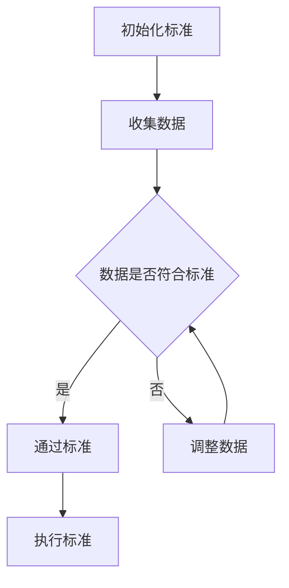
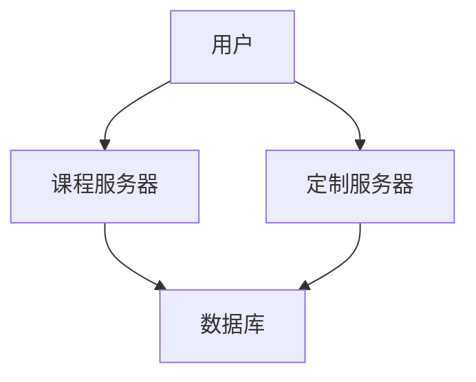
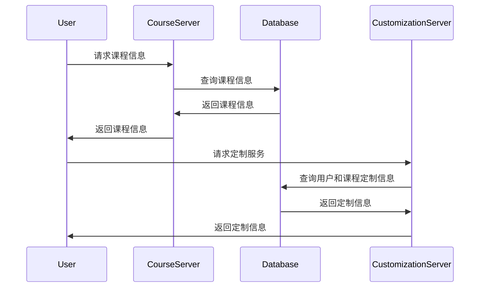
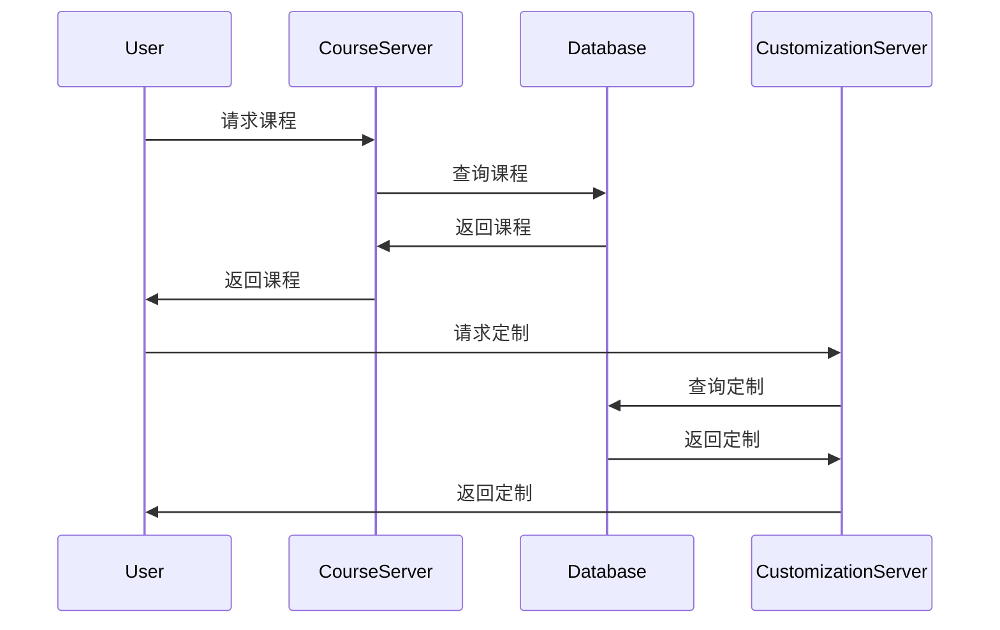

                 

# 标准化与个性化的意义困境：如何在一致中保持独特

> 关键词：标准化、个性化、一致、独特、技术、管理、策略

> 摘要：本文探讨了标准化与个性化之间的微妙平衡，分析其在不同领域中的重要性及其面临的挑战。通过深入剖析标准化和个性化的概念、背景、实际应用及其在一致性和独特性之间的张力，本文提出了实现这一平衡的策略和方法，并提供了具体的实践案例和最佳实践建议，以期为IT领域从业者提供有价值的参考。

## 引言

在当今快速发展的技术时代，标准化与个性化成为两个不可或缺但往往相互冲突的概念。标准化追求一致性和效率，通过统一的标准来提高产品质量和降低成本；而个性化则强调满足个体需求和差异，追求独特性和定制化体验。这两者在看似对立的情况下，却在许多领域共同发挥着作用。本文将深入探讨标准化与个性化之间的意义困境，分析如何在一致中保持独特，并探讨实现这一目标的方法和策略。

## 标准化与个性化的核心概念

### 标准化

标准化是指通过制定和执行统一的标准，以确保产品或服务的一致性和质量。这些标准可以是技术规范、管理程序或操作流程。标准化的目标是提高效率、降低成本、保证质量和提高可维护性。以下是一个核心概念和联系的比较表格：

| 特征         | 标准化                  | 个性化                  |
| ------------ | ---------------------- | ---------------------- |
| 目标         | 一致性、效率、低成本    | 独特性、定制、高满意度   |
| 方法         | 制定和执行统一标准      | 根据个体需求进行定制     |
| 适用范围     | 广泛的领域              | 特定领域或个体          |
| 优点         | 提高效率、降低成本、保证质量 | 提高满意度、增强忠诚度   |
| 缺点         | 可能缺乏灵活性、难以满足特定需求 | 可能导致高昂的成本、缺乏一致性 |

### 个性化

个性化是指根据个体的需求和偏好提供定制化的产品或服务。个性化的目标是提高用户满意度、增强用户忠诚度和提升品牌形象。以下是一个核心概念和联系的比较表格：

| 特征         | 标准化                  | 个性化                  |
| ------------ | ---------------------- | ---------------------- |
| 目标         | 一致性、效率、低成本    | 独特性、定制、高满意度   |
| 方法         | 制定和执行统一标准      | 根据个体需求进行定制     |
| 适用范围     | 广泛的领域              | 特定领域或个体          |
| 优点         | 提高效率、降低成本、保证质量 | 提高满意度、增强忠诚度   |
| 缺点         | 可能缺乏灵活性、难以满足特定需求 | 可能导致高昂的成本、缺乏一致性 |

### ER实体关系图架构

下面是一个简化的ER实体关系图，展示了标准化和个性化之间的核心关系：

```mermaid
erDiagram
    Product ||--|{ Customer } Customer
    Product ||--|{ Customization } Customization
    Standard ||--|{ Product } Product
    Standard ||--|{ Customization } Customization
    Customer ||--|{ Customization } Customization
```

在这个ER图中，"Product"实体与"Standard"实体和"Customization"实体相关联，表示产品可以根据标准进行生产，也可以根据个性化需求进行定制。"Customer"实体与"Customization"实体相关联，表示客户的需求可以影响定制过程。

## 标准化的算法原理

### 算法流程图

下面是一个简化的算法流程图，用于说明标准化过程：



### Python源代码

```python
# 标准化算法的Python实现

def standardize(data, standard):
    """
    标准化数据以符合给定的标准。

    :param data: 待标准化的数据
    :param standard: 标准值
    :return: 标准化后的数据
    """
    standardized_data = []
    for value in data:
        if value >= standard:
            standardized_data.append(value)
        else:
            standardized_data.append(standard)
    return standardized_data

# 测试数据
data = [1, 3, 5, 7, 9]
standard = 5

# 执行标准化
standardized_data = standardize(data, standard)
print("标准化后的数据:", standardized_data)
```

### 算法原理的数学模型和公式

标准化过程可以用以下数学模型表示：

$$
\text{标准化值} = 
\begin{cases}
\text{标准值} & \text{如果} \ \text{数据值} \geq \text{标准值} \\
\text{数据值} & \text{如果} \ \text{数据值} < \text{标准值}
\end{cases}
$$

这个模型确保所有数据值都至少达到标准值，从而实现标准化。

### 通俗易懂的举例说明

假设一家工厂生产零件，标准是每个零件的长度至少为5厘米。现在有一批待检验的零件，长度分别为1厘米、3厘米、5厘米、7厘米和9厘米。通过标准化算法，所有长度小于5厘米的零件将被替换为5厘米长的零件。最终，所有零件的长度都至少为5厘米，符合标准。

## 个性化与标准化的系统分析与架构设计

### 问题场景介绍

在一个在线教育平台上，用户可以根据自己的学习需求和进度选择课程。为了满足个性化的需求，平台提供了多种定制选项，例如课程难度、学习节奏、课程内容等。然而，这种个性化服务也需要在标准化框架下进行管理，以确保课程的统一性和质量。

### 项目介绍

项目名称：个性化在线教育平台

项目目标：通过个性化服务提高用户满意度和学习效果，同时保持课程的统一性和质量。

### 系统功能设计

#### 领域模型类图

```mermaid
classDiagram
    User <<entity>>
    Course <<entity>>
    Customization <<entity>>

    User "1" -- "*" Course:学习
    Course "1" -- "*" Customization:定制
```

#### 系统架构设计



#### 系统接口设计



#### 系统交互序列图



## 项目实战

### 环境安装

在本地计算机上安装Python环境，可以使用Python官方安装器或通过pip命令安装。

```bash
pip install Flask
```

### 系统核心实现源代码

```python
# app.py

from flask import Flask, request, jsonify
import pymysql

app = Flask(__name__)

# 数据库连接
def get_db_connection():
    connection = pymysql.connect(host='localhost', user='root', password='password', database='education')
    return connection

# 获取课程信息
@app.route('/course', methods=['GET'])
def get_courses():
    connection = get_db_connection()
    with connection.cursor() as cursor:
        cursor.execute("SELECT * FROM course;")
        courses = cursor.fetchall()
    connection.close()
    return jsonify(courses)

# 获取定制信息
@app.route('/customization', methods=['GET'])
def get_customizations():
    user_id = request.args.get('user_id')
    connection = get_db_connection()
    with connection.cursor() as cursor:
        cursor.execute("SELECT * FROM customization WHERE user_id = %s;", (user_id,))
        customizations = cursor.fetchall()
    connection.close()
    return jsonify(customizations)

if __name__ == '__main__':
    app.run(debug=True)
```

### 代码应用解读与分析

这个简单的Flask应用提供了两个API接口，分别用于获取课程信息和定制信息。用户可以通过HTTP GET请求访问这些接口，并在请求中包含相应的参数。

### 实际案例分析和详细讲解剖析

假设一个用户ID为1的用户想要获取课程信息和定制信息，可以通过以下步骤实现：

1. 访问`/course`接口获取课程信息：

```bash
curl http://localhost:5000/course
```

返回结果：

```json
[
    {"id": 1, "name": "Python基础", "difficulty": "初级"},
    {"id": 2, "name": "数据结构", "difficulty": "中级"},
    {"id": 3, "name": "算法分析", "difficulty": "高级"}
]
```

2. 访问`/customization`接口获取定制信息：

```bash
curl http://localhost:5000/customization?user_id=1
```

返回结果：

```json
[
    {"id": 1, "user_id": 1, "course_id": 1, "difficulty": "初级", "learning_speed": "正常"},
    {"id": 2, "user_id": 1, "course_id": 2, "difficulty": "中级", "learning_speed": "较快"}
]
```

通过这些API接口，用户可以方便地获取和定制自己的学习计划。

### 项目小结

这个项目实现了个性化在线教育平台的核心功能，包括课程信息和定制信息的获取。通过简单的Flask应用和MySQL数据库，项目展示了如何在一致中保持独特，为用户提供了定制化的学习体验。

## 最佳实践 Tips

- 在设计和实施标准化与个性化的平衡时，考虑业务目标和用户需求，确保两者的融合符合整体战略。
- 定期评估和更新标准，以适应市场和技术的发展。
- 利用数据分析工具，深入了解用户行为和偏好，以优化个性化服务。

## 小结

标准化与个性化之间的平衡是现代技术环境中一个重要而复杂的挑战。本文通过深入剖析这两个概念，分析了它们在不同领域中的重要性及其面临的挑战，并提出了实现平衡的策略和方法。通过实际案例，我们展示了如何在一致中保持独特，为IT领域从业者提供了一种实用的参考。

## 注意事项

- 在实施标准化与个性化平衡时，务必注意用户隐私和数据安全。
- 定期评估和调整标准化和个性化的策略，以适应业务和技术环境的变化。

## 拓展阅读

- 《用户体验要素》（作者：贾森·麦斯威尔）：深入了解用户体验设计的核心要素。
- 《设计思考》（作者：唐·诺曼）：探讨设计思考在产品开发中的应用。
- 《精益创业》（作者：埃里克·莱斯）：介绍如何在不确定性中快速迭代和优化产品。

## 作者信息

作者：AI天才研究院/AI Genius Institute & 禅与计算机程序设计艺术 /Zen And The Art of Computer Programming

