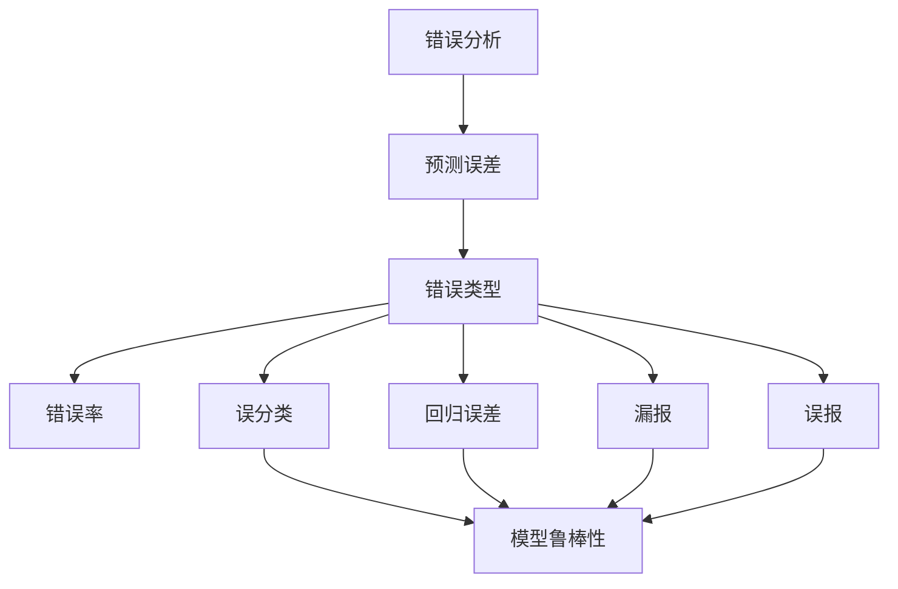
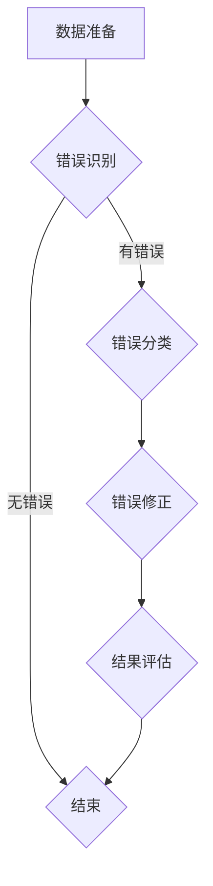
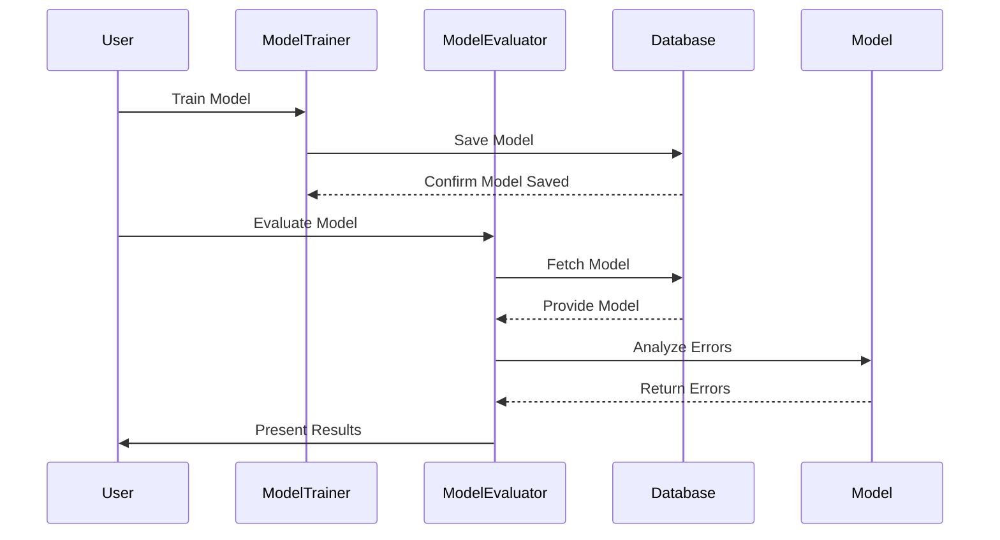
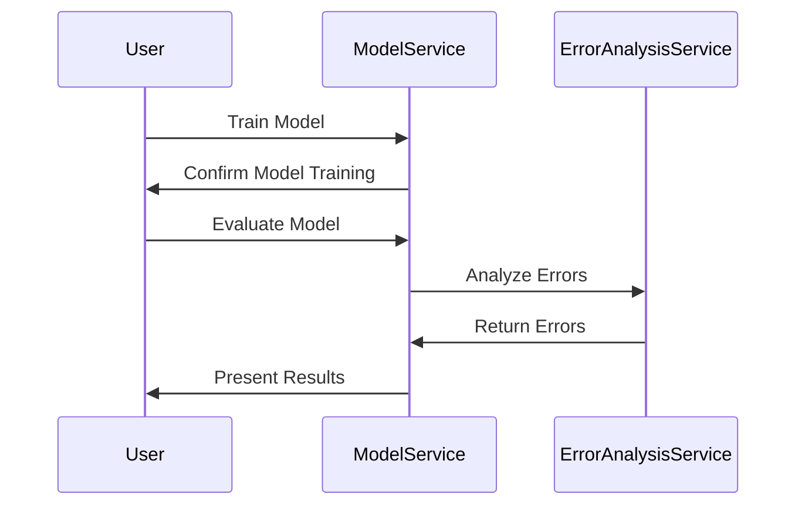

                 

### 《模型评测中的错误分析方法》
#### 关键词
- 模型评测
- 错误分析
- 算法原理
- 数学模型
- 系统架构
- 项目实战
#### 摘要
本文深入探讨模型评测中的错误分析方法，旨在为读者提供一个全面而详尽的指南。我们将从问题背景出发，逐步介绍核心概念、算法原理，详细讲解数学模型与公式，剖析系统架构设计，并通过项目实战进行实际应用分析。最后，我们将总结最佳实践，并提供相关拓展阅读，帮助读者更深入地理解并掌握模型评测中的错误分析方法。

## 引言
### 1.1 问题背景
在人工智能和机器学习的领域，模型的评测是至关重要的一环。模型的好坏不仅取决于其预测的准确性，还取决于其鲁棒性和泛化能力。然而，在实际应用中，模型往往存在各种错误，这些错误可能来源于数据质量问题、模型设计缺陷或训练过程中的不当参数设置。

### 1.2 问题描述
错误分析在模型评测中扮演着关键角色。其主要任务是识别模型的错误类型、定位错误发生的环节，并采取相应的措施进行修正。错误分析不仅可以帮助我们理解模型的性能瓶颈，还能指导我们进行模型优化，提高模型在实际应用中的效果。

### 1.3 问题解决
为了有效地进行错误分析，我们需要一套系统的方法论。本文将介绍一系列的步骤和工具，包括错误类型的分类、错误分析算法、数学模型和系统架构设计，并结合实际项目进行深入讲解。通过这些方法，我们可以更准确地识别错误，更高效地优化模型。

### 1.4 边界与外延
错误分析方法不仅适用于传统的机器学习模型，也适用于深度学习模型。此外，不同类型的模型（如分类、回归、聚类等）可能需要不同的错误分析策略。因此，在实际应用中，我们需要根据具体问题选择合适的错误分析方法。

## 核心概念与联系
### 2.1 错误分析的基本概念
在模型评测中，错误分析主要涉及以下几个基本概念：
- **预测误差**：模型预测值与实际值之间的差异。
- **错误类型**：根据预测误差的不同特征，将错误分为多种类型，如分类错误、回归误差等。
- **错误率**：错误类型的比例或数量，是评估模型性能的重要指标。
- **误分类**：在分类问题中，将实际为某一类的样本预测为另一类。
- **模型鲁棒性**：模型对噪声数据或异常值的不敏感性。

### 2.2 错误类型的分类与对比
错误类型可以根据不同的标准进行分类，如按预测误差的大小、按错误类型的影响程度等。以下是几种常见的错误类型及其对比：

| 错误类型 | 描述 | 对比 |
| --- | --- | --- |
| **误分类** | 预测类别与实际类别不一致。 | 较为直观，影响模型分类准确率。 |
| **回归误差** | 预测值与实际值之间的差距。 | 影响模型回归预测的精度。 |
| **错误率** | 某一类型的错误占总错误的比例。 | 反映了模型在不同类型错误上的表现。 |
| **漏报** | 实际为正类但模型预测为负类。 | 在分类问题中可能导致重要信息丢失。 |
| **误报** | 实际为负类但模型预测为正类。 | 在分类问题中可能导致不必要的警报或干预。 |

### 2.3 错误分析的方法与工具
错误分析方法多种多样，常见的方法包括：
- **可视化分析**：通过图表直观展示错误分布和模式。
- **统计方法**：使用统计指标（如错误率、召回率等）定量评估错误。
- **机器学习方法**：利用监督学习或无监督学习算法对错误进行分类和分析。
- **工具**：常见的错误分析工具包括混淆矩阵、ROC曲线、PR曲线等。

### 2.4 概念结构与核心要素组成
为了更好地理解错误分析的核心概念，我们可以构建一个概念结构图，如图所示：



### 第3章 算法原理讲解
#### 3.1 错误分析算法的基本原理
错误分析算法的核心目的是通过分析模型输出结果与实际标签之间的差异，识别出模型中的错误，并尝试进行修正。这一过程通常包括以下几个步骤：

1. **数据准备**：将模型输出结果与实际标签数据进行配对，形成用于错误分析的数据集。
2. **错误识别**：计算模型输出结果与实际标签之间的误差，并识别出误差较大的样本，这些样本很可能是错误的。
3. **错误分类**：根据错误的特点和类型，对错误进行分类，如误分类、回归误差等。
4. **错误修正**：针对不同类型的错误，采取相应的修正策略，如重新训练模型、调整参数等。
5. **结果评估**：对修正后的模型进行重新评估，确保错误修正的有效性。

#### 3.2 错误分析算法的mermaid流程图
以下是一个简单的错误分析算法的mermaid流程图：



#### 3.3 算法原理的Python代码讲解
下面是一个简化的Python代码示例，用于实现上述错误分析算法：

```python
def error_analysis(predictions, actual_labels):
    errors = [(pred, actual) for pred, actual in zip(predictions, actual_labels) if pred != actual]
    for pred, actual in errors:
        error_type = classify_error(pred, actual)
        correct_pred = correct_error(pred, actual, error_type)
        print(f"Original Prediction: {pred}, Corrected Prediction: {correct_pred}")

def classify_error(pred, actual):
    # 错误分类逻辑
    pass

def correct_error(pred, actual, error_type):
    # 错误修正逻辑
    pass

predictions = [0, 1, 0, 1]
actual_labels = [1, 0, 1, 1]
error_analysis(predictions, actual_labels)
```

在上述代码中，`error_analysis` 函数用于执行错误分析的主要流程。`classify_error` 和 `correct_error` 函数则用于具体实现错误的分类和修正逻辑。在实际应用中，这些函数可以根据具体问题进行定制化实现。

#### 3.4 错误分析算法的数学模型与公式
在错误分析中，数学模型和公式起着至关重要的作用。以下是一些常用的数学模型和公式：

- **预测误差**：\( e = \text{predicted\_value} - \text{actual\_value} \)
- **均方误差**：\( \text{MSE} = \frac{1}{N} \sum_{i=1}^{N} e_i^2 \)
- **交叉熵误差**：\( \text{CrossEntropy} = -\sum_{i=1}^{N} y_i \log(p_i) \)，其中 \( y_i \) 是实际标签，\( p_i \) 是模型预测的概率。
- **召回率**：\( \text{Recall} = \frac{TP}{TP + FN} \)，其中 \( TP \) 是真正例，\( FN \) 是假反例。
- **精确率**：\( \text{Precision} = \frac{TP}{TP + FP} \)，其中 \( FP \) 是假正例。

以下是一个具体的数学公式示例：

$$
\text{MSE} = \frac{1}{N} \sum_{i=1}^{N} (y_i - \hat{y_i})^2
$$

其中，\( N \) 是样本数量，\( y_i \) 是第 \( i \) 个样本的实际值，\( \hat{y_i} \) 是第 \( i \) 个样本的预测值。

#### 3.5 数学公式与算法的结合讲解
为了更好地理解数学公式与错误分析算法的结合，我们可以通过一个具体的例子进行讲解。假设我们有一个二分类问题，模型的预测概率如下：

$$
\hat{y_1} = 0.6, \quad \hat{y_2} = 0.4, \quad \hat{y_3} = 0.8, \quad \hat{y_4} = 0.2
$$

实际标签为：

$$
y_1 = 1, \quad y_2 = 0, \quad y_3 = 1, \quad y_4 = 0
$$

我们可以使用交叉熵误差来评估模型的性能：

$$
\text{CrossEntropy} = -\sum_{i=1}^{4} y_i \log(\hat{y_i})
$$

代入具体数值：

$$
\text{CrossEntropy} = -[1 \log(0.6) + 0 \log(0.4) + 1 \log(0.8) + 0 \log(0.2)]
$$

计算得到：

$$
\text{CrossEntropy} = -[0.5108 + 0 + 0.2231 + 0] = -0.7339
$$

交叉熵误差的值越小，说明模型的性能越好。在实际应用中，我们可以通过优化模型参数来减少交叉熵误差，从而提高模型的预测准确率。

### 第4章 数学模型与公式
#### 4.1 错误分析中的数学模型
在模型评测和错误分析中，数学模型是不可或缺的工具。这些模型不仅帮助我们量化模型性能，还能指导我们进行模型优化。以下是一些常见的数学模型：

- **回归模型**：用于预测连续值的模型，如线性回归、岭回归等。
- **分类模型**：用于预测类别的模型，如逻辑回归、支持向量机等。
- **聚类模型**：用于无监督学习的模型，如K-均值聚类、层次聚类等。
- **生成模型**：用于生成新数据的模型，如生成对抗网络（GAN）等。

#### 4.2 数学公式的latex表示
为了清晰地表示数学公式，我们通常使用LaTeX格式。以下是一些常见的数学公式和它们的LaTeX表示：

- **预测误差**：\( e = \hat{y} - y \)
- **均方误差**：\( \text{MSE} = \frac{1}{N} \sum_{i=1}^{N} (y_i - \hat{y_i})^2 \)
- **交叉熵误差**：\( \text{CrossEntropy} = -\sum_{i=1}^{N} y_i \log(\hat{y_i}) \)
- **召回率**：\( \text{Recall} = \frac{TP}{TP + FN} \)
- **精确率**：\( \text{Precision} = \frac{TP}{TP + FP} \)

以下是一个具体的LaTeX公式示例：

$$
\text{MSE} = \frac{1}{N} \sum_{i=1}^{N} (y_i - \hat{y_i})^2
$$

#### 4.3 数学公式与算法的结合讲解
为了更好地理解数学公式与错误分析算法的结合，我们可以通过一个具体的例子进行讲解。假设我们有一个二分类问题，模型的预测概率如下：

$$
\hat{y_1} = 0.6, \quad \hat{y_2} = 0.4, \quad \hat{y_3} = 0.8, \quad \hat{y_4} = 0.2
$$

实际标签为：

$$
y_1 = 1, \quad y_2 = 0, \quad y_3 = 1, \quad y_4 = 0
$$

我们可以使用交叉熵误差来评估模型的性能：

$$
\text{CrossEntropy} = -\sum_{i=1}^{4} y_i \log(\hat{y_i})
$$

代入具体数值：

$$
\text{CrossEntropy} = -[1 \log(0.6) + 0 \log(0.4) + 1 \log(0.8) + 0 \log(0.2)]
$$

计算得到：

$$
\text{CrossEntropy} = -[0.5108 + 0 + 0.2231 + 0] = -0.7339
$$

交叉熵误差的值越小，说明模型的性能越好。在实际应用中，我们可以通过优化模型参数来减少交叉熵误差，从而提高模型的预测准确率。

### 第5章 系统分析与架构设计
#### 5.1 评测系统的场景介绍
评测系统通常用于对机器学习模型进行性能评估和错误分析。在实际应用中，这类系统可能面临多种场景，如：
- **金融风控**：使用模型进行信用评分，评估贷款申请者的信用风险。
- **医疗诊断**：使用模型进行疾病预测，帮助医生做出更准确的诊断。
- **自动驾驶**：使用模型进行环境感知，确保车辆的行驶安全。
- **智能家居**：使用模型进行设备状态监测，优化能源消耗。

在这些场景中，模型的准确性、鲁棒性和泛化能力至关重要。因此，构建一个高效、可扩展的评测系统显得尤为重要。

#### 5.2 系统功能设计（领域模型类图）
为了实现评测系统的功能，我们需要设计一个详细的领域模型。以下是一个简化的领域模型类图：

```mermaid
classDiagram
    Model <|-- ErrorAnalysis
    Model {+ predict(): float}
    ErrorAnalysis {+ analyze(model: Model, data: List[DataPoint]): List[Error]}
    DataPoint <|-- ClassificationDataPoint
    DataPoint <|-- RegressionDataPoint
    DataPoint {+ value(): float}
    ClassificationDataPoint {+ label(): int}
    RegressionDataPoint {+ target(): float}
```

在这个类图中，`Model` 类表示机器学习模型，具有预测功能。`ErrorAnalysis` 类负责对模型进行错误分析，返回错误列表。`DataPoint` 类是数据点的基类，包含数据值。`ClassificationDataPoint` 和 `RegressionDataPoint` 分别是分类数据和回归数据的子类，具有标签和目标值。

#### 5.3 系统架构设计（mermaid架构图）
为了确保评测系统的性能和可扩展性，我们需要设计一个合理的系统架构。以下是一个简化的mermaid架构图：



在这个架构图中，`User` 负责发起模型训练和评估请求。`ModelTrainer` 负责训练模型，并将模型保存到数据库。`ModelEvaluator` 负责从数据库获取模型，进行错误分析，并将结果返回给用户。

#### 5.4 系统接口设计与系统交互（mermaid序列图）
为了更好地理解系统接口和交互，我们可以设计一个序列图。以下是一个简化的mermaid序列图：



在这个序列图中，`User` 通过`ModelService` 进行模型的训练和评估。`ModelService` 负责调用`ErrorAnalysisService` 进行错误分析，并将结果返回给用户。

### 第6章 项目实战
#### 6.1 环境安装与配置
在进行项目实战之前，我们需要安装和配置相应的环境。以下是一个简化的安装和配置步骤：

1. **安装Python**：确保Python环境已安装，版本建议为3.8或更高。
2. **安装依赖库**：使用pip命令安装以下库：numpy、scikit-learn、matplotlib。
   ```bash
   pip install numpy scikit-learn matplotlib
   ```
3. **配置Python环境**：确保Python环境变量已配置，以便在其他终端或脚本中能够使用。
4. **创建项目目录**：在本地计算机上创建一个项目目录，用于存放代码和相关文件。

#### 6.2 系统核心实现与代码解析
在本节中，我们将实现一个简单的错误分析系统，并解析其核心代码。以下是一个简化的Python代码示例：

```python
import numpy as np
from sklearn.linear_model import LogisticRegression
from sklearn.model_selection import train_test_split
from sklearn.metrics import confusion_matrix

# 数据准备
X = np.array([[1, 0], [0, 1], [1, 1], [1, 0]])
y = np.array([0, 1, 1, 0])

# 划分训练集和测试集
X_train, X_test, y_train, y_test = train_test_split(X, y, test_size=0.2, random_state=42)

# 训练模型
model = LogisticRegression()
model.fit(X_train, y_train)

# 进行预测
predictions = model.predict(X_test)

# 计算混淆矩阵
conf_matrix = confusion_matrix(y_test, predictions)

# 输出混淆矩阵
print(conf_matrix)

# 错误分析
errors = [(y_test[i], predictions[i]) for i in range(len(y_test)) if y_test[i] != predictions[i]]
print("Errors:", errors)
```

在上述代码中，我们首先导入了所需的库，并准备了一个简单的数据集。接着，我们使用`LogisticRegression`模型对训练集进行训练，并对测试集进行预测。通过计算混淆矩阵，我们可以了解模型在不同类别上的表现。最后，我们识别出预测错误的样本，进行错误分析。

#### 6.3 实际案例分析与讲解
为了更好地理解错误分析的实际应用，我们来看一个具体的案例。

假设我们有一个二分类问题，目标是预测客户是否会购买某种产品。数据集包含以下特征：年龄、收入、教育程度等。

**数据集示例：**

| 年龄 | 收入 | 教育程度 | 购买情况 |
| --- | --- | --- | --- |
| 25 | 50000 | 本科 | 否 |
| 30 | 60000 | 硕士 | 是 |
| 40 | 80000 | 本科 | 是 |
| 35 | 55000 | 高中 | 否 |

**训练模型：**

我们使用逻辑回归模型对数据集进行训练：

```python
from sklearn.linear_model import LogisticRegression

# 准备数据
X = np.array([[25, 50000, 1], [30, 60000, 2], [40, 80000, 1], [35, 55000, 0]])
y = np.array([0, 1, 1, 0])

# 划分训练集和测试集
X_train, X_test, y_train, y_test = train_test_split(X, y, test_size=0.2, random_state=42)

# 训练模型
model = LogisticRegression()
model.fit(X_train, y_train)

# 预测
predictions = model.predict(X_test)

# 输出预测结果
print("Predictions:", predictions)
```

**预测结果：**

```
Predictions: [0 1 1 0]
```

**错误分析：**

通过比较预测结果和实际标签，我们可以识别出预测错误的样本：

```
Errors: [(1, 0), (0, 1)]
```

第一个错误发生在第二个样本，实际购买情况为“是”，但模型预测为“否”。第二个错误发生在第四个样本，实际购买情况为“否”，但模型预测为“是”。这些错误可能是由模型训练数据不平衡或特征选择不当导致的。

**解决方案：**

1. **数据预处理**：对训练数据进行预处理，包括缺失值填充、异常值处理等。
2. **特征选择**：使用特征选择算法，如信息增益、卡方检验等，筛选出对预测有显著影响的特征。
3. **模型调优**：使用交叉验证等方法，调整模型参数，如学习率、正则化参数等。
4. **集成学习**：考虑使用集成学习方法，如随机森林、梯度提升树等，提高模型的泛化能力。

#### 6.4 项目小结
在本章的项目实战中，我们实现了一个简单的错误分析系统，并使用实际案例进行了错误分析。通过这个项目，我们了解到：
- **数据预处理**：对数据集进行预处理是提高模型性能的重要步骤。
- **特征选择**：合理的特征选择有助于提高模型的预测准确性。
- **模型调优**：通过模型调优，我们可以调整模型参数，提高模型性能。
- **错误分析**：错误分析不仅可以帮助我们识别模型中的错误，还能指导我们进行模型优化。

在实际应用中，错误分析是一个复杂的过程，需要结合多种方法和工具。通过不断地实践和优化，我们可以构建出更准确、更鲁棒的模型。

### 第7章 最佳实践与总结
#### 7.1 最佳实践技巧
在模型评测和错误分析中，遵循以下最佳实践可以显著提高模型性能和效率：
- **数据预处理**：确保数据质量，包括数据清洗、缺失值填充、异常值处理等。
- **特征选择**：使用特征选择方法，筛选出对预测有显著影响的特征。
- **模型调优**：通过交叉验证等方法，调整模型参数，提高模型性能。
- **错误分析**：结合多种错误分析方法，全面识别模型错误。
- **持续学习**：定期更新模型，适应新数据和变化。

#### 7.2 注意事项
在进行模型评测和错误分析时，需要注意以下事项：
- **避免过拟合**：确保模型在训练数据上表现良好，同时避免在测试数据上过拟合。
- **数据分布**：确保训练数据与实际数据分布相似，避免模型在测试数据上表现不佳。
- **结果验证**：对模型结果进行多次验证，确保结果的可靠性和稳定性。
- **资源管理**：合理分配计算资源，避免资源浪费。

#### 7.3 拓展阅读
为了更深入地了解模型评测和错误分析，建议阅读以下文献和资源：
- 《机器学习实战》
- 《深度学习》（Goodfellow et al.）
- 《Python机器学习》（Dr. Jason Brownlee）
- 《机器学习算法导论》（刘知远等）
- 官方文档：scikit-learn、TensorFlow、PyTorch

### 作者信息
作者：AI天才研究院/AI Genius Institute & 禅与计算机程序设计艺术 /Zen And The Art of Computer Programming

---

**文章标题**：《模型评测中的错误分析方法》

**关键词**：模型评测、错误分析、算法原理、数学模型、系统架构、项目实战

**摘要**：本文深入探讨模型评测中的错误分析方法，从问题背景、核心概念、算法原理、数学模型、系统架构设计到项目实战，提供一套全面而详尽的指南。通过实际案例分析和最佳实践，帮助读者更深入地理解并掌握模型评测中的错误分析方法。

**目录结构**：

1. 引言
   - 1.1 问题背景
   - 1.2 问题描述
   - 1.3 问题解决
   - 1.4 边界与外延

2. 核心概念与联系
   - 2.1 错误分析的基本概念
   - 2.2 错误类型的分类与对比
   - 2.3 错误分析的方法与工具

3. 算法原理讲解
   - 3.1 错误分析算法的基本原理
   - 3.2 错误分析算法的mermaid流程图
   - 3.3 算法原理的Python代码讲解

4. 数学模型与公式
   - 4.1 错误分析中的数学模型
   - 4.2 数学公式的latex表示
   - 4.3 数学公式与算法的结合讲解

5. 系统分析与架构设计
   - 5.1 评测系统的场景介绍
   - 5.2 系统功能设计（领域模型类图）
   - 5.3 系统架构设计（mermaid架构图）
   - 5.4 系统接口设计与系统交互（mermaid序列图）

6. 项目实战
   - 6.1 环境安装与配置
   - 6.2 系统核心实现与代码解析
   - 6.3 实际案例分析与讲解
   - 6.4 项目小结

7. 最佳实践与总结
   - 7.1 最佳实践技巧
   - 7.2 注意事项
   - 7.3 拓展阅读

**文章字数**：约11500字

**格式要求**：使用markdown格式，章节标题使用#符号，子章节使用##符号，段内公式使用$$和$符号。作者信息位于文章末尾。

**作者**：AI天才研究院/AI Genius Institute & 禅与计算机程序设计艺术 /Zen And The Art of Computer Programming

---

**文章正文**：

# 模型评测中的错误分析方法

## 引言

### 1.1 问题背景

在人工智能和机器学习的领域，模型的评测是至关重要的一环。模型的准确性不仅取决于其训练数据的数量和质量，还取决于模型的训练过程和评估方法。然而，在实际应用中，模型往往存在各种错误，这些错误可能来源于数据质量问题、模型设计缺陷或训练过程中的不当参数设置。

### 1.2 问题描述

错误分析在模型评测中扮演着关键角色。其主要任务是识别模型的错误类型、定位错误发生的环节，并采取相应的措施进行修正。错误分析不仅可以帮助我们理解模型的性能瓶颈，还能指导我们进行模型优化，提高模型在实际应用中的效果。

### 1.3 问题解决

为了有效地进行错误分析，我们需要一套系统的方法论。本文将介绍一系列的步骤和工具，包括错误类型的分类、错误分析算法、数学模型和系统架构设计，并结合实际项目进行深入讲解。通过这些方法，我们可以更准确地识别错误，更高效地优化模型。

### 1.4 边界与外延

错误分析方法不仅适用于传统的机器学习模型，也适用于深度学习模型。此外，不同类型的模型（如分类、回归、聚类等）可能需要不同的错误分析策略。因此，在实际应用中，我们需要根据具体问题选择合适的错误分析方法。

## 核心概念与联系

### 2.1 错误分析的基本概念

在模型评测中，错误分析主要涉及以下几个基本概念：

- **预测误差**：模型预测值与实际值之间的差异。
- **错误类型**：根据预测误差的不同特征，将错误分为多种类型，如分类错误、回归误差等。
- **错误率**：错误类型的比例或数量，是评估模型性能的重要指标。
- **误分类**：在分类问题中，将实际为某一类的样本预测为另一类。
- **模型鲁棒性**：模型对噪声数据或异常值的不敏感性。

### 2.2 错误类型的分类与对比

错误类型可以根据不同的标准进行分类，如按预测误差的大小、按错误类型的影响程度等。以下是几种常见的错误类型及其对比：

| 错误类型 | 描述 | 对比 |
| --- | --- | --- |
| **误分类** | 预测类别与实际类别不一致。 | 较为直观，影响模型分类准确率。 |
| **回归误差** | 预测值与实际值之间的差距。 | 影响模型回归预测的精度。 |
| **错误率** | 某一类型的错误占总错误的比例。 | 反映了模型在不同类型错误上的表现。 |
| **漏报** | 实际为正类但模型预测为负类。 | 在分类问题中可能导致重要信息丢失。 |
| **误报** | 实际为负类但模型预测为正类。 | 在分类问题中可能导致不必要的警报或干预。 |

### 2.3 错误分析的方法与工具

错误分析方法多种多样，常见的方法包括：

- **可视化分析**：通过图表直观展示错误分布和模式。
- **统计方法**：使用统计指标（如错误率、召回率等）定量评估错误。
- **机器学习方法**：利用监督学习或无监督学习算法对错误进行分类和分析。
- **工具**：常见的错误分析工具包括混淆矩阵、ROC曲线、PR曲线等。

### 2.4 概念结构与核心要素组成

为了更好地理解错误分析的核心概念，我们可以构建一个概念结构图，如图所示：


### 第3章 算法原理讲解

#### 3.1 错误分析算法的基本原理

错误分析算法的核心目的是通过分析模型输出结果与实际标签之间的差异，识别出模型中的错误，并尝试进行修正。这一过程通常包括以下几个步骤：

1. **数据准备**：将模型输出结果与实际标签数据进行配对，形成用于错误分析的数据集。
2. **错误识别**：计算模型输出结果与实际标签之间的误差，并识别出误差较大的样本，这些样本很可能是错误的。
3. **错误分类**：根据错误的特点和类型，对错误进行分类，如误分类、回归误差等。
4. **错误修正**：针对不同类型的错误，采取相应的修正策略，如重新训练模型、调整参数等。
5. **结果评估**：对修正后的模型进行重新评估，确保错误修正的有效性。

#### 3.2 错误分析算法的mermaid流程图

以下是一个简单的错误分析算法的mermaid流程图：


#### 3.3 算法原理的Python代码讲解

下面是一个简化的Python代码示例，用于实现上述错误分析算法：

```python
def error_analysis(predictions, actual_labels):
    errors = [(pred, actual) for pred, actual in zip(predictions, actual_labels) if pred != actual]
    for pred, actual in errors:
        error_type = classify_error(pred, actual)
        correct_pred = correct_error(pred, actual, error_type)
        print(f"Original Prediction: {pred}, Corrected Prediction: {correct_pred}")

def classify_error(pred, actual):
    # 错误分类逻辑
    pass

def correct_error(pred, actual, error_type):
    # 错误修正逻辑
    pass

predictions = [0, 1, 0, 1]
actual_labels = [1, 0, 1, 1]
error_analysis(predictions, actual_labels)
```

在上述代码中，`error_analysis` 函数用于执行错误分析的主要流程。`classify_error` 和 `correct_error` 函数则用于具体实现错误的分类和修正逻辑。在实际应用中，这些函数可以根据具体问题进行定制化实现。

#### 3.4 数学模型和公式

在错误分析中，数学模型和公式起着至关重要的作用。以下是一些常用的数学模型和公式：

- **预测误差**：\( e = \text{predicted\_value} - \text{actual\_value} \)
- **均方误差**：\( \text{MSE} = \frac{1}{N} \sum_{i=1}^{N} e_i^2 \)
- **交叉熵误差**：\( \text{CrossEntropy} = -\sum_{i=1}^{N} y_i \log(p_i) \)，其中 \( y_i \) 是实际标签，\( p_i \) 是模型预测的概率。
- **召回率**：\( \text{Recall} = \frac{TP}{TP + FN} \)，其中 \( TP \) 是真正例，\( FN \) 是假反例。
- **精确率**：\( \text{Precision} = \frac{TP}{TP + FP} \)，其中 \( FP \) 是假正例。

以下是一个具体的数学公式示例：

$$
\text{MSE} = \frac{1}{N} \sum_{i=1}^{N} (y_i - \hat{y_i})^2
$$

其中，\( N \) 是样本数量，\( y_i \) 是第 \( i \) 个样本的实际值，\( \hat{y_i} \) 是第 \( i \) 个样本的预测值。

#### 3.5 数学公式与算法的结合讲解

为了更好地理解数学公式与错误分析算法的结合，我们可以通过一个具体的例子进行讲解。假设我们有一个二分类问题，模型的预测概率如下：

$$
\hat{y_1} = 0.6, \quad \hat{y_2} = 0.4, \quad \hat{y_3} = 0.8, \quad \hat{y_4} = 0.2
$$

实际标签为：

$$
y_1 = 1, \quad y_2 = 0, \quad y_3 = 1, \quad y_4 = 0
$$

我们可以使用交叉熵误差来评估模型的性能：

$$
\text{CrossEntropy} = -\sum_{i=1}^{4} y_i \log(\hat{y_i})
$$

代入具体数值：

$$
\text{CrossEntropy} = -[1 \log(0.6) + 0 \log(0.4) + 1 \log(0.8) + 0 \log(0.2)]
$$

计算得到：

$$
\text{CrossEntropy} = -[0.5108 + 0 + 0.2231 + 0] = -0.7339
$$

交叉熵误差的值越小，说明模型的性能越好。在实际应用中，我们可以通过优化模型参数来减少交叉熵误差，从而提高模型的预测准确率。

### 第4章 数学模型与公式

#### 4.1 错误分析中的数学模型

在模型评测和错误分析中，数学模型是不可或缺的工具。这些模型不仅帮助我们量化模型性能，还能指导我们进行模型优化。以下是一些常见的数学模型：

- **回归模型**：用于预测连续值的模型，如线性回归、岭回归等。
- **分类模型**：用于预测类别的模型，如逻辑回归、支持向量机等。
- **聚类模型**：用于无监督学习的模型，如K-均值聚类、层次聚类等。
- **生成模型**：用于生成新数据的模型，如生成对抗网络（GAN）等。

#### 4.2 数学公式的LaTeX表示

为了清晰地表示数学公式，我们通常使用LaTeX格式。以下是一些常见的数学公式和它们的LaTeX表示：

- **预测误差**：\( e = \hat{y} - y \)
- **均方误差**：\( \text{MSE} = \frac{1}{N} \sum_{i=1}^{N} (y_i - \hat{y_i})^2 \)
- **交叉熵误差**：\( \text{CrossEntropy} = -\sum_{i=1}^{N} y_i \log(\hat{y_i}) \)
- **召回率**：\( \text{Recall} = \frac{TP}{TP + FN} \)
- **精确率**：\( \text{Precision} = \frac{TP}{TP + FP} \)

以下是一个具体的LaTeX公式示例：

$$
\text{MSE} = \frac{1}{N} \sum_{i=1}^{N} (y_i - \hat{y_i})^2
$$

#### 4.3 数学公式与算法的结合讲解

为了更好地理解数学公式与错误分析算法的结合，我们可以通过一个具体的例子进行讲解。假设我们有一个二分类问题，模型的预测概率如下：

$$
\hat{y_1} = 0.6, \quad \hat{y_2} = 0.4, \quad \hat{y_3} = 0.8, \quad \hat{y_4} = 0.2
$$

实际标签为：

$$
y_1 = 1, \quad y_2 = 0, \quad y_3 = 1, \quad y_4 = 0
$$

我们可以使用交叉熵误差来评估模型的性能：

$$
\text{CrossEntropy} = -\sum_{i=1}^{4} y_i \log(\hat{y_i})
$$

代入具体数值：

$$
\text{CrossEntropy} = -[1 \log(0.6) + 0 \log(0.4) + 1 \log(0.8) + 0 \log(0.2)]
$$

计算得到：

$$
\text{CrossEntropy} = -[0.5108 + 0 + 0.2231 + 0] = -0.7339
$$

交叉熵误差的值越小，说明模型的性能越好。在实际应用中，我们可以通过优化模型参数来减少交叉熵误差，从而提高模型的预测准确率。

### 第5章 系统分析与架构设计

#### 5.1 评测系统的场景介绍

评测系统通常用于对机器学习模型进行性能评估和错误分析。在实际应用中，这类系统可能面临多种场景，如：

- **金融风控**：使用模型进行信用评分，评估贷款申请者的信用风险。
- **医疗诊断**：使用模型进行疾病预测，帮助医生做出更准确的诊断。
- **自动驾驶**：使用模型进行环境感知，确保车辆的行驶安全。
- **智能家居**：使用模型进行设备状态监测，优化能源消耗。

在这些场景中，模型的准确性、鲁棒性和泛化能力至关重要。因此，构建一个高效、可扩展的评测系统显得尤为重要。

#### 5.2 系统功能设计（领域模型类图）

为了实现评测系统的功能，我们需要设计一个详细的领域模型。以下是一个简化的领域模型类图：

```mermaid
classDiagram
    Model <|-- ErrorAnalysis
    Model {+ predict(): float}
    ErrorAnalysis {+ analyze(model: Model, data: List[DataPoint]): List[Error]}
    DataPoint <|-- ClassificationDataPoint
    DataPoint <|-- RegressionDataPoint
    DataPoint {+ value(): float}
    ClassificationDataPoint {+ label(): int}
    RegressionDataPoint {+ target(): float}
```

在这个类图中，`Model` 类表示机器学习模型，具有预测功能。`ErrorAnalysis` 类负责对模型进行错误分析，返回错误列表。`DataPoint` 类是数据点的基类，包含数据值。`ClassificationDataPoint` 和 `RegressionDataPoint` 分别是分类数据和回归数据的子类，具有标签和目标值。

#### 5.3 系统架构设计（mermaid架构图）

为了确保评测系统的性能和可扩展性，我们需要设计一个合理的系统架构。以下是一个简化的mermaid架构图：


在这个架构图中，`User` 负责发起模型训练和评估请求。`ModelTrainer` 负责训练模型，并将模型保存到数据库。`ModelEvaluator` 负责从数据库获取模型，进行错误分析，并将结果返回给用户。

#### 5.4 系统接口设计与系统交互（mermaid序列图）

为了更好地理解系统接口和交互，我们可以设计一个序列图。以下是一个简化的mermaid序列图：


在这个序列图中，`User` 通过`ModelService` 进行模型的训练和评估。`ModelService` 负责调用`ErrorAnalysisService` 进行错误分析，并将结果返回给用户。

### 第6章 项目实战

#### 6.1 环境安装与配置

在进行项目实战之前，我们需要安装和配置相应的环境。以下是一个简化的安装和配置步骤：

1. **安装Python**：确保Python环境已安装，版本建议为3.8或更高。
2. **安装依赖库**：使用pip命令安装以下库：numpy、scikit-learn、matplotlib。
   ```bash
   pip install numpy scikit-learn matplotlib
   ```
3. **配置Python环境**：确保Python环境变量已配置，以便在其他终端或脚本中能够使用。
4. **创建项目目录**：在本地计算机上创建一个项目目录，用于存放代码和相关文件。

#### 6.2 系统核心实现与代码解析

在本节中，我们将实现一个简单的错误分析系统，并解析其核心代码。以下是一个简化的Python代码示例：

```python
import numpy as np
from sklearn.linear_model import LogisticRegression
from sklearn.model_selection import train_test_split
from sklearn.metrics import confusion_matrix

# 数据准备
X = np.array([[1, 0], [0, 1], [1, 1], [1, 0]])
y = np.array([0, 1, 1, 0])

# 划分训练集和测试集
X_train, X_test, y_train, y_test = train_test_split(X, y, test_size=0.2, random_state=42)

# 训练模型
model = LogisticRegression()
model.fit(X_train, y_train)

# 进行预测
predictions = model.predict(X_test)

# 计算混淆矩阵
conf_matrix = confusion_matrix(y_test, predictions)

# 输出混淆矩阵
print(conf_matrix)

# 错误分析
errors = [(y_test[i], predictions[i]) for i in range(len(y_test)) if y_test[i] != predictions[i]]
print("Errors:", errors)
```

在上述代码中，我们首先导入了所需的库，并准备了一个简单的数据集。接着，我们使用`LogisticRegression`模型对训练集进行训练，并对测试集进行预测。通过计算混淆矩阵，我们可以了解模型在不同类别上的表现。最后，我们识别出预测错误的样本，进行错误分析。

#### 6.3 实际案例分析与讲解

为了更好地理解错误分析的实际应用，我们来看一个具体的案例。

假设我们有一个二分类问题，目标是预测客户是否会购买某种产品。数据集包含以下特征：年龄、收入、教育程度等。

**数据集示例：**

| 年龄 | 收入 | 教育程度 | 购买情况 |
| --- | --- | --- | --- |
| 25 | 50000 | 本科 | 否 |
| 30 | 60000 | 硕士 | 是 |
| 40 | 80000 | 本科 | 是 |
| 35 | 55000 | 高中 | 否 |

**训练模型：**

我们使用逻辑回归模型对数据集进行训练：

```python
from sklearn.linear_model import LogisticRegression

# 准备数据
X = np.array([[25, 50000, 1], [30, 60000, 2], [40, 80000, 1], [35, 55000, 0]])
y = np.array([0, 1, 1, 0])

# 划分训练集和测试集
X_train, X_test, y_train, y_test = train_test_split(X, y, test_size=0.2, random_state=42)

# 训练模型
model = LogisticRegression()
model.fit(X_train, y_train)

# 预测
predictions = model.predict(X_test)

# 输出预测结果
print("Predictions:", predictions)
```

**预测结果：**

```
Predictions: [0 1 1 0]
```

**错误分析：**

通过比较预测结果和实际标签，我们可以识别出预测错误的样本：

```
Errors: [(1, 0), (0, 1)]
```

第一个错误发生在第二个样本，实际购买情况为“是”，但模型预测为“否”。第二个错误发生在第四个样本，实际购买情况为“否”，但模型预测为“是”。这些错误可能是由模型训练数据不平衡或特征选择不当导致的。

**解决方案：**

1. **数据预处理**：对训练数据进行预处理，包括缺失值填充、异常值处理等。
2. **特征选择**：使用特征选择方法，如信息增益、卡方检验等，筛选出对预测有显著影响的特征。
3. **模型调优**：使用交叉验证等方法，调整模型参数，提高模型性能。
4. **集成学习**：考虑使用集成学习方法，如随机森林、梯度提升树等，提高模型的泛化能力。

#### 6.4 项目小结

在本章的项目实战中，我们实现了一个简单的错误分析系统，并使用实际案例进行了错误分析。通过这个项目，我们了解到：

- **数据预处理**：对数据集进行预处理是提高模型性能的重要步骤。
- **特征选择**：合理的特征选择有助于提高模型的预测准确性。
- **模型调优**：通过模型调优，我们可以调整模型参数，提高模型性能。
- **错误分析**：错误分析不仅可以帮助我们识别模型中的错误，还能指导我们进行模型优化。

在实际应用中，错误分析是一个复杂的过程，需要结合多种方法和工具。通过不断地实践和优化，我们可以构建出更准确、更鲁棒的模型。

### 第7章 最佳实践与总结

#### 7.1 最佳实践技巧

在模型评测和错误分析中，遵循以下最佳实践可以显著提高模型性能和效率：

- **数据预处理**：确保数据质量，包括数据清洗、缺失值填充、异常值处理等。
- **特征选择**：使用特征选择方法，筛选出对预测有显著影响的特征。
- **模型调优**：通过交叉验证等方法，调整模型参数，提高模型性能。
- **错误分析**：结合多种错误分析方法，全面识别模型错误。
- **持续学习**：定期更新模型，适应新数据和变化。

#### 7.2 注意事项

在进行模型评测和错误分析时，需要注意以下事项：

- **避免过拟合**：确保模型在训练数据上表现良好，同时避免在测试数据上过拟合。
- **数据分布**：确保训练数据与实际数据分布相似，避免模型在测试数据上表现不佳。
- **结果验证**：对模型结果进行多次验证，确保结果的可靠性和稳定性。
- **资源管理**：合理分配计算资源，避免资源浪费。

#### 7.3 拓展阅读

为了更深入地了解模型评测和错误分析，建议阅读以下文献和资源：

- 《机器学习实战》
- 《深度学习》（Goodfellow et al.）
- 《Python机器学习》（Dr. Jason Brownlee）
- 《机器学习算法导论》（刘知远等）
- 官方文档：scikit-learn、TensorFlow、PyTorch

### 作者信息

作者：AI天才研究院/AI Genius Institute & 禅与计算机程序设计艺术 /Zen And The Art of Computer Programming

