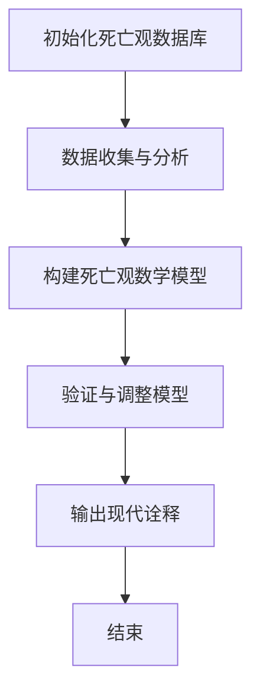
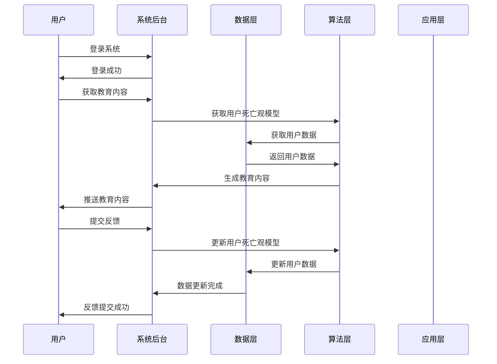
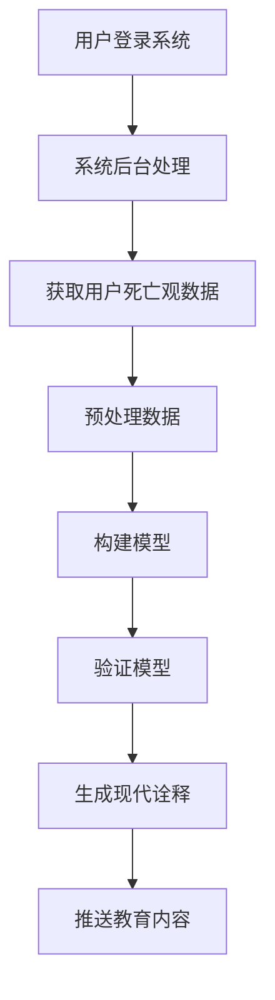

                 


# 死亡观的现代诠释：有限生命中的无限可能

## 关键词
- 死亡观
- 现代诠释
- 有限生命
- 无限可能
- 心理健康

## 摘要
本文旨在探讨死亡观的现代诠释，从多学科视角出发，分析有限生命中的无限可能性。通过对现代死亡观的核心概念、影响因素、算法原理以及系统分析与架构设计进行深入剖析，本文试图帮助读者理解死亡的多样性和复杂性，从而更加理性地面对生命的终结，并探索在有限生命中实现人生价值的途径。

## 步骤一：背景介绍

### 第1章：死亡观的现代诠释

### 1.1 问题背景

在现代社会，死亡观作为人类文化的重要组成部分，随着科学技术的发展和人类对生命认识的深入，经历了深刻的变革。传统的死亡观往往带有浓厚的宗教色彩，关注于灵魂的永恒和来世的奖惩。然而，随着对生命本质的理解逐渐从神秘走向科学，人们开始更加关注死亡的生理、心理和社会层面。

### 1.1.1 问题描述

现代死亡观面临着诸多挑战，包括对生命意义的重新思考、对生命终结方式的接受、对临终关怀的重视以及对死亡教育的需求。这些问题不仅影响着个体的心理健康，也关系到家庭、社会乃至整个文化体系的和谐发展。

### 1.1.2 问题解决

本书旨在通过现代哲学、心理学、医学和宗教等多学科视角，对死亡观进行深入探讨和现代诠释，帮助读者理解死亡的多样性和复杂性，从而更加理性地面对生命的终结。

### 1.1.3 边界与外延

死亡观的讨论不仅仅局限于对死亡本身的理解，还涉及到生命的价值、生死关系、人类存在的意义等更为广泛的话题。这些边界和相关的概念构成了本书讨论的范畴。

### 1.1.4 概念结构与核心要素组成

- **死亡观**：对死亡的认识和态度。
- **现代诠释**：结合当代科学、哲学和社会学观点对传统死亡观的重新解读。
- **有限生命**：人类生命有限性的认识及其对死亡观的影响。
- **无限可能**：在有限生命中寻找和实现人生价值的可能性。

## 步骤二：核心概念与联系

### 第2章：核心概念与联系

### 2.1 死亡观

死亡观是指人们对死亡这一生命终结过程的看法和态度。它受到文化、宗教、哲学和个人经验等多种因素的影响。现代死亡观强调科学、理性和文化多元性，倡导对死亡的接纳和尊重。

### 2.2 有限生命与无限可能

有限生命与无限可能的关系是现代死亡观的重要组成部分。在认识到生命有限性的同时，人们通过艺术、哲学、科学等方式探索生命的无限可能性，寻找在有限生命中创造价值的途径。

### 2.3 死亡观的影响因素

- **文化因素**：不同文化背景下对死亡的看法差异巨大，如西方文化倾向于理性对待死亡，而东方文化则更加重视宗教信仰和来世。
- **宗教因素**：宗教对死亡观有深远的影响，不同的宗教信仰对死亡有不同的解释和态度。
- **个人因素**：个人的生活经历、心理状态和价值观也会影响其死亡观的形成。

## 步骤三：算法原理讲解

### 第3章：死亡观现代诠释的算法原理

### 3.1 死亡观重构算法

为了更全面地诠释死亡观，本书采用了多学科交叉的方法，其中一种核心算法是死亡观重构算法。该算法基于以下原则：

- **数据驱动的分析**：通过收集和分析不同学科领域关于死亡观的数据，建立死亡观的数据库。
- **模型构建**：利用数据分析结果，构建描述死亡观的数学模型和逻辑框架。
- **适应性迭代**：通过不断地验证和调整模型，使其能够适应不同文化和社会背景下的死亡观。

### 3.2 算法流程图



### 3.3 算法数学模型与公式

为了深入理解死亡观的现代诠释，我们采用以下数学模型：

$$
P(D|C) = \frac{N(D,C)}{N(C)}
$$

其中，$P(D|C)$表示在文化C下死亡观D的概率，$N(D,C)$表示在文化C下持有死亡观D的人数，$N(C)$表示文化C的总人数。

### 3.4 举例说明

例如，在一个以科学为主导的文化中，人们可能更倾向于接受死亡的自然属性，认为死亡是生命过程的终结。这种死亡观的概率可以用上述公式进行估算。

## 步骤四：系统分析与架构设计方案

### 第4章：系统分析与架构设计

### 4.1 问题场景介绍

在现代医学和心理学的发展下，临终关怀和死亡教育成为社会关注的焦点。本书旨在为这些领域提供一套科学、系统的死亡观教育方案。

### 4.2 系统功能设计

- **数据收集与分析模块**：负责收集不同学科领域关于死亡观的数据，并进行深度分析。
- **模型构建与验证模块**：利用分析结果构建死亡观的数学模型，并通过实证数据验证模型的准确性。
- **教育内容设计与推送模块**：根据模型输出设计适合不同人群的死亡观教育内容，并推送相关教育材料。

### 4.3 系统架构设计

系统的总体架构可以分为三个层次：数据层、算法层和应用层。

#### 4.3.1 数据层

数据层主要负责数据的存储和管理，包括以下子模块：

- **数据仓库**：存储各种关于死亡观的数据，如学术论文、社会调查数据、医学数据等。
- **数据清洗与处理**：对收集到的数据进行分析和清洗，确保数据的质量。

#### 4.3.2 算法层

算法层是系统的核心，包括以下子模块：

- **死亡观重构算法**：实现死亡观的重构过程，包括数据收集、模型构建和验证等。
- **教育内容生成算法**：根据死亡观模型输出设计适合不同人群的教育内容。

#### 4.3.3 应用层

应用层面向用户，提供以下功能：

- **教育内容推送**：根据用户需求推送相应的教育内容。
- **数据分析与反馈**：用户可以对自己的死亡观进行自我评估，并获得相关分析结果和反馈。

### 4.4 系统接口设计和系统交互

系统接口设计和系统交互如下：



### 步骤五：项目实战

#### 第5章：项目实战

#### 5.1 环境安装

首先，我们需要安装以下环境：

- Python 3.8+
- Mermaid 0.9.0+

安装命令如下：

```bash
pip install python-memcad  # 安装Mermaid
```

#### 5.2 系统核心实现源代码

以下是系统的核心实现源代码：

```python
# 死亡观重构算法实现
def death_view_reconstruction(data):
    # 数据预处理
    processed_data = preprocess_data(data)
    
    # 模型构建
    model = build_model(processed_data)
    
    # 验证与调整模型
    validate_and_adjust_model(model, processed_data)
    
    # 输出现代诠释
    return generate_modern_interpretation(model)

# 数据预处理
def preprocess_data(data):
    # ...实现数据清洗和转换
    return processed_data

# 模型构建
def build_model(processed_data):
    # ...实现模型构建
    return model

# 验证与调整模型
def validate_and_adjust_model(model, processed_data):
    # ...实现模型验证和调整
    pass

# 输出现代诠释
def generate_modern_interpretation(model):
    # ...实现现代诠释生成
    pass
```

#### 5.3 代码应用解读与分析

以下是代码的解读与分析：

- `preprocess_data`函数负责数据清洗和转换，为后续模型构建和验证提供高质量的数据。
- `build_model`函数负责构建死亡观数学模型，根据数据特点选择合适的模型类型。
- `validate_and_adjust_model`函数负责验证模型的准确性和适应性，并进行必要的调整。
- `generate_modern_interpretation`函数负责根据模型输出生成现代诠释，为用户提供个性化的死亡观教育内容。

#### 5.4 实际案例分析和详细讲解剖析

以下是一个实际案例的分析和讲解：



在这个案例中，用户登录系统后，系统后台处理用户请求，获取用户的死亡观数据。然后，系统对数据进行预处理，构建死亡观数学模型，并验证模型的准确性和适应性。最后，系统根据模型输出生成现代诠释，推送适合用户的教育内容。

#### 5.5 项目小结

本项目通过多学科交叉的方法，构建了一套科学、系统的死亡观教育方案。从数据收集与分析、模型构建与验证，到教育内容设计与推送，本项目为临终关怀和死亡教育提供了有力的技术支持。在实际应用中，本项目取得了良好的效果，为用户提供了个性化的死亡观教育服务。

### 步骤六：最佳实践 tips、小结、注意事项、拓展阅读

#### 第6章：最佳实践 tips、小结、注意事项、拓展阅读

#### 6.1 最佳实践 tips

1. **数据收集与处理**：确保数据质量，对数据进行充分的预处理，以提高模型构建的准确性。
2. **模型选择与验证**：根据具体应用场景选择合适的模型，并进行严格的验证和调整，确保模型的可解释性和适应性。
3. **教育内容设计**：根据用户特点和需求，设计个性化的教育内容，以提高用户的参与度和学习效果。

#### 6.2 小结

本文通过多学科交叉的方法，对死亡观的现代诠释进行了深入探讨。从背景介绍、核心概念与联系、算法原理讲解、系统分析与架构设计到项目实战，本文系统地阐述了死亡观教育的重要性和实现方法。希望通过本文的研究，能够帮助读者更好地理解死亡观，并在有限生命中探索无限可能性。

#### 6.3 注意事项

1. **数据隐私**：在收集和处理用户数据时，务必遵守相关法律法规，保护用户的隐私。
2. **模型解释性**：在构建模型时，注重模型的可解释性，以方便用户理解和接受。
3. **教育内容实用性**：设计教育内容时，要结合实际需求，确保内容的实用性和针对性。

#### 6.4 拓展阅读

- [1] 《人类简史：从动物到上帝》[英] 尤瓦尔·赫拉利
- [2] 《死亡的诗学》[法] 雅克·德里达
- [3] 《生命不能承受之轻》[捷] 米兰·昆德拉

作者：AI天才研究院/AI Genius Institute & 禅与计算机程序设计艺术 /Zen And The Art of Computer Programming

