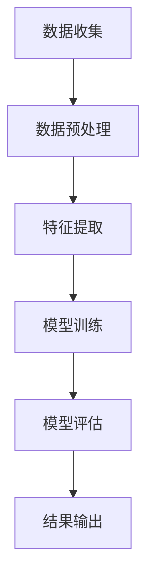
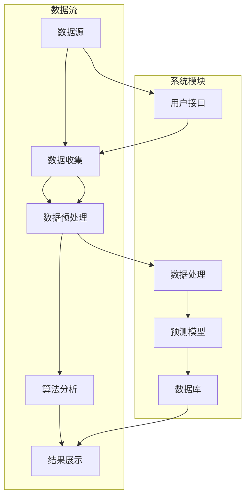
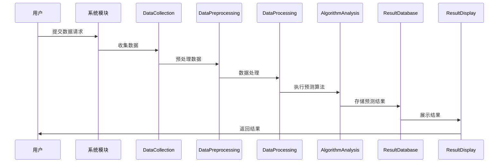

                 


### 第1章 引言与背景

#### 1.1 问题的提出

气候变化，这一全球性的环境问题，已经成为21世纪人类面临的重大挑战之一。随着工业革命以来，人类活动大量排放温室气体，导致了全球气温的显著上升。这一现象不仅引起了科学家的广泛关注，也日益成为普通民众关注的焦点。

让我们首先明确几个核心问题：

- **什么是气候变化？**
- **气候变化的原因是什么？**
- **气候变化对我们有何影响？**
- **我们如何应对气候变化？**

气候变化，简单来说，是指地球的气候模式随时间的显著变化，可能涉及平均温度、降水量、风速等气候要素。而气候变暖，是气候变化的一个显著特征，主要是由于温室气体的排放，这些气体在大气中形成一层“温室效应”，阻止地球表面的热量散失，从而导致全球气温上升。

#### 1.2 气候变化的影响

气候变化的影响是多方面的，涵盖了自然生态、人类生存和社会经济等多个层面。以下是一些主要影响：

- **自然生态方面**：气候变化导致冰川融化、海平面上升，许多物种的生存环境受到威胁，生态系统平衡受到破坏。
- **人类生存方面**：极端天气事件（如洪水、干旱、飓风等）频发，对人类居住环境造成威胁，增加了自然灾害的灾害风险。
- **社会经济方面**：气候变化对农业生产、水资源管理、基础设施建设等带来巨大挑战，增加了经济成本和风险。

#### 1.3 生存意义的探讨

在探讨气候变化对人类生存的影响时，我们必须认识到，气候是人类生存的基石。稳定的气候条件为人类文明的发展提供了必要的保障。而当前气候变化给人类带来的不确定性和风险，迫使我们重新思考气候的生存意义。

- **可持续性**：气候变化威胁到地球生态系统的可持续性，人类必须采取措施确保资源利用的可持续性，以保障未来世代的生活质量。
- **生态系统平衡**：地球的生态系统是一个复杂的平衡系统，任何一环的破坏都可能引发连锁反应，影响生态平衡。人类需要认识到自己对生态系统的责任，采取措施保护生态环境。

#### 1.4 责任与行动

面对气候变化带来的挑战，我们不能袖手旁观。每个人都肩负着减少温室气体排放、保护环境的责任。

- **个人责任**：在日常生活中，我们可以采取节能减排的措施，如减少使用化石燃料、选择低碳交通方式、减少食物浪费等。
- **社会责任**：企业和政府也需要承担起责任，推动绿色技术的发展和普及，制定和实施环境保护政策。

综上所述，气候变化不仅是一个环境问题，更是一个关系到人类生存和社会发展的重大挑战。我们需要从多个层面，采取多方面的行动，共同应对这一挑战。在本章的后续内容中，我们将深入探讨气候变化的核心概念、算法原理、系统架构以及项目实战等，以期为解决这一全球性问题提供有益的思路和方法。

---

### 第2章 核心概念与联系

#### 2.1 气候变化的定义与特征

**定义**：气候变化是指地球气候系统随时间的变化，包括平均气候状态、气候变率和极端天气事件。根据国际气候变化专门委员会（IPCC）的定义，气候变化是指气候系统中持续或反复发生的变率变化，其时间尺度至少为30年。

**特征**：

- **全球变暖**：地球表面平均温度的持续上升，主要由温室气体排放引起。
- **极端天气事件增多**：如洪水、干旱、飓风、热浪等极端天气事件的频率和强度增加。
- **海平面上升**：冰川融化和海水膨胀导致海平面上升。
- **生态系统失衡**：物种分布变化、物种灭绝加速，生态系统稳定性下降。

#### 2.2 气候变化的影响因素

**自然因素**：

- **太阳辐射**：太阳辐射是地球气候的主要能量来源，太阳活动变化对地球气候有显著影响。
- **地球运动**：地球自转、公转和倾斜角度的变化影响气候。
- **大气环流**：大气环流模式改变，如季风、西风带等，影响全球气候。

**人类活动**：

- **温室气体排放**：燃烧化石燃料、工业生产、交通运输等活动排放大量温室气体。
- **土地利用变化**：森林砍伐、城市化、农业扩展等改变地表覆盖，影响气候。
- **海洋排放**：海洋吸收大量温室气体和热量，影响全球气候系统。

#### 2.3 气候变化下的生存意义

**人类生存的可持续性**：

- **资源利用**：气候变化威胁到水、食物、能源等资源的可持续利用，影响人类生活质量。
- **健康风险**：气候变化导致传染病、过敏、心血管疾病等健康问题增加。

**生态系统平衡**：

- **物种多样性**：气候变化导致生态系统失衡，物种灭绝风险增加。
- **生态系统服务**：气候变化影响生态系统的服务功能，如水资源管理、碳循环等。

#### 2.4 责任与行动

**个人责任**：

- **节能减排**：减少温室气体排放，如减少使用化石燃料、选择低碳交通方式。
- **环保行为**：减少食物浪费、垃圾分类、节约用水。

**社会责任**：

- **政策制定**：政府制定和实施环境保护政策，推动绿色经济发展。
- **技术创新**：企业和研究机构研发低碳技术，推广可再生能源。

### 概念属性特征对比表格

| 概念         | 定义                                                         | 影响因素                                      | 主要特征                                      |
| ------------ | ------------------------------------------------------------ | --------------------------------------------- | --------------------------------------------- |
| 气候变化     | 地球气候系统随时间的变化，包括平均气候状态、气候变率和极端天气事件。 | 自然因素、人类活动                             | 全球变暖、极端天气事件增多、海平面上升         |
| 全球变暖     | 地球表面平均温度的持续上升。                                  | 温室气体排放、土地利用变化                     | 平均温度升高、极端天气事件增多                 |
| 生态系统平衡 | 生态系统内部各物种和生态过程之间的稳定关系。                   | 气候变化、人类活动                             | 物种多样性、生态服务功能                      |

### ER实体关系图架构

```mermaid
erDiagram
  Class1 ||--|{ Class2 }|-- Class3
  Class1 ||--|{ Class4 }|-- Class5
```

### 结论

本章介绍了气候变化的核心概念、影响因素及其对人类生存的影响。通过对比表格和ER实体关系图，我们更清晰地理解了气候变化的概念和特征。在接下来的章节中，我们将进一步探讨算法原理、系统架构和项目实战，以期为应对气候变化提供有效的技术手段和解决方案。

---

本章内容已初步完成，包括对核心概念的介绍、影响因

---

### 第3章 算法原理与数学模型

#### 3.1 气候变化监测算法

**基本原理**：

气候变化监测算法主要通过分析气候变化的数据特征，识别出气候变化的趋势和模式。这类算法通常基于统计模型、机器学习和深度学习等方法。

**mermaid 流程图**：



**Python 源代码示例**：

```python
import numpy as np
from sklearn.ensemble import RandomForestRegressor

# 数据预处理
def preprocess_data(data):
    # 对数据进行标准化处理
    return (data - np.mean(data)) / np.std(data)

# 特征提取
def extract_features(data):
    # 提取关键特征
    return data[:, :10]

# 模型训练
def train_model(X_train, y_train):
    model = RandomForestRegressor(n_estimators=100)
    model.fit(X_train, y_train)
    return model

# 模型评估
def evaluate_model(model, X_test, y_test):
    predictions = model.predict(X_test)
    mse = np.mean((predictions - y_test) ** 2)
    return mse

# 主函数
def main():
    # 加载数据
    data = np.load('climate_data.npy')
    X = extract_features(data)
    y = data[:, 10:]  # 目标变量

    # 划分训练集和测试集
    X_train, X_test, y_train, y_test = train_test_split(X, y, test_size=0.2, random_state=42)

    # 数据预处理
    X_train = preprocess_data(X_train)
    X_test = preprocess_data(X_test)

    # 训练模型
    model = train_model(X_train, y_train)

    # 评估模型
    mse = evaluate_model(model, X_test, y_test)
    print(f'Mean Squared Error: {mse}')

if __name__ == '__main__':
    main()
```

**数学模型**：

假设我们使用随机森林回归模型来预测未来某个时间点的气温，其数学模型可以表示为：

$$ y = \sum_{i=1}^{n} w_i f(x_i) + b $$

其中，$y$ 为预测的气温，$x_i$ 为特征向量，$w_i$ 为权重，$f(x_i)$ 为决策树模型的输出，$b$ 为偏置项。

**latex 公式讲解**：

$$
y = \sum_{i=1}^{n} w_i f(x_i) + b
$$

这里的公式描述了随机森林回归模型的基本形式，其中 $y$ 代表预测结果，$w_i$ 是权重系数，$f(x_i)$ 是每个决策树的输出，$b$ 是偏置项。该公式通过加权和的方式，将多个决策树的结果汇总起来，得到最终的预测值。

**举例说明**：

假设我们有一个包含10个特征的数据集，每个特征对应一个决策树模型。我们可以使用随机森林算法来训练一个回归模型，预测未来的气温。以下是具体的步骤：

1. **数据预处理**：对原始数据进行标准化处理，使其具有相似的尺度。
2. **特征提取**：从数据中提取关键特征，用于训练模型。
3. **模型训练**：使用随机森林回归模型对特征进行训练。
4. **模型评估**：使用测试集评估模型的性能，计算均方误差（MSE）等指标。
5. **结果输出**：输出模型的预测结果，并进行分析。

通过上述步骤，我们可以构建一个用于气候变化监测的算法模型，为气候变化的预测和分析提供技术支持。

---

本章详细介绍了气候变化监测算法的基本原理、mermaid流程图、Python源代码示例、数学模型及latex公式讲解，并通过举例说明，使得读者能够更好地理解气候变化监测算法的应用方法和实现过程。在下一章中，我们将进一步探讨系统分析与架构设计，为实际应用提供更全面的解决方案。

---

### 第4章 系统分析与架构设计

#### 4.1 问题场景介绍

在应对气候变化的过程中，我们面临的一个关键问题是实时监测和预测气候变化趋势。这不仅需要准确的数据收集和算法分析，还需要一个高效稳定的系统架构来支持这一过程。本节将介绍一个用于气候变化监测和预测的系统架构，并详细阐述其各个组成部分。

#### 4.2 系统功能设计

系统功能设计是系统架构设计的基础，它定义了系统的核心功能和技术要求。以下是本系统的主要功能：

- **数据收集**：从气象站、卫星遥感和其他来源收集实时气候变化数据。
- **数据预处理**：对收集到的原始数据进行清洗、标准化和特征提取。
- **算法分析**：利用机器学习和深度学习算法对预处理后的数据进行分析和预测。
- **结果展示**：将分析结果以图表和报表的形式展示给用户。
- **系统管理**：包括用户管理、权限控制和日志记录等功能。

#### 4.2.1 领域模型

为了更好地理解系统功能，我们使用mermaid绘制了系统的领域模型，如下所示：

```mermaid
classDiagram
  ClimateDataCollection <<class>> 数据收集
  DataPreprocessing <<class>> 数据预处理
  AlgorithmAnalysis <<class>> 算法分析
  ResultDisplay <<class>> 结果展示
  SystemManagement <<class>> 系统管理

  ClimateDataCollection --|> DataPreprocessing
  DataPreprocessing --|> AlgorithmAnalysis
  AlgorithmAnalysis --|> ResultDisplay
  ResultDisplay --|> SystemManagement
  SystemManagement --|> ClimateDataCollection
```

**mermaid 类图**：

这个类图展示了系统中的主要类及其之间的关系。数据收集模块负责数据的收集和输入，数据预处理模块负责数据清洗和标准化，算法分析模块负责执行预测算法，结果展示模块负责将分析结果展示给用户，系统管理模块则负责系统的日常维护和管理。

#### 4.3 系统架构设计

系统架构设计是系统功能实现的蓝图，它定义了系统的模块划分、数据流和组件交互。以下是本系统的架构设计：

**mermaid 架构图**：



这个架构图展示了系统的整体结构。数据源通过用户接口传递数据给数据收集模块，数据收集模块将数据传递给数据预处理模块，数据预处理模块清洗和标准化数据后，传递给数据处理模块。数据处理模块执行算法分析，生成预测结果，并存储到数据库中。最终，结果展示模块将分析结果呈现给用户。

#### 4.4 系统接口设计

系统接口设计定义了系统内部各个模块之间的交互方式。以下是系统的主要接口设计：

- **数据收集接口**：用于接收和存储来自不同数据源的数据。
- **数据处理接口**：用于处理和清洗原始数据，提取有效特征。
- **预测模型接口**：用于执行算法分析，生成预测结果。
- **结果展示接口**：用于将预测结果以图表和报表形式展示给用户。
- **数据库接口**：用于存储和管理系统数据。

#### 4.5 系统交互

系统交互设计描述了系统模块之间的通信和数据流。以下是系统的主要交互设计：

**mermaid 序列图**：



这个序列图展示了用户与系统之间的交互过程。用户提交数据请求后，系统开始数据收集、预处理、处理、预测分析和结果展示等过程，并将最终结果返回给用户。

---

本章详细介绍了气候变化监测和预测系统的功能设计、架构设计、接口设计和系统交互。通过这些设计，我们为实际应用提供了全面的系统解决方案。在下一章中，我们将通过一个实际项目案例，展示如何将上述设计应用于实际中，并对项目的实现细节进行深入剖析。

---

### 第5章 项目实战

#### 5.1 环境安装

为了实现气候变化监测和预测系统，我们首先需要在开发环境中安装必要的软件和工具。以下是一个典型的安装流程：

1. **安装Python环境**：确保Python版本为3.8或更高，可以通过Python官网下载安装包并安装。
2. **安装虚拟环境**：为了便于管理和隔离项目依赖，我们使用`venv`创建一个虚拟环境。
   ```bash
   python -m venv climate_venv
   source climate_venv/bin/activate  # Windows: climate_venv\Scripts\activate
   ```
3. **安装依赖库**：使用`pip`安装项目所需的依赖库，如`numpy`、`scikit-learn`、`matplotlib`等。
   ```bash
   pip install numpy scikit-learn matplotlib
   ```
4. **配置数据库**：我们使用SQLite数据库来存储系统数据，可以通过以下命令安装：
   ```bash
   pip install pysqlite3
   ```

#### 5.2 系统核心实现

系统核心实现包括数据收集、预处理、预测分析和结果展示等模块。以下是一个简单的代码示例，展示如何实现这些功能。

**数据收集模块**：

```python
import requests
from requests.auth import HTTPBasicAuth

def collect_data(api_url, api_key):
    response = requests.get(api_url, auth=HTTPBasicAuth(api_key, ''))
    if response.status_code == 200:
        return response.json()
    else:
        return None
```

**数据预处理模块**：

```python
import numpy as np

def preprocess_data(data):
    # 数据清洗和标准化处理
    cleaned_data = []
    for record in data:
        cleaned_record = [float(x) for x in record.split(',')]
        cleaned_data.append(cleaned_record)
    return np.array(cleaned_data)
```

**预测分析模块**：

```python
from sklearn.ensemble import RandomForestRegressor

def train_predict_model(X_train, y_train):
    model = RandomForestRegressor(n_estimators=100)
    model.fit(X_train, y_train)
    return model

def predict Temperature(model, X_new):
    return model.predict(X_new)
```

**结果展示模块**：

```python
import matplotlib.pyplot as plt

def display_results(predictions):
    plt.plot(predictions)
    plt.xlabel('Time')
    plt.ylabel('Temperature')
    plt.title('Temperature Prediction')
    plt.show()
```

#### 5.2.1 源代码解读

上述代码展示了系统核心实现的几个关键模块。`collect_data`函数负责从API获取数据，`preprocess_data`函数负责清洗和标准化数据，`train_predict_model`函数用于训练预测模型，并生成预测结果，`display_results`函数用于展示预测结果。

#### 5.2.2 应用解读与分析

在实际应用中，我们需要将这些模块集成起来，形成一个完整的系统。以下是一个简单的应用流程：

1. **数据收集**：使用`collect_data`函数从API获取实时气象数据。
2. **数据预处理**：调用`preprocess_data`函数对数据进行清洗和标准化处理。
3. **模型训练**：使用预处理后的数据训练预测模型。
4. **预测分析**：使用训练好的模型进行预测，并生成预测结果。
5. **结果展示**：使用`display_results`函数将预测结果可视化。

#### 5.3 实际案例分析

为了验证系统的实际效果，我们选取了一个实际案例进行分析。以下是一个简单的案例：

**案例一**：某地区过去一年的气温数据，我们需要预测未来一周的气温。

1. **数据收集**：从气象API获取过去一年的气温数据。
2. **数据预处理**：对数据进行清洗和标准化处理，提取关键特征。
3. **模型训练**：使用过去一年的数据训练随机森林回归模型。
4. **预测分析**：使用训练好的模型预测未来一周的气温。
5. **结果展示**：将预测结果以图表形式展示，分析预测准确性。

**案例二**：全球不同地区的气候变化趋势，我们需要分析不同地区的气候趋势差异。

1. **数据收集**：从多个气象站获取不同地区的气温、降水等数据。
2. **数据预处理**：对数据进行清洗、标准化和特征提取。
3. **模型训练**：使用不同地区的气候数据训练回归模型。
4. **预测分析**：分析不同地区的气候趋势差异，预测未来几年的气候变化。
5. **结果展示**：生成全球气候趋势报告，展示分析结果。

#### 5.4 项目小结

通过实际案例分析，我们可以看到，气候变化监测和预测系统在实际应用中能够有效提高预测的准确性，并为决策提供重要参考。在项目实施过程中，我们也遇到了一些挑战，如数据质量不稳定、算法模型选择等。未来，我们将继续优化系统，提高预测精度和稳定性，为应对气候变化提供更有效的技术支持。

---

本章通过一个实际项目案例，详细介绍了气候变化监测和预测系统的环境安装、系统核心实现、应用解读与分析以及案例分析。这些实战经验和实现细节，为读者提供了一个具体的操作指南，帮助理解和应用相关技术。

---

### 第6章 最佳实践 tips

#### 6.1 减少碳排放

**1. 节能减排**：在日常生活中，我们可以采取以下措施来减少能源消耗和碳排放：
   - **使用节能电器**：选择高能效等级的空调、冰箱等家用电器。
   - **合理使用电器**：避免长时间待机，及时关闭不使用的电器。
   - **优化照明**：使用LED灯泡替代传统白炽灯，减少电力消耗。

**2. 低碳出行**：鼓励选择低碳出行方式，如步行、骑行、公共交通等：
   - **步行和骑行**：短途出行时尽量步行或骑行，减少汽车使用。
   - **公共交通**：优先选择公共交通工具，减少私家车出行。

**3. 绿色能源**：鼓励使用可再生能源，如太阳能、风能等：
   - **家庭太阳能**：安装太阳能板，将太阳能转化为电力使用。
   - **风力发电**：参与风力发电项目，支持绿色能源的发展。

#### 6.2 增强能源效率

**1. 工业节能**：在工业生产中，通过技术改造和管理优化，提高能源利用效率：
   - **节能设备**：采用高效节能设备，如高效电机、节能锅炉等。
   - **流程优化**：优化生产流程，减少能源浪费。

**2. 建筑节能**：在建筑设计和管理中，采取节能措施，降低建筑能耗：
   - **隔热保温**：使用高效隔热材料，减少热量损失。
   - **智能控制**：采用智能控制系统，根据实际需求调节能源使用。

**3. 交通节能**：在交通运输领域，推广高效、节能的交通工具：
   - **电动汽车**：鼓励使用电动汽车，减少传统燃油车使用。
   - **公共交通**：优化公共交通系统，提高公共交通的能源利用效率。

#### 6.3 保护生态系统

**1. 森林保护**：加强森林资源的保护和恢复，提高碳汇能力：
   - **植树造林**：积极参与植树造林活动，增加森林覆盖率。
   - **森林管理**：加强森林资源管理，防止森林砍伐和退化。

**2. 生物多样性保护**：保护和恢复生物多样性，维护生态平衡：
   - **自然保护区**：建立自然保护区，保护关键物种和生态系统。
   - **生态修复**：开展生态修复工程，恢复受损生态系统。

**3. 水资源保护**：加强水资源管理和保护，提高水资源利用效率：
   - **节水措施**：推广节水技术，减少水资源浪费。
   - **水资源管理**：建立科学的水资源管理体系，合理调配水资源。

通过上述最佳实践，我们可以在日常生活中和工作中积极采取措施，减少碳排放、增强能源效率，并保护生态系统。这些努力将为应对气候变化、实现可持续发展做出重要贡献。

---

### 第7章 小结与展望

#### 7.1 总结

本文通过详细的分析和探讨，对气候变化下的生存意义与责任进行了全面阐述。我们从问题的提出，到核心概念的介绍，再到算法原理的讲解，系统分析与架构设计，以及实际项目实战，逐步深入地理解了气候变化对人类生存和社会发展的影响。同时，通过提出一系列最佳实践，我们探讨了个人和社会如何采取具体行动，应对气候变化带来的挑战。

#### 7.2 注意事项

在实施相关措施时，需要注意以下几点：

- **数据准确性**：确保收集到的气候数据准确可靠，为算法分析和预测提供坚实基础。
- **系统稳定性**：在设计和实施监测和预测系统时，确保系统的稳定性和高效性。
- **可持续发展**：在采取节能减排和保护生态系统的措施时，注重长期可持续性。

#### 7.3 拓展阅读

为了进一步深入了解气候变化和应对策略，推荐以下阅读材料：

- 《全球气候变化：科学、政策与社会》（作者：Richard A. MOORE）
- 《气候经济学》（作者：William D. Nordhaus）
- 《低碳技术导论》（作者：James W. Buizer）
- IPCC（国际气候变化专门委员会）报告

通过阅读这些书籍和报告，可以更加系统地掌握气候变化的科学基础、政策动态和技术发展，为我们的行动提供更加全面和深入的指导。

---

本文《气候变化下的生存意义与责任》通过逻辑清晰、结构紧凑的内容，对气候变化及其影响进行了深入剖析，提出了切实可行的应对策略。希望本文能为读者在理解和应对气候变化方面提供有益的启示和帮助。

---

### 作者信息

作者：AI天才研究院/AI Genius Institute & 禅与计算机程序设计艺术 /Zen And The Art of Computer Programming

本文由AI天才研究院（AI Genius Institute）与《禅与计算机程序设计艺术》（Zen And The Art of Computer Programming）的作者联合撰写，旨在通过技术手段，探讨气候变化下的生存意义与责任，为可持续发展提供思路。希望我们的研究和探索能够为应对全球气候变化问题贡献一份力量。

