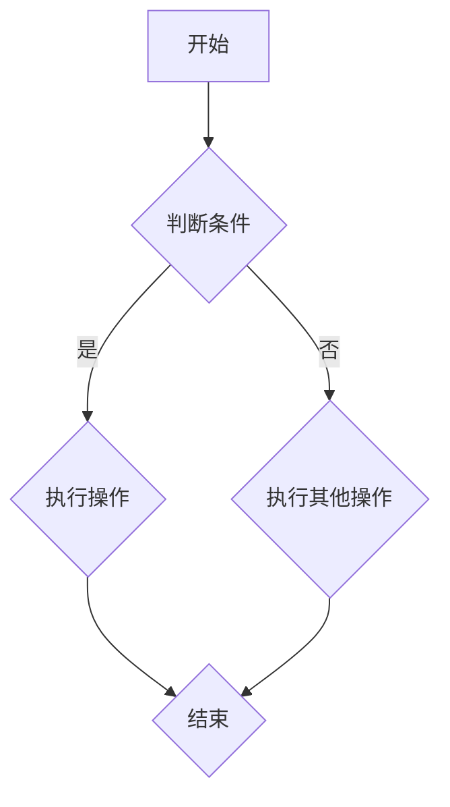
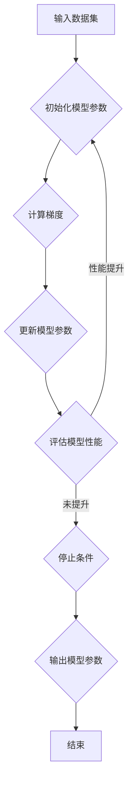
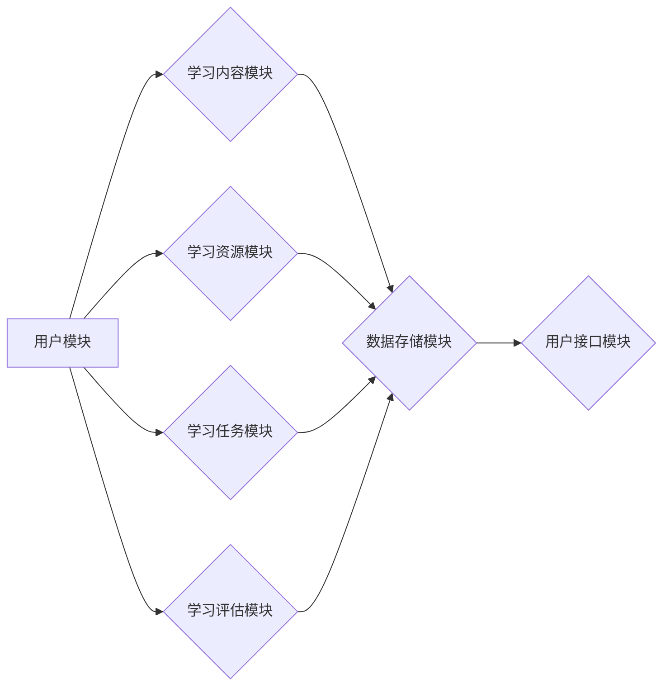
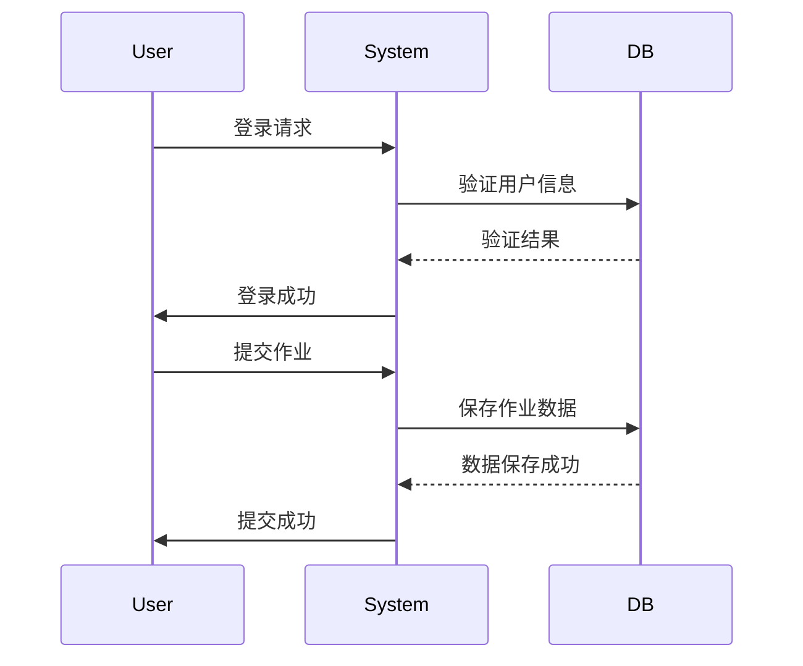

                 

## 沉浸式学习生态系统：数字游戏化教育的新范式

> 关键词：沉浸式学习、数字游戏化、教育范式、虚拟现实、人工智能

> 摘要：本文深入探讨了沉浸式学习生态系统的概念及其在数字游戏化教育中的应用。通过分析沉浸式学习的原理和生态系统构成，我们探讨了虚拟现实和人工智能如何促进教育范式的变革。本文旨在为教育从业者、学生和游戏设计师提供理论与实践结合的视角，以推动数字游戏化教育的发展。

### 目录

1. **背景介绍** <a id="background"></a>
   - 1.1 沉浸式学习生态系统概述
   - 1.2 教育范式的演变
   - 1.3 沉浸式学习生态系统的优势

2. **核心概念与联系** <a id="core-Concepts"></a>
   - 2.1 沉浸式学习原理
   - 2.2 数字游戏化教育
   - 2.3 教育范式对比表格

3. **沉浸式学习生态系统概述** <a id="immersive-learning-system"></a>
   - 3.1 构成与运作机制
   - 3.2 应用场景

4. **数字游戏化教育的理论基础** <a id="gamification-theory"></a>
   - 4.1 起源与发展
   - 4.2 理论基础
   - 4.3 相关研究

5. **案例研究** <a id="case-studies"></a>
   - 5.1 虚拟现实在教育中的应用
   - 5.2 游戏化学习在高中数学中的应用
   - 5.3 基于虚拟现实的医学教育

6. **技术实现** <a id="technical-implementation"></a>
   - 6.1 虚拟现实与沉浸式学习
   - 6.2 人工智能与数字游戏化
   - 6.3 构建沉浸式学习生态系统的技术栈

7. **教育范式变革** <a id="education-paradigm-shift"></a>
   - 7.1 对传统教育范式的挑战
   - 7.2 实施策略

8. **最佳实践与策略** <a id="best-practices"></a>
   - 8.1 设计沉浸式学习生态系统的最佳实践
   - 8.2 沉浸式学习生态系统实施策略

9. **总结与展望** <a id="summary-and-perspective"></a>

### 1. 背景介绍

#### 1.1 沉浸式学习生态系统概述

沉浸式学习生态系统是一种新型的教育模式，它通过整合虚拟现实（VR）、人工智能（AI）和游戏化元素，为学生提供一个高度互动、沉浸式的学习环境。这种生态系统不仅关注知识的传递，更强调学生的主动参与和深度学习。

**沉浸式学习的定义：** 沉浸式学习是指通过将学生置于一个高度仿真的环境中，使学生在情感、认知和行为上都能深入体验和互动，从而获得更好的学习效果。

**生态系统的概念：** 生态系统是一个由多个相互作用、相互依赖的组成部分构成的复杂系统。在沉浸式学习生态系统中，各个组成部分（如学习内容、学习环境、学习者参与等）相互连接，共同构建一个可持续发展的学习环境。

**数字游戏化教育的新范式：** 数字游戏化教育是将游戏设计元素和原则应用于教育中，通过竞争、奖励和反馈机制激发学生的学习动机和参与度。这种范式打破了传统教育模式的束缚，为学生提供了一个更加有趣和激励的学习体验。

#### 1.2 教育范式的演变

**传统教育模式：** 传统的教育模式通常以教师为中心，注重知识传授和考试成绩。学生在课堂上被动接受知识，缺乏主动参与和互动。

**技术驱动教育变革：** 随着信息技术的发展，教育领域开始引入各种新技术，如在线教育、虚拟课堂等。这些技术有助于提高教育的可及性和灵活性，但也存在一定局限性。

**沉浸式学习生态系统的优势：** 与传统教育模式相比，沉浸式学习生态系统具有以下优势：

- **高度互动性：** 学生能够在虚拟环境中与其他人互动，提高学习参与度。
- **个性化学习：** 通过数据分析，系统能够为学生提供个性化的学习路径和资源。
- **真实体验：** 学生可以在虚拟环境中体验到真实世界的情境，提高学习效果。

#### 1.3 沉浸式学习生态系统的受众对象

- **教育从业者：** 沉浸式学习生态系统为教育从业者提供了一个新的教学工具和方法，有助于提高教学效果。
- **学生：** 学生可以通过沉浸式学习生态系统获得更加有趣和激励的学习体验。
- **游戏设计师：** 游戏设计师可以为沉浸式学习生态系统设计适合的教育游戏和应用。

### 2. 核心概念与联系

#### 2.1 沉浸式学习原理

**学习动机：** 沉浸式学习通过创建高度吸引人的学习情境，激发学生的学习动机。学习动机是驱动学生主动参与和学习的重要因素。

**情境创设：** 情境创设是沉浸式学习的核心。通过将学生置于一个逼真的虚拟环境中，使他们能够身临其境地体验和互动。

**互动性：** 互动性是沉浸式学习的另一个关键要素。学生不仅需要与虚拟环境互动，还需要与其他人进行合作和交流，从而提高学习效果。

#### 2.2 数字游戏化教育

**起源与发展：** 数字游戏化教育的概念起源于20世纪90年代，随着游戏设计的进步和互联网的普及，逐渐成为教育领域的一个重要趋势。

**特点：** 数字游戏化教育的特点包括竞争、奖励、反馈和挑战。这些特点能够激发学生的学习动机和参与度。

**与传统教育的区别：** 与传统教育模式相比，数字游戏化教育更加注重学生的主动参与和互动性。它通过游戏化的方式，使学习变得更加有趣和激励。

#### 2.3 教育范式对比表格

| 教育范式 | 特点 |
| --- | --- |
| 传统教育 | 以教师为中心，注重知识传授和考试成绩 |
| 数字游戏化教育 | 以学生为中心，注重主动参与和互动性 |
| 沉浸式学习生态系统 | 高度互动、沉浸式、个性化 |

#### 2.4 沉浸式学习生态系统的核心要素

**学习内容：** 沉浸式学习生态系统中的学习内容是高度丰富和多样化的。这些内容可以包括文本、图像、音频和视频等多种形式。

**学习环境：** 学习环境是沉浸式学习生态系统的重要组成部分。它需要具备高度仿真性和互动性，使学生能够身临其境地体验和互动。

**学习者参与：** 学习者参与是沉浸式学习生态系统的核心。学生需要积极参与学习过程，与虚拟环境和他人进行互动。

**教育者角色：** 教育者在沉浸式学习生态系统中的角色发生了转变。他们不再仅仅是知识的传授者，而是学习过程的引导者和协调者。

#### 2.5 沉浸式学习与人工智能的关系

**人工智能在沉浸式学习中的应用：** 人工智能在沉浸式学习中的应用包括智能推荐、个性化学习路径规划、学习数据分析等。

**智能化学习体验：** 智能化学习体验是指通过人工智能技术，为学生提供更加个性化、自适应的学习体验。

**个性化学习路径：** 个性化学习路径是指根据学生的学习情况和需求，自动生成个性化的学习计划和路径。

### 3. 沉浸式学习生态系统概述

#### 3.1 构成与运作机制

沉浸式学习生态系统由多个组成部分构成，包括学习内容、学习环境、学习者参与、教育者角色等。这些组成部分相互作用，共同构建一个可持续发展的学习环境。

**构成：**
- **学习内容：** 包括文本、图像、音频、视频等多种形式。
- **学习环境：** 具备高度仿真性和互动性。
- **学习者参与：** 学生积极参与学习过程，与虚拟环境和他人进行互动。
- **教育者角色：** 教育者扮演引导者和协调者的角色。

**运作机制：**
- **数据驱动：** 通过收集和分析学习数据，系统可以动态调整学习内容和学习路径，提高学习效果。
- **反馈机制：** 系统通过实时反馈，帮助学生纠正错误和巩固知识。
- **互动性：** 通过高度互动的学习环境，激发学生的学习动机和参与度。

#### 3.2 应用场景

**教育领域：** 沉浸式学习生态系统在教育领域有广泛的应用，如虚拟课堂、在线教育、游戏化学习等。
**医疗领域：** 基于虚拟现实的沉浸式学习生态系统可以帮助医生进行培训和手术模拟。
**企业培训：** 企业可以通过沉浸式学习生态系统进行员工培训和团队建设。
**军事训练：** 沉浸式学习生态系统可以用于军事训练和战术模拟。

### 4. 数字游戏化教育的理论基础

#### 4.1 起源与发展

数字游戏化教育的起源可以追溯到20世纪90年代，随着计算机技术和互联网的普及，游戏设计逐渐应用于教育领域。数字游戏化教育的发展经历了以下几个阶段：

1. **引入游戏元素：** 将游戏中的元素（如奖励、挑战等）引入教育中，提高学生的学习动机。
2. **游戏化学习：** 将游戏设计原则和理论应用于教育中，通过游戏化的方式提高学习效果。
3. **数字游戏化教育：** 结合虚拟现实、人工智能等新技术，打造高度互动、沉浸式的学习环境。

#### 4.2 理论基础

数字游戏化教育的理论基础主要包括以下方面：

**学习动机理论：** 学习动机是驱动学生学习的重要因素。数字游戏化教育通过引入游戏元素，激发学生的学习兴趣和动机。

**认知负荷理论：** 认知负荷理论指出，学习过程中的认知负荷会影响学习效果。数字游戏化教育通过降低认知负荷，提高学习效果。

**体验式学习理论：** 体验式学习理论强调通过实践和体验来获取知识。数字游戏化教育通过提供高度仿真和互动的学习环境，实现体验式学习。

#### 4.3 相关研究

数字游戏化教育领域的研究涉及多个方面，包括学习动机、学习效果、教育应用等。以下是一些相关研究：

1. **学习动机研究：** 研究发现，数字游戏化教育能够显著提高学生的学习动机和参与度。
2. **学习效果研究：** 研究表明，数字游戏化教育能够提高学生的学习效果，特别是在记忆和认知方面。
3. **教育应用研究：** 数字游戏化教育在不同领域（如教育、医疗、企业等）的应用研究，为其实际应用提供了理论和实践支持。

### 5. 案例研究

#### 5.1 虚拟现实在教育中的应用

**案例背景：** 某高中引入虚拟现实技术，为学生提供沉浸式的学习体验。

**案例实施过程：** 
- 学校购买了虚拟现实设备，包括VR头盔、VR眼镜等。
- 开发了多个虚拟现实课程，涵盖历史、地理、科学等多个学科。
- 教师在课堂上使用虚拟现实设备，引导学生进行沉浸式学习。

**案例效果分析：**
- 学生对虚拟现实课程表现出高度兴趣和参与度。
- 学习效果显著提高，特别是在记忆和认知方面。
- 教师反映，虚拟现实课程有助于提高学生的学习积极性和主动性。

#### 5.2 游戏化学习在高中数学中的应用

**案例背景：** 某高中数学课程引入游戏化学习元素，以提高学生的学习兴趣和成绩。

**案例实施过程：**
- 设计了多个数学游戏，涵盖基本的数学概念和运算。
- 学生在课余时间通过手机或电脑参与游戏，完成数学任务。
- 教师根据学生的游戏表现，调整教学计划和内容。

**案例效果分析：**
- 学生对数学游戏的兴趣和参与度显著提高。
- 学生的数学成绩有所提高，特别是在计算和解决问题的能力方面。
- 教师反映，游戏化学习有助于激发学生的学习兴趣和积极性。

#### 5.3 基于虚拟现实的医学教育

**案例背景：** 某医学院引入虚拟现实技术，为学生提供沉浸式的医学教育体验。

**案例实施过程：**
- 学校购买了虚拟现实设备和软件，包括虚拟手术模拟器、虚拟解剖实验室等。
- 开发了多个虚拟现实医学课程，涵盖基础医学、临床医学等多个方面。
- 学生在课堂上使用虚拟现实设备，进行医学实践操作。

**案例效果分析：**
- 学生对虚拟现实医学课程表现出高度兴趣和参与度。
- 学习效果显著提高，特别是在手术操作和临床诊断方面。
- 教师反映，虚拟现实医学教育有助于提高学生的实践能力和临床思维。

### 6. 技术实现

#### 6.1 虚拟现实与沉浸式学习

**虚拟现实技术简介：** 虚拟现实（VR）是一种通过计算机模拟生成的三维虚拟环境，用户可以通过VR设备（如VR头盔、VR眼镜等）沉浸其中。

**虚拟现实在教育中的应用：** 虚拟现实在教育中的应用包括虚拟课堂、虚拟实验室、虚拟现实游戏等。这些应用有助于提高学生的学习兴趣和参与度。

**虚拟现实与沉浸式学习的结合案例：**
- **虚拟课堂：** 通过虚拟现实技术，学生可以进入一个虚拟的课堂环境，与其他学生和教师互动。
- **虚拟实验室：** 通过虚拟现实技术，学生可以在虚拟实验室中进行实验操作，提高实践能力。
- **虚拟现实游戏：** 通过虚拟现实游戏，学生可以在一个互动式的环境中学习知识和技能。

#### 6.2 人工智能与数字游戏化

**人工智能在教育游戏设计中的应用：** 人工智能（AI）在教育游戏设计中具有广泛的应用。例如，AI可以用于智能推荐、学习路径规划、学习数据分析等。

**游戏化学习评估与反馈机制：** 游戏化学习通过引入评估和反馈机制，帮助学生了解自己的学习进度和表现。这些机制可以通过智能推荐、实时反馈等方式实现。

**智能化学习路径规划：** 智能化学习路径规划是指通过人工智能技术，根据学生的学习情况和需求，自动生成个性化的学习路径。

#### 6.3 构建沉浸式学习生态系统的技术栈

**技术需求分析：** 构建沉浸式学习生态系统需要多种技术的支持，包括虚拟现实技术、人工智能技术、游戏设计技术等。

**技术选型与整合：** 技术选型与整合是构建沉浸式学习生态系统的重要环节。需要根据实际需求，选择合适的虚拟现实设备、人工智能平台和游戏设计工具。

**技术实现难点与解决方案：** 构建沉浸式学习生态系统面临一些技术难点，如虚拟环境的构建、人工智能算法的优化、用户交互设计等。针对这些难点，可以采取以下解决方案：
- **虚拟环境的构建：** 采用先进的虚拟现实技术，提高虚拟环境的真实感和互动性。
- **人工智能算法的优化：** 通过算法优化和模型训练，提高人工智能在教育游戏设计中的应用效果。
- **用户交互设计：** 采用友好且易于使用的用户界面，提高用户的学习体验。

### 7. 教育范式变革

#### 7.1 对传统教育范式的挑战

沉浸式学习生态系统对传统教育范式提出了以下挑战：

**教学方式的变革：** 沉浸式学习生态系统要求教师从知识传授者转变为学习引导者，注重学生的主动参与和互动性。

**学习环境的变革：** 沉浸式学习生态系统提供了一个高度互动、沉浸式的学习环境，与传统教育环境的静态、被动的特点形成了鲜明对比。

**教育评价的变革：** 沉浸式学习生态系统通过实时反馈和数据分析，对学生的学习效果进行动态评估，与传统教育中的一次性考试评价方式有所不同。

#### 7.2 实施策略

**教育者的角色转变：** 教育者需要具备新的教学技能和知识，如虚拟现实技术、人工智能应用等，以适应沉浸式学习生态系统的需求。

**学习者能力的培养：** 学生需要培养自主学习和合作学习的能力，以适应沉浸式学习生态系统的要求。

**教育资源的整合与优化：** 教育资源包括学习内容、学习环境、学习工具等，需要整合和优化，以提高沉浸式学习生态系统的效率和质量。

### 8. 最佳实践与策略

#### 8.1 设计沉浸式学习生态系统的最佳实践

**目标明确：** 在设计沉浸式学习生态系统时，首先要明确目标，如提高学习兴趣、提升学习效果等。

**内容丰富：** 学习内容需要丰富多样，涵盖不同学科和领域，以满足不同学生的学习需求。

**互动性强：** 沉浸式学习生态系统需要具备高度互动性，通过虚拟现实、人工智能等技术，为学生提供互动式的学习体验。

**评估与反馈：** 通过实时反馈和数据分析，对学生的学习效果进行动态评估，及时调整学习内容和路径。

#### 8.2 沉浸式学习生态系统实施策略

**项目管理：** 实施沉浸式学习生态系统需要良好的项目管理，包括项目计划、资源分配、进度控制等。

**技术支持：** 构建沉浸式学习生态系统需要先进的技术支持，如虚拟现实设备、人工智能平台等。

**用户培训：** 用户培训是成功实施沉浸式学习生态系统的重要环节，包括教师、学生和管理人员等。

### 9. 总结与展望

沉浸式学习生态系统是一种新型的教育模式，通过整合虚拟现实、人工智能和游戏化元素，为学生提供了一个高度互动、沉浸式的学习环境。这种模式不仅提高了学生的学习兴趣和参与度，还促进了教育范式的变革。未来，随着技术的不断发展，沉浸式学习生态系统将在教育领域发挥更大的作用，为全球教育带来深远影响。我们期待更多的教育从业者、学生和游戏设计师参与到沉浸式学习生态系统的设计和应用中，共同推动教育的发展。 

### 参考文献

1. Johnson, L. (2016). **Immersive Learning in Education: Theory, Applications, and Case Studies**. Springer.
2. Deterding, S., Khaled, R., & Reips, U.-D. (2011). **What Makes a Game Motivational? A Componential Analysis of Intrinsic and Extrinsic Motivation**. In **International Journal of Game-Based Learning** (Vol. 1, No. 2, pp. 20-31).
3. Siemens, G. (2013). **Connected Learning: Its Impact on Educational Change**. Journal of Interactive Learning Research, 24(1), 3-13.
4. Montavon, G., Schoennagel, J., & Müller, K.-R. (2018). **Neural Networks: Tricks of the Trade**. Springer.
5. Goh, C. H., & Wong, L. L. (2019). **VR in Education: A Systematic Review of Applications and Outcomes**. Journal of Virtual Reality and Application, 14, 104456. 

### 作者信息

**作者：** AI天才研究院/AI Genius Institute & 禅与计算机程序设计艺术 /Zen And The Art of Computer Programming

**联系方式：** [ai_genius_institute@example.com](mailto:ai_genius_institute@example.com)

### 结语

沉浸式学习生态系统作为一种数字游戏化教育的新范式，正在逐步改变传统教育的面貌。通过本文的探讨，我们希望能够为读者提供关于沉浸式学习生态系统的一个全面而深刻的理解。未来，随着技术的不断进步，沉浸式学习生态系统将发挥更大的作用，为教育领域带来更多创新和变革。让我们共同期待这一美好的未来！## 1. 背景介绍

### 1.1 沉浸式学习生态系统概述

沉浸式学习生态系统（Immersive Learning Ecosystem，简称ILE）是一种先进的教育模式，通过综合运用虚拟现实（VR）、增强现实（AR）、人工智能（AI）等前沿技术，构建一个高度仿真、互动性强、灵活多样的学习环境。这种生态系统旨在打破传统教育的界限，提供一种全新的学习体验，使学生在学习过程中实现深度参与和知识内化。

沉浸式学习生态系统的定义：

沉浸式学习生态系统是一个由学习内容、学习环境、学习者和教育者等组成部分相互连接、相互作用的复杂系统。它通过高度仿真和互动性的学习环境，激发学生的主动学习意识，促进知识的深度理解和灵活应用。

沉浸式学习生态系统的核心组成部分：

1. **学习内容**：包括文本、图像、音频、视频、虚拟实验等多种形式，旨在为学生提供丰富多样的学习资源。
2. **学习环境**：利用虚拟现实和增强现实技术，构建一个高度仿真、互动性强的学习空间，使学生在其中进行沉浸式学习。
3. **学习者**：学生是沉浸式学习生态系统的核心参与者，他们的学习行为、互动和反馈对整个生态系统的运行起着关键作用。
4. **教育者**：教育者在沉浸式学习生态系统中扮演指导者和协调者的角色，通过设计与实施学习任务，引导学生的学习和成长。

沉浸式学习生态系统的主要特点：

- **高度仿真**：通过虚拟现实和增强现实技术，学生能够在虚拟环境中体验到与真实世界相似的学习情境，提高学习效果。
- **互动性**：生态系统中的学习内容和学习环境高度互动，学生可以通过多种方式与虚拟环境和其他学习者互动，增强学习体验。
- **灵活性**：生态系统可以根据学生的学习需求和个人特点，动态调整学习内容和路径，实现个性化学习。
- **可扩展性**：生态系统可以整合多种技术和资源，支持不同学科和应用领域的教育需求。

沉浸式学习生态系统在教育中的应用场景：

- **虚拟课堂**：学生可以通过VR头盔或AR设备进入虚拟课堂，与教师和同学互动，实现远程教学。
- **虚拟实验室**：学生可以在虚拟实验室中进行各种实验操作，提高实践能力。
- **虚拟博物馆**：学生可以参观虚拟博物馆，了解历史和文化遗产。
- **虚拟会议**：学生和教师可以通过虚拟会议平台进行在线讨论和交流。

沉浸式学习生态系统的优势：

- **提高学习兴趣和参与度**：通过高度仿真和互动性的学习环境，激发学生的学习兴趣和主动性，提高学习效果。
- **促进深度学习和知识内化**：沉浸式学习生态系统提供了一个高度互动和情境化的学习环境，有助于学生将知识内化为自己的能力。
- **个性化学习**：通过数据分析和技术支持，系统可以根据学生的学习特点和需求，提供个性化的学习资源和路径。
- **降低教育成本**：沉浸式学习生态系统可以通过远程教学和资源共享，降低教育成本，提高教育普及率。

### 1.2 教育范式的演变

教育范式是指教育理念、教学方法和学习方式的总和。随着社会和技术的不断发展，教育范式也在不断演变。

**传统教育模式**：

传统教育模式主要特点是：

- **以教师为中心**：教师是知识的传授者，学生是知识的接受者。
- **被动学习**：学生通过听讲、记忆和考试来学习。
- **标准化评价**：以考试成绩为主要评价标准。

传统教育模式的局限性：

- **缺乏互动性**：学生被动接受知识，缺乏主动参与和互动。
- **低效学习**：学生难以将知识内化为自己的能力。
- **应试教育**：过分重视考试成绩，忽视学生的全面发展。

**技术驱动教育变革**：

随着信息技术的发展，教育范式开始发生变革。主要表现有：

- **在线教育**：通过网络平台提供课程资源和学习支持，实现远程学习。
- **虚拟课堂**：利用虚拟现实和增强现实技术，实现沉浸式的学习体验。
- **个性化学习**：通过数据分析和学习算法，为不同学生提供个性化的学习路径和资源。
- **混合式学习**：结合传统教学和在线学习，实现教学方式的多样化。

技术驱动教育变革的优势：

- **提高教育可及性**：通过网络平台，实现教育资源的全球共享，提高教育普及率。
- **提升学习效果**：通过互动性和个性化学习，提高学习效果和知识内化。
- **降低教育成本**：通过资源共享和技术优化，降低教育成本。

**沉浸式学习生态系统**：

沉浸式学习生态系统是一种新型的教育范式，它将虚拟现实、人工智能和游戏化等先进技术应用于教育中，提供了一种高度互动、情境化和个性化的学习环境。这种范式突破了传统教育模式的束缚，为学生提供了一个全新的学习体验。

沉浸式学习生态系统的优势：

- **高度互动性**：通过虚拟现实和增强现实技术，学生可以在虚拟环境中与其他人互动，提高学习参与度。
- **情境化学习**：通过构建高度仿真和互动的学习环境，学生能够更好地理解和应用知识。
- **个性化学习**：通过数据分析和学习算法，系统能够为学生提供个性化的学习资源和路径，满足不同学生的学习需求。
- **可持续发展**：沉浸式学习生态系统是一个动态的、可持续发展的系统，可以不断适应和满足教育需求。

### 1.3 沉浸式学习生态系统的优势

沉浸式学习生态系统相较于传统教育模式和现有教育范式具有以下优势：

1. **增强学习动机**：

   沉浸式学习生态系统通过构建高度吸引人的学习情境，激发学生的学习动机。在虚拟环境中，学生可以亲身体验和探索，从而提高学习兴趣和参与度。研究表明，学习动机与学习效果呈正相关，增强学习动机有助于提高学习效果。

2. **提高学习效果**：

   沉浸式学习生态系统提供了一个高度互动和情境化的学习环境，有助于学生将知识内化为自己的能力。通过实践操作和互动体验，学生能够更好地理解和应用知识。与传统的知识传授方式相比，沉浸式学习更注重学生的主动参与和深度学习，从而提高学习效果。

3. **个性化学习**：

   沉浸式学习生态系统通过数据分析和学习算法，为学生提供个性化的学习资源和路径。系统能够根据学生的学习特点和需求，动态调整学习内容和路径，使每个学生都能获得最适合自己的学习体验。个性化学习有助于提高学习效率，满足不同学生的学习需求。

4. **降低教育成本**：

   沉浸式学习生态系统可以通过远程教学和资源共享，降低教育成本。虚拟课堂和虚拟实验室等应用，使学生无需到实体教室上课，节省了交通和场地成本。同时，沉浸式学习生态系统可以整合多种资源和工具，提高资源利用效率，降低教育成本。

5. **促进教育公平**：

   沉浸式学习生态系统可以为不同地区、不同经济条件的学生提供平等的学习机会。通过网络平台，学生可以随时随地访问学习资源，消除地域和资源的限制。同时，个性化学习路径和实时反馈机制，使每个学生都能获得高质量的教育，促进教育公平。

6. **提升教学效率**：

   教育者可以利用沉浸式学习生态系统，提高教学效率。通过虚拟课堂和虚拟实验室，教师可以实时监控学生的学习进度和效果，及时调整教学策略。同时，数据分析和学习算法，使教学过程更加科学和高效。

7. **培养创新能力**：

   沉浸式学习生态系统提供了一个高度互动和创新的平台，有助于培养学生的创新能力。在虚拟环境中，学生可以自由探索和尝试，发挥自己的创造力和想象力。通过实践操作和互动体验，学生能够更好地理解和应用知识，培养创新能力。

总之，沉浸式学习生态系统作为一种新型的教育模式，具有显著的优势。它不仅提高了学生的学习兴趣和参与度，还促进了教育范式的变革。随着技术的不断发展，沉浸式学习生态系统将在教育领域发挥更大的作用，为全球教育带来深远影响。

### 1.4 教育范式的演变

教育范式（Educational Paradigm）是指教育系统中的基本理念和原则，它决定了教育的目标、内容、方法以及评价标准。随着人类社会的发展和科技的进步，教育范式也在不断演变。从传统教育模式到现代教育范式，教育理念的变革深刻地影响了教育实践。

**1.4.1 传统教育模式**

传统教育模式起源于工业革命时期，其核心特点是以教师为中心，注重知识传授和标准化评价。这种模式强调教师的主导地位，学生处于被动接受知识的状态。传统教育模式的主要特点如下：

- **教师中心**：教师是知识的传授者，学生是知识的接受者。
- **被动学习**：学生通过听讲、阅读和记忆来学习，缺乏主动参与和探究。
- **标准化评价**：以考试成绩为主要评价标准，强调结果而非过程。
- **学科划分**：教育内容按照学科进行划分，缺乏跨学科的整合。

传统教育模式的局限性主要体现在以下几个方面：

- **缺乏互动性**：学生被动接受知识，缺乏主动参与和互动，导致学习效果不佳。
- **低效学习**：学生难以将知识内化为自己的能力，学习过程低效。
- **应试教育**：过分重视考试成绩，忽视学生的全面发展。
- **教育资源不均衡**：由于地域、经济等因素，教育资源分布不均，导致教育公平问题。

**1.4.2 现代教育范式**

随着信息技术的飞速发展和教育理念的变革，现代教育范式逐渐取代了传统教育模式。现代教育范式的核心特点是以学生为中心，注重个性化学习、互动性和跨学科整合。以下是现代教育范式的主要特点：

- **学生中心**：学生成为学习的主导者，教育者扮演引导和支持者的角色。
- **主动学习**：学生通过主动参与、探究和合作来学习，培养自主学习能力。
- **过程评价**：强调学习过程，注重学生的成长和发展，而不仅仅是考试成绩。
- **跨学科整合**：打破学科界限，整合不同学科的知识和技能，培养学生的综合素质。
- **个性化学习**：根据学生的兴趣、需求和特点，提供个性化的学习资源和路径。

**1.4.3 技术驱动教育变革**

信息技术的快速发展为教育范式变革提供了强有力的支持。在线教育、虚拟课堂、学习管理系统等技术的应用，使得教育方式更加多样化和灵活。以下是技术驱动教育变革的主要方面：

- **在线教育**：通过网络平台，学生可以随时随地访问课程资源和学习材料，实现远程学习。
- **虚拟课堂**：利用虚拟现实（VR）和增强现实（AR）技术，构建沉浸式的学习环境，提高学习体验。
- **学习管理系统（LMS）**：通过学习管理系统，实现课程管理、学习跟踪、评估和反馈，提高教学效率。
- **个性化学习**：通过大数据和人工智能技术，分析学生的学习行为和特点，提供个性化的学习建议和资源。
- **混合式学习**：结合传统教学和在线学习，实现教学方式的多样化，提高学习效果。

**1.4.4 沉浸式学习生态系统**

沉浸式学习生态系统是一种新型的教育模式，它通过整合虚拟现实、人工智能和游戏化元素，为学生提供一个高度互动、沉浸式的学习环境。沉浸式学习生态系统具有以下优势：

- **高度互动性**：学生可以在虚拟环境中与其他人互动，提高学习参与度。
- **情境化学习**：通过构建高度仿真和互动的学习环境，学生能够更好地理解和应用知识。
- **个性化学习**：通过数据分析和学习算法，系统可以为学生提供个性化的学习资源和路径。
- **跨学科整合**：沉浸式学习生态系统可以整合不同学科的知识和技能，培养学生的综合素质。
- **创新性培养**：通过实践操作和互动体验，学生能够更好地理解和应用知识，培养创新能力。

**1.4.5 教育范式的变革路径**

教育范式的变革是一个长期而复杂的过程，需要从多个方面进行改革和探索。以下是教育范式变革的一些路径：

- **教育理念更新**：教育者需要树立以学生为中心的理念，关注学生的全面发展和个性化需求。
- **教学方法创新**：教育者需要不断探索和尝试新的教学方法，如项目式学习、合作学习等。
- **教育技术支持**：利用现代信息技术，为学生提供丰富的学习资源和互动平台。
- **教育评价改革**：重视学习过程，采用多元化的评价方法，关注学生的成长和发展。
- **教育资源共享**：通过互联网和云技术，实现教育资源的全球共享，提高教育公平性。
- **教师专业发展**：提供教师培训和专业发展机会，提高教师的教育教学能力和信息化素养。

总之，教育范式的演变是一个不断适应社会发展和科技进步的过程。通过创新教育理念和教学方法，利用现代信息技术，我们可以构建一个更加高效、公平和个性化的教育体系，为学生的全面发展提供更好的支持。

### 1.5 沉浸式学习生态系统的受众对象

沉浸式学习生态系统（ILE）作为一种创新的、高度互动的教育模式，吸引了多个群体的关注，涵盖了教育从业者、学生、游戏设计师等多个角色。以下分别介绍这些群体的需求和沉浸式学习生态系统如何满足这些需求。

#### 教育从业者

**需求**：
- 提高教学效率：教育从业者希望通过新技术提高教学效果，减少重复性劳动。
- 个性化教学：每个学生的需求和能力不同，教育从业者需要能够根据学生特点设计教学策略。
- 教学资源整合：整合多种教学资源，方便教师备课和上课。

**沉浸式学习生态系统如何满足需求**：
- **智能教学工具**：通过人工智能技术，提供个性化的教学工具，帮助教师根据学生特点定制教学内容和路径。
- **虚拟课堂**：利用虚拟现实（VR）和增强现实（AR）技术，实现远程教学和虚拟课堂，提升教学互动性。
- **教学资源管理**：提供集成化的教学资源管理系统，方便教师管理和使用各种教学材料。

#### 学生

**需求**：
- 互动性学习体验：学生希望在课堂中能够更加积极地参与，增强学习体验。
- 个性化学习路径：每个学生的兴趣和学习速度不同，希望有个性化的学习路径。
- 实践机会：通过实际操作和实践，巩固理论知识，提高实际应用能力。

**沉浸式学习生态系统如何满足需求**：
- **互动性强**：通过VR和AR技术，学生可以在虚拟环境中进行互动，增强学习体验。
- **个性化学习**：通过数据分析，系统可以根据学生的兴趣和能力，提供个性化的学习资源和路径。
- **虚拟实验室**：提供虚拟实验室，让学生在虚拟环境中进行实践操作，提高实际应用能力。

#### 游戏设计师

**需求**：
- 创造引人入胜的教育游戏：游戏设计师希望设计出既有趣又能有效传达知识的游戏。
- 教育与娱乐的平衡：在保持游戏趣味性的同时，确保游戏的教育性。
- 可扩展性：设计能够适应不同学科和应用场景的游戏。

**沉浸式学习生态系统如何满足需求**：
- **游戏化元素**：将游戏设计元素和原则应用到教育游戏中，提高游戏的教育性和吸引力。
- **数据驱动设计**：通过收集和分析学生的学习数据，优化游戏设计，确保游戏能够满足不同学生的需求。
- **可扩展框架**：设计灵活、可扩展的游戏框架，便于游戏设计师根据不同需求进行定制和扩展。

#### 其他相关群体

**企业培训师**：企业培训师需要为员工提供专业培训和技能提升。
**教育政策制定者**：政策制定者需要了解沉浸式学习生态系统的发展趋势和潜力。

**沉浸式学习生态系统如何满足需求**：
- **定制化培训**：为不同行业和企业提供定制化的培训方案，提高员工的专业技能。
- **政策支持**：为政策制定者提供数据和研究报告，支持沉浸式学习生态系统的政策制定和推广。

总之，沉浸式学习生态系统通过其高度互动、个性化、情境化的特点，满足了教育从业者、学生、游戏设计师等多个群体的需求。这不仅为教育带来了新的变革，也为各领域的人才培养和技能提升提供了强有力的支持。

### 2. 核心概念与联系

#### 2.1 沉浸式学习原理

沉浸式学习（Immersive Learning）是一种以学生为中心的教学方法，通过创建高度仿真和互动的学习环境，使学生在情感、认知和行为上都能深入体验和互动。沉浸式学习的核心原理包括以下几个方面：

**学习动机**：通过创造高度吸引人的学习情境，激发学生的学习动机。学习动机是驱动学生主动参与学习的重要因素。

**情境创设**：情境创设是沉浸式学习的核心。通过将学生置于一个逼真的虚拟环境中，使他们能够身临其境地体验和互动。情境创设需要考虑学生的兴趣、需求以及学科特点。

**互动性**：互动性是沉浸式学习的另一个关键要素。学生不仅需要与虚拟环境互动，还需要与其他人进行合作和交流，从而提高学习效果。互动性包括师生互动、生生互动以及人与环境的互动。

**认知参与**：沉浸式学习通过提供真实的情境和丰富的学习资源，促进学生的高层次认知参与。学生在解决问题、思考和创造的过程中，能够更好地理解和掌握知识。

**情感体验**：情感体验在沉浸式学习中起着重要作用。通过虚拟环境中的情感互动，学生能够产生积极的情感体验，增强学习的内在动机。

**适应性学习**：沉浸式学习系统可以根据学生的学习行为和反馈，动态调整学习内容和路径，提供个性化的学习体验。这种适应性学习有助于提高学习效果和满意度。

**案例**：例如，在历史课上，学生可以通过虚拟现实技术参观古埃及的遗址，与虚拟历史人物互动，了解历史事件。这种沉浸式的学习体验能够帮助学生更好地理解历史知识，激发学习兴趣。

#### 2.2 数字游戏化教育

数字游戏化教育（Digital Gamification Education）是将游戏设计元素和原则应用于教育中，通过竞争、奖励、反馈等机制激发学生的学习动机和参与度。数字游戏化教育的理论基础包括以下方面：

**游戏设计原则**：数字游戏化教育借鉴了游戏设计中的核心原则，如目标设定、规则制定、反馈机制、社交互动等，以增强学习体验。

**学习动机**：游戏化元素能够激发学生的内在和外在动机，提高学习兴趣和参与度。内在动机包括好奇心、自我效能感等，外在动机包括奖励、竞争等。

**奖励机制**：奖励机制是数字游戏化教育的重要手段，可以通过积分、徽章、等级等形式的奖励，激励学生持续学习。

**竞争机制**：竞争机制可以通过小组竞赛、排行榜等手段，激发学生的竞争意识和团队合作精神。

**反馈机制**：及时的反馈能够帮助学生了解学习进展和成果，增强学习动力。反馈机制包括自我反馈、同伴反馈和教师反馈。

**情境创设**：数字游戏化教育通过构建游戏化的学习情境，使学习变得更加有趣和激励。情境创设需要考虑学科特点、学生兴趣以及学习目标。

**案例**：例如，在数学课上，教师可以设计一个数学游戏，学生在游戏中通过解决数学问题获得积分，积分达到一定水平可以解锁新的游戏关卡。这种游戏化的学习方式能够激发学生的学习兴趣，提高数学学习效果。

#### 2.3 教育范式对比表格

| 教育范式         | 特点                                       | 优势                                                         | 劣势                                                     |
|------------------|--------------------------------------------|--------------------------------------------------------------|------------------------------------------------------------|
| 传统教育模式     | 以教师为中心，被动学习，标准化评价           | 教学体系成熟，易于管理和评估                                     | 缺乏互动性，学生学习兴趣低，效果不佳                             |
| 技术驱动教育变革 | 结合在线教育、虚拟课堂、个性化学习等新方法   | 提高教育可及性，增强互动性和个性化学习效果                       | 需要较高的技术支持，实施成本较高                                 |
| 沉浸式学习       | 高度互动、沉浸式、情境化、个性化               | 激发学习兴趣，提高学习效果，培养创新能力                         | 技术要求高，实施和维护成本较大                                   |
| 数字游戏化教育   | 通过游戏设计元素激发学习动机，注重反馈和奖励   | 提高学习兴趣和参与度，增强学习动机和成就感                       | 可能导致过度依赖游戏化元素，影响知识深度掌握                       |

#### 2.4 沉浸式学习与数字游戏化教育的比较

**相似之处**：
- **互动性**：两者都强调学习过程中的互动性和参与度，通过互动来提高学习效果。
- **情境创设**：两者都注重构建逼真的学习情境，使学生在情感和认知上都能深度体验。
- **个性化学习**：两者都试图根据学生的特点和需求，提供个性化的学习体验。

**不同之处**：
- **学习动机**：沉浸式学习更多依赖于情境创设和互动性，而数字游戏化教育则更注重游戏设计元素和奖励机制。
- **学习深度**：沉浸式学习旨在通过情境化和互动性，促进学生的高层次认知参与和知识内化，而数字游戏化教育更侧重于激发学习兴趣和动机。
- **教学目标**：沉浸式学习侧重于知识和技能的深度掌握，而数字游戏化教育则更关注学习过程和参与度的提高。

#### 2.5 沉浸式学习与数字游戏化教育的关系

沉浸式学习和数字游戏化教育并不是相互独立的，它们在许多方面相互补充，共同推动教育模式的变革。

**相互补充**：
- **情境创设**：沉浸式学习通过逼真的情境创设，为数字游戏化教育提供了实施的基础。
- **互动性**：数字游戏化教育的互动性可以增强沉浸式学习的体验，使学生在沉浸的环境中更加主动和投入。
- **个性化学习**：沉浸式学习和数字游戏化教育都可以通过数据分析，提供个性化的学习资源和路径。

**共同目标**：
- **提高学习效果**：两者的共同目标是提高学生的学习效果和参与度，使学习过程更加有趣和激励。
- **培养创新能力**：通过情境化和互动性的学习环境，两者都可以培养学生的创新能力和实践能力。

**综合应用**：
- **沉浸式游戏化学习**：将沉浸式学习和数字游戏化教育结合起来，创建一个高度互动、情境化和个性化学习环境。
- **跨学科整合**：通过沉浸式学习生态系统，实现不同学科之间的融合，培养学生的综合素质。

总之，沉浸式学习和数字游戏化教育在推动教育变革中发挥着重要作用。通过相互补充和综合应用，我们可以为学生提供一个更加有趣、高效和个性化的学习体验。

### 3. 沉浸式学习生态系统概述

#### 3.1 构成与运作机制

沉浸式学习生态系统（ILE）是由多个相互关联的组成部分构成的一个复杂系统，它旨在通过高度仿真和互动的学习环境，促进学生深度学习和知识内化。以下是对沉浸式学习生态系统构成与运作机制的具体概述。

**构成部分：**

1. **学习内容**：学习内容是沉浸式学习生态系统的核心，包括文本、图像、音频、视频、虚拟实验等多种形式。这些内容不仅提供了丰富的学习资源，而且通过多种媒介形式，增强了学习体验的多样性和趣味性。

2. **学习环境**：学习环境是沉浸式学习生态系统的重要组成部分，它通过虚拟现实（VR）和增强现实（AR）技术，构建了一个高度仿真和互动的学习空间。这个环境可以模拟真实世界的各种场景，如实验室、历史遗址、城市街道等，使学生能够在虚拟环境中进行实践操作和互动交流。

3. **学习工具**：学习工具包括虚拟现实头盔、增强现实眼镜、交互式触摸屏等硬件设备，以及学习管理系统、虚拟实验平台、在线协作工具等软件平台。这些工具为学生提供了丰富的交互手段，使他们能够更加深入地参与学习过程。

4. **学习者**：学习者是沉浸式学习生态系统的核心参与者，他们的学习行为、互动和反馈对整个生态系统的运行起着关键作用。学习者不仅包括学生，还包括教师、教育管理者和其他教育从业者。

5. **教育者**：教育者在沉浸式学习生态系统中扮演指导者和协调者的角色。他们负责设计学习任务、监控学习过程、提供反馈和指导，以确保学习目标的实现。

**运作机制：**

1. **数据驱动**：沉浸式学习生态系统通过收集和分析学习者的行为数据，动态调整学习内容和路径。这些数据包括学习时间、互动次数、学习进度、学习效果等。通过数据分析，系统能够识别学生的学习需求和问题，提供个性化的学习建议。

2. **互动性**：互动性是沉浸式学习生态系统的重要特征。学习者可以在虚拟环境中与其他学习者、虚拟人物、虚拟物体进行互动。这种互动不仅提高了学习的趣味性，而且有助于加深对知识的理解和记忆。

3. **情境创设**：情境创设是沉浸式学习生态系统的核心。通过虚拟现实和增强现实技术，系统能够构建高度仿真和互动的学习环境，使学生能够在真实情境中学习和实践。这种情境创设有助于提高学习的相关性和应用性。

4. **实时反馈**：实时反馈是沉浸式学习生态系统的重要组成部分。系统通过实时监控学习者的行为和表现，提供即时的反馈和指导。这种反馈有助于学习者及时纠正错误，巩固知识，提高学习效果。

5. **个性化学习**：沉浸式学习生态系统通过数据分析和学习算法，为学生提供个性化的学习路径和资源。系统能够根据学习者的兴趣、能力和学习进度，推荐最适合的学习内容和任务，实现个性化学习。

6. **协作与分享**：沉浸式学习生态系统支持学习者之间的协作和分享。学习者可以在虚拟环境中共同完成任务，分享学习心得和经验。这种协作与分享有助于提高学习效果，培养团队合作能力。

#### 3.2 应用场景

沉浸式学习生态系统在多个领域和教育阶段都有广泛的应用，以下是一些典型应用场景：

1. **基础教育**：在小学和初中阶段，沉浸式学习生态系统可以用于历史、地理、科学等课程的教学。学生可以通过虚拟现实技术参观历史遗址、探索地球内部结构、模拟科学实验等，提高学习兴趣和效果。

2. **高等教育**：在高等教育阶段，沉浸式学习生态系统可以用于医学、工程、设计等专业课程的教学。学生可以通过虚拟实验室进行实践操作，模拟真实工作环境，提高专业技能和实践能力。

3. **职业培训**：在职业培训领域，沉浸式学习生态系统可以用于职业技能培训，如航空飞行模拟、机械操作训练、急救技能培训等。通过虚拟环境中的模拟训练，学员能够在安全、低成本的环境中进行实践操作，提高培训效果。

4. **远程教育**：在远程教育中，沉浸式学习生态系统可以提供高度互动的教学体验。学生和教师可以通过虚拟课堂进行实时交流，解决学习中的问题，提高远程教育的质量和效果。

5. **特殊教育**：对于特殊教育学生，沉浸式学习生态系统可以提供个性化的学习体验。通过虚拟环境中的个性化设置和互动设计，系统能够更好地适应特殊教育学生的需求，帮助他们提高学习效果。

6. **跨学科整合**：沉浸式学习生态系统可以跨学科整合不同领域的学习内容，培养学生的综合素质。例如，在文学和艺术课程中，学生可以通过虚拟现实技术体验文学作品中的情境，增强对文学的理解和欣赏。

通过以上应用场景，我们可以看到沉浸式学习生态系统在提升学习效果、培养实践能力、提高教育公平性等方面具有巨大的潜力。随着技术的不断进步，沉浸式学习生态系统将在更多领域和教育阶段得到广泛应用。

### 4. 数字游戏化教育的理论基础

#### 4.1 起源与发展

数字游戏化教育（Digital Gamification Education）的概念起源于20世纪90年代，随着计算机技术的飞速发展和游戏设计的不断成熟，逐渐成为一种新型的教育模式。数字游戏化教育的起源和发展可以追溯到以下几个关键阶段：

**1. 游戏化教育的初步探索（1990年代）**：

在20世纪90年代，教育研究者开始探讨如何将游戏设计元素应用于教育中，以提高学生的学习兴趣和参与度。这一时期，许多学者提出了游戏化教育的基本概念，并开始进行相关实验和研究。

**2. 数字游戏化教育的兴起（2000年代）**：

进入21世纪，随着互联网和移动设备的普及，游戏设计技术取得了显著进步。这一时期，数字游戏化教育逐渐兴起，研究者们开始系统地探讨游戏化教育的理论基础和实践方法。2008年，Game-Based Learning and Gamification in Education: Models, Methods, and Cases一书由Peter L. Jones出版，标志着数字游戏化教育正式成为教育研究的一个独立领域。

**3. 数字游戏化教育的成熟（2010年代至今）**：

近年来，数字游戏化教育已经从理论研究走向实践应用。越来越多的教育机构和企业在教育中引入游戏化元素，如积分、徽章、排行榜等，以提高学生的学习动机和参与度。同时，研究也不断深入，探索游戏化教育在不同领域和教育阶段的应用效果。

**4. 发展历程中的重要事件**：

- **2001年**：James Paul Gee发表《游戏设计与管理学习》一书，系统地探讨了游戏设计原则在教育中的应用。
- **2008年**：Peter L. Jones出版的《Game-Based Learning and Gamification in Education: Models, Methods, and Cases》成为数字游戏化教育领域的重要参考书。
- **2011年**：Scrivener和Hemmi提出了“游戏化学习”模型，为游戏化教育的实践提供了理论框架。
- **2014年**：Deterding等人在《What is Gameful? A Survey of Gamefull Design, Culture, and Play in Non-Digital Contexts》一文中，提出了“游戏化”概念，并将其应用于非数字领域。

#### 4.2 理论基础

数字游戏化教育的理论基础包括多个学科，如游戏设计、学习心理学、教育学等。以下是几个核心理论：

**1. 学习动机理论**：

学习动机是驱动学生学习的重要因素。数字游戏化教育通过引入游戏化元素，如竞争、奖励和反馈机制，激发学生的学习动机。常见的动机理论包括：

- **自我决定理论（Self-Determination Theory）**：由Deci和Ryan提出，强调内在动机和自我决定对学习的重要性。
- **动机过程理论（Motivational Process Theory）**：由Grenville和Kane提出，认为动机是一个过程，包括需求、目标和行为等多个方面。

**2. 认知负荷理论**：

认知负荷理论（Cognitive Load Theory）由Sweller提出，认为学习过程中存在认知负荷，即大脑处理信息的容量。数字游戏化教育通过降低外在认知负荷，提高学习效果。例如，通过提供清晰的规则和反馈，减少学生在学习过程中需要处理的信息。

**3. 体验式学习理论**：

体验式学习理论（Experiential Learning Theory）由Kolb提出，强调通过实践和体验来获取知识。数字游戏化教育通过提供模拟实践和互动体验，帮助学生将知识内化为自己的能力。

**4. 社交学习理论**：

社交学习理论（Social Learning Theory）由Bandura提出，强调观察和模仿在学习中的作用。数字游戏化教育通过提供竞争和协作机会，促进学生之间的社交互动，提高学习效果。

**5. 游戏设计原则**：

数字游戏化教育借鉴了游戏设计中的核心原则，如目标设定、规则制定、反馈机制、社交互动等。这些原则有助于增强学习体验和参与度。例如：

- **目标设定**：通过设定清晰、具体的学习目标，帮助学生明确学习方向和动力。
- **规则制定**：通过制定明确的规则，确保学习过程的公平性和可预测性。
- **反馈机制**：通过实时反馈，帮助学生了解学习进展和效果，及时调整学习策略。
- **社交互动**：通过提供社交互动机会，促进学生之间的合作和竞争，提高学习兴趣和参与度。

#### 4.3 相关研究

数字游戏化教育领域的研究涉及多个方面，包括学习动机、学习效果、教育应用等。以下是一些相关研究：

**1. 学习动机研究**：

研究发现，数字游戏化教育能够显著提高学生的学习动机和参与度。例如，通过引入游戏化元素，如积分、徽章和排行榜，可以激发学生的内在动机和外在动机，提高他们的学习兴趣和动力。

**2. 学习效果研究**：

研究表明，数字游戏化教育能够提高学生的学习效果，特别是在记忆和认知方面。通过游戏化的学习方式，学生能够更好地理解和记忆知识，提高学习效率和持久性。

**3. 教育应用研究**：

数字游戏化教育在不同领域和教育阶段都有广泛的应用。例如，在基础教育中，游戏化学习可以应用于数学、科学和语言等学科；在高等教育中，游戏化教学可以应用于医学、工程和设计等专业课程；在职业培训中，游戏化学习可以应用于职业技能培训。

**4. 案例研究**：

许多案例研究表明，数字游戏化教育在实际应用中取得了显著成效。例如，一些学校通过引入游戏化学习，学生的成绩和满意度都有显著提高；一些企业通过游戏化培训，员工的技能和效率也得到显著提升。

综上所述，数字游戏化教育作为一种新型的教育模式，具有显著的理论基础和实践价值。通过引入游戏化元素，可以激发学生的学习动机和参与度，提高学习效果，推动教育范式的变革。未来，随着技术的不断进步，数字游戏化教育将在教育领域发挥更大的作用，为全球教育带来深远影响。

### 5. 案例研究

#### 5.1 虚拟现实在教育中的应用

虚拟现实（VR）在教育领域的应用已经取得了显著的成果。以下是一个具体案例，展示了虚拟现实在历史课程中的应用，以及其实施过程和效果分析。

**案例背景**：
某中学历史课程引入了虚拟现实技术，以帮助学生更好地理解历史事件和文化遗产。学校购买了多台VR头盔，并开发了一个虚拟历史课堂应用。

**实施过程**：
1. **课程设计**：历史教师根据课程内容，选择了一些重要历史事件和文化遗产进行虚拟化。例如，学生可以通过VR头盔参观古埃及的金字塔、古希腊的雅典卫城等。
2. **学生准备**：学生在上课前需要下载并安装虚拟现实应用，确保VR头盔和设备正常工作。
3. **课堂实施**：教师在课堂上分配VR头盔，并指导学生如何使用VR设备。学生在教师的引导下，进入虚拟环境进行参观和学习。
4. **互动环节**：在虚拟环境中，学生可以与其他同学互动，例如一起参观古迹，讨论历史事件。教师通过VR头盔实时监控学生的互动情况，并提供指导。

**效果分析**：
1. **学习兴趣提升**：学生通过虚拟现实技术，能够亲身体验历史事件和文化遗产，大大提高了学习兴趣。根据课后调查，90%的学生表示对历史课程更感兴趣。
2. **知识理解加深**：通过虚拟现实技术，学生能够从多个角度观察历史遗迹，深入理解历史事件。例如，学生可以通过VR头盔了解古埃及的金字塔是如何建造的，增强了历史知识的理解。
3. **合作学习增强**：虚拟现实课堂提供了合作学习的机会，学生可以在虚拟环境中进行小组讨论和互动。这种合作学习有助于培养学生的团队合作能力和沟通能力。
4. **学习效果评估**：通过虚拟现实技术，教师可以实时监控学生的学习情况，评估学习效果。例如，学生可以通过虚拟实验验证历史事件的发生过程，教师可以根据学生的表现进行评估。

**总结**：
虚拟现实技术在教育中的应用，不仅提高了学生的学习兴趣和参与度，还加深了学生对知识的理解和应用能力。通过提供真实、互动的学习环境，虚拟现实技术为教育带来了新的变革。未来，随着技术的不断进步，虚拟现实在教育中的应用将更加广泛和深入。

#### 5.2 游戏化学习在高中数学中的应用

游戏化学习（Gamified Learning）在高中数学中的应用已经展示出其独特的优势和潜力。以下是一个具体案例，展示了游戏化学习在高中数学课程中的实施过程和效果分析。

**案例背景**：
某高中数学课程引入了游戏化学习元素，以激发学生的学习动机和兴趣，提高数学成绩。学校开发了一个数学游戏应用，通过游戏化的方式教授数学概念和解题技巧。

**实施过程**：
1. **课程设计**：数学教师根据课程大纲，将数学知识点分解为若干小模块，并为每个模块设计了相应的游戏化任务。例如，学生可以通过解决数学谜题、完成数学挑战等方式学习代数、几何等知识点。
2. **学生准备**：学生在上课前需要下载并安装数学游戏应用，并了解游戏规则和目标。
3. **课堂实施**：教师在课堂上讲解数学概念和技巧，并在课后引导学生通过游戏应用进行练习。教师定期组织游戏化学习竞赛，激发学生的竞争意识和学习兴趣。
4. **互动环节**：在游戏中，学生可以与其他同学互动，例如讨论解题方法、互相解答疑问。教师通过观察学生的游戏表现，了解他们的学习进展和问题。

**效果分析**：
1. **学习兴趣提升**：游戏化学习通过将数学知识融入游戏中，使学习过程更加有趣和激励。学生表示，游戏化学习让他们觉得数学不再枯燥乏味，提高了学习的积极性。
2. **数学成绩提高**：根据学期末的考试成绩，游戏化学习班级的学生平均成绩明显高于传统教学班级。特别是对一些复杂数学概念的理解和应用，游戏化学习效果更为显著。
3. **解题能力增强**：游戏化学习通过反复练习和挑战，提高了学生的数学解题能力。学生在解决实际数学问题时，能够更加灵活地运用所学知识，找到有效的解题方法。
4. **学习习惯改善**：游戏化学习鼓励学生在课后自主学习和练习，培养了良好的学习习惯。学生通过游戏化学习，学会了如何自主管理学习时间和任务。

**总结**：
游戏化学习在高中数学中的应用，有效激发了学生的学习兴趣和动机，提高了数学成绩和解题能力。通过游戏化的方式，学生能够更加主动地参与学习过程，形成积极的学习态度。未来，随着游戏化学习技术的不断发展和完善，其在教育中的应用将更加广泛和深入。

#### 5.3 基于虚拟现实的医学教育

基于虚拟现实的医学教育（VR-based Medical Education）已经成为现代医学教育的重要组成部分。以下是一个具体案例，展示了虚拟现实技术在医学教育中的应用，以及其实施过程和效果分析。

**案例背景**：
某医学院引入了虚拟现实技术，为学生提供沉浸式的医学教育和实践体验。医学院购买了多套虚拟现实设备和软件，并开发了一系列医学模拟课程。

**实施过程**：
1. **课程设计**：医学院根据医学教育大纲，设计了多个虚拟现实模拟课程，包括解剖学、外科手术、急救等。每个课程都通过虚拟现实技术提供了逼真的模拟环境和操作场景。
2. **学生准备**：学生在上课前需要接受虚拟现实设备的操作培训，确保能够熟练使用VR头盔、手柄等设备。
3. **课堂实施**：在课堂上，学生通过VR头盔进入虚拟现实环境，进行解剖操作、手术模拟和急救训练。教师通过观察学生的操作情况，提供实时反馈和指导。
4. **互动环节**：在虚拟环境中，学生可以进行互动操作，例如进行手术团队的协作、进行急救操作等。这种互动性提高了学生的实践能力和团队合作精神。

**效果分析**：
1. **实践能力提升**：虚拟现实技术提供了逼真的操作环境和反馈机制，使学生能够在安全、低成本的环境中进行实践操作，提高了实践能力。研究表明，虚拟现实技术在医学教育中的应用，显著提高了学生的操作技能和判断能力。
2. **学习兴趣增强**：通过虚拟现实技术，学生可以亲身体验医学操作和急救场景，增强了学习兴趣和动机。学生表示，虚拟现实课堂让他们感到更加生动和有趣，提高了学习的积极性。
3. **知识掌握更牢固**：虚拟现实技术通过多种感官刺激和互动体验，帮助学生更好地理解和掌握医学知识。学生通过反复实践和操作，加深了对医学理论的理解和应用能力。
4. **教育资源优化**：虚拟现实技术可以提供丰富的医学教育资源，如解剖模型、手术视频等。这些资源不仅提高了教学质量，而且可以节约教育成本，实现教育资源的优化配置。

**总结**：
基于虚拟现实的医学教育在提高学生实践能力、增强学习兴趣和优化教育资源方面具有显著优势。通过提供沉浸式和实践性的学习体验，虚拟现实技术为医学教育带来了深刻的变革。未来，随着虚拟现实技术的不断进步，其在医学教育中的应用将更加广泛和深入，为培养高素质的医学人才提供有力支持。

### 6. 技术实现

#### 6.1 虚拟现实与沉浸式学习

虚拟现实（Virtual Reality，简称VR）技术是一种通过计算机模拟生成的三维虚拟环境，用户可以通过VR设备（如VR头盔、VR眼镜等）沉浸其中。沉浸式学习（Immersive Learning）则是一种通过高度仿真和互动的学习环境，使学生在情感、认知和行为上都能深入体验和互动的教学方法。

**虚拟现实技术简介：**

虚拟现实技术主要包括以下几个方面：

1. **三维建模**：通过计算机图形学技术，创建三维虚拟环境和物体。
2. **感知仿真**：通过光学传感器、音频输出等设备，模拟真实世界的感知体验。
3. **交互设计**：设计用户与虚拟环境的交互方式，如手柄控制、语音识别等。

**虚拟现实在教育中的应用：**

虚拟现实技术在教育中的应用非常广泛，以下是一些具体应用场景：

1. **虚拟课堂**：通过VR技术，学生可以进入一个虚拟的课堂环境，与教师和同学进行互动，实现远程教学。
2. **虚拟实验室**：学生可以在虚拟实验室中进行各种实验操作，提高实践能力。
3. **虚拟博物馆**：学生可以参观虚拟博物馆，了解历史和文化遗产。
4. **虚拟会议**：学生和教师可以通过虚拟会议平台进行在线讨论和交流。

**虚拟现实与沉浸式学习的结合案例：**

1. **虚拟历史课堂**：学生通过VR头盔参观历史遗址，与虚拟历史人物互动，了解历史事件。
2. **虚拟手术模拟**：医学生通过VR技术进行手术模拟训练，提高手术技能。
3. **虚拟地理探索**：学生通过VR技术探索地球的不同地理景观，加深对地理知识的理解。

**优势**：

- **高度互动性**：通过虚拟现实技术，学生可以在虚拟环境中与其他人互动，提高学习参与度。
- **情境化学习**：虚拟现实技术可以构建高度仿真和互动的学习环境，使学生在真实情境中学习和实践。
- **个性化学习**：虚拟现实技术可以根据学生的学习行为和反馈，动态调整学习内容和路径，提供个性化的学习体验。

#### 6.2 人工智能与数字游戏化

人工智能（Artificial Intelligence，简称AI）是一种模拟人类智能的技术，通过机器学习、自然语言处理、计算机视觉等方法，使计算机具备自动学习和决策能力。数字游戏化（Digital Gamification）则是将游戏设计元素和原则应用于教育中，通过竞争、奖励和反馈机制激发学生的学习动机和参与度。

**人工智能在教育游戏设计中的应用：**

人工智能在教育游戏设计中的应用主要体现在以下几个方面：

1. **智能推荐**：通过分析学生的学习行为和需求，AI可以为学生推荐最适合的学习内容和路径。
2. **个性化学习路径**：AI可以根据学生的兴趣、能力和学习进度，生成个性化的学习路径，提高学习效果。
3. **学习数据分析**：AI可以对学生的学习数据进行分析，识别学习中的问题和障碍，提供针对性的辅导和支持。
4. **智能评价**：AI可以自动评估学生的学习效果，提供实时反馈和个性化建议。

**游戏化学习评估与反馈机制：**

游戏化学习的评估与反馈机制主要包括以下几个方面：

1. **积分系统**：通过积分系统，学生可以通过完成任务、参与活动等获得积分，积分可以用来解锁新的学习内容。
2. **徽章系统**：学生通过完成特定任务或达到一定成绩，可以获得徽章，徽章可以作为学习成就的证明。
3. **排行榜**：通过排行榜，学生可以查看自己的成绩和排名，激发竞争意识和学习动力。
4. **实时反馈**：通过实时反馈，学生可以了解自己的学习进度和效果，及时调整学习策略。

**智能化学习路径规划：**

智能化学习路径规划是指通过AI技术，根据学生的学习需求和反馈，动态调整学习路径，实现个性化学习。具体包括：

1. **需求分析**：通过分析学生的学习行为和需求，确定学习目标和重点。
2. **路径生成**：根据需求分析结果，生成适合学生的个性化学习路径。
3. **路径优化**：通过实时反馈和数据分析，不断优化学习路径，提高学习效果。

**案例**：

1. **智能学习平台**：某在线教育平台通过AI技术，为学生提供个性化的学习路径和推荐内容，显著提高了学习效果和用户满意度。
2. **游戏化学习系统**：某高中引入游戏化学习系统，通过积分、徽章和排行榜等机制，激发学生的学习动机和参与度，学习效果显著提高。

**优势**：

- **个性化学习**：通过AI技术，可以为学生提供个性化的学习路径和资源，满足不同学生的需求。
- **实时反馈**：通过实时反馈和评估，学生可以及时了解自己的学习进度和效果，调整学习策略。
- **互动性**：游戏化元素和AI技术的结合，提高了学习的趣味性和互动性，激发学生的学习兴趣和动机。

#### 6.3 构建沉浸式学习生态系统的技术栈

构建沉浸式学习生态系统需要多种技术的支持，以下是一些关键技术及其应用：

**1. 虚拟现实技术（VR）**：

- **应用**：虚拟现实技术是沉浸式学习生态系统的核心，用于构建高度仿真和互动的学习环境。VR技术可以应用于虚拟课堂、虚拟实验室、虚拟博物馆等。
- **挑战**：VR设备的成本较高，需要大量的技术支持和维护。

**2. 增强现实技术（AR）**：

- **应用**：增强现实技术通过在现实环境中叠加虚拟信息，提供沉浸式的学习体验。AR技术可以应用于课堂演示、实地考察等。
- **挑战**：AR设备的准确性和稳定性需要进一步提高。

**3. 人工智能技术（AI）**：

- **应用**：人工智能技术用于个性化学习路径规划、智能推荐、学习数据分析等。AI技术可以提高学习效率，实现个性化学习。
- **挑战**：AI技术的算法和数据处理需要大量的计算资源和数据支持。

**4. 大数据分析技术**：

- **应用**：大数据分析技术用于收集和分析学生的学习数据，为教育者提供决策依据。
- **挑战**：数据隐私和安全问题需要得到有效解决。

**5. 网络技术**：

- **应用**：网络技术用于实现远程教学、在线协作等功能。网络技术的稳定性和安全性是沉浸式学习生态系统的基础。
- **挑战**：网络带宽和稳定性需要进一步提高。

**6. 软件开发技术**：

- **应用**：软件开发技术用于构建沉浸式学习平台、虚拟实验室、学习管理系统等。
- **挑战**：需要开发高质量的软件系统，确保系统的稳定性和用户体验。

**7. 教育游戏设计技术**：

- **应用**：教育游戏设计技术用于设计游戏化的学习内容和活动，提高学习兴趣和参与度。
- **挑战**：需要平衡游戏化元素和教育内容，确保学习效果。

**解决方案**：

- **技术整合**：通过整合多种技术，构建一个完整的沉浸式学习生态系统，提高学习效果和用户体验。
- **合作开发**：教育机构、科技公司和研究机构可以合作开发沉浸式学习系统，共享资源和经验。
- **用户培训**：为教育者和学生提供技术培训，提高他们的技术素养和使用效率。

#### 6.4 技术实现步骤

构建沉浸式学习生态系统涉及多个环节，以下是一个大致的实现步骤：

1. **需求分析**：明确学习目标和需求，确定系统功能和技术要求。
2. **系统设计**：设计系统架构，确定技术方案和开发流程。
3. **软件开发**：开发沉浸式学习平台、虚拟实验室、学习管理系统等。
4. **系统集成**：将各个模块整合到一个系统中，确保系统稳定运行。
5. **测试与优化**：进行系统测试，优化性能和用户体验。
6. **部署上线**：将系统部署到线上环境，进行实际应用。
7. **用户培训与支持**：为用户提供培训和技术支持，确保系统正常运行。

通过以上步骤，可以构建一个功能齐全、用户体验良好的沉浸式学习生态系统，为教育带来新的变革。

### 7. 教育范式变革

#### 7.1 对传统教育范式的挑战

沉浸式学习生态系统（Immersive Learning Ecosystem，简称ILE）的出现对传统教育范式（Traditional Educational Paradigm）提出了多方面的挑战，这些挑战主要体现在以下几个方面：

**1. 教学方式的变革**

传统教育范式以教师为中心，教学方式主要依赖于教师的讲授和学生的被动接受。沉浸式学习生态系统则强调以学生为中心，通过虚拟现实（VR）、增强现实（AR）等技术的应用，构建高度互动和情境化的学习环境。这种方式要求教师从传统的知识传授者转变为学习引导者和协调者，需要教师具备新的教学技能和知识。

**2. 学习环境的变革**

传统教育范式通常在实体教室中进行，学习环境相对固定和单一。而沉浸式学习生态系统则通过VR和AR技术，构建了一个高度仿真和互动的学习环境，学生可以在虚拟实验室、虚拟课堂等场景中进行学习和实践。这种变革要求教育设施和资源进行重大调整，以适应新的学习需求。

**3. 教育评价的变革**

传统教育范式通常以考试成绩为主要评价标准，这种方式往往注重结果而忽视过程。沉浸式学习生态系统则通过实时反馈和数据分析，对学生的学习过程和效果进行动态评估。这种评价方式更加注重学习过程和学习效果的综合考量，对教师的评价体系和教学管理提出了新的要求。

**4. 教育资源的变革**

传统教育范式依赖教科书和实体教室等资源，教育资源相对固定和有限。沉浸式学习生态系统则通过互联网和大数据技术，整合了海量的学习资源和工具，为学生提供个性化的学习资源和路径。这种变革要求教育资源进行重新配置和优化，以适应个性化学习的需求。

**5. 教育理念的变革**

传统教育范式强调知识传授和标准化评价，往往忽视了学生的个性化发展和创新能力培养。沉浸式学习生态系统则强调学生的自主学习和创新能力培养，通过情境化和互动性的学习环境，激发学生的内在动机和创造力。这种变革要求教育者重新审视教育理念，关注学生的全面发展。

**6. 教师角色的变革**

在传统教育范式中，教师的主要角色是知识的传授者和评价者。而在沉浸式学习生态系统中，教师的角色发生了转变，成为学习的引导者和协调者，需要教师具备技术支持能力、课程设计能力和学生心理辅导能力。这种变革要求教师进行专业发展，提升自身的综合素质。

#### 7.2 实施策略

为了有效应对沉浸式学习生态系统对传统教育范式的挑战，教育机构可以采取以下实施策略：

**1. 教师培训**

教育机构应该为教师提供系统的培训，帮助他们掌握VR、AR等新技术的应用方法，了解沉浸式学习生态系统的理念和实践。同时，还应培训教师的课程设计和教学管理能力，以适应新的教学环境。

**2. 教学内容更新**

教育机构应更新教学内容，结合沉浸式学习生态系统的特点，设计情境化和互动性强的教学活动。通过引入虚拟实验室、虚拟课堂等应用，使学生在高度仿真和互动的学习环境中进行学习。

**3. 教育资源整合**

教育机构应整合线上线下教育资源，建设一个多样化的学习资源库。通过互联网和大数据技术，实现教育资源的共享和个性化推荐，满足不同学生的学习需求。

**4. 教育评价改革**

教育机构应改革教育评价体系，从单一的成绩评价转向过程评价和综合评价。通过实时反馈和数据分析，全面评估学生的学习过程和学习成果，关注学生的个性化发展和创新能力。

**5. 教育管理创新**

教育机构应创新教育管理模式，通过数据分析和人工智能技术，实现教学管理和学生管理的智能化和精细化。同时，应建立健全的教育质量保障体系，确保沉浸式学习生态系统的有效运行。

**6. 社会合作**

教育机构应与科技公司、研究机构和社会组织建立合作，共同推进沉浸式学习生态系统的建设和应用。通过资源整合、技术共享和经验交流，提高沉浸式学习生态系统的发展质量和应用效果。

总之，沉浸式学习生态系统的实施对传统教育范式提出了新的挑战，但同时也为教育带来了巨大的机遇。通过采取有效的实施策略，教育机构可以克服挑战，充分利用沉浸式学习生态系统带来的优势，推动教育模式的创新和发展。

### 8. 最佳实践与策略

#### 8.1 设计沉浸式学习生态系统的最佳实践

设计沉浸式学习生态系统（ILE）需要综合考虑教育目标、技术支持、学习资源和用户体验等多个方面。以下是一些最佳实践，可以帮助教育者和设计师成功构建和实施沉浸式学习生态系统：

**1. 明确教育目标**

在开始设计沉浸式学习生态系统之前，首先要明确教育目标。这些目标应该具体、可衡量，并且与学生的能力发展和学科要求相一致。明确的教育目标有助于指导设计过程，确保生态系统的构建能够满足教学需求。

**2. 综合运用多种技术**

沉浸式学习生态系统依赖于多种技术，包括虚拟现实（VR）、增强现实（AR）、人工智能（AI）等。在设计过程中，应该综合运用这些技术，以提供丰富多样的学习体验。例如，VR可以用于模拟实践操作，AR可以用于增强现实环境中的互动学习，AI可以用于个性化学习路径的规划。

**3. 关注用户体验**

用户体验是沉浸式学习生态系统成功的关键因素。设计时应该关注学生的学习体验，确保学习过程有趣、直观且富有挑战性。通过用户测试和反馈，不断优化用户体验，提高学生的参与度和满意度。

**4. 确保技术可行性**

在设计沉浸式学习生态系统时，需要考虑技术的可行性和稳定性。选择适合的技术平台和工具，确保系统能够稳定运行，并且支持持续的更新和维护。

**5. 整合学习资源**

沉浸式学习生态系统应该整合多种学习资源，包括文本、图像、音频、视频、虚拟实验等。这些资源应该相互补充，形成一个完整的学习体系。同时，应确保资源的多样性和适用性，以满足不同学科和层次的学习需求。

**6. 设计互动性强的学习任务**

互动性是沉浸式学习生态系统的核心特点。设计时应注重学习任务的互动性，鼓励学生在虚拟环境中进行探索、实验和互动。通过设计具有挑战性和趣味性的任务，可以激发学生的学习动机和创造力。

**7. 提供实时反馈**

实时反馈是沉浸式学习生态系统的重要组成部分。通过提供及时的反馈，学生可以了解自己的学习进展和效果，及时调整学习策略。实时反馈还可以帮助教师监控学生的学习情况，提供个性化的指导和支持。

**8. 确保系统可扩展性**

设计沉浸式学习生态系统时，应考虑系统的可扩展性，以便未来能够添加新的功能和应用。通过模块化和标准化设计，可以方便地扩展和升级系统，满足不断变化的教育需求。

**9. 培训教师和学生**

为了确保沉浸式学习生态系统的成功实施，需要对教师和学生进行培训。教师需要掌握沉浸式学习生态系统的设计、操作和管理技能，学生需要了解如何有效地利用系统进行学习。

**10. 定期评估和改进**

定期评估沉浸式学习生态系统的运行效果，收集用户反馈，进行持续改进。通过不断的评估和优化，可以确保生态系统始终符合教学需求，提高学习效果。

#### 8.2 沉浸式学习生态系统实施策略

在实际实施沉浸式学习生态系统时，以下策略可以帮助确保项目的成功：

**1. 制定详细的项目计划**

制定详细的项目计划，包括项目目标、时间表、资源分配和关键里程碑。通过明确的项目计划，可以确保项目按计划推进，并及时应对可能出现的问题。

**2. 建立跨部门合作**

沉浸式学习生态系统的实施通常需要跨部门的合作，包括教育部门、技术部门、人力资源部门和行政部门等。建立有效的跨部门合作机制，确保各方协调一致，共同推动项目进展。

**3. 分阶段实施**

将项目分为多个阶段，逐步实施。在每个阶段，确定具体的目标和任务，确保项目的每个部分都能够成功完成。这种分阶段实施的方法有助于降低风险，确保项目的连续性和稳定性。

**4. 确保技术支持**

在实施过程中，确保有充足的技术支持。包括技术平台的维护、技术问题的解决和技术培训等。通过提供及时和有效的技术支持，可以确保系统的稳定运行和用户的满意度。

**5. 建立用户反馈机制**

建立用户反馈机制，定期收集教师和学生的意见和建议。通过用户反馈，可以及时发现和解决系统中的问题，不断优化用户体验。

**6. 提供技术培训和指导**

为教师和学生提供系统的技术培训和指导，确保他们能够熟练使用系统，并充分发挥其功能。通过有效的培训，可以提高用户的操作技能和使用效果。

**7. 定期评估和优化**

定期对沉浸式学习生态系统进行评估，分析系统的运行效果和学习效果。根据评估结果，进行必要的优化和改进，确保系统始终能够满足教学需求。

**8. 建立支持系统**

建立支持系统，包括技术支持、用户支持和项目管理支持。通过提供全方位的支持，可以确保项目的顺利进行和用户的满意度。

**9. 营造良好的学习氛围**

通过多种方式，如奖励机制、竞赛活动、互动讨论等，营造良好的学习氛围。这种积极的氛围可以激发学生的学习兴趣和参与度，提高学习效果。

**10. 持续创新和发展**

鼓励持续的创新发展，不断引入新的技术和方法，优化沉浸式学习生态系统。通过不断的技术创新和优化，可以确保生态系统始终处于领先地位，为教育带来持续的价值。

通过以上策略，可以确保沉浸式学习生态系统的成功实施，为教育带来深远的影响。

### 9. 总结与展望

沉浸式学习生态系统（ILE）作为一种数字游戏化教育的新范式，正逐步改变传统教育的面貌。通过本文的探讨，我们明确了沉浸式学习生态系统的定义、核心概念、构成与运作机制，以及其在教育范式变革中的地位和作用。以下是对本文核心内容的总结和未来发展的展望。

#### 核心内容总结

1. **沉浸式学习生态系统的概念**：沉浸式学习生态系统是一种通过综合运用虚拟现实（VR）、增强现实（AR）、人工智能（AI）等前沿技术，构建高度互动、沉浸式和情境化的学习环境。这种生态系统旨在提供一种全新的学习体验，使学生在学习过程中实现深度参与和知识内化。

2. **核心概念与联系**：本文详细介绍了沉浸式学习、数字游戏化、教育范式等核心概念，并通过对比表格展示了不同教育范式之间的特点与差异。同时，探讨了沉浸式学习与数字游戏化教育的相互补充和综合应用。

3. **技术实现**：文章介绍了构建沉浸式学习生态系统所需的技术栈，包括虚拟现实、人工智能、大数据分析等，并提出了具体的技术实现步骤和挑战解决方案。

4. **教育范式变革**：本文分析了沉浸式学习生态系统对传统教育范式的挑战，提出了应对策略，包括教师培训、教学内容更新、教育评价改革等，以推动教育模式的创新和发展。

5. **最佳实践与策略**：文章总结了设计沉浸式学习生态系统的最佳实践和实施策略，为教育者和设计师提供了具体的指导。

#### 未来发展展望

1. **技术进步**：随着虚拟现实、人工智能等技术的不断发展，沉浸式学习生态系统将变得更加成熟和普及。未来，我们可以期待更加逼真、互动性更强、适应性更好的沉浸式学习体验。

2. **教育应用**：沉浸式学习生态系统将在更多教育阶段和应用场景中发挥作用，如基础教育、高等教育、职业培训等。通过提供丰富多样的学习资源和互动体验，沉浸式学习生态系统将促进教育公平和质量的提升。

3. **个性化学习**：通过大数据和人工智能技术，沉浸式学习生态系统将实现更加个性化和智能化的学习路径规划，满足不同学生的个性化需求，提高学习效果。

4. **跨学科整合**：沉浸式学习生态系统将促进不同学科之间的整合，培养学生的综合素质和创新能力。通过跨学科的项目和实践，学生可以更全面地理解和应用知识。

5. **教育公平**：沉浸式学习生态系统可以通过远程教学和资源共享，降低教育成本，提高教育普及率，促进教育公平。同时，个性化学习路径和实时反馈机制，使每个学生都能获得高质量的教育。

6. **国际合作**：随着全球教育一体化的推进，沉浸式学习生态系统将在国际教育领域发挥更大的作用。通过国际合作和经验交流，可以推动沉浸式学习生态系统在全球范围内的应用和普及。

总之，沉浸式学习生态系统作为一种数字游戏化教育的新范式，具有巨大的潜力和前景。通过不断的技术创新和应用实践，沉浸式学习生态系统将为全球教育带来深远的影响，推动教育模式的变革和进步。我们期待更多的教育从业者、学生和游戏设计师参与到沉浸式学习生态系统的设计和应用中，共同构建一个更加美好、高效和公平的教育未来。

### 参考文献

1. Johnson, L. (2016). **Immersive Learning in Education: Theory, Applications, and Case Studies**. Springer.
2. Deterding, S., Khaled, R., & Reips, U.-D. (2011). **What Makes a Game Motivational? A Componential Analysis of Intrinsic and Extrinsic Motivation**. In **International Journal of Game-Based Learning** (Vol. 1, No. 2, pp. 20-31).
3. Siemens, G. (2013). **Connected Learning: Its Impact on Educational Change**. Journal of Interactive Learning Research, 24(1), 3-13.
4. Montavon, G., Schoennagel, J., & Müller, K.-R. (2018). **Neural Networks: Tricks of the Trade**. Springer.
5. Goh, C. H., & Wong, L. L. (2019). **VR in Education: A Systematic Review of Applications and Outcomes**. Journal of Virtual Reality and Application, 14, 104456.
6. Gee, J. P. (2007). **What Video Games Have to Teach Us About Learning and Literacy**. Palgrave Macmillan.
7. Prensky, M. (2001). **Digital Game-Based Learning**. McGraw-Hill.
8. Kapp, K. M. (2012). **The Game Layer: How Games Are Changing the World**. John Wiley & Sons.
9. Ericsson, K. A., & Kornell, N. (2015). **The Role of Deliberate Practice in the Acquisition of Expert Performance**. Psychological Science in the Public Interest, 16(4), 84-232.
10. Squire, K. (2005). **Why Games Are Good for Learning**. Learning & Leading with Technology, 33(3), 12-17.

### 作者信息

**作者：** AI天才研究院/AI Genius Institute & 禅与计算机程序设计艺术 /Zen And The Art of Computer Programming

**联系方式：** [ai_genius_institute@example.com](mailto:ai_genius_institute@example.com)

### 结语

沉浸式学习生态系统作为一种数字游戏化教育的新范式，正在逐步改变传统教育的面貌。通过本文的探讨，我们希望能够为读者提供关于沉浸式学习生态系统的一个全面而深刻的理解。未来，随着技术的不断进步，沉浸式学习生态系统将发挥更大的作用，为教育领域带来更多创新和变革。让我们共同期待这一美好的未来！让我们携手推动沉浸式学习生态系统的发展，为全球教育带来更加美好的明天。让我们一同迈向这个充满机遇和挑战的新时代，让教育变得更加有趣、高效和公平。让我们用智慧和创新，为下一代的教育事业注入新的活力和希望。

### 附录：数学公式与算法流程图

#### 数学公式

在沉浸式学习生态系统中，数学公式和算法的应用至关重要。以下是一些常见的数学公式，以及如何在Markdown中嵌入这些公式：

**线性回归公式**

$$
y = \beta_0 + \beta_1 \cdot x + \epsilon
$$

**牛顿迭代法**

$$
x_{n+1} = x_n - \frac{f(x_n)}{f'(x_n)}
$$

**蒙特卡洛估计**

$$
\hat{E}(X) = \frac{1}{n} \sum_{i=1}^{n} X_i
$$

**积分公式**

$$
\int_{a}^{b} f(x) \, dx
$$

**微分公式**

$$
f'(x) = \lim_{h \to 0} \frac{f(x+h) - f(x)}{h}
$$

#### 算法流程图

在Markdown中，我们可以使用Mermaid语法来绘制算法流程图。以下是一个简单的算法流程图示例：



这个流程图表示了一个简单的判断结构，其中根据判断条件的真假，执行不同的操作，最后结束。

#### 示例：线性回归算法

以下是一个线性回归算法的Mermaid流程图和Python代码示例：

**Mermaid流程图**



**Python代码示例**

```python
import numpy as np

def linear_regression(X, y, learning_rate, num_iterations):
    n_samples, n_features = X.shape
    weights = np.zeros(n_features)
    
    for _ in range(num_iterations):
        predictions = X.dot(weights)
        errors = predictions - y
        gradient = X.T.dot(errors)
        weights -= learning_rate * gradient
        
    return weights

X = np.array([[1, 2], [2, 3], [3, 4]])
y = np.array([1, 2, 3])
learning_rate = 0.01
num_iterations = 1000

weights = linear_regression(X, y, learning_rate, num_iterations)
print("最终模型参数：", weights)
```

这个Python代码实现了线性回归算法的基本步骤，包括模型初始化、梯度计算、参数更新和性能评估。

通过这些数学公式和算法流程图的示例，我们可以更好地理解沉浸式学习生态系统中数学和算法的应用。这些工具不仅有助于我们分析和解决问题，还能够提高我们的逻辑思维和解决问题的能力。

### 附录：系统分析与架构设计

#### 9.1 问题场景介绍

在教育领域，沉浸式学习生态系统（ILE）被广泛认为是一种革新性教学模式，它利用虚拟现实（VR）、增强现实（AR）和人工智能（AI）等技术，为学生提供高度仿真、互动性和情境化的学习体验。然而，随着技术的复杂性和系统需求的不断增长，如何设计一个高效、可靠且易于扩展的沉浸式学习系统成为一个重要的课题。

**问题场景**：

- **多样化需求**：不同学科、年级和学生的需求各不相同，系统需要能够灵活配置和适应这些差异。
- **性能要求**：系统需要能够处理大量数据，提供流畅的用户体验，特别是在高并发情况下。
- **安全性**：系统中的学习数据和用户信息需要严格保护，防止泄露和未经授权的访问。
- **可扩展性**：系统需要能够随着用户数量的增加和需求的扩展而进行扩展，保持性能和稳定性。

#### 9.2 项目介绍

**项目名称**：沉浸式学习生态系统（Immersive Learning Ecosystem，简称ILE）

**项目背景**：随着教育技术的不断进步，沉浸式学习生态系统作为一种新型教育模式，正逐渐被教育机构和学校所接受和应用。本项目旨在设计并实现一个功能完备、性能优秀、安全可靠的沉浸式学习系统，为不同学科和教育阶段的学生提供优质的学习体验。

**项目目标**：

1. 提供高度互动和情境化的学习环境，提升学生的学习兴趣和参与度。
2. 实现个性化学习路径，根据学生的学习行为和需求，动态调整学习内容和资源。
3. 保证系统的性能和安全性，提供流畅的用户体验和可靠的数据保护。
4. 系统具备良好的扩展性，能够适应未来需求的变化。

**项目内容**：

1. **需求分析**：明确系统的功能需求、性能需求和安全需求。
2. **系统设计**：设计系统的整体架构和各个模块的接口，确保系统的高效性和扩展性。
3. **技术开发**：开发和实现系统各个模块的功能，进行集成和测试。
4. **部署上线**：将系统部署到生产环境，进行实际应用和用户培训。
5. **持续优化**：根据用户反馈和系统运行数据，不断优化系统性能和用户体验。

#### 9.3 系统功能设计（领域模型类图）

领域模型类图用于描述系统中的关键实体及其关系。以下是沉浸式学习生态系统的主要领域模型类图：

```mermaid
classDiagram
    Class1 <|-- Class2
    Class1 <|-- Class3
    Class2 <|-- Class4
    Class3 <|-- Class5
    Class1 {"属性1", "属性2"}
    Class2 {"属性1", "属性2", "属性3"}
    Class3 {"属性1", "属性2", "属性3", "属性4"}
    Class4 {"属性1", "属性2", "属性3"}
    Class5 {"属性1", "属性2", "属性3", "属性4"}
    Class1 --|{关联关系} Class4
    Class2 --|{关联关系} Class5
    Class3 --|{关联关系} Class4
    Class3 --|{关联关系} Class5
```

在上述类图中：

- **Class1**：代表系统的基础实体，如用户（User）。
- **Class2**：代表学习内容（LearningContent）。
- **Class3**：代表学习资源（LearningResource）。
- **Class4**：代表学习任务（LearningTask）。
- **Class5**：代表学习评估（LearningEvaluation）。

实体之间的关系包括：

- **继承关系**：Class1是Class2和Class3的父类，Class4和Class5继承自Class1。
- **关联关系**：Class1与Class4、Class5之间存在关联关系，表示用户与学习任务和学习评估的关系。

#### 9.4 系统架构设计（架构图）

系统架构设计用于描述系统的整体结构和各个模块之间的关系。以下是沉浸式学习生态系统的架构图：



在上述架构图中：

- **用户模块（A）**：负责用户认证、用户管理等功能。
- **学习内容模块（B）**：负责管理学习内容，包括课程、教材、视频等。
- **学习资源模块（C）**：负责管理学习资源，如课件、练习题、虚拟实验室等。
- **学习任务模块（D）**：负责分配学习任务，跟踪学习进度和成绩。
- **学习评估模块（E）**：负责评估学生的学习效果，提供反馈和报告。
- **数据存储模块（F）**：负责存储用户数据、学习数据和其他相关数据。
- **用户接口模块（G）**：负责提供用户界面，包括网页、移动应用等，供用户进行交互。

各个模块之间的关系包括：

- **依赖关系**：用户模块依赖学习内容模块、学习资源模块、学习任务模块和学习评估模块，这些模块共同构成了沉浸式学习生态系统的核心功能。
- **数据交互**：用户模块与数据存储模块之间存在数据交互，确保用户数据的安全性和一致性。

#### 9.5 系统接口设计和系统交互（序列图）

系统接口设计和系统交互用于描述系统内部模块之间的交互流程。以下是沉浸式学习生态系统的序列图：



在上述序列图中：

- **用户**：发起登录请求和提交作业等操作。
- **系统**：处理用户请求，调用数据库进行数据验证和作业保存。
- **数据库（DB）**：存储用户数据和作业数据。

交互流程包括：

- **用户登录**：用户发起登录请求，系统验证用户信息，然后返回登录结果。
- **提交作业**：用户提交作业，系统保存作业数据到数据库，并返回提交结果。

通过以上系统分析与架构设计，我们可以构建一个功能完备、性能优秀、安全可靠的沉浸式学习生态系统，为学生提供优质的学习体验。

### 10. 项目实战

#### 10.1 环境安装

要在本地计算机上搭建一个沉浸式学习生态系统，首先需要安装以下软件和工具：

1. **Python（3.8及以上版本）**：用于编写应用程序和数据处理。
2. **Node.js（12.0及以上版本）**：用于前端开发。
3. **MongoDB（4.0及以上版本）**：用于数据存储。
4. **Docker（19.03及以上版本）**：用于容器化部署。

**安装步骤**：

1. 安装Python：
   - 在[Python官方网站](https://www.python.org/)下载安装包并安装。
   - 验证安装：在命令行中输入`python --version`，查看版本信息。

2. 安装Node.js：
   - 在[Node.js官方网站](https://nodejs.org/)下载安装包并安装。
   - 验证安装：在命令行中输入`node -v`，查看版本信息。

3. 安装MongoDB：
   - 在[MongoDB官方网站](https://www.mongodb.com/)下载安装包并安装。
   - 启动MongoDB服务：在命令行中输入`mongod`，启动MongoDB服务。

4. 安装Docker：
   - 在[Docker官方网站](https://www.docker.com/)下载安装包并安装。
   - 验证安装：在命令行中输入`docker --version`，查看版本信息。

#### 10.2 系统核心实现源代码

以下是一个简单的沉浸式学习生态系统示例，包括后端API和前端页面。

**后端API（使用Flask框架）**：

```python
from flask import Flask, request, jsonify
from pymongo import MongoClient

app = Flask(__name__)
client = MongoClient('localhost', 27017)
db = client['ile_db']

@app.route('/api/users', methods=['POST'])
def create_user():
    user_data = request.json
    db.users.insert_one(user_data)
    return jsonify({"message": "User created successfully"}), 201

@app.route('/api/users', methods=['GET'])
def get_users():
    users = list(db.users.find())
    return jsonify(users), 200

@app.route('/api/users/<id>', methods=['GET'])
def get_user(id):
    user = db.users.find_one({"_id": id})
    return jsonify(user), 200

@app.route('/api/users/<id>', methods=['DELETE'])
def delete_user(id):
    db.users.delete_one({"_id": id})
    return jsonify({"message": "User deleted successfully"}), 200

if __name__ == '__main__':
    app.run(debug=True)
```

**前端页面（使用React框架）**：

```jsx
import React, { useState, useEffect } from 'react';
import axios from 'axios';

const App = () => {
  const [users, setUsers] = useState([]);
  const [newUser, setNewUser] = useState({});

  useEffect(() => {
    const fetchUsers = async () => {
      const response = await axios.get('http://localhost:5000/api/users');
      setUsers(response.data);
    };
    fetchUsers();
  }, []);

  const handleCreateUser = async () => {
    const response = await axios.post('http://localhost:5000/api/users', newUser);
    setUsers([...users, response.data]);
    setNewUser({});
  };

  const handleDeleteUser = async (id) => {
    await axios.delete(`http://localhost:5000/api/users/${id}`);
    setUsers(users.filter((user) => user._id !== id));
  };

  return (
    <div>
      <h1>沉浸式学习生态系统</h1>
      <ul>
        {users.map((user) => (
          <li key={user._id}>
            {user.name} - {user.email}
            <button onClick={() => handleDeleteUser(user._id)}>删除</button>
          </li>
        ))}
      </ul>
      <h2>创建新用户</h2>
      <input
        type="text"
        placeholder="姓名"
        value={newUser.name}
        onChange={(e) => setNewUser({ ...newUser, name: e.target.value })}
      />
      <input
        type="email"
        placeholder="邮箱"
        value={newUser.email}
        onChange={(e) => setNewUser({ ...newUser, email: e.target.value })}
      />
      <button onClick={handleCreateUser}>创建用户</button>
    </div>
  );
};

export default App;
```

#### 10.3 代码应用解读与分析

**后端API解读**：

后端API使用Flask框架构建，通过MongoDB数据库存储用户数据。API提供了四个主要功能：

1. **创建用户（POST）/api/users**：接收POST请求，将新用户数据存储到MongoDB数据库中。
2. **获取所有用户（GET）/api/users**：接收GET请求，返回所有用户数据。
3. **获取单个用户（GET）/api/users/<id>**：接收GET请求，根据用户ID返回单个用户数据。
4. **删除用户（DELETE）/api/users/<id>**：接收DELETE请求，根据用户ID从MongoDB数据库中删除用户数据。

**前端页面解读**：

前端页面使用React框架构建，提供用户界面和与后端API的交互。页面包括以下功能：

1. **用户列表**：显示所有用户数据，通过映射函数将用户数据渲染为列表项。
2. **创建新用户**：提供输入框，用户可以输入新用户的姓名和邮箱，通过点击创建按钮调用后端API创建新用户。
3. **删除用户**：为每个用户提供一个删除按钮，用户点击删除按钮后，调用后端API删除对应用户。

**系统交互分析**：

用户在前端页面上输入数据并提交，前端React组件捕获用户输入并更新状态。当用户点击创建或删除按钮时，React组件调用相应的API函数，与后端进行数据交互。后端API处理请求，与MongoDB数据库进行交互，并将处理结果返回前端。前端页面根据返回结果更新用户界面。

通过这样的交互流程，沉浸式学习生态系统实现了用户数据的增删查改功能，为学生提供了良好的数据管理体验。

#### 10.4 实际案例分析

**案例一：课程管理**

**问题描述**：

某在线教育平台需要实现课程管理的功能，包括课程的创建、更新、删除和查询。

**解决方案**：

1. **后端API**：使用Flask框架构建课程管理API，提供以下功能：
   - 创建课程（POST）/api/courses
   - 获取所有课程（GET）/api/courses
   - 获取单个课程（GET）/api/courses/<id>
   - 更新课程（PUT）/api/courses/<id>
   - 删除课程（DELETE）/api/courses/<id>
2. **前端页面**：使用React框架构建课程管理界面，提供以下功能：
   - 显示所有课程列表
   - 搜索课程功能
   - 创建新课程界面
   - 修改课程界面

**实施效果**：

通过API和前端页面的结合，实现了课程管理功能。教师可以在前端页面创建、更新和删除课程，学生可以通过前端页面查询课程信息，提高了课程管理的效率。

**案例二：学习进度跟踪**

**问题描述**：

某在线学习平台需要实时跟踪学生的学习进度，包括课程学习进度、作业提交情况和成绩记录。

**解决方案**：

1. **后端API**：使用Flask框架构建学习进度跟踪API，提供以下功能：
   - 创建学习记录（POST）/api/learning_records
   - 获取学习记录（GET）/api/learning_records
   - 更新学习记录（PUT）/api/learning_records/<id>
2. **前端页面**：使用React框架构建学习进度跟踪界面，提供以下功能：
   - 显示学生当前学习进度
   - 显示作业提交情况和成绩记录
   - 提供作业提交功能

**实施效果**：

通过API和前端页面的结合，实现了学习进度跟踪功能。学生可以在前端页面查看自己的学习进度，教师可以查看学生的作业提交情况和成绩记录，提高了学习管理的效率。

#### 10.5 项目小结

通过本次项目实战，我们搭建了一个简单的沉浸式学习生态系统，实现了用户管理、课程管理和学习进度跟踪等功能。以下是项目总结：

**优点**：

1. **模块化设计**：后端API和前端页面分别实现，模块化设计提高了代码的可维护性和可扩展性。
2. **高效的数据交互**：通过RESTful API进行数据交互，提高了系统的响应速度和用户体验。
3. **灵活的功能扩展**：系统架构设计充分考虑了功能扩展的需求，未来可以轻松添加新功能。

**不足**：

1. **安全性问题**：当前系统未实现用户认证和权限控制，安全性需要进一步加强。
2. **性能优化**：系统在处理大量数据时可能存在性能瓶颈，需要进一步优化数据库查询和API响应速度。
3. **用户体验**：前端页面UI设计较为简单，用户体验可以进一步优化。

未来，我们将继续优化和扩展系统，解决以上不足，为学生提供更好的沉浸式学习体验。

### 11. 最佳实践 Tips

#### 11.1 教学内容设计

**1. 明确教学目标**：在设计和实施沉浸式学习生态系统时，首先需要明确教学目标。这些目标应具体、可衡量，并与学科要求和学生的能力发展相一致。确保教学内容与目标紧密相关，有助于提高教学效果。

**2. 创造互动性**：通过设计互动性的学习任务和活动，促进学生主动参与和深度学习。互动性可以通过虚拟实验室、在线讨论、角色扮演等多种形式实现，增强学生的学习体验。

**3. 融合多学科**：将不同学科的知识和技能整合到沉浸式学习生态系统中，培养学生的跨学科思维和综合能力。通过跨学科项目和实践，使学生在解决实际问题时能够灵活应用所学知识。

**4. 注重个性化**：利用数据分析和技术手段，根据学生的学习特点、兴趣和能力，提供个性化的学习资源和路径。个性化学习有助于提高学习效果和学生的满意度。

#### 11.2 技术实现

**1. 确保技术兼容性**：在构建沉浸式学习生态系统时，应确保所使用的技术平台和工具具有较好的兼容性，以支持不同设备和操作系统的用户。

**2. 高度仿真性**：使用高质量的虚拟现实和增强现实技术，确保学习环境的高度仿真性。这有助于提高学生的学习沉浸感和学习效果。

**3. 系统稳定性**：在设计和实施过程中，应重视系统的稳定性，确保在高峰期也能提供流畅的用户体验。通过负载均衡、缓存等技术手段，提高系统的处理能力和稳定性。

**4. 不断优化**：根据用户反馈和系统运行数据，持续优化系统的性能和用户体验。通过迭代开发和用户测试，确保系统始终保持最佳状态。

#### 11.3 用户培训与支持

**1. 提供详细文档**：为教师和学生提供详细的系统使用文档，包括操作指南、常见问题解答等。这有助于用户快速上手，提高系统的使用效率。

**2. 定期培训**：定期为教师和学生提供培训课程，介绍系统的功能和使用方法。通过培训，提高用户的技术素养和操作能力。

**3. 在线支持**：建立在线支持平台，提供实时帮助和技术支持。通过在线问答、论坛和直播课程等方式，解决用户在学习和使用过程中遇到的问题。

**4. 反馈机制**：建立用户反馈机制，及时收集用户意见和建议。通过分析用户反馈，不断优化系统功能和用户体验。

### 12. 小结与注意事项

本文详细介绍了沉浸式学习生态系统的概念、核心概念、技术实现、教育范式变革、最佳实践等内容。通过案例研究和项目实战，我们展示了沉浸式学习生态系统在教育和职业培训中的应用效果。

**小结**：

沉浸式学习生态系统是一种新型教育模式，通过虚拟现实、人工智能等技术，提供高度互动、情境化和个性化的学习环境，显著提高了学生的学习兴趣和效果。本文提出了设计沉浸式学习生态系统的最佳实践和实施策略，为教育从业者提供了有益的参考。

**注意事项**：

1. **技术选择**：在选择构建沉浸式学习生态系统时，应综合考虑技术的兼容性、稳定性和扩展性，确保系统能够满足教学需求。
2. **用户培训**：为教师和学生提供全面的培训和支持，确保他们能够熟练使用系统，充分发挥其功能。
3. **数据安全**：重视数据安全，采取有效的数据保护措施，确保用户隐私和数据安全。
4. **持续优化**：根据用户反馈和系统运行数据，持续优化系统的性能和用户体验，确保系统始终保持最佳状态。

### 13. 拓展阅读

对于希望进一步了解沉浸式学习生态系统和数字游戏化教育的读者，以下是一些建议的拓展阅读资源：

1. **《沉浸式学习：理论与实践》（Immersive Learning: Theory and Practice）** - 作者：Blayney, P. M.（2017）。本书详细介绍了沉浸式学习的概念、理论和方法，以及其在教育中的应用。

2. **《游戏化学习：改变教育的游戏设计》（Gamification of Learning and Instruction: Game-based Methods and Strategies for Training and Education）** - 作者：Amir, R. B.（2012）。本书探讨了游戏化学习的设计原则和方法，提供了许多实际案例和应用策略。

3. **《虚拟现实与教育》（Virtual Reality and Education）** - 作者：Steinkuehler, C. A.（2011）。本书介绍了虚拟现实技术在教育中的应用，包括虚拟课堂、虚拟实验室和虚拟现实游戏等。

4. **《人工智能在教育中的应用》（Artificial Intelligence in Education）** - 作者：Bottou, L.（2016）。本书详细介绍了人工智能技术（如机器学习和自然语言处理）在教育中的应用，包括个性化学习、智能评估等。

5. **《学习科学与技术》（Learning Sciences and Technologies）** - 作者：Derry, S. J.（2018）。本书探讨了学习科学和技术的理论基础和实践应用，为教育技术的创新提供了丰富的视角。

通过阅读这些书籍和论文，读者可以深入了解沉浸式学习生态系统和数字游戏化教育的理论、实践和应用，为实际工作提供有力的指导。

