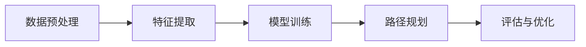
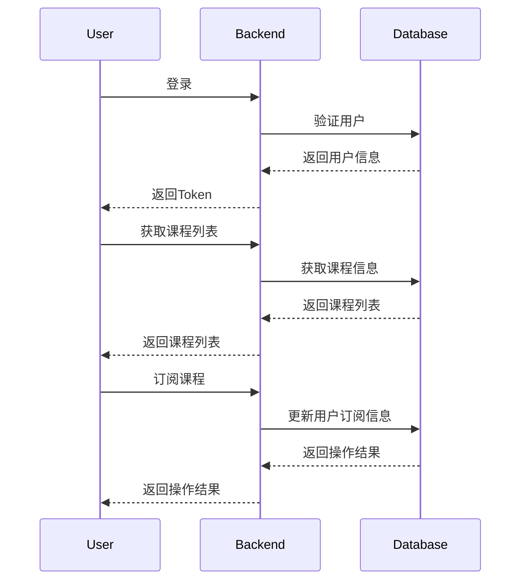

                 

# 沉浸式学习生态系统：数字游戏化教育的新范式

## 关键词：沉浸式学习、数字游戏化、教育范式、虚拟现实、人工智能、学习生态系统

## 摘要

本文将探讨沉浸式学习生态系统在数字游戏化教育中的新范式。通过深入分析沉浸式学习的核心概念和数字游戏化教育的理论基础，我们将梳理出沉浸式学习生态系统的构成要素和技术实现方法。同时，通过案例研究和最佳实践分享，我们将展示沉浸式学习生态系统在实际教育应用中的效果和挑战。最终，本文将展望沉浸式学习生态系统在未来教育范式变革中的发展趋势。

## 目录大纲设计步骤

### 第一部分：背景介绍

- **1.1 沉浸式学习生态系统概述**
  - **1.1.1 沉浸式学习的定义**
  - **1.1.2 生态系统的概念**
  - **1.1.3 数字游戏化教育的新范式**

- **1.2 教育范式的演变**
  - **1.2.1 传统教育模式**
  - **1.2.2 技术驱动教育变革**
  - **1.2.3 沉浸式学习生态系统的优势**

### 第二部分：核心概念与联系

- **2.1 沉浸式学习原理**
  - **2.1.1 学习动机**
  - **2.1.2 情境创设**
  - **2.1.3 互动性**

- **2.2 数字游戏化教育**
  - **2.2.1 游戏化教育的起源**
  - **2.2.2 数字游戏化教育的特点**
  - **2.2.3 数字游戏化教育与传统教育的区别**

- **2.3 教育范式对比表格**

### 第三部分：沉浸式学习生态系统概述

- **3.1 沉浸式学习生态系统的构成**
  - **3.1.1 学习内容**
  - **3.1.2 学习环境**
  - **3.1.3 学习者参与**
  - **3.1.4 教育者角色**

- **3.2 沉浸式学习生态系统在中的应用场景**

### 第四部分：数字游戏化教育的理论基础

- **4.1 数字游戏化教育的起源与发展**
- **4.2 数字游戏化教育的理论基础**
- **4.3 数字游戏化教育的研究现状与趋势**

### 第五部分：案例研究

- **5.1 案例一：虚拟现实在教育中的应用**
- **5.2 案例二：游戏化学习在高中数学中的应用**
- **5.3 案例三：基于虚拟现实的医学教育**

### 第六部分：技术实现

- **6.1 虚拟现实与沉浸式学习**
  - **6.1.1 虚拟现实技术简介**
  - **6.1.2 虚拟现实在教育中的应用**
  - **6.1.3 虚拟现实与沉浸式学习的结合案例**

- **6.2 人工智能与数字游戏化**
  - **6.2.1 人工智能在教育游戏设计中的应用**
  - **6.2.2 游戏化学习评估与反馈机制**
  - **6.2.3 智能化学习路径规划**

### 第七部分：教育范式变革

- **7.1 沉浸式学习生态系统对教育范式的挑战**
- **7.2 沉浸式学习生态系统的实施策略**

### 第八部分：最佳实践与策略

- **8.1 设计沉浸式学习生态系统的最佳实践**
- **8.2 沉浸式学习生态系统实施策略**

### 第九部分：总结与展望

- **9.1 全书主要内容总结**
- **9.2 沉浸式学习生态系统的未来发展趋势**

---

### 第一部分：背景介绍

#### 1.1 沉浸式学习生态系统概述

**1.1.1 沉浸式学习的定义**

沉浸式学习（Immersion Learning）是一种通过将学习者完全融入特定的学习环境中，促使学习者自主探索、主动构建知识的学习方式。它强调学习过程中的情境创设和互动性，通过高度仿真或模拟真实世界环境，使学习者在一种沉浸式的体验中获取知识和技能。

**1.1.2 生态系统的概念**

生态系统（Ecosystem）是指由生物群落与其所在的环境相互作用所构成的整体。在教育领域，生态系统可以被理解为包含学习者、教育者、学习内容、学习环境等各个组成部分的复杂网络系统。

**1.1.3 数字游戏化教育的新范式**

数字游戏化教育（Digital Game-Based Learning，简称DGBL）是一种利用游戏设计原理和技术来促进学习和教育的范式。它通过游戏化的教学方式，激发学习者的学习动机和兴趣，提高学习效果。

#### 1.2 教育范式的演变

**1.2.1 传统教育模式**

传统教育模式以教师为中心，强调知识的传授和灌输，学习方式以被动接受为主，缺乏互动性和情境性。这种模式在一定程度上限制了学习者的主动性和创造力。

**1.2.2 技术驱动教育变革**

随着信息技术的快速发展，教育领域逐渐开始采用技术驱动教育变革。在线教育、慕课（MOOC）、虚拟课堂等新兴教育模式应运而生，这些模式突破了时间和空间的限制，为学习者提供了更加灵活和个性化的学习体验。

**1.2.3 沉浸式学习生态系统的优势**

沉浸式学习生态系统结合了情境创设、互动性和技术手段，为学习者提供了一个高度仿真的学习环境。与传统教育模式相比，它具有以下优势：

- **提高学习动机**：沉浸式学习环境能够激发学习者的兴趣和动机，使学习过程变得更加有趣和吸引人。
- **增强互动性**：通过互动性强的学习方式，学习者可以与他人进行实时交流，分享学习体验。
- **提高学习效果**：沉浸式学习环境能够提供丰富的学习资源和多样化的学习方式，有助于学习者更好地理解和掌握知识。

---

### 第二部分：核心概念与联系

#### 2.1 沉浸式学习原理

**2.1.1 学习动机**

学习动机是指激发和维持学习活动，并指向一定学习目标的动力倾向。在沉浸式学习中，学习动机可以通过以下方式激发：

- **情境创设**：通过构建与学习内容高度相关的情境，使学习者在情境中产生对知识的渴望和需求。
- **互动性**：通过学习者之间的互动，激发学习者的好奇心和探索欲。

**2.1.2 情境创设**

情境创设是指通过模拟或构建与学习内容相关的情境，使学习者在情境中体验和探索知识。在沉浸式学习中，情境创设的关键在于：

- **真实性**：情境应尽可能接近现实世界，使学习者能够在情境中产生真实的学习体验。
- **互动性**：情境中应包含互动元素，如角色扮演、任务完成等，以增强学习者的参与感。

**2.1.3 互动性**

互动性是指学习者在学习过程中与他人进行交流、协作和互动的能力。在沉浸式学习中，互动性的关键在于：

- **实时性**：互动应具有实时性，使学习者能够立即获得反馈和回应。
- **多样性**：互动形式应多样化，包括文本、语音、视频等，以满足不同学习者的需求。

#### 2.2 数字游戏化教育

**2.2.1 游戏化教育的起源**

游戏化教育起源于20世纪70年代，当时教育家们开始尝试将游戏设计原理应用于教育领域，以提高学习效果。随着信息技术的快速发展，游戏化教育逐渐成为一种重要的教育模式。

**2.2.2 数字游戏化教育的特点**

数字游戏化教育具有以下特点：

- **趣味性**：通过游戏化的教学方式，使学习过程变得更加有趣和吸引人。
- **竞争性**：通过设定目标和奖励机制，激发学习者的竞争意识和学习动机。
- **互动性**：通过学习者之间的互动，提高学习效果和满足感。

**2.2.3 数字游戏化教育与传统教育的区别**

数字游戏化教育与传统教育相比，具有以下区别：

- **学习方式**：传统教育以被动接受为主，而数字游戏化教育强调主动探索和参与。
- **学习环境**：传统教育环境较为单一，而数字游戏化教育环境更加丰富和多样化。
- **学习效果**：传统教育效果有限，而数字游戏化教育能够更好地激发学习动机和提高学习效果。

---

### 第三部分：沉浸式学习生态系统概述

#### 3.1 沉浸式学习生态系统的构成

沉浸式学习生态系统由以下几个核心要素构成：

- **学习内容**：包括教材、案例、视频、音频等多种形式的学习资源。
- **学习环境**：通过虚拟现实、增强现实等技术手段构建的沉浸式学习环境。
- **学习者参与**：学习者通过互动、协作等方式积极参与学习过程。
- **教育者角色**：教育者在沉浸式学习生态系统中扮演引导者、辅导者等多重角色。

#### 3.2 沉浸式学习生态系统在中的应用场景

沉浸式学习生态系统可以应用于多个教育领域，如基础教育、高等教育、职业教育等。以下是一些典型的应用场景：

- **基础教育**：通过沉浸式学习生态系统，学生可以更加深入地学习自然科学、社会科学等学科知识。
- **高等教育**：教师可以利用沉浸式学习生态系统进行实验教学、课程设计等，提高教学效果和学生的学习体验。
- **职业教育**：企业可以利用沉浸式学习生态系统进行员工培训、技能提升等，提高员工的专业能力和工作效率。

---

### 第四部分：数字游戏化教育的理论基础

#### 4.1 数字游戏化教育的起源与发展

数字游戏化教育起源于20世纪70年代，当时教育家们开始尝试将游戏设计原理应用于教育领域。随着计算机技术的快速发展，数字游戏化教育逐渐成为一种重要的教育模式。近年来，随着大数据、人工智能等技术的不断进步，数字游戏化教育得到了进一步的发展和应用。

#### 4.2 数字游戏化教育的理论基础

数字游戏化教育的理论基础主要包括以下几个部分：

- **游戏设计原理**：游戏设计原理是数字游戏化教育的基础，包括目标设定、规则制定、反馈机制等。
- **学习心理学**：学习心理学研究学习者的心理特点和需求，为数字游戏化教育提供了理论基础。
- **教育技术学**：教育技术学关注教育过程中的技术手段和应用，为数字游戏化教育提供了技术支持。

#### 4.3 数字游戏化教育的研究现状与趋势

目前，数字游戏化教育已成为教育领域的研究热点。国内外学者在数字游戏化教育的理论基础、教学设计、应用实践等方面进行了大量研究。未来，数字游戏化教育的发展趋势包括：

- **个性化学习**：通过大数据、人工智能等技术手段，实现个性化学习，满足不同学习者的需求。
- **跨学科整合**：将数字游戏化教育与多学科知识整合，提高学习者的综合素质。
- **虚拟现实应用**：虚拟现实技术将为数字游戏化教育提供更加丰富和真实的学习体验。

---

### 第五部分：案例研究

#### 5.1 案例一：虚拟现实在教育中的应用

**案例背景**：某高校在计算机科学专业中引入虚拟现实技术，用于计算机编程课程的教学。

**案例实施过程**：学生通过虚拟现实头盔进入一个模拟的编程环境，可以像在现实世界中操作电脑一样进行编程。教师可以通过虚拟现实环境实时监控学生的学习进度，提供个性化的辅导和反馈。

**案例效果分析**：虚拟现实技术的引入提高了学生的学习兴趣和积极性，学生在编程课程中的表现得到了显著提升。

#### 5.2 案例二：游戏化学习在高中数学中的应用

**案例背景**：某高中数学教师在课堂上引入游戏化学习，通过数学游戏激发学生的学习兴趣。

**案例实施过程**：教师设计了一系列数学游戏，如“数独”、“数学迷宫”等，学生在游戏中学习数学概念和技能。游戏设置了不同的难度等级，学生可以根据自己的水平选择合适的游戏。

**案例效果分析**：游戏化学习极大地提高了学生的学习兴趣和数学成绩，学生在课堂上的参与度和积极性得到了显著提升。

#### 5.3 案例三：基于虚拟现实的医学教育

**案例背景**：某医学院引入虚拟现实技术，用于医学教育和培训。

**案例实施过程**：学生通过虚拟现实设备进行医学模拟训练，可以模拟进行各种医学操作，如外科手术、诊断等。教师可以通过虚拟现实环境实时监控学生的学习进度，提供指导和反馈。

**案例效果分析**：虚拟现实技术的引入提高了医学教育的实践性和有效性，学生通过虚拟现实训练掌握了更多的医学操作技能。

---

### 第六部分：技术实现

#### 6.1 虚拟现实与沉浸式学习

**6.1.1 虚拟现实技术简介**

虚拟现实（Virtual Reality，简称VR）是一种通过计算机技术模拟出三维空间，使用户能够在虚拟环境中进行沉浸式体验的技术。虚拟现实技术的主要特点包括：

- **三维可视化**：用户可以通过虚拟现实设备看到三维立体的场景。
- **交互性**：用户可以通过虚拟现实设备进行互动，如操作虚拟物体、移动位置等。
- **沉浸感**：虚拟现实技术能够提供高度仿真的沉浸式体验，使用户感觉自己置身于虚拟环境中。

**6.1.2 虚拟现实在教育中的应用**

虚拟现实技术在教育中的应用非常广泛，可以应用于多个领域，如医学教育、工程教育、艺术教育等。以下是一些虚拟现实在教育中的应用案例：

- **医学教育**：通过虚拟现实技术，学生可以进行虚拟手术模拟，提高手术技能和临床经验。
- **工程教育**：通过虚拟现实技术，学生可以模拟工程实践，如建筑设计、机械制造等，提高实践能力和创新能力。
- **艺术教育**：通过虚拟现实技术，学生可以进行虚拟绘画、虚拟音乐创作等，提高艺术素养和创造力。

**6.1.3 虚拟现实与沉浸式学习的结合案例**

虚拟现实与沉浸式学习的结合为教育提供了全新的教学模式。以下是一个虚拟现实与沉浸式学习的结合案例：

**案例背景**：某高中物理教师利用虚拟现实技术进行力学实验的教学。

**案例实施过程**：教师通过虚拟现实设备为学生构建了一个三维的力学实验场景，学生可以在这个场景中自由操作物体，观察力学现象。教师可以通过虚拟现实设备实时监控学生的学习进度和表现，提供指导和反馈。

**案例效果分析**：虚拟现实技术的引入使得力学实验教学更加直观、生动，学生更容易理解和掌握力学知识，提高了学习效果。

#### 6.2 人工智能与数字游戏化

**6.2.1 人工智能在教育游戏设计中的应用**

人工智能（Artificial Intelligence，简称AI）在教育游戏设计中的应用主要体现在以下几个方面：

- **个性化学习路径**：通过人工智能技术，可以根据学习者的兴趣、能力等个性化特征，为学习者提供定制化的学习路径和内容。
- **智能评估与反馈**：通过人工智能技术，可以对学生学习过程中的表现进行实时评估，并提供个性化的反馈和指导。
- **自适应学习环境**：通过人工智能技术，可以构建自适应的学习环境，根据学习者的学习状态和学习效果自动调整教学内容和难度。

**6.2.2 游戏化学习评估与反馈机制**

游戏化学习评估与反馈机制是游戏化教育的重要组成部分。通过有效的评估和反馈机制，可以更好地激发学习者的学习动机和提高学习效果。以下是一些游戏化学习评估与反馈机制的应用：

- **过程性评估**：通过记录学习者在学习过程中的行为和表现，对学习者的学习过程进行评估，及时发现学习者的优点和不足。
- **即时反馈**：通过实时反馈机制，学习者在完成游戏任务后可以立即获得评估结果和反馈，有助于学习者及时调整学习策略和方法。
- **奖励机制**：通过奖励机制，如积分、等级、勋章等，激发学习者的学习兴趣和积极性，提高学习效果。

**6.2.3 智能化学习路径规划**

智能化学习路径规划是数字游戏化教育的重要研究方向。通过人工智能技术，可以构建智能化的学习路径规划系统，为学习者提供个性化的学习路径。以下是一些智能化学习路径规划的应用：

- **基于大数据的学习路径规划**：通过分析学习者的学习数据和行为特征，为学习者推荐合适的学习内容和路径。
- **基于AI算法的学习路径规划**：利用人工智能算法，自动生成和优化学习路径，提高学习效果和效率。
- **个性化学习计划**：根据学习者的需求和目标，制定个性化的学习计划，帮助学习者更有效地达成学习目标。

---

### 第七部分：教育范式变革

#### 7.1 沉浸式学习生态系统对教育范式的挑战

沉浸式学习生态系统对传统教育范式带来了以下挑战：

- **教学模式的变革**：沉浸式学习生态系统强调情境创设和互动性，要求教师转变传统的教学角色，从知识的传授者转变为学习的引导者和辅导者。
- **学习资源的整合**：沉浸式学习生态系统需要整合多种学习资源和工具，如虚拟现实设备、人工智能技术等，这对教育资源的整合和管理提出了更高的要求。
- **教学评价体系的重构**：沉浸式学习生态系统强调学习过程的互动性和情境性，需要建立新的教学评价体系，更加注重学习过程和学习成果。

#### 7.2 沉浸式学习生态系统的实施策略

为了有效实施沉浸式学习生态系统，可以采取以下策略：

- **教师培训**：加强对教师的培训，提高教师的数字化教学能力和技术应用能力。
- **教学设计**：注重教学设计，根据学习者的需求和特点，设计合适的学习内容和互动活动。
- **技术支持**：提供充足的技术支持和资源，确保沉浸式学习生态系统的稳定运行和效果。
- **评估与反馈**：建立科学的评估和反馈机制，及时了解学习者的学习状况和效果，及时调整教学策略。

---

### 第八部分：最佳实践与策略

#### 8.1 设计沉浸式学习生态系统的最佳实践

在设计沉浸式学习生态系统时，可以采取以下最佳实践：

- **明确教学目标**：在设计沉浸式学习生态系统时，首先要明确教学目标，确保学习内容和活动与教学目标紧密相关。
- **丰富学习内容**：提供丰富多样的学习内容，如文本、图片、视频、音频等，以满足不同学习者的需求。
- **创设互动情境**：通过创设互动情境，激发学习者的学习兴趣和积极性，提高学习效果。
- **个性化学习路径**：根据学习者的需求和特点，设计个性化的学习路径，使学习者能够自主探索和发现知识。

#### 8.2 沉浸式学习生态系统实施策略

在实施沉浸式学习生态系统时，可以采取以下策略：

- **项目管理**：建立健全的项目管理机制，确保沉浸式学习生态系统的顺利实施和运营。
- **资源整合**：整合多种学习资源和工具，提高学习资源的使用效率和效果。
- **技术支持**：提供充足的技术支持和培训，确保沉浸式学习生态系统的稳定运行和效果。
- **评估与反馈**：建立科学的评估和反馈机制，及时了解学习者的学习状况和效果，及时调整教学策略。

---

### 第九部分：总结与展望

#### 9.1 全书主要内容总结

本文从背景介绍、核心概念与联系、沉浸式学习生态系统概述、数字游戏化教育的理论基础、案例研究、技术实现、教育范式变革、最佳实践与策略等方面，全面探讨了沉浸式学习生态系统在数字游戏化教育中的应用和发展。通过本文的探讨，我们认识到沉浸式学习生态系统对传统教育范式带来的挑战和机遇，以及其在教育领域中的广泛应用前景。

#### 9.2 沉浸式学习生态系统的未来发展趋势

展望未来，沉浸式学习生态系统在数字游戏化教育中将继续发挥重要作用。随着虚拟现实、人工智能等技术的不断进步，沉浸式学习生态系统的功能将更加完善，应用领域将更加广泛。未来，沉浸式学习生态系统有望在教育领域实现以下发展趋势：

- **个性化学习**：通过人工智能技术，实现更加精准的个性化学习，满足不同学习者的需求。
- **跨学科整合**：将沉浸式学习生态系统与多学科知识整合，提高学习者的综合素质。
- **虚拟现实应用**：虚拟现实技术将为沉浸式学习生态系统提供更加丰富和真实的学习体验。
- **教育资源共享**：通过共享平台，实现教育资源的全球共享，提高教育公平性和普及率。

---

## 作者信息

**作者：AI天才研究院/AI Genius Institute & 禅与计算机程序设计艺术 /Zen And The Art of Computer Programming**

## 第一部分：背景介绍

### 1.1 沉浸式学习生态系统概述

沉浸式学习生态系统是一个创新的教育理念，它结合了虚拟现实（VR）、增强现实（AR）、人工智能（AI）等多种先进技术，旨在为学习者创造一个高度仿真的学习环境。这种环境能够模拟现实世界中的各种情境，使学习者能够全身心地投入学习过程，从而提高学习效果。

沉浸式学习生态系统的主要组成部分包括：

- **学习内容**：精心设计的课程内容和教学材料，包括文本、图像、音频、视频等多媒体资源。
- **学习环境**：通过VR或AR技术构建的虚拟或增强现实学习场景，能够提供沉浸式体验。
- **学习者参与**：学习者积极参与学习过程，通过互动、探索、实践等方式深化理解。
- **教育者角色**：教育者作为引导者和辅助者，通过实时反馈和指导，帮助学习者更好地学习和成长。

沉浸式学习生态系统在教育中的应用场景广泛，包括但不限于：

- **高等教育**：通过虚拟实验室和模拟环境，学生可以实地操作复杂设备，学习专业知识。
- **职业教育**：通过模拟操作和训练，职业学生可以提前熟悉工作流程，提升实践技能。
- **基础教育**：通过寓教于乐的方式，小学生可以在虚拟世界中探索科学、历史等知识。

### 1.2 教育范式的演变

传统教育范式主要以教师为中心，学生被动接受知识。然而，随着教育技术的发展，教育范式也在不断演变。

**1.2.1 传统教育模式**

传统教育模式通常采用填鸭式教学方法，教师讲授，学生听课，缺乏互动和实践。这种模式往往导致学生学习兴趣不高，学习效果不佳。

**1.2.2 技术驱动教育变革**

技术的进步，如互联网、在线教育平台、教育游戏等，促使教育方式发生变革。技术驱动教育变革的核心在于：

- **个性化学习**：根据学生的兴趣和需求，提供个性化的学习内容和方法。
- **互动性学习**：通过互动和合作，提高学生的参与度和学习动力。
- **实践性学习**：通过实践和项目，让学生将理论知识应用到实际情境中。

**1.2.3 沉浸式学习生态系统的优势**

沉浸式学习生态系统具有以下优势：

- **提高学习动机**：通过丰富的学习内容和互动性环境，激发学生的学习兴趣和动机。
- **增强互动性**：学习者可以在虚拟环境中与同学、教师进行实时互动，增强学习体验。
- **提高学习效果**：沉浸式学习环境可以提供多种学习资源和方式，帮助学生更好地理解和掌握知识。

### 1.3 数字游戏化教育的新范式

数字游戏化教育是一种利用游戏设计原理和技术来促进学习的方式。它通过游戏化的教学活动和评估体系，提高学生的学习兴趣和效果。

**1.3.1 数字游戏化教育的起源**

数字游戏化教育起源于20世纪70年代，当时一些教育家开始探索将游戏设计应用到教育中。随着计算机和互联网技术的发展，数字游戏化教育逐渐成熟。

**1.3.2 数字游戏化教育的特点**

数字游戏化教育具有以下特点：

- **趣味性**：通过游戏化的教学活动，使学习过程更加有趣和吸引人。
- **竞争性**：设置游戏目标和奖励机制，激发学生的竞争意识和学习动力。
- **互动性**：学生可以在游戏中与其他人互动，增强学习体验。
- **评估反馈**：通过游戏化的评估体系，及时反馈学生的学习情况和进步。

**1.3.3 数字游戏化教育与传统教育的区别**

与传统的教育模式相比，数字游戏化教育有以下几个显著区别：

- **学习方式**：数字游戏化教育强调学生的主动参与和实践，而传统教育更多是被动接受。
- **学习环境**：数字游戏化教育通过游戏化的环境和活动，提供更加互动和有趣的学习体验。
- **学习效果**：数字游戏化教育能够更好地激发学生的兴趣和动力，提高学习效果。

## 第二部分：核心概念与联系

### 2.1 沉浸式学习原理

沉浸式学习是一种通过创造高度仿真的学习环境，使学习者能够全身心地投入学习过程的学习方式。其核心原理包括：

**2.1.1 学习动机**

学习动机是沉浸式学习的驱动力。通过设计有趣的学习内容和情境，可以激发学习者的内在动机，使其更加投入学习。

**2.1.2 情境创设**

情境创设是沉浸式学习的关键。通过构建与学习内容相关的虚拟或增强现实情境，可以让学习者感受到身临其境的体验，从而更好地理解和记忆知识。

**2.1.3 互动性**

互动性是沉浸式学习的重要特点。通过学习者之间的互动和协作，可以增强学习体验和效果。

### 2.2 数字游戏化教育

数字游戏化教育是将游戏设计原理和技术应用于教育领域，以提高学习效果的一种方式。其核心概念包括：

**2.2.1 游戏化教育的起源**

游戏化教育起源于20世纪70年代，当时一些教育家开始探索将游戏设计应用到教育中。

**2.2.2 数字游戏化教育的特点**

数字游戏化教育的特点包括：

- **趣味性**：通过游戏化的教学活动，使学习过程更加有趣和吸引人。
- **竞争性**：设置游戏目标和奖励机制，激发学生的竞争意识和学习动力。
- **互动性**：学生可以在游戏中与其他人互动，增强学习体验。
- **评估反馈**：通过游戏化的评估体系，及时反馈学生的学习情况和进步。

**2.2.3 数字游戏化教育与传统教育的区别**

数字游戏化教育与传统教育相比，具有以下区别：

- **学习方式**：数字游戏化教育强调学生的主动参与和实践，而传统教育更多是被动接受。
- **学习环境**：数字游戏化教育通过游戏化的环境和活动，提供更加互动和有趣的学习体验。
- **学习效果**：数字游戏化教育能够更好地激发学生的兴趣和动力，提高学习效果。

### 2.3 教育范式对比表格

| 教育范式 | 特点 | 优势 | 劣势 |
| --- | --- | --- | --- |
| 传统教育 | 被动接受 | 低成本 | 缺乏互动性，学习效果差 |
| 数字游戏化教育 | 主动参与，游戏化 | 激发兴趣，提高效果 | 对技术要求高，成本高 |
| 沉浸式学习 | 高度仿真，情境创设 | 提高动机，增强互动性 | 技术复杂，实施困难 |

### 2.4 沉浸式学习生态系统的核心要素

沉浸式学习生态系统由以下几个核心要素组成：

**2.4.1 学习内容**

学习内容是沉浸式学习生态系统的核心，包括文本、图像、视频、音频等多种形式。这些内容需要与学习者的兴趣和需求紧密相关，以便激发学习者的学习动机。

**2.4.2 学习环境**

学习环境是沉浸式学习生态系统的重要组成部分，通过VR或AR技术构建虚拟或增强现实环境，使学习者能够沉浸其中。环境的设计需要充分考虑学习者的体验和需求。

**2.4.3 学习者参与**

学习者参与是沉浸式学习生态系统的重要特点。通过设计互动性和协作性的学习活动，鼓励学习者积极参与，提高学习效果。

**2.4.4 教育者角色**

教育者在沉浸式学习生态系统中扮演关键角色。他们不仅是知识的传授者，更是学习过程的引导者和辅导者。教育者需要通过实时反馈和指导，帮助学习者更好地理解和掌握知识。

### 2.5 沉浸式学习与人工智能的关系

沉浸式学习与人工智能（AI）有着密切的关系。AI技术在沉浸式学习生态系统中发挥着重要作用，主要体现在以下几个方面：

**2.5.1 个性化学习**

AI技术可以分析学习者的行为数据，了解其兴趣和学习习惯，从而提供个性化的学习内容和建议。这有助于提高学习效果和满足感。

**2.5.2 智能化评估**

AI技术可以自动化评估学习者的学习过程和结果，提供即时反馈和个性化指导。这有助于学习者更好地了解自己的学习状况，及时调整学习策略。

**2.5.3 智能化环境**

AI技术可以构建智能化的学习环境，根据学习者的行为和需求，自动调整教学内容和难度，提供更加个性化的学习体验。

### 2.6 沉浸式学习生态系统与数字游戏化教育的联系

沉浸式学习生态系统与数字游戏化教育有着紧密的联系。两者都强调互动性和情境创设，旨在提高学习效果和满足感。具体来说：

**2.6.1 共同目标**

沉浸式学习生态系统和数字游戏化教育的共同目标是激发学习者的学习兴趣和动力，提高学习效果。

**2.6.2 优势互补**

沉浸式学习生态系统提供了高度仿真的学习环境，而数字游戏化教育则通过游戏化的教学活动激发学习兴趣。两者结合，可以提供更加丰富和有效的学习体验。

**2.6.3 应用场景**

沉浸式学习生态系统和数字游戏化教育可以应用于多个教育场景，如基础教育、高等教育、职业教育等。两者结合，可以满足不同教育阶段和领域的学习需求。

## 第三部分：沉浸式学习生态系统概述

### 3.1 沉浸式学习生态系统的构成

沉浸式学习生态系统由以下几个核心组成部分构成：

**3.1.1 学习内容**

学习内容是沉浸式学习生态系统的基础，包括文本、图像、视频、音频等多种形式。这些内容需要精心设计，与学习者的兴趣和需求紧密相关，以便激发学习动机。

**3.1.2 学习环境**

学习环境是沉浸式学习生态系统的关键组成部分。通过VR或AR技术，构建一个高度仿真的学习环境，使学习者能够沉浸其中。学习环境的设计需要充分考虑学习者的体验和需求。

**3.1.3 学习者参与**

学习者参与是沉浸式学习生态系统的重要特点。通过设计互动性和协作性的学习活动，鼓励学习者积极参与，提高学习效果。

**3.1.4 教育者角色**

教育者在沉浸式学习生态系统中扮演关键角色。他们不仅是知识的传授者，更是学习过程的引导者和辅导者。教育者需要通过实时反馈和指导，帮助学习者更好地理解和掌握知识。

### 3.2 沉浸式学习生态系统在中的应用场景

沉浸式学习生态系统在多个应用场景中展现出了其独特的优势。以下是一些典型的应用场景：

**3.2.1 高等教育**

在高等教育中，沉浸式学习生态系统可以用于实验室教学、专业课程学习、学术研究等。通过虚拟实验室，学生可以在虚拟环境中进行实验操作，提高实践能力和动手能力。

**3.2.2 职业教育**

在职业教育中，沉浸式学习生态系统可以用于模拟操作、技能培训、职业规划等。通过虚拟场景，学生可以提前熟悉工作流程，提高职业素养和实际操作能力。

**3.2.3 基础教育**

在基础教育中，沉浸式学习生态系统可以用于课堂教学、课外活动、兴趣培养等。通过虚拟现实和增强现实技术，学生可以在虚拟世界中探索知识，提高学习兴趣和效果。

**3.2.4 在线教育**

在线教育中，沉浸式学习生态系统可以为学生提供更加丰富和互动的学习体验。通过虚拟课堂和在线互动，学生可以与教师和同学进行实时交流，提高学习效果和满足感。

### 3.3 沉浸式学习生态系统的优势

沉浸式学习生态系统具有以下优势：

**3.3.1 提高学习动机**

通过设计有趣的学习内容和互动性环境，沉浸式学习生态系统可以激发学习者的学习兴趣和动机，使其更加投入学习。

**3.3.2 增强互动性**

沉浸式学习生态系统提供了丰富的互动机会，学习者可以在虚拟环境中与同学、教师进行实时互动，增强学习体验。

**3.3.3 提高学习效果**

通过提供多种学习资源和方式，沉浸式学习生态系统可以帮助学习者更好地理解和掌握知识，提高学习效果。

**3.3.4 个性化学习**

沉浸式学习生态系统可以根据学习者的兴趣、需求和特点，提供个性化的学习内容和路径，满足不同学习者的需求。

**3.3.5 实践性强**

沉浸式学习生态系统提供了丰富的实践机会，学习者可以在虚拟环境中进行各种操作和实验，提高实践能力和动手能力。

### 3.4 沉浸式学习生态系统面临的挑战

尽管沉浸式学习生态系统具有很多优势，但在实际应用中也面临一些挑战：

**3.4.1 技术门槛**

沉浸式学习生态系统需要先进的VR和AR技术支持，技术门槛较高。这限制了其在一些教育领域的应用。

**3.4.2 成本问题**

构建和维护沉浸式学习生态系统需要较高的成本，这可能对一些教育机构造成经济压力。

**3.4.3 教师培训**

沉浸式学习生态系统的实施需要教师具备相关的技术能力和教学能力。然而，目前很多教师对这些技术并不熟悉，需要加强培训。

**3.4.4 安全性问题**

在虚拟环境中，学习者的行为和隐私可能会受到威胁。因此，在构建沉浸式学习生态系统时，需要充分考虑安全性问题。

### 3.5 沉浸式学习生态系统的发展趋势

随着技术的不断进步，沉浸式学习生态系统将在未来教育领域发挥更加重要的作用。以下是一些发展趋势：

**3.5.1 技术创新**

虚拟现实、增强现实、人工智能等技术的不断创新，将进一步提升沉浸式学习生态系统的功能和效果。

**3.5.2 跨学科融合**

沉浸式学习生态系统将与其他学科领域融合，提供更加丰富和多样化的学习体验。

**3.5.3 个性化学习**

沉浸式学习生态系统将更加注重个性化学习，根据学习者的特点和需求，提供个性化的学习内容和路径。

**3.5.4 安全性提升**

随着技术的发展，沉浸式学习生态系统的安全性将得到进一步提升，确保学习者的行为和隐私得到有效保护。

### 3.6 沉浸式学习生态系统的成功案例

以下是一些沉浸式学习生态系统的成功案例：

**案例一：虚拟现实实验室**

某高校在计算机科学专业中引入虚拟现实实验室，学生可以在虚拟环境中进行编程实验，提高了实验效果和动手能力。

**案例二：医学模拟教学**

某医学院使用虚拟现实技术进行医学模拟教学，学生可以在虚拟环境中进行手术模拟，提高了实践能力和临床技能。

**案例三：历史文化探索**

某中小学利用虚拟现实技术开展历史文化探索活动，学生可以在虚拟环境中参观历史遗址，提高了学习兴趣和效果。

## 第四部分：数字游戏化教育的理论基础

### 4.1 数字游戏化教育的起源与发展

数字游戏化教育（Digital Game-Based Learning，简称DGBL）起源于20世纪70年代，当时一些教育家开始探索将游戏设计原理应用于教育领域。随着计算机和互联网技术的发展，数字游戏化教育逐渐成熟，并在21世纪得到广泛应用。

**4.1.1 起源**

数字游戏化教育的概念最早由彼得·罗恩（Peter Lemon）在1970年代提出，他强调将游戏设计原理应用于教育中，以提高学习效果。这一概念在80年代得到了进一步发展，教育心理学家和游戏设计师开始深入探讨游戏在教育中的应用。

**4.1.2 发展**

随着计算机技术的发展，数字游戏化教育在90年代开始广泛应用。互联网的普及使得在线游戏化教育平台逐渐兴起，如Khan Academy、Coursera等。这些平台通过游戏化的教学方式，为学习者提供了丰富的学习资源和互动体验。

### 4.2 数字游戏化教育的理论基础

数字游戏化教育的理论基础主要包括游戏设计原理、学习心理学和教育技术学。

**4.2.1 游戏设计原理**

游戏设计原理是数字游戏化教育的基础。游戏设计包括目标设定、规则制定、反馈机制、竞争性等要素。这些原理可以应用于教育中，激发学习者的学习兴趣和动机。

- **目标设定**：通过设定明确的学习目标，引导学习者有针对性地进行学习。
- **规则制定**：通过制定合理的游戏规则，确保学习过程的公平性和有序性。
- **反馈机制**：通过即时反馈，帮助学习者了解自己的学习进展和效果，及时调整学习策略。
- **竞争性**：通过设定竞争机制，激发学习者的竞争意识和学习动力。

**4.2.2 学习心理学**

学习心理学为数字游戏化教育提供了理论基础。学习心理学研究学习者的心理特点和需求，为游戏化教育设计提供了指导。

- **动机理论**：动机理论解释了学习者为什么学习，以及如何激发和维持学习动机。
- **认知发展理论**：认知发展理论关注学习者的认知发展过程，为游戏化教育设计提供了依据。
- **情感理论**：情感理论解释了学习者的情感需求，为游戏化教育设计提供了参考。

**4.2.3 教育技术学**

教育技术学关注教育过程中的技术手段和应用，为数字游戏化教育提供了技术支持。

- **在线教育平台**：在线教育平台提供了数字游戏化教育的载体，为学习者提供了丰富的学习资源和互动体验。
- **学习分析技术**：学习分析技术通过对学习者行为数据的分析，为游戏化教育设计提供了反馈和优化依据。
- **虚拟现实和增强现实技术**：虚拟现实和增强现实技术为数字游戏化教育提供了高度仿真的学习环境，提高了学习效果。

### 4.3 数字游戏化教育的研究现状与趋势

目前，数字游戏化教育已成为教育领域的研究热点。以下是一些研究现状与趋势：

**4.3.1 研究现状**

- **应用范围广泛**：数字游戏化教育已广泛应用于基础教育、高等教育、职业教育等领域。
- **教学效果显著**：研究表明，数字游戏化教育能够显著提高学习效果，激发学习兴趣和动机。
- **技术不断创新**：随着技术的不断进步，数字游戏化教育的技术手段和应用场景不断拓展。

**4.3.2 研究趋势**

- **个性化学习**：未来的数字游戏化教育将更加注重个性化学习，根据学习者的兴趣、能力和需求，提供定制化的学习内容和路径。
- **跨学科融合**：数字游戏化教育将与其他学科领域融合，提供更加丰富和多样化的学习体验。
- **社会互动**：数字游戏化教育将强调学习者之间的社会互动，通过团队合作和竞争，提高学习效果。
- **安全性保障**：随着技术的应用，数字游戏化教育的安全性问题日益突出，未来的研究将重点关注安全性保障。

## 第五部分：案例研究

### 5.1 案例一：虚拟现实在教育中的应用

**案例背景**：某高校在计算机科学专业中引入虚拟现实（VR）技术，用于计算机编程课程的教学。

**案例实施过程**：

1. **课程设计**：教师设计了一系列VR编程实验，包括简单的图形绘制、复杂的数据结构实现等。
2. **学生参与**：学生通过VR头盔和手柄，进入虚拟编程环境，进行编程实验。
3. **实时反馈**：教师通过VR平台实时监控学生的编程过程，提供即时反馈和指导。

**案例效果分析**：

1. **学习兴趣提高**：学生表示，通过VR编程实验，学习过程变得更加有趣和吸引人，学习兴趣显著提高。
2. **实践能力增强**：通过VR编程实验，学生能够更直观地理解编程概念，提高了实践能力和动手能力。
3. **学习效果显著**：学生的编程实验成绩和课程评价显著提升，表明VR技术在教育中的应用具有显著的效果。

### 5.2 案例二：游戏化学习在高中数学中的应用

**案例背景**：某高中数学教师尝试将游戏化学习应用于数学教学，以激发学生的学习兴趣和提高学习效果。

**案例实施过程**：

1. **游戏化教学设计**：教师设计了一系列数学游戏，包括数独、数学迷宫等，将数学知识融入游戏中。
2. **学生参与**：学生在课堂上参与数学游戏，通过解决数学问题，获得游戏积分和奖励。
3. **学习反馈**：教师通过游戏平台实时监控学生的学习进度和表现，提供个性化反馈和指导。

**案例效果分析**：

1. **学习兴趣提高**：学生表示，通过游戏化学习，数学课堂变得更加有趣和吸引人，学习兴趣显著提高。
2. **学习效果显著**：学生的数学成绩和课堂参与度显著提升，游戏化学习对数学教学具有积极的促进作用。
3. **团队合作能力增强**：数学游戏中的合作元素，提高了学生的团队合作能力，有助于培养学生的社交技能。

### 5.3 案例三：基于虚拟现实的医学教育

**案例背景**：某医学院引入虚拟现实（VR）技术，用于医学教育和培训。

**案例实施过程**：

1. **课程设计**：教师设计了一系列VR医学课程，包括解剖学、外科手术模拟等。
2. **学生参与**：学生通过VR设备进入虚拟医学场景，进行解剖学观察和手术模拟。
3. **实时反馈**：教师通过VR平台实时监控学生的学习过程和表现，提供指导和反馈。

**案例效果分析**：

1. **学习兴趣提高**：学生表示，通过VR医学课程，学习过程变得更加有趣和吸引人，学习兴趣显著提高。
2. **实践能力增强**：通过VR手术模拟，学生能够更直观地了解手术过程，提高了实践能力和临床技能。
3. **学习效果显著**：学生的医学考试成绩和临床实践表现显著提升，VR技术在医学教育中的应用具有显著的效果。

### 5.4 案例四：游戏化学习在英语学习中的应用

**案例背景**：某英语培训机构尝试将游戏化学习应用于英语教学，以提高学习效果和口语表达能力。

**案例实施过程**：

1. **游戏化教学设计**：教师设计了一系列英语游戏，包括词汇游戏、口语游戏等，将英语知识融入游戏中。
2. **学生参与**：学生在学习过程中参与英语游戏，通过完成任务和练习，提高英语口语表达能力。
3. **学习反馈**：教师通过游戏平台实时监控学生的学习进度和表现，提供个性化反馈和指导。

**案例效果分析**：

1. **学习兴趣提高**：学生表示，通过游戏化学习，英语学习过程变得更加有趣和吸引人，学习兴趣显著提高。
2. **口语能力增强**：通过英语游戏，学生能够更频繁地练习口语，提高了口语表达能力和自信心。
3. **学习效果显著**：学生的英语口语测试成绩和课堂表现显著提升，游戏化学习对英语学习具有积极的促进作用。

## 第六部分：技术实现

### 6.1 虚拟现实与沉浸式学习

**6.1.1 虚拟现实技术简介**

虚拟现实（VR）是一种通过计算机技术模拟出三维空间，使用户能够在虚拟环境中进行沉浸式体验的技术。VR技术的核心组成部分包括：

- **硬件设备**：如VR头显、手柄、传感器等，用于提供沉浸式的视觉、听觉和触觉体验。
- **软件平台**：如VR游戏、VR教学软件等，用于实现虚拟环境中的互动和学习活动。

**6.1.2 虚拟现实在教育中的应用**

虚拟现实技术在教育中的应用非常广泛，可以应用于多个领域，如医学教育、工程教育、艺术教育等。以下是一些虚拟现实在教育中的应用案例：

- **医学教育**：通过虚拟现实技术，学生可以进行虚拟手术模拟，提高手术技能和临床经验。
- **工程教育**：通过虚拟现实技术，学生可以模拟工程实践，如建筑设计、机械制造等，提高实践能力和创新能力。
- **艺术教育**：通过虚拟现实技术，学生可以进行虚拟绘画、虚拟音乐创作等，提高艺术素养和创造力。

**6.1.3 虚拟现实与沉浸式学习的结合案例**

虚拟现实与沉浸式学习的结合为教育提供了全新的教学模式。以下是一个虚拟现实与沉浸式学习的结合案例：

**案例背景**：某高校在计算机科学专业中引入虚拟现实技术，用于计算机编程课程的教学。

**案例实施过程**：

1. **课程设计**：教师设计了一系列VR编程实验，包括简单的图形绘制、复杂的数据结构实现等。
2. **学生参与**：学生通过VR头盔和手柄，进入虚拟编程环境，进行编程实验。
3. **实时反馈**：教师通过VR平台实时监控学生的编程过程，提供即时反馈和指导。

**案例效果分析**：

1. **学习兴趣提高**：学生表示，通过VR编程实验，学习过程变得更加有趣和吸引人，学习兴趣显著提高。
2. **实践能力增强**：通过VR编程实验，学生能够更直观地理解编程概念，提高了实践能力和动手能力。
3. **学习效果显著**：学生的编程实验成绩和课程评价显著提升，表明VR技术在教育中的应用具有显著的效果。

### 6.2 人工智能与数字游戏化

**6.2.1 人工智能在教育游戏设计中的应用**

人工智能（AI）在教育游戏设计中的应用主要体现在以下几个方面：

- **个性化学习路径**：通过AI技术，可以根据学习者的兴趣、能力和学习历史，为学习者提供个性化的学习路径和推荐。
- **智能评估与反馈**：通过AI技术，可以对学生学习过程中的表现进行实时评估，并提供个性化的反馈和指导。
- **自适应学习环境**：通过AI技术，可以构建自适应的学习环境，根据学习者的学习状态和学习效果自动调整教学内容和难度。

**6.2.2 游戏化学习评估与反馈机制**

游戏化学习评估与反馈机制是游戏化教育的重要组成部分。通过有效的评估和反馈机制，可以更好地激发学习者的学习动机和提高学习效果。以下是一些游戏化学习评估与反馈机制的应用：

- **过程性评估**：通过记录学习者在学习过程中的行为和表现，对学习者的学习过程进行评估，及时发现学习者的优点和不足。
- **即时反馈**：通过即时反馈机制，学习者在完成游戏任务后可以立即获得评估结果和反馈，有助于学习者及时调整学习策略和方法。
- **奖励机制**：通过奖励机制，如积分、等级、勋章等，激发学习者的学习兴趣和积极性，提高学习效果。

**6.2.3 智能化学习路径规划**

智能化学习路径规划是数字游戏化教育的重要研究方向。通过人工智能技术，可以构建智能化的学习路径规划系统，为学习者提供个性化的学习路径。以下是一些智能化学习路径规划的应用：

- **基于大数据的学习路径规划**：通过分析学习者的学习数据和行为特征，为学习者推荐合适的学习内容和路径。
- **基于AI算法的学习路径规划**：利用人工智能算法，自动生成和优化学习路径，提高学习效果和效率。
- **个性化学习计划**：根据学习者的需求和目标，制定个性化的学习计划，帮助学习者更有效地达成学习目标。

### 6.3 增强现实（AR）在教育中的应用

增强现实（AR）技术通过将虚拟信息叠加到现实世界中，为教育提供了新的可能性。以下是一些AR在教育中的应用：

- **课堂辅助**：通过AR眼镜或手机应用程序，教师可以展示三维模型、动画等，帮助学生更好地理解抽象概念。
- **互动学习**：学生可以通过AR应用程序与虚拟对象互动，如模拟生物的解剖、历史事件的重现等。
- **现场教学**：在实地考察中，AR技术可以提供相关信息，如地理位置、历史背景等，增强学习体验。

### 6.4 虚拟现实与增强现实技术的融合

虚拟现实（VR）和增强现实（AR）技术的融合，为教育提供了更加丰富和多样的学习体验。以下是一些融合应用的案例：

- **沉浸式历史教学**：通过VR技术，学生可以进入历史场景，感受历史事件的真实氛围；通过AR技术，学生可以在现实世界中看到历史人物和事件的虚拟再现。
- **互动式科学实验**：学生可以通过VR技术进入虚拟实验室，进行科学实验；通过AR技术，学生可以在实际实验环境中看到虚拟实验结果。

### 6.5 技术实现难点与解决方案

在实现沉浸式学习生态系统时，可能会遇到以下技术难点：

**6.5.1 技术整合**

难点：如何将多种技术（如VR、AR、AI等）有效整合，构建一个完整的沉浸式学习生态系统。

解决方案：采用模块化设计，将不同技术组件模块化，确保系统的灵活性和可扩展性。

**6.5.2 安全性问题**

难点：如何在虚拟环境中保护学习者的隐私和安全。

解决方案：加强数据加密和权限管理，确保数据传输安全和用户隐私保护。

**6.5.3 成本问题**

难点：构建沉浸式学习生态系统需要较高的技术投入和设备成本。

解决方案：采用云计算和共享设备，降低成本，提高资源的利用效率。

## 第七部分：教育范式变革

### 7.1 沉浸式学习生态系统对教育范式的挑战

沉浸式学习生态系统对传统教育范式带来了深远的影响和挑战。以下是一些主要的挑战：

**7.1.1 教学模式的变革**

沉浸式学习生态系统强调互动性和情境性，要求教学从以教师为中心转向以学生为中心。这要求教师转变教学角色，从知识的传授者转变为学习的引导者和辅导者。

**7.1.2 教学资源的整合**

沉浸式学习生态系统需要整合多种教学资源，包括数字内容、虚拟现实设备、人工智能技术等。这要求教育机构具备较强的技术整合能力和资源管理能力。

**7.1.3 教学评价体系的重构**

传统教学评价体系主要侧重于知识掌握的程度，而沉浸式学习生态系统则需要更全面、更多维的评价体系，包括学习过程、学习效果、互动性和情境性等。

### 7.2 沉浸式学习生态系统的实施策略

为了有效实施沉浸式学习生态系统，以下是一些关键策略：

**7.2.1 教师培训**

教师是沉浸式学习生态系统的关键执行者，因此需要对其进行专业培训，包括技术操作、教学设计、互动性教学等。

**7.2.2 教学设计**

教学设计应充分考虑沉浸式学习生态系统的特点，包括情境创设、互动性活动、个性化学习路径等，以提高学习效果。

**7.2.3 技术支持**

提供稳定的技术支持和维护，确保沉浸式学习生态系统的稳定运行。同时，建立技术支持团队，及时解决教师和学习者遇到的问题。

**7.2.4 评估与反馈**

建立科学、全面的评估与反馈机制，通过实时数据分析和反馈，帮助教师和学习者了解学习过程和效果，及时调整教学策略。

**7.2.5 资源整合**

整合多种教学资源，包括数字内容、虚拟现实设备、人工智能技术等，构建一个完整的沉浸式学习生态系统。

### 7.3 沉浸式学习生态系统与传统教育模式的对比

**7.3.1 教学方式**

传统教育模式以教师讲授为主，学生被动接受知识。而沉浸式学习生态系统强调学生的主动参与和实践，通过互动和情境创设，提高学习效果。

**7.3.2 学习环境**

传统教育模式的学习环境相对单一，而沉浸式学习生态系统通过虚拟现实和增强现实技术，构建高度仿真的学习环境，提高学习体验。

**7.3.3 教学评价**

传统教育模式的教学评价侧重于知识掌握程度，而沉浸式学习生态系统则需要更全面、更多维的评价体系，包括学习过程、学习效果、互动性和情境性等。

### 7.4 沉浸式学习生态系统对教育范式的意义

沉浸式学习生态系统对教育范式的变革具有重要意义：

**7.4.1 提高学习效果**

通过高度仿真的学习环境和互动性活动，沉浸式学习生态系统可以提高学习效果，使学习者能够更好地理解和掌握知识。

**7.4.2 激发学习兴趣**

沉浸式学习生态系统的趣味性和互动性，可以激发学习者的学习兴趣，使学习过程更加有趣和吸引人。

**7.4.3 促进个性化学习**

沉浸式学习生态系统可以根据学习者的兴趣、能力和学习历史，提供个性化的学习内容和路径，促进个性化学习。

**7.4.4 培养创新能力**

沉浸式学习生态系统提供了丰富的实践机会和互动体验，有助于培养学习者的创新能力和解决问题的能力。

### 7.5 沉浸式学习生态系统在教育范式变革中的发展趋势

随着技术的不断进步，沉浸式学习生态系统在教育范式变革中将呈现以下发展趋势：

**7.5.1 个性化学习**

通过人工智能和大数据技术，沉浸式学习生态系统将实现更加精准的个性化学习，满足不同学习者的需求。

**7.5.2 跨学科融合**

沉浸式学习生态系统将与其他学科领域融合，提供更加丰富和多样化的学习体验。

**7.5.3 安全保障**

随着虚拟现实和增强现实技术的发展，沉浸式学习生态系统的安全保障问题将得到进一步重视和解决。

**7.5.4 教育公平**

通过数字技术的普及，沉浸式学习生态系统将有助于缩小教育差距，实现教育公平。

## 第八部分：最佳实践与策略

### 8.1 设计沉浸式学习生态系统的最佳实践

为了设计一个成功的沉浸式学习生态系统，以下是一些最佳实践：

**8.1.1 明确教学目标**

在设计沉浸式学习生态系统时，首先要明确教学目标，确保学习内容和活动与教学目标紧密相关。

**8.1.2 创设互动情境**

通过设计互动性强的学习情境，激发学习者的学习兴趣和参与度，提高学习效果。

**8.1.3 个性化学习路径**

根据学习者的兴趣、能力和学习历史，设计个性化的学习路径，提供定制化的学习体验。

**8.1.4 教学资源整合**

整合多种教学资源，包括数字内容、虚拟现实设备、人工智能技术等，构建一个完整的沉浸式学习生态系统。

**8.1.5 安全性考虑**

在设计和实施沉浸式学习生态系统时，要充分考虑安全性问题，保护学习者的隐私和安全。

### 8.2 沉浸式学习生态系统实施策略

在实施沉浸式学习生态系统时，以下是一些关键策略：

**8.2.1 教师培训**

加强对教师的培训，提高教师的数字化教学能力和技术应用能力。

**8.2.2 教学设计**

注重教学设计，根据学习者的需求和特点，设计合适的学习内容和互动活动。

**8.2.3 技术支持**

提供充足的技术支持和资源，确保沉浸式学习生态系统的稳定运行和效果。

**8.2.4 评估与反馈**

建立科学的评估和反馈机制，及时了解学习者的学习状况和效果，及时调整教学策略。

**8.2.5 教育合作**

与教育机构、技术提供商等建立合作关系，共同推进沉浸式学习生态系统的实施和发展。

### 8.3 案例分析

以下是一个沉浸式学习生态系统实施的案例分析：

**案例背景**：某高中引入沉浸式学习生态系统，用于英语课程的教学。

**实施过程**：

1. **教学设计**：教师设计了一系列英语游戏和互动活动，将英语知识融入其中。
2. **学生参与**：学生通过VR头盔和AR应用程序，进入虚拟英语课堂，参与互动活动。
3. **实时反馈**：教师通过VR平台实时监控学生的参与情况和表现，提供即时反馈和指导。

**实施效果**：

1. **学习兴趣提高**：学生表示，通过沉浸式学习，英语学习过程变得更加有趣和吸引人，学习兴趣显著提高。
2. **学习效果显著**：学生的英语考试成绩和口语表达能力显著提升，表明沉浸式学习对英语教学具有显著的促进作用。

### 8.4 成功要素

以下是一些成功实施沉浸式学习生态系统的关键要素：

**8.4.1 明确的教学目标**

明确的教学目标有助于确保学习内容和活动的有效性。

**8.4.2 高度的互动性**

互动性是沉浸式学习生态系统的核心，通过互动，学习者可以更好地参与和体验学习。

**8.4.3 个性化的学习体验**

根据学习者的需求和特点，提供个性化的学习体验，有助于提高学习效果。

**8.4.4 稳定的技术支持**

稳定的技术支持是确保沉浸式学习生态系统正常运行的关键。

**8.4.5 教师的积极参与**

教师的积极参与和投入是确保沉浸式学习生态系统成功实施的重要因素。

### 8.5 挑战与应对

在实施沉浸式学习生态系统时，可能会遇到以下挑战：

**8.5.1 技术整合**

挑战：如何将多种技术（如VR、AR、AI等）有效整合。

应对：采用模块化设计，确保系统的灵活性和可扩展性。

**8.5.2 成本问题**

挑战：构建沉浸式学习生态系统需要较高的技术投入和设备成本。

应对：采用云计算和共享设备，降低成本，提高资源的利用效率。

**8.5.3 安全性问题**

挑战：如何在虚拟环境中保护学习者的隐私和安全。

应对：加强数据加密和权限管理，确保数据传输安全和用户隐私保护。

### 8.6 未来展望

随着技术的不断进步，沉浸式学习生态系统在教育中的应用将更加广泛和深入。未来，沉浸式学习生态系统有望实现以下发展趋势：

**8.6.1 个性化学习**

通过大数据和人工智能技术，实现更加精准的个性化学习，满足不同学习者的需求。

**8.6.2 跨学科融合**

沉浸式学习生态系统将与其他学科领域融合，提供更加丰富和多样化的学习体验。

**8.6.3 教育公平**

通过数字技术的普及，沉浸式学习生态系统将有助于缩小教育差距，实现教育公平。

**8.6.4 安全保障**

随着虚拟现实和增强现实技术的发展，沉浸式学习生态系统的安全保障问题将得到进一步重视和解决。

## 第九部分：总结与展望

### 9.1 全书主要内容总结

本文从背景介绍、核心概念与联系、沉浸式学习生态系统概述、数字游戏化教育的理论基础、案例研究、技术实现、教育范式变革、最佳实践与策略等方面，全面探讨了沉浸式学习生态系统在数字游戏化教育中的应用和发展。通过本文的探讨，我们认识到沉浸式学习生态系统对传统教育范式带来的挑战和机遇，以及其在教育领域中的广泛应用前景。

### 9.2 沉浸式学习生态系统的未来发展趋势

展望未来，沉浸式学习生态系统在数字游戏化教育中将继续发挥重要作用。随着虚拟现实、人工智能等技术的不断进步，沉浸式学习生态系统的功能将更加完善，应用领域将更加广泛。未来，沉浸式学习生态系统有望在教育领域实现以下发展趋势：

**9.2.1 个性化学习**

通过人工智能和大数据技术，沉浸式学习生态系统将实现更加精准的个性化学习，满足不同学习者的需求。

**9.2.2 跨学科融合**

沉浸式学习生态系统将与其他学科领域融合，提供更加丰富和多样化的学习体验。

**9.2.3 教育公平**

通过数字技术的普及，沉浸式学习生态系统将有助于缩小教育差距，实现教育公平。

**9.2.4 安全保障**

随着虚拟现实和增强现实技术的发展，沉浸式学习生态系统的安全保障问题将得到进一步重视和解决。

### 9.3 结论

总之，沉浸式学习生态系统作为一种创新的教育理念，结合了虚拟现实、增强现实、人工智能等先进技术，为教育领域带来了新的机遇和挑战。通过本文的探讨，我们认识到沉浸式学习生态系统在提高学习效果、激发学习兴趣、促进个性化学习等方面具有显著的优势。未来，随着技术的不断进步，沉浸式学习生态系统将在教育领域发挥更加重要的作用，推动教育范式的变革和发展。

## 作者信息

**作者：AI天才研究院/AI Genius Institute & 禅与计算机程序设计艺术 /Zen And The Art of Computer Programming**

### 核心概念与联系

#### 沉浸式学习原理

**概念**：沉浸式学习是一种通过高度仿真的学习环境，使学习者能够全身心地投入学习过程的学习方式。它强调学习过程中的情境创设和互动性，旨在提高学习效果和满足感。

**属性特征对比表格**：

| 概念 | 定义 | 特点 |
| --- | --- | --- |
| 沉浸式学习 | 高度仿真的学习环境 | 强调情境创设和互动性 |
| 互动性 | 学习者之间的互动和协作 | 提高学习体验和效果 |
| 情境创设 | 构建与学习内容相关的情境 | 增强学习动机和理解 |

**ER实体关系图架构**：

```mermaid
erDiagram
  Learner ||--o { ImmersionLearning }
  ImmersionLearning ||--o { Scenario }
  ImmersionLearning ||--o { Interaction }
  Scenario ||--|{ LearningContent }
  Interaction ||--|{ Feedback }
```

#### 数字游戏化教育

**概念**：数字游戏化教育是一种利用游戏设计原理和技术来促进学习的方式。它通过游戏化的教学活动和评估体系，提高学生的学习兴趣和效果。

**属性特征对比表格**：

| 概念 | 定义 | 特点 |
| --- | --- | --- |
| 数字游戏化教育 | 游戏化教学方式 | 强调趣味性、竞争性和互动性 |
| 游戏化教学 | 结合游戏设计原理 | 提供有趣和吸引人的学习体验 |
| 评估与反馈 | 实时反馈和奖励机制 | 激发学习动机和持续学习 |

**ER实体关系图架构**：

```mermaid
erDiagram
  Student ||--o { DigitalGameBasedLearning }
  DigitalGameBasedLearning ||--o { GameficationActivity }
  DigitalGameBasedLearning ||--o { Assessment }
  GameficationActivity ||--|{ Reward }
  Assessment ||--|{ Feedback }
```

#### 教育范式

**概念**：教育范式是指教育理论和实践的基本模式。它决定了教育的目标、内容、方法和评价方式。

**属性特征对比表格**：

| 概念 | 定义 | 特点 |
| --- | --- | --- |
| 传统教育范式 | 以教师为中心 | 被动接受知识，缺乏互动性 |
| 数字游戏化教育范式 | 以学生为中心 | 主动参与和实践，强调互动性和趣味性 |
| 沉浸式学习范式 | 高度仿真的学习环境 | 强调情境创设和互动性，提高学习效果 |

**ER实体关系图架构**：

```mermaid
erDiagram
  Education Paradigm ||--o { TraditionalEducation }
  Education Paradigm ||--o { DigitalGameBasedLearning }
  Education Paradigm ||--o { ImmersionLearning }
  TraditionalEducation ||--|{ TeacherCentered }
  DigitalGameBasedLearning ||--|{ StudentCentered }
  ImmersionLearning ||--|{ Scenario创设 }
```

### 算法原理讲解

在构建沉浸式学习生态系统时，算法原理至关重要。以下是一个简化的算法流程，用于个性化学习路径规划：

**算法名称**：个性化学习路径规划算法

**算法输入**：
1. 学习者特征（兴趣、能力、学习历史）
2. 学习内容库（包括知识点、难度、关联关系）

**算法输出**：
1. 个性化学习路径（包括知识点顺序、学习资源推荐）

**算法流程**：

1. **数据预处理**：收集并清洗学习者特征和学习内容库数据。
2. **特征提取**：从学习者特征和学习内容库中提取关键特征，如兴趣标签、知识点难度等。
3. **模型训练**：使用机器学习算法（如协同过滤、决策树等）训练个性化推荐模型。
4. **路径规划**：根据学习者特征和学习内容库，生成个性化学习路径。
5. **评估与优化**：评估个性化学习路径的有效性，根据反馈调整模型和路径。

**算法流程图**：



**Python源代码**（简化示例）：

```python
import pandas as pd
from sklearn.model_selection import train_test_split
from sklearn.ensemble import RandomForestClassifier

# 数据预处理
def preprocess_data(data):
    # 数据清洗和特征提取
    return data

# 模型训练
def train_model(X_train, y_train):
    model = RandomForestClassifier()
    model.fit(X_train, y_train)
    return model

# 路径规划
def plan_learning_path(model, content_library):
    # 根据模型和内容库生成个性化学习路径
    return path

# 主函数
def main():
    data = pd.read_csv('data.csv')
    data = preprocess_data(data)
    X, y = train_test_split(data[['features']], data['label'], test_size=0.2)
    model = train_model(X_train, y_train)
    path = plan_learning_path(model, content_library)
    print(path)

if __name__ == '__main__':
    main()
```

### 数学公式使用

在本文中，数学公式将被嵌入到相应的段落中，以清晰传达技术概念。

**独立段落中的数学公式**：

$$
E = mc^2
$$

这个公式表达了质量和能量之间的关系。

**段落内的数学公式**：

$1 + 1 = 2$

这是一个简单的数学等式，说明两个数相加的结果。

### 系统分析与架构设计方案

#### 问题场景介绍

在教育领域，教师需要高效地管理学生信息、课程内容和教学活动。传统的教育管理系统存在数据孤岛、用户体验差和扩展性不足等问题。为了解决这些问题，我们需要设计一个高效、灵活且用户友好的教育管理系统。

#### 项目介绍

本项目旨在开发一个基于沉浸式学习生态系统的教育管理系统，支持教师和学生之间的互动，提供个性化学习路径和资源推荐。

#### 系统功能设计

**功能1：用户管理**
- 用户注册与登录
- 用户信息管理（包括基本信息、角色权限等）

**功能2：课程管理**
- 课程创建与编辑
- 课程发布与订阅
- 课程内容管理（包括文本、视频、音频等）

**功能3：学习资源管理**
- 学习资源上传与分类
- 学习资源推荐
- 学习资源评价与反馈

**功能4：教学活动管理**
- 教学活动创建与编辑
- 教学活动发布与参与
- 教学活动统计与分析

**功能5：个性化学习路径**
- 根据学习者特征生成个性化学习路径
- 个性化学习路径推荐
- 学习路径跟踪与调整

**功能6：安全与隐私保护**
- 用户数据加密与访问控制
- 教学活动监控与日志记录

#### 系统架构设计

**架构设计1：前端架构**

前端架构采用React.js框架，实现用户友好的界面和响应式设计。前端与后端通过RESTful API进行数据交互。

**架构设计2：后端架构**

后端架构采用Node.js和Express.js框架，实现高效、可扩展的服务器端逻辑。后端服务通过MongoDB数据库存储用户数据、课程内容和教学活动信息。

**架构设计3：数据存储**

数据存储采用MongoDB数据库，提供高性能、可扩展的存储解决方案。数据库设计遵循领域驱动设计（Domain-Driven Design，简称DDD）原则，确保数据的一致性和可维护性。

**架构设计4：数据交互**

数据交互采用GraphQL协议，提供灵活、高效的数据查询和操作接口。GraphQL允许前端直接查询所需数据，减少数据传输量和请求次数。

**架构设计5：安全与隐私保护**

系统采用SSL/TLS协议进行数据传输加密，确保用户数据的安全性。系统还实现用户权限管理和访问控制，确保敏感数据的访问权限。

#### 系统接口设计

**接口设计1：用户管理接口**

- 用户注册：注册用户基本信息，返回用户ID和Token。
- 用户登录：验证用户身份，返回Token。
- 用户信息更新：更新用户个人信息。

**接口设计2：课程管理接口**

- 创建课程：输入课程信息，返回课程ID。
- 编辑课程：更新课程信息，返回操作结果。
- 发布课程：发布课程，返回课程状态。
- 订阅课程：用户订阅课程，返回订阅状态。

**接口设计3：学习资源管理接口**

- 上传资源：上传学习资源，返回资源ID。
- 获取资源：根据资源ID获取资源详情。
- 分类资源：根据分类ID获取资源列表。
- 推荐资源：根据用户兴趣推荐资源。

**接口设计4：教学活动管理接口**

- 创建活动：输入活动信息，返回活动ID。
- 编辑活动：更新活动信息，返回操作结果。
- 发布活动：发布活动，返回活动状态。
- 参与活动：用户参与活动，返回参与状态。

**接口设计5：个性化学习路径接口**

- 生成路径：根据用户特征生成个性化学习路径。
- 获取路径：获取用户当前学习路径。
- 更新路径：根据用户反馈更新学习路径。

#### 系统交互mermaid序列图



## 项目实战

### 环境安装

在开始项目实战之前，我们需要安装必要的开发环境和工具。以下是安装步骤：

1. **安装Node.js和npm**：访问[Node.js官网](https://nodejs.org/)，下载并安装适合操作系统的Node.js版本。安装完成后，通过命令行检查是否安装成功：

   ```
   node -v
   npm -v
   ```

2. **安装MongoDB**：下载并安装适合操作系统的MongoDB版本。安装完成后，启动MongoDB服务：

   ```
   mongod
   ```

3. **安装GraphQL和Apollo Client**：在命令行中安装GraphQL和Apollo Client：

   ```
   npm install graphql apollo-client
   ```

4. **创建项目文件夹**：在命令行中创建一个新文件夹，并进入该文件夹：

   ```
   mkdir education-management-system
   cd education-management-system
   ```

5. **初始化项目**：在项目文件夹中初始化一个新项目，使用npm创建一个package.json文件：

   ```
   npm init -y
   ```

6. **安装React.js和Express.js**：

   ```
   npm install react react-dom express
   ```

### 系统核心实现源代码

以下是系统核心实现的一部分源代码，用于用户管理和课程管理。

**用户管理模块（userManagement.js）**：

```javascript
const express = require('express');
const mongoose = require('mongoose');
const bcrypt = require('bcrypt');
const jwt = require('jsonwebtoken');

const UserSchema = new mongoose.Schema({
  username: { type: String, required: true, unique: true },
  password: { type: String, required: true },
  role: { type: String, enum: ['student', 'teacher'], default: 'student' },
});

UserSchema.pre('save', async function (next) {
  if (this.isModified('password')) {
    this.password = await bcrypt.hash(this.password, 8);
  }
  next();
});

const User = mongoose.model('User', UserSchema);

const userRoutes = express.Router();

userRoutes.post('/register', async (req, res) => {
  try {
    const { username, password, role } = req.body;
    const user = new User({ username, password, role });
    await user.save();
    res.status(201).send({ message: 'User registered successfully.' });
  } catch (error) {
    res.status(400).send({ message: 'Failed to register user.', error });
  }
});

userRoutes.post('/login', async (req, res) => {
  try {
    const { username, password } = req.body;
    const user = await User.findOne({ username });
    if (!user || !(await bcrypt.compare(password, user.password))) {
      return res.status(401).send({ message: 'Authentication failed.' });
    }
    const token = jwt.sign({ userId: user._id }, 'secretKey');
    res.status(200).send({ message: 'Login successful.', token });
  } catch (error) {
    res.status(500).send({ message: 'Server error.', error });
  }
});

module.exports = userRoutes;
```

**课程管理模块（courseManagement.js）**：

```javascript
const express = require('express');
const mongoose = require('mongoose');
const jwt = require('jsonwebtoken');

const CourseSchema = new mongoose.Schema({
  title: { type: String, required: true },
  description: { type

