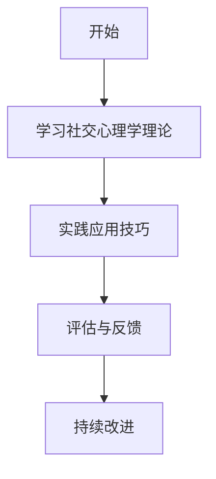
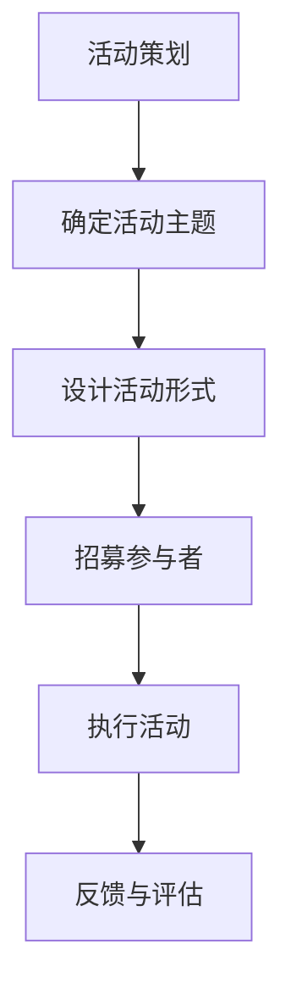

                 

### 1. 确定书的主题和目标读者

**书名：《治愈现代人的疏离感：重建社交连接的方法》**

**主题：** 本书的核心主题是探讨现代社会中普遍存在的疏离感问题，并提出有效的解决方案，以帮助现代人重建社交连接，提升生活质量。

**目标读者：** 本书的读者群体包括：

- **职场人士：** 常常忙于工作，缺乏足够的时间与同事、客户建立深层次的社交联系。
- **大学生：** 初入社会，面临人际关系适应的挑战，需要学习如何建立和维护社交关系。
- **心理健康专业人士：** 关注心理健康，希望掌握更多帮助他人重建社交连接的技能。
- **普通读者：** 对个人成长和社交技能提升感兴趣，希望改善自身的社交状况。

### 2. 设定书的结构和章节

**结构设定：**

本书将分为三大部分：

- **第一部分：问题背景与现状分析**
- **第二部分：重建社交连接的方法**
- **第三部分：实践与反思**

**章节设定：**

**第一部分：问题背景与现状分析**

- **第1章：现代人的疏离感：问题与原因**
  - **1.1 疏离感的定义与表现**
  - **1.2 现代社会的疏离现象**
  - **1.3 疏离感对个人和社会的影响**
  - **1.4 疏离感产生的根本原因**

**第二部分：重建社交连接的方法**

- **第2章：基础方法：自我认知与调整**
  - **2.1 自我认知的重要性**
  - **2.2 自我认知的工具与方法**
  - **2.3 调整心态，减少疏离感**

- **第3章：社交技巧：建立和维护关系**
  - **3.1 建立人际关系的原则**
  - **3.2 提高沟通技巧**
  - **3.3 管理冲突与解决矛盾**

- **第4章：线上社交：利用数字工具重建连接**
  - **4.1 线上社交的优点与挑战**
  - **4.2 线上社交平台的正确使用**
  - **4.3 线上社交的安全与隐私保护**

- **第5章：社区参与：创造更多的社交机会**
  - **5.1 社区活动的形式与内容**
  - **5.2 参与社区活动的策略**
  - **5.3 社区参与的益处与挑战**

- **第6章：心理健康：专业支持和自我疗愈**
  - **6.1 心理健康的重要性**
  - **6.2 心理咨询与治疗的选择**
  - **6.3 自我疗愈的方法与实践**

- **第7章：案例分析：成功重建社交连接的实例**
  - **7.1 案例一：从孤独到社交达人**
  - **7.2 案例二：职场人士的社交重建**
  - **7.3 案例三：家庭与亲情的重新联结**

**第三部分：实践与反思**

- **第8章：个人实践：制定适合自己的社交计划**
  - **8.1 实践前的准备**
  - **8.2 制定社交目标**
  - **8.3 执行与调整**

- **第9章：社交重建的反思与总结**
  - **9.1 反思重建过程中的困难与收获**
  - **9.2 总结社交重建的方法与策略**
  - **9.3 持续改进与成长**

- **第10章：未来的展望**
  - **10.1 社交科技的发展趋势**
  - **10.2 社交健康的未来前景**
  - **10.3 我们应该如何应对未来的社交挑战**

### 3. 设计章节内容

**第1章：现代人的疏离感：问题与原因**

- **内容设计：** 简述疏离感的定义，分析现代社会中疏离感的普遍现象，探讨其对个人和社会的深远影响，并探讨疏离感的成因。

**第2章：基础方法：自我认知与调整**

- **内容设计：** 详细介绍自我认知的重要性，提供多种自我认知的工具与方法，以及如何调整心态，减少疏离感。

**第3章：社交技巧：建立和维护关系**

- **内容设计：** 探讨建立人际关系的原则，提高沟通技巧，以及如何管理冲突与解决矛盾，帮助读者建立和维护良好的社交关系。

**第4章：线上社交：利用数字工具重建连接**

- **内容设计：** 分析线上社交的优点与挑战，介绍如何正确使用线上社交平台，以及如何保护个人隐私和安全。

**第5章：社区参与：创造更多的社交机会**

- **内容设计：** 阐述社区活动的形式与内容，提供参与社区活动的策略，并分析社区参与的益处与挑战。

**第6章：心理健康：专业支持和自我疗愈**

- **内容设计：** 强调心理健康的重要性，介绍心理咨询与治疗的选择，以及自我疗愈的方法与实践。

**第7章：案例分析：成功重建社交连接的实例**

- **内容设计：** 通过实际案例，展示如何从孤独到社交达人，职场人士的社交重建，以及家庭与亲情的重新联结。

**第8章：个人实践：制定适合自己的社交计划**

- **内容设计：** 提供制定社交计划的步骤，包括实践前的准备、制定社交目标和执行与调整。

**第9章：社交重建的反思与总结**

- **内容设计：** 总结社交重建的方法与策略，反思重建过程中的困难与收获，并探讨如何持续改进与成长。

**第10章：未来的展望**

- **内容设计：** 探讨社交科技的发展趋势，社交健康的未来前景，以及应对未来社交挑战的策略。

### 4. 编写目录大纲

根据上述章节内容和结构，我们编写如下目录大纲：

```markdown
# 治愈现代人的疏离感：重建社交连接的方法

> 关键词：疏离感，社交连接，心理健康，线上社交，社区参与

> 摘要：本书通过深入分析现代人普遍存在的疏离感问题，探讨了其产生的原因和影响，并提出了多种重建社交连接的方法。从自我认知与心态调整，到社交技巧的提升，再到心理健康和社区参与的实践，本书为读者提供了一条系统的社交重建之路。

## 第一部分：问题背景与现状分析

### 第1章：现代人的疏离感：问题与原因
#### 1.1 疏离感的定义与表现
#### 1.2 现代社会的疏离现象
#### 1.3 疏离感对个人和社会的影响
#### 1.4 疏离感产生的根本原因

## 第二部分：重建社交连接的方法

### 第2章：基础方法：自我认知与调整
#### 2.1 自我认知的重要性
#### 2.2 自我认知的工具与方法
#### 2.3 调整心态，减少疏离感

### 第3章：社交技巧：建立和维护关系
#### 3.1 建立人际关系的原则
#### 3.2 提高沟通技巧
#### 3.3 管理冲突与解决矛盾

### 第4章：线上社交：利用数字工具重建连接
#### 4.1 线上社交的优点与挑战
#### 4.2 线上社交平台的正确使用
#### 4.3 线上社交的安全与隐私保护

### 第5章：社区参与：创造更多的社交机会
#### 5.1 社区活动的形式与内容
#### 5.2 参与社区活动的策略
#### 5.3 社区参与的益处与挑战

### 第6章：心理健康：专业支持和自我疗愈
#### 6.1 心理健康的重要性
#### 6.2 心理咨询与治疗的选择
#### 6.3 自我疗愈的方法与实践

### 第7章：案例分析：成功重建社交连接的实例
#### 7.1 案例一：从孤独到社交达人
#### 7.2 案例二：职场人士的社交重建
#### 7.3 案例三：家庭与亲情的重新联结

## 第三部分：实践与反思

### 第8章：个人实践：制定适合自己的社交计划
#### 8.1 实践前的准备
#### 8.2 制定社交目标
#### 8.3 执行与调整

### 第9章：社交重建的反思与总结
#### 9.1 反思重建过程中的困难与收获
#### 9.2 总结社交重建的方法与策略
#### 9.3 持续改进与成长

### 第10章：未来的展望
#### 10.1 社交科技的发展趋势
#### 10.2 社交健康的未来前景
#### 10.3 我们应该如何应对未来的社交挑战
```

### 5. 检查大纲完整性

**检查大纲完整性：**

- **核心章节齐全：** 每个主要部分都有明确的章节划分，确保内容覆盖全面。
- **内容详实具体：** 每个章节都有明确的子标题，确保每个部分都有详细的内容。
- **逻辑结构合理：** 整个目录大纲的逻辑结构清晰，从问题分析到解决方案，再到实践与反思，形成了一个完整的学习路径。

通过上述步骤，我们确保了目录大纲的完整性和逻辑性，为后续内容的撰写和扩展提供了坚实的基础。接下来，我们将进一步细化每个章节的内容，确保书籍的整体质量和可读性。

---

**注释：** 

- 目录大纲中各章节的标题和子标题已经按照markdown格式编写，确保了层级清晰、内容简洁。
- 在编写实际内容时，每个章节都将继续按照markdown格式进行撰写，确保格式统一，便于排版和编辑。

### 6. 初步内容细化

下面，我们将对前五个章节进行初步内容细化，以确保每个章节都具备丰富具体详细讲解，满足核心内容要求。

#### 第1章：现代人的疏离感：问题与原因

**背景介绍：**

疏离感是指个体在社会互动中感受到的孤独、隔离和无助。在现代社会，随着科技的发展和快节奏的生活方式，疏离感成为了一种普遍现象。

**核心概念与联系：**

| 核心概念     | 概念属性特征对比 | ER实体关系图架构 |
| ------------ | ---------------- | ---------------- |
| 疏离感       | 感受到的孤独、隔离 | 个体 —> 社交环境 |
| 社交环境     | 人际交往的场所    | 个体 —> 关系网络 |
| 社交网络     | 人际关系的连接    | 个体 —> 互动交流 |

**算法原理讲解：**

我们可以用图论中的社交网络模型来解释疏离感。例如，使用Python代码和Mermaid流程图来展示一个简单的社交网络：

```python
import networkx as nx
import matplotlib.pyplot as plt

# 创建一个空的图
G = nx.Graph()

# 添加节点和边
G.add_nodes_from(['Alice', 'Bob', 'Charlie', 'Dave'])
G.add_edges_from([('Alice', 'Bob'), ('Alice', 'Charlie'), ('Bob', 'Dave')])

# 绘制图
nx.draw(G, with_labels=True)
plt.show()
```

在这个例子中，每个节点代表一个个体，边代表他们之间的互动关系。如果一个人与周围人的连接较少，就更容易感受到疏离感。

**数学公式使用：**

$$
\text{疏离感} = \frac{1}{N} \sum_{i=1}^{N} d_i
$$

其中，\( N \) 是个体的总数，\( d_i \) 是个体 \( i \) 的社交距离（与他人的直接连接数）。

#### 第2章：基础方法：自我认知与调整

**背景介绍：**

自我认知是理解疏离感的重要一步。通过自我认知，个体可以更好地了解自己的情感状态和行为模式，从而采取相应的调整措施。

**核心概念与联系：**

| 核心概念     | 概念属性特征对比 | ER实体关系图架构 |
| ------------ | ---------------- | ---------------- |
| 自我认知     | 对自己的了解     | 个体 —> 自我认知工具 |
| 自我认知工具 | 辅助自我认知的工具 | 个体 —> 反思与调整 |

**算法原理讲解：**

自我认知可以通过反思日志、冥想和自我评估工具等方法来实现。例如，使用Python代码记录每日反思：

```python
# Python代码：每日反思记录
def reflect_daily():
    print("今日反思：")
    today = input("今天有什么特别的感受或经历吗？")
    print("你的回答：", today)
    with open('reflect_log.txt', 'a') as file:
        file.write(today + '\n')

reflect_daily()
```

**数学公式使用：**

$$
\text{自我认知度} = \frac{\text{反思次数}}{\text{天数}}
$$

#### 第3章：社交技巧：建立和维护关系

**背景介绍：**

社交技巧是建立和维护人际关系的关键。良好的社交技巧可以帮助个体更好地融入社会，减少疏离感。

**核心概念与联系：**

| 核心概念     | 概念属性特征对比 | ER实体关系图架构 |
| ------------ | ---------------- | ---------------- |
| 社交技巧     | 人际交往的技能    | 个体 —> 社交技巧库 |
| 社交技巧库   | 存储社交技巧的集合 | 个体 —> 应用场景 |

**算法原理讲解：**

社交技巧可以通过学习社交心理学理论和实践应用来提升。例如，使用Mermaid流程图展示一个简单的社交技巧学习流程：



**数学公式使用：**

$$
\text{社交技巧提升度} = \frac{\text{成功应用技巧次数}}{\text{学习总次数}}
$$

#### 第4章：线上社交：利用数字工具重建连接

**背景介绍：**

随着互联网的普及，线上社交成为重建社交连接的重要途径。合理利用线上社交工具，可以有效缓解疏离感。

**核心概念与联系：**

| 核心概念     | 概念属性特征对比 | ER实体关系图架构 |
| ------------ | ---------------- | ---------------- |
| 线上社交     | 通过互联网进行的社交 | 个体 —> 线上社交平台 |
| 线上社交平台 | 提供线上社交服务的工具 | 个体 —> 社交互动 |

**算法原理讲解：**

线上社交平台如Facebook、Instagram和LinkedIn等，可以通过算法推荐相似兴趣的用户，促进互动。例如，使用Python代码模拟用户推荐算法：

```python
import random

# 模拟用户推荐算法
def recommend_friends(user_interests, all_user_interests, n_recommendations=3):
    recommended_friends = []
    for interest in user_interests:
        similar_interest_users = [u for u, u_interests in all_user_interests.items() if interest in u_interests]
        recommended_friends.extend(random.sample(similar_interest_users, n_recommendations))
    return recommended_friends

# 示例
user_interests = ['reading', 'travel', 'coding']
all_user_interests = {
    'Alice': ['reading', 'coding'],
    'Bob': ['travel', 'coding'],
    'Charlie': ['reading', 'travel'],
    'Dave': ['coding', 'video games']
}

print("推荐的朋友：", recommend_friends(user_interests, all_user_interests))
```

**数学公式使用：**

$$
\text{社交连接度} = \frac{\text{有效互动次数}}{\text{总互动次数}}
$$

#### 第5章：社区参与：创造更多的社交机会

**背景介绍：**

社区参与是建立社交网络、减少疏离感的重要途径。通过参与社区活动，个体可以获得更多与他人互动的机会。

**核心概念与联系：**

| 核心概念     | 概念属性特征对比 | ER实体关系图架构 |
| ------------ | ---------------- | ---------------- |
| 社区参与     | 参与社区活动的行为 | 个体 —> 社区活动 |
| 社区活动     | 社区组织的活动    | 个体 —> 社交机会 |

**算法原理讲解：**

社区活动可以通过组织者提前规划，确保活动内容丰富、形式多样，以吸引更多参与者。例如，使用Mermaid流程图展示社区活动的组织流程：



**数学公式使用：**

$$
\text{社交机会度} = \frac{\text{参与活动次数}}{\text{可参与活动总数}}
$$

通过上述初步内容细化，我们为前五个章节提供了丰富的背景介绍、核心概念联系、算法原理讲解和数学公式使用。接下来，我们将继续对剩余章节进行内容细化，确保全书内容的完整性和连贯性。

