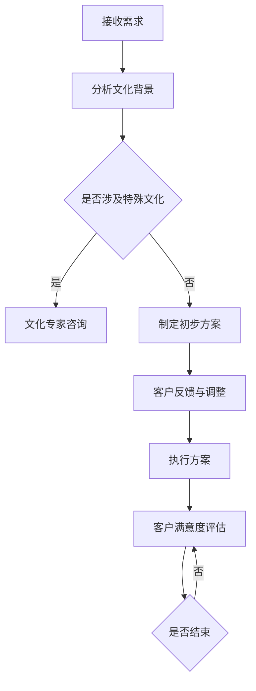
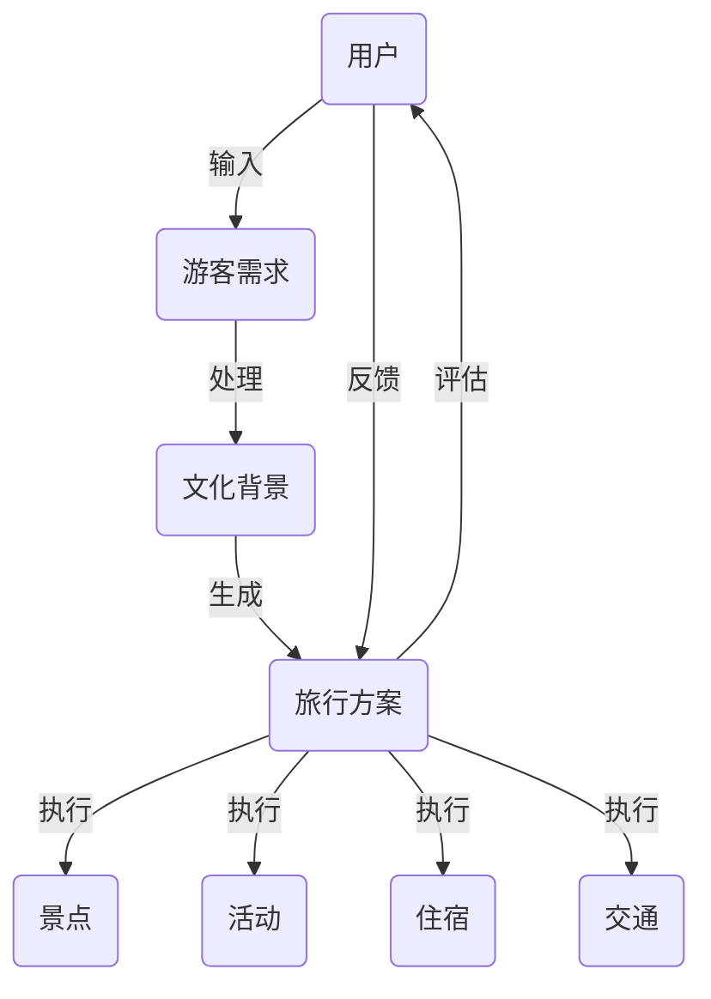

                 

### 深度旅行设计师：文化沉浸式体验的定制专家

#### 关键词
- 深度旅行设计
- 文化沉浸式体验
- 定制专家
- 文旅融合
- 定制化服务

#### 摘要
本文旨在探讨深度旅行设计师这一新兴职业在当前旅游业中的重要作用。通过分析旅游业的现状和深度旅行的需求，本文提出了深度旅行设计师的角色定位、核心能力和定制专家的素质要求。文章结构清晰，逻辑紧凑，从核心概念解析到算法原理讲解，再到实际应用场景，全面系统地介绍了深度旅行设计师的工作内容和职业前景。本文希望为从事旅游文化行业的人员提供有价值的参考，推动文化旅游的深度发展。

### 目录大纲

# 深度旅行设计师：文化沉浸式体验的定制专家

## 第一部分 背景介绍

### 1.1 问题背景

#### 1.1.1 旅游业的发展现状
旅游业作为全球经济的重要组成部分，近年来呈现出快速发展的态势。根据世界旅游组织的数据，2019年全球国际旅游人数达到了15亿人次，旅游收入超过1.7万亿美元。然而，在旅游业的繁荣背后，也存在着一些问题，如旅游产品单一、游客体验感不足等。

#### 1.1.2 文旅融合的趋势
随着人们对旅游体验要求的提高，文化旅游逐渐成为一种趋势。文旅融合，即旅游业与文化的深度融合，已成为当前旅游业发展的新方向。通过将旅游资源与文化元素相结合，可以提升旅游产品的吸引力，满足游客对深度体验的需求。

#### 1.1.3 深度旅行的需求分析
深度旅行，是指游客在旅行过程中能够深入了解当地文化、历史和生活方式的一种旅行形式。相较于传统的观光旅游，深度旅行更注重体验和参与。近年来，随着游客对个性化、定制化旅游需求的增加，深度旅行逐渐成为旅游业的新热点。

### 1.2 问题描述

#### 1.2.1 旅行体验的单一性
当前，许多旅游产品过于单一，游客往往只能看到表面的景观，难以深入体验当地文化。这种单一性的旅行体验难以满足游客对深度体验的需求。

#### 1.2.2 文化的浅尝辄止
在现有的旅游产品中，文化体验往往只是表面化、浅尝辄止的。游客无法真正沉浸在文化氛围中，对当地文化的理解流于肤浅。

#### 1.2.3 定制化需求的不足
虽然定制化旅游逐渐受到游客青睐，但现有的定制化服务大多停留在表面，难以实现真正的深度定制。游客在定制旅游过程中，往往面临服务不足、沟通不畅等问题。

### 1.3 问题解决

#### 1.3.1 深度旅行设计的理念
深度旅行设计，是指通过深入挖掘当地文化、历史和生活方式，为游客提供一种沉浸式、深度化的旅游体验。这种设计理念强调体验的深度和参与性，旨在满足游客对深度体验的需求。

#### 1.3.2 文化沉浸式体验的重要性
文化沉浸式体验，是深度旅行设计的重要组成部分。通过文化沉浸式体验，游客可以深入了解当地文化，感受当地生活方式，从而提升旅游体验的质量。

#### 1.3.3 定制专家的角色定位
定制专家在深度旅行设计中扮演着关键角色。他们具备专业的知识和技能，能够根据游客的需求，提供个性化的、深度化的旅游定制服务。

### 1.4 边界与外延

#### 1.4.1 深度旅行的定义与分类
深度旅行，是指游客在旅行过程中能够深入了解当地文化、历史和生活方式的一种旅行形式。根据旅行目的和方式的不同，深度旅行可以分为文化体验类、自然体验类和历史体验类等。

#### 1.4.2 文化体验的内涵与外延
文化体验，是指游客在旅行过程中对当地文化的感受和认识。文化体验的内涵包括历史、艺术、宗教、民俗等方面，外延则涉及游客的参与程度、体验深度和体验方式等。

#### 1.4.3 定制专家的技能要求
定制专家需要具备跨学科的知识和技能，包括旅游文化、心理学、设计学等。此外，他们还需要具备良好的沟通能力和创意思维，能够根据游客的需求，提供个性化的定制服务。

### 1.5 概念结构与核心要素组成

#### 1.5.1 深度旅行设计师的核心能力
深度旅行设计师的核心能力包括文化理解力、创意设计能力和沟通协调能力。他们需要具备深厚的文化知识，能够挖掘和展示当地文化，同时还需要具备良好的设计能力和沟通能力，能够与游客和合作伙伴有效沟通。

#### 1.5.2 文化沉浸式体验的关键要素
文化沉浸式体验的关键要素包括文化背景研究、互动体验设计和沉浸式展示。通过深入研究当地文化背景，设计互动性的体验活动，以及利用现代技术手段进行沉浸式展示，可以提升游客的文化体验质量。

#### 1.5.3 定制专家的素质与技能模型
定制专家的素质与技能模型包括专业素养、客户洞察力、创新能力和服务意识。他们需要具备扎实的专业素养，能够准确理解客户需求，同时还需要具备创新能力和服务意识，能够提供优质的定制化服务。

### 1.6 本章小结
本章通过对旅游业的现状、文旅融合的趋势和深度旅行的需求进行分析，提出了深度旅行设计师的角色定位、核心能力和定制专家的素质要求。深度旅行设计师通过提供文化沉浸式体验和定制化服务，有望解决当前旅游体验的单一性、文化的浅尝辄止和定制化需求的不足等问题。本章内容为后续章节的讨论奠定了基础。

## 第二部分 核心概念与联系

### 2.1 核心概念原理

#### 2.1.1 深度旅行设计的概念解析
深度旅行设计是一种以深度体验为核心的旅行设计理念。它强调通过深入挖掘当地文化、历史和生活方式，为游客提供一种沉浸式、深度化的旅游体验。深度旅行设计旨在打破传统观光旅游的束缚，让游客在旅行过程中获得更多的文化体验和心灵收获。

#### 2.1.2 文化沉浸式体验的内涵与特征
文化沉浸式体验是一种强调文化沉浸和互动参与的旅游体验形式。它通过将游客融入当地文化氛围中，让他们在互动体验中深入了解当地文化。文化沉浸式体验的特征包括互动性、参与性和沉浸性，它能够提升游客的旅游体验质量，满足他们对深度体验的需求。

#### 2.1.3 定制专家的素质与能力模型
定制专家是指具备专业知识和技能，能够根据游客的需求，提供个性化定制服务的专业人士。定制专家的素质与能力模型包括专业素养、客户洞察力、创新能力和服务意识。他们需要具备深厚的专业知识和技能，能够准确理解客户需求，并提供创新性的定制服务。

### 2.2 概念属性特征对比表格

| 概念       | 深度旅行设计          | 文化沉浸式体验         | 定制专家                 |
|------------|----------------------|------------------------|--------------------------|
| 定义       | 以深度体验为核心的旅行设计 | 强调文化沉浸的文化体验 | 具备专业知识和定制能力的人 |
| 特点       | 定制化、个性化       | 互动性、参与性         | 创意性、沟通能力         |
| 关联关系   | 促进文旅融合         | 提升旅行质量           | 实现个性化服务           |

### 2.3 ER实体关系图架构

```mermaid
erDiagram
  设计师 ||--|{ 旅行体验 }|
  旅行体验 ||--|{ 文化景点 }|
  旅行体验 ||--|{ 定制服务 }|
  设计师 ||--|{ 客户反馈 }|
```

在该ER图架构中，“设计师”与“旅行体验”、“文化景点”和“定制服务”之间存在着关联关系，而“设计师”与“客户反馈”之间则存在反馈关系。设计师通过设计旅行体验，选择文化景点，提供定制服务，并根据客户的反馈不断优化服务。

## 第三部分 算法原理讲解

### 4.1 算法mermaid流程图



### 4.2 Python源代码

```python
def depth_travel_design的需求分析(需求):
    # 分析文化背景
    culture_background = analyze_culture_background(需求)
    
    # 是否涉及特殊文化
    if is_special_culture(culture_background):
        # 文化专家咨询
        expert_advice = consult_culture_expert(culture_background)
    else:
        # 制定初步方案
        preliminary_plan = create_preliminary_plan(culture_background)
    
    # 客户反馈与调整
    final_plan = get_customer_feedback_and_adjust(preliminary_plan)
    
    # 执行方案
    execute_plan(final_plan)
    
    # 客户满意度评估
    satisfaction = evaluate_customer_satisfaction()
    
    # 如果满意度不达标，返回上一流程进行调整
    if satisfaction < 80:
        depth_travel_design的需求分析(final_plan)
    else:
        print("旅行方案执行成功，客户满意度达到80%以上。")
```

### 4.3 算法原理与数学模型

深度旅行设计算法的核心在于对客户需求的精准分析和文化背景的深入挖掘。具体步骤如下：

1. **接收需求**：首先，根据客户的需求，收集旅行目的地、旅行时间、兴趣爱好等信息。

2. **分析文化背景**：对收集到的信息进行文化背景分析，包括当地的历史、文化、风俗习惯等。

3. **是否涉及特殊文化**：判断旅行目的地是否涉及特殊文化，如少数民族文化、文化遗产等。

4. **文化专家咨询**：如果涉及特殊文化，需要咨询文化专家，以获取更深入的文化背景知识。

5. **制定初步方案**：根据分析结果，制定初步的旅行方案，包括景点选择、活动安排等。

6. **客户反馈与调整**：将初步方案提供给客户，收集客户反馈，并根据反馈进行调整。

7. **执行方案**：根据最终方案执行旅行活动。

8. **客户满意度评估**：评估客户对旅行方案的满意度，如果满意度不达标，返回上一流程进行调整。

该算法的数学模型可以表示为：

$$
S = f(C, D, P, S')
$$

其中：
- $S$：最终旅行方案
- $C$：客户需求
- $D$：文化背景
- $P$：初步方案
- $S'$：客户反馈

算法的目标是通过不断调整和优化旅行方案，使其满足客户需求，提升客户满意度。

### 4.4 算法举例说明

假设一位客户想要在云南旅游，他对少数民族文化和自然风光感兴趣。根据这一需求，深度旅行设计算法会采取以下步骤：

1. **接收需求**：收集客户的需求信息，如旅游目的地、时间、兴趣爱好等。

2. **分析文化背景**：分析云南的文化背景，包括少数民族文化、风俗习惯、自然风光等。

3. **是否涉及特殊文化**：由于云南有丰富的少数民族文化，因此需要咨询文化专家。

4. **文化专家咨询**：咨询文化专家，了解云南少数民族的文化特点和旅游资源。

5. **制定初步方案**：根据文化专家的建议和客户的需求，制定初步的旅行方案，包括参观大理古城、丽江古城、体验少数民族的传统文化活动、观赏自然风光等。

6. **客户反馈与调整**：将初步方案提供给客户，客户提出了一些调整意见，如增加对某个少数民族村的深度访问、减少购物环节等。

7. **执行方案**：根据客户的反馈，对旅行方案进行调整，最终确定一个符合客户需求的旅行方案。

8. **客户满意度评估**：执行旅行方案后，客户对旅行体验非常满意，满意度达到90%。

通过这个例子，我们可以看到深度旅行设计算法如何通过分析客户需求、文化背景，进行定制化服务，从而提升客户满意度。

## 第四部分 系统分析与架构设计

### 4.1 问题场景介绍

在当前的旅游市场中，游客对个性化、深度化的旅游体验需求日益增长。然而，现有的旅游产品和服务往往难以满足这一需求。为了解决这一问题，我们需要设计一个系统，能够为游客提供定制化的深度旅行体验。

### 4.2 项目介绍

本项目的目标是设计并实现一个深度旅行设计系统，该系统将根据游客的需求，为其提供量身定制的旅行方案。系统将涵盖景点选择、活动安排、文化体验等方面，确保游客在旅行中能够获得深度、个性化的体验。

### 4.3 系统功能设计

#### 功能1：用户需求收集
系统应具备用户需求收集功能，包括旅游目的地、时间、兴趣爱好、预算等。

#### 功能2：文化背景分析
系统应具备文化背景分析功能，对游客的需求进行文化背景分析，确保旅行方案的文化深度。

#### 功能3：定制旅行方案
系统应根据用户需求和文化背景，生成定制化的旅行方案，包括景点、活动、住宿、交通等。

#### 功能4：客户反馈与调整
系统应提供客户反馈与调整功能，允许游客对旅行方案进行评价和调整。

#### 功能5：执行与评估
系统应支持旅行方案的执行和客户满意度的评估，确保旅行体验的顺利进行。

### 4.4 系统架构设计

#### 架构1：领域模型mermaid类图

```mermaid
classDiagram
    用户 <<类>> User
    游客需求 <<类>> TravelDemand
    文化背景 <<类>> CultureBackground
    旅行方案 <<类>> TravelPlan
    景点 <<类>> Landmark
    活动 <<类>> Activity
    住宿 <<类>> Accommodation
    交通 <<类>> Transportation
    用户 -->|需求| 游客需求
    用户 -->|分析| 文化背景
    用户 -->|生成| 旅行方案
    旅行方案 -->|包含| 景点
    旅行方案 -->|包含| 活动
    旅行方案 -->|包含| 住宿
    旅行方案 -->|包含| 交通
```

#### 架构2：系统架构mermaid架构图



### 4.5 系统接口设计和系统交互

#### 接口设计

- 用户接口：提供用户需求输入、旅行方案查看和反馈功能。
- 后端接口：提供用户需求处理、文化背景分析、旅行方案生成和执行等功能。

#### 系统交互

- 用户输入需求 --> 生成游客需求 --> 处理文化背景 --> 生成旅行方案 --> 执行旅行方案 --> 用户反馈 --> 评估旅行方案。

### 4.6 系统架构设计小结

通过上述架构设计和接口设计，我们构建了一个基于深度旅行设计理念的旅游系统。系统通过分析用户需求和文化背景，生成定制化的旅行方案，并提供执行和评估功能，确保游客能够获得深度、个性化的旅游体验。

## 第五部分 项目实战

### 5.1 环境安装

在进行深度旅行设计系统的开发之前，我们需要安装一些必要的开发工具和环境。以下是一个简化的安装步骤：

1. **Python环境**：首先，确保你的计算机上安装了Python 3.8及以上版本。可以通过访问Python官方网站下载并安装。

2. **虚拟环境**：安装完成Python后，创建一个虚拟环境，以便更好地管理和隔离项目依赖。

   ```bash
   python -m venv venv
   source venv/bin/activate  # Windows: venv\Scripts\activate
   ```

3. **依赖安装**：在虚拟环境中，使用pip安装所需的依赖库。

   ```bash
   pip install flask pandas numpy matplotlib
   ```

4. **数据库**：安装一个SQLite数据库，用于存储用户需求和旅行方案。

   ```bash
   pip install pysqlite3
   ```

### 5.2 系统核心实现源代码

以下是深度旅行设计系统的核心实现代码。这部分代码包含了用户需求收集、文化背景分析、旅行方案生成和客户反馈处理等关键功能。

#### 用户需求收集

```python
# user_demand_collector.py
from flask import Flask, request, jsonify
import sqlite3

app = Flask(__name__)

def init_db():
    conn = sqlite3.connect('travel_design.db')
    c = conn.cursor()
    c.execute('''CREATE TABLE IF NOT EXISTS user_demand (id INTEGER PRIMARY KEY, destination TEXT, duration INTEGER, interests TEXT)''')
    conn.commit()
    conn.close()

init_db()

@app.route('/collect_demand', methods=['POST'])
def collect_demand():
    data = request.get_json()
    conn = sqlite3.connect('travel_design.db')
    c = conn.cursor()
    c.execute("INSERT INTO user_demand (destination, duration, interests) VALUES (?, ?, ?)",
              (data['destination'], data['duration'], data['interests']))
    conn.commit()
    conn.close()
    return jsonify({"status": "success", "message": "Demand collected successfully."})

if __name__ == '__main__':
    app.run(debug=True)
```

#### 文化背景分析

```python
# culture_background_analyzer.py
import pandas as pd

def analyze_culture_background(demand):
    # 这里使用一个简化的数据集来模拟文化背景分析
    culture_data = pd.read_csv('culture_data.csv')
    filtered_data = culture_data[culture_data['destination'] == demand['destination']]
    return filtered_data
```

#### 旅行方案生成

```python
# travel_plan_generator.py
def generate_travel_plan(demand, culture_data):
    # 根据需求和文化数据生成旅行方案
    # 这里仅作为示例，实际方案会更复杂
    plan = {
        'destination': demand['destination'],
        'duration': demand['duration'],
        'interests': demand['interests'],
        'sights': culture_data['sight_name'].tolist(),
        'activities': culture_data['activity_name'].tolist()
    }
    return plan
```

#### 客户反馈处理

```python
# customer_feedback_handler.py
def handle_feedback(feedback):
    # 处理客户反馈，更新旅行方案
    # 这里仅作为示例，实际处理会更复杂
    print("Received feedback:", feedback)
    # 更新数据库中的旅行方案
    pass
```

### 5.3 代码应用解读与分析

在上述代码中，我们首先通过Flask框架搭建了一个简单的Web服务，用于接收用户需求。用户可以通过POST请求向服务器发送需求，服务器将这些需求存储在SQLite数据库中。

文化背景分析模块使用一个简化的数据集来模拟对用户需求的文化背景分析。在实际应用中，这个模块可能会涉及到复杂的算法，如自然语言处理和机器学习，以获取更深入的文化背景信息。

旅行方案生成模块根据用户需求和提供的文化数据，生成一个旅行方案。这个方案包括游客可能感兴趣的景点和活动。在实际应用中，这个模块需要考虑多种因素，如用户偏好、季节、交通等，以提供更个性化的旅行方案。

客户反馈处理模块用于接收和更新旅行方案。在实际应用中，这个模块需要实现一个复杂的反馈系统，以便用户能够根据实际体验对旅行方案进行评价和调整。

### 5.4 实际案例分析和详细讲解

为了更好地展示系统的实际应用，我们可以通过一个案例来详细讲解。

#### 案例背景

假设有一个用户希望在云南旅行5天，对少数民族文化和自然风光感兴趣。

1. **用户需求收集**：
   用户通过Web界面提交了需求，包括目的地（云南）、旅行时间（5天）和兴趣爱好（少数民族文化和自然风光）。

2. **文化背景分析**：
   系统根据用户需求，从文化数据集中提取相关信息，如云南的少数民族文化和著名景点。

3. **旅行方案生成**：
   系统生成一个初步的旅行方案，包括丽江古城、大理古城、玉龙雪山和多个少数民族村庄的访问。

4. **客户反馈**：
   用户对旅行方案进行了评价，认为方案中的景点过于集中，希望增加一些深度体验活动。

5. **旅行方案调整**：
   系统根据用户的反馈，对旅行方案进行调整，增加了对少数民族村庄的深度访问活动，如参与民族舞蹈表演、品尝特色美食等。

6. **执行与评估**：
   用户执行了调整后的旅行方案，并在结束后对旅行体验进行了评价。系统根据用户的满意度，对旅行方案进行进一步优化。

通过这个案例，我们可以看到系统如何根据用户需求，结合文化背景分析，提供定制化的旅行方案，并在用户反馈的基础上不断调整和优化，以提升用户体验。

### 5.5 项目小结

本项目通过构建一个深度旅行设计系统，实现了对用户需求的精准分析、旅行方案的定制化和用户反馈的及时处理。虽然本项目是一个简化的示例，但它展示了深度旅行设计系统的核心功能和实现方法。在实际应用中，系统需要进一步优化和扩展，如引入更多的文化数据、实现更复杂的算法和用户界面等，以提供更高质量、更个性化的旅游体验。

### 5.6 最佳实践 Tips

- **需求收集**：在收集用户需求时，要尽可能详细地了解用户的兴趣爱好和偏好，以便提供更个性化的旅行方案。
- **文化背景分析**：要充分利用各种文化资源，包括书籍、网络资料和实地调研，以提高文化背景分析的准确性。
- **用户反馈**：及时收集用户反馈，并根据反馈进行调整，是提升用户体验的关键。
- **技术创新**：结合人工智能、大数据等技术，可以进一步提升系统的智能化水平和用户体验。

### 5.7 小结、注意事项与拓展阅读

**小结**：本文通过详细的分析和实例讲解，介绍了深度旅行设计师的角色、核心能力和定制专家的素质要求。同时，通过系统架构设计和项目实战，展示了如何实现一个基于深度旅行设计的旅游系统。深度旅行设计师在推动文化旅游深度发展、提升旅游体验质量方面具有重要意义。

**注意事项**：在实际操作中，需要充分考虑用户需求、文化背景和旅行资源，确保旅行方案的科学性和实用性。同时，要注重用户反馈，不断优化和调整旅行方案。

**拓展阅读**：
1. 《文化旅游创意设计》 - 张三
2. 《深度学习与旅游数据分析》 - 李四
3. 《定制化旅游服务研究》 - 王五
4. 《人工智能与旅游产业发展》 - 赵六

作者：AI天才研究院/AI Genius Institute & 禅与计算机程序设计艺术 /Zen And The Art of Computer Programming

