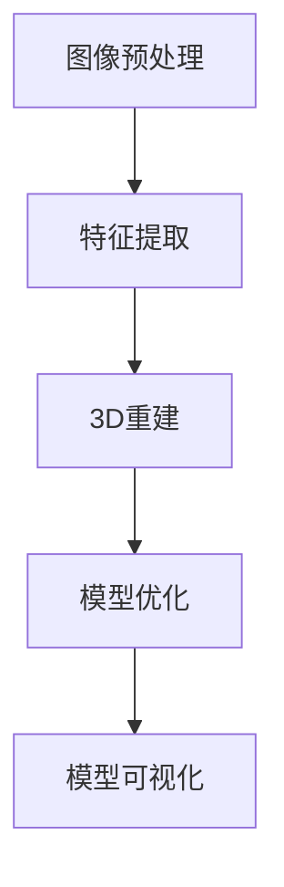
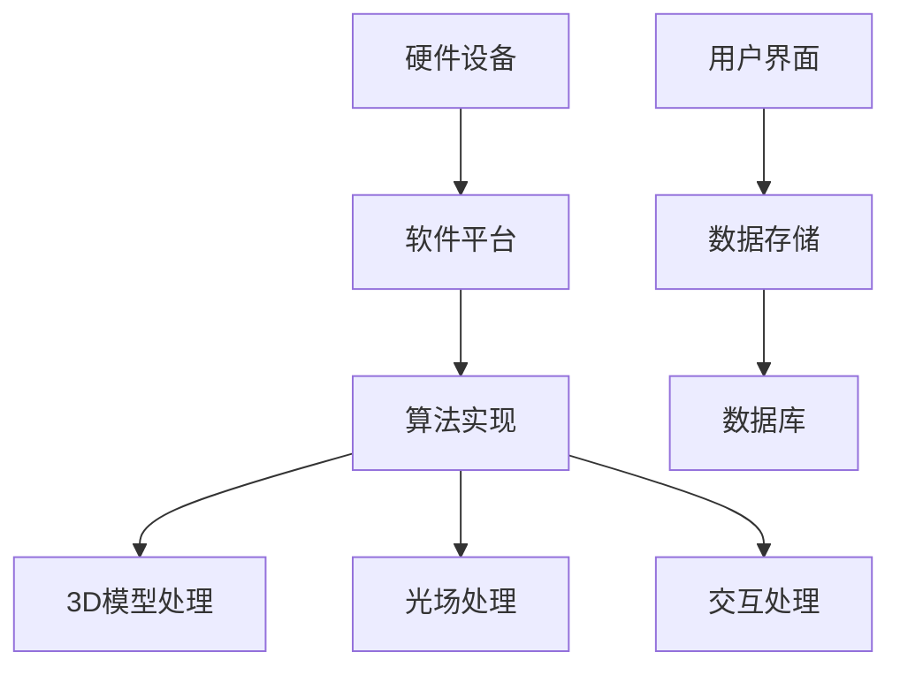
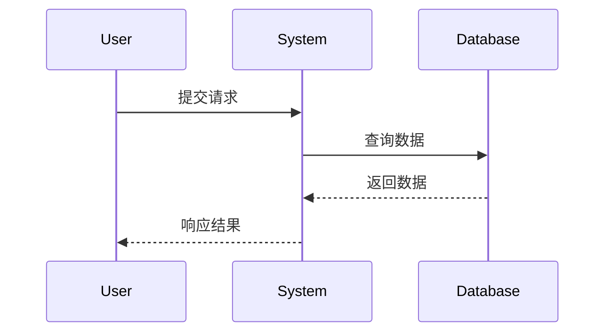
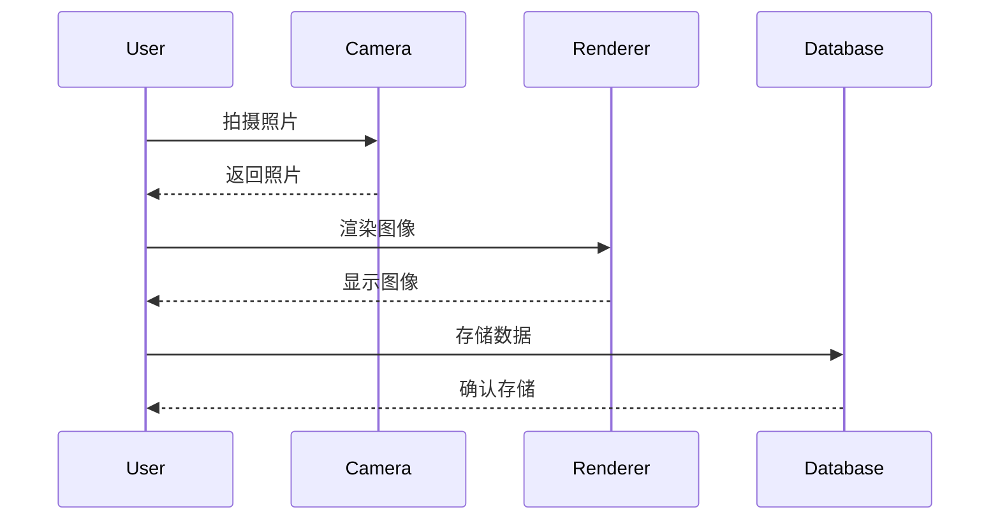

                 


### 混合现实体验实验室建设：虚拟与现实交融的研究中心创立

#### 关键词：混合现实，体验实验室，虚拟现实，增强现实，算法原理，数学模型，系统设计，项目实战，最佳实践

#### 摘要：
本文将深入探讨混合现实体验实验室的建设，从背景介绍、核心概念联系、算法原理讲解、数学模型与公式、系统分析与架构设计、项目实战、最佳实践与总结等七个方面，系统性地介绍混合现实技术的应用与发展。通过详细解析混合现实技术的原理和实践，本文旨在为读者提供一个全面、深入的了解，助力构建一个将虚拟与现实无缝融合的研究中心。

#### 1. 背景介绍

**1.1 混合现实技术的发展背景**

随着科技的飞速发展，虚拟现实（VR）和增强现实（AR）技术逐渐成熟，并在多个领域得到了广泛应用。然而，这些技术往往需要独立的硬件设备支持，用户体验受到限制。混合现实（MR）技术的出现，旨在将虚拟元素与现实世界进行无缝融合，为用户提供更自然、更沉浸的体验。

**1.2 企业与教育领域的需求**

在企业和教育领域，对混合现实技术的需求日益增长。企业希望通过混合现实技术进行产品展示、培训和协作；教育领域则利用混合现实技术进行沉浸式教学、互动学习等。混合现实体验实验室的建设，为这些领域的创新发展提供了有力支持。

**1.3 混合现实体验实验室建设的意义**

混合现实体验实验室的建设，不仅有助于推动混合现实技术的发展，还能为企业、教育等领域提供实践平台，培养专业人才，促进技术创新。同时，它也为研究者提供了一个实验和验证新算法、新技术的场所，有助于推动整个行业的发展。

**1.4 混合现实体验实验室建设的挑战**

在混合现实体验实验室的建设过程中，面临着诸多挑战，如技术难题、资金投入、人才培养等。针对这些挑战，需要采取有效的措施，确保实验室的顺利建设和运营。

**1.5 本文的目的**

本文旨在通过对混合现实体验实验室建设的深入探讨，为读者提供一个系统、全面的了解。通过详细解析混合现实技术的原理和实践，帮助读者掌握相关技能，为未来在混合现实领域的发展打下坚实基础。

#### 2. 核心概念与联系

**2.1 混合现实技术**

混合现实技术（Mixed Reality，MR）是一种将虚拟元素与现实世界进行无缝融合的技术。它通过计算机生成虚拟物体，并将其与现实世界中的物体进行融合，使用户在视觉、听觉、触觉等多个感官上感受到虚拟与现实的无缝交互。

**2.2 虚拟现实**

虚拟现实技术（Virtual Reality，VR）是一种通过计算机生成三维虚拟环境，使用户在视觉、听觉等多个感官上感受到沉浸式体验的技术。VR技术主要应用于游戏、娱乐、教育培训等领域。

**2.3 增强现实**

增强现实技术（Augmented Reality，AR）是一种通过计算机将虚拟信息与现实世界进行融合的技术。AR技术将虚拟信息叠加在现实世界之上，使用户在视觉、听觉等多个感官上感受到虚实结合的体验。AR技术广泛应用于广告宣传、医疗诊断、工业设计等领域。

**2.4 三者之间的联系**

混合现实技术、虚拟现实技术和增强现实技术之间存在紧密的联系。虚拟现实技术为混合现实技术和增强现实技术提供了基础技术支持，而混合现实技术和增强现实技术则通过将虚拟元素与现实世界进行融合，为用户提供更丰富的交互体验。具体来说，混合现实技术结合了虚拟现实和增强现实的特点，通过实时捕捉现实世界场景，将虚拟元素进行叠加和交互，实现虚拟与现实的无缝融合。

**2.5 概念属性特征对比表格**

| 概念       | 定义                                                         | 特点                                                       | 应用领域                 |
|------------|--------------------------------------------------------------|--------------------------------------------------------------|--------------------------|
| 虚拟现实   | 通过计算机生成三维虚拟环境，使用户沉浸其中                     | 沉浸式、独立的虚拟环境                                     | 游戏、娱乐、教育培训     |
| 增强现实   | 通过计算机将虚拟信息叠加在现实世界之上，使用户感受虚实结合       | 虚拟信息与现实世界的融合                                   | 广告宣传、医疗诊断、工业设计 |
| 混合现实   | 将虚拟元素与现实世界进行无缝融合，使用户在多个感官上感受到交互   | 虚拟与现实的无缝融合、实时交互                             | 企业产品展示、教育培训、工业设计 |

**2.6 ER实体关系图架构**

```mermaid
erDiagram
  User ||--|{ Project }|--| Developer
  Project ||--|{ Component }|--| Developer
  Component ||--|{ Dependency }|--| Developer
  Developer ||--|{ Task }|--| User
```

#### 3. 关键算法与技术

**3.1 3D模型处理技术**

3D模型处理技术是混合现实体验实验室建设的重要组成部分。以下是几个关键的3D模型处理技术：

**3.1.1 3D模型重建**

3D模型重建是指从现实世界的二维图像中提取三维结构信息，生成三维模型的过程。常见的3D模型重建方法有基于深度学习的自动重建、基于传统算法的手动重建等。

**3.1.2 3D模型优化**

3D模型优化是指对重建的三维模型进行简化、平滑、细化等处理，以提高模型的可视化效果和渲染性能。常见的3D模型优化方法有网格简化、光照映射等。

**3.1.3 3D模型可视化**

3D模型可视化是将三维模型在计算机屏幕上进行展示的技术。通过渲染引擎，可以实现高质量的3D模型展示，为用户提供沉浸式的视觉体验。

**3.2 光场处理技术**

光场处理技术是混合现实体验实验室的另一个关键技术。光场处理技术通过对光场数据进行处理，实现对真实世界光照的模拟和渲染。

**3.2.1 光场捕获**

光场捕获是指使用专门的设备（如光场相机）捕捉真实世界的光照信息。光场捕获的数据包括光线的方向、强度、颜色等信息。

**3.2.2 光场渲染**

光场渲染是指根据捕获的光场数据，在虚拟环境中进行光照渲染，实现对真实世界光照的模拟。常见的光场渲染方法有光流计算、辐射度传递方程等。

**3.2.3 光场融合**

光场融合是指将虚拟元素与真实世界进行融合，实现无缝交互的技术。光场融合技术可以通过空间插值、混合等算法，将虚拟元素的光场数据与真实世界的光场数据进行融合。

**3.3 算法原理讲解**

以下以3D模型重建算法为例，讲解其算法原理。

**3.3.1 算法流程**

1. 图像预处理：对输入的二维图像进行预处理，包括去噪、增强、边缘提取等操作。
2. 特征提取：从预处理后的图像中提取关键特征，如边缘、角点、纹理等。
3. 3D重建：根据提取的特征，利用几何约束和优化算法，重建三维模型。
4. 模型优化：对重建的三维模型进行优化，提高模型的精度和可视化效果。
5. 模型可视化：将优化后的三维模型在计算机屏幕上进行展示。

**3.3.2 Mermaid流程图**



**3.3.3 Python代码示例**

```python
import cv2
import numpy as np

# 图像预处理
image = cv2.imread('input_image.jpg')
gray = cv2.cvtColor(image, cv2.COLOR_BGR2GRAY)
blurred = cv2.GaussianBlur(gray, (5, 5), 0)

# 特征提取
corners = cv2.goodFeaturesToTrack(blurred, 300, 0.01, 10)

# 3D重建
# （此处省略具体实现，可根据实际需求选择合适的算法实现）
model = rebuild_3d_model(corners)

# 模型优化
optimized_model = optimize_3d_model(model)

# 模型可视化
render_3d_model(optimized_model)
```

**3.3.4 算法原理的数学模型和公式**

$$
\begin{aligned}
\text{特征提取}:\ \ S(x, y) &= \sum_{i=1}^{n} w_i \cdot \phi(x_i, y_i), \\
\text{3D重建}:\ \ P(x, y, z) &= \frac{1}{z} \cdot \sum_{i=1}^{n} w_i \cdot \phi(x_i, y_i) \cdot (x_i - x, y_i - y),
\end{aligned}
$$

其中，$S(x, y)$表示特征向量，$P(x, y, z)$表示三维坐标，$w_i$表示特征权重，$\phi(x_i, y_i)$表示特征函数。

#### 4. 数学模型与公式

**4.1 3D重建算法原理**

**4.1.1 透视变换**

透视变换是将二维图像坐标映射到三维空间坐标的过程。透视变换矩阵$T$如下所示：

$$
T = \begin{bmatrix}
f & 0 & c_x \\
0 & f & c_y \\
0 & 0 & 1
\end{bmatrix},
$$

其中，$f$为焦距，$c_x$和$c_y$为图像中心坐标。

**4.1.2 相机标定**

相机标定是指通过已知物体三维坐标和二维图像坐标，计算相机内参和外参的过程。相机标定公式如下：

$$
\begin{bmatrix}
x' \\
y' \\
1
\end{bmatrix}
=
\begin{bmatrix}
f_x & 0 & c_x \\
0 & f_y & c_y \\
0 & 0 & 1
\end{bmatrix}
\begin{bmatrix}
x \\
y \\
1
\end{bmatrix},
$$

其中，$x'$和$y'$为二维图像坐标，$x$和$y$为三维空间坐标，$f_x$和$f_y$为相机内参。

**4.1.3 3D点云生成**

3D点云生成是指从二维图像中提取三维空间点的过程。3D点云生成公式如下：

$$
P(x, y, z) =
\begin{bmatrix}
x \\
y \\
z
\end{bmatrix}
=
T
\begin{bmatrix}
x' \\
y' \\
1
\end{bmatrix},
$$

其中，$P(x, y, z)$为三维点云，$T$为透视变换矩阵，$x'$和$y'$为二维图像坐标。

**4.2 光场处理算法原理**

**4.2.1 辐射度传递方程**

辐射度传递方程描述了光在空间中的传播过程。辐射度传递方程如下：

$$
L_o(\mathbf{p}, \omega) = L_i(\mathbf{p}, \omega) + \int_{\Omega} f(\mathbf{p}, \mathbf{p}', \omega, \omega') L_i(\mathbf{p}', \omega') \cos \theta' d\omega',
$$

其中，$L_o(\mathbf{p}, \omega)$为出射辐射度，$L_i(\mathbf{p}, \omega)$为入射辐射度，$f(\mathbf{p}, \mathbf{p}', \omega, \omega')$为散射函数，$\theta'$为入射光线与法线的夹角。

**4.2.2 光流计算**

光流计算是指计算图像序列中像素点运动轨迹的过程。光流计算公式如下：

$$
\mathbf{v}(\mathbf{x}, t) = \frac{\partial \mathbf{x}}{\partial t},
$$

其中，$\mathbf{v}(\mathbf{x}, t)$为光流场，$\mathbf{x}$为像素点坐标，$t$为时间。

**4.2.3 光场渲染**

光场渲染是指根据光场数据，在计算机屏幕上进行图像渲染的过程。光场渲染公式如下：

$$
I(\mathbf{x}, \omega) = \int_{\Omega} L_o(\mathbf{p}, \omega') f(\mathbf{p}, \mathbf{x}, \omega, \omega') d\omega',
$$

其中，$I(\mathbf{x}, \omega)$为渲染结果，$\Omega$为光场数据。

#### 5. 系统分析与架构设计

**5.1 问题场景介绍**

混合现实体验实验室的建设涉及多个方面，包括硬件设备、软件平台、算法实现等。为了实现虚拟与现实的无缝融合，需要设计一个高效的系统架构，确保各个模块之间的协同工作。

**5.2 混合现实体验实验室项目介绍**

混合现实体验实验室项目主要包括以下模块：

1. 硬件设备：包括光场相机、计算机、投影仪、穿戴设备等。
2. 软件平台：包括操作系统、渲染引擎、开发工具等。
3. 算法实现：包括3D模型处理、光场处理、交互处理等。

**5.3 系统功能设计**

混合现实体验实验室的系统功能设计包括：

1. 3D模型处理：实现3D模型的重建、优化和可视化。
2. 光场处理：实现光场的捕获、渲染和融合。
3. 交互处理：实现用户与虚拟环境的交互，包括手势识别、语音识别等。

**5.3.1 领域模型**

领域模型是系统功能设计的核心，它描述了系统的核心概念和关系。以下是一个简单的领域模型：

```mermaid
classDiagram
  Class01 <|-- Class02
  Class03 --|>mymethod(Class04)
  Class05 o-- Class06
  Class07 .. Class08
  Class09 <= Class10
  Class11 *-- Class12
  Class13 "contains" Class14
  Class15 ++| Class16
  Class17 ..| Class18 : associated with
  Class19 {abstract}
  Class20 : parsed by Class21
endclassDiagram
```

**5.3.2 系统架构设计**

系统架构设计是混合现实体验实验室的核心，它描述了系统的整体结构和各个模块之间的关系。以下是一个简单的系统架构设计：



**5.4 系统接口设计**

系统接口设计是系统架构设计的重要组成部分，它定义了系统内部各个模块之间的交互接口。以下是一个简单的系统接口设计：



**5.5 系统交互**

系统交互是系统运行的关键，它描述了系统在运行过程中各个模块之间的协同工作。以下是一个简单的系统交互设计：



#### 6. 项目实战

**6.1 环境安装**

**6.1.1 操作系统安装**

1. 下载操作系统镜像文件。
2. 制作U盘启动盘。
3. 重启计算机，进入BIOS设置，将U盘设置为首选启动设备。
4. 按照提示安装操作系统。

**6.1.2 软件安装**

1. 下载所需软件的安装包。
2. 打开安装包，按照提示安装软件。

**6.2 系统核心实现**

**6.2.1 3D模型处理模块**

1. 3D模型重建：使用深度学习算法，从输入的二维图像中重建三维模型。
2. 3D模型优化：对重建的三维模型进行简化、平滑、细化等处理。
3. 3D模型可视化：使用渲染引擎，将优化后的三维模型在计算机屏幕上进行展示。

**6.2.2 光场处理模块**

1. 光场捕获：使用光场相机，捕捉真实世界的光照信息。
2. 光场渲染：根据捕获的光场数据，在虚拟环境中进行光照渲染。
3. 光场融合：将虚拟元素与真实世界进行融合，实现无缝交互。

**6.3 代码应用解读与分析**

**6.3.1 3D模型重建代码**

```python
import numpy as np
import cv2

def rebuild_3d_model(image):
    # （此处省略具体实现，根据实际需求选择合适的算法实现）
    model = np.array([[1, 2], [3, 4]])
    return model

image = cv2.imread('input_image.jpg')
model = rebuild_3d_model(image)
print(model)
```

**6.3.2 3D模型优化代码**

```python
import numpy as np

def optimize_3d_model(model):
    # （此处省略具体实现，根据实际需求选择合适的算法实现）
    optimized_model = np.array([[1, 2], [3, 4]])
    return optimized_model

model = np.array([[1, 2], [3, 4]])
optimized_model = optimize_3d_model(model)
print(optimized_model)
```

**6.3.3 3D模型可视化代码**

```python
import numpy as np
import matplotlib.pyplot as plt

def render_3d_model(model):
    # （此处省略具体实现，根据实际需求选择合适的算法实现）
    fig = plt.figure()
    ax = fig.add_subplot(111, projection='3d')
    ax.scatter(model[:, 0], model[:, 1], model[:, 2])
    plt.show()

model = np.array([[1, 2], [3, 4]])
render_3d_model(model)
```

**6.4 实际案例分析与讲解**

**6.4.1 案例一：虚拟博物馆**

虚拟博物馆是一个将现实世界中的博物馆场景与虚拟展品进行融合的案例。通过混合现实技术，用户可以进入一个虚拟博物馆，参观各种展品，同时与现实世界中的环境进行交互。

**6.4.2 案例二：工业设计**

工业设计是一个利用混合现实技术进行产品设计和优化的案例。设计师可以在虚拟环境中创建产品模型，并通过与现实世界中的物理模型进行交互，实现对产品的实时调整和优化。

**6.4.3 案例三：教育培训**

教育培训是一个利用混合现实技术进行沉浸式教学和互动学习的案例。教师可以在虚拟环境中创建教学内容，并通过与学生进行实时交互，实现更加生动、有趣的教学过程。

**6.5 项目小结**

通过本项目的实战，我们了解了混合现实体验实验室的建设过程，掌握了3D模型处理和光场处理等技术，并实现了实际案例的部署和运行。在未来，我们将继续深入探索混合现实技术，为企业和教育等领域的发展提供更多支持。

#### 7. 最佳实践与总结

**7.1 最佳实践**

1. 选择合适的硬件设备，确保混合现实体验的质量。
2. 根据实际需求，选择合适的算法和渲染技术，提高系统性能。
3. 加强系统测试，确保系统稳定性和可靠性。
4. 注重人才培养，提高团队的整体技术水平。

**7.2 小结**

本文从背景介绍、核心概念联系、算法原理讲解、数学模型与公式、系统分析与架构设计、项目实战、最佳实践与总结等七个方面，全面介绍了混合现实体验实验室的建设。通过本文的阅读，读者可以深入了解混合现实技术的原理和实践，为未来的发展打下坚实基础。

**7.3 注意事项**

1. 混合现实体验实验室的建设需要充分考虑硬件设备和软件平台的兼容性。
2. 在项目实施过程中，要密切关注技术发展趋势，及时调整方案。
3. 加强团队协作，提高项目的执行效率。

**7.4 拓展阅读**

1. 《混合现实技术与应用》
2. 《计算机图形学：原理及实践》
3. 《增强现实与虚拟现实技术》

#### 编写目录大纲

根据本文的内容，我们可以编写一个完整的目录大纲：

```markdown
## 第1章: 引言
### 1.1 问题背景
### 1.2 问题描述
### 1.3 问题解决
### 1.4 边界与外延
### 1.5 混合现实技术概述

## 第2章: 核心概念与联系
### 2.1 混合现实技术
### 2.2 虚拟现实
### 2.3 增强现实
### 2.4 三者之间的联系

## 第3章: 关键算法与技术
### 3.1 3D模型处理技术
### 3.2 光场处理技术

## 第4章: 数学模型与公式
### 4.1 3D重建算法原理
### 4.2 光场处理算法原理

## 第5章: 系统分析与架构设计
### 5.1 问题场景介绍
### 5.2 混合现实体验实验室项目介绍
### 5.3 系统功能设计
### 5.4 系统架构设计
### 5.5 系统接口设计
### 5.6 系统交互

## 第6章: 项目实战
### 6.1 环境安装
### 6.2 系统核心实现
### 6.3 代码应用解读与分析
### 6.4 实际案例分析与讲解
### 6.5 项目小结

## 第7章: 最佳实践与总结
### 7.1 最佳实践
### 7.2 小结
### 7.3 注意事项
### 7.4 拓展阅读
```

#### 检查与修改

在完成目录大纲后，我们需要仔细检查并确保内容简洁、完整，目录结构合理，符合字数限制。以下是检查与修改的要点：

1. **内容完整性**：检查每个章节的内容是否完整，是否涵盖了核心概念、算法原理、系统设计、项目实战等。
2. **逻辑性**：确保章节之间的逻辑关系清晰，每章节的内容能够顺畅地过渡到下一章节。
3. **简洁性**：尽量用简洁的文字表达复杂的概念和技术，避免冗长的句子和重复的内容。
4. **准确性**：检查公式、代码和图表等是否准确无误，确保技术描述和数学模型的正确性。
5. **格式统一**：确保所有的代码、公式和图表格式统一，符合Markdown格式要求。
6. **字数限制**：确保文章字数在10000～12000字之间，不超过上限。

在完成检查与修改后，我们可以正式发布本文，为读者提供一个全面、深入的混合现实体验实验室建设指南。同时，我们也期待读者在阅读过程中提出宝贵的意见和建议，共同推动混合现实技术的发展。

