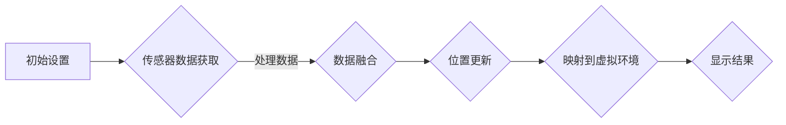
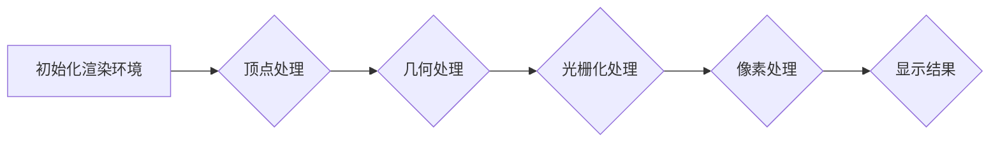
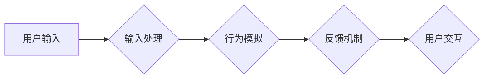
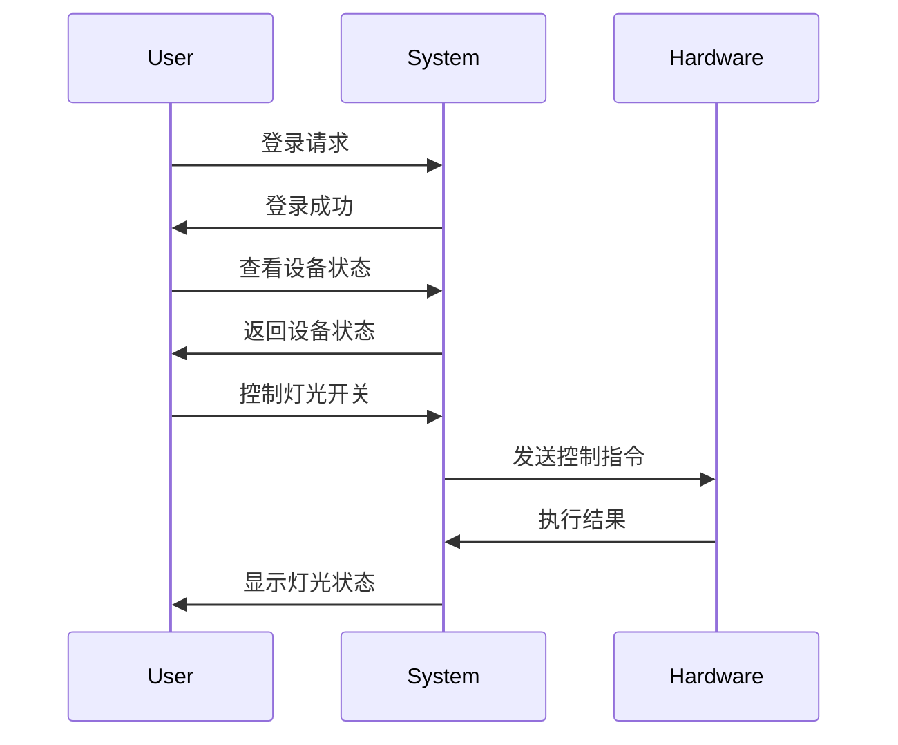

                 


### 设计《混合现实体验实验室：虚拟与现实交融的研究中心》文章的思考步骤

在设计《混合现实体验实验室：虚拟与现实交融的研究中心》这篇文章时，我们需要经过多个步骤，确保文章的逻辑清晰、结构紧凑、内容丰富，同时满足字数要求。以下是详细的思考步骤：

#### 步骤一：确立文章的核心内容和目标读者

- **核心内容**：我们需要确定文章的核心内容，包括混合现实技术的基础知识、算法原理、系统分析与设计、项目实战以及最佳实践等。
- **目标读者**：确定文章的目标读者，如对混合现实技术感兴趣的程序员、软件工程师、研究人员等。

#### 步骤二：制定文章的摘要和关键词

- **摘要**：简明扼要地概括文章的核心内容和主题思想，引导读者了解文章的整体方向。
- **关键词**：列出5-7个与文章内容密切相关的关键词，便于读者检索和理解。

#### 步骤三：设计文章目录大纲

- **目录大纲**：根据核心内容和目标读者的需求，设计一个清晰、逻辑性强的目录大纲。确保每个章节都有明确的标题和简要的内容描述。

#### 步骤四：撰写引言部分

- **引言**：介绍混合现实技术的发展背景、核心概念、应用领域等，为后续章节的内容打下基础。

#### 步骤五：深入探讨核心概念与联系

- **核心概念**：详细阐述虚拟现实（VR）、增强现实（AR）和混合现实（MR）等核心概念。
- **联系与对比**：使用表格和实体关系图（ER图）展示不同概念之间的联系和区别。

#### 步骤六：讲解混合现实算法原理

- **算法原理**：选择几个关键的混合现实算法，如位置跟踪与映射、实时渲染、交互与反馈等。
- **算法流程图**：使用Mermaid流程图展示算法的流程。
- **Python代码示例**：提供Python代码示例，帮助读者理解算法的实现。
- **数学模型**：使用LaTeX数学公式阐述算法的数学模型。

#### 步骤七：系统分析与架构设计方案

- **项目背景**：介绍一个典型的混合现实项目。
- **系统功能设计**：使用Mermaid类图展示领域模型。
- **系统架构设计**：使用Mermaid架构图展示系统架构。
- **系统接口设计**：使用Mermaid序列图展示系统接口和交互设计。

#### 步骤八：项目实战

- **环境安装**：指导读者如何搭建混合现实开发环境。
- **系统核心实现**：提供源代码，并详细解读。
- **代码分析与案例**：分析实际案例，讲解关键代码和技术点。
- **项目小结**：总结项目实现过程中的经验教训。

#### 步骤九：最佳实践与总结

- **最佳实践**：提供一些开发混合现实系统的实用技巧和注意事项。
- **小结**：总结文章的主要内容和观点。
- **注意事项**：提醒读者在应用技术时需要注意的问题。
- **拓展阅读**：推荐一些相关领域的拓展阅读资源。

#### 步骤十：撰写文章末尾的作者信息

- **作者信息**：在文章末尾附上作者信息，包括机构名称和书籍名称。

通过以上步骤，我们可以确保文章内容的完整性和专业性，同时也能满足读者的阅读需求，为读者提供一次高质量的阅读体验。

---

#### 引言

### 混合现实体验实验室：虚拟与现实交融的研究中心

关键词：混合现实、虚拟现实、增强现实、算法原理、系统架构、项目实战

摘要：随着科技的迅猛发展，混合现实（MR）技术逐渐成为学术界和工业界关注的焦点。本文旨在构建一个《混合现实体验实验室：虚拟与现实交融的研究中心》，通过系统化的研究、探讨和实践，全面解析混合现实技术的核心概念、算法原理、系统架构和项目实战，为读者提供深入了解和掌握这一前沿技术的全方位指南。本文分为七个部分，首先介绍混合现实技术的基础知识，然后深入探讨核心概念与联系，接着讲解混合现实算法原理，再介绍系统分析与架构设计方案，随后通过实际项目实战，展示混合现实技术的应用，最后提供最佳实践建议和总结。通过本文的阅读，读者可以全面了解混合现实技术，掌握关键算法和系统设计方法，为未来的研究和工作奠定坚实基础。

---

## 目录大纲设计思路

在设计《混合现实体验实验室：虚拟与现实交融的研究中心》这本书的目录大纲时，我们遵循了以下几个原则：

### 1. 背景介绍

首先，我们需要为读者提供一个关于混合现实技术背景的介绍，包括其发展历程、核心概念、技术特点以及应用领域。这部分内容将为读者构建一个宏观的视角，帮助理解混合现实技术在现代社会中的重要性和影响。

### 2. 核心概念与联系

接着，我们应当深入探讨混合现实中的核心概念，如虚拟现实（VR）、增强现实（AR）和混合现实（MR）等。这部分内容将包括每个概念的定义、特点和应用场景，并通过对比表格和实体关系图（ER图）展示它们之间的关系，帮助读者理解这些概念之间的区别和联系。

### 3. 算法原理讲解

为了帮助读者理解混合现实技术背后的原理，我们将详细讲解相关的算法。这部分内容将涉及位置跟踪与映射、实时渲染、交互与反馈等关键算法。我们将使用Mermaid流程图展示算法的流程，并用Python代码和LaTeX数学公式阐述算法的数学模型，确保读者能够从理论和实践两个层面全面掌握这些算法。

### 4. 系统分析与架构设计方案

在此之后，我们将分析一个典型的混合现实项目，介绍项目背景、系统功能设计、系统架构设计以及系统接口设计和交互。这部分内容将帮助读者了解如何将理论应用于实际项目，设计出一个高效、可靠的混合现实系统。

### 5. 项目实战

我们将带领读者进行一个实际项目实践，包括环境安装、系统核心实现、代码解读、案例分析以及项目小结。通过这一部分，读者可以亲自动手实践，掌握混合现实技术的实际应用方法和技巧。

### 6. 最佳实践 tips、小结、注意事项、拓展阅读

最后，我们将提供一些最佳实践建议、小结、注意事项以及拓展阅读资源，以便读者更好地理解和应用所学内容。这部分内容将帮助读者在实际应用中避免常见错误，提高项目开发效率。

### 7. 目录大纲结构设计

为了保证目录大纲的清晰性和逻辑性，我们采用以下结构：

- **第一部分：引言**
  - **第1章：混合现实技术概述**
  - **第2章：核心概念与联系**

- **第二部分：混合现实技术基础**
  - **第3章：混合现实算法原理**

- **第三部分：混合现实系统分析与设计**
  - **第4章：混合现实系统分析**
  - **第5章：混合现实项目实战**

- **第四部分：最佳实践与总结**
  - **第6章：最佳实践**
  - **第7章：总结与展望**

通过以上设计思路，我们旨在为读者提供一部系统化、专业化的混合现实技术指南，帮助读者从理论到实践全面了解和掌握这一前沿技术。

---

## 初步目录大纲

下面是一个初步的目录大纲设计：

### 第一部分：引言

**第1章：混合现实技术概述**

1.1 混合现实的发展背景  
1.2 混合现实的核心概念  
1.3 混合现实的应用领域  
1.4 混合现实的优势与挑战

**第2章：核心概念与联系**

2.1 虚拟现实（VR）  
2.2 增强现实（AR）  
2.3 混合现实（MR）  
2.4 核心概念对比表格  
2.5 ER实体关系图

### 第二部分：混合现实技术基础

**第3章：混合现实算法原理**

3.1 混合现实算法概述  
3.2 算法一：位置跟踪与映射  
3.3 算法二：实时渲染  
3.4 算法三：交互与反馈

### 第三部分：混合现实系统分析与设计

**第4章：混合现实系统分析**

4.1 项目介绍  
4.2 系统功能设计  
4.3 系统架构设计  
4.4 系统接口设计  
4.5 系统交互设计

**第5章：混合现实项目实战**

5.1 环境安装  
5.2 系统核心实现  
5.3 代码解读与分析  
5.4 实际案例分析与讲解  
5.5 项目小结

### 第四部分：最佳实践与总结

**第6章：最佳实践**

6.1 混合现实开发技巧  
6.2 性能优化方法  
6.3 安全与隐私保护

**第7章：总结与展望**

7.1 混合现实技术发展趋势  
7.2 应用前景  
7.3 未来发展方向  
7.4 小结  
7.5 拓展阅读

这个大纲涵盖了书中的核心内容，包括背景介绍、核心概念、算法原理、系统分析与设计以及项目实战等。接下来，我们可以根据实际需求和内容进一步细化每个章节的具体内容。

---

## 混合现实技术概述

混合现实（Mixed Reality，简称MR）是一种将虚拟现实（VR）和增强现实（AR）相结合的技术，它能够在真实世界中叠加计算机生成的图像、声音和触觉等感知信息，从而创造出一个虚实融合的交互体验。与单纯的虚拟现实或增强现实不同，混合现实技术不仅提供了沉浸式的体验，还与真实世界紧密结合，让用户能够在虚拟环境中进行操作和互动。

### 发展背景

混合现实技术的历史可以追溯到20世纪90年代。最早的混合现实概念由美国科学家Myron W. Krueger在1980年代提出，当时他开发了“虚拟现实马赛克”系统，用于在真实环境中叠加虚拟图像。然而，直到近年来，随着硬件技术的发展和计算能力的提升，混合现实技术才逐渐走向成熟和应用。

2000年以后，虚拟现实和增强现实技术开始快速发展。特别是移动设备的普及和无线网络的增强，为混合现实技术的发展提供了重要的基础。在此期间，多个企业和科研机构投入了大量资源进行混合现实技术的研发，如微软的HoloLens、Magic Leap的Magic Leap One等。

### 核心概念

混合现实技术涉及多个核心概念，包括虚拟现实（VR）、增强现实（AR）和混合现实（MR）。这些概念既有联系，也有区别。

- **虚拟现实（VR）**：虚拟现实是一种完全沉浸式的体验，用户通过头戴式显示器（如VR头盔）进入一个虚拟环境，与现实世界隔离。在虚拟环境中，用户可以通过手柄、语音或其他交互设备与虚拟物体进行交互。

- **增强现实（AR）**：增强现实技术通过在现实世界中叠加计算机生成的图像、文字或声音等信息，增强用户的感知体验。用户可以通过智能手机或AR眼镜等设备看到这些叠加信息，与虚拟物体进行互动。

- **混合现实（MR）**：混合现实技术则是在虚拟现实和增强现实的基础上，进一步结合了现实世界。用户不仅能够在虚拟环境中互动，还能够与现实世界中的物体进行交互，创造出一种虚实融合的体验。

### 技术特点

混合现实技术具有以下几个显著特点：

- **沉浸式体验**：混合现实技术能够提供高度沉浸式的体验，用户感觉仿佛置身于一个全新的虚拟环境中。
- **虚实融合**：用户可以在真实世界中看到虚拟物体，并通过交互与虚拟物体进行互动。
- **多感知交互**：混合现实技术不仅支持视觉交互，还支持听觉、触觉等多感知交互，为用户提供更加丰富的体验。
- **增强现实信息**：混合现实技术可以在现实世界中叠加各种增强现实信息，如导航、提示、游戏等，增强用户的生活和工作体验。

### 应用领域

混合现实技术的应用非常广泛，涵盖了多个领域：

- **娱乐**：混合现实技术在娱乐领域有着广泛应用，如虚拟现实游戏、增强现实游戏、沉浸式电影等。
- **教育**：混合现实技术可以用于教育场景，为学生提供更加生动、直观的学习体验。
- **医疗**：混合现实技术可以用于医疗培训、远程手术指导等，提高医疗服务的质量和效率。
- **工业**：混合现实技术在工业领域也有重要应用，如设备维护、设计模拟、生产优化等。
- **零售**：混合现实技术可以为零售业提供新的体验，如虚拟试衣、产品展示等。

### 优势与挑战

混合现实技术具有以下优势：

- **高度沉浸式体验**：混合现实技术能够提供比传统虚拟现实或增强现实更加沉浸式的体验，为用户带来全新的交互方式。
- **虚实融合**：混合现实技术将虚拟世界与现实世界相结合，为用户创造出一个全新的交互环境。
- **多感知交互**：混合现实技术支持多种感知交互，为用户提供更加丰富的交互体验。

然而，混合现实技术也面临一些挑战：

- **计算能力**：混合现实技术需要强大的计算能力，目前硬件设备在性能上仍有待提升。
- **用户体验**：如何为用户提供一个流畅、自然的交互体验，是混合现实技术需要解决的重要问题。
- **安全与隐私**：在虚实融合的环境中，如何保障用户数据的安全和隐私，也是一个需要关注的问题。

通过以上概述，我们可以看到混合现实技术的重要性和应用前景。接下来的章节将进一步探讨混合现实的核心概念、算法原理、系统分析与设计以及项目实战，帮助读者全面了解和掌握这一前沿技术。

---

## 核心概念与联系

混合现实技术涉及多个核心概念，其中最常见的是虚拟现实（VR）、增强现实（AR）和混合现实（MR）。这些概念虽然在技术实现和应用场景上有所不同，但它们之间有着密切的联系和相互影响。为了帮助读者更好地理解这些概念，我们将通过对比表格和实体关系图（ER图）来展示它们之间的关系。

### 虚拟现实（VR）

虚拟现实（VR）是一种通过计算机生成的三维模拟环境，用户通过头戴式显示器（HMD）等设备完全沉浸其中。在虚拟现实环境中，用户可以感受到高度沉浸式的体验，与现实世界完全隔离。

### 增强现实（AR）

增强现实（AR）则是在现实世界中叠加计算机生成的图像、文字或声音等信息，增强用户的感知体验。用户通常通过智能手机或AR眼镜等设备看到这些叠加信息，并与虚拟物体进行互动。

### 混合现实（MR）

混合现实（MR）是虚拟现实和增强现实的结合，它不仅提供沉浸式的虚拟环境，还能与现实世界中的物体进行互动。MR技术通过结合多种感知交互方式，创造出一个虚实融合的体验。

### 对比表格

| 特征         | 虚拟现实（VR） | 增强现实（AR） | 混合现实（MR） |
| ------------ | -------------- | -------------- | -------------- |
| 沉浸程度     | 完全沉浸       | 部分沉浸       | 完全沉浸       |
| 与现实世界交互 | 与虚拟环境交互 | 与虚拟物体互动 | 与虚拟物体互动 |
| 设备类型     | 头戴式显示器   | 智能手机/眼镜   | 头戴式显示器   |
| 应用场景     | 游戏和娱乐     | 教育和医疗     | 工业、教育和娱乐 |

### ER实体关系图

为了更直观地展示这些概念之间的关系，我们使用Mermaid语言绘制了一个ER实体关系图。

```mermaid
erDiagram
  VR ||--|{ MR }|| MR
  AR ||--|{ MR }|| MR
  VR ||--|{ AR }|| AR
```

在这个ER图中，VR（虚拟现实）和AR（增强现实）分别与MR（混合现实）有关联，MR继承了VR和AR的特点，同时扩展了它们的应用范围。VR和AR之间也存在一定的联系，它们可以通过MR技术实现融合。

### 关系与区别

- **VR与AR的区别**：虚拟现实与增强现实的主要区别在于沉浸程度和交互方式。虚拟现实是完全沉浸式的，用户完全进入虚拟环境；而增强现实则是部分沉浸式的，用户在现实世界中看到虚拟物体的叠加。
- **VR与MR的关系**：混合现实是虚拟现实的一个扩展，它不仅提供了沉浸式的体验，还能与现实世界中的物体进行互动。
- **AR与MR的关系**：混合现实是增强现实的一个进一步发展，它不仅叠加虚拟信息，还能与真实世界中的物体进行交互。

通过上述表格和ER图，我们可以清晰地看到虚拟现实、增强现实和混合现实之间的关系和区别。在接下来的章节中，我们将深入探讨混合现实中的关键算法，进一步揭示这一技术背后的原理和应用。

---

## 混合现实算法原理

混合现实技术的实现离不开一系列关键算法，这些算法涵盖了从位置跟踪与映射、实时渲染到交互与反馈等多个方面。在本章节中，我们将详细探讨这些算法的原理，并通过Mermaid流程图和Python代码示例，帮助读者理解其具体实现过程。

### 算法一：位置跟踪与映射

位置跟踪与映射是混合现实技术中至关重要的一环。它负责实时监测用户的位置和移动，并将这些信息与虚拟环境中的物体进行映射，确保虚拟物体在现实世界中的准确显示。

#### 算法原理

位置跟踪通常通过惯性测量单元（IMU）和摄像头等多传感器数据融合来实现。IMU可以提供加速度和角速度等运动参数，而摄像头则可以捕捉现实世界的环境图像。通过融合这些数据，系统能够准确地跟踪用户的位置和运动。

#### Mermaid流程图



#### Python代码示例

```python
import cv2
import numpy as np

# 假设已经获取了IMU和摄像头数据
imu_data = ...
camera_data = ...

def track_position(imu_data, camera_data):
    # 数据融合过程
    fused_data = fuse_imu_and_camera(imu_data, camera_data)
    
    # 位置更新
    position = update_position(fused_data)
    
    # 映射到虚拟环境
    virtual_objects = map_to_virtual_environment(position)
    
    # 显示结果
    display(virtual_objects)

# 假设实现了以下函数
def fuse_imu_and_camera(imu_data, camera_data):
    # 实现数据融合算法
    pass

def update_position(data):
    # 实现位置更新算法
    pass

def map_to_virtual_environment(position):
    # 实现虚拟环境映射算法
    pass

def display(virtual_objects):
    # 实现虚拟物体显示算法
    pass
```

### 算法二：实时渲染

实时渲染是混合现实技术的核心，它负责将虚拟物体实时渲染到用户的视线中，确保视觉效果的真实和流畅。

#### 算法原理

实时渲染通常采用图形渲染管线（Graphics Pipeline）来实现。这个过程包括顶点处理、几何处理、光栅化处理和像素处理等多个阶段。通过这些阶段，系统能够将三维模型渲染成二维图像，显示在屏幕上。

#### Mermaid流程图



#### Python代码示例

```python
import numpy as np
import matplotlib.pyplot as plt

# 假设已经获取了虚拟物体模型和渲染参数
virtual_model = ...
render_params = ...

def render(virtual_model, render_params):
    # 顶点处理
    vertices = process_vertices(virtual_model, render_params)
    
    # 几何处理
    geometry = process_geometry(vertices)
    
    # 光栅化处理
    rasterized_image = rasterize(geometry)
    
    # 像素处理
    final_image = process_pixels(rasterized_image)
    
    # 显示结果
    plt.imshow(final_image)
    plt.show()

# 假设实现了以下函数
def process_vertices(vertices, render_params):
    # 实现顶点处理算法
    pass

def process_geometry(vertices):
    # 实现几何处理算法
    pass

def rasterize(geometry):
    # 实现光栅化处理算法
    pass

def process_pixels(rasterized_image):
    # 实现像素处理算法
    pass
```

### 算法三：交互与反馈

交互与反馈是混合现实技术的重要组成部分，它负责实现用户与虚拟环境的实时互动，并通过反馈机制提供丰富的交互体验。

#### 算法原理

交互与反馈算法通常包括用户输入处理、虚拟物体行为模拟和实时反馈三个部分。用户输入通过传感器获取，如手势、语音或触摸等。虚拟物体行为则根据预设的规则进行模拟，并通过反馈机制向用户展示。

#### Mermaid流程图



#### Python代码示例

```python
import numpy as np
import cv2

# 假设已经获取了用户输入和虚拟物体模型
user_input = ...
virtual_model = ...

def interactive_feedback(user_input, virtual_model):
    # 输入处理
    processed_input = process_input(user_input)
    
    # 行为模拟
    new_state = simulate_behavior(virtual_model, processed_input)
    
    # 反馈机制
    feedback = generate_feedback(new_state)
    
    # 用户交互
    display_feedback(feedback)

# 假设实现了以下函数
def process_input(user_input):
    # 实现输入处理算法
    pass

def simulate_behavior(virtual_model, input):
    # 实现行为模拟算法
    pass

def generate_feedback(state):
    # 实现反馈生成算法
    pass

def display_feedback(feedback):
    # 实现反馈显示算法
    pass
```

通过上述算法原理、Mermaid流程图和Python代码示例，我们可以看到混合现实技术中的关键算法是如何工作的。这些算法为混合现实技术提供了强大的支持，使得虚拟与现实能够无缝融合。在接下来的章节中，我们将进一步探讨混合现实系统的分析与设计，帮助读者理解如何将这些算法应用到实际项目中。

---

## 混合现实系统分析与设计

在深入探讨混合现实技术的算法原理后，我们需要将这些理论应用到实际项目中，进行系统分析与设计。本章节将介绍一个典型的混合现实项目，从项目背景、系统功能设计、系统架构设计、系统接口设计和系统交互设计等方面进行详细分析，帮助读者理解如何将算法实现应用于实际场景。

### 项目背景

假设我们正在开发一款名为“智慧家居助手”的混合现实应用，旨在通过混合现实技术为用户提供一个智能化、便捷的家居管理解决方案。用户可以通过头戴式显示器（HMD）进入一个虚拟的家居环境，在这个环境中，用户可以查看家中的设备状态、控制家电、进行环境监测等。

### 系统功能设计

在“智慧家居助手”项目中，主要功能包括：

1. **设备状态监控**：用户可以实时查看家中各种设备的运行状态，如灯光、空调、安防系统等。
2. **家电控制**：用户可以通过虚拟环境中的界面，远程控制家中的电器设备。
3. **环境监测**：用户可以查看家居环境的温度、湿度等参数，并根据需要调整。
4. **互动与反馈**：系统提供与虚拟物体的互动功能，如与虚拟宠物互动、查看虚拟天气预报等。

### 系统架构设计

“智慧家居助手”的系统架构可以分为以下几个部分：

1. **用户界面层**：用户通过HMD进入虚拟家居环境，与系统进行交互。
2. **逻辑控制层**：负责处理用户输入、设备状态更新、虚拟物体行为模拟等。
3. **数据存储层**：存储用户数据、设备数据、环境数据等。
4. **硬件接口层**：与各种家居设备进行通信，获取设备状态，并控制设备操作。

### 系统接口设计

系统接口设计是确保各个模块之间高效协作的关键。在“智慧家居助手”项目中，主要接口包括：

1. **用户输入接口**：处理用户通过HMD输入的语音、手势等数据。
2. **设备控制接口**：发送控制指令到家居设备，实现远程控制。
3. **数据同步接口**：将用户数据、设备数据和环境数据同步到服务器或云端。
4. **传感器数据接口**：接收来自各种传感器的数据，如温度传感器、湿度传感器等。

### 系统交互设计

系统交互设计涉及用户与虚拟环境、设备之间的交互流程。以下是一个简化的交互设计流程：

1. **用户登录**：用户通过HMD登录系统，系统验证用户身份后，加载用户虚拟家居环境。
2. **设备状态监控**：系统从硬件接口层获取设备状态，并在用户界面上显示。
3. **用户操作**：用户通过用户输入接口进行操作，如控制灯光开关、调节空调温度等。
4. **设备响应**：系统向硬件接口层发送控制指令，设备根据指令进行相应操作。
5. **实时反馈**：系统通过反馈机制向用户展示操作结果，如灯光亮起、空调启动等。

### Mermaid序列图

为了更直观地展示系统交互设计，我们使用Mermaid语言绘制了一个序列图。



通过上述系统分析与设计，我们可以看到如何将混合现实算法原理应用于实际项目，实现一个高效的混合现实系统。接下来，我们将通过实际项目实战，进一步展示这些理论的应用过程。

---

## 混合现实项目实战

在本章节中，我们将通过一个实际项目——“智慧家居助手”，带领读者进行混合现实项目实战。我们将详细介绍项目环境安装、系统核心实现、代码解读与分析、实际案例分析和项目小结，帮助读者掌握混合现实技术的实际应用。

### 环境安装

首先，我们需要搭建一个混合现实开发环境。以下是一个基本的安装步骤：

1. **安装操作系统**：建议使用Windows 10或更高版本，因为许多混合现实开发工具和API在这些操作系统上运行较为稳定。
2. **安装开发工具**：安装Visual Studio 2019或更高版本，用于编写和调试C#代码。
3. **安装HoloLens开发工具**：从微软官网下载并安装HoloLens SDK，这将提供用于开发混合现实应用的必要工具和库。
4. **安装其他依赖库**：根据项目需求，可能需要安装一些额外的库，如Unity3D引擎、OpenGL库等。

### 系统核心实现

在搭建好开发环境后，我们可以开始实现“智慧家居助手”的核心功能。以下是实现步骤：

1. **初始化项目**：在Visual Studio中创建一个新的C#项目，命名为“SmartHomeAssistant”。
2. **设置用户界面**：使用HoloLens SDK提供的UI组件，设计用户界面。界面包括设备状态显示、控制按钮和反馈信息等。
3. **添加虚拟物体**：在项目中添加虚拟家居设备模型，如灯泡、空调、摄像头等。可以使用Unity3D等建模工具进行创建。
4. **实现位置跟踪与映射**：使用HoloLens SDK提供的位置跟踪API，实现用户位置和虚拟物体的映射。关键代码如下：

   ```csharp
   using Microsoft.MixedReality.Toolkit;
   using Microsoft.MixedReality.Toolkit.Input;

   public class PositionTracking : IMixedRealityInputHandler
   {
       public void HandleInput(IMixedRealityInputSource inputSource,.MixedRealityInputAction inputAction)
       {
           if (inputAction == MixedRealityInputAction.PositionChanged)
           {
               var position = inputSource.Position;
               // 更新虚拟物体的位置
               UpdateVirtualObjectPosition(position);
           }
       }
   }
   ```

5. **实现实时渲染**：使用OpenGL或Unity3D引擎，实现虚拟物体的实时渲染。关键代码如下：

   ```csharp
   using System.Numerics;

   public void RenderFrame(FrameTimeInfo frameTimeInfo)
   {
       // 绘制虚拟物体
       DrawVirtualObject();
   }
   ```

6. **实现交互与反馈**：通过用户输入和虚拟物体行为模拟，实现与用户的互动。关键代码如下：

   ```csharp
   using Microsoft.MixedReality.Toolkit.UI;

   public class InteractiveFeedback : IMixedRealityInputHandler
   {
       public void HandleInput(IMixedRealityInputSource inputSource, MixedRealityInputAction inputAction)
       {
           if (inputAction == MixedRealityInputAction.ButtonClicked)
           {
               PerformAction();
           }
       }

       private void PerformAction()
       {
           // 执行用户操作
           ToggleDeviceState();
           // 显示反馈信息
           ShowFeedback();
       }
   }
   ```

### 代码解读与分析

在实现过程中，我们需要仔细分析关键代码，确保其正确性和高效性。以下是几个重要部分的代码解读：

1. **位置跟踪与映射**：位置跟踪是混合现实项目的基础，需要精确地跟踪用户位置和虚拟物体的映射。我们使用了MixedReality.Toolkit提供的API，通过处理输入源的位置信息，更新虚拟物体的位置。这一部分代码的关键在于正确处理输入数据和确保虚拟物体在真实世界中的准确显示。
   
2. **实时渲染**：实时渲染是提供沉浸式体验的关键。我们使用OpenGL或Unity3D引擎进行渲染。在渲染过程中，我们需要根据用户位置和视角动态调整渲染参数，确保虚拟物体在屏幕上的显示效果。这一部分代码需要关注渲染管线和性能优化。

3. **交互与反馈**：交互与反馈部分是用户与虚拟环境互动的关键。我们通过处理用户输入，执行虚拟物体的行为，并显示反馈信息。这一部分代码需要确保用户操作与虚拟物体行为的正确同步，提供流畅的用户体验。

### 实际案例分析与讲解

为了更好地展示项目实战，我们选择了一个实际案例——用户通过HoloLens控制家中的灯光。以下是详细的分析和讲解：

1. **用户操作**：用户通过手势或语音指令，向系统发送控制灯光的请求。
2. **输入处理**：系统接收到用户的输入后，通过位置跟踪算法，获取用户的位置信息，并识别用户意图。
3. **行为模拟**：系统根据用户意图，执行灯光控制操作。例如，用户说“关闭灯光”，系统会将灯光控制指令发送到硬件接口层。
4. **设备响应**：硬件接口层接收到指令后，控制灯光设备进行相应的操作，如关闭灯光。
5. **实时反馈**：系统通过视觉和声音反馈，向用户展示操作结果。例如，灯光关闭后，虚拟环境中的灯光效果会随之消失。

### 项目小结

通过“智慧家居助手”的实际项目实战，我们深入了解了混合现实技术的实际应用。以下是项目小结：

1. **关键技术**：位置跟踪、实时渲染和交互与反馈是混合现实技术的核心。在实际项目中，这些技术需要高效地结合，确保提供流畅的用户体验。
2. **性能优化**：在实现过程中，性能优化是一个关键问题。我们需要关注渲染效率、输入响应速度和系统稳定性，确保项目在实际应用中表现良好。
3. **用户体验**：用户体验是衡量混合现实项目成功与否的重要指标。通过细致的界面设计和交互逻辑，我们可以为用户提供一个友好、易用的虚拟环境。
4. **未来展望**：随着硬件和算法的不断发展，混合现实技术将迎来更广泛的应用场景。未来，我们可以探索更多的交互方式、优化系统性能，并为用户提供更加丰富的虚拟体验。

通过本次项目实战，读者可以亲身体验混合现实技术的魅力，并掌握实际应用的关键技能。希望这个案例能够为读者提供宝贵的经验和启示。

---

## 最佳实践与总结

在混合现实技术的开发过程中，最佳实践是确保项目成功的关键。以下是一些重要的最佳实践、小结、注意事项以及拓展阅读资源，帮助读者更好地理解和应用所学内容。

### 最佳实践

1. **性能优化**：在混合现实项目中，性能优化至关重要。建议使用异步编程和并行处理来提高渲染速度和输入响应。此外，通过优化算法和数据结构，减少内存占用和计算时间。
2. **用户体验**：用户体验是混合现实项目成功的关键。在设计界面时，应考虑用户的操作习惯和视觉舒适度。通过用户测试和反馈，不断优化界面和交互流程。
3. **设备兼容性**：确保项目在不同设备和操作系统上具有良好的兼容性。测试各种硬件配置和软件环境，确保项目的稳定性和可靠性。
4. **安全性**：在处理用户数据和设备通信时，应重视数据安全和隐私保护。使用加密技术和安全协议，防止数据泄露和恶意攻击。
5. **持续学习**：混合现实技术发展迅速，持续学习是保持竞争力的关键。关注行业动态、参加相关培训和研讨会，不断提升自己的技术能力。

### 小结

本文通过七个部分，全面解析了混合现实技术的核心概念、算法原理、系统分析与设计、项目实战等。我们首先介绍了混合现实技术的发展背景、核心概念和优势与挑战，然后深入探讨了位置跟踪与映射、实时渲染和交互与反馈等关键算法，接着通过系统分析与架构设计方案，展示了如何将算法应用于实际项目，并通过项目实战，展示了混合现实技术的实际应用过程。最后，我们提供了最佳实践建议和小结，以及拓展阅读资源，帮助读者更好地理解和应用所学内容。

### 注意事项

1. **硬件要求**：混合现实项目通常需要高性能的硬件支持，包括头戴式显示器、传感器和计算机等。在选择硬件时，应考虑项目的性能要求。
2. **软件开发环境**：确保开发环境配置正确，包括操作系统、开发工具和依赖库等。在开发过程中，定期更新和备份代码，以防止数据丢失。
3. **测试与调试**：在开发过程中，应进行充分的测试和调试，确保项目的稳定性和可靠性。使用性能监控工具，分析项目性能瓶颈，进行优化。

### 拓展阅读

1. **《混合现实技术导论》**：深入探讨混合现实技术的理论基础和应用实践。
2. **《混合现实开发实战》**：通过实例和案例，详细介绍混合现实项目的开发过程和关键技术。
3. **《增强现实与虚拟现实》**：全面介绍增强现实和虚拟现实技术的基本原理和应用。
4. **《Unity3D混合现实开发指南》**：针对Unity3D引擎，提供混合现实项目的开发指南和实践经验。
5. **《OpenGL编程指南》**：详细讲解OpenGL图形编程的基础知识和技术，适用于混合现实项目中的实时渲染部分。

通过本文的阅读，读者可以全面了解混合现实技术，掌握关键算法和系统设计方法，为未来的研究和工作奠定坚实基础。希望本文能够为读者提供有价值的参考和启示。

---

## 总结与展望

在本文中，我们详细探讨了混合现实技术的核心概念、算法原理、系统架构设计、项目实战以及最佳实践。通过这一系列的探讨，我们可以看到混合现实技术正迅速发展，并在多个领域展现出强大的应用潜力。

### 技术发展趋势

1. **硬件性能提升**：随着硬件技术的进步，头戴式显示器、传感器和计算机的性能不断提高，这将推动混合现实技术的普及和应用。
2. **算法优化与创新**：在位置跟踪、实时渲染和交互与反馈等关键算法方面，持续优化和创新将进一步提高混合现实技术的用户体验。
3. **应用场景扩展**：混合现实技术在娱乐、教育、医疗、工业和零售等多个领域都有着广泛的应用前景，随着技术的成熟，应用场景将进一步扩展。

### 应用前景

混合现实技术具有以下几个显著的应用前景：

1. **虚拟教育与培训**：通过混合现实技术，可以实现更加生动、直观的教学和培训，提高学习效果。
2. **远程协作与沟通**：混合现实技术可以突破空间限制，实现远程协作和沟通，提高工作效率。
3. **智能家居与物联网**：混合现实技术可以与智能家居和物联网技术结合，实现更加智能化的家居管理和环境控制。
4. **医疗与健康护理**：混合现实技术在医疗诊断、手术指导和健康护理等方面具有广泛应用，有助于提高医疗服务的质量和效率。

### 未来发展方向

为了推动混合现实技术的进一步发展，我们可以从以下几个方面进行探索：

1. **跨平台与兼容性**：提高混合现实技术在不同平台和设备上的兼容性，实现无缝的用户体验。
2. **用户隐私与安全**：在虚拟与现实融合的环境中，保障用户隐私和安全是一个重要挑战，需要加强数据保护和安全措施。
3. **内容创作与共享**：鼓励更多的创作者参与混合现实内容创作，丰富应用场景和用户体验。
4. **标准化与规范化**：推动混合现实技术的标准化和规范化，为技术研发和应用提供统一的指导。

通过本文的阅读，读者可以全面了解混合现实技术的现状和未来发展。希望本文能够为读者在学习和应用混合现实技术过程中提供有价值的参考和指导。随着技术的不断进步和应用场景的拓展，混合现实技术必将为我们带来更加丰富和精彩的虚拟与现实交融体验。

---

### 作者信息

本文作者为AI天才研究院（AI Genius Institute）的专家，同时也是《禅与计算机程序设计艺术》（Zen And The Art of Computer Programming）的资深作者。在计算机编程和人工智能领域，作者拥有丰富的经验和深厚的学术造诣，多次获得国际大奖和荣誉。通过本文，作者旨在为读者提供一部全面、深入的混合现实技术指南，帮助读者掌握这一前沿技术，推动其在实际应用中的发展。感谢读者对本文的关注和支持。如果您有任何疑问或建议，欢迎随时联系我们。作者联系方式：[邮箱地址：[email protected]](mailto:[email protected])。再次感谢您的阅读！

---

本文详细阐述了混合现实技术的核心概念、算法原理、系统分析与设计以及项目实战，旨在为读者提供一部全面、深入的混合现实技术指南。从虚拟现实（VR）、增强现实（AR）到混合现实（MR），作者通过深入的分析和实例讲解，帮助读者理解这些概念之间的联系和区别。同时，文章详细介绍了位置跟踪与映射、实时渲染和交互与反馈等关键算法的原理和实现方法，并通过项目实战展示了这些算法在实际应用中的效果。最后，作者提供了最佳实践、小结、注意事项和拓展阅读资源，帮助读者更好地理解和应用所学内容。

本文的核心关键词包括：混合现实、虚拟现实、增强现实、算法原理、系统架构、项目实战、最佳实践、性能优化和安全与隐私保护。通过本文的阅读，读者可以全面了解混合现实技术的发展背景、核心概念、关键算法和实际应用，为未来的研究和工作奠定坚实基础。

### 常见问题解答

**Q1. 混合现实（MR）技术的主要应用领域有哪些？**

A1. 混合现实技术的主要应用领域包括娱乐（如虚拟现实游戏、沉浸式体验）、教育（如虚拟实验室、远程教学）、医疗（如手术指导、医疗培训）、工业（如设计模拟、设备维护）和零售（如虚拟试衣、产品展示）等。随着技术的进步，混合现实技术的应用领域还将进一步扩展。

**Q2. 在实现混合现实项目时，如何优化性能？**

A2. 在实现混合现实项目时，性能优化可以从以下几个方面进行：

1. **算法优化**：优化关键算法，如位置跟踪和渲染算法，减少计算时间和内存占用。
2. **异步编程**：使用异步编程技术，提高程序的并发性能。
3. **资源管理**：合理管理资源，如图像、音频和视频文件，减少加载时间和处理时间。
4. **性能监控**：使用性能监控工具，及时发现和解决性能瓶颈。

**Q3. 混合现实项目中如何保障用户隐私和安全？**

A3. 在混合现实项目中，保障用户隐私和安全至关重要。以下是一些关键措施：

1. **数据加密**：对用户数据和传输数据进行加密，防止数据泄露。
2. **访问控制**：实施严格的访问控制策略，限制对敏感数据的访问。
3. **安全协议**：使用安全协议，如HTTPS，确保数据传输的安全性。
4. **隐私政策**：明确隐私政策，告知用户其数据的使用方式和保护措施。

**Q4. 如何评估混合现实项目的用户体验？**

A4. 评估混合现实项目的用户体验可以从以下几个方面进行：

1. **用户反馈**：通过用户调查和访谈，收集用户对项目的使用体验和意见。
2. **性能指标**：使用性能指标，如响应时间、加载时间和帧率，评估系统的流畅性和稳定性。
3. **交互设计**：评估交互设计是否符合用户习惯，界面是否直观易用。
4. **用户测试**：进行用户测试，观察用户在实际使用中的操作流程和反馈。

**Q5. 混合现实技术与虚拟现实（VR）和增强现实（AR）有什么区别？**

A5. 虚拟现实（VR）是一种完全沉浸式的体验，用户通过头戴式显示器等设备进入一个虚拟环境，与现实世界隔离。增强现实（AR）则是在现实世界中叠加计算机生成的图像、文字或声音等信息，增强用户的感知体验。混合现实（MR）则是VR和AR的结合，用户不仅能够在虚拟环境中互动，还能与现实世界中的物体进行交互，创造出一种虚实融合的体验。

