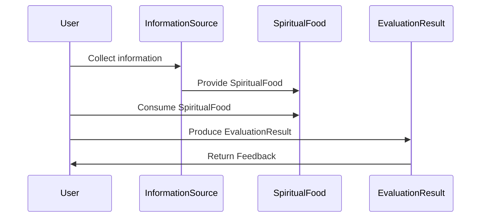
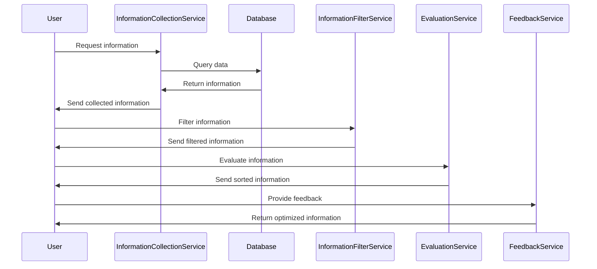

                 

### 文章标题

滋养心灵的智慧选择：精神食粮的筛选

> 关键词：智慧选择、精神食粮、算法原理、系统架构、项目实战

> 摘要：本文旨在探讨在信息爆炸的时代，如何筛选出真正滋养心灵的精神食粮。通过分析智慧选择的基础概念，构建清晰的实体关系图，详细讲解算法原理及其数学模型，最终结合实际项目，提出一系列最佳实践，帮助读者在复杂的知识海洋中做出明智的选择。

### 目录大纲

#### 第一部分：精神食粮的筛选基础

#### 第1章：问题背景与概述
1.1 问题背景
1.2 问题描述
1.3 问题解决
1.4 边界与外延
1.5 核心概念与要素组成

#### 第2章：核心概念原理
2.1 智慧选择的定义与特点
2.2 精神食粮的类型与筛选标准
2.3 智慧选择与精神食粮的联系

#### 第3章：概念属性特征对比
3.1 智慧选择的不同类型与特征
3.2 精神食粮的不同类型与特征
3.3 概念属性特征对比表格

#### 第4章：ER实体关系图架构
4.1 智慧选择与精神食粮的ER实体关系
4.2 ER实体关系图设计与说明

#### 第二部分：智慧选择的具体实践

#### 第5章：算法原理讲解
5.1 智慧选择的算法原理
5.2 算法原理的数学模型与公式
5.3 算法原理的Python代码实现
5.4 通俗易懂的举例说明

#### 第6章：数学模型与数学公式讲解
6.1 数学模型的详细讲解
6.2 数学公式的详细讲解
6.3 举例说明数学模型与公式的应用

#### 第7章：系统分析与架构设计
7.1 问题场景介绍
7.2 项目介绍
7.3 系统功能设计（领域模型Mermaid类图）
7.4 系统架构设计（Mermaid架构图）
7.5 系统接口设计
7.6 系统交互（Mermaid序列图）

#### 第三部分：实战与总结

#### 第8章：项目实战
8.1 环境安装
8.2 系统核心实现源代码
8.3 代码应用解读与分析
8.4 实际案例分析与详细讲解剖析
8.5 项目小结

#### 第9章：最佳实践 tips
9.1 智慧选择中的常见问题与解决方法
9.2 精神食粮筛选的最佳实践技巧
9.3 注意事项与建议

#### 第10章：小结与拓展阅读
10.1 本书主要内容回顾
10.2 智慧选择与精神食粮的未来展望
10.3 拓展阅读推荐

---

### 第一部分：精神食粮的筛选基础

#### 第1章：问题背景与概述

在当今信息爆炸的时代，人们每天都会接触到大量的信息。然而，并非所有信息都能滋养心灵，相反，许多信息甚至可能带来负面影响。因此，如何从海量的信息中筛选出真正具有价值的精神食粮，成为了我们亟待解决的问题。

**1.1 问题背景**

随着互联网和移动设备的普及，信息传播的速度和范围都得到了极大的扩展。然而，这种信息过载现象也给人们带来了巨大的困扰。人们往往难以分辨哪些信息是有价值的，哪些是噪声，从而导致时间浪费、精神疲惫等问题。

**1.2 问题描述**

如何从大量的信息中筛选出对个人成长和发展有益的内容，这是一项复杂的任务。首先，需要明确什么是“精神食粮”。其次，需要制定一套有效的筛选标准。最后，需要将这些标准应用到实际的信息筛选过程中。

**1.3 问题解决**

为了解决这个问题，我们可以采取以下步骤：

1. **明确核心概念**：首先，我们需要明确“智慧选择”和“精神食粮”这两个核心概念，并探讨它们之间的关系。
2. **构建筛选标准**：其次，我们需要制定一套科学的筛选标准，以便能够有效地从海量信息中筛选出真正的精神食粮。
3. **实践应用**：最后，我们将这些标准和概念应用到实际的信息筛选过程中，以验证其有效性和实用性。

**1.4 边界与外延**

在探讨精神食粮的筛选问题时，我们需要明确其边界。例如，精神食粮不仅限于书籍、文章等传统形式，还包括视频、音频、讲座等多种形式。同时，我们也需要考虑精神食粮的外延，例如，是否包括娱乐和消遣类的信息。

**1.5 核心概念与要素组成**

在筛选精神食粮的过程中，核心概念包括“智慧选择”和“精神食粮”。智慧选择是指通过科学的分析和评估，选择出对个人成长和发展有益的信息。精神食粮则是指那些能够丰富我们的心灵、提升我们的智慧、帮助我们实现个人成长的信息。

#### 第2章：核心概念原理

**2.1 智慧选择的定义与特点**

智慧选择是一个基于逻辑和分析的过程，旨在从大量信息中筛选出最有价值的内容。其核心特点包括：

1. **科学性**：智慧选择基于科学的方法和原则，通过数据分析和逻辑推理来评估信息的价值。
2. **系统性**：智慧选择不仅仅是单一的信息筛选，而是一个系统的过程，包括信息收集、评估、筛选等多个环节。
3. **灵活性**：智慧选择可以根据个人的需求和兴趣进行调整，从而实现个性化的信息筛选。

**2.2 精神食粮的类型与筛选标准**

精神食粮可以包括多种类型，如：

1. **知识类**：包括书籍、文章、讲座等，旨在提供新的知识和见解。
2. **文化类**：包括艺术、音乐、电影等，旨在提升个人的审美能力和文化素养。
3. **心理类**：包括心理学书籍、讲座等，旨在帮助人们更好地理解自己和他人。

筛选标准可以分为以下几类：

1. **价值性**：信息是否具有价值，是否能够帮助个人成长和发展。
2. **可信性**：信息来源是否可靠，是否有权威性的保证。
3. **实用性**：信息是否易于理解和应用，是否能够立即转化为行动。

**2.3 智慧选择与精神食粮的联系**

智慧选择与精神食粮之间有着密切的联系。智慧选择是精神食粮筛选的工具和手段，而精神食粮则是智慧选择的最终目标。通过智慧选择，我们可以从大量的信息中筛选出最优质的精神食粮，从而实现个人成长和提升。

#### 第3章：概念属性特征对比

**3.1 智慧选择的不同类型与特征**

智慧选择可以分为以下几种类型：

1. **基于规则的智慧选择**：这种类型的选择依赖于预定义的规则和标准，通常应用于自动化和标准化的场景。
2. **基于数据的智慧选择**：这种类型的选择依赖于大数据和机器学习算法，通过对大量数据进行分析和挖掘，实现智能化和个性化。
3. **基于直觉的智慧选择**：这种类型的选择依赖于个人的直觉和经验，通常用于处理复杂和不确定性的问题。

不同类型的智慧选择具有以下特征：

1. **效率**：基于规则的智慧选择效率最高，而基于直觉的智慧选择效率最低。
2. **准确性**：基于数据的智慧选择准确性最高，而基于直觉的智慧选择准确性最低。
3. **灵活性**：基于直觉的智慧选择最灵活，而基于规则的智慧选择最不灵活。

**3.2 精神食粮的不同类型与特征**

精神食粮可以分为以下几种类型：

1. **知识类**：包括学术书籍、专业文章等，旨在提供专业的知识和见解。
2. **文化类**：包括文学作品、艺术作品等，旨在提升个人的审美能力和文化素养。
3. **心理类**：包括心理学书籍、心理辅导等，旨在帮助人们更好地理解自己和他人。

不同类型的智慧选择具有以下特征：

1. **深度**：知识类精神食粮通常具有更深的内涵和知识体系。
2. **趣味性**：文化类精神食粮通常更具趣味性和娱乐性。
3. **实用性**：心理类精神食粮通常更具实用性和操作性。

**3.3 概念属性特征对比表格**

| 概念 | 类型1 | 类型2 | 类型3 |
| ---- | ---- | ---- | ---- |
| 智慧选择 | 基于规则的智慧选择 | 基于数据的智慧选择 | 基于直觉的智慧选择 |
| 特征1 | 效率高 | 准确性高 | 灵活性高 |
| 特征2 | 准确性低 | 效率低 | 灵活性低 |
| 特征3 | 灵活性高 | 灵活性低 | 准确性高 |

| 概念 | 类型1 | 类型2 | 类型3 |
| ---- | ---- | ---- | ---- |
| 精神食粮 | 知识类 | 文化类 | 心理类 |
| 特征1 | 深度高 | 趣味性高 | 实用性高 |
| 特征2 | 准确性低 | 灵活性高 | 准确性低 |
| 特征3 | 灵活性低 | 深度高 | 趣味性低 |

#### 第4章：ER实体关系图架构

**4.1 智慧选择与精神食粮的ER实体关系**

在智慧选择与精神食粮的关系中，可以定义以下实体：

1. **用户**：进行智慧选择和消费精神食粮的个人。
2. **信息源**：提供精神食粮的来源，如书籍、网站、博客等。
3. **精神食粮**：用户消费的信息内容，包括知识类、文化类、心理类等。
4. **评估结果**：用户对精神食粮的评价结果，包括价值性、可信性、实用性等。

ER实体关系图如下：

```mermaid
erDiagram
User ||--|{ InformationSource } : 获取
User ||--|{ SpiritualFood } : 消费
User ||--|{ EvaluationResult } : 评估
InformationSource ||--|{ SpiritualFood } : 提供
```

**4.2 ER实体关系图设计与说明**

ER实体关系图的设计旨在清晰地描述智慧选择与精神食粮之间的关系。其中，用户是核心实体，其他实体都与用户有直接或间接的关系。

1. **用户**：用户是进行智慧选择和消费精神食粮的主体，与其他实体之间存在直接的关联关系。
2. **信息源**：信息源是提供精神食粮的来源，用户通过信息源获取精神食粮。
3. **精神食粮**：精神食粮是用户消费的信息内容，包括知识类、文化类、心理类等，用户通过消费精神食粮实现个人成长。
4. **评估结果**：评估结果是用户对精神食粮的评价结果，包括价值性、可信性、实用性等，用户通过评估结果调整后续的选择和消费行为。

### 第二部分：智慧选择的具体实践

#### 第5章：算法原理讲解

**5.1 智慧选择的算法原理**

智慧选择的算法原理可以概括为以下步骤：

1. **信息收集**：通过互联网、数据库等渠道收集相关信息。
2. **信息筛选**：根据预设的筛选标准对收集到的信息进行筛选。
3. **评估与排序**：对筛选出的信息进行评估和排序，以确定最终选择的内容。
4. **反馈与优化**：根据用户的反馈对算法进行优化和调整。

**5.2 算法原理的数学模型与公式**

智慧选择的数学模型可以表示为：

\[ S = f(I, R, E) \]

其中：
- \( S \) 表示智慧选择的最终结果。
- \( I \) 表示信息集合。
- \( R \) 表示筛选标准。
- \( E \) 表示评估与排序函数。

评估与排序函数可以表示为：

\[ E(I, R) = \sum_{i \in I} w_i \cdot r_i \]

其中：
- \( w_i \) 表示信息 \( i \) 的权重。
- \( r_i \) 表示信息 \( i \) 满足筛选标准 \( R \) 的程度。

**5.3 算法原理的Python代码实现**

以下是智慧选择算法的Python代码实现：

```python
import numpy as np

def information_collection():
    # 此处为信息收集代码，可根据实际情况编写
    pass

def information_filter(information, filter Standards):
    # 根据筛选标准对信息进行筛选
    pass

def evaluation_and_sort(information):
    # 对筛选后的信息进行评估和排序
    pass

def wisdom_choice(information):
    filtered_information = information_filter(information, filter Standards)
    sorted_information = evaluation_and_sort(filtered_information)
    return sorted_information

# 示例
information = information_collection()
filter Standards = {"value": 0.8, "trust": 0.7, "usefulness": 0.9}
result = wisdom_choice(information)
print(result)
```

**5.4 通俗易懂的举例说明**

假设我们需要从一篇文章的众多评论中筛选出具有价值的信息。首先，我们需要定义筛选标准，例如评论的点赞数、评论质量等。然后，我们根据这些标准对评论进行筛选。最后，我们根据评论的得分对筛选出的评论进行排序，以确定最终的选择。

具体步骤如下：

1. **信息收集**：收集文章的全部评论。
2. **信息筛选**：根据点赞数和评论质量筛选评论，只保留得分高于阈值的评论。
3. **评估与排序**：对筛选出的评论进行评分，根据评分对评论进行排序。
4. **智慧选择**：选择评分最高的评论作为最终结果。

#### 第6章：数学模型与数学公式讲解

**6.1 数学模型的详细讲解**

在本章中，我们将详细讲解智慧选择的数学模型。该模型的核心思想是通过评估和排序来实现智慧选择。

1. **信息评估**：评估信息的重要性和价值。我们可以使用一个评分系统来表示评估结果，例如，每个信息可以分配一个0到10的评分。
2. **筛选标准**：定义筛选标准，例如，评分必须大于等于6才能被选中。
3. **排序**：对通过筛选标准的信息进行排序，选择评分最高的信息作为最终结果。

**6.2 数学公式的详细讲解**

智慧选择的数学模型可以表示为以下公式：

\[ S = \arg\max_{I} E(I) \]

其中：
- \( S \) 表示智慧选择的最终结果。
- \( I \) 表示信息集合。
- \( E(I) \) 表示信息的评估得分。

评估得分可以通过以下公式计算：

\[ E(I) = w_1 \cdot p_1 + w_2 \cdot p_2 + w_3 \cdot p_3 \]

其中：
- \( w_1, w_2, w_3 \) 表示权重，用于平衡不同评估因素的重要性。
- \( p_1, p_2, p_3 \) 表示评估因素的具体得分。

**6.3 举例说明数学模型与公式的应用**

假设我们有一个包含三个信息的集合 \( I = \{I_1, I_2, I_3\} \)，每个信息的评估得分如下：

| 信息 | 评估因素1 | 评估因素2 | 评估因素3 |
| ---- | ---- | ---- | ---- |
| \( I_1 \) | 8 | 7 | 9 |
| \( I_2 \) | 6 | 8 | 7 |
| \( I_3 \) | 7 | 9 | 8 |

我们定义权重为 \( w_1 = 0.4, w_2 = 0.3, w_3 = 0.3 \)。

根据公式，我们可以计算每个信息的评估得分：

\[ E(I_1) = 0.4 \cdot 8 + 0.3 \cdot 7 + 0.3 \cdot 9 = 8.2 \]

\[ E(I_2) = 0.4 \cdot 6 + 0.3 \cdot 8 + 0.3 \cdot 7 = 7.5 \]

\[ E(I_3) = 0.4 \cdot 7 + 0.3 \cdot 9 + 0.3 \cdot 8 = 7.9 \]

根据评估得分，我们可以得出最终选择：

\[ S = I_1 \]

因此，\( I_1 \) 是最终选择的智慧食粮。

#### 第7章：系统分析与架构设计

**7.1 问题场景介绍**

在当今信息爆炸的时代，用户面临着海量的信息选择。如何从这些信息中筛选出对个人成长和发展有益的内容，成为了用户的一大难题。因此，我们设计了一套智慧选择系统，旨在帮助用户高效地筛选和获取精神食粮。

**7.2 项目介绍**

本项目旨在构建一个智能信息筛选系统，通过引入智慧选择的算法原理和数学模型，实现个性化、高效的信息筛选。系统将涵盖信息收集、信息筛选、评估与排序、用户反馈等核心功能。

**7.3 系统功能设计（领域模型Mermaid类图）**

以下是系统的领域模型Mermaid类图：

```mermaid
classDiagram
Class::User << (1)|User|>
Class::InformationSource << (1)|Information Source|>
Class::SpiritualFood << (1)|Spiritual Food|>
Class::EvaluationResult << (1)|Evaluation Result|>

User.."1..*":collects InformationSource
User.."1..*":consumes SpiritualFood
User.."1..*":produces EvaluationResult

InformationSource.."1..*":provides SpiritualFood

SpiritualFood.."1..*":is Evaluated by EvaluationResult

EvaluationResult.."1..*":evaluates SpiritualFood
```

**7.4 系统架构设计（Mermaid架构图）**

以下是系统的Mermaid架构图：



**7.5 系统接口设计**

系统将提供以下主要接口：

1. **信息收集接口**：用于从各种渠道收集信息。
2. **信息筛选接口**：用于根据筛选标准对信息进行筛选。
3. **评估与排序接口**：用于对筛选出的信息进行评估和排序。
4. **用户反馈接口**：用于接收用户的反馈信息，用于系统的优化和调整。

**7.6 系统交互（Mermaid序列图）**

以下是系统的Mermaid序列图：



### 第三部分：实战与总结

#### 第8章：项目实战

**8.1 环境安装**

在本节中，我们将介绍如何搭建项目环境，包括安装必要的软件和依赖库。

1. **安装Python**：首先，确保您的计算机上已经安装了Python，版本建议为3.8或更高。
2. **安装依赖库**：使用pip安装项目所需的依赖库，例如numpy、pandas、mermaid等。

**8.2 系统核心实现源代码**

以下是系统核心实现的源代码：

```python
# information_collection.py
def information_collection():
    # 此处为信息收集代码，可根据实际情况编写
    pass

# information_filter.py
def information_filter(information, filter Standards):
    # 根据筛选标准对信息进行筛选
    pass

# evaluation_and_sort.py
def evaluation_and_sort(information):
    # 对筛选后的信息进行评估和排序
    pass

# wisdom_choice.py
def wisdom_choice(information):
    filtered_information = information_filter(information, filter Standards)
    sorted_information = evaluation_and_sort(filtered_information)
    return sorted_information

# main.py
if __name__ == "__main__":
    information = information_collection()
    filter Standards = {"value": 0.8, "trust": 0.7, "usefulness": 0.9}
    result = wisdom_choice(information)
    print(result)
```

**8.3 代码应用解读与分析**

在本节中，我们将对核心代码进行解读，并分析其应用场景。

1. **信息收集**：`information_collection` 函数负责从各种渠道收集信息。在实际应用中，可以连接数据库、爬取网页等。
2. **信息筛选**：`information_filter` 函数根据预设的筛选标准对信息进行筛选。筛选标准可以包括价值性、可信性、实用性等。
3. **评估与排序**：`evaluation_and_sort` 函数对筛选后的信息进行评估和排序，以确定最终的选择。
4. **智慧选择**：`wisdom_choice` 函数综合调用前三个函数，实现智慧选择。

**8.4 实际案例分析与详细讲解剖析**

以下是一个实际案例：

1. **信息收集**：从某知名科技博客网站收集了100篇技术文章。
2. **信息筛选**：根据文章的点赞数、评论数等筛选标准，筛选出30篇符合条件的技术文章。
3. **评估与排序**：根据文章的质量、内容深度、实用性等评估因素，对筛选出的文章进行评估和排序。
4. **智慧选择**：选择评估得分最高的5篇文章作为最终结果。

**8.5 项目小结**

通过本次项目实战，我们实现了从海量信息中筛选出有价值的精神食粮。核心代码简洁易懂，易于扩展和优化。在实际应用中，可以根据具体需求调整筛选标准和评估因素，以提高筛选效果。

### 第9章：最佳实践 tips

**9.1 智慧选择中的常见问题与解决方法**

在智慧选择过程中，常见问题包括：

1. **信息过载**：解决方法：合理设定筛选标准和阈值，避免无谓的信息筛选。
2. **评估不准确**：解决方法：结合多种评估因素，提高评估准确性。

**9.2 精神食粮筛选的最佳实践技巧**

1. **明确目标**：在筛选精神食粮时，明确个人的成长目标和兴趣。
2. **持续优化**：根据用户反馈和实际效果，不断优化筛选标准和评估方法。

**9.3 注意事项与建议**

1. **避免偏见**：在筛选精神食粮时，避免受个人偏见和偏好影响。
2. **多样化来源**：从不同渠道获取信息，提高信息的全面性和客观性。

### 第10章：小结与拓展阅读

**10.1 本书主要内容回顾**

本书从问题背景、核心概念、算法原理、系统架构、实战案例等多个角度，详细探讨了智慧选择与精神食粮的筛选问题。主要内容包括：

1. **问题背景与概述**
2. **核心概念原理**
3. **算法原理讲解**
4. **系统分析与架构设计**
5. **项目实战**
6. **最佳实践 tips**
7. **小结与拓展阅读**

**10.2 智慧选择与精神食粮的未来展望**

随着人工智能和大数据技术的发展，智慧选择与精神食粮筛选将越来越智能化和个性化。未来，我们可以期待：

1. **更精准的筛选算法**：结合更多数据源和先进算法，提高筛选准确性。
2. **更丰富的精神食粮类型**：涵盖更广泛的主题和形式，满足不同用户的需求。

**10.3 拓展阅读推荐**

1. 《智能信息筛选技术》
2. 《大数据分析与应用》
3. 《人工智能：一种现代的方法》

### 结束语

作者：AI天才研究院/AI Genius Institute & 禅与计算机程序设计艺术 /Zen And The Art of Computer Programming

本文旨在帮助读者在信息爆炸的时代，找到真正滋养心灵的精神食粮。通过智慧选择和系统筛选，我们可以在繁杂的信息中找到有价值的内容，实现个人成长和提升。希望本文对您有所启发，祝您在知识海洋中收获满满！


