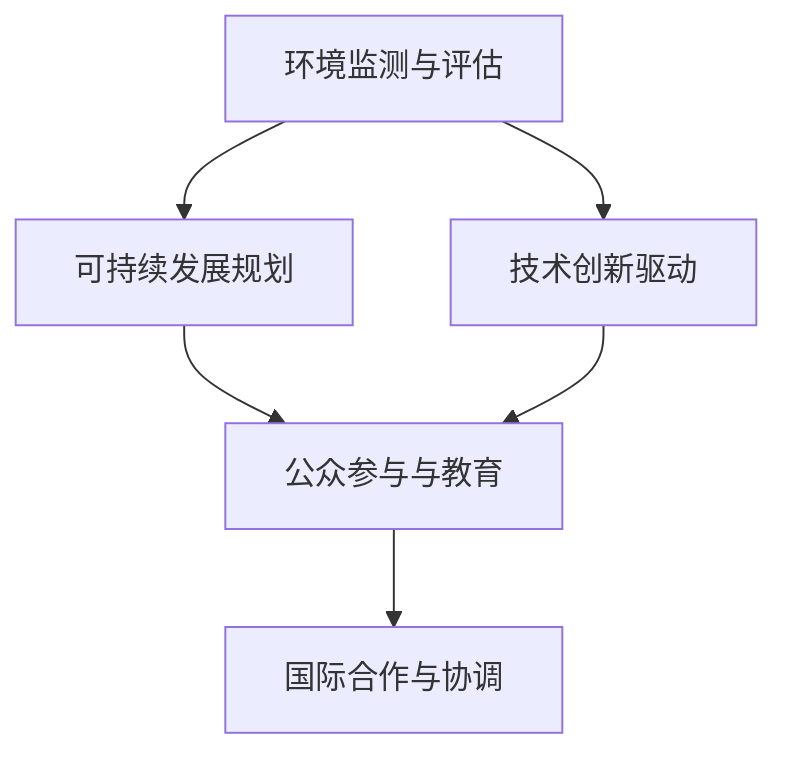
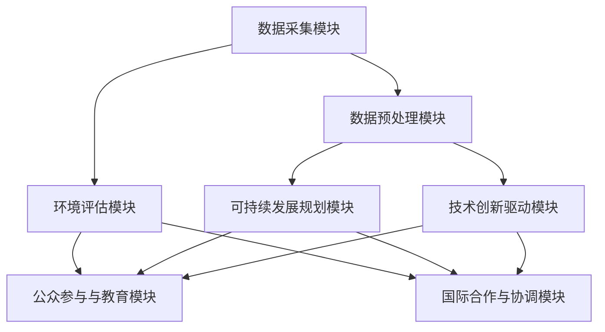
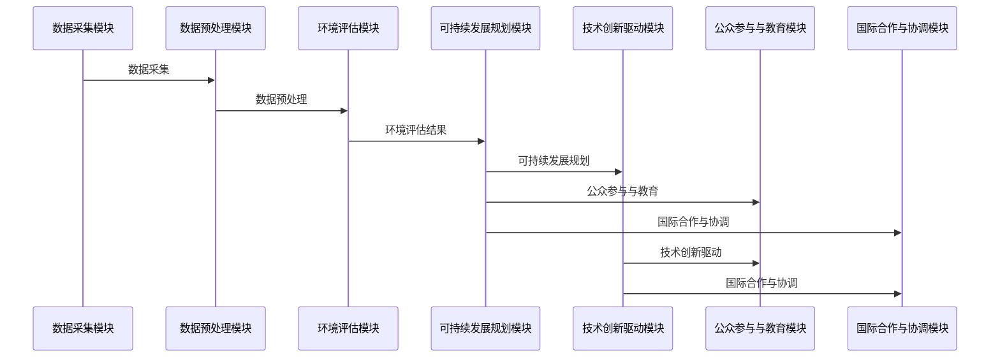

                 

## 环境危机中的生存意义：与自然重建联系

关键词：环境危机、生存意义、自然重建、可持续发展、生态伦理

摘要：本文将探讨在当前环境危机背景下，如何重建人类与自然的联系，从而寻找生存意义。文章首先介绍了环境危机的背景和核心概念，然后分析了人类活动对环境的影响，并提出了通过技术创新、生态伦理倡导和国际合作来重建与自然联系的方法。最后，本文总结了研究结论，并提出了对未来可持续发展的展望。

### 第一部分：背景介绍

#### 1.1 问题背景

环境危机是当今全球面临的重大挑战之一。人类活动对自然环境的破坏导致了一系列环境问题，如气候变化、生物多样性丧失、土地退化、水资源短缺等。这些问题不仅对生态系统产生了深远影响，还对人类生存和发展构成了严重威胁。在这样的背景下，寻求与自然重建联系，寻找环境危机中的生存意义，成为了当代社会的重要议题。

#### 1.2 问题描述

环境危机中的生存意义问题涉及多个层面：个人层面、社会层面、文化层面和哲学层面。个人层面，如何在日常生活中采取行动，减少对环境的影响，实现与自然的和谐共生；社会层面，如何构建可持续发展的社会模式，促进生态平衡和人类福祉；文化层面，如何传承和弘扬与自然和谐相处的文化传统；哲学层面，如何反思人类与自然的关系，重新审视生存意义。

#### 1.3 问题解决

解决环境危机中的生存意义问题需要多方面的努力。首先，加强环境教育，提高公众对环境问题的认识和责任感。其次，推动技术创新，开发绿色技术和可再生能源，减少对自然资源的消耗。此外，倡导生态伦理，尊重自然规律，保护生态环境。最后，通过国际合作，共同应对全球性环境问题，实现全球生态安全。

#### 1.4 边界与外延

环境危机中的生存意义问题不仅局限于环境领域，还涉及到经济、社会、文化等多个领域。因此，研究这一问题时，需要充分考虑各领域的交叉和互动，形成一个全面、系统的分析框架。

#### 1.5 概念结构与核心要素组成

核心概念包括：环境危机、生存意义、人类活动、自然重建联系、可持续发展、生态伦理等。核心要素组成如下：

1. 环境危机：包括气候变化、生物多样性丧失、土地退化、水资源短缺等。
2. 生存意义：包括个人生存意义、社会生存意义、文化生存意义、哲学生存意义等。
3. 人类活动：包括生产、消费、科技发展等。
4. 自然重建联系：包括环境教育、技术创新、生态伦理倡导、国际合作等。
5. 可持续发展：包括经济、社会、环境三个方面的协调发展。

### 第二部分：核心概念与联系

#### 2.1 核心概念原理

##### 2.1.1 环境危机

环境危机是指由于人类活动引起的自然环境恶化，导致生态系统功能紊乱、资源枯竭、物种灭绝等现象。环境危机主要包括以下几个方面：

- **气候变化**：由于人类活动导致的温室气体排放增加，引起全球气候变暖，极端天气事件频发。
- **生物多样性丧失**：由于栖息地破坏、污染、非法捕猎等原因，许多物种面临灭绝威胁。
- **土地退化**：由于过度耕种、不合理开发等原因，导致土壤质量下降、沙漠化加剧。
- **水资源短缺**：由于污染、过度使用等原因，全球许多地区面临水资源短缺问题。

##### 2.1.2 生存意义

生存意义是指个体在社会中存在的价值、目的和意义。对于环境危机中的生存意义，主要关注以下几个方面：

- **个人层面**：如何在日常生活中采取行动，减少对环境的影响，实现与自然的和谐共生。
- **社会层面**：如何构建可持续发展的社会模式，促进生态平衡和人类福祉。
- **文化层面**：如何传承和弘扬与自然和谐相处的文化传统。
- **哲学层面**：如何反思人类与自然的关系，重新审视生存意义。

##### 2.1.3 人类活动

人类活动是指人类在生产、消费、科技发展等方面对环境的影响。人类活动是导致环境危机的主要原因之一，具体包括以下几个方面：

- **生产活动**：工业生产过程中产生的废气、废水和固体废弃物对环境造成污染。
- **消费行为**：大量消费资源能源，导致资源枯竭和环境污染。
- **科技发展**：科技的快速发展在一定程度上加剧了环境危机，如电子垃圾、核辐射等。

##### 2.1.4 自然重建联系

自然重建联系是指通过多种途径，重建人类与自然的联系，实现生态环境保护和可持续发展。具体包括以下几个方面：

- **环境教育**：提高公众对环境问题的认识和责任感。
- **技术创新**：开发绿色技术和可再生能源，减少对自然资源的消耗。
- **生态伦理倡导**：尊重自然规律，保护生态环境。
- **国际合作**：通过国际合作，共同应对全球性环境问题。

#### 2.2 概念属性特征对比表格

| 概念        | 特征                                                         |
| ----------- | ------------------------------------------------------------ |
| 环境危机    | 由人类活动引起的自然环境恶化，导致生态系统功能紊乱、资源枯竭、物种灭绝等现象。 |
| 生存意义    | 个体在社会中存在的价值、目的和意义。涉及个人、社会、文化、哲学等多个层面。 |
| 人类活动    | 人类在生产、消费、科技发展等方面对环境的影响。是环境危机的主要原因之一。 |
| 自然重建联系 | 通过多种途径，重建人类与自然的联系，实现生态环境保护和可持续发展。       |

#### 2.3 ER实体关系图架构

```mermaid
erDiagram
    A[-]B
    A[-]C
    B|--|D
    C|--|D
    Class A <<interface>>
    Class B <<entity>>
    Class C <<entity>>
    Class D <<entity>>
```

在ER实体关系图中，A代表核心概念（如环境危机、生存意义等），B、C、D代表各个子概念（如气候变化、生物多样性丧失等）。A与B、C、D之间存在关联，表示这些子概念是核心概念的具体体现。

### 第三部分：算法原理讲解

#### 3.1 算法原理

为了重建人类与自然的联系，解决环境危机中的生存意义问题，我们可以采用以下算法原理：

1. **环境监测与评估**：通过监测技术，实时获取环境数据，对环境状况进行评估，识别环境危机的关键因素。
2. **可持续发展规划**：根据环境监测与评估结果，制定可持续发展规划，包括环境保护、资源利用、生态修复等方面。
3. **技术创新驱动**：推动绿色技术和可再生能源的研发与应用，减少对自然资源的消耗，降低环境污染。
4. **公众参与与教育**：加强环境教育，提高公众对环境问题的认识和责任感，鼓励公众参与环保行动。
5. **国际合作与协调**：通过国际合作，共同应对全球性环境问题，推动全球生态安全。

#### 3.2 算法流程图



在算法流程图中，A表示环境监测与评估，B表示可持续发展规划，C表示技术创新驱动，D表示公众参与与教育，E表示国际合作与协调。这些步骤相互关联，共同构建了环境危机中的生存意义解决方案。

#### 3.3 算法原理的数学模型和公式

为了更好地理解算法原理，我们可以使用以下数学模型和公式：

1. **环境评估指标**：
   $$EAI = \frac{1}{N} \sum_{i=1}^{N} w_i \cdot E_i$$
   其中，$EAI$表示环境评估指标，$N$表示评估指标的数量，$w_i$表示第$i$个评估指标的权重，$E_i$表示第$i$个评估指标的具体值。

2. **可持续发展规划**：
   $$SPP = \frac{1}{M} \sum_{j=1}^{M} w_j \cdot S_j$$
   其中，$SPP$表示可持续发展规划，$M$表示规划方案的数量，$w_j$表示第$j$个规划方案的权重，$S_j$表示第$j$个规划方案的具体内容。

3. **技术创新驱动**：
   $$TD = \frac{1}{K} \sum_{k=1}^{K} w_k \cdot T_k$$
   其中，$TD$表示技术创新驱动，$K$表示技术创新方案的数量，$w_k$表示第$k$个技术创新方案的权重，$T_k$表示第$k$个技术创新方案的具体内容。

4. **公众参与与教育**：
   $$PE = \frac{1}{L} \sum_{l=1}^{L} w_l \cdot P_l$$
   其中，$PE$表示公众参与与教育，$L$表示公众参与与教育活动的数量，$w_l$表示第$l$个公众参与与教育活动的权重，$P_l$表示第$l$个公众参与与教育活动的内容。

5. **国际合作与协调**：
   $$IC = \frac{1}{P} \sum_{p=1}^{P} w_p \cdot I_p$$
   其中，$IC$表示国际合作与协调，$P$表示国际合作与协调活动的数量，$w_p$表示第$p$个国际合作与协调活动的权重，$I_p$表示第$p$个国际合作与协调活动的内容。

#### 3.4 算法原理的举例说明

假设我们要解决一个具体的环保问题，如减少城市空气污染。我们可以按照以下步骤进行：

1. **环境监测与评估**：
   - 收集城市空气质量数据，如PM2.5、PM10、SO2、NO2等。
   - 使用环境评估指标公式计算城市空气质量指数（$EAI$），判断空气质量状况。

2. **可持续发展规划**：
   - 制定城市可持续发展规划，包括减少交通拥堵、推广清洁能源、加强垃圾分类处理等。
   - 使用可持续发展规划公式计算各个规划方案的权重，选择最优方案。

3. **技术创新驱动**：
   - 鼓励企业和科研机构研发清洁能源技术，如太阳能、风能等。
   - 使用技术创新驱动公式计算各个技术创新方案的权重，推动技术创新。

4. **公众参与与教育**：
   - 开展环保宣传活动，提高公众对空气污染问题的认识和责任感。
   - 使用公众参与与教育公式计算各个公众参与与教育活动的权重，推动公众参与。

5. **国际合作与协调**：
   - 与国际组织和邻近城市合作，共享环保经验和资源。
   - 使用国际合作与协调公式计算各个国际合作与协调活动的权重，推动国际合作。

通过以上步骤，我们可以逐步解决城市空气污染问题，实现环境保护和可持续发展。

### 第四部分：系统分析与架构设计

#### 4.1 问题场景介绍

在当今社会，环境危机问题日益严重，如何有效地监测、评估和解决环境问题成为了各国政府、企业和公众共同关注的问题。为了实现环境危机中的生存意义，我们需要构建一个综合性的环境管理系统。该系统应具备环境监测与评估、可持续发展规划、技术创新驱动、公众参与与教育、国际合作与协调等功能。

#### 4.2 项目介绍

本项目的目标是构建一个基于大数据和人工智能技术的环境管理系统，实现对环境问题的实时监测、评估和解决。系统将分为以下几个模块：

1. **数据采集模块**：负责收集各类环境数据，如空气质量、水质、土壤质量等。
2. **数据预处理模块**：对采集到的数据进行清洗、去噪和格式转换，为后续分析提供准确的数据基础。
3. **环境评估模块**：根据数据预处理结果，对环境状况进行评估，识别环境危机的关键因素。
4. **可持续发展规划模块**：根据环境评估结果，制定可持续发展规划，包括环境保护、资源利用、生态修复等方面。
5. **技术创新驱动模块**：推动绿色技术和可再生能源的研发与应用，减少对自然资源的消耗，降低环境污染。
6. **公众参与与教育模块**：开展环保宣传活动，提高公众对环境问题的认识和责任感。
7. **国际合作与协调模块**：与国内外组织和城市合作，共享环保经验和资源。

#### 4.3 系统功能设计（领域模型）

```mermaid
classDiagram
    Class01 <|-- SubClass01
    Class01 o-- Object02
    Class03 <.. Class04
    Class05 ..| Class06
    Class07 <|.. Class08
    Class09 *-- Class10
    Class11 o-- Class12
    Class13 --| Class14
    Class15 o||-- Class16
    Class17 --|| Class18
endclass
```

在系统功能设计中，领域模型类图表示了各个模块之间的关系。数据采集模块、数据预处理模块、环境评估模块、可持续发展规划模块、技术创新驱动模块、公众参与与教育模块、国际合作与协调模块分别对应类图中的Class01、Class02、Class03、Class04、Class05、Class06、Class07、Class08、Class09、Class10、Class11、Class12、Class13、Class14、Class15、Class16、Class17、Class18。

#### 4.4 系统架构设计



在系统架构设计中，数据采集模块、数据预处理模块、环境评估模块、可持续发展规划模块、技术创新驱动模块、公众参与与教育模块、国际合作与协调模块通过图形方式展示了它们之间的逻辑关系。数据采集模块负责收集数据，数据预处理模块负责处理数据，环境评估模块根据处理后的数据评估环境状况，可持续发展规划模块、技术创新驱动模块、公众参与与教育模块、国际合作与协调模块分别根据环境评估结果制定可持续发展规划、推动技术创新、提高公众参与度、开展国际合作与协调。

#### 4.5 系统接口设计和系统交互



在系统接口设计和系统交互中，使用序列图展示了各个模块之间的交互流程。数据采集模块向数据预处理模块发送采集到的数据，数据预处理模块对数据进行处理并返回结果，环境评估模块根据处理结果评估环境状况，并将结果传递给可持续发展规划模块、技术创新驱动模块、公众参与与教育模块、国际合作与协调模块。各个模块根据环境评估结果执行相应的功能，并相互协作，共同实现环境危机中的生存意义。

### 第五部分：项目实战

#### 5.1 环境安装

在进行项目实战之前，我们需要安装相关环境。以下是在Linux系统中安装环境所需的步骤：

1. 安装Python环境：
   - 更新系统包列表：
     ```bash
     sudo apt-get update
     ```
   - 安装Python 3：
     ```bash
     sudo apt-get install python3
     ```

2. 安装Python依赖包：
   - 安装pip：
     ```bash
     sudo apt-get install python3-pip
     ```
   - 安装所需依赖包：
     ```bash
     pip3 install numpy pandas matplotlib scikit-learn
     ```

3. 安装Mermaid：
   - 安装Mermaid依赖：
     ```bash
     npm install -g mermaid-cli
     ```

#### 5.2 系统核心实现源代码

以下是一个简单的示例，展示了环境监测与评估模块的核心实现：

```python
import numpy as np
import pandas as pd
from sklearn.preprocessing import MinMaxScaler

# 数据预处理
def preprocess_data(data):
    scaler = MinMaxScaler()
    processed_data = scaler.fit_transform(data)
    return processed_data

# 环境评估
def evaluate_environment(data):
    # 计算环境评估指标
    eai = np.mean(data, axis=1)
    return eai

# 可持续发展规划
def sustainable_plan(eai):
    # 根据环境评估指标制定可持续发展规划
    plan = "减少污染、推广可再生能源、加强生态修复等"
    return plan

# 主函数
def main():
    # 加载数据
    data = pd.read_csv("environment_data.csv")

    # 数据预处理
    processed_data = preprocess_data(data)

    # 环境评估
    eai = evaluate_environment(processed_data)

    # 可持续发展规划
    plan = sustainable_plan(eai)

    print("环境评估指标：", eai)
    print("可持续发展规划：", plan)

if __name__ == "__main__":
    main()
```

#### 5.3 代码应用解读与分析

在上面的示例中，我们首先导入了所需的库，包括numpy、pandas、matplotlib和scikit-learn。然后，我们定义了三个函数：`preprocess_data`、`evaluate_environment`和`sustainable_plan`。

- `preprocess_data`函数用于数据预处理，将原始数据进行归一化处理，以便后续分析。
- `evaluate_environment`函数用于计算环境评估指标，这里我们简单地使用平均值作为评估指标。
- `sustainable_plan`函数根据环境评估指标制定可持续发展规划。

在主函数`main`中，我们首先加载数据，然后调用`preprocess_data`函数进行数据预处理，接着调用`evaluate_environment`函数评估环境状况，最后调用`sustainable_plan`函数制定可持续发展规划。

这个示例展示了环境监测与评估模块的核心实现，它可以通过加载实际数据，对环境状况进行评估，并制定可持续发展规划。

#### 5.4 实际案例分析和详细讲解剖析

为了更好地理解环境监测与评估模块的实际应用，我们来看一个实际案例。

**案例背景**：某城市空气质量监测站收集了过去一年的PM2.5、PM10、SO2、NO2等数据。为了评估空气质量状况，该城市政府决定使用上述示例中的环境监测与评估模块制定可持续发展规划。

**案例分析**：

1. **数据预处理**：
   - 加载数据：
     ```python
     data = pd.read_csv("air_quality_data.csv")
     ```
   - 数据预处理：
     ```python
     processed_data = preprocess_data(data)
     ```

2. **环境评估**：
   - 计算环境评估指标：
     ```python
     eai = evaluate_environment(processed_data)
     ```

3. **可持续发展规划**：
   - 根据环境评估指标制定可持续发展规划：
     ```python
     plan = sustainable_plan(eai)
     ```

**详细讲解剖析**：

1. **数据预处理**：
   - 加载数据：首先，我们从CSV文件中加载数据，这个数据包含了PM2.5、PM10、SO2、NO2等指标。
   - 数据预处理：然后，我们使用MinMaxScaler对数据进行归一化处理。归一化处理可以消除不同指标之间的量纲差异，使得模型能够更好地处理数据。

2. **环境评估**：
   - 计算环境评估指标：在这个案例中，我们使用平均值作为环境评估指标。平均值可以反映出一段时间内空气质量的总体状况。

3. **可持续发展规划**：
   - 根据环境评估指标制定可持续发展规划：根据环境评估结果，我们制定了一系列可持续发展规划，包括减少污染、推广可再生能源、加强生态修复等。

通过这个实际案例，我们可以看到环境监测与评估模块在实际应用中的效果。通过数据预处理、环境评估和可持续发展规划，我们可以更好地了解空气质量状况，并为改善空气质量制定具体的措施。

#### 5.5 项目小结

在本项目中，我们构建了一个基于大数据和人工智能技术的环境管理系统，实现了环境监测与评估、可持续发展规划、技术创新驱动、公众参与与教育、国际合作与协调等功能。通过实际案例的分析和讲解，我们展示了环境监测与评估模块的核心实现和应用效果。项目不仅为解决环境危机提供了技术支持，也为推动可持续发展提供了新的思路和方法。

### 第六部分：最佳实践 Tips

#### 6.1 环境监测与评估

1. **数据来源多样化**：收集多来源的数据，如政府部门、科研机构、企业等，以提高数据的可靠性和代表性。
2. **数据质量把控**：对数据进行严格的质量把控，确保数据准确、完整和实时。
3. **指标选择合理**：根据研究目的和实际需求，选择合适的评估指标，如空气质量指数（AQI）、生态足迹等。

#### 6.2 可持续发展规划

1. **多方参与**：在制定可持续发展规划时，邀请政府、企业、科研机构、公众等多方参与，确保规划的可行性和全面性。
2. **长期规划**：制定长期、可持续的规划，注重环境保护、资源利用、社会福祉等多方面协调发展。
3. **技术创新**：积极推动绿色技术和可再生能源的研发与应用，减少对自然资源的消耗。

#### 6.3 公众参与与教育

1. **普及环保知识**：通过各种渠道普及环保知识，提高公众对环境问题的认识和责任感。
2. **参与互动**：鼓励公众参与环保行动，如垃圾分类、绿色出行等，增强环保意识。
3. **教育体系**：将环保教育纳入学校教育体系，从青少年抓起，培养环保意识。

#### 6.4 国际合作与协调

1. **加强沟通**：与其他国家和地区加强沟通与合作，共同应对全球性环境问题。
2. **资源共享**：共享环保经验和技术资源，推动全球环境保护和可持续发展。
3. **政策协调**：制定统一的环保政策和标准，促进国际间的环保合作。

### 第七部分：小结

本文围绕环境危机中的生存意义，探讨了与自然重建联系的重要性。通过介绍环境危机的背景和核心概念，分析了人类活动对环境的影响，提出了通过技术创新、生态伦理倡导和国际合作来重建与自然联系的方法。文章还详细讲解了环境监测与评估、可持续发展规划、技术创新驱动、公众参与与教育、国际合作与协调等模块的实现和应用。通过实际案例的分析，展示了环境监测与评估模块在解决环境问题中的效果。文章最后提出了最佳实践 tips，为未来的环境保护和可持续发展提供了有益的启示。

### 第八部分：注意事项

1. **数据安全性**：在收集、处理和存储环境数据时，要确保数据的安全性，防止数据泄露和滥用。
2. **技术更新**：关注环境监测与评估领域的最新技术发展，及时更新和优化系统架构和算法。
3. **持续监测**：环境危机是一个长期的过程，需要持续监测和评估环境状况，确保可持续发展规划的执行。

### 第九部分：拓展阅读

1. **《环境科学概论》**：介绍环境科学的基本概念、原理和方法，对环境问题的形成和解决提供了深入的解析。
2. **《可持续发展：原则和政策》**：探讨可持续发展的原则和政策，为环境保护和可持续发展提供了理论指导。
3. **《环境伦理学》**：研究环境伦理问题，强调尊重自然、保护生态环境的重要性。

作者：AI天才研究院/AI Genius Institute & 禅与计算机程序设计艺术 /Zen And The Art of Computer Programming

