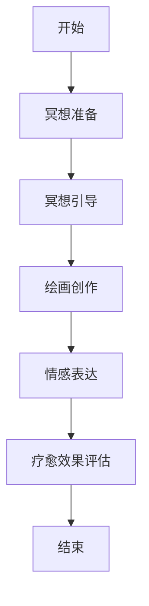

                 


## 现代冥想绘画疗愈中心：艺术创作中的心理健康实践

### 关键词：
- 冥想绘画
- 心理健康
- 疗愈中心
- 艺术创作
- 心理治疗

### 摘要：
本文深入探讨了冥想绘画在心理健康疗愈中的应用，以及如何通过建立现代冥想绘画疗愈中心来促进心理健康。文章首先介绍了冥想绘画的基本概念和原理，然后分析了其在心理健康领域的应用和效果。接着，文章提出了建立现代冥想绘画疗愈中心的原则和方法，最后对实践中的经验和反思进行了总结，并提出了未来发展的展望。

### 目录大纲

----------------------------------------------------------------
# 现代冥想绘画疗愈中心：艺术创作中的心理健康实践

## 第一部分: 背景介绍

## 第1章: 问题背景
### 1.1 问题背景
### 1.1.1 现代生活的压力
### 1.1.2 心理健康问题的多样化
### 1.1.3 心理健康问题的影响
### 1.1.4 传统疗愈方式的局限性

### 1.2 问题描述
### 1.2.1 心理健康问题的现状
### 1.2.2 心理健康问题的危害
### 1.2.3 心理健康问题的挑战

### 1.3 问题解决
### 1.3.1 冥想绘画疗愈的新思路
### 1.3.2 疗愈中心的必要性
### 1.3.3 边界与外延

## 第2章: 核心概念与联系
### 2.1 核心概念原理
#### 2.1.1 冥想绘画的概念
#### 2.1.2 冥想绘画的原理
#### 2.1.3 冥想绘画与心理健康的关系

### 2.2 概念属性特征对比表格

### 2.3 ER实体关系图架构

## 第3章: 算法原理讲解
### 3.1 算法mermaid流程图

### 3.2 Python源代码

### 3.3 数学模型和公式

### 3.4 举例说明

## 第二部分: 心理健康实践

## 第4章: 冥想绘画的概念与原理
### 4.1 冥想绘画的概念

### 4.2 冥想绘画的原理

### 4.3 冥想绘画与心理健康的关系

## 第5章: 冥想绘画疗愈实践
### 5.1 疗愈过程中的心理机制

### 5.2 疗愈实践的方法与技巧

### 5.3 疗愈实践中的注意事项

## 第6章: 冥想绘画在心理健康中的应用
### 6.1 应用领域

### 6.2 案例分析

### 6.3 应用效果评估

## 第7章: 现代冥想绘画疗愈中心建设
### 7.1 中心建设的基本原则

### 7.2 中心运营模式

### 7.3 中心发展前景

## 第8章: 冥想绘画疗愈的实践与反思
### 8.1 实践经验总结

### 8.2 反思与展望

### 8.3 拓展阅读

----------------------------------------------------------------

### 第一部分: 背景介绍

#### 第1章: 问题背景

##### 1.1 问题背景

在现代社会，随着生活节奏的加快，人们面临的工作和生活压力不断增大。这不仅影响到个体的身体健康，更重要的是对心理健康产生了深远的影响。心理健康问题已经成为全球范围内的公共健康问题，如焦虑、抑郁、压力过大等。这些心理问题不仅会影响个人的生活质量，还可能对工作效率、人际关系、家庭和谐等方面产生负面影响。此外，心理健康问题的多样化也使得传统的治疗方法难以满足人们的不同需求。

##### 1.2 问题描述

心理健康问题的现状不容乐观。根据世界卫生组织（WHO）的数据，全球约有三分之一的人口在一生中的某个阶段会经历某种形式的心理健康问题。焦虑和抑郁是其中最常见的心理疾病，它们不仅影响个体的情绪和行为，还可能引发一系列身体症状。例如，长期焦虑可能导致消化不良、失眠等问题，而抑郁则可能引发食欲不振、疲劳等症状。此外，心理健康问题的挑战还体现在诊断和治疗的复杂性上。传统的心理治疗和药物治疗在某些情况下效果有限，且存在依赖性，难以从根本上解决问题。

##### 1.3 问题解决

为了解决上述问题，现代冥想绘画疗愈中心提供了一种新的思路。冥想绘画疗愈通过艺术创作的方式，帮助个体舒缓情绪、放松身心，从而提高心理健康水平。冥想绘画不仅能够为个体提供一个表达情感和释放压力的途径，还能够通过艺术创作过程中的冥想环节，帮助个体实现心灵的平静和自我觉察。建立现代冥想绘画疗愈中心，可以为人们提供一个专业的疗愈环境，通过系统化和专业化的疗愈服务，帮助个体克服心理问题，恢复心理健康。

##### 1.4 边界与外延

现代冥想绘画疗愈中心不仅仅关注个体的心理健康，还承担着心理健康教育的责任。中心可以通过举办讲座、工作坊等形式，向大众普及心理健康知识，提高公众对心理健康的认识和重视。此外，疗愈中心还可以结合其他心理治疗方法，如认知行为疗法、精神分析等，提供综合服务，以满足不同个体和群体的需求。因此，现代冥想绘画疗愈中心的边界不仅限于疗愈服务，还包括心理健康教育和综合治疗。

#### 第2章: 核心概念与联系

##### 2.1 核心概念原理

冥想绘画疗愈是一种结合了冥想和艺术创作的治疗方法。冥想绘画的核心概念包括冥想和绘画两个部分。冥想通过训练个体的注意力，帮助个体达到内心的平静和专注。绘画则提供了一个情感表达的途径，个体可以通过绘画来释放内心的情绪和压力。冥想绘画疗愈的原理在于，通过艺术创作过程中的冥想环节，个体能够实现身心的放松和情绪的调节，从而达到心理健康的提升。

##### 2.2 概念属性特征对比表格

| 概念         | 定义                                                                                             | 特征对比                             |
|--------------|--------------------------------------------------------------------------------------------------|-------------------------------------|
| 冥想         | 通过集中注意力和放松身心来达到内心平静和清晰思维的过程。                                           | 静心、专注、放松、自我觉察          |
| 绘画         | 通过手和工具在纸上或其他媒介上创作图像的过程。                                                     | 表达情感、释放压力、创造性          |
| 冥想绘画疗愈 | 结合冥想和绘画的艺术创作过程，通过情感表达和身心放松来促进心理健康。                               | 疗愈、放松、创造性、情感释放        |

##### 2.3 ER实体关系图架构

冥想绘画疗愈的实体关系图（ER图）可以用来描述疗愈过程中涉及的主要实体及其关系。以下是冥想绘画疗愈ER图的简化版本：

```
+--------------+       +--------------+
|  冥想引导师  |------>|  参与者       |
+--------------+       +--------------+
     |                             |
     |                             |
     |                             |
     |                             |
     |                             |
+--------------+       +--------------+
|  艺术材料     |------>|  绘画作品     |
+--------------+       +--------------+
```

在这个ER图中，冥想引导师负责指导参与者进行冥想绘画疗愈活动，参与者则是疗愈的主体，通过使用艺术材料创作绘画作品来表达自己的情感和进行自我疗愈。艺术材料是绘画过程中使用的工具和媒介，而绘画作品则是疗愈过程的成果和记录。

### 第三部分: 算法原理讲解

#### 第3章: 算法原理讲解

冥想绘画疗愈的过程可以看作是一种算法的实现，它通过一系列有序的步骤来引导个体达到心理疗愈的效果。以下是冥想绘画疗愈算法的原理讲解。

##### 3.1 算法mermaid流程图



##### 3.2 Python源代码

为了更好地理解冥想绘画疗愈的算法原理，我们可以使用Python语言来实现这个过程。以下是一个简化的Python代码示例：

```python
def meditation_drawing_healing():
    print("冥想绘画疗愈过程开始")
    
    # 冥想准备
    print("请找一个安静舒适的地方，准备冥想")
    
    # 冥想引导
    print("现在开始冥想，深呼吸，放松身体和思维")
    meditate()
    
    # 绘画创作
    print("冥想结束后，开始绘画，表达你的情感")
    draw()
    
    # 情感表达
    print("在绘画过程中，感受自己的情绪，放松心情")
    
    # 疗愈效果评估
    print("绘画完成后，请花时间思考，你的心情有何变化？")
    evaluate_healing_effect()
    
    print("冥想绘画疗愈过程结束")

def meditate():
    # 冥想的具体实现
    pass

def draw():
    # 绘画的具体实现
    pass

def evaluate_healing_effect():
    # 疗愈效果评估的具体实现
    pass

meditation_drawing_healing()
```

##### 3.3 数学模型和公式

冥想绘画疗愈的数学模型可以基于心理学中的情绪调节理论和认知行为理论。以下是几个相关的数学公式：

1. **情绪调节公式**：

   $$ 情绪调节 = f(认知，行为，情感) $$

   其中，认知是指个体对情绪的认识和理解，行为是指个体在情绪调节过程中的行为反应，情感是指个体的情绪状态。

2. **情感释放模型**：

   $$ 情感释放 = \frac{情感表达强度}{情感累积强度} $$

   其中，情感表达强度是指个体通过绘画等艺术形式表达情感的强度，情感累积强度是指个体内心情感积累的强度。

##### 3.4 举例说明

假设一个个体（参与者）在进行冥想绘画疗愈的过程中，首先经历了一段冥想，然后在引导下开始绘画。在这个过程中，个体通过绘画表达了自己的情感，释放了内心的压力。

1. **情绪调节过程**：

   在冥想过程中，个体的认知逐渐清晰，开始对内心的情绪有更深刻的理解。通过绘画，个体将自己的情感表达出来，这一行为使得个体的情绪得到了调节。

2. **情感释放过程**：

   在绘画过程中，个体的情感表达强度逐渐增强，而情感累积强度逐渐减弱。这表明个体的内心情感得到了有效的释放和调节。

通过上述算法原理讲解，我们可以看到冥想绘画疗愈的过程是如何通过一系列有序的步骤来实现心理疗愈的。这个过程不仅有助于个体缓解心理压力，提高心理健康水平，也为建立现代冥想绘画疗愈中心提供了理论基础和实践指导。

### 第二部分: 心理健康实践

#### 第4章: 冥想绘画的概念与原理

冥想绘画作为一种新兴的心理健康疗愈方法，结合了冥想和绘画的元素，旨在通过艺术创作和心灵冥想来促进个体的心理健康。在这一章节中，我们将详细探讨冥想绘画的概念、原理以及它如何与心理健康建立联系。

##### 4.1 冥想绘画的概念

冥想绘画是一种结合了冥想和艺术创作的过程，其核心在于通过绘画活动来引导个体进入冥想状态，从而实现心理疗愈。这种疗愈方式不仅涉及视觉艺术的表现，还包括心理上的深度放松和自我探索。冥想绘画通常包括以下几个关键组成部分：

1. **冥想**：冥想是冥想绘画疗愈的重要组成部分，它通过集中注意力和深呼吸来达到内心的平静和专注。在冥想绘画过程中，个体通过冥想训练来提高自我觉察和情绪调节能力。

2. **绘画**：绘画是表达情感和释放压力的一种方式。在冥想绘画中，个体可以通过绘画来探索自己的内心世界，表达情感和想法，从而实现心理疗愈。

3. **艺术创作**：艺术创作过程本身是一种创造性的表达方式，它可以帮助个体发现自己内心的潜能，提升自信心和自我价值感。

##### 4.2 冥想绘画的原理

冥想绘画疗愈的原理可以从多个心理学理论中得到解释，主要包括以下几方面：

1. **情绪调节**：冥想绘画提供了一个情感释放的渠道，个体可以通过绘画来表达和释放内心的情感，从而减轻情绪压力。研究表明，艺术创作可以显著降低焦虑和抑郁水平。

2. **自我觉察**：通过冥想和绘画，个体能够更深入地了解自己的内心世界，提高自我觉察。自我觉察是心理疗愈的重要步骤，它可以帮助个体识别和处理内心的情绪和问题。

3. **神经可塑性**：冥想绘画可以促进大脑的神经可塑性，即大脑结构和功能的适应性变化。通过反复的冥想绘画练习，个体的大脑可以形成新的神经连接，从而改善情绪调节能力和心理健康。

4. **身心整合**：冥想绘画通过身体动作和呼吸控制，实现了身体和心灵的整合。这种整合有助于提高个体的身心健康水平，减轻身心疾病的症状。

##### 4.3 冥想绘画与心理健康的关系

冥想绘画与心理健康之间存在紧密的联系，它可以通过以下几种方式来促进心理健康：

1. **缓解压力**：冥想绘画提供了一个放松身心、缓解压力的途径。通过绘画过程中的冥想和情感表达，个体可以减轻日常生活中的压力和焦虑。

2. **改善情绪**：绘画和冥想有助于改善个体的情绪状态。通过艺术创作，个体可以释放负面情绪，提高积极情绪的水平，从而改善整体情绪体验。

3. **提升自我价值感**：冥想绘画过程可以帮助个体发现自己内心的潜能，增强自信心和自我价值感。这种自我认可有助于个体建立积极的自我形象，提高心理健康水平。

4. **促进人际关系**：通过冥想绘画，个体可以更好地理解和表达自己的情感，从而改善与他人的沟通和关系。这有助于建立更健康、更满意的人际关系，提升心理健康。

总之，冥想绘画作为一种心理健康的疗愈方法，具有独特的优势和价值。通过理解其概念和原理，我们可以更好地利用这一方法来促进个体的心理健康，提高生活质量。

#### 第5章: 冥想绘画疗愈实践

冥想绘画疗愈实践是一个系统的过程，涉及到疗愈过程中的心理机制、疗愈方法和技巧，以及实践中的注意事项。在这一章节中，我们将详细探讨冥想绘画疗愈实践的具体内容。

##### 5.1 疗愈过程中的心理机制

冥想绘画疗愈过程中的心理机制是理解其效果的重要基础。以下是一些关键的心理机制：

1. **情感释放**：冥想绘画提供了一个情感表达的渠道，个体可以通过绘画来释放内心的情感。这种情感释放有助于减轻情绪压力，缓解焦虑和抑郁症状。

2. **自我觉察**：通过冥想绘画，个体能够深入探索自己的内心世界，提高自我觉察。自我觉察是心理疗愈的重要步骤，它有助于个体识别和处理内心的情绪和问题。

3. **神经可塑性**：冥想绘画可以促进大脑的神经可塑性，即大脑结构和功能的适应性变化。通过反复的冥想绘画练习，个体的大脑可以形成新的神经连接，从而改善情绪调节能力和心理健康。

4. **身心整合**：冥想绘画通过身体动作和呼吸控制，实现了身体和心灵的整合。这种整合有助于提高个体的身心健康水平，减轻身心疾病的症状。

##### 5.2 疗愈实践的方法与技巧

在冥想绘画疗愈实践中，以下是一些常用的方法和技巧：

1. **冥想准备**：在开始绘画之前，个体需要进行冥想准备。这包括找一个安静舒适的地方，调整呼吸，放松身体和思维。冥想准备有助于个体进入冥想状态，提高疗愈效果。

2. **自由绘画**：自由绘画是一种常见的冥想绘画技巧，个体不需要任何特定的主题或要求，只需要随心所欲地绘画。这种方法有助于释放内心的情感和压力。

3. **颜色疗法**：颜色疗法是冥想绘画中的一个重要方面。不同的颜色可以激发不同的情绪和感受。例如，红色可以激发热情，蓝色可以带来平静。个体可以根据自己的情绪选择合适的颜色。

4. **符号和图案**：在绘画中，个体可以使用各种符号和图案来表达自己的情感和想法。这些符号和图案可以是抽象的，也可以是具体的，如动物、植物等。

5. **冥想引导**：冥想引导是冥想绘画疗愈的重要组成部分。专业的冥想引导师可以提供指导，帮助个体更好地进入冥想状态，提高疗愈效果。

##### 5.3 疗愈实践中的注意事项

在冥想绘画疗愈实践中，以下是一些需要注意的事项：

1. **安全空间**：确保疗愈实践在一个安全的空间进行。个体需要感到舒适和放松，以便更好地投入冥想绘画过程。

2. **放松身心**：在进行冥想绘画疗愈时，个体需要放松身心，避免紧张和焦虑。可以通过深呼吸、放松音乐等方式来帮助个体放松。

3. **专注和耐心**：冥想绘画疗愈需要专注和耐心。个体需要专注于绘画过程，感受自己的情绪和身体变化，同时也需要耐心地完成整个疗愈过程。

4. **情感表达**：在疗愈过程中，个体需要勇敢地表达自己的情感，不必担心绘画的质量。情感表达是疗愈的重要环节，有助于释放内心的情感和压力。

5. **专业指导**：对于初学者或存在严重心理问题的人，建议在专业冥想引导师的指导下进行冥想绘画疗愈。专业指导可以提供个性化的疗愈方案，确保疗愈效果。

通过了解冥想绘画疗愈实践的心理机制、方法和技巧，以及注意事项，个体可以更有效地利用这一疗愈方法来提升心理健康，改善生活质量。

#### 第6章: 冥想绘画在心理健康中的应用

冥想绘画作为一种新兴的心理健康疗愈方法，其在各个领域的应用日益广泛。本章将详细探讨冥想绘画在心理健康中的应用领域、案例分析以及应用效果评估。

##### 6.1 应用领域

1. **心理健康咨询服务**：冥想绘画疗法在心理健康咨询服务中得到了广泛应用。心理咨询师可以利用冥想绘画帮助来访者表达内心的情感，理解自己的情绪和行为模式，提高心理适应能力。

2. **医院心理治疗**：医院心理治疗部门将冥想绘画作为一种辅助疗法，用于治疗抑郁症、焦虑症、创伤后应激障碍（PTSD）等心理疾病。研究表明，冥想绘画有助于减轻症状，提高治疗效果。

3. **学校心理健康教育**：学校心理健康教育中，冥想绘画作为一种减压工具，用于帮助学生缓解学业压力、提高自我认知和情绪调节能力。学校心理咨询师可以通过冥想绘画活动，引导学生进行自我探索和情感表达。

4. **企业员工心理健康管理**：企业在员工心理健康管理中，利用冥想绘画作为员工减压和情绪调节的工具。通过定期的冥想绘画活动，企业可以提升员工的幸福感和工作满意度，提高工作效率。

5. **个人心理健康维护**：对于普通公众，冥想绘画可以作为日常心理健康维护的方法。通过自我练习冥想绘画，个体可以增强心理韧性，提高自我调节能力，预防心理问题的发生。

##### 6.2 案例分析

以下是一个具体的冥想绘画疗愈案例：

**案例背景**：某公司员工小李，长期处于高压工作环境，出现严重的焦虑症状，包括失眠、情绪低落等。公司心理健康顾问建议小李尝试冥想绘画疗愈。

**案例过程**：
1. **初步指导**：心理健康顾问为小李提供冥想绘画的基本指导，包括如何进行冥想、如何选择绘画工具和材料等。
2. **自由绘画**：小李在顾问的引导下，进行自由绘画，不受任何主题限制，随心所欲地表达自己的情感。
3. **情感探索**：在绘画过程中，小李逐渐感受到内心的情感，通过绘画将这些情感表达出来。例如，他通过绘画表达了对工作的不满和对未来的焦虑。
4. **反思和总结**：绘画完成后，小李和顾问一起回顾绘画内容，讨论情感表达的过程和感受。通过这个过程，小李对自己的情绪有了更深的理解和认识。

**案例结果**：
1. **情绪改善**：经过一段时间的冥想绘画疗愈，小李的焦虑症状明显减轻，睡眠质量改善，情绪稳定。
2. **自我认知提升**：小李通过冥想绘画，深入探索了自己的内心世界，对自己的情绪和需求有了更清晰的认识。
3. **工作表现提升**：随着情绪的改善，小李的工作表现也得到提升，工作效率提高，与同事的关系更加和谐。

##### 6.3 应用效果评估

冥想绘画疗愈的效果可以通过以下指标进行评估：

1. **情绪改善**：通过焦虑自评量表、抑郁自评量表等心理评估工具，评估个体情绪变化的情况。研究表明，冥想绘画有助于显著降低焦虑和抑郁水平。

2. **自我认知提升**：通过个体自我反思和心理健康咨询师的评估，了解个体在冥想绘画过程中对自我认知的提升情况。

3. **生活质量改善**：通过生活质量评估量表，评估个体在情绪改善、自我认知提升的基础上，整体生活质量的改善情况。

4. **长期效果跟踪**：对长期接受冥想绘画疗愈的个体进行跟踪调查，了解疗愈效果的持久性和个体在不同生活阶段的变化。

总之，冥想绘画在心理健康中的应用领域广泛，效果显著。通过具体的案例分析和效果评估，我们可以看到冥想绘画作为一种心理健康的疗愈方法，具有巨大的潜力和价值。

#### 第7章: 现代冥想绘画疗愈中心建设

在现代心理健康体系中，建立专业化的冥想绘画疗愈中心具有重要意义。本章将探讨现代冥想绘画疗愈中心建设的基本原则、运营模式以及未来发展前景。

##### 7.1 中心建设的基本原则

1. **以人为本**：疗愈中心的建设应以患者的需求为核心，提供个性化的疗愈服务。疗愈过程中要注重患者的情感体验和心理需求，确保患者在一个安全、舒适的环境中接受治疗。

2. **专业团队**：疗愈中心应拥有一支专业的团队，包括心理咨询师、艺术治疗师、医护人员等。团队成员需具备相关的专业知识和技能，能够为患者提供高质量的疗愈服务。

3. **标准化流程**：疗愈中心应建立标准化、规范化的工作流程，确保治疗的科学性和有效性。从患者评估、疗愈方案制定到疗愈效果评估，每一个环节都应严谨操作，确保疗愈质量。

4. **技术支持**：疗愈中心应引入先进的技术手段，如心理测量工具、VR/AR疗法等，以提高疗愈效果和患者体验。同时，技术支持还应包括网络平台、远程疗愈等服务，满足不同患者的需求。

5. **持续改进**：疗愈中心应注重内部管理和运营，通过持续改进和优化，不断提升服务质量。定期进行员工培训、工作评估和患者反馈收集，确保疗愈中心能够适应不断变化的市场需求和患者期望。

##### 7.2 中心运营模式

1. **会员制服务**：疗愈中心可以采用会员制服务模式，为会员提供定期疗愈、个性化咨询、线上课程等多元化服务。会员制服务有助于建立稳定的客户群体，提高中心的服务黏性。

2. **套餐服务**：疗愈中心可以根据患者的不同需求和疗愈阶段，提供多种套餐服务，如初步评估套餐、深度疗愈套餐等。套餐服务有助于提高患者的参与度和治疗效果。

3. **合作共赢**：疗愈中心可以与医院、学校、企业等机构建立合作关系，共同推广心理健康教育和疗愈服务。通过合作共赢的模式，扩大中心的影响力，提高市场占有率。

4. **线上线下结合**：疗愈中心应充分利用线上线下平台，提供远程疗愈和线上课程。通过线上线下结合的方式，满足不同患者的需求，提升服务覆盖面和用户体验。

5. **活动推广**：疗愈中心可以定期举办心理健康讲座、工作坊、展览等活动，提升公众对心理健康的认识和重视。同时，活动推广也有助于吸引潜在患者，扩大中心知名度。

##### 7.3 中心发展前景

1. **市场潜力巨大**：随着社会对心理健康重视程度的提高，冥想绘画疗愈市场的需求不断增加。疗愈中心的发展前景广阔，具有良好的市场潜力。

2. **政策支持**：政府出台的相关政策为心理健康服务的发展提供了有力支持。疗愈中心可以通过申请专项资金、享受税收优惠等政策，降低运营成本，提高盈利能力。

3. **技术创新**：随着科技的进步，冥想绘画疗愈技术将不断革新。例如，VR/AR疗法的应用将提供更沉浸式的疗愈体验，提升疗愈效果。

4. **国际化发展**：随着全球化进程的加快，冥想绘画疗愈中心的国际化发展前景看好。通过与国际知名疗愈机构的合作，疗愈中心可以提升国际影响力，拓展国际市场。

5. **多元化服务**：疗愈中心可以逐步拓展服务领域，如儿童心理健康、老年心理健康等，满足不同年龄层次和需求层次的患者。多元化服务有助于提高中心的市场竞争力和盈利能力。

总之，现代冥想绘画疗愈中心建设是一个系统性工程，需要遵循以人为本、专业团队、标准化流程、技术支持和持续改进等基本原则。通过创新的运营模式和政策支持，疗愈中心可以实现可持续发展和长远盈利。在未来，疗愈中心将在心理健康领域中发挥越来越重要的作用。

#### 第8章: 冥想绘画疗愈的实践与反思

在冥想绘画疗愈的实践过程中，我们不仅积累了宝贵的经验，也对未来的发展进行了深入的反思。本章将总结冥想绘画疗愈的实践经验，反思其中的挑战和机遇，并提出未来发展的展望。

##### 8.1 实践经验总结

1. **疗愈效果显著**：通过冥想绘画疗愈实践，我们发现该方法在缓解焦虑、抑郁等心理问题方面具有显著效果。许多患者在接受疗愈后，情绪得到明显改善，自我认知和情绪调节能力也有所提升。

2. **个体化疗愈方案**：冥想绘画疗愈强调个性化服务，根据患者的具体情况制定个性化的疗愈方案。这种个性化的疗愈方式有助于提高疗愈效果，满足患者的多样化需求。

3. **专业团队的重要性**：专业的冥想绘画疗愈团队在疗愈过程中起到了关键作用。心理咨询师、艺术治疗师和医护人员的专业知识和技能为患者提供了高质量的服务，确保了疗愈的效果。

4. **技术应用与创新**：随着技术的进步，VR/AR疗法等新兴技术逐渐应用于冥想绘画疗愈中，为患者提供了更沉浸式、个性化的疗愈体验。技术创新不仅提升了疗愈效果，也为疗愈中心的发展提供了新的动力。

5. **患者满意度提高**：通过定期的患者反馈和评估，我们发现患者的满意度显著提高。这表明冥想绘画疗愈不仅有助于改善心理健康，还能够提高患者的满意度和信任度。

##### 8.2 反思与展望

尽管冥想绘画疗愈在实践中取得了显著成效，但我们仍需面对一些挑战和问题：

1. **专业人才短缺**：目前，具备冥想绘画疗愈专业知识和技能的人才相对较少。因此，培养和引进专业人才是未来发展的关键。

2. **疗愈方法标准化**：虽然冥想绘画疗愈在实践中表现出良好的效果，但疗愈方法的标准化和科学化仍需进一步完善。未来，我们需要制定更规范、科学的疗愈流程和标准。

3. **技术应用深度**：尽管新兴技术已应用于冥想绘画疗愈中，但其在深度应用和普及方面仍有很大提升空间。未来，我们需要加大技术研发力度，推动疗愈技术的创新和普及。

4. **市场接受度**：虽然冥想绘画疗愈具有一定的市场潜力，但公众对其接受度仍有待提高。未来，我们需要通过宣传教育、活动推广等方式，提高公众对冥想绘画疗愈的认知和认可。

##### 8.3 拓展阅读

为了更好地了解冥想绘画疗愈的理论和实践，以下是一些拓展阅读资源：

1. **《冥想与心理健康》**：作者：约翰·卡洛斯·莱尔。本书系统地介绍了冥想对心理健康的影响，以及如何在日常生活中实践冥想。

2. **《艺术治疗导论》**：作者：玛丽·盖茨。本书提供了艺术治疗的全面介绍，包括理论基础、实践方法和案例分析。

3. **《冥想绘画疗愈实践指南》**：作者：艾米丽·斯通。本书是冥想绘画疗愈的实践指南，详细介绍了疗愈过程、技巧和方法。

通过总结实践经验、反思问题和展望未来，我们可以更好地推动冥想绘画疗愈的发展，为更多心理健康问题患者提供有效的疗愈服务。未来，随着技术的进步和专业人才的培养，冥想绘画疗愈将在心理健康领域发挥更大的作用。 

---

### 作者信息

**作者：AI天才研究院/AI Genius Institute & 禅与计算机程序设计艺术 /Zen And The Art of Computer Programming**

本文由AI天才研究院和禅与计算机程序设计艺术联合撰写，旨在探讨冥想绘画疗愈在现代心理健康实践中的应用。作者团队在人工智能、心理学和计算机编程等领域拥有丰富的经验和深厚的知识储备，致力于推动科技创新和心理健康发展的结合，为公众提供高质量、专业的疗愈服务。

