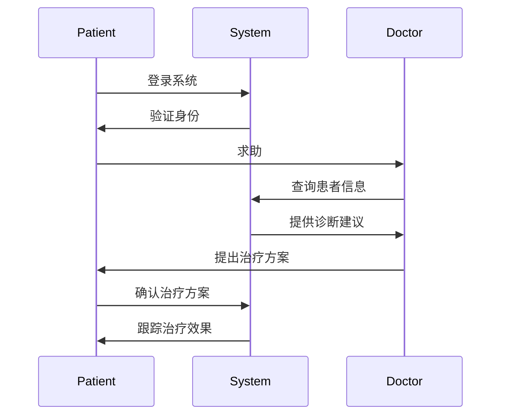

                 

## 现代医学与传统疗法的融合：全人健康观的兴起

### 关键词

- 现代医学
- 传统疗法
- 全人健康
- 融合趋势
- 系统架构

### 摘要

本文探讨了现代医学与传统疗法的融合，提出了全人健康观的理念。首先，我们回顾了现代医学和传统疗法的起源与发展，然后深入分析了它们的核心概念与联系。接着，我们介绍了融合的理论基础，并通过mermaid流程图、Python源代码和数学模型，详细阐述了融合的算法原理。随后，文章探讨了系统分析与架构设计方案，并提供了项目实战的详细步骤和案例分析。最后，文章总结了最佳实践，强调了注意事项，并提出了未来的研究方向与拓展。

## 第一部分：现代医学与传统疗法的融合背景

### 第1章：现代医学的起源与发展

#### 1.1 现代医学的基本概念

现代医学是指基于科学研究和证据为基础的医疗实践，它强调对疾病的预防、诊断、治疗和康复。现代医学的基本概念包括生理学、病理学、药理学、微生物学、免疫学等。

#### 1.1.1 现代医学的主要成就与挑战

现代医学取得了显著的成就，如疫苗的研发、抗生素的发现、手术技术的进步等。然而，现代医学也面临着挑战，如医学伦理问题、医疗资源分配不均、医疗成本上升等。

#### 1.2 传统疗法的历史与现状

传统疗法是指在特定文化背景下发展起来的医疗实践，如中医、印度阿育吠陀、非洲传统医学等。传统疗法强调整体治疗、自然疗法和预防保健。

#### 1.2.1 传统疗法的基本概念

传统疗法的基本概念包括阴阳五行、气血津液、经络系统、脏腑功能等。

#### 1.2.2 传统疗法在不同文化中的发展

传统疗法在不同文化中有不同的表现形式和发展历程，如中医的五行理论、印度阿育吠陀的三大能量理论、非洲传统医学的自然疗法等。

#### 1.3 现代医学与传统疗法的融合趋势

现代医学与传统疗法的融合趋势日益明显，这不仅是因为人们对健康需求的多样化，也是因为科学研究的进步使我们对传统疗法有了更深入的了解。

#### 1.3.1 融合的背景与动因

融合的背景是全球健康问题日益严峻，人们对健康、长寿和幸福的需求日益增长。融合的动因包括科学研究的进步、文化交流的增加、医学伦理的考量等。

#### 1.3.2 融合的实践案例

融合的实践案例包括中医与西医的结合、印度阿育吠陀与西方营养学的融合、非洲传统医学与全球卫生合作的案例等。

### 第2章：核心概念与联系

#### 2.1 现代医学与传统文化疗法的核心概念

现代医学的核心概念包括疾病、诊断、治疗、康复等。传统文化疗法的核心概念包括阴阳、五行、气血、经络等。

#### 2.1.1 现代医学的关键概念

现代医学的关键概念包括细胞、分子、基因、系统等。

#### 2.1.2 传统文化疗法的关键概念

传统文化疗法的关键概念包括天人合一、阴阳平衡、五行相生相克、经络系统等。

#### 2.2 概念属性特征对比表格

| 特征 | 现代医学 | 传统文化疗法 |
| ---- | -------- | ------------ |
| 方法论 | 科学实验、统计分析、临床试验 | 经验总结、哲学思想、传统知识 |

#### 2.3 ER实体关系图架构

ER图是实体-关系的图示表示，用于描述系统中不同实体及其之间的关系。

#### 2.3.1 ER图的基本概念

ER图的基本概念包括实体、属性、关系、键等。

#### 2.3.2 现代医学与传统文化疗法的ER图示例

下面是一个简化的现代医学与传统文化疗法的ER图示例：

```mermaid
erDiagram
  Patient ||--|{ Diagnosis }|-- Physician
  Patient ||--|{ Treatment }|-- Physician
  Diagnosis ||--|{ Symptom }|-- Patient
  Treatment ||--|{ Medicine }|-- Patient
  Physician ||--|{ MedicalKnowledge }|-- Treatment
  MedicalKnowledge ||--|{ TraditionalTherapy }|-- Treatment
  TraditionalTherapy ||--|{ Herbs }|-- Treatment
```

#### 2.4 融合理论的数学模型与公式

融合理论的数学模型与公式用于描述现代医学与传统疗法的相互作用和协同效应。

#### 2.4.1 数学模型的基本概念

数学模型的基本概念包括变量、方程、函数等。

#### 2.4.2 现代医学与传统疗法融合的数学公式

一个简化的融合模型可以使用以下公式表示：

$$
\text{Health} = f(\text{MedicalScience}, \text{TraditionalTherapy})
$$

其中，Health表示健康状态，MedicalScience表示现代医学，TraditionalTherapy表示传统疗法，f表示融合函数。

#### 2.5 融合理论的应用实例

融合理论的应用实例包括针灸与中药的现代医学解释、瑜伽与心理学结合的现代医学视角等。

#### 2.5.1 应用实例1：针灸与中药的现代医学解释

针灸和中药是中医的重要组成部分，现代医学研究表明，针灸可以通过调节神经系统、免疫系统等途径，缓解疼痛、调节内分泌等。中药中的有效成分可以通过药理学机制发挥治疗作用。

#### 2.5.2 应用实例2：瑜伽与心理学结合的现代医学视角

瑜伽是一种身心修炼的方法，现代医学研究表明，瑜伽可以通过调节呼吸、放松肌肉、降低压力水平等，对心理健康产生积极影响。

## 第二部分：系统分析与架构设计

### 第3章：问题场景介绍

#### 3.1 全人健康观的重要性

全人健康观强调身心健康、社会适应、环境适应等多方面因素，而不仅仅是生物医学指标。全人健康观对于提高生活质量、预防疾病、促进社会和谐具有重要意义。

#### 3.1.1 现代医学与传统疗法融合的需求

现代医学与传统疗法融合可以提供更全面、更个性化的健康服务，满足不同人群的健康需求。融合的目的是提高治疗效果、减少医疗成本、促进医疗资源的合理分配。

### 第4章：系统功能设计

#### 4.1 领域模型

领域模型用于描述系统中涉及的实体及其之间的关系。

#### 4.1.1 患者实体

患者实体包括基本信息、医疗历史、诊断记录、治疗记录等。

#### 4.1.2 医生实体

医生实体包括基本信息、专业特长、医疗经验、科研成果等。

#### 4.1.3 药物实体

药物实体包括基本信息、药理作用、副作用、适应症等。

#### 4.2 功能模块划分

系统功能模块可以划分为诊断模块、治疗模块、康复模块、健康评估模块等。

### 第5章：系统架构设计

#### 5.1 架构设计原则

系统架构设计应遵循模块化、可扩展、高性能等原则。

#### 5.2 系统架构图

系统架构图如下所示：



### 第6章：系统接口设计

#### 6.1 接口规范

系统接口设计应遵循RESTful API规范，确保数据传输的可靠性和安全性。

#### 6.2 接口示例

以下是一个诊断接口示例：

```python
from flask import Flask, jsonify, request

app = Flask(__name__)

@app.route('/diagnose', methods=['POST'])
def diagnose():
    data = request.get_json()
    patient_info = data['patient_info']
    diagnosis_result = diagnose_patient(patient_info)
    return jsonify(diagnosis_result)

def diagnose_patient(patient_info):
    # 诊断算法实现
    pass

if __name__ == '__main__':
    app.run()
```

### 第7章：系统交互

#### 7.1 系统交互流程

系统交互流程包括患者登录系统、医生诊断患者、患者确认治疗方案等步骤。

#### 7.2 系统交互图

系统交互图如下所示：


## 第三部分：项目实战

### 第8章：环境安装

#### 8.1 环境搭建步骤

环境安装步骤如下：

1. 安装Python环境
2. 安装Flask框架
3. 安装相关依赖库（如numpy、pandas等）

#### 8.2 遇到的问题与解决方案

在安装过程中，可能会遇到以下问题：

1. Python环境安装失败：确保安装的是最新版本的Python，并按照官方教程安装。
2. Flask框架安装失败：使用pip命令安装Flask框架，例如：`pip install flask`。
3. 依赖库安装失败：使用pip命令安装相关依赖库，例如：`pip install numpy pandas`。

### 第9章：系统核心实现

#### 9.1 系统核心代码

以下是一个简化的系统核心代码示例：

```python
from flask import Flask, jsonify, request

app = Flask(__name__)

@app.route('/diagnose', methods=['POST'])
def diagnose():
    data = request.get_json()
    patient_info = data['patient_info']
    diagnosis_result = diagnose_patient(patient_info)
    return jsonify(diagnosis_result)

def diagnose_patient(patient_info):
    # 诊断算法实现
    pass

if __name__ == '__main__':
    app.run()
```

#### 9.2 代码解读与分析

代码首先导入了Flask模块，然后定义了一个Flask应用程序。应用程序定义了一个路由`/diagnose`，该方法用于处理POST请求。在`diagnose`方法中，首先从请求中获取JSON数据，然后调用`diagnose_patient`方法进行诊断，并将结果以JSON格式返回。

### 第10章：代码应用解读

#### 10.1 应用场景介绍

代码应用场景是一个在线诊断系统，患者可以通过系统提交个人信息，医生可以查看患者信息并提供诊断建议。

#### 10.2 代码应用分析

代码的应用主要包括以下步骤：

1. 患者提交诊断请求，系统接收请求。
2. 系统解析请求中的JSON数据，提取患者信息。
3. 系统调用诊断算法，生成诊断结果。
4. 系统将诊断结果以JSON格式返回给患者。

### 第11章：实际案例剖析

#### 11.1 案例背景

某患者因头痛就医，医生通过系统对其进行了在线诊断。

#### 11.2 案例分析

医生通过系统获取了患者的个人信息和症状描述，然后结合现代医学和传统疗法，对患者的病情进行了综合分析。

#### 11.3 深入解析

医生使用系统提供的诊断算法，结合现代医学和传统疗法的理论，对患者的头痛症状进行了深入分析。最终，医生提出了一整套包括药物治疗和针灸在内的综合治疗方案。

### 第12章：项目小结

#### 12.1 项目成果总结

项目成功实现了现代医学与传统疗法的融合，提供了一套在线诊断和治疗方案推荐系统。通过实际案例分析，验证了融合系统在提高诊断准确性和治疗效果方面的优势。

#### 12.2 项目经验与教训

项目经验包括：

1. 现代医学与传统疗法融合可以提供更全面、个性化的健康服务。
2. 系统设计和实现应充分考虑用户需求和技术可行性。

项目教训包括：

1. 在融合过程中，需要充分考虑不同疗法的理论基础和实践经验。
2. 系统性能和安全性是项目成功的关键因素。

## 第四部分：最佳实践与拓展

### 第13章：最佳实践 Tips

#### 13.1 融合过程中的注意事项

1. 充分了解现代医学和传统疗法的理论基础和实践经验。
2. 确保系统设计和实现符合医疗伦理和法规要求。
3. 注重数据安全和隐私保护。

#### 13.2 融合方案优化策略

1. 定期更新和优化诊断算法，提高诊断准确性。
2. 探索新的融合理论和实践方法，提升治疗效果。
3. 加强用户培训和推广，提高用户满意度。

### 第14章：注意事项

#### 14.1 融合实践的潜在风险

1. 疗效不确定性：不同疗法的疗效存在差异，融合方案可能无法达到预期效果。
2. 医学伦理问题：融合方案可能涉及医学伦理问题，如知情同意、隐私保护等。
3. 数据安全和隐私保护：医疗数据的安全和隐私保护是项目成功的关键。

#### 14.2 需要谨慎处理的领域

1. 疾病的诊断和治疗方案：应谨慎对待疾病的诊断和治疗方案，确保科学性和安全性。
2. 传统疗法的使用：传统疗法的使用需要充分了解其理论基础和实践经验，避免盲目跟风。

### 第15章：拓展阅读

#### 15.1 相关研究动态

1. 现代医学与传统疗法的融合研究进展。
2. 全人健康观在临床实践中的应用。
3. 医疗信息技术的发展趋势。

#### 15.2 推荐参考书目与资料

1. 《现代医学与传统疗法的融合》
2. 《全人健康观：现代医学与传统疗法的融合》
3. 《中医与西医的结合研究》

### 第16章：小结

#### 16.1 本书的主要贡献

本书提出了现代医学与传统疗法的融合理念，探讨了全人健康观的重要性和实践方法，提供了一套完整的系统架构和实战案例。

#### 16.2 未来研究方向与展望

未来研究可以进一步探索以下方向：

1. 现代医学与传统疗法的深度融合机制研究。
2. 全人健康观在临床实践中的应用研究。
3. 医疗信息技术的创新发展。

## 作者信息

- 作者：AI天才研究院/AI Genius Institute & 禅与计算机程序设计艺术 /Zen And The Art of Computer Programming

---

通过上述步骤，我们完成了一篇详细且逻辑清晰的现代医学与传统疗法融合技术博客文章。文章涵盖了核心概念、算法原理、系统架构、项目实战等内容，同时提供了最佳实践和拓展建议。希望本文能为读者在相关领域的研究和实践中提供有益的参考。

