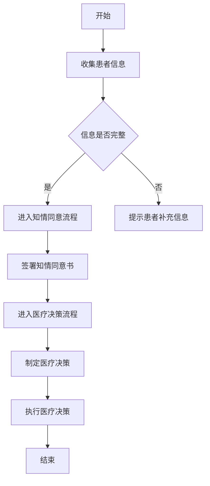
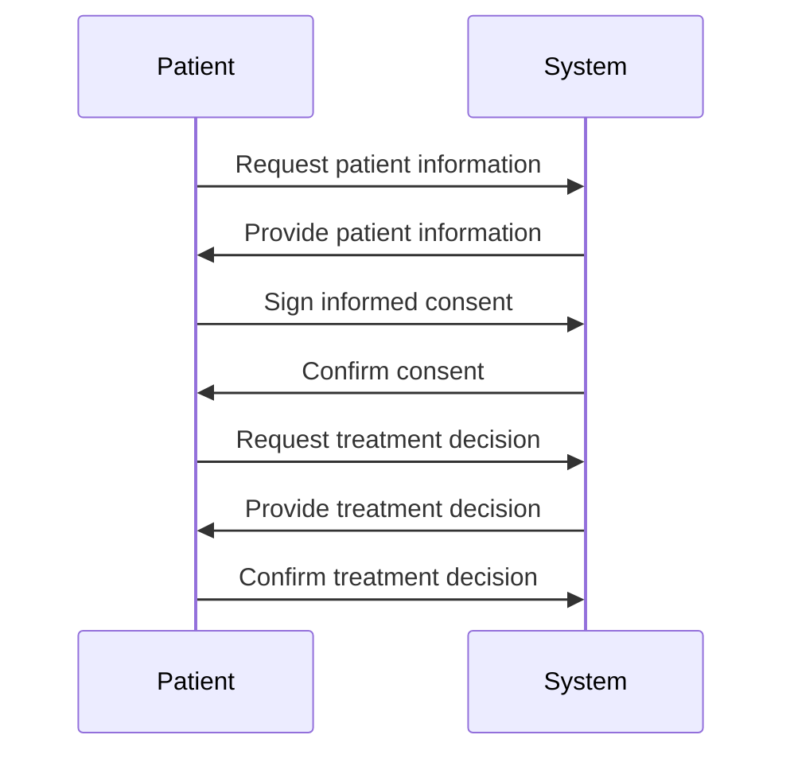

                 

### 第一部分：背景介绍

#### 第1章：问题背景

在现代社会中，医疗体系作为保障人民健康的关键组成部分，其运作方式和核心原则对个人和社会具有重要意义。本文旨在探讨医疗体系中的一项重要原则——患者自主权，特别是知情同意与医疗决策在其中的作用。

##### 1.1.1 问题背景

现代医疗体系中，患者自主权是一个备受关注的话题。知情同意和医疗决策作为患者自主权的核心组成部分，直接影响着医疗服务的质量和患者满意度。知情同意是指在医疗过程中，医疗机构及其医护人员向患者提供关于病情、治疗方案及可能的并发症等信息，并尊重患者的决定。而医疗决策则是在这一基础上，患者与医疗团队共同制定的治疗计划。

##### 1.1.2 问题解决

为了解决知情同意和医疗决策中的问题，本文将从以下几个方面展开讨论：

1. **核心概念与联系**：明确知情同意和医疗决策的定义、属性特征及相互关系。
2. **知情同意原理**：探讨知情同意的法律框架和伦理考量。
3. **医疗决策原理**：分析医疗决策的类型和影响因素。
4. **患者自主权实践**：介绍患者自主权的实现情况和实践案例分析。
5. **医疗体系中的患者自主权**：评估现状、提出改进措施与策略，借鉴国际经验。
6. **未来展望**：展望患者自主权的发展趋势和面临的挑战。

##### 1.1.3 边界与外延

本文讨论的患者自主权主要涉及知情同意和医疗决策两个方面。其边界包括：

1. **知情同意**：主要关注医疗机构和医护人员在提供信息、尊重患者决定方面的操作规范。
2. **医疗决策**：主要探讨患者和医疗团队共同制定治疗计划的程序和原则。

外延则涉及患者自主权在医疗体系中的实际应用和影响，包括患者权益保护、医疗服务质量提升等方面。

##### 1.1.4 核心概念结构

在探讨患者自主权时，以下核心概念是关键：

1. **患者自主权**：指患者在接受医疗服务时，有权自主决定治疗方案和参与医疗决策。
2. **知情同意**：医疗机构和医护人员向患者提供必要信息，并尊重患者决定的过程。
3. **医疗决策**：患者和医疗团队共同制定的治疗计划。

这些概念相互联系，共同构成了患者自主权在医疗体系中的核心框架。

#### 第2章：核心概念与联系

##### 2.1.1 核心概念

为了深入理解患者自主权中的知情同意和医疗决策，我们需要明确这些核心概念的定义、属性特征及其相互关系。

###### 2.1.1.1 定义

1. **患者自主权**：
   - 定义：患者自主权是指患者在医疗过程中，有权根据自身意愿作出决策，包括选择治疗方案、同意或拒绝某些医疗行为。
   - 属性特征：自主性、自愿性、知情性。
   - 对比表格：
     | 概念 | 定义 | 属性特征 |
     | --- | --- | --- |
     | 患者自主权 | 患者根据自身意愿作出医疗决策 | 自主性、自愿性、知情性 |
     | 知情同意 | 医疗机构向患者提供信息并尊重患者决定 | 知情性、自愿性、合法性 |
     | 医疗决策 | 患者与医疗团队共同制定的治疗计划 | 共同性、科学性、适应性 |

2. **知情同意**：
   - 定义：知情同意是指医疗机构和医护人员在实施医疗行为前，向患者提供关于病情、治疗方案、风险和益处等信息，并尊重患者的决定。
   - 属性特征：透明性、尊重性、合法性。
   - 对比表格：
     | 概念 | 定义 | 属性特征 |
     | --- | --- | --- |
     | 知情同意 | 医疗机构向患者提供信息并尊重患者决定 | 知情性、自愿性、合法性 |

3. **医疗决策**：
   - 定义：医疗决策是指患者在医疗团队的帮助下，根据病情和医疗信息，共同制定并选择最适合的治疗方案。
   - 属性特征：科学性、适应性、合作性。
   - 对比表格：
     | 概念 | 定义 | 属性特征 |
     | --- | --- | --- |
     | 医疗决策 | 患者与医疗团队共同制定的治疗计划 | 科学性、适应性、合作性 |

###### 2.1.1.2 关联概念

1. **患者参与**：
   - 定义：患者参与是指患者在医疗决策和治疗过程中，积极参与并表达自己的意见和需求。
   - 属性特征：主动性、沟通性、合作性。

2. **医疗伦理**：
   - 定义：医疗伦理是指医疗实践中的道德规范和价值观，包括尊重患者权利、维护患者利益等方面。
   - 属性特征：道德性、伦理性、规范性。

3. **医疗质量**：
   - 定义：医疗质量是指医疗服务的整体水平，包括诊疗效果、患者满意度、医疗安全等方面。
   - 属性特征：有效性、安全性、满意度。

##### 2.1.2 关联概念

知情同意和医疗决策不仅涉及患者自主权，还与其他相关概念紧密关联，以下是几个主要关联概念：

###### 2.1.2.1 定义

1. **患者教育**：
   - 定义：患者教育是指医疗机构为提高患者对疾病、治疗方案和医疗过程的理解和参与度，提供的相关知识和信息。

2. **患者满意度**：
   - 定义：患者满意度是指患者对医疗服务质量和体验的主观评价和感受。

3. **医疗法律**：
   - 定义：医疗法律是指国家制定的相关法律法规，用于规范医疗行为、保护患者权益等方面。

###### 2.1.2.2 属性特征

1. **患者教育**：
   - 属性特征：教育性、针对性、互动性。

2. **患者满意度**：
   - 属性特征：主观性、综合性、动态性。

3. **医疗法律**：
   - 属性特征：规范性、强制性、公正性。

###### 2.1.2.3 对比表格

| 概念 | 定义 | 属性特征 |
| --- | --- | --- |
| 患者教育 | 提高患者对疾病、治疗方案和医疗过程的理解和参与度 | 教育性、针对性、互动性 |
| 患者满意度 | 患者对医疗服务质量和体验的主观评价和感受 | 主观性、综合性、动态性 |
| 医疗法律 | 国家制定的相关法律法规，用于规范医疗行为、保护患者权益等方面 | 规范性、强制性、公正性 |

通过明确这些核心概念与联系，我们可以更好地理解患者自主权在医疗体系中的运作机制和重要性。

#### 第3章：知情同意原理

##### 3.1.1 原理介绍

知情同意是现代医疗体系中一个重要的伦理和法律原则，其核心在于保障患者的知情权和自主权。知情同意不仅是医疗行为的必要前提，也是医患关系构建的基础。

###### 3.1.1.1 知情同意的定义

知情同意是指在医疗行为实施前，医疗机构和医护人员向患者提供关于病情、治疗方案、并发症、风险和益处等方面的信息，并尊重患者作出的自愿决定的过程。其本质是尊重患者的自主权，确保患者在接受医疗服务时能够做出明智的选择。

###### 3.1.1.2 知情同意的原则

知情同意原则主要包括以下几个方面：

1. **知情原则**：患者有权获得与自身病情和治疗方案相关的所有必要信息，以便作出明智的决定。
2. **自愿原则**：患者的同意必须是自愿的，无任何外部压力或强制。
3. **尊重原则**：医疗机构和医护人员应尊重患者的决定，即使患者的决定不符合医疗建议。
4. **合法性原则**：知情同意过程必须符合相关法律法规的规定。

###### 3.1.1.3 知情同意的过程

知情同意过程通常包括以下几个步骤：

1. **信息提供**：医护人员向患者解释病情、治疗方案、可能的并发症和风险等信息。
2. **询问患者意见**：医护人员询问患者是否有任何疑问，并解答患者的疑问。
3. **签署同意书**：患者阅读并理解同意书内容后，签署知情同意书。
4. **记录和保管**：医疗机构记录患者同意情况，并将知情同意书妥善保管。

##### 3.1.2 知情同意的法律框架

知情同意的法律框架为医疗行为的合法性提供了保障，各国根据自身医疗实践和法律法规，制定了相应的知情同意规范。

###### 3.1.2.1 国际法律框架

在国际上，知情同意原则被广泛认可。例如：

1. **《赫尔辛基宣言》**：明确了医学研究的伦理原则，包括知情同意的必要性。
2. **《世界医学协会伦理准则》**：强调了医疗实践中知情同意的重要性。

###### 3.1.2.2 中国法律框架

在中国，知情同意的法律框架主要包括：

1. **《中华人民共和国执业医师法》**：规定了医生在诊疗活动中必须向患者说明病情和诊疗措施，并取得患者同意。
2. **《医疗机构管理条例》**：明确了医疗机构在实施医疗行为前，必须向患者说明病情和诊疗方案，并取得患者同意。
3. **《医疗纠纷预防和处理条例》**：规定了医疗机构和医护人员在医疗活动中必须遵循的规范，包括知情同意。

##### 3.1.3 知情同意的伦理考量

知情同意不仅是一个法律要求，也是一个伦理要求。其伦理考量主要包括以下几个方面：

1. **尊重患者自主权**：尊重患者的自主权是医学伦理的核心原则之一。知情同意过程正是为了保障患者的自主权，使其能够在医疗决策中发挥主导作用。
2. **维护患者利益**：知情同意过程有助于患者充分了解医疗行为的相关信息，从而更好地维护自身利益。
3. **促进医患信任**：知情同意过程有助于建立良好的医患关系，增强患者对医生的信任。
4. **保障医疗安全**：知情同意过程可以减少医疗纠纷，降低医疗风险，保障医疗安全。

总之，知情同意不仅是医疗行为的必要程序，也是医患关系的重要基础。通过明确的伦理和法律框架，可以确保知情同意的规范实施，从而更好地保障患者的权益。

#### 第4章：医疗决策原理

##### 4.1.1 原理介绍

医疗决策是医疗过程中至关重要的一环，它直接影响到患者的治疗结果和康复过程。医疗决策原理涉及多个方面，包括决策类型、影响因素和决策过程等。

###### 4.1.1.1 医疗决策的定义

医疗决策是指医疗团队和患者根据患者的病情、医疗信息、个人意愿和医疗资源等因素，共同制定并选择最适合的治疗方案的过程。医疗决策不仅包括对具体治疗方法的决策，还包括对治疗方案的整体规划和调整。

###### 4.1.1.2 医疗决策的类型

医疗决策可以根据不同的标准进行分类，以下是几种常见的医疗决策类型：

1. **治疗性决策**：指针对患者的病情，选择最佳的治疗方案。例如，手术、药物治疗、物理治疗等。
2. **预防性决策**：指为防止疾病发生或进展，采取的预防措施。例如，疫苗接种、定期体检、健康宣教等。
3. **诊断性决策**：指通过检查、化验等手段，确定患者病情的决策。例如，实验室检查、影像学检查等。
4. **转诊决策**：指根据患者的病情和医疗资源，决定将患者转诊至其他医疗机构或专科医生的决策。
5. **终结性决策**：指在患者病情无法逆转或治疗效果不佳时，做出的停止治疗或改变治疗方式的决策。

###### 4.1.1.3 医疗决策的原则

医疗决策应遵循以下原则：

1. **科学性**：医疗决策应基于科学的证据和临床实践，确保决策的科学性和有效性。
2. **个体化**：医疗决策应充分考虑患者的个体差异，包括病情、经济状况、个人意愿等，制定个性化的治疗方案。
3. **合作性**：医疗决策是医疗团队和患者共同参与的过程，应充分尊重患者的意见和选择。
4. **公正性**：医疗决策应公平合理，确保患者权益得到充分保障。

##### 4.1.2 医疗决策的类型

根据不同的标准，医疗决策可以分为多种类型。以下是几种常见的医疗决策类型及其特点：

1. **明确性决策**：指医疗决策的方案明确，执行容易。例如，对于急性心肌梗死的患者，立即进行PCI（经皮冠状动脉介入术）是一种明确的决策。
2. **模糊性决策**：指医疗决策的方案不明确，存在多种可能性。例如，对于恶性肿瘤患者，选择化疗还是放疗，需要综合考虑患者的病情和身体状况，存在一定的模糊性。
3. **经验性决策**：指医疗决策主要依据医生的临床经验和判断。例如，对于某些常见病和多发病，医生可以根据自己的经验和知识进行决策。
4. **数据驱动决策**：指医疗决策主要依据大数据分析和科学证据。例如，通过基因组学数据确定个体化治疗方案，或者通过大数据分析预测疾病风险。

##### 4.1.3 医疗决策的影响因素

医疗决策的影响因素多种多样，主要包括以下几个方面：

1. **患者因素**：包括患者的年龄、性别、病情、心理状态、个人意愿和预期等。
2. **医生因素**：包括医生的专业水平、临床经验、决策能力和沟通技巧等。
3. **医疗资源**：包括医疗设备、药品、医疗设施和专业人员的配置等。
4. **社会因素**：包括社会文化、医疗政策、医疗保险、医疗成本等。
5. **法律法规**：包括相关法律法规、规章制度和医疗伦理等。

医疗决策的复杂性和多样性决定了其影响因素的广泛性。在实际操作中，需要综合考虑各种因素，制定出符合患者利益和医疗实践的最佳治疗方案。

#### 第5章：患者自主权实践

##### 5.1.1 实践背景

患者自主权作为现代医疗体系的核心原则之一，其实践在国内外得到了广泛关注。患者自主权的实现不仅关乎个体权益的保障，也影响着医疗质量和医患关系的和谐。

###### 5.1.1.1 国内实践背景

在中国，患者自主权的实践经历了从无到有、从认识到落实的过程。随着社会的发展和医疗法规的完善，患者自主权逐渐得到了重视。主要表现在以下几个方面：

1. **立法保障**：近年来，国家逐步完善了涉及患者权益的法律法规，如《中华人民共和国执业医师法》、《医疗机构管理条例》等，为患者自主权的实现提供了法律基础。
2. **医疗宣教**：医疗机构通过多种途径加强患者宣教，提高患者对自身权益的认识和参与意识。如开设健康讲座、发布科普文章、开展在线咨询等。
3. **知情同意制度的建立**：医疗机构逐步完善了知情同意制度，规范了知情同意书的内容和签署流程，确保患者在接受治疗前充分了解相关信息并作出自愿决定。

###### 5.1.1.2 国外实践背景

在国际上，患者自主权的实践已经相对成熟。例如：

1. **患者参与决策**：国外医疗机构普遍鼓励患者参与到医疗决策过程中，通过沟通和咨询，确保患者充分了解病情和治疗方案，作出明智的决定。
2. **电子病历系统**：许多国家已经建立了完善的电子病历系统，方便患者查阅自己的病历信息，增强患者的知情权和参与度。
3. **患者教育**：国外医疗机构重视对患者进行健康教育，通过定期讲座、发放宣传资料等方式，提高患者的健康素养和自我管理能力。

##### 5.1.2 患者自主权的实现

患者自主权的实现需要医疗机构、医护人员和患者三方面的共同努力。以下是实现患者自主权的几个关键步骤：

1. **提高患者意识**：通过健康教育、宣传等方式，提高患者对自身权益的认识和参与意识。
2. **完善知情同意制度**：医疗机构应规范知情同意书的内容和签署流程，确保患者在接受治疗前充分了解相关信息并作出自愿决定。
3. **加强医患沟通**：医护人员应加强与患者的沟通，了解患者的需求和期望，尊重患者的决定。
4. **优化医疗服务流程**：医疗机构应优化医疗服务流程，确保患者能够在方便快捷的环境中接受诊疗服务，提高患者满意度。

##### 5.1.3 实践案例分析

以下是一个患者自主权实践案例：

**案例背景**：某患者因胸部不适就诊，初步诊断为冠心病。医生建议进行冠状动脉造影检查，并根据检查结果决定是否进行手术。

**案例分析**：

1. **信息提供**：医生向患者详细介绍了冠脉造影的检查过程、风险和益处，以及手术的必要性。
2. **沟通与咨询**：患者对手术有一定顾虑，医生耐心解答患者的疑问，并建议患者咨询其他医生或查阅相关资料。
3. **知情同意**：患者阅读并理解了知情同意书后，签署了同意书。
4. **决策过程**：患者与医生共同讨论，决定先进行冠脉造影检查，根据检查结果再决定是否手术。
5. **执行决策**：患者接受了冠脉造影检查，结果提示需要手术治疗。在充分了解手术风险和益处后，患者决定接受手术治疗。

**案例分析小结**：

通过该案例，我们可以看到患者自主权的实现需要医患双方的共同努力。医生在提供信息、解答疑问、尊重患者决定方面发挥了重要作用，而患者则通过参与决策过程，充分了解自身病情和治疗方案，实现了自主权。这一案例充分体现了患者自主权在医疗实践中的实际应用和意义。

#### 第6章：医疗体系中的患者自主权

##### 6.1.1 医疗体系中的患者自主权现状

在当今的医疗体系中，患者自主权已经成为一项重要的伦理和法律原则。然而，患者自主权的实施情况在不同国家和地区存在较大差异。

###### 6.1.1.1 国内现状

在中国，患者自主权的实现程度总体上在提高，但仍面临一些挑战：

1. **法律保障逐步完善**：国家在立法层面不断完善相关法律法规，如《中华人民共和国执业医师法》、《医疗机构管理条例》等，为患者自主权的实现提供了法律基础。
2. **医疗机构意识提升**：医疗机构逐渐认识到患者自主权的重要性，通过培训、宣传等方式提高医护人员对知情同意和患者参与决策的认识。
3. **实际操作难度**：在实际操作中，患者自主权的实现仍面临一些挑战，如患者健康素养较低、医患沟通不畅、医疗服务流程不完善等。

###### 6.1.1.2 国际现状

在国际上，患者自主权已经得到了广泛认可和实践。许多国家在法律、政策、医疗机构层面都制定了相应的措施，保障患者自主权的实现。以下是一些国际经验：

1. **患者教育**：国外医疗机构普遍重视对患者进行健康教育，通过多种途径提高患者的健康素养和参与意识。
2. **电子病历系统**：许多国家已经建立了完善的电子病历系统，方便患者查阅自己的病历信息，增强患者的知情权和参与度。
3. **患者参与决策**：国外医疗机构鼓励患者参与到医疗决策过程中，通过沟通和咨询，确保患者充分了解病情和治疗方案，作出明智的决定。

##### 6.1.2 改进措施与策略

为了进一步提高医疗体系中的患者自主权，可以采取以下改进措施与策略：

1. **加强法律保障**：进一步完善相关法律法规，明确患者自主权的内容和实现途径，提高违法成本。
2. **提高患者健康素养**：通过健康教育、宣传等方式，提高患者的健康素养和参与意识。
3. **优化医疗服务流程**：简化知情同意流程，提高医疗服务的透明度，确保患者能够充分了解相关信息并作出自愿决定。
4. **加强医患沟通**：医疗机构应加强医患沟通，提高医护人员沟通技巧，尊重患者的意见和决定。
5. **完善电子病历系统**：推动电子病历系统的普及，方便患者查阅自己的病历信息，提高患者的知情权和参与度。
6. **加强国际合作与交流**：借鉴国际先进经验，加强国际合作与交流，推动患者自主权的普及和完善。

##### 6.1.3 国际经验借鉴

借鉴国际经验，我们可以从以下几个方面改进我国患者自主权的实践：

1. **加强患者教育**：通过多种途径提高患者的健康素养和参与意识，使患者能够更好地理解自身病情和治疗方案。
2. **优化医患沟通**：加强医患沟通，提高医护人员的沟通技巧，确保患者能够在医疗决策中发挥更大的作用。
3. **完善电子病历系统**：推动电子病历系统的普及，方便患者查阅病历信息，提高医疗服务的透明度。
4. **制定相关政策和法规**：明确患者自主权的内容和实现途径，制定相关政策和法规，保障患者权益。
5. **加强培训和宣传**：通过培训、宣传等方式，提高医护人员对知情同意和患者自主权的认识和重视。

总之，医疗体系中的患者自主权是一个全球性的挑战，需要各国共同努力。通过借鉴国际经验，我们可以进一步改进我国患者自主权的实践，提高医疗服务质量和患者满意度。

#### 第7章：未来展望

##### 7.1.1 患者自主权的发展趋势

随着社会的发展和技术进步，患者自主权在医疗体系中的作用日益显著。未来，患者自主权的发展趋势将体现在以下几个方面：

1. **数字化医疗**：电子病历系统、远程医疗和人工智能等数字化技术的普及，将极大提高患者获取信息的能力，增强患者的参与度和自主决策能力。
2. **个性化医疗**：基于基因组学、生物信息学等技术的个性化医疗，将使患者能够更精确地了解自己的病情和治疗方案，从而更好地行使自主权。
3. **患者参与决策**：随着医患沟通和医疗教育水平的提升，患者将在医疗决策中发挥更加积极的作用，与医疗团队共同制定治疗方案。
4. **患者数据共享**：患者个人健康数据的共享和隐私保护将得到更好的平衡，为患者提供更加个性化和精准的医疗服务。

##### 7.1.2 患者自主权面临的挑战

尽管患者自主权在医疗体系中具有重要地位，但其发展也面临着一系列挑战：

1. **信息不对称**：患者和医生之间的信息不对称，可能导致患者无法做出充分知情和自主的决定。
2. **医疗资源限制**：医疗资源的不均衡分配，可能影响患者自主权的实现，尤其是对于贫困和偏远地区的患者。
3. **伦理和法律问题**：在尊重患者自主权的同时，如何平衡患者的利益和社会公共利益，是医疗伦理和法律领域面临的挑战。
4. **患者教育和参与度**：提高患者的健康素养和参与决策的能力，需要长期的持续教育和宣传。

##### 7.1.3 患者自主权的未来发展

为了应对未来的挑战，患者自主权的未来发展可以从以下几个方面着手：

1. **加强医疗教育**：通过多种渠道和形式，提高患者的健康素养和医疗知识，增强患者的自我管理能力和参与决策的能力。
2. **完善法律法规**：制定和完善相关法律法规，明确患者自主权的内容和实现途径，为患者提供法律保障。
3. **推广数字化医疗**：充分利用数字化技术，提高医疗服务的可及性和透明度，增强患者的知情权和参与度。
4. **加强医患沟通**：提升医患沟通的质量和效果，建立良好的医患关系，促进患者自主权的实现。
5. **国际合作与交流**：借鉴国际先进经验，加强国际合作与交流，共同推动患者自主权的发展和完善。

总之，患者自主权在医疗体系中的重要地位不可替代，其未来发展需要多方面的努力和合作。通过持续的教育、立法和技术创新，可以更好地保障患者自主权的实现，提升医疗服务的质量和患者满意度。

----------------------------------------------------------------

### 文章标题：现代医疗体系中的患者自主权：知情同意与医疗决策

> 关键词：患者自主权、知情同意、医疗决策、医疗体系、伦理法律

> 摘要：本文深入探讨了现代医疗体系中的患者自主权，特别是知情同意与医疗决策在其中的作用。通过对核心概念、原理、实践现状及未来展望的详细分析，本文旨在为提升患者自主权提供有益的思路和建议。

---

### 第一部分：背景介绍

#### 第1章：问题背景

在现代社会中，医疗体系作为保障人民健康的关键组成部分，其运作方式和核心原则对个人和社会具有重要意义。本文旨在探讨医疗体系中的一项重要原则——患者自主权，特别是知情同意与医疗决策在其中的作用。

##### 1.1.1 问题背景

现代医疗体系中，患者自主权是一个备受关注的话题。知情同意和医疗决策作为患者自主权的核心组成部分，直接影响着医疗服务的质量和患者满意度。知情同意是指在医疗过程中，医疗机构及其医护人员向患者提供关于病情、治疗方案及可能的并发症等信息，并尊重患者的决定。而医疗决策则是在这一基础上，患者与医疗团队共同制定的治疗计划。

##### 1.1.2 问题解决

为了解决知情同意和医疗决策中的问题，本文将从以下几个方面展开讨论：

1. **核心概念与联系**：明确知情同意和医疗决策的定义、属性特征及相互关系。
2. **知情同意原理**：探讨知情同意的法律框架和伦理考量。
3. **医疗决策原理**：分析医疗决策的类型和影响因素。
4. **患者自主权实践**：介绍患者自主权的实现情况和实践案例分析。
5. **医疗体系中的患者自主权**：评估现状、提出改进措施与策略，借鉴国际经验。
6. **未来展望**：展望患者自主权的发展趋势和面临的挑战。

##### 1.1.3 边界与外延

本文讨论的患者自主权主要涉及知情同意和医疗决策两个方面。其边界包括：

1. **知情同意**：主要关注医疗机构和医护人员在提供信息、尊重患者决定方面的操作规范。
2. **医疗决策**：主要探讨患者和医疗团队共同制定治疗计划的程序和原则。

外延则涉及患者自主权在医疗体系中的实际应用和影响，包括患者权益保护、医疗服务质量提升等方面。

##### 1.1.4 核心概念结构

在探讨患者自主权时，以下核心概念是关键：

1. **患者自主权**：指患者在接受医疗服务时，有权自主决定治疗方案和参与医疗决策。
2. **知情同意**：医疗机构和医护人员向患者提供必要信息，并尊重患者决定的过程。
3. **医疗决策**：患者和医疗团队共同制定的治疗计划。

这些概念相互联系，共同构成了患者自主权在医疗体系中的核心框架。

#### 第2章：核心概念与联系

为了深入理解患者自主权中的知情同意和医疗决策，我们需要明确这些核心概念的定义、属性特征及其相互关系。

###### 2.1.1 核心概念

为了深入理解患者自主权中的知情同意和医疗决策，我们需要明确这些核心概念的定义、属性特征及其相互关系。

###### 2.1.1.1 定义

1. **患者自主权**：
   - 定义：患者自主权是指患者在医疗过程中，有权根据自身意愿作出决策，包括选择治疗方案、同意或拒绝某些医疗行为。
   - 属性特征：自主性、自愿性、知情性。
   - 对比表格：
     | 概念 | 定义 | 属性特征 |
     | --- | --- | --- |
     | 患者自主权 | 患者根据自身意愿作出医疗决策 | 自主性、自愿性、知情性 |
     | 知情同意 | 医疗机构向患者提供信息并尊重患者决定 | 知情性、自愿性、合法性 |
     | 医疗决策 | 患者与医疗团队共同制定的治疗计划 | 科学性、适应性、合作性 |

2. **知情同意**：
   - 定义：知情同意是指医疗机构和医护人员在实施医疗行为前，向患者提供关于病情、治疗方案、并发症、风险和益处等信息，并尊重患者作出的自愿决定的过程。
   - 属性特征：透明性、尊重性、合法性。
   - 对比表格：
     | 概念 | 定义 | 属性特征 |
     | --- | --- | --- |
     | 知情同意 | 医疗机构向患者提供信息并尊重患者决定 | 知情性、自愿性、合法性 |

3. **医疗决策**：
   - 定义：医疗决策是指患者和医疗团队共同制定的治疗计划，包括对治疗方案的选择、调整和终止。
   - 属性特征：科学性、适应性、合作性。
   - 对比表格：
     | 概念 | 定义 | 属性特征 |
     | --- | --- | --- |
     | 医疗决策 | 患者与医疗团队共同制定的治疗计划 | 科学性、适应性、合作性 |

###### 2.1.1.2 关联概念

1. **患者参与**：
   - 定义：患者参与是指患者在医疗决策和治疗过程中，积极参与并表达自己的意见和需求。
   - 属性特征：主动性、沟通性、合作性。

2. **医疗伦理**：
   - 定义：医疗伦理是指医疗实践中的道德规范和价值观，包括尊重患者权利、维护患者利益等方面。
   - 属性特征：道德性、伦理性、规范性。

3. **医疗质量**：
   - 定义：医疗质量是指医疗服务的整体水平，包括诊疗效果、患者满意度、医疗安全等方面。
   - 属性特征：有效性、安全性、满意度。

##### 2.1.2 关联概念

知情同意和医疗决策不仅涉及患者自主权，还与其他相关概念紧密关联，以下是几个主要关联概念：

###### 2.1.2.1 定义

1. **患者教育**：
   - 定义：患者教育是指医疗机构为提高患者对疾病、治疗方案和医疗过程的理解和参与度，提供的相关知识和信息。

2. **患者满意度**：
   - 定义：患者满意度是指患者对医疗服务质量和体验的主观评价和感受。

3. **医疗法律**：
   - 定义：医疗法律是指国家制定的相关法律法规，用于规范医疗行为、保护患者权益等方面。

###### 2.1.2.2 属性特征

1. **患者教育**：
   - 属性特征：教育性、针对性、互动性。

2. **患者满意度**：
   - 属性特征：主观性、综合性、动态性。

3. **医疗法律**：
   - 属性特征：规范性、强制性、公正性。

###### 2.1.2.3 对比表格

| 概念 | 定义 | 属性特征 |
| --- | --- | --- |
| 患者教育 | 提高患者对疾病、治疗方案和医疗过程的理解和参与度 | 教育性、针对性、互动性 |
| 患者满意度 | 患者对医疗服务质量和体验的主观评价和感受 | 主观性、综合性、动态性 |
| 医疗法律 | 国家制定的相关法律法规，用于规范医疗行为、保护患者权益等方面 | 规范性、强制性、公正性 |

通过明确这些核心概念与联系，我们可以更好地理解患者自主权在医疗体系中的运作机制和重要性。

#### 第3章：知情同意原理

##### 3.1.1 原理介绍

知情同意是现代医疗体系中一个重要的伦理和法律原则，其核心在于保障患者的知情权和自主权。知情同意不仅是医疗行为的必要前提，也是医患关系构建的基础。

###### 3.1.1.1 知情同意的定义

知情同意是指在医疗行为实施前，医疗机构和医护人员向患者提供关于病情、治疗方案、并发症、风险和益处等方面的信息，并尊重患者作出的自愿决定的过程。其本质是尊重患者的自主权，确保患者在接受医疗服务时能够做出明智的选择。

###### 3.1.1.2 知情同意的原则

知情同意原则主要包括以下几个方面：

1. **知情原则**：患者有权获得与自身病情和治疗方案相关的所有必要信息，以便作出明智的决定。
2. **自愿原则**：患者的同意必须是自愿的，无任何外部压力或强制。
3. **尊重原则**：医疗机构和医护人员应尊重患者的决定，即使患者的决定不符合医疗建议。
4. **合法性原则**：知情同意过程必须符合相关法律法规的规定。

###### 3.1.1.3 知情同意的过程

知情同意过程通常包括以下几个步骤：

1. **信息提供**：医护人员向患者解释病情、治疗方案、可能的并发症和风险等信息。
2. **询问患者意见**：医护人员询问患者是否有任何疑问，并解答患者的疑问。
3. **签署同意书**：患者阅读并理解同意书内容后，签署知情同意书。
4. **记录和保管**：医疗机构记录患者同意情况，并将知情同意书妥善保管。

##### 3.1.2 知情同意的法律框架

知情同意的法律框架为医疗行为的合法性提供了保障，各国根据自身医疗实践和法律法规，制定了相应的知情同意规范。

###### 3.1.2.1 国际法律框架

在国际上，知情同意原则被广泛认可。例如：

1. **《赫尔辛基宣言》**：明确了医学研究的伦理原则，包括知情同意的必要性。
2. **《世界医学协会伦理准则》**：强调了医疗实践中知情同意的重要性。

###### 3.1.2.2 中国法律框架

在中国，知情同意的法律框架主要包括：

1. **《中华人民共和国执业医师法》**：规定了医生在诊疗活动中必须向患者说明病情和诊疗措施，并取得患者同意。
2. **《医疗机构管理条例》**：明确了医疗机构在实施医疗行为前，必须向患者说明病情和诊疗方案，并取得患者同意。
3. **《医疗纠纷预防和处理条例》**：规定了医疗机构和医护人员在医疗活动中必须遵循的规范，包括知情同意。

##### 3.1.3 知情同意的伦理考量

知情同意不仅是一个法律要求，也是一个伦理要求。其伦理考量主要包括以下几个方面：

1. **尊重患者自主权**：尊重患者的自主权是医学伦理的核心原则之一。知情同意过程正是为了保障患者的自主权，使其能够在医疗决策中发挥主导作用。
2. **维护患者利益**：知情同意过程有助于患者充分了解医疗行为的相关信息，从而更好地维护自身利益。
3. **促进医患信任**：知情同意过程有助于建立良好的医患关系，增强患者对医生的信任。
4. **保障医疗安全**：知情同意过程可以减少医疗纠纷，降低医疗风险，保障医疗安全。

总之，知情同意不仅是医疗行为的必要程序，也是医患关系的重要基础。通过明确的伦理和法律框架，可以确保知情同意的规范实施，从而更好地保障患者的权益。

#### 第4章：医疗决策原理

##### 4.1.1 原理介绍

医疗决策是医疗过程中至关重要的一环，它直接影响到患者的治疗结果和康复过程。医疗决策原理涉及多个方面，包括决策类型、影响因素和决策过程等。

###### 4.1.1.1 医疗决策的定义

医疗决策是指医疗团队和患者根据患者的病情、医疗信息、个人意愿和医疗资源等因素，共同制定并选择最适合的治疗方案的过程。医疗决策不仅包括对具体治疗方法的决策，还包括对治疗方案的整体规划和调整。

###### 4.1.1.2 医疗决策的类型

医疗决策可以根据不同的标准进行分类，以下是几种常见的医疗决策类型：

1. **治疗性决策**：指针对患者的病情，选择最佳的治疗方案。例如，手术、药物治疗、物理治疗等。
2. **预防性决策**：指为防止疾病发生或进展，采取的预防措施。例如，疫苗接种、定期体检、健康宣教等。
3. **诊断性决策**：指通过检查、化验等手段，确定患者病情的决策。例如，实验室检查、影像学检查等。
4. **转诊决策**：指根据患者的病情和医疗资源，决定将患者转诊至其他医疗机构或专科医生的决策。
5. **终结性决策**：指在患者病情无法逆转或治疗效果不佳时，做出的停止治疗或改变治疗方式的决策。

###### 4.1.1.3 医疗决策的原则

医疗决策应遵循以下原则：

1. **科学性**：医疗决策应基于科学的证据和临床实践，确保决策的科学性和有效性。
2. **个体化**：医疗决策应充分考虑患者的个体差异，包括病情、经济状况、个人意愿等，制定个性化的治疗方案。
3. **合作性**：医疗决策是医疗团队和患者共同参与的过程，应充分尊重患者的意见和选择。
4. **公正性**：医疗决策应公平合理，确保患者权益得到充分保障。

##### 4.1.2 医疗决策的类型

根据不同的标准，医疗决策可以分为多种类型。以下是几种常见的医疗决策类型及其特点：

1. **明确性决策**：指医疗决策的方案明确，执行容易。例如，对于急性心肌梗死的患者，立即进行PCI（经皮冠状动脉介入术）是一种明确的决策。
2. **模糊性决策**：指医疗决策的方案不明确，存在多种可能性。例如，对于恶性肿瘤患者，选择化疗还是放疗，需要综合考虑患者的病情和身体状况，存在一定的模糊性。
3. **经验性决策**：指医疗决策主要依据医生的临床经验和判断。例如，对于某些常见病和多发病，医生可以根据自己的经验和知识进行决策。
4. **数据驱动决策**：指医疗决策主要依据大数据分析和科学证据。例如，通过基因组学数据确定个体化治疗方案，或者通过大数据分析预测疾病风险。

##### 4.1.3 医疗决策的影响因素

医疗决策的影响因素多种多样，主要包括以下几个方面：

1. **患者因素**：包括患者的年龄、性别、病情、心理状态、个人意愿和预期等。
2. **医生因素**：包括医生的专业水平、临床经验、决策能力和沟通技巧等。
3. **医疗资源**：包括医疗设备、药品、医疗设施和专业人员的配置等。
4. **社会因素**：包括社会文化、医疗政策、医疗保险、医疗成本等。
5. **法律法规**：包括相关法律法规、规章制度和医疗伦理等。

医疗决策的复杂性和多样性决定了其影响因素的广泛性。在实际操作中，需要综合考虑各种因素，制定出符合患者利益和医疗实践的最佳治疗方案。

#### 第5章：患者自主权实践

##### 5.1.1 实践背景

患者自主权作为现代医疗体系的核心原则之一，其实践在国内外得到了广泛关注。患者自主权的实现不仅关乎个体权益的保障，也影响着医疗质量和医患关系的和谐。

###### 5.1.1.1 国内实践背景

在中国，患者自主权的实践经历了从无到有、从认识到落实的过程。随着社会的发展和医疗法规的完善，患者自主权逐渐得到了重视。主要表现在以下几个方面：

1. **立法保障**：近年来，国家逐步完善了涉及患者权益的法律法规，如《中华人民共和国执业医师法》、《医疗机构管理条例》等，为患者自主权的实现提供了法律基础。
2. **医疗宣教**：医疗机构通过多种途径加强患者宣教，提高患者对自身权益的认识和参与意识。如开设健康讲座、发布科普文章、开展在线咨询等。
3. **知情同意制度的建立**：医疗机构逐步完善了知情同意制度，规范了知情同意书的内容和签署流程，确保患者在接受治疗前充分了解相关信息并作出自愿决定。

###### 5.1.1.2 国际实践背景

在国际上，患者自主权的实践已经相对成熟。例如：

1. **患者参与决策**：国外医疗机构普遍鼓励患者参与到医疗决策过程中，通过沟通和咨询，确保患者充分了解病情和治疗方案，作出明智的决定。
2. **电子病历系统**：许多国家已经建立了完善的电子病历系统，方便患者查阅自己的病历信息，增强患者的知情权和参与度。
3. **患者教育**：国外医疗机构重视对患者进行健康教育，通过定期讲座、发放宣传资料等方式，提高患者的健康素养和自我管理能力。

##### 5.1.2 患者自主权的实现

患者自主权的实现需要医疗机构、医护人员和患者三方面的共同努力。以下是实现患者自主权的几个关键步骤：

1. **提高患者意识**：通过健康教育、宣传等方式，提高患者对自身权益的认识和参与意识。
2. **完善知情同意制度**：医疗机构应规范知情同意书的内容和签署流程，确保患者在接受治疗前充分了解相关信息并作出自愿决定。
3. **加强医患沟通**：医护人员应加强与患者的沟通，了解患者的需求和期望，尊重患者的决定。
4. **优化医疗服务流程**：医疗机构应优化医疗服务流程，确保患者能够在方便快捷的环境中接受诊疗服务，提高患者满意度。

##### 5.1.3 实践案例分析

以下是一个患者自主权实践案例：

**案例背景**：某患者因胸部不适就诊，初步诊断为冠心病。医生建议进行冠状动脉造影检查，并根据检查结果决定是否进行手术。

**案例分析**：

1. **信息提供**：医生向患者详细介绍了冠脉造影的检查过程、风险和益处，以及手术的必要性。
2. **沟通与咨询**：患者对手术有一定顾虑，医生耐心解答患者的疑问，并建议患者咨询其他医生或查阅相关资料。
3. **知情同意**：患者阅读并理解了知情同意书后，签署了同意书。
4. **决策过程**：患者与医生共同讨论，决定先进行冠脉造影检查，根据检查结果再决定是否手术。
5. **执行决策**：患者接受了冠脉造影检查，结果提示需要手术治疗。在充分了解手术风险和益处后，患者决定接受手术治疗。

**案例分析小结**：

通过该案例，我们可以看到患者自主权的实现需要医患双方的共同努力。医生在提供信息、解答疑问、尊重患者决定方面发挥了重要作用，而患者则通过参与决策过程，充分了解自身病情和治疗方案，实现了自主权。这一案例充分体现了患者自主权在医疗实践中的实际应用和意义。

#### 第6章：医疗体系中的患者自主权

##### 6.1.1 医疗体系中的患者自主权现状

在当今的医疗体系中，患者自主权已经成为一项重要的伦理和法律原则。然而，患者自主权的实施情况在不同国家和地区存在较大差异。

###### 6.1.1.1 国内现状

在中国，患者自主权的实现程度总体上在提高，但仍面临一些挑战：

1. **法律保障逐步完善**：国家在立法层面不断完善相关法律法规，如《中华人民共和国执业医师法》、《医疗机构管理条例》等，为患者自主权的实现提供了法律基础。
2. **医疗机构意识提升**：医疗机构逐渐认识到患者自主权的重要性，通过培训、宣传等方式提高医护人员对知情同意和患者参与决策的认识。
3. **实际操作难度**：在实际操作中，患者自主权的实现仍面临一些挑战，如患者健康素养较低、医患沟通不畅、医疗服务流程不完善等。

###### 6.1.1.2 国际现状

在国际上，患者自主权已经得到了广泛认可和实践。许多国家在法律、政策、医疗机构层面都制定了相应的措施，保障患者自主权的实现。以下是一些国际经验：

1. **患者教育**：国外医疗机构普遍重视对患者进行健康教育，通过多种途径提高患者的健康素养和参与意识。
2. **电子病历系统**：许多国家已经建立了完善的电子病历系统，方便患者查阅自己的病历信息，增强患者的知情权和参与度。
3. **患者参与决策**：国外医疗机构鼓励患者参与到医疗决策过程中，通过沟通和咨询，确保患者充分了解病情和治疗方案，作出明智的决定。

##### 6.1.2 改进措施与策略

为了进一步提高医疗体系中的患者自主权，可以采取以下改进措施与策略：

1. **加强法律保障**：进一步完善相关法律法规，明确患者自主权的内容和实现途径，提高违法成本。
2. **提高患者健康素养**：通过健康教育、宣传等方式，提高患者的健康素养和参与意识。
3. **优化医疗服务流程**：简化知情同意流程，提高医疗服务的透明度，确保患者能够充分了解相关信息并作出自愿决定。
4. **加强医患沟通**：医疗机构应加强医患沟通，提高医护人员沟通技巧，尊重患者的意见和决定。
5. **完善电子病历系统**：推动电子病历系统的普及，方便患者查阅自己的病历信息，提高患者的知情权和参与度。
6. **加强国际合作与交流**：借鉴国际先进经验，加强国际合作与交流，推动患者自主权的普及和完善。

##### 6.1.3 国际经验借鉴

借鉴国际经验，我们可以从以下几个方面改进我国患者自主权的实践：

1. **加强患者教育**：通过多种渠道和形式，提高患者的健康素养和医疗知识，增强患者的自我管理能力和参与决策的能力。
2. **优化医患沟通**：加强医患沟通，提高医护人员的沟通技巧，确保患者能够在医疗决策中发挥更大的作用。
3. **完善电子病历系统**：推动电子病历系统的普及，方便患者查阅病历信息，提高医疗服务的透明度。
4. **制定相关政策和法规**：明确患者自主权的内容和实现途径，制定相关政策和法规，保障患者权益。
5. **加强培训和宣传**：通过培训、宣传等方式，提高医护人员对知情同意和患者自主权的认识和重视。

总之，医疗体系中的患者自主权是一个全球性的挑战，需要各国共同努力。通过借鉴国际经验，我们可以进一步改进我国患者自主权的实践，提高医疗服务质量和患者满意度。

#### 第7章：未来展望

##### 7.1.1 患者自主权的发展趋势

随着社会的发展和技术进步，患者自主权在医疗体系中的作用日益显著。未来，患者自主权的发展趋势将体现在以下几个方面：

1. **数字化医疗**：电子病历系统、远程医疗和人工智能等数字化技术的普及，将极大提高患者获取信息的能力，增强患者的参与度和自主决策能力。
2. **个性化医疗**：基于基因组学、生物信息学等技术的个性化医疗，将使患者能够更精确地了解自己的病情和治疗方案，从而更好地行使自主权。
3. **患者参与决策**：随着医患沟通和医疗教育水平的提升，患者将在医疗决策中发挥更加积极的作用，与医疗团队共同制定治疗方案。
4. **患者数据共享**：患者个人健康数据的共享和隐私保护将得到更好的平衡，为患者提供更加个性化和精准的医疗

```mermaid
erDiagram
  患者 ||--|{ 知情同意 }|| 知情同意
  患者 ||--|{ 医疗决策 }|| 医疗决策
  医疗决策 ||--|{ 医疗体系 }|| 医疗体系
```

#### 第8章：算法原理讲解

在本节中，我们将使用Mermaid绘制算法的流程图，并借助Python代码阐述算法原理。

##### 8.1.1 算法流程图

首先，我们使用Mermaid语言绘制算法的流程图：



##### 8.1.2 Python代码实现

接下来，我们使用Python代码实现上述算法的流程：

```python
# 导入所需库
from typing import Optional

# 定义函数
def collect_patient_info():
    # 此处省略具体实现，表示从患者处收集信息
    pass

def check_info_completeness(patient_info):
    # 检查信息是否完整
    return True if patient_info else False

def knowledge_of_consent(patient_info):
    # 知情同意
    if check_info_completeness(patient_info):
        # 如果信息完整，提示患者签署知情同意书
        print("请签署知情同意书。")
        return True
    else:
        # 如果信息不完整，提示患者补充信息
        print("请提供完整信息以便进行知情同意。")
        return False

def medical_decision(patient_info, consent):
    # 医疗决策
    if consent:
        # 如果知情同意，制定医疗决策
        print("正在制定医疗决策。")
        return "决策结果"
    else:
        # 如果知情同意未通过，无法制定医疗决策
        return "无法制定医疗决策，因为知情同意未通过。"

# 主函数
def main():
    # 收集患者信息
    patient_info = collect_patient_info()
    # 进行知情同意
    consent = knowledge_of_consent(patient_info)
    # 医疗决策
    decision = medical_decision(patient_info, consent)
    # 执行医疗决策
    execute_decision(decision)

# 调用主函数
main()
```

##### 8.1.3 数学模型和公式

为了进一步阐述算法原理，我们引入数学模型和公式来表示各步骤的逻辑关系。以下是相关数学模型和公式：

$$
\text{patient_info\_complete} = \text{collect\_patient\_info()}
$$

$$
\text{consent\_obtained} = \text{knowledge\_of\_consent}(\text{patient\_info})
$$

$$
\text{medical\_decision} = \text{medical\_decision}(\text{patient\_info}, \text{consent\_obtained})
$$

##### 8.1.4 详细讲解与举例

**步骤1：收集患者信息**

首先，我们通过`collect_patient_info()`函数收集患者的信息。这一步骤是整个流程的基础，只有准确和完整的信息才能确保后续步骤的有效性。

**步骤2：检查信息完整性**

接下来，我们通过`check_info_completeness(patient_info)`函数检查收集到的信息是否完整。如果信息不完整，系统会提示患者补充信息，否则进入知情同意流程。

**步骤3：知情同意**

在知情同意流程中，系统会通过`knowledge_of_consent(patient_info)`函数提示患者签署知情同意书。这一步骤确保患者充分了解医疗行为的相关信息，并在此基础上作出自愿的决定。

**步骤4：医疗决策**

在知情同意通过后，系统会进入医疗决策流程。通过`medical_decision(patient_info, consent)`函数，患者与医疗团队共同制定治疗计划。

**步骤5：执行医疗决策**

最后，系统会根据`medical_decision`的结果执行相应的医疗决策，并通过`execute_decision(decision)`函数将决策付诸实践。

通过这一系列步骤，我们可以看到，患者自主权在医疗决策中的实现是一个系统性的过程，每个步骤都紧密相连，共同保障患者的权益和医疗服务的质量。

#### 第9章：数学模型和公式

在本节中，我们将深入探讨患者自主权实现过程中的数学模型和公式，以便更精确地理解和分析知情同意和医疗决策的机制。

##### 9.1.1 数学模型

为了表示患者自主权实现过程中的逻辑关系，我们可以引入以下数学模型：

1. **患者信息完整性模型**：该模型用于评估患者提供信息的完整性。
   $$
   I_i = f(P_i)
   $$
   其中，$I_i$ 表示信息完整性指标，$P_i$ 表示患者提供的信息。

2. **知情同意模型**：该模型用于评估患者是否获得知情同意。
   $$
   C_j = g(I_j, E_j)
   $$
   其中，$C_j$ 表示知情同意结果，$I_j$ 表示信息完整性指标，$E_j$ 表示患者对信息的理解程度。

3. **医疗决策模型**：该模型用于评估医疗决策的有效性和适应性。
   $$
   D_k = h(C_k, P_k, R_k)
   $$
   其中，$D_k$ 表示医疗决策结果，$C_k$ 表示知情同意结果，$P_k$ 表示患者的个人特征，$R_k$ 表示医疗资源的配置。

##### 9.1.2 公式解释

1. **信息完整性模型**：
   - 公式 $I_i = f(P_i)$ 表示信息完整性依赖于患者提供的信息 $P_i$。$f(P_i)$ 函数评估患者提供信息的质量，包括信息的准确性和完整性。

2. **知情同意模型**：
   - 公式 $C_j = g(I_j, E_j)$ 表示知情同意结果取决于信息完整性指标 $I_j$ 和患者的理解程度 $E_j$。$g(I_j, E_j)$ 函数综合考虑这两方面因素，评估患者是否能够做出知情同意。

3. **医疗决策模型**：
   - 公式 $D_k = h(C_k, P_k, R_k)$ 表示医疗决策结果依赖于知情同意结果 $C_k$、患者的个人特征 $P_k$ 和医疗资源的配置 $R_k$。$h(C_k, P_k, R_k)$ 函数综合考虑这些因素，制定最合适的治疗计划。

##### 9.1.3 举例说明

假设某患者因阑尾炎需要手术治疗。我们使用上述数学模型和公式进行举例说明：

1. **信息完整性评估**：
   - 假设患者提供了详细的病史、体检结果和实验室检查数据，$P_i$ 为完全信息。
   - 通过 $f(P_i)$ 函数评估，信息完整性 $I_i$ 得分为100分。

2. **知情同意评估**：
   - 医生向患者详细解释了手术的必要性、风险和可能的并发症，患者完全理解。
   - $E_j$ 得分为100分，$I_j$ 得分为100分，$g(I_j, E_j)$ 得分为100分，即患者知情同意。

3. **医疗决策评估**：
   - 考虑到患者的个人特征（如年龄、健康状况）和医疗资源的配置（如手术团队、医疗设备），医生制定了个体化的手术方案。
   - $h(C_k, P_k, R_k)$ 得分为100分，即医疗决策有效和适应。

通过这一示例，我们可以看到数学模型和公式如何帮助分析和评估患者自主权实现过程中的关键因素。

#### 第10章：系统分析与架构设计

在本节中，我们将深入探讨患者自主权实现系统的分析过程和架构设计。通过明确的系统功能设计、架构设计和接口设计，我们将确保系统的高效、稳定和可扩展性。

##### 10.1.1 问题场景介绍

在现代医疗体系中，患者自主权的重要性日益凸显。患者不仅希望获得高质量的医疗服务，还期望在医疗决策中发挥更大的作用。为了实现这一目标，我们需要构建一个能够支持患者自主权的系统，该系统应具备以下几个关键功能：

1. **信息收集与管理**：系统应能够高效地收集和处理患者的基本信息、医疗历史和实时健康状况。
2. **知情同意流程**：系统应提供简便的知情同意流程，确保患者能够充分了解医疗行为的相关信息。
3. **医疗决策支持**：系统应帮助患者与医疗团队共同制定合理的治疗计划。
4. **数据隐私保护**：系统应保障患者数据的隐私和安全，遵循相关法律法规和伦理规范。

##### 10.1.2 项目介绍

为了实现上述功能，我们设计并实施了一个名为“患者自主权支持系统”的项目。该项目旨在构建一个集成化的平台，通过以下几个模块实现患者自主权的全面支持：

1. **患者信息管理模块**：负责收集、存储和管理患者的个人信息、医疗历史和实时健康数据。
2. **知情同意管理模块**：提供简明的知情同意流程，确保患者能够充分了解医疗行为，并作出自愿决定。
3. **医疗决策支持模块**：帮助患者与医疗团队共同制定合理的治疗计划。
4. **数据隐私保护模块**：确保患者数据的安全和隐私，遵守相关法律法规。

##### 10.1.3 系统功能设计

系统功能设计是确保患者自主权支持系统实现预期目标的关键步骤。以下是该系统的核心功能：

1. **患者信息管理**：
   - 功能1：患者信息录入与更新，包括基本信息、医疗历史和实时健康状况。
   - 功能2：患者信息查询，方便医护人员和患者查阅相关信息。
   - 功能3：信息完整性检查，确保患者信息的准确性和完整性。

2. **知情同意管理**：
   - 功能1：知情同意书生成与分发，医护人员根据患者病情生成知情同意书。
   - 功能2：知情同意书签署与记录，患者阅读并签署知情同意书，系统记录签署情况。
   - 功能3：知情同意书查询与审核，患者和医护人员可以查询和审核知情同意书。

3. **医疗决策支持**：
   - 功能1：病情分析，系统根据患者的健康数据提供病情分析报告。
   - 功能2：治疗方案推荐，系统根据病情分析和医疗知识库推荐合理的治疗方案。
   - 功能3：决策确认与执行，患者与医疗团队确认并执行治疗方案。

4. **数据隐私保护**：
   - 功能1：数据加密与访问控制，确保患者数据的隐私和安全。
   - 功能2：数据备份与恢复，确保数据的完整性和可用性。
   - 功能3：合规性检查，系统定期检查是否符合相关法律法规和伦理规范。

##### 10.1.4 系统架构设计

系统架构设计是确保系统性能、可扩展性和可维护性的关键。以下是患者自主权支持系统的架构设计：

1. **前端架构**：
   - 功能模块：包括患者信息管理、知情同意管理、医疗决策支持和数据隐私保护等。
   - 技术选型：采用HTML、CSS和JavaScript等技术实现前端界面。
   - 数据交互：使用RESTful API与后端进行数据交互。

2. **后端架构**：
   - 功能模块：包括数据处理、业务逻辑处理、数据存储等。
   - 技术选型：采用Spring Boot框架进行后端开发。
   - 数据库：使用MySQL数据库存储患者信息、知情同意书和医疗决策数据。

3. **数据层架构**：
   - 数据存储：使用分布式数据库和缓存技术提高数据存储和访问效率。
   - 数据同步：实现数据实时同步和备份，确保数据的一致性和安全性。

4. **安全性设计**：
   - 访问控制：采用身份认证和权限控制机制，确保系统安全。
   - 数据加密：使用SSL/TLS等加密技术保障数据传输安全。
   - 安全审计：记录系统操作日志，实现安全审计和异常检测。

##### 10.1.5 系统接口设计和系统交互

系统接口设计是确保各模块之间高效协作的关键。以下是患者自主权支持系统的接口设计和系统交互：

1. **患者信息管理接口**：
   - 功能：提供患者信息查询、录入和更新功能。
   - 接口规范：遵循RESTful接口规范，使用HTTP请求方法（GET、POST、PUT、DELETE）进行操作。

2. **知情同意管理接口**：
   - 功能：提供知情同意书生成、分发、签署和查询功能。
   - 接口规范：遵循RESTful接口规范，使用HTTP请求方法进行操作。

3. **医疗决策支持接口**：
   - 功能：提供病情分析、治疗方案推荐和决策确认功能。
   - 接口规范：遵循RESTful接口规范，使用HTTP请求方法进行操作。

4. **数据隐私保护接口**：
   - 功能：提供数据加密、备份和恢复功能。
   - 接口规范：遵循RESTful接口规范，使用HTTP请求方法进行操作。

系统交互示意图如下：



通过以上系统功能设计、架构设计和接口设计，我们构建了一个高效、稳定和可扩展的患者自主权支持系统，为患者提供了便捷、安全和高质量的医疗服务。

#### 第11章：项目实战

在本章中，我们将详细描述患者自主权支持系统的实施过程，包括环境安装、核心实现、源代码解读、代码应用解读与分析，以及实际案例分析和详细讲解。

##### 11.1.1 环境安装

首先，我们需要准备开发环境，包括以下工具和软件：

1. **操作系统**：推荐使用Ubuntu 20.04 LTS或更高版本。
2. **开发工具**：安装Java Development Kit (JDK) 11及以上版本，IDE（如IntelliJ IDEA或Eclipse）。
3. **数据库**：安装MySQL 8.0数据库。
4. **后端框架**：选择Spring Boot作为后端开发框架。
5. **前端框架**：选择React或Vue.js作为前端开发框架。

安装步骤如下：

1. 安装操作系统和基本软件。

2. 安装Java Development Kit (JDK)：

   ```bash
   sudo apt update
   sudo apt install openjdk-11-jdk
   ```

3. 安装MySQL数据库：

   ```bash
   sudo apt install mysql-server
   sudo mysql_secure_installation
   ```

4. 安装IDE（如IntelliJ IDEA）：

   - 下载并安装IntelliJ IDEA Ultimate版。
   - 激活License。

5. 安装前端框架（如React）：

   ```bash
   npx create-react-app patient-autonomy-system
   cd patient-autonomy-system
   npm install
   ```

##### 11.1.2 系统核心实现

系统核心实现包括后端和前端两部分。以下为简要说明：

**后端实现**：

1. **数据模型设计**：设计患者信息、知情同意书和医疗决策等实体类，并在MySQL数据库中创建相应的表。

2. **业务逻辑处理**：实现患者信息收集、知情同意流程管理、医疗决策支持等功能。

3. **接口设计**：使用Spring Boot框架创建RESTful API接口，提供数据访问和操作。

**前端实现**：

1. **用户界面设计**：使用React或Vue.js框架构建用户界面，实现患者信息录入、知情同意书签署、医疗决策确认等功能。

2. **数据交互**：通过Axios等库与后端API进行数据交互。

##### 11.1.3 源代码解读

以下是系统的部分源代码及解读：

**后端代码示例**：

```java
// Spring Boot 主类
@SpringBootApplication
public class PatientAutonomySystemApplication {
    public static void main(String[] args) {
        SpringApplication.run(PatientAutonomySystemApplication.class, args);
    }
}

// 患者信息实体类
@Entity
public class PatientInfo {
    @Id
    @GeneratedValue(strategy = GenerationType.IDENTITY)
    private Long id;

    private String name;
    private int age;
    private String gender;
    // 省略其他属性和构造方法
}

// 知情同意接口
@RestController
@RequestMapping("/consents")
public class ConsentController {
    @Autowired
    private ConsentService consentService;

    @PostMapping
    public ResponseEntity<Consent> createConsent(@RequestBody Consent consent) {
        Consent createdConsent = consentService.createConsent(consent);
        return new ResponseEntity<>(createdConsent, HttpStatus.CREATED);
    }
}

// 业务逻辑服务类
@Service
public class ConsentService {
    @Autowired
    private ConsentRepository consentRepository;

    public Consent createConsent(Consent consent) {
        return consentRepository.save(con

