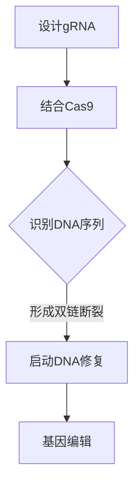
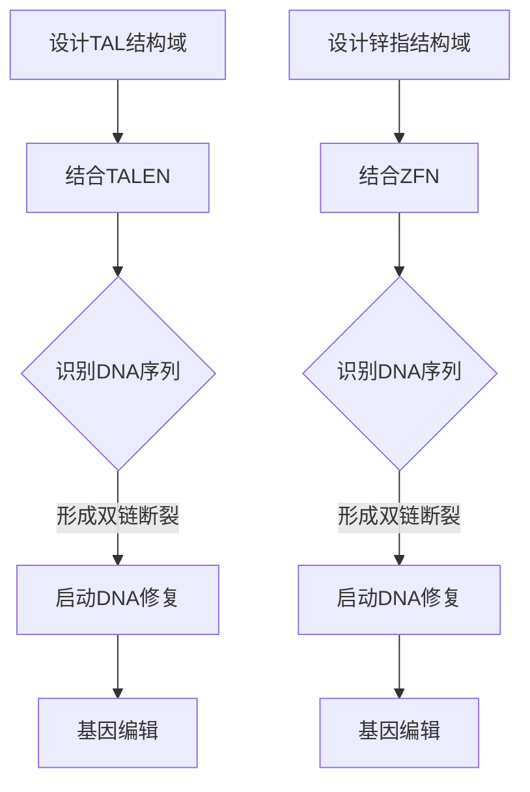

                 

### 背景介绍

#### 问题背景

在21世纪，随着科学技术的飞速发展，医疗技术已经取得了前所未有的突破。基因编辑技术的出现，尤其是CRISPR-Cas9技术的诞生，让人类对自身基因组的操控变得前所未有的简单和高效。这一技术不仅为治疗遗传性疾病带来了新的希望，也引发了关于人类进化和生命伦理的深刻讨论。

**核心概念术语说明**：
- **基因编辑**：指通过人为手段对生物体的基因进行修改，以达到特定的目的。
- **CRISPR-Cas9**：一种基于RNA导向的基因编辑技术，利用CRISPR系统中的Cas9核酸酶实现特定基因的切割和修改。
- **遗传性疾病**：由遗传因素引起的疾病，如囊性纤维症、地中海贫血等。

**问题描述**：
随着基因编辑技术的普及，一系列问题接踵而至。如何确保基因编辑技术的安全性和有效性？在治疗遗传性疾病的同时，是否会带来新的伦理挑战？基因编辑是否会加速人类进化，如果会，这将带来哪些影响？

**问题解决**：
为了应对这些问题，科学家和伦理学家开始积极探讨基因编辑技术的应用与伦理问题。例如，国际社会正在建立一系列的监管框架，以规范基因编辑技术的使用。同时，公众教育和透明沟通也是解决伦理问题的关键。

**边界与外延**：
基因编辑技术不仅涉及医学领域，还与农业、生物技术等多个行业紧密相关。此外，其对社会结构、经济模式以及文化价值观念的影响也是不容忽视的。

**概念结构与核心要素组成**：
基因编辑技术的基本概念结构包括基因、核酸酶、靶向序列等核心要素。而生命伦理的核心概念则包括自主权、公正性、尊重生命等。

#### 现代医疗技术的快速发展

**核心概念术语说明**：
- **现代医疗技术**：指21世纪以来发展的医疗技术，包括基因编辑、精准医疗、再生医学等。
- **精准医疗**：根据患者的个体差异，制定个性化的治疗方案。

**问题描述**：
现代医疗技术的快速发展，使得许多原本无法治愈的疾病成为了历史。然而，这种技术进步也带来了新的挑战。例如，如何在保证治疗效果的同时，确保医疗技术的安全性和可及性？

**问题解决**：
为了应对这些挑战，科学家们不断探索新的技术手段，如基因编辑、纳米技术等。同时，政府、医疗机构和科研机构也在加强合作，以推动医疗技术的发展和应用。

**边界与外延**：
现代医疗技术不仅限于治疗疾病，还涉及到疾病预防、健康管理等更广泛的领域。其发展不仅影响着医疗行业，还对公共卫生政策、经济模式等产生深远影响。

**概念结构与核心要素组成**：
现代医疗技术的基本概念结构包括基因、细胞、蛋白质等核心要素。而其发展的关键在于技术创新、数据支持和政策支持。

#### 基因编辑技术的突破

**核心概念术语说明**：
- **基因编辑技术**：通过人为手段对生物体的基因进行修改的技术。
- **CRISPR-Cas9**：一种基于RNA导向的基因编辑技术，利用CRISPR系统中的Cas9核酸酶实现特定基因的切割和修改。

**问题描述**：
基因编辑技术的突破，使得人类可以更加精准地修改基因，从而治疗遗传性疾病，甚至可能在未来实现人类进化的目标。然而，这一技术也引发了关于伦理和安全性的激烈讨论。

**问题解决**：
为了解决这些问题，科学家们采取了多种措施。例如，建立严格的伦理审查制度，制定相关的法律法规，以及进行广泛的社会宣传教育。

**边界与外延**：
基因编辑技术的应用范围广泛，包括医学、农业、生物技术等多个领域。其发展不仅影响科学界，还对政策制定、伦理讨论等产生深远影响。

**概念结构与核心要素组成**：
基因编辑技术的基本概念结构包括基因、核酸酶、靶向序列等核心要素。而其发展需要依赖技术创新、伦理审查和监管制度。

#### 人类进化的思考与伦理挑战

**核心概念术语说明**：
- **人类进化**：指人类从原始生命形式逐渐发展到现代形态的过程。
- **伦理挑战**：指基因编辑技术在应用于人类进化时面临的道德和伦理问题。

**问题描述**：
基因编辑技术的突破，让人类有可能通过修改基因来实现进化的目标。然而，这一技术的应用也引发了关于伦理的深刻讨论。例如，人类是否应该主动干预自己的进化过程？如果可以，我们应该遵循哪些伦理原则？

**问题解决**：
为了应对这些伦理挑战，科学家和伦理学家开始积极探讨。例如，提出伦理审查制度、制定相关法律法规，以及进行广泛的社会宣传教育。

**边界与外延**：
人类进化的思考不仅涉及基因编辑技术，还包括其他生物技术和医学技术。此外，其还涉及到社会、经济和文化等多个方面。

**概念结构与核心要素组成**：
人类进化的基本概念结构包括基因、自然选择、伦理原则等核心要素。而其发展需要依赖科技进步、伦理审查和社会共识。

### 核心概念与联系

#### 基因编辑技术的原理

基因编辑技术是一种通过人为手段对生物体的基因进行修改的技术。其基本原理是利用核酸酶（如CRISPR-Cas9系统中的Cas9核酸酶）对特定的基因序列进行切割，然后通过细胞自身的修复机制进行修复，从而实现对基因的精准修改。

**核心概念术语说明**：
- **核酸酶**：一种能够切割DNA或RNA的酶，如CRISPR系统中的Cas9核酸酶。
- **基因序列**：指DNA或RNA上的一系列核苷酸序列。

**基因编辑技术的原理**：
基因编辑技术的基本原理可以概括为以下几个步骤：

1. **设计靶向序列**：根据需要修改的基因序列，设计一段与目标序列高度互补的RNA序列（即引导RNA，gRNA）。
2. **结合核酸酶**：将设计好的gRNA与核酸酶（如Cas9）结合，形成一个核酸酶复合体。
3. **切割DNA**：核酸酶复合体识别并结合到目标DNA序列上，通过Cas9核酸酶的切割作用，在目标序列上形成双链断裂。
4. **DNA修复**：细胞通过非同源末端连接（NHEJ）或同源重组（HR）机制修复双链断裂，在这个过程中引入或删除特定的核苷酸，从而实现对基因的修改。

**概念属性特征对比表格**：

| 特性                   | CRISPR-Cas9 | TALEN     | ZFN       |
|------------------------|-------------|-----------|-----------|
| 核酸酶来源             | 大肠杆菌    | 蓝藻      | 金黄色毛癣菌 |
| 引导RNA设计灵活性      | 高          | 中        | 低        |
| 编辑效率               | 高          | 中        | 低        |
| 基因插入或删除的准确性 | 中等        | 低        | 低        |

**ER实体关系图架构的Mermaid流程图**：

#### 其他基因编辑技术

除了CRISPR-Cas9之外，还有其他几种常见的基因编辑技术，包括TALEN（转录激活因子样效应核酸酶）和ZFN（锌指核酸酶）。这些技术的基本原理与CRISPR-Cas9类似，都是利用核酸酶对目标DNA序列进行切割，但具体机制和应用场景有所不同。

**核心概念术语说明**：
- **TALEN**：一种基于转录激活因子样效应结构域的核酸酶。
- **ZFN**：一种基于锌指结构的核酸酶。

**TALEN和ZFN的原理**：
- **TALEN**：TALEN由一个转录激活因子（TAL）结构域和一个核酸酶结构域组成。TAL结构域负责识别特定的DNA序列，而核酸酶结构域负责切割DNA。通过设计特定的TAL结构域，可以实现对特定基因序列的靶向切割。
- **ZFN**：ZFN由一个锌指结构域和一个核酸酶结构域组成。锌指结构域可以与目标DNA序列特定的核苷酸结合，从而引导核酸酶对DNA进行切割。通过设计特定的锌指结构域，可以实现对特定基因序列的靶向切割。

**TALEN和ZFN的应用**：
- **TALEN**：TALEN在基因编辑中的应用相对较广，但由于其设计复杂性和成本较高，近年来逐渐被CRISPR-Cas9所取代。TALEN在某些特定的基因编辑场景中仍具有优势，例如在特定的物种中或需要高度特异性的编辑时。
- **ZFN**：ZFN在基因编辑中的应用较为局限，主要因其设计和操作相对复杂。然而，ZFN在一些特定的领域，如基因治疗和基因测序中，仍有其独特的应用价值。

**ER实体关系图架构的Mermaid流程图**：

### 生命伦理的核心概念

生命伦理学是研究人类生命活动的道德规范和价值观念的学科。在基因编辑技术的应用中，生命伦理的核心概念起着至关重要的作用。这些核心概念不仅帮助我们理解基因编辑技术的伦理挑战，还为制定相关的伦理准则和政策提供了基础。

**核心概念术语说明**：
- **自主权**：个人在医学决策中自由选择的能力。
- **公正性**：资源的公平分配。
- **尊重生命**：对生命的尊重和保护。
- **非男性化**：不伤害他人或社会。

**生命伦理的基本原则**：

1. **自主权**：
   - **概念**：自主权是指个人在医学决策中自由选择的能力，包括是否接受基因编辑治疗、选择哪种基因编辑技术等。
   - **重要性**：自主权是尊重个人权利和自由的核心，也是伦理决策的重要基础。

2. **公正性**：
   - **概念**：公正性是指资源的公平分配，确保所有人都能平等地获得基因编辑技术的益处。
   - **重要性**：公正性是维护社会和谐和公平的关键，避免因基因编辑技术带来的利益不均而引发的社会问题。

3. **尊重生命**：
   - **概念**：尊重生命是指对生命的尊重和保护，无论生命处于何种状态，都应受到尊重。
   - **重要性**：尊重生命是生命伦理学的基石，确保基因编辑技术不会对生命造成不必要的伤害。

4. **非男性化**：
   - **概念**：非男性化是指不伤害他人或社会，确保基因编辑技术的应用不会对社会或个体造成负面影响。
   - **重要性**：非男性化是伦理决策的重要原则，确保基因编辑技术的应用符合社会的道德和法律标准。

**基因编辑与伦理冲突**：

基因编辑技术的应用在带来巨大医疗潜力和社会效益的同时，也引发了一系列伦理冲突。以下是一些主要的伦理冲突：

1. **自主权与隐私**：
   - **冲突**：基因编辑技术的应用可能涉及个人基因信息的收集和使用，这引发了自主权与隐私的冲突。
   - **解决方案**：建立严格的隐私保护机制，确保个人基因信息的保密和安全。

2. **公平性与社会不平等**：
   - **冲突**：基因编辑技术的成本较高，可能导致资源分配不均，加剧社会不平等。
   - **解决方案**：政府和社会组织应提供经济援助和补贴，确保更多人能够负担基因编辑技术的费用。

3. **人类进化与自然法则**：
   - **冲突**：基因编辑技术有可能改变人类进化的自然过程，引发人类进化与自然法则的冲突。
   - **解决方案**：在应用基因编辑技术时，应遵循自然法则和伦理原则，避免对自然进化过程造成不可逆的破坏。

4. **人类尊严与风险**：
   - **冲突**：基因编辑技术的应用可能带来潜在的风险，损害人类尊严。
   - **解决方案**：建立严格的监管机制，确保基因编辑技术的安全性和有效性，避免不必要的风险。

### 人类进化的思考

**人类进化的历程**

人类进化是一个漫长而复杂的过程，从最早的原始生命形式逐渐演变为现代人类。这一过程中，基因起到了关键作用。基因编辑技术的出现，使得我们有可能主动干预这一进化过程，从而加速或改变人类进化的方向。

**核心概念术语说明**：
- **人类进化**：指人类从原始生命形式逐渐发展到现代形态的过程。
- **基因**：携带有遗传信息的分子，负责传递生物体的遗传特征。

**人类进化的主要阶段**：

1. **原核生物阶段**：
   - **概念**：人类进化始于约40亿年前，从原核生物逐渐演化而来。
   - **主要事件**：从单细胞生物到多细胞生物的过渡，以及细胞内结构的复杂化。

2. **真核生物阶段**：
   - **概念**：人类进化进入真核生物阶段，大约在20亿年前。
   - **主要事件**：细胞内器的形成，如线粒体和叶绿体，以及基因组的复杂性增加。

3. **灵长类动物阶段**：
   - **概念**：人类进化进入灵长类动物阶段，大约在6000万年前。
   - **主要事件**：脑容量的增加，手足分工的完善，以及工具使用能力的提升。

4. **早期人类阶段**：
   - **概念**：人类进化进入早期人类阶段，大约在250万年前。
   - **主要事件**：直立行走，工具制作和使用，以及语言能力的初步形成。

5. **现代人类阶段**：
   - **概念**：现代人类（智人）出现，大约在20万年前。
   - **主要事件**：脑容量的进一步增加，文化和社会结构的复杂性提升，以及适应环境变化的能力增强。

**基因编辑对未来人类进化的影响**

基因编辑技术的出现，为人类进化带来了新的可能性。通过基因编辑，我们可以主动改变人类基因组的特定部分，从而加速或改变人类进化的方向。以下是一些可能的场景：

1. **增强人类智力**：
   - **概念**：通过编辑与智力相关的基因，如脑神经生长因子基因，有可能提高人类的智力水平。
   - **潜在影响**：提升学习能力、解决问题能力，以及创新思维能力。

2. **增强人类身体素质**：
   - **概念**：通过编辑与身体素质相关的基因，如肌肉生长因子基因，有可能增强人类的体能和耐力。
   - **潜在影响**：提高运动能力、减少疾病风险，以及延长寿命。

3. **改善人类健康**：
   - **概念**：通过编辑与疾病相关的基因，如遗传性疾病基因，有可能消除或减轻疾病的困扰。
   - **潜在影响**：减少遗传性疾病的发生率，提高整体健康水平。

4. **优化人类适应环境的能力**：
   - **概念**：通过编辑与适应环境能力相关的基因，如抗病基因，有可能增强人类对不同环境的适应能力。
   - **潜在影响**：提高人类在极端环境下的生存能力，增强人类的竞争力。

然而，基因编辑技术的应用也带来了一系列伦理和社会问题。例如，如何确保基因编辑的安全性和有效性？如何平衡个体利益与社会利益？如何避免基因编辑引发的社会不平等？这些问题都需要我们深入思考和解决。

### 基因编辑技术的应用

基因编辑技术在现代医学中展现出巨大的潜力，不仅为疾病治疗带来了新的希望，还在农业和生物技术领域发挥了重要作用。以下将详细介绍基因编辑技术在疾病治疗、农业和生物技术中的应用。

#### 基因编辑在疾病治疗中的应用

基因编辑技术在治疗遗传性疾病方面具有显著优势。通过精准地修改致病基因，基因编辑技术有可能从根本上治愈这些疾病。

1. **遗传性疾病的基因治疗**：

   - **囊性纤维症**：囊性纤维症是一种常见的遗传性疾病，通过基因编辑技术，可以修复CFTR基因中的突变，恢复蛋白质的正常功能，从而治疗疾病。
   - **地中海贫血**：地中海贫血是一种由于基因突变导致的血红蛋白合成障碍。通过基因编辑技术，可以修复或替换异常基因，恢复正常血红蛋白的合成。

2. **非遗传性疾病的基因治疗**：

   - **癌症治疗**：基因编辑技术可以用于癌症治疗，通过编辑肿瘤抑制基因或增强免疫系统的攻击能力，提高治疗效果。
   - **神经退行性疾病**：如阿尔茨海默病和帕金森病，基因编辑技术有望通过修复或替换异常基因，减缓疾病进程，提高患者生活质量。

3. **基因编辑技术的挑战**：

   - **安全性问题**：基因编辑技术可能引起脱靶效应，即非目标基因发生编辑，这可能导致未知的副作用或疾病。
   - **技术成本**：基因编辑技术目前仍具有较高的成本，限制了其广泛应用。

#### 基因编辑在农业和生物技术中的应用

基因编辑技术在农业和生物技术领域也有广泛应用，有助于提高作物产量、抗病性和营养价值。

1. **基因编辑在农业中的应用**：

   - **提高作物产量**：通过编辑与作物生长和发育相关的基因，可以增强作物的生长速度和产量。
   - **增强作物抗病性**：基因编辑技术可以增强作物对病虫害的抵抗力，减少农药的使用。
   - **提高作物营养价值**：通过编辑与营养相关的基因，可以增加作物的营养成分，如维生素和矿物质。

2. **基因编辑在生物技术中的应用**：

   - **药物研发**：基因编辑技术可以用于药物研发，通过修改特定基因，提高药物的疗效或降低副作用。
   - **生物制造**：基因编辑技术可以用于生物制造，通过改造微生物或细胞，生产各种生物制品，如蛋白质、酶和药物。

3. **基因编辑技术的挑战**：

   - **食品安全问题**：基因编辑产生的转基因作物可能对人类和生态系统产生未知的影响，需要严格的安全评估。
   - **伦理和社会问题**：基因编辑技术的应用引发了一系列伦理和社会问题，如基因改造作物的标签和消费者接受度。

### 基因编辑技术的社会影响

基因编辑技术的应用不仅带来了医学和农业的突破，同时也对社会产生了深远的影响。以下将从人类健康、社会伦理和经济影响三个方面探讨基因编辑技术的社会影响。

#### 对人类健康的影响

基因编辑技术在医疗领域的应用为许多遗传性疾病提供了新的治疗手段。例如，囊性纤维症、地中海贫血等遗传性疾病通过基因编辑技术有望实现根治。此外，基因编辑技术在癌症治疗和神经退行性疾病治疗中也展现出巨大的潜力。然而，基因编辑技术的应用也带来了一些潜在的健康风险，如脱靶效应和基因编辑引起的新疾病。

1. **治疗遗传性疾病的潜力**：
   - **基因修复**：基因编辑技术可以通过修复或替换异常基因，治疗遗传性疾病。
   - **个性化医疗**：基因编辑技术可以针对个体的基因特征，制定个性化的治疗方案。

2. **潜在的健康风险**：
   - **脱靶效应**：基因编辑技术可能引起非目标基因的编辑，导致未知的副作用或疾病。
   - **基因突变积累**：长期使用基因编辑技术可能导致基因突变积累，影响人类健康。

#### 对社会伦理的影响

基因编辑技术的应用引发了广泛的伦理争议。如何平衡个人利益与社会利益，如何防止基因编辑技术被滥用，这些都是需要解决的伦理问题。

1. **伦理冲突**：
   - **自主权与隐私**：基因编辑技术的应用可能涉及个人基因信息的收集和使用，引发自主权与隐私的冲突。
   - **公平性与社会不平等**：基因编辑技术的成本较高，可能导致资源分配不均，加剧社会不平等。

2. **伦理原则**：
   - **尊重生命**：基因编辑技术的应用需要尊重生命，避免对生命造成不必要的伤害。
   - **公正性**：基因编辑技术的应用应确保资源的公平分配，避免社会不平等。

#### 经济影响

基因编辑技术的应用不仅对医疗和农业产生了重大影响，也对全球经济产生了重要影响。基因编辑技术的商业化应用有望带来巨大的经济收益，同时也带来了一系列的经济挑战。

1. **经济收益**：
   - **医疗市场**：基因编辑技术的应用有望推动医疗市场的发展，带来巨大的经济收益。
   - **农业市场**：基因编辑技术可以提高作物产量和抗病性，提高农业经济效益。

2. **经济挑战**：
   - **成本问题**：基因编辑技术的成本较高，限制了其广泛应用。
   - **市场垄断**：基因编辑技术的商业化应用可能引发市场垄断，影响公平竞争。

### 基因编辑的监管与伦理问题

基因编辑技术的快速发展带来了巨大的医疗、农业和生物技术潜力，但同时也引发了广泛的伦理和社会问题。为了确保基因编辑技术的安全和有效应用，国际社会正在建立一系列的监管框架。以下将介绍国际监管框架、国内外政策比较以及应对伦理问题的策略。

#### 国际监管框架

国际社会对基因编辑技术的监管日益重视，多个国际组织和各国政府纷纷出台了相应的法规和指导原则。以下是一些主要的国际监管框架：

1. **国际人类基因组编辑峰会**：
   - **2015年**：在美国华盛顿召开，旨在讨论基因编辑技术的伦理、法律和社会问题，并制定全球基因编辑指南。
   - **2022年**：在意大利那不勒斯召开，进一步强调了基因编辑技术的安全性、有效性和伦理问题。

2. **国际卫生组织（WHO）**：
   - **2021年**：发布《人类基因组编辑指导原则》，强调基因编辑技术的安全性、透明性和公众参与。

3. **美国国家卫生研究院（NIH）**：
   - **2020年**：发布《基因编辑研究伦理指导原则》，强调基因编辑研究的伦理审查和透明度。

4. **欧洲委员会**：
   - **2021年**：发布《基因编辑技术：监管框架和伦理指南》，明确了基因编辑技术的监管要求和伦理原则。

#### 国内外政策比较

不同国家和地区在基因编辑技术的监管政策上存在一定差异。以下对比国内外政策的一些主要方面：

1. **监管严格程度**：
   - **国内**：中国对基因编辑技术的监管相对严格，要求进行严格的伦理审查和审批程序。
   - **国外**：美国和欧洲在基因编辑技术的监管上相对宽松，但同样强调伦理审查和公众参与。

2. **应用范围**：
   - **国内**：中国主要关注基因编辑技术在医学和农业中的应用，对人类胚胎基因编辑持严格禁止态度。
   - **国外**：美国和欧洲在人类胚胎基因编辑的研究上也持谨慎态度，但对动物和植物基因编辑的应用相对开放。

3. **政策变化**：
   - **国内**：随着基因编辑技术的快速发展，中国政策也在不断调整和完善，以适应新的技术发展需求。
   - **国外**：美国和欧洲的政策也在不断更新，以应对基因编辑技术带来的新挑战。

#### 应对伦理问题的策略

为了应对基因编辑技术带来的伦理问题，科学家、伦理学家和政策制定者采取了多种策略。以下是一些主要的应对策略：

1. **伦理审查制度**：
   - **建立严格的伦理审查制度**：确保基因编辑技术的应用符合伦理原则，避免潜在的风险和滥用。

2. **公众参与与教育**：
   - **加强公众参与与教育**：提高公众对基因编辑技术的认知和理解，增强公众对基因编辑技术的信任。

3. **国际合作与交流**：
   - **加强国际合作与交流**：促进国际间的政策协调和科学合作，共同应对基因编辑技术带来的全球性挑战。

4. **法律与政策支持**：
   - **完善法律与政策支持**：制定相应的法律法规，确保基因编辑技术的安全、有效和公平应用。

### 基因编辑对人类进化的影响

基因编辑技术对人类进化具有深远的影响，既带来了新的机遇，也引发了一系列伦理和社会问题。以下将从加速人类进化的可能性、潜在的好处和风险三个方面探讨基因编辑对人类进化的影响。

#### 加速人类进化的可能性

基因编辑技术提供了前所未有的手段，可以主动干预人类基因组的特定部分，从而加速或改变人类进化的方向。以下是一些可能的场景：

1. **基因优化**：
   - **提高智力**：通过编辑与智力相关的基因，如脑神经生长因子基因，有可能提高人类的智力水平。
   - **增强体能**：通过编辑与体能相关的基因，如肌肉生长因子基因，有可能增强人类的体能和耐力。

2. **健康改善**：
   - **消除疾病**：通过编辑与疾病相关的基因，如遗传性疾病基因，有可能消除或减轻疾病的困扰。
   - **延长寿命**：通过编辑与寿命相关的基因，有可能延长人类的寿命。

3. **适应环境**：
   - **改善适应能力**：通过编辑与适应环境能力相关的基因，如抗病基因，有可能增强人类对不同环境的适应能力。

#### 潜在的好处

基因编辑技术的应用有可能带来以下好处：

1. **提高生活质量**：
   - **减少疾病困扰**：通过基因编辑，可以消除或减轻遗传性疾病，提高患者的生活质量。
   - **增强健康水平**：通过基因编辑，可以增强人类的体能和耐力，减少疾病风险。

2. **促进人类发展**：
   - **智力提升**：通过基因编辑，可以提高人类的智力水平，增强学习能力和创造力。
   - **环境适应**：通过基因编辑，可以增强人类对环境的适应能力，提高生存能力。

3. **社会进步**：
   - **减少社会不平等**：通过基因编辑，可以消除遗传性疾病带来的社会不平等，提高社会整体福祉。
   - **提升经济竞争力**：通过基因编辑，可以增强人类的体能和智力，提高经济竞争力。

#### 潜在的风险

尽管基因编辑技术带来了许多潜在的好处，但也存在一系列潜在的风险，需要谨慎评估和应对：

1. **健康风险**：
   - **脱靶效应**：基因编辑技术可能引起脱靶效应，即非目标基因发生编辑，导致未知的副作用或疾病。
   - **基因突变积累**：长期使用基因编辑技术可能导致基因突变积累，影响人类健康。

2. **伦理风险**：
   - **人类尊严**：基因编辑可能损害人类尊严，引发关于人类本质的深刻讨论。
   - **遗传不平等**：基因编辑可能导致遗传不平等，加剧社会不平等。

3. **社会风险**：
   - **技术垄断**：基因编辑技术的商业化应用可能引发市场垄断，影响公平竞争。
   - **文化冲突**：基因编辑技术可能引发文化冲突，影响社会稳定。

#### 伦理问题的应对策略

为了应对基因编辑技术带来的伦理问题，需要采取一系列的策略：

1. **伦理审查制度**：
   - **建立严格的伦理审查制度**：确保基因编辑技术的应用符合伦理原则，避免潜在的风险和滥用。

2. **公众参与与教育**：
   - **加强公众参与与教育**：提高公众对基因编辑技术的认知和理解，增强公众对基因编辑技术的信任。

3. **国际合作与交流**：
   - **加强国际合作与交流**：促进国际间的政策协调和科学合作，共同应对基因编辑技术带来的全球性挑战。

4. **法律与政策支持**：
   - **完善法律与政策支持**：制定相应的法律法规，确保基因编辑技术的安全、有效和公平应用。

### 伦理问题的应对策略

面对基因编辑技术带来的伦理挑战，我们需要采取一系列的应对策略，以确保其安全、有效和公正地应用。以下从伦理原则的应用、公众参与与教育、以及国际与国内政策三个方面进行详细讨论。

#### 伦理原则的应用

伦理原则是指导基因编辑技术应用的基本准则，主要包括自主权、公正性、尊重生命和非男性化等。以下是如何具体应用这些原则：

1. **自主权**：
   - **知情同意**：在基因编辑技术的应用过程中，必须确保患者或参与者充分了解相关风险和利益，并在此基础上做出知情同意。
   - **隐私保护**：基因编辑涉及个人基因信息，需要建立严格的隐私保护机制，确保个人信息的保密和安全。

2. **公正性**：
   - **公平分配**：确保基因编辑技术的资源分配公平，避免因技术进步导致的社会不平等。
   - **社会参与**：在政策制定和伦理审查过程中，广泛征求社会各界意见，确保政策的公正性和透明度。

3. **尊重生命**：
   - **谨慎使用**：基因编辑技术的应用必须以尊重生命为前提，避免不必要的风险和伤害。
   - **全生命周期关注**：从基因编辑技术的研发、应用到后续监测，都要确保对人类健康和生态环境的长期影响。

4. **非男性化**：
   - **无害原则**：确保基因编辑技术的应用不会对人类或社会造成不必要的伤害。
   - **社会责任**：企业和科研机构在应用基因编辑技术时，要承担社会责任，确保技术的安全性和可靠性。

#### 公众参与与教育

公众参与与教育是应对基因编辑技术伦理问题的关键环节。以下是如何具体实施：

1. **公众参与**：
   - **透明沟通**：政府、科研机构和医疗机构应加强与公众的沟通，及时公开基因编辑技术的最新研究进展和潜在风险。
   - **公众咨询**：在制定相关政策时，应广泛征求公众意见，确保政策符合公众利益和期望。

2. **教育普及**：
   - **科普宣传**：通过各种渠道，如媒体、教育机构和社交媒体，普及基因编辑技术的基本知识和伦理原则。
   - **专业培训**：对医护人员、科研人员和公众进行专业培训，提高他们对基因编辑技术的认知和理解。

3. **社会监督**：
   - **建立监督机制**：建立独立的伦理监督机构，对基因编辑技术的应用进行全程监督，确保其符合伦理要求。

#### 国际与国内政策

国际与国内政策在规范和引导基因编辑技术的应用中起着至关重要的作用。以下是如何具体实施：

1. **国际政策协调**：
   - **共享监管经验**：通过国际组织和多边合作，共享基因编辑技术的监管经验和技术标准，确保全球范围内的协调和一致性。
   - **国际法规制定**：在联合国、世界卫生组织等国际机构的框架下，制定统一的基因编辑技术法规和伦理准则。

2. **国内政策制定**：
   - **立法保障**：制定相关法律法规，明确基因编辑技术的应用范围、伦理审查程序和法律责任。
   - **政策支持**：政府应提供资金和政策支持，促进基因编辑技术的研发和应用，同时确保其安全性和伦理合规性。

3. **政策执行与监督**：
   - **加强监管**：建立严格的监管机制，对基因编辑技术的应用进行全程监督，确保其符合伦理和安全要求。
   - **动态调整**：根据基因编辑技术的发展和实际应用情况，动态调整相关政策和法规，以适应新的技术挑战。

通过上述策略，我们可以在确保基因编辑技术安全、有效和公正应用的同时，最大限度地减少潜在的伦理和社会风险。

### 基因编辑技术在中国的应用与发展

#### 中国基因编辑技术的现状

中国基因编辑技术的研究和应用在全球范围内处于领先地位。近年来，中国在基因编辑技术的研发、临床应用和产业化方面取得了显著进展。

**技术突破与应用**：

1. **CRISPR-Cas9技术**：中国科学家在CRISPR-Cas9技术的研究上取得了多项重要突破。例如，中国在基因编辑小鼠、基因编辑水稻等方面取得了重要成果。

2. **临床应用**：中国已经开展了多个基因编辑临床实验，如基因编辑治疗β地中海贫血和先天性失聪等。这些临床实验为基因编辑技术在治疗遗传性疾病提供了宝贵的经验和数据。

3. **产业化进程**：中国基因编辑技术产业化进程加快，多个基因编辑企业成立，并获得了大量投资。例如，华大基因、百奥泰等企业在基因编辑药物研发方面取得了重要进展。

**政策与法规**：

1. **伦理审查**：中国在基因编辑技术的伦理审查方面建立了严格的制度。所有涉及人类基因编辑的临床实验必须通过国家科技部、国家卫生健康委员会等相关部门的伦理审查。

2. **监管框架**：中国政府发布了多项法规和政策，规范基因编辑技术的应用。例如，《人类基因组编辑研究管理办法》明确了基因编辑研究的监管要求和审批程序。

3. **国际合作**：中国积极参与国际基因编辑技术的合作与交流，参与了多个国际基因编辑研究项目，并推动建立全球基因编辑技术监管框架。

#### 中国基因编辑技术的前景

中国基因编辑技术在未来具有广阔的发展前景，但也面临一定的挑战。

**未来发展方向**：

1. **精准医疗**：基因编辑技术有望在精准医疗领域发挥重要作用，为个性化治疗提供新手段。

2. **基因治疗**：基因编辑技术在基因治疗中的应用前景广阔，有望治愈许多遗传性疾病。

3. **农业和生物技术**：基因编辑技术在农业和生物技术领域具有巨大潜力，可以提高作物产量和抗病性，推动生物制造和环保技术的发展。

**面临的挑战与机遇**：

1. **技术挑战**：基因编辑技术仍面临脱靶效应、基因突变等风险，需要进一步提高技术精度和安全性。

2. **伦理挑战**：基因编辑技术的伦理争议仍然存在，需要建立更加完善的伦理审查制度和公众沟通机制。

3. **政策挑战**：基因编辑技术的政策环境需要进一步完善，以确保其安全、有效和公正应用。

4. **经济机遇**：基因编辑技术具有巨大的市场潜力，有望推动医疗、农业和生物技术产业的快速发展，带来新的经济增长点。

### 小结与展望

基因编辑技术作为21世纪最具革命性的科技之一，正逐渐改变医疗、农业和生物技术的格局。其应用不仅为疾病治疗、基因疗法和个性化医疗带来了新的希望，还推动了农业生产的优化和生物制品的创新。然而，基因编辑技术的快速发展也带来了前所未有的伦理和社会挑战。

首先，基因编辑技术具有显著的潜力，可以治疗许多遗传性疾病，提高人类健康水平。然而，其应用也引发了对自主权、隐私、公平性和尊严的伦理争议。如何确保基因编辑技术的安全、有效和公正应用，是当前亟需解决的关键问题。

其次，基因编辑技术的商业化应用和产业化进程带来了巨大的经济机遇，但也伴随着技术垄断和市场不平等的风险。政策制定者需要平衡技术创新与市场公平，确保基因编辑技术能够惠及广大民众。

展望未来，基因编辑技术将在精准医疗、基因治疗和农业优化等领域继续发挥重要作用。随着技术的不断进步和伦理审查机制的完善，我们有望在保障安全和伦理的前提下，充分利用基因编辑技术的潜力，为人类健康和社会发展做出更大贡献。

总之，基因编辑技术是一项充满希望和挑战的领域。我们需要在科学、伦理和社会层面共同努力，确保其安全、有效和公正地应用，为人类的未来带来更多的机遇和福祉。

### 主要观点回顾

本文详细探讨了基因编辑技术、生命伦理和人类进化之间的关系。首先，我们介绍了基因编辑技术的背景、原理和不同类型（如CRISPR-Cas9、TALEN和ZFN）。随后，我们分析了生命伦理的核心概念，包括自主权、公正性、尊重生命和非男性化，并探讨了基因编辑技术引发的伦理冲突。

接着，我们回顾了人类进化的历程，探讨了基因编辑技术对未来人类进化的潜在影响，包括智力、体能和健康等方面的优化。随后，我们详细介绍了基因编辑技术在疾病治疗、农业和生物技术中的应用，以及其对社会、经济和伦理的影响。

在探讨基因编辑技术的社会影响时，我们强调了其潜在的健康风险、伦理挑战和经济机遇。此外，我们还介绍了国际和国内在基因编辑技术监管和政策制定方面的进展。

最后，我们提出了应对基因编辑技术伦理问题的策略，包括伦理审查、公众参与与教育、政策支持等。同时，我们回顾了中国在基因编辑技术领域的现状和前景，以及其面临的挑战与机遇。

### 基因编辑技术的未来发展趋势

基因编辑技术的未来发展趋势将受到科技进步、政策支持和伦理审查等多方面因素的影响。以下是一些可能的发展方向：

1. **技术进步**：
   - **编辑精度提高**：随着对核酸酶和基因编辑机制的深入研究，未来基因编辑技术的编辑精度将进一步提高，降低脱靶效应的风险。
   - **编辑工具多样化**：除了CRISPR-Cas9，其他基因编辑工具如TALEN、ZFN和基编辑系统（如Base Editing）也将不断发展，提供更多样化的编辑选择。

2. **应用拓展**：
   - **医学应用**：基因编辑技术在疾病治疗中的潜力将进一步发挥，特别是针对遗传性疾病和癌症的治疗。同时，个性化医疗和精准医疗将成为重要发展方向。
   - **农业和生物技术**：基因编辑技术在农业中的应用将更加广泛，提高作物产量、抗病性和营养价值。在生物技术领域，基因编辑技术将推动新药研发和生物制造的发展。

3. **政策支持**：
   - **监管框架完善**：全球各国将继续完善基因编辑技术的监管框架，确保其安全、有效和公正应用。国际间合作也将加强，推动建立统一的监管标准。
   - **资金投入**：政府和私营部门将继续加大对基因编辑技术的研发和产业化投入，推动技术创新和产业化进程。

4. **伦理审查与公众参与**：
   - **伦理审查制度**：伦理审查将在基因编辑技术的研发和应用中发挥更加重要的作用，确保其符合伦理原则和公众利益。
   - **公众教育**：通过加强公众教育，提高公众对基因编辑技术的认知和理解，增强社会对基因编辑技术的接受度。

5. **国际合作**：
   - **跨国研究合作**：全球科研机构和企业将加强合作，共同应对基因编辑技术带来的全球性挑战，推动技术进步和应用推广。
   - **全球治理**：国际组织将发挥更大作用，推动全球基因编辑技术的治理和规范，确保技术应用的全球一致性。

### 对生命伦理的思考与建议

在基因编辑技术的快速发展背景下，生命伦理问题日益凸显。为了确保基因编辑技术的安全、有效和公正应用，我们需要在伦理原则、政策制定和社会参与等方面进行深入思考和探讨。

1. **尊重生命与自主权**：
   - **尊重生命**：基因编辑技术的应用必须以尊重生命为前提，确保对人类健康和生态系统的长期影响。在临床应用中，要重视患者的知情同意和自主选择权，确保其充分了解风险和利益。
   - **自主权**：加强公众教育和透明沟通，提高公众对基因编辑技术的认知和理解，增强其对自主权的保护。

2. **公正性与资源分配**：
   - **公平分配**：确保基因编辑技术的资源分配公平，避免因技术进步导致的社会不平等。政府和社会组织应提供经济援助和补贴，确保更多人能够负担基因编辑技术的费用。
   - **伦理审查**：在基因编辑技术的研发和应用过程中，建立严格的伦理审查制度，确保项目的公正性和透明度。

3. **安全性与风险管理**：
   - **风险监测**：建立长期监测机制，及时评估基因编辑技术的安全性和潜在风险，确保其应用符合伦理和安全要求。
   - **应急预案**：制定基因编辑技术事故的应急预案，确保在出现问题时能够迅速应对，最大限度地减少损害。

4. **社会参与与公众沟通**：
   - **公众参与**：在政策制定和伦理审查过程中，广泛征求公众意见，确保政策符合社会利益和期望。
   - **科普宣传**：通过各种渠道普及基因编辑技术的基本知识和伦理原则，提高公众的科技素养和伦理意识。

5. **国际合作与交流**：
   - **国际协调**：加强国际间的政策协调和科学合作，推动基因编辑技术的全球治理和规范。
   - **伦理教育**：加强国际间的伦理教育，培养具有全球视野的伦理学家和科学家，共同应对基因编辑技术带来的全球性挑战。

总之，基因编辑技术的应用既带来了巨大的医疗、农业和生物技术潜力，也引发了深刻的伦理和社会问题。我们需要在尊重生命、保障公正、确保安全、加强社会参与和国际合作的基础上，制定科学的政策和伦理原则，确保基因编辑技术的安全、有效和公正应用，为人类社会的可持续发展做出贡献。

