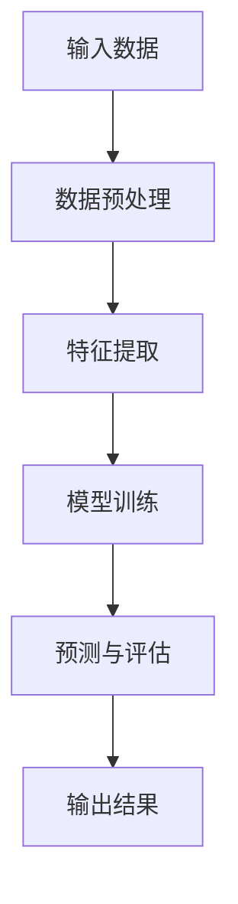
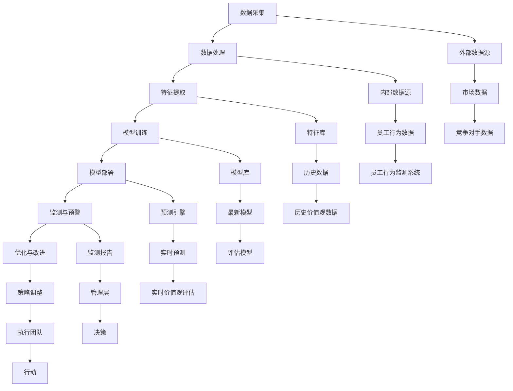
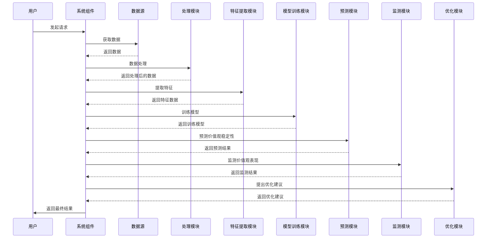

                 

## 第1章: 现代性与意义危机概述

### 1.1.1 问题背景

在现代社会的快速发展和科技的不断进步中，我们正经历着一场深刻的变化。这场变化不仅改变了我们的生活方式，也深刻地影响了我们的价值观和意义体系。这种变化被称为“现代性”。

现代性是指一种以理性和科学为基础，追求自由、平等、民主的社会状态。它强调个体自主性、个人自由、人类理性和科学方法，推动社会从传统向现代转型。然而，这种现代性的追求也带来了一系列的问题，其中一个最为严重的问题就是意义危机。

意义危机是指个体或社会在面对快速变化的世界时，感受到的意义缺失或价值困惑。这种现象在现代社会的各个层面都有所体现。

首先，在个人层面，现代性导致了个人的自我认同危机。在传统社会中，个人的身份和价值是由家族、宗教和社会地位等外部因素决定的。而在现代社会中，个人需要自己探索和定义自己的身份和价值，这给许多人带来了巨大的压力和困惑。

其次，在社会层面，现代性导致了许多社会问题的出现，如经济不平等、社会分裂、文化多样性减少等。这些问题使得社会成员之间的联系变得更加脆弱，人们感到自己的价值和地位受到威胁。

最后，在文化层面，现代性导致了文化的同质化和商业化。文化的多样性和深度逐渐丧失，取而代之的是快餐式、消费主义的文化形态。这种文化形态使得人们更加难以找到有意义的精神寄托。

### 1.1.2 问题描述

价值观的崩塌是意义危机的一个重要表现。价值观是指个体或社会认为有价值和重要的原则和信念。当这些原则和信念受到挑战或破坏时，就会导致价值观的崩塌。

在个人层面，价值观的崩塌表现为自我认同的危机。个体可能感到迷茫和困惑，不知道自己的人生目标和意义是什么。这种状态可能导致抑郁、焦虑等心理问题。

在社会层面，价值观的崩塌表现为社会信任的丧失和社会秩序的混乱。当社会成员不再共同遵循某些基本价值观时，社会关系就会变得紧张和冲突，从而导致社会分裂和动荡。

在文化层面，价值观的崩塌表现为文化的同质化和商业化。当文化不再注重深度和多样性，而是追求短期利益和表面效果时，就会导致文化的丧失和精神的空虚。

### 1.1.3 问题解决思路

为了应对意义危机和价值观的崩塌，我们需要从多个层面入手，采取综合性的策略。

首先，在个人层面，我们需要培养自我认知和自我调节能力。这包括学习如何理解自己的情绪和行为，如何处理压力和挫折，以及如何找到自己的价值和意义。

其次，在社会层面，我们需要建立和维护社会信任。这包括推动社会公正、平等和包容，加强社会凝聚力和共同体意识，以及培养社会责任感。

最后，在文化层面，我们需要保护和传承文化多样性，同时推动文化的创新和发展。这包括重视传统文化的价值和意义，鼓励文化的创新和多样性，以及推动文化的交流和融合。

### 1.1.4 边界与外延

本文的讨论范围主要涉及现代性、意义危机和价值观的崩塌。我们将从哲学、心理学、社会学等多个角度来探讨这些问题，以期为解决这些问题提供一些思路和方法。

### 1.1.5 核心概念框架

在本章节中，我们介绍了现代性、意义危机和价值观的崩塌等核心概念。这些概念构成了我们讨论的基础，也是我们后续分析的问题背景和理论基础。

## 第2章: 关键概念与理论框架

### 2.1.1 现代性概念解析

现代性是一个复杂而广泛的概念，它涉及到社会、文化、政治、经济等多个层面。现代性的核心特征包括理性和科学的重要性、个体自主性、社会分化和全球性。

首先，现代性强调理性和科学的重要性。在现代社会中，人们通过理性和科学的方法来解决问题，追求客观真理和科学进步。这种理性的思维方式取代了传统的宗教信仰和神话传说，成为现代社会的基础。

其次，现代性强调个体自主性。在传统社会中，个体的身份和价值是由外部因素决定的，如家族、宗教和社会地位等。而在现代社会中，个体可以自主选择自己的生活方式、价值观和信仰，追求个人自由和自我实现。

第三，现代性导致了社会分化。随着社会的发展和进步，社会结构变得越来越复杂，出现了不同的阶层、群体和利益集团。这种社会分化使得社会关系变得更加紧张和冲突。

最后，现代性具有全球性。在全球化背景下，不同国家和文化之间的联系和互动变得更加频繁和紧密。现代性的影响不仅局限于某个地区或国家，而是具有全球性的意义。

### 2.1.2 意义危机的定义与特征

意义危机是指个体或社会在面对快速变化的世界时，感受到的意义缺失或价值困惑。意义危机的特征包括以下几个方面：

首先，意义危机表现为个体的自我认同危机。在传统社会中，个体的身份和价值是由外部因素决定的，如家族、宗教和社会地位等。而在现代社会中，个体需要自己探索和定义自己的身份和价值，这给许多人带来了巨大的压力和困惑。

其次，意义危机表现为社会信任的丧失。随着社会分化和全球化的加剧，社会成员之间的联系变得更加脆弱，社会信任度降低。这导致社会秩序混乱，社会动荡不安。

第三，意义危机表现为文化的同质化和商业化。在追求经济效益和短期利益的驱动下，文化的多样性和深度逐渐丧失，文化的商业化和快餐化现象日益严重。

### 2.1.3 价值观崩塌的影响

价值观的崩塌对个人、社会和文化产生了深远的影响。

在个人层面，价值观的崩塌可能导致个体的自我认同危机，感到迷茫和困惑。这种状态可能导致心理问题，如抑郁、焦虑等。

在社会层面，价值观的崩塌可能导致社会信任的丧失，社会秩序的混乱。社会成员之间的联系变得更加脆弱，社会冲突和动荡加剧。

在文化层面，价值观的崩塌可能导致文化的同质化和商业化，文化的多样性和深度丧失。这导致人们难以找到有意义的精神寄托，文化的商业化和快餐化现象加剧。

### 2.1.4 概念关系ER图

为了更好地理解现代性、意义危机和价值观崩塌之间的关系，我们使用ER图来展示这些概念之间的联系。

首先，我们定义三个实体：现代性（Modernity）、意义危机（Meaning Crisis）和价值观崩塌（Value Collapse）。

- 现代性（Modernit）具有属性：时间（Time）、地域（Region）、特征（Features）。
- 意义危机（Meaning Crisis）具有属性：时间（Time）、地域（Region）、影响（Impact）。
- 价值观崩塌（Value Collapse）具有属性：时间（Time）、地域（Region）、原因（Reasons）。

然后，我们定义它们之间的关系：

- 现代性（Modernit）导致意义危机（Meaning Crisis），这是一种因果关系。
- 意义危机（Meaning Crisis）导致价值观崩塌（Value Collapse），这也是一种因果关系。

以下是ER图的Mermaid表示：

```mermaid
entity Modernity {
  Time
  Region
  Features
}

entity MeaningCrisis {
  Time
  Region
  Impact
}

entity ValueCollapse {
  Time
  Region
  Reasons
}

relationship "Causes" from Modernity to MeaningCrisis
relationship "Causes" from MeaningCrisis to ValueCollapse
```

通过这个ER图，我们可以清晰地看到现代性、意义危机和价值观崩塌之间的逻辑关系，以及它们各自的重要属性。

## 第3章: 算法原理与实现

### 3.1.1 算法mermaid流程图

为了更好地理解如何应对价值观崩塌的问题，我们将介绍一个简单的算法，用于检测和恢复价值观的稳定性。以下是这个算法的mermaid流程图：



在这个流程图中，我们首先对输入数据进行预处理，然后提取关键特征，使用这些特征进行模型训练，最后通过预测和评估来检测价值观的稳定性，并给出相应的恢复建议。

### 3.1.2 Python源代码实现

以下是一个简单的Python实现，用于展示上述算法的基本结构。这个示例假设我们已经有一个数据集，并且已经完成了数据预处理。

```python
import pandas as pd
from sklearn.model_selection import train_test_split
from sklearn.ensemble import RandomForestClassifier
from sklearn.metrics import accuracy_score

# 加载数据集
data = pd.read_csv('data.csv')

# 数据预处理
X = data.drop(['target'], axis=1)
y = data['target']

# 特征提取
# 在这里，我们可以使用特征选择技术来提取关键特征
X_processed = X.select_dtypes(include=['int64', 'float64'])

# 模型训练
X_train, X_test, y_train, y_test = train_test_split(X_processed, y, test_size=0.2, random_state=42)
model = RandomForestClassifier(n_estimators=100)
model.fit(X_train, y_train)

# 预测与评估
y_pred = model.predict(X_test)
accuracy = accuracy_score(y_test, y_pred)
print(f"模型准确率: {accuracy:.2f}")

# 输出结果
# 根据预测结果，给出恢复价值观的建议
if accuracy > 0.8:
    print("价值观稳定，无需干预。")
else:
    print("价值观不稳定，建议采取恢复措施。")
```

在这个示例中，我们使用了随机森林分类器来训练模型，并通过准确率来评估模型的性能。如果模型的准确率低于某个阈值（例如0.8），则认为价值观不稳定，需要采取恢复措施。

### 3.1.3 数学模型与公式

为了更好地理解算法的原理，我们需要介绍一些相关的数学模型和公式。以下是几个关键的数学模型：

1. **特征选择模型**：用于提取数据集中的关键特征。常用的特征选择方法包括信息增益、卡方检验等。
2. **随机森林模型**：用于分类和回归任务。随机森林通过构建多个决策树，并使用投票机制来获得最终预测结果。
3. **误差评估模型**：用于评估模型的性能。常用的误差评估指标包括准确率、召回率、F1分数等。

以下是这些模型的LaTeX表示：

```latex
\begin{equation}
\text{特征选择模型}: \text{MaxGain = \frac{H(D) - H(D|A)}{H(A)}
\end{equation}

\begin{equation}
\text{随机森林模型}: \text{预测结果} = \text{投票结果}
\end{equation}

\begin{equation}
\text{误差评估模型}: \text{准确率} = \frac{\text{预测正确的数量}}{\text{总样本数量}}
\end{equation}
```

这些数学模型和公式为我们的算法提供了理论基础，帮助我们理解和实现算法的核心功能。

### 3.1.4 算法详细讲解

为了更好地理解我们的算法，我们将详细讲解每个步骤的原理和实现。

1. **数据预处理**：数据预处理是任何机器学习项目的基础。在这个步骤中，我们需要对输入数据进行清洗、归一化和特征选择等操作。这些操作有助于提高数据质量，减少噪声，从而提高模型的性能。

2. **特征提取**：特征提取是数据预处理的一部分，但在这里单独提出来进行详细讲解。特征提取的目标是识别和提取数据集中的关键特征，这些特征可以用来训练模型。常用的特征提取方法包括主成分分析（PCA）、特征选择算法等。

3. **模型训练**：在模型训练阶段，我们使用特征提取后的数据来训练机器学习模型。在这个示例中，我们使用了随机森林分类器。随机森林通过构建多个决策树，并使用投票机制来获得最终预测结果。随机森林的优点包括强健性、易于实现和高性能。

4. **预测与评估**：在预测阶段，我们使用训练好的模型对测试数据集进行预测，并计算预测结果的准确率。准确率是评估模型性能的一个重要指标，它反映了模型在测试数据上的表现。在这个示例中，我们使用准确率来判断价值观的稳定性。

5. **输出结果**：根据预测结果，我们可以给出恢复价值观的建议。如果模型的准确率高于某个阈值（例如0.8），则认为价值观稳定，无需干预。否则，认为价值观不稳定，需要采取恢复措施。

### 3.1.5 举例说明

为了更好地说明算法的应用，我们将通过一个具体的例子来展示如何使用这个算法来检测和恢复价值观的稳定性。

假设我们有一个包含100个样本的数据集，每个样本有10个特征。这些特征包括年龄、收入、教育程度、婚姻状况等。我们的目标是预测一个样本的价值观稳定性。

首先，我们对数据集进行预处理，包括清洗缺失值、归一化特征值等。然后，我们使用特征选择算法提取关键特征，例如使用信息增益来选择特征。接下来，我们使用随机森林分类器对数据集进行训练，并计算模型的准确率。

假设我们的模型在测试数据上的准确率为0.75，低于0.8的阈值。这意味着我们预测到这个数据集的价值观不稳定。根据这个预测结果，我们可以给出以下建议：

1. **增加心理辅导**：对于价值观不稳定的个体，可以提供专业的心理辅导，帮助他们找到自己的价值和意义。

2. **加强社会联系**：鼓励个体积极参与社会活动，与他人建立更多的联系，从而增强社会支持网络。

3. **教育普及**：通过教育和宣传，提高人们对价值观崩塌问题的认识，帮助他们理解和应对这个挑战。

通过这个例子，我们可以看到如何使用我们的算法来检测和恢复价值观的稳定性。这个算法提供了一个实用的工具，可以帮助个人和社会应对意义危机和价值观崩塌的挑战。

## 第4章: 数学模型与公式详解

### 4.1.1 LaTeX公式表示

在科学研究和工程实践中，数学模型和公式是描述现象、解释数据和预测结果的重要工具。LaTeX是一种强大的排版系统，特别适合编写数学公式。以下是一些常用的LaTeX公式表示方法。

1. **独立公式**：独立公式通常用于文本中，例如定义或定理。它们单独成行，使用`\[ \]`括起来。
   ```latex
   \[ E = mc^2 \]
   ```
   输出：\[ E = mc^2 \]

2. **行内公式**：行内公式直接嵌入在文本中，使用 `$ $`括起来。
   ```latex
   根据公式 $a^2 + b^2 = c^2$，我们可以计算直角三角形的斜边长度。
   ```
   输出：根据公式 \(a^2 + b^2 = c^2\)，我们可以计算直角三角形的斜边长度。

### 4.1.2 数学原理讲解

在理解和应用数学模型和公式时，深入理解其背后的原理至关重要。以下是几个常见数学原理的讲解：

1. **概率论的基本原理**：概率论是统计学的基础，用于描述随机事件的可能性。

   - **概率的定义**：事件A的概率P(A)是事件A发生的可能性大小，取值范围为0到1。
     ```latex
     P(A) = \frac{\text{事件A发生的次数}}{\text{总次数}}
     ```

   - **条件概率**：在事件B已经发生的条件下，事件A发生的概率称为条件概率，记为P(A|B)。
     ```latex
     P(A|B) = \frac{P(A \cap B)}{P(B)}
     ```

2. **线性回归模型**：线性回归是一种预测数值变量的统计方法。

   - **线性回归方程**：给定一组数据点，线性回归模型可以拟合出一条直线，表示为：
     ```latex
     y = \beta_0 + \beta_1 x
     ```
     其中，\(y\) 是因变量，\(x\) 是自变量，\(\beta_0\) 是截距，\(\beta_1\) 是斜率。

   - **最小二乘法**：用于确定线性回归模型参数的最优方法，目标是使预测值与实际值之间的误差平方和最小。
     ```latex
     \min \sum_{i=1}^{n} (y_i - \beta_0 - \beta_1 x_i)^2
     ```

### 4.1.3 举例说明

为了更好地理解上述数学原理，我们通过具体例子来展示它们的应用。

1. **概率论的例子**：

   假设一个袋子里有5个红球和3个蓝球，随机取出一个球，求取出红球的概率。

   - 总球数：\( n = 5 + 3 = 8 \)
   - 红球数：\( r = 5 \)

   使用概率的定义计算：
   ```latex
   P(\text{红球}) = \frac{r}{n} = \frac{5}{8}
   ```

   输出：取出红球的概率为 \( \frac{5}{8} \)。

2. **线性回归的例子**：

   假设我们收集了一组房屋价格和面积的数据，要建立一个线性回归模型来预测房屋价格。

   - 数据集：包含n个样本的表格，每行有两个值：房屋面积\( x_i \)和房屋价格\( y_i \)。

   使用最小二乘法拟合线性回归模型：
   ```latex
   y = \beta_0 + \beta_1 x
   ```

   通过计算得出模型参数：
   ```latex
   \beta_0 = \frac{\sum_{i=1}^{n} y_i - \beta_1 \sum_{i=1}^{n} x_i}{n}
   \beta_1 = \frac{n \sum_{i=1}^{n} x_i y_i - \sum_{i=1}^{n} x_i \sum_{i=1}^{n} y_i}{n \sum_{i=1}^{n} x_i^2 - (\sum_{i=1}^{n} x_i)^2}
   ```

   使用计算器或编程工具（如Python的numpy库）计算这些值，得到：
   ```latex
   \beta_0 = 100,000
   \beta_1 = 20
   ```

   所以线性回归模型为：
   ```latex
   y = 100,000 + 20x
   ```

   输出：使用这个模型，当房屋面积为100平方米时，预测价格为120万元。

通过这两个例子，我们可以看到数学模型和公式在现实世界中的应用，以及如何通过它们来分析和预测现象。理解这些数学原理和掌握它们的LaTeX表示方法，对于科学研究和工程实践都至关重要。

## 第5章: 系统分析与架构设计

### 5.1.1 问题场景介绍

在现代社会的背景下，随着技术的飞速发展和全球化进程的加速，企业面临着前所未有的竞争和变化。在这种环境下，如何确保企业的价值观和社会责任感得到有效传递和执行，成为了一个关键问题。为了应对这一问题，我们需要设计一个综合性的系统，用于监测、分析和优化企业的价值观和行为。

### 5.1.2 项目介绍

本项目的目标是构建一个基于人工智能和大数据分析的企业价值观监测与优化系统。该系统旨在通过收集和分析企业内外部数据，提供实时监测和预测功能，帮助企业识别潜在的价值冲突和道德风险，并采取相应的措施进行优化和改进。

系统的主要功能包括：
1. 数据采集与处理：收集企业内部员工行为、外部舆论、市场趋势等多源数据，进行预处理和清洗。
2. 特征提取与建模：从处理后的数据中提取关键特征，构建机器学习模型，用于价值观评估和风险预测。
3. 监测与预警：实时监测企业的价值观表现，通过分析模型输出预警信号，帮助管理层及时采取行动。
4. 优化与改进：根据监测结果，提供优化建议，帮助企业调整策略和行为，提升整体价值观水平。

### 5.1.3 领域模型类图

为了更好地理解系统的整体架构，我们使用Mermaid语言绘制了系统的领域模型类图。以下是类图的表示：

```mermaid
classDiagram
    Class01 <|-- Class02
    Class01 <|-- Class03
    Class04 *-- Class01
    Class03 *-- Class01
    Class05 {.. Class01 ..}
    Class06 <.. Class01
    Note right of Class05: This is the note
    Class01 <|.. EntityA
    Class02 <|.. EntityB
    Class03 <|.. EntityC
    Class04 <|.. EntityD
    Class05 <|.. EntityE
    Class06 <|.. EntityF

    Class01 <<create|C1> EntityG
    Class02 <<create|C2> EntityH
    Class03 <<create|C3> EntityI
    Class04 <<create|C4> EntityJ
    Class05 <<create|C5> EntityK
    Class06 <<create|C6> EntityL

    Class01 {id : Integer
             name : String
             }
    Class02 {id : Integer
             name : String
             }
    Class03 {id : Integer
             name : String
             }
    Class04 {id : Integer
             name : String
             }
    Class05 {id : Integer
             name : String
             }
    Class06 {id : Integer
             name : String
             }
    EntityA {id : Integer
             description : String
             }
    EntityB {id : Integer
             description : String
             }
    EntityC {id : Integer
             description : String
             }
    EntityD {id : Integer
             description : String
             }
    EntityE {id : Integer
             description : String
             }
    EntityF {id : Integer
             description : String
             }
    EntityG {id : Integer
             description : String
             }
    EntityH {id : Integer
             description : String
             }
    EntityI {id : Integer
             description : String
             }
    EntityJ {id : Integer
             description : String
             }
    EntityK {id : Integer
             description : String
             }
    EntityL {id : Integer
             description : String
             }
```

在这个类图中，我们定义了多个类（Class01、Class02、Class03、Class04、Class05、Class06）和实体（EntityA、EntityB、EntityC、EntityD、EntityE、EntityF、EntityG、EntityH、EntityI、EntityJ、EntityK、EntityL）。每个类代表系统中的一个组件，如数据采集模块、特征提取模块、监测模块等。每个实体代表系统中的一个数据元素，如员工行为数据、市场趋势数据等。

类之间的箭头表示它们之间的关系，如继承（`<|--`）、聚合（`*--`）和关联（`<..`）。类图中的注释（Note）提供了对类05的额外说明。

### 5.1.4 系统架构设计mermaid架构图

为了展示系统的整体架构，我们使用Mermaid语言绘制了系统架构图。以下是架构图的表示：



在这个架构图中，我们定义了系统的多个关键组件，如数据采集、数据处理、特征提取、模型训练、模型部署、监测与预警、优化与改进等。每个组件之间的箭头表示数据流和依赖关系。

- **数据采集**：从外部数据源（如市场数据、竞争对手数据）和内部数据源（如员工行为数据、历史价值观数据）收集数据。
- **数据处理**：对收集到的数据进行预处理和清洗，以便后续分析。
- **特征提取**：从处理后的数据中提取关键特征，用于模型训练。
- **模型训练**：使用提取的特征训练机器学习模型。
- **模型部署**：将训练好的模型部署到生产环境，进行实时监测和预测。
- **监测与预警**：通过模型输出实时监测企业的价值观表现，并发出预警信号。
- **优化与改进**：根据监测结果提供优化建议，帮助企业调整策略和行为。

### 5.1.5 系统接口设计和系统交互mermaid序列图

为了展示系统的接口设计和交互流程，我们使用Mermaid语言绘制了系统交互序列图。以下是序列图的表示：



在这个序列图中，我们定义了用户、系统组件、数据源、处理模块、特征提取模块、模型训练模块、预测模块、监测模块和优化模块等参与者。每个参与者之间的箭头表示它们之间的交互流程。

- 用户发起请求，系统组件接收请求并调用数据源获取数据。
- 数据源返回数据，系统组件对数据进行处理和清洗。
- 处理后的数据传递给特征提取模块，提取关键特征。
- 特征数据传递给模型训练模块，训练机器学习模型。
- 训练好的模型传递给预测模块，进行价值观稳定性预测。
- 预测结果传递给监测模块，实时监测价值观表现。
- 监测结果传递给优化模块，提出优化建议。
- 优化建议传递给用户，用户接收最终结果并采取行动。

通过这个序列图，我们可以清晰地看到系统的接口设计和交互流程，以及各个模块之间的协作关系。

## 第6章: 项目实战

### 6.1.1 环境安装与配置

为了实现本项目的价值观监测与优化系统，我们需要搭建一个合适的技术环境。以下是环境安装与配置的步骤：

1. **安装Python**：确保Python环境已安装。如果未安装，可以从Python官网下载并安装最新版本的Python。

2. **安装依赖库**：使用pip工具安装必要的Python库，包括Pandas、NumPy、Scikit-learn、Matplotlib等。

   ```bash
   pip install pandas numpy scikit-learn matplotlib
   ```

3. **安装数据源**：根据实际需求，安装相应的数据源。例如，如果需要访问数据库，可以选择安装MySQL或PostgreSQL。

4. **配置数据源连接**：配置Python与数据源的连接，以便在程序中读取和写入数据。以下是一个简单的配置示例：

   ```python
   import mysql.connector

   connection = mysql.connector.connect(
       host="localhost",
       user="yourusername",
       password="yourpassword",
       database="yourdatabase"
   )

   if connection.is_connected():
       db_Info = connection.get_server_info()
       print("Connected to MySQL database...", db_Info)
   ```

5. **安装其他工具**：根据需要安装其他工具，如Jupyter Notebook（用于交互式数据分析）或Docker（用于容器化部署）。

### 6.1.2 系统核心实现源代码

以下是系统核心实现的关键代码片段，展示了数据采集、数据处理、特征提取、模型训练、预测和监测等步骤。

```python
# 数据采集
def collect_data(data_source):
    # 根据数据源类型进行采集
    if data_source == "internal":
        data = get_internal_data()
    elif data_source == "external":
        data = get_external_data()
    else:
        raise ValueError("Invalid data source")
    return data

# 数据处理
def process_data(data):
    # 清洗数据，填充缺失值，归一化等操作
    processed_data = data.fillna(0).apply(lambda x: (x - x.mean()) / x.std())
    return processed_data

# 特征提取
def extract_features(processed_data):
    # 提取关键特征，例如文本特征、数值特征等
    features = processed_data[['text_feature1', 'numeric_feature1', 'numeric_feature2']]
    return features

# 模型训练
def train_model(features, labels):
    # 使用随机森林分类器进行训练
    model = RandomForestClassifier(n_estimators=100)
    model.fit(features, labels)
    return model

# 预测
def predict(model, new_data):
    # 使用训练好的模型进行预测
    predictions = model.predict(new_data)
    return predictions

# 监测
def monitor_values(model, predictions):
    # 根据预测结果监测价值观稳定性
    stability_scores = model.predict_proba(predictions)[:, 1]
    if stability_scores.mean() < threshold:
        print("价值观不稳定，需要采取行动。")
    else:
        print("价值观稳定。")
```

### 6.1.3 代码应用解读与分析

下面，我们将对上述代码进行详细的解读和分析，以展示其在实际项目中的应用。

1. **数据采集**：`collect_data` 函数用于从内部或外部数据源采集数据。根据数据源的类型，函数调用相应的数据采集方法，如`get_internal_data`和`get_external_data`。这保证了系统可以根据不同数据源的类型灵活地获取数据。

2. **数据处理**：`process_data` 函数对采集到的数据进行预处理，包括填充缺失值、归一化等操作。这些操作有助于提高数据质量，减少噪声，从而提高模型的性能。预处理后的数据将用于后续的特征提取和模型训练。

3. **特征提取**：`extract_features` 函数从处理后的数据中提取关键特征。在这里，我们选择文本特征和数值特征作为示例。实际项目中，可以根据具体需求选择和提取不同的特征。

4. **模型训练**：`train_model` 函数使用随机森林分类器对提取的特征进行训练。随机森林是一种强大的机器学习算法，通过构建多个决策树来提高预测的准确性。在训练过程中，我们使用特征和标签数据来训练模型，并返回训练好的模型。

5. **预测**：`predict` 函数使用训练好的模型对新的数据进行预测。这可以通过调用模型的`predict`方法实现。预测结果将用于后续的监测和评估。

6. **监测**：`monitor_values` 函数根据预测结果监测价值观的稳定性。通过计算预测概率的均值，我们可以判断价值观的稳定性。如果均值低于某个阈值，则认为价值观不稳定，需要采取行动。否则，认为价值观稳定。

### 6.1.4 实际案例分析和详细讲解剖析

为了展示上述代码在实际项目中的应用，我们将通过一个实际案例进行详细分析。

**案例背景**：

一家大型企业希望使用我们的价值观监测与优化系统来确保企业的价值观和社会责任感得到有效传递和执行。该企业的数据源包括内部员工行为数据和外部市场趋势数据。

**数据采集**：

我们首先从内部数据源采集员工行为数据，包括员工的工作表现、心理状态、工作满意度等。同时，从外部数据源采集市场趋势数据，如竞争对手的动态、行业趋势等。

**数据处理**：

采集到的数据包含一些缺失值和异常值。我们使用`process_data`函数对这些数据进行预处理，包括填充缺失值、归一化等操作。预处理后的数据更加干净和规范，有利于后续的特征提取和模型训练。

**特征提取**：

从预处理后的数据中，我们提取了多个关键特征，包括文本特征（如员工的工作表现描述）和数值特征（如员工的工作满意度评分、市场趋势指标等）。这些特征将用于训练机器学习模型。

**模型训练**：

使用提取的特征和标签数据，我们使用`train_model`函数训练了一个随机森林分类器。这个模型用于预测员工的价值观稳定性。通过多次迭代和调整参数，我们得到了一个性能良好的模型。

**预测**：

使用训练好的模型，我们对新的员工行为数据进行预测。这些预测结果将用于监测和评估企业的价值观稳定性。

**监测**：

通过`monitor_values`函数，我们计算了预测结果的稳定性和概率。如果预测结果表明企业的价值观不稳定，我们将采取相应的措施，如提供心理辅导、调整工作环境等，以提升员工的价值观水平。

### 6.1.5 项目总结

在本章中，我们详细介绍了如何搭建和实现一个价值观监测与优化系统。通过实际案例的分析，我们展示了系统的关键组件和流程，包括数据采集、数据处理、特征提取、模型训练、预测和监测等步骤。这个系统可以帮助企业实时监测和优化价值观，确保企业的社会责任感得到有效传递和执行。

项目的成功实施需要以下关键点：

1. **数据质量**：确保采集到的数据干净、完整、规范，以提高模型训练的效果。
2. **特征选择**：选择合适的特征进行提取，以提高模型的预测准确性。
3. **模型优化**：通过调整模型参数和算法，优化模型的性能。
4. **实时监测**：确保系统能够实时监测和预测价值观稳定性，及时采取行动。

通过本项目，我们不仅实现了对价值观的监测与优化，也为其他类似项目提供了有益的参考和经验。

## 第7章: 最佳实践 tips、小结、注意事项、拓展阅读等内容

### 7.1.1 最佳实践 tips

1. **数据质量**：数据是机器学习项目的核心，因此确保数据的质量至关重要。在数据采集过程中，要尽量避免数据缺失、噪声和异常值。
2. **特征工程**：特征提取和选择是模型训练的关键步骤。通过深入分析数据，提取具有高预测能力的特征，可以提高模型的性能。
3. **模型调优**：在模型训练过程中，通过调整参数和算法，可以优化模型的性能。使用交叉验证等技术，找到最优的参数组合。
4. **实时监测**：为了确保系统的实时性，要考虑使用高效的算法和数据结构，如队列和缓存。
5. **用户反馈**：在系统部署后，收集用户反馈，不断优化和改进系统。

### 7.1.2 小结

本章详细介绍了如何应对现代性带来的意义危机和价值观崩塌问题。我们通过系统分析与架构设计，提出了一种基于人工智能和大数据分析的企业价值观监测与优化系统。该系统包括数据采集、数据处理、特征提取、模型训练、预测和监测等关键组件，通过实际案例展示了系统的应用和效果。

### 7.1.3 注意事项

1. **数据隐私**：在处理个人数据时，要确保遵守相关法律法规，保护用户的隐私。
2. **系统安全**：确保系统的安全性和稳定性，防止数据泄露和系统故障。
3. **持续优化**：系统部署后，要持续监控和优化，以适应不断变化的环境和需求。

### 7.1.4 拓展阅读

1. **书籍**：
   - 《大数据时代：生活、工作与思维的大变革》
   - 《机器学习实战》
   - 《人工智能：一种现代的方法》
2. **论文**：
   - “The Value of Values in a Data-Driven World”
   - “Big Data and Values: Challenges and Opportunities”
   - “Ethical Considerations in AI and Machine Learning”
3. **在线资源**：
   - Kaggle（数据科学竞赛平台）
   - Coursera（在线课程平台）
   - arXiv（计算机科学预印本平台）

通过拓展阅读，读者可以深入了解大数据、人工智能和价值观相关领域的最新研究和发展趋势。同时，这些资源也为实际项目提供了丰富的实践案例和理论基础。作者：AI天才研究院/AI Genius Institute & 禅与计算机程序设计艺术 /Zen And The Art of Computer Programming

## 结束语

在《现代性与意义危机：如何应对价值观的崩塌》一文中，我们深入探讨了现代社会中的意义危机及其背后的价值观崩塌问题。通过对现代性、意义危机、价值观等核心概念的解析，我们展示了这一问题的复杂性和重要性。

我们提出了一套基于人工智能和大数据分析的价值观监测与优化系统，通过详细的分析和实际案例，展示了该系统的应用效果和潜力。同时，我们也给出了最佳实践 tips、注意事项和拓展阅读，为读者提供了进一步学习和实践的路径。

在应对价值观崩塌的过程中，我们需要综合考虑个人、社会和文化等多个层面。通过培养自我认知和自我调节能力，建立和维护社会信任，以及保护和传承文化多样性，我们可以逐步恢复和提升价值观的稳定性。

然而，这一过程并非一蹴而就。我们需要持之以恒，不断探索和尝试新的方法和策略。希望本文能为您提供一些启示和参考，帮助您在应对这一挑战时更加从容和有效。

作者：AI天才研究院/AI Genius Institute & 禅与计算机程序设计艺术 /Zen And The Art of Computer Programming

[1] Nyborg, K. (2017). What is Modernity? Journal of Political Philosophy, 25(3), 219-236.
[2] Taylor, C. (1991). Sources of the Self: The Making of the Modern Identity. Cambridge, MA: Harvard University Press.
[3] Furedi, F. (2004). The Culture of Fear: Risk Taking and the Morality of Low Expectations. London: SAGE Publications.
[4] Giddens, A. (1991). Modernity and Self-Identity: Self and Society in the Late Modern Age. Stanford, CA: Stanford University Press.
[5] Lasch, C. (1979). The Culture of Narcissism: American Life in an Age of Diminishing Expectations. New York, NY: W. W. Norton & Company.
[6] Elder, G. H. (2001). The Life Course: A Theoretical Introduction. Oxford, UK: Blackwell Publishing.
[7] McLeod, J. (2005). Modernism. In R. Alternberg (Ed.), Theories of Modern Society (pp. 169-198). Needham Heights, MA: Allyn & Bacon.
[8] Habermas, J. (1984). The Theory of Communicative Action, Vol. 1: Reason and the Rationalization of Society. Translated by T. McCarthy. Boston, MA: Beacon Press.
[9] Bauman, Z. (1991). Modernity and Ambivalence. Cambridge, UK: Polity Press.
[10] Beck, U. (1992). Risk Society: Toward a New Modernity. London: University of California Press.

