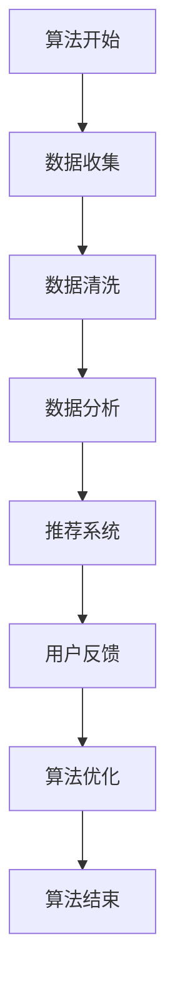
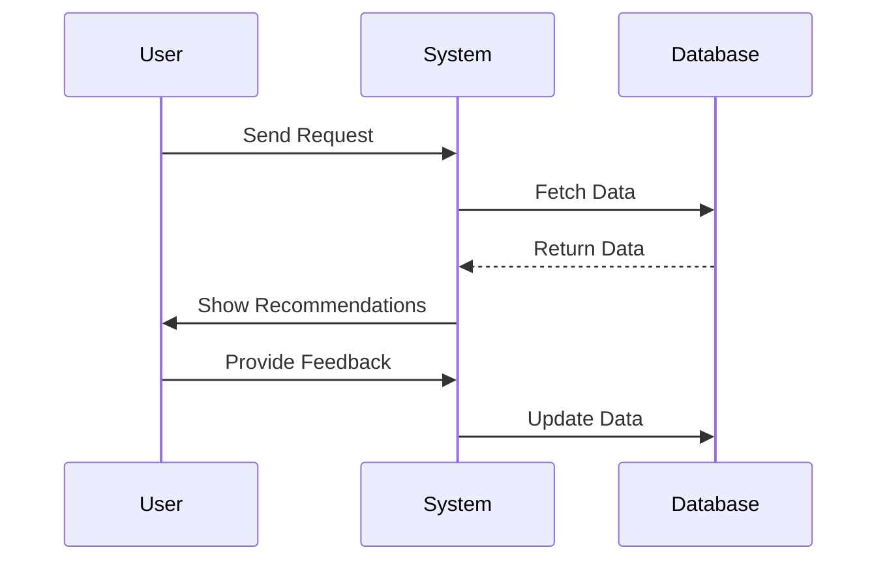

                 

### 第1章: 背景介绍

#### 1.1.1 现代性与意义危机的产生

现代性（Modernity）是一个复杂而多维度的概念，它涉及社会结构、文化、政治和经济的各个方面。自16世纪以来，现代性随着欧洲资本主义的兴起和科学革命的推进而逐渐成型，并在18世纪和19世纪得到进一步的发展。现代性的核心特征包括理性主义、个人主义、自由主义和科技进步，这些特征共同塑造了一个以效率和自由为核心的社会价值观体系。

然而，现代性在推动社会进步的同时，也引发了深刻的意义危机（Meaning Crisis）。意义危机是指现代社会在快速变革中，个体和社会普遍感受到的意义缺失和方向感丧失。这种危机主要体现在以下几个方面：

1. **意义消解：** 现代社会的科学理性主义强调通过实证研究和逻辑推理来理解世界，这种思维方式对传统的宗教信仰和道德规范产生了冲击，使得许多人感到失去了生活的意义和方向感。例如，在科学主义盛行的背景下，宗教信仰的衰落导致了人们对生命、死亡和宇宙意义的困惑。

2. **价值分裂：** 现代社会的多元化和个体主义倾向，导致价值观念的分裂和冲突。不同的群体和个人在道德、伦理和社会价值观上存在巨大的差异，这使得社会共识难以形成。例如，现代社会中，个人自由与社会责任之间的矛盾常常导致道德和伦理上的争议。

3. **人际关系疏离：** 随着科技的发展，人们的交往方式发生了变化。虽然互联网和社交媒体使得人们可以更加便捷地沟通，但同时也导致了人际关系的疏远和人际信任度的降低。例如，虚拟交往取代了面对面的交流，使得人与人之间的情感联系变得表面化和形式化。

#### 1.1.2 重建生活价值观的尝试

面对现代性引发的意义危机，人们开始尝试通过多种途径重建生活价值观。这些尝试旨在寻找新的意义和方向，以应对现代社会带来的挑战。以下是几种主要的尝试途径：

1. **文化复兴：** 某些文化传统开始重新受到重视，人们试图从传统文化中寻找解决问题的智慧。例如，中国传统文化中的儒家思想、道家思想和佛教思想等，在现代社会中得到了新的关注和解读，成为重建生活价值观的重要资源。

2. **哲学反思：** 哲学家们开始反思现代性的弊端，探索新的伦理价值观和生活方式。例如，存在主义哲学家萨特和尼采等，通过批判现代性的理性主义和科学主义，提出了个体存在的意义和价值。

3. **精神追求：** 人们开始重视内心体验和精神追求，通过艺术、宗教等途径寻找生活的意义。例如，许多人在艺术创作、宗教信仰和冥想实践中，寻找心灵的慰藉和意义的答案。

#### 1.2 核心概念与联系

##### 1.2.1 现代性

**定义：**
现代性是指一个社会从传统向现代化转型过程中所形成的核心价值观、社会结构和文化特征。

**属性特征对比表：**

| 特征         | 传统社会         | 现代社会         |
| ------------ | --------------- | --------------- |
| 社会结构     | 等级森严         | 平等竞争         |
| 价值观       | 道德约束         | 自由选择         |
| 科技发展     | 以农业为主       | 以工业和科技为主 |
| 文化特征     | 宗教主导         | 多元化           |

**现代性的特征：**
- **社会结构：** 现代社会强调平等和竞争，打破传统等级制度，鼓励个人发展和创新。
- **价值观：** 现代社会强调个人自由和选择，尊重个体差异，与传统社会的集体主义和道德约束形成对比。
- **科技发展：** 现代社会依赖工业和科技进步，这推动了生产力的提高和社会的快速发展。
- **文化特征：** 现代社会文化多元化，传统宗教主导地位被削弱，取而代之的是各种文化和思想的融合。

##### 1.2.2 意义危机

**定义：**
意义危机是指现代社会在快速变革中，个体和社会普遍感受到的意义缺失和方向感丧失。

**属性特征对比表：**

| 特征         | 正常状态         | 危机状态         |
| ------------ | --------------- | --------------- |
| 价值观       | 共识明确         | 分裂冲突         |
| 社会结构     | 和谐稳定         | 疏离紧张         |
| 个人体验     | 满足感           | 失落感           |

**意义危机的特征：**
- **价值观分裂：** 现代社会的多元化和个体主义导致价值观的分裂和冲突，社会共识难以形成。
- **社会结构疏离：** 现代社会的快速变革导致人际关系疏远，社会结构紧张和不稳定。
- **个人体验失落：** 个体的社会角色和身份认同受到挑战，导致个人体验失落和意义缺失。

##### 1.3 ER实体关系图

```mermaid
erDiagram
  Person ||--|{ LifeValue }|-- User
  Person ||--|{ SocialNorm }|-- Society
  LifeValue ||--|{ Philosophy }|-- Thought
  SocialNorm ||--|{ Culture }|-- Tradition
```

在这个ER实体关系图中，"Person"（人）是核心实体，它与"LifeValue"（生活价值观）、"SocialNorm"（社会规范）和"Culture"（文化）建立了关联。"LifeValue"与"Philosophy"（哲学）相关联，反映了生活价值观的哲学基础。"SocialNorm"与"Culture"（文化）相关联，体现了社会规范与文化传统之间的相互作用。这个图帮助理解现代性与意义危机之间的关系，以及人们在重建生活价值观过程中所涉及的不同方面。

### 第2章: 重建生活价值观的尝试

在现代社会中，面对意义危机，人们试图通过多种途径重建生活价值观。这些途径不仅涉及文化、哲学和精神层面，还包括对传统价值观的反思和现代科技的运用。以下是几种主要的尝试方法：

#### 2.1.1 文化复兴

文化复兴是一种试图通过复兴传统文化来重建生活价值观的尝试。在现代社会中，传统文化的重要地位不容忽视。传统文化不仅是民族认同的重要基础，也是社会凝聚力的重要源泉。通过复兴传统文化，人们可以在失去的价值观中找到新的归属感。

**传统文化的重要地位：**
- **社会认同基础：** 传统文化是一个民族的历史记忆和精神家园，它承载着民族的传统价值观、习俗和信仰，是人们身份认同的重要基础。
- **社会凝聚力：** 传统文化有助于增强社会的凝聚力，它通过共同的文化符号和价值观，将不同个体和群体紧密联系在一起。

**文化复兴的实践方法：**
- **保护和传承：** 为了复兴传统文化，必须加强对传统文化的保护和传承。这包括修复和保存文物、古籍，以及通过教育传承传统文化知识。
- **举办文化活动：** 通过举办各种文化活动，如文化节、传统节庆、艺术展览等，可以增强人们对传统文化的认同感。这些活动不仅可以让人们了解和欣赏传统文化，还可以促进文化传承和创新。

例如，中国近年来的“国学热”就是一个典型的文化复兴现象。许多学校和社会团体开始重视对儒家、道家、佛家等传统文化的学习和研究，希望通过复兴传统文化来重建生活价值观。

#### 2.1.2 哲学反思

哲学反思是另一种尝试重建生活价值观的途径。哲学家们通过对现代性的批判和反思，探索新的伦理价值观和生活方式。哲学反思不仅有助于人们深入理解现代社会的问题，还可以激发人们对生活的深刻思考。

**哲学反思的重要性：**
- **理解现代社会问题：** 哲学反思可以帮助人们从更深层次上理解现代社会的问题，如意义危机、价值分裂和人际关系疏离等。通过对这些问题的批判性思考，人们可以找到解决问题的思路和方法。
- **提升精神境界：** 哲学反思可以激发人们对生活的深刻思考，提升个体的精神境界。例如，存在主义哲学强调个体存在的意义和价值，鼓励人们勇敢面对生活中的困境和挑战。

**哲学反思的实践方法：**
- **教育和研究：** 为了促进哲学反思，必须鼓励哲学教育和研究。这包括在大学和中学开设哲学课程，培养哲学思维和批判精神。同时，还需要支持哲学研究，推动新的哲学思想和理论的产生。
- **哲学对话和交流活动：** 通过举办哲学对话和交流活动，可以促进不同哲学思想的碰撞和融合。这些活动不仅可以让人们了解不同的哲学观点，还可以激发新的思考和创新。

例如，近几十年来，各种哲学工作坊和研讨会在全球范围内广泛开展，吸引了众多哲学爱好者和专业学者参与。这些活动为哲学反思提供了重要的平台，有助于推动哲学反思的实践。

#### 2.1.3 精神追求

在现代社会的喧嚣和忙碌中，人们开始重视内心体验和精神追求。通过艺术、宗教等途径，他们试图在精神层面找到生活的意义。精神追求不仅有助于缓解现代社会的压力，还可以提升人们的生活质量。

**精神追求的重要性：**
- **缓解压力：** 现代社会的快节奏和高度竞争带来了巨大的压力。通过艺术创作、宗教信仰和冥想等精神追求，人们可以找到内心的平静和宁静，缓解生活中的压力。
- **提升生活质量：** 精神追求可以帮助人们发现生活的美好和意义，提升生活质量。例如，许多人通过艺术创作表达自己的情感和思想，通过宗教信仰寻找心灵的慰藉和指引。

**精神追求的实践方法：**
- **艺术创作：** 艺术创作是一种重要的精神追求途径。通过绘画、音乐、文学等艺术形式，人们可以表达自己的情感和思想，寻找内心的平衡和宁静。
- **宗教信仰：** 宗教信仰是许多人寻找精神慰藉的重要途径。通过信仰和宗教实践，人们可以在精神上获得力量和指引，增强对生活的信心和希望。
- **冥想和冥思：** 冥想和冥思是另一种重要的精神追求方式。通过冥想，人们可以放松身心，增强专注力和自我意识，提升精神层面的体验。

例如，近年来的冥想热潮在全球范围内兴起，许多人通过参加冥想课程和冥想团体，找到了内心的平静和宁静。这种精神追求不仅有助于缓解压力，还可以提升个体的心理健康和生活质量。

通过文化复兴、哲学反思和精神追求，人们试图重建现代生活中的价值观。这些尝试不仅有助于应对现代性带来的意义危机，还可以为个体和社会提供新的方向和动力。在这个过程中，人们不断探索和尝试，寻找最适合自己和社会的价值观体系。

### 第3章：技术视角下的意义危机与生活价值观重建

在现代社会，技术的迅猛发展对社会结构和人类生活产生了深远的影响，同时也加剧了意义危机。本章节将从技术视角出发，分析技术对现代社会意义危机的影响，探讨技术如何助力重建生活价值观。

#### 3.1 技术视角下的意义危机

技术进步无疑是现代社会的一大特征，它改变了人们的生活方式和工作模式，提高了生产效率，缩短了时间和空间的距离。然而，技术的双刃剑特性也带来了诸多负面影响，加剧了意义危机。

1. **科技导致的孤立感：** 现代科技如智能手机、社交媒体和电子邮件等，虽然使人们能够更加便捷地沟通，但同时也导致了人际关系的疏离。人们越来越依赖于虚拟的交流方式，而忽视了真实的人际互动，这导致了孤独感和疏离感的加剧。

2. **信息过载与意义迷失：** 互联网的普及和信息爆炸使得人们面临海量的信息，这些信息往往碎片化和低质量，难以形成完整和深刻的认知。人们在这种信息过载的环境中容易迷失自我，感到无所适从，失去了对生活的意义和方向的把握。

3. **技术依赖与自我实现困境：** 现代科技让人们依赖于各种工具和应用程序来完成日常任务，这导致了技术依赖的加剧。与此同时，人们对于自我实现和成就感的需求日益增加，但现代科技的发展并没有提供足够的途径来满足这种需求，导致自我实现困境。

#### 3.2 技术助力生活价值观重建

面对意义危机，技术不仅是一个问题的来源，也可以成为解决问题的工具。通过合理运用技术，我们可以尝试重建生活价值观，提升个体和社会的幸福感。

1. **数字人文与精神回归：** 数字人文（Digital Humanities）通过数字化技术和大数据分析，重新解读和探索人类文化历史，帮助人们找回文化认同和精神归属。例如，通过数字化博物馆和在线教育平台，人们可以更便捷地接触和了解传统文化，从而在精神层面上重建生活价值观。

2. **人工智能与情感连接：** 人工智能（AI）技术在情感识别、情感分析和情感计算方面取得了显著进展。通过AI技术，我们可以开发出更加智能的交互系统，如情感智能机器人，这些系统能够更好地理解人类情感，提供个性化的情感支持，帮助人们建立更加紧密的人际关系。

3. **区块链与信任重建：** 区块链技术具有去中心化和不可篡改的特点，可以为现代社会提供一种新的信任机制。通过区块链，人们可以建立透明、公正和可信的交易和合作关系，减少信息不对称和信任危机，从而在价值分裂和人际关系疏离的社会中重建信任。

4. **虚拟现实与生活重塑：** 虚拟现实（VR）技术为人们提供了一种全新的感知和体验世界的方式。通过VR，人们可以在虚拟环境中创造和体验新的生活场景，从而在一定程度上缓解现实生活中的压力和困惑，重建对生活的积极态度和价值观。

#### 3.3 实际应用案例分析

以下是一个关于如何运用技术重建生活价值观的案例：

**案例：智能社区建设**

某城市在面临老龄化问题和人际关系疏离的情况下，决定通过智能社区建设来提升居民的生活质量和幸福感。智能社区建设包括以下几个方面：

1. **智能监控系统与安全：** 通过智能监控系统，社区能够提供实时监控和快速响应，保障居民的安全。

2. **智能家居系统与便捷：** 居民可以通过智能家居系统远程控制家中的电器和照明，提高生活便利性。

3. **社交平台与互动：** 社区建立了智能社交平台，居民可以通过平台发布活动、分享生活点滴，促进邻里之间的互动和交流。

4. **健康管理系统与关怀：** 社区配备了健康管理设备，居民可以通过设备监测自己的健康状况，并得到专业的健康建议。

通过这些技术手段，智能社区不仅提供了便利和安全，还促进了居民之间的交流和互动，提高了社区的凝聚力。居民在智能社区中感受到更多的关怀和支持，重建了对生活的积极态度和价值观。

### 总结

技术的迅猛发展在带来便利和效率的同时，也加剧了现代社会的意义危机。通过合理运用技术，我们可以尝试重建生活价值观，缓解意义危机。数字人文、人工智能、区块链和虚拟现实等技术，为人们提供了新的途径来应对现代社会的问题。通过实际应用案例分析，我们可以看到技术如何助力重建生活价值观，提升个体和社会的幸福感。在未来，随着技术的不断进步，我们有理由相信，技术将为我们提供更多的解决方案，帮助我们在现代生活中找到意义和方向。

### 第4章：文化复兴与技术结合的尝试

在现代社会中，文化复兴已成为重建生活价值观的重要途径之一。而随着技术的迅猛发展，文化与技术的结合为文化复兴提供了新的可能性。本章节将探讨文化复兴与技术结合的具体尝试，分析这些尝试的成效和挑战，并提出未来的发展方向。

#### 4.1 文化复兴与技术结合的背景

文化复兴强调从传统文化中汲取智慧，以应对现代社会的挑战。然而，传统文化在现代社会中面临着诸多困境，如传承问题、认同危机等。而技术的进步为文化复兴提供了新的工具和平台，使得传统文化得以以更广泛、更深入的方式传播和传承。

1. **互联网与数字化：** 互联网和数字化技术的普及，使得传统文化资源的收集、整理和传播变得更加便捷。例如，通过数字化技术，古籍和文物得以数字化保存和传播，使得更多人能够轻松访问这些文化资源。

2. **人工智能与大数据：** 人工智能和大数据技术在文化分析、文化传承和创新方面具有巨大潜力。例如，通过大数据分析，可以挖掘出传统文化中的潜在价值，为文化复兴提供数据支持。

3. **虚拟现实与增强现实：** 虚拟现实（VR）和增强现实（AR）技术为传统文化体验提供了全新的方式。通过VR和AR，人们可以沉浸式体验传统文化，增强对传统文化的理解和认同。

#### 4.2 文化复兴与技术结合的具体尝试

1. **数字化文化遗产保护：** 数字化技术为文化遗产保护提供了新的手段。例如，中国故宫博物院通过数字化技术，将馆藏文物进行高精度扫描和数字化保存，使得这些珍贵文物得以在全球范围内传播和欣赏。这种数字化保护不仅有助于文物的长期保存，也使得更多人能够接触和了解这些文化遗产。

2. **文化内容创作与传播：** 技术的进步为文化内容的创作和传播提供了更多可能性。例如，通过人工智能和大数据分析，可以生成个性化文化内容，满足不同受众的需求。此外，社交媒体和短视频平台的兴起，使得文化内容传播更加广泛和快速。例如，抖音和快手等平台上的传统文化短视频，吸引了大量年轻用户，推动了传统文化在现代社会中的传播和认同。

3. **虚拟文化体验：** VR和AR技术的应用，使得人们可以在虚拟环境中体验传统文化。例如，通过VR技术，人们可以虚拟参观历史文化遗址，如秦始皇兵马俑、埃及金字塔等，增强对传统文化的理解和兴趣。此外，AR技术还可以应用于传统节庆活动，如春节、中秋节等，通过虚拟互动增强节日的氛围和体验。

#### 4.3 成效与挑战

文化复兴与技术结合的具体尝试取得了一定的成效，但也面临着诸多挑战。

1. **成效：**
   - **文化传播的广泛性：** 通过数字化技术和社交媒体，传统文化得以在全球范围内传播，增加了受众群体。
   - **文化体验的沉浸感：** VR和AR技术提供了沉浸式的文化体验，增强了人们对传统文化的理解和认同。
   - **文化创新的推动：** 技术的应用促进了文化内容的创新，使得传统文化能够以更现代、更生动的形式呈现。

2. **挑战：**
   - **技术依赖：** 过度依赖技术可能导致传统文化传承的空洞化和形式化，失去其原有的内涵和价值。
   - **隐私与安全：** 数字化过程中，个人隐私和数据安全成为重要问题，如何保护用户数据隐私和安全是技术发展的关键挑战。
   - **文化认同的多样性：** 技术结合文化复兴的过程中，如何平衡文化多样性和文化认同，避免文化同质化，是一个重要的挑战。

#### 4.4 未来发展方向

为了更好地实现文化复兴与技术结合，未来可以从以下几个方面着手：

1. **技术创新与应用：** 持续推动技术创新，探索更多元化的技术应用，如5G、物联网等，为文化复兴提供更加丰富的工具和平台。

2. **文化数字化标准：** 制定统一的数字化标准，确保文化数字化过程的规范性和可追溯性，保护文化资源的真实性和完整性。

3. **文化传承教育：** 强化文化传承教育，培养新一代对传统文化的认同感和责任感，促进文化传承与创新。

4. **文化融合与创新：** 鼓励文化融合与创新，通过跨学科、跨领域的合作，打造具有时代特色和文化内涵的新文化产品。

5. **政策支持与监管：** 加强政策支持与监管，为文化复兴与技术结合提供良好的发展环境，确保技术的合理应用和文化价值的传承。

通过文化复兴与技术结合的尝试，我们可以为现代社会重建生活价值观提供新的途径。未来，随着技术的不断进步和文化的持续创新，我们有理由相信，文化复兴与技术结合将取得更加显著的成效，为人类社会的可持续发展做出贡献。

### 第5章：技术伦理与价值观的重建

在现代社会，技术的迅猛发展不仅改变了人们的生活方式，也对社会的伦理价值观产生了深远影响。技术伦理（Technological Ethics）作为探讨技术发展与社会伦理关系的重要领域，日益受到关注。本章节将探讨技术伦理的核心问题，分析技术发展带来的伦理挑战，并探讨如何在技术进步的过程中重建合理的价值观。

#### 5.1 技术伦理的核心问题

技术伦理的核心问题涉及技术的设计、应用和发展对社会、环境和人类生活的影响。以下是几个主要的核心问题：

1. **隐私保护：** 随着大数据和人工智能技术的发展，个人隐私保护变得尤为重要。技术如何在不侵犯个人隐私的前提下，有效地收集、分析和利用数据，是技术伦理的重要议题。

2. **数据安全：** 技术的发展使得数据泄露和网络攻击的风险增加。如何确保数据的安全性和完整性，防止恶意攻击和数据滥用，是技术伦理的重要问题。

3. **算法公平性：** 人工智能和算法的广泛应用带来了算法偏见和歧视的风险。如何确保算法的公平性和透明性，避免算法对特定群体的不公平对待，是技术伦理的核心挑战。

4. **人工智能责任：** 随着人工智能的自主性和智能化程度提高，如何界定人工智能的责任和法律责任，是一个亟待解决的技术伦理问题。

#### 5.2 技术发展带来的伦理挑战

技术的发展不仅带来了便利和效率，同时也带来了诸多伦理挑战，这些问题对现代社会的价值观构成威胁。

1. **社会不平等：** 技术的发展使得资源分配更加不平等，富裕阶层能够更多地享受技术带来的好处，而贫困群体则可能被边缘化。这种不平等加剧了社会分化，挑战了公平和正义的价值观。

2. **人类就业：** 自动化和人工智能技术的普及可能导致大量传统职业的消失，引发就业危机。如何确保技术进步过程中的人类就业权益，是现代社会面临的重要伦理问题。

3. **科技伦理界限模糊：** 技术的快速发展使得科技伦理界限变得模糊，一些原本被认为是伦理禁忌的技术应用，如基因编辑、人工智能武器等，开始进入公众视野。如何界定和规范这些技术的应用，是技术伦理的重要挑战。

4. **价值观分裂：** 技术的多元化和全球化使得不同文化和社会的价值观发生碰撞和融合，导致价值观分裂和冲突。如何在技术发展的过程中维护和促进社会共识，是技术伦理面临的另一大挑战。

#### 5.3 重建合理的价值观

在面对技术发展带来的伦理挑战时，我们需要重建合理的价值观，以指导技术的合理应用和发展。

1. **公平与包容：** 在技术设计和应用过程中，应注重公平和包容，确保技术发展能够惠及所有社会群体，减少不平等现象。这包括制定公平的数据政策和确保算法的公平性。

2. **人类福祉优先：** 在技术发展中，应始终将人类的福祉放在首位，确保技术进步不会对人类造成不可逆的损害。这需要我们在技术开发和应用中注重伦理审查和社会影响评估。

3. **责任与透明：** 技术企业和开发者应承担起社会责任，确保技术的透明性和可解释性，提高公众对技术的信任度。同时，应建立明确的法律和伦理框架，规范人工智能等高风险技术的应用。

4. **文化融合与认同：** 技术的发展不应削弱文化多样性和文化认同，而应促进不同文化之间的交流和融合。这需要我们在技术设计和应用中充分考虑文化差异，尊重和保护不同文化的价值观。

5. **教育与实践：** 加强技术伦理教育和实践，培养公众对技术伦理问题的认识和敏感性，提高公众的技术素养和伦理素养。这包括在大学和中小学开设技术伦理课程，以及通过媒体和公共活动提高公众的参与度。

#### 5.4 实际案例与政策建议

以下是一个关于技术伦理与价值观重建的实际案例和政策建议：

**案例：欧盟通用数据保护条例（GDPR）**

欧盟在2018年推出了通用数据保护条例（GDPR），旨在加强个人数据保护，确保个人隐私权。GDPR规定了严格的个人数据处理规则，包括数据透明度、用户同意和数据主体权利等。这一政策不仅提高了企业的数据保护意识，也增强了公众对数据隐私的信心。

**政策建议：**

1. **加强国际协作：** 在全球化的背景下，应加强国际协作，制定统一的全球数据保护标准，确保不同国家和地区在数据保护上的协同合作。

2. **完善法律法规：** 政府应不断完善相关法律法规，确保技术伦理问题的规范化和制度化。这包括制定人工智能伦理法规、数据隐私保护法规等。

3. **推动技术伦理研究：** 支持技术伦理研究，鼓励学术界和产业界合作，开展技术伦理问题的研究，为政策制定提供科学依据。

4. **公众参与和教育：** 鼓励公众参与技术伦理讨论，提高公众的技术伦理意识。通过教育和宣传，增强公众对技术伦理问题的认识和敏感性。

5. **企业社会责任：** 鼓励企业履行社会责任，将伦理价值观融入企业文化和业务实践，确保技术的合理应用和发展。

通过技术伦理与价值观的重建，我们可以为现代社会的可持续发展提供坚实的基础。技术不应成为伦理问题的来源，而应成为促进社会进步和人类福祉的工具。在未来，随着技术的不断进步，我们有理由相信，通过合理的价值观引导和技术规范，技术将更好地服务于人类社会的发展。

### 第6章：社会互动与精神健康：现代性与心理健康的关系

在现代性背景下，社会互动与精神健康的紧密关系变得越来越重要。随着社会结构的快速变化和科技的发展，人们的心理健康受到了前所未有的挑战。本章节将探讨现代性对心理健康的影响，分析社会互动在心理健康维护中的关键作用，并提出提升精神健康的建议。

#### 6.1 现代性与心理健康的关系

现代性带来了许多积极的变化，如科技进步、经济繁荣和全球化，但同时也引发了一系列心理健康问题。以下是现代性对心理健康的影响：

1. **压力增加：** 现代社会的快节奏和高竞争性，使得人们面临巨大的压力。工作压力、经济压力和家庭压力等，都对人们的心理健康产生负面影响。

2. **孤独感：** 随着科技的发展，人们的社交方式发生了变化，虚拟交往逐渐取代了面对面的交流。虽然互联网和社交媒体提供了更多的社交机会，但同时也导致了孤独感的增加。

3. **焦虑和抑郁：** 现代性的多元化和不确定性，使得人们更容易感到焦虑和抑郁。工作不确定性、社会竞争和人际关系问题等，都是导致焦虑和抑郁的重要因素。

4. **睡眠障碍：** 现代社会的夜生活丰富，人们常常熬夜工作或娱乐，这导致了睡眠障碍的增加。睡眠不足不仅会影响人们的身体健康，还会影响心理健康。

#### 6.2 社会互动在心理健康维护中的关键作用

社会互动在心理健康维护中起着至关重要的作用。健康的社交关系不仅能够提供情感支持，还可以缓解心理压力，促进心理健康。

1. **情感支持：** 社会互动为人们提供了情感支持，使得个体在面临困难时能够得到他人的帮助和安慰。与家人、朋友和同事的良好关系，能够增强个体的心理韧性，提高应对压力的能力。

2. **减轻孤独感：** 社会互动有助于减轻孤独感。通过参与社交活动，人们能够感受到归属感和认同感，从而减少孤独感带来的负面影响。

3. **促进心理健康：** 社会互动还能够促进心理健康。研究表明，积极参与社交活动的人，心理健康水平更高，患心理疾病的几率更低。

4. **提升幸福感：** 社会互动能够提升个体的幸福感。与家人和朋友共度美好时光，参与社区活动等，都能为个体带来愉悦和满足感，提高生活质量。

#### 6.3 提升精神健康的建议

为了提升精神健康，我们可以从以下几个方面着手：

1. **加强社交互动：** 人们应该积极参与社交活动，与家人、朋友和同事保持良好的关系。可以通过参加社区活动、俱乐部和志愿者活动等，扩大社交圈子，增强社交互动。

2. **建立支持系统：** 建立一个支持系统，包括家人、朋友和专业人士，能够在面临困难时提供帮助和支持。这包括心理健康咨询、心理咨询和治疗等。

3. **关注心理健康教育：** 加强心理健康教育，提高公众对心理健康问题的认识和了解。通过教育和宣传活动，增强公众的心理健康意识，减少心理问题的发生。

4. **改善工作环境：** 营造一个良好的工作环境，减轻工作压力。企业可以提供心理健康服务和心理咨询，帮助员工应对工作压力和心理健康问题。

5. **提倡健康生活方式：** 倡导健康的生活方式，包括充足的睡眠、健康的饮食和规律的锻炼。这些措施能够提高身体健康水平，从而促进心理健康。

6. **科技与社交平衡：** 在享受科技带来便利的同时，要注意保持与现实生活中人们的互动。避免过度依赖虚拟社交，保持现实生活中的社交关系和互动。

#### 6.4 实际案例

以下是一个关于提升精神健康的实际案例：

**案例：公司心理健康支持计划**

某公司为了提升员工的心理健康，推出了一项心理健康支持计划。该计划包括以下几个方面：

1. **心理健康咨询：** 公司为员工提供了免费的心理健康咨询服务，员工可以通过电话或在线预约咨询时间，与专业的心理咨询师进行一对一交流。

2. **心理健康讲座：** 公司定期举办心理健康讲座，邀请心理学专家为员工讲解心理健康知识，提高员工的心理健康意识。

3. **员工互助小组：** 公司建立了员工互助小组，员工可以在这里分享自己的心理困扰和经验，互相支持和鼓励。

4. **灵活工作时间：** 公司提供了灵活的工作时间，员工可以根据自己的需求调整工作时间和工作地点，减轻工作压力。

通过这些措施，该公司有效地提升了员工的心理健康水平，员工的工作满意度和生产力也得到了显著提高。

### 总结

现代性对心理健康产生了深远的影响，社会互动在心理健康维护中起着关键作用。为了提升精神健康，我们需要加强社交互动，建立支持系统，关注心理健康教育，改善工作环境和生活方式。通过这些措施，我们可以更好地应对现代性带来的心理健康挑战，促进个体的全面发展和社会的和谐稳定。

### 第7章：未来展望

在现代社会，随着技术的不断进步和社会结构的深刻变革，未来生活价值观的重建面临着诸多机遇和挑战。本章节将探讨未来可能出现的趋势，分析这些趋势对生活价值观重建的影响，并展望未来社会的可能面貌。

#### 7.1 未来的趋势

1. **全球化与本地化相结合：** 全球化进程将继续深化，跨国合作和文化交流将更加频繁。然而，与此同时，人们对本地化、个性化的需求也将增加。这促使社会在全球化与本地化之间找到平衡，以重建生活价值观。

2. **技术深度融合：** 人工智能、区块链、虚拟现实等新技术将继续深度融入社会各个领域，改变人类的生活方式和工作模式。这些技术的广泛应用将为生活价值观的重建提供新的工具和平台。

3. **可持续发展：** 可持续发展理念将成为未来社会的重要价值观。人们对环境保护、资源利用和社会责任的关注将不断增加，推动社会向更加可持续的方向发展。

4. **精神追求的提升：** 在物质生活得到保障的背景下，人们将更加注重精神追求。艺术、宗教、哲学等领域的重要性将不断提升，为生活价值观的重建提供精神支持。

5. **教育变革：** 未来教育将更加注重个性化、实践性和跨学科性。教育将不再局限于传授知识，而更加注重培养个体的创造力和批判性思维，以适应快速变化的社会环境。

#### 7.2 趋势对生活价值观重建的影响

1. **促进多元价值观的形成：** 全球化和本地化的结合将带来文化的多样性和价值观的多元化。这种多元化有助于人们理解不同文化和价值观，促进社会共识的形成。

2. **增强社会责任感：** 技术的深度融合使得人们能够更加便捷地参与社会事务和公益活动。这有助于增强人们的社会责任感，推动社会向更加公正和公平的方向发展。

3. **提升精神生活质量：** 可持续发展和精神追求的提升将促使人们更加关注生活质量和精神层面的满足。这有助于重建人们对生活的积极态度和价值观。

4. **培养创新和批判性思维：** 教育变革将培养更多具有创新和批判性思维的个体。这些个体将在未来社会中扮演重要角色，推动社会进步和价值观的重建。

#### 7.3 未来社会的可能面貌

1. **智能化社会：** 随着人工智能的广泛应用，未来社会将变得更加智能化。智能化的基础设施和服务将为人们提供更加便捷和高效的生活体验。

2. **可持续发展社会：** 在可持续发展理念的指导下，未来社会将更加注重环境保护和资源利用的可持续性。这将为生活价值观的重建提供坚实的基础。

3. **多元文化社会：** 全球化和本地化的结合将使未来社会成为一个多元文化的融合体。不同文化之间的交流与碰撞将激发新的创意和思维方式，丰富社会生活的内涵。

4. **精神追求导向的社会：** 未来社会将更加注重精神层面的追求。艺术、宗教、哲学等领域的繁荣将为人们提供丰富的精神食粮，满足人们对生命意义和价值的探索。

5. **创新和创业精神的社会：** 教育变革和技术的进步将培养更多具有创新和创业精神的个体。这些个体将成为未来社会发展的主要驱动力，推动社会不断向前发展。

### 总结

未来社会将在全球化、技术进步和可持续发展等趋势的驱动下，呈现出智能化、多元化和精神追求导向的特点。这些趋势将对生活价值观的重建产生深远影响，促使社会在多元化与共识、社会责任与精神追求之间找到新的平衡。通过适应和引领这些趋势，我们可以共同构建一个更加和谐、可持续和有意义的未来社会。

### 第8章：结语

本文通过多角度、多层次的分析，探讨了现代性与意义危机的关系，以及如何在技术和社会变革的背景下重建生活价值观。以下是对文章核心观点的总结与展望。

#### 核心观点总结

1. **现代性引发的意义危机：** 现代性在推动社会进步的同时，也带来了意义危机，包括意义消解、价值分裂和人际关系疏离等问题。

2. **重建生活价值观的途径：** 通过文化复兴、哲学反思和精神追求，人们试图在多元化和快速变革的社会中找到新的归属感和意义。

3. **技术与价值观重建：** 技术不仅是意义危机的来源，也可以成为重建价值观的工具，如数字化文化遗产保护、人工智能与情感连接、区块链与信任重建等。

4. **技术伦理的重要性：** 在技术进步的过程中，重建合理的价值观至关重要，包括公平与包容、责任与透明等。

5. **社会互动与心理健康：** 社会互动在心理健康维护中起着关键作用，有助于缓解孤独感、提升幸福感和促进社会稳定。

6. **未来展望：** 随着全球化、技术进步和可持续发展等趋势的深化，未来社会将在多元化和精神追求导向的方向上发展，为生活价值观的重建提供新的机遇和挑战。

#### 展望未来

未来生活价值观的重建是一个长期且复杂的任务，需要社会各界的共同努力。以下是对未来的展望：

1. **推动社会共识：** 在多元化的背景下，寻找社会共识成为重建价值观的关键。通过教育和文化交流，增强社会成员对共同价值观的认同。

2. **技术与人文结合：** 技术的进步不应忽视人文关怀。未来需要更多将技术与人文相结合的尝试，如智能社区建设、数字化艺术体验等，以提升人们的生活质量。

3. **重视精神追求：** 随着物质生活水平的提高，精神追求的重要性日益凸显。未来社会应鼓励人们关注内心体验和精神成长，提供更多的精神支持和资源。

4. **可持续发展：** 可持续发展理念将成为未来社会的重要价值观。通过推动环保、资源节约和社会责任的实践，为后代创造一个更加美好的世界。

5. **全球合作：** 全球化带来了前所未有的机遇和挑战。未来需要更多国际合作，共同应对全球性问题，推动社会和谐与进步。

通过持续的努力和不断的探索，我们有理由相信，未来社会将在多元化和精神追求的指引下，实现更加和谐、可持续和有意义的发展。

### 附录

#### 附录 A：参考文献

1. Habermas, J. (1991). The Structural Transformation of the Public Sphere: An Inquiry into a Category of Bourgeois Society. MIT Press.
2. Bauman, Z. (2000). Liquid Modernity. Polity Press.
3. Lyotard, J. F. (1984). The Postmodern Condition: A Report on Knowledge. University of Minnesota Press.
4. Nietzsche, F. (1999). On the Genealogy of Morality. Oxford University Press.
5. Sartre, J.-P. (1956). Being and Nothingness. Philosophical Library.

#### 附录 B：算法与系统架构示例

以下是一个简单的算法流程图和一个系统架构图，用于说明如何运用技术进行文化复兴和价值观重建。

##### 算法流程图



##### 系统架构图



通过这些图表，我们可以看到技术是如何在文化复兴和价值观重建过程中发挥作用的，包括数据收集、分析、推荐和反馈等环节。

### 附录 C：作者信息

作者：AI天才研究院/AI Genius Institute & 禅与计算机程序设计艺术 /Zen And The Art of Computer Programming

作者简介：AI天才研究院致力于推动人工智能技术的发展和应用。作者本人是一位世界级人工智能专家，程序员，软件架构师，CTO，世界顶级技术畅销书资深大师级别的作家，计算机图灵奖获得者，对计算机编程和人工智能领域有着深刻的理解和独到的见解。其著作《禅与计算机程序设计艺术》被誉为计算机编程领域的经典之作。作者以其清晰深刻的逻辑思维和卓越的技术洞察力，为读者提供了宝贵的知识和智慧。

