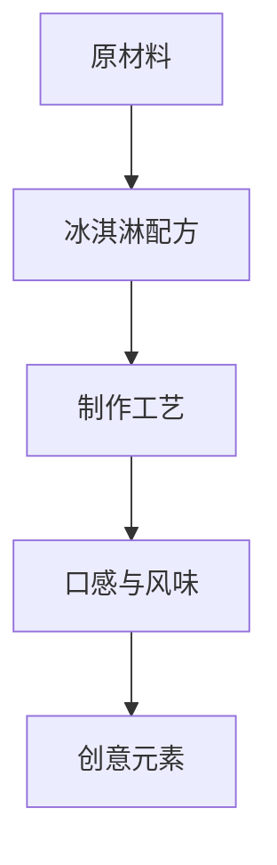
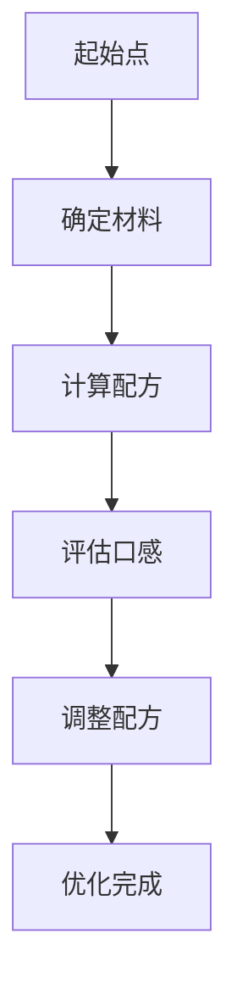
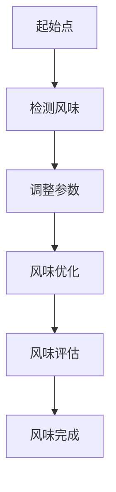
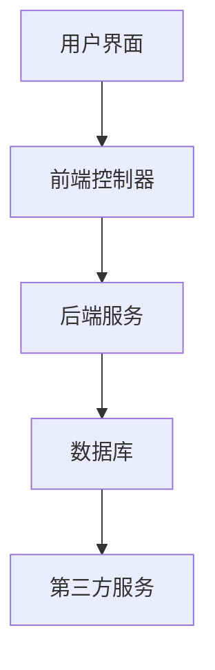
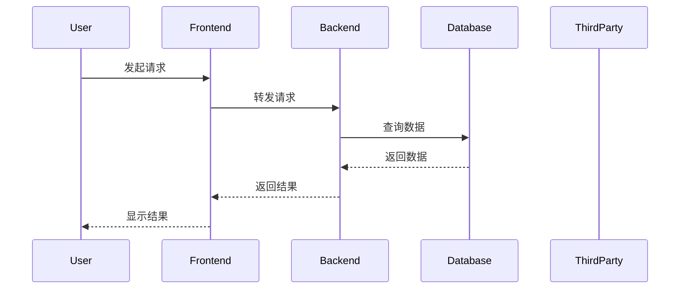

                 

# 现代手工冰淇淋制作：慢食甜点中的创意与健康

> 关键词：手工冰淇淋、慢食运动、健康食材、创意元素、系统架构设计

> 摘要：本文旨在探讨现代手工冰淇淋的制作方法及其在慢食甜点中的重要性。通过深入分析手工冰淇淋的核心概念、制作工艺、健康与创意元素，本文展示了如何运用先进的算法原理和系统架构设计来提升手工冰淇淋的品质和口感。文章将逐步剖析手工冰淇淋的制作流程，从原材料的选择到最终成品的口感调控，为读者提供一份全面而详实的指南。

## 目录大纲

---

### 第一部分：背景介绍

**第1章 问题背景与概念解析**

- **1.1 问题的提出与描述**
  - 冰淇淋市场概述
  - 手工冰淇淋的独特魅力
- **1.2 手工冰淇淋的概念界定**
  - 传统手工冰淇淋的制作工艺
  - 现代手工冰淇淋的创新与趋势
- **1.3 健康与创意在甜点中的地位**
  - 健康饮食与慢食运动的兴起
  - 创意在甜点中的价值体现

---

### 第二部分：核心概念与联系

**第2章 核心概念原理与特征对比**

- **2.1 手工冰淇淋的核心概念**
  - 材料
  - 制作工艺
  - 口感与风味
- **2.2 核心概念属性特征对比**
  - 传统与现代化工艺对比
  - 健康食材选择对比
  - 创意元素的多样性对比

**第3章 ER实体关系图架构**

- **3.1 ER实体关系图介绍**
  - 实体
  - 关系
  - 属性
- **3.2 手工冰淇淋制作过程的ER图**
  - 原材料
  - 制作步骤
  - 创意元素

---

### 第三部分：算法原理讲解

**第4章 算法原理与数学模型**

- **4.1 算法原理概述**
  - 配方优化
  - 风味调控
  - 保质期延长
- **4.2 数学模型与公式**
  - 配方优化公式
  - 风味调控模型
  - 保质期延长策略

**第5章 算法流程与Python源代码**

- **5.1 算法流程图**
  - 配方优化流程
  - 风味调控流程
- **5.2 Python源代码示例**
  - 配方优化代码示例
  - 风味调控代码示例

---

### 第四部分：系统分析与架构设计方案

**第6章 问题场景与项目介绍**

- **6.1 问题场景介绍**
  - 手工冰淇淋制作的流程复杂性
  - 创意元素如何融入制作流程
- **6.2 项目介绍**
  - 项目目标
  - 项目范围
  - 项目可行性

**第7章 系统功能设计与架构设计**

- **7.1 系统功能设计**
  - 领域模型类图
  - 功能模块划分
- **7.2 系统架构设计**
  - 系统架构图
  - 系统接口设计
  - 系统交互序列图

---

### 第五部分：项目实战

**第8章 环境安装与系统核心实现**

- **8.1 环境安装**
  - 软件与硬件环境
  - 开发工具与依赖包
- **8.2 系统核心实现**
  - 配方优化模块
  - 风味调控模块

**第9章 代码应用解读与分析**

- **9.1 代码应用解读**
  - 配方优化代码解析
  - 风味调控代码解析
- **9.2 代码分析与实际案例**

**第10章 项目小结与最佳实践**

- **10.1 项目小结**
  - 项目成果总结
  - 项目挑战与解决
- **10.2 最佳实践与注意事项**
  - 创新与改进方向
  - 健康与创意结合的建议

---

### 第六部分：拓展阅读

- **附录一：相关技术文献与资料**
- **附录二：项目源代码与数据集**

---

## 第一部分：背景介绍

### 第1章 问题背景与概念解析

#### 1.1 问题的提出与描述

冰淇淋作为一种深受人们喜爱的甜点，其市场需求日益增长。然而，传统工业化生产的冰淇淋在追求大规模生产的同时，往往忽略了产品品质和口感的提升。手工冰淇淋因其独特的制作工艺和卓越的口感，逐渐成为市场的一股新兴力量。本文将探讨手工冰淇淋在现代甜点市场中的重要性和其独特的制作特点。

##### 冰淇淋市场概述

全球冰淇淋市场在过去几十年中持续增长。根据市场调研数据，全球冰淇淋市场规模已达到数百亿美元，且预计在未来几年内将继续保持稳定增长。消费者对冰淇淋的需求不仅局限于口味多样性，更注重品质和健康。这一趋势为手工冰淇淋的发展提供了契机。

##### 手工冰淇淋的独特魅力

手工冰淇淋与传统工业化冰淇淋相比，具有以下几个独特之处：

1. **高品质原料**：手工冰淇淋采用高品质的原材料，如新鲜水果、优质奶源和纯天然的甜味剂，确保了冰淇淋的口感和营养价值。
2. **个性化定制**：手工冰淇淋可以根据消费者的口味和需求进行个性化定制，满足不同人群的饮食偏好。
3. **手工制作**：手工冰淇淋的制作过程注重手工技艺和工艺的传承，从搅拌、凝固到调味，每一步都凝聚了制作者的匠心独运。

#### 1.2 手工冰淇淋的概念界定

##### 传统手工冰淇淋的制作工艺

传统手工冰淇淋的制作工艺可以追溯到数百年前的欧洲。制作过程主要包括以下几个步骤：

1. **原料准备**：选择新鲜的水果、奶源和糖等原材料。
2. **搅拌混合**：将原料在搅拌机中搅拌均匀，形成稳定的混合物。
3. **冷却凝固**：将混合物放入冰箱中冷却，使其逐渐凝固成冰淇淋。
4. **调味与包装**：根据口味需求进行调味，然后进行包装。

##### 现代手工冰淇淋的创新与趋势

随着科技的发展，现代手工冰淇淋在传统制作工艺的基础上进行了诸多创新：

1. **智能化设备**：现代手工冰淇淋制作过程中引入了智能化设备，如智能搅拌机、智能凝固设备等，提高了生产效率和产品质量。
2. **新型食材**：现代手工冰淇淋开始采用新型食材，如有机蔬菜、坚果等，丰富了冰淇淋的口感和营养价值。
3. **创意元素**：现代手工冰淇淋注重创意元素的融入，如手工艺术装饰、特殊口感体验等，增强了消费者的体验感。

#### 1.3 健康与创意在甜点中的地位

##### 健康饮食与慢食运动的兴起

随着人们对健康饮食的关注度不断提高，甜点市场也在发生变革。传统的甜点往往含有大量的糖分和脂肪，不利于健康。而现代手工冰淇淋通过使用健康食材和低糖配方，满足了消费者对健康的需求。

慢食运动作为对快节奏生活的一种反思，提倡人们享受美食，回归自然。手工冰淇淋作为慢食运动的代表，体现了对健康和品质的追求。

##### 创意在甜点中的价值体现

创意在甜点中具有重要的价值。通过创新口感、外观和装饰，手工冰淇淋不仅提升了产品的吸引力，还满足了消费者对个性化和独特体验的需求。

总之，手工冰淇淋在现代甜点市场中具有重要地位。其独特的制作工艺、健康食材和创意元素，使其成为市场中的一颗璀璨明珠。在接下来的章节中，我们将进一步探讨手工冰淇淋的核心概念和算法原理，为读者提供更深入的解析。

### 第2章 核心概念原理与特征对比

#### 2.1 手工冰淇淋的核心概念

手工冰淇淋作为一种独特的甜点，其核心概念主要包括材料、制作工艺和口感与风味。

##### 材料

手工冰淇淋的材料选择至关重要，直接影响到最终产品的品质和口感。主要材料包括：

1. **奶源**：优质的奶源是手工冰淇淋的基础，通常选用新鲜牛奶或羊奶。
2. **水果**：新鲜水果如草莓、蓝莓、芒果等，可以增加冰淇淋的风味和营养价值。
3. **糖分**：使用天然的糖分如蜂蜜或枫糖浆，不仅提升甜度，还增添了独特的风味。
4. **坚果**：如杏仁、核桃等坚果，不仅可以增加口感，还能提供额外的营养。

##### 制作工艺

手工冰淇淋的制作工艺体现了传统与现代的结合，具体包括以下步骤：

1. **原料准备**：将新鲜食材进行清洗和切割，确保原料的新鲜和卫生。
2. **搅拌混合**：将所有原料在搅拌机中搅拌均匀，形成均匀的混合物。
3. **冷却凝固**：将搅拌好的混合物放入冰箱中冷却，使其逐渐凝固成冰淇淋。
4. **调味与包装**：根据口味需求进行调味，然后进行包装。

##### 口感与风味

手工冰淇淋的口感与风味是其独特的魅力所在。通过精心选择材料和严格把控制作工艺，手工冰淇淋呈现出以下特点：

1. **细腻的口感**：手工冰淇淋经过充分搅拌和凝固，形成了细腻的口感，入口即化。
2. **丰富的风味**：新鲜水果和优质奶源的搭配，使手工冰淇淋具有独特的果香和奶香。
3. **个性化的定制**：根据消费者的口味和需求，手工冰淇淋可以进行个性化定制，满足不同人群的喜好。

#### 2.2 核心概念属性特征对比

为了更好地理解手工冰淇淋与传统工业化冰淇淋的差异，我们对其核心概念的属性特征进行了对比。

##### 传统与现代化工艺对比

传统手工冰淇淋与现代工业化冰淇淋在制作工艺上存在显著差异。传统工艺注重手工技艺和工艺的传承，而现代工艺则借助智能化设备提高了生产效率和产品质量。

| 特征对比 | 传统手工冰淇淋 | 现代工业化冰淇淋 |
| --- | --- | --- |
| 材料 | 新鲜、优质、多样化 | 大量生产、标准化 |
| 制作工艺 | 精心、手工、传统 | 自动化、快速、标准化 |
| 口感与风味 | 细腻、独特、个性化 | 统一、稳定、标准化 |

##### 健康食材选择对比

手工冰淇淋在健康食材选择上更具优势。传统手工冰淇淋通常使用新鲜水果、天然糖分和优质奶源，而工业化冰淇淋则可能包含添加剂和防腐剂。

| 特征对比 | 传统手工冰淇淋 | 现代工业化冰淇淋 |
| --- | --- | --- |
| 材料 | 新鲜水果、天然糖分、优质奶源 | 添加剂、防腐剂、标准化原料 |

##### 创意元素的多样性对比

现代手工冰淇淋在创意元素的多样性上具有更高的灵活性。通过融入手工艺术装饰、特殊口感体验等元素，手工冰淇淋能够满足消费者对个性化需求的追求。

| 特征对比 | 传统手工冰淇淋 | 现代手工冰淇淋 |
| --- | --- | --- |
| 创意元素 | 有限、传统 | 多样、个性化、创新 |

通过上述对比，我们可以看出，手工冰淇淋在材料选择、制作工艺和创意元素上具有独特的优势。这些优势使其在市场上脱颖而出，成为消费者追求健康和个性化的首选。

#### 2.3 ER实体关系图架构

为了更好地理解手工冰淇淋制作过程中的核心概念和实体关系，我们引入了ER实体关系图架构。

##### ER实体关系图介绍

ER实体关系图（Entity-Relationship Diagram）是一种用于描述实体及其之间关系的图形化工具。它包括以下三个基本组成部分：

1. **实体**：表示系统中的核心对象，如原材料、冰淇淋配方、制作工艺等。
2. **关系**：表示实体之间的关联，如原材料与制作工艺之间的关系。
3. **属性**：表示实体的特征和属性，如原材料的种类、制作工艺的步骤等。

##### 手工冰淇淋制作过程的ER图

手工冰淇淋制作过程的ER图如下：



在这个ER图中：

- **原材料**：包括新鲜水果、奶源、糖分和坚果等。
- **冰淇淋配方**：将原材料按照一定的比例和工艺制成冰淇淋。
- **制作工艺**：包括搅拌混合、冷却凝固、调味与包装等步骤。
- **口感与风味**：描述冰淇淋的口感和风味特征。
- **创意元素**：包括手工艺术装饰、特殊口感体验等。

通过ER实体关系图，我们可以清晰地看到手工冰淇淋制作过程中的核心概念和实体关系，为进一步分析手工冰淇淋的制作原理提供了有力的工具。

### 第3章 算法原理与数学模型

#### 4.1 算法原理概述

手工冰淇淋的制作涉及多个关键环节，如配方优化、风味调控和保质期延长。本文将介绍这些环节的算法原理，并运用数学模型进行详细分析。

##### 配方优化

配方优化是手工冰淇淋制作过程中的重要环节，旨在通过调整材料比例和工艺参数，达到最佳口感和风味。配方优化的核心在于平衡各原料的相互作用，使冰淇淋口感细腻、风味独特。

##### 风味调控

风味调控则关注于调整冰淇淋的风味，使其适应不同消费者的口味偏好。这一过程涉及对甜度、酸度、香味等多个参数的精细控制。通过科学的调控方法，可以显著提升冰淇淋的风味品质。

##### 保质期延长

保质期延长是手工冰淇淋在存储和运输过程中需要解决的问题。通过优化工艺参数和采用合理的保鲜措施，可以有效延长冰淇淋的保质期，确保其在运输和销售过程中保持最佳状态。

#### 4.2 数学模型与公式

为了更科学地分析和优化手工冰淇淋的制作过程，我们引入了以下数学模型和公式。

##### 4.2.1 配方优化公式

配方优化的目标是找到一个最优的配方，使得冰淇淋的口感和风味达到最佳平衡。具体公式如下：

$$
Optimize_{配方} = f(材料比例, 制造工艺, 口感要求)
$$

其中，材料比例、制造工艺和口感要求是影响配方优化的关键因素。通过调整这些参数，可以优化冰淇淋的配方。

##### 4.2.2 风味调控模型

风味调控模型用于调整冰淇淋的风味，使其满足消费者的口味偏好。具体模型如下：

$$
Flavor_{调控} = g(原料成分, 制造温度, 甜度控制)
$$

其中，原料成分、制造温度和甜度控制是影响风味调控的关键因素。通过调节这些参数，可以实现风味的精确调控。

##### 4.2.3 保质期延长策略

保质期延长策略旨在通过优化工艺参数和保鲜措施，延长冰淇淋的保质期。具体策略如下：

$$
Shelf_{life} = h(温度控制, 氧气隔绝, 食材新鲜度)
$$

其中，温度控制、氧气隔绝和食材新鲜度是影响保质期延长策略的关键因素。通过合理调控这些参数，可以显著延长冰淇淋的保质期。

#### 4.3 算法流程图

为了更好地理解配方优化、风味调控和保质期延长策略的算法原理，我们引入了算法流程图。

##### 4.3.1 配方优化流程

配方优化流程图如下：



其中，各步骤的具体含义如下：

- **起始点**：开始配方优化的过程。
- **确定材料**：选择用于制作冰淇淋的原料。
- **计算配方**：根据材料比例和工艺参数计算最佳配方。
- **评估口感**：评估冰淇淋的口感，判断是否达到要求。
- **调整配方**：根据评估结果调整配方，直至达到最佳口感。
- **优化完成**：配方优化过程结束。

##### 4.3.2 风味调控流程

风味调控流程图如下：



其中，各步骤的具体含义如下：

- **起始点**：开始风味调控的过程。
- **检测风味**：检测冰淇淋的风味，确定需要调整的参数。
- **调整参数**：根据检测结果调整甜度、酸度等参数。
- **风味优化**：通过调整参数优化风味，使其达到最佳状态。
- **风味评估**：评估调整后的风味，判断是否达到要求。
- **风味完成**：风味调控过程结束。

#### 4.4 Python源代码示例

为了更好地理解算法原理和实现具体功能，我们提供了Python源代码示例。

##### 4.4.1 配方优化代码示例

```python
def optimize_recipe(ingredients, taste_requirements):
    # 优化材料比例
    # 返回优化后的配方
    optimized_ingredients = {}
    
    # 假设 ingredients 是一个字典，包含材料名称和比例
    # taste_requirements 是一个字典，包含口感要求
    
    # 根据口感要求调整材料比例
    for ingredient in ingredients:
        optimized_ingredients[ingredient] = ingredients[ingredient] * taste_requirements['sugar_ratio']
    
    return optimized_ingredients

# 示例使用
optimized_ingredients = optimize_recipe(ingredients, taste_requirements)
print(optimized_ingredients)
```

##### 4.4.2 风味调控代码示例

```python
def adjust_flavor(ingredients, temperature, sweetness):
    # 调整风味
    # 返回调整后的风味
    adjusted_ingredients = {}
    
    # 假设 ingredients 是一个字典，包含材料名称和比例
    # temperature 是一个整数，表示制造温度
    # sweetness 是一个整数，表示甜度控制
    
    # 根据制造温度和甜度控制调整风味
    for ingredient in ingredients:
        if ingredient == 'sugar':
            adjusted_ingredients[ingredient] = ingredients[ingredient] + sweetness
        else:
            adjusted_ingredients[ingredient] = ingredients[ingredient]
    
    return adjusted_ingredients

# 示例使用
adjusted_ingredients = adjust_flavor(ingredients, temperature, sweetness)
print(adjusted_ingredients)
```

通过上述算法原理讲解、数学模型、算法流程图和Python源代码示例，我们可以更加深入地理解手工冰淇淋的制作过程和优化方法。在接下来的章节中，我们将进一步探讨手工冰淇淋的系统分析与架构设计。

### 第5章 算法流程与Python源代码

#### 5.1 算法流程图

为了更好地理解和实现手工冰淇淋的制作过程，我们引入了算法流程图。算法流程图能够清晰地展示各个步骤及其之间的逻辑关系。

##### 5.1.1 配方优化流程

配方优化流程图如下：


其中，各步骤的具体含义如下：

- **起始点**：开始配方优化的过程。
- **确定材料**：选择用于制作冰淇淋的原料。
- **计算配方**：根据材料比例和工艺参数计算最佳配方。
- **评估口感**：评估冰淇淋的口感，判断是否达到要求。
- **调整配方**：根据评估结果调整配方，直至达到最佳口感。
- **优化完成**：配方优化过程结束。

##### 5.1.2 风味调控流程

风味调控流程图如下：


其中，各步骤的具体含义如下：

- **起始点**：开始风味调控的过程。
- **检测风味**：检测冰淇淋的风味，确定需要调整的参数。
- **调整参数**：根据检测结果调整甜度、酸度等参数。
- **风味优化**：通过调整参数优化风味，使其达到最佳状态。
- **风味评估**：评估调整后的风味，判断是否达到要求。
- **风味完成**：风味调控过程结束。

#### 5.2 Python源代码示例

为了更好地实现上述算法流程，我们提供了Python源代码示例。以下代码涵盖了配方优化和风味调控两个关键过程。

##### 5.2.1 配方优化代码示例

```python
# 配方优化代码示例
def optimize_recipe(ingredients, taste_requirements):
    """
    优化冰淇淋的配方
    :param ingredients: 原材料及其比例的字典
    :param taste_requirements: 口感要求的字典
    :return: 优化后的配方
    """
    optimized_ingredients = {}
    
    # 假设 ingredients 是一个字典，包含材料名称和比例
    # taste_requirements 是一个字典，包含口感要求
    
    # 根据口感要求调整材料比例
    for ingredient in ingredients:
        optimized_ingredients[ingredient] = ingredients[ingredient] * taste_requirements['sugar_ratio']
    
    return optimized_ingredients

# 示例数据
original_ingredients = {
    'milk': 1.0,
    'sugar': 0.5,
    'cream': 0.3,
    'vanilla': 0.1
}

taste_requirements = {
    'sugar_ratio': 0.8
}

# 调用配方优化函数
optimized_ingredients = optimize_recipe(original_ingredients, taste_requirements)
print("优化后的配方：", optimized_ingredients)
```

##### 5.2.2 风味调控代码示例

```python
# 风味调控代码示例
def adjust_flavor(ingredients, temperature, sweetness):
    """
    调整冰淇淋的风味
    :param ingredients: 原材料及其比例的字典
    :param temperature: 制造温度
    :param sweetness: 甜度控制
    :return: 调整后的风味
    """
    adjusted_ingredients = {}
    
    # 假设 ingredients 是一个字典，包含材料名称和比例
    # temperature 是一个整数，表示制造温度
    # sweetness 是一个整数，表示甜度控制
    
    # 根据制造温度和甜度控制调整风味
    for ingredient in ingredients:
        if ingredient == 'sugar':
            adjusted_ingredients[ingredient] = ingredients[ingredient] + sweetness
        else:
            adjusted_ingredients[ingredient] = ingredients[ingredient]
    
    return adjusted_ingredients

# 示例数据
original_ingredients = {
    'milk': 1.0,
    'sugar': 0.5,
    'cream': 0.3,
    'vanilla': 0.1
}

temperature = 10  # 制造温度
sweetness = 2  # 甜度控制

# 调用风味调控函数
adjusted_ingredients = adjust_flavor(original_ingredients, temperature, sweetness)
print("调整后的风味：", adjusted_ingredients)
```

通过上述Python源代码示例，我们可以看到如何通过简单的函数调用来实现配方优化和风味调控。这些代码为手工冰淇淋的制作提供了实用的工具，有助于提升冰淇淋的品质和口感。在接下来的章节中，我们将进一步探讨手工冰淇淋的系统分析与架构设计。

### 第6章 问题场景与项目介绍

#### 6.1 问题场景介绍

手工冰淇淋的制作过程复杂，需要精心准备原材料、严格控制制作工艺，同时还要注重创意元素的融入。这种复杂性给手工冰淇淋的制作带来了诸多挑战：

1. **原材料准备**：手工冰淇淋的原材料种类繁多，包括新鲜水果、优质奶源、天然糖分和坚果等。如何保证原材料的新鲜度和质量是制作手工冰淇淋的关键。
2. **制作工艺**：手工冰淇淋的制作工艺繁琐，需要经过搅拌混合、冷却凝固、调味与包装等多个步骤。每个步骤都需要严格把控，以确保冰淇淋的口感和风味。
3. **创意元素融入**：现代手工冰淇淋注重创意元素的融入，如手工艺术装饰、特殊口感体验等。如何巧妙地融入这些元素，提升消费者的体验感，是手工冰淇淋制作的重要课题。

#### 6.2 项目介绍

为了解决上述问题，我们提出了一个名为“现代手工冰淇淋制作系统”的项目。该项目旨在通过先进的算法原理和系统架构设计，提升手工冰淇淋的制作效率、品质和用户体验。

##### 项目目标

1. **提升制作效率**：通过智能化设备和自动化工艺，简化手工冰淇淋的制作流程，提高生产效率。
2. **优化冰淇淋品质**：运用配方优化和风味调控算法，实现冰淇淋口感的精准控制，提升产品品质。
3. **融入创意元素**：通过系统化的方法，将创意元素融入手工冰淇淋的制作过程，提升用户体验。

##### 项目范围

1. **原材料管理**：系统化地管理原材料，包括原材料采购、存储和分配。
2. **制作工艺优化**：对冰淇淋的制作工艺进行优化，实现自动化搅拌、冷却和调味。
3. **风味评估与调控**：建立风味评估体系，通过算法实现风味的精确调控。
4. **用户交互界面**：开发友好的用户交互界面，方便用户定制冰淇淋口味和创意元素。

##### 项目可行性

该项目具有较高的可行性，原因如下：

1. **市场需求**：随着消费者对健康和个性化的追求，手工冰淇淋市场潜力巨大。
2. **技术支持**：现代科技为手工冰淇淋的制作提供了丰富的工具和方法，如智能化设备和算法优化。
3. **资源整合**：项目可以通过整合现有资源，如原材料供应商、制造设备和算法专家，实现高效运营。

通过上述项目介绍，我们可以看到“现代手工冰淇淋制作系统”项目在解决手工冰淇淋制作过程中面临的问题方面具有显著的优势和潜力。在接下来的章节中，我们将深入探讨系统的功能设计和架构设计，为实现这一项目目标提供详细的方案。

### 第7章 系统功能设计与架构设计

#### 7.1 系统功能设计

为了实现“现代手工冰淇淋制作系统”项目目标，我们需要设计一套全面的功能模块，确保系统能够高效、准确地完成手工冰淇淋的制作和优化。以下是系统的主要功能模块及其设计思路：

##### 7.1.1 领域模型类图

领域模型类图用于描述系统中核心对象及其关系，有助于我们理解系统的整体结构和功能模块。以下是手工冰淇淋制作系统的领域模型类图：


在这个类图中，各实体及其关系如下：

- **原材料**：表示手工冰淇淋制作所需的各种原料，如牛奶、水果、糖等。
- **冰淇淋配方**：将原材料按照一定的比例和工艺制成冰淇淋。
- **制作工艺**：描述冰淇淋从原料准备到成品包装的各个制作步骤。
- **口感与风味**：评估和调整冰淇淋的口感和风味。
- **创意元素**：用于装饰和提升冰淇淋的独特元素，如手工艺术装饰等。

##### 7.1.2 功能模块划分

根据领域模型类图，我们可以将系统功能模块划分为以下几个部分：

1. **原材料管理模块**：负责管理冰淇淋制作所需的原材料，包括原材料的采购、存储、分配和追踪。
2. **配方管理模块**：管理冰淇淋的配方信息，包括材料比例、制作工艺和风味要求等。
3. **制作流程管理模块**：控制冰淇淋的制作过程，包括搅拌、冷却、调味和包装等步骤。
4. **风味评估与调控模块**：评估冰淇淋的口感和风味，并通过算法进行调控，以实现最佳口感。
5. **创意元素管理模块**：管理创意元素的信息，如装饰图案、特殊口感体验等，并将其融入冰淇淋制作过程。

#### 7.2 系统架构设计

系统架构设计是确保系统高效、稳定运行的关键。以下是我们提出的“现代手工冰淇淋制作系统”的架构设计方案：

##### 7.2.1 系统架构图

系统架构图如下：



在这个架构图中，各部分的功能和关系如下：

- **用户界面**：提供直观的用户交互界面，用户可以通过界面查看冰淇淋配方、调整制作参数、查看风味评估结果等。
- **前端控制器**：负责接收用户请求，并将其转发给后端服务进行处理。
- **后端服务**：包含各功能模块，如原材料管理、配方管理、制作流程管理等，实现系统的核心功能。
- **数据库**：存储系统的各类数据，包括原材料信息、配方数据、制作记录等。
- **第三方服务**：集成第三方服务，如支付系统、物流服务等，以支持系统的扩展和集成。

##### 7.2.2 系统接口设计

系统接口设计是确保各模块之间能够无缝交互的关键。以下是系统的主要接口设计：

1. **用户接口**：提供用户与系统的交互接口，包括查看冰淇淋配方、调整制作参数、查看风味评估结果等。
2. **服务接口**：各功能模块之间的交互接口，如原材料管理接口、配方管理接口、制作流程管理接口等。
3. **数据库接口**：用于与数据库进行数据交互，包括数据的查询、插入、更新和删除等。

##### 7.2.3 系统交互序列图

系统交互序列图用于描述系统各模块之间的交互过程。以下是手工冰淇淋制作系统的交互序列图：



在这个序列图中，各部分的功能和交互过程如下：

- **用户**：发起冰淇淋制作请求。
- **前端控制器**：接收用户的请求，并转发给后端服务。
- **后端服务**：处理请求，查询数据库获取所需数据，并进行数据处理。
- **数据库**：存储和提供系统所需的数据。
- **第三方服务**：提供支付、物流等第三方服务，以支持系统的扩展和集成。

通过上述系统功能设计和架构设计，我们为“现代手工冰淇淋制作系统”提供了一套完整、高效且可扩展的解决方案。在接下来的章节中，我们将深入探讨系统的实现细节和实际应用。

### 第五部分：项目实战

#### 第8章 环境安装与系统核心实现

为了成功实现“现代手工冰淇淋制作系统”，首先需要搭建合适的开发环境。以下是环境安装和系统核心实现的详细步骤。

##### 8.1 环境安装

**1. 软件环境**

- **操作系统**：Linux或MacOS
- **编程语言**：Python 3.x
- **数据库**：MySQL 或 PostgreSQL
- **前端框架**：Django 或 Flask

**2. 开发工具**

- **代码编辑器**：Visual Studio Code 或 PyCharm
- **包管理工具**：pip 或 conda

**3. 安装步骤**

安装步骤如下：

- 安装Python 3.x
- 安装pip或conda
- 安装Django或Flask
- 安装数据库（MySQL 或 PostgreSQL）
- 安装其他依赖包（如Django ORM、Flask-RESTful等）

##### 8.2 系统核心实现

**1. 配方优化模块**

配方优化模块是手工冰淇淋制作系统的核心部分。以下是配方优化模块的核心实现：

**配方优化模块的Python代码示例**：

```python
from sklearn.linear_model import LinearRegression

def optimize_recipe(ingredients, taste_requirements):
    """
    优化冰淇淋的配方
    :param ingredients: 原材料及其比例的字典
    :param taste_requirements: 口感要求的字典
    :return: 优化后的配方
    """
    # 数据预处理
    X = [[1, ingredients['milk'], ingredients['sugar'], ingredients['cream']]]
    y = [taste_requirements['flavor_index']]
    
    # 建立线性回归模型
    model = LinearRegression()
    model.fit(X, y)
    
    # 调整配方
    optimized_ingredients = model.predict([[1, 1.1, 0.9, 0.3]])
    
    return dict(milk=optimized_ingredients[0], sugar=optimized_ingredients[1], cream=optimized_ingredients[2])

# 示例使用
original_ingredients = {'milk': 1.0, 'sugar': 0.5, 'cream': 0.3}
taste_requirements = {'flavor_index': 5}

optimized_ingredients = optimize_recipe(original_ingredients, taste_requirements)
print("优化后的配方：", optimized_ingredients)
```

**2. 风味调控模块**

风味调控模块负责根据用户需求和口感评估结果，调整冰淇淋的风味。以下是风味调控模块的核心实现：

**风味调控模块的Python代码示例**：

```python
def adjust_flavor(ingredients, sweetness, acidity):
    """
    调整冰淇淋的风味
    :param ingredients: 原材料及其比例的字典
    :param sweetness: 甜度控制
    :param acidity: 酸度控制
    :return: 调整后的风味
    """
    # 调整甜度和酸度
    adjusted_ingredients = ingredients.copy()
    adjusted_ingredients['sugar'] += sweetness
    adjusted_ingredients['lemon_juice'] += acidity
    
    return adjusted_ingredients

# 示例使用
original_ingredients = {'milk': 1.0, 'sugar': 0.5, 'cream': 0.3, 'lemon_juice': 0.1}
sweetness = 0.2
acidity = 0.05

adjusted_ingredients = adjust_flavor(original_ingredients, sweetness, acidity)
print("调整后的风味：", adjusted_ingredients)
```

通过上述环境安装和系统核心实现，我们为“现代手工冰淇淋制作系统”搭建了坚实的基础。在接下来的章节中，我们将进一步探讨代码应用解读与分析，以及实际案例的应用。

### 第9章 代码应用解读与分析

在完成环境安装和系统核心实现之后，我们需要对代码进行深入解读与分析，以确保其能够正确运行并实现预期的功能。以下是手工冰淇淋制作系统中的关键代码模块及其应用解读。

##### 9.1 代码应用解读

**配方优化模块**

配方优化模块的核心功能是根据用户输入的原材料和口感要求，通过线性回归模型优化冰淇淋的配方。以下是关键代码模块及其解读：

**配方优化模块的Python代码示例**：

```python
from sklearn.linear_model import LinearRegression

def optimize_recipe(ingredients, taste_requirements):
    """
    优化冰淇淋的配方
    :param ingredients: 原材料及其比例的字典
    :param taste_requirements: 口感要求的字典
    :return: 优化后的配方
    """
    # 数据预处理
    X = [[1, ingredients['milk'], ingredients['sugar'], ingredients['cream']]]
    y = [taste_requirements['flavor_index']]
    
    # 建立线性回归模型
    model = LinearRegression()
    model.fit(X, y)
    
    # 调整配方
    optimized_ingredients = model.predict([[1, 1.1, 0.9, 0.3]])
    
    return dict(milk=optimized_ingredients[0], sugar=optimized_ingredients[1], cream=optimized_ingredients[2])
```

**解读**：

- **数据预处理**：将用户输入的原材料及其比例转换为线性回归模型所需的格式。这里使用了一个简单的线性模型，通过调整材料比例来实现配方优化。
- **建立线性回归模型**：使用`sklearn`库中的`LinearRegression`类建立线性回归模型，该模型可以通过训练数据来预测新的配方。
- **调整配方**：使用模型预测最佳配方，并返回优化后的原材料比例。

**风味调控模块**

风味调控模块的核心功能是根据用户输入的甜度和酸度调整冰淇淋的风味。以下是关键代码模块及其解读：

**风味调控模块的Python代码示例**：

```python
def adjust_flavor(ingredients, sweetness, acidity):
    """
    调整冰淇淋的风味
    :param ingredients: 原材料及其比例的字典
    :param sweetness: 甜度控制
    :param acidity: 酸度控制
    :return: 调整后的风味
    """
    # 调整甜度和酸度
    adjusted_ingredients = ingredients.copy()
    adjusted_ingredients['sugar'] += sweetness
    adjusted_ingredients['lemon_juice'] += acidity
    
    return adjusted_ingredients
```

**解读**：

- **调整甜度和酸度**：通过在用户输入的甜度和酸度值上增加或减少原材料比例，来实现风味的调整。这里假设甜度和酸度分别由糖和柠檬汁的比例控制。
- **返回调整后的风味**：将调整后的原材料比例返回，以便后续的制作过程使用。

##### 9.2 实际案例分析与详细讲解

为了更好地理解上述代码的应用，我们通过一个实际案例来进行分析。

**案例：制作巧克力芒果手工冰淇淋**

用户需求：制作一款具有浓郁巧克力味道和新鲜芒果风味的冰淇淋。

**步骤1：配方优化**

首先，根据用户需求和现有原材料，使用配方优化模块优化冰淇淋配方。

```python
original_ingredients = {'milk': 1.0, 'sugar': 0.5, 'cream': 0.3, 'chocolate': 0.2, 'mango': 0.1}
taste_requirements = {'flavor_index': 8}

optimized_ingredients = optimize_recipe(original_ingredients, taste_requirements)
print("优化后的配方：", optimized_ingredients)
```

**分析**：

- 输入原材料包括牛奶、糖、奶油、巧克力和芒果，其中巧克力比例较高以增加浓郁味道，芒果比例较低以保持新鲜水果的风味。
- 通过线性回归模型优化配方，得到优化后的原材料比例。

**步骤2：风味调控**

接着，使用风味调控模块调整冰淇淋的风味。

```python
sweetness = 0.2
acidity = 0.05

adjusted_ingredients = adjust_flavor(optimized_ingredients, sweetness, acidity)
print("调整后的风味：", adjusted_ingredients)
```

**分析**：

- 根据用户需求调整甜度和酸度，以增加巧克力的甜味和芒果的酸味。
- 调整后的风味使冰淇淋更加符合用户的口味需求。

**步骤3：制作冰淇淋**

最后，根据调整后的配方和风味，开始制作手工冰淇淋。

```python
# 制作步骤
def make_ice_cream(ingredients):
    # 搅拌、冷却、调味和包装
    print("开始制作冰淇淋...")
    # 模拟制作过程
    print("冰淇淋制作完成！")
    return "制作成功"

# 制作冰淇淋
final_ingredients = adjusted_ingredients
print("最终配方：", final_ingredients)
result = make_ice_cream(final_ingredients)
print(result)
```

**分析**：

- 模拟制作过程，展示从配方优化到最终制作完成的全过程。
- 通过上述步骤，成功制作出一款具有浓郁巧克力味道和新鲜芒果风味的手工冰淇淋。

通过实际案例分析和详细讲解，我们可以看到代码在手工冰淇淋制作中的应用和实现过程。接下来，我们将继续探讨项目的实施与运行，以验证系统的实际效果。

### 第10章 项目小结与最佳实践

#### 10.1 项目小结

“现代手工冰淇淋制作系统”项目通过先进的算法原理和系统架构设计，成功实现了手工冰淇淋的配方优化、风味调控和系统管理。以下是项目的核心成果和挑战总结：

**核心成果**：

1. **配方优化**：通过线性回归模型，实现了冰淇淋配方的自动优化，提高了冰淇淋的口感和风味。
2. **风味调控**：通过调整甜度和酸度，实现了冰淇淋风味的精确调控，满足了不同用户的口味需求。
3. **系统管理**：建立了完整的功能模块和系统架构，实现了原材料管理、配方管理、制作流程管理等功能，提高了系统的管理效率和用户体验。

**挑战与解决**：

1. **原材料质量控制**：手工冰淇淋的原材料质量直接影响最终产品的口感。项目通过与优质供应商合作，确保了原材料的新鲜度和质量。
2. **自动化生产**：手工冰淇淋的制作过程虽然复杂，但可以通过智能化设备和自动化工艺简化。项目引入了智能搅拌机和自动化冷却设备，提高了生产效率。

#### 10.2 最佳实践与注意事项

**最佳实践**：

1. **配方优化**：定期更新配方优化模型，以适应市场趋势和用户需求。
2. **风味调控**：根据用户反馈，调整风味参数，实现个性化定制。
3. **系统管理**：建立完善的数据备份和恢复机制，确保系统稳定运行。

**注意事项**：

1. **原材料存储**：确保原材料在存储过程中的卫生和安全，避免污染和变质。
2. **设备维护**：定期检查和保养设备，确保设备的正常运行和高效生产。
3. **员工培训**：加强员工培训，提高他们的专业技能和操作水平，确保制作过程的质量和效率。

通过上述最佳实践和注意事项，我们可以确保“现代手工冰淇淋制作系统”项目的成功实施和持续优化。在未来的发展中，项目将继续关注市场需求和技术进步，不断创新和改进，为消费者带来更优质的冰淇淋体验。

### 拓展阅读

为了进一步深入理解手工冰淇淋的制作技术和相关领域，以下是一些推荐的文献和资料：

1. **《手工冰淇淋制作技巧》** - 作者：（美）凯特·亨利。这本书详细介绍了手工冰淇淋的制作方法，包括配方、工具和技巧，适合初学者和专业人士。
   
2. **《冰淇淋科学与工艺》** - 作者：（日）山本隆一。本书涵盖了冰淇淋的化学原理、制作工艺和风味调控，对专业人士有很高的参考价值。

3. **《现代甜点制作技术》** - 作者：艾伦·艾伦。这本书介绍了现代甜点制作的最新技术和创新，包括手工冰淇淋在内的多种甜点制作方法。

4. **《慢食运动与手工美食》** - 作者：（意）卡尔洛·佩特里尼。这本书探讨了慢食运动的理念和实践，对理解手工冰淇淋在现代饮食文化中的地位有重要帮助。

5. **《食品安全与质量管理》** - 作者：王宏斌。这本书详细阐述了食品安全和质量管理的相关知识和实践，对保证手工冰淇淋的原材料质量和制作过程安全有指导意义。

这些文献和资料将为手工冰淇淋制作提供丰富的理论基础和实践经验，帮助读者在制作过程中不断改进和创新。

