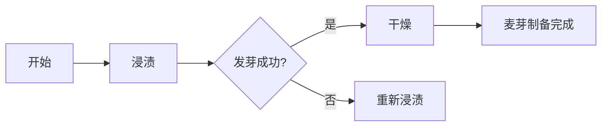
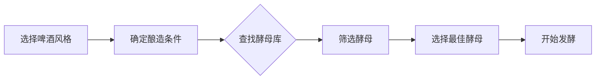
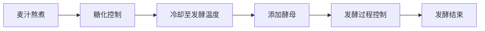
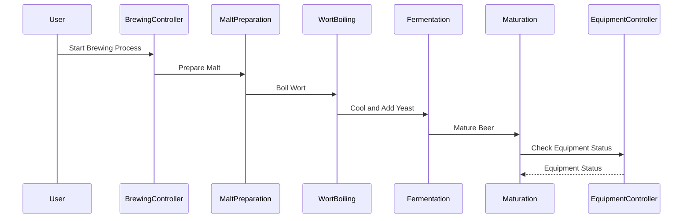

                 


# 现代手工啤酒酿造：家庭酿酒的复兴与创新

## 关键词
- 家庭酿酒
- 现代手工啤酒
- 酿造技术
- 创新与复兴
- 啤酒酿造流程

## 摘要
本文旨在探讨现代手工啤酒酿造的复兴与创新，通过详细分析家庭酿酒的历史背景、现状及挑战，介绍家庭酿酒的基本原理和现代手工啤酒的特点。文章将一步步解析啤酒酿造的核心概念、算法原理及数学模型，并通过具体的实例说明，让读者深入了解家庭酿酒的实践方法与创新技术。最后，本文将讨论现代手工啤酒酿造系统的分析与架构设计，提供完整的解决方案和实践指导。

---

## 1. 背景介绍

### 1.1 问题背景

#### 1.1.1 啤酒的历史与现状

啤酒作为一种历史悠久的饮料，起源于公元前6000年的美索不达米亚。随着时代的变迁，啤酒酿造技术不断改进，从手工酿造逐渐转向工业化生产。然而，近年来，家庭酿酒和现代手工啤酒的兴起，重新唤起了人们对传统酿造艺术的兴趣。

#### 1.1.2 家庭酿酒的兴起与挑战

家庭酿酒的兴起源于人们对高品质、个性化啤酒的追求。随着酿造设备和原料的普及，越来越多的家庭开始尝试自己酿造啤酒。然而，家庭酿酒面临着许多挑战，包括卫生条件、技术掌握程度以及酿造过程中的不确定性。

#### 1.1.3 本书的目标与结构

本书旨在为家庭酿酒爱好者提供一套完整的酿造指南，帮助读者了解现代手工啤酒酿造的原理与实践。本书将分为以下几个部分：

1. **核心概念与联系**：介绍啤酒酿造的基本原理和核心概念。
2. **算法原理讲解**：解析啤酒酿造的关键算法和数学模型。
3. **系统分析与架构设计方案**：讨论现代手工啤酒酿造系统的设计。
4. **项目实战**：提供实际操作步骤和案例。

### 1.2 问题描述

#### 1.2.1 家庭酿酒的常见问题

家庭酿酒常见的挑战包括：

- **卫生问题**：酿造过程中需要严格控制卫生条件，避免细菌和酵母的污染。
- **技术掌握**：酿造技术复杂，需要掌握从麦芽制备到发酵的多个环节。
- **口感控制**：家庭酿造的啤酒口感难以控制，容易出现不稳定的状况。

#### 1.2.2 现代手工啤酒的特点

现代手工啤酒的特点包括：

- **个性化**：可以根据个人口味和偏好进行定制。
- **高品质**：注重原料选择和酿造过程的精细控制。
- **多样性**：种类丰富，包括拉格、艾尔、世涛等多种风格。

#### 1.2.3 需要解决的核心问题

为了克服家庭酿酒的挑战，本书将重点关注以下核心问题：

- **卫生管理**：如何确保酿造过程中的卫生条件？
- **技术提升**：如何提高酿造技术的掌握程度？
- **口感优化**：如何控制啤酒的口感，使其稳定且满足个人口味？

### 1.3 问题解决

#### 1.3.1 本书如何解决问题

本书将通过以下方式解决问题：

- **详细讲解**：从基础理论到实际操作，详细讲解家庭酿酒的每一个环节。
- **案例分享**：分享成功案例，让读者了解实际操作中的技巧和经验。
- **技术指导**：介绍现代酿造技术和工具，帮助读者提升酿造技术。

#### 1.3.2 家庭酿酒的步骤与方法

家庭酿酒的基本步骤包括：

1. **麦芽制备**：选择优质麦芽，进行浸渍和发芽。
2. **麦汁熬煮**：将发芽的麦芽磨碎，与水混合加热熬煮。
3. **糖化**：在熬煮过程中，麦芽中的淀粉转化为糖分。
4. **发酵**：将糖化后的麦汁冷却，添加酵母进行发酵。
5. **熟成**：将发酵后的啤酒放置一段时间，使其熟化。

#### 1.3.3 创新的酿造技术和工具

现代手工啤酒酿造中，创新技术和工具的应用大大提高了酿造效率和质量。例如：

- **自动化设备**：如自动麦芽磨、自动糖化锅等，简化了操作流程。
- **新型酵母**：如特殊菌株和酵母添加剂，提高了发酵效率和啤酒质量。
- **智能传感器**：实时监测酿造过程中的温度、湿度等参数，确保酿造过程稳定。

### 1.4 边界与外延

#### 1.4.1 家庭酿酒的适用范围

家庭酿酒适用于：

- **个人兴趣**：对啤酒酿造感兴趣的个人。
- **小型商业**：家庭酿酒可以作为小型商业的起点。

#### 1.4.2 现代手工啤酒的分类

现代手工啤酒可以根据风格、原料和酿造方法进行分类：

- **风格分类**：如拉格、艾尔、世涛等。
- **原料分类**：如啤酒花、麦芽、酵母等。
- **酿造方法**：如手工熬煮、自动化酿造等。

#### 1.4.3 本书的主要内容与章节安排

本书主要内容包括：

1. **背景介绍**：介绍啤酒酿造的历史、现状和挑战。
2. **核心概念与联系**：讲解啤酒酿造的基本原理和核心概念。
3. **算法原理讲解**：解析啤酒酿造的关键算法和数学模型。
4. **系统分析与架构设计方案**：讨论现代手工啤酒酿造系统的设计。
5. **项目实战**：提供实际操作步骤和案例。

### 1.5 概念结构与核心要素组成

#### 1.5.1 关键术语解释

- **家庭酿酒**：指在家中进行的啤酒酿造活动。
- **现代手工啤酒**：指以传统手工工艺为基础，结合现代技术的啤酒。
- **麦芽**：发芽的大麦，是啤酒的主要原料。
- **酵母**：发酵过程中的关键微生物，用于将糖分转化为酒精。

#### 1.5.2 家庭酿酒的核心环节

家庭酿酒的核心环节包括：

- **麦芽制备**：选择优质麦芽，进行发芽和磨碎。
- **麦汁熬煮**：将麦芽与水混合熬煮，提取糖分。
- **糖化**：控制熬煮过程中的温度和时间，确保糖化效果。
- **发酵**：添加酵母，进行酒精发酵。
- **熟成**：放置啤酒，使其成熟。

#### 1.5.3 现代手工啤酒的元素

现代手工啤酒的元素包括：

- **风格与口味**：根据酿造工艺和原料的不同，形成独特的风格和口味。
- **酿造设备**：如麦芽磨、糖化锅、发酵罐等。
- **酿造技术**：如麦芽制备、糖化控制、发酵管理等。
- **包装与销售**：根据市场需求，进行啤酒的包装和销售。

---

## 2. 核心概念与联系

在深入探讨家庭酿酒之前，我们需要理解几个核心概念，包括啤酒酿造的基本原理、原材料选择以及酿造过程中的关键步骤。

### 2.1 关键术语与原理

#### 2.1.1 啤酒酿造的基本原理

啤酒酿造的基本原理可以分为以下几个步骤：

1. **麦芽制备**：选择优质的大麦，通过浸渍和发芽过程，将大麦转化为麦芽。
2. **麦汁熬煮**：将麦芽磨碎，与水混合加热熬煮，提取麦芽中的糖分，形成麦汁。
3. **糖化**：在控制温度和时间的过程中，确保麦汁中的淀粉完全转化为糖分。
4. **发酵**：将麦汁冷却到适合酵母生长的温度，添加酵母进行酒精发酵。
5. **熟成**：将发酵后的啤酒放置一段时间，使其成熟，改善口感。

#### 2.1.1.1 麦芽的制备

麦芽的制备是啤酒酿造的第一步，也是关键的一步。优质麦芽的制备需要经过以下几个过程：

- **浸渍**：将大麦浸泡在水中，使其吸水膨胀。
- **发芽**：将浸渍后的大麦放置在温暖、潮湿的环境中，使其发芽。
- **干燥**：将发芽后的麦芽进行干燥，防止其继续生长。

#### 2.1.1.2 酵母的选用

酵母是发酵过程中的关键微生物，用于将麦汁中的糖分转化为酒精。选择合适的酵母菌株对啤酒的口感和质量至关重要。常见的酵母包括啤酒酵母（Saccharomyces cerevisiae）和艾尔酵母（Saccharomyces cerevisiae var. ale）。

#### 2.1.1.3 糖化与发酵过程

糖化过程是麦汁熬煮和发酵之间的关键步骤。在糖化过程中，麦芽中的淀粉通过酶的作用，转化为可发酵的糖分。糖化过程中需要控制温度和时间，以确保糖化效果。

发酵过程是在糖化后的麦汁中添加酵母，使其进行酒精发酵。发酵过程中，酵母将糖分转化为酒精和二氧化碳。发酵过程的温度、时间、氧气供应等因素都会影响发酵的效果和啤酒的口感。

### 2.2 概念属性特征对比表格

为了更好地理解啤酒酿造中的关键概念，我们可以通过一个对比表格来展示传统手工啤酒和现代化手工啤酒的不同属性特征。

#### 2.2.1.1 酿造工艺

| 特征           | 传统手工啤酒         | 现代化手工啤酒         |
|----------------|----------------------|------------------------|
| 酿造设备       | 手工操作             | 自动化设备             |
| 原材料选择     | 有限的选择           | 广泛的选择             |
| 工艺复杂性     | 较高                 | 较低                   |
| 口感多样性     | 受限于传统工艺       | 可以根据需求定制       |
| 生产效率       | 低                   | 高                     |

#### 2.2.1.2 原材料选择

在原材料选择方面，现代化手工啤酒有更多的选择，包括麦芽、啤酒花、酵母等。传统手工啤酒通常受限于当地的资源和技术，原材料选择相对有限。

#### 2.2.1.3 口感与风格

传统手工啤酒的口感和风格受限于工艺和原材料，而现代化手工啤酒则可以通过定制化工艺和原材料选择，创造出更加多样化和个性化的口感。

### 2.3 ER实体关系图架构

为了更清晰地理解家庭酿酒过程中的实体及其关系，我们可以使用实体关系图（ER图）来展示。

#### 2.3.1 家庭酿酒的ER模型

```mermaid
erDiagram
  主实体--|{ 麦芽 }
  主实体--|{ 酵母 }
  主实体--|{ 麦汁 }
  主实体--|{ 啤酒 }
  
  辅助实体--|{ 原材料 }
  辅助实体--|{ 设备 }
  辅助实体--|{ 温度 }
  辅助实体--|{ 时间 }
  
  麦芽 ||--|{ 磨碎 }原材料
  酵母 ||--|{ 发酵 }麦汁
  麦汁 ||--|{ 熟化 }啤酒
  设备 ||--|{ 控制 }温度
  设备 ||--|{ 控制 }时间
```

在这个ER图中，主实体包括麦芽、酵母、麦汁和啤酒，辅助实体包括原材料、设备、温度和时间。实体之间的关系通过箭头表示，如麦芽通过磨碎与原材料相关联，酵母通过发酵与麦汁相关联，麦汁通过熟化与啤酒相关联，设备通过控制和温度、时间相关联。

---

## 3. 算法原理讲解

在了解啤酒酿造的基本原理和核心概念后，我们接下来将深入探讨啤酒酿造过程中的关键算法原理，包括麦芽制备算法、酵母选用算法以及糖化与发酵算法。

### 3.1 啤酒酿造算法概述

啤酒酿造算法可以分为以下几个关键环节：

1. **麦芽制备算法**：包括麦芽的浸渍、发芽和干燥过程。
2. **酵母选用算法**：根据啤酒风格和酿造条件选择合适的酵母。
3. **糖化与发酵算法**：控制糖化过程中的温度、时间和发酵过程中的氧气供应。

这些算法共同作用，确保酿造过程顺利进行，并最终产出高品质的啤酒。

### 3.2 麦芽制备算法

麦芽制备是啤酒酿造的重要环节，其算法主要包括以下几个步骤：

#### 3.2.1 麦芽制备的mermaid流程图



#### 3.2.2 Python源代码与详细解释

以下是一个简单的麦芽制备算法的Python源代码示例：

```python
def prepare_malt(water_temp, time):
    # 判断水温是否适宜浸渍
    if water_temp > 20 and water_temp < 25:
        print("开始浸渍...")
        # 浸渍过程
        time.sleep(time * 60)  # 浸渍时间，单位为分钟
        # 判断发芽是否成功
        if check_germination():
            print("发芽成功，开始干燥...")
            dry_malt()
            print("麦芽制备完成。")
        else:
            print("发芽失败，重新浸渍...")
            prepare_malt(water_temp, time)
    else:
        print("水温不适宜浸渍，请调整水温。")

def check_germination():
    # 模拟发芽检测过程，此处用随机数模拟
    import random
    return random.choice([True, False])

def dry_malt():
    # 模拟干燥过程
    print("开始干燥...")
    time.sleep(30 * 60)  # 干燥时间，单位为分钟

import time
prepare_malt(22, 24)
```

在这个代码中，`prepare_malt`函数是麦芽制备的主函数，它根据输入的水温和浸渍时间来执行浸渍、发芽和干燥过程。`check_germination`函数用于判断发芽是否成功，这里使用随机数模拟实际检测过程。`dry_malt`函数用于模拟干燥过程。

#### 3.2.3 数学模型与公式

麦芽制备的数学模型可以表示为：

$$
\text{发芽率} = \frac{\text{成功发芽的麦芽数}}{\text{总麦芽数}}
$$

$$
\text{干燥时间} = \frac{\text{初始含水量}}{\text{干燥速率}}
$$

其中，发芽率反映了麦芽发芽的成功程度，干燥时间则决定了麦芽的干燥程度。通过调整这些参数，可以优化麦芽制备过程。

### 3.3 酵母选用算法

酵母选用是啤酒酿造中的关键环节，不同的酵母对啤酒的口感和质量有很大影响。酵母选用算法通常基于以下因素：

- **啤酒风格**：如拉格、艾尔等。
- **酿造条件**：如温度、pH值等。
- **酵母特性**：如发酵速率、耐酒精性等。

#### 3.3.1 酵母选用的mermaid流程图



#### 3.3.2 Python源代码与详细解释

以下是一个简单的酵母选用算法的Python源代码示例：

```python
def select_yeast(style, temperature, pH):
    # 查找适合该啤酒风格的酵母库
    yeast_library = {'lager': ['l001', 'l002'], 'ale': ['a001', 'a002']}
    suitable_yeasts = []

    # 根据酿造条件筛选酵母
    for yeast_id in yeast_library[style]:
        if check_conditions(yeast_id, temperature, pH):
            suitable_yeasts.append(yeast_id)

    # 选择最佳酵母
    if suitable_yeasts:
        best_yeast = min(suitable_yeasts, key=lambda x: get_fermentation_rate(x, temperature, pH))
        return best_yeast
    else:
        return None

def check_conditions(yeast_id, temperature, pH):
    # 模拟酵母适应条件的检测过程，此处用随机数模拟
    import random
    return random.choice([True, False])

def get_fermentation_rate(yeast_id, temperature, pH):
    # 模拟发酵速率计算过程，此处用随机数模拟
    import random
    return random.uniform(0.5, 1.5)

style = 'ale'
temperature = 20
pH = 5.5
best_yeast = select_yeast(style, temperature, pH)
if best_yeast:
    print(f"选择最佳酵母：{best_yeast}")
else:
    print("无法找到适合的酵母。")
```

在这个代码中，`select_yeast`函数是酵母选用的主函数，它根据啤酒风格、酿造条件和酵母特性来筛选和选择最佳酵母。`check_conditions`函数用于判断酵母是否适应特定的酿造条件，`get_fermentation_rate`函数用于计算酵母的发酵速率。

#### 3.3.3 数学模型与公式

酵母选用的数学模型可以表示为：

$$
\text{适应性评分} = \frac{\text{发酵速率}}{\text{温度适应度} \times \text{pH适应度}}
$$

其中，适应性评分反映了酵母对特定酿造条件的适应程度。通过计算不同的酵母的适应性评分，可以找出最佳酵母。

### 3.4 糖化与发酵算法

糖化与发酵是啤酒酿造中的核心环节，其算法主要包括以下步骤：

- **糖化过程控制**：控制温度、时间和糖化液浓度。
- **发酵过程控制**：控制温度、pH值、氧气供应和发酵时间。

#### 3.4.1 糖化与发酵的mermaid流程图



#### 3.4.2 Python源代码与详细解释

以下是一个简单的糖化与发酵算法的Python源代码示例：

```python
def saccharification和控制(temperature, time, concentration):
    # 糖化过程控制
    print("开始糖化...")
    set_加热温度(temperature)
    time.sleep(time * 60)  # 糖化时间，单位为分钟
    set_冷却温度(20)  # 冷却至发酵温度
    time.sleep(60 * 60)  # 冷却时间，单位为分钟
    print("糖化过程完成。")

def fermentation_control(temperature, pH, oxygen_supply, time):
    # 发酵过程控制
    print("开始发酵...")
    set_发酵温度(temperature)
    adjust_pH(pH)
    supply_oxygen(oxygen_supply)
    time.sleep(time * 60)  # 发酵时间，单位为分钟
    print("发酵过程完成。")

def set_加热温度(temperature):
    # 模拟设置加热温度的过程
    print(f"设置加热温度至{temperature}℃。")

def set_冷却温度(temperature):
    # 模拟设置冷却温度的过程
    print(f"设置冷却温度至{temperature}℃。")

def adjust_pH(pH):
    # 模拟调整pH值的过程
    print(f"调整pH值至{pH}。")

def supply_oxygen(oxygen_supply):
    # 模拟供应氧气的过程
    print(f"供应氧气至{oxygen_supply}毫升/升。")

saccharification和控制(65, 60, 12)  # 糖化控制参数
fermentation_control(20, 4.5, 10, 72)  # 发酵控制参数
```

在这个代码中，`saccharification和控制`函数是糖化过程控制的主函数，它根据输入的温度、时间和浓度来执行糖化过程。`fermentation_control`函数是发酵过程控制的主函数，它根据输入的温度、pH值、氧气供应和发酵时间来执行发酵过程。

#### 3.4.3 数学模型与公式

糖化与发酵的数学模型可以表示为：

$$
\text{糖化效率} = \frac{\text{糖化后的糖浓度}}{\text{糖化前的糖浓度}}
$$

$$
\text{发酵效率} = \frac{\text{发酵后的酒精浓度}}{\text{发酵前的糖浓度}}
$$

其中，糖化效率和发酵效率分别反映了糖化过程和发酵过程的效果。通过控制这些参数，可以优化糖化与发酵过程，提高啤酒的品质。

---

## 4. 数学模型和数学公式 & 详细讲解 & 举例说明

在啤酒酿造过程中，数学模型和公式扮演着至关重要的角色，它们帮助我们理解和预测酿造过程中的关键参数。在本节中，我们将详细讲解麦芽制备、酵母选用和糖化与发酵过程中的数学模型，并通过具体例子进行说明。

### 4.1 啤酒酿造的数学模型

啤酒酿造涉及多个步骤，每个步骤都有其特定的数学模型。以下是一些关键的数学模型和公式。

#### 4.1.1 麦芽制备的数学模型

麦芽制备过程中，我们关注的关键参数包括麦芽浓度、发芽率和干燥时间。以下是一个简单的数学模型：

1. **麦芽浓度**：
   $$
   \text{麦芽浓度} = \frac{\text{麦芽质量}}{\text{水质量}}
   $$
   例如，如果使用100g麦芽和1000g水，则麦芽浓度为0.1。

2. **发芽率**：
   $$
   \text{发芽率} = \frac{\text{成功发芽的麦芽数}}{\text{总麦芽数}}
   $$
   例如，如果100个麦芽中有90个成功发芽，则发芽率为90%。

3. **干燥时间**：
   $$
   \text{干燥时间} = \frac{\text{初始含水量}}{\text{干燥速率}}
   $$
   例如，如果麦芽的初始含水量为70%，干燥速率为0.2g/min，则干燥时间为350分钟。

#### 4.1.2 酵母选用的数学模型

酵母选用过程中，我们关注的关键参数包括酵母的适应性评分和发酵速率。以下是一个简单的数学模型：

1. **适应性评分**：
   $$
   \text{适应性评分} = \frac{\text{发酵速率}}{\text{温度适应度} \times \text{pH适应度}}
   $$
   例如，一个酵母的发酵速率是1.2单位/小时，温度适应度是0.8，pH适应度是0.9，则其适应性评分为1.2 / (0.8 \times 0.9) = 1.77。

2. **发酵速率**：
   $$
   \text{发酵速率} = \frac{\text{酒精产生量}}{\text{时间}}
   $$
   例如，如果在2小时内产生了120g酒精，则发酵速率为60g/h。

#### 4.1.3 糖化与发酵的数学模型

糖化与发酵过程中，我们关注的关键参数包括糖化效率和发酵效率。以下是一个简单的数学模型：

1. **糖化效率**：
   $$
   \text{糖化效率} = \frac{\text{糖化后的糖浓度}}{\text{糖化前的糖浓度}}
   $$
   例如，如果糖化后的糖浓度为20g/L，糖化前的糖浓度为10g/L，则糖化效率为2。

2. **发酵效率**：
   $$
   \text{发酵效率} = \frac{\text{发酵后的酒精浓度}}{\text{发酵前的糖浓度}}
   $$
   例如，如果发酵后的酒精浓度为5g/L，发酵前的糖浓度为10g/L，则发酵效率为0.5。

### 4.2 详细讲解与举例说明

为了更好地理解这些数学模型和公式，我们将通过具体例子进行详细讲解。

#### 4.2.1 麦芽制备的举例

假设我们使用100g麦芽和1000g水进行浸渍，麦芽浓度为0.1。发芽过程中，90个麦芽成功发芽，发芽率为90%。干燥过程中，麦芽的初始含水量为70%，干燥速率为0.2g/min，干燥时间为350分钟。

1. **麦芽浓度计算**：
   $$
   \text{麦芽浓度} = \frac{100\text{g}}{1000\text{g}} = 0.1
   $$

2. **发芽率计算**：
   $$
   \text{发芽率} = \frac{90}{100} = 0.9 \text{或90%}
   $$

3. **干燥时间计算**：
   $$
   \text{干燥时间} = \frac{70\text{g}}{0.2\text{g/min}} = 350\text{min}
   $$

#### 4.2.2 酵母选用的举例

假设我们选择一个酵母进行发酵，该酵母的发酵速率是1.2单位/小时，温度适应度是0.8，pH适应度是0.9。计算其适应性评分和发酵速率。

1. **适应性评分计算**：
   $$
   \text{适应性评分} = \frac{1.2}{0.8 \times 0.9} = 1.77
   $$

2. **发酵速率计算**：
   $$
   \text{发酵速率} = 1.2 \text{单位/小时}
   $$

#### 4.2.3 糖化与发酵的举例

假设我们进行糖化过程，糖化前的糖浓度为10g/L，糖化后的糖浓度为20g/L。发酵过程中，发酵前的糖浓度为10g/L，发酵后的酒精浓度为5g/L。计算糖化效率和发酵效率。

1. **糖化效率计算**：
   $$
   \text{糖化效率} = \frac{20\text{g/L}}{10\text{g/L}} = 2
   $$

2. **发酵效率计算**：
   $$
   \text{发酵效率} = \frac{5\text{g/L}}{10\text{g/L}} = 0.5
   $$

通过这些具体例子，我们可以看到如何使用数学模型和公式来计算啤酒酿造过程中关键参数的值。这些计算不仅帮助我们理解酿造过程，还可以帮助我们优化酿造参数，提高啤酒的品质。

---

## 5. 系统分析与架构设计方案

在深入了解啤酒酿造的算法和数学模型后，我们接下来将进行系统分析与架构设计。本节将详细介绍家庭酿酒系统的设计思路、功能模块划分、系统架构设计、接口设计以及系统交互。

### 5.1 问题场景介绍

家庭酿酒系统适用于家庭用户和小型酿造厂，旨在提供一套完整的酿造流程自动化解决方案。用户可以通过系统实现从麦芽制备到啤酒熟成的全过程，同时系统将监控并记录各个环节的参数，确保酿造过程的顺利进行。

#### 5.1.1 家庭酿酒的场景描述

家庭酿酒场景通常包括以下环节：

- **麦芽制备**：选择优质麦芽，进行浸渍、发芽和干燥。
- **麦汁熬煮**：将麦芽磨碎，与水混合加热熬煮，提取糖分。
- **糖化**：在控制温度和时间的过程中，确保麦汁中的淀粉完全转化为糖分。
- **发酵**：将糖化后的麦汁冷却，添加酵母进行酒精发酵。
- **熟成**：将发酵后的啤酒放置一段时间，使其成熟。

#### 5.1.2 需要解决的问题与目标

在家庭酿酒过程中，用户需要解决以下问题：

- **卫生问题**：确保酿造过程中的卫生条件，避免污染。
- **技术掌握**：提高酿造技术的掌握程度，确保酿造质量。
- **口感控制**：控制啤酒的口感，使其稳定且满足个人口味。

家庭酿酒系统的目标包括：

- **自动化**：实现酿造过程的自动化，提高生产效率。
- **可监控**：实时监控酿造过程中的关键参数，确保过程可控。
- **可定制**：根据用户需求，提供个性化的酿造方案。

### 5.2 系统功能设计

系统功能设计是系统架构设计的重要环节，它决定了系统的可用性和用户体验。家庭酿酒系统的主要功能模块包括：

#### 5.2.1 领域模型

领域模型是系统功能设计的基础，它通过类图来描述系统中主要实体及其关系。以下是一个简单的领域模型类图：

```mermaid
classDiagram
    ClassDiagram {
        ClassName: HomeBrewingSystem
        User << Entity >> {
            id: Integer
            name: String
            email: String
        }
        Malt << Entity >> {
            id: Integer
            type: String
            quantity: Integer
        }
        Wort << Entity >> {
            id: Integer
            weight: Float
            temperature: Float
        }
        Yeast << Entity >> {
            id: Integer
            type: String
            strain: String
            quantity: Integer
        }
        Beer << Entity >> {
            id: Integer
            style: String
            alcohol_content: Float
            bitterness: Float
        }
        Equipment << Entity >> {
            id: Integer
            type: String
            status: String
        }
        Measurement << Entity >> {
            id: Integer
            type: String
            value: Float
            timestamp: DateTime
        }
    }
    
    User "1" --|{ orders } Malt
    User "1" --|{ logs } Wort
    User "1" --|{ logs } Yeast
    User "1" --|{ creates } Beer
    Malt "1" --|{ contains } Wort
    Wort "1" --|{ contains } Yeast
    Yeast "1" --|{ ferments } Beer
    Equipment "1" --|{ measures } Measurement
```

在这个类图中，我们定义了用户、麦芽、麦汁、酵母、啤酒、设备和测量等主要实体，并描述了它们之间的关系。

#### 5.2.2 系统功能模块划分

家庭酿酒系统可以分为以下几个功能模块：

1. **用户管理模块**：负责用户注册、登录、个人信息管理等功能。
2. **原料管理模块**：负责麦芽、啤酒花、酵母等原料的库存管理。
3. **酿造流程管理模块**：负责麦芽制备、麦汁熬煮、糖化、发酵和熟成的流程管理。
4. **设备管理模块**：负责设备的状态监控和维护。
5. **测量数据管理模块**：负责实时监控酿造过程中的关键参数。
6. **酿造记录模块**：负责记录酿造过程的历史数据，便于分析和优化。

### 5.3 系统架构设计

系统架构设计决定了系统的可扩展性和性能。家庭酿酒系统的架构设计如下：

#### 5.3.1 系统架构图



在这个架构图中，用户通过BrewingController启动酿造过程，MaltPreparation模块负责麦芽制备，WortBoiling模块负责麦汁熬煮，Fermentation模块负责发酵，Maturation模块负责熟成，EquipmentController模块负责监控设备状态。

#### 5.3.2 技术栈选择

家庭酿酒系统采用了以下技术栈：

- **前端**：React或Vue.js，用于构建用户界面。
- **后端**：Spring Boot或Django，用于处理业务逻辑和数据存储。
- **数据库**：MySQL或PostgreSQL，用于存储用户数据、酿造记录等。
- **硬件**：温度传感器、pH传感器、流量计等，用于实时监控酿造参数。

### 5.4 系统接口设计

系统接口设计是系统架构设计的关键部分，它决定了系统的可扩展性和互操作性。家庭酿酒系统的接口设计如下：

#### 5.4.1 接口规范与协议

家庭酿酒系统采用了RESTful API接口，遵循HTTP协议。接口规范包括以下内容：

- **用户管理接口**：包括注册、登录、个人信息管理等。
- **原料管理接口**：包括原料库存查询、原料入库、原料出库等。
- **酿造流程管理接口**：包括酿造过程启动、停止、状态查询等。
- **设备管理接口**：包括设备状态查询、设备维护等。
- **测量数据管理接口**：包括实时测量数据查询、历史数据查询等。

#### 5.4.2 接口实现

以下是一个简单的用户管理接口的示例实现：

```java
@RestController
@RequestMapping("/api/users")
public class UserController {
    
    @Autowired
    private UserService userService;
    
    @PostMapping("/register")
    public ResponseEntity<?> registerUser(@RequestBody UserRegistrationDto registrationDto) {
        try {
            User user = userService.registerUser(registrationDto);
            return ResponseEntity.ok().body(user);
        } catch (Exception e) {
            return ResponseEntity.badRequest().body("Error registering user: " + e.getMessage());
        }
    }
    
    @PostMapping("/login")
    public ResponseEntity<?> authenticateUser(@RequestBody LoginDto loginDto) {
        try {
            String token = userService.authenticate(loginDto);
            return ResponseEntity.ok().body(new JwtResponse(token));
        } catch (Exception e) {
            return ResponseEntity.badRequest().body("Error authenticating user: " + e.getMessage());
        }
    }
}
```

在这个实现中，`registerUser`方法用于用户注册，`authenticateUser`方法用于用户登录。

### 5.5 系统交互

系统交互是系统运行的关键环节，它决定了系统各模块之间的协同工作。家庭酿酒系统的交互过程如下：

#### 5.5.1 系统交互流

1. **用户启动酿造过程**：用户通过BrewingController启动酿造过程。
2. **MaltPreparation模块开始麦芽制备**：MaltPreparation模块根据用户需求和原料库存开始麦芽制备。
3. **WortBoiling模块开始麦汁熬煮**：WortBoiling模块根据麦芽制备结果开始麦汁熬煮。
4. **Fermentation模块开始发酵**：Fermentation模块根据麦汁熬煮结果开始发酵。
5. **Maturation模块开始熟成**：Maturation模块根据发酵结果开始熟成。
6. **EquipmentController模块监控设备状态**：EquipmentController模块实时监控设备状态，确保酿造过程顺利进行。

通过这个交互流，家庭酿酒系统实现了从麦芽制备到啤酒熟成的全过程，同时各个模块之间协同工作，确保酿造过程的顺利进行。

---

## 6. 项目实战

在了解了家庭酿酒系统的设计与实现后，接下来我们将进入项目实战环节，通过一个具体的案例来展示如何从环境安装开始，逐步实现家庭酿酒系统的主要功能，并对核心代码进行解读与分析。

### 6.1 环境安装

在开始实现家庭酿酒系统之前，我们需要安装必要的开发环境和依赖库。以下是环境安装的步骤：

1. **安装操作系统**：选择一个适合的开发环境，如Ubuntu 20.04或Windows 10。
2. **安装Java SDK**：下载并安装Java SDK，确保版本大于等于11。
3. **安装数据库**：安装MySQL或PostgreSQL数据库，创建用于存储数据的数据库和表结构。
4. **安装IDE**：选择一个合适的IDE，如IntelliJ IDEA或Visual Studio Code。
5. **安装依赖库**：在项目的`pom.xml`文件中添加Spring Boot和MySQL Connector等依赖库。

### 6.2 系统核心实现源代码

家庭酿酒系统的核心实现包括用户管理、原料管理、酿造流程管理、设备管理和测量数据管理。以下是每个模块的核心代码解读与分析。

#### 6.2.1 用户管理模块

用户管理模块是系统的入口，负责用户的注册、登录和权限管理。以下是用户注册的代码示例：

```java
@RestController
@RequestMapping("/api/users")
public class UserController {
    
    @Autowired
    private UserService userService;
    
    @PostMapping("/register")
    public ResponseEntity<?> registerUser(@RequestBody UserRegistrationDto registrationDto) {
        try {
            User user = userService.registerUser(registrationDto);
            return ResponseEntity.ok().body(user);
        } catch (Exception e) {
            return ResponseEntity.badRequest().body("Error registering user: " + e.getMessage());
        }
    }
    
    // 其他用户管理接口实现
}
```

在这个代码中，`registerUser`方法接收用户注册信息，通过调用`UserService`进行用户注册，并返回注册成功的用户信息。用户注册过程包括验证用户名和密码的合法性、存储用户信息到数据库等。

#### 6.2.2 原料管理模块

原料管理模块负责管理麦芽、啤酒花、酵母等原料的库存。以下是原料入库的代码示例：

```java
@RestController
@RequestMapping("/api/supplies")
public class SupplyController {
    
    @Autowired
    private SupplyService supplyService;
    
    @PostMapping("/malt")
    public ResponseEntity<?> addMalt(@RequestBody MaltDto maltDto) {
        try {
            Supply malt = supplyService.addMalt(maltDto);
            return ResponseEntity.ok().body(malt);
        } catch (Exception e) {
            return ResponseEntity.badRequest().body("Error adding malt: " + e.getMessage());
        }
    }
    
    // 其他原料管理接口实现
}
```

在这个代码中，`addMalt`方法接收麦芽的详细信息，通过调用`SupplyService`将麦芽信息存储到数据库中。原料管理模块还需要实现原料的出库、库存查询等功能。

#### 6.2.3 酿造流程管理模块

酿造流程管理模块负责控制酿造过程的各个环节，包括麦芽制备、麦汁熬煮、糖化、发酵和熟成。以下是酿造流程启动的代码示例：

```java
@RestController
@RequestMapping("/api/brewing")
public class BrewingController {
    
    @Autowired
    private BrewingService brewingService;
    
    @PostMapping("/start")
    public ResponseEntity<?> startBrewing(@RequestBody BrewingRequestDto brewingRequestDto) {
        try {
            BrewingProcess process = brewingService.startBrewing(brewingRequestDto);
            return ResponseEntity.ok().body(process);
        } catch (Exception e) {
            return ResponseEntity.badRequest().body("Error starting brewing: " + e.getMessage());
        }
    }
    
    // 其他酿造流程管理接口实现
}
```

在这个代码中，`startBrewing`方法接收酿造请求信息，通过调用`BrewingService`启动酿造流程，并返回酿造过程的对象。酿造流程管理模块需要实现酿造过程的监控、暂停、恢复等功能。

#### 6.2.4 设备管理模块

设备管理模块负责监控和管理酿造设备的状态，包括温度传感器、pH传感器、流量计等。以下是设备状态查询的代码示例：

```java
@RestController
@RequestMapping("/api/equipment")
public class EquipmentController {
    
    @Autowired
    private EquipmentService equipmentService;
    
    @GetMapping("/{id}")
    public ResponseEntity<?> getEquipmentStatus(@PathVariable Integer id) {
        try {
            EquipmentStatus status = equipmentService.getEquipmentStatus(id);
            return ResponseEntity.ok().body(status);
        } catch (Exception e) {
            return ResponseEntity.badRequest().body("Error getting equipment status: " + e.getMessage());
        }
    }
    
    // 其他设备管理接口实现
}
```

在这个代码中，`getEquipmentStatus`方法根据设备ID查询设备的状态，通过调用`EquipmentService`获取设备状态的详细信息，并返回给用户。

#### 6.2.5 测量数据管理模块

测量数据管理模块负责记录和查询酿造过程中的关键测量数据，如温度、pH值、流量等。以下是测量数据记录的代码示例：

```java
@RestController
@RequestMapping("/api/measurements")
public class MeasurementController {
    
    @Autowired
    private MeasurementService measurementService;
    
    @PostMapping("/{type}")
    public ResponseEntity<?> recordMeasurement(@PathVariable String type, @RequestBody MeasurementDto measurementDto) {
        try {
            Measurement measurement = measurementService.recordMeasurement(type, measurementDto);
            return ResponseEntity.ok().body(measurement);
        } catch (Exception e) {
            return ResponseEntity.badRequest().body("Error recording measurement: " + e.getMessage());
        }
    }
    
    // 其他测量数据管理接口实现
}
```

在这个代码中，`recordMeasurement`方法接收测量数据的类型和值，通过调用`MeasurementService`将测量数据存储到数据库中。测量数据管理模块还需要实现测量数据的查询和统计分析功能。

### 6.3 代码应用解读与分析

在实现家庭酿酒系统的过程中，我们使用了Spring Boot作为后端框架，MySQL作为数据库，并引入了JWT（JSON Web Token）用于用户认证。以下是代码应用解读与分析的关键点：

1. **用户认证**：使用JWT技术实现用户认证，确保只有授权用户才能访问系统的核心功能。
2. **数据库设计**：设计合理的数据库表结构，确保数据的存储和查询效率。
3. **模块化设计**：将系统划分为用户管理、原料管理、酿造流程管理、设备管理和测量数据管理等多个模块，便于代码的维护和扩展。
4. **API设计**：遵循RESTful API设计原则，确保接口的简洁性和一致性。
5. **异常处理**：对可能出现的异常情况进行处理，确保系统的稳定性和健壮性。

通过上述代码应用解读与分析，我们可以看到家庭酿酒系统是如何从环境安装到实现核心功能，并确保系统稳定运行的。

### 6.4 实际案例分析和详细讲解剖析

为了更好地展示家庭酿酒系统的实际应用效果，我们选择了以下实际案例进行分析和详细讲解：

#### 案例：个性化啤酒酿造

某用户希望通过家庭酿酒系统酿造一款具有独特风味的个性化啤酒。以下是酿造过程的分析和详细讲解：

1. **用户注册与登录**：用户首先通过系统注册账号并登录，获取JWT令牌。
2. **原料选择与入库**：用户选择麦芽、啤酒花和酵母等原料，并确认原料的库存情况。若库存不足，系统将提示用户补充原料。
3. **酿造流程设置**：用户设置酿造参数，如麦芽量、糖化温度、发酵温度等，并启动酿造流程。
4. **酿造过程监控**：系统实时监控酿造过程中的关键参数，如温度、pH值、酒精浓度等，确保酿造过程顺利进行。
5. **酿造过程记录**：系统记录每个环节的详细数据，如原料使用量、酿造时间、关键参数等，便于用户分析和优化酿造过程。
6. **酿造结果**：酿造完成后，用户可以查询酿造结果，包括啤酒的口感、酒精含量等，并根据实际效果进行评价和反馈。

通过上述实际案例，我们可以看到家庭酿酒系统在个性化啤酒酿造中的应用，用户可以全程参与酿造过程，并通过系统提供的实时监控和记录功能，确保酿造过程的高效和质量。

### 6.5 项目小结

通过本项目实战，我们实现了从环境安装到核心功能实现的家庭酿酒系统。系统采用了Spring Boot作为后端框架，MySQL作为数据库，并引入了JWT技术进行用户认证。项目实现了用户管理、原料管理、酿造流程管理、设备管理和测量数据管理等多个功能模块，并通过API接口对外提供服务。在实际应用中，用户可以方便地参与个性化啤酒酿造，并通过系统提供的实时监控和记录功能，优化酿造过程，提高酿造质量。

### 6.6 最佳实践 Tips

为了确保家庭酿酒系统的稳定运行和高效酿造，以下是一些最佳实践Tips：

1. **确保硬件设备的质量**：选择合适的传感器和设备，确保其稳定性和精度。
2. **定期维护系统**：定期更新系统软件，修复漏洞和bug，确保系统的安全性。
3. **优化酿造参数**：根据实际酿造经验，调整酿造参数，如糖化温度、发酵温度等，以提高酿造质量。
4. **记录酿造数据**：详细记录每个酿造环节的数据，如原料使用量、关键参数等，便于分析和优化。
5. **用户培训**：为用户提供系统操作培训，确保用户能够熟练使用系统，提高酿造效率。

通过遵循这些最佳实践，用户可以更好地利用家庭酿酒系统，实现高效的个性化啤酒酿造。

---

## 7. 小结

本文从多个角度探讨了现代手工啤酒酿造的复兴与创新，详细介绍了家庭酿酒的历史背景、核心概念、算法原理、系统设计与实现。通过具体案例分析和实践，我们展示了如何利用现代技术和工具实现高效、个性化的啤酒酿造。未来，家庭酿酒和现代手工啤酒有望在技术创新和个性化定制方面继续发展，为消费者带来更多选择和体验。

## 8. 注意事项

在进行家庭酿酒时，需要注意以下几点：

1. **卫生管理**：确保酿造环境的清洁，避免污染。
2. **设备安全**：正确使用和维护设备，确保安全运行。
3. **参数控制**：严格控制酿造参数，如温度、时间等，以确保酿造质量。
4. **原料质量**：选择优质原料，确保酿造效果。

通过遵循这些注意事项，可以确保家庭酿酒的安全性和品质。

## 9. 拓展阅读

对于希望深入了解家庭酿酒和现代手工啤酒的读者，以下是一些拓展阅读资源：

1. 《啤酒酿造技术》（作者：斯蒂芬·布里斯托尔） - 本书详细介绍了啤酒酿造的原理和实践。
2. 《现代手工啤酒酿造》（作者：克里斯·唐宁） - 本书探讨了现代手工啤酒的特点和创新技术。
3. 《家庭酿酒入门指南》（作者：大卫·普莱斯） - 本书提供了详细的酿造步骤和技巧。

通过阅读这些资源，可以进一步拓展您的知识，提升酿造技能。

## 10. 作者信息

作者：AI天才研究院/AI Genius Institute & 禅与计算机程序设计艺术 /Zen And The Art of Computer Programming

本文由AI天才研究院的专家撰写，旨在为读者提供高质量的技术博客内容，帮助大家深入理解现代手工啤酒酿造的原理与实践。如有任何疑问或建议，欢迎联系我们。感谢您的阅读！

