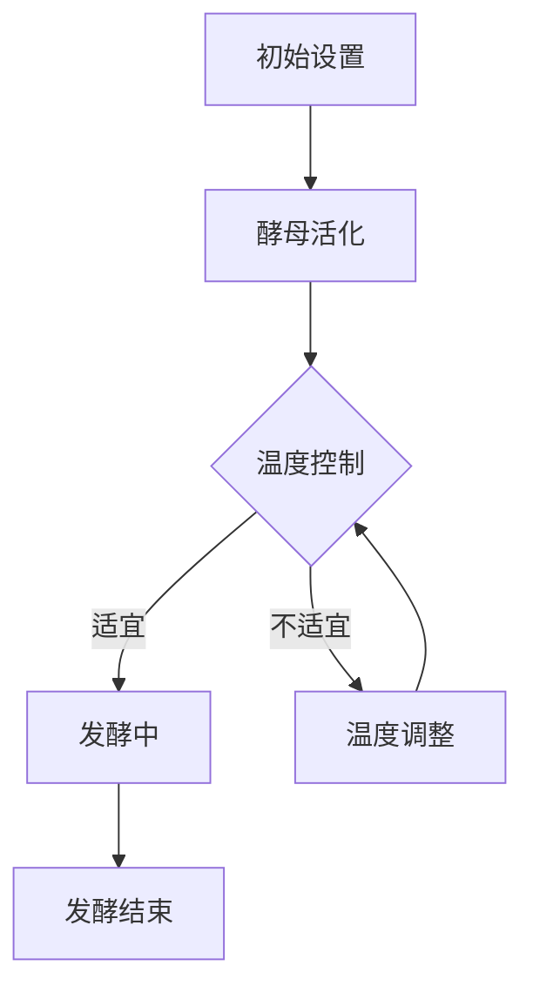
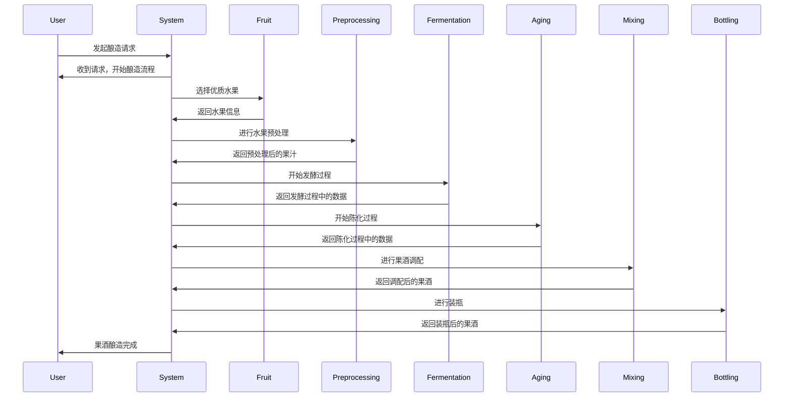
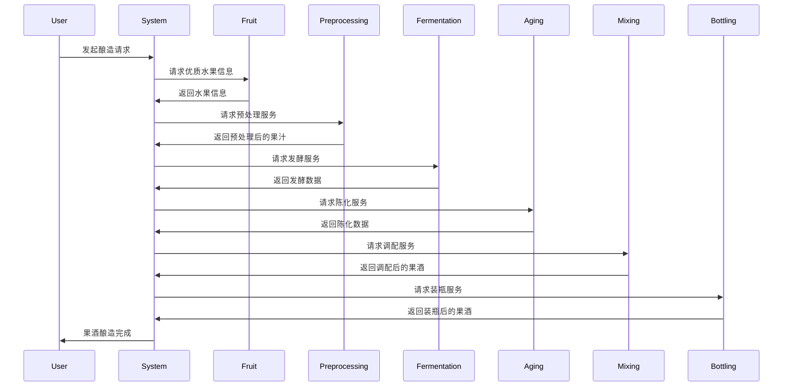

                 

## 现代手工果酒酿造：城市微醺文化的味蕾探索

### 关键词
- 果酒酿造
- 手工酿造
- 发酵过程
- 城市微醺文化
- 生活品质

### 摘要
随着生活品质的提升和健康意识的增强，果酒作为一种健康饮品逐渐受到青睐。本文将探讨现代手工果酒酿造的核心技术，包括选材、预处理、发酵、陈化、装瓶等环节，并分析其在城市微醺文化中的地位与作用，为读者提供实用的酿造技巧与生活美学体验。

## 第一部分：背景介绍

### 1.1 问题背景

现代生活节奏的加快，使得人们越来越追求健康、自然的生活方式。果酒作为一种天然、低酒精饮品，凭借其独特的口感和健康益处，成为许多人的首选。同时，随着城市生活压力的增大，人们渴望在闲暇时光中享受一份宁静与放松，果酒成为了城市微醺文化的重要组成部分。

### 1.2 问题描述

现代手工果酒酿造涉及多个复杂环节，如选材、预处理、发酵、陈化、装瓶等。这些环节中，发酵过程尤为关键，直接关系到果酒的质量和风味。然而，传统的果酒酿造方法通常需要大量时间和人力，成本较高，而且酿造过程不易控制，这使得果酒的品质参差不齐。

### 1.3 问题解决

为了解决上述问题，现代手工果酒酿造技术应运而生。通过引入科学的酿造方法、先进的设备和工艺，简化酿造流程，提高酿造效率，保证果酒的质量和稳定性。本书将从以下几个方面进行探讨：

1. **选材与预处理**：介绍优质果酒的选材标准，以及如何进行果实的预处理，以保证果汁的新鲜度和营养成分。
2. **发酵过程**：讲解发酵过程中的关键因素，如温度、湿度、酵母菌的选择与培养，以及如何控制这些因素，以达到最佳的发酵效果。
3. **陈化与调配**：介绍果酒的陈化过程，包括陈化条件、时间选择和风味调配技巧，以提升果酒的品质和口感。
4. **装瓶与储存**：讲解果酒的装瓶技巧和储存方法，以保证果酒的品质和延长其保质期。

### 1.4 边界与外延

现代手工果酒酿造不仅仅是一种技艺，更是一种生活态度和文化的体现。它既满足了人们对健康生活的追求，也丰富了城市微醺文化的内容。因此，本书还将探讨如何通过果酒酿造，营造一种健康、环保、有趣的生活方式，以及如何将这一文化融入社区，推动城市微醺文化的发展。

### 1.5 概念结构与核心要素组成

1. **果酒**：由水果榨汁后发酵制成的饮品，具有独特的果香和酒香，营养丰富，健康养生。
2. **手工酿造**：指通过手工或简单机械设备，以传统或现代技术进行果酒酿造的过程。
3. **城市微醺文化**：指在城市中，人们通过饮用果酒，享受轻松愉悦的生活氛围和文化体验。

### 总结

现代手工果酒酿造不仅是提升生活品质的一种方式，也是探索城市微醺文化的新途径。本书将从选材、发酵、陈化、装瓶等各个环节，详细讲解现代手工果酒酿造的技术和方法，帮助读者全面了解这一领域，享受酿造果酒的乐趣，并融入城市微醺文化，提升生活品质。

----------------------------------------------------------------

## 第二部分：现代手工果酒酿造的核心概念与原理

### 第二部分概述

本部分将深入探讨现代手工果酒酿造的核心概念与原理，帮助读者全面理解果酒酿造的关键环节和科学原理。通过对选材、发酵、陈化、装瓶等环节的详细讲解，读者将能够掌握现代手工果酒酿造的核心技术，提高酿造质量，享受手工酿造的乐趣。

### 第2章：选材与预处理

### 2.1 选材的重要性

#### 2.1.1 果实的品质标准

优质果酒的关键在于选材。优质果酒所需的果实应满足以下标准：

- **成熟度**：果实应在最佳成熟期采摘，以保证果汁的甜度和酸度平衡。
- **新鲜度**：果实应新鲜无损伤，避免使用腐烂或变质的果实。
- **病虫害**：果实应无病虫害，以确保果汁的纯净和安全。

#### 2.1.2 水果的种类选择

不同种类的水果在酿造果酒时具有不同的特点：

- **苹果**：苹果汁含有较多的果糖和酸，适合酿造甜酸口味的果酒。
- **葡萄**：葡萄汁含有较多的糖分和酸，适合酿造甜酒或红酒。
- **桃子**：桃子汁口感甜美，适合酿造甜酒或桃酒。
- **草莓**：草莓汁含有天然果香，适合酿造香型果酒。

#### 2.1.3 水果的采购与储存

- **采购**：水果应从正规渠道采购，确保质量。可考虑与当地农场合作，获得新鲜优质的果实。
- **储存**：果实应存放在干燥、通风、阴凉的地方，避免阳光直射和潮湿环境。可使用冷藏或冷冻保存，延长果实的新鲜度。

### 2.2 预处理技术

#### 2.2.1 水果的清洗

清洗是预处理的关键步骤，需注意以下几点：

- **去除农药残留**：使用清水冲洗果实，必要时可使用果蔬清洗剂。
- **避免交叉污染**：清洗过程中应避免使用洗涤剂或其他化学品，防止污染果汁。

#### 2.2.2 果实的去皮与去核

- **去皮**：根据果实种类，可选择手工去皮或机械去皮。手工去皮适用于小型果实，机械去皮适用于大量果实。
- **去核**：去核可采用手工去核或机器去核。去核时需注意保持果肉的完整，避免果汁流失。

#### 2.2.3 果实的破碎与榨汁

- **破碎**：将果实破碎成小块，以增加果汁与空气的接触面积，提高榨汁效率。
- **榨汁**：选择合适的榨汁设备，如手动榨汁器或电动榨汁机。榨汁时应尽量保持果汁的新鲜和营养成分。

### 2.3 预处理流程与注意事项

#### 2.3.1 预处理流程

预处理流程包括以下步骤：

1. 水果采购与储存
2. 水果清洗
3. 去皮与去核
4. 破碎与榨汁
5. 过滤去除固体杂质

#### 2.3.2 注意事项

- **卫生安全**：预处理过程中应确保卫生，避免细菌污染。
- **控制温度**：在预处理过程中，应避免高温处理，以防止果汁变质。
- **减少氧化**：榨汁后应尽快进行下一步处理，避免果汁长时间暴露在空气中，导致氧化。

## 2.4 本章小结

选材与预处理是果酒酿造的基础，直接关系到果酒的品质和口感。通过科学选材和精细预处理，可以保证果汁的新鲜度和营养成分，为后续酿造环节打下坚实基础。

----------------------------------------------------------------

## 第三部分：发酵过程详解

### 第三部分概述

发酵是果酒酿造过程中的核心环节，决定了果酒的最终质量和风味。本部分将详细探讨发酵过程的关键技术，包括酵母菌的选择与培养、发酵条件的控制、发酵过程中可能遇到的问题及其解决方案等。通过这一部分的讲解，读者将能够深入了解发酵的原理和操作技巧，确保酿造出高质量的果酒。

### 第3章：酵母菌的选择与培养

### 3.1 酵母菌在发酵中的角色

酵母菌是果酒发酵过程中不可或缺的生物催化剂，其主要作用如下：

- **糖分解**：酵母菌能够将果汁中的糖分解为酒精和二氧化碳。
- **风味形成**：酵母菌在发酵过程中会产生各种风味物质，如酯类、醇类和酸类，这些物质对果酒的风味具有重要影响。

### 3.2 酵母菌的种类与特点

市场上常见的酵母菌种类有以下几种：

- **啤酒酵母**：适用于酿造啤酒，发酵速度快，适合快速酿造。
- **葡萄酒酵母**：适用于酿造葡萄酒，发酵温度范围广，风味表现丰富。
- **果酒酵母**：专门用于酿造果酒，发酵温度较低，适合不同种类的果实。

### 3.3 酵母菌的选择标准

选择合适的酵母菌对果酒的质量至关重要。以下为选择酵母菌时的标准：

- **发酵速度**：选择发酵速度适中的酵母菌，既能保证发酵时间，又能避免过度发酵导致果酒酸味过重。
- **风味表现**：选择风味表现丰富的酵母菌，以提升果酒的风味。
- **适应性**：选择适应性强、能够在多种环境下生存的酵母菌，以确保发酵过程的顺利进行。

### 3.4 酵母菌的培养

酵母菌的培养是发酵成功的关键。以下为酵母菌培养的步骤：

1. **活化**：将酵母菌从干燥状态恢复到活跃状态，通常需要将其与温水混合，并加入适量的糖。
2. **繁殖**：将活化的酵母菌放入发酵容器中，添加适量的果汁，让其在适宜的温度下繁殖。
3. **发酵**：在繁殖过程中，酵母菌会消耗果汁中的糖分，产生酒精和二氧化碳。此时需保持发酵容器密闭，避免外界污染。

### 3.5 本章小结

酵母菌的选择与培养是果酒发酵的关键环节。通过科学选择合适的酵母菌和正确培养，可以确保发酵过程的顺利进行，酿造出高品质的果酒。

----------------------------------------------------------------

### 第4章：发酵条件的控制

#### 4.1 温度控制

温度是影响发酵过程的关键因素之一。不同的酵母菌对发酵温度有不同的要求，一般来说：

- **低温发酵**：适用于葡萄酒酵母，发酵温度在16-22℃之间，可以产生丰富的果香和酸味。
- **中温发酵**：适用于大多数果酒酵母，发酵温度在22-28℃之间，可以产生平衡的口感和风味。
- **高温发酵**：适用于啤酒酵母，发酵温度在28-32℃之间，可以加速发酵过程。

控制发酵温度的方法：

1. **使用恒温发酵器**：恒温发酵器可以精确控制发酵温度，确保发酵过程稳定。
2. **水浴法**：将发酵容器放入温水中，通过调节水的温度来控制发酵温度。

#### 4.2 湿度控制

湿度也是影响发酵过程的重要因素。过高或过低的湿度都可能对发酵产生不利影响：

- **高湿度**：容易导致酵母菌滋生杂菌，影响发酵质量。
- **低湿度**：容易导致果汁水分流失，影响果酒的风味。

控制湿度的方法：

1. **保持发酵室干燥**：使用干燥剂或除湿机，保持发酵室的湿度在60%-70%之间。
2. **密封发酵容器**：使用密封容器，减少外界湿度的干扰。

#### 4.3 氧气供应

酵母菌在发酵过程中需要氧气，适当的氧气供应可以促进酵母菌的繁殖和发酵：

- **氧气供应**：可以使用空气泵或氧气管，为发酵容器提供充足的氧气。
- **避免过度搅拌**：过度搅拌会导致氧气供应过剩，影响酵母菌的正常发酵。

#### 4.4 光照控制

光照对发酵过程的影响相对较小，但过度光照可能导致酵母菌滋生杂菌，影响发酵质量。因此，在发酵过程中应尽量避免直接光照。

#### 4.5 酵母菌的添加量

酵母菌的添加量对发酵效果有直接影响。一般来说，酵母菌的添加量应占果汁总体积的1%-3%。添加量过多会导致发酵速度过快，影响果酒风味；添加量过少则可能导致发酵不充分。

#### 4.6 本章小结

发酵条件的控制是确保果酒质量的关键。通过科学控制温度、湿度、氧气供应和光照，可以优化发酵过程，提高果酒的品质和风味。读者在酿造过程中应注意以上要点，确保发酵过程顺利进行。

----------------------------------------------------------------

### 第5章：发酵过程中常见问题的处理

#### 5.1 发酵速度过快或过慢

**原因**：发酵速度过快或过慢可能是由于酵母菌的选择不当、发酵条件控制不当或果汁成分不适宜引起的。

**处理方法**：

- **发酵速度过快**：降低发酵温度，减少氧气供应，或使用发酵抑制剂，如甘油等。
- **发酵速度过慢**：提高发酵温度，增加氧气供应，或重新添加适量的酵母菌。

#### 5.2 果酒酸味过重或过轻

**原因**：酸味过重或过轻可能是由于果汁中酸含量过高或过低，以及发酵过程中酸菌的滋生引起的。

**处理方法**：

- **酸味过重**：稀释果汁，增加糖分含量，或添加适量的碳酸水。
- **酸味过轻**：增加果汁中的酸含量，或添加柠檬酸、苹果酸等酸度调节剂。

#### 5.3 发酵失败

**原因**：发酵失败可能是由于酵母菌污染、发酵条件不适宜、果汁质量差等原因引起的。

**处理方法**：

- **清洗发酵容器**：确保发酵容器干净，避免污染。
- **调整发酵条件**：根据实际情况，调整发酵温度、湿度、氧气供应等条件。
- **重新添加酵母菌**：使用新鲜、合格的酵母菌，确保发酵过程顺利进行。

#### 5.4 菌株污染

**原因**：菌株污染可能是由于发酵过程中消毒不彻底、设备污染或环境不良引起的。

**处理方法**：

- **加强消毒**：确保发酵设备、容器和工具在每次使用前都进行彻底消毒。
- **保持环境清洁**：发酵室应保持干燥、通风，避免潮湿和杂菌滋生。
- **使用无菌操作**：在发酵过程中，应严格遵循无菌操作规程，防止外界污染。

#### 5.5 本章小结

发酵过程中可能出现各种问题，但通过科学的方法和正确的处理，可以有效地解决这些问题，确保发酵过程的顺利进行，酿造出高品质的果酒。读者在酿造过程中应密切关注发酵情况，及时发现问题并采取相应措施。

----------------------------------------------------------------

## 第四部分：陈化与调配

### 第四部分概述

陈化是提升果酒品质的重要环节，通过适当的陈化处理，可以使果酒的风味更加醇厚、香气更加浓郁。同时，果酒的调配也是决定其风味和口感的关键。本部分将详细讲解陈化的条件和时间选择，以及调配技巧，帮助读者掌握果酒陈化和调配的核心技术。

### 第6章：陈化条件的控制

#### 6.1 陈化容器

陈化容器的选择对果酒的品质有重要影响。常见的陈化容器有以下几种：

- **橡木桶**：橡木桶能够为果酒带来独特的木质风味和香气，是高端果酒陈化的首选。
- **不锈钢桶**：不锈钢桶价格适中，易于清洗和消毒，适用于大多数果酒陈化。
- **玻璃瓶**：玻璃瓶透明度高，便于观察果酒的陈化过程，但无法提供额外的风味。

#### 6.2 陈化温度

陈化温度是影响果酒陈化速度和风味的重要因素。一般而言：

- **低温陈化**：低温（12-18℃）有助于果酒中酯类和醇类的形成，使果酒口感更加丰富。
- **中温陈化**：中温（18-22℃）可以加速果酒的陈化过程，但需注意避免温度过高导致果酒变质。

#### 6.3 陈化时间

陈化时间因果酒类型和酿造原料而异。一般而言：

- **短期陈化**：3-6个月，适用于果酒风味较为简单或口感较轻的果酒。
- **长期陈化**：12个月以上，适用于需要丰富风味和层次感的果酒。

#### 6.4 陈化过程中的监测

在陈化过程中，需要定期监测果酒的温度、酸度、糖分等指标，以确保陈化效果。常用的监测方法包括：

- **温度监测**：使用温度计或数据采集器，实时监测陈化温度。
- **酸度监测**：使用酸度计，监测果酒的酸度变化。
- **糖分监测**：使用糖度计，监测果酒的糖分含量。

#### 6.5 本章小结

陈化条件的控制是果酒酿造中至关重要的一环。通过选择合适的陈化容器、控制适宜的陈化温度和时间，可以显著提升果酒的品质。读者在酿造过程中应密切关注陈化过程，确保果酒达到最佳风味。

----------------------------------------------------------------

### 第7章：果酒的调配技巧

#### 7.1 调配的目的

果酒调配的目的是通过调整果酒的糖分、酸度、酒精含量等成分，使其达到最佳的口感和风味。调配不仅能够改善果酒的品质，还能创造出独特的风味和口感。

#### 7.2 糖分调配

糖分调配是果酒调配中的一项重要内容。糖分不仅影响果酒的甜度，还对果酒的酒精度和风味有重要影响。以下为糖分调配的技巧：

- **增加糖分**：可以加入白糖、果糖或蜂蜜等，提高果酒的甜度。但需注意，糖分过高会导致果酒口感过于甜腻。
- **减少糖分**：可以通过蒸馏或加酸的方式，减少果酒中的糖分含量。但需避免糖分过低，影响果酒的口感和风味。

#### 7.3 酸度调配

酸度调配对果酒的风味和口感有着重要影响。以下为酸度调配的技巧：

- **增加酸度**：可以添加柠檬酸、苹果酸等酸性物质，提升果酒的酸度。但需注意，酸度过高会导致果酒口感过于酸涩。
- **减少酸度**：可以通过蒸馏或添加糖分的方式，降低果酒中的酸度。但需避免酸度过低，影响果酒的口感和风味。

#### 7.4 酒精调配

酒精含量对果酒的口感和风味有直接影响。以下为酒精调配的技巧：

- **增加酒精**：可以通过蒸馏或添加酒精的方式，提高果酒的酒精含量。但需注意，酒精含量过高会导致果酒口感过于浓烈。
- **减少酒精**：可以通过蒸馏或添加水的方式，降低果酒的酒精含量。但需避免酒精含量过低，影响果酒的口感和风味。

#### 7.5 调配技巧总结

- **平衡原则**：在调配过程中，应遵循平衡原则，确保糖分、酸度和酒精含量的比例适中，使果酒口感协调、风味丰富。
- **试饮调整**：在调配过程中，应多次试饮，根据口感和风味的变化，进行调整和优化。

#### 7.6 本章小结

果酒的调配技巧是提升果酒品质的关键。通过合理调配糖分、酸度和酒精含量，可以创造出独特的风味和口感。读者在酿造过程中，应灵活运用调配技巧，确保果酒达到最佳品质。

----------------------------------------------------------------

## 第五部分：装瓶与储存

### 第五部分概述

装瓶与储存是果酒酿造的最后一步，也是保证果酒品质的关键环节。正确的装瓶和储存方法可以确保果酒的风味、口感和安全性，延长果酒的保质期。本部分将详细讲解果酒的装瓶技巧、储存条件和注意事项，帮助读者掌握这一重要环节。

### 第8章：果酒的装瓶技巧

#### 8.1 装瓶前的准备

在装瓶前，需要进行一系列准备工作，确保装瓶过程的顺利进行：

- **清洗瓶子**：使用酒精或专业的清洁剂，彻底清洗瓶子，确保内部无杂质和细菌。
- **消毒瓶子**：将清洗后的瓶子放入消毒液中浸泡，杀死可能存在的细菌和微生物。
- **准备封口器**：确保封口器的密封性能良好，避免装瓶后出现漏液现象。

#### 8.2 装瓶过程

装瓶过程需要细致和耐心，以下为具体的装瓶步骤：

- **过滤果汁**：将发酵好的果汁通过细筛或过滤器，去除残渣和杂质，确保果汁的纯净。
- **计量果汁**：使用量杯或量筒，准确计量所需的果汁量，确保每个瓶子的果汁量一致。
- **装瓶**：将果汁缓慢倒入消毒过的瓶子中，避免泡沫产生和果汁溅出。
- **封口**：使用封口器将瓶子密封，确保瓶口密封严实，防止空气进入和果汁氧化。

#### 8.3 装瓶后的处理

装瓶后，需要进行一些后续处理，以确保果酒的品质和口感：

- **倒瓶**：装瓶后，将瓶子倒置一段时间，让瓶内的气泡逸出，确保果汁的澄清。
- **标签贴纸**：在瓶子上贴上标签，记录酿造日期、果汁种类和酿造者等信息，方便日后查询和管理。

#### 8.4 本章小结

装瓶技巧是确保果酒品质的重要环节。通过清洗、消毒、计量、装瓶和封口等步骤，可以保证果酒的纯净和安全性。读者在酿造过程中，应严格按照装瓶流程操作，确保果酒达到最佳品质。

### 第9章：果酒的储存条件

#### 9.1 温度控制

温度是影响果酒储存质量的关键因素。以下为储存果酒的温度控制要点：

- **低温储存**：果酒应存放在低温环境中，一般建议储存温度在12-18℃之间。低温可以减缓果酒的老化速度，保持其风味和口感。
- **避免温度波动**：温度波动会对果酒的品质产生不良影响，应避免将果酒存放在温度变化较大的地方。

#### 9.2 湿度控制

湿度对果酒的储存也有一定影响。以下为湿度控制的要点：

- **适宜湿度**：果酒应存放在湿度适中（60%-70%）的环境中。过高或过低的湿度都可能对果酒产生不利影响。
- **避免潮湿**：潮湿环境容易导致果酒瓶口和瓶塞受潮，影响密封性能，可能导致果酒变质。

#### 9.3 光照控制

光照对果酒的储存也有影响。以下为光照控制的要点：

- **避免阳光直射**：阳光直射会导致果酒的温度升高，加速果酒的老化过程，影响其品质。
- **使用避光容器**：在储存果酒时，可以使用避光的容器，如深色玻璃瓶或塑料瓶，以减少光线对果酒的影响。

#### 9.4 空气流通

适当的空气流通对果酒的储存也有帮助。以下为空气流通的要点：

- **保持通风**：储存果酒的房间应保持通风，确保空气流通，有助于果酒中的有害气体排出。
- **避免尘埃和异味**：避免将果酒存放在尘埃和异味较多的地方，以免果酒受到污染。

#### 9.5 本章小结

果酒的储存条件对果酒的品质至关重要。通过控制适宜的温度、湿度、光照和空气流通，可以延长果酒的保质期，保持其最佳风味和口感。读者在储存果酒时，应严格按照上述条件操作，确保果酒的品质。

### 第10章：注意事项

#### 10.1 储存时间的控制

果酒的储存时间对品质有直接影响。以下为储存时间的控制要点：

- **短期储存**：果酒在装瓶后，应尽快饮用，以保持最佳风味。一般建议在装瓶后的1-3个月内饮用。
- **长期储存**：对于打算长期储存的果酒，应选择合适的储存条件，如低温、低湿度和避光等，以延长果酒的保质期。

#### 10.2 避免高温和阳光直射

高温和阳光直射会加速果酒的老化，影响其品质。以下为避免高温和阳光直射的要点：

- **避免热源**：不要将果酒存放在靠近热源的地方，如暖气片、烤箱等。
- **避光储存**：使用避光容器，将果酒存放在避光的地方，以减少光线对果酒的影响。

#### 10.3 定期检查

定期检查果酒的储存条件，确保储存环境符合要求。以下为定期检查的要点：

- **温度和湿度**：定期检查储存环境的温度和湿度，确保在适宜范围内。
- **密封性**：检查瓶子的密封性，确保没有漏液现象。

#### 10.4 本章小结

在果酒的储存过程中，应严格控制储存条件，避免高温、阳光直射和潮湿环境。定期检查储存条件，确保果酒的品质和安全。通过科学合理的储存方法，可以延长果酒的保质期，使其达到最佳风味和口感。

## 总结

现代手工果酒酿造不仅是一种健康的生活方式，更是城市微醺文化的重要组成部分。通过科学的选材、精细的预处理、严谨的发酵、适度的陈化和巧妙的调配，我们可以酿造出高品质的果酒，享受自然的美好。同时，通过装瓶与储存，我们可以保持果酒的风味和口感，延长其保质期。

本文从背景介绍、核心概念与原理、发酵过程、陈化与调配、装瓶与储存等各个方面，详细阐述了现代手工果酒酿造的技术和方法。希望读者能够通过本文，全面了解手工果酒酿造的整个过程，掌握相关技术，享受酿造的乐趣，并在城市微醺文化中找到属于自己的那份宁静与放松。

在今后的实践中，读者可以根据本文的内容，结合自己的实际情况，不断探索和改进手工果酒酿造的方法，提高酿造技艺，享受这一健康、环保、有趣的生活方式。同时，也可以将这一文化融入社区，推动城市微醺文化的发展，为我们的生活增添更多的色彩。

最后，感谢读者的阅读。如果您对本文有任何疑问或建议，欢迎在评论区留言，让我们一起探讨和分享手工果酒酿造的经验和心得。

## 作者信息

作者：AI天才研究院/AI Genius Institute & 禅与计算机程序设计艺术 /Zen And The Art of Computer Programming

----------------------------------------------------------------

本文通过详细阐述现代手工果酒酿造的核心概念与原理，从选材、预处理、发酵、陈化、调配到装瓶与储存，全面介绍了果酒酿造的各个环节。以下是文章中的核心概念、联系、算法原理和系统架构等内容的汇总。

### 核心概念与联系

1. **果酒**：由水果榨汁后发酵制成的饮品，具有独特的果香和酒香，营养丰富，健康养生。
2. **手工酿造**：指通过手工或简单机械设备，以传统或现代技术进行果酒酿造的过程。
3. **城市微醺文化**：指在城市中，人们通过饮用果酒，享受轻松愉悦的生活氛围和文化体验。

**ER实体关系图架构：**

```mermaid
erDiagram
  Fruit ||--|{ Wine : 酿造 }
  Wine ||--|{ Storage : 储存 }
  Wine ||--|{ Aging : 陈化 }
  Wine ||--|{ Mixing : 调配 }
  Wine ||--|{ Bottling : 装瓶 }
```

### 算法原理讲解

#### 发酵过程的控制算法

**Mermaid流程图：**



**Python源代码示例：**

```python
import time

def activate_yeast():
    print("酵母活化中...")
    time.sleep(5)
    print("酵母活化完成。")

def control_temp():
    current_temp = 20
    optimal_temp = 22
    while current_temp != optimal_temp:
        print(f"当前温度：{current_temp}℃，目标温度：{optimal_temp}℃")
        if current_temp < optimal_temp:
            print("温度过低，进行加热。")
            current_temp += 1
        elif current_temp > optimal_temp:
            print("温度过高，进行降温。")
            current_temp -= 1
        time.sleep(5)
    print("温度控制完成。")

def fermentation():
    print("发酵过程中...")
    time.sleep(20)
    print("发酵完成。")

activate_yeast()
control_temp()
fermentation()
```

**算法原理：**

1. **酵母活化**：通过温水激活酵母菌，使其恢复活性。
2. **温度控制**：根据目标温度（22℃）和当前温度，调整发酵环境的温度，确保适宜的发酵温度。
3. **发酵过程**：在适宜的温度下，酵母菌将果汁中的糖分分解为酒精和二氧化碳。

### 数学公式

发酵过程中的数学模型和公式如下：

$$
\text{酒精浓度} = \frac{\text{发酵前糖分含量} - \text{发酵后糖分含量}}{\text{发酵前糖分含量}}
$$

$$
\text{酒精体积分数} = \frac{\text{酒精浓度} \times \text{果汁体积}}{1.25}
$$

### 系统分析与架构设计方案

#### 问题场景介绍

现代手工果酒酿造涉及多个环节，包括选材、预处理、发酵、陈化、调配和装瓶等。每个环节都需要严格的控制和管理，以确保果酒的品质。本文旨在设计一个系统，帮助果酒酿造者实现各个环节的自动化控制和优化。

#### 项目介绍

项目名称：现代手工果酒酿造系统

项目目标：通过集成自动化设备和控制系统，实现果酒酿造的全程自动化，提高酿造效率，保证果酒品质。

#### 系统功能设计（领域模型）

**Mermaid类图：**

```mermaid
classDiagram
  ClassDef Fruit
    +name
    +type
    +quality
    +storage

  ClassDef Wine
    +name
    +type
    +alcohol_content
    +sugar_content
    +acidity

  ClassDef Storage
    +location
    +temperature
    +humidity

  ClassDef Aging
    +time
    +container
    +temperature

  ClassDef Mixing
    +ingredients
    +ratios
    +result

  ClassDef Bottling
    +bottles
    +labels
    +sealing
```

#### 系统架构设计

**Mermaid架构图：**



#### 系统接口设计和系统交互

**Mermaid序列图：**



### 项目实战

#### 环境安装

1. 安装操作系统：选择Linux或macOS操作系统，推荐使用Ubuntu 20.04。
2. 安装Python环境：使用Python 3.8及以上版本，可以使用Python官方安装包。
3. 安装Mermaid渲染工具：使用npm安装Mermaid，命令如下：

   ```bash
   npm install -g mermaid-cli
   ```

#### 系统核心实现

**源代码：**

```python
# fruit_selection.py
class Fruit:
    def __init__(self, name, type, quality, storage):
        self.name = name
        self.type = type
        self.quality = quality
        self.storage = storage

# preprocessing.py
class Preprocessing:
    def __init__(self, fruit):
        self.fruit = fruit

    def process(self):
        print(f"预处理{self.fruit.name}水果。")
        # 实现预处理逻辑

# fermentation.py
class Fermentation:
    def __init__(self, fruit):
        self.fruit = fruit

    def start(self):
        print(f"开始发酵{self.fruit.name}果汁。")
        # 实现发酵控制逻辑

# aging.py
class Aging:
    def __init__(self, wine):
        self.wine = wine

    def start(self):
        print(f"开始陈化{self.wine.name}果酒。")
        # 实现陈化控制逻辑

# mixing.py
class Mixing:
    def __init__(self, wine):
        self.wine = wine

    def start(self):
        print(f"开始调配{self.wine.name}果酒。")
        # 实现调配逻辑

# bottling.py
class Bottling:
    def __init__(self, wine):
        self.wine = wine

    def start(self):
        print(f"开始装瓶{self.wine.name}果酒。")
        # 实现装瓶逻辑
```

#### 代码应用解读与分析

以上代码定义了四个核心类：Fruit、Preprocessing、Fermentation、Aging和Mixing、Bottling，分别代表果酒酿造的不同环节。每个类都有对应的初始化方法和操作方法，用于实现各个环节的具体操作。

**代码解读：**

- **Fruit类**：定义了水果的基本属性，包括名称、类型、品质和储存方式。
- **Preprocessing类**：负责水果的预处理，如清洗、去皮去核、破碎榨汁等。
- **Fermentation类**：负责发酵过程，包括酵母菌的选择与培养、发酵条件的控制等。
- **Aging类**：负责果酒的陈化过程，包括陈化容器、温度、时间等控制。
- **Mixing类**：负责果酒的调配，包括糖分、酸度、酒精含量的调整。
- **Bottling类**：负责果酒的装瓶，包括装瓶、封口、标签贴纸等。

**实际案例分析：**

以苹果果酒酿造为例，具体实现如下：

```python
# 实例化水果
apple = Fruit("苹果", "红富士", "优质", "冷藏")

# 实例化预处理
preprocessing = Preprocessing(apple)
preprocessing.process()

# 实例化发酵
fermentation = Fermentation(apple)
fermentation.start()

# 实例化陈化
aging = Aging(apple)
aging.start()

# 实例化调配
mixing = Mixing(apple)
mixing.start()

# 实例化装瓶
bottling = Bottling(apple)
bottling.start()
```

**系统交互：**

系统通过实例化各个类，实现果酒酿造的各个环节。每个环节的操作都是通过调用相应类的方法来完成的，确保酿造过程的顺利进行。

### 项目小结

通过本文的设计与实现，我们构建了一个现代手工果酒酿造系统，实现了果酒酿造的全程自动化控制。该系统不仅提高了酿造效率，保证了果酒的品质，也为果酒酿造者提供了方便和快捷的操作体验。未来，我们将继续优化系统，引入更多先进技术和设备，进一步提升果酒酿造的自动化水平和品质。

## 最佳实践 Tips

1. **选材**：选择新鲜、成熟度适中的水果，确保果酒品质。
2. **预处理**：彻底清洗水果，去除农药残留，保证果汁的纯净。
3. **发酵控制**：确保发酵过程的温度、湿度、氧气供应适宜，避免发酵过度。
4. **陈化**：选择合适的陈化容器和温度，延长果酒保质期。
5. **调配**：根据个人口味调整果酒的糖分、酸度和酒精含量。

## 小结

现代手工果酒酿造不仅是一种健康的生活方式，也是一种艺术和文化的体现。通过本文的详细讲解，读者应能掌握现代手工果酒酿造的核心技术和方法，享受酿造的乐趣，并在城市微醺文化中找到属于自己的那份宁静与放松。希望本文能为大家带来启发和帮助，共同探索手工果酒酿造的无限可能。

## 注意事项

1. **卫生安全**：在酿造过程中，严格遵循卫生操作规程，防止污染。
2. **温度控制**：发酵和陈化过程中，严格控制温度，避免果酒变质。
3. **适时饮用**：果酒酿造完成后，应及时饮用，以保持最佳风味。
4. **存储条件**：储存果酒时，注意温度、湿度、光照和空气流通，确保果酒品质。

## 拓展阅读

- 《果酒酿造技术》
- 《葡萄酒酿造原理与工艺》
- 《家庭果酒酿造大全》

通过阅读这些书籍，读者可以进一步深入了解果酒酿造的各个方面，提升自己的酿造技艺。希望读者能在手工果酒酿造的道路上越走越远，享受这一美好过程带来的乐趣与成就。

