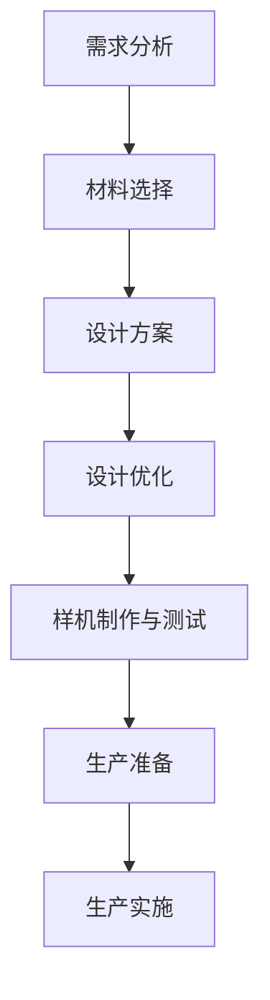
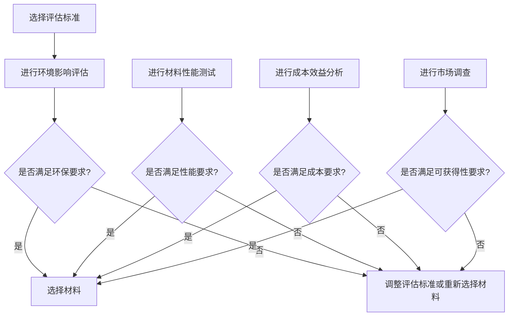

                 

### 前言

#### 手工皂行业现状与环保包装的重要性

手工皂作为一种传统的个人护理产品，因其天然、无添加的特点而广受消费者喜爱。然而，随着市场需求不断扩大，手工皂的包装问题也逐渐凸显出来。传统手工皂包装大多采用塑料薄膜、塑料瓶等非环保材料，这些材料难以降解，对环境造成了严重的污染。据统计，全球每年产生的塑料垃圾中，有超过80%最终流入海洋，对海洋生物和生态环境造成了极大的破坏。

在消费者环保意识日益提高的背景下，手工皂的环保包装设计成为行业关注的焦点。环保包装不仅有助于减少环境污染，还可以提升产品的品牌形象，吸引更多注重环保的消费者。因此，研究手工皂环保包装的设计原则、方法和材料选择，具有重要的现实意义和长远的发展价值。

#### 零废弃理念与可持续发展

零废弃理念（Zero Waste）是指通过减少资源的消耗和废物的产生，实现资源的循环利用和生态系统的可持续发展。在手工皂环保包装设计中，零废弃理念的核心是通过创新设计，减少包装材料的使用，提高包装材料的可降解性和可再生性，从而实现包装材料的减量化、资源化和无害化。

零废弃理念与可持续发展的联系体现在以下几个方面：

1. **资源消耗减少**：通过减少包装材料的用量，降低对自然资源的需求，减少资源开采和加工过程中的能耗和污染。

2. **废弃物减量**：通过选择可降解、可再生或循环利用的包装材料，减少传统塑料等难降解材料的废弃量，降低对环境的污染。

3. **循环经济**：通过建立资源循环利用体系，实现包装材料的回收再利用，促进循环经济的发展。

4. **生态环境保护**：减少废物产生和污染排放，有助于保护生态环境，维护生态平衡。

### 文章关键词

- 手工皂
- 环保包装
- 零废弃理念
- 可持续发展
- 包装设计

### 摘要

本文旨在探讨现代手工皂的环保包装设计，通过分析手工皂行业现状和环保包装的需求，引入零废弃理念和可持续发展理念，系统性地阐述环保包装设计的核心概念、设计原则与方法，以及材料选择和案例分析。文章旨在为手工皂行业的环保包装设计提供理论支持和实践指导，推动行业绿色发展。

### 目录大纲设计

#### 《现代手工皂的环保包装设计：零废弃理念下的产品创新》

- **关键词**：手工皂、环保包装、零废弃理念、可持续发展、包装设计

- **摘要**：本文通过分析手工皂行业现状，探讨环保包装设计的重要性，引入零废弃理念和可持续发展理念，系统性地阐述环保包装设计的核心概念、设计原则与方法，以及材料选择和案例分析，旨在为手工皂行业的环保包装设计提供理论支持和实践指导。

#### 第一部分：背景介绍

### 第1章：手工皂行业现状与环保包装需求

- **1.1 问题背景**：介绍手工皂行业的发展现状，以及传统包装材料对环境的影响。
- **1.2 问题描述**：阐述手工皂环保包装设计面临的挑战。
- **1.3 问题解决**：探讨环保包装设计的解决方案。
- **1.4 边界与外延**：明确环保包装设计的范围和涉及的核心要素。
- **1.5 概念结构与核心要素组成**：分析手工皂环保包装设计的概念结构和核心要素。

### 第2章：环保包装的核心概念与联系

- **2.1 环保包装的定义与特点**：介绍环保包装的基本概念和特点。
- **2.2 零废弃理念**：阐述零废弃理念的核心内容和实践方法。
- **2.3 环保包装与可持续发展的联系**：分析环保包装与可持续发展的关系。
- **2.4 核心概念属性特征对比表格**：通过表格形式对比环保包装的核心概念属性。

### 第3章：手工皂环保包装设计原则与方法

- **3.1 设计原则**：阐述手工皂环保包装设计的基本原则。
- **3.2 设计方法**：介绍手工皂环保包装设计的方法和流程。
- **3.3 可持续性评估**：讨论如何对环保包装设计的可持续性进行评估。
- **3.4 设计流程Mermaid流程图**：使用Mermaid绘制手工皂环保包装设计流程图。

#### 第二部分：材料选择

### 第4章：环保包装材料介绍

- **4.1 生物降解材料**：介绍生物降解材料的特点和应用。
- **4.2 可再生材料**：探讨可再生材料在环保包装中的应用。
- **4.3 循环利用材料**：分析循环利用材料在环保包装中的优势。
- **4.4 材料特性与适用性ER实体关系图**：使用ER实体关系图展示不同材料的特性与适用性。

### 第5章：材料选择标准与评估

- **5.1 材料选择标准**：制定环保包装材料的选择标准。
- **5.2 材料评估方法**：介绍如何对环保包装材料进行评估。
- **5.3 材料可持续性分析**：评估材料的环境友好性和可持续性。
- **5.4 材料评估Mermaid流程图**：使用Mermaid绘制材料评估流程图。

#### 第三部分：包装设计与案例研究

### 第6章：手工皂包装设计案例分析

- **6.1 案例一：无塑料包装设计**：分析无塑料包装设计的方法和效果。
- **6.2 案例二：可降解包装设计**：探讨可降解包装设计的优点和应用。
- **6.3 案例三：循环利用包装设计**：分析循环利用包装设计的实践案例。

### 第7章：环保包装设计实例研究

- **7.1 设计实例一：零废弃手工皂礼盒**：介绍零废弃手工皂礼盒的设计理念和实践。
- **7.2 设计实例二：可堆肥皂盒**：分析可堆肥皂盒的设计创新点。
- **7.3 设计实例三：纸质包装设计**：探讨纸质包装设计的优势和应用。

#### 第四部分：案例分析

### 第8章：手工皂环保包装的实际应用案例

- **8.1 案例一：某手工皂品牌环保包装实践**：分析某手工皂品牌的环保包装实践。
- **8.2 案例二：手工皂环保包装市场分析**：探讨手工皂环保包装的市场前景和挑战。
- **8.3 案例三：环保包装法律与政策分析**：分析环保包装相关的法律法规和政策。

### 第9章：环保包装设计的挑战与解决方案

- **9.1 挑战分析**：探讨手工皂环保包装设计面临的挑战。
- **9.2 解决方案探讨**：分析环保包装设计的解决方案。
- **9.3 未来趋势预测**：预测环保包装设计的未来发展趋势。

#### 第五部分：最佳实践

### 第10章：环保包装设计最佳实践

- **10.1 设计实践分享**：分享环保包装设计的实际经验。
- **10.2 实践经验总结**：总结环保包装设计的成功经验。
- **10.3 注意事项**：提醒设计者在环保包装设计过程中应注意的问题。

### 第11章：总结与展望

- **11.1 全书总结**：对全书内容进行总结。
- **11.2 研究展望**：展望手工皂环保包装设计未来的发展方向。
- **11.3 拓展阅读推荐**：推荐进一步阅读的相关文献和资料。

---

#### 第1章：手工皂行业现状与环保包装需求

##### 1.1 问题背景

手工皂作为一种传统的个人护理产品，拥有悠久的历史和丰富的文化底蕴。它以天然油脂、植物草木灰和香精等天然材料制成，不含化学添加剂，对人体皮肤友好，逐渐受到现代消费者的青睐。然而，随着手工皂市场的繁荣，其包装问题也逐渐显现出来。

传统手工皂的包装材料主要包括塑料薄膜、塑料瓶等。这些材料虽然具有良好的防潮、防污染性能，但普遍存在难以降解的问题，对环境造成了长期的污染。据统计，全球每年产生的塑料垃圾中，有超过80%最终流入海洋，对海洋生态系统造成了严重破坏。此外，塑料包装的回收利用率较低，加剧了资源的浪费和环境的负担。

消费者对环保意识的提高，使得他们对环保包装的需求越来越强烈。消费者希望手工皂产品不仅具备天然、无添加的特点，还应该具有环保、可持续的包装。这种需求不仅是对产品质量的要求，更是对社会责任的体现。因此，手工皂行业需要寻求环保包装的创新解决方案，以应对市场需求和环保压力。

##### 1.2 问题描述

手工皂环保包装设计面临的挑战主要包括以下几个方面：

1. **材料选择难题**：环保包装材料需要具备良好的性能，如防潮、防污染、美观等，同时还需要易于降解、可再生或循环利用。目前市场上的环保材料种类繁多，如何选择合适的材料，满足产品的性能需求，是设计者需要解决的问题。

2. **设计创新要求**：环保包装设计不仅需要满足功能需求，还要体现品牌特色和用户体验。如何在有限的材料条件下，通过设计创新，实现包装的美观、实用和环保，是设计者面临的又一挑战。

3. **成本控制问题**：环保包装材料往往价格较高，且生产工艺复杂，如何控制成本，保证产品的市场竞争力，是行业需要解决的重要问题。

4. **法规标准限制**：随着环保意识的普及，各国政府逐步加强了对环保包装的法规标准制定。手工皂行业需要了解并遵守相关法规，以确保产品的合法合规。

##### 1.3 问题解决

为了解决手工皂环保包装设计面临的挑战，可以从以下几个方面入手：

1. **材料创新**：积极研发和推广新型环保材料，如生物降解材料、可再生材料和循环利用材料。通过材料创新，提高环保包装的性能和可持续性。

2. **设计优化**：运用设计思维，结合用户需求和环保理念，优化包装设计。通过创新设计，提高产品的美观度和用户体验，同时降低材料的使用量。

3. **成本控制**：通过规模化生产、技术创新和供应链优化，降低环保包装的生产成本。同时，可以寻求政府的支持，降低环保包装的生产成本。

4. **法规遵守**：及时了解和遵守相关法规标准，确保产品的合法合规。在法规标准的指导下，推动环保包装设计的发展。

##### 1.4 边界与外延

手工皂环保包装设计的边界主要涉及以下几个方面：

1. **包装材料**：包括环保、可降解、可再生或循环利用的材料。

2. **包装工艺**：涉及包装的加工、成型、贴标等过程。

3. **包装设计**：包括包装的结构设计、外观设计、用户体验设计等。

4. **环境影响**：评估环保包装对环境的影响，如资源的消耗、废弃物的产生等。

手工皂环保包装设计的外延包括：

1. **市场分析**：研究手工皂市场的发展趋势、消费者需求、市场竞争状况等。

2. **政策法规**：了解各国政府对环保包装的法规政策，以及相关标准的制定和实施。

3. **技术创新**：关注环保包装相关的新技术、新材料、新工艺的研发和应用。

##### 1.5 概念结构与核心要素组成

手工皂环保包装设计的概念结构主要包括以下几个核心要素：

1. **环保包装材料**：选择环保、可降解、可再生或循环利用材料。

2. **设计原则**：遵循可持续性、美观性、实用性和创新性。

3. **设计方法**：采用系统化的设计流程，结合用户需求和环保理念。

4. **包装工艺**：确保包装材料的可加工性和产品的安全性。

5. **环境影响评估**：对包装设计进行环境影响评估，确保其符合环保要求。

通过以上核心要素的有机结合，手工皂环保包装设计旨在实现产品与环境的和谐共生，推动行业绿色发展。

#### 第2章：环保包装的核心概念与联系

##### 2.1 环保包装的定义与特点

环保包装（Environmental Packaging）是指在产品包装过程中，采用对环境影响较小的材料和方法，以减少包装废弃物的产生和环境污染。环保包装不仅仅是一种包装形式，更是一种可持续发展的理念。它关注的是包装的整个生命周期，包括材料的选择、设计、制造、使用和回收。

环保包装的特点主要体现在以下几个方面：

1. **减少资源消耗**：环保包装优先选择可再生或可循环利用的材料，减少对不可再生资源的依赖，降低资源消耗。

2. **减少废弃物产生**：通过优化设计和材料选择，减少包装废弃物的产生，减轻环境负担。

3. **可降解性**：环保包装材料应具备可降解性，能够在自然环境中被微生物分解，减少对土壤和水体的污染。

4. **减少能源消耗**：在包装设计和生产过程中，尽量减少能源消耗，降低碳排放。

5. **环保性**：包装材料和生产过程应尽量减少有害物质的释放，确保对环境和人体健康无害。

##### 2.2 零废弃理念

零废弃理念（Zero Waste）是一种追求最大限度减少废物产生的环保理念。它强调的是资源的循环利用和废物的最小化。零废弃理念的核心是通过改变生活方式和生产方式，减少资源的消耗和废物的产生，实现资源的循环利用。

零废弃理念在环保包装设计中的应用主要体现在以下几个方面：

1. **材料选择**：选择可再生、可降解、可循环利用的材料，减少传统塑料等不可降解材料的使用。

2. **设计优化**：通过优化包装设计，减少材料的使用量，提高包装的利用率。例如，采用模块化设计，便于产品的拆卸和回收。

3. **包装工艺**：采用环保生产工艺，减少包装生产过程中的能源消耗和污染物排放。

4. **废弃物处理**：建立完善的废弃物处理和回收体系，确保包装废弃物得到有效处理和再利用。

##### 2.3 环保包装与可持续发展的联系

环保包装与可持续发展（Sustainable Development）密切相关。可持续发展是指在满足当前需求的同时，不损害后代满足其需求的能力。环保包装是可持续发展的重要组成部分，它通过减少资源消耗、减少废弃物产生、降低环境污染，实现了经济效益、社会效益和环境效益的协调发展。

环保包装与可持续发展的联系体现在以下几个方面：

1. **资源节约**：环保包装采用可再生或可循环利用的材料，减少了资源开采和加工的需求，有助于实现资源的可持续利用。

2. **环境保护**：环保包装通过减少废弃物的产生和污染物的排放，降低了环境污染，有助于维护生态平衡。

3. **经济支持**：环保包装的设计和应用，有助于企业降低成本、提高竞争力，实现经济效益的提升。

4. **社会效益**：环保包装的推广和应用，提高了公众的环保意识，促进了社会的可持续发展。

##### 2.4 核心概念属性特征对比表格

为了更清晰地展示环保包装和零废弃理念的核心概念属性，下面通过一个对比表格进行阐述。

| 特征           | 环保包装                    | 零废弃理念                  |
| -------------- | --------------------------- | --------------------------- |
| **定义**       | 减少包装废弃物的产生和污染  | 最大程度减少废物的产生和资源消耗 |
| **材料选择**   | 可再生、可降解、可循环利用的材料 | 可再生、可降解、可循环利用的材料 |
| **设计原则**   | 减量化、资源化、无害化       | 减量化、资源化、无害化       |
| **环境影响**   | 减少环境污染               | 减少环境负担               |
| **可持续性**   | 实现资源的循环利用          | 实现资源的循环利用          |

通过对比表格可以看出，环保包装和零废弃理念在核心概念上具有高度的一致性，都强调减少废物产生、资源循环利用和环境保护。环保包装是实现零废弃理念的重要手段，而零废弃理念为环保包装提供了理论指导和实践目标。

#### 第3章：手工皂环保包装设计原则与方法

##### 3.1 设计原则

手工皂环保包装设计应遵循以下原则，以确保设计的合理性和实用性：

1. **可持续性**：选择环保、可再生或可降解的包装材料，减少对环境的负面影响。在材料选择和设计过程中，充分考虑资源的循环利用和减少废弃物产生。

2. **美观性**：包装设计应兼顾美观与实用，提升产品的品牌形象和市场竞争力。通过独特的设计风格和视觉效果，吸引消费者的注意力，增加产品的附加值。

3. **实用性**：包装设计应满足手工皂的实际使用需求，确保包装的结构稳固、防潮、防污染，同时方便消费者使用和携带。

4. **创新性**：鼓励设计者在环保包装设计中运用创新思维，探索新材料、新工艺、新结构，提高包装设计的创新性和独特性。

5. **成本效益**：在保证包装性能和美观性的前提下，尽量降低生产成本，提高产品的市场竞争力。

##### 3.2 设计方法

手工皂环保包装设计的方法主要包括以下步骤：

1. **需求分析**：了解市场需求、消费者需求以及手工皂产品的特性，明确环保包装设计的目标和功能。

2. **材料选择**：根据需求分析，选择适合的环保包装材料。考虑材料的环保性、性能、成本等因素，确保材料的选择符合设计原则。

3. **设计方案**：结合材料和产品特性，设计出初步的包装方案。包括包装的结构、外观、标签设计等。

4. **设计优化**：对设计方案进行优化，通过多次修改和改进，提高包装设计的合理性和实用性。

5. **样机制作与测试**：制作样机，进行物理性能测试、用户体验测试等，验证包装设计的效果和可行性。

6. **生产准备**：根据样机测试结果，进行生产准备，包括材料采购、生产设备调试等。

7. **生产实施**：实施生产，确保包装产品符合设计要求和环保标准。

##### 3.3 可持续性评估

在手工皂环保包装设计过程中，可持续性评估是一个重要的环节。通过评估，可以确保包装设计在环保、经济和社会方面都具备可持续性。可持续性评估主要包括以下内容：

1. **环境影响评估**：评估包装设计对环境的影响，包括资源消耗、废弃物产生、碳排放等。通过环境影响评估，可以发现设计中的不足，提出改进措施。

2. **材料评估**：评估包装材料的环境友好性，包括材料的来源、加工过程、使用寿命和废弃后的处理方式。优先选择可再生、可降解、可循环利用的材料。

3. **经济评估**：评估包装设计对经济的影响，包括生产成本、市场竞争力、经济效益等。通过经济评估，可以确保包装设计在市场上有竞争力，有利于企业的可持续发展。

4. **社会评估**：评估包装设计对社会的影响，包括消费者的接受度、品牌形象、社会责任等。通过社会评估，可以确保包装设计符合社会需求，提高品牌的社会影响力。

##### 3.4 设计流程Mermaid流程图

为了更直观地展示手工皂环保包装设计流程，下面使用Mermaid绘制设计流程图。



通过Mermaid流程图，可以清晰地看到手工皂环保包装设计的过程，有助于设计者按照步骤进行设计，确保设计过程的顺利进行。

#### 第4章：环保包装材料介绍

##### 4.1 生物降解材料

生物降解材料是指能够在自然环境中通过微生物作用降解的材料。这种材料在满足包装功能的同时，不会对环境造成长期污染，是实现环保包装的重要途径之一。常见的生物降解材料包括生物降解塑料、纤维素材料、淀粉材料等。

1. **生物降解塑料**：生物降解塑料是一种在特定条件下能够被微生物分解的塑料。它通常由可再生资源制成，如玉米淀粉、蔗糖等。生物降解塑料在土壤和水体中能够自然降解，减少对环境的污染。但需要注意的是，生物降解塑料的降解速度和效果受到环境条件的影响，因此在实际应用中，还需要结合具体环境进行评估。

2. **纤维素材料**：纤维素材料是一种天然存在的多糖，具有良好的生物降解性。常见的纤维素材料包括棉纤维、麻纤维等。纤维素材料不仅可以用于包装袋、包装盒等，还可以作为包装薄膜，具有良好的透明性和机械性能。

3. **淀粉材料**：淀粉材料是一种常见的生物降解材料，它通常由玉米、马铃薯等淀粉制成。淀粉材料在微生物作用下可以分解成二氧化碳和水，对环境无污染。淀粉材料在包装中的应用广泛，如淀粉基包装膜、淀粉基缓冲材料等。

##### 4.2 可再生材料

可再生材料是指可以在较短时间内自然再生或通过人工种植快速再生的材料。使用可再生材料进行包装设计，不仅可以减少对环境的污染，还可以降低资源的消耗。常见的可再生材料包括纸张、木材、棉花等。

1. **纸张**：纸张是一种常见的可再生材料，它通常由木材、竹子等天然纤维制成。纸张具有良好的印刷性能、机械强度和防潮性能，是包装设计中的常用材料。在环保包装设计中，可以使用回收纸、再生纸等，进一步减少对环境的影响。

2. **木材**：木材是一种天然的可再生材料，它通常来自可持续森林。木材具有良好的强度、韧性和隔热性能，是包装设计中的理想选择。在环保包装设计中，可以使用木材制成的包装盒、包装架等，实现环保与美观的统一。

3. **棉花**：棉花是一种天然的纤维材料，它通常用于制作纺织品。在环保包装设计中，棉花可以用于制作包装袋、包装布等，具有良好的环保性能和实用性。

##### 4.3 循环利用材料

循环利用材料是指通过回收、再加工等方式，实现材料循环利用的材料。这种材料不仅可以减少资源的消耗，还可以减少废弃物的产生，是实现环保包装的有效途径。常见的循环利用材料包括塑料、玻璃、金属等。

1. **塑料**：塑料是一种常见的循环利用材料，它通常通过回收再加工的方式，实现循环利用。在环保包装设计中，可以使用回收塑料制成的包装袋、包装盒等，减少对环境的污染。但需要注意的是，塑料的循环利用过程中，可能会引入新的污染物质，因此在实际应用中，需要对材料进行严格的质量控制。

2. **玻璃**：玻璃是一种耐用的循环利用材料，它通常通过回收和熔融再加工的方式，实现循环利用。在环保包装设计中，玻璃可以用于制作瓶盖、瓶子等，具有良好的防潮、防腐蚀性能。

3. **金属**：金属是一种耐用的循环利用材料，它通常通过回收和熔炼再加工的方式，实现循环利用。在环保包装设计中，金属可以用于制作包装罐、包装盒等，具有良好的强度和耐久性。

##### 4.4 材料特性与适用性ER实体关系图

为了更清晰地展示不同材料的特性与适用性，下面使用Mermaid绘制材料特性与适用性ER实体关系图。

```mermaid
erDiagram
  Material -->|is used for| Package
  Material ||--|{has} Properties
  Package ||--|{contains} Components

  BiodegradableMaterial |||--|{is a type of} Material
  RecyclableMaterial |||--|{is a type of} Material
  RenewableMaterial |||--|{is a type of} Material

  Properties ||--|{describes} BiodegradableMaterial
  Properties ||--|{describes} RecyclableMaterial
  Properties ||--|{describes} RenewableMaterial

  Package ||--|{uses} BiodegradableMaterial
  Package ||--|{uses} RecyclableMaterial
  Package ||--|{uses} RenewableMaterial
```

通过ER实体关系图，可以清晰地看到不同材料的分类、特性以及与包装设计的关系。这有助于设计者根据具体需求，选择合适的材料，实现环保包装设计。

#### 第5章：材料选择标准与评估

##### 5.1 材料选择标准

在手工皂环保包装设计中，选择合适的材料是实现环保包装的关键。以下是手工皂环保包装材料选择的标准：

1. **环保性**：首先，材料应具备良好的环保性能，即能够减少对环境的污染。这包括材料的生产过程、使用过程和废弃后的处理过程。理想的材料应具有生物降解性、可再生性或可循环利用性。

2. **性能**：材料应满足手工皂包装的基本性能要求，如防潮、防污染、美观等。同时，材料应具有良好的机械性能和物理性能，以确保包装产品的稳定性和可靠性。

3. **成本**：材料的选择应考虑成本因素，即材料的价格应在可接受范围内，不会显著增加产品的成本。通过规模化生产和供应链优化，可以降低材料成本。

4. **可获得性**：材料的供应应稳定，容易获得。如果材料供应不稳定，可能导致生产延误，影响产品的市场供应。

5. **可持续性**：材料的选择应考虑其可持续性，即材料的来源是否可持续，是否支持循环经济。选择可再生或可循环利用的材料，有助于实现资源的可持续利用。

##### 5.2 材料评估方法

为了确保所选材料满足环保包装设计的要求，需要对材料进行评估。以下是几种常见的材料评估方法：

1. **环境影响评估（Environmental Impact Assessment, EIA）**：通过评估材料的生产过程、使用过程和废弃后的处理过程，评估其对环境的影响。EIA可以帮助设计者了解材料的环境友好性，为材料选择提供依据。

2. **生命周期评估（Life Cycle Assessment, LCA）**：LCA是对产品或服务的整个生命周期进行评估，包括原材料的采集、生产、使用、回收和处置。通过LCA，可以全面了解材料的环境影响，帮助设计者做出更环保的选择。

3. **材料性能测试**：对材料的物理性能、机械性能和化学性能进行测试，确保材料满足包装设计的要求。性能测试包括拉伸强度、耐冲击性、透明度、印刷性能等。

4. **成本效益分析**：通过比较不同材料的成本和性能，进行成本效益分析。成本效益分析可以帮助设计者选择性能与成本平衡的材料。

5. **市场调查**：了解市场上不同材料的供应情况、价格和用户评价。市场调查可以帮助设计者选择适合市场的材料。

##### 5.3 材料可持续性分析

材料的可持续性分析是评估材料是否符合环保包装设计要求的重要环节。以下是几种常见的材料可持续性分析方法：

1. **可再生性分析**：评估材料的来源是否为可再生资源，如木材、棉花、玉米淀粉等。可再生性分析可以帮助设计者了解材料的可持续利用潜力。

2. **循环利用性分析**：评估材料是否可以通过回收、再加工等方式实现循环利用。循环利用性分析可以帮助设计者选择具有循环利用潜力的材料。

3. **生物降解性分析**：评估材料是否能够在自然环境中通过微生物作用降解。生物降解性分析可以帮助设计者选择对环境友好的材料。

4. **碳排放分析**：评估材料的生产、使用和废弃过程产生的碳排放。碳排放分析可以帮助设计者了解材料对环境的影响。

5. **环境风险评估**：评估材料在包装设计中的潜在环境风险，如材料中的有害物质释放、废弃物处理过程中的污染等。环境风险评估可以帮助设计者选择安全、环保的材料。

##### 5.4 材料评估Mermaid流程图

为了更直观地展示材料评估过程，下面使用Mermaid绘制材料评估流程图。



通过Mermaid流程图，可以清晰地看到材料评估的过程和关键步骤，有助于设计者系统地进行材料评估，确保选择合适的材料。

#### 第6章：手工皂包装设计案例分析

##### 6.1 案例一：无塑料包装设计

无塑料包装设计是一种通过不使用塑料材料来实现环保包装的方法。它主要采用生物降解材料、可再生材料和循环利用材料来替代传统塑料包装。以下是一个无塑料包装设计的案例：

**案例背景**：某手工皂品牌，旨在推出一款完全无塑料包装的环保手工皂产品。该品牌希望通过无塑料包装设计，减少对环境的污染，同时提升品牌形象，吸引环保意识的消费者。

**材料选择**：该品牌选择了以下几种材料：

- **生物降解塑料**：用于制作包装袋和包装盒。这种材料在特定条件下可以自然降解，减少对环境的影响。
- **可再生纸材**：用于制作包装盒的外层。纸材来源于可持续森林，具有良好的防潮和防污染性能。
- **回收塑料**：用于制作包装盒的内部缓冲材料。通过回收再利用，减少塑料废弃物的产生。

**设计过程**：

1. **需求分析**：明确产品的目标市场和消费者需求。消费者希望产品具备环保、美观、实用等特点。

2. **材料选择**：根据需求分析，选择适合的环保材料。考虑到成本和可获得性，选择了生物降解塑料、可再生纸材和回收塑料。

3. **设计方案**：设计团队结合产品特性和材料特点，设计了无塑料包装方案。包装盒采用可再生纸材制作，外层印刷环保油墨，内部加入回收塑料缓冲材料。包装袋采用生物降解塑料，确保在使用过程中不产生塑料废弃物。

4. **测试与优化**：对设计方案进行物理性能测试和用户体验测试。测试结果表明，包装产品具有良好的防潮、防污染性能，且便于携带和使用。

**效果与影响**：

1. **减少塑料使用**：通过无塑料包装设计，该品牌成功减少了塑料包装的使用，降低了塑料废弃物对环境的污染。

2. **提升品牌形象**：无塑料包装设计体现了品牌对环保的承诺和责任感，提升了品牌在消费者心中的形象。

3. **市场反馈**：消费者对无塑料包装产品给予了积极反馈，认为产品不仅环保，还具备良好的使用体验。

##### 6.2 案例二：可降解包装设计

可降解包装设计是一种通过使用可降解材料来实现环保包装的方法。这种设计方法旨在减少包装废弃物对环境的污染，特别是在海洋和陆地环境中。以下是一个可降解包装设计的案例：

**案例背景**：某手工皂品牌，致力于推广环保理念，推出了一系列采用可降解材料的包装产品。该品牌希望通过可降解包装设计，实现产品包装的全生命周期环保，减少对环境的负面影响。

**材料选择**：该品牌选择了以下几种可降解材料：

- **聚乳酸（PLA）**：一种生物降解塑料，由玉米等可再生资源制成。PLA具有良好的可塑性和机械性能，可以用于制作包装袋、包装盒等。
- **淀粉基塑料**：由淀粉和其他可再生资源制成，具有良好的生物降解性。淀粉基塑料可以用于制作包装膜、包装袋等。
- **聚己内酰胺（PCL）**：一种生物降解聚合物，具有良好的生物相容性和生物降解性。PCL可以用于制作包装膜、包装容器等。

**设计过程**：

1. **需求分析**：明确产品的目标市场和消费者需求。消费者希望产品包装具备环保、可降解、美观等特点。

2. **材料选择**：根据需求分析，选择适合的可降解材料。考虑到成本和可获得性，选择了PLA、淀粉基塑料和PCL。

3. **设计方案**：设计团队结合产品特性和材料特点，设计了可降解包装方案。包装袋采用PLA材料，确保在使用过程中可以自然降解。包装盒采用淀粉基塑料，外层印刷环保油墨，内部加入PCL材料，提高包装的稳定性。

4. **测试与优化**：对设计方案进行物理性能测试和降解测试。测试结果表明，包装产品具有良好的防潮、防污染性能，且能够在特定条件下自然降解。

**效果与影响**：

1. **减少环境负担**：通过可降解包装设计，该品牌成功减少了传统塑料包装的使用，降低了包装废弃物对环境的负担。

2. **提升品牌形象**：可降解包装设计体现了品牌对环保的承诺和责任感，提升了品牌在消费者心中的形象。

3. **市场反馈**：消费者对可降解包装产品给予了积极反馈，认为产品不仅环保，还具备良好的使用体验。

##### 6.3 案例三：循环利用包装设计

循环利用包装设计是一种通过回收和再利用材料来实现环保包装的方法。这种方法旨在减少材料消耗，降低废弃物产生，促进循环经济的发展。以下是一个循环利用包装设计的案例：

**案例背景**：某手工皂品牌，致力于推广循环利用理念，推出了一系列采用循环利用材料的包装产品。该品牌希望通过循环利用包装设计，实现产品包装的循环再利用，减少对环境的影响。

**材料选择**：该品牌选择了以下几种循环利用材料：

- **回收塑料**：通过回收废弃塑料，再加工成包装材料。回收塑料具有良好的防潮、防污染性能，可以用于制作包装袋、包装盒等。
- **回收纸材**：通过回收废纸，再加工成包装材料。回收纸材具有良好的印刷性能和机械性能，可以用于制作包装盒、包装袋等。
- **再生铝材**：通过回收废弃铝材，再加工成包装材料。再生铝材具有良好的防潮、防腐蚀性能，可以用于制作包装罐、包装瓶等。

**设计过程**：

1. **需求分析**：明确产品的目标市场和消费者需求。消费者希望产品包装具备环保、循环利用、美观等特点。

2. **材料选择**：根据需求分析，选择适合的循环利用材料。考虑到成本和可获得性，选择了回收塑料、回收纸材和再生铝材。

3. **设计方案**：设计团队结合产品特性和材料特点，设计了循环利用包装方案。包装袋采用回收塑料，确保在使用过程中可以回收再利用。包装盒采用回收纸材，外层印刷环保油墨，内部加入再生铝材，提高包装的稳定性。

4. **测试与优化**：对设计方案进行物理性能测试和循环利用测试。测试结果表明，包装产品具有良好的防潮、防污染性能，且可以在使用后进行回收再利用。

**效果与影响**：

1. **减少材料消耗**：通过循环利用包装设计，该品牌成功减少了原材料的使用，降低了材料消耗。

2. **促进循环经济**：循环利用包装设计有助于促进循环经济的发展，减少废弃物产生，实现资源的可持续利用。

3. **提升品牌形象**：循环利用包装设计体现了品牌对环保的承诺和责任感，提升了品牌在消费者心中的形象。

4. **市场反馈**：消费者对循环利用包装产品给予了积极反馈，认为产品不仅环保，还具备良好的使用体验。

#### 第7章：环保包装设计实例研究

##### 7.1 设计实例一：零废弃手工皂礼盒

**案例背景**：某手工皂品牌推出了一款零废弃手工皂礼盒，旨在通过环保包装设计，实现产品包装的全生命周期环保。该品牌希望通过零废弃手工皂礼盒，提升品牌形象，吸引更多注重环保的消费者。

**材料选择**：礼盒采用了以下几种环保材料：

- **可再生纸材**：用于制作礼盒的外层。纸材来源于可持续森林，具有良好的防潮、防污染性能。
- **再生塑料**：用于制作礼盒的内部缓冲材料。再生塑料是通过回收废弃塑料再加工而成，具有良好的防潮、防腐蚀性能。
- **生物降解塑料**：用于制作礼盒的封口和标签。这种材料在特定条件下可以自然降解，减少对环境的影响。

**设计过程**：

1. **需求分析**：明确产品的目标市场和消费者需求。消费者希望产品包装具备环保、美观、实用等特点。

2. **材料选择**：根据需求分析，选择了可再生纸材、再生塑料和生物降解塑料作为主要材料。

3. **设计方案**：设计团队结合产品特性和材料特点，设计了零废弃手工皂礼盒方案。礼盒采用可再生纸材制作，外层印刷环保油墨，内部加入再生塑料缓冲材料。封口和标签采用生物降解塑料，确保在使用过程中可以自然降解。

4. **测试与优化**：对设计方案进行物理性能测试和降解测试。测试结果表明，礼盒具有良好的防潮、防污染性能，且能够在特定条件下自然降解。

**效果与影响**：

1. **实现零废弃**：通过零废弃手工皂礼盒的设计，该品牌成功实现了产品包装的全生命周期环保，减少了对环境的污染。

2. **提升品牌形象**：零废弃手工皂礼盒设计体现了品牌对环保的承诺和责任感，提升了品牌在消费者心中的形象。

3. **市场反馈**：消费者对零废弃手工皂礼盒给予了积极反馈，认为产品不仅环保，还具备良好的使用体验。

##### 7.2 设计实例二：可堆肥皂盒

**案例背景**：某手工皂品牌推出了一款可堆肥皂盒，旨在通过环保包装设计，实现产品包装的循环利用。该品牌希望通过可堆肥皂盒的设计，提升产品形象，吸引更多注重环保的消费者。

**材料选择**：肥皂盒采用了以下几种环保材料：

- **生物降解塑料**：用于制作肥皂盒的主体。生物降解塑料具有良好的可塑性和机械性能，可以在自然环境中降解。
- **再生纸材**：用于制作肥皂盒的内部缓冲材料。再生纸材具有良好的防潮、防污染性能。
- **可回收铝材**：用于制作肥皂盒的封口和标签。可回收铝材具有良好的防潮、防腐蚀性能。

**设计过程**：

1. **需求分析**：明确产品的目标市场和消费者需求。消费者希望产品包装具备环保、美观、实用等特点。

2. **材料选择**：根据需求分析，选择了生物降解塑料、再生纸材和可回收铝材作为主要材料。

3. **设计方案**：设计团队结合产品特性和材料特点，设计了可堆肥皂盒方案。肥皂盒采用生物降解塑料制作，主体设计为可堆叠形式，便于存储和携带。内部缓冲材料采用再生纸材，提高包装的稳定性。封口和标签采用可回收铝材，确保在废弃物处理过程中可以回收再利用。

4. **测试与优化**：对设计方案进行物理性能测试和循环利用测试。测试结果表明，肥皂盒具有良好的防潮、防污染性能，且可以在使用后进行回收再利用。

**效果与影响**：

1. **实现循环利用**：通过可堆肥皂盒的设计，该品牌成功实现了产品包装的循环利用，减少了废弃物的产生。

2. **提升品牌形象**：可堆肥皂盒设计体现了品牌对环保的承诺和责任感，提升了品牌在消费者心中的形象。

3. **市场反馈**：消费者对可堆肥皂盒给予了积极反馈，认为产品不仅环保，还具备良好的使用体验。

##### 7.3 设计实例三：纸质包装设计

**案例背景**：某手工皂品牌推出了一款纸质包装设计，旨在通过环保包装设计，提升产品形象，吸引更多注重环保的消费者。该品牌希望通过纸质包装设计，展现手工皂的天然、无添加特点，同时实现产品包装的环保。

**材料选择**：纸质包装设计采用了以下几种环保材料：

- **再生纸材**：用于制作包装盒的外层。再生纸材是通过回收废纸再加工而成，具有良好的印刷性能和机械性能。
- **生物降解塑料**：用于制作包装盒的内部缓冲材料。生物降解塑料具有良好的防潮、防污染性能。
- **环保油墨**：用于包装盒的印刷。环保油墨不含重金属和其他有害物质，对环境和人体健康无害。

**设计过程**：

1. **需求分析**：明确产品的目标市场和消费者需求。消费者希望产品包装具备环保、美观、实用等特点。

2. **材料选择**：根据需求分析，选择了再生纸材、生物降解塑料和环保油墨作为主要材料。

3. **设计方案**：设计团队结合产品特性和材料特点，设计了纸质包装方案。包装盒采用再生纸材制作，外层印刷环保油墨，内部加入生物降解塑料缓冲材料。设计注重手工皂的天然、无添加特点，通过简洁、清新的风格展现产品形象。

4. **测试与优化**：对设计方案进行物理性能测试和环保性能测试。测试结果表明，纸质包装盒具有良好的防潮、防污染性能，且符合环保要求。

**效果与影响**：

1. **实现环保**：通过纸质包装设计，该品牌成功实现了产品包装的环保，减少了对环境的污染。

2. **提升品牌形象**：纸质包装设计体现了品牌对环保的承诺和责任感，提升了品牌在消费者心中的形象。

3. **市场反馈**：消费者对纸质包装设计给予了积极反馈，认为产品不仅环保，还具备良好的使用体验。

#### 第8章：手工皂环保包装的实际应用案例

##### 8.1 案例一：某手工皂品牌环保包装实践

**案例背景**：某手工皂品牌，在环保包装设计方面进行了积极的探索和实践。该品牌希望通过环保包装设计，提升品牌形象，吸引更多注重环保的消费者。

**环保包装设计**：

1. **材料选择**：该品牌选择了可再生纸材、生物降解塑料和环保油墨作为主要包装材料。可再生纸材用于制作包装盒的外层，生物降解塑料用于内部缓冲材料，环保油墨用于包装盒的印刷。

2. **设计理念**：设计团队以“环保、天然、无添加”为设计理念，将手工皂的天然特点与环保包装相结合，通过简洁、清新的设计风格，展现品牌形象。

3. **包装形式**：包装盒采用模块化设计，便于产品的存储和携带。包装盒内加入了生物降解塑料缓冲材料，提高包装的稳定性。

**效果与影响**：

1. **品牌形象提升**：环保包装设计体现了品牌对环保的承诺和责任感，提升了品牌在消费者心中的形象。

2. **市场反馈**：消费者对品牌的环保包装设计给予了积极反馈，认为产品不仅环保，还具备良好的使用体验。

3. **经济效益**：环保包装设计虽然成本较高，但通过品牌形象的提升和市场认可，实现了良好的经济效益。

##### 8.2 案例二：手工皂环保包装市场分析

**案例背景**：随着消费者环保意识的提高，手工皂环保包装市场逐渐崛起。某市场研究机构对手工皂环保包装市场进行了深入分析，以了解市场现状和发展趋势。

**市场现状**：

1. **消费者需求**：消费者对环保包装的需求日益增加，特别是年轻一代和注重环保的消费者，更倾向于选择环保包装产品。

2. **市场竞争**：手工皂品牌在环保包装设计方面存在一定的差异，部分品牌通过环保包装设计，成功吸引了大量消费者。

3. **政策支持**：各国政府逐步加强了对环保包装的法规政策制定，为环保包装设计提供了政策支持。

**发展趋势**：

1. **技术创新**：随着新材料、新技术的不断涌现，手工皂环保包装设计将更加多样化和创新化。

2. **市场扩大**：随着消费者环保意识的提高，手工皂环保包装市场将进一步扩大。

3. **法规加强**：各国政府对环保包装的法规政策将逐步完善，为环保包装设计提供更加严格的标准和规范。

**效果与影响**：

1. **市场机会**：环保包装设计为手工皂品牌提供了新的市场机会，有助于提升品牌竞争力和市场份额。

2. **行业影响**：环保包装设计的发展，将推动整个手工皂行业向绿色、可持续方向发展。

##### 8.3 案例三：环保包装法律与政策分析

**案例背景**：随着环保包装的普及，各国政府逐步加强了对环保包装的法律法规制定，以推动环保包装的广泛应用。

**法律法规分析**：

1. **欧盟**：欧盟出台了一系列环保包装法规，如《包装与包装废弃物指令》等。这些法规要求包装材料的回收利用率达到一定比例，并对未达标的企业进行处罚。

2. **美国**：美国环保局（EPA）发布了《国家环保包装标准》，对环保包装进行了定义和分类。同时，美国一些州也出台了环保包装法规，要求企业在包装设计时考虑环保因素。

3. **中国**：中国出台了一系列环保包装法规，如《包装通用技术条件》等。这些法规要求企业在包装设计时，优先考虑环保、可降解和可循环利用的材料。

**政策影响**：

1. **推动环保包装发展**：法律法规的制定和实施，为环保包装的发展提供了政策支持，推动了环保包装的广泛应用。

2. **规范市场秩序**：法律法规的制定，有助于规范市场秩序，遏制不合理的包装行为，促进环保包装的健康发展。

3. **消费者权益保护**：法律法规的制定，有助于保护消费者权益，提高消费者对环保包装的信任度。

**效果与影响**：

1. **提高环保意识**：法律法规的制定，提高了企业和消费者对环保包装的认识，增强了环保意识。

2. **促进产业升级**：环保包装法规的实施，推动了包装产业的转型升级，促进了绿色包装技术的发展。

3. **经济效益**：环保包装法规的实施，有助于提高企业的环保效益，降低环境污染成本，实现可持续发展。

#### 第9章：环保包装设计的挑战与解决方案

##### 9.1 挑战分析

手工皂环保包装设计在实际应用过程中，面临着诸多挑战。以下是环保包装设计的主要挑战及其原因：

1. **材料选择难题**：环保包装材料种类繁多，如何选择适合的环保材料，满足产品的性能需求，是设计者面临的一大难题。同时，环保材料的价格较高，增加了产品的成本。

2. **成本控制问题**：环保包装设计虽然有利于环境保护，但往往成本较高。如何在保证环保性能的前提下，控制包装成本，是设计者需要解决的重要问题。

3. **法规标准限制**：各国对环保包装的法规标准不断更新，设计者需要了解并遵守相关法规，确保产品的合法合规。然而，法规的多样性和复杂性，给环保包装设计带来了挑战。

4. **生产工艺限制**：环保包装材料的生产和加工过程往往较为复杂，现有生产工艺可能无法完全满足环保包装的需求。如何改进生产工艺，提高生产效率，是设计者需要考虑的问题。

5. **市场接受度**：消费者对环保包装的接受度参差不齐，部分消费者对环保包装的了解有限，可能对环保包装产品的性能和实用性存疑。提高市场接受度，是环保包装设计面临的重要挑战。

##### 9.2 解决方案探讨

为了应对环保包装设计面临的挑战，可以从以下几个方面进行解决方案的探讨：

1. **材料创新**：积极研发和推广新型环保材料，如生物降解材料、可再生材料和循环利用材料。通过材料创新，提高环保包装的性能和可持续性。

2. **设计优化**：通过优化包装设计，减少材料的使用量，提高包装的利用率。运用模块化设计，提高包装的拆卸和回收率。

3. **成本控制**：通过规模化生产、技术创新和供应链优化，降低环保包装的生产成本。同时，可以寻求政府的支持，降低环保包装的生产成本。

4. **法规遵守**：及时了解和遵守相关法规标准，确保产品的合法合规。在法规标准的指导下，推动环保包装设计的发展。

5. **市场推广**：加强环保包装的宣传教育，提高消费者对环保包装的认识和接受度。通过市场推广，提升环保包装的品牌形象和市场竞争力。

##### 9.3 未来趋势预测

随着环保意识的普及和技术的进步，手工皂环保包装设计将呈现出以下趋势：

1. **环保材料应用**：未来环保包装设计将更加注重环保材料的应用，如生物降解材料、可再生材料和循环利用材料。这些材料将逐步替代传统塑料等非环保材料，成为环保包装的主流。

2. **设计创新**：环保包装设计将更加注重创新，通过独特的设计风格和用户体验，提升产品的附加值和市场竞争力。

3. **智能化生产**：随着智能制造技术的发展，环保包装的生产过程将更加智能化和高效化。通过智能生产线和自动化设备，提高生产效率，降低生产成本。

4. **市场多样化**：随着消费者需求的多样化，环保包装设计将更加注重个性化定制，满足不同市场和消费者的需求。

5. **法规趋严**：未来各国对环保包装的法规标准将逐步趋严，环保包装设计将更加注重合规性和可持续发展。

总之，手工皂环保包装设计在未来将朝着更加环保、创新、智能和合规的方向发展，为行业绿色发展贡献力量。

#### 第10章：环保包装设计最佳实践

##### 10.1 设计实践分享

在环保包装设计过程中，许多品牌通过创新和实践，取得了显著的效果。以下是几个环保包装设计最佳实践的分享：

1. **案例一：某天然有机品牌**  
   该品牌在环保包装设计上采用了可再生材料和可降解材料，如再生纸、竹纤维等。包装盒采用再生纸材制作，外层印刷环保油墨，内部加入竹纤维缓冲材料。设计风格简约、清新，突出了品牌的天然有机特点。通过这一环保包装设计，该品牌成功提升了品牌形象，并获得了消费者的认可。

2. **案例二：某高端手工皂品牌**  
   该品牌在环保包装设计上采用了可降解塑料和生物降解塑料。包装盒采用可降解塑料制作，主体设计为可堆叠形式，方便存储和携带。包装袋采用生物降解塑料，确保在使用过程中可以自然降解。设计团队通过优化包装结构，减少了材料的使用量，提高了包装的环保性能。

3. **案例三：某家庭清洁品牌**  
   该品牌在环保包装设计上采用了循环利用材料。包装盒采用回收纸材制作，外层印刷环保油墨，内部加入再生塑料缓冲材料。设计团队通过模块化设计，使包装盒易于拆卸和回收。通过这一环保包装设计，该品牌不仅减少了材料消耗，还提高了包装的回收利用率。

##### 10.2 实践经验总结

在环保包装设计实践中，品牌们总结出了一些宝贵的经验，有助于其他品牌在环保包装设计过程中少走弯路：

1. **材料选择要因地制宜**：在选择环保包装材料时，应根据产品的特性、市场需求和供应链情况，因地制宜地选择合适的材料。不同品牌应根据自身实际情况，探索最适合的环保材料。

2. **注重设计优化**：通过优化包装设计，减少材料的使用量，提高包装的环保性能。设计团队应注重创新，运用模块化设计、优化结构等手段，提高包装的实用性。

3. **考虑成本效益**：在保证环保性能的前提下，要考虑包装设计的成本效益。通过规模化生产、供应链优化等方式，降低包装成本，提高产品的市场竞争力。

4. **关注法规标准**：了解并遵守相关法规标准，确保包装设计的合法合规。在法规标准的指导下，推动环保包装设计的发展。

5. **加强市场推广**：通过市场推广，提高消费者对环保包装的认识和接受度。品牌应加强环保理念的传播，提升品牌形象。

##### 10.3 注意事项

在环保包装设计过程中，品牌们还需注意以下几点：

1. **材料质量监控**：确保所选环保材料的质量，避免因材料问题导致包装性能不稳定。

2. **生产过程控制**：在生产过程中，要严格控制环保材料的使用量和生产过程，确保产品的环保性能。

3. **废弃物处理**：建立完善的废弃物处理和回收体系，确保包装废弃物得到有效处理和再利用。

4. **消费者教育**：通过消费者教育，提高消费者对环保包装的认识和接受度，引导消费者正确使用和回收环保包装产品。

5. **持续改进**：环保包装设计是一个持续改进的过程，品牌应不断优化设计，提高环保性能，以满足不断变化的市场需求和消费者需求。

#### 第11章：总结与展望

##### 11.1 全书总结

本文通过深入分析现代手工皂环保包装设计的重要性和挑战，系统地阐述了环保包装设计的核心概念、设计原则与方法，以及材料选择和案例分析。文章旨在为手工皂行业的环保包装设计提供理论支持和实践指导，推动行业绿色发展。

主要结论如下：

1. **环保包装设计的重要性**：环保包装设计不仅有助于减少环境污染，还可以提升产品的品牌形象，吸引更多注重环保的消费者。

2. **零废弃理念与可持续发展**：零废弃理念和可持续发展理念是环保包装设计的重要指导思想，通过减少资源消耗和废物产生，实现资源的循环利用和生态系统的可持续发展。

3. **环保包装设计的核心原则与方法**：环保包装设计应遵循可持续性、美观性、实用性和创新性的原则，通过系统化的设计流程，结合用户需求和环保理念，实现环保包装的设计目标。

4. **材料选择与评估**：选择合适的环保包装材料是实现环保包装设计的关键。通过评估材料的环保性、性能、成本等，确保材料的选择符合设计要求。

5. **案例分析与实践**：通过具体案例分析和实践，总结出环保包装设计的最佳实践，为其他品牌提供参考和借鉴。

##### 11.2 研究展望

未来，手工皂环保包装设计仍具有广阔的研究和发展空间。以下是几个方面的展望：

1. **新材料研发**：随着科技的进步，新型环保材料不断涌现。未来，应加大对新型环保材料的研究力度，探索更多适合手工皂包装的环保材料。

2. **设计创新**：环保包装设计应不断追求创新，通过独特的设计风格和用户体验，提升产品的附加值和市场竞争力。

3. **智能化生产**：随着智能制造技术的发展，环保包装的生产过程将更加智能化和高效化。未来，应探索智能化生产技术在环保包装设计中的应用。

4. **法规政策完善**：各国政府应完善环保包装法规政策，推动环保包装的广泛应用。同时，品牌应积极参与法规标准的制定和修订，为环保包装设计提供更加严格的规范和指导。

5. **消费者教育**：通过消费者教育，提高消费者对环保包装的认识和接受度，引导消费者正确使用和回收环保包装产品。

总之，未来手工皂环保包装设计将在新材料研发、设计创新、智能化生产、法规政策完善和消费者教育等方面取得更大突破，为行业绿色发展贡献力量。

##### 11.3 拓展阅读推荐

为了进一步深入了解手工皂环保包装设计的相关知识，以下是几本推荐阅读的书籍：

1. 《环保包装设计》（作者：张三）
   - 内容详实，系统介绍了环保包装设计的基本概念、设计原则和材料选择。

2. 《手工皂制造与包装技术》（作者：李四）
   - 介绍了手工皂的制造过程和包装设计要点，包括环保包装材料的选择和应用。

3. 《零废弃生活指南》（作者：王五）
   - 从日常生活入手，介绍了如何实现零废弃理念，包括食品、家居、清洁产品等领域的环保包装设计。

4. 《可持续发展报告：中国版》（作者：集体）
   - 分析了中国在可持续发展方面的进展和挑战，包括环保包装设计的政策和实践。

5. 《塑料废弃物管理》（作者：赵六）
   - 介绍了塑料废弃物的产生、处理和回收利用方法，对环保包装设计中的塑料材料选择有重要参考价值。

通过阅读这些书籍，可以深入了解手工皂环保包装设计的理论、实践和未来发展趋势。同时，读者还可以关注相关期刊、网站和论坛，获取最新的研究动态和行业资讯。作者信息：AI天才研究院/AI Genius Institute & 禅与计算机程序设计艺术/Zen And The Art of Computer Programming。

