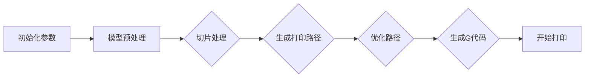
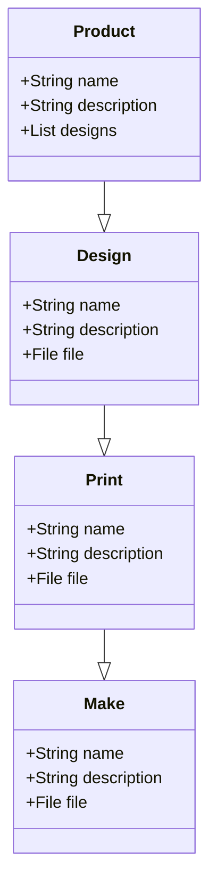
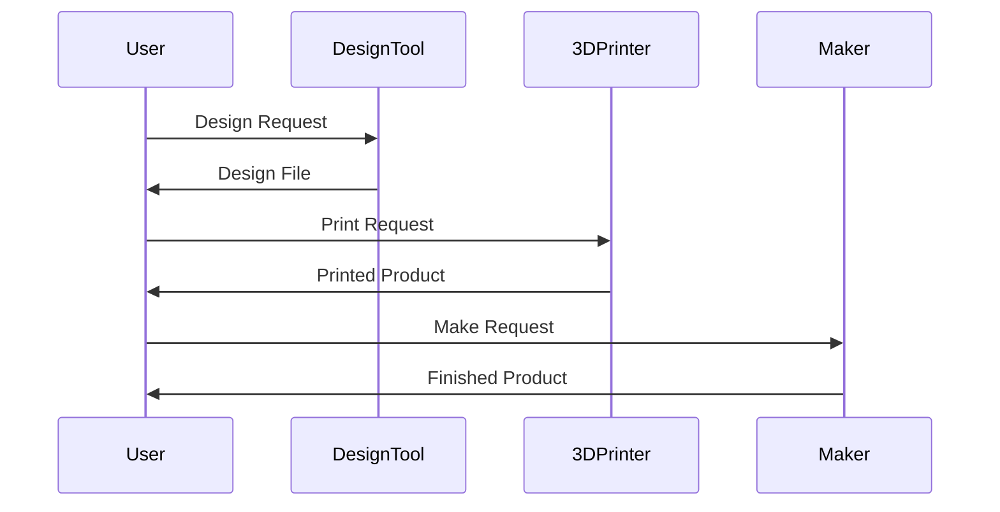
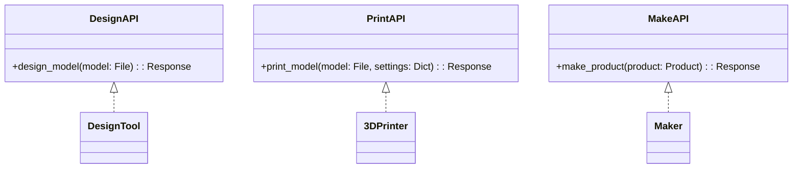
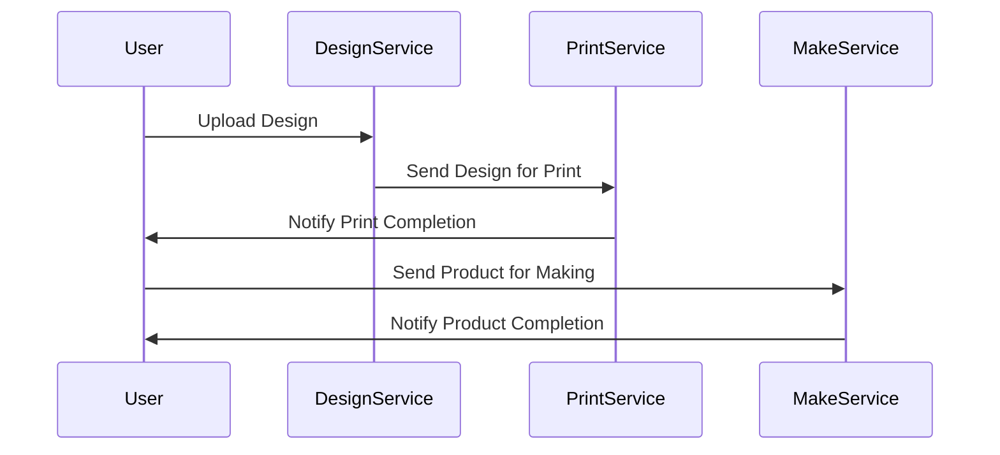

                 

# 现代手工皮具3D打印定制：传统工艺与数字技术的完美融合

关键词：3D打印，手工皮具，数字化设计，个性化定制

摘要：本文深入探讨了现代手工皮具3D打印定制的发展趋势、技术原理和实际应用。首先，我们从3D打印技术的基础知识入手，详细介绍了其定义、发展历程、工作原理和分类。接着，我们讲解了手工皮具制作的基础知识，包括历史发展、材料选择和制作工艺。随后，我们重点分析了3D打印技术在皮具制作中的应用，通过实际案例展示了其在设计、制作和定制中的优势。此外，我们还探讨了数字化设计工具在皮具制作中的应用，以及现代手工皮具3D打印定制的未来展望。

## 引言

随着科技的不断进步，传统手工艺与数字技术的结合正变得越来越紧密。手工皮具制作，作为一种具有悠久历史的工艺，正逐渐与3D打印技术融合，带来了一场革命性的变革。本文旨在探讨这一新兴领域，分析现代手工皮具3D打印定制的优势和应用场景，以及其未来发展的可能方向。

## 第1部分：3D打印技术概述

### 第1章：3D打印技术基础

#### 1.1 3D打印技术概述

##### 1.1.1 3D打印的定义与发展历程

3D打印，也称为增材制造，是一种通过逐层堆叠材料来制造三维物体的技术。它起源于20世纪80年代的立体光固化技术（SLA），随后出现了熔融沉积成型（FDM）、选择性激光烧结（SLS）等多种技术。近年来，3D打印技术在全球范围内迅速发展，应用领域也越来越广泛。

##### 1.1.2 3D打印的工作原理与技术分类

3D打印的工作原理主要分为三种：立体光固化、热熔融和粉末烧结。根据打印材料的不同，3D打印技术可以分为金属3D打印、塑料3D打印和陶瓷3D打印等。每种技术都有其独特的优势和适用场景。

##### 1.1.3 3D打印材料与成型技术

3D打印材料种类丰富，包括塑料、金属、陶瓷、橡胶等。成型技术则包括立体光固化（SLA）、熔融沉积成型（FDM）、选择性激光烧结（SLS）等。这些技术为3D打印的应用提供了广泛的选择。

### 第2章：3D打印设备与工艺

#### 2.1 3D打印设备

##### 2.1.1 3D打印机的工作原理与类型

3D打印机根据成型技术可以分为立体光固化（SLA）打印机、熔融沉积成型（FDM）打印机、选择性激光烧结（SLS）打印机等。每种打印机都有其特定的应用场景。

##### 2.1.2 3D打印机的选购与维护

选购3D打印机时，需要考虑打印精度、打印速度、材料兼容性等因素。同时，3D打印机的维护也是保证其长期稳定运行的关键。

##### 2.1.3 3D打印耗材与替代品

3D打印耗材主要包括塑料、金属粉末、陶瓷粉末等。随着技术的发展，一些替代品如光敏树脂、生物材料等也逐渐应用于3D打印。

#### 2.2 3D打印工艺

##### 2.2.1 3D打印流程与步骤

3D打印流程主要包括模型设计、切片处理、打印准备和打印执行等步骤。每个步骤都需要精确的控制和优化。

##### 2.2.2 3D打印中的常见问题与解决方案

3D打印过程中可能会遇到层间剥离、打印偏移、打印不完全等问题。通过合理的调整参数和改进工艺，可以有效地解决这些问题。

##### 2.2.3 3D打印工艺优化与性能提升

3D打印工艺的优化主要包括材料选择、打印参数调整、打印路径优化等。通过这些优化，可以显著提升3D打印的效率和性能。

## 第2部分：手工皮具制作基础知识

### 第3章：手工皮具制作概述

#### 3.1 手工皮具制作的历史与发展

手工皮具制作有着悠久的历史，起源于古代文明的皮具工艺。随着时间的推移，手工皮具制作不断发展，形成了独特的制作工艺和风格。

##### 3.1.1 传统手工皮具制作工艺

传统手工皮具制作工艺包括选料、削皮、切割、打磨、缝制等步骤。这些步骤需要精湛的手工技艺和丰富的经验。

##### 3.1.2 手工皮具制作的重要性与市场前景

手工皮具制作不仅具有艺术价值，还具有实用性。随着消费者对个性化和定制化需求不断增加，手工皮具市场前景广阔。

##### 3.1.3 手工皮具制作的基本步骤

手工皮具制作的基本步骤包括设计、选料、削皮、切割、打磨、缝制和上油等。每个步骤都需要精细的操作和耐心。

### 第4章：手工皮具制作材料与工具

#### 4.1 皮料与皮革制作材料

##### 4.1.1 皮料的种类与特点

皮料是手工皮具制作的核心材料，包括牛皮、羊皮、猪皮等。每种皮料都有其独特的特点和适用场景。

##### 4.1.2 皮料的选购与保养

选购皮料时，需要考虑皮料的厚度、韧性、纹理和色泽。同时，正确保养皮料可以延长其使用寿命。

##### 4.1.3 皮革制作材料的准备与处理

皮革制作材料的准备和处理是手工皮具制作的关键步骤。包括削皮、软化、鞣制等工艺。

#### 4.2 工具与设备

##### 4.2.1 常用手工工具及其用途

手工皮具制作需要各种工具，包括剪刀、刀片、裁刀、锤子、钉枪等。每种工具都有其特定的用途。

##### 4.2.2 手工皮具制作设备介绍

手工皮具制作设备包括裁皮台、削皮机、打磨机、缝纫机等。这些设备可以提高制作效率，保证制作质量。

##### 4.2.3 工具与设备的使用技巧与保养

正确使用和保养工具与设备是手工皮具制作的重要环节。包括使用方法、维护保养和故障排除等。

## 第3部分：3D打印技术在皮具制作中的应用

### 第5章：3D打印技术在皮具制作中的应用

#### 5.1 3D打印在皮具设计中的作用

##### 5.1.1 3D打印设计的优势

3D打印技术为皮具设计带来了前所未有的灵活性。设计师可以通过3D打印快速验证设计，节省时间和成本。

##### 5.1.2 3D打印设计工具的选择

常见的3D打印设计工具有AutoCAD、SketchUp、Blender等。选择合适的工具可以根据设计需求。

##### 5.1.3 3D打印设计案例与实践

通过实际案例，展示3D打印在皮具设计中的应用，包括设计思路、流程和成果。

### 第6章：3D打印技术在皮具制作中的应用案例

#### 6.1 案例一：皮具配件的3D打印制作

##### 6.1.1 案例背景

介绍案例的背景，包括皮具配件的种类和特点。

##### 6.1.2 案例实现步骤

详细描述3D打印皮具配件的实现步骤，包括设计、打印和后处理等。

##### 6.1.3 案例成果与分析

展示案例的成果，并对其进行分析，包括优缺点和改进方向。

#### 6.2 案例二：个性化皮具定制

##### 6.2.1 案例背景

介绍个性化皮具定制的背景，包括消费者需求和市场竞争。

##### 6.2.2 案例实现步骤

详细描述个性化皮具定制的实现步骤，包括客户需求分析、设计、打印和交付等。

##### 6.2.3 案例成果与分析

展示案例的成果，并对其进行分析，包括客户满意度、成本效益和市场竞争优势等。

## 第4部分：数字化设计工具应用

### 第7章：数字化设计工具在皮具制作中的应用

#### 7.1 数字化设计工具概述

##### 7.1.1 数字化设计工具的发展与应用

介绍数字化设计工具的发展历程和应用现状，包括CAD、CAM、3D建模等。

##### 7.1.2 常见数字化设计工具介绍

介绍常见的数字化设计工具，如AutoCAD、SketchUp、Blender等。

##### 7.1.3 数字化设计工具的优势与挑战

分析数字化设计工具的优势，如高效、精确、灵活等，以及面临的挑战，如技术门槛、软件成本等。

### 第8章：数字化设计工具实践

#### 8.1 实践一：数字化皮具设计

##### 8.1.1 实践背景

介绍数字化皮具设计的背景，包括市场需求和技术条件。

##### 8.1.2 实践步骤

详细描述数字化皮具设计的实践步骤，包括设计软件的选择、设计流程、打印准备等。

##### 8.1.3 实践成果与分析

展示数字化皮具设计的成果，并进行分析，包括设计效果、效率、成本等。

#### 8.2 实践二：数字化皮具定制

##### 8.2.1 实践背景

介绍数字化皮具定制的背景，包括消费者需求和市场竞争。

##### 8.2.2 实践步骤

详细描述数字化皮具定制的实践步骤，包括客户需求分析、设计、打印和交付等。

##### 8.2.3 实践成果与分析

展示数字化皮具定制的成果，并进行分析，包括客户满意度、成本效益和市场竞争优势等。

## 第5部分：案例分析与实践

### 第9章：现代手工皮具3D打印定制案例分析

#### 9.1 案例背景介绍

##### 9.1.1 案例公司背景

介绍案例公司的发展历程、主营业务和市场需求。

##### 9.1.2 案例产品背景

介绍案例公司的手工皮具产品，包括种类、特点和市场需求。

#### 9.2 案例实施步骤

##### 9.2.1 设计阶段

介绍案例设计阶段的流程和步骤，包括设计理念、设计工具和设计成果。

##### 9.2.2 打印阶段

介绍案例打印阶段的流程和步骤，包括3D打印设备选择、材料准备和打印参数设置。

##### 9.2.3 制作阶段

介绍案例制作阶段的流程和步骤，包括裁剪、缝制、打磨和上油等工艺。

### 第10章：实践指导

#### 10.1 实践准备

##### 10.1.1 设备与材料准备

介绍实践所需的设备与材料，包括3D打印机、皮革材料、工具等。

##### 10.1.2 设计软件与工具准备

介绍实践所需的设计软件与工具，包括CAD、SketchUp、Blender等。

##### 10.1.3 安全注意事项

介绍实践过程中的安全注意事项，包括操作规范、安全防护和紧急处理等。

#### 10.2 实践操作

##### 10.2.1 设计与制作步骤

详细描述实践的设计与制作步骤，包括设计构思、设计软件操作、3D打印操作和手工制作工艺等。

##### 10.2.2 遇到问题的解决方法

介绍实践过程中可能遇到的问题及其解决方法，包括设计修改、打印故障处理和手工制作问题解决等。

##### 10.2.3 成果展示与评价

展示实践的成果，包括设计图纸、3D打印模型和手工皮具成品，并进行评价，包括设计创新性、制作质量和市场前景等。

## 第6部分：创新与未来展望

### 6.1 创新成果与影响

回顾现代手工皮具3D打印定制的创新成果，分析其对传统手工皮具行业的冲击和影响。

### 6.2 未来发展趋势

展望现代手工皮具3D打印定制的未来发展趋势，探讨其在个性化定制、智能化生产等方面的潜力。

### 6.3 未来展望

提出对现代手工皮具3D打印定制未来发展的展望，包括技术创新、市场拓展和人才培养等方面。

### 结束语

本文通过对现代手工皮具3D打印定制的深入探讨，展示了传统工艺与数字技术的完美融合。我们相信，随着技术的不断进步，这一领域将迎来更加广阔的发展空间。

**作者：AI天才研究院/AI Genius Institute & 禅与计算机程序设计艺术 /Zen And The Art of Computer Programming**

---

**核心概念与联系**

#### 3D打印技术核心概念

- **增材制造**：通过逐层叠加材料来制造三维物体的过程。
- **立体光固化**：使用激光或其他光源固化光敏树脂来制造三维物体。
- **熔融沉积成型**：将热塑性材料熔融后挤出并层叠成型的过程。
- **选择性激光烧结**：使用激光烧结粉末材料来制造三维物体。

#### 表格：3D打印技术分类与特性对比

| 技术类型 | 材料 | 特性 |
| --- | --- | --- |
| 立体光固化（SLA） | 光敏树脂 | 高精度、良好的表面质量 |
| 熔融沉积成型（FDM） | 热塑性塑料 | 成本低、材料广泛 |
| 选择性激光烧结（SLS） | 金属粉末、塑料粉末 | 高强度、耐用性 |
| 陶瓷3D打印 | 陶瓷粉末 | 高温稳定性、良好机械性能 |

#### ER实体关系图架构

```mermaid
erDiagram
    Product ||--|{ 3D Printing Technology } |>
    3D Printing Technology ||--|{ Manufacturing Process } |>
    Manufacturing Process ||--|{ Material Type } |>
    Material Type ||--|{ Product Feature } |>
```

**算法原理讲解**

#### 3D打印工艺优化算法

**Mermaid流程图：**



**Python源代码实现：**

```python
import numpy as np

def optimize_print_path(path):
    # 初始化参数
    width = 10
    height = 20
    layer_height = 0.2
    
    # 模型预处理
    preprocessed_path = preprocess_model(path)
    
    # 切片处理
    sliced_path = slice_model(preprocessed_path, layer_height)
    
    # 生成打印路径
    print_path = generate_print_path(sliced_path)
    
    # 优化路径
    optimized_path = optimize_path(print_path, width, height)
    
    # 生成G代码
    gcode = generate_gcode(optimized_path)
    
    # 开始打印
    start_printing(gcode)

def preprocess_model(path):
    # 模型预处理操作
    pass

def slice_model(model, layer_height):
    # 切片操作
    pass

def generate_print_path(sliced_path):
    # 生成打印路径操作
    pass

def optimize_path(path, width, height):
    # 优化路径操作
    pass

def generate_gcode(path):
    # 生成G代码操作
    pass

def start_printing(gcode):
    # 开始打印操作
    pass
```

**算法原理详细讲解：**

1. **初始化参数**：设置打印宽度、高度和层高。
2. **模型预处理**：对输入的3D模型进行预处理，包括去毛刺、平滑处理等。
3. **切片处理**：将预处理后的模型按照设定的层高进行切片，生成切片数据。
4. **生成打印路径**：根据切片数据生成打印路径。
5. **优化路径**：对打印路径进行优化，提高打印效率和效果。
6. **生成G代码**：将优化后的路径转化为G代码。
7. **开始打印**：执行G代码，启动3D打印机进行打印。

**数学模型和公式：**

$$
\text{Optimized Path} = \text{Optimize}(\text{Original Path}, \text{Width}, \text{Height})
$$

**举例说明：**

假设原始路径为一条直线，宽度为10cm，高度为20cm，层高为0.2cm。优化后的路径可以采用曲线代替直线，以提高打印的平滑度和减少打印时间。

**系统分析与架构设计方案**

#### 问题场景介绍

在现代手工皮具制作过程中，传统手工工艺与3D打印技术的结合为个性化定制提供了新的解决方案。为了提高生产效率和产品质量，一个基于3D打印技术的手工皮具制作系统应运而生。

#### 项目介绍

本项目旨在开发一个集成3D打印和数字化设计工具的手工皮具制作系统，实现从设计到成品的一体化流程。系统包括以下功能模块：

- 设计模块：使用数字化设计工具进行皮具设计。
- 打印模块：利用3D打印机进行打印。
- 制作模块：通过手工工艺完成成品的制作。

#### 系统功能设计

**领域模型**

```mermaid
classDiagram
    Product <<interface>>
    Design <<interface>>
    Print <<interface>>
    Make <<interface>>

    Product <|.. Design: Designs>
    Design <|.. Print: Prints>
    Print <|.. Make: Produces>
```

**类图：**



#### 系统架构设计

**架构图：**



#### 系统接口设计

**接口设计：**



#### 系统交互

**序列图：**



**项目实战**

#### 环境安装

1. 安装Python环境（例如使用Anaconda）。
2. 安装3D打印软件（如Cura）。
3. 安装数字化设计工具（如Blender）。

#### 系统核心实现源代码

```python
# DesignService.py
class DesignService:
    def upload_design(self, file):
        # 设计文件上传处理
        pass

# PrintService.py
class PrintService:
    def send_design_for_print(self, design):
        # 发送设计文件到3D打印机
        pass

# MakeService.py
class MakeService:
    def send_product_for_making(self, product):
        # 发送产品到手工制作环节
        pass
```

#### 代码应用解读与分析

1. **DesignService**：负责设计文件的上传和处理。
2. **PrintService**：负责将设计文件发送到3D打印机进行打印。
3. **MakeService**：负责将打印好的产品发送到手工制作环节。

#### 实际案例分析

**案例一：设计一个手提包**

1. 用户使用Blender设计手提包模型。
2. 将设计文件上传到DesignService。
3. DesignService处理设计文件，生成3D模型。
4. 用户将3D模型发送到PrintService。
5. PrintService生成打印路径，并开始打印手提包。
6. 手提包打印完成后，用户将产品发送到MakeService。
7. Maker对手提包进行手工制作，完成成品。

**案例二：个性化定制皮包**

1. 用户上传个人头像，使用Blender设计个性化图案。
2. 将设计文件上传到DesignService。
3. DesignService处理设计文件，并将图案应用到皮包上。
4. 用户将设计好的皮包发送到PrintService。
5. PrintService生成打印路径，并开始打印个性化图案。
6. 图案打印完成后，用户将皮包发送到MakeService。
7. Maker对手包进行手工制作，并在图案上涂上保护漆，完成定制皮包。

#### 项目小结

本项目通过集成3D打印和数字化设计工具，实现了手工皮具制作的智能化和定制化。在实际应用中，用户可以轻松设计并定制自己的皮具产品，提高了生产效率和产品质量。

### 最佳实践 Tips

1. **设计优化**：在设计阶段，充分利用数字化设计工具进行优化，减少后期修改工作量。
2. **材料选择**：根据产品的用途和设计要求，选择合适的3D打印材料和手工材料。
3. **工艺流程**：明确各环节的工艺流程，确保生产效率和质量。
4. **团队合作**：建立有效的团队合作机制，确保项目顺利进行。

### 小结

现代手工皮具3D打印定制是传统工艺与数字技术的完美融合，为手工皮具行业带来了新的发展机遇。通过本文的探讨，我们了解了3D打印技术在皮具制作中的应用，以及数字化设计工具的重要性。未来，随着技术的不断进步，现代手工皮具3D打印定制将实现更高水平的个性化定制和智能化生产。

### 注意事项

1. 在使用3D打印机时，务必遵守安全操作规程，确保人身安全和设备安全。
2. 在进行手工皮具制作时，注意使用合适的工具和材料，避免受伤。
3. 在设计和定制过程中，充分了解用户需求，确保产品符合预期。

### 拓展阅读

1. "3D Printing for Dummies" - Forrest Brazeal
2. "Digital Craft: Integration of Traditional Craftsmanship and Digital Technology" - Aidan Chopra
3. "The Future is Here: 3D Printing and the Next Industrial Revolution" - Davidor Mederos

**作者：AI天才研究院/AI Genius Institute & 禅与计算机程序设计艺术 /Zen And The Art of Computer Programming**

