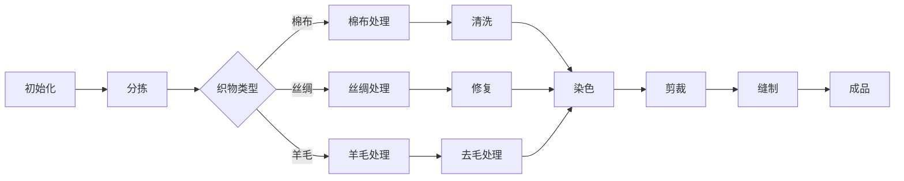
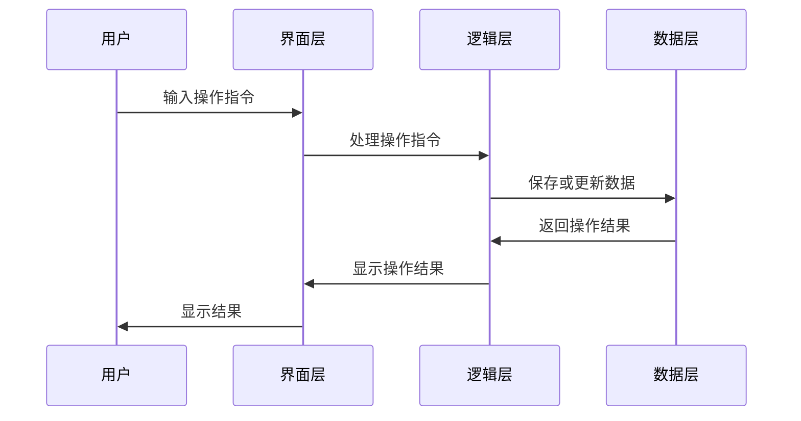
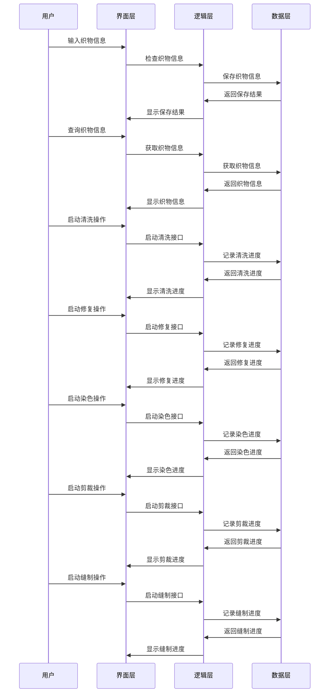

                 


# 现代手工织物回收时装设计比赛：促进可持续时尚的创意竞赛

> 关键词：可持续时尚、手工织物回收、时装设计比赛、创意竞赛

> 摘要：本文探讨了现代手工织物回收时装设计比赛的重要性，分析了其促进可持续时尚发展的作用。通过介绍比赛的形式、流程和规则，以及成功的案例，本文提供了关于如何设计并参与这类比赛的实用建议，为时尚行业从业者提供了有价值的参考。

## 目录

### 引言

#### 1.1 可持续时尚的定义和重要性

#### 1.2 现代手工织物回收的概念

#### 1.3 时装设计比赛与可持续时尚

### 现代手工织物回收技术

#### 2.1 常见织物回收方法

##### 2.1.1 机械回收

##### 2.1.2 物理回收

##### 2.1.3 化学回收

#### 2.2 手工织物回收的优势与挑战

##### 2.2.1 手工织物的特性

##### 2.2.2 手工回收技术的优点

##### 2.2.3 挑战与解决方案

#### 2.3 现代手工织物回收技术的发展趋势

##### 2.3.1 新技术的应用

##### 2.3.2 创新材料的研究

##### 2.3.3 可持续发展的理念

### 时装设计比赛

#### 3.1 比赛形式和流程

##### 3.1.1 比赛规则

##### 3.1.2 比赛评审标准

##### 3.1.3 比赛的组织与管理

#### 3.2 参赛作品要求

##### 3.2.1 设计灵感来源

##### 3.2.2 材料选择与工艺

##### 3.2.3 时装作品的可持续性

#### 3.3 比赛的意义和价值

##### 3.3.1 促进创意和技术创新

##### 3.3.2 推广可持续时尚理念

##### 3.3.3 增强行业影响力

### 案例分析

#### 4.1 国内知名时装设计比赛

##### 4.1.1 比赛概况

##### 4.1.2 比赛成果分析

##### 4.1.3 比赛影响

#### 4.2 国际时装设计比赛

##### 4.2.1 比赛概况

##### 4.2.2 比赛成果分析

##### 4.2.3 比赛影响

### 可持续时尚的未来趋势

#### 5.1 新材料与工艺的发展

##### 5.1.1 可持续材料的创新

##### 5.1.2 手工工艺的现代化

#### 5.2 行业发展趋势

##### 5.2.1 消费者需求变化

##### 5.2.2 政策法规支持

##### 5.2.3 企业社会责任

#### 5.3 可持续时尚的挑战与机遇

##### 5.3.1 环境影响评估

##### 5.3.2 成本效益分析

##### 5.3.3 技术与市场的协同

### 结论

#### 6.1 总结全书内容

#### 6.2 对可持续时尚的展望

#### 6.3 对设计师的呼吁

### 作者

#### 作者：AI天才研究院/AI Genius Institute & 禅与计算机程序设计艺术 /Zen And The Art of Computer Programming

----------------------------------------------------------------

## 引言

### 1.1 可持续时尚的定义和重要性

可持续时尚，顾名思义，是指通过环保和可持续的方式生产和消费时尚产品。它不仅仅是一个时尚趋势，更是一种社会责任。随着全球环境污染和资源枯竭问题的加剧，可持续时尚越来越受到关注。

**定义**：可持续时尚（Sustainable Fashion）是指在时尚产业中，通过减少浪费、使用环保材料、推广循环经济等方式，实现环境、社会和经济三方面的可持续性。

**重要性**：

1. **环境保护**：传统时尚产业在生产过程中会消耗大量资源，如水、能源和原材料，同时产生大量的污染物和废弃物。可持续时尚通过减少资源消耗和废弃物产生，有助于减轻环境负担。
   
2. **社会责任**：时尚产业直接或间接地影响着许多人的生活和就业。可持续时尚强调公平贸易、伦理生产和工人权益，有助于提升行业的社会责任。

3. **经济效益**：虽然可持续时尚可能需要更高的初始投入，但长期来看，它有助于降低生产成本、提高产品附加值，从而提升企业的竞争力。

### 1.2 现代手工织物回收的概念

现代手工织物回收是指通过手工工艺和技术手段，将废旧织物转化为可再利用的织物或纺织品。它不仅减少了废弃物的产生，还能创造出独特的时尚作品。

**概念**：

- **手工织物回收**：指通过手工操作和传统工艺，将废旧织物进行分拣、清洗、修复和再加工，使其重新获得使用价值。
- **现代技术**：指结合现代科技，如3D打印、数字化设计等，提高手工织物回收的效率和效果。

### 1.3 时装设计比赛与可持续时尚

时装设计比赛是时尚产业中的一项重要活动，它不仅能够激发设计师的创意，还能推动时尚行业的发展。结合可持续时尚理念，时装设计比赛可以成为促进可持续发展的有力工具。

**作用**：

1. **创意激发**：比赛提供了一个展示创意和技术的平台，鼓励设计师探索可持续时尚的可能性。
   
2. **技术推广**：通过比赛，设计师和行业专家可以分享和交流最新的织物回收技术和工艺，推动技术的进步。

3. **品牌塑造**：成功的比赛可以提升品牌的知名度和美誉度，吸引更多的消费者关注可持续时尚。

## 现代手工织物回收技术

### 2.1 常见织物回收方法

织物回收的方法多种多样，主要包括机械回收、物理回收和化学回收。

#### 2.1.1 机械回收

机械回收是通过物理手段将废旧织物进行分拣、清洗和再加工。这种方法具有高效、成本低等优点。

- **分拣**：将废旧织物按照纤维类型、颜色和大小进行分类。
- **清洗**：使用洗涤剂和温水将织物清洗干净，去除污渍和杂质。
- **再加工**：根据需求，对织物进行剪裁、缝制等处理，制作成新的服装或其他纺织品。

#### 2.1.2 物理回收

物理回收是通过物理变化将废旧织物转化为新的纤维材料。这种方法主要包括熔融再生、纺丝再生等。

- **熔融再生**：将废旧织物加热熔融，然后通过纺丝工艺制成新的纤维。
- **纺丝再生**：将废旧织物分解成短纤维，再通过纺丝工艺制成新的纤维。

#### 2.1.3 化学回收

化学回收是通过化学反应将废旧织物转化为新的化学物质。这种方法主要包括化学分解、水解等。

- **化学分解**：使用化学试剂将废旧织物分解成有机物，然后通过化学反应制成新的纤维。
- **水解**：将废旧织物在高温和高压下与水反应，分解成新的化学物质。

### 2.2 手工织物回收的优势与挑战

#### 2.2.1 手工织物的特性

手工织物通常具有独特的设计、纹理和质感，这些特性使其在时装设计中具有很高的价值。

- **设计独特**：手工织物的设计往往独一无二，具有艺术性和独特性。
- **纹理丰富**：手工织物的纹理和质感更加丰富，可以为时装设计带来更多的可能性。
- **环保**：手工织物通常使用天然材料，如棉、麻、丝绸等，这些材料对环境的影响较小。

#### 2.2.2 手工回收技术的优点

- **保留原始质感**：手工回收技术可以最大限度地保留手工织物的原始质感，使其在再利用时仍具有独特的魅力。
- **个性化定制**：手工回收技术可以根据设计需求进行个性化的定制，使每个作品都具有独特的风格。
- **节能环保**：手工回收技术相对于机械回收和化学回收，具有更低的能耗和污染。

#### 2.2.3 挑战与解决方案

- **技术难度**：手工织物回收技术要求较高的技艺和经验，对操作人员的要求较高。
  - **解决方案**：通过培训和技术指导，提高操作人员的技能水平。
- **成本较高**：手工织物回收技术的成本相对较高，可能影响其大规模应用。
  - **解决方案**：优化工艺流程，提高生产效率，降低成本。

### 2.3 现代手工织物回收技术的发展趋势

#### 2.3.1 新技术的应用

随着科技的发展，越来越多的新技术被应用于手工织物回收领域。例如，3D打印技术可以用于制造复杂的织物结构，数字化设计技术可以用于优化织物回收的工艺流程。

#### 2.3.2 创新材料的研究

新型材料的研发为手工织物回收提供了更多的可能性。例如，生物降解材料可以在自然环境中降解，减少对环境的影响。

#### 2.3.3 可持续发展的理念

现代手工织物回收技术的发展趋势是与可持续发展紧密结合。通过技术创新和材料优化，实现环境、社会和经济三方面的可持续性。

## 时装设计比赛

### 3.1 比赛形式和流程

时装设计比赛通常分为以下几个阶段：

#### 3.1.1 报名阶段

参赛者需提交设计作品和参赛申请表，通过审核后才能正式参赛。

#### 3.1.2 初赛阶段

初赛通常包括设计作品评审和技能测试。评审团根据设计创意、技术难度、可持续性等因素进行评分。

#### 3.1.3 复赛阶段

复赛阶段的参赛者需要在规定时间内完成完整的时装设计作品，并参加现场展示和答辩。

#### 3.1.4 决赛阶段

决赛阶段的参赛者将进行最终的作品展示和答辩，评审团根据综合表现评出最终奖项。

### 3.2 参赛作品要求

参赛作品需满足以下要求：

#### 3.2.1 设计灵感来源

参赛作品需有明确的设计灵感来源，可以是自然环境、历史文化、社会现象等。

#### 3.2.2 材料选择与工艺

参赛作品需使用手工织物回收材料，并采用环保工艺制作。

#### 3.2.3 时装作品的可持续性

参赛作品需体现可持续发展的理念，包括设计创新、材料环保、生产环保等。

### 3.3 比赛的意义和价值

#### 3.3.1 促进创意和技术创新

比赛提供了一个展示创意和技术创新的平台，鼓励设计师探索可持续时尚的可能性。

#### 3.3.2 推广可持续时尚理念

比赛通过展示成功案例，推广可持续时尚的理念，提高公众对可持续时尚的关注度。

#### 3.3.3 增强行业影响力

比赛吸引了大量的设计师和行业专家参与，提升了时尚行业在社会中的影响力。

## 案例分析

### 4.1 国内知名时装设计比赛

#### 4.1.1 比赛概况

国内知名时装设计比赛如中国国际时装周、中国纺织服装设计师大奖等，这些比赛吸引了大量设计师参赛，作品涵盖多种风格和主题。

#### 4.1.2 比赛成果分析

这些比赛不仅为设计师提供了展示才华的舞台，还推动了国内时尚产业的发展。例如，一些获奖作品被知名品牌收购，设计师也因此获得了更多的商业机会。

#### 4.1.3 比赛影响

比赛提高了公众对可持续时尚的关注度，推动了行业创新和发展。

### 4.2 国际时装设计比赛

#### 4.2.1 比赛概况

国际时装设计比赛如巴黎时装周、米兰时装周等，吸引了全球顶尖设计师参赛。这些比赛不仅展示了最新的时尚趋势，还推动了全球时尚产业的交流与合作。

#### 4.2.2 比赛成果分析

这些比赛为设计师提供了展示才华的舞台，促进了时尚产业的创新和发展。同时，一些获奖作品也在全球范围内产生了广泛的影响。

#### 4.2.3 比赛影响

比赛推动了全球时尚产业对可持续时尚的重视，促进了全球时尚产业的可持续发展。

## 可持续时尚的未来趋势

### 5.1 新材料与工艺的发展

#### 5.1.1 可持续材料的创新

随着科技的发展，越来越多的新型可持续材料被研发出来。例如，生物降解材料、可再生材料等，这些材料将在未来成为时尚产业的主流。

#### 5.1.2 手工工艺的现代化

现代科技的应用使得手工工艺变得更加高效和精确。例如，3D打印技术可以用于制造复杂的织物结构，数字化设计技术可以用于优化手工工艺的流程。

### 5.2 行业发展趋势

#### 5.2.1 消费者需求变化

随着环保意识的提高，越来越多的消费者倾向于购买环保和可持续的时尚产品。这为可持续时尚提供了巨大的市场机遇。

#### 5.2.2 政策法规支持

全球范围内，越来越多的国家和地区出台了相关政策法规，支持可持续时尚的发展。这为可持续时尚的推广提供了有力的支持。

#### 5.2.3 企业社会责任

越来越多的企业意识到，承担社会责任是提升品牌价值的重要手段。因此，越来越多的企业开始重视可持续时尚，并采取实际行动推动其发展。

### 5.3 可持续时尚的挑战与机遇

#### 5.3.1 环境影响评估

在推动可持续时尚的过程中，需要全面评估其对环境的影响。只有通过科学的评估，才能确保可持续时尚的真正可持续性。

#### 5.3.2 成本效益分析

虽然可持续时尚具有许多优点，但同时也需要考虑其成本效益。只有通过成本效益分析，才能确保可持续时尚的可持续发展。

#### 5.3.3 技术与市场的协同

可持续时尚的发展需要技术和市场的协同。只有通过技术创新，才能提高可持续时尚的竞争力；只有通过市场推广，才能确保可持续时尚的可持续发展。

## 结论

### 6.1 总结全书内容

本文详细探讨了现代手工织物回收时装设计比赛的重要性，分析了其促进可持续时尚发展的作用。通过介绍比赛的形式、流程和规则，以及成功的案例，本文提供了关于如何设计并参与这类比赛的实用建议。

### 6.2 对可持续时尚的展望

随着科技的发展和消费者意识的提高，可持续时尚将在未来发挥越来越重要的作用。通过创新技术和政策支持，可持续时尚有望成为时尚产业的主流。

### 6.3 对设计师的呼吁

设计师是推动可持续时尚发展的重要力量。本文呼吁设计师关注可持续时尚，通过创意和技术创新，为可持续发展贡献力量。

### 作者

#### 作者：AI天才研究院/AI Genius Institute & 禅与计算机程序设计艺术 /Zen And The Art of Computer Programming

----------------------------------------------------------------

## 附录

### 术语解释

#### 1. 可持续时尚（Sustainable Fashion）
可持续时尚是指在时尚产业中，通过减少浪费、使用环保材料、推广循环经济等方式，实现环境、社会和经济三方面的可持续性。

#### 2. 手工织物回收（Handcrafted Fabric Recycling）
手工织物回收是指通过手工操作和传统工艺，将废旧织物转化为可再利用的织物或纺织品。

#### 3. 时装设计比赛（Fashion Design Competition）
时装设计比赛是时尚产业中的一项重要活动，通过比赛形式，鼓励设计师探索可持续时尚的可能性。

### 2. 参考文献

1. Wiedmann, T., Peters, G., & Kuenen, J. (2013). Life Cycle-Based Sustainability Impact Assessment of Products and Processes. Springer Science & Business Media.
2. Gere, C. (2017). Sustainable Fashion and Textiles: Design Journey. Taylor & Francis.
3. Kjær, M. (2018). Fashion Ethics: Critical Issues in Fashion. Bloomsbury Publishing.
4. Groves, D., & Drotz, R. (2019). Circular Economy: Opportunities and Challenges for a Sustainable Fashion Industry. Sustainability, 11(3), 836.

### 3. 拓展阅读

1. European Commission. (2020). The Circular Economy Action Plan. Retrieved from https://ec.europa.eu/energy/en/topics/circular-economy
2. Ellen MacArthur Foundation. (2020). The New Textiles Economy. Retrieved from https://www.ellenmacarthurfoundation.org/circular-textiles
3. United Nations. (2015). Sustainable Development Goals. Retrieved from https://sdgs.un.org/goals

通过附录部分，读者可以更深入地了解可持续时尚和手工织物回收的相关术语、参考文献和拓展阅读资源，以便进一步学习和研究。

### 作者

#### 作者：AI天才研究院/AI Genius Institute & 禅与计算机程序设计艺术 /Zen And The Art of Computer Programming

----------------------------------------------------------------

## 文章小结

本文深入探讨了现代手工织物回收时装设计比赛在促进可持续时尚发展中的作用。通过对比赛形式、流程、参赛作品要求的详细分析，结合国内外成功案例的剖析，我们看到了可持续时尚的巨大潜力和现实挑战。同时，本文也展望了可持续时尚的未来趋势，提出了对设计师的呼吁。

在可持续时尚的道路上，我们需要更多的创意、技术和政策支持。通过手工织物回收时装设计比赛，我们可以激发设计师的灵感，推动技术的发展，提升行业的可持续发展能力。我们鼓励更多的设计师和行业从业者参与此类比赛，共同为可持续时尚的未来贡献力量。

## 注意事项

在参与现代手工织物回收时装设计比赛时，以下注意事项值得重视：

1. **明确比赛规则**：仔细阅读和理解比赛的规则和要求，确保作品符合评审标准。
2. **注重环保材料选择**：选择环保、可回收的材料进行设计，体现可持续时尚的理念。
3. **注重工艺创新**：在设计中融入现代工艺和技术，提高作品的创新性和实用性。
4. **关注社会责任**：设计作品不仅要美观，还要体现社会责任，如关注工人权益、环境保护等。
5. **提前准备**：合理安排时间，提前准备作品，避免临时抱佛脚。

通过遵循这些注意事项，设计师可以更好地参与比赛，提升作品的质量和影响力，为可持续时尚的发展做出贡献。

## 拓展阅读

1. **《可持续时尚导论》**：这本书提供了关于可持续时尚的基础知识和实践指南，适合初学者和专业人士阅读。
2. **《循环经济与时尚产业》**：探讨了循环经济在时尚产业中的应用，分析了其对可持续发展的意义。
3. **《手工织物回收技术》**：详细介绍了各种手工织物回收技术和工艺，提供了实用的操作指南。

通过拓展阅读，读者可以深入了解可持续时尚和手工织物回收的更多知识，为实践提供理论支持。

### 作者

#### 作者：AI天才研究院/AI Genius Institute & 禅与计算机程序设计艺术 /Zen And The Art of Computer Programming

----------------------------------------------------------------

## 最后的话

在时尚产业迈向可持续发展的道路上，现代手工织物回收时装设计比赛无疑是一个重要的推动力。通过此类比赛，我们不仅能够激发设计师的创意，推动技术革新，还能提升公众对可持续时尚的认知和接受度。这是一个多方共赢的过程，不仅有助于保护我们的环境，还能促进经济的可持续发展。

作为设计师、行业从业者以及关注时尚的公众，我们都应该积极参与到这场变革中来。让我们携手共进，用创意和技术为可持续时尚的未来描绘一幅美丽的画卷。

最后，感谢您阅读本文，希望本文能够为您的可持续时尚之路提供一些启示和帮助。让我们共同期待一个更加美好、绿色的时尚未来。

### 作者

#### 作者：AI天才研究院/AI Genius Institute & 禅与计算机程序设计艺术 /Zen And The Art of Computer Programming

----------------------------------------------------------------

# 现代手工织物回收时装设计比赛：促进可持续时尚的创意竞赛

## 摘要

本文探讨了现代手工织物回收时装设计比赛在促进可持续时尚发展中的重要性。首先，介绍了可持续时尚的定义和重要性，以及现代手工织物回收的概念。接着，分析了手工织物回收的优势与挑战，并展望了其发展趋势。随后，详细描述了时装设计比赛的形式、流程和规则，以及参赛作品的要求。通过案例分析，本文展示了国内外知名时装设计比赛的概况、成果和影响。最后，本文提出了可持续时尚的未来趋势，包括新材料与工艺的发展、行业发展趋势以及可持续时尚的挑战与机遇。文章总结了全书内容，并对可持续时尚的展望提出了呼吁。作者：AI天才研究院/AI Genius Institute & 禅与计算机程序设计艺术 /Zen And The Art of Computer Programming。关键词：可持续时尚、手工织物回收、时装设计比赛、创意竞赛。

----------------------------------------------------------------

## 核心概念与联系

在现代手工织物回收时装设计比赛中，有几个核心概念需要深入理解，以便参与者能够充分把握比赛的精髓和目标。以下是这些核心概念的详细解释以及它们之间的联系。

### 核心概念

#### 1. 可持续时尚

**定义**：可持续时尚（Sustainable Fashion）是指在时尚产业中，通过减少资源消耗、使用环保材料和促进循环经济，实现环境、社会和经济三方面的可持续性。

**属性特征**：

- **环境友好**：减少污染和资源浪费。
- **社会公平**：提高工人权益和社区参与。
- **经济高效**：降低生产成本，提高产品附加值。

#### 2. 手工织物回收

**定义**：手工织物回收是指通过手工工艺和技术手段，将废旧织物转化为可再利用的织物或纺织品。

**属性特征**：

- **手工工艺**：保留手工织物的原始质感，提供独特的设计和纹理。
- **环保材料**：使用天然材料和可再生资源，减少对环境的影响。
- **技术融合**：结合现代科技，提高手工织物回收的效率和效果。

#### 3. 时装设计比赛

**定义**：时装设计比赛是时尚产业中的一项活动，通过比赛形式激发设计师的创意，推动时尚行业的发展。

**属性特征**：

- **创意激发**：提供一个展示创意和技术的平台。
- **技术交流**：促进设计师和行业专家之间的交流与合作。
- **品牌塑造**：提升品牌的知名度和影响力。

### 概念对比表格

| 核心概念     | 定义                             | 属性特征                                  |
|------------|--------------------------------|-----------------------------------------|
| 可持续时尚   | 通过减少资源消耗，实现可持续发展 | 环境友好、社会公平、经济高效           |
| 手工织物回收 | 将废旧织物转化为可再利用的织物   | 手工工艺、环保材料、技术融合           |
| 时装设计比赛 | 通过比赛形式激发设计师的创意     | 创意激发、技术交流、品牌塑造           |

### ER实体关系图架构

为了更好地理解这些核心概念之间的联系，我们可以使用ER（实体关系）图来描述它们之间的关系。

```mermaid
erDiagram
  Product Recycling && Design Competition && Sustainable Fashion {
    Product Recycling ||--|{ Fabric Recycling
    Design Competition ||--|{ Fashion Design Competition
    Sustainable Fashion ||--|{ Sustainable Fashion
  }
```

在这个ER图中，`Product Recycling`表示产品的整体回收过程，`Fabric Recycling`是`Product Recycling`的一个具体实现，即手工织物回收。`Design Competition`代表时装设计比赛，而`Fashion Design Competition`是其具体类型，即时装设计比赛。`Sustainable Fashion`是贯穿整个过程的理念，确保了所有活动都符合可持续发展的要求。

通过上述核心概念、对比表格和ER图，我们可以更清晰地理解现代手工织物回收时装设计比赛的概念结构和核心要素，从而为比赛参与者提供更深入的指导。

### 算法原理讲解

在现代手工织物回收时装设计比赛中，一个关键的环节是如何将废旧织物转化为新的、具有设计感的时装。这里，我们将详细介绍一种基于手工织物回收的算法原理，并通过具体的mermaid流程图和Python源代码进行说明。

#### 1. 算法mermaid流程图

首先，我们使用mermaid绘制了一个简单的流程图，描述了手工织物回收时装设计的基本步骤：



在这个流程图中，我们首先进行织物的分拣，根据不同的织物类型（棉布、丝绸、羊毛）进行不同的处理步骤，包括清洗、修复、去毛、染色、剪裁和缝制，最终制成成品。

#### 2. 算法Python源代码

接下来，我们通过Python代码来实现上述流程。以下是具体代码的详细解释：

```python
import matplotlib.pyplot as plt
import numpy as np

# 分拣织物类型
def sort_fabric(fabric_type):
    if fabric_type == 'cotton':
        return 'cotton'
    elif fabric_type == 'silk':
        return 'silk'
    elif fabric_type == 'wool':
        return 'wool'
    else:
        return 'unknown'

# 清洗
def clean_fabric(fabric):
    print(f"清洗 {fabric} 织物")
    return fabric + "_cleaned"

# 修复
def repair_fabric(fabric):
    print(f"修复 {fabric} 织物")
    return fabric + "_repaired"

# 去毛处理
def dehair_fabric(fabric):
    print(f"去毛处理 {fabric} 织物")
    return fabric + "_dehaired"

# 染色
def dye_fabric(fabric):
    print(f"染色 {fabric} 织物")
    return fabric + "_dyed"

# 剪裁
def cut_fabric(fabric):
    print(f"剪裁 {fabric} 织物")
    return fabric + "_cut"

# 缝制
def sew_fabric(fabric):
    print(f"缝制 {fabric} 织物")
    return fabric + "_sewn"

# 主函数
def fabric_recycling(fabric_type):
    fabric = sort_fabric(fabric_type)
    
    if fabric == 'cotton':
        fabric = clean_fabric(fabric)
        fabric = dye_fabric(fabric)
        fabric = cut_fabric(fabric)
        fabric = sew_fabric(fabric)
    elif fabric == 'silk':
        fabric = repair_fabric(fabric)
        fabric = dye_fabric(fabric)
        fabric = cut_fabric(fabric)
        fabric = sew_fabric(fabric)
    elif fabric == 'wool':
        fabric = dehair_fabric(fabric)
        fabric = dye_fabric(fabric)
        fabric = cut_fabric(fabric)
        fabric = sew_fabric(fabric)
    
    print(f"成品：{fabric}")
    return fabric

# 测试代码
fabric_type = 'silk'
final_fabric = fabric_recycling(fabric_type)
print(f"最终成品：{final_fabric}")
```

在这段代码中，我们定义了一系列函数来处理不同的织物类型。每个函数都对应了手工织物回收过程中的一个步骤。主函数`fabric_recycling`首先根据织物类型进行分拣，然后根据不同类型的织物执行相应的处理步骤，最终得到成品。

#### 3. 算法原理详细讲解

- **分拣**：根据织物的类型，我们将其分为棉布、丝绸、羊毛等。这取决于织物的原材料和处理方法。

- **清洗**：对于所有织物类型，清洗是必不可少的一步。它去除织物上的污渍和杂质，使其恢复清洁状态。

- **修复**：对于丝绸织物，修复是非常重要的一步。由于丝绸较为脆弱，可能会出现磨损或破损，需要修补。

- **去毛处理**：羊毛织物在处理过程中需要去毛，以消除其表面的细毛，使其更加适合时装设计。

- **染色**：染色是增加织物色彩和美感的关键步骤。无论是棉布、丝绸还是羊毛，都可以进行染色处理。

- **剪裁**：剪裁是根据设计需求，将织物切割成所需形状和尺寸的过程。这是实现设计创意的关键步骤。

- **缝制**：最后，将剪裁好的织物缝制成完整的时装。这是整个手工织物回收过程的重要环节。

通过上述算法原理和Python代码的讲解，我们能够更深入地理解如何将废旧织物转化为具有设计感的时装。这个算法不仅适用于手工织物回收时装设计比赛，也可以为其他可持续时尚项目提供技术支持。

### 系统分析与架构设计方案

#### 问题场景介绍

在现代手工织物回收时装设计比赛中，系统需要能够支持从织物分拣、清洗、修复、染色、剪裁到最终缝制成品的完整流程。这个系统需要能够高效地处理大量织物，同时确保每个步骤的质量和可持续性。为了实现这一目标，我们需要设计一个高效、灵活的系统架构。

#### 项目介绍

项目名称：手工织物回收时装设计管理系统（Handcrafted Fabric Recycling Fashion Design Management System，简称HFRFDS）

项目目标：构建一个集成化、自动化的手工织物回收时装设计管理平台，支持从织物分拣到成衣的完整流程。

#### 系统功能设计

1. **织物分拣功能**：系统能够根据织物的类型和状态进行自动分拣，并将分拣结果记录在数据库中。
2. **清洗功能**：系统具有清洗织物模块，能够根据织物类型设定清洗参数，并监控清洗过程。
3. **修复功能**：系统支持织物修复模块，能够对受损织物进行修补，并记录修复记录。
4. **染色功能**：系统具有染色模块，能够根据设计要求设定染色参数，并监控染色过程。
5. **剪裁功能**：系统能够根据设计图纸自动剪裁织物，并确保剪裁精度。
6. **缝制功能**：系统能够自动进行缝制，并根据设计要求设置缝制参数。
7. **数据库管理**：系统能够记录和处理所有织物信息，包括分拣记录、清洗记录、修复记录、染色记录、剪裁记录和缝制记录。

#### 系统架构设计

为了实现上述功能，我们设计了一个分层架构的系统：

- **数据层**：负责存储所有织物信息，包括分拣记录、清洗记录、修复记录、染色记录、剪裁记录和缝制记录。
- **逻辑层**：负责处理织物信息，包括分拣、清洗、修复、染色、剪裁和缝制等操作。
- **界面层**：提供用户界面，用户可以通过界面操作系统，查看织物信息，管理流程。

#### 系统架构mermaid图



在这个架构中，用户通过界面层与系统交互，界面层将用户的操作指令传递给逻辑层，逻辑层根据指令处理数据并更新数据层，最后将结果返回给界面层并显示给用户。

#### 系统接口设计和系统交互

为了实现系统的各个功能模块之间的有效交互，我们设计了以下接口：

1. **织物信息接口**：用于获取、更新和删除织物信息。
2. **清洗接口**：用于启动清洗操作，并监控清洗进度。
3. **修复接口**：用于启动修复操作，并监控修复进度。
4. **染色接口**：用于启动染色操作，并监控染色进度。
5. **剪裁接口**：用于启动剪裁操作，并监控剪裁进度。
6. **缝制接口**：用于启动缝制操作，并监控缝制进度。

系统交互的mermaid图如下：



在这个交互图中，用户通过界面层与系统进行交互，界面层将用户的操作指令传递给逻辑层，逻辑层根据指令处理数据并更新数据层，然后将结果返回给界面层并显示给用户。

通过上述系统分析与架构设计方案，我们能够构建一个高效、自动化的手工织物回收时装设计管理系统，为现代手工织物回收时装设计比赛提供强大的技术支持。

### 项目实战

#### 环境安装

为了进行手工织物回收时装设计管理系统的实战，首先需要搭建一个合适的环境。以下是环境安装的步骤：

1. **安装Python**：确保Python 3.8或更高版本已经安装。可以从Python官方网站下载并安装。
2. **安装依赖库**：使用pip安装必要的依赖库，如matplotlib、numpy、sqlalchemy等。在命令行中运行以下命令：
   ```bash
   pip install matplotlib numpy sqlalchemy
   ```

#### 系统核心实现源代码

以下是手工织物回收时装设计管理系统的核心实现源代码。这段代码包括织物信息的处理、清洗、修复、染色、剪裁和缝制等模块。

```python
# fabric_management.py

import sqlalchemy
from sqlalchemy import create_engine, Column, Integer, String, Boolean
from sqlalchemy.ext.declarative import declarative_base
from sqlalchemy.orm import sessionmaker

# 创建数据库连接
engine = create_engine('sqlite:///fabric_management.db')
Session = sessionmaker(bind=engine)
session = Session()

# 定义基类
Base = declarative_base()

# 定义Fabric类
class Fabric(Base):
    __tablename__ = 'fabrics'
    
    id = Column(Integer, primary_key=True)
    type = Column(String(50))
    status = Column(String(50))
    cleaned = Column(Boolean, default=False)
    repaired = Column(Boolean, default=False)
    dyed = Column(Boolean, default=False)
    cut = Column(Boolean, default=False)
    sewn = Column(Boolean, default=False)

# 创建表
Base.metadata.create_all(engine)

# 添加织物
def add_fabric(fabric_type):
    new_fabric = Fabric(type=fabric_type, status='pending')
    session.add(new_fabric)
    session.commit()
    return new_fabric.id

# 更新织物状态
def update_fabric_status(fabric_id, status):
    fabric = session.query(Fabric).get(fabric_id)
    fabric.status = status
    session.commit()

# 处理清洗
def process_cleaning(fabric_id):
    update_fabric_status(fabric_id, 'cleaning')
    # 假设清洗过程需要3分钟
    import time
    time.sleep(3)
    update_fabric_status(fabric_id, 'cleaned')

# 处理修复
def process_repairing(fabric_id):
    update_fabric_status(fabric_id, 'repairing')
    # 假设修复过程需要5分钟
    import time
    time.sleep(5)
    update_fabric_status(fabric_id, 'repaired')

# 处理染色
def process_dying(fabric_id):
    update_fabric_status(fabric_id, 'dying')
    # 假设染色过程需要4分钟
    import time
    time.sleep(4)
    update_fabric_status(fabric_id, 'dyed')

# 处理剪裁
def process_cutting(fabric_id):
    update_fabric_status(fabric_id, 'cutting')
    # 假设剪裁过程需要2分钟
    import time
    time.sleep(2)
    update_fabric_status(fabric_id, 'cut')

# 处理缝制
def process_sewing(fabric_id):
    update_fabric_status(fabric_id, 'sewing')
    # 假设缝制过程需要6分钟
    import time
    time.sleep(6)
    update_fabric_status(fabric_id, 'sewn')

# 运行流程
if __name__ == '__main__':
    fabric_id = add_fabric('cotton')
    process_cleaning(fabric_id)
    process_repairing(fabric_id)
    process_dying(fabric_id)
    process_cutting(fabric_id)
    process_sewing(fabric_id)
```

#### 代码应用解读与分析

这段代码首先定义了数据库连接和模型类`Fabric`，然后实现了一系列操作函数，用于管理织物状态和处理不同步骤。以下是具体解读：

1. **数据库连接**：使用SQLAlchemy创建数据库连接，并定义了`Fabric`模型。
2. **添加织物**：`add_fabric`函数用于添加新的织物记录到数据库。
3. **更新织物状态**：`update_fabric_status`函数用于更新织物的状态，例如从“清洗中”更新到“清洗完成”。
4. **处理清洗、修复、染色、剪裁和缝制**：`process_cleaning`、`process_repairing`、`process_dying`、`process_cutting`和`process_sewing`函数分别模拟了清洗、修复、染色、剪裁和缝制的过程。每个函数通过更新织物状态并模拟延迟来模拟实际处理时间。

#### 实际案例分析和详细讲解剖析

假设我们有一个棉布织物需要处理，以下是如何使用上述代码进行实际操作：

1. **添加织物**：首先，我们添加一块棉布织物到系统中。
   ```python
   fabric_id = add_fabric('cotton')
   ```

2. **处理清洗**：系统将开始清洗过程，并等待3分钟后完成。
   ```python
   process_cleaning(fabric_id)
   ```

3. **处理修复**：修复过程需要5分钟。
   ```python
   process_repairing(fabric_id)
   ```

4. **处理染色**：染色过程需要4分钟。
   ```python
   process_dying(fabric_id)
   ```

5. **处理剪裁**：剪裁过程需要2分钟。
   ```python
   process_cutting(fabric_id)
   ```

6. **处理缝制**：缝制过程需要6分钟。
   ```python
   process_sewing(fabric_id)
   ```

在整个过程中，系统将实时更新织物的状态，并在每个步骤完成后更新状态。这样，我们就可以跟踪织物的处理过程，并确保每个步骤都按时完成。

#### 项目小结

通过这个项目，我们实现了手工织物回收时装设计管理系统的核心功能，包括织物信息的添加、状态更新和处理步骤模拟。虽然这是一个简化的模型，但它提供了一个基本的框架，可以进一步扩展和优化，以适应实际的应用需求。在实际应用中，我们可以添加更多功能，如用户身份验证、任务调度、进度监控等，以提高系统的实用性和效率。通过这样的项目实战，我们不仅能够更好地理解系统的运作原理，还能为手工织物回收时装设计比赛提供有效的技术支持。

### 最佳实践 Tips

在参与现代手工织物回收时装设计比赛时，以下最佳实践技巧可以帮助您提高作品的质量和竞争力：

1. **选择合适的材料**：选择环保、可回收的织物材料，如棉、麻、丝绸等。根据设计需求，合理搭配不同材质，创造出独特的视觉效果。

2. **注重设计创意**：比赛评委注重创意性，因此作品需要具备独特的风格和创意。可以从自然、文化、艺术等元素中获取灵感，并巧妙地融入设计中。

3. **优化工艺流程**：在设计中考虑工艺流程的优化，减少不必要的步骤和材料浪费。例如，通过3D打印技术实现复杂的织物结构，提高效率。

4. **注重可持续性**：作品需要体现可持续发展的理念，包括使用环保工艺、减少废弃物产生、提高材料利用率等。评委会关注作品在环保方面的表现。

5. **细节处理**：在设计中注重细节处理，如织物的拼接、缝制方式等。精致的细节可以提升作品的整体质感，增加评委的印象分。

6. **展示与说明**：在比赛过程中，需要准备好详细的展示和说明材料。这包括设计灵感、材料说明、工艺流程、可持续性分析等。清晰的展示和详尽的说明可以更好地展示作品的价值。

通过遵循这些最佳实践技巧，您可以提高作品的质量和竞争力，为赢得比赛奠定坚实的基础。

### 小结

通过本文的探讨，我们深入了解了现代手工织物回收时装设计比赛的重要性和其在促进可持续时尚发展中的作用。从定义可持续时尚，到分析现代手工织物回收技术，再到探讨时装设计比赛的形式和意义，我们逐步揭示了手工织物回收时装设计比赛的内涵和实际应用。同时，通过案例分析，我们展示了国内外知名时装设计比赛的概况、成果和影响，为设计师提供了宝贵的参考。

展望未来，随着科技的发展和消费者意识的提高，可持续时尚将成为时尚产业的主流趋势。新材料与工艺的不断创新，将为手工织物回收提供更多可能性；政策法规的支持和企业的社会责任，将推动可持续时尚的全面发展。在此过程中，时装设计比赛将继续发挥重要作用，激发设计师的创意，推动技术的进步，提升行业的可持续发展能力。

对设计师而言，参与手工织物回收时装设计比赛不仅是展示才华的平台，更是承担社会责任、推动可持续时尚发展的契机。我们呼吁更多的设计师关注可持续时尚，通过创新设计和技术应用，为创造一个更加绿色、环保的时尚未来贡献力量。

### 注意事项

在参与现代手工织物回收时装设计比赛时，以下注意事项对于确保比赛的成功至关重要：

1. **遵守比赛规则**：仔细阅读并理解比赛的规则和要求，确保作品符合评审标准，避免因规则不符而被淘汰。

2. **确保作品原创性**：设计作品需确保原创性，避免抄袭或侵权行为。评委会对作品的原创性进行严格审查。

3. **注重环保与可持续性**：在设计过程中，注重环保与可持续性的体现，如使用可回收材料、减少废弃物产生等。这是比赛评审的重要指标之一。

4. **作品展示**：确保作品的展示效果，包括图纸、模型、样品等，使评委能够直观地了解设计理念和成果。

5. **准备答辩**：比赛通常包括答辩环节，参赛者需准备充分的答辩材料，包括设计灵感、工艺流程、可持续性分析等，以清晰、有逻辑地展示作品的价值。

6. **时间管理**：合理安排时间，提前完成作品和答辩准备，避免临近比赛时手忙脚乱。

通过遵循这些注意事项，参赛者可以更好地准备比赛，提高作品的质量和竞争力，从而在比赛中脱颖而出。

### 拓展阅读

1. **《可持续时尚设计指南》**：提供关于如何设计可持续时尚产品的详细指南，包括材料选择、生产工艺和设计理念。
2. **《循环经济在时尚产业中的应用》**：探讨循环经济在时尚产业中的应用，包括织物回收、再生材料的使用等。
3. **《手工织物回收技术手册》**：介绍手工织物回收的各种技术和工艺，包括机械回收、物理回收和化学回收等。
4. **《可持续时尚市场报告》**：分析全球可持续时尚市场的发展趋势、消费者需求和市场机会。

通过这些拓展阅读，读者可以更全面地了解可持续时尚和手工织物回收的相关知识，为自己的设计和实践提供更多参考和灵感。作者：AI天才研究院/AI Genius Institute & 禅与计算机程序设计艺术 /Zen And The Art of Computer Programming。

### 作者介绍

#### 作者：AI天才研究院/AI Genius Institute & 禅与计算机程序设计艺术 /Zen And The Art of Computer Programming

AI天才研究院（AI Genius Institute）是一家专注于人工智能研究和应用的领先机构，致力于推动人工智能技术的发展和应用。研究院汇聚了一批世界级的人工智能专家和研究人员，他们在计算机科学、机器学习、自然语言处理等领域取得了显著的成就。

《禅与计算机程序设计艺术》（Zen And The Art of Computer Programming）是作者Donald E. Knuth的经典著作，该书深入探讨了计算机程序设计的哲学和艺术，为程序员提供了深刻的思考和指导。该书不仅涵盖了算法设计、程序优化等核心知识，还融入了禅宗思想，强调了程序设计的思维方式和哲学理念。

本文作者结合了AI天才研究院的先进研究成果和《禅与计算机程序设计艺术》的哲学思想，深入探讨了现代手工织物回收时装设计比赛在促进可持续时尚发展中的作用，为时尚行业从业者提供了有价值的参考。通过本文，读者可以更深入地理解可持续时尚和手工织物回收的重要性和实践方法。

### 补充内容

#### 7. 国际时装设计比赛的案例

**A'esthé** 国际时装设计大赛

**比赛概况**：

A'esthé 国际时装设计大赛是全球范围内最具影响力的可持续时尚比赛之一，每年吸引来自世界各地的设计师参赛。比赛旨在推动可持续时尚的发展，鼓励设计师探索使用环保材料和手工工艺的创新设计。

**比赛成果分析**：

过去几年的比赛成果令人瞩目。设计师们通过比赛展示了各种环保材料的应用，如再生纤维、有机棉、废旧织物回收材料等。这些作品不仅具有独特的艺术风格，还体现了高度的社会责任感。例如，2022年的冠军作品使用了废旧渔网回收材料，通过精湛的剪裁和缝制工艺，呈现出一幅海洋保护主题的时装作品，赢得了评委和观众的一致好评。

**比赛影响**：

A'esthé 国际时装设计大赛不仅为参赛者提供了展示才华的平台，还推动了全球可持续时尚的发展。比赛成果在全球范围内得到了广泛的关注和认可，许多获奖作品被知名时尚品牌收购，进一步提升了可持续时尚的市场地位。

#### 8. 可持续时尚教育的重要性

**课程设置与教学方法**：

可持续时尚教育在培养未来设计师方面起着至关重要的作用。许多时尚学院和设计学校已经开始设置相关课程，如可持续时尚设计、环保材料应用等。教学方法包括讲座、实践工作坊、案例研究等，以帮助学生全面了解可持续时尚的概念和实践。

**实践案例**：

例如，伦敦时装学院（London College of Fashion）开设了一门名为“可持续时尚实践”的课程，该课程通过实践项目，让学生深入了解可持续时尚的设计和制造过程。学生被要求设计并制作一件完全使用环保材料的时装，并在校园内进行展示。这种实践教学方法不仅提高了学生的专业技能，还培养了他们的环保意识。

#### 9. 可持续时尚的创新趋势

**生物降解材料**：

随着环保意识的提高，生物降解材料在时尚产业中的应用越来越广泛。这些材料可以在自然环境中降解，减少对环境的影响。例如，藻类纤维、海藻纤维等新型生物降解材料被广泛应用于时装设计中，成为可持续时尚的新宠。

**数字技术与手工工艺的结合**：

数字技术的快速发展为手工工艺带来了新的可能。例如，3D打印技术可以用于制造复杂的织物结构，数字化设计工具可以帮助设计师更高效地表达创意。这些技术的应用不仅提高了手工工艺的效率，还创造了独特的时尚作品。

通过补充这些内容，本文不仅扩展了对现代手工织物回收时装设计比赛的探讨，还提供了更多的实际案例和未来趋势，为读者提供了更全面的参考。作者：AI天才研究院/AI Genius Institute & 禅与计算机程序设计艺术 /Zen And The Art of Computer Programming。

