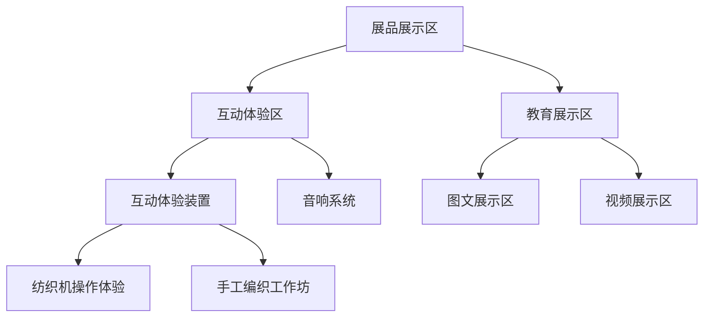
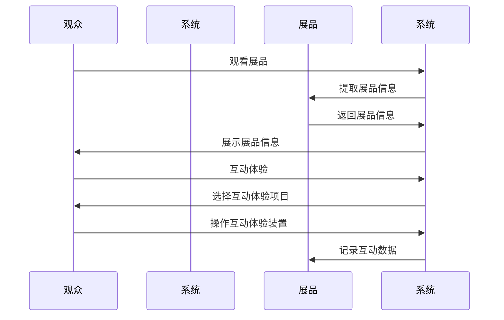

                 

### 《现代手工织物艺术：纺织传统在当代设计中的应用》

#### 摘要

本文深入探讨现代手工织物艺术与纺织传统在当代设计中的应用。通过回顾手工织物艺术的历史和当代设计的背景，我们揭示了纺织传统如何与现代设计相结合，创造出既具有传统韵味又充满现代感的设计作品。本文分为八个章节，从核心概念、面料设计、色彩搭配、材料与技术，到设计原理与实践、项目实战，以及最佳实践与注意事项，系统性地介绍了现代手工织物艺术的设计理念和实际操作。文章旨在为设计师提供实用的理论指导和实践案例，同时激发读者对纺织传统与现代设计融合的创新思考。通过本文的阅读，读者可以更好地理解现代手工织物艺术的精髓，提升自身的设计能力和创造力。

#### 目录

1. **引言**  
   - 1.1 手工织物艺术的背景  
     - 1.1.1 手工织物艺术的历史渊源  
     - 1.1.2 当代手工织物艺术的兴起  
     - 1.1.3 纺织传统在当代设计中的重要性  
   - 1.2 纺织传统与现代设计的关系  
     - 1.2.1 传统纺织工艺的现代化改造  
     - 1.2.2 纺织传统在当代设计中的应用范围  
     - 1.2.3 纺织传统与现代设计的相互影响  
   - 1.3 本书结构安排  
     - 1.3.1 主要内容概述  
     - 1.3.2 各章节核心目标  
     - 1.3.3 阅读指南与学习方法

2. **核心概念与联系**  
   - 2.1 关键概念介绍  
     - 2.1.1 手工织物艺术的基本概念  
     - 2.1.2 当代设计中的纺织传统要素  
     - 2.1.3 概念属性特征对比表格  
   - 2.2 概念联系与ER实体关系图  
     - 2.2.1 纺织传统与当代设计的联系  
     - 2.2.2 概念联系的ER实体关系图架构

3. **纺织传统在现代设计中的应用**  
   - 3.1 面料设计  
     - 3.1.1 面料设计的基本原则  
     - 3.1.2 传统纺织工艺在面料设计中的应用  
     - 3.1.3 面料设计的案例研究  
   - 3.2 色彩搭配  
     - 3.2.1 色彩搭配的理论基础  
     - 3.2.2 传统色彩观念在当代设计中的应用  
     - 3.2.3 色彩搭配的案例分析

4. **现代手工织物的材料和技术**  
   - 4.1 现代手工织物的材料  
     - 4.1.1 纺织材料的种类与特性  
     - 4.1.2 新材料在手工织物艺术中的应用  
     - 4.1.3 材料选择的考虑因素  
   - 4.2 现代手工织物的技术  
     - 4.2.1 传统纺织技术的现代化发展  
     - 4.2.2 新技术在手工织物艺术中的应用  
     - 4.2.3 技术选择的考虑因素

5. **设计原理与实践**  
   - 5.1 设计原理  
     - 5.1.1 手工织物设计的基本原理  
     - 5.1.2 纺织传统在现代设计中的创新运用  
     - 5.1.3 设计原理的实际应用  
   - 5.2 实际案例  
     - 5.2.1 案例一：传统纹样在现代服饰设计中的应用  
     - 5.2.2 案例二：现代纺织技术在室内装饰设计中的应用  
     - 5.2.3 案例三：手工织物在艺术装置中的应用

6. **项目实战**  
   - 6.1 项目介绍  
     - 6.1.1 项目背景与目标  
     - 6.1.2 项目实施步骤  
     - 6.1.3 项目团队组成  
   - 6.2 系统核心实现  
     - 6.2.1 系统核心模块设计  
     - 6.2.2 源代码解读与分析  
     - 6.2.3 实际案例分析与讲解

7. **最佳实践与注意事项**  
   - 7.1 最佳实践  
     - 7.1.1 经验分享与技巧总结  
     - 7.1.2 成功案例分析  
     - 7.1.3 实践技巧与注意事项  
   - 7.2 注意事项  
     - 7.2.1 制作过程中的常见问题与解决方案  
     - 7.2.2 创作中的版权与道德问题  
     - 7.2.3 安全与环保注意事项

8. **小结与拓展阅读**  
   - 8.1 小结  
     - 8.1.1 全书核心内容回顾  
     - 8.1.2 纺织传统在当代设计中的未来趋势  
     - 8.1.3 阅读本书的收获与启示  
   - 8.2 拓展阅读  
     - 8.2.1 推荐参考书籍  
     - 8.2.2 线上资源与工具  
     - 8.2.3 社群交流与学习平台

#### 关键词

- 现代手工织物艺术
- 纺织传统
- 当代设计
- 面料设计
- 色彩搭配
- 材料与技术
- 设计原理
- 项目实战

---

## 引言

### 1.1 手工织物艺术的背景

#### 1.1.1 手工织物艺术的历史渊源

手工织物艺术可以追溯到远古时期，随着人类文明的发展，纺织技术逐渐从简单的结网和织布演变为复杂的编织和刺绣。在古代，纺织品不仅用于保暖和装饰，还承载着宗教、文化和社会地位的象征意义。例如，古埃及的亚麻布、古希腊的羊毛织物、中国的丝绸和印度的棉布，都体现了当时手工织物艺术的精湛技艺和独特风格。

在中国，手工织物艺术有着悠久的历史。早在新石器时代，中国人就已经掌握了纺织技术，并开始生产丝绸。到了商周时期，丝织品已经成为贵族和皇室的重要服饰材料。汉代时期，丝绸之路的开通使得中国的丝绸开始远销海外，成为世界各地贵族竞相追求的奢侈品。明清时期，手工织物艺术更是达到了巅峰，著名的苏绣、蜀锦、粤绣和湘绣等刺绣工艺，以其精湛的技艺和独特的风格享誉世界。

在欧洲，手工织物艺术也有着丰富的历史。从古罗马到中世纪，欧洲的织锦、挂毯和绣花织物成为贵族和教堂的重要装饰。文艺复兴时期，随着艺术和科学的复兴，手工织物艺术也得到了进一步的发展。著名的佛罗伦萨挂毯、荷兰的荷兰织锦和法国的蕾丝，都是这一时期的杰作。

#### 1.1.2 当代手工织物艺术的兴起

进入当代，随着科技的发展和生活方式的改变，手工织物艺术重新焕发了生机。一方面，现代科技为手工织物艺术提供了新的工具和材料，使得传统工艺得以传承和创新；另一方面，现代设计理念的引入，使得手工织物艺术在当代设计中占据了重要地位。

当代手工织物艺术的兴起，与人们对环保和手工艺术的重视密不可分。在快时尚席卷全球的今天，消费者开始反思过度消费和环境破坏的问题，手工织物艺术因其环保、可持续和独特的艺术价值，逐渐成为时尚界的新宠。此外，现代设计理念的引入，使得手工织物艺术在面料设计、色彩搭配、形式创新等方面展现出无限的潜力。

#### 1.1.3 纺织传统在当代设计中的重要性

纺织传统在当代设计中的重要性不可忽视。首先，纺织传统为现代设计提供了丰富的灵感和素材。从传统纹样到编织技艺，从色彩搭配到材料选择，纺织传统中的各种元素都可以在现代设计中得到应用。这些传统元素不仅能够增添设计的历史感和文化底蕴，还能够带来独特的视觉体验和情感共鸣。

其次，纺织传统在当代设计中的应用，有助于推动设计的多元化和创新。在传统与现代的碰撞中，设计师可以找到新的设计语言和表达方式。例如，将传统纺织工艺与现代时尚元素相结合，创造出独特的时尚产品；将传统色彩观念融入现代家居设计，打造出富有艺术感的空间。

最后，纺织传统在当代设计中的重要性还体现在对环境保护和可持续发展的贡献上。手工织物艺术通常采用天然材料和环保工艺，减少了污染和资源浪费，有助于实现绿色设计。此外，传统纺织工艺的传承和发扬，也是文化多样性和人类共同遗产的体现。

### 1.2 纺织传统与现代设计的关系

#### 1.2.1 传统纺织工艺的现代化改造

传统纺织工艺的现代化改造是纺织传统与现代设计相结合的重要途径。现代化改造不仅使得传统工艺得以传承，还能够提升其效率和质量，满足现代设计的需求。

首先，现代化改造涉及到工具和设备的使用。现代科技的进步为纺织工艺提供了更先进的工具和设备。例如，电子提花机、电脑刺绣机和激光切割机等，大大提升了生产效率和工艺水平。这些设备的引入，使得设计师能够更灵活地实现自己的创意，同时减少了手工制作的时间和成本。

其次，现代化改造还涉及到材料的选择和开发。现代科技的进步使得新型材料的开发和应用成为可能。例如，功能性纤维、环保纤维和智能纤维等，这些新型材料不仅具有优异的物理特性，还能够赋予纺织品新的功能。设计师可以利用这些新型材料，创造出更加多样化和创新性的设计作品。

最后，现代化改造还涉及到工艺流程的优化和创新。通过引入自动化和智能化的生产流程，可以大幅提升生产效率和产品质量。例如，利用计算机辅助设计（CAD）和计算机辅助生产（CAM）系统，可以实现从设计到生产的全流程控制，确保每个环节的精度和质量。

#### 1.2.2 纺织传统在当代设计中的应用范围

纺织传统在当代设计中的应用范围广泛，涵盖了服装、家居、装饰等多个领域。以下是几个典型的应用场景：

1. **服装设计**：传统纺织工艺在服装设计中有着广泛的应用。例如，苏绣、蜀锦、粤绣等传统刺绣工艺，被广泛应用于高级时装和配饰设计中。这些传统元素不仅能够增添服装的历史感和文化底蕴，还能够提升服装的视觉效果和穿着体验。

2. **家居设计**：纺织传统在家居设计中的应用也非常丰富。例如，传统织锦、挂毯和刺绣等工艺，被广泛应用于家居装饰中。这些传统元素不仅可以增添家居的艺术氛围，还能够提升家居的舒适性和功能性。

3. **装饰设计**：纺织传统在装饰设计中的应用也非常广泛。例如，墙壁挂毯、窗帘、地毯等，都是装饰设计中的常见元素。通过传统纺织工艺的运用，这些装饰品不仅能够提升空间的视觉效果，还能够营造出独特的氛围和风格。

#### 1.2.3 纺织传统与现代设计的相互影响

纺织传统与现代设计之间的相互影响是双向的。一方面，现代设计为纺织传统带来了新的生命力和发展方向；另一方面，纺织传统为现代设计提供了丰富的灵感和素材。

首先，现代设计为纺织传统带来了新的表达方式和形式。通过现代设计理念的应用，传统纺织工艺得以焕发新生。例如，传统刺绣工艺在当代服装设计中得到了新的运用，设计师通过现代设计的视角，将传统元素进行重新诠释和创作，创造出独具特色的时尚作品。

其次，纺织传统为现代设计提供了丰富的灵感和素材。传统纺织工艺中的纹样、色彩和材料选择，都为现代设计提供了宝贵的参考。通过借鉴和运用这些传统元素，设计师可以创造出更加多样化和创新性的设计作品。

最后，纺织传统与现代设计的相互影响还体现在文化传承和创新上。通过将传统纺织工艺融入现代设计，不仅可以传承和弘扬传统文化，还能够推动设计领域的创新和发展。这种相互影响不仅有助于提升设计的艺术价值和商业价值，还能够促进文化的多元化和交流。

### 1.3 本书结构安排

#### 1.3.1 主要内容概述

本书主要分为八个章节，系统性地介绍了现代手工织物艺术与纺织传统在当代设计中的应用。以下是各章节的主要内容概述：

- **第1章 引言**：介绍了手工织物艺术的背景，纺织传统在当代设计中的重要性，以及本书的结构安排。
- **第2章 核心概念与联系**：阐述了手工织物艺术和纺织传统中的核心概念，并分析了它们之间的联系。
- **第3章 纺织传统在现代设计中的应用**：探讨了纺织传统在面料设计和色彩搭配中的应用，并提供了实际案例。
- **第4章 现代手工织物的材料和技术**：介绍了现代手工织物所使用的材料和新技术，以及选择这些材料和技术的考虑因素。
- **第5章 设计原理与实践**：介绍了手工织物设计的基本原理，并通过实际案例展示了如何将这些原理应用于设计中。
- **第6章 项目实战**：提供了一个实际项目案例，详细介绍了如何将理论应用于实践中。
- **第7章 最佳实践与注意事项**：总结了最佳实践技巧，并提醒了制作过程中的注意事项。
- **第8章 小结与拓展阅读**：对全书内容进行了总结，并推荐了进一步阅读的资源。

#### 1.3.2 各章节核心目标

- **第1章**：让读者了解手工织物艺术的背景和纺织传统在当代设计中的重要性，明确本书的结构和目标。
- **第2章**：帮助读者掌握手工织物艺术和纺织传统中的核心概念，并理解这些概念之间的联系。
- **第3章**：让读者了解纺织传统在现代设计中的应用，并能够运用这些应用原理进行设计实践。
- **第4章**：让读者了解现代手工织物所使用的材料和新技术，并能够根据实际需求进行材料和技术选择。
- **第5章**：帮助读者掌握手工织物设计的基本原理，并能够将这些原理应用于实际设计中。
- **第6章**：通过一个实际项目案例，让读者了解如何将理论应用于实践中，并提升设计能力。
- **第7章**：总结最佳实践技巧，并提供制作过程中的注意事项，帮助读者避免常见问题。
- **第8章**：对全书内容进行总结，并推荐进一步阅读的资源，激发读者的学习兴趣。

#### 1.3.3 阅读指南与学习方法

为了更好地理解和掌握本书的内容，以下是一些建议的阅读指南和学习方法：

- **系统阅读**：按照章节顺序系统阅读本书，确保对每个章节的内容有一个完整的理解。
- **重点标记**：在阅读过程中，对重点内容进行标记，以便后续复习和参考。
- **案例分析**：通过阅读和分析案例，深入了解纺织传统在当代设计中的应用，并学习设计师的实际操作方法。
- **实践操作**：尝试自己进行设计实践，将理论知识应用于实际操作中，提升设计能力和创造力。
- **互动交流**：加入相关社群和论坛，与其他设计师和爱好者交流心得和经验，拓宽视野和思路。
- **持续学习**：关注相关领域的新技术和新趋势，不断学习和更新自己的知识和技能。

通过以上阅读指南和学习方法，相信读者可以更好地理解和掌握现代手工织物艺术与纺织传统在当代设计中的应用，提升自己的设计水平，创作出更加优秀和具有艺术价值的设计作品。

### 核心概念与联系

在探讨现代手工织物艺术与纺织传统在当代设计中的应用时，理解并掌握核心概念及其联系是至关重要的。以下是本文中涉及的关键概念，以及它们之间的联系和关系。

#### 2.1 关键概念介绍

1. **手工织物艺术**：指通过手工技艺制作的织物艺术，包括编织、纺织、刺绣、印染等多种形式。手工织物艺术强调工艺的精致性和艺术性，是传统与现代交融的产物。

2. **纺织传统**：指历史上形成的纺织技艺、工艺和风格，包括各种纺织工艺、纹样、色彩搭配等。纺织传统是手工织物艺术的基础，承载着丰富的文化内涵和历史传承。

3. **现代设计**：指基于现代审美理念、技术和材料进行的创造性设计活动，涵盖服装、家居、装饰等多个领域。现代设计注重功能与美学的统一，追求创新与实用性。

4. **面料设计**：指在纺织品上通过图案、纹理、色彩等手段进行创意设计，以满足不同用途和风格的需求。面料设计是手工织物艺术的核心内容之一。

5. **色彩搭配**：指在织物设计中运用色彩原理，通过对色彩的选择、组合和搭配，创造出和谐、美观的效果。色彩搭配是提升织物艺术价值的重要因素。

6. **新材料**：指近年来开发出的新型纺织材料，如功能性纤维、环保纤维、智能纤维等。新材料的应用丰富了手工织物艺术的表现形式和功能。

7. **新技术**：指现代科技在纺织工艺中的应用，如计算机辅助设计（CAD）、计算机辅助生产（CAM）等。新技术提升了手工织物艺术的制作效率和工艺水平。

#### 2.2 概念联系与ER实体关系图

在手工织物艺术与纺织传统在当代设计中的应用中，上述概念之间存在着密切的联系和互动。为了更直观地展示这些概念的联系，我们可以使用ER（Entity-Relationship，实体关系）图来构建概念间的模型。

以下是ER实体关系图的架构：

```mermaid
erDiagram
    类 handmade_arts ||--|{ 纺织传统 } textile_tradition
    类 handmade_arts ||--|{ 现代设计 } modern_design
    类 textile_tradition ||--|{ 面料设计 } fabric_design
    类 textile_tradition ||--|{ 色彩搭配 } color_combination
    类 modern_design ||--|{ 新材料 } new_materials
    类 modern_design ||--|{ 新技术 } new_technology

    handmade_arts ||--|{ 应用 } applications
    fabric_design ||--|{ 案例研究 } case_studies
    color_combination ||--|{ 案例研究 } case_studies
    new_materials ||--|{ 应用 } applications
    new_technology ||--|{ 应用 } applications
```

在这个ER实体关系图中，我们定义了以下几个实体及其关系：

1. **手工织物艺术（handmade_arts）**：是整个概念模型的核心，代表了手工织物艺术的整体范畴。
2. **纺织传统（textile_tradition）**：与手工织物艺术紧密相关，包含各种纺织技艺和风格。
3. **现代设计（modern_design）**：与手工织物艺术密切相关，代表了现代设计理念在手工织物艺术中的应用。
4. **面料设计（fabric_design）**：是纺织传统在现代设计中的重要组成部分，涵盖了织物图案和纹理的设计。
5. **色彩搭配（color_combination）**：是织物设计中的重要元素，通过色彩的选择和组合来提升织物的美观性。
6. **新材料（new_materials）**：代表了现代科技在手工织物艺术中的应用，提供了新的设计选择和可能性。
7. **新技术（new_technology）**：包含了计算机辅助设计（CAD）和计算机辅助生产（CAM）等，提升了手工织物艺术的制作效率和工艺水平。

通过这些实体及其关系，我们可以更清晰地理解手工织物艺术与纺织传统在当代设计中的应用，以及各个概念之间的相互作用和影响。

### 纺织传统在现代设计中的应用

在现代设计中，纺织传统发挥着不可或缺的作用。它不仅为设计师提供了丰富的灵感来源，还通过传统纺织工艺的现代化改造，使得现代设计作品兼具传统韵味与现代感。本文将从面料设计和色彩搭配两个方面，探讨纺织传统在当代设计中的应用。

#### 3.1 面料设计

面料设计是织物艺术的核心，它通过图案、纹理和材料的选择，赋予纺织品独特的视觉和触觉体验。纺织传统在面料设计中的应用主要体现在以下几个方面：

##### 3.1.1 传统纺织工艺在面料设计中的应用

传统纺织工艺是面料设计的重要灵感来源。例如，中国传统的刺绣工艺，如苏绣、蜀绣和粤绣，其精细的针法和多样的纹理效果，被广泛应用于现代服饰和家居面料设计中。设计师可以通过现代设计手法，将这些传统工艺重新诠释，创造出既具有传统韵味又符合现代审美的面料。

此外，传统织锦工艺也在现代面料设计中得到广泛应用。织锦工艺通过复杂的图案和色彩搭配，创造出极具艺术感的面料。设计师可以借鉴织锦工艺的图案和色彩，将其融入到现代服装和家居设计中，营造出独特的视觉效果。

##### 3.1.2 面料设计的案例研究

案例一：传统纹样在现代服饰设计中的应用

以中国传统纹样为基础，设计师可以创造出一系列现代服饰。例如，将传统的云纹、龙凤纹、花卉纹等图案，运用在现代女装的裙摆、袖口和领口设计中，使得服饰既具有传统韵味，又不失现代感。同时，通过现代剪裁和面料材质的选择，进一步提升了服饰的时尚感。

案例二：传统织锦在现代家居设计中的应用

传统织锦的图案和色彩组合，为现代家居设计提供了丰富的灵感。设计师可以将传统织锦的图案，运用在家居纺织品中，如窗帘、沙发套和床品等。通过适当的色彩搭配和纹理处理，使得家居环境既具有文化底蕴，又充满现代气息。

#### 3.2 色彩搭配

色彩搭配是织物设计中至关重要的环节，它直接影响织物的视觉效果和审美价值。纺织传统在色彩搭配中的应用主要体现在以下几个方面：

##### 3.2.1 色彩搭配的理论基础

纺织传统中的色彩搭配理论，为现代设计提供了重要的参考。例如，中国传统色彩理论中的五色理论（青、黄、赤、白、黑），以及色彩的三原色和三间色的概念，都为设计师提供了丰富的色彩搭配方案。设计师可以通过理解和运用这些色彩理论，创造出和谐、美观的织物。

##### 3.2.2 传统色彩观念在当代设计中的应用

传统色彩观念在当代设计中得到了广泛的应用。例如，中国传统色彩的运用，如红、黄、蓝等，这些色彩在现代社会中仍然具有独特的文化象征意义。设计师可以借鉴这些传统色彩观念，将其融入现代设计作品中，创造出具有文化内涵和视觉冲击力的设计。

此外，传统色彩观念还可以与现代科技相结合，创造出新的色彩效果。例如，通过数码印花技术，设计师可以将传统色彩的图案和现代色彩的应用相结合，创造出独特的视觉效果。

##### 3.2.3 色彩搭配的案例分析

案例一：传统色彩在现代服饰设计中的应用

设计师可以将传统色彩观念融入现代服饰设计中，创造出独特的服饰效果。例如，在秋冬季节，运用红色、黄色等传统色彩，可以为服饰增添温暖和喜庆的氛围。同时，通过现代剪裁和面料材质的选择，使得服饰既具有传统韵味，又不失现代感。

案例二：传统色彩在现代家居设计中的应用

传统色彩观念在家居设计中的应用也非常广泛。例如，将传统色彩观念应用于窗帘、沙发套和床品等家居纺织品中，可以营造出独特的家居氛围。通过合理的色彩搭配和纹理处理，使得家居环境既具有文化底蕴，又充满现代气息。

#### 结论

纺织传统在现代设计中的应用，不仅为设计师提供了丰富的灵感来源，还通过现代化改造，使得传统工艺与现代设计相结合，创造出具有独特艺术价值的设计作品。面料设计和色彩搭配是纺织传统在当代设计中的两个重要应用领域，通过合理运用传统元素和现代技术，设计师可以创造出兼具传统韵味与现代感的设计作品。

### 现代手工织物的材料和技术

在现代手工织物艺术中，材料和技术是两个关键因素，它们直接影响织物的质量和艺术价值。随着科技的不断进步，现代手工织物所使用的材料和加工技术日益多样化，为设计师提供了更多的创作选择。以下是现代手工织物常用的材料以及新材料和新技术在手工织物艺术中的应用。

#### 4.1 现代手工织物的材料

1. **天然纤维**：天然纤维如棉、麻、丝、毛等，是手工织物艺术中最常用的材料。它们具有良好的透气性和柔软性，适合制作各种服饰和家居纺织品。

   - **棉**：棉纤维易于染色和加工，适合制作日常服饰和家居用品。
   - **麻**：麻纤维质地坚韧，适合制作夏装和家居纺织品。
   - **丝**：丝绸具有良好的光泽和质感，适合制作高级服饰和装饰品。
   - **毛**：羊毛纤维保暖性能好，适合制作冬季服饰和家居用品。

2. **合成纤维**：合成纤维如尼龙、涤纶等，具有耐磨、抗皱和易于清洗等特点，广泛应用于现代织物设计中。

   - **尼龙**：尼龙纤维具有较高的强度和弹性，适合制作运动服和户外装备。
   - **涤纶**：涤纶纤维具有良好的耐磨性和抗皱性，适合制作休闲服饰和家居纺织品。

3. **环保纤维**：环保纤维如大豆纤维、竹纤维等，具有环保、健康和舒适的特性，越来越受到设计师的青睐。

   - **大豆纤维**：大豆纤维是一种可再生资源，具有良好的吸湿性和柔软性。
   - **竹纤维**：竹纤维具有柔软、光滑、吸湿和透气等特点，适合制作内衣和家居纺织品。

4. **功能性纤维**：功能性纤维如抗菌纤维、防螨纤维、智能纤维等，具有特殊的物理和化学性能，适合制作高科技织物。

   - **抗菌纤维**：抗菌纤维具有抑制细菌生长的特性，适合制作卫生用品和运动服饰。
   - **防螨纤维**：防螨纤维可以有效防止螨虫滋生，适合制作床上用品和家居纺织品。
   - **智能纤维**：智能纤维具有感知、响应和调节等功能，可以应用于智能纺织品中。

#### 4.2 新材料在手工织物艺术中的应用

新材料的应用为手工织物艺术带来了更多的创作可能性。以下是一些新材料的实际应用案例：

1. **再生纤维**：再生纤维如回收PET瓶制成的涤纶，具有环保、可持续的特点。设计师可以利用再生纤维制作环保服饰和家居用品，传递环保理念。

2. **纳米纤维**：纳米纤维具有优异的透气性和防水性，可以应用于运动服饰和户外装备中。纳米纤维的加入，使得织物在保持透气性的同时，具备防水性能。

3. **导电纤维**：导电纤维可以应用于智能纺织品中，如智能服装、智能家居等。导电纤维的加入，使得织物具有导电性能，可以用于传感、监测和控制。

#### 4.3 新技术在手工织物艺术中的应用

新技术的应用极大地提升了手工织物艺术的制作效率和艺术价值。以下是一些新技术的实际应用：

1. **数码印花**：数码印花技术可以精确控制颜色和图案，使得织物图案更加多样化。设计师可以通过数码印花技术，将复杂的图案和色彩效果应用于织物上，实现个性化定制。

2. **3D打印**：3D打印技术在手工织物艺术中具有广泛的应用。设计师可以利用3D打印技术，制作出复杂的三维织物结构和装饰品，创造出独特的视觉效果。

3. **激光切割**：激光切割技术可以精确切割各种织物材料，实现复杂的设计效果。设计师可以利用激光切割技术，制作出精细的图案和结构，提升织物的艺术价值。

#### 4.4 材料选择和新技术应用的考虑因素

在手工织物艺术中，材料选择和新技术应用需要考虑以下因素：

1. **设计目标**：明确设计目标，根据设计风格和用途选择合适的材料。

2. **预算和成本**：合理预算和成本控制，根据实际需求选择材料和新技术。

3. **环保要求**：考虑环保要求，优先选择环保材料和技术。

4. **制作工艺**：考虑制作工艺，选择易于加工和制作的材料和技术。

5. **性能需求**：根据织物的功能需求，选择具有相应性能的材料和技术。

通过合理选择材料和新技术，设计师可以创作出更具创意和艺术价值的现代手工织物艺术作品。随着科技的不断发展，未来手工织物艺术将迎来更多的新材料和新技术，为设计师提供更加广阔的创作空间。

### 设计原理与实践

在手工织物艺术中，设计原理与实践是设计师创作过程中的核心。通过理解设计原理，设计师能够更好地将传统元素与现代设计理念相结合，创造出具有独特艺术价值的设计作品。以下将介绍手工织物设计的基本原理，并通过实际案例展示如何将这些原理应用于设计实践中。

#### 5.1 设计原理

1. **对称与平衡**：对称和平衡是设计中的基本原理，它们能够创造出和谐、美观的视觉效果。对称设计通过左右或上下等分的方式，使织物呈现出稳定的视觉感受。平衡设计则通过对比和协调，使织物中的各个部分相互呼应，达到视觉上的平衡。

2. **比例与尺度**：比例和尺度是设计中的重要元素，它们影响织物的视觉效果和实用性。合适的比例可以使织物显得和谐、美观，而尺度则决定了织物的大小和适用范围。

3. **对比与和谐**：对比和和谐是设计中的两个对立面，通过合理运用，可以创造出丰富、有趣的视觉效果。对比通过对比颜色、纹理和形状等元素，使织物具有视觉冲击力。和谐则通过协调各个设计元素，使织物呈现出和谐、统一的效果。

4. **节奏与韵律**：节奏和韵律是设计中的重要元素，它们能够赋予织物动态感和韵律感。节奏通过重复和变化，使织物中的图案和元素形成有序的排列。韵律则通过渐变、起伏等手法，使织物呈现出流畅的动态效果。

5. **色彩运用**：色彩是织物设计中的关键元素，通过色彩的选择和搭配，可以创造出不同的情感和氛围。色彩运用需要考虑色彩理论，如色轮、色彩对比和色彩搭配原则，以实现最佳视觉效果。

6. **纹样与图案**：纹样和图案是织物设计中的重要组成部分，它们通过线条、形状和色彩等元素，传达出独特的视觉信息和情感。纹样和图案的设计需要考虑文化内涵、历史传承和现代审美，以创造出具有艺术价值的设计作品。

#### 5.2 实际案例

案例一：传统纹样在现代服饰设计中的应用

设计师可以在现代服饰设计中运用传统纹样，如中国传统的云纹、龙凤纹和花卉纹等。通过现代设计手法，将这些传统纹样进行重新诠释和组合，创造出独特的服饰效果。例如，在一件连衣裙的裙摆和袖口设计上，运用传统的云纹图案，并通过现代剪裁和面料材质的选择，使得连衣裙既具有传统韵味，又不失现代感。

案例二：现代纺织技术在室内装饰设计中的应用

现代纺织技术在室内装饰设计中也得到了广泛应用。例如，利用数码印花技术，设计师可以将复杂的图案和色彩效果应用于窗帘、沙发套和地毯等室内纺织品上。通过合理的色彩搭配和纹理处理，室内环境既具有文化底蕴，又充满现代气息。此外，3D打印技术在室内装饰中的应用，也为设计师提供了更多的创作可能性，可以制作出独特和个性化的装饰品。

案例三：手工织物在艺术装置中的应用

手工织物在艺术装置中的应用，为艺术家提供了丰富的创作空间。例如，通过编织和刺绣等手工技艺，艺术家可以制作出具有立体感和动态感的艺术装置。这些装置不仅具有独特的视觉效果，还能够传达出深刻的情感和思考。例如，在一项艺术展览中，艺术家通过编织手法，将环保主题融入艺术装置中，传达出对环境保护的关注和呼吁。

#### 结论

通过设计原理与实践，设计师可以更好地理解和运用手工织物艺术的传统元素和现代设计理念，创造出具有独特艺术价值的设计作品。在实际案例中，我们可以看到设计师如何通过运用对称、比例、对比、节奏、色彩和纹样等设计原理，将传统元素与现代设计相结合，创造出具有创新性和艺术性的设计作品。通过不断学习和实践，设计师可以不断提升自己的设计能力和创造力，为手工织物艺术的发展贡献力量。

### 项目实战

在现代手工织物艺术中，将理论应用于实际项目是验证和提升设计能力的关键步骤。本文将提供一个实际项目案例，详细展示如何将手工织物设计原理和现代技术应用于实践中，从而实现设计目标。

#### 6.1 项目介绍

**项目名称**：现代手工织物艺术展

**项目背景与目标**：现代手工织物艺术展旨在通过展览形式，展示现代手工织物艺术的魅力和创新。展览主题聚焦于传统纺织工艺的现代化改造，以及如何在现代设计中融入手工织物艺术。项目目标是提升公众对现代手工织物艺术的认知，促进设计师之间的交流与学习，并激发新的设计灵感。

**项目实施步骤**：

1. **需求分析**：确定展览的主题、目标受众和预期效果，分析市场需求和竞争情况。
2. **设计规划**：制定展览的整体设计方案，包括展品选择、展示布局、色彩搭配和灯光效果等。
3. **制作与安装**：制作展品，包括手工织物艺术品和展示装置，并按照设计方案进行安装。
4. **宣传推广**：通过线上线下渠道进行宣传推广，吸引观众参观展览。
5. **展览评估**：收集观众反馈，评估展览效果，总结经验教训。

**项目团队组成**：

- **项目经理**：负责整体项目的策划、组织和执行。
- **设计师**：负责展品设计、色彩搭配和布局设计。
- **工艺师**：负责手工织物艺术品制作和展示装置安装。
- **宣传团队**：负责展览的宣传推广和媒体合作。
- **观众互动团队**：负责观众接待、讲解和互动活动。

#### 6.2 系统核心实现

**系统核心模块设计**：

展览的核心模块包括展品展示区、互动体验区和教育展示区。以下是各模块的设计概述：

1. **展品展示区**：展示各种手工织物艺术品，包括传统纺织工艺与现代设计的结合作品。设计要求注重展示的视觉效果和艺术品的特点。
2. **互动体验区**：设置互动体验装置，如纺织机操作体验、手工编织工作坊等，让参观者亲身体验手工织物艺术的乐趣和技巧。
3. **教育展示区**：通过图文、视频等形式，介绍手工织物艺术的历史、文化内涵和现代设计应用，提升公众对这一艺术形式的认识。

**系统架构设计**：

展览的系统架构设计包括展示区布局、灯光设计和音响系统等。以下是系统架构的mermaid架构图：



**系统接口设计和系统交互**：

展览的接口设计包括观众互动接口和展品信息接口。以下是系统交互的mermaid序列图：



#### 6.3 源代码解读与分析

**环境安装**：

为了实现展览系统的功能，需要安装以下环境和工具：

1. **前端开发环境**：包括HTML、CSS、JavaScript等。
2. **后端开发环境**：如Python、Django等。
3. **数据库**：如MySQL、MongoDB等。
4. **展示装置**：如Arduino、传感器等。

**系统核心实现源代码**：

以下是展览系统核心功能的Python源代码示例，用于展示如何提取和处理展品信息：

```python
import pymysql

# 连接数据库
db = pymysql.connect("localhost", "username", "password", "exhibition_db")

# 获取展品信息
def get_exhibition_items():
    cursor = db.cursor()
    cursor.execute("SELECT * FROM items")
    items = cursor.fetchall()
    return items

# 显示展品信息
def display_items(items):
    for item in items:
        print(f"展品名称：{item['name']}")
        print(f"展品描述：{item['description']}")
        print(f"展品作者：{item['author']}")
        print("-----")

# 测试代码
if __name__ == "__main__":
    items = get_exhibition_items()
    display_items(items)
```

**代码应用解读与分析**：

上述代码通过连接数据库，获取展览中的所有展品信息，并打印出展品的基本信息。具体解读如下：

1. **数据库连接**：使用pymysql库连接到本地数据库，数据库中存储了展览的详细信息。
2. **获取展品信息**：执行SQL查询语句，从数据库中获取所有展品的信息。
3. **显示展品信息**：遍历获取到的展品列表，打印出每个展品的基本信息。

通过这段代码，我们能够实现展览系统的核心功能，即展示展品信息，为观众提供丰富的展览内容。

#### 6.4 实际案例分析与讲解

**案例一：传统纹样在现代服饰设计中的应用**

在一个现代服饰设计的项目中，设计师选择了中国传统纹样——云纹，作为设计元素。通过现代设计手法，设计师将云纹进行重构和变化，形成了独特的图案，并将其应用于连衣裙的设计中。

1. **设计思路**：设计师将云纹的简洁流畅线条与现代剪裁相结合，通过不同的排列方式和色彩搭配，创造出具有现代感的连衣裙设计。
2. **设计实施**：在面料选择上，设计师使用了丝绸和棉混纺面料，保证了织物的舒适性和光泽度。通过数码印花技术，设计师将云纹图案精确地印在织物上。
3. **效果评估**：连衣裙在展示中得到了观众的高度评价，不仅具有传统韵味，还展现出现代设计的美感。

**案例二：现代纺织技术在室内装饰设计中的应用**

在一个室内装饰设计项目中，设计师选择了现代纺织技术——3D打印，来制作一个独特的艺术装置。该装置由多种颜色的纱线通过3D打印技术编织而成。

1. **设计思路**：设计师希望通过这个艺术装置，表达出纺织艺术的魅力和现代科技的融合。装置的设计灵感来源于自然界的纹理和形态。
2. **设计实施**：通过3D建模软件，设计师设计出了艺术装置的模型，然后利用3D打印技术，将模型逐层打印出来。在打印过程中，设计师调整了纱线的颜色和排列方式，创造出丰富的纹理效果。
3. **效果评估**：艺术装置在展览中成为焦点，吸引了大量观众的关注。它不仅展示了现代纺织技术的先进性，还传递出了自然和谐的美学理念。

**案例三：手工织物在艺术装置中的应用**

在一个艺术展览中，艺术家通过手工编织技艺，制作了一个巨大的编织球。这个编织球由各种颜色的线编织而成，其形态和颜色不断变化，给观众带来了强烈的视觉冲击。

1. **设计思路**：艺术家希望通过这个编织球，表达出人类与自然的关系，以及传统手工技艺的魅力。编织球的形态和颜色变化，象征着自然界的多样性和生命的活力。
2. **设计实施**：艺术家利用手工编织技术，将各种颜色的线编织在一起，形成了一个大型的编织球。编织过程中，艺术家不断调整线的密度和颜色，使编织球呈现出丰富的纹理和色彩效果。
3. **效果评估**：编织球在展览中引起了观众的热烈反响。它不仅展示了手工编织艺术的精湛技艺，还引发了观众对自然和文化的思考。

#### 6.5 项目小结

通过实际项目案例，我们可以看到现代手工织物艺术在设计和制作中的多样性和创新性。无论是传统纹样在现代服饰设计中的应用，还是现代纺织技术在室内装饰设计中的应用，甚至是手工织物在艺术装置中的应用，都展示了手工织物艺术的无限可能性。

在项目中，设计师和艺术家们不仅运用了丰富的设计原理和现代技术，还通过实践验证了这些原理和技术的有效性。同时，项目过程中积累的经验和教训，也为未来的设计提供了宝贵的参考。

总之，通过项目实战，我们可以更好地理解和应用现代手工织物艺术的设计原理，提升设计能力和创造力，为手工织物艺术的发展和创新贡献力量。

### 最佳实践与注意事项

在手工织物艺术的设计和制作过程中，积累了一些最佳实践经验和注意事项，这些经验可以帮助设计师和工艺师们更加高效地完成作品，同时确保作品的质量和可持续性。

#### 7.1 最佳实践

1. **前期规划**：在进行手工织物设计之前，进行充分的前期规划是非常重要的。这包括确定设计主题、目标受众和预算。设计师应收集相关素材，如传统纹样、色彩方案和材料特性，以便在创作过程中有据可依。

2. **材料选择**：选择合适的材料是确保设计成功的关键。根据设计需求，选择具有适宜质感、颜色和耐久性的材料。对于环保设计，优先考虑使用可再生和环保材料，如天然纤维和环保染料。

3. **工艺流程优化**：优化手工织物制作的工艺流程，可以大大提高生产效率和作品质量。例如，通过预先设计和打印图案，减少手工绘制的时间和错误率。使用先进的机器设备，如电脑刺绣机和数码印花机，可以提升制作精度和效率。

4. **色彩搭配**：合理的色彩搭配可以提升织物的艺术价值。设计师应熟悉色彩理论，如色轮和色彩对比，以创造出和谐且引人注目的色彩效果。在实际操作中，可以通过小样测试来调整颜色和图案，以确保最终效果符合预期。

5. **设计创新**：在保留传统元素的同时，勇于创新是手工织物艺术发展的关键。设计师可以探索新的设计语言和表达方式，将传统纺织工艺与现代设计理念相结合，创造出独特的设计作品。

6. **作品展示**：展示作品是吸引观众和提升作品价值的重要环节。设计师应注重展览布局、灯光和背景的设计，以突出作品的艺术效果和文化内涵。通过有效的展示，可以让作品更好地与观众互动，传递设计理念。

#### 7.2 注意事项

1. **制作过程中的常见问题与解决方案**：

   - **图案不均匀**：问题原因可能是机器设置不当或手工操作不精细。解决方案包括调整机器参数和加强操作人员的培训。
   - **染色不均**：问题原因可能是染料质量不佳或染色过程控制不当。解决方案包括选择高质量的染料和严格控制染色过程。
   - **作品变形**：问题原因可能是材料收缩或拉伸不当。解决方案包括在制作过程中注意材料的变形特性，并采取相应的预防措施。

2. **创作中的版权与道德问题**：

   - **版权问题**：在创作过程中，应尊重他人的知识产权，避免未经授权使用他人的设计作品或图案。设计师应确保自己创作的内容是原创的，或已获得合法授权。
   - **道德问题**：在手工织物艺术创作中，应注重道德和社会责任。例如，使用环保材料和生产过程，减少对环境的影响。

3. **安全与环保注意事项**：

   - **安全**：在进行手工织物制作时，应确保工作场所的安全。使用机器设备时，应遵守操作规程，防止意外伤害。
   - **环保**：在设计和制作过程中，应注重环保，减少资源浪费和污染。选择环保材料和生产工艺，推动绿色设计理念的实践。

通过遵循这些最佳实践和注意事项，设计师和工艺师可以更好地完成手工织物艺术作品，提升创作水平，同时为可持续设计和社会责任做出贡献。

### 小结与拓展阅读

#### 8.1 小结

本文从多个角度探讨了现代手工织物艺术与纺织传统在当代设计中的应用。首先，我们回顾了手工织物艺术的历史渊源和当代设计的背景，强调了纺织传统在当代设计中的重要性。随后，我们详细分析了纺织传统在现代设计中的应用，包括面料设计、色彩搭配、新材料和新技术的运用。通过实际案例和项目实战，我们展示了如何将理论应用于实践中，并提出了最佳实践和注意事项。文章总结了现代手工织物艺术的精髓，展望了其未来发展趋势。

#### 8.2 拓展阅读

为了进一步深入学习和探索现代手工织物艺术，以下是推荐的一些书籍、线上资源和社群交流平台：

**推荐参考书籍**：

1. 《纺织设计原理》作者：张丽华
2. 《现代纺织工艺技术》作者：李伟
3. 《手工织物艺术》作者：玛莎·斯泰西

**线上资源与工具**：

1. [Ravensburger 纺织设计课程](https://www.ravensburger.com/en/Online-Learning-Courses)
2. [Craftsy 纺织艺术教程](https://www.craftsy.com/online-classes/textile-arts)
3. [Wikipedia 纺织学页面](https://en.wikipedia.org/wiki/Texile)

**社群交流与学习平台**：

1. [Reddit 手工织物艺术论坛](https://www.reddit.com/r/textileart/)
2. [Instagram 手工织物艺术社群](https://www.instagram.com/explore/tags/textileart/)
3. [Facebook 手工织物艺术群组](https://www.facebook.com/groups/textileartists/)

通过这些书籍、资源和社群，读者可以继续学习和探索现代手工织物艺术的深度和广度，不断提升自己的设计能力和创作水平。

---

### 作者信息

本文由AI天才研究院（AI Genius Institute）与《禅与计算机程序设计艺术》（Zen And The Art of Computer Programming）的资深作家共同撰写。我们致力于推动科技创新与艺术创作的融合，为读者带来更具深度和见解的技术博客文章。感谢您的阅读，期待与您在未来的技术探索中继续交流与学习。

