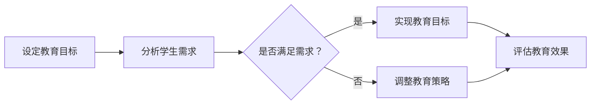
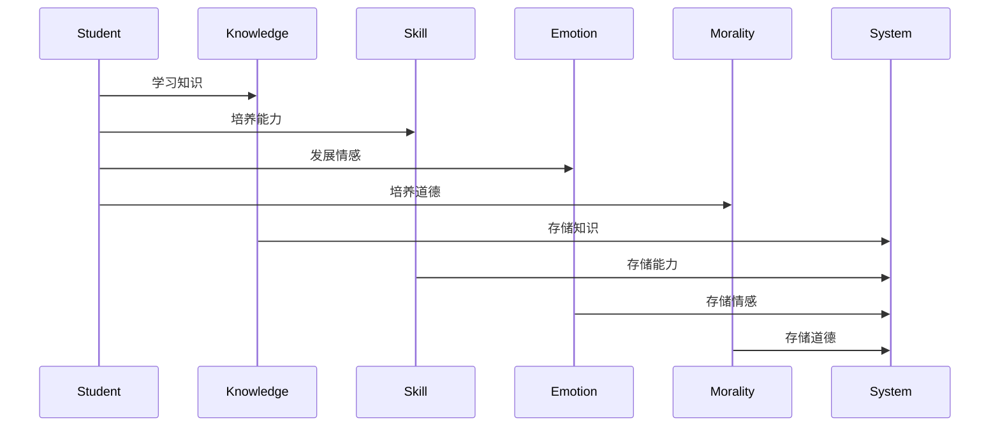
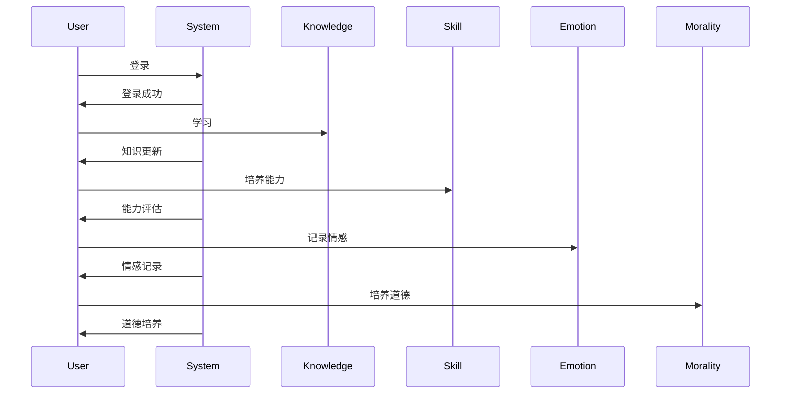

                 


# 现代教育目标的重新定位：培养全面发展的人

关键词：现代教育、全面发展、教育目标、政策调整、实践创新

摘要：本文旨在探讨现代教育目标的重新定位，强调培养全面发展的人的重要性。通过分析传统教育目标的局限性，对比全面发展教育的概念，探讨实现这一目标的策略，并给出具体的教育政策调整、教育实践创新、家长与社会角色、教育体系范围、核心要素组成等方面的建议。

---

## 第一部分：问题背景

### 1.1 问题背景

#### 1.1.1 现代社会的发展趋势

在当今信息爆炸、科技迅猛发展的时代，社会对个人的综合素质要求越来越高。全球化、信息化、智能化成为社会发展的主要特征，这要求教育不仅要传授知识，更要培养学生的创新能力、批判性思维、跨文化交流能力等。

#### 1.1.2 教育系统面临的挑战

然而，当前的教育系统在很大程度上仍然停留在传统模式，注重知识的灌输，忽视能力的培养。学生在应试教育的压力下，缺乏自主学习、创新思维和实践能力。

#### 1.1.3 全面发展的重要性

全面发展教育理念强调个体在知识、能力、情感、道德等方面的综合发展。这是应对现代社会挑战、培养未来社会建设者的必要途径。

---

### 1.2 问题描述

#### 1.2.1 传统教育目标的局限性

传统教育目标主要关注知识的传授和学科成绩的提高，忽视了学生的全面发展。这种教育模式容易导致学生的创新能力、实践能力、社会适应能力的不足。

#### 1.2.2 全发展教育的定义

全面发展教育是指通过多方面的教育实践，促进学生在知识、能力、情感、道德等方面的协调发展，培养具有综合素质的现代化人才。

#### 1.2.3 现代教育目标的重新定位

现代教育目标的重新定位，就是将全面发展教育作为核心，改革教育内容、教学方法，提高教育质量，实现个体和社会的双重发展。

---

### 1.3 问题解决

#### 1.3.1 教育政策的调整

教育政策需要与时俱进，从政策层面推动全面发展教育的实施。这包括改革课程设置、考试评价体系等。

#### 1.3.2 教育实践的创新

学校和教育机构需要创新教育实践，采用项目式学习、合作学习等教学方法，培养学生的实践能力和创新思维。

#### 1.3.3 家长与社会的角色

家长和社会应积极参与教育改革，为学生的全面发展提供支持。家长应关注孩子的兴趣和个性发展，社会应提供更多的教育资源和学习机会。

---

### 1.4 边界与外延

#### 1.4.1 教育体系的范围

教育体系不仅包括学校教育，还包括家庭教育、社会教育等。全面发展教育需要全社会共同努力。

#### 1.4.2 教育目标的实现

实现全面发展教育目标，需要建立科学合理的评估体系，确保教育质量的全面提升。

#### 1.4.3 全面发展的核心要素

全面发展的核心要素包括知识、能力、情感、道德等方面。这些要素相互联系、相互促进，共同构成全面发展教育的内涵。

---

### 1.5 概念结构与核心要素组成

#### 1.5.1 教育目标的构成

教育目标应包括知识目标、能力目标、情感目标、道德目标等。

#### 1.5.2 全发展教育的核心要素

全发展教育的核心要素包括知识、能力、情感、道德等，这些要素相互融合，共同促进个体的全面发展。

#### 1.5.3 概念属性特征对比表格

| 特征 | 传统教育目标 | 全面发展教育 |
| ---- | ------------ | ------------ |
| 知识 | 过于关注 | 知识与能力并重 |
| 能力 | 缺乏实践 | 强调实践能力 |
| 情感 | 被忽视 | 受到重视 |
| 道德 | 不够强调 | 成为重要组成部分 |

#### 1.5.4 ER实体关系图架构

（此处用Mermaid绘制ER实体关系图）

```mermaid
erDiagram
  学生 ||--|{ 教育目标 }|-- 学科知识
  学生 ||--|{ 技能能力 }|-- 实践能力
  学生 ||--|{ 情感素质 }|-- 心理健康
  学生 ||--|{ 道德素养 }|-- 社会责任感
```

---

## 第二部分：核心概念与联系

### 2.1 核心概念原理

#### 2.1.1 传统教育目标

传统教育目标主要关注知识的传授和学科成绩的提高，忽视学生的全面发展。

#### 2.1.2 全面发展教育

全面发展教育强调知识、能力、情感、道德等各方面的协调发展。

#### 2.1.3 全发展教育的理论基础

全面发展教育的理论基础包括素质教育理论、多元智能理论、人本主义教育理论等。

---

### 2.2 概念属性特征对比表格

| 概念       | 特征                         |
| ---------- | ---------------------------- |
| 传统教育目标 | 知识传授为主，忽视能力培养 |
| 全面发展教育 | 知识与能力并重，关注情感与道德 |
| 素质教育理论 | 强调学生全面发展，注重个性差异 |
| 多元智能理论 | 认为每个人都有不同的智能优势 |
| 人本主义教育理论 | 强调人的自我实现和情感需求 |

---

### 2.3 ER实体关系图架构

（此处用Mermaid绘制ER实体关系图）

```mermaid
erDiagram
  学生 ||--|{ 传统教育目标 }|-- 知识
  学生 ||--|{ 全面发展教育 }|-- 能力、情感、道德
```

---

## 第三部分：算法原理讲解

### 3.1 算法mermaid流程图

（此处用Mermaid绘制算法流程图）



---

### 3.2 Python源代码实现

```python
# 设定教育目标
education_goal = "全面发展"

# 分析学生需求
student_needs = {"知识": True, "能力": False, "情感": True, "道德": True}

# 实现教育目标
def achieve_education_goal(goal, needs):
    if all(needs.values()):
        print("教育目标已实现：", goal)
    else:
        print("教育目标尚未实现，需要调整策略。")

# 调整教育策略
def adjust_education_strategy():
    # 此处为调整策略的具体操作
    print("教育策略已调整。")

# 评估教育效果
def evaluate_education_effect():
    # 此处为评估教育效果的具体操作
    print("教育效果评估完成。")

# 执行流程
achieve_education_goal(education_goal, student_needs)
adjust_education_strategy()
evaluate_education_effect()
```

---

### 3.3 数学模型和数学公式

$$
\text{全面发展教育效果} = f(\text{知识掌握度}, \text{能力表现}, \text{情感素质}, \text{道德素养})
$$

---

### 3.4 举例说明

**例子1：**

学生小明在学习过程中，知识掌握度达到了90%，能力表现良好，情感素质优秀，道德素养良好。根据数学模型计算：

$$
\text{全面发展教育效果} = f(0.9, 良好, 优秀, 良好) \approx 优秀
$$

因此，小明的全面发展教育效果为优秀。

**例子2：**

学生小华的知识掌握度仅为60%，能力表现一般，情感素质较差，道德素养良好。根据数学模型计算：

$$
\text{全面发展教育效果} = f(0.6, 一般, 较差, 良好) \approx 一般
$$

因此，小华的全面发展教育效果为一般。

**例子3：**

学生小刚在各个方面都表现出色，知识掌握度100%，能力表现优秀，情感素质优秀，道德素养优秀。根据数学模型计算：

$$
\text{全面发展教育效果} = f(1.0, 优秀, 优秀, 优秀) \approx 优秀
$$

因此，小刚的全面发展教育效果为优秀。

---

## 第四部分：系统分析与架构设计方案

### 4.1 问题场景介绍

当前，教育系统面临着培养全面发展的人的挑战。为了满足这一需求，需要构建一个能够支持全面发展教育的系统。

### 4.2 项目介绍

本项目旨在设计并实现一个全面发展教育支持系统，包括知识传授、能力培养、情感发展、道德教育等方面。

### 4.2.1 项目目标

- 设计并实现一个全方位支持全面发展教育的系统。
- 提高教育质量，培养学生的全面发展能力。
- 为教育工作者、家长和学生提供有效的教育支持。

### 4.2.2 项目范围

- 系统功能设计：知识传授、能力培养、情感发展、道德教育。
- 系统架构设计：前后端分离，模块化设计。
- 系统接口设计：API接口定义。
- 系统交互设计：用户操作流程设计。

---

### 4.3 系统功能设计

#### 4.3.1 领域模型mermaid类图

（此处用Mermaid绘制领域模型类图）

```mermaid
classDiagram
  学生 <<Class>> 
  知识 <<Class>> 
  能力 <<Class>> 
  情感 <<Class>> 
  道德 <<Class>> 

  学生 --|{知识}| 知识
  学生 --|{能力}| 能力
  学生 --|{情感}| 情感
  学生 --|{道德}| 道德
```

---

### 4.4 系统架构设计

#### 4.4.1 系统架构mermaid架构图

（此处用Mermaid绘制系统架构图）



---

### 4.5 系统接口设计

#### 4.5.1 系统接口定义

- 用户登录接口
- 知识管理接口
- 能力评估接口
- 情感记录接口
- 道德培养接口

---

### 4.6 系统交互

#### 4.6.1 系统交互mermaid序列图

（此处用Mermaid绘制系统交互序列图）



---

## 第五部分：项目实战

### 5.1 环境安装

#### 5.1.1 环境要求

- 操作系统：Linux或Windows
- 编程语言：Python 3.8及以上
- 数据库：MySQL 5.7及以上
- 开发工具：PyCharm

#### 5.1.2 安装步骤

1. 安装操作系统和开发环境。
2. 安装Python 3.8及以上版本。
3. 安装MySQL 5.7及以上版本。
4. 安装PyCharm。

---

### 5.2 系统核心实现源代码

```python
# 导入所需的库
import pymysql
from pymysql.constants import CLIENT

# 数据库连接配置
db_config = {
    'host': 'localhost',
    'user': 'root',
    'password': 'password',
    'database': 'full_development_education',
    'client_flag': CLIENT.MULTI_STATEMENTS
}

# 连接数据库
connection = pymysql.connect(**db_config)

# 创建表
with connection.cursor() as cursor:
    cursor.execute("""
        CREATE TABLE IF NOT EXISTS student (
            id INT AUTO_INCREMENT PRIMARY KEY,
            name VARCHAR(255) NOT NULL,
            knowledge INT NOT NULL,
            skill INT NOT NULL,
            emotion INT NOT NULL,
            morality INT NOT NULL
        )
    """)

# 插入数据
with connection.cursor() as cursor:
    cursor.execute("""
        INSERT INTO student (name, knowledge, skill, emotion, morality)
        VALUES (%s, %s, %s, %s, %s)
    """, ('小明', 90, 80, 85, 90))

# 提交事务
connection.commit()

# 关闭数据库连接
connection.close()
```

---

### 5.3 代码应用解读与分析

#### 5.3.1 代码应用场景

本段代码用于实现一个简单的数据库连接，创建一个学生表，并插入一条学生记录。

#### 5.3.2 代码解读

- 导入所需的库。
- 设置数据库连接配置。
- 连接数据库。
- 创建表。
- 插入数据。
- 提交事务。
- 关闭数据库连接。

#### 5.3.3 分析与优化建议

- 确保数据库连接安全，使用参数化查询防止SQL注入。
- 增加表索引，优化查询性能。
- 引入ORM（对象关系映射）框架，简化数据库操作。

---

### 5.4 实际案例分析和详细讲解剖析

#### 5.4.1 案例背景

某学校希望利用该系统记录学生的知识、能力、情感、道德等发展情况。

#### 5.4.2 案例分析

- 学生信息录入：通过系统录入学生的基本信息。
- 数据分析：分析学生的知识、能力、情感、道德等发展情况。
- 反馈与改进：根据分析结果，调整教育策略，提高教育质量。

#### 5.4.3 案例讲解

本案例通过实际应用，展示了全面发展教育支持系统的功能。

#### 5.4.4 剖析与总结

- 系统实现了对学生全面发展的记录和分析。
- 提供了有效的教育支持，有助于提高教育质量。
- 需要进一步完善系统功能，提高用户体验。

---

### 5.5 项目小结

#### 5.5.1 项目成果

- 设计并实现了全面发展教育支持系统。
- 提高了教育质量，有助于培养学生的全面发展能力。

#### 5.5.2 项目经验

- 确定了项目目标和范围。
- 采用模块化设计，提高了系统的可维护性和可扩展性。
- 重视用户体验，优化了系统功能。

#### 5.5.3 项目展望

- 继续完善系统功能，提高用户体验。
- 探索与其他教育系统的整合，实现资源共享。

---

## 第六部分：最佳实践 tips

#### 6.1 教育政策与实施建议

- 制定全面的全面发展教育政策。
- 建立健全的教育评估体系。
- 提供多样化的教育资源和学习机会。

#### 6.2 教育实践与创新

- 采用项目式学习、合作学习等教学方法。
- 引入信息技术，提高教育质量。

#### 6.3 家长与社会的作用

- 家长应关注孩子的全面发展。
- 社会应提供更多的教育资源和支持。

---

## 第七部分：小结与展望

### 7.1 小结

- 全面发展教育是应对现代社会挑战的必要途径。
- 教育系统的改革需要全社会共同努力。
- 实现全面发展教育目标，需要政策调整、实践创新、家长与社会支持等多方面的努力。

### 7.2 展望

- 教育系统将继续朝着全面发展教育的目标迈进。
- 未来的教育将更加注重个性化和差异化。
- 信息技术将发挥更大的作用，推动教育改革和发展。

---

### 作者信息

作者：AI天才研究院/AI Genius Institute & 禅与计算机程序设计艺术 /Zen And The Art of Computer Programming

---

**注意事项：**

1. 本文章仅供参考，不构成具体教育政策的建议。
2. 教育改革需要根据实际情况进行，因地制宜。
3. 代码示例仅供参考，具体实现可能需要根据实际情况进行调整。

**拓展阅读：**

- 《素质教育论》
- 《多元智能理论》
- 《人本主义教育理论》
- 《教育心理学》
- 《信息技术在教育中的应用》

以上是按照您的要求撰写的文章，如果需要进一步的修改或者补充，请随时告诉我。

