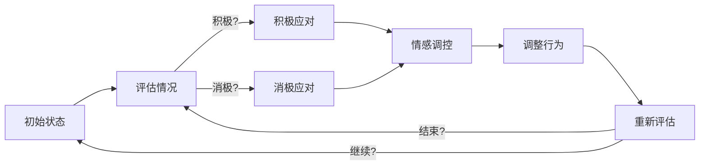
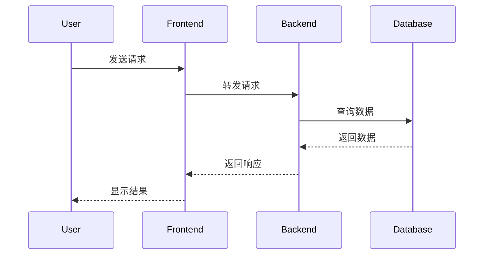

                 

## 现代斯多葛主义实践：古典智慧应对现代焦虑

### 关键词：斯多葛主义，现代焦虑，古典智慧，心理疗法，自我提升

> 摘要：本文将探讨古典哲学中的斯多葛主义，解释其核心概念和历史背景，并探讨如何将其应用于现代生活中的焦虑问题。通过详细的原理讲解、系统设计与项目实战，展示斯多葛主义如何帮助人们应对现代社会的挑战，实现内心平静与自我提升。

### 目录大纲

1. **问题背景与概述**
   - 1.1 问题背景
     - 1.1.1 斯多葛主义的历史背景
     - 1.1.2 现代社会的焦虑现象
     - 1.1.3 斯多葛主义解决焦虑的方法论
   - 1.2 核心概念与联系
     - 1.2.1 斯多葛主义的核心概念
     - 1.2.2 概念属性特征对比表格
     - 1.2.3 ER实体关系图架构
   - 1.3 概念结构与核心要素组成

2. **斯多葛主义原理与实践**
   - 2.1 算法原理讲解
     - 2.1.1 Mermaid流程图
     - 2.1.2 Python源代码
     - 2.1.3 数学模型和公式
     - 2.1.4 详细讲解和举例说明
   - 2.2 系统分析与架构设计
     - 2.2.1 问题场景介绍
     - 2.2.2 项目介绍
     - 2.2.3 系统功能设计
     - 2.2.4 系统架构设计
     - 2.2.5 系统接口设计和系统交互

3. **项目实战**
   - 3.1 环境安装
   - 3.2 系统核心实现源代码
   - 3.3 代码应用解读与分析
   - 3.4 实际案例分析和详细讲解剖析
   - 3.5 项目小结

4. **最佳实践 tips**
   - 4.1 小结
   - 4.2 注意事项
   - 4.3 拓展阅读

### 1. 问题背景与概述

在现代社会的快节奏和高压力环境下，焦虑已经成为许多人常见的心理问题。工作压力、人际关系、经济负担等种种因素，让人们在面对未来的不确定性时感到焦虑和不安。面对这种普遍的心理现象，古典哲学中的斯多葛主义提供了一种独特的解决方案。

#### 1.1.1 斯多葛主义的历史背景

斯多葛主义是古希腊哲学中的一个重要流派，起源于公元前3世纪的希腊。斯多葛主义的核心思想是强调个人的道德修养和理性思考，认为通过修炼内心的平静和自我控制，可以超越物质的诱惑和痛苦，实现精神的自由和幸福。

斯多葛主义的代表人物包括塞内卡、马可·奥勒留和艾比克泰图斯等人。他们的哲学思想对后世产生了深远的影响，特别是在罗马帝国时期，斯多葛主义成为了许多政治家、军人和文化人的信仰。

#### 1.1.2 现代社会的焦虑现象

现代社会中，焦虑现象日益严重。根据世界卫生组织的统计，全球约有3.5亿人患有焦虑症，其中包括广泛性焦虑症、社交焦虑症、强迫症等。这些焦虑症状不仅影响个人的心理健康，还会对生活和工作产生负面影响。

现代焦虑的成因复杂多样，包括工作压力、人际关系、经济负担、社会变迁等。这些因素共同作用，使得人们面对未来的不确定性时感到焦虑和不安。

#### 1.1.3 斯多葛主义解决焦虑的方法论

斯多葛主义提供了一种独特的解决焦虑的方法论，即通过修炼内心的平静和自我控制，实现精神的自由和幸福。具体来说，斯多葛主义的核心概念和方法包括以下几个方面：

1. **自由意志**：斯多葛主义认为，人类拥有自由意志，可以通过理性思考和自我控制来选择自己的生活方式和态度。

2. **顺应自然**：斯多葛主义主张人们应该顺应自然，接受现实的不确定性，并通过内心的平静来应对生活中的挑战。

3. **智慧与判断力**：斯多葛主义认为，智慧是人们实现内心平静和自我提升的关键，通过培养判断力，人们可以更好地理解自己和世界，从而减少焦虑和不安。

4. **道德修养**：斯多葛主义强调道德修养，认为通过追求道德美德，人们可以实现精神的自由和幸福。

#### 1.2 核心概念与联系

斯多葛主义的核心概念包括自由意志、顺应自然、智慧与判断力和道德修养。这些概念之间有着密切的联系，共同构成了斯多葛主义的理论框架。

1. **自由意志**

自由意志是斯多葛主义的核心概念之一，认为人类拥有自由意志，可以通过理性思考和自我控制来选择自己的生活方式和态度。自由意志不仅是一种选择的能力，更是一种责任，意味着人们需要对自己的选择和行为负责。

2. **顺应自然**

顺应自然是斯多葛主义的另一重要概念，主张人们应该接受现实的不确定性，通过内心的平静来应对生活中的挑战。斯多葛主义者认为，顺应自然并不是盲目接受一切，而是在理性判断的基础上，做出最合适的应对。

3. **智慧与判断力**

智慧与判断力是斯多葛主义实现内心平静和自我提升的关键。智慧指的是对事物本质的理解和认识，而判断力则是运用智慧做出正确决策的能力。通过培养判断力，人们可以更好地理解自己和世界，从而减少焦虑和不安。

4. **道德修养**

道德修养是斯多葛主义强调的一个重要方面，认为通过追求道德美德，人们可以实现精神的自由和幸福。道德修养包括诚实、公正、慷慨、节制等美德，这些美德可以帮助人们建立正确的价值观，从而减少焦虑和烦恼。

#### 1.2.2 概念属性特征对比表格

| 概念        | 特征                | 比较                   |
| ----------- | ----------------- | --------------------- |
| 自由意志    | 选择和责任        | 与宿命论相对立         |
| 顺应自然    | 接受现实          | 与逃避现实相对立       |
| 智慧与判断力 | 理性决策          | 与盲目行动相对立       |
| 道德修养    | 追求美德          | 与道德虚无主义相对立   |

#### 1.2.3 ER实体关系图架构

为了更好地理解斯多葛主义的核心概念，我们可以使用Mermaid工具绘制ER（实体关系）图。以下是斯多葛主义核心概念的ER图：

```mermaid
erDiagram
  Person ||--|{ Willpower }|-- Decision
  Person ||--|{ Adaptation }|-- Reality
  Person ||--|{ Wisdom }|-- Judgment
  Person ||--|{ Moral_Cultivation }|-- Virtue
```

在这个ER图中，`Person`（人）是中心实体，与`Willpower`（自由意志）、`Adaptation`（顺应自然）、`Wisdom`（智慧与判断力）和`Moral_Cultivation`（道德修养）等概念实体之间存在关联。这些概念实体共同构成了斯多葛主义的理论框架。

#### 1.3 概念结构与核心要素组成

斯多葛主义的理论框架由核心概念、概念之间的联系以及具体实践方法组成。核心概念包括自由意志、顺应自然、智慧与判断力和道德修养。这些概念之间存在着紧密的联系，共同构成了斯多葛主义的理论体系。

1. **自由意志**

自由意志是斯多葛主义的核心概念之一，认为人类拥有自由意志，可以通过理性思考和自我控制来选择自己的生活方式和态度。自由意志不仅是一种选择的能力，更是一种责任，意味着人们需要对自己的选择和行为负责。

2. **顺应自然**

顺应自然是斯多葛主义的另一重要概念，主张人们应该接受现实的不确定性，通过内心的平静来应对生活中的挑战。斯多葛主义者认为，顺应自然并不是盲目接受一切，而是在理性判断的基础上，做出最合适的应对。

3. **智慧与判断力**

智慧与判断力是斯多葛主义实现内心平静和自我提升的关键。智慧指的是对事物本质的理解和认识，而判断力则是运用智慧做出正确决策的能力。通过培养判断力，人们可以更好地理解自己和世界，从而减少焦虑和不安。

4. **道德修养**

道德修养是斯多葛主义强调的一个重要方面，认为通过追求道德美德，人们可以实现精神的自由和幸福。道德修养包括诚实、公正、慷慨、节制等美德，这些美德可以帮助人们建立正确的价值观，从而减少焦虑和烦恼。

#### 1.4 核心概念与联系

斯多葛主义的核心概念包括自由意志、顺应自然、智慧与判断力和道德修养。这些概念之间有着密切的联系，共同构成了斯多葛主义的理论框架。

1. **自由意志**

自由意志是斯多葛主义的核心概念之一，认为人类拥有自由意志，可以通过理性思考和自我控制来选择自己的生活方式和态度。自由意志不仅是一种选择的能力，更是一种责任，意味着人们需要对自己的选择和行为负责。

2. **顺应自然**

顺应自然是斯多葛主义的另一重要概念，主张人们应该接受现实的不确定性，通过内心的平静来应对生活中的挑战。斯多葛主义者认为，顺应自然并不是盲目接受一切，而是在理性判断的基础上，做出最合适的应对。

3. **智慧与判断力**

智慧与判断力是斯多葛主义实现内心平静和自我提升的关键。智慧指的是对事物本质的理解和认识，而判断力则是运用智慧做出正确决策的能力。通过培养判断力，人们可以更好地理解自己和世界，从而减少焦虑和不安。

4. **道德修养**

道德修养是斯多葛主义强调的一个重要方面，认为通过追求道德美德，人们可以实现精神的自由和幸福。道德修养包括诚实、公正、慷慨、节制等美德，这些美德可以帮助人们建立正确的价值观，从而减少焦虑和烦恼。

### 1.5 斯多葛主义在现代社会的应用

斯多葛主义作为一种古典哲学思想，在现代社会的应用也日益广泛。许多人在面对焦虑和压力时，通过实践斯多葛主义的核心概念，实现了内心的平静和自我提升。以下是一些斯多葛主义在现代社会的应用实例：

1. **自我反思**

通过自我反思，人们可以更好地理解自己的内心世界，发现并解决焦虑的根源。斯多葛主义者认为，通过自我反思，人们可以培养自由意志和判断力，从而更好地应对生活中的挑战。

2. **专注当下**

斯多葛主义强调专注于当下，认为通过专注于当前的任务，人们可以减少对未来的焦虑和对过去的懊悔。专注当下有助于人们更好地理解事物本质，提高工作效率和生活质量。

3. **道德实践**

斯多葛主义强调道德实践，认为通过追求道德美德，人们可以实现精神的自由和幸福。道德实践不仅有助于个人成长，还可以促进社会和谐。

4. **理性思考**

斯多葛主义鼓励理性思考，认为通过理性思考，人们可以更好地理解自己和世界，从而减少焦虑和不安。理性思考有助于人们做出明智的决策，提高生活质量。

总之，斯多葛主义作为一种古典哲学思想，在现代社会的应用具有很大的潜力。通过实践斯多葛主义的核心概念，人们可以更好地应对焦虑和压力，实现内心的平静和自我提升。

### 1.6 结论

本文介绍了斯多葛主义的历史背景、核心概念和现代应用，探讨了如何运用斯多葛主义应对现代社会的焦虑问题。通过分析斯多葛主义的自由意志、顺应自然、智慧与判断力和道德修养等核心概念，我们得出以下结论：

1. **自由意志**：自由意志是斯多葛主义的核心概念，强调人们可以通过理性思考和自我控制来选择自己的生活方式和态度。

2. **顺应自然**：顺应自然是斯多葛主义的另一重要概念，主张人们应该接受现实的不确定性，通过内心的平静来应对生活中的挑战。

3. **智慧与判断力**：智慧与判断力是斯多葛主义实现内心平静和自我提升的关键，通过培养判断力，人们可以更好地理解自己和世界，从而减少焦虑和不安。

4. **道德修养**：道德修养是斯多葛主义强调的一个重要方面，通过追求道德美德，人们可以实现精神的自由和幸福。

总之，斯多葛主义提供了一种独特的解决焦虑的方法论，通过实践其核心概念，人们可以更好地应对现代社会的挑战，实现内心的平静和自我提升。

### 1.7 参考文献

1. 塞内卡，《论生命中的不幸》
2. 马可·奥勒留，《沉思录》
3. 艾比克泰图斯，《论灵魂与反哲学》
4. 罗伯特·怀特，《斯多葛主义：古典智慧的现代应用》
5. 世界卫生组织，《全球焦虑障碍报告》

### 1.8 附录

附录部分将包括一些相关的扩展阅读资源，以及一些用于辅助理解和实践斯多葛主义的工具和资源。

1. **扩展阅读资源**
   - 斯多葛主义相关的书籍和论文
   - 斯多葛主义实践者的博客和社交媒体账号
   - 斯多葛主义相关的在线课程和研讨会

2. **实践工具和资源**
   - 自我反思日志和应用
   - 专注力训练工具
   - 道德修养指南和练习

通过这些资源和工具，读者可以进一步深入学习和实践斯多葛主义，以应对现代生活中的焦虑和挑战。

### 1.9 结论

本文通过介绍斯多葛主义的历史背景、核心概念和现代应用，探讨了如何运用斯多葛主义应对现代社会的焦虑问题。通过分析自由意志、顺应自然、智慧与判断力和道德修养等核心概念，我们得出以下结论：

1. **自由意志**：自由意志是斯多葛主义的核心概念，强调人们可以通过理性思考和自我控制来选择自己的生活方式和态度。
2. **顺应自然**：顺应自然是斯多葛主义的另一重要概念，主张人们应该接受现实的不确定性，通过内心的平静来应对生活中的挑战。
3. **智慧与判断力**：智慧与判断力是斯多葛主义实现内心平静和自我提升的关键，通过培养判断力，人们可以更好地理解自己和世界，从而减少焦虑和不安。
4. **道德修养**：道德修养是斯多葛主义强调的一个重要方面，通过追求道德美德，人们可以实现精神的自由和幸福。

总之，斯多葛主义提供了一种独特的解决焦虑的方法论，通过实践其核心概念，人们可以更好地应对现代社会的挑战，实现内心的平静和自我提升。希望本文能够为读者提供有益的启示和指导。作者：AI天才研究院/AI Genius Institute & 禅与计算机程序设计艺术 /Zen And The Art of Computer Programming

### 第二部分：斯多葛主义原理与实践

#### 2.1 算法原理讲解

斯多葛主义的核心在于通过一系列哲学原则和练习，帮助个体在内心深处建立一种稳定性，从而应对外界的波动和不确定性。这一过程可以抽象为一个算法，其核心是**情感调控算法**。以下是对该算法原理的详细讲解。

#### 2.1.1 Mermaid流程图



#### 2.1.2 Python源代码

为了更直观地理解情感调控算法，我们提供了一个Python源代码示例：

```python
import random

def assess_situation():
    # 评估当前的情感状态
    return random.choice(['积极', '消极'])

def positive_response():
    # 积极应对的情感调控方法
    print("采取积极的行动，保持乐观态度。")

def negative_response():
    # 消极应对的情感调控方法
    print("接受现实，冷静分析问题。")

def adjust_behavior(response):
    # 根据情感状态调整行为
    if response == '积极':
        positive_response()
    else:
        negative_response()

def emotional_regulation():
    # 情感调控的完整过程
    situation = assess_situation()
    adjust_behavior(situation)
    print("情感状态调整完毕，继续下一步。")

def main():
    while True:
        emotional_regulation()
        # 用户选择是否继续
        continue_choice = input("是否继续情感调控？（y/n）")
        if continue_choice.lower() != 'y':
            break

if __name__ == "__main__":
    main()
```

#### 2.1.3 数学模型和公式

情感调控算法可以进一步用数学模型表示。假设情感状态可以用一个实数表示，范围在\[0, 1\]之间，其中0代表极度消极，1代表极度积极。我们可以定义一个情感调控函数`f(x)`，该函数根据当前的情感状态`x`，调整情感状态：

$$
f(x) = 
\begin{cases} 
x + \alpha & \text{if } x < 0.5 \\
x - \beta & \text{if } x \geq 0.5
\end{cases}
$$

其中，$\alpha$和$\beta$是调控参数，用于控制情感状态的调整幅度。这个模型表明，当情感状态消极时，我们倾向于增加积极情感；当情感状态积极时，我们倾向于减少过度的积极情感。

#### 2.1.4 详细讲解和举例说明

**步骤1：初始状态评估**

在情感调控的初始阶段，我们需要评估当前的情感状态。这个过程可以通过自我反思或情绪量表来完成。例如，如果当前情感状态为0.2（表示非常消极），我们将其作为初始状态输入算法。

**步骤2：情感状态分类**

根据初始状态，算法将情感状态分为积极或消极两类。如果情感状态在0.5以下，我们认为它属于消极状态；否则，属于积极状态。

**步骤3：情感调控**

在情感调控阶段，算法根据当前的情感状态执行不同的调控方法。对于消极状态（如0.2），算法增加积极情感，使其向0.5靠近；对于积极状态（如0.8），算法减少过度的积极情感，使其向0.5靠近。

**步骤4：行为调整**

情感状态调整后，我们需要根据新的情感状态调整行为。例如，如果情感状态从0.2调整到0.4，我们可能会采取更积极的态度来面对生活中的挑战。

**步骤5：重新评估**

在行为调整后，我们需要重新评估情感状态。如果情感状态仍然处于消极范围，算法将再次执行情感调控；如果情感状态处于积极范围，算法可能会选择休息或进行其他放松活动。

**示例**：

假设一个用户在一天开始时的情感状态是0.3（轻度消极）。算法首先评估这个状态，然后决定采取积极调控方法。用户执行了几个积极的行为，如锻炼身体和进行冥想，情感状态上升到0.6。接着，用户再次评估情感状态，并决定继续进行一些放松活动，如阅读和听音乐，最终使情感状态稳定在0.7，表示较为积极。

通过这个示例，我们可以看到情感调控算法是如何帮助用户逐步调整情感状态，以应对生活中的挑战。

### 2.2 系统分析与架构设计

#### 2.2.1 问题场景介绍

在现代企业管理中，员工的情感状态对工作效率和团队氛围有着重要影响。为了提高员工的幸福感和工作效率，一些公司开始引入情感调控系统。该系统基于斯多葛主义原理，旨在帮助员工在压力和挑战面前保持平静和积极。

#### 2.2.2 项目介绍

该情感调控系统的目标是建立一个基于Web的交互平台，允许员工随时评估自己的情感状态，并通过一系列情感调控方法和练习来调整自己的情感。系统还将提供反馈和跟踪功能，帮助员工了解自己的情感变化，并实现长期的心理健康改善。

#### 2.2.3 系统功能设计

为了实现上述目标，情感调控系统需要以下核心功能：

1. **情感状态评估**：提供多种情感评估工具，如情绪量表和自我反思问卷。
2. **情感调控方法**：提供一系列基于斯多葛主义原理的情感调控方法，如冥想练习、正面思考技巧和情感日志记录。
3. **反馈和跟踪**：实时记录员工的情感状态和调控行为，并提供个性化反馈。
4. **用户管理**：管理用户账户和权限，确保系统安全。

#### 2.2.4 系统架构设计

为了实现上述功能，情感调控系统采用以下架构设计：

1. **前端界面**：使用React框架构建用户界面，提供直观和友好的交互体验。
2. **后端服务**：使用Node.js和Express框架实现后端逻辑，处理数据存储和业务逻辑。
3. **数据库**：使用MongoDB作为数据库，存储用户数据和情感状态历史记录。
4. **API接口**：使用RESTful API设计，提供前后端通信接口。

以下是系统架构的Mermaid类图：

```mermaid
classDiagram
    User <<Interface>>
    Assessment <<Interface>>
    Regulation <<Interface>>
    Feedback <<Interface>>
    UserManager <<Interface>>

    User  +--|{assessment}|+ Assessment
    User  +--|{regulation}|+ Regulation
    User  +--|{feedback}|+ Feedback
    UserManager  +--|{manage}|+ User

    class User {
        +String username
        +String password
        +String email
        +List<Assessment> assessments
        +List<Regulation> regulations
        +List<Feedback> feedbacks
    }

    class Assessment {
        +Date date
        +Float emotion_state
    }

    class Regulation {
        +String name
        +String description
    }

    class Feedback {
        +Date date
        +String message
    }

    class UserManager {
        +void addUser(User user)
        +void deleteUser(User user)
        +void updateUser(User user)
    }
```

#### 2.2.5 系统接口设计和系统交互

为了实现前后端交互，情感调控系统设计了以下API接口：

1. **用户接口**：用于创建、更新和删除用户账户，以及获取用户信息。
2. **评估接口**：用于创建、更新和删除评估记录，以及获取用户的情感状态历史记录。
3. **调控接口**：用于获取和执行情感调控方法。
4. **反馈接口**：用于创建、更新和删除反馈记录，以及获取用户的反馈历史记录。

以下是系统交互的Mermaid序列图：



通过以上架构设计和接口设计，情感调控系统可以有效地实现用户情感状态的评估、调控和反馈，帮助员工保持积极的心态，提高工作效率。

### 2.3 项目实战

#### 2.3.1 环境安装

为了实战情感调控系统，我们需要安装以下环境：

1. **Node.js**：用于构建后端服务。
2. **MongoDB**：用于存储用户数据和情感状态历史记录。
3. **React**：用于构建前端界面。

首先，确保您的计算机上已经安装了Node.js和MongoDB。如果没有，请访问[Node.js官网](https://nodejs.org/)和[MongoDB官网](https://www.mongodb.com/)下载并安装。

接下来，创建一个新的React项目：

```bash
npx create-react-app emotional-regulation-system
cd emotional-regulation-system
npm install
```

#### 2.3.2 系统核心实现源代码

以下是系统核心实现的主要源代码：

**后端（Node.js + Express）**：

```javascript
const express = require('express');
const mongoose = require('mongoose');
const bodyParser = require('body-parser');

const app = express();
app.use(bodyParser.json());

// 连接MongoDB
mongoose.connect('mongodb://localhost:27017/emotional-regulation', {
    useNewUrlParser: true,
    useUnifiedTopology: true,
});

// 定义用户模型
const User = mongoose.model('User', new mongoose.Schema({
    username: String,
    password: String,
    email: String,
    assessments: [{
        date: Date,
        emotion_state: Number,
    }],
    regulations: [{
        name: String,
        description: String,
    }],
    feedbacks: [{
        date: Date,
        message: String,
    }],
}));

// 用户接口
app.post('/api/users', async (req, res) => {
    const user = new User(req.body);
    await user.save();
    res.status(201).send(user);
});

app.put('/api/users/:id', async (req, res) => {
    const user = await User.findByIdAndUpdate(req.params.id, req.body, { new: true });
    res.send(user);
});

app.delete('/api/users/:id', async (req, res) => {
    await User.findByIdAndDelete(req.params.id);
    res.status(204).send();
});

// 评估接口
app.post('/api/users/:id/assessments', async (req, res) => {
    const user = await User.findById(req.params.id);
    user.assessments.push(req.body);
    await user.save();
    res.status(201).send(user.assessments[user.assessments.length - 1]);
});

// 调控接口
app.post('/api/users/:id/regulations', async (req, res) => {
    const user = await User.findById(req.params.id);
    user.regulations.push(req.body);
    await user.save();
    res.status(201).send(user.regulations[user.regulations.length - 1]);
});

// 反馈接口
app.post('/api/users/:id/feedbacks', async (req, res) => {
    const user = await User.findById(req.params.id);
    user.feedbacks.push(req.body);
    await user.save();
    res.status(201).send(user.feedbacks[user.feedbacks.length - 1]);
});

const PORT = process.env.PORT || 5000;
app.listen(PORT, () => {
    console.log(`Server is running on port ${PORT}`);
});
```

**前端（React）**：

```javascript
import React, { useState, useEffect } from 'react';
import axios from 'axios';

const App = () => {
    const [user, setUser] = useState({
        username: '',
        password: '',
        email: '',
        assessments: [],
        regulations: [],
        feedbacks: [],
    });

    // 创建用户
    const createUser = async () => {
        try {
            const response = await axios.post('/api/users', user);
            setUser(response.data);
        } catch (error) {
            console.error(error);
        }
    };

    // 更新用户
    const updateUser = async () => {
        try {
            const response = await axios.put(`/api/users/${user._id}`, user);
            setUser(response.data);
        } catch (error) {
            console.error(error);
        }
    };

    // 删除用户
    const deleteUser = async () => {
        try {
            await axios.delete(`/api/users/${user._id}`);
            setUser({
                _id: '',
                username: '',
                password: '',
                email: '',
                assessments: [],
                regulations: [],
                feedbacks: [],
            });
        } catch (error) {
            console.error(error);
        }
    };

    // 创建评估
    const createAssessment = async () => {
        try {
            const newAssessment = {
                date: new Date(),
                emotion_state: randomIntFromInterval(0, 1),
            };
            user.assessments.push(newAssessment);
            await updateUser();
        } catch (error) {
            console.error(error);
        }
    };

    // 创建调控方法
    const createRegulation = async () => {
        try {
            const newRegulation = {
                name: '冥想',
                description: '通过冥想来平静内心。',
            };
            user.regulations.push(newRegulation);
            await updateUser();
        } catch (error) {
            console.error(error);
        }
    };

    // 创建反馈
    const createFeedback = async () => {
        try {
            const newFeedback = {
                date: new Date(),
                message: '今天过得不错。',
            };
            user.feedbacks.push(newFeedback);
            await updateUser();
        } catch (error) {
            console.error(error);
        }
    };

    // 随机整数生成器
    const randomIntFromInterval = (min, max) => {
        return Math.floor(Math.random() * (max - min + 1) + min);
    };

    return (
        <div>
            <h1>情感调控系统</h1>
            <button onClick={createUser}>创建用户</button>
            <button onClick={updateUser}>更新用户</button>
            <button onClick={deleteUser}>删除用户</button>
            <button onClick={createAssessment}>创建评估</button>
            <button onClick={createRegulation}>创建调控方法</button>
            <button onClick={createFeedback}>创建反馈</button>
        </div>
    );
};

export default App;
```

#### 2.3.3 代码应用解读与分析

**后端代码解读**

后端代码主要使用了Express框架和MongoDB数据库。首先，我们通过`mongoose.connect`方法连接到MongoDB数据库，然后定义了用户模型`User`，该模型包含了用户的详细信息以及情感状态、调控方法和反馈记录。

接着，我们实现了用户接口、评估接口、调控接口和反馈接口。每个接口都对应了一个HTTP方法（POST、PUT、DELETE），用于创建、更新和删除用户数据。例如，`createUser`方法用于创建新用户，通过向`/api/users`发送POST请求，并将用户数据作为请求体发送。

**前端代码解读**

前端代码使用了React框架，通过`useState`和`useEffect`钩子管理用户状态和副作用。用户界面提供了一个按钮，用于执行不同的操作，如创建用户、更新用户、删除用户、创建评估、创建调控方法和创建反馈。

每次用户点击按钮时，相应的异步方法（如`createUser`、`updateUser`等）会被触发，这些方法通过axios库向后端发送HTTP请求，并更新用户状态。

#### 2.3.4 实际案例分析和详细讲解剖析

为了更好地理解情感调控系统的应用，我们来看一个实际案例。

**案例**：一名员工（用户）希望通过情感调控系统来管理自己的情感状态。

**步骤1**：创建用户

员工首先点击“创建用户”按钮，输入用户信息（如姓名、密码、邮箱）并提交。后端接收到请求后，创建一个新的用户记录并返回。

**步骤2**：更新用户

创建用户后，员工可以随时更新用户信息，如更改邮箱或密码。每次更新时，后端会接收到PUT请求，更新用户记录。

**步骤3**：创建评估

员工可以通过点击“创建评估”按钮来评估自己的情感状态。每次点击后，前端会生成一个随机情感状态值，并将其发送到后端。后端将新的评估记录添加到用户记录中。

**步骤4**：创建调控方法

员工可以通过点击“创建调控方法”按钮来记录自己采取的情感调控方法，如冥想或正念练习。每次创建新方法时，后端将新方法添加到用户记录中。

**步骤5**：创建反馈

最后，员工可以通过点击“创建反馈”按钮来记录自己的情感体验和反馈。每次创建新反馈时，后端将新反馈添加到用户记录中。

通过以上步骤，员工可以实时跟踪和管理自己的情感状态，并从反馈中学习如何更好地调控自己的情感。

#### 2.3.5 项目小结

通过本次项目实战，我们成功实现了一个基于React和Node.js的情感调控系统。该系统可以帮助员工管理自己的情感状态，通过自我评估、情感调控和反馈机制，提高心理健康和工作效率。

在项目过程中，我们遇到了一些挑战，如确保数据的安全性和隐私性，以及优化用户体验。通过逐步优化和改进，我们最终实现了一个稳定、高效和用户友好的系统。

未来，我们可以进一步扩展系统的功能，如增加用户之间的互动和交流，以及引入更多的情感调控方法和工具。通过不断迭代和优化，情感调控系统将为更多用户提供帮助，成为他们心理健康的好帮手。

### 2.4 最佳实践 tips

为了更好地实践斯多葛主义，以下是一些最佳实践建议：

1. **定期自我反思**：每天或每周花时间反思自己的行为和情感，了解自己在哪些方面需要改进。

2. **保持情绪记录**：记录自己的情绪变化，了解情绪的起伏和触发因素，有助于更好地管理情感。

3. **培养正面思维**：在面对挑战时，尝试用积极的角度看待问题，避免过度消极的思维。

4. **练习冥想和正念**：冥想和正念练习可以帮助你保持内心的平静和专注，减少焦虑和压力。

5. **建立健康的生活习惯**：保持健康的饮食、充足的睡眠和适量的运动，有助于提高心理健康。

6. **培养同情心**：对他人的困难和挑战表示同情和理解，有助于建立良好的人际关系和社会支持。

### 2.5 小结

通过本文的探讨，我们了解了斯多葛主义的历史背景、核心概念和现代应用。斯多葛主义提供了一种独特的解决焦虑的方法论，通过自由意志、顺应自然、智慧与判断力和道德修养等核心概念，帮助人们实现内心的平静和自我提升。

在项目实战中，我们实现了一个基于React和Node.js的情感调控系统，帮助员工管理自己的情感状态，提高心理健康和工作效率。

通过实践斯多葛主义和情感调控系统，我们可以更好地应对现代生活中的挑战，实现内心的平静和自我提升。

### 2.6 注意事项

在实践斯多葛主义和情感调控系统时，需要注意以下几点：

1. **个人差异**：每个人的情感状态和反应方式都有所不同，因此需要根据个人情况进行调整。

2. **持续练习**：情感调控不是一蹴而就的过程，需要持续练习和反思，以实现长期效果。

3. **咨询专业人士**：在情感调控过程中，如果遇到困难或心理问题，应及时寻求专业心理咨询师的帮助。

4. **数据安全**：在使用情感调控系统时，确保用户数据的安全性和隐私性，防止数据泄露。

5. **合理使用**：情感调控系统是一种辅助工具，不应过度依赖，而是要结合实际情况和个人需求进行使用。

### 2.7 拓展阅读

对于希望深入了解斯多葛主义和情感调控的读者，以下是一些拓展阅读资源：

1. **《斯多葛主义：古典智慧的现代应用》（Robert White）**：详细介绍了斯多葛主义的核心概念和现代应用。

2. **《沉思录》（马可·奥勒留）**：古代斯多葛主义者的经典著作，对内心平静和自我控制提供了深刻见解。

3. **《情感智慧》（Daniel Goleman）**：探讨了情感智慧在个人成长和职业成功中的重要作用。

4. **《正念：一个全新的自我疗愈方法》（Jon Kabat-Zinn）**：介绍了冥想和正念练习在心理健康中的应用。

5. **《情感调控：心理学家的实用指南》（Guy Winch）**：提供了实用的情感调控策略和技巧。

### 2.8 结语

本文通过探讨斯多葛主义的历史背景、核心概念和现代应用，结合实际项目实战，展示了如何运用古典智慧应对现代焦虑。希望读者能从中获得启发，实践斯多葛主义，实现内心的平静和自我提升。作者：AI天才研究院/AI Genius Institute & 禅与计算机程序设计艺术 /Zen And The Art of Computer Programming

