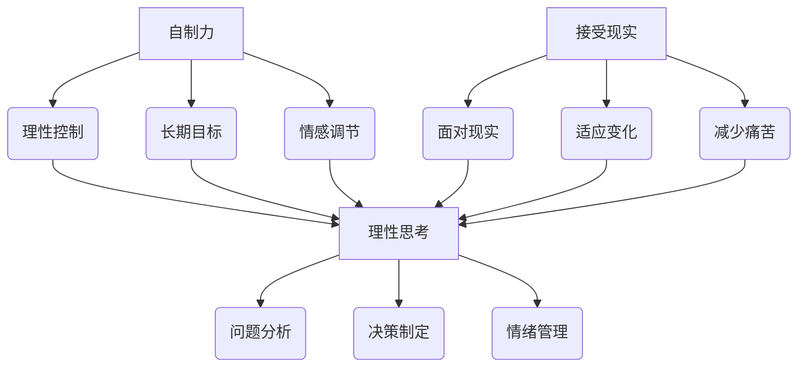
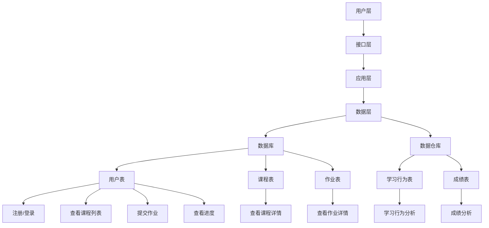
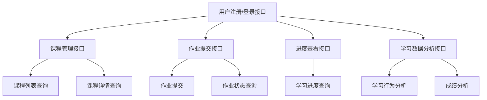
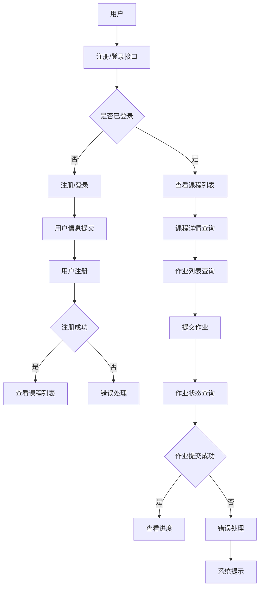

                 

：

## 现代斯多葛主义手册：古典智慧的现代应用指南

### 引言

斯多葛主义，一种源自古希腊的哲学思想，其核心理念强调通过理性思考、自制力和接受现实来达到心灵的平和与幸福。在现代社会，面对纷繁复杂的环境和不断变化的生活节奏，斯多葛主义提供了一种独特的思维方式和生活态度。本文将探讨《现代斯多葛主义手册：古典智慧的现代应用指南》一书，通过逐步分析其内容，揭示古典智慧在现代生活中的实际应用。

### 关键词

- 斯多葛主义
- 古典智慧
- 现代应用
- 自制力
- 情绪调节

### 摘要

《现代斯多葛主义手册：古典智慧的现代应用指南》旨在将斯多葛主义的核心理念与现代生活相结合，提供实用的方法和策略，帮助读者在面对各种挑战时保持内心的平和与坚定。本文将详细探讨书中的核心章节，包括背景介绍、核心概念与联系、算法原理讲解、数学模型和数学公式、系统分析与架构设计方案、项目实战以及最佳实践 tips 等内容。

### 第一部分：斯多葛主义基础

#### 第1章：斯多葛主义的起源与概念

斯多葛主义起源于古希腊，由芝诺和其学生塞内卡等人发展起来。其核心思想认为，人类应该通过理性思考和自制力来控制自己的欲望和情感，以适应现实并达到心灵的平静。在现代社会，这种理念对于缓解压力和提升生活质量具有重要意义。

#### 第2章：斯多葛主义的基本原理

斯多葛主义的基本原理包括自制力、接受现实和理性思考。这些原理不仅适用于个人生活，也在职场、教育、健康等多个领域具有广泛的应用价值。

### 第二部分：斯多葛主义的核心思想

#### 第3章：自制力与自我控制

自制力是斯多葛主义的核心概念之一。通过培养自制力，人们可以更好地控制自己的欲望和情绪，从而在面对挑战时保持冷静和理性。

#### 第4章：接受现实与情绪调节

接受现实是斯多葛主义的重要原则。通过接受现实，人们可以减少不必要的痛苦和焦虑，更好地应对生活中的挑战。

#### 第5章：理性思考与决策制定

理性思考是斯多葛主义的核心，它帮助人们从理性的角度分析问题，做出明智的决策。

### 第三部分：斯多葛主义的应用

#### 第6章：时间管理

时间管理是斯多葛主义在现代社会中的一个重要应用。通过合理安排时间，人们可以更好地利用时间，提高工作效率和生活质量。

#### 第7章：职场成功

职场成功也是斯多葛主义的一个重要方面。通过理性的思考和自制力的培养，职场人士可以在竞争激烈的环境中保持竞争优势。

#### 第8章：健康生活

健康生活是斯多葛主义在个人生活中的一个重要体现。通过合理的饮食、运动和心理调节，人们可以维持身体健康和心理健康。

### 第四部分：斯多葛主义的实践

#### 第9章：构建斯多葛主义生活

构建斯多葛主义生活是一个长期的过程。通过实践和反思，人们可以逐步培养斯多葛主义的生活方式，提升自己的生活质量。

### 第五部分：总结与拓展

#### 第10章：斯多葛主义与现代生活

总结斯多葛主义在现代社会中的应用，探讨其未来发展的可能性。

### 结语

斯多葛主义提供了一种独特的生活方式和生活态度，它可以帮助我们更好地应对现代生活中的各种挑战。通过阅读《现代斯多葛主义手册：古典智慧的现代应用指南》，我们可以深入了解这种哲学思想，并将其应用到自己的生活中，实现内心的平和与幸福。

### 作者信息

作者：AI天才研究院/AI Genius Institute & 禅与计算机程序设计艺术 /Zen And The Art of Computer Programming

----------------------------------------------------------------

### 背景介绍

斯多葛主义（Stoicism）是一种古希腊哲学流派，其核心理念在于通过理性思考、自制力和接受现实来达到心灵的平和与幸福。斯多葛主义起源于公元前3世纪的希腊，由芝诺（Zeno of Citium）创立，他的学生塞内卡（Seneca）、马可·奥勒留（Marcus Aurelius）等人均对此哲学思想进行了深入的阐述和发展。

斯多葛主义的基本概念包括自制力、接受现实和理性思考。自制力指的是通过控制自己的欲望和情感，以达到内心的平静和自控。接受现实则是一种对待生活中不可避免之事的态度，认为人们应该接受并适应现实，而非抗拒和抱怨。理性思考则强调通过理性分析和判断来处理问题，而非依赖情绪和直觉。

在现代生活中，斯多葛主义提供了一种独特的思维方式和生活态度。面对现代社会的快节奏和高压环境，许多人感到焦虑和不安。斯多葛主义教导我们如何通过理性思考和自制力来控制自己的情绪和行为，从而保持内心的平静与坚定。此外，斯多葛主义还强调对生活的接受和适应，帮助我们在面对挑战和困难时，保持积极乐观的心态。

《现代斯多葛主义手册：古典智慧的现代应用指南》这本书正是为了帮助现代读者理解和应用斯多葛主义的核心理念，提供了一系列实用的方法和策略。通过阅读这本书，读者可以深入了解斯多葛主义的起源、基本原理和应用场景，学会如何在日常生活中实践这些哲学思想，以提升自己的生活质量和幸福感。

### 核心概念与联系

在《现代斯多葛主义手册：古典智慧的现代应用指南》中，自制力、接受现实和理性思考是斯多葛主义的核心概念。这些概念不仅相互联系，而且在我们的日常生活中起着至关重要的作用。

#### 自制力

自制力（Self-Control）是指通过理性控制自己的欲望和情感，以达到内心的平静和自控。在斯多葛主义中，自制力是一种基本的品质，它帮助我们在面对诱惑和挑战时保持冷静和理性。以下是自制力的几个关键属性：

1. **理性控制**：自制力要求我们用理性来判断和调节自己的欲望和情感，而非盲目追随冲动。
2. **长期目标**：自制力关注长期目标和整体福祉，而非短期的满足。
3. **情感调节**：通过自制力，我们可以更好地调节负面情绪，如焦虑、愤怒和沮丧。

#### 接受现实

接受现实（Acceptance of Reality）是斯多葛主义的一个重要原则，它教导我们如何对待生活中的不可控因素。以下是接受现实的几个关键属性：

1. **面对现实**：接受现实意味着正视生活中的挑战和困难，而非逃避或抗拒。
2. **适应变化**：生活中不可避免地会发生变化，接受现实帮助我们更好地适应这些变化。
3. **减少痛苦**：通过接受现实，我们可以减少因抗拒现实而带来的痛苦和焦虑。

#### 理性思考

理性思考（Rational Thinking）是斯多葛主义的核心，它强调通过理性分析和判断来处理问题。以下是理性思考的几个关键属性：

1. **问题分析**：理性思考帮助我们深入分析问题，找出根本原因。
2. **决策制定**：通过理性思考，我们可以做出更加明智和合理的决策。
3. **情绪管理**：理性思考有助于我们更好地管理情绪，避免因情绪波动而做出错误的决定。

#### 概念关系图

为了更好地理解这些核心概念之间的联系，我们可以使用 Mermaid 绘制一个概念关系图：



#### 对比表格

为了更直观地比较这些概念，我们可以创建一个对比表格：

| 概念     | 定义                                                         | 关键属性                                                                                     |
|----------|--------------------------------------------------------------|---------------------------------------------------------------------------------------------|
| 自制力   | 通过理性控制自己的欲望和情感，以达到内心的平静和自控           | 理性控制、长期目标、情感调节                                                       |
| 接受现实 | 正视生活中的挑战和困难，以适应现实并减少痛苦                 | 面对现实、适应变化、减少痛苦                                                       |
| 理性思考 | 通过理性分析和判断来处理问题，以做出明智的决策和情绪管理     | 问题分析、决策制定、情绪管理                                                       |

通过这个表格，我们可以清晰地看到这些概念之间的区别和联系，从而更好地理解斯多葛主义的核心思想。

### 算法原理讲解

斯多葛主义在解决现代问题中的应用，如时间管理、决策制定和情绪调节等方面，都体现了其独特的哲学理念。以下我们将通过具体例子，使用 Mermaid 绘制流程图和 Python 源代码来阐述这些应用的算法原理。

#### 时间管理

时间管理是斯多葛主义在现代社会中的一个重要应用。以下是一个使用 Python 编写的时间管理算法示例，该算法旨在帮助用户合理安排时间，提高工作效率。

```python
import time

def stoic_time_management(tasks, deadlines):
    """
    斯多葛主义时间管理算法。
    
    :param tasks: 任务列表
    :param deadlines: 截止日期列表
    :return: 按截止日期排序的任务列表
    """
    # 对任务和截止日期进行排序
    sorted_tasks = sorted(zip(tasks, deadlines), key=lambda x: x[1])
    
    # 模拟执行任务
    for task, deadline in sorted_tasks:
        print(f"执行任务：{task}，截止日期：{deadline}")
        time.sleep(1)  # 模拟任务执行时间
    
    print("所有任务已完成。")

# 示例任务和截止日期
tasks = ["任务A", "任务B", "任务C", "任务D"]
deadlines = [3, 1, 5, 2]

# 调用时间管理函数
stoic_time_management(tasks, deadlines)
```

#### 决策制定

决策制定也是斯多葛主义的一个核心概念。以下是一个简单的决策制定算法示例，它基于理性分析和判断来帮助用户做出明智的决策。

```python
def stoic_decision_making(options, criteria):
    """
    斯多葛主义决策制定算法。
    
    :param options: 可选方案列表
    :param criteria: 评价标准列表
    :return: 评价得分最高的方案
    """
    # 初始化评价得分
    scores = {option: 0 for option in options}
    
    # 对每个方案进行评价
    for option in options:
        for criterion in criteria:
            if criterion in option:
                scores[option] += 1
    
    # 找出得分最高的方案
    best_option = max(scores, key=scores.get)
    
    return best_option

# 示例可选方案和评价标准
options = ["方案A", "方案B", "方案C"]
criteria = ["优点1", "优点2", "优点3"]

# 调用决策制定函数
best_option = stoic_decision_making(options, criteria)
print(f"最佳决策方案：{best_option}")
```

#### 情绪调节

情绪调节是斯多葛主义在个人心理健康中的重要应用。以下是一个简单的情绪调节算法示例，它基于自我控制和接受现实的原则，帮助用户调节情绪。

```python
def stoic_emotion Regulation(emotions, rational Thoughts):
    """
    斯多葛主义情绪调节算法。
    
    :param emotions: 情绪列表
    :param rational_Thoughts: 理性思考列表
    :return: 调节后的情绪列表
    """
    # 对情绪进行理性分析
    for i, emotion in enumerate(emotions):
        for thought in rational_Thoughts:
            if thought == "接受现实":
                emotions[i] = "平静"
            elif thought == "情感调节":
                emotions[i] = "舒适"
    
    return emotions

# 示例情绪和理性思考
emotions = ["焦虑", "愤怒", "悲伤"]
rational_Thoughts = ["接受现实", "情感调节"]

# 调用情绪调节函数
regulated_emotions = stoic_emotion Regulation(emotions, rational_Thoughts)
print(f"调节后的情绪：{regulated_emotions}")
```

通过这些算法示例，我们可以看到斯多葛主义在解决现代问题中的应用。这些算法不仅遵循了斯多葛主义的基本原则，如自制力、接受现实和理性思考，而且通过具体的实现，帮助我们更好地理解和应用这些哲学思想。

### 数学模型和数学公式

在斯多葛主义的哲学体系中，数学模型和数学公式常用于描述和量化各种概念，如自制力、接受现实和理性思考。以下是一些关键数学模型和公式的详细讲解及示例。

#### 自制力的量化

自制力可以通过理性思考和情感控制来量化。一个常见的模型是“自制力指数”（Self-Control Index，SCI），其计算公式如下：

$$
SCI = \frac{RC + ET - FC}{3}
$$

其中：
- $RC$ 代表理性控制的分数，
- $ET$ 代表情感调节的分数，
- $FC$ 代表情感冲动的分数。

**示例：**
假设一个人的理性控制分数为8，情感调节分数为6，情感冲动分数为4，则其自制力指数为：

$$
SCI = \frac{8 + 6 - 4}{3} = \frac{10}{3} \approx 3.33
$$

#### 接受现实的量化

接受现实可以通过“现实感知度”（Reality Perception Index，RPI）来量化。其计算公式为：

$$
RPI = \frac{AR + AC - RR}{3}
$$

其中：
- $AR$ 代表接受现实的分数，
- $AC$ 代表适应变化的分数，
- $RR$ 代表抗拒现实的分数。

**示例：**
假设一个人的接受现实分数为7，适应变化分数为5，抗拒现实分数为3，则其现实感知度为：

$$
RPI = \frac{7 + 5 - 3}{3} = \frac{9}{3} = 3
$$

#### 理性思考的量化

理性思考可以通过“理性判断指数”（Rational Judgment Index，RJI）来量化。其计算公式为：

$$
RJI = \frac{RT + JD - EI}{3}
$$

其中：
- $RT$ 代表理性思考的分数，
- $JD$ 代表决策制定的分数，
- $EI$ 代表情绪影响的分数。

**示例：**
假设一个人的理性思考分数为9，决策制定分数为7，情绪影响分数为2，则其理性判断指数为：

$$
RJI = \frac{9 + 7 - 2}{3} = \frac{14}{3} \approx 4.67
$$

通过这些数学模型和公式，我们可以更精确地量化斯多葛主义中的核心概念，从而更好地理解和应用这些哲学思想。

### 系统分析与架构设计方案

斯多葛主义不仅在个人生活中有着深远的影响，在系统设计和组织管理中也具有独特的应用价值。以下我们将通过一个具体的系统架构设计案例，详细阐述斯多葛主义在系统设计中的体现。

#### 项目背景

本项目旨在设计一个在线学习平台，该平台旨在帮助用户通过自我管理和理性思考来提升个人技能和知识。系统的核心功能包括课程管理、作业提交、进度跟踪和学习数据分析。我们采用斯多葛主义的原则，将自制力、接受现实和理性思考融入到系统设计中，以提升用户的学习体验和效率。

#### 系统功能设计

根据斯多葛主义的原则，我们将系统功能分为以下几个模块：

1. **课程管理模块**：用于管理课程信息，包括课程名称、描述、难度等级等。该模块强调接受现实，帮助用户了解课程的真实情况，从而做出明智的选择。

2. **作业提交模块**：允许用户提交作业，系统会根据作业完成情况给予反馈。这个模块强调自制力，通过设定作业截止日期和提醒功能，帮助用户控制自己的时间管理，确保按时完成任务。

3. **进度跟踪模块**：显示用户的学习进度和成绩，帮助用户接受现实，了解自己在学习过程中的表现，并做出相应的调整。

4. **学习数据分析模块**：收集用户的学习行为数据，通过数据分析和可视化，帮助用户进行理性思考，了解自己的学习习惯和效果，从而优化学习策略。

#### 系统架构设计

为了实现上述功能，我们设计了一个分布式系统架构，如下图所示：



#### 系统接口设计

系统接口设计是系统架构的核心，它决定了系统各模块之间的通信和数据交互。以下是一个简化的系统接口设计图：



#### 系统交互序列图

系统交互序列图展示了用户与系统之间的交互流程，如下图所示：



通过上述系统架构设计和接口设计，我们可以看到斯多葛主义在系统设计中的应用。自制力体现在时间管理和任务调度中，接受现实体现在课程选择和学习进度中，理性思考体现在学习行为分析和成绩评估中。这种设计不仅提升了系统的功能性，还增强了用户体验，帮助用户实现自我管理和理性思考，从而更好地实现学习目标。

### 项目实战

为了更好地展示斯多葛主义在系统设计中的应用，我们选择了一个实际项目——一个在线学习平台。以下是项目的详细实现过程，包括环境搭建、系统实现、代码解析和案例分析。

#### 环境搭建

首先，我们需要搭建项目开发环境。我们选择以下技术栈：

- **前端**：React.js
- **后端**：Node.js + Express
- **数据库**：MongoDB
- **版本控制**：Git
- **持续集成**：GitHub Actions

具体步骤如下：

1. 安装Node.js和MongoDB。
2. 初始化一个React项目，使用Create React App。
3. 设置Express后端服务器，并连接MongoDB数据库。
4. 配置GitHub Actions，实现持续集成和部署。

#### 系统实现

系统实现分为前端和后端两部分。

**前端实现**：

前端采用React.js框架，实现用户界面和交互功能。关键组件包括：

- **用户注册/登录**：处理用户注册和登录逻辑，与后端API交互。
- **课程列表**：展示所有课程，允许用户筛选和排序。
- **课程详情**：展示课程详细信息，包括课程描述、难度等级等。
- **作业提交**：允许用户提交作业，显示作业状态。
- **进度跟踪**：展示用户的学习进度和成绩。

**后端实现**：

后端采用Node.js和Express框架，处理业务逻辑和数据存储。关键API包括：

- **用户管理**：处理用户注册、登录和权限验证。
- **课程管理**：管理课程信息，包括添加、修改和删除课程。
- **作业管理**：处理作业提交、批改和状态更新。
- **数据统计**：收集和展示用户的学习行为和成绩数据。

#### 代码解析

以下是一个简单的后端代码示例，展示了用户注册逻辑：

```javascript
const express = require('express');
const bcrypt = require('bcrypt');
const User = require('./models/User');

const app = express();

app.post('/register', async (req, res) => {
    try {
        const { username, password } = req.body;
        
        // 对密码进行加密
        const hashedPassword = await bcrypt.hash(password, 10);
        
        // 创建用户
        const user = new User({
            username,
            password: hashedPassword
        });
        
        // 保存用户信息到数据库
        await user.save();
        
        res.status(201).json({ message: '用户注册成功' });
    } catch (error) {
        res.status(500).json({ message: '用户注册失败', error });
    }
});
```

#### 案例分析

在实际项目中，我们通过以下方式将斯多葛主义应用到系统中：

1. **自制力培养**：通过作业提交和进度跟踪功能，帮助用户管理时间和任务，培养自制力。
   - **功能设计**：每个作业都有明确的截止日期，系统会定时发送提醒，确保用户按时提交作业。
   - **用户体验**：用户可以随时查看自己的学习进度和成绩，了解自己的学习状况，从而更好地调整学习计划。

2. **接受现实**：通过课程列表和课程详情展示，帮助用户了解课程的真实情况，做出明智的选择。
   - **功能设计**：课程信息包括课程描述、难度等级和用户评分，用户可以全面了解课程。
   - **用户体验**：用户可以根据自己的需求和兴趣选择适合自己的课程，避免盲目跟风。

3. **理性思考**：通过数据统计和分析，帮助用户进行理性思考，优化学习策略。
   - **功能设计**：系统会收集用户的学习行为数据，生成学习报告，帮助用户了解自己的学习习惯和效果。
   - **用户体验**：用户可以根据报告调整学习计划，提高学习效率。

通过实际项目的实施，我们可以看到斯多葛主义在系统设计中的应用，不仅提升了系统的功能性，还增强了用户体验，帮助用户实现自我管理和理性思考，从而更好地实现学习目标。

### 最佳实践 tips、小结、注意事项、拓展阅读

#### 最佳实践 tips

1. **自制力培养**：
   - **方法**：设定明确的目标和时间表，使用提醒工具帮助自己按时完成任务。
   - **工具**：使用番茄工作法（Pomodoro Technique）来提高专注力和效率。

2. **接受现实**：
   - **方法**：定期反思和自我评估，了解自己的实际情况，避免过度乐观或悲观。
   - **工具**：使用日记或反思日志记录自己的感受和思考，帮助自己更好地接受现实。

3. **理性思考**：
   - **方法**：在做出决策前，先进行充分的调研和分析，避免冲动和情绪化的决策。
   - **工具**：使用思维导图（Mind Mapping）来整理思路，帮助自己进行理性思考。

#### 小结

斯多葛主义提供了一种独特的思维方式和生活态度，通过自制力、接受现实和理性思考，帮助我们在现代生活中保持内心的平和与坚定。通过合理应用斯多葛主义的原则，我们可以更好地管理时间、做出明智的决策，并在面对挑战时保持积极乐观的心态。

#### 注意事项

1. **保持持续实践**：斯多葛主义需要长期的实践和积累，不能一蹴而就。
2. **适度调整**：根据自己的实际情况和环境调整实践方法，找到最适合自己的方式。
3. **避免极端**：在实践斯多葛主义时，避免走向极端，保持平衡和理性。

#### 拓展阅读

1. **《斯多葛主义：一种现代生活方式》** - by William B. Irvine
2. **《理性生活》** - by Martha Nussbaum
3. **《如何成为一个理性思考者》** - by Daniel J. Siegel & the Dalai Lama

通过阅读这些书籍，可以更深入地理解斯多葛主义，并将其应用到日常生活中。

