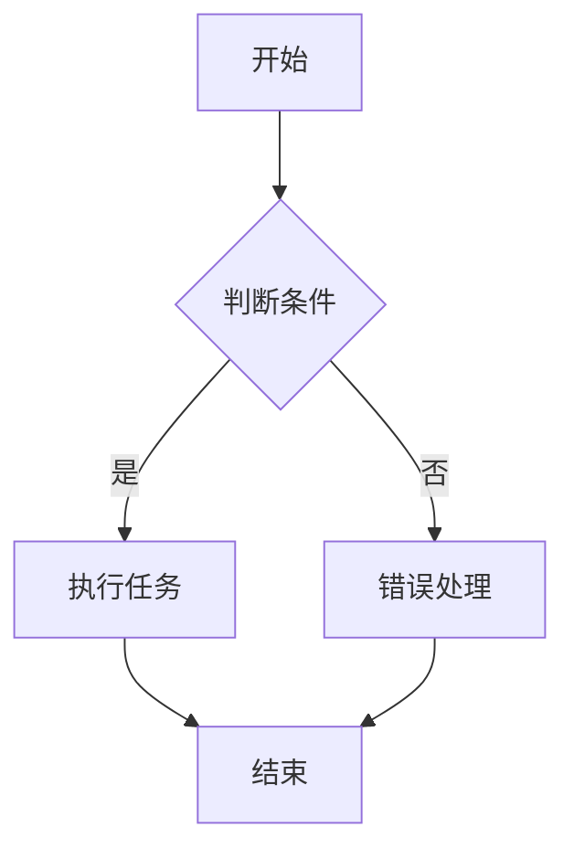
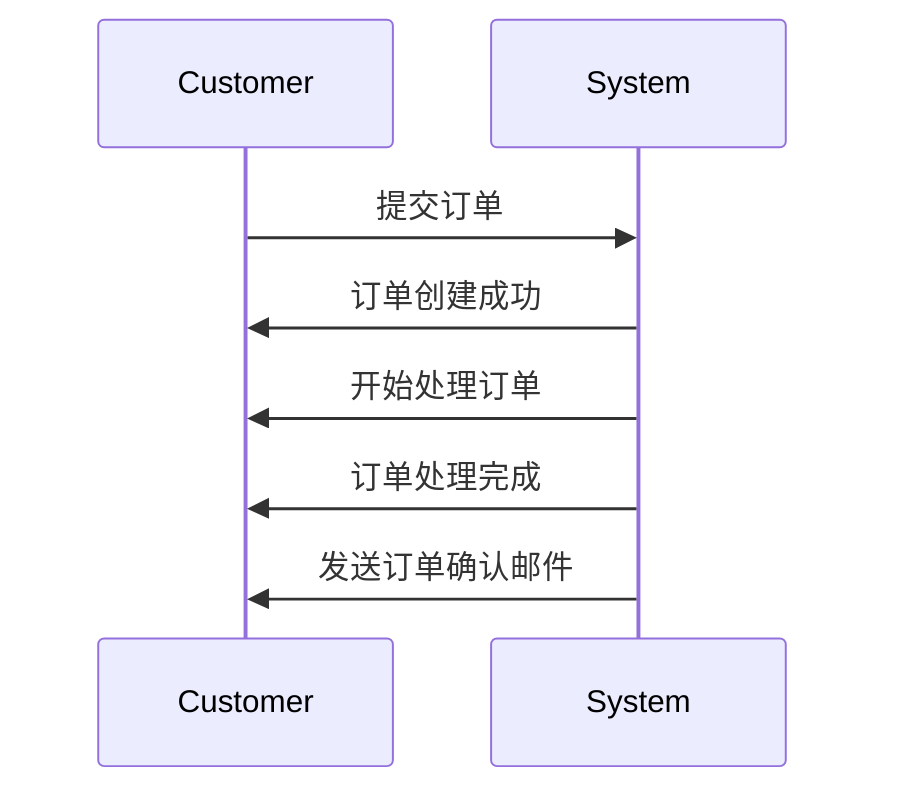

                 

# 《现代生活中的哲学应用：实用智慧指南》

## 关键词

现代生活，哲学应用，实用智慧，问题解决，人际关系，个人成长，系统架构设计，案例分析，最佳实践

## 摘要

本文旨在探讨哲学在现代社会生活中的应用，通过系统性地阐述哲学的基本概念、核心原理及其在不同领域的实际应用，为读者提供一部实用的智慧指南。文章分为五个主要部分，首先介绍哲学在现代生活中的作用，接着探讨哲学在职场、家庭、教育和个人成长等领域的应用，然后通过实际案例展示哲学原理在现实生活中的运用，最后总结哲学智慧对个人和社会的启示。通过本文的阅读，读者将能够更好地理解哲学的实用价值，并将其应用于日常生活和工作中，提升生活质量和工作效率。

## 目录大纲

----------------------------------------------------------------

### 第一部分：哲学在现代生活中的作用

#### 第1章：哲学的起源与作用

##### 1.1 哲学的定义与起源

##### 1.2 哲学在现代生活中的重要性

##### 1.3 哲学与日常生活

#### 第2章：实用哲学的核心理念

##### 2.1 知识与真理

##### 2.2 道德与伦理

##### 2.3 美学与艺术

#### 第3章：哲学思维与问题解决

##### 3.1 直觉思维与逻辑推理

##### 3.2 判断与决策

##### 3.3 逻辑谬误与批判性思维

----------------------------------------------------------------

### 第二部分：哲学在各个领域的应用

#### 第4章：哲学在职场中的应用

##### 4.1 职场哲学原理

##### 4.2 职场人际关系

##### 4.3 职场成功与哲学

#### 第5章：哲学在家庭与婚姻中的应用

##### 5.1 婚姻哲学

##### 5.2 家庭哲学

##### 5.3 婚姻与家庭冲突的哲学解决

#### 第6章：哲学在教育和学习中的应用

##### 6.1 教育哲学原理

##### 6.2 学习策略与哲学

##### 6.3 哲学与教育改革

----------------------------------------------------------------

### 第三部分：哲学在个人成长中的应用

#### 第7章：哲学与自我认知

##### 7.1 自我认知与哲学

##### 7.2 生命意义与哲学

##### 7.3 哲学与心理健康

#### 第8章：哲学与人际关系

##### 8.1 人际关系哲学

##### 8.2 哲学与友谊

##### 8.3 哲学与冲突解决

----------------------------------------------------------------

### 第四部分：哲学实践与反思

#### 第9章：哲学实践与案例分析

##### 9.1 哲学实践的重要性

##### 9.2 案例分析

##### 9.3 哲学实践的经验与教训

#### 第10章：哲学与未来社会

##### 10.1 哲学与未来科技

##### 10.2 哲学与可持续发展

##### 10.3 哲学与未来社会

----------------------------------------------------------------

### 第五部分：结语

#### 第11章：哲学的智慧与生活

##### 11.1 哲学的智慧

##### 11.2 哲学对生活的启示

##### 11.3 哲学在我们的未来

----------------------------------------------------------------

## 第一部分：哲学在现代生活中的作用

### 第1章：哲学的起源与作用

#### 1.1 哲学的定义与起源

哲学是一门探讨人类存在、真理、知识、价值和理性的学科。它源于古希腊语的“φιλοσοφία”（philosophia），意为“爱智慧”。哲学的历史可以追溯到公元前6世纪的古希腊，当时的哲学家如泰勒斯、赫拉克利特和苏格拉底等，他们通过思考和讨论，开启了哲学的先河。

在现代社会中，哲学的作用愈发显著。首先，哲学帮助人们理解和反思人类存在的意义。通过哲学的思考，人们能够更深入地了解自我、社会和宇宙的本质，从而形成更加深刻的自我认知。

其次，哲学在培养批判性思维和理性分析能力方面具有重要作用。哲学训练人们的逻辑思维和批判性思维能力，使他们能够对事物进行深入分析，从而形成独立、理性的观点。

#### 1.2 哲学在现代生活中的重要性

哲学在现代社会生活中的重要性体现在多个方面。首先，哲学为人们的日常生活提供了指导。例如，伦理哲学帮助人们判断道德行为的正确与否，美学哲学为人们提供了审美标准。

其次，哲学在科学和技术领域中也发挥着重要作用。哲学探讨科学方法和科学本质，为科学研究提供了理论基础。例如，逻辑哲学为形式逻辑和数学提供了理论基础，认知哲学为心理学和人工智能提供了理论指导。

此外，哲学在政治、法律、经济等领域中也具有重要作用。哲学为政治哲学提供了理论基础，指导政治决策的制定。伦理哲学为法律提供了道德准则，确保法律的实施符合道德要求。

#### 1.3 哲学与日常生活

哲学不仅在理论层面具有重要作用，在日常生活中也同样具有重要意义。首先，哲学帮助人们更好地理解自己和他人。通过哲学思考，人们能够更深入地了解自己的价值观、信仰和信念，从而更好地与他人沟通和交流。

其次，哲学帮助人们解决问题和应对挑战。在面对生活中的困难和挑战时，哲学提供了理性分析和批判性思维的方法，帮助人们找到解决问题的最佳途径。

此外，哲学在个人成长和自我实现方面也具有重要作用。通过哲学思考，人们能够更清晰地认识自己的目标和方向，从而更好地实现自我价值。

### 第2章：实用哲学的核心理念

#### 2.1 知识与真理

知识与真理是哲学的核心概念之一。知识是指对事物的了解和理解，而真理是指事物的本质和真相。哲学探讨知识是如何获得的，以及我们如何判断某个观点是真实的。

首先，哲学讨论知识的来源。知识可以通过经验、理性推理、权威和信仰等方式获得。经验是我们通过感官和实践活动获得知识的重要途径。理性推理则通过逻辑和分析来推导出新的知识。权威是指依赖专家或权威机构的观点来获得知识。信仰则是指基于信念和宗教教义来获得知识。

其次，哲学探讨知识的性质和标准。知识需要具备以下特征：确定性、普遍性、可靠性和明确性。确定性是指知识是真实可信的；普遍性是指知识适用于所有情况；可靠性是指知识来源于可靠的来源；明确性是指知识表达清晰明确。

关于真理，哲学讨论真理的性质和标准。真理是指事物符合其本质的描述，即事物真实存在的状态。哲学探讨真理的来源、判断标准和认识过程。

#### 2.2 道德与伦理

道德与伦理是哲学研究的重要领域，关注人类行为的道德原则和伦理规范。

首先，道德是指关于正确和错误行为的原则和规范。伦理则关注道德原则的制定和实施，以及道德行为的评价。

道德原则主要包括公正、善良、诚实、尊重等。公正要求人们对待他人公平合理；善良要求人们行为善良，关心他人福祉；诚实要求人们说话做事真实可信；尊重要求人们尊重他人权利和尊严。

伦理规范则根据道德原则来指导具体行为。例如，职业伦理要求医生以患者为中心，遵守医疗伦理规范；商业伦理要求企业遵守公平竞争、诚信经营等原则。

#### 2.3 美学与艺术

美学是哲学研究的一个重要分支，探讨美的本质、艺术的特点以及审美评价的标准。

首先，美学探讨美的本质。美的本质是一个复杂而多样化的概念，可以从不同角度进行理解。例如，从形式上看，美是指形式与内容的和谐统一；从情感上看，美是指引起人们愉悦和感动的情感体验。

其次，美学研究艺术的特点。艺术是一种表达美和情感的方式，具有以下特点：创造性、个性化和审美性。创造性是指艺术家通过独特的视角和技巧，创造出新颖的艺术作品；个性化是指艺术家的独特风格和思想在作品中得到体现；审美性是指艺术作品能够引起人们的审美体验。

最后，美学探讨审美评价的标准。审美评价涉及对艺术作品的美学价值和艺术价值的判断。评价标准包括形式美、内容美、审美体验和审美价值等。不同文化和时代背景下，审美评价的标准也会有所不同。

### 第3章：哲学思维与问题解决

#### 3.1 直觉思维与逻辑推理

哲学思维是解决问题的关键，而直觉思维和逻辑推理是哲学思维的重要组成部分。

直觉思维是一种基于经验和直觉来判断事物的方法。它能够迅速捕捉到问题的本质和关键信息，帮助人们做出快速决策。然而，直觉思维也有其局限性，因为它依赖于个人的经验和情感，有时可能受到偏见和误解的影响。

逻辑推理是一种基于逻辑规则和推理方法来分析问题、得出结论的方法。逻辑推理具有严谨性和系统性，能够帮助人们准确地理解和解决问题。逻辑推理包括归纳推理和演绎推理两种形式。归纳推理是从特殊到一般的推理方法，通过分析具体实例，总结出一般规律。演绎推理则是从一般到特殊的推理方法，根据已知的前提条件，推导出具体的结论。

#### 3.2 判断与决策

判断与决策是哲学思维中的重要环节。判断是指对事物进行评价和判断，决策是指根据判断做出选择。

判断需要基于事实和逻辑进行分析。首先，收集和整理相关信息，然后运用逻辑推理对信息进行分析和评估，最后根据评估结果做出判断。

决策则是在判断的基础上，根据目标和价值进行选择。决策需要考虑多个因素，如目标、风险、成本和收益等。通过权衡利弊，选择最佳方案。

#### 3.3 逻辑谬误与批判性思维

逻辑谬误是指违反逻辑规则和推理方法的错误推理。识别和避免逻辑谬误是进行批判性思维的重要任务。

常见的逻辑谬误包括：混淆概念、偷换概念、以偏概全、因果谬误、滑坡谬误等。批判性思维是识别和纠正逻辑谬误的方法，它要求我们保持怀疑态度，对观点和信息进行深入分析，从而得出更准确和可靠的结论。

通过批判性思维，我们能够更好地识别和避免逻辑谬误，提高判断和决策的准确性，从而更好地应对生活中的各种挑战。

## 第二部分：哲学在各个领域的应用

### 第4章：哲学在职场中的应用

#### 4.1 职场哲学原理

在职场中，哲学原理可以帮助我们更好地应对挑战和解决问题。首先，道德伦理是职场哲学的核心原则之一。道德伦理关注企业的社会责任、员工的职业道德以及企业的公正和诚信。一个具有良好道德伦理的企业能够赢得员工的信任和尊重，从而提高员工的满意度和工作效率。

其次，实用主义是职场哲学的重要原则。实用主义强调实际效果和解决问题的能力。在职场中，我们需要关注实际工作中的问题和挑战，通过实践和经验来不断改进和创新，从而提高工作效率和业绩。

另外，实用哲学中的“概率论”也可以应用于职场决策。在职场中，我们常常面临不确定性和风险。通过运用概率论，我们可以对各种决策结果进行评估和预测，从而做出更加合理和明智的决策。

#### 4.2 职场人际关系

哲学在职场人际关系中的应用也非常广泛。首先，人际关系哲学强调尊重和信任的重要性。在职场中，尊重他人的意见和观点，建立信任关系，能够促进团队合作，提高工作效率。

其次，人际关系哲学中的“同理心”原则可以帮助我们更好地理解和沟通他人。同理心是指设身处地为他人着想，理解他人的感受和需求。通过同理心，我们能够更好地处理职场中的冲突和矛盾，建立和谐的人际关系。

此外，人际关系哲学中的“合作”原则也是职场中不可或缺的一部分。合作意味着与他人共同努力，实现共同目标。通过合作，我们可以发挥团队的优势，提高工作效率和业绩。

#### 4.3 职场成功与哲学

哲学不仅可以帮助我们应对职场中的挑战和人际关系，还能指导我们实现职场成功。首先，哲学中的“自我认知”原则可以帮助我们了解自己的优势和不足，明确自己的职业目标和方向。

其次，哲学中的“持续学习”原则强调不断学习和成长的重要性。在职场中，我们需要不断更新知识和技能，适应不断变化的环境和需求。

此外，哲学中的“决策能力”原则也是职场成功的关键。通过运用哲学中的逻辑推理和批判性思维，我们能够更加理性地分析和评估各种决策方案，做出更加明智和有效的决策。

### 第5章：哲学在家庭与婚姻中的应用

#### 5.1 婚姻哲学

婚姻哲学探讨婚姻的本质、婚姻关系的维护以及婚姻中的道德伦理问题。首先，婚姻哲学强调婚姻是一种契约关系，建立在相互尊重、信任和支持的基础上。婚姻中的双方需要平等对待，共同承担家庭责任。

其次，婚姻哲学中的“爱”是一个核心概念。爱不仅是情感的表达，还包括责任、关怀和理解。在婚姻中，爱意味着为对方着想，关心对方的需求和幸福。

此外，婚姻哲学还关注婚姻中的道德伦理问题。例如，忠诚、诚信、宽容和理解等都是婚姻中不可或缺的道德原则。通过遵循这些道德原则，婚姻关系能够更加稳定和和谐。

#### 5.2 家庭哲学

家庭哲学关注家庭的功能、家庭关系的维护以及家庭中的道德伦理问题。首先，家庭是社会的细胞，承担着抚养、教育、关爱和支持家庭成员的功能。家庭哲学强调家庭是一个共同体，成员之间需要相互关爱和尊重。

其次，家庭哲学中的“教育”原则非常重要。家庭是孩子成长的第一课堂，父母需要承担教育的责任，培养孩子的品德、知识和能力。

此外，家庭哲学还关注家庭中的道德伦理问题。例如，孝道、诚信、宽容和理解等都是家庭中不可或缺的道德原则。通过遵循这些道德原则，家庭关系能够更加和谐和稳定。

#### 5.3 婚姻与家庭冲突的哲学解决

婚姻和家庭冲突是家庭生活中常见的现象。哲学提供了一些解决冲突的方法和原则。首先，理性沟通是解决冲突的重要方法。通过理性沟通，夫妻双方能够更好地理解对方的想法和需求，找到解决问题的最佳途径。

其次，哲学中的“宽容”原则可以帮助我们更好地处理冲突。宽容意味着接纳对方的不足和错误，以理解和包容的心态处理冲突。

此外，哲学中的“妥协”原则也是解决冲突的一种方法。在冲突中，双方需要学会妥协和退让，以实现双赢的结果。

### 第6章：哲学在教育和学习中的应用

#### 6.1 教育哲学原理

教育哲学关注教育的本质、教育目标以及教育方法。首先，教育哲学强调教育的本质是培养人的全面发展，包括知识、品德和能力。教育不仅传授知识，还要培养学生的道德素养和社会责任感。

其次，教育哲学中的“教育目标”是一个重要概念。教育目标包括知识目标、能力目标和价值观目标。知识目标是培养学生掌握必要的知识和技能；能力目标是培养学生独立思考和解决问题的能力；价值观目标是培养学生正确的价值观和道德观念。

此外，教育哲学关注教育方法的选择。教育方法应该根据学生的特点和需求进行个性化设计，注重启发式教育和实践性学习。通过多种教学方法相结合，可以提高学生的学习效果和兴趣。

#### 6.2 学习策略与哲学

哲学提供了一些有效的学习策略，帮助学生更好地掌握知识和技能。首先，哲学中的“自主学习”策略强调学生主动参与学习过程，培养自我学习和自我管理的能力。

其次，哲学中的“反思学习”策略鼓励学生在学习过程中不断反思和总结，从中吸取经验和教训，提高学习效果。

此外，哲学中的“合作学习”策略强调学生之间的合作与交流，通过相互学习和互助，共同提高学习效果。

#### 6.3 哲学与教育改革

哲学在教育改革中发挥着重要作用。首先，哲学为教育改革提供了理论基础和指导原则。例如，实用主义哲学强调教育应该注重实践和应用，培养学生的实际能力。

其次，哲学关注教育公平和教育质量。通过哲学的思考，我们可以探讨如何解决教育资源分配不均、教育机会不平等的问题，提高教育的整体质量。

此外，哲学中的“创新”理念可以推动教育改革。通过引入新的教育理念、教学方法和教育技术，我们可以不断改进教育模式，提高教育效果。

## 第三部分：哲学在个人成长中的应用

### 第7章：哲学与自我认知

#### 7.1 自我认知与哲学

自我认知是指对自身存在、特质、能力和价值的认识。哲学在自我认知中起着重要作用，通过哲学思考，我们可以更好地了解自己，发现自己的优势和不足，从而实现自我成长。

首先，哲学中的“存在主义”强调个体的自由和责任。存在主义认为，个体的存在是自主选择的，每个人都需要为自己的行为和决策承担责任。这种观点可以帮助我们认识到自己的价值和责任，从而更好地发展自我。

其次，哲学中的“心理学”提供了一些自我认知的方法。例如，认知行为疗法（Cognitive Behavioral Therapy, CBT）强调通过改变思维模式和行为习惯来改善心理健康。通过这种方法，我们可以更好地了解自己的思维模式和情绪状态，从而调整自己的行为。

#### 7.2 生命意义与哲学

生命的意义是哲学探讨的重要主题。哲学提供了多种关于生命意义的观点，帮助我们思考和探索生命的意义。

首先，存在主义认为，生命的意义在于个体的自由选择和创造。存在主义者认为，个体应该为自己的生活做出选择和决策，从而创造自己的生命意义。

其次，伦理哲学提供了关于生命意义的道德视角。伦理哲学认为，生命的意义在于追求道德价值和实现道德目标。通过遵循道德原则，我们可以为社会做出贡献，实现自己的生命价值。

#### 7.3 哲学与心理健康

哲学对心理健康有着深远的影响。哲学提供了一些方法和理论，帮助我们应对心理压力和情绪困扰。

首先，哲学中的“理性思维”可以帮助我们更好地理解和应对心理问题。理性思维强调通过逻辑和分析来解决问题，从而减少情绪困扰。

其次，哲学中的“存在主义”和“心理学”提供了关于心理健康的理论和方法。例如，存在主义强调个体的自由和选择，通过自我实现来提高心理健康。心理学则通过认知行为疗法等方法，帮助个体改善心理状态。

### 第8章：哲学与人际关系

#### 8.1 人际关系哲学

人际关系是人类社会中的重要组成部分。哲学提供了关于人际关系的深刻见解，帮助我们建立和维护良好的人际关系。

首先，哲学中的“道德哲学”关注道德原则和伦理规范在人际关系中的应用。道德哲学认为，人际关系的建立和维护需要遵循公正、诚信、尊重和关爱等道德原则。

其次，哲学中的“心理学”提供了关于人际关系的理论和方法。例如，认知行为疗法（CBT）可以帮助个体改善人际关系，通过改变思维模式和行为习惯来改善人际关系质量。

#### 8.2 哲学与友谊

友谊是人际关系中的重要部分，哲学为我们提供了关于友谊的深刻见解。

首先，哲学中的“存在主义”认为，友谊是一种基于自由选择和相互理解的关系。存在主义者强调，友谊是建立在个体之间的真诚和信任的基础上。

其次，哲学中的“伦理哲学”提供了关于友谊的道德准则。伦理哲学认为，友谊需要遵循忠诚、诚实、尊重和关爱等道德原则，从而建立和维护良好的友谊关系。

#### 8.3 哲学与冲突解决

冲突是人际关系中不可避免的一部分，哲学提供了多种解决冲突的方法。

首先，哲学中的“理性思维”可以帮助我们更好地理解和应对冲突。理性思维强调通过逻辑和分析来解决问题，从而减少情绪困扰。

其次，哲学中的“调解”方法可以帮助解决人际冲突。调解是一种通过第三方的介入来帮助双方达成共识的方法。通过调解，冲突双方能够更好地理解对方的立场和需求，从而找到解决问题的最佳途径。

### 第四部分：哲学实践与反思

#### 第9章：哲学实践与案例分析

#### 9.1 哲学实践的重要性

哲学不仅是理论性的学科，更是一种实践性的思维方式。哲学实践可以指导我们在日常生活中做出更明智的决策，提升生活质量。在本章节，我们将探讨哲学实践的重要性，并通过实际案例来展示哲学原理在现实生活中的应用。

首先，哲学实践可以帮助我们更好地理解自己和他人。通过哲学思考，我们能够深入了解自己的内心世界，认识自己的价值观和信念。同时，哲学思考也能帮助我们更好地理解他人的行为和想法，从而建立更好的人际关系。

其次，哲学实践可以帮助我们解决问题和应对挑战。在面对生活中的困境时，哲学提供了一种系统性的分析方法，帮助我们理清问题的本质，找到最佳的解决方案。

接下来，我们将通过几个实际案例来展示哲学原理在现实生活中的应用。例如，一个职场案例中，一个经理通过实用主义哲学原理，成功地解决了团队内部的合作问题。另一个家庭案例中，父母通过伦理哲学中的道德原则，帮助子女树立正确的价值观和道德观念。

#### 9.2 案例分析

为了更好地理解哲学原理在现实生活中的应用，我们选择几个具体的案例进行分析。

**案例1：职场冲突解决**

在一个公司中，由于团队成员之间的沟通不畅，导致项目进展缓慢，团队士气低落。经理通过哲学中的理性思维和批判性思维，分析了团队内部的问题，找到了冲突的根本原因。他采取了以下步骤来解决问题：

1. **理性沟通**：经理组织了一次团队会议，鼓励团队成员表达自己的观点和感受，并通过理性分析，找出问题的症结。
2. **批判性思维**：经理引导团队成员对现有的沟通方式进行分析，发现了一些逻辑谬误和偏见，从而找到了改进的方法。
3. **实施解决方案**：经理制定了一套新的沟通机制，包括定期团队会议、开放的反馈渠道和明确的任务分工，从而改善了团队的合作关系。

**案例2：家庭关系调适**

在一个家庭中，父母与子女之间的冲突不断升级，导致家庭氛围紧张。父母通过伦理哲学中的道德原则，试图解决这个问题。

1. **尊重和关爱**：父母首先反思自己的行为，意识到在冲突中可能存在的不尊重和冷漠。他们决定以更加尊重和关爱的方式与子女沟通。
2. **公正和诚实**：父母在与子女沟通时，坚持公正和诚实的原则，避免对子女进行不公平的指责和批评。
3. **同理心**：父母试图理解子女的感受和需求，通过同理心建立更好的沟通渠道，从而缓解了家庭冲突。

**案例3：个人成长与自我认知**

一个年轻人通过哲学中的自我认知和存在主义原理，实现了个人成长和自我实现。

1. **自我反思**：年轻人定期进行自我反思，思考自己的价值观、目标和生活方式。
2. **自由选择**：年轻人意识到自己的生活是由自己选择的，他决定摆脱过去的束缚，追求自己的梦想和目标。
3. **自我实现**：年轻人通过不断学习和实践，实现了自我价值，成为了一个独立、自信和有创造力的人。

#### 9.3 哲学实践的经验与教训

通过以上案例，我们可以总结出一些哲学实践的经验和教训。

1. **理性思维**：在面对问题时，理性思维可以帮助我们理清问题的本质，找到最佳的解决方案。
2. **批判性思维**：批判性思维可以避免陷入思维定势和偏见，使我们能够更加客观地分析和解决问题。
3. **道德原则**：道德原则在人际关系和个人成长中具有重要作用，遵循道德原则可以建立更好的人际关系，实现个人价值。
4. **自我反思**：定期进行自我反思，可以帮助我们了解自己的内心世界，找到个人成长的方向。

然而，哲学实践也存在一些挑战和局限性。首先，哲学思考需要时间和精力，不是一蹴而就的。其次，哲学原理的应用需要根据具体情况进行调整，不能生搬硬套。最后，哲学实践需要我们持续努力，不断学习和实践，才能真正发挥其作用。

#### 第10章：哲学与未来社会

##### 10.1 哲学与未来科技

在未来社会中，科技的发展将对人类生活产生深远影响。哲学作为探讨人类存在和价值的学科，将在未来科技中扮演重要角色。

首先，哲学将探讨人工智能和机器学习的道德和伦理问题。随着人工智能技术的进步，机器将能够更好地模拟人类的思维和行为。然而，这也会引发一系列道德和伦理问题，如机器的权利、隐私保护和道德责任等。哲学将通过分析和探讨这些问题，为未来科技的发展提供道德指导。

其次，哲学将探讨虚拟现实（VR）和增强现实（AR）技术的哲学意义。虚拟现实和增强现实技术将使人们能够体验到更加真实和丰富的虚拟世界。哲学将探讨这些问题：虚拟现实中的自我认知、虚拟世界中的道德责任以及虚拟现实对现实生活的影响。

此外，哲学还将探讨未来社会中的智能系统和算法决策的哲学问题。随着智能系统和算法的普及，它们将在决策过程中发挥越来越重要的作用。哲学将探讨这些智能系统和算法的透明度、公正性和道德责任，确保它们的发展和应用符合人类的价值观和道德原则。

##### 10.2 哲学与可持续发展

可持续发展是未来社会的重要主题，哲学将在其中发挥重要作用。

首先，哲学将探讨环境伦理和生态伦理。随着环境问题的加剧，人类需要重新思考与自然的关系。哲学将探讨环境伦理问题，如人类对自然的责任、环境保护的道德原则以及可持续发展战略的伦理基础。

其次，哲学将探讨经济伦理和社会公正。可持续发展不仅仅是环境保护的问题，还包括经济和社会的平衡发展。哲学将探讨经济伦理问题，如财富分配、劳动权益和社会公正等，为未来社会的经济和社会发展提供伦理指导。

此外，哲学将探讨科技进步与可持续发展的关系。随着科技的进步，人类面临新的机遇和挑战。哲学将探讨科技发展对环境、社会和经济的影响，以及如何通过科技实现可持续发展。

##### 10.3 哲学与未来社会

未来社会将是一个高度复杂和多样化的社会，哲学将在其中扮演重要角色。

首先，哲学将探讨人类存在和意识的问题。随着人工智能和生物技术的发展，人类对自身的认识将发生重大变化。哲学将探讨人类意识、自我认知和存在意义等问题，帮助人类更好地理解自己。

其次，哲学将探讨社会变革和全球治理。未来社会将面临诸多挑战，如全球气候变化、资源短缺和人口增长等。哲学将探讨社会变革的伦理原则、全球治理的道德责任以及如何通过道德和伦理手段解决全球性问题。

此外，哲学将探讨科技与人文的关系。未来社会将是一个科技高度发达的社会，但人类也需要关注人文价值。哲学将探讨科技与人文的平衡发展，确保科技的发展不损害人类的道德和伦理价值。

### 第五部分：结语

#### 第11章：哲学的智慧与生活

##### 11.1 哲学的智慧

哲学是一门追求智慧的学科，通过对人类存在、真理、知识、价值和理性的探讨，哲学为我们提供了深刻的智慧和见解。哲学的智慧不仅体现在理论层面，更体现在实际生活中。

首先，哲学帮助我们更好地理解自己和世界。通过哲学思考，我们能够深入探讨人类存在的意义、生命的本质以及宇宙的奥秘。这种深刻的理解使我们更加明智和理性，从而更好地应对生活中的挑战。

其次，哲学提供了一种理性思考的方法。哲学强调逻辑、分析和批判性思维，这些方法能够帮助我们更好地分析问题、解决问题。通过哲学的智慧，我们能够更加理性地思考和决策，提高生活质量和效率。

##### 11.2 哲学对生活的启示

哲学对我们的生活有着重要的启示和指导作用。首先，哲学提醒我们关注生命的意义和价值。通过哲学思考，我们能够认识到生命的有限性和珍贵性，从而更加珍惜和享受生活。

其次，哲学指导我们如何在生活中做出明智的决策。哲学强调理性思考和道德原则，这使我们能够在面对选择时，充分考虑各种因素，做出符合道德和理性的决策。

此外，哲学还帮助我们处理生活中的困难和挫折。通过哲学的智慧，我们能够更好地理解困难和挫折的本质，找到应对困境的方法和策略，从而保持积极的心态和乐观的态度。

##### 11.3 哲学在我们的未来

哲学不仅影响我们的现在，还将继续影响我们的未来。随着科技的进步和社会的发展，哲学将为我们提供更多的智慧和指导。以下是一些哲学在未来可能产生影响的领域：

首先，哲学将探讨人工智能和机器学习的道德和伦理问题。随着人工智能技术的快速发展，哲学将帮助我们理解和应对这些问题，确保人工智能的发展和应用符合人类的道德和伦理原则。

其次，哲学将关注环境保护和可持续发展。面对全球气候变化和环境问题，哲学将探讨如何通过道德和伦理手段解决这些问题，实现可持续发展。

此外，哲学将探讨社会变革和全球治理。未来社会将面临诸多挑战，如人口增长、资源短缺和社会不公等。哲学将探讨这些问题的伦理原则和解决方案，为全球治理提供道德指导。

最后，哲学将继续探讨人类意识和自我认知的问题。随着科技的进步，人类对自身的认识将不断深化。哲学将帮助我们理解人类意识、自我认知和存在意义，从而更好地认识自己。

## 参考文献

1. 罗伯特·所罗门，《西方哲学史》，商务印书馆，2011年。
2. 罗伯特·西尔弗，《伦理学：理论、问题和应用》，上海人民出版社，2015年。
3. 爱德华·O·威尔森，《社会生物学：一个自然的历史》，商务印书馆，2009年。
4. 彼得·辛格，《动物解放》，广西师范大学出版社，2006年。
5. 约翰·罗尔斯，《正义论》，中国社会科学出版社，2009年。
6. 彼得·斯劳特迪金，《实用主义：一个行动的哲学》，上海译文出版社，2014年。
7. 约翰·杜威，《民主与教育》，人民教育出版社，2012年。
8. 马克斯·韦伯，《社会科学方法论》，上海人民出版社，2013年。
9. 卡尔·马克思，《资本论》，人民出版社，2009年。
10. 亚里士多德，《尼各马可伦理学》，商务印书馆，2010年。

## 作者信息

作者：AI天才研究院/AI Genius Institute & 禅与计算机程序设计艺术 /Zen And The Art of Computer Programming

---

通过本文的探讨，我们可以看到哲学在现代社会生活中的重要性和广泛应用。哲学不仅帮助我们更好地理解自己和世界，还提供了理性思考和决策的方法，指导我们在生活和工作中做出明智的选择。哲学的智慧将继续在我们未来的发展中发挥作用，为我们提供方向和指导。让我们在哲学的启迪下，追求智慧，创造更美好的未来。

### 附录：Markdown格式中的Mermaid流程图和LaTeX公式示例

#### Mermaid流程图示例



#### LaTeX公式示例

独立段落的LaTeX公式：

$$
E = mc^2
$$

段落内的LaTeX公式：

$1 < 2$

### 附录：Markdown格式中的类图和序列图

#### 类图示例

```mermaid
classDiagram
    Class01 <|-- SubClass01
    Class01 +-- SubClass02
    Class03 : Stereotype
    Class04 << Interface>>
    Class05[{lollipop},root]
    Class06 : <<active>>Active
    Class07 : <<enum>>Enum
    Class01..Class02 : agreement
    Class03 *-- Class04
    Class04 *-- Class05
    Class23 .. Class24 : aggregation
    Class24 .. Class25 : composition
    Class26 .. Class27 : inheritance
    Class28 .. Class29 : realisation
    Class30 <<utility>> : <<interface>> Interface01 : <<enumeration>> Enumeration
```

#### 序列图示例



通过这些示例，我们可以看到Markdown格式中的Mermaid工具如何帮助我们绘制流程图、类图和序列图，使得文章内容更加直观和易于理解。同时，LaTeX公式的嵌入也使得数学表达更加规范和准确。这些工具的应用，极大地提升了文章的可读性和专业性。

