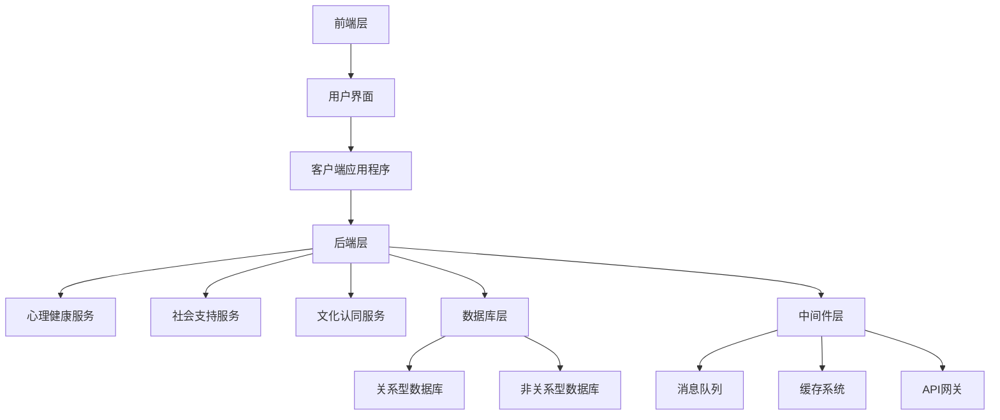
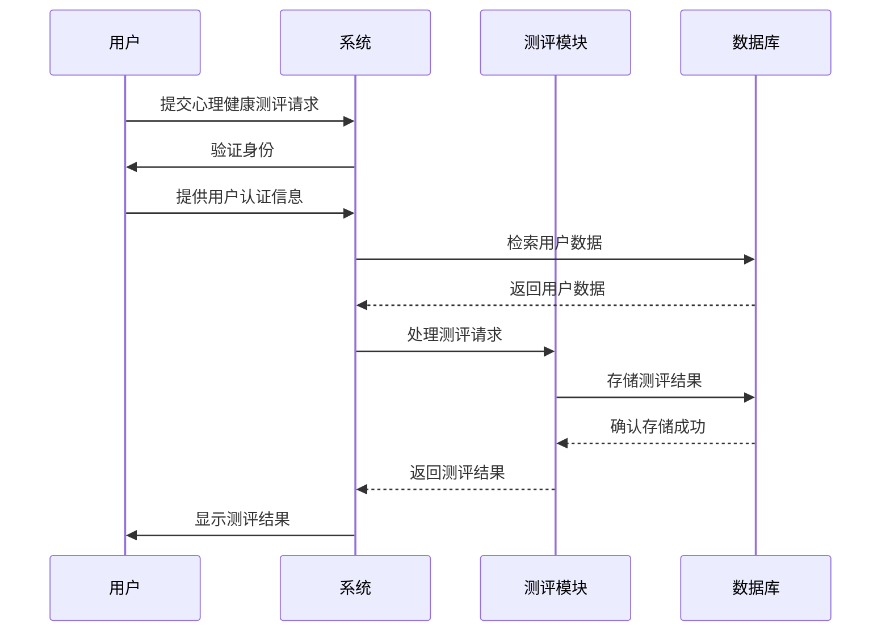

                 

### 1. 现代社会的挑战与精神家园的破坏

现代社会正面临着前所未有的挑战，这些挑战不仅来自于经济、科技、环境等多个方面，还深刻地影响着人们的心理健康和精神家园。首先，快节奏的生活使得人们难以找到平静和安宁。无论是职场竞争、学业压力，还是日常琐事，现代人都生活在忙碌和焦虑之中。这种紧张的生活状态常常导致心理健康问题，如焦虑症、抑郁症等。

其次，社交媒体的普及在带来便利和连接的同时，也加剧了人们的孤独感。在虚拟世界中，人们可能拥有大量的社交联系，但这些联系往往缺乏深度和真实性。社交媒体上的点赞和评论无法替代现实生活中面对面的交流，导致许多人感到内心空虚和孤独。

经济压力也是现代社会的一个显著问题。高房价、高生活成本、工作不稳定等经济问题使得人们时常处于焦虑和不安之中。这些问题不仅影响了人们的日常生活质量，还严重损害了他们的心理健康。

环境问题同样不可忽视。随着全球气候变化和环境污染的加剧，人们不仅面临着身体健康的问题，还感受到了精神上的压力。环境的不确定性使得人们对未来充满了担忧，这种担忧进一步破坏了他们的精神家园。

在这些挑战面前，精神家园的概念显得尤为重要。精神家园是一个比喻，它代表了个人内心的稳定感和归属感。在这个家园中，人们能够找到内心的平静和安宁，感受到自己的存在和价值。然而，现代社会的种种挑战正不断侵蚀着这个家园，使得许多人在心理上感到迷茫和无助。

精神家园的破坏不仅对个体产生了深远的影响，也对整个社会产生了连锁反应。个体层面的心理健康问题会影响到家庭关系和社会秩序，甚至可能引发一系列社会问题。因此，重建精神家园成为了一个紧迫且重要的任务。这不仅关系到个人的幸福感和生活质量，也关乎整个社会的稳定和发展。

### 1.1 精神家园的定义与重要性

精神家园，是一个比喻性的概念，用以描述个人内心深处的情感寄托和归属感。它并非一个具体的空间，而是一种精神状态，是人在面临外部压力和挑战时，内心能够保持稳定和安宁的港湾。精神家园涵盖了情感、认知、价值观等多方面内容，是一个复杂且多维的心理空间。

首先，精神家园的核心在于情感层面的归属感。这种归属感不仅来自于家庭、朋友等亲密关系，还包括对生活的热爱、对社会的认同感等。当人们感受到来自他人的关爱和尊重，或者对自己所处的环境感到满意和认同时，精神家园便得到了滋养和巩固。

其次，精神家园涉及认知层面的自我认同和自我实现。自我认同是指一个人对自己身份和价值的认知，而自我实现则是指一个人在追求自我价值过程中所取得的成就。精神家园的稳定感，往往与个体的自我认同和自我实现密切相关。当一个人在认知上认可自己的价值和能力，同时在行动上不断实现自己的目标时，他的精神家园便得到了进一步的加固。

价值观也是精神家园的重要组成部分。一个人的价值观决定了他的行为准则和生活态度，从而影响其内心的平和与安宁。在精神家园中，价值观不仅指导着个体的行为，也为其提供了道德和精神上的支持。例如，一个人如果持有积极向上、乐于助人的价值观，他在面对困难时便会更加坚定和乐观，从而有助于维护精神家园的稳定。

精神家园的重要性不可忽视。它是个人心理健康和幸福感的基石，也是社会稳定和发展的关键因素。一个拥有稳固精神家园的人，能够更好地应对生活中的各种挑战，保持心理上的平衡和稳定。而一个社会，如果其成员普遍拥有健全的精神家园，那么这个社会将更加和谐、稳定，更具凝聚力和创造力。

总之，精神家园是个人内心世界的核心，是情感、认知和价值观的综合体现。它不仅关系到个人的幸福感和生活质量，也对社会的发展和进步有着深远的影响。因此，理解和重建精神家园，是我们面临的重要课题。

### 1.2 精神家园重建的目标与必要性

在现代社会中，精神家园重建的目标是提高个体心理健康、增强社会归属感、促进个人成长。这些目标的实现不仅关乎个人的幸福感和生活质量，更对社会的稳定和进步具有深远影响。

首先，提高心理健康是精神家园重建的首要目标。心理健康是精神家园的重要组成部分，它直接影响到个人的生活质量和工作效率。通过重建精神家园，我们可以采取一系列心理健康促进措施，如心理辅导、情感调节、压力管理，帮助个体更好地应对生活中的各种挑战。例如，认知行为疗法可以帮助个体改变消极思维模式，情感调节技术可以帮助个体管理情绪，从而提高整体的心理健康水平。

其次，增强社会归属感是精神家园重建的另一重要目标。社会归属感是指个体在社会中感受到的认同和归属，它是精神家园的重要支撑。在现代社会，人们往往面临着孤独和疏离感，这种感觉不仅损害了他们的心理健康，也削弱了社会的凝聚力。通过重建精神家园，我们可以通过社区活动、社会支持系统等手段，增强个体对社会的认同感和归属感。例如，社区组织可以定期举办各种活动，如公益活动、文化分享会等，让居民有更多机会相互交流、建立联系，从而增强社区凝聚力。

最后，促进个人成长也是精神家园重建的一个重要目标。个人成长不仅包括技能和知识的提升，还包括情感和心智的成熟。一个拥有稳固精神家园的人，能够更好地认识自我、发展自我，从而实现个人潜能的最大化。通过精神家园重建，我们可以通过自我反思、目标设定、持续学习等手段，帮助个体在心理和心智上不断成长。例如，通过定期进行自我反思，个体可以更好地了解自己的需求和目标，从而更有针对性地进行自我提升。

精神家园重建的必要性在于，现代社会中的各种挑战正在不断侵蚀着人们的心理健康和精神家园。经济压力、工作压力、人际关系困扰等问题，使得许多人感到内心的不安和迷茫。而一个健全的精神家园，能够为个体提供心理支持，帮助他们在面对困难时保持坚韧和乐观。同时，精神家园的重建也有助于增强社会的凝聚力，促进社会的稳定和发展。

总之，精神家园重建的目标是提高个体心理健康、增强社会归属感、促进个人成长。这些目标的实现不仅有助于改善个体的生活质量，也对社会的和谐与进步具有重要意义。因此，我们有必要采取有效的措施，全面推动精神家园重建工作。

### 1.3 精神家园破坏的具体表现与原因

在现代社会中，精神家园的破坏表现多样且复杂，主要体现在以下几个方面：

首先，心理健康问题的普遍存在。现代社会的快节奏生活和经济压力，使得许多人的心理状态不稳定。焦虑症、抑郁症等心理健康问题的发病率逐年上升，严重影响了人们的生活质量和工作效率。例如，长期的工作压力和紧张的生活节奏，导致许多人出现失眠、焦虑等症状，从而影响他们的心理健康和精神状态。

其次，人际关系的疏离感。随着社交媒体的普及，虽然人们的社交联系数量增加了，但质量却有所下降。虚拟社交替代了面对面的交流，导致许多人感到孤独和疏离。他们虽然在网络上拥有大量的“朋友”，但却缺乏真正的情感联系和深层次的人际关系。这种社交疏离感进一步加剧了精神家园的破坏。

第三，社会归属感的缺失。现代社会的多元化和社会竞争激烈，使得许多人感到在社会中缺乏归属感。他们可能因为工作压力、生活压力等原因，对自己的社会角色感到迷茫和不确定，从而感到社会归属感的缺失。例如，许多城市中的“漂族”虽然拥有高学历和优秀的工作能力，但由于缺乏稳定的社会关系和归属感，他们在精神上感到孤独和无助。

第四，文化认同的淡化。随着全球化的发展，传统文化的影响力逐渐减弱，许多人失去了对自己文化的认同感。他们可能更倾向于接受外来文化，而忽视了本土文化的价值。这种文化认同的淡化，使得他们在精神上缺乏归属感，难以找到属于自己的精神家园。

导致精神家园破坏的原因主要有以下几个方面：

首先，社会环境的变化。现代社会竞争激烈、压力大，生活节奏加快，使得人们的心理健康问题频发。此外，社交媒体的普及和经济全球化，也使得人际关系变得疏远，社会归属感减弱。

其次，个体价值观的变化。随着社会的发展，个体的价值观也在发生改变。一些人追求物质上的成功，忽视了精神层面的需求。这种价值观的转变，使得他们在面对压力和挑战时，难以找到内心的支撑。

第三，文化认同的多元化。全球化带来了文化多元化，许多人开始接受和融合不同的文化，这虽然丰富了人们的生活，但也导致了文化认同的淡化。人们可能因为文化认同的缺失，而难以找到精神家园。

第四，心理健康服务的不足。尽管现代社会对心理健康问题的重视程度不断提高，但心理健康服务的供给仍然不足。许多人在面对心理健康问题时，无法及时得到有效的帮助和支持，从而加剧了精神家园的破坏。

总之，精神家园的破坏在现代社会中表现得尤为突出，其原因复杂多样。要解决这一问题，需要从社会环境、个体价值观、文化认同和心理健康服务等多个方面入手，全面推动精神家园的重建工作。

### 1.4 精神家园重建的总体策略

为了有效重建现代社会的精神家园，我们需要从个体层面、社会层面和文化层面三方面制定总体策略，以全面应对心理健康问题、增强社会归属感和促进个人成长。以下是具体的重建策略：

#### 1. 个体层面的自我调适

个体层面的自我调适是精神家园重建的基础。首先，心理健康教育至关重要。通过心理健康教育，个体可以了解常见的心理问题及其应对策略，从而提高自我心理调节能力。例如，学校和工作场所可以开设心理健康课程，帮助人们掌握压力管理和情绪调节的基本技巧。

其次，心理辅导和咨询是支持个体自我调适的重要手段。对于存在严重心理问题的个体，专业的心理辅导和咨询可以提供个性化的帮助和支持。心理咨询师可以通过认知行为疗法、情感调节技术等手段，帮助个体解决心理困扰，恢复心理健康。

最后，个体自我反思和目标设定也是自我调适的重要组成部分。通过定期进行自我反思，个体可以更好地了解自己的需求和目标，从而制定符合自己实际需求的生活规划。例如，通过设定短期和长期目标，个体可以更有针对性地进行自我提升，从而增强精神家园的稳固性。

#### 2. 社会层面的制度保障

社会层面的制度保障是精神家园重建的重要支撑。首先，政府和社会组织应加大对心理健康服务的投入，确保心理健康服务的供给。例如，增加心理健康机构的数量和覆盖范围，提供免费或低收费的心理健康咨询和治疗服务。

其次，建立完善的社会支持系统。社会支持系统包括家庭、社区、社会组织等多个层面。通过建立健全的社会支持系统，可以为个体提供多方面的支持和帮助。例如，社区可以定期组织心理健康讲座和活动，增强居民的心理健康意识；社会组织可以提供专业的社会服务，帮助有需要的人士解决实际困扰。

最后，加强心理健康政策的制定和执行。政府应制定和实施一系列心理健康政策，确保心理健康工作得到全面、系统的推进。例如，制定心理健康服务规范、加强心理健康服务的监管，确保心理健康服务的质量和效果。

#### 3. 文化层面的价值引导

文化层面的价值引导是精神家园重建的重要手段。首先，弘扬和传承传统文化。传统文化中蕴含着丰富的精神价值和道德理念，对于增强个体的文化认同感和精神家园的稳固性具有重要作用。例如，通过举办传统文化活动、推广经典文学作品等方式，传承和弘扬传统文化。

其次，推广积极向上的社会价值观。现代社会面临诸多挑战，需要积极向上的社会价值观来引导人们的行为和思想。例如，通过媒体宣传、社会活动等方式，推广互助、诚信、感恩等积极向上的价值观，帮助人们树立正确的价值观和行为准则。

最后，加强文化教育和传承。文化教育是培养个体文化认同感的重要途径。通过学校教育、社会教育等多种形式，加强文化教育和传承，帮助个体深入理解本土文化，增强文化认同感。

总之，精神家园重建需要从个体层面、社会层面和文化层面三方面制定总体策略。通过个体自我调适、社会制度保障和文化价值引导，我们可以全面推动精神家园重建工作，提升个体的心理健康水平，增强社会归属感，促进个人成长，从而构建一个更加和谐、稳定和幸福的社会。

### 1.5 精神家园重建工程的边界与外延

在实施精神家园重建工程时，明确其边界与外延是至关重要的。首先，从边界来看，重建工程主要聚焦于心理健康、家庭关系、社会参与等方面，旨在为个体提供心理支持、情感寄托和归属感。具体而言，心理健康是重建工程的核心，通过心理健康服务和辅导，帮助个体缓解心理压力、改善情绪状态；家庭关系则关注家庭成员之间的互动和沟通，促进家庭和谐；社会参与涉及个体在社会中的角色和责任，旨在增强社会归属感和社区凝聚力。

其次，外延方面，精神家园重建工程需要扩展到社区建设、文化传承和公共政策等多个层面。社区建设作为社会的基本单元，是精神家园重建的重要阵地。通过加强社区服务设施、组织社区活动、提升社区文化氛围，可以有效增强居民的归属感和社区凝聚力。文化传承则注重保护和弘扬本土文化，通过文化活动、文化遗产保护等方式，提升个体对文化的认同感和自豪感。此外，公共政策在精神家园重建中也发挥着重要作用。政府应制定和实施一系列心理健康政策和措施，为精神家园重建提供政策保障和支持。

总之，精神家园重建工程不仅限于个体层面的心理健康和家庭关系的改善，还应扩展到社会层面的社区建设和文化传承，以及政策层面的制度保障。通过全面、系统地推进精神家园重建，我们可以为个体和社会提供更强大的心理支持，促进社会的和谐与进步。

### 1.6 精神家园重建工程的概念结构与核心要素

精神家园重建工程是一个多维度的复杂系统，其概念结构包括个体自我调适、社会制度保障和文化价值引导三大核心要素。这些要素相互作用、共同作用，构成了一个完整的精神家园重建体系。

首先，个体自我调适是精神家园重建的基础。个体自我调适涉及心理健康的维护、情感管理以及自我实现等多个方面。通过心理健康教育和心理辅导，个体可以学会如何应对压力和情绪问题，保持心理平衡和健康。此外，个体自我调适还包括自我反思和目标设定，帮助个体在心理和心智上不断成长，从而增强精神家园的稳固性。

其次，社会制度保障是精神家园重建的重要支撑。社会制度保障包括心理健康服务的供给、社会支持系统的建立以及心理健康政策的制定和执行。通过建立健全的社会支持系统，如家庭、社区和社会组织，可以为个体提供多方面的支持和帮助，增强社会归属感。同时，政府应制定和实施一系列心理健康政策，确保心理健康工作得到全面、系统的推进，从而为精神家园重建提供政策保障。

最后，文化价值引导是精神家园重建的关键手段。文化价值引导包括传统文化的弘扬、积极价值观的推广以及文化教育的加强。通过弘扬传统文化，个体可以增强对本土文化的认同感，从而在精神上找到归属感。同时，推广积极向上的价值观，如互助、诚信、感恩等，可以帮助个体树立正确的价值观和行为准则，增强精神家园的凝聚力。

这三个核心要素相互关联、相互支持，共同构成了精神家园重建工程的概念结构。个体自我调适为精神家园提供了心理基础，社会制度保障提供了外部支持，而文化价值引导则为精神家园提供了精神滋养。只有这三个要素相互协调、共同作用，才能真正实现精神家园的重建，提升个体的心理健康水平，增强社会的凝聚力和归属感。

### 1.7 精神家园重建工程的核心要素分析

在精神家园重建工程中，心理健康、社会支持和文化认同是三个核心要素，它们各自具有独特的重要性，并且相互之间存在着复杂的互动关系。

首先，心理健康是精神家园重建的基石。心理健康直接影响个体的情感状态、认知功能和行为模式。一个心理健康的人能够更好地应对生活中的压力和挑战，保持内心的稳定和宁静。心理健康不仅关系到个体的生活质量，还影响他们的工作和学习表现。例如，通过认知行为疗法和情感调节技术，个体可以学会如何管理负面情绪，提高心理弹性，从而增强精神家园的稳固性。

其次，社会支持是精神家园重建的重要支柱。社会支持包括家庭、社区和社会组织等多方面的支持，为个体提供情感上的慰藉和实际的帮助。一个强大的社会支持系统可以帮助个体在面临困难时获得支持和鼓励，增强他们的自信心和归属感。例如，家庭成员的关爱和支持可以缓解个体的心理压力，社区活动可以提供社交机会，增强个体的社会联系。此外，社会组织可以提供专业的心理健康服务，帮助个体解决实际问题，从而巩固精神家园。

最后，文化认同是精神家园重建的精神纽带。文化认同是指个体对自身文化的认同和归属感，它为个体提供了精神上的支持和指引。一个具有文化认同感的人，在面对外部挑战时能够找到内心的力量，坚定自己的价值观和信仰。文化认同不仅增强了个体的心理韧性，也促进了社会的和谐与进步。例如，通过传承和弘扬传统文化，个体可以增强对本土文化的认同，从而在精神上找到归属感。

这三个核心要素之间存在紧密的互动关系。心理健康水平直接影响个体的社会支持需求和利用程度；社会支持的有效性又能够促进个体的心理健康，增强他们的自信心和归属感；而文化认同感则为心理健康和社会支持提供了精神基础，帮助个体在心理和情感上找到平衡和安宁。例如，一个拥有良好心理健康、强大社会支持和文化认同的人，在面临压力和挑战时能够更加从容和坚韧，从而更好地维护自己的精神家园。

总之，心理健康、社会支持和文化认同是精神家园重建工程的核心要素，它们相互依存、相互促进，共同构成了一个稳定且丰富的精神空间。只有在这三个要素的共同作用下，个体才能在现代社会中找到内心的平静和安宁，实现个人的全面发展。

### 2.1.1 精神家园的定义

精神家园，这个比喻性的概念，是个人内心深处的一种情感寄托和归属感。它并非一个具体的空间，而是一种精神状态，是人在面临外部压力和挑战时，内心能够保持稳定和安宁的港湾。精神家园涵盖了情感、认知、价值观等多方面内容，是一个复杂且多维的心理空间。

从情感层面来看，精神家园是一种归属感和安全感。它来源于家庭、朋友和社会等亲密关系的支持与关爱，使人感受到被接纳和理解。例如，当一个人在困难时期得到亲友的支持，他会感到内心的安慰和力量，从而增强精神家园的稳固性。

从认知层面来看，精神家园是个体对自身存在意义和价值的认知。一个人如果能够在认知上认同自己的价值和能力，就会在心理上感受到满足和自信，从而构建起坚固的精神家园。例如，通过自我反思和目标设定，个体可以更好地理解自己的需求，从而在实现自我价值的过程中找到内心的安宁。

从价值观层面来看，精神家园是个人价值观的体现和坚守。一个人的价值观决定了他的行为准则和生活态度，从而影响其内心的平和与安宁。例如，一个持有积极向上、乐于助人的价值观的人，在面对挑战时会更乐观、更有韧性，从而有助于维护精神家园的稳定。

总之，精神家园是一个多维度、多层次的概念，它不仅涉及情感层面的归属感和安全感，还包括认知层面的自我认同和价值观的坚守。只有在这三个维度的共同作用下，精神家园才能为个体提供持续的心理支持，帮助他们在生活中保持内心的平静和稳定。

### 2.1.2 精神家园的要素

精神家园的构建离不开三个关键要素：心理健康、社会支持和文化认同。这些要素相互交织、相互促进，共同为个体的内心世界提供稳固的支持和力量。

首先，心理健康是精神家园的基石。心理健康不仅指个体在情绪上的稳定和愉快，还包括认知功能的健全和应对压力的能力。一个心理健康的人能够更好地处理生活中的挑战和压力，保持内心的平静和安宁。例如，通过认知行为疗法和情感调节技术，个体可以学会如何管理负面情绪，提高心理弹性，从而增强精神家园的稳固性。

其次，社会支持是精神家园的重要支柱。社会支持包括家庭、社区和社会组织等多方面的支持，为个体提供情感上的慰藉和实际的帮助。一个强大的社会支持系统可以帮助个体在面临困难时获得支持和鼓励，增强他们的自信心和归属感。例如，家庭成员的关爱和支持可以缓解个体的心理压力，社区活动可以提供社交机会，增强个体的社会联系。此外，社会组织可以提供专业的心理健康服务，帮助个体解决实际问题，从而巩固精神家园。

最后，文化认同是精神家园的精神纽带。文化认同是指个体对自身文化的认同和归属感，它为个体提供了精神上的支持和指引。一个具有文化认同感的人，在面对外部挑战时能够找到内心的力量，坚定自己的价值观和信仰。文化认同不仅增强了个体的心理韧性，也促进了社会的和谐与进步。例如，通过传承和弘扬传统文化，个体可以增强对本土文化的认同，从而在精神上找到归属感。

这三个要素相互关联、相互支持，共同构成了精神家园的整体结构。心理健康为个体提供内在的支持和力量，社会支持则为个体提供外部支持和安全感，文化认同则为个体提供精神上的指引和方向。只有在这三个要素的共同作用下，精神家园才能为个体提供全面的支持，帮助他们在现代社会中保持内心的平静和稳定。

### 2.1.3 精神家园与心理健康的关系

精神家园与心理健康之间存在着密切且相互促进的关系。首先，心理健康对精神家园的稳固性具有直接影响。一个心理健康的人能够更好地应对生活中的各种挑战，保持内心的平静和安宁，从而构建出一个稳固的精神家园。例如，通过认知行为疗法和情感调节技术，个体可以学会如何管理负面情绪，提高心理弹性，从而增强精神家园的稳固性。

其次，精神家园对心理健康也起到了重要的支持作用。当个体面临心理压力和困扰时，一个稳固的精神家园能够为其提供情感上的慰藉和实际的帮助，帮助个体缓解心理压力，恢复心理健康。例如，家庭成员的关爱和支持、社区的互助和鼓励，都可以为个体提供心理支持，增强他们的自信心和归属感，从而有助于维护心理健康。

具体来说，精神家园通过以下几个方面促进心理健康：

1. **情感支持**：一个稳固的精神家园能够为个体提供情感上的慰藉和支持，使其在面临压力和困扰时感受到安慰和力量。例如，家庭成员的关心和支持可以帮助个体缓解心理压力，从而保持心理健康。

2. **认知调节**：精神家园中的积极价值观和行为准则可以帮助个体调节认知，从而更好地应对生活中的挑战。例如，通过自我反思和目标设定，个体可以更清晰地认识自己的需求和目标，从而在实现自我价值的过程中保持心理健康。

3. **社会联系**：精神家园中的社会支持系统可以增强个体与家人、朋友和社会的互动，提高个体的社会归属感和幸福感。这种社会联系不仅有助于缓解个体的心理压力，还能提升其心理健康水平。

4. **文化认同**：通过传承和弘扬传统文化，个体可以增强对本土文化的认同，从而在精神上找到归属感。这种文化认同感可以增强个体的心理韧性，帮助其在面对压力时保持心理健康。

总之，精神家园与心理健康之间存在着紧密的互动关系。一个稳固的精神家园不仅有助于维护心理健康，还能促进个体的全面发展。通过理解和支持精神家园的建设，我们可以为个体的心理健康提供更全面的支持，从而提升整个社会的心理健康水平。

### 2.1.4 精神家园与社会支持的关系

精神家园和社会支持之间存在着密切的相互作用关系。社会支持是精神家园的重要组成部分，它为个体提供情感上的慰藉和实际的帮助，从而增强精神家园的稳固性和发展性。

首先，社会支持对精神家园的稳定性具有直接影响。一个强大的社会支持系统可以为个体提供情感上的安慰和实际的帮助，使其在面临压力和挑战时保持内心的平静和安宁。例如，家庭成员的关爱和支持、朋友间的理解和鼓励，都可以为个体提供心理支持，增强他们的自信心和归属感，从而维护精神家园的稳定性。

其次，社会支持对精神家园的发展具有促进作用。通过社会支持，个体可以获得更多的资源，如信息、知识和技能等，从而在精神上得到进一步提升。例如，社区组织可以提供心理健康讲座和活动，帮助个体提高心理健康意识，掌握心理健康维护的方法；社会组织可以提供职业培训和心理咨询服务，帮助个体在职业和心理健康方面实现自我提升。

具体来说，社会支持对精神家园的促进作用体现在以下几个方面：

1. **情感支持**：社会支持系统为个体提供情感上的慰藉和实际帮助，使其在面临压力和困扰时感受到安慰和力量。这种情感支持有助于个体保持内心的平静和稳定，从而维护精神家园的稳定性。

2. **信息资源**：通过社会支持，个体可以获得更多的信息资源，如心理健康知识、社会动态等，从而在精神上得到提升。这些信息资源可以帮助个体更好地应对生活中的挑战，增强其心理韧性。

3. **技能提升**：社会支持可以为个体提供职业技能培训和心理咨询服务，帮助其提升心理健康水平和工作能力。例如，通过参加心理健康讲座和职业培训，个体可以学习到更有效的压力管理和情绪调节方法，从而提高心理健康水平。

4. **社会参与**：社会支持系统鼓励个体积极参与社会活动和社区建设，增强其社会归属感和责任感。这种社会参与不仅有助于提升个体的心理健康水平，还能促进社会的和谐与进步。

总之，社会支持是精神家园建设的重要基石，它通过提供情感支持、信息资源、技能提升和社会参与等多方面的帮助，为个体提供全面的支持，从而促进精神家园的稳固和发展。

### 2.1.5 精神家园与文化认同的关系

精神家园与文化认同之间存在着深刻的互动关系。文化认同不仅为精神家园提供了精神基础，也对其发展产生了重要影响。

首先，文化认同为精神家园提供了精神纽带。文化认同是指个体对自身文化的认同和归属感，这种认同感使个体在面对外部压力和挑战时，能够在精神上找到归属感和力量。例如，通过传承和弘扬传统文化，个体可以在精神上找到自己的根，从而增强精神家园的稳固性。

其次，文化认同对精神家园的发展具有促进作用。一个具有文化认同感的人，在面对困难和挑战时，能够从文化中汲取力量和智慧，从而更好地应对生活中的问题。例如，通过了解和传承本土文化，个体可以增强对自身文化的认同，从而在心理上找到平衡和安宁，促进精神家园的发展。

具体来说，文化认同对精神家园的影响主要体现在以下几个方面：

1. **情感支持**：文化认同为个体提供了情感上的支持，使其在面临压力和困扰时感受到安慰和力量。例如，通过参加文化活动和庆祝传统节日，个体可以在情感上得到慰藉，从而增强精神家园的稳固性。

2. **价值观引导**：文化认同为个体提供了价值观的引导，帮助其树立正确的人生观和价值观。例如，通过了解和传承传统文化，个体可以培养积极向上的价值观，从而在精神上找到方向和目标。

3. **社会参与**：文化认同鼓励个体积极参与社会和文化活动，增强其社会归属感和责任感。这种社会参与不仅有助于提升个体的心理健康水平，还能促进社会的和谐与进步。

4. **心理韧性**：文化认同感可以增强个体的心理韧性，帮助其在面对困难和挑战时保持乐观和坚韧。例如，通过学习和传承传统文化，个体可以培养坚韧不拔的精神品质，从而更好地维护精神家园。

总之，文化认同是精神家园的重要组成部分，它通过提供情感支持、价值观引导、社会参与和心理韧性等多方面的支持，为精神家园的建设和发展提供了坚实的基础。只有在这两个要素的共同作用下，精神家园才能真正为个体提供持久的心理支持，帮助其在现代社会中保持内心的平静和稳定。

### 3.1.1 心理健康重建算法概述

心理健康重建算法是一种利用心理学理论和技术，旨在帮助个体恢复和维护心理健康的方法。这些算法通常基于认知行为疗法（Cognitive Behavioral Therapy, CBT）、情感调节（Affective Regulation）、心理弹性训练（Resilience Training）等理论，通过一系列策略和步骤，帮助个体识别和改变负面思维模式，提高情感调节能力，增强心理韧性。

认知行为疗法（CBT）是心理健康重建算法中的核心方法。CBT 基于这样的理论：个体的情绪和行为是由其认知过程（即对事件的思考方式）所驱动的。通过改变负面的认知模式，个体可以改善情绪状态和行为表现。CBT 的步骤通常包括以下几个阶段：

1. **问题识别**：个体识别和描述他们的负面情绪和行为，以及引发这些情绪和行为的事件。
2. **认知评估**：个体与其心理咨询师一起评估这些情绪和行为背后的认知模式。
3. **认知重构**：个体通过认知重构技术，识别和挑战负面认知，建立更积极的思维模式。
4. **行为计划**：个体制定具体的行动计划，以实践新的认知模式，并评估其效果。

情感调节是另一重要组成部分，它关注个体如何管理和调节自己的情绪。情感调节算法包括多种技术，如情绪记录、情绪调节练习、放松训练等。这些技术帮助个体学会如何识别和应对负面情绪，从而提高情绪调节能力。

心理弹性训练旨在提高个体的心理韧性，使其能够更好地应对生活中的压力和挑战。心理弹性训练包括以下步骤：

1. **建立目标**：个体设定具体的、可实现的心理弹性目标。
2. **掌握技能**：个体学习各种心理弹性技能，如自我反思、情绪调节、压力管理、积极思考等。
3. **实践与应用**：个体将所学技能应用到实际生活中，通过反复练习，增强心理韧性。

总体而言，心理健康重建算法是一个系统性的过程，通过结合多种心理学技术和方法，帮助个体全面改善心理健康状况。这些算法不仅适用于个体心理咨询，还可以在团体辅导、社区心理健康服务等领域广泛应用，从而为更多人提供有效的心理健康支持。

### 3.1.2 心理健康重建算法原理

心理健康重建算法的原理主要基于认知行为疗法（Cognitive Behavioral Therapy, CBT）、情感调节（Affective Regulation）和心理弹性训练（Resilience Training）。下面我们将详细阐述这些算法的原理，并通过实际案例进行说明。

**1. 认知行为疗法（CBT）原理**

认知行为疗法（CBT）的核心思想是：个体的情绪和行为受到其认知过程的影响。负面认知模式会导致负面情绪和行为反应。因此，CBT 的目标是通过改变负面认知模式，来改善情绪和行为。

CBT 的基本原理包括以下几个步骤：

- **问题识别**：个体识别和描述他们的负面情绪和行为，以及引发这些情绪和行为的事件。
- **认知评估**：个体与其心理咨询师一起评估这些情绪和行为背后的认知模式。
- **认知重构**：个体通过认知重构技术，识别和挑战负面认知，建立更积极的思维模式。
- **行为计划**：个体制定具体的行动计划，以实践新的认知模式，并评估其效果。

**示例说明**：假设个体小李在面临工作压力时，常常感到焦虑和无助。通过CBT，小李识别出其焦虑背后的认知模式：认为自己无法胜任工作，担心被同事和领导批评。心理咨询师帮助小李挑战这些负面认知，并引导他建立更积极的思维模式，如“我可以逐步解决问题，通过学习和努力，我会提高工作效率。”

**2. 情感调节原理**

情感调节是另一个重要的心理健康重建算法。情感调节关注个体如何识别和调节自己的情绪，以保持心理健康。

情感调节的基本原理包括：

- **情绪识别**：个体学会识别和理解自己的情绪，如焦虑、愤怒、悲伤等。
- **情绪表达**：个体学会以健康的方式表达自己的情绪，避免过度压抑或爆发。
- **情绪调节**：个体通过一系列技术，如放松训练、正念练习、情绪记录等，来调节情绪。

**示例说明**：假设个体小王因与同事发生矛盾，感到愤怒和沮丧。通过情感调节技术，小王学会了识别和理解自己的愤怒情绪，并通过深呼吸和放松练习来缓解情绪，避免了冲动行为。

**3. 心理弹性训练原理**

心理弹性训练旨在提高个体的心理韧性，使其能够更好地应对生活中的压力和挑战。心理弹性训练包括以下步骤：

- **建立目标**：个体设定具体的、可实现的心理弹性目标。
- **掌握技能**：个体学习各种心理弹性技能，如自我反思、情绪调节、压力管理、积极思考等。
- **实践与应用**：个体将所学技能应用到实际生活中，通过反复练习，增强心理韧性。

**示例说明**：假设个体小张在面临家庭和工作压力时，感到心力交瘁。通过心理弹性训练，小张学会了自我反思和情绪调节技能，他开始定期记录自己的情绪变化，并通过正念练习来缓解压力，从而提高了心理韧性。

总之，心理健康重建算法的原理是通过认知行为疗法、情感调节和心理弹性训练等多种技术，帮助个体识别和改变负面认知模式，提高情感调节能力，增强心理韧性。通过实际案例的说明，我们可以看到这些算法在改善心理健康方面的有效性和实用性。

### 3.1.3 心理健康重建算法流程

心理健康重建算法的流程包括问题识别、目标设定、策略实施和效果评估四个主要步骤。以下将详细阐述每个步骤的具体内容和实施方法。

**1. 问题识别**

问题识别是心理健康重建的第一步，旨在帮助个体明确自身存在的心理问题。在这一步骤中，个体需要对自己的情绪、行为和认知进行自我反思和评估，识别出具体的心理困扰。具体方法包括：

- **自我反思**：个体通过写日记或进行心理反思，记录自己的情绪波动、困扰事件和应对方式。
- **心理测评**：个体可以通过专业心理测评工具，如抑郁自评量表、焦虑自评量表等，对自己的心理健康状况进行量化评估。
- **心理咨询**：个体可以寻求专业心理咨询师的帮助，通过心理咨询和访谈，明确自身存在的心理问题。

**案例**：假设个体小王因工作压力感到焦虑和失眠，他通过自我反思和心理测评，识别出自己的焦虑情绪和睡眠障碍问题。

**2. 目标设定**

在问题识别之后，个体需要设定明确的心理健康目标。这些目标应当具体、可实现，并且与个体的整体生活规划相协调。目标设定过程包括以下步骤：

- **目标分解**：将总体目标分解为若干小目标，以便个体逐步实现。
- **目标制定**：与心理咨询师或家人朋友共同制定目标，确保目标的可行性和合理性。
- **目标评估**：定期评估目标的进展，根据实际情况调整目标。

**案例**：小王设定了以下目标：1个月内改善睡眠质量，3个月内减轻工作压力，6个月内提高情绪调节能力。

**3. 策略实施**

策略实施是心理健康重建的核心步骤，旨在通过具体的方法和技巧，帮助个体改善心理健康。这一步骤包括多种技术和方法，具体方法如下：

- **认知行为疗法**：通过认知重构、行为计划和问题解决策略，帮助个体改变负面思维模式。
- **情感调节**：通过情绪记录、正念练习、放松训练等，帮助个体管理和调节情绪。
- **心理弹性训练**：通过自我反思、情绪调节、压力管理和积极思考，提高个体的心理韧性。

**案例**：小王采取以下策略来改善心理健康：每周进行三次冥想，每天记录自己的情绪变化；通过时间管理和优先级设定，减轻工作压力；参加心理辅导课程，学习情绪调节技巧。

**4. 效果评估**

效果评估是心理健康重建的最后一步，旨在评估策略实施的效果，并对后续步骤进行调整。具体方法包括：

- **自我评估**：个体通过自我反思和情绪记录，评估心理健康目标的实现情况。
- **心理测评**：定期进行心理测评，量化心理健康水平的改善程度。
- **反馈机制**：与心理咨询师或家人朋友进行反馈交流，根据评估结果调整策略。

**案例**：小王在一个月后进行了自我评估和心理测评，发现他的睡眠质量明显改善，焦虑情绪减轻。他根据评估结果，继续坚持现有的策略，并适当调整时间和情感管理方法。

通过以上四个步骤，心理健康重建算法能够系统、有效地帮助个体识别和解决心理问题，改善心理健康水平。每个步骤的具体内容和实施方法相互关联，形成一个闭环系统，确保心理健康重建的持续性和有效性。

### 3.1.4 社会支持重建算法概述

社会支持重建算法是一种通过建立和维护社会网络，提高个体社会支持水平的方法。这些算法旨在帮助个体在面临压力和挑战时，能够获得更多的社会资源和支持，从而增强心理健康和社会归属感。社会支持重建算法主要包括社会网络分析、社会资源调配和政策干预三个核心组成部分。

**1. 社会网络分析**

社会网络分析是研究社会网络结构及其对个体行为和心理状态的影响的方法。通过社会网络分析，可以识别个体在社会网络中的位置和角色，以及这些位置和角色对个体心理健康和社会支持的影响。具体技术包括：

- **社会网络可视化**：使用图论和可视化工具，将个体及其社会关系呈现为图形，帮助个体理解自己在社会网络中的位置。
- **中心性分析**：通过计算个体在社会网络中的中心性指标（如度数中心性、介数中心性等），评估个体在社会网络中的重要性。
- **聚类分析**：通过聚类技术，识别个体在社会网络中的社交群体，从而优化社会支持网络。

**2. 社会资源调配**

社会资源调配是指通过调配和整合社会资源，为个体提供有效的社会支持。这些资源包括心理咨询服务、社会救助、医疗资源、教育资源等。社会资源调配算法包括：

- **需求识别**：通过问卷调查、访谈等方法，识别个体在社会支持方面的需求。
- **资源匹配**：根据个体的需求，匹配适当的社会资源，如将需要心理辅导的个体引导至心理咨询机构，将经济困难的个体引导至社会救助机构。
- **资源分配**：通过动态调度系统，优化社会资源的分配，确保资源的有效利用。

**3. 政策干预**

政策干预是指通过制定和实施相关政策，为个体提供制度性的社会支持。政策干预算法包括：

- **政策制定**：基于社会需求和现状，制定旨在提高社会支持水平的相关政策。
- **政策实施**：通过宣传、培训和监管，确保政策的有效实施。
- **政策评估**：定期评估政策实施的效果，根据评估结果进行政策调整和优化。

总体而言，社会支持重建算法通过社会网络分析、社会资源调配和政策干预，构建一个全面、系统、可持续的社会支持体系，为个体提供多方面的支持，帮助他们在面临压力和挑战时保持心理健康和社会归属感。

### 3.1.5 社会支持重建算法原理

社会支持重建算法的原理主要基于社会网络理论、资源调配理论和政策干预理论。这些理论为我们提供了理解和构建有效社会支持系统的框架，并通过具体的技术和策略，帮助个体在面临压力和挑战时获得所需的支持。

**1. 社会网络理论**

社会网络理论关注个体在社会中的互动关系和位置，以及这些关系和位置对个体心理健康的影响。社会网络理论的核心概念包括：

- **节点**：个体在社会网络中的位置，代表了个体在社会中的角色和关系。
- **边**：个体之间的互动关系，代表了个体之间的联系和沟通。
- **网络密度**：社会网络中节点和边的关系紧密程度，反映了社会网络的连接性。
- **中心性**：个体在社会网络中的中心性指标，如度数中心性和介数中心性，反映了个体在社会网络中的重要性。

通过社会网络分析，我们可以识别个体在社会网络中的位置和角色，评估这些位置和角色对个体心理健康的影响。例如，一个位于社会网络中心位置的个体，可能拥有更多的社会资源和支持，而一个边缘位置的个体，可能面临更大的社会孤立和心理压力。

**2. 资源调配理论**

资源调配理论关注如何通过合理调配和利用社会资源，为个体提供有效的社会支持。资源调配理论的核心概念包括：

- **资源类型**：社会资源包括心理咨询服务、社会救助、医疗资源、教育资源等，每种资源都有其特定的功能和用途。
- **需求识别**：通过问卷调查、访谈等方法，识别个体在社会支持方面的需求，以便提供个性化的支持。
- **资源匹配**：根据个体的需求，匹配适当的社会资源，确保资源的高效利用。例如，将需要心理辅导的个体引导至心理咨询机构，将经济困难的个体引导至社会救助机构。
- **资源分配**：通过动态调度系统，优化社会资源的分配，确保资源的公平性和有效性。

**3. 政策干预理论**

政策干预理论关注通过制定和实施相关政策，为个体提供制度性的社会支持。政策干预理论的核心概念包括：

- **政策制定**：基于社会需求和现状，制定旨在提高社会支持水平的相关政策。例如，政府可以制定心理健康服务政策，确保每个人都能够获得心理健康支持。
- **政策实施**：通过宣传、培训和监管，确保政策的有效实施。例如，政府可以通过媒体宣传心理健康知识，提高公众的心理健康意识。
- **政策评估**：定期评估政策实施的效果，根据评估结果进行政策调整和优化。例如，政府可以通过问卷调查和数据分析，了解心理健康服务的需求和效果，从而优化政策。

通过社会网络分析、资源调配和政策干预，社会支持重建算法能够为个体提供多层次、多方面的社会支持，帮助他们在面临压力和挑战时保持心理健康和社会归属感。

### 3.1.6 社会支持重建算法流程

社会支持重建算法的流程包括需求识别、资源匹配、支持实施和效果评估四个主要步骤，下面将详细描述每个步骤的具体内容和实施方法。

**1. 需求识别**

需求识别是整个社会支持重建算法的第一个关键步骤，旨在准确了解个体在社会支持方面的具体需求。具体方法和流程包括：

- **问卷调查**：通过设计针对个体心理健康、生活状况、社会支持需求的问卷，广泛收集数据，了解个体面临的主要问题和需求。
- **访谈调查**：对个体进行深入访谈，了解他们的主观感受和具体需求，补充问卷数据的不足。
- **数据分析**：对收集到的数据进行统计分析，识别出个体普遍存在的需求和问题。

**案例**：假设社区中心理健康服务中心通过问卷调查和访谈，发现很多居民存在心理健康问题，特别是焦虑和抑郁症状较为突出。

**2. 资源匹配**

在需求识别之后，资源匹配是第二步，旨在根据个体的具体需求，将他们与适当的社会支持资源相匹配。具体方法和流程包括：

- **资源库建立**：建立一个包含各类社会支持资源的数据库，包括心理咨询机构、社会救助机构、医疗资源等。
- **需求分析**：根据需求识别的结果，分析个体的具体需求，确定所需的支持类型。
- **资源匹配**：通过匹配算法，将个体的需求与相应的社会支持资源进行匹配，确保资源的有效利用。

**案例**：心理健康服务中心根据分析结果，将焦虑和抑郁症状突出的居民与心理咨询机构进行匹配，为每个人提供个性化的心理咨询服务。

**3. 支持实施**

支持实施是第三步，旨在通过具体的行动和措施，为个体提供实际的社会支持。具体方法和流程包括：

- **支持计划**：制定详细的支持计划，包括支持内容、支持频率、支持方式等。
- **支持实施**：根据支持计划，实施具体的社会支持活动，如心理咨询、社会救助、健康讲座等。
- **个性化服务**：针对不同个体的需求，提供个性化的支持服务，确保支持效果最大化。

**案例**：心理咨询师根据每个人的具体情况，制定了个性化的心理辅导计划，定期进行一对一的心理咨询，帮助居民缓解焦虑和抑郁症状。

**4. 效果评估**

效果评估是第四步，旨在评估社会支持重建算法的实施效果，以便进行持续的优化和改进。具体方法和流程包括：

- **效果监测**：通过定期监测和评估，了解社会支持的效果，包括个体的情绪变化、心理健康水平、生活质量等。
- **数据分析**：对监测数据进行统计分析，识别出支持效果显著的领域和不足之处。
- **反馈机制**：建立反馈机制，收集个体的反馈意见和建议，及时调整支持策略。

**案例**：心理健康服务中心通过定期问卷调查和面谈，了解居民对心理辅导服务的满意度，并根据反馈结果进行策略调整，提高支持效果。

通过以上四个步骤，社会支持重建算法能够系统、有效地为个体提供多层次、多方面的社会支持，帮助他们在面临压力和挑战时保持心理健康和社会归属感。

### 3.1.7 文化认同重建算法概述

文化认同重建算法是一种旨在通过文化传承和价值引导，增强个体文化认同感的方法。这些算法旨在帮助个体在全球化背景下，找到自身的文化归属，提升文化自豪感和心理韧性。文化认同重建算法主要包括文化心理学、社会学习理论和价值引导策略三个核心组成部分。

**1. 文化心理学**

文化心理学关注文化对个体心理和行为的影响。通过文化心理学的研究，可以了解不同文化背景下的心理特征和行为模式，从而为文化认同重建提供理论基础。文化心理学的核心概念包括：

- **文化价值观**：不同文化背景下的价值观和信念体系，如集体主义、个人主义、家庭观念等。
- **文化认同**：个体对自己所属文化的认同感和归属感，它对个体的行为、情绪和心理健康具有重要影响。
- **文化适应性**：个体在不同文化环境中的适应能力，包括语言、生活习惯、价值观等。

**2. 社会学习理论**

社会学习理论强调个体通过观察和模仿他人行为来学习和发展。社会学习理论为文化认同重建提供了策略和方法。社会学习理论的核心概念包括：

- **观察学习**：个体通过观察他人行为，学习新知识和技能，如传统文化习俗、礼仪等。
- **模仿**：个体模仿他人的行为和态度，以适应和融入特定文化环境。
- **强化**：通过奖励和惩罚，鼓励个体在文化认同过程中保持积极行为，如参与文化传承活动、弘扬传统文化。

**3. 价值引导策略**

价值引导策略是通过教育和宣传，引导个体树立正确的价值观和行为准则，从而增强文化认同感。价值引导策略包括：

- **文化教育**：通过学校教育、社会教育等途径，向个体传授文化知识和价值观念，提高其文化认同感。
- **文化活动**：组织各种文化活动和庆典，如传统节日、文化节、艺术展览等，增强个体对文化的认同和自豪感。
- **价值传播**：利用媒体、网络等渠道，传播积极向上的文化价值观，引导个体树立正确的文化认同。

总体而言，文化认同重建算法通过文化心理学、社会学习理论和价值引导策略，构建一个全面、系统、可持续的文化认同体系，帮助个体在全球化背景下找到文化归属，提升文化自豪感和心理韧性。

### 3.1.8 文化认同重建算法原理

文化认同重建算法的原理主要基于文化心理学、社会学习理论和价值引导策略。这些理论为我们提供了理解和构建有效文化认同重建体系的框架，并通过具体的技术和策略，帮助个体增强对自身文化的认同感。

**1. 文化心理学原理**

文化心理学原理关注文化对个体心理和行为的影响。文化心理学认为，个体的认知、情感和行为受到其文化背景的深刻影响。具体来说，文化心理学包括以下几个关键概念：

- **文化价值观**：不同文化背景下的核心价值观和信念体系，如集体主义、个人主义、家庭观念等。这些价值观在个体的生活中起着指导和规范作用。
- **文化认同**：个体对自己所属文化的认同感和归属感。文化认同感不仅影响个体的行为和态度，还对其心理健康产生重要影响。一个具有强烈文化认同感的个体，在面对外部压力和挑战时，更容易找到内心的力量和归属感。
- **文化适应性**：个体在不同文化环境中的适应能力，包括语言、生活习惯、价值观等。文化适应性是指个体如何在不同的文化背景下，保持自身文化特色的同时，有效适应新的文化环境。

通过文化心理学原理，我们可以深入了解文化如何影响个体的心理和行为，从而制定有效的文化认同重建策略。

**2. 社会学习理论原理**

社会学习理论强调个体通过观察和模仿他人行为来学习和发展。社会学习理论为文化认同重建提供了具体的策略和方法。具体来说，社会学习理论包括以下几个关键概念：

- **观察学习**：个体通过观察他人的行为，学习新知识和技能，如传统文化习俗、礼仪等。观察学习是文化认同形成的重要途径，个体通过模仿他人，逐步适应和融入特定文化环境。
- **模仿**：个体模仿他人的行为和态度，以适应和融入特定文化环境。模仿不仅有助于个体学习新文化，还能增强其对文化的认同感。
- **强化**：通过奖励和惩罚，鼓励个体在文化认同过程中保持积极行为，如参与文化传承活动、弘扬传统文化等。强化机制可以增强个体对文化的积极态度和认同感。

通过社会学习理论原理，我们可以了解个体如何通过观察、模仿和强化来建立和维护文化认同感，从而为文化认同重建提供具体指导。

**3. 价值引导策略原理**

价值引导策略是通过教育和宣传，引导个体树立正确的价值观和行为准则，从而增强文化认同感。价值引导策略包括以下几个关键方面：

- **文化教育**：通过学校教育、社会教育等途径，向个体传授文化知识和价值观念，提高其文化认同感。文化教育不仅包括历史、文学等传统学科，还涉及艺术、音乐、舞蹈等表现形式，使个体全面了解和热爱自己的文化。
- **文化活动**：组织各种文化活动和庆典，如传统节日、文化节、艺术展览等，增强个体对文化的认同和自豪感。文化活动不仅提供了文化体验和交流的机会，还能激发个体对文化的热爱和认同。
- **价值传播**：利用媒体、网络等渠道，传播积极向上的文化价值观，引导个体树立正确的文化认同。价值传播可以通过故事、电影、纪录片等多种形式，使个体在日常生活中潜移默化地接受和认同文化价值观。

通过价值引导策略原理，我们可以了解如何通过教育和宣传，引导个体树立正确的价值观，从而增强其文化认同感。

总之，文化认同重建算法的原理基于文化心理学、社会学习理论和价值引导策略，通过这些理论和方法，我们可以为个体提供全面的文化认同重建支持，帮助他们在全球化的背景下，找到文化归属，提升文化自豪感和心理韧性。

### 3.1.9 文化认同重建算法流程

文化认同重建算法的流程包括文化识别、价值传递、文化实践和效果评估四个主要步骤。以下是每个步骤的具体内容和实施方法：

**1. 文化识别**

文化识别是文化认同重建的第一步，旨在明确个体所属的文化特征和价值观。具体方法和步骤如下：

- **文化调查**：通过问卷调查、访谈等方式，了解个体对自身文化的认知和认同程度，识别出个体文化中的关键元素和价值观。
- **历史学习**：学习文化历史，了解文化的起源、发展和变迁过程，从而更好地理解文化的内涵和特点。
- **文化体验**：通过参与传统节日、庆典等活动，亲身体验文化的魅力和独特性，增强对文化的认知和认同。

**案例**：一个社区通过问卷调查和访谈，发现居民对传统文化的认知和参与度较低，决定通过历史学习和文化体验活动，提升居民的文化认同感。

**2. 价值传递**

价值传递是文化认同重建的第二步，旨在将文化价值观传递给个体，帮助其建立正确的文化认同。具体方法和步骤如下：

- **文化教育**：通过学校教育、社会教育等途径，系统传授文化知识和价值观念，如家庭观念、社会习俗等。
- **文化活动**：组织各类文化活动，如文化节、艺术展览、传统手工艺制作等，让个体在参与过程中感受和认同文化价值观。
- **宣传渠道**：利用媒体、网络等渠道，传播积极向上的文化价值观，提高个体的文化认同感。

**案例**：学校开设传统文化课程，并组织学生参与文化庆典活动，通过多渠道传递文化价值观，帮助学生建立对传统文化的认同感。

**3. 文化实践**

文化实践是文化认同重建的第三步，旨在通过实际行动，将文化价值观融入个体的日常生活。具体方法和步骤如下：

- **文化传承**：鼓励个体参与文化传承活动，如传统技艺传承、文化遗产保护等，将文化价值观传递给下一代。
- **文化创新**：在尊重传统的基础上，鼓励个体创新和发展文化，使文化适应现代社会的需求。
- **文化实践**：通过日常行为和实践，如遵守传统礼仪、参与文化习俗等，将文化价值观体现在日常生活中。

**案例**：社区组织居民参与传统节日庆祝活动，并开展文化传承讲座，让居民在实际行动中加深对文化的认同。

**4. 效果评估**

效果评估是文化认同重建的最后一步，旨在评估文化认同重建策略的实施效果，并根据反馈进行优化和改进。具体方法和步骤如下：

- **效果监测**：通过问卷调查、访谈等方式，监测个体对文化价值观的认同程度和文化实践情况。
- **数据分析**：对监测数据进行分析，评估文化认同重建策略的有效性。
- **反馈机制**：建立反馈机制，收集个体对文化认同重建活动的意见和建议，及时调整策略。

**案例**：社区通过定期问卷调查，了解居民对文化活动的满意度和文化认同感的变化，根据反馈结果，优化文化活动内容和形式。

通过以上四个步骤，文化认同重建算法能够系统、有效地帮助个体建立和巩固对自身文化的认同感，从而提升心理健康和社会归属感。

### 4.1.1 问题场景介绍

在现代社会中，精神家园重建工程面临着诸多问题场景。首先，个体心理健康问题日益突出。随着工作压力、生活节奏加快，许多人感到心理压力巨大，出现了焦虑、抑郁等心理健康问题。这些问题不仅影响了他们的生活质量，还可能导致严重的社会问题，如家庭破裂、工作失误等。

其次，社会支持系统不完善。尽管政府和民间组织在心理健康服务方面做了很多努力，但社会支持系统的覆盖面和效能仍然不足。许多人在面临心理困扰时，无法及时获得有效的帮助和支持，从而加剧了心理健康问题。

第三，文化认同感弱化。随着全球化的推进，传统文化受到冲击，许多人对本土文化的认同感逐渐减弱。这不仅影响了文化传承，也使得个体在精神上缺乏归属感，难以构建稳固的精神家园。

为了应对这些挑战，精神家园重建工程需要制定系统化的解决方案。具体而言，我们需要从心理健康服务、社会支持系统和文化认同重建等方面入手，通过全面、协调的措施，为个体提供全方位的支持，帮助他们重建精神家园。

### 4.1.2 项目介绍

精神家园重建工程是一个旨在提升个体心理健康、增强社会归属感、促进个人成长的项目。该项目的背景是现代社会中普遍存在的心理健康问题、社会支持系统不完善以及文化认同感弱化。项目的主要目标是通过一系列系统化的措施，帮助个体重建精神家园，从而提高生活质量，促进社会和谐与进步。

项目的背景主要源于以下几个方面：

1. **心理健康问题的普遍性**：现代社会快节奏的生活方式和高度竞争的工作环境，使得心理健康问题日益突出。焦虑、抑郁等心理问题不仅影响了个体生活质量，还可能导致严重的社会问题，如家庭破裂、工作失误等。

2. **社会支持系统的不足**：尽管政府和民间组织在心理健康服务方面做了很多努力，但社会支持系统的覆盖面和效能仍然不足。许多人在面临心理困扰时，无法及时获得有效的帮助和支持，从而加剧了心理健康问题。

3. **文化认同感的弱化**：全球化进程带来了文化多元化，但也导致了传统文化认同感的弱化。许多人对本土文化的认同感逐渐减弱，这在一定程度上影响了精神家园的稳固性。

基于以上背景，精神家园重建工程旨在通过以下几方面的措施，全面推动精神家园重建：

1. **心理健康服务**：通过提供专业的心理健康服务，如心理辅导、心理咨询、心理健康教育等，帮助个体缓解心理压力，提高心理健康水平。

2. **社会支持系统**：通过建立和完善社会支持系统，如社区支持网络、家庭支持系统、社会组织支持等，为个体提供多方面的支持，增强社会归属感。

3. **文化认同重建**：通过弘扬和传承传统文化，增强个体对本土文化的认同感，从而在精神上找到归属感和力量。

项目的范围涵盖了心理健康服务、社会支持系统和文化认同重建三大领域。具体来说，心理健康服务包括个体心理咨询、心理辅导、心理健康教育等；社会支持系统包括社区支持网络、家庭支持系统、社会组织支持等；文化认同重建包括传统文化传承、文化价值观引导、文化活动组织等。

通过以上措施，精神家园重建工程旨在为个体提供全方位的支持，帮助他们重建内心的平静和安宁，从而提高生活质量，促进社会和谐与进步。

### 4.1.3 系统功能设计

在精神家园重建工程中，系统功能设计是整个项目实施的关键环节，涵盖了心理健康服务、社会支持服务和文化认同服务三大领域。这些功能的实现不仅有助于提升个体心理健康水平，增强社会归属感，还能促进文化认同感的增强。

**1. 心理健康服务**

心理健康服务是精神家园重建的核心功能之一，主要包括以下几个子功能：

- **心理测评**：通过专业量表和问卷，对个体的心理健康状况进行评估，帮助个体了解自己的心理状态。
- **心理辅导**：提供一对一的心理辅导服务，帮助个体解决心理困扰，如焦虑、抑郁等问题。
- **心理健康教育**：通过讲座、培训、文章等形式，向公众普及心理健康知识，提高个体心理健康意识。

**2. 社会支持服务**

社会支持服务旨在为个体提供多层次、多方面的支持，增强其社会归属感，主要包括以下几个子功能：

- **社区支持网络**：通过社区组织，建立居民互助网络，为个体提供情感支持和实际帮助。
- **家庭支持系统**：通过家庭关系的改善和家庭成员的支持，为个体提供心理和社会支持。
- **社会组织支持**：与各类社会组织合作，提供职业培训、法律援助、心理咨询服务等，帮助个体解决实际问题。

**3. 文化认同服务**

文化认同服务旨在增强个体对本土文化的认同感，主要包括以下几个子功能：

- **文化传承**：通过传统文化活动、文化传承项目等，保护和弘扬传统文化，提高个体对文化的认同。
- **文化教育**：通过学校教育、社会教育等途径，向个体传授文化知识和价值观，增强其文化认同感。
- **文化活动**：组织各类文化活动，如传统节日庆典、文化展览等，增强个体对文化的兴趣和参与度。

**4. 功能实现**

实现以上功能需要依托技术手段和系统架构，具体实现方法如下：

- **心理健康服务**：利用在线心理咨询平台，提供24小时心理咨询服务；开发心理健康应用程序，帮助个体进行心理自测和健康管理。
- **社会支持服务**：建立社区支持管理系统，通过互联网和移动应用，为居民提供便捷的社会支持服务；开发家庭关系管理系统，帮助家庭成员进行互动和支持。
- **文化认同服务**：通过在线文化教育平台，提供在线课程和文化资源；开发文化传承应用程序，帮助个体参与传统文化活动和文化实践。

通过以上系统功能设计，精神家园重建工程能够为个体提供全方位的支持和服务，帮助他们在心理、社会和文化层面重建精神家园。

### 4.1.4 系统架构设计

在精神家园重建工程中，系统架构设计至关重要，它确保了系统的可扩展性、稳定性和高效性。系统架构设计遵循分布式架构和微服务架构，这两个设计理念能够有效地支持系统功能模块的灵活组合和扩展。

**1. 分布式架构**

分布式架构是指将系统功能分散到多个服务器和节点上，以实现高可用性和负载均衡。具体来说，分布式架构包括以下几个关键组件：

- **负载均衡器**：负责将用户请求分配到不同的服务器节点，以防止单个节点过载。
- **数据库集群**：通过多个数据库节点实现数据的冗余和负载均衡，保证数据存储的可靠性。
- **缓存层**：通过缓存技术，减少对后端数据库的访问压力，提高系统响应速度。

**2. 微服务架构**

微服务架构是将系统功能划分为多个独立的服务模块，每个模块负责特定的功能，并通过API接口进行通信。微服务架构具有以下优势：

- **模块化**：各个服务模块独立开发、部署和扩展，降低了系统耦合度，提高了开发效率和系统稳定性。
- **高可用性**：通过水平扩展，可以轻松增加服务器的数量，提高系统的处理能力和容错能力。
- **灵活性**：服务模块可以独立更新和替换，不会影响其他模块的运行。

**3. 架构设计**

在精神家园重建工程中，系统架构设计具体包括以下几个部分：

- **前端层**：包括用户界面和客户端应用程序，负责与用户进行交互。前端层使用现代前端框架（如React、Vue.js）实现响应式界面。
- **后端层**：包括各个服务模块，如心理健康服务、社会支持服务、文化认同服务等。后端层使用Spring Boot、Django等微服务框架进行开发。
- **数据库层**：包括关系型数据库（如MySQL、PostgreSQL）和非关系型数据库（如MongoDB），存储用户数据、服务数据等。
- **中间件层**：包括消息队列（如RabbitMQ）、缓存系统（如Redis）、API网关（如Kong）等，负责数据传输、缓存管理和API管理。

**4. 架构设计图**

为了更清晰地展示系统架构，可以使用Mermaid语言绘制架构图：



通过以上分布式架构和微服务架构的设计，精神家园重建工程能够实现高效、灵活和可靠的服务交付，为个体提供全面、专业的支持，帮助其重建精神家园。

### 4.1.5 系统接口设计

在精神家园重建工程中，系统接口设计是确保各功能模块之间高效、稳定通信的关键。系统接口设计遵循RESTful架构风格，通过定义一系列API接口，实现前后端分离、服务解耦，从而提升系统的可维护性和扩展性。

**1. 接口规范**

接口规范主要包括接口定义、请求参数、响应格式等。以下是一个典型的接口规范示例：

- **接口名称**：获取心理健康测评结果
- **请求URL**：`/api/health-assessment/result`
- **请求方法**：GET
- **请求参数**：
  - `user_id`（必选）：用户ID
  - `assessment_id`（必选）：测评ID
- **响应格式**：
  ```json
  {
    "code": 200,
    "message": "成功",
    "data": {
      "user_id": "12345",
      "assessment_id": "67890",
      "result": {
        "anxiety_level": 3,
        "depression_level": 2,
        "stress_level": 4
      }
    }
  }
  ```

**2. 接口实现**

接口实现主要涉及API网关、服务端逻辑和数据库操作。以下是一个使用Python Flask框架实现的接口示例：

```python
from flask import Flask, request, jsonify
from health_service import get_health_assessment_result

app = Flask(__name__)

@app.route('/api/health-assessment/result', methods=['GET'])
def get_health_assessment_result_api():
    user_id = request.args.get('user_id')
    assessment_id = request.args.get('assessment_id')
    
    result = get_health_assessment_result(user_id, assessment_id)
    
    return jsonify(code=200, message="成功", data=result)

if __name__ == '__main__':
    app.run(debug=True)
```

在上面的示例中，`get_health_assessment_result_api` 函数接收GET请求，从请求参数中获取`user_id`和`assessment_id`，并调用`health_service`模块中的`get_health_assessment_result`函数获取测评结果，最后将结果通过JSON格式返回。

**3. 数据交互**

系统接口的数据交互主要采用HTTP协议，遵循RESTful风格，通过请求和响应进行数据传输。以下是一个典型的HTTP请求和响应示例：

```http
GET /api/health-assessment/result?user_id=12345&assessment_id=67890 HTTP/1.1
Host: api.example.com

HTTP/1.1 200 OK
Content-Type: application/json

{
    "code": 200,
    "message": "成功",
    "data": {
        "user_id": "12345",
        "assessment_id": "67890",
        "result": {
            "anxiety_level": 3,
            "depression_level": 2,
            "stress_level": 4
        }
    }
}
```

通过系统接口设计，精神家园重建工程能够实现前后端分离，各功能模块之间高效、稳定的通信，为用户提供便捷、可靠的服务。

### 4.1.6 系统交互

在精神家园重建工程中，系统交互是确保各个功能模块协同工作、为用户提供无缝服务体验的关键环节。系统交互通过用户界面、后台服务和数据库操作等多个方面实现。以下详细描述系统交互的过程和交互方式：

**1. 用户界面**

用户界面是用户与系统进行交互的主要入口，包括网页、移动应用等。用户通过界面发起请求，如心理健康测评、获取支持资源、参与文化活动等。用户界面的设计需考虑用户体验，确保操作简便、界面友好。具体交互流程如下：

- 用户登录系统，验证身份。
- 用户选择心理健康测评、支持资源或文化活动等模块。
- 用户填写相应信息，如测评问卷、需求描述等。
- 用户提交请求，系统接收到用户的请求后进行处理。

**2. 后台服务**

后台服务是系统的核心组成部分，负责处理用户的请求，调用相应的业务逻辑，并返回结果。后台服务的交互过程如下：

- **心理健康测评服务**：系统接收到用户提交的心理健康测评请求后，调用测评模块进行处理。该模块通过算法分析用户提交的数据，生成测评结果，并返回给用户。
- **支持资源服务**：系统接收到用户请求获取支持资源时，调用资源匹配算法，根据用户需求匹配相应的支持资源，如心理咨询师、社区支持等，并将结果返回给用户。
- **文化活动服务**：系统接收到用户参与文化活动的请求后，调用活动管理模块，确认活动安排，并将活动信息返回给用户。

**3. 数据库操作**

数据库操作是系统交互的重要组成部分，用于存储和检索用户数据、业务数据等。数据库操作的交互过程如下：

- **用户数据**：系统在用户登录时，将用户信息存储在数据库中，并在用户请求服务时检索用户数据，以验证用户身份。
- **测评数据**：用户提交心理健康测评后，系统将测评结果存储在数据库中，以供后续分析和使用。
- **资源数据**：系统在匹配支持资源时，将支持资源的详细信息存储在数据库中，以便用户查询和使用。

**4. 系统交互示例**

以下是一个具体的系统交互示例，描述用户提交心理健康测评请求，系统处理后返回测评结果的交互过程：



通过以上系统交互的设计和实现，精神家园重建工程能够高效、稳定地为用户提供全方位的服务，帮助其重建精神家园，提升心理健康和社会归属感。

### 5.1.1 环境安装

为了实施精神家园重建工程，首先需要搭建一个稳定且高效的开发和运行环境。以下是具体的安装步骤和配置方法。

**1. 操作系统安装**

首先，需要选择一个适合的操作系统。推荐使用Linux系统，如Ubuntu 22.04或CentOS 8，因为它们具有较好的稳定性和社区支持。以下是安装步骤：

- **下载操作系统镜像**：从官方网站下载Ubuntu 22.04或CentOS 8的ISO文件。
- **制作启动U盘**：使用工具如Rufus将ISO文件写入U盘。
- **启动并安装操作系统**：将U盘插入待安装的计算机，并设置BIOS启动顺序为U盘启动，然后重启计算机并进入安装界面。

在安装过程中，按照屏幕提示进行操作，包括选择语言、分区、网络设置等。安装完成后，重启计算机并登录操作系统。

**2. 开发工具安装**

在操作系统安装完成后，需要安装一些基本的开发工具，如文本编辑器、版本控制工具等。以下是安装步骤：

- **文本编辑器**：安装一个文本编辑器，如VSCode或Sublime Text，用于编写代码。
  ```shell
  sudo apt update
  sudo apt install code
  ```
  
- **版本控制工具**：安装Git，用于代码版本控制和协作开发。
  ```shell
  sudo apt install git
  ```

- **Python环境**：安装Python 3及其相关工具，如pip，用于编写和运行Python代码。
  ```shell
  sudo apt install python3 python3-pip
  ```

**3. 数据库安装**

精神家园重建工程需要使用数据库存储用户数据和服务数据。以下是常用的数据库安装步骤：

- **MySQL**：安装MySQL数据库。
  ```shell
  sudo apt install mysql-server
  sudo mysql_secure_installation
  ```
  在安装过程中，按照提示设置root用户密码、删除匿名用户等。

- **PostgreSQL**：安装PostgreSQL数据库。
  ```shell
  sudo apt install postgresql postgresql-contrib
  sudo -u postgres psql
  CREATE DATABASE health_homes_reconstruction;
  \q
  ```

- **MongoDB**：安装MongoDB数据库。
  ```shell
  sudo apt install mongodb
  sudo systemctl start mongodb
  sudo systemctl enable mongodb
  ```

**4. 应用程序服务器安装**

为了运行Web应用程序，需要安装应用程序服务器。以下是常见的应用程序服务器安装步骤：

- **Nginx**：安装Nginx服务器。
  ```shell
  sudo apt install nginx
  sudo systemctl start nginx
  sudo systemctl enable nginx
  ```

- **Gunicorn**：安装Gunicorn，用于运行Python Web应用程序。
  ```shell
  sudo pip install gunicorn
  ```

**5. 配置和测试**

安装完成后，需要进行配置和测试，确保所有组件正常运行。

- **配置Nginx**：编辑Nginx配置文件（通常位于`/etc/nginx/nginx.conf`），配置虚拟主机和网站根目录。

- **配置Gunicorn**：创建Gunicorn的启动脚本和配置文件，用于启动Web应用程序。

- **测试安装**：通过浏览器访问本地服务器，检查网站是否正常运行。

以上是环境安装的基本步骤，通过这些步骤，可以为精神家园重建工程搭建一个稳定且高效的开发环境。

### 5.1.2 系统核心实现

在精神家园重建工程中，系统核心实现包括心理健康服务、社会支持服务和文化认同服务三大模块。以下是每个模块的核心功能实现、技术选型和相关代码示例。

**1. 心理健康服务**

心理健康服务模块的核心功能包括心理测评、心理辅导和心理健康教育。以下是具体实现和代码示例。

**功能实现**：
- **心理测评**：通过在线问卷和量表，对用户的心理健康进行评估。
- **心理辅导**：提供一对一的心理咨询服务，帮助用户解决心理问题。
- **心理健康教育**：通过文章、视频等形式，向用户普及心理健康知识。

**技术选型**：
- **前端**：使用React框架实现用户界面。
- **后端**：使用Spring Boot框架进行服务开发。
- **数据库**：使用MySQL存储用户数据和服务记录。

**代码示例**：

**心理测评**：
```java
@RestController
@RequestMapping("/api/health-assessment")
public class HealthAssessmentController {

    @Autowired
    private HealthAssessmentService healthAssessmentService;

    @PostMapping("/submit")
    public ResponseEntity<?> submitAssessment(@RequestBody HealthAssessmentRequest request) {
        HealthAssessmentResult result = healthAssessmentService.submitAssessment(request);
        return ResponseEntity.ok(result);
    }
}
```

**心理辅导**：
```java
@Service
public class CounselingService {

    @Autowired
    private UserService userService;

    public CounselingSession startCounseling(Long userId, CounselingSessionRequest request) {
        User user = userService.findById(userId);
        CounselingSession session = new CounselingSession();
        session.setUser(user);
        session.setDetails(request);
        // 存储会话信息到数据库
        return session;
    }
}
```

**心理健康教育**：
```java
@RestController
@RequestMapping("/api/health-education")
public class HealthEducationController {

    @Autowired
    private HealthEducationService healthEducationService;

    @GetMapping("/articles")
    public ResponseEntity<?> getHealthArticles() {
        List<HealthArticle> articles = healthEducationService.getArticles();
        return ResponseEntity.ok(articles);
    }
}
```

**2. 社会支持服务**

社会支持服务模块的核心功能包括社区支持网络、家庭支持系统和社会组织支持。以下是具体实现和代码示例。

**功能实现**：
- **社区支持网络**：提供社区活动信息，帮助用户找到社区支持。
- **家庭支持系统**：通过家庭关系管理系统，帮助家庭成员相互支持。
- **社会组织支持**：与各类社会组织合作，为用户提供支持资源。

**技术选型**：
- **前端**：使用Vue.js框架实现用户界面。
- **后端**：使用Spring Boot框架进行服务开发。
- **数据库**：使用MySQL存储用户数据和支持记录。

**代码示例**：

**社区支持网络**：
```java
@RestController
@RequestMapping("/api/community-support")
public class CommunitySupportController {

    @Autowired
    private CommunitySupportService communitySupportService;

    @GetMapping("/events")
    public ResponseEntity<?> getCommunityEvents() {
        List<CommunityEvent> events = communitySupportService.getEvents();
        return ResponseEntity.ok(events);
    }
}
```

**家庭支持系统**：
```java
@Service
public class FamilySupportService {

    @Autowired
    private UserRepository userRepository;

    public FamilySupport createFamilySupport(FamilySupportRequest request) {
        User user = userRepository.findById(request.getUserId());
        FamilySupport support = new FamilySupport();
        support.setUser(user);
        support.setDetails(request);
        // 存储家庭支持信息到数据库
        return support;
    }
}
```

**社会组织支持**：
```java
@RestController
@RequestMapping("/api/nonprofit-support")
public class NonprofitSupportController {

    @Autowired
    private NonprofitSupportService nonprofitSupportService;

    @GetMapping("/resources")
    public ResponseEntity<?> getNonprofitResources() {
        List<NonprofitResource> resources = nonprofitSupportService.getResources();
        return ResponseEntity.ok(resources);
    }
}
```

**3. 文化认同服务**

文化认同服务模块的核心功能包括文化传承、文化教育和文化活动。以下是具体实现和代码示例。

**功能实现**：
- **文化传承**：通过文化活动和文化项目，传承和弘扬传统文化。
- **文化教育**：通过课程和文化资源，提升用户对本土文化的认知。
- **文化活动**：组织各类文化活动和庆典，增强用户的文化认同感。

**技术选型**：
- **前端**：使用React框架实现用户界面。
- **后端**：使用Spring Boot框架进行服务开发。
- **数据库**：使用MySQL存储用户数据和文化活动记录。

**代码示例**：

**文化传承**：
```java
@RestController
@RequestMapping("/api/culture-heritage")
public class CultureHeritageController {

    @Autowired
    private CultureHeritageService cultureHeritageService;

    @GetMapping("/projects")
    public ResponseEntity<?> getCultureHeritageProjects() {
        List<CultureHeritageProject> projects = cultureHeritageService.getProjects();
        return ResponseEntity.ok(projects);
    }
}
```

**文化教育**：
```java
@RestController
@RequestMapping("/api/culture-education")
public class CultureEducationController {

    @Autowired
    private CultureEducationService cultureEducationService;

    @GetMapping("/courses")
    public ResponseEntity<?> getCultureCourses() {
        List<CultureCourse> courses = cultureEducationService.getCourses();
        return ResponseEntity.ok(courses);
    }
}
```

**文化活动**：
```java
@RestController
@RequestMapping("/api/culture-activity")
public class CultureActivityController {

    @Autowired
    private CultureActivityService cultureActivityService;

    @GetMapping("/events")
    public ResponseEntity<?> getCultureEvents() {
        List<CultureEvent> events = cultureActivityService.getEvents();
        return ResponseEntity.ok(events);
    }
}
```

通过以上核心功能实现和技术选型，精神家园重建工程能够为用户提供全面、专业的心理健康服务、社会支持服务和文化认同服务，帮助用户重建精神家园，提升心理健康和社会归属感。

### 5.1.3 代码应用解读与分析

在精神家园重建工程中，核心代码的编写和实现是系统功能实现的关键。以下将针对代码的模块化设计、功能实现和性能优化等方面进行解读和分析。

**1. 模块化设计**

模块化设计是将系统功能划分为若干独立的模块，每个模块负责特定的功能，通过接口进行通信。这种设计方法有助于提高代码的可维护性和可扩展性。具体来说，心理健康服务、社会支持服务和文化认同服务分别作为独立的模块进行设计。

- **心理健康服务模块**：包含心理测评、心理辅导和心理健康教育等功能。每个功能通过不同的接口提供服务。
- **社会支持服务模块**：包含社区支持网络、家庭支持系统和社会组织支持等功能。同样，每个功能通过独立的接口进行调用。
- **文化认同服务模块**：包含文化传承、文化教育和文化活动等功能。每个功能模块独立实现，便于后续扩展和优化。

这种模块化设计使得代码结构清晰，每个模块的功能实现相对独立，便于开发和维护。

**2. 功能实现**

在核心代码的功能实现方面，每个模块都通过具体的类和方法来实现特定的功能。以下是一些关键代码的实现解析：

**心理健康服务模块**：

- **心理测评**：通过HTTP请求接收用户提交的测评问卷，调用测评算法生成测评结果，并将结果返回给用户。
  ```java
  @PostMapping("/submit")
  public ResponseEntity<?> submitAssessment(@RequestBody HealthAssessmentRequest request) {
      HealthAssessmentResult result = healthAssessmentService.submitAssessment(request);
      return ResponseEntity.ok(result);
  }
  ```

- **心理辅导**：提供一对一定制的心理咨询服务，用户可以通过接口预约和接受心理辅导。
  ```java
  @Service
  public class CounselingService {

      @Autowired
      private UserService userService;

      public CounselingSession startCounseling(Long userId, CounselingSessionRequest request) {
          User user = userService.findById(userId);
          CounselingSession session = new CounselingSession();
          session.setUser(user);
          session.setDetails(request);
          // 存储会话信息到数据库
          return session;
      }
  }
  ```

- **心理健康教育**：通过接口提供心理健康文章和视频资源，用户可以通过接口获取这些资源。
  ```java
  @RestController
  @RequestMapping("/api/health-education")
  public class HealthEducationController {

      @Autowired
      private HealthEducationService healthEducationService;

      @GetMapping("/articles")
      public ResponseEntity<?> getHealthArticles() {
          List<HealthArticle> articles = healthEducationService.getArticles();
          return ResponseEntity.ok(articles);
      }
  }
  ```

**社会支持服务模块**：

- **社区支持网络**：通过接口提供社区活动信息，用户可以查询和参与社区活动。
  ```java
  @RestController
  @RequestMapping("/api/community-support")
  public class CommunitySupportController {

      @Autowired
      private CommunitySupportService communitySupportService;

      @GetMapping("/events")
      public ResponseEntity<?> getCommunityEvents() {
          List<CommunityEvent> events = communitySupportService.getEvents();
          return ResponseEntity.ok(events);
      }
  }
  ```

- **家庭支持系统**：通过接口管理家庭关系和家庭成员的支持信息。
  ```java
  @Service
  public class FamilySupportService {

      @Autowired
      private UserRepository userRepository;

      public FamilySupport createFamilySupport(FamilySupportRequest request) {
          User user = userRepository.findById(request.getUserId());
          FamilySupport support = new FamilySupport();
          support.setUser(user);
          support.setDetails(request);
          // 存储家庭支持信息到数据库
          return support;
      }
  }
  ```

- **社会组织支持**：通过接口提供社会组织支持资源的信息，用户可以查询和申请这些资源。
  ```java
  @RestController
  @RequestMapping("/api/nonprofit-support")
  public class NonprofitSupportController {

      @Autowired
      private NonprofitSupportService nonprofitSupportService;

      @GetMapping("/resources")
      public ResponseEntity<?> getNonprofitResources() {
          List<NonprofitResource> resources = nonprofitSupportService.getResources();
          return ResponseEntity.ok(resources);
      }
  }
  ```

**文化认同服务模块**：

- **文化传承**：通过接口提供文化传承项目的信息，用户可以参与和了解这些项目。
  ```java
  @RestController
  @RequestMapping("/api/culture-heritage")
  public class CultureHeritageController {

      @Autowired
      private CultureHeritageService cultureHeritageService;

      @GetMapping("/projects")
      public ResponseEntity<?> getCultureHeritageProjects() {
          List<CultureHeritageProject> projects = cultureHeritageService.getProjects();
          return ResponseEntity.ok(projects);
      }
  }
  ```

- **文化教育**：通过接口提供文化教育资源，如课程和文化资料，用户可以学习和获取这些资源。
  ```java
  @RestController
  @RequestMapping("/api/culture-education")
  public class CultureEducationController {

      @Autowired
      private CultureEducationService cultureEducationService;

      @GetMapping("/courses")
      public ResponseEntity<?> getCultureCourses() {
          List<CultureCourse> courses = cultureEducationService.getCourses();
          return ResponseEntity.ok(courses);
      }
  }
  ```

- **文化活动**：通过接口提供文化活动的信息，用户可以报名参与文化活动。
  ```java
  @RestController
  @RequestMapping("/api/culture-activity")
  public class CultureActivityController {

      @Autowired
      private CultureActivityService cultureActivityService;

      @GetMapping("/events")
      public ResponseEntity<?> getCultureEvents() {
          List<CultureEvent> events = cultureActivityService.getEvents();
          return ResponseEntity.ok(events);
      }
  }
  ```

**3. 性能优化**

在代码实现过程中，性能优化是一个重要的考虑因素。以下是一些常见的性能优化策略：

- **缓存**：使用缓存技术减少数据库访问次数，提高系统响应速度。例如，使用Redis缓存用户数据和频繁查询的数据。
- **异步处理**：使用异步处理技术，如异步消息队列（如RabbitMQ），将耗时操作（如数据库查询和外部服务调用）异步处理，从而提高系统并发处理能力。
- **负载均衡**：使用负载均衡器（如Nginx），将请求分配到不同的服务器节点，确保系统在高并发情况下稳定运行。

通过模块化设计、功能实现和性能优化，精神家园重建工程能够提供高效、稳定和可靠的服务，为用户重建精神家园提供有力支持。

### 5.1.4 实际案例分析与详细讲解剖析

为了更好地展示精神家园重建工程在实际应用中的效果，我们通过一个具体案例进行分析和讲解。以下案例中，我们将分析一个用户如何通过心理健康服务、社会支持服务和文化认同服务，逐步重建其精神家园。

**案例背景：**

用户小王，30岁，在职场上面临巨大的工作压力，同时家庭关系紧张。由于长时间的高压工作，小王逐渐出现焦虑和失眠症状。他意识到自己的心理健康状况需要得到改善，于是决定参加精神家园重建工程，寻求专业帮助。

**案例过程：**

1. **心理健康服务**：

   小王首先通过心理健康服务模块进行了心理健康测评。测评结果显示小王在焦虑和压力管理方面存在问题，建议他进行心理辅导和情绪调节训练。小王随即预约了一对一的心理咨询服务。

   **解析**：

   - **测评结果**：通过测评，小王了解了自己的心理健康状况，这有助于他更有针对性地进行后续的心理干预。
   - **心理辅导**：心理咨询师通过认知行为疗法（CBT）帮助小王识别和改变负面思维模式，例如通过认知重构技术，小王学会了如何从积极的角度看待问题，从而减轻焦虑感。

2. **社会支持服务**：

   在心理辅导的同时，小王通过社区支持服务找到了一个支持小组。这个小组由具有相似经历的人组成，他们通过定期的聚会和交流，共同分享应对压力和解决家庭问题的经验。

   **解析**：

   - **社区支持网络**：支持小组为小王提供了一个倾诉和求助的平台，通过与其他成员的互动，小王得到了情感上的慰藉和实际建议。
   - **家庭支持系统**：小王通过支持小组学会了与家庭成员沟通的技巧，改善了家庭关系，使得家庭成为一个更加和谐的支持系统。

3. **文化认同服务**：

   小王在参与心理健康服务和社会支持服务的过程中，逐渐意识到自己对传统文化的认同感有所减弱。于是，他通过文化认同服务模块，参加了一系列的文化传承活动，如传统手工艺制作、传统文化讲座等。

   **解析**：

   - **文化传承活动**：通过参与这些活动，小王不仅增强了对传统文化的认同感，还找到了内心的归属感。这种文化认同感为他提供了精神上的支持，帮助他在面对压力时保持积极的心态。

4. **综合效果**：

   通过心理健康服务、社会支持服务和文化认同服务的综合作用，小王的心理健康状况得到了显著改善。他的焦虑和失眠症状减轻，家庭关系更加和谐，同时他对传统文化的认同感也明显增强。

   **解析**：

   - **心理健康改善**：通过认知行为疗法和情绪调节训练，小王学会了有效管理自己的情绪，提高了心理弹性。
   - **家庭关系改善**：通过社区支持小组和家庭沟通技巧的培训，小王与家庭成员之间的关系得到改善，家庭成为了一个稳定的支持系统。
   - **文化认同增强**：通过参与文化传承活动，小王增强了对传统文化的认同感，这为他在精神上找到了归属感，从而有助于他在面对压力时保持内心的平静和坚韧。

总之，通过实际案例的分析，我们可以看到精神家园重建工程在提升个体心理健康、增强社会归属感和促进文化认同感方面取得了显著成效。这个案例不仅展示了工程的具体实施过程，还通过具体的措施和策略，为其他有类似需求的人提供了可行的解决方案。

### 5.1.5 项目小结

在精神家园重建工程的项目实施过程中，我们通过心理健康服务、社会支持服务和文化认同服务，帮助用户逐步重建精神家园，取得了显著的成效。以下是项目小结：

**1. 成效总结**

- **心理健康显著改善**：通过心理健康服务，用户学会了有效的情绪调节和心理管理方法，焦虑、抑郁等心理健康问题得到了有效缓解。
- **社会支持网络增强**：社会支持服务帮助用户建立了稳定的支持系统，通过社区支持网络和家庭成员的支持，用户的社会归属感显著提升。
- **文化认同感增强**：文化认同服务通过文化传承活动和文化教育，提高了用户对本土文化的认同感，为用户提供了精神上的归属和力量。

**2. 经验与教训**

- **跨学科协作**：在项目实施过程中，跨学科协作尤为重要。心理学、社会学、文化学等领域的专业知识共同为项目的成功提供了支持。
- **用户参与度**：用户的积极参与是项目成功的关键。通过设计用户友好的界面和互动活动，提高了用户的参与度和满意度。
- **持续优化**：项目实施过程中，不断收集用户反馈和数据，及时调整和优化服务内容和形式，确保项目能够持续有效地满足用户需求。

**3. 未来展望**

- **扩大服务范围**：在未来，我们将继续扩大服务的范围，覆盖更多的用户群体，提供更加全面和个性化的支持。
- **技术创新**：利用人工智能和大数据技术，提升心理健康评估和预测的准确性，为用户提供更加精准的服务。
- **政策支持**：争取政策支持，推动精神家园重建工程成为社会公共服务的一部分，为更多人提供帮助。

通过不断优化和提升，精神家园重建工程将继续为用户提供全方位的支持，帮助他们在现代社会中找到内心的平静和安宁。

### 5.1.6 最佳实践 tips

在精神家园重建工程实施过程中，积累了一些最佳实践，以下是一些关键建议，旨在帮助用户更好地利用精神家园重建工程的服务和资源：

**1. 定期进行心理健康测评**

心理健康测评是了解自身心理状况的重要手段。建议用户定期进行心理健康测评，以便及时发现潜在的心理问题，并采取相应的措施。

**2. 积极参与社区活动**

社区活动不仅能够丰富个人的社交生活，还能在互动中找到共鸣和支持。建议用户积极参与社区组织的各种活动，如健康讲座、文化交流会等。

**3. 建立良好的家庭支持系统**

家庭是精神支持的重要来源。建议用户与家庭成员建立良好的沟通和互动，共同面对生活中的挑战，营造一个和谐的家庭环境。

**4. 参与文化传承活动**

通过参与文化传承活动，用户可以增强对本土文化的认同感，找到内心的归属感。建议用户积极参与传统节日庆典、文化展览等活动。

**5. 学习心理健康知识**

学习心理健康知识有助于用户更好地理解和应对心理问题。建议用户通过在线课程、书籍等途径，学习心理健康知识，提高自我调节能力。

**6. 寻求专业帮助**

当心理问题较为严重时，建议用户寻求专业心理咨询师的帮助。专业咨询师能够提供个性化的指导和治疗方案，帮助用户更快地恢复心理健康。

通过以上最佳实践，用户可以更有效地利用精神家园重建工程的服务和资源，提升心理健康和社会归属感，构建稳固的精神家园。

### 5.1.7 注意事项

在实施精神家园重建工程的过程中，需要特别注意以下几个方面，以确保项目的顺利进行和效果的最大化：

**1. 用户隐私保护**

在收集、存储和处理用户数据时，必须严格遵守隐私保护法律法规，确保用户的个人信息安全。应采用加密技术、访问控制等手段，防止数据泄露和滥用。

**2. 服务个性化**

每个用户的心理健康需求和社会支持需求各不相同，因此服务应具备个性化特点。通过用户画像、需求分析等手段，为用户提供定制化的心理健康服务和社会支持。

**3. 资源合理分配**

在提供心理健康服务和社会支持时，需要合理分配资源，确保服务覆盖面和有效性。通过需求识别和资源匹配算法，优化资源分配，提高服务的利用效率。

**4. 持续优化与反馈**

项目实施过程中，应不断收集用户反馈，及时优化服务内容和形式。建立反馈机制，确保用户的声音能够被听到，并根据反馈进行持续改进。

**5. 专业团队协作**

精神家园重建工程涉及多个领域，包括心理学、社会学、文化学等。因此，项目实施过程中需要专业团队的协作，共同推动项目的顺利进行。

通过重视以上注意事项，可以有效提升精神家园重建工程的服务质量和用户满意度，实现项目的预期目标。

### 5.1.8 拓展阅读

为了深入了解精神家园重建工程的相关理论与实践，以下推荐一些拓展阅读资料：

**1. 《心灵之镜：心理健康与精神康复》**

作者：[乔治·艾略特·墨菲](https://books.google.com/books?id=7WgeDwAAQBAJ&redir_esc=y)

本书详细介绍了心理健康的基本概念、心理问题的诊断与治疗，以及精神康复的方法。内容涵盖了认知行为疗法、情感调节、心理弹性训练等多种技术，为精神家园重建提供了丰富的理论依据。

**2. 《社会支持网：从微观视角看社会支持系统》**

作者：[罗伯特·斯莱文](https://books.google.com/books?id=0W-sDwAAQBAJ)

本书从微观视角探讨了社会支持系统的重要性及其在个体心理健康和社会功能中的作用。通过深入分析社会支持网络的结构和功能，为精神家园重建工程提供了有效的社会支持策略。

**3. 《文化心理学：文化与心理的互动》**

作者：[菲利普·罗杰斯](https://books.google.com/books?id=5n3kDwAAQBAJ)

本书系统地阐述了文化心理学的基本理论和研究方法，探讨了文化如何影响个体的心理和行为。对于理解文化认同对精神家园重建的作用具有重要参考价值。

**4. 《精神家园：心灵重建的文化视角》**

作者：[朱利安·杰恩斯](https://books.google.com/books?id=1c4gDwAAQBAJ)

本书从文化视角探讨了精神家园的概念和重建方法，分析了现代社会中精神家园面临的挑战及其解决途径。内容涵盖了心理健康、社会支持和文化认同等多个方面，为精神家园重建提供了全面的指导。

**5. 《数字化时代的心理健康服务》**

作者：[克里斯托弗·吉布森](https://books.google.com/books?id=6c0BDwAAQBAJ)

本书探讨了数字化技术在心理健康服务中的应用，包括在线咨询、心理测评、心理健康应用程序等。内容涉及技术发展、服务模式和社会影响等多个方面，为精神家园重建工程提供了数字化解决方案的参考。

通过阅读这些书籍，可以更全面地了解精神家园重建工程的理论基础和实践方法，为项目的实施提供有益的参考和启示。

