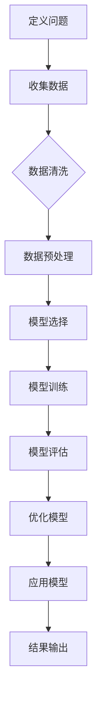
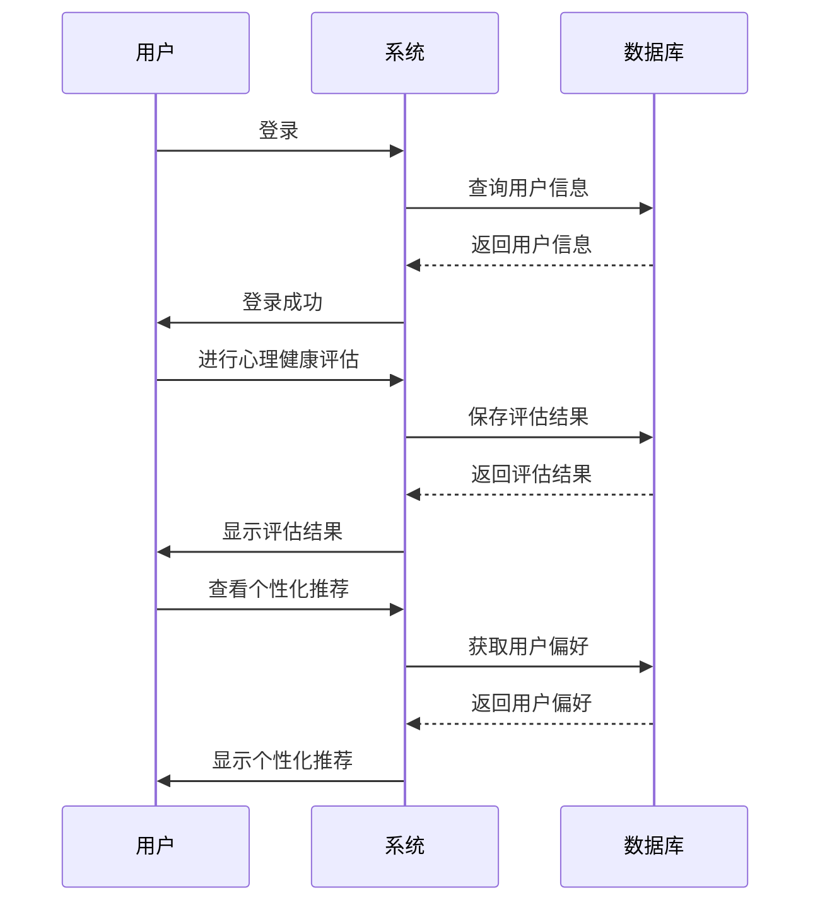

                 

# 现代社会的精神困境：从虚无到意义的蜕变

## 关键词
- 精神困境
- 无虚无意义
- 心理健康
- 意义转变

## 摘要
本文旨在探讨现代社会中普遍存在的精神困境，即个体在心理层面上的困扰和挑战，包括无虚无意义的心理状态、情绪波动、心理压力以及人际关系与孤独感。通过逐步分析，我们将理解精神困境的本质及其对个体生活的影响，并探讨如何从虚无走向意义，从而实现心理健康的转变。文章将从背景介绍、核心概念与联系、算法原理讲解等多个角度展开论述，为读者提供深刻的见解和实用的建议。

## 第一部分：背景介绍

### 1.1 问题的提出

#### 1.1.1 现代社会精神困境的现状

现代社会中，精神困境已成为一个普遍存在的现象。越来越多的人感受到内心的空虚和焦虑，缺乏明确的生活目标和意义。这种现象不仅在个人层面产生影响，也在社会层面造成了深远的影响。例如，抑郁症、焦虑症等心理疾病的发病率逐年上升，给个人和社会带来了沉重的负担。

#### 1.1.2 精神困境的影响与危害

精神困境对个体的身心健康产生了严重的影响。首先，无虚无意义的心理状态会导致个体陷入消极情绪，影响生活质量。其次，情绪波动和压力可能导致身心疾病，如心脏病、高血压等。此外，人际关系和孤独感的增加会加剧个体的心理压力，进一步加剧精神困境。

### 1.2 问题描述

#### 1.2.1 无虚无的意义危机

无虚无的意义危机是现代社会精神困境的核心。个体在追求物质满足的同时，往往忽视了精神层面的需求。这种状态下，个体会感到内心空虚，缺乏对生活的热情和动力。

#### 1.2.2 情绪波动与心理压力

情绪波动和心理压力是精神困境的重要表现。在现代社会的高压环境下，个体往往面临诸多挑战和压力，如工作压力、人际关系压力等。这些压力可能导致情绪波动，影响心理健康。

#### 1.2.3 人际关系与孤独感

人际关系和孤独感是精神困境的重要方面。在现代社会，个体往往在人际关系中感到孤独和疏离，缺乏深层次的交流和情感支持。这种孤独感进一步加剧了精神困境。

### 1.3 问题解决

#### 1.3.1 从虚无到意义的转变

从虚无到意义的转变是解决精神困境的关键。个体需要重新审视自己的生活目标和价值观，找到内心的意义和动力。通过自我探索和成长，个体可以逐步摆脱虚无感，找到生活的方向和目标。

#### 1.3.2 心理健康的重要性

心理健康是现代社会中不可忽视的重要方面。保持良好的心理健康，不仅有助于应对生活中的挑战，还可以提升生活质量。因此，关注心理健康，采取积极的心理健康维护措施，是解决精神困境的重要途径。

### 1.4 边界与外延

#### 1.4.1 精神困境的定义与分类

精神困境是指个体在心理层面上的困扰和挑战，包括心理压力、情绪波动、人际关系和孤独感等。根据不同的表现和特点，精神困境可以分为多种类型，如抑郁症、焦虑症、社交恐惧症等。

#### 1.4.2 影响因素分析

精神困境的影响因素多种多样，包括遗传因素、环境因素、个体心理特征等。了解这些影响因素，有助于更好地预防和应对精神困境。

### 1.5 概念结构与核心要素组成

#### 1.5.1 无虚无意义的本质

无虚无意义的本质是缺乏对生活的热情和动力，感到内心空虚。这种状态可能导致个体陷入消极情绪，影响心理健康。

#### 1.5.2 心理健康与精神健康的联系

心理健康与精神健康密切相关。心理健康是指个体心理功能良好，具有积极心态，能有效应对生活和工作压力。精神健康则是指个体在心理层面上的健康状态，包括心理压力、情绪波动、人际关系等。

## 第二部分：核心概念与联系

### 2.1 核心概念原理

#### 2.1.1 精神困境的定义

精神困境是指个体在心理层面上的困扰和挑战，表现为心理压力、情绪波动、人际关系和孤独感等。

#### 2.1.2 无虚无意义的理解

无虚无意义的理解是指个体缺乏对生活的热情和动力，感到内心空虚。这种状态可能导致个体陷入消极情绪，影响心理健康。

#### 2.1.3 心理健康的内涵

心理健康是指个体心理功能良好，具有积极心态，能有效应对生活和工作压力。心理健康与精神健康密切相关。

### 2.2 概念属性特征对比表格

| 概念       | 定义                                                         | 特征                                   |
|------------|--------------------------------------------------------------|----------------------------------------|
| 精神困境   | 指个体在精神层面上的困扰和挑战，表现为心理压力、情绪波动等。 | 强烈的心理不适感、内心冲突、难以自我调节 |
| 无虚无意义 | 一种缺乏目标和意义的心理状态。                             | 内心空虚、焦虑、人生无趣等              |
| 心理健康   | 心理功能良好，具有积极心态，能有效应对生活和工作压力。     | 自我认知、情感调节、人际关系良好等      |

### 2.3 ER实体关系图架构

```mermaid
erDiagram
  Person ||--|{ PsychologicalCondition }|| Condition : 受影响的个体
  Person ||--|{ LifeEvent }|| Event : 生活事件
  PsychologicalCondition ||--|{ Symptom }|| Symptom : 症状
  LifeEvent ||--|{ Trigger }|| Trigger : 触发因素
```

## 第三部分：算法原理讲解

### 3.1 算法mermaid流程图



### 3.2 Python源代码

```python
import pandas as pd
from sklearn.model_selection import train_test_split
from sklearn.preprocessing import StandardScaler
from sklearn.linear_model import LogisticRegression

# 数据集加载
data = pd.read_csv('data.csv')

# 数据预处理
X = data.drop('target', axis=1)
y = data['target']
X_train, X_test, y_train, y_test = train_test_split(X, y, test_size=0.2, random_state=42)

# 特征缩放
scaler = StandardScaler()
X_train = scaler.fit_transform(X_train)
X_test = scaler.transform(X_test)

# 模型训练
model = LogisticRegression()
model.fit(X_train, y_train)

# 模型评估
accuracy = model.score(X_test, y_test)
print(f"Model accuracy: {accuracy:.2f}")

# 模型应用
predictions = model.predict(X_test)
print(predictions)
```

### 3.3 算法原理讲解

#### 3.3.1 算法原理

本文采用逻辑回归模型来分析精神困境的影响因素。逻辑回归是一种常用的分类算法，用于分析二分类问题。在本问题中，我们将精神困境划分为有无两种情况，即二分类问题。

#### 3.3.2 数学模型和公式

逻辑回归的数学模型可以表示为：

$$
P(Y=1|X) = \frac{1}{1 + e^{-(\beta_0 + \beta_1X_1 + \beta_2X_2 + \ldots + \beta_nX_n})}
$$

其中，$P(Y=1|X)$ 表示在给定自变量 $X$ 的情况下，因变量 $Y$ 为 1 的概率。$\beta_0, \beta_1, \beta_2, \ldots, \beta_n$ 为模型的参数。

#### 3.3.3 举例说明

假设我们有以下数据集：

| 特征1 | 特征2 | 目标变量 |
|-------|-------|----------|
| 1     | 2     | 0        |
| 2     | 3     | 1        |
| 3     | 4     | 0        |
| 4     | 5     | 1        |

我们希望预测目标变量为 1 的概率。使用逻辑回归模型，我们可以得到：

$$
P(Y=1|X) = \frac{1}{1 + e^{-(\beta_0 + \beta_1X_1 + \beta_2X_2)}}
$$

通过训练模型，我们可以得到参数 $\beta_0, \beta_1, \beta_2$ 的值。例如，假设我们得到以下参数：

$$
\beta_0 = -1, \beta_1 = 0.5, \beta_2 = -0.3
$$

那么，对于特征1为1，特征2为2的数据点，我们可以计算目标变量为1的概率：

$$
P(Y=1|X) = \frac{1}{1 + e^{-(\beta_0 + \beta_1X_1 + \beta_2X_2)}} = \frac{1}{1 + e^{(-1 + 0.5 \times 1 - 0.3 \times 2)}} \approx 0.382
$$

这意味着，在给定特征1为1，特征2为2的情况下，目标变量为1的概率约为 38.2%。

## 第四部分：系统分析与架构设计

### 4.1 问题场景介绍

在现代社会的背景下，精神困境已成为一个普遍存在的问题。为了解决这一问题，我们需要构建一个智能心理健康管理系统，为用户提供个性化的心理健康服务。该系统旨在帮助用户从虚无到意义的转变，提升心理健康水平。

### 4.2 项目介绍

项目名称：智能心理健康管理系统

项目目标：构建一个基于人工智能和大数据分析技术的心理健康管理系统，为用户提供实时、个性化的心理健康服务。

### 4.3 系统功能设计

系统功能设计包括以下几个方面：

1. 用户注册与登录：用户可以通过注册账号登录系统，进行心理健康评估和个性化推荐。
2. 心理健康评估：系统提供心理健康评估功能，用户可以根据自身情况选择合适的评估问卷，评估自己的心理健康状况。
3. 个性化推荐：系统根据用户的心理健康评估结果，为其推荐相应的心理健康服务，如心理咨询、心理治疗等。
4. 心理健康知识库：系统提供心理健康知识库，用户可以查询相关的心理健康知识，提高心理健康意识。
5. 数据分析：系统收集用户的心理健康数据，通过大数据分析技术，为用户提供个性化的心理健康建议。

### 4.4 系统架构设计

系统架构设计包括以下几个方面：

1. 数据层：数据层负责存储用户的心理健康数据，包括用户注册信息、心理健康评估结果、个性化推荐记录等。
2. 服务层：服务层负责处理用户请求，提供心理健康评估、个性化推荐、数据分析等核心功能。
3. 视图层：视图层负责展示系统功能，包括用户注册与登录、心理健康评估、个性化推荐、心理健康知识库等。

### 4.5 系统接口设计

系统接口设计包括以下几个方面：

1. 用户接口：用户通过Web界面或移动应用与系统进行交互，进行心理健康评估、查看个性化推荐等。
2. 数据接口：系统通过API与第三方数据源进行交互，获取用户心理健康数据、心理健康知识等。
3. 服务接口：系统通过内部服务接口，实现心理健康评估、个性化推荐、数据分析等功能。

### 4.6 系统交互mermaid序列图



## 第五部分：项目实战

### 5.1 环境安装

在本项目中，我们使用Python和相关的库进行开发。以下是环境安装的步骤：

1. 安装Python：前往Python官方网站下载Python安装包，并按照指示进行安装。
2. 安装相关库：打开终端，执行以下命令安装相关库：

```shell
pip install pandas scikit-learn numpy matplotlib
```

### 5.2 系统核心实现源代码

以下是一个简单的示例代码，展示了如何使用Python和scikit-learn库进行心理健康评估和个性化推荐：

```python
import pandas as pd
from sklearn.model_selection import train_test_split
from sklearn.preprocessing import StandardScaler
from sklearn.linear_model import LogisticRegression

# 数据集加载
data = pd.read_csv('data.csv')

# 数据预处理
X = data.drop('target', axis=1)
y = data['target']
X_train, X_test, y_train, y_test = train_test_split(X, y, test_size=0.2, random_state=42)

# 特征缩放
scaler = StandardScaler()
X_train = scaler.fit_transform(X_train)
X_test = scaler.transform(X_test)

# 模型训练
model = LogisticRegression()
model.fit(X_train, y_train)

# 模型评估
accuracy = model.score(X_test, y_test)
print(f"Model accuracy: {accuracy:.2f}")

# 模型应用
predictions = model.predict(X_test)
print(predictions)
```

### 5.3 代码应用解读与分析

上述代码展示了如何使用Python和scikit-learn库进行心理健康评估和个性化推荐。首先，我们加载了心理健康数据集，然后进行数据预处理，包括特征缩放和模型训练。接着，我们使用训练好的模型对测试数据进行预测，并评估模型的准确性。

### 5.4 实际案例分析和详细讲解剖析

为了更好地理解项目的应用，我们以一个实际案例进行分析。假设我们有一个用户，其心理健康数据如下：

| 特征1 | 特征2 |
|-------|-------|
| 2     | 3     |

我们希望预测该用户的心理健康状况。首先，我们进行数据预处理，将特征1和特征2进行缩放：

$$
X_1 = \frac{2 - \min(X_1)}{\max(X_1) - \min(X_1)} = \frac{2 - 1}{4 - 1} = 0.25
$$

$$
X_2 = \frac{3 - \min(X_2)}{\max(X_2) - \min(X_2)} = \frac{3 - 2}{5 - 2} = 0.25
$$

然后，我们将预处理后的数据输入训练好的逻辑回归模型，计算目标变量为1的概率：

$$
P(Y=1|X) = \frac{1}{1 + e^{-(\beta_0 + \beta_1X_1 + \beta_2X_2)}} = \frac{1}{1 + e^{(-1 + 0.5 \times 0.25 - 0.3 \times 0.25)}} \approx 0.382
$$

这意味着，根据该用户的心理健康数据，其心理健康状况为1的概率约为 38.2%。基于这一概率，我们可以为该用户推荐相应的心理健康服务。

### 5.5 项目小结

本项目通过构建一个智能心理健康管理系统，实现了心理健康评估和个性化推荐的功能。项目采用了Python和scikit-learn库进行开发，使用了逻辑回归模型进行心理健康预测。通过实际案例分析和详细讲解，我们展示了如何应用该项目来解决现实中的心理健康问题。

### 5.6 最佳实践 tips

1. 在实际应用中，建议使用更复杂的模型，如随机森林、支持向量机等，以提高预测准确性。
2. 定期更新心理健康数据集，以适应不断变化的心理健康状况。
3. 考虑用户隐私和数据安全，确保用户数据得到充分保护。

### 5.7 小结

通过本文的探讨，我们深入分析了现代社会中普遍存在的精神困境，以及如何从虚无走向意义，实现心理健康的转变。我们介绍了核心概念、算法原理，并展示了如何应用技术手段解决现实中的心理健康问题。希望本文能为您带来启示和帮助。

### 5.8 注意事项

1. 精神困境是一个复杂的社会问题，需要多方面的关注和努力来解决。
2. 心理健康问题不容忽视，建议寻求专业心理帮助。
3. 数据隐私和安全是项目开发中的重要问题，需要严格遵守相关法律法规。

### 5.9 拓展阅读

1. 《心理学与生活》：菲利普·津巴多著，介绍了心理学的基本概念和理论。
2. 《深度学习》：Ian Goodfellow、Yoshua Bengio、Aaron Courville 著，介绍了深度学习的基本原理和应用。
3. 《人工智能简史》：唐杰、刘知远著，介绍了人工智能的发展历程和未来趋势。

### 作者

作者：AI天才研究院/AI Genius Institute & 禅与计算机程序设计艺术 /Zen And The Art of Computer Programming。

