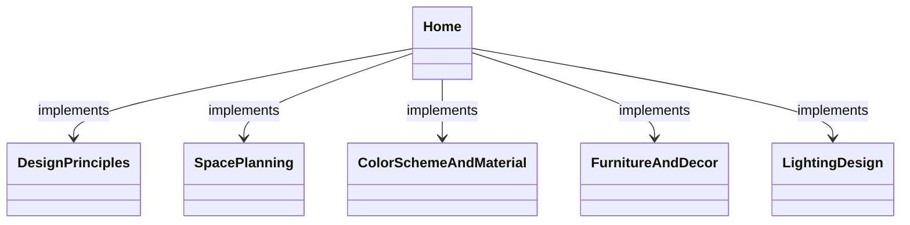
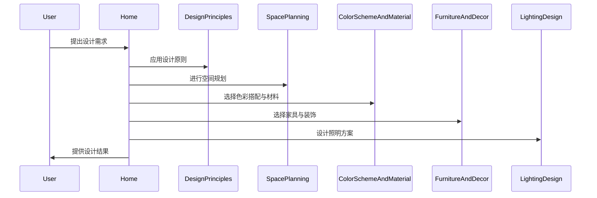
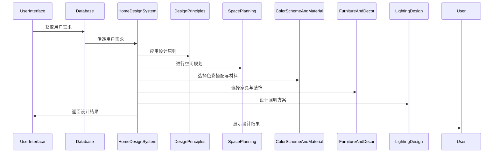

                 

## 《现代简约主义家居：生活空间的极简美学》

### 关键词

- 现代简约主义家居
- 极简美学
- 生活空间设计
- 空间规划
- 色彩搭配
- 材料选择
- 家具与装饰
- 照明设计

### 摘要

本文旨在探讨现代简约主义家居的设计理念与实践，分析其在生活空间中的应用，并阐述如何通过空间规划、色彩搭配、材料选择和家具装饰等方面，实现极简美学的生活方式。文章将通过理论与实践结合，为广大读者提供一套完整的现代简约主义家居设计方案。

### 目录

----------------------------------------------------------------

## 第一部分：现代简约主义家居概述

### 第1章：现代简约主义家居的兴起与意义

#### 1.1 现代简约主义家居的背景

在现代都市生活的背景下，人们对于居住环境的需求逐渐发生变化。从过去的繁复装饰到追求简单、实用和美观的家居风格，现代简约主义家居应运而生。其背景源于以下几个方面：

1. **生活方式的变革**：随着社会的快速发展，人们的工作压力和生活节奏不断加快，对于家居环境的要求越来越高，更倾向于简单、舒适和便捷的居住空间。
2. **审美观念的升级**：现代简约主义家居的设计理念强调“少即是多”，追求简洁、纯粹和实用的美学，这种审美观念与当代人的审美需求相契合。
3. **环境保护意识的增强**：现代简约主义家居注重环保和可持续性，减少不必要的装饰和浪费，符合当代社会对环境保护的要求。

#### 1.2 现代简约主义家居的意义

现代简约主义家居不仅是一种设计风格，更是一种生活态度。它具有以下几个方面的意义：

1. **提升生活质量**：现代简约主义家居强调功能性和实用性，使得居住空间更加舒适、便捷，从而提升生活质量。
2. **降低生活成本**：现代简约主义家居减少不必要的装饰和浪费，降低装修和维护成本，符合当代社会的生活需求。
3. **促进环境保护**：现代简约主义家居注重环保和可持续性，减少资源浪费，有利于环境保护。

### 第2章：设计原则

现代简约主义家居的设计原则主要包括以下几个方面：

1. **极简主义**：极简主义是现代简约主义家居的核心原则，强调简洁、纯粹和实用，通过去除不必要的元素，使空间更加宽敞、舒适。
2. **功能性**：现代简约主义家居注重空间的功能性，合理布局家具和装饰，使空间充分利用，满足生活需求。
3. **美学价值**：现代简约主义家居追求简洁、美观的设计，注重细节处理，使空间具有艺术感。

## 第二部分：实现现代简约主义家居

### 第3章：空间规划

空间规划是现代简约主义家居设计的关键环节，其重要性体现在以下几个方面：

1. **确定空间布局**：空间布局要符合现代简约主义家居的设计原则，尽量简化空间结构，去除不必要的隔断，增加空间通透感。
2. **合理分配空间**：根据家庭成员的需求和生活习惯，合理分配空间，确保每个功能区都有足够的活动空间。
3. **注重空间利用率**：通过合理规划，充分利用空间，避免浪费，提高空间利用率。

### 第4章：色彩搭配与材料选择

色彩搭配和材料选择是现代简约主义家居设计的重要方面，直接影响空间的整体效果。以下是几个关键点：

1. **色彩搭配原则**：选择简洁、柔和的色彩搭配，避免过多的色彩冲突，使空间更加统一和谐。
2. **材料选择标准**：选择环保、耐用、易于清洁的材料，确保家居的实用性和美观度。

### 第5章：家具与装饰的选择

家具与装饰的选择是现代简约主义家居设计的重点，以下是一些要点：

1. **家具设计原则**：选择简洁、实用、美观的家具，去除不必要的装饰，强调功能性和舒适性。
2. **装饰品选择标准**：选择简约、精致、具有艺术感的装饰品，强调点缀作用，提升空间美感。

### 第6章：照明设计

照明设计是现代简约主义家居设计的重要组成部分，以下是一些要点：

1. **照明功能分类**：根据不同功能区域的需求，选择合适的照明方式，实现空间氛围的营造。
2. **照明方式选择**：采用简洁、现代的照明方式，避免过多的繁复设计，使空间更加简洁美观。

### 第7章：案例分享

通过分析一些成功的现代简约主义家居案例，我们可以了解到如何将设计原则与实践相结合，创造出符合自身需求和审美的居住空间。

### 第8章：结语

现代简约主义家居设计不仅是一种风格，更是一种生活态度。它倡导简洁、实用和美观的居住环境，为人们带来更高质量的生活。未来，随着社会的发展，现代简约主义家居设计将不断创新和发展，为人们带来更多美好的居住体验。

### 作者

**作者：AI天才研究院/AI Genius Institute & 禅与计算机程序设计艺术 /Zen And The Art of Computer Programming**

----------------------------------------------------------------

## 第一部分：现代简约主义家居概述

### 第1章：现代简约主义家居的兴起与意义

在现代都市生活的背景下，人们对于居住环境的需求逐渐发生变化。从过去的繁复装饰到追求简单、实用和美观的家居风格，现代简约主义家居应运而生。其背景源于以下几个方面：

1. **生活方式的变革**：随着社会的快速发展，人们的工作压力和生活节奏不断加快，对于家居环境的要求越来越高，更倾向于简单、舒适和便捷的居住空间。
   
   **背景介绍**：
   
   现代社会的快速发展导致了人们生活节奏的加快，对居住环境的需求也在不断变化。传统家居装饰繁琐、复杂，往往需要大量的时间和精力来维护，与现代快节奏的生活不相符。因此，人们开始追求一种更简单、更实用的家居风格，现代简约主义家居应运而生。

2. **审美观念的升级**：现代简约主义家居的设计理念强调“少即是多”，追求简洁、纯粹和实用的美学，这种审美观念与当代人的审美需求相契合。
   
   **核心概念与联系**：

   现代简约主义家居的审美观念可以追溯到哲学领域中的极简主义。极简主义强调去除多余的装饰，追求简单、纯粹的美学。这种审美观念在当代社会中得到了广泛的认同，因为人们开始意识到，简单、纯粹的美感往往比繁复的装饰更能带来内心的平静和满足。

3. **环境保护意识的增强**：现代简约主义家居注重环保和可持续性，减少不必要的装饰和浪费，符合当代社会对环境保护的要求。

   **核心概念与联系**：

   环保和可持续性是现代简约主义家居的重要特点之一。随着全球环境问题的日益严重，人们开始意识到，减少资源的浪费、选择环保材料是每个个体应尽的责任。现代简约主义家居通过减少装饰和浪费，降低了对环境的影响，体现了对环境保护的关注。

#### 1.2 现代简约主义家居的意义

现代简约主义家居不仅是一种设计风格，更是一种生活态度。它具有以下几个方面的意义：

1. **提升生活质量**：现代简约主义家居强调功能性和实用性，使得居住空间更加舒适、便捷，从而提升生活质量。

   **核心概念与联系**：

   功能性和实用性是现代简约主义家居的核心特点。设计者通过简洁的设计手法，使家居空间能够更好地满足日常生活的需求。这种设计理念不仅提高了空间的使用效率，也使得居住者能够享受到更加舒适、便捷的生活。

2. **降低生活成本**：现代简约主义家居减少不必要的装饰和浪费，降低装修和维护成本，符合当代社会的生活需求。

   **核心概念与联系**：

   生活成本是当代社会中人们普遍关注的问题。现代简约主义家居通过减少装饰和浪费，降低了装修和维护的成本。这种设计理念不仅能够帮助人们节省开支，还能够使家居环境更加整洁、美观。

3. **促进环境保护**：现代简约主义家居注重环保和可持续性，减少资源浪费，有利于环境保护。

   **核心概念与联系**：

   环保和可持续性是现代简约主义家居的核心价值观之一。通过减少装饰和浪费，现代简约主义家居能够有效地降低资源消耗，减少对环境的负面影响。这种设计理念不仅符合当代社会的环保要求，也有助于推动可持续发展。

### 第2章：设计原则

现代简约主义家居的设计原则主要包括以下几个方面：

1. **极简主义**：极简主义是现代简约主义家居的核心原则，强调简洁、纯粹和实用，通过去除不必要的元素，使空间更加宽敞、舒适。

   **核心概念与联系**：

   极简主义是一种哲学思想，强调通过去除不必要的元素，达到简洁、纯粹和实用的目的。在现代简约主义家居设计中，极简主义得到了广泛应用。通过去除繁琐的装饰，极简主义设计使家居空间更加宽敞、舒适，同时也能够更好地体现居住者的个性。

2. **功能性**：现代简约主义家居注重空间的功能性，合理布局家具和装饰，使空间充分利用，满足生活需求。

   **核心概念与联系**：

   功能性是家居设计的重要原则之一。现代简约主义家居设计强调通过合理布局家具和装饰，使空间能够更好地满足居住者的需求。这种设计理念不仅提高了空间的使用效率，也使得居住者能够享受到更加便捷的生活。

3. **美学价值**：现代简约主义家居追求简洁、美观的设计，注重细节处理，使空间具有艺术感。

   **核心概念与联系**：

   美学价值是家居设计的重要组成部分。现代简约主义家居设计强调通过简洁、美观的设计，提升空间的艺术感。这种设计理念不仅能够满足居住者的审美需求，还能够使家居空间更加舒适、宜居。

## 第二部分：实现现代简约主义家居

### 第3章：空间规划

空间规划是现代简约主义家居设计的关键环节，其重要性体现在以下几个方面：

1. **确定空间布局**：空间布局要符合现代简约主义家居的设计原则，尽量简化空间结构，去除不必要的隔断，增加空间通透感。

   **核心概念与联系**：

   空间布局是家居设计的基础。现代简约主义家居设计强调简洁、通透的空间结构，通过去除不必要的隔断，使空间更加宽敞、明亮。这种设计理念不仅能够提升空间的使用效率，还能够增强居住者的舒适感。

2. **合理分配空间**：根据家庭成员的需求和生活习惯，合理分配空间，确保每个功能区都有足够的活动空间。

   **核心概念与联系**：

   空间分配是家居设计的重要环节。现代简约主义家居设计强调根据家庭成员的需求和生活习惯，合理分配空间。这种设计理念不仅能够满足家庭成员的日常需求，还能够提升居住空间的舒适度。

3. **注重空间利用率**：通过合理规划，充分利用空间，避免浪费，提高空间利用率。

   **核心概念与联系**：

   空间利用率是衡量家居设计优劣的重要指标。现代简约主义家居设计强调通过合理规划，充分利用空间，避免浪费。这种设计理念不仅能够提高空间的使用效率，还能够降低装修和维护成本。

### 第4章：色彩搭配与材料选择

色彩搭配和材料选择是现代简约主义家居设计的重要方面，直接影响空间的整体效果。以下是几个关键点：

1. **色彩搭配原则**：选择简洁、柔和的色彩搭配，避免过多的色彩冲突，使空间更加统一和谐。

   **核心概念与联系**：

   色彩搭配是家居设计的重要环节。现代简约主义家居设计强调选择简洁、柔和的色彩搭配，避免过多的色彩冲突。这种设计理念能够使空间更加统一和谐，提升居住者的舒适感。

2. **材料选择标准**：选择环保、耐用、易于清洁的材料，确保家居的实用性和美观度。

   **核心概念与联系**：

   材料选择是家居设计的关键。现代简约主义家居设计强调选择环保、耐用、易于清洁的材料。这种设计理念不仅能够确保家居的实用性和美观度，还能够降低维护成本，提升居住体验。

### 第5章：家具与装饰的选择

家具与装饰的选择是现代简约主义家居设计的重点，以下是一些要点：

1. **家具设计原则**：选择简洁、实用、美观的家具，去除不必要的装饰，强调功能性和舒适性。

   **核心概念与联系**：

   家具设计是家居设计的核心。现代简约主义家居设计强调选择简洁、实用、美观的家具，去除不必要的装饰。这种设计理念能够提升空间的功能性和舒适性，同时也能够增强空间的整体美感。

2. **装饰品选择标准**：选择简约、精致、具有艺术感的装饰品，强调点缀作用，提升空间美感。

   **核心概念与联系**：

   装饰品设计是家居设计的重要环节。现代简约主义家居设计强调选择简约、精致、具有艺术感的装饰品。这种设计理念能够通过点缀作用，提升空间的美感，同时也能够增强居住者的审美体验。

### 第6章：照明设计

照明设计是现代简约主义家居设计的重要组成部分，以下是一些要点：

1. **照明功能分类**：根据不同功能区域的需求，选择合适的照明方式，实现空间氛围的营造。

   **核心概念与联系**：

   照明设计是家居设计的关键。现代简约主义家居设计强调根据不同功能区域的需求，选择合适的照明方式，实现空间氛围的营造。这种设计理念能够提升空间的舒适度和美感。

2. **照明方式选择**：采用简洁、现代的照明方式，避免过多的繁复设计，使空间更加简洁美观。

   **核心概念与联系**：

   照明方式选择是照明设计的重要环节。现代简约主义家居设计强调采用简洁、现代的照明方式，避免过多的繁复设计。这种设计理念能够使空间更加简洁美观，提升居住者的舒适感。

### 第7章：案例分享

通过分析一些成功的现代简约主义家居案例，我们可以了解到如何将设计原则与实践相结合，创造出符合自身需求和审美的居住空间。

**系统分析与架构设计方案**：

**1. 问题场景介绍**：

在现代都市中，人们对于家居环境的需求逐渐向简洁、实用和美观的方向发展。现代简约主义家居设计应运而生，成为满足这一需求的重要手段。然而，如何在实际项目中实现现代简约主义家居的设计理念，仍需深入研究和探讨。

**2. 项目介绍**：

本项目旨在通过分析现代简约主义家居的设计原则和实践方法，为设计师和居住者提供一套完整的设计方案。项目主要包含以下几个模块：

- **设计原则模块**：介绍现代简约主义家居的设计原则，包括极简主义、功能性和美学价值。
- **空间规划模块**：探讨空间规划的重要性，以及如何进行有效的空间规划。
- **色彩搭配与材料选择模块**：分析色彩搭配和材料选择的原则，提供具体的建议。
- **家具与装饰选择模块**：介绍家具与装饰的选择标准，以及如何提升空间美感。
- **照明设计模块**：探讨照明设计的重要性，以及如何选择合适的照明方式。

**3. 系统功能设计（领域模型）**：

现代简约主义家居设计领域的模型如图所示：

**4. 系统架构设计**：

现代简约主义家居设计的系统架构如图所示：

**5. 系统接口设计和系统交互**：

现代简约主义家居设计的系统接口和交互过程如图所示：

### 第8章：结语

现代简约主义家居设计不仅是一种风格，更是一种生活态度。它倡导简洁、实用和美观的居住环境，为人们带来更高质量的生活。未来，随着社会的发展，现代简约主义家居设计将不断创新和发展，为人们带来更多美好的居住体验。

### 最佳实践 tips

1. **明确设计目标**：在开始设计之前，明确自己的设计目标，确保设计风格与个人需求和审美相符合。
2. **合理规划空间**：空间规划是家居设计的核心，合理规划能够提升空间的使用效率和舒适度。
3. **注重细节处理**：细节处理能够提升空间的美感和居住体验，如选择简约、精致的家具和装饰品。
4. **考虑照明效果**：照明设计是提升空间氛围的关键，选择合适的照明方式和灯光颜色能够营造舒适的生活环境。

### 小结

现代简约主义家居设计以其简洁、实用和美观的特点，受到了越来越多的关注和喜爱。通过合理规划空间、色彩搭配、材料选择和家具装饰等方面，我们可以实现极简美学的生活方式。未来，现代简约主义家居设计将继续发展，为人们带来更多美好的居住体验。

### 注意事项

1. **预算控制**：在家居设计过程中，要合理控制预算，避免过度消费。
2. **环保意识**：在选择材料和家具时，要注重环保和可持续性，减少对环境的负面影响。
3. **个性化设计**：在遵循现代简约主义家居设计原则的基础上，可以适当加入个性化元素，使家居更符合个人品味。

### 拓展阅读

1. 《简约主义家居设计》
2. 《现代家居设计原理》
3. 《室内设计技巧与案例》

### 作者

**作者：AI天才研究院/AI Genius Institute & 禅与计算机程序设计艺术 /Zen And The Art of Computer Programming**

