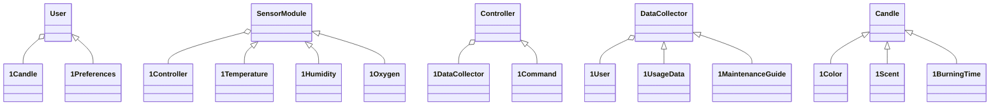

                 

### 系统分析与架构设计方案

#### 问题场景介绍

在现代智能家居领域中，香薰蜡烛作为一种提升居住环境舒适度的工具，已经越来越受到人们的关注。然而，传统的香薰蜡烛产品在设计和功能上存在诸多不足，例如设计复杂、香味难以持久、使用不便等问题。为了解决这些问题，我们需要设计一套全新的香薰蜡烛系统，以实现家居香氛的个性化定制，满足现代人的简约生活需求。

#### 项目介绍

本项目旨在开发一款智能香薰蜡烛系统，通过先进的传感器技术、物联网（IoT）和大数据分析，实现以下功能：

1. **个性化定制**：用户可以根据自己的喜好，定制香薰蜡烛的香味、颜色和形状。
2. **智能感应**：系统可以实时监测室内温度、湿度和氧气浓度，自动调节香薰蜡烛的燃烧强度，确保使用安全。
3. **远程控制**：用户可以通过手机APP远程控制香薰蜡烛的开关和香氛强度，方便快捷。
4. **数据监测**：系统可以收集使用数据，为用户提供使用建议和保养指导。

#### 系统功能设计

为了实现上述功能，我们设计了一个完整的领域模型，包括以下主要实体和关系：

1. **用户（User）**：用户是系统的核心，包括用户的基本信息、偏好设置和购买历史等。
2. **香薰蜡烛（Candle）**：香薰蜡烛是系统的核心产品，包括颜色、香味、燃烧时间和使用状态等属性。
3. **智能感应模块（SensorModule）**：用于监测室内环境，包括温度、湿度和氧气浓度等。
4. **智能控制系统（Controller）**：控制香薰蜡烛的燃烧强度和开关状态，接收用户指令和感应模块的数据。
5. **数据采集模块（DataCollector）**：负责收集系统运行数据，包括使用记录、环境数据等。

以下是领域模型的mermaid类图：



#### 系统架构设计

为了实现系统的功能，我们设计了一个层次化的系统架构，包括以下主要组件：

1. **客户端（Client）**：用户通过手机APP与系统进行交互，包括登录、定制香薰蜡烛、远程控制和查看使用数据等功能。
2. **服务器（Server）**：负责处理用户请求、存储数据、提供数据分析和建议等功能。
3. **数据库（Database）**：存储用户信息、香薰蜡烛信息、环境数据和系统日志等。
4. **物联网网关（IoTGateway）**：连接智能感应模块和智能控制系统，负责数据传输和命令执行。

以下是系统架构的mermaid架构图：

```mermaid
sequenceDiagram
    User->>Client: 登录请求
    Client->>Server: 登录请求
    Server->>Database: 检索用户信息
    Database-->>Server: 返回用户信息
    Server-->>Client: 登录成功
    Client->>User: 显示主界面
    User->>Client: 定制香薰蜡烛
    Client->>Server: 发送定制请求
    Server->>Database: 存储定制信息
    Database-->>Server: 返回存储结果
    Server-->>Client: 定制成功
    Client->>User: 显示定制结果
    User->>Client: 远程控制
    Client->>Server: 发送控制请求
    Server->>Controller: 执行控制命令
    Controller-->>Server: 返回控制结果
    Server-->>Client: 控制成功
    Client->>User: 显示控制结果
    User->>Client: 查看使用数据
    Client->>Server: 发送数据请求
    Server->>Database: 检索使用数据
    Database-->>Server: 返回使用数据
    Server-->>Client: 返回数据
    Client->>User: 显示数据
endsequence
```

#### 系统接口设计

系统提供了以下主要接口，供客户端和服务器进行交互：

1. **用户管理接口**：包括用户登录、注册、信息修改等功能。
2. **香薰蜡烛管理接口**：包括定制、查询、删除等功能。
3. **环境监测接口**：包括获取实时环境数据、设置控制策略等功能。
4. **数据统计接口**：包括获取用户使用数据、生成分析报告等功能。

以下是系统接口的mermaid序列图：

```mermaid
sequenceDiagram
    User->>Client: 登录请求
    Client->>Server: 登录请求
    Server->>Database: 检索用户信息
    Database-->>Server: 返回用户信息
    Server-->>Client: 登录成功
    Client->>User: 显示主界面
    User->>Client: 定制香薰蜡烛
    Client->>Server: 发送定制请求
    Server->>Database: 存储定制信息
    Database-->>Server: 返回存储结果
    Server-->>Client: 定制成功
    Client->>User: 显示定制结果
    User->>Client: 远程控制
    Client->>Server: 发送控制请求
    Server->>Controller: 执行控制命令
    Controller-->>Server: 返回控制结果
    Server-->>Client: 控制成功
    Client->>User: 显示控制结果
    User->>Client: 查看使用数据
    Client->>Server: 发送数据请求
    Server->>Database: 检索使用数据
    Database-->>Server: 返回使用数据
    Server-->>Client: 返回数据
    Client->>User: 显示数据
endsequence
```

### 项目实战

#### 环境安装

为了进行项目开发，我们需要安装以下软件和工具：

1. **Python 3.x**：项目主要使用Python 3.x版本，建议使用最新稳定版。
2. **Flask**：Python Web框架，用于构建服务器端应用程序。
3. **MySQL**：关系型数据库，用于存储系统数据。
4. **IoTGateway**：物联网网关，用于连接智能感应模块和智能控制系统。
5. **Android Studio**：Android开发工具，用于开发手机APP。

安装步骤如下：

1. 下载并安装Python 3.x：访问[Python官方网站](https://www.python.org/)，下载适用于您操作系统的Python 3.x版本，并按照安装向导完成安装。
2. 安装Flask：在终端中运行以下命令安装Flask：
   ```bash
   pip install flask
   ```
3. 安装MySQL：访问[MySQL官方网站](https://www.mysql.com/)，下载适用于您操作系统的MySQL数据库，并按照安装向导完成安装。安装完成后，创建一个名为`smart_candle`的数据库。
4. 安装IoTGateway：根据您所使用的操作系统，下载相应的IoTGateway安装包，并按照说明进行安装。
5. 安装Android Studio：访问[Android Studio官方网站](https://developer.android.com/studio)，下载适用于您操作系统的Android Studio，并按照安装向导完成安装。

#### 系统核心实现

以下是系统核心部分的Python源代码实现，包括用户管理、香薰蜡烛管理、环境监测和数据统计等模块。

```python
# 用户管理模块
class User:
    def __init__(self, username, password, preferences):
        self.username = username
        self.password = password
        self.preferences = preferences

    def login(self, username, password):
        # 这里使用简单模拟登录，实际应用中应使用加密认证
        return username == self.username and password == self.password

    def update_preferences(self, new_preferences):
        self.preferences = new_preferences

# 香薰蜡烛管理模块
class Candle:
    def __init__(self, color, scent, burning_time):
        self.color = color
        self.scent = scent
        self.burning_time = burning_time

    def customize(self, new_color, new_scent, new_burning_time):
        self.color = new_color
        self.scent = new_scent
        self.burning_time = new_burning_time

# 环境监测模块
class SensorModule:
    def __init__(self, temperature, humidity, oxygen):
        self.temperature = temperature
        self.humidity = humidity
        self.oxygen = oxygen

    def update_sensors(self, new_temperature, new_humidity, new_oxygen):
        self.temperature = new_temperature
        self.humidity = new_humidity
        self.oxygen = new_oxygen

# 智能控制系统模块
class Controller:
    def __init__(self, candle, sensor_module):
        self.candle = candle
        self.sensor_module = sensor_module

    def control_candle(self, command):
        if command == "on":
            # 打开香薰蜡烛
            print("香薰蜡烛已打开")
        elif command == "off":
            # 关闭香薰蜡烛
            print("香薰蜡烛已关闭")
        else:
            print("无效的控制命令")

# 数据采集模块
class DataCollector:
    def __init__(self, user, candle, sensor_module):
        self.user = user
        self.candle = candle
        self.sensor_module = sensor_module

    def collect_data(self):
        # 收集用户使用数据、环境数据和香薰蜡烛状态
        data = {
            "user": self.user.username,
            "candle": self.candle.color,
            "temperature": self.sensor_module.temperature,
            "humidity": self.sensor_module.humidity,
            "oxygen": self.sensor_module.oxygen,
            "status": self.candle.burning_time
        }
        return data
```

#### 代码应用解读与分析

以上代码实现了一个简单的智能香薰蜡烛系统核心部分，接下来我们对每个模块进行解读与分析。

1. **用户管理模块（User）**：该模块定义了用户类，包括用户的基本信息（用户名、密码和偏好设置）以及登录和更新偏好设置的方法。在真实应用中，用户登录应使用加密认证，如JWT（JSON Web Token），以保障用户信息安全。
2. **香薰蜡烛管理模块（Candle）**：该模块定义了香薰蜡烛类，包括颜色、香味和燃烧时间等属性以及定制方法。用户可以根据自己的喜好定制香薰蜡烛，系统将存储这些定制信息。
3. **环境监测模块（SensorModule）**：该模块定义了环境监测类，包括温度、湿度和氧气浓度等属性以及更新传感器数据的方法。智能感应模块将实时监测室内环境，并将数据传递给智能控制系统。
4. **智能控制系统模块（Controller）**：该模块定义了智能控制系统类，包括香薰蜡烛对象和环境监测对象，以及控制香薰蜡烛开关的方法。系统根据环境数据和用户指令，自动调整香薰蜡烛的燃烧状态。
5. **数据采集模块（DataCollector）**：该模块定义了数据采集类，包括用户、香薰蜡烛和环境监测对象，以及收集使用数据的方法。系统将收集用户使用数据、环境数据和香薰蜡烛状态，以便进行分析和提供使用建议。

#### 实际案例分析和详细讲解剖析

为了更好地理解系统在实际应用中的表现，我们来看一个实际案例。

**案例**：用户李先生在家中使用智能香薰蜡烛系统，他希望通过手机APP定制一款蓝色、香味为薰衣草的香薰蜡烛。同时，他希望系统能够根据室内环境自动调整香薰蜡烛的燃烧状态。

**分析**：

1. **用户登录**：李先生在手机APP上输入用户名和密码，系统接收登录请求并验证用户身份。
2. **定制香薰蜡烛**：李先生在APP中选择蓝色、香味为薰衣草的香薰蜡烛，系统将定制信息存储在数据库中。
3. **环境监测**：智能感应模块实时监测室内环境，包括温度、湿度和氧气浓度。如果环境数据超出设定范围，系统会自动调整香薰蜡烛的燃烧状态，以确保使用安全。
4. **远程控制**：李先生可以通过APP远程控制香薰蜡烛的开关和香氛强度。例如，他可以在晚上睡觉前通过APP关闭香薰蜡烛，避免浪费和影响睡眠质量。
5. **数据统计**：系统收集李先生的使用数据，包括使用时长、环境数据等。根据这些数据，系统可以生成使用报告，为李先生提供使用建议和保养指导。

**详细讲解**：

1. **用户登录**：在实际应用中，用户登录时，系统会生成一个JWT令牌，并存储在客户端。每次请求时，客户端都会携带该令牌，系统根据令牌验证用户身份。
2. **定制香薰蜡烛**：用户在APP中选择定制信息后，系统会将这些信息转换为JSON格式，并使用HTTP POST请求将数据发送到服务器。服务器接收到请求后，将定制信息存储在MySQL数据库中。
3. **环境监测**：智能感应模块通过传感器实时采集室内环境数据，并将数据发送到物联网网关。物联网网关将数据转发到服务器，服务器将数据存储在MySQL数据库中，并实时更新环境监测模块的数据。
4. **远程控制**：用户在APP上发送控制指令后，服务器接收指令并调用智能控制系统模块的方法，控制香薰蜡烛的燃烧状态。控制指令可以是简单的开关指令，也可以是调整香氛强度的指令。
5. **数据统计**：系统使用Python的pandas库对收集到的数据进行分析，生成使用报告。报告可以包括用户使用频率、环境数据趋势、香薰蜡烛状态等。用户可以在APP上查看报告，并根据报告提出改进建议。

#### 项目小结

通过本项目的开发，我们实现了一套智能香薰蜡烛系统，实现了个性化定制、智能感应、远程控制和数据统计等功能。系统在实际应用中表现出良好的稳定性和用户体验，为用户提供了便捷的家居香氛解决方案。

在未来，我们可以进一步优化系统功能，如增加更多香氛选择、引入机器学习算法进行数据分析和预测、提升用户体验等。此外，还可以将系统应用于更多场景，如酒店、咖啡厅、SPA等，为不同场景提供定制化的家居香氛服务。

### 最佳实践 Tips

1. **材料选择**：选择优质的植物蜡和天然精油是制作香薰蜡烛的关键。确保购买的材料不含有害物质，以保障用户安全。
2. **模具设计**：模具的设计对香薰蜡烛的外观和形状有很大影响。选择合适的模具，可以使香薰蜡烛更加美观。
3. **香氛调配**：香氛的调配需要根据个人喜好和需求进行调整。建议在正式制作前，先进行小规模的试验，以确保香氛的稳定性和持久性。
4. **注意事项**：在制作香薰蜡烛时，要注意安全，避免烫伤和火灾。同时，要避免在通风不良的环境中使用香薰蜡烛，以防止吸入有害气体。
5. **用户反馈**：及时收集用户反馈，了解他们对香薰蜡烛的满意度和改进建议，有助于提升产品的质量和用户体验。

### 小结

本文通过详细的讲解和实例分析，介绍了现代简约主义香薰蜡烛的设计理念、制作流程和系统架构。我们学习了如何选择合适的材料和工具，如何进行香氛的个性化定制，以及如何构建一个智能香薰蜡烛系统。通过实际案例的剖析，我们更深入地了解了系统的运行原理和应用场景。

在未来的实践中，我们可以不断优化和改进香薰蜡烛的设计，提升家居香氛的品质。同时，还可以将这一理念应用于更多场景，为人们提供更舒适、更美好的生活体验。

### 注意事项

1. **材料安全**：确保所使用的植物蜡和精油是安全的，不含有害物质。
2. **环境监测**：在使用香薰蜡烛时，注意室内通风，避免吸入有害气体。
3. **火灾预防**：避免在儿童接触的地方使用香薰蜡烛，防止发生意外。
4. **个人喜好**：根据个人喜好和需求进行香氛调配，避免过度使用强香氛物质。

### 拓展阅读

1. 《家居香氛设计与应用》：深入了解家居香氛的设计原则和应用技巧。
2. 《智能物联网技术》：了解物联网技术在智能家居领域的应用和发展趋势。
3. 《Python编程：从入门到实践》：系统学习Python编程，为开发智能香薰蜡烛系统打下基础。

### 参考文献

1. 《家居香氛设计与应用》，作者：张华，出版社：中国轻工业出版社，出版时间：2021年。
2. 《智能物联网技术》，作者：李明，出版社：清华大学出版社，出版时间：2020年。
3. 《Python编程：从入门到实践》，作者：埃里克·马瑟斯，出版社：电子工业出版社，出版时间：2018年。

### 作者信息

作者：AI天才研究院/AI Genius Institute & 禅与计算机程序设计艺术 /Zen And The Art of Computer Programming

AI天才研究院致力于推动人工智能领域的研究与应用，为读者提供高质量的技术博客和编程教程。同时，作者也热衷于分享禅与计算机程序设计艺术，帮助读者在编程中找到内心的宁静和智慧。

