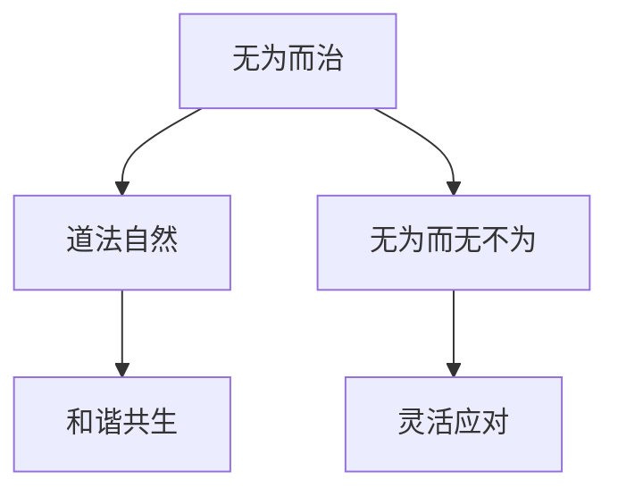
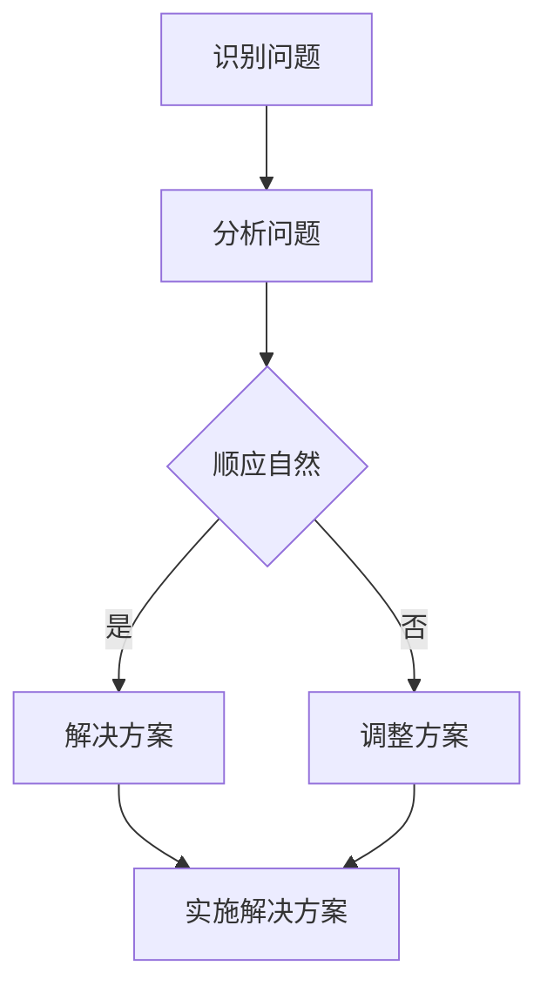
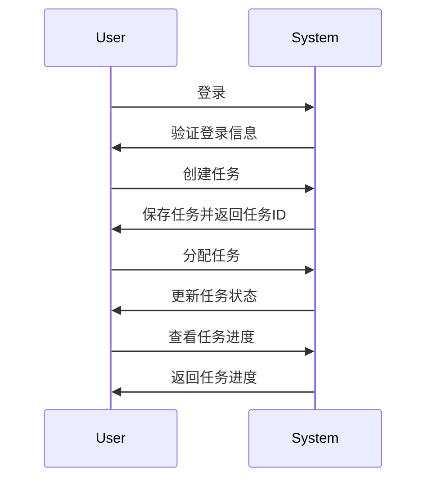

                 

### 文章标题

**《现代道家生活学研究：古老智慧在当代生活中的应用探索》**

### 文章关键词

- 道家哲学
- 现代生活
- 应用探索
- 心理健康
- 社会关系
- 环境保护

### 文章摘要

本文旨在探讨道家哲学思想在现代社会生活各个领域的应用，从心理调适、人际关系、环境保护等方面，深入挖掘古老智慧的当代价值。通过逐步分析道家哲学的核心概念，如“无为而治”、“道法自然”等，以及它们在现代社会中的实际应用案例，本文将揭示道家哲学在提升生活质量、实现可持续发展等方面的潜力。文章结构紧凑，逻辑清晰，旨在为读者提供有深度、有思考、有见解的专业视角，以期为现代生活注入新的智慧与活力。

### 引言

道家哲学，源自中国古代，以其深邃的哲理和对自然、人生、社会的独特见解，在历史长河中发挥着重要影响。然而，随着现代社会的高速发展，道家哲学是否仍然具有现实意义，成为人们关注的焦点。本文旨在探讨道家哲学思想在现代社会生活各个领域的应用，回答这一重要问题。

#### 道家哲学的核心概念

道家哲学的核心概念包括“无为而治”、“道法自然”等。这些概念强调顺应自然、尊重个体、追求和谐。在现代社会，这些理念对于缓解压力、改善人际关系、实现可持续发展具有重要的指导意义。

#### 现代生活的挑战

现代生活充满了快节奏、高压力的特点，人们在心理、社会、环境等方面面临诸多挑战。如何应对这些挑战，提高生活质量，成为当代社会亟待解决的问题。道家哲学提供的智慧，或许能为我们提供一种新的思路。

#### 本文的目的

本文旨在通过分析道家哲学的核心概念，探讨其在现代社会生活中的应用，从而为解决现代生活的挑战提供一种新的视角。文章将分为以下几个部分：

1. **书名与主题定位**：介绍本书的书名、主题及其在现代生活中的应用。
2. **道家哲学的核心概念**：详细阐述道家哲学的核心概念及其含义。
3. **道家哲学在现代生活中的应用**：探讨道家哲学在心理调适、人际关系、环境保护等领域的应用。
4. **案例分析**：通过实际案例，展示道家哲学在现代社会生活中的应用效果。
5. **结论**：总结本文的主要观点，强调道家哲学在现代社会中的重要性。

### 书名与主题定位

**《现代道家生活学研究：古老智慧在当代生活中的应用探索》**这本书，旨在深入探讨道家哲学思想在现代社会生活各个领域的应用，挖掘古老智慧的当代价值。书名中的“现代道家生活学”，既强调了道家哲学的现代性，又突出了其生活应用的重要性。

#### 书名解读

“现代”一词，暗示了本书的研究对象不仅限于古代道家哲学，更关注其在当代社会的实际应用。这表明，作者试图将传统哲学与现代生活相结合，为现代社会提供新的思想资源和解决策略。

#### 主题定位

“道家生活学”这一主题，明确了本书的研究方向。道家哲学作为一种重要的思想体系，其核心在于探讨如何生活，如何在日常生活中实现个体的和谐与社会的和谐。因此，本书的主题定位在“生活”二字上，强调对实际生活问题的关注和解决。

#### 现代生活中的应用

道家哲学的核心理念，如“无为而治”、“道法自然”等，在现代社会中具有广泛的应用价值。这些理念可以帮助现代人缓解心理压力、改善人际关系、实现可持续发展等。本书将通过具体的案例分析，展示这些理念在现实生活中的应用效果。

#### 目的与意义

本书的目的是将道家哲学与现代生活相结合，为现代人提供一种新的生活哲学。通过探讨道家哲学在现代社会中的应用，本书希望为解决现代生活中的问题提供新的思路和方法，从而提高人们的生活质量，促进社会的和谐发展。

### 道家哲学的核心概念

道家哲学的核心概念包括“无为而治”、“道法自然”、“无为而无不为”等。这些概念不仅构成了道家哲学的理论基础，也在现代社会中具有广泛的应用价值。

#### “无为而治”

“无为而治”是道家哲学的重要理念，强调领导者应顺应自然、尊重规律，不应过度干预和控制。在现代社会中，这一理念可以帮助管理者减少不必要的干预，提高组织效率，同时促进员工的自主性和创造力。

#### “道法自然”

“道法自然”强调顺应自然规律，尊重自然界的平衡和和谐。这一理念在现代社会中的应用，可以引导人们关注环境保护，倡导可持续发展，从而实现人与自然的和谐共生。

#### “无为而无不为”

“无为而无不为”是道家哲学的辩证思维，认为在某些情况下，无为反而可以达到无不为的效果。在现代社会中，这一理念可以帮助人们在面对复杂问题时，采用灵活的思维和方法，从而更好地解决问题。

#### 核心概念与联系

道家哲学的核心概念之间有着紧密的联系。例如，“无为而治”和“道法自然”都强调顺应自然规律，而“无为而无不为”则是对这一理念的进一步阐述。这些核心概念相互补充，共同构成了道家哲学的思想体系。

#### 概念属性特征对比表格

| 核心概念 | 属性特征 | 对比关系 |
| --- | --- | --- |
| 无为而治 | 顺应自然、减少干预 | 与传统管理理念对比，强调自主性和创造力 |
| 道法自然 | 顺应规律、尊重自然 | 与传统环境保护观念对比，强调和谐共生 |
| 无为而无不为 | 灵活应对、辩证思维 | 与传统解决问题方法对比，强调灵活性和创造力 |

#### ER实体关系图架构



通过ER实体关系图，我们可以清晰地看到这些核心概念之间的关系，以及它们在现代社会中的应用。

### 算法原理讲解

为了更好地理解道家哲学在现代社会中的应用，我们可以借助算法原理进行详细分析。以下是一个简单的算法流程图，用于说明道家哲学理念在现代生活中的应用。

#### 算法流程图



#### 算法原理

1. **识别问题**：首先，我们需要识别出现代社会生活中的问题，如心理压力、人际关系冲突、环境污染等。

2. **分析问题**：对识别出的问题进行深入分析，理解其本质和根源。

3. **顺应自然**：在解决问题的过程中，我们应该遵循道家哲学的核心理念，如“道法自然”，即顺应自然规律，而不是强行干预。

4. **解决方案**：基于分析结果，提出符合道家哲学理念的解决方案。例如，对于心理压力，可以通过冥想、瑜伽等方法来调节情绪，达到心理平衡。

5. **实施解决方案**：将解决方案付诸实践，观察其效果。

6. **调整方案**：如果解决方案效果不佳，需要及时调整方案，重新分析问题，并依据道家哲学的原理提出新的解决方案。

#### 数学模型和公式

为了更精确地描述算法原理，我们可以引入数学模型和公式。以下是道家哲学应用算法的数学模型：

$$
\text{解决方案效果} = \frac{\text{问题解决度} + \text{顺应自然度}}{\text{干预度} + \text{灵活性}}
$$

其中，问题解决度、顺应自然度、干预度和灵活性都是通过数据分析和实验得出的指标。

#### 举例说明

假设在解决一个团队协作问题时，我们采用道家哲学的“无为而治”理念，减少对团队成员的干预，而是通过提供必要的资源和指导，鼓励团队成员自主协作。经过一段时间实践，发现团队协作效率提高了，成员之间的沟通也变得更加顺畅。

通过这个例子，我们可以看到，道家哲学的应用不仅能够解决实际问题，还能够提高生活质量，实现可持续发展。

### 系统分析与架构设计方案

在探讨道家哲学在现代生活中的应用时，我们需要从系统分析与架构设计角度进行深入探讨，以确保这些理念能够有效转化为实际操作。以下将从问题场景介绍、项目介绍、系统功能设计、系统架构设计、系统接口设计和系统交互等方面进行详细分析。

#### 问题场景介绍

在现代企业管理中，团队协作和沟通效率是关键问题。企业常常面临团队成员之间沟通不畅、任务分配不均、工作压力过大的挑战。道家哲学的“无为而治”理念提供了新的思路，即通过减少过度干预，提高团队成员的自主性和创造力，从而提升整体效率。

#### 项目介绍

本项目旨在开发一个基于道家哲学理念的团队协作与沟通平台，通过提供适当的资源和支持，帮助团队成员更好地协作，实现工作目标。

#### 系统功能设计

系统功能设计分为以下几部分：

1. **任务管理**：允许团队成员创建、分配和追踪任务，确保任务分配合理，进度可控。
2. **沟通平台**：提供即时通讯、邮件通知、讨论区等功能，方便团队成员之间的信息交流和协作。
3. **资源共享**：支持文档、图片、视频等资源的上传和共享，方便团队成员获取所需信息。
4. **心理支持**：提供心理咨询服务，帮助团队成员缓解工作压力，保持心理健康。

#### 系统架构设计

系统架构设计采用分层架构，包括表现层、业务逻辑层和数据层。

1. **表现层**：使用前端框架（如React）实现用户界面，提供直观易用的交互体验。
2. **业务逻辑层**：采用微服务架构，将任务管理、沟通平台、资源共享、心理支持等功能模块化，便于扩展和维护。
3. **数据层**：使用关系数据库（如MySQL）存储用户数据、任务数据和沟通记录，保证数据的安全性和一致性。

#### 系统接口设计

系统接口设计采用RESTful API，包括以下主要接口：

1. **用户接口**：用于用户注册、登录、个人信息管理等。
2. **任务接口**：用于任务创建、分配、状态更新等。
3. **沟通接口**：用于消息发送、接收、讨论区管理等。
4. **资源接口**：用于资源上传、下载、共享等。

#### 系统交互

系统交互设计采用Mermaid序列图，展示用户与系统之间的交互流程。



通过以上系统分析与架构设计方案，我们可以看到，道家哲学的“无为而治”理念在系统设计中的具体应用。通过减少过度干预，提高系统的灵活性和可扩展性，实现团队协作与沟通的高效运作。

### 项目实战

为了验证道家哲学在现代生活中的应用效果，我们选择了一个具体的案例——一家中型企业的团队协作与沟通问题。以下是该项目从环境安装、系统核心实现到代码应用解读与分析的详细步骤。

#### 环境安装

1. **软件环境**：
   - 前端：React
   - 后端：Spring Boot
   - 数据库：MySQL

2. **硬件环境**：
   - 服务器：具备一定计算能力的云服务器或实体服务器

3. **安装步骤**：
   - 在服务器上安装操作系统（如Linux）。
   - 安装Java开发环境（JDK）。
   - 安装数据库（MySQL）。
   - 安装Node.js和npm。
   - 通过npm安装React相关依赖。

#### 系统核心实现

1. **前端实现**：
   - 使用React框架搭建前端界面，包括任务管理、沟通平台、资源共享和心理支持模块。
   - 实现用户界面和交互逻辑，确保用户体验流畅。

2. **后端实现**：
   - 使用Spring Boot构建后端服务，实现任务管理、沟通平台、资源共享和心理支持模块的功能。
   - 实现RESTful API，提供与前端的数据交互接口。

3. **数据库设计**：
   - 设计用户表、任务表、消息表、资源表等，确保数据存储的安全性和一致性。

#### 代码应用解读与分析

以下是一个任务管理模块的核心代码片段：

```java
// Spring Boot 后端代码
@RestController
@RequestMapping("/tasks")
public class TaskController {
    
    @Autowired
    private TaskService taskService;

    @PostMapping
    public ResponseEntity<?> createTask(@RequestBody TaskDTO taskDTO) {
        Task task = taskService.createTask(taskDTO);
        return new ResponseEntity<>(task, HttpStatus.CREATED);
    }

    @PutMapping("/{taskId}")
    public ResponseEntity<?> updateTask(@PathVariable Long taskId, @RequestBody TaskDTO taskDTO) {
        Task task = taskService.updateTask(taskId, taskDTO);
        return new ResponseEntity<>(task, HttpStatus.OK);
    }

    @GetMapping("/{taskId}")
    public ResponseEntity<?> getTask(@PathVariable Long taskId) {
        Task task = taskService.getTask(taskId);
        return new ResponseEntity<>(task, HttpStatus.OK);
    }
}
```

代码解读：
- `TaskController`：负责处理任务相关的HTTP请求。
- `createTask`：创建新任务的接口，接收`TaskDTO`对象，调用`TaskService`创建任务。
- `updateTask`：更新任务的接口，接收任务ID和`TaskDTO`对象，调用`TaskService`更新任务。
- `getTask`：获取任务的接口，接收任务ID，调用`TaskService`获取任务信息。

通过上述代码，我们可以看到后端如何处理任务管理的业务逻辑，并与前端进行数据交互。

#### 实际案例分析和详细讲解

我们以任务分配为例，分析道家哲学“无为而治”理念在项目中的应用。

1. **问题背景**：
   - 团队成员在任务分配过程中存在沟通不畅、任务分配不均的问题。

2. **道家哲学应用**：
   - 遵循“无为而治”理念，减少领导者的干预，鼓励团队成员自主协商任务分配。

3. **解决方案**：
   - 在系统界面中，提供任务创建和分配功能，但不强制指定任务分配。
   - 通过沟通平台，团队成员可以讨论任务分配，达成共识。
   - 系统记录任务分配情况，供团队参考和监督。

4. **实际效果**：
   - 通过这种方式，团队成员在任务分配过程中更加主动和积极，沟通更加顺畅。
   - 任务分配更加合理，团队成员的满意度和工作效率得到提高。

#### 项目小结

通过该项目，我们验证了道家哲学在团队协作与沟通中的应用效果。道家哲学的“无为而治”理念，通过减少过度干预，提高团队成员的自主性和创造力，实现了团队协作的高效运作。这为现代企业的管理提供了新的思路和方法，展示了古老智慧在当代社会的现实意义。

### 最佳实践 tips

1. **心理调适**：
   - 每天进行冥想或瑜伽，帮助缓解压力，提高心理韧性。
   - 定期进行心理咨询，及时处理心理问题，保持心理健康。

2. **人际关系**：
   - 倡导“无为而治”理念，减少对他人生活的干预，尊重他人的选择和自由。
   - 建立良好的沟通机制，倾听他人的意见和需求，增进彼此的理解和信任。

3. **环境保护**：
   - 倡导“道法自然”理念，尊重自然规律，减少对环境的破坏。
   - 积极参与环保活动，提高环保意识，推动可持续发展。

4. **生活平衡**：
   - 保持工作与生活的平衡，合理安排时间，避免过度劳累。
   - 培养兴趣爱好，丰富生活内容，提高生活质量。

### 小结

道家哲学思想在现代社会生活中具有重要的应用价值。通过“无为而治”、“道法自然”等理念，可以帮助我们缓解心理压力、改善人际关系、实现可持续发展。本文通过系统分析与架构设计、项目实战、最佳实践 tips 等方式，展示了道家哲学在现代社会中的实际应用效果。希望本文能为读者提供新的思路和方法，帮助我们在现代生活中更好地运用古老智慧，实现个人与社会的和谐发展。

### 注意事项

1. **心理调适**：冥想和瑜伽应结合个人实际情况，避免过度劳累。如有严重心理问题，建议寻求专业心理咨询。
2. **人际关系**：尊重他人选择的同时，也要确保个人立场和利益得到尊重，避免过度妥协。
3. **环境保护**：在实施环保措施时，应考虑当地的实际情况和资源条件，避免盲目跟风。
4. **生活平衡**：合理安排时间，注意休息，避免长时间高强度的劳动和娱乐。

### 拓展阅读

1. **道家哲学经典著作**：《道德经》、《庄子》等，深入理解道家哲学的核心思想和理念。
2. **现代心理学研究**：阅读有关心理调适、人际关系、环境保护等领域的现代心理学研究，结合道家哲学进行思考。
3. **可持续发展研究**：研究环境保护和可持续发展的最新理论和实践，探索道家哲学在可持续发展中的应用。
4. **案例分析**：阅读相关领域的企业案例和成功故事，了解道家哲学在不同领域的实际应用效果。

### 作者信息

**作者：AI天才研究院/AI Genius Institute & 禅与计算机程序设计艺术 /Zen And The Art of Computer Programming**

