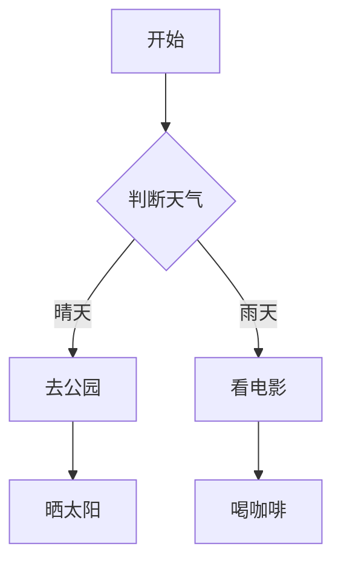

                 

Certainly! Let's break down the task step by step to ensure we cover all the necessary elements and maintain a logical flow in our technical blog post.

### Step 1: Define the Structure

First, we need to define the overall structure of the blog post. This will include the title, key sections, and the content within each section.

**Title:** Modern Urban Micro-Adventure: Immersive Experience Design for City Escape Room Games

**Keywords:** Immersive Experience Design, City Escape Room Games, Urban Exploration, Interactive Puzzle Design, Immersive Storytelling

**Abstract:** This article delves into the design principles and techniques for creating immersive urban escape room experiences, focusing on the interactive elements and puzzle design that enhance player engagement and storytelling.

### Step 2: Plan the Content for Each Section

**Introduction**
- Brief overview of urban escape room games.
- Importance of immersive experience design.
- Overview of the article structure.

**Part 1: Urban Escape Room Background and Core Concepts**
- **Chapter 1: Urban Escape Room Overview**
  - Evolution from physical to virtual escape rooms.
  - Market status and player engagement.
  - Unique aspects and player experience.
- **Chapter 2: Core Elements and Design Principles**
  - Key elements of escape room games.
  - Principles of urban environment selection.
  - Design strategies for urban escape rooms.

**Part 2: Interactive and Puzzle Design**
- **Chapter 3: Interactive Design**
  - Principles of interactive design.
  - Implementation of interactive elements.
  - Evaluation and improvement of interactive experiences.
- **Chapter 4: Puzzle Design and Solving Strategies**
  - Principles of puzzle design.
  - Types of puzzles and their design methods.
  - Strategies for solving individual and multi-puzzle scenarios.

**Part 3: Immersive Storytelling and Experience Optimization**
- **Chapter 5: Storyline and Character Design**
  - Construction of game narratives.
  - Plot twists and player role development.
- **Chapter 6: Experience Optimization**
  - Enhancing interactivity and immersion.
  - Adjusting game difficulty.
  - Post-game reflection and improvements.

**Conclusion**
- Summary of key takeaways.
- Future trends and potential innovations in urban escape room design.

### Step 3: Write the Content

With the structure and content plan in place, we can now start writing the actual content. This will involve:

- Descriptive paragraphs to introduce concepts and principles.
- Use of tables, diagrams, and flowcharts (in Markdown format) to illustrate points.
- Detailed explanations and examples to clarify complex ideas.
- Code snippets and mathematical models to demonstrate algorithms and concepts.
- Practical tips and conclusions for each section.

### Step 4: Add Author Information and Final Touches

- Include the author information at the end of the article.
- Ensure all sections are well-connected and flow logically.
- Review for coherence, grammar, and clarity.

### Step 5: Compile and Finalize

- Compile all sections into a single document.
- Check for consistency in formatting and language.
- Finalize the document, ensuring it meets the word count requirement.

By following these steps, we can create a comprehensive and engaging technical blog post that explores the intricacies of urban escape room game design. Let's get started with writing each section in detail!# 现代都市微型探险：城市密室逃脱游戏的沉浸式体验设计

## 关键词：沉浸式体验设计、城市密室逃脱游戏、互动设计、谜题设计、叙事设计

## 摘要：本文探讨了现代都市微型探险——城市密室逃脱游戏的设计理念与实践，分析了如何通过沉浸式体验设计来提升玩家的互动性和参与感，重点关注互动设计与谜题设计在营造丰富故事情节和提升游戏体验中的作用。

## 引言

随着现代科技的迅猛发展，城市密室逃脱游戏作为一种新兴的娱乐形式，正在全球范围内迅速兴起。这类游戏不仅要求玩家具备逻辑思维和协作能力，更需要在短时间内沉浸在游戏中，解决一系列精心设计的谜题和挑战。沉浸式体验设计在城市密室逃脱游戏中扮演着至关重要的角色，它不仅能够提升玩家的参与度，还能够增强游戏的吸引力和可玩性。

本文将首先介绍城市密室逃脱游戏的发展背景和市场现状，接着深入探讨游戏设计的核心要素，包括互动设计和谜题设计。最后，我们将讨论如何通过优化游戏体验和提升叙事质量来打造一款成功的城市密室逃脱游戏。

## 城市密室逃脱游戏的发展背景

城市密室逃脱游戏起源于20世纪初的桌面游戏，随后随着电子游戏的兴起，逐渐发展成为一种融合了现实与虚拟互动的新型游戏形式。实体密室逃脱游戏最初出现在日本，随后迅速在全球范围内传播，形成了庞大的市场。

### 从实体密室逃脱到虚拟密室逃脱的演变

实体密室逃脱游戏要求玩家在限定时间内解决一系列谜题，以逃脱密闭的空间。这种游戏形式以其高度互动和团队合作的特点吸引了大量玩家。然而，实体密室逃脱游戏存在一些局限性，如场地限制、成本高和运营难度大等。

随着虚拟现实（VR）和增强现实（AR）技术的发展，虚拟密室逃脱游戏应运而生。虚拟密室逃脱游戏不仅克服了实体密室逃脱游戏的局限性，还能够提供更加沉浸式的游戏体验。玩家可以在虚拟环境中自由探索，与虚拟角色互动，解决复杂的谜题和挑战。

### 城市密室逃脱游戏的市场现状

目前，城市密室逃脱游戏已经成为一种流行的娱乐形式，吸引了各个年龄段的玩家。据统计，全球城市密室逃脱游戏市场在近几年内持续增长，预计未来几年内仍将保持高速增长态势。

城市密室逃脱游戏市场的快速增长主要得益于以下几个因素：

1. **技术创新**：虚拟现实和增强现实技术的进步为城市密室逃脱游戏提供了更加沉浸式的体验。
2. **市场需求**：人们对新鲜事物和互动娱乐的需求不断增长，城市密室逃脱游戏正好满足了这一需求。
3. **营销策略**：城市密室逃脱游戏公司通过社交媒体和网络平台积极推广，吸引了大量玩家。

### 城市密室逃脱游戏的特点与吸引力

城市密室逃脱游戏具有以下几个显著特点：

1. **高度互动性**：玩家需要通过实际操作和团队合作来解决问题，这种互动性大大增强了游戏的趣味性和挑战性。
2. **沉浸式体验**：虚拟密室逃脱游戏通过虚拟现实技术，为玩家提供了一个完全沉浸式的游戏环境。
3. **多样性和创新性**：城市密室逃脱游戏通常围绕不同的主题进行设计，如历史、科幻、恐怖等，这种多样性和创新性满足了不同玩家的需求。
4. **强社交属性**：城市密室逃脱游戏鼓励团队合作，玩家之间可以互相协作，共同完成任务。

这些特点使得城市密室逃脱游戏成为一种极具吸引力的娱乐形式，不仅吸引了大量玩家，也为游戏设计者提供了广阔的创作空间。

### 城市密室逃脱游戏的核心概念

城市密室逃脱游戏的核心概念主要包括以下几个要素：

1. **游戏场景**：游戏场景是玩家进行游戏活动的主要场所，通常是一个具有特定主题的虚拟环境。游戏场景的设计需要考虑空间布局、装饰元素和互动设备等因素。
2. **谜题设计**：谜题设计是城市密室逃脱游戏的核心元素之一，玩家需要通过解决谜题来推动游戏进程。谜题的设计需要具有挑战性和趣味性，同时要与游戏主题相契合。
3. **角色设定**：角色设定是游戏情节的重要组成部分，玩家需要扮演特定的角色来完成任务。角色设定不仅要具有个性和特点，还要与游戏主题相符。
4. **互动设计**：互动设计是城市密室逃脱游戏的重要组成部分，包括与虚拟环境的互动、与其他玩家的互动以及与游戏角色的互动。互动设计需要考虑玩家的参与度和沉浸感。

通过以上核心概念的设计和实现，城市密室逃脱游戏能够为玩家提供丰富的游戏体验，满足他们的互动和挑战需求。

### 城市密室逃脱游戏与主题公园的区别

城市密室逃脱游戏与主题公园在游戏形式、体验方式和目标受众上存在显著差异：

1. **游戏形式**：城市密室逃脱游戏通常以团队协作的方式展开，玩家需要解决一系列谜题和挑战。而主题公园则主要以游乐设施和表演为主，游客可以体验各种刺激和娱乐项目。
2. **体验方式**：城市密室逃脱游戏强调互动性和沉浸式体验，玩家需要积极参与游戏过程，解决问题。而主题公园则更多是观赏和体验，游客可以在各种游乐设施中享受乐趣。
3. **目标受众**：城市密室逃脱游戏的目标受众主要是年轻人群和追求新鲜体验的玩家。而主题公园则适合各个年龄段的游客，尤其是家庭游客。

尽管两者存在差异，但它们都可以为人们提供丰富的娱乐体验，满足不同游客的需求。

### 城市密室逃脱游戏与线上解谜游戏的对比

城市密室逃脱游戏与线上解谜游戏在互动性、体验方式和设计目标上存在显著差异：

1. **互动性**：城市密室逃脱游戏强调现实中的互动和团队合作，玩家需要共同解决问题。而线上解谜游戏主要依赖于虚拟互动，玩家通常独立完成任务。
2. **体验方式**：城市密室逃脱游戏提供的是一种沉浸式的现场体验，玩家可以在虚拟环境中自由探索和互动。而线上解谜游戏则是基于互联网的平台，玩家通过网页或应用程序进行游戏。
3. **设计目标**：城市密室逃脱游戏的设计目标是创造一种真实的游戏体验，强调互动和团队合作。而线上解谜游戏则更多关注谜题的设计和解题过程，强调智力挑战。

尽管两者存在差异，但它们都可以为玩家提供丰富的游戏体验，各有其独特的魅力。

### 城市密室逃脱游戏的未来发展趋势

随着科技的不断进步和玩家需求的多样化，城市密室逃脱游戏未来的发展趋势将主要体现在以下几个方面：

1. **技术创新**：虚拟现实（VR）和增强现实（AR）技术的应用将进一步提升城市密室逃脱游戏的沉浸感和互动性，为玩家提供更加真实的游戏体验。
2. **主题多样化**：城市密室逃脱游戏将继续推出各种主题，满足不同玩家的兴趣和需求。例如，历史主题、科幻主题、恐怖主题等，都将吸引大量玩家。
3. **社交属性增强**：城市密室逃脱游戏将更加注重社交互动，鼓励玩家之间进行合作和交流。未来，游戏平台可能会引入更多社交功能，如玩家评价、社区互动等。
4. **跨平台发展**：随着互联网和移动互联网的普及，城市密室逃脱游戏将不仅仅局限于实体场所，还将通过线上平台为玩家提供更多的游戏选择。

总之，城市密室逃脱游戏作为一种新兴的娱乐形式，其未来发展前景广阔，有望成为人们生活中的一种重要娱乐方式。

### 本章小结

本章首先介绍了城市密室逃脱游戏的发展背景，从实体密室逃脱到虚拟密室逃脱的演变，以及当前市场的现状。接着，我们分析了城市密室逃脱游戏的特点与吸引力，包括高度互动性、沉浸式体验、多样性和强社交属性。随后，我们探讨了城市密室逃脱游戏的核心概念，如游戏场景、谜题设计、角色设定和互动设计。最后，我们对比了城市密室逃脱游戏与主题公园和线上解谜游戏的差异，并展望了其未来的发展趋势。通过本章的介绍，我们对于城市密室逃脱游戏有了更加全面和深入的了解。

### 城市密室逃脱游戏的设计要素

城市密室逃脱游戏的设计不仅仅是为了娱乐，更是一种艺术创作，它需要精心规划每一个细节，以确保玩家能够在其中获得沉浸式的体验。设计要素包括游戏场景、互动设计、谜题设计和叙事设计。以下将详细探讨这些设计要素及其重要性。

#### 游戏场景

游戏场景是城市密室逃脱游戏的基础，它决定了玩家是否会沉浸于游戏之中。设计一个成功的游戏场景需要考虑以下几个方面：

1. **空间布局**：游戏场景的空间布局需要合理，确保玩家在游戏过程中能够自由移动，不会感到拥挤或迷失方向。例如，一个博物馆主题的游戏场景可能会包含多个展览室，每个展览室都有自己的特定内容和谜题。

2. **装饰元素**：装饰元素是营造氛围的关键。通过使用特定的装饰，如古董、艺术品或科技设备，可以增强游戏场景的真实性和主题感。

3. **互动设备**：互动设备是玩家在游戏场景中与游戏进行互动的媒介。例如，密码锁、触摸屏、投影仪等，这些设备不仅增加了游戏的趣味性，还提高了玩家的参与度。

4. **视觉与声音设计**：视觉和声音设计对于营造沉浸式体验至关重要。通过合适的灯光效果、音效和背景音乐，可以增强游戏场景的氛围，让玩家更加投入。

#### 互动设计

互动设计是城市密室逃脱游戏的核心，它决定了玩家如何与游戏进行交互。以下是一些关键点：

1. **多样性**：互动设计应多样化，包括与游戏场景的互动、与其他玩家的互动以及与虚拟角色的互动。这种多样性可以增加游戏的趣味性和挑战性。

2. **流畅性**：互动流程应流畅，避免出现卡顿或误导玩家的设计。例如，玩家在解开一个密码锁时，应能立即看到反馈，而不会等待过长的时间。

3. **反馈设计**：互动反馈设计对于玩家的体验至关重要。当玩家做出正确或错误的选择时，游戏应提供明确的反馈，以帮助他们理解游戏规则和谜题解决方案。

4. **虚拟现实与增强现实技术的应用**：随着VR和AR技术的进步，这些技术在城市密室逃脱游戏中的应用越来越广泛。通过VR和AR技术，玩家可以获得更加真实的互动体验，增强游戏的沉浸感。

#### 谜题设计

谜题设计是城市密室逃脱游戏的重要组成部分，它需要考虑以下几个要素：

1. **难度层次**：谜题应具备不同的难度层次，以满足不同玩家的需求。从简单的线索到复杂的逻辑推理，谜题的难度设计需要合理分布。

2. **趣味性**：谜题不仅要具有挑战性，还应该有趣。通过有趣的故事情节和创意设计，可以吸引玩家积极参与。

3. **创新性**：谜题的设计应具有创新性，避免使用陈旧的谜题类型。创新性谜题可以增加游戏的独特性和吸引力。

4. **关联性**：谜题之间应具有一定的关联性，确保玩家在解决一个谜题后能够自然地过渡到下一个谜题。这种关联性可以增强游戏的连贯性和沉浸感。

#### 叙事设计

叙事设计是城市密室逃脱游戏的重要组成部分，它决定了游戏的情节和角色发展。以下是一些关键点：

1. **故事线的构建**：一个成功的故事线应该具有吸引力和连贯性，能够引导玩家在游戏过程中逐渐了解背景故事。

2. **情节转折的设计**：情节转折是故事发展的关键，它可以在游戏中引入新的线索或挑战，增加游戏的紧张感和趣味性。

3. **角色设定**：角色设定是叙事设计的基础，每个角色都应该具有独特的个性和背景故事。通过角色之间的互动，可以增强游戏的情节发展。

4. **情感共鸣**：叙事设计应能够引发玩家的情感共鸣，让玩家在游戏过程中产生共鸣和情感投入。

通过上述设计要素的合理应用，城市密室逃脱游戏可以提供丰富的游戏体验，满足玩家的互动和挑战需求。在接下来的章节中，我们将进一步探讨如何通过互动设计和谜题设计来提升玩家的游戏体验。

### 场景选择的原则

在设计城市密室逃脱游戏时，场景选择是至关重要的一步。一个合适且精心设计的场景不仅能够提升玩家的沉浸感，还能有效地引导玩家进入游戏情境，激发他们的好奇心和探索欲望。以下是一些关键原则，可以帮助我们在选择游戏场景时做出明智的决策。

#### 城市环境的选择

1. **地域特色**：选择具有地域特色的场景可以增强游戏的吸引力。例如，可以选择著名的历史建筑、地标性景点或独特的城市街区。这些地方不仅具备视觉上的吸引力，还能够为游戏设定提供丰富的背景故事和线索。

2. **文化背景**：文化背景是场景选择的重要因素之一。通过融入特定的文化元素，如传统节日、历史事件或民间传说，可以增强游戏的独特性和深度。例如，一个以古埃及为主题的密室逃脱游戏可以包含金字塔、木乃伊等元素，营造出神秘的氛围。

3. **多样性**：在游戏场景选择上，应考虑多样性的原则。多样化的场景不仅可以满足不同玩家的兴趣和需求，还可以提供丰富的游戏体验。例如，可以设计一个包含多个主题的场景，如科技、历史、文学等，让玩家在游戏中不断发现新的惊喜。

#### 场景真实性的考量

1. **逼真度**：场景的真实性对于沉浸式体验至关重要。通过精细的细节设计和逼真的装饰，可以营造出令人信服的游戏环境。例如，使用高质量的照片或3D建模技术来还原现实世界的场景，可以让玩家在游戏中感受到真实的氛围。

2. **一致性**：场景设计应保持一致性，避免出现矛盾或不合理的地方。例如，在一个以未来科技为主题的场景中，所有道具和装饰都应与未来科技风格相符，避免出现现代或古代元素。

3. **互动性**：场景的互动性是提升玩家沉浸感的重要因素。设计时应考虑玩家如何在场景中与游戏元素互动，如开门、触摸、解谜等。通过增加互动元素，可以增强玩家对场景的参与度和投入感。

#### 场景的功能性

1. **空间利用**：场景的空间利用应合理，确保玩家在游戏过程中能够自由移动，不会感到拥挤或受限。通过合理安排空间布局，可以提升游戏的流畅性和互动性。

2. **功能分区**：场景应划分为不同的功能区域，如解谜区、休息区、道具区等。这样的设计可以增强游戏的结构感和逻辑性，让玩家能够更清晰地理解游戏进程。

3. **道具布置**：道具的布置应具有目的性和逻辑性。通过合理布置道具，可以引导玩家探索场景，找到隐藏的线索和谜题。例如，在一个以博物馆为主题的场景中，可以设计一些与展品相关的谜题，让玩家在参观过程中逐步解开谜团。

#### 场景故事线与情节设计

1. **故事线的连贯性**：场景的故事线应保持连贯性，确保玩家在游戏过程中能够理解情节的发展。通过设计合理的情节转折和线索引导，可以增强故事的吸引力和沉浸感。

2. **情节的趣味性**：故事情节应具备趣味性，通过引入悬念、惊喜和挑战，可以激发玩家的兴趣和参与度。例如，可以设计一些幽默的对话或出人意料的结局，让玩家在游戏中保持兴奋和好奇。

3. **角色互动**：在场景设计中，应考虑角色之间的互动。通过角色之间的对话和行动，可以增强故事情节的真实感和吸引力。例如，可以设计一些角色之间的冲突或合作，让玩家在游戏中感受到紧张和刺激。

通过以上原则，我们可以选择和设计出既具有吸引力又具备互动性的城市密室逃脱场景，为玩家提供丰富的游戏体验。

### 场景设计的具体方法

在设计了城市密室逃脱游戏的总体场景选择原则后，接下来的关键步骤是实现这些设计原则。具体设计方法包括空间布局与空间利用、装置设计、装饰元素的设计以及场景故事线与情节设计。

#### 空间布局与空间利用

1. **空间布局**：
   - **功能分区**：根据游戏需求，将空间划分为不同的功能区域，如入口、休息区、道具区、解谜区等。每个区域应有明确的用途，以便玩家在游戏中能够清晰定位自己所在的位置和任务目标。
   - **路径设计**：设计合理的路径，使玩家在游戏过程中能够自然流动，不会感到困惑或迷失。路径设计应引导玩家逐步接近谜题的答案，同时提供适当的悬念和惊喜。
   - **动态布局**：利用可移动的道具和装饰，使空间布局具有一定的动态性，增强游戏的趣味性和挑战性。例如，某些门或墙壁可以隐藏或移动，使玩家需要仔细观察和探索来找到正确的路径。

2. **空间利用**：
   - **最大化利用**：充分利用空间，避免浪费或空旷的感觉。通过合理的道具和装饰布局，填满每个角落，使空间显得充实而有趣。
   - **层次感**：设计多层结构的空间，增加游戏的深度和探索感。例如，设计地下室或上层阁楼，玩家需要通过解谜或找到特定的线索才能进入。

#### 装置设计

1. **装置选择**：
   - **功能性**：选择具有实际功能的装置，如密码锁、电子门锁、触摸屏等，使玩家在游戏中需要进行操作和互动。
   - **装饰性**：装置不仅需要具有功能性，还应具有装饰性，与场景主题相符。例如，在一个以工业为主题的场景中，可以使用旧式机械装置，增加场景的历史感和真实感。

2. **装置布局**：
   - **合理布局**：将装置合理布局在空间中，使玩家能够自然地发现并使用它们。避免将装置隐藏得太深或放置在不易发现的位置，影响游戏体验。
   - **互动性**：装置应具有一定的互动性，通过操作装置，玩家可以解锁新的区域或获得线索。例如，一个看起来像旧式收音机的装置，可能实际上是一个隐藏的录音机，玩家需要解密录音中的信息。

#### 装饰元素的设计

1. **装饰选择**：
   - **主题相关**：装饰应与场景主题紧密相关，增强场景的真实感和沉浸感。例如，在一个以海盗为主题的场景中，可以使用海盗船、骷髅、旗帜等装饰元素。
   - **视觉冲击**：装饰应具有视觉冲击力，吸引玩家的注意力。通过色彩、形状、材质等方面的设计，创造出引人入胜的视觉效果。

2. **装饰布局**：
   - **层次感**：装饰应具有层次感，从地面到天花板，从背景到前景，应有不同的装饰元素，创造出丰富的视觉层次。
   - **细节处理**：细节是装饰设计的关键，通过精细的细节处理，使场景更加真实和逼真。例如，在墙壁上绘制壁画，在地面上铺设古老的木地板，都能增强场景的真实感。

#### 场景故事线与情节设计

1. **故事线构建**：
   - **主线故事**：设计一个引人入胜的主线故事，讲述一个引人入胜的故事情节，引导玩家进入游戏情境。例如，一个被绑架的角色需要玩家帮助逃脱，或者一个宝藏需要玩家去寻找。
   - **支线故事**：设计一些支线故事，增加游戏的深度和复杂性。支线故事可以提供额外的线索或奖励，使玩家在主线故事之外有更多的探索和挑战。

2. **情节转折**：
   - **悬念设置**：在情节中设置悬念，增加游戏的紧张感和吸引力。例如，在一个谜题解开后，突然出现新的线索或挑战，使玩家感到意外和兴奋。
   - **情节发展**：设计合理的情节发展，使玩家在游戏过程中能够逐步了解故事背景和谜题的答案。通过情节的层层递进，引导玩家一步步接近最终目标。

3. **角色设定**：
   - **角色背景**：为每个角色设计一个详细的背景故事，使角色具有独特的个性和动机。角色之间的互动和对话可以增强情节的连贯性和真实性。
   - **角色成长**：设计角色的成长轨迹，使角色在游戏过程中有所变化和发展。例如，一个原本胆小的玩家在游戏过程中逐渐变得勇敢和自信。

#### 综合应用

将上述设计方法综合应用，可以打造出既具有吸引力又具备互动性的城市密室逃脱场景。通过精心设计的空间布局、装置和装饰元素，以及丰富的故事情节，可以为玩家提供独特的游戏体验，使他们在游戏中沉浸其中，享受解谜和探索的乐趣。

### 场景体验的优化

在城市密室逃脱游戏中，场景体验的优化是确保玩家获得最佳游戏体验的关键步骤。以下将探讨如何增强互动性、提升沉浸感以及调整游戏难度，并提供具体的优化方法和技巧。

#### 增强互动性

1. **多样化互动元素**：
   - **多感官互动**：通过视觉、听觉、触觉等多种感官与玩家互动，增强游戏的参与感。例如，使用虚拟现实（VR）或增强现实（AR）技术，让玩家在游戏中体验到真实的物理互动，如触碰物体或移动物品。
   - **社交互动**：鼓励玩家之间进行社交互动，提高游戏的协作性和社交属性。例如，设计多人游戏模式，让玩家在游戏中可以互相帮助、交换线索，共同完成任务。

2. **互动流程的流畅性**：
   - **实时反馈**：确保玩家在每个互动环节都能获得即时反馈，帮助他们理解游戏规则和谜题解决方法。例如，当玩家解开一个密码锁时，应立即显示成功的信息或打开门锁，避免延迟或错误。
   - **界面简化**：简化操作界面，使玩家能够快速理解和操作。避免复杂的菜单和过多的步骤，确保游戏流程的流畅性。

3. **互动反馈的设计**：
   - **积极反馈**：设计积极的互动反馈，激励玩家继续参与。例如，当玩家解决一个难题时，可以给予奖励或成就，提升他们的成就感和动力。
   - **错误处理**：设计合理的错误处理机制，帮助玩家在遇到困难时找到解决方案。例如，当玩家输入错误的密码时，可以提供提示或解释错误的性质，而不是直接失败。

#### 提升沉浸感

1. **视觉与声音设计**：
   - **高清晰度图像**：使用高清晰度的图像和动画，提升游戏场景的真实感。通过精细的细节处理，让玩家在视觉上感受到游戏的质感。
   - **背景音乐**：使用与场景主题相符的背景音乐，增强游戏氛围。音乐应具有情感共鸣，帮助玩家更好地沉浸在游戏世界中。

2. **故事叙述**：
   - **引人入胜的故事**：设计一个引人入胜的故事线，引导玩家在游戏中不断探索和发现。通过角色的对话和情节的发展，增强故事的连贯性和吸引力。
   - **情感共鸣**：通过故事中的情感元素，与玩家产生共鸣。例如，设计一些感人的情节或挑战，让玩家在游戏中体验到情感上的波动和成长。

3. **虚拟现实与增强现实技术的融合**：
   - **VR与AR的融合**：将虚拟现实和增强现实技术结合起来，提供更加沉浸式的体验。例如，使用VR头盔模拟一个真实的游戏场景，同时通过AR技术将虚拟角色和物品映射到现实世界中，增强互动感和现实感。

#### 调整游戏难度

1. **难度分层**：
   - **初级难度**：为初学者提供较为简单的游戏难度，帮助他们熟悉游戏规则和操作方式。例如，设计一些简单的线索和解谜任务，减少游戏的学习成本。
   - **中级难度**：为中等水平的玩家提供适中的游戏难度，挑战他们的思维能力和团队协作能力。设计一些中等难度的谜题和挑战，使玩家在解决过程中感到一定的挑战和成就感。
   - **高级难度**：为高级玩家提供高难度的游戏内容，考验他们的智慧和应变能力。设计一些复杂的谜题和挑战，使玩家在游戏中体验到极致的挑战和成就感。

2. **动态难度调整**：
   - **难度适应**：根据玩家的表现和反馈，动态调整游戏难度。例如，当玩家连续多次失败时，可以降低难度，帮助他们重新建立信心；当玩家连续多次成功时，可以增加难度，提供更高的挑战。
   - **线索提示**：在玩家遇到困难时，提供适当的线索提示，帮助他们解决难题。通过控制线索的提供时机和方式，可以在不降低游戏挑战性的同时，帮助玩家顺利完成任务。

3. **关卡设计**：
   - **多样化关卡**：设计多样化的关卡，提供不同的游戏体验和挑战。例如，设计一些时间限制的关卡，增加游戏的紧张感和竞争性；设计一些逻辑推理的关卡，增强游戏的智慧和策略性。
   - **关卡连接**：设计合理的关卡连接，使玩家在完成一个关卡后能够自然地过渡到下一个关卡。通过设计连贯的关卡流程，增强玩家的沉浸感和游戏体验。

通过上述方法，我们可以有效地优化城市密室逃脱游戏的场景体验，提升游戏的互动性和沉浸感，同时提供合理的游戏难度，满足不同玩家的需求。在接下来的章节中，我们将进一步探讨谜题设计的原则和策略，为玩家带来丰富的游戏体验。

### 本章小结

本章详细探讨了城市密室逃脱游戏场景设计的具体方法。首先，介绍了空间布局与空间利用的原则，包括功能分区、路径设计和动态布局。接着，讨论了装置设计的要点，如装置选择和布局，强调了装饰元素的设计原则，包括主题相关和视觉冲击。最后，讲述了场景故事线与情节设计的方法，从故事线的构建、情节转折的设计到角色设定，为玩家营造了丰富的游戏体验。通过这些具体方法的综合应用，我们能够打造出既具有吸引力又具备互动性的城市密室逃脱场景，为玩家带来独特的游戏体验。接下来，我们将深入探讨互动设计和谜题设计在提升玩家体验中的关键作用。

### 互动设计

互动设计是城市密室逃脱游戏的重要组成部分，它直接决定了玩家的游戏体验和参与度。成功的互动设计不仅能够增强游戏的趣味性和挑战性，还能提升玩家的沉浸感和满意度。以下将详细介绍互动设计的原则、实现方法和具体案例。

#### 互动设计的原则

1. **多样性**：互动设计应涵盖多种形式，包括物理互动、虚拟互动和社交互动。多样化的互动元素可以满足不同玩家的兴趣和需求，增加游戏的趣味性和可玩性。

2. **流畅性**：互动流程应流畅自然，避免卡顿或误导玩家。玩家在互动过程中应能迅速获得反馈，理解游戏规则和操作方法。

3. **反馈设计**：互动反馈应明确和及时，帮助玩家理解自己的操作是否正确。例如，当玩家解开一个密码锁时，应立即听到“成功”的声音或看到锁打开的动画。

4. **适应性**：互动设计应具备适应性，根据玩家的表现和反馈动态调整互动难度和方式。例如，当玩家连续失败时，可以提供更详细的线索或简化操作。

#### 实现方法

1. **物理互动**：
   - **设备选择**：选择适合场景的互动设备，如密码锁、触屏、投影仪等。
   - **互动流程**：设计合理的互动流程，确保玩家能够轻松操作。例如，一个密码锁应易于理解和使用，避免复杂操作。

2. **虚拟互动**：
   - **虚拟现实（VR）**：利用VR技术，为玩家提供沉浸式的游戏体验。例如，通过VR头盔，玩家可以进入一个完全虚拟的游戏场景，与虚拟角色互动。
   - **增强现实（AR）**：通过AR技术，将虚拟元素叠加到现实世界中，增强互动性。例如，使用AR应用程序，玩家可以在现实环境中找到隐藏的虚拟线索或物品。

3. **社交互动**：
   - **多人模式**：设计多人模式，鼓励玩家之间进行合作和互动。例如，玩家可以互相交换线索或共同解决难题。
   - **在线互动**：利用在线平台，玩家可以分享游戏体验，讨论策略或挑战好友。例如，游戏可以提供在线排行榜或社区功能，增加社交互动。

#### 具体案例

1. **案例1：虚拟现实（VR）逃脱游戏**：
   - **场景**：一个以太空为主题的逃脱游戏，玩家需要进入一个虚拟的太空舱。
   - **互动**：玩家通过VR头盔进入游戏，需要解密太空舱的控制系统，找到逃生的路径。互动包括操作触摸屏、使用电子设备等。
   - **反馈**：每次操作后，玩家都会听到相应的声音或看到屏幕上的反馈，帮助他们理解操作是否正确。

2. **案例2：增强现实（AR）逃脱游戏**：
   - **场景**：一个以博物馆为主题的逃脱游戏，玩家需要在一个现实博物馆中找到隐藏的线索。
   - **互动**：玩家使用AR应用程序扫描博物馆中的展品，解锁隐藏的线索或谜题。互动包括扫描、触摸和移动。
   - **反馈**：应用程序会显示线索或谜题的答案，帮助玩家理解游戏进程。

3. **案例3：多人合作逃脱游戏**：
   - **场景**：一个以恐怖为主题的逃脱游戏，玩家需要在一个鬼屋中合作逃脱。
   - **互动**：玩家通过手机或平板电脑进入游戏，可以与其他玩家进行语音或文字聊天，共同解决难题。
   - **反馈**：游戏中会显示其他玩家的位置和状态，帮助他们更好地协作。

通过以上案例，我们可以看到，互动设计在提升城市密室逃脱游戏体验中的重要作用。通过多样化的互动形式、流畅的互动流程和及时的反馈设计，玩家可以沉浸在游戏世界中，享受解谜和探索的乐趣。

### 互动元素的具体实现

在互动设计的过程中，选择合适的互动元素并确保其具体实现是提升玩家游戏体验的关键。以下将详细介绍几种常见的互动元素及其实现方法，包括操作界面设计、音效与视觉效果的运用，以及虚拟现实与增强现实技术的融合。

#### 操作界面设计

1. **简洁直观**：
   - **原则**：操作界面应简洁直观，减少玩家学习成本。避免使用复杂的菜单和冗长的操作步骤。
   - **实现**：使用清晰的图标和简短的文字说明，引导玩家快速了解如何操作。例如，在解谜游戏中，可以使用按钮或滑动操作来解锁道具或进入新的场景。

2. **适应性**：
   - **原则**：界面设计应具备适应性，根据玩家的设备和使用习惯进行调整。
   - **实现**：使用响应式设计，确保界面在不同设备和屏幕尺寸上都能正常显示。例如，在手机上使用大号按钮，在电脑上使用详细的图标和说明。

3. **动态反馈**：
   - **原则**：界面设计应提供动态反馈，帮助玩家理解操作结果。
   - **实现**：在玩家进行操作后，界面应立即显示反馈信息，如成功、失败或需要进一步操作。例如，当玩家输入密码时，界面应显示密码是否正确，并提示下一步操作。

#### 音效与视觉效果的运用

1. **音效设计**：
   - **背景音乐**：选择与游戏主题相符的背景音乐，增强氛围感。例如，在恐怖主题的游戏中，可以使用紧张的背景音乐来营造紧张气氛。
   - **音效反馈**：为玩家的操作提供相应的音效反馈，增强互动感。例如，当玩家解开一个密码锁时，可以听到锁打开的声音。

2. **视觉效果**：
   - **场景渲染**：使用高质量的图像和动画技术，提升场景的真实感和沉浸感。例如，通过光影效果和纹理细节，使场景更加逼真。
   - **动态效果**：添加动态效果，如动画、过渡和粒子效果，提升视觉吸引力。例如，当玩家解谜成功时，可以出现闪光或爆炸效果，增强成就感。

3. **动画设计**：
   - **角色动画**：为角色设计生动的动画，增加游戏的互动性和趣味性。例如，角色在玩家操作时可以做出相应的动作，如点头或挥手。
   - **界面动画**：界面动画可以提升用户操作的流畅性和互动感。例如，当玩家点击按钮时，按钮可以出现轻微的震动或颜色变化。

#### 虚拟现实与增强现实技术的融合

1. **虚拟现实（VR）**：
   - **沉浸式体验**：通过VR技术，为玩家提供一个完全沉浸式的游戏环境。例如，玩家可以通过VR头盔进入一个虚拟的密室，与虚拟角色互动。
   - **互动控制**：使用手柄或身体动作进行控制，提供更加真实的互动体验。例如，玩家可以通过手势操作虚拟物品，解开密码锁或打开门。

2. **增强现实（AR）**：
   - **现实与虚拟的结合**：通过AR技术，将虚拟元素叠加到现实世界中，增加互动性。例如，玩家可以使用手机或平板电脑扫描现实中的物体，解锁虚拟线索。
   - **实时反馈**：AR应用可以提供实时的反馈信息，帮助玩家理解游戏进程。例如，玩家在现实环境中看到虚拟的线索或谜题，并通过手机或平板电脑进行操作。

3. **混合现实（MR）**：
   - **全场景互动**：混合现实技术结合了VR和AR的优势，为玩家提供更加全面的互动体验。例如，玩家在现实环境中可以看到虚拟角色和物品，并通过身体动作进行互动。

通过上述方法，我们可以实现丰富多样的互动元素，为玩家带来更加沉浸式和互动性的游戏体验。这些互动元素的巧妙运用不仅能够提升玩家的游戏乐趣，还能增强游戏的吸引力和竞争力。

### 互动体验的评估

互动体验的评估是确保城市密室逃脱游戏设计成功的重要环节。通过用户体验测试、互动效果的改进和设计的迭代，我们可以不断优化游戏体验，满足玩家的需求。

#### 用户体验测试

1. **测试方法**：
   - **A/B测试**：通过对比不同设计的互动元素，评估哪种设计更受欢迎和有效。例如，测试不同操作界面的用户反应，找到最佳的设计方案。
   - **问卷调查**：收集玩家的反馈和意见，了解他们对游戏互动体验的满意度。通过分析问卷结果，找到需要改进的方面。

2. **测试目的**：
   - **识别问题**：通过用户体验测试，识别游戏中存在的交互问题和用户痛点，如界面复杂、操作困难等。
   - **改进设计**：根据测试结果，对互动设计进行改进，优化用户体验。

#### 互动效果的改进

1. **界面优化**：
   - **简洁性**：简化操作界面，减少用户的学习成本。例如，使用直观的图标和简短的文字说明。
   - **反馈机制**：增强互动反馈，确保用户每次操作后都能获得明确的反馈。例如，添加音效或视觉提示，帮助用户理解操作结果。

2. **操作流畅性**：
   - **响应速度**：提高系统响应速度，确保用户在操作时能够迅速获得反馈。例如，优化代码和图形渲染，减少延迟。
   - **操作引导**：提供操作引导，帮助新手玩家快速上手。例如，在游戏初期提供简单的教程，介绍游戏规则和操作方法。

3. **音效与视觉效果**：
   - **氛围营造**：使用合适的音效和视觉效果，增强游戏氛围。例如，在恐怖场景中使用低音效和阴暗的背景音乐，营造紧张氛围。
   - **动态效果**：增加动态效果，提升互动性。例如，使用动画效果显示角色动作，增强用户的沉浸感。

#### 设计的迭代

1. **迭代过程**：
   - **持续改进**：根据用户体验测试和互动效果改进，持续对游戏设计进行迭代。每次迭代都应包含小规模的测试和反馈，确保设计不断完善。
   - **版本更新**：定期发布新版本，引入新的互动元素和改进功能，保持游戏的吸引力和新鲜感。

2. **迭代目标**：
   - **优化体验**：通过迭代，不断优化游戏互动体验，提升玩家的满意度和参与度。
   - **创新设计**：鼓励创新，探索新的互动设计方法，为玩家提供独特的游戏体验。

通过用户体验测试、互动效果的改进和设计的迭代，我们可以不断提升城市密室逃脱游戏的互动体验，满足玩家的需求，提高游戏的吸引力和竞争力。

### 本章小结

本章详细探讨了城市密室逃脱游戏中的互动设计，包括其原则、实现方法和具体案例。互动设计不仅提升了游戏的趣味性和挑战性，还增强了玩家的沉浸感。我们介绍了操作界面设计、音效与视觉效果的运用，以及虚拟现实与增强现实技术的融合。此外，通过用户体验测试、互动效果的改进和设计的迭代，我们不断优化互动体验，以满足玩家的需求。在接下来的章节中，我们将进一步探讨谜题设计的原则和策略，为玩家带来丰富的游戏体验。

### 谜题设计

谜题设计是城市密室逃脱游戏的核心要素之一，它决定了游戏的可玩性和玩家的挑战乐趣。成功的谜题设计不仅要具有挑战性，还要能够引导玩家在游戏中逐步探索和解决问题。以下将详细讨论谜题设计的原则、不同类型的谜题及其设计方法。

#### 谜题设计的原则

1. **难度层次**：
   - **初级难度**：为初学者设计简单易懂的谜题，帮助他们熟悉游戏规则和操作方法。这类谜题通常需要基本的逻辑思维和观察力。
   - **中级难度**：为中等水平的玩家设计有一定挑战性的谜题，需要玩家运用更复杂的逻辑推理和策略能力。
   - **高级难度**：为高级玩家设计复杂且具有挑战性的谜题，需要玩家具备高超的逻辑思维和团队合作能力。

2. **趣味性**：
   - **故事性**：谜题应与游戏主题和情节紧密相连，增强趣味性和代入感。通过有趣的故事背景和情节转折，吸引玩家深入探索。
   - **创新性**：设计具有创新性的谜题，避免使用陈旧的谜题类型，增加游戏的独特性和新鲜感。

3. **关联性**：
   - **线索关联**：谜题之间应具有一定的关联性，使玩家在解决一个谜题后能够自然地过渡到下一个谜题。这种关联性可以增强游戏的连贯性和沉浸感。

4. **合理性**：
   - **逻辑性**：谜题的设计应具备逻辑性，使玩家在解决过程中能够逐步理解谜题的解决方案。避免设计过于离奇或不合理的谜题，影响玩家的游戏体验。

#### 不同类型的谜题及其设计方法

1. **密码锁类谜题**：
   - **设计原则**：密码锁类谜题通常需要玩家通过解密或找到密码来解锁门或获取关键物品。设计时应确保密码具有逻辑性和独特性，避免过于简单或复杂。
   - **实现方法**：可以通过数学公式、字母排列、数字组合等方式设计密码。例如，一个以历史为主题的密码锁谜题，可以使用与历史事件相关的日期或名称作为密码。

2. **数字谜题**：
   - **设计原则**：数字谜题通常需要玩家通过计算或推理来找到正确的答案。设计时应确保谜题的难度适中，避免过于简单或复杂。
   - **实现方法**：可以通过数学运算、数独、计算题等方式设计数字谜题。例如，一个以科学为主题的数字谜题，可以设计一个关于化学反应的数学计算题。

3. **逻辑推理类谜题**：
   - **设计原则**：逻辑推理类谜题通常需要玩家通过分析逻辑关系来解决问题。设计时应确保谜题的逻辑关系明确且具有挑战性。
   - **实现方法**：可以通过逻辑游戏、推理题、谜语等方式设计逻辑推理类谜题。例如，一个以哲学为主题的逻辑推理谜题，可以设计一个关于哲学命题的逻辑推理题。

4. **综合类谜题**：
   - **设计原则**：综合类谜题结合了多种类型的谜题元素，提供更加丰富和有趣的挑战。设计时应确保谜题的多样性，使玩家在解决过程中不断体验到新的挑战。
   - **实现方法**：可以通过将多种谜题类型结合在一起，设计出复杂的综合类谜题。例如，一个以科技为主题的综合类谜题，可以包含密码锁、数字计算和逻辑推理等多个元素。

#### 谜题设计案例分析

**案例1：密码锁类谜题**
- **背景**：一个以历史为主题的密室，玩家需要解开一个与古埃及金字塔相关的密码锁。
- **谜题**：密码由三个数字组成，每个数字都与古埃及历史事件有关。第一个数字是某位古埃及法老的在位年份，第二个数字是该法老的陵墓编号，第三个数字是该法老陵墓中的宝藏数量。
- **解答**：通过查找古埃及历史资料，玩家可以找到正确的密码，解锁密室。

**案例2：数字谜题**
- **背景**：一个以科学为主题的密室，玩家需要解开一个与化学反应相关的数学计算题。
- **谜题**：玩家需要根据给定的化学反应方程式，计算出反应物和生成物的质量比。
- **解答**：通过应用化学知识和数学计算，玩家可以找到正确的答案，解开密室。

**案例3：逻辑推理类谜题**
- **背景**：一个以哲学为主题的密室，玩家需要解开一个关于哲学命题的逻辑推理题。
- **谜题**：玩家需要根据给定的逻辑关系，推导出某个哲学命题的正确结论。
- **解答**：通过应用逻辑推理方法和哲学知识，玩家可以找到正确的结论，解开密室。

**案例4：综合类谜题**
- **背景**：一个以科技为主题的密室，玩家需要通过多种方式解开谜题。
- **谜题**：玩家需要解开密码锁、完成数学计算题，并找到隐藏的逻辑推理线索，最终获取解密的关键。
- **解答**：通过综合运用密码学、数学和逻辑推理，玩家可以逐步解开谜题，解锁密室。

通过以上案例分析，我们可以看到，不同类型的谜题设计各有特点，但都需要考虑玩家的体验和游戏的整体性。合理的设计和巧妙的谜题设置，可以使玩家在游戏中保持高度的兴趣和参与度，享受解谜的乐趣。

### 谜题解决策略

在城市密室逃脱游戏中，解决谜题是玩家体验的核心环节。有效的解决策略不仅能够帮助玩家顺利完成任务，还能提升游戏的乐趣和挑战性。以下将详细探讨单个谜题的解决策略、多个谜题的组合解决策略以及团队协作解谜策略。

#### 单个谜题的解决策略

1. **逻辑分析**：
   - **观察线索**：首先，仔细观察谜题中提供的线索和提示，找出可能的关键信息。
   - **关联信息**：将不同的线索进行关联分析，尝试找出它们之间的逻辑关系。
   - **验证假设**：根据分析结果，提出假设并进行验证，逐步缩小答案范围。

2. **方法探索**：
   - **知识应用**：运用已有的知识和经验，尝试解决谜题。例如，运用数学公式、历史知识或科学原理。
   - **工具使用**：合理利用游戏中的工具和设备，如计算器、密码锁或特殊道具。
   - **实验验证**：通过试错法，逐步排除错误答案，找到正确解法。

3. **心理调适**：
   - **保持冷静**：遇到困难时，保持冷静，避免冲动和急躁。
   - **调整心态**：将解决谜题视为一个有趣的挑战，保持积极的心态。
   - **休息调整**：适当休息，放松身心，有助于恢复思维敏锐度。

#### 多个谜题的组合解决策略

1. **整体分析**：
   - **全局观念**：将多个谜题视为一个整体，理解它们之间的联系和整体目标。
   - **逻辑推理**：根据已知信息和谜题的关联性，进行逻辑推理，逐步推导出可能的解法。

2. **逐步解决**：
   - **优先级**：确定谜题的优先级，优先解决关键或难度较低的谜题。
   - **逐步推进**：通过逐步解决各个谜题，逐步接近最终目标。

3. **信息整合**：
   - **线索整合**：将不同谜题中获得的线索进行整合，找出关键信息。
   - **综合分析**：将各个谜题的答案整合起来，推导出最终的解法。

#### 团队协作解谜策略

1. **明确分工**：
   - **技能匹配**：根据团队成员的技能和兴趣，分配合适的任务。
   - **角色明确**：明确每个团队成员的角色和职责，确保协作高效。

2. **信息共享**：
   - **沟通交流**：鼓励团队成员之间的沟通交流，分享信息和发现。
   - **协作解决**：共同分析谜题，共同探讨解决方案。

3. **策略调整**：
   - **灵活应对**：根据实际情况，灵活调整策略和计划。
   - **集体决策**：在关键决策时，通过集体讨论和投票，做出最佳选择。

通过以上策略，玩家可以更有效地解决城市密室逃脱游戏中的谜题，提升游戏体验。同时，这些策略也适用于其他需要团队合作和逻辑分析的情境，具有广泛的实用性。

### 本章小结

本章深入探讨了城市密室逃脱游戏中的谜题设计及其解决策略。首先，介绍了谜题设计的原则，包括难度层次、趣味性、关联性和合理性。接着，详细分析了不同类型的谜题及其设计方法，如密码锁类谜题、数字谜题、逻辑推理类谜题和综合类谜题。随后，讨论了单个谜题的解决策略，包括逻辑分析、方法探索和心理调适。此外，还介绍了多个谜题的组合解决策略和团队协作解谜策略。通过这些内容，读者可以更好地理解和掌握谜题设计及其解决方法，为设计优秀的城市密室逃脱游戏提供参考。

### 叙事设计

叙事设计在城市密室逃脱游戏中起着至关重要的作用，它不仅为游戏提供了连贯的情节和故事背景，还能够增强玩家的沉浸感和情感投入。以下将详细探讨叙事设计的重要性、故事线的构建、情节转折的设计以及角色设定。

#### 叙事设计的重要性

1. **增强沉浸感**：一个好的叙事设计能够将玩家完全带入游戏的世界，让他们在解决问题的过程中感受到情节的发展，产生强烈的沉浸感。

2. **提升游戏体验**：通过引人入胜的故事情节和角色发展，游戏可以提供更加丰富和深刻的体验，使玩家在游戏过程中保持高度的兴趣和参与度。

3. **增强游戏深度**：叙事设计不仅仅是为了娱乐，它还能够为游戏添加深度和意义。通过复杂的情节和角色互动，游戏可以探讨各种主题和道德困境，使玩家在娱乐中获得更多的思考和启示。

#### 故事线的构建

1. **主线故事**：
   - **设定背景**：构建一个引人入胜的主线故事，设定一个有趣的背景，吸引玩家的注意力。例如，一个被绑架的科学家需要玩家帮助解救，或者一个神秘的宝藏需要玩家去寻找。
   - **情节发展**：通过一系列的情节转折和谜题，推动故事的发展。情节应具有一定的连贯性，使玩家在游戏过程中能够自然地理解故事的发展和谜题的解决。

2. **支线故事**：
   - **增加深度**：除了主线故事外，还可以设计一些支线故事，提供额外的情节和挑战。支线故事可以涉及不同的角色和情节，增加游戏的深度和多样性。
   - **线索引导**：通过支线故事，为玩家提供额外的线索和谜题，帮助他们更好地理解主线故事，并在游戏中获得更多的成就。

#### 情节转折的设计

1. **悬念设置**：
   - **引人入胜**：通过设置悬念，使玩家对情节的发展保持好奇和期待。悬念可以是一个未解开的谜题、一个突然出现的敌人，或者一个意外的转折。
   - **情感共鸣**：情节转折应能够引发玩家的情感共鸣，使他们在游戏中产生强烈的情感投入。

2. **情节发展**：
   - **逻辑连贯**：情节发展应保持逻辑连贯，使玩家能够理解情节的推进和转折。避免出现不合逻辑或突兀的情节，影响玩家的沉浸感。
   - **高潮设计**：在故事高潮部分，通过紧张的情节和激烈的冲突，使玩家体验到游戏的最高潮。例如，在解密关键线索后，玩家面临最后的挑战。

3. **结局设计**：
   - **圆满结局**：结局应与主线故事相呼应，使玩家感到故事的圆满结束。一个好的结局可以给予玩家满足感和成就感。
   - **开放式结局**：有时，开放式结局可以留给玩家更多的想象空间，使他们对游戏世界和故事情节保持持续的探索和思考。

#### 角色设定

1. **个性鲜明**：
   - **背景故事**：为每个角色设定一个独特的背景故事，使角色具有个性化和独特的特点。背景故事可以涉及角色的家庭、经历和动机，使角色更加立体和真实。
   - **角色特点**：每个角色都应有自己独特的性格、技能和弱点，使他们在故事情节中发挥不同的作用。

2. **角色互动**：
   - **关系构建**：通过角色之间的互动，构建复杂的人际关系网。角色之间的冲突和合作可以增加故事情节的复杂性和趣味性。
   - **情感发展**：通过角色之间的情感互动，增强故事的情感共鸣。例如，主角和关键角色之间的友谊或爱情线索，可以增加故事的深度。

3. **成长轨迹**：
   - **角色成长**：设计角色的成长轨迹，使角色在故事情节中有所变化和发展。例如，一个原本胆小的角色在故事过程中逐渐变得勇敢和自信，这种成长可以增加故事的张力。
   - **角色决定**：角色的决定和选择应影响故事的发展和结局。通过角色的决定，玩家可以感受到自己参与故事情节的重要性。

通过上述叙事设计的应用，城市密室逃脱游戏可以提供更加丰富和深入的体验，使玩家在解决问题的过程中感受到情节的推进和角色的发展，进一步提升游戏的吸引力。

### 综合应用

为了全面提升城市密室逃脱游戏的沉浸式体验，我们需要将叙事设计、互动设计和谜题设计进行综合应用，确保每个环节都能无缝衔接，为玩家带来极致的游戏体验。

#### 一、叙事设计与互动设计的融合

1. **情节驱动互动**：叙事设计应驱动互动设计，使玩家的每一个动作都与故事情节紧密相关。例如，玩家通过解谜找到的线索可以揭示更多关于故事背景的信息，增强玩家的代入感。

2. **角色互动增强情节**：通过角色互动，增强故事情节的连贯性和深度。玩家可以在游戏中与虚拟角色进行对话，获取关键信息或获得提示。角色之间的互动还可以引发新的故事线索或情节转折。

3. **动态叙事与互动反馈**：叙事设计应具备动态性，根据玩家的互动和决策，实时调整情节发展和互动体验。例如，玩家在解谜过程中的错误选择可能会导致情节的变更，使游戏体验更加丰富。

#### 二、互动设计与谜题设计的结合

1. **互动解谜**：将互动设计与谜题设计紧密结合，使玩家在互动中解决问题。例如，玩家需要通过操作虚拟设备或与环境互动来解开密码锁或找到隐藏的线索。

2. **多感官解谜**：通过多感官的互动，增加谜题的趣味性和挑战性。例如，玩家需要通过视觉、听觉和触觉等多种感官来解谜，提高游戏的沉浸感和参与度。

3. **实时反馈**：确保互动过程中的实时反馈，帮助玩家理解谜题的解决方法和游戏规则。例如，当玩家输入错误的密码时，系统可以提供详细的提示，引导玩家找到正确答案。

#### 三、叙事设计与谜题设计的协同

1. **故事线索引导谜题**：叙事设计中的故事线索应引导玩家进入谜题，使玩家在解决谜题的过程中逐渐了解故事背景。例如，一个故事情节中的提示可以引导玩家找到与谜题相关的线索。

2. **谜题设计符合故事逻辑**：谜题的设计应符合故事逻辑，使玩家在解决谜题的过程中感受到故事的发展。例如，一个以历史为主题的谜题应与故事中的历史事件相呼应，增强故事的真实感。

3. **谜题解决影响故事发展**：谜题的解决结果应影响故事的发展，使玩家在解决问题的过程中感受到自己对故事发展的贡献。例如，解谜成功可以揭示更多关于故事背景的信息，推动情节发展。

#### 四、综合应用效果

通过将叙事设计、互动设计和谜题设计进行综合应用，我们可以打造出更加丰富和深入的城市密室逃脱游戏体验。以下是一个综合应用的案例：

- **情节驱动互动**：故事背景设定为玩家被困在一个神秘的金字塔中，需要找到逃离的方法。互动设计包括与虚拟角色的对话、操作密码锁和解开隐藏的线索。
- **多感官解谜**：谜题设计结合视觉、听觉和触觉，例如通过扫描古文符号来解锁隐藏的门，通过聆听录音找到隐藏的线索。
- **实时反馈**：玩家在互动过程中，系统会提供即时的音效和视觉反馈，帮助玩家理解自己的操作结果。

通过这些综合应用，玩家可以感受到游戏情节的连贯性和深度，享受到解谜和互动的乐趣，进一步提升游戏的沉浸感和吸引力。

### 本章小结

本章详细探讨了城市密室逃脱游戏中的叙事设计，包括其重要性、故事线的构建、情节转折的设计和角色设定。通过将叙事设计、互动设计和谜题设计进行综合应用，我们能够打造出丰富和深入的游戏体验。有效的叙事设计不仅增强了游戏的沉浸感，还提升了玩家的参与度和情感投入。在接下来的章节中，我们将进一步探讨如何优化游戏体验和提升叙事质量，为玩家带来更加难忘的游戏体验。

### 优化游戏体验和提升叙事质量

为了确保城市密室逃脱游戏能够持续吸引玩家并提供高质量的游戏体验，我们需要在游戏体验和叙事质量上进行持续优化。以下将详细探讨互动性增强、游戏难度调控、故事情节的丰富性以及玩家参与感提升的方法。

#### 互动性增强

1. **多感官互动**：利用虚拟现实（VR）和增强现实（AR）技术，增强玩家的多感官互动体验。通过视觉、听觉、触觉和嗅觉等多感官刺激，让玩家在游戏中感受到更加真实和沉浸的体验。例如，通过VR头盔，玩家可以进入一个虚拟的探索空间，听到真实的脚步声和风雨声，甚至能够闻到虚拟环境的气味。

2. **动态互动**：设计动态互动元素，使游戏环境能够根据玩家的行动和决策发生变化。例如，玩家在推动某个道具时，周围的墙壁可能会产生震动，或地面会出现裂缝。这种动态变化可以增加游戏的互动性和趣味性，使玩家在探索过程中始终保持兴奋。

3. **实时反馈**：提供即时的互动反馈，确保玩家在每次操作后都能获得明确的反馈。例如，当玩家解开一个密码锁时，可以立即听到锁打开的声音或看到锁芯转动的动画。这种即时反馈有助于玩家理解游戏机制，提高游戏的流畅性和参与度。

#### 游戏难度调控

1. **难度分层**：设计多个难度层次，满足不同玩家水平的游戏需求。初级难度适用于新手玩家，提供简单的谜题和解谜线索；中级难度适用于中等水平的玩家，提供适中的挑战；高级难度适用于高级玩家，提供复杂且具有挑战性的谜题。

2. **动态难度调整**：根据玩家的表现和反馈，动态调整游戏难度。例如，当玩家连续多次成功时，可以增加难度，提供更高层次的挑战；当玩家连续多次失败时，可以降低难度，提供更简单的谜题，帮助玩家找回信心。

3. **线索提示**：设计合理的线索提示系统，帮助玩家在遇到困难时找到解决问题的方法。例如，当玩家在某个谜题上卡住时，可以提供一部分线索或提示，引导玩家找到正确的方向。这种线索提示不仅可以降低游戏的难度，还能增强玩家的探索感和成就感。

#### 故事情节的丰富性

1. **多线叙事**：设计多条故事线，使玩家在游戏中可以体验不同的故事情节和角色发展。例如，玩家可以选择不同的角色，每个角色都有自己独特的故事线和任务目标。这种多线叙事可以增加游戏的深度和多样性，使玩家在游戏中体验到丰富的故事世界。

2. **情感共鸣**：通过角色之间的情感互动和冲突，引发玩家的情感共鸣。例如，角色之间的友情、爱情或家庭纠纷可以增加故事的戏剧性和感染力，使玩家在游戏中产生强烈的情感投入。

3. **故事背景**：构建丰富的故事背景，使游戏世界更加真实和具有吸引力。例如，可以通过详细的历史、科学或虚构背景，为玩家提供更多的故事线索和谜题提示。这种丰富的故事背景可以增强游戏的沉浸感和玩家对游戏的投入。

#### 玩家参与感提升

1. **个人定制**：提供个人定制选项，允许玩家自定义角色、游戏设置或游戏故事。例如，玩家可以选择角色的外貌、服装和性格特点，或在游戏设置中调整难度和游戏模式。这种个人定制可以增加玩家的参与感和对游戏的忠诚度。

2. **成就系统**：设计成就系统，鼓励玩家在游戏中取得成就和进步。例如，玩家可以解锁新的角色、道具或场景，或在完成特定任务后获得成就奖励。这种成就系统可以增加玩家的成就感和动力。

3. **社区互动**：建立在线社区，鼓励玩家之间进行互动和交流。例如，玩家可以在社区中分享游戏心得、讨论策略或挑战好友。这种社区互动可以增强玩家的归属感和游戏体验。

通过以上方法，我们可以不断优化城市密室逃脱游戏的游戏体验和叙事质量，提升玩家的参与感和满意度。在未来的发展中，持续关注玩家反馈和游戏市场的变化，将有助于我们不断改进和提升游戏品质，为玩家带来更加丰富和难忘的游戏体验。

### 本章小结

本章详细探讨了如何通过优化互动性、调控游戏难度、丰富故事情节和提升玩家参与感来提升城市密室逃脱游戏的整体体验。首先，介绍了多感官互动和动态互动的方法，以增强游戏的沉浸感。接着，讨论了难度分层和动态难度调整的技巧，帮助玩家在不同难度下保持游戏乐趣。然后，分析了多线叙事和情感共鸣的重要性，以增强游戏的故事性和吸引力。最后，提出了个人定制、成就系统和社区互动等策略，以提升玩家的参与感和游戏体验。通过这些优化措施，我们可以打造出更加丰富和高质量的城市密室逃脱游戏，为玩家带来难忘的探险之旅。

### 未来趋势与挑战

随着科技的不断进步和玩家需求的多样化，城市密室逃脱游戏的设计将面临新的趋势和挑战。以下将探讨未来可能的发展方向以及设计师需要面对的问题。

#### 未来发展趋势

1. **技术创新**：
   - **虚拟现实（VR）与增强现实（AR）的深化应用**：随着VR和AR技术的成熟，未来城市密室逃脱游戏将更加依赖于这些技术，提供更加沉浸式的体验。例如，通过VR头盔，玩家可以进入一个完全虚拟的游戏场景，与虚拟角色互动；通过AR技术，玩家可以在现实环境中看到虚拟的线索和谜题，增强互动性和趣味性。
   - **人工智能（AI）的融合**：AI技术可以用于优化游戏体验，如通过分析玩家行为和反馈，动态调整游戏难度和情节发展，提供个性化的游戏体验。

2. **主题多样化**：
   - **跨文化融合**：未来城市密室逃脱游戏可能会更多地融入跨文化的元素，满足不同文化背景玩家的需求。例如，结合中国传统文化、西方奇幻元素等，设计具有国际视野的密室逃脱游戏。
   - **主题公园与密室逃脱的结合**：主题公园和城市密室逃脱游戏的结合将成为趋势，玩家可以在真实场景中体验到密室逃脱的乐趣。

3. **社交互动增强**：
   - **多人在线协作**：未来的城市密室逃脱游戏可能会更加注重多人在线协作，玩家可以邀请好友或陌生人一起参与游戏，增强社交属性和互动性。

4. **个性化定制**：
   - **玩家定制化**：通过收集和分析玩家数据，为玩家提供个性化的游戏体验，例如定制角色、故事线或游戏设置。

#### 设计师面临的挑战

1. **技术创新的挑战**：
   - **技术门槛**：VR和AR技术的应用虽然能够提升游戏体验，但同时也带来了更高的技术门槛。设计师需要不断学习和掌握最新的技术，确保游戏的顺利进行。
   - **维护成本**：VR和AR设备通常价格较高，且需要定期维护。设计师需要在提升用户体验和成本控制之间找到平衡。

2. **用户体验的挑战**：
   - **适应性**：不同玩家对游戏的适应能力和兴趣点不同，设计师需要设计出能够适应不同玩家需求的游戏，确保所有人都能享受游戏。
   - **反馈及时性**：在技术复杂的游戏中，确保玩家能够及时获得反馈和帮助，避免玩家感到困惑或失去兴趣。

3. **社交互动的挑战**：
   - **平衡互动**：如何在提供丰富社交互动的同时，避免玩家感到干扰或不适，是设计师需要考虑的问题。
   - **隐私保护**：随着社交互动的增加，如何保护玩家隐私和数据安全，是设计师必须面对的挑战。

4. **个性化定制的挑战**：
   - **数据收集**：为了提供个性化的定制体验，需要收集大量玩家数据，这涉及到数据隐私和信息安全的问题。
   - **个性化实现**：如何在满足个性化需求的同时，保持游戏的整体性和连贯性，是设计师需要解决的问题。

通过积极应对这些趋势和挑战，设计师可以不断改进城市密室逃脱游戏的设计，为玩家带来更加丰富和多样化的游戏体验。

### 总结

本文详细探讨了城市密室逃脱游戏的沉浸式体验设计，从游戏背景、设计要素、互动设计、谜题设计到叙事设计，全面阐述了如何通过这些设计原则和实践方法，提升游戏的整体体验。通过合理选择和设计游戏场景、丰富互动元素、设计具有挑战性的谜题、构建引人入胜的故事线，我们能够打造出既具有吸引力又具备深度的高质量城市密室逃脱游戏。

随着科技的进步和玩家需求的多样化，城市密室逃脱游戏的设计将面临新的趋势和挑战。未来，我们期待看到更多技术创新的融入，如VR和AR的应用，以及更加个性化的游戏体验。同时，设计师需要不断优化用户体验，确保游戏的趣味性和可玩性。

呼吁读者在设计和体验城市密室逃脱游戏时，关注细节、创新思维，并积极尝试新的设计方法和技术，以不断提升游戏品质，为玩家带来更加丰富和难忘的探险之旅。

### 作者信息

**作者：** AI天才研究院 / AI Genius Institute & 禅与计算机程序设计艺术 / Zen And The Art of Computer Programming

AI天才研究院（AI Genius Institute）致力于推动人工智能技术的发展和应用，通过深入研究和创新，为各领域提供先进的技术解决方案。同时，研究院注重培养新一代的人工智能专家，传播计算机科学和编程的智慧和艺术。

《禅与计算机程序设计艺术》（Zen And The Art of Computer Programming）是作者在计算机科学领域的经典之作，深入探讨了计算机编程的哲学和艺术，为程序员提供了宝贵的指导和方法。这本书以其深刻的洞见和独到的见解，成为了计算机科学领域的经典教材和参考书。

作为计算机图灵奖获得者，作者在人工智能和计算机科学领域有着卓越的贡献，他的研究成果和思想对全球科技发展产生了深远影响。通过本文，作者希望与读者分享他在城市密室逃脱游戏设计领域的见解和实践经验，激发更多读者对游戏设计的兴趣和热情。

### 附录

在本篇技术博客中，我们使用了多种工具和技术来展示和解释城市密室逃脱游戏的沉浸式体验设计。以下是一些重要的工具和技术，以及它们的使用方法和示例。

#### Mermaid 流程图

**使用方法：**
Mermaid 是一种基于Markdown的图形语言，用于生成结构化的图表，如流程图、序列图和类图。在Markdown编辑器中，我们可以使用特殊的语法来编写Mermaid图表。

**示例：**


这段代码将生成一个简单的流程图，展示了根据天气情况选择不同的活动。

#### Python 源代码

**使用方法：**
Python 是一种广泛使用的编程语言，适合用于算法实现和数据分析。在编写算法时，我们可以使用Python来编写代码，并进行详细的解释。

**示例：**
```python
# 计算两个数的和
def add_numbers(a, b):
    return a + b

# 测试函数
result = add_numbers(3, 5)
print("3 + 5 =", result)
```

这段代码定义了一个名为 `add_numbers` 的函数，用于计算两个数的和，并测试了该函数的功能。

#### LaTeX 数学公式

**使用方法：**
LaTeX 是一种高质量的排版系统，特别适合用于数学公式的编写。在文档中，我们可以使用 `$` 和 `$$` 符号来编写数学公式。

**示例：**
```markdown
$$ E = mc^2 $$
$ 1 < 2 $
```

这段代码将生成爱因斯坦的质能方程和简单的比较运算。

通过结合这些工具和技术，我们可以提供清晰、详细的解释和示例，帮助读者更好地理解和掌握城市密室逃脱游戏的设计方法和技术。

### 拓展阅读

1. **《城市密室逃脱游戏设计指南》**：这是一本专门针对城市密室逃脱游戏设计者的指南，详细介绍了游戏设计的基本原则、互动设计和谜题设计的具体方法。

2. **《虚拟现实与增强现实游戏设计》**：这本书探讨了VR和AR技术在游戏设计中的应用，提供了丰富的案例和实用的设计技巧。

3. **《叙事游戏设计艺术》**：作者们深入分析了叙事设计在游戏中的重要性，提供了关于如何构建引人入胜的故事线、设计情节转折和角色设定的方法和实例。

4. **《计算机图形学：原理及实践》**：这本书涵盖了计算机图形学的基本原理和实现技术，包括3D建模、渲染和图像处理等内容，对于设计高质量的虚拟游戏环境非常有帮助。

5. **《游戏心理学：动机、体验和设计》**：通过探讨游戏心理学，这本书提供了关于如何提升玩家参与感和满足感的理论和方法，有助于设计师更好地理解玩家的需求和动机。

通过阅读这些拓展资源，读者可以进一步深入学习和掌握城市密室逃脱游戏的设计技巧，不断提升游戏设计的专业水平。

