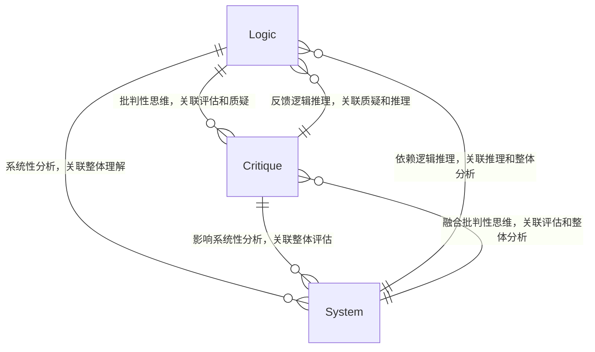

                 


### 引言

#### 引言

在当今信息爆炸的时代，理性思考的重要性愈发凸显。然而，我们不禁要问，为何在这样一个看似充满知识的世界里，人们的思考却显得愈发模糊、混乱和片面？这一问题的答案或许隐藏在社会的深层结构中，也或许源自我们自身的认知局限。

首先，让我们从社会现状入手。当前，社交媒体的兴起和信息的过度泛滥，导致了人们的认知碎片化。人们沉浸在各种观点和信息的海洋中，难以形成独立、全面的见解。其次，教育体系的问题也值得我们深思。传统的教育模式过于注重知识的灌输，而忽视了思维能力的培养。这导致了许多人在面对复杂问题时，往往缺乏理性思考的能力。

另一方面，新启蒙时代的到来，为我们提供了重新审视理性思考的机会。启蒙运动是人类历史上的一次思想解放，它强调理性、科学和自由。新启蒙时代则是在这一基础上，进一步深化对理性思考的理解和应用。

社会倡议行动的意义在于，通过推动理性思考的普及，我们可以提升社会的整体认知水平，促进社会的发展与进步。因此，本文将围绕理性思考的复兴展开讨论，旨在提出一个新启蒙时代的社会倡议行动，为社会的可持续发展提供智力支持。

#### 理性思考的复兴背景

理性思考的复兴并非无源之水、无本之木，它有着深刻的社会背景和现实需求。首先，从历史的角度看，理性思考一直是人类文明进步的重要推动力。在古希腊时期，苏格拉底、柏拉图和亚里士多德等哲学家，就提出了理性思考的重要性和方法。他们的思想不仅影响了当时的希腊社会，也为后来的西方哲学奠定了基础。

然而，在近代，理性思考的重要性经历了曲折的发展。19世纪末到20世纪初，实证主义和科学主义的兴起，使理性思考在科学领域取得了巨大的成就。然而，与此同时，理性思考在人文社科领域却遭遇了困境。20世纪的两次世界大战，以及冷战时期的意识形态对立，使人们对理性思考产生了怀疑和质疑。这种怀疑和质疑，在一定程度上影响了理性思考在社会中的地位和影响力。

进入21世纪，随着信息技术的发展和普及，人们再次认识到理性思考的重要性。大数据、人工智能等新兴技术，需要人们具备更强的逻辑思维和问题解决能力。此外，全球化和城市化进程的加速，使社会面临的问题越来越复杂，需要人们运用理性思考来应对和解决。

因此，理性思考的复兴，不仅是历史发展的必然趋势，也是社会发展的现实需求。它不仅关乎个体的成长和进步，更关乎社会的繁荣和稳定。

#### 社会现状与问题

当前，社会现状中的诸多问题，与理性思考的缺失密切相关。首先，社交媒体的普及和信息爆炸，导致了信息的过度泛滥和认知的碎片化。在社交媒体上，各种观点和信息的传播速度极快，但往往缺乏深度和系统性。这使得人们在面对复杂问题时，容易受到情绪和偏见的影响，而难以形成独立、全面的见解。

其次，教育体系的问题也值得我们深思。传统的教育模式过于注重知识的灌输，而忽视了思维能力的培养。许多学生在学校里学到的，仅仅是知识点和考试技巧，而缺乏对知识体系的整体理解和应用能力。这导致了许多人在面对实际问题时，缺乏理性思考的能力。

此外，社会风气的浮躁和短视，也加剧了理性思考的缺失。在快节奏的生活中，人们往往追求速成和即时满足，而忽视了长期的积累和思考。这种风气使得人们容易陷入短视和盲目，难以做出理性、明智的决策。

最后，社会问题的复杂性和多样性，也对理性思考提出了更高的要求。在当今社会，许多问题不仅仅是单一维度的，而是涉及到经济、政治、文化等多个方面的综合问题。解决这些问题，需要人们具备跨领域的知识结构和综合分析能力。然而，当前的社会环境，往往使人们陷入单一的视角和思维定式，难以进行全面的理性思考。

综上所述，当前社会现状中的诸多问题，与理性思考的缺失密切相关。要解决这些问题，就必须重视理性思考的复兴，提升社会的整体认知水平，促进社会的可持续发展。

#### 理性思考的重要性

理性思考的重要性不可忽视，它不仅影响着个体的发展，更对社会的进步起着关键作用。首先，对于个体来说，理性思考是个人成长和自我提升的重要工具。通过理性思考，个体能够更好地理解世界，发现问题的本质，找到解决问题的有效方法。这种能力不仅有助于个体在学术和职业生涯中取得成功，还能帮助他们在生活中做出明智的决策。

其次，理性思考对社会的进步具有重要意义。一个理性的社会，能够更好地应对复杂的社会问题，做出科学、合理的决策。例如，在环境保护、资源分配、公共健康等领域，理性的思考可以帮助我们制定出更为有效的政策和措施，从而实现社会的可持续发展。此外，理性思考还有助于减少冲突和矛盾，提升社会的和谐程度。

具体来说，理性思考在社会中的作用体现在多个方面。首先，它在科学研究和技术创新中起着关键作用。科学家和技术专家通过理性思考，能够发现新的科学定律和突破技术难题，推动人类文明的进步。其次，在商业和经济活动中，理性思考能够帮助企业家和市场参与者做出明智的决策，提高市场竞争力和经济效益。最后，在政治和公共管理领域，理性思考有助于政策制定者制定出科学、合理的政策，提升政府的治理能力。

总之，理性思考不仅对个体的发展有着深远影响，更是社会进步的重要推动力。因此，重视理性思考的复兴，提升社会的整体认知水平，是我们必须面对的紧迫任务。

#### 新启蒙时代的到来

新启蒙时代，是一个以理性思考为核心的时代，它不仅继承了启蒙运动的思想精髓，更在新的历史背景下，赋予了理性思考新的内涵和使命。启蒙运动是17世纪到18世纪欧洲的一场思想革命，它强调理性、科学和自由，对传统权威进行了深刻质疑，推动了人类文明的进步。然而，随着时间的推移，启蒙运动的理念在传播过程中，也出现了一些局限和不足。

新启蒙时代则是在这一基础上，进一步深化和拓展了理性思考的应用范围。首先，新启蒙时代更加注重跨学科的综合思考。在启蒙时代，科学和哲学是理性思考的主要领域，而新启蒙时代则将这一理念扩展到了社会学、经济学、政治学等多个学科。通过跨学科的综合思考，人们能够从多个角度看待和分析问题，形成更加全面、系统的见解。

其次，新启蒙时代强调实践与理论的结合。启蒙运动时期，理性思考更多停留在理论层面，而新启蒙时代则更加注重将理论应用于实践。通过实践验证理论，不仅能够提高理论的科学性和实用性，还能推动理论的发展和完善。

最后，新启蒙时代还强调个体的自由和责任。启蒙运动强调个体的自由，但往往忽视了个体在自由背后的责任。新启蒙时代则倡导个体在享有自由的同时，要承担起相应的社会责任。这种责任不仅体现在个人行为上，还体现在对社会的贡献上。

总之，新启蒙时代是一个以理性思考为核心，强调跨学科综合、实践与理论结合，以及个体自由与责任的时代。它为理性思考的复兴提供了新的契机和动力，也为社会的可持续发展奠定了坚实的思想基础。

#### 启蒙运动的回顾

启蒙运动是西方哲学史上的重要里程碑，它不仅改变了人们的思想方式，还对现代社会的发展产生了深远的影响。启蒙运动起源于17世纪的欧洲，主要在法国、英国和德国等地区展开。这场运动的核心思想是理性、科学和自由，它对传统权威进行了深刻质疑，推动了人类思想的解放。

首先，启蒙运动强调理性思考的重要性。在启蒙时期，人们开始质疑宗教和神权的权威，主张通过理性思考来解决问题。这种理性思考的方式不仅体现在科学领域，还渗透到了哲学、政治、经济学等多个学科。启蒙运动时期的哲学家，如伏尔泰、卢梭和康德等，都是这一思想的代表人物。

其次，启蒙运动倡导科学的方法。启蒙时期，科学家们通过实验和观察，逐步建立了现代科学体系。这一方法不仅提高了人类对自然界的认识，还推动了科学技术的发展。例如，牛顿的经典力学体系，就极大地改变了人类对物理世界的理解。

此外，启蒙运动还强调自由和平等。启蒙思想家们主张，每个人都应该享有自由和平等的权利，不受专制和压迫。这一思想不仅激发了法国大革命和美国独立战争，还影响了全球范围内的民主运动。

总之，启蒙运动为人类带来了理性思考、科学方法和自由精神，它不仅改变了人们的思想观念，还推动了社会的进步。这些思想成果，至今仍然影响着我们的生活和价值观。

#### 新启蒙时代的特征

新启蒙时代，在继承启蒙运动思想精髓的基础上，展现出一系列独特的特征。首先，跨学科综合成为新启蒙时代的显著标志。与启蒙运动主要聚焦于科学和哲学不同，新启蒙时代更加广泛地融合了社会学、经济学、政治学等多个学科，通过跨学科的视角，形成更加全面、系统的思考模式。

其次，实践与理论的结合是新启蒙时代的另一大特征。启蒙运动虽然强调理性思考，但其理论往往停留在抽象层面，缺乏实践应用的深度。而新启蒙时代则强调将理论应用于实践，通过实践验证和优化理论，推动理论的发展和完善。这种理论指导实践、实践丰富理论的双向互动，使得新启蒙时代的思想更具现实意义。

最后，个体自由与责任并重也是新启蒙时代的重要特征。启蒙运动强调个体自由，但忽视了个体在自由背后的责任。新启蒙时代则倡导个体在享有自由的同时，要承担起相应的社会责任。这种自由与责任的平衡，不仅体现在个人行为上，还体现在对社会的贡献上。通过自由与责任的结合，新启蒙时代旨在构建一个更加和谐、进步的社会。

### 社会倡议行动的意义

#### 理性思考与社会发展的关系

理性思考与社会发展之间的关系，可以从多个维度进行探讨。首先，理性思考是推动社会进步的重要动力。一个理性的社会，能够更好地应对复杂的社会问题，做出科学、合理的决策。例如，在环境保护、资源分配、公共健康等领域，理性的思考可以帮助我们制定出更为有效的政策和措施，从而实现社会的可持续发展。

其次，理性思考有助于提升社会的整体认知水平。在信息爆炸的时代，理性思考能够帮助我们从大量的信息中筛选出有价值的内容，形成独立、全面的见解。这种认知水平的提升，不仅有助于个体的发展，也能推动社会的整体进步。

此外，理性思考还能促进社会的和谐与稳定。在现代社会，冲突和矛盾时有发生，而理性思考能够帮助人们从不同的角度看待问题，找到解决问题的最佳方案。通过理性思考，社会可以更好地协调各种利益关系，减少冲突和矛盾，提升社会的和谐程度。

总之，理性思考与社会发展密切相关，它不仅推动了社会的进步，也为社会的和谐与稳定提供了智力支持。

#### 社会倡议行动的目标与策略

社会倡议行动的目标在于推动理性思考的普及和深化，从而提升社会的整体认知水平，促进社会的可持续发展。为了实现这一目标，我们需要制定一系列具体的策略和措施。

首先，教育改革是社会倡议行动的关键一环。当前，教育体系过于注重知识的灌输，而忽视了思维能力的培养。因此，我们需要对教育体系进行改革，注重培养学生的理性思考能力。这包括在课程设置中增加逻辑思维、批判性思维等课程，以及通过实践活动，提升学生的实际应用能力。

其次，推广理性思考的理念是另一项重要任务。通过媒体宣传、公众讲座、线上活动等多种形式，我们可以向社会大众普及理性思考的重要性和方法。特别是要引导公众从理性思考的角度看待社会现象，提高他们的认知水平和判断能力。

此外，政策支持也是实现目标的重要保障。政府可以通过制定相关政策，鼓励和扶持理性思考的研究和实践。例如，设立专项基金，支持理性思考相关的研究项目；制定教育标准，推动教育体系的改革；以及通过立法，保障公众的理性表达和参与权利。

最后，社会参与是推动理性思考普及的重要力量。社会各界应积极参与到理性思考的推广和实践中，形成全社会共同关注和支持理性思考的氛围。通过社会各界的共同努力，我们可以推动理性思考在社会各个层面的广泛应用，提升社会的整体认知水平。

总之，通过教育改革、理念推广、政策支持和社会参与等多方面的努力，我们可以实现社会倡议行动的目标，推动理性思考的复兴，为社会的可持续发展提供坚实的智力支持。

### 第二部分：理性思考的核心概念

#### 核心概念的定义与联系

理性思考是一个多维度的概念，它不仅包含逻辑推理、批判性思维，还涉及系统性分析和决策制定。理解这一概念的定义与联系，有助于我们更好地把握理性思考的核心特征和其在实际问题中的应用。

首先，逻辑推理是理性思考的基础。它通过逻辑运算和关系，将已知信息转化为新的结论。逻辑推理包括演绎推理和归纳推理，前者从一般到特殊，后者从特殊到一般。例如，演绎推理的过程可以描述为：所有人都会死亡，苏格拉底是人，因此苏格拉底会死亡。而归纳推理则是从多个具体实例中提炼出普遍规律，例如，通过观察多个苹果从树上落下，我们归纳出地球具有引力。

批判性思维是理性思考的重要补充。它不仅仅停留在逻辑推理的层面，还涉及到对信息的评估、判断和质疑。批判性思维要求我们在接受信息时，不仅要考虑其逻辑上的正确性，还要考虑其来源、可信度和适用范围。例如，面对一则新闻报道，我们需要评估其真实性、客观性和全面性，而不是盲目接受或拒绝。

系统性分析是理性思考的高级阶段。它要求我们从整体上理解问题，分析问题的各个方面和相互关系，从而找到解决问题的最佳方案。系统性分析包括识别问题的根本原因、制定解决方案、评估方案的影响等。例如，在环境保护问题上，我们需要考虑污染源、治理方法、成本效益等多个方面，才能制定出科学合理的解决方案。

决策制定是理性思考的最终目标。在复杂的情境中，理性思考帮助我们做出最优决策。决策制定包括明确目标、分析选项、评估风险和收益等多个步骤。例如，在商业决策中，企业需要分析市场趋势、竞争对手、客户需求等多方面因素，才能做出有效的战略决策。

综上所述，理性思考是一个多维度的概念，包括逻辑推理、批判性思维、系统性分析和决策制定。这些概念相互联系，共同构成了理性思考的核心内容。理解它们之间的联系，有助于我们更好地运用理性思考解决实际问题。

#### 与其他思考方式的对比

理性思考与其他思考方式如直觉思维、情感思维和经验思维，既有联系又有区别。每种思考方式都有其独特的优点和局限性，理解这些区别有助于我们更好地发挥各种思考方式的潜力。

首先，直觉思维是一种基于快速判断和直接感受的思考方式。直觉思维的优势在于其高效性和决策速度，它能够在短时间内提供直观的解决方案。然而，直觉思维的局限性在于其缺乏系统的分析和逻辑支持，容易受到情绪和偏见的干扰。例如，在紧急情况下，直觉思维可以帮助我们迅速做出决策，但在复杂和长期的问题面前，它往往难以提供有效的解决方案。

其次，情感思维是一种基于情感体验和情感反应的思考方式。情感思维的优势在于其能够激发人们的创造力和情感共鸣，有助于建立人际关系和增强团队的凝聚力。然而，情感思维的局限性在于其往往缺乏逻辑性和客观性，容易受到情绪波动的影响。例如，在商业谈判中，情感思维可以帮助建立信任关系，但如果过度依赖情感思维，可能会忽视商业逻辑和市场规律。

再次，经验思维是一种基于个人经验和以往案例的思考方式。经验思维的优势在于其能够快速应对常见问题，利用以往的经验和教训来指导当前的问题解决。然而，经验思维的局限性在于其缺乏系统的理论支持和跨领域的适应能力，容易陷入“经验主义”的陷阱。例如，医生在治疗常见病时，经验思维可以帮助快速判断和处理，但在面对罕见病时，它往往需要结合理性思考和最新研究成果。

理性思考则是一种基于逻辑推理、批判性思维和系统性分析的思考方式。理性思考的优势在于其科学性和系统性，能够提供全面、深入的解决方案。它能够通过逻辑推理，将已知信息转化为新的结论；通过批判性思维，评估信息的真实性和适用性；通过系统性分析，找到问题的根本原因和最佳解决方案。然而，理性思考的局限性在于其往往缺乏情感和直觉的直观感受，在处理复杂和情感密集的问题时，可能难以迅速做出决策。

综上所述，直觉思维、情感思维和经验思维各有优缺点，它们与理性思考相互补充。在解决问题的过程中，我们可以根据问题的性质和情境，灵活运用不同的思考方式，发挥各自的优势，以实现最佳的思考效果。

#### 理性思考的属性特征

理性思考作为一种高效的思考方式，具有一系列独特的属性特征，这些特征不仅定义了理性思考的本质，还影响了其在实际问题中的应用效果。

首先，明确性是理性思考的首要特征。明确性意味着在思考过程中，我们需要对问题、目标和信息有清晰的认识和定义。没有明确性的思考，往往会导致模糊和误解。例如，在制定商业战略时，如果目标不明确，企业可能会在错误的路径上浪费大量资源。明确性不仅要求我们清晰地表达问题，还要确保信息传递的准确无误。

其次，普遍性是理性思考的另一重要特征。理性思考不仅适用于特定的情境和领域，还可以跨越不同的学科和领域。这种普遍性使得理性思考具有广泛的适用性和灵活性。例如，在法律、医学、工程等多个领域中，理性思考的方法和技术都能够发挥作用，帮助专业人士做出科学、合理的决策。

最后，逻辑性是理性思考的核心特征。逻辑性要求我们在思考过程中，遵循逻辑规则和推理原则，确保每一步推理都是合乎逻辑的。逻辑性不仅能够避免思考过程中的错误和谬误，还能增强思考的严密性和可信度。例如，在科学研究过程中，逻辑性是确保实验设计和数据分析科学性的关键。

总体而言，明确性、普遍性和逻辑性是理性思考的三大属性特征。这些特征不仅定义了理性思考的本质，还为其在实际问题中的应用提供了坚实的理论支持。

#### 明确性的定义与重要性

明确性是理性思考中的一个关键特征，它指的是在思考和解决问题时，对问题、目标和信息的清晰、准确和具体化。具体而言，明确性要求我们在思考过程中，能够明确地定义问题，设定具体的目标，并提供准确、可靠的信息。这一特征不仅提升了思考的效率，还确保了思考结果的科学性和可靠性。

首先，明确性的重要性在于它有助于我们避免模糊和误解。在复杂的情境中，模糊和不确定的因素往往会导致错误的决策和判断。通过明确性的特征，我们能够将问题具体化，从而减少不确定性，提高思考的准确性。例如，在商业战略制定中，如果目标不明确，企业可能会在错误的路径上投入大量资源，导致项目失败。

其次，明确性有助于提升思考的效率。明确的目标和具体的信息，使我们能够集中精力解决关键问题，避免在无关细节上浪费时间。例如，在科学研究过程中，明确的研究问题和假设，可以帮助研究人员更有效地设计实验和进行数据分析。

此外，明确性还有助于提高思考的可交流性。清晰、准确的思考和表达，使得我们的思考能够更容易地被他人理解，从而促进团队协作和知识共享。例如，在项目会议中，明确的讨论议题和具体的信息，有助于团队成员快速达成共识，提高决策效率。

总之，明确性是理性思考中不可或缺的特征。它不仅有助于我们避免模糊和误解，提升思考的效率，还能增强思考结果的科学性和可靠性。

#### 明确性的重要性

明确性在理性思考中扮演着至关重要的角色，它不仅影响思考的准确性，还关系到决策的效率和效果。首先，明确性有助于提高思考的准确性。在复杂的情境中，模糊和不确定的因素往往会导致错误的决策和判断。通过明确性，我们可以将问题具体化，减少信息的不确定性，从而提升思考的准确性。例如，在科学研究过程中，明确的研究问题和假设，可以帮助研究人员更科学地设计实验和进行数据分析。

其次，明确性有助于提升思考的效率。具体的目标和明确的信息，使我们能够集中精力解决关键问题，避免在无关细节上浪费时间和资源。例如，在商业战略制定中，明确的目标和具体的策略，可以帮助企业快速识别关键问题，制定有效的解决方案。

此外，明确性还有助于提高决策的效果。明确的思考和表达，使得我们的决策能够更容易地被他人理解和接受，从而促进团队协作和知识共享。例如，在项目会议中，明确的讨论议题和具体的信息，有助于团队成员快速达成共识，提高决策效率。

总之，明确性是理性思考中不可或缺的特征。它不仅有助于我们避免模糊和误解，提升思考的效率，还能增强思考结果的科学性和可靠性，从而提高决策的效果。

#### 普遍性的定义与应用

普遍性是理性思考的另一个关键特征，它指的是理性思考方法在不同情境和领域中的普适性和可应用性。普遍性不仅使得理性思考具有广泛的适用范围，还保证了思考过程的科学性和可靠性。

首先，普遍性的定义在于理性思考方法的基本原则和逻辑结构，不依赖于具体的问题或领域。例如，逻辑推理和批判性思维，无论是在科学研究中，还是在商业决策中，都是通用的思考方法。这些方法不仅帮助我们在特定领域内解决问题，还能跨越不同领域，提供一致的解决方案。

其次，普遍性的应用体现在多个方面。在教育领域，普遍性使得理性思考能够被用于教学方法和课程设计，帮助学生在不同学科中培养批判性和逻辑思维能力。在商业领域，普遍性使得理性思考能够被用于市场分析、战略规划和风险管理，帮助企业和组织做出科学、合理的决策。在政治领域，普遍性使得理性思考能够被用于公共政策制定和民主实践，提升政府的治理能力和决策科学性。

总之，普遍性是理性思考的重要特征，它不仅扩展了理性思考的应用范围，还保证了思考过程的科学性和一致性。通过普遍性的特征，理性思考在各个领域中都发挥着关键作用，为决策提供坚实的逻辑基础。

#### 普遍性的应用

普遍性作为理性思考的重要特征，在实际应用中展现出广泛的适用性和多样的表现形式。在科学研究领域，理性思考的普遍性体现在方法论的科学性上。无论是自然科学还是社会科学，理性思考都要求研究者通过系统的观察、实验和数据分析，来验证假设和得出结论。这种方法不仅确保了研究结果的科学性和可靠性，还使得不同领域的研究可以相互借鉴和验证，推动了科学知识的积累和进步。

在商业领域，理性思考的普遍性表现在市场分析和战略规划上。企业家和分析师通过理性思考，对市场需求、竞争对手、财务状况等进行全面、系统的分析，从而制定出科学合理的商业策略。例如，通过数据分析，企业可以识别市场趋势，预测消费者行为，优化产品设计和营销策略，从而提高市场竞争力。

在公共政策领域，理性思考的普遍性体现在政策制定和评估上。政策制定者通过理性思考，分析社会问题、评估不同政策方案的成本和效益，从而制定出科学、合理的政策。例如，在环境保护问题上，政府可以通过理性思考，分析污染源、评估不同治理措施的效果，制定出有效的环保政策。

总之，理性思考的普遍性使其在科学研究、商业决策和公共政策等各个领域中都发挥着重要作用，通过科学、系统的分析，提供坚实的决策依据，推动社会的进步和发展。

#### 理性思考的ER实体关系图

为了更直观地展示理性思考的核心概念及其相互关系，我们可以通过ER（Entity-Relationship）实体关系图来进行描述。ER图是一种用于表示实体及其相互关系的数据库模型，通过这种方式，我们可以清晰地看到理性思考的各个组成部分及其互动。

首先，我们定义三个核心实体：逻辑推理、批判性思维和系统性分析。这些实体代表了理性思考的主要组成部分。

1. **逻辑推理（Logical Reasoning）**：这是理性思考的基础，涉及从已知信息推导出新的结论。逻辑推理包括演绎推理和归纳推理。

2. **批判性思维（Critical Thinking）**：这是对信息的评估和判断能力，涉及质疑、分析和推理。批判性思维帮助我们从多个角度审视问题，评估信息的真实性和可靠性。

3. **系统性分析（Systematic Analysis）**：这是从整体上理解问题，分析各个部分及其相互关系。系统性分析帮助我们发现问题的根本原因，并制定全面的解决方案。

接下来，我们通过ER图来展示这些实体及其相互关系：

```mermaid
erDiagram
  Logic -->|关联| Critique
  Logic -->|关联| System
  Critique -->|关联| Logic
  Critique -->|关联| System
  System -->|关联| Logic
  System -->|关联| Critique
```

在这个ER图中，箭头表示实体之间的关联。逻辑推理与批判性思维和系统性分析都有直接的关联，表明它们是理性思考不可或缺的部分。同时，批判性思维和系统性分析也相互关联，说明它们在理性思考中的互补性和互动性。

通过ER实体关系图，我们可以更直观地理解理性思考的各个组成部分及其相互关系，这有助于我们在实际应用中，更好地运用理性思考的方法，解决问题和做出决策。

#### 实体关系图的绘制

在绘制理性思考的ER实体关系图时，我们需要明确每个实体及其相互关系的具体描述。首先，我们定义以下核心实体：

1. **逻辑推理（Logical Reasoning）**：这是理性思考的基础，涉及从已知信息推导出新的结论。逻辑推理包括演绎推理和归纳推理。
2. **批判性思维（Critical Thinking）**：这是对信息的评估和判断能力，涉及质疑、分析和推理。批判性思维帮助我们从多个角度审视问题，评估信息的真实性和可靠性。
3. **系统性分析（Systematic Analysis）**：这是从整体上理解问题，分析各个部分及其相互关系。系统性分析帮助我们发现问题的根本原因，并制定全面的解决方案。

接下来，我们通过Mermaid语法来绘制ER实体关系图：



在这个ER图中，实体通过箭头表示其相互关系，每个箭头旁边附有注释，说明两个实体之间的关联。这种表示方法不仅清晰地展示了理性思考的各个组成部分及其互动，还有助于我们在实际应用中理解并运用这些概念。

#### 实体关系图的应用

实体关系图（ER图）在理性思考中的应用非常广泛，它不仅帮助我们直观地理解理性思考的核心概念及其相互关系，还能在具体的分析和决策过程中提供有力的工具。以下是实体关系图在理解与解释、逻辑分析以及问题解决中的应用实例：

首先，在理解与解释方面，ER图可以帮助我们更好地理解复杂的系统或概念。例如，在研究一个复杂的商业模型时，我们可以通过ER图来描述各个组成部分及其相互关系，从而更清晰地理解该模型的工作原理和潜在问题。ER图使我们能够将抽象的概念和复杂的系统具体化，便于团队讨论和知识共享。

其次，在逻辑分析中，ER图是进行逻辑推理的有力工具。通过ER图，我们可以清晰地展示各个实体之间的逻辑关系，从而帮助我们识别和分析问题。例如，在法律纠纷中，我们可以使用ER图来描述证人证词、法律条款和事实之间的逻辑关系，从而更好地理解案件的各个方面，为法律分析提供依据。

最后，在问题解决中，ER图可以帮助我们制定系统的解决方案。例如，在项目管理和决策制定过程中，我们可以通过ER图来分析项目各部分之间的依赖关系和关键路径，从而优化项目计划，减少风险，提高项目成功的可能性。ER图不仅帮助我们识别问题的核心，还能指导我们制定全面的解决方案。

总之，实体关系图在理性思考中的应用，不仅提高了我们理解和解释复杂系统的能力，还增强了逻辑分析和问题解决的效果，为理性思考提供了直观、系统的工具支持。

### 第三部分：理性思考的应用场景

#### 教育领域的应用

在当今教育领域中，理性思考的应用显得尤为重要，它不仅有助于提升学生的思维能力，还能为教育改革提供新的思路。理性思考在教育的应用主要体现在课程设计、教学方法和评估体系等方面。

首先，课程设计是理性思考应用的重要环节。传统的课程设计往往侧重于知识点的传授，而忽视了学生思维能力的培养。为了实现理性思考的培养，课程设计需要注重逻辑推理、批判性思维和系统性分析等能力的培养。具体来说，课程内容可以包括逻辑学、哲学、批判性思维课程等，这些课程不仅传授知识，还通过实例和实践活动，培养学生的理性思考能力。

其次，教学方法也需要适应理性思考的培养需求。传统的教学方法，如讲授法，往往注重教师的主导地位，学生被动接受知识。而理性思考的培养需要学生主动参与、积极思考。因此，教学方法需要从以教师为中心转向以学生为中心。例如，采用讨论法、项目式学习、探究式学习等教学方法，鼓励学生主动提出问题、分析问题和解决问题。此外，教师还可以通过案例分析、小组讨论和角色扮演等活动，引导学生运用理性思考方法，提高他们的思维能力。

最后，评估体系也需要进行相应的调整，以更好地衡量学生的理性思考能力。传统的评估方式，如考试和测验，往往侧重于知识点的掌握，而忽视了学生的思维过程和能力。为了适应理性思考的培养需求，评估体系需要从单一的知识点评估转向综合能力评估。具体来说，可以采用多种评估方式，如论文写作、实验报告、案例分析、项目展示等，这些评估方式不仅考察学生的知识掌握情况，还能评估学生的逻辑思维、批判性思维和系统性分析能力。

总之，理性思考在教育的应用，需要从课程设计、教学方法和评估体系等多个方面进行改革。通过这些措施，我们可以更好地培养学生的理性思考能力，提升教育质量，为社会的可持续发展提供人才支持。

#### 教育现状与问题

当前教育领域中存在的诸多问题，对理性思考的培养构成了严重挑战。首先，教育体系的应试导向使得教学过程过于注重知识点的传授，而忽视了学生思维能力的培养。这种应试教育模式，往往导致学生形成机械记忆和被动接受知识的习惯，缺乏独立思考和批判性思维的能力。

其次，课程内容设计缺乏系统性，重视学科知识的分门别类，而忽视了跨学科的综合思考和整体认知的培养。这种课程设计，使得学生在面对复杂问题时，难以将不同学科的知识和思维方式有机结合，进行综合分析和解决问题。

此外，教学方法单一，教师主导的教学模式限制了学生的主动性和创造力。学生在课堂上缺乏参与和互动的机会，难以通过实践和讨论培养理性思考的能力。这种教学方式，使得学生在实际应用中，难以将理论知识转化为实际解决问题的能力。

最后，评估体系过于单一，主要依赖于考试成绩，无法全面衡量学生的思维能力和综合素养。这种评估方式，导致教育目标偏离了培养学生的理性思考能力，而更加注重知识点的掌握。

总之，教育现状中的应试导向、课程设计单一、教学方法单一和评估体系单一等问题，严重制约了理性思考的培养，影响了教育质量的提升。因此，教育改革势在必行，以适应新时代对理性思考能力的需求。

#### 理性思考在教育的应用

理性思考在教育的应用，不仅有助于提升学生的思维能力，还能为教育改革提供新的思路。具体来说，理性思考在教育的应用主要体现在以下几个方面：

首先，课程设计是理性思考应用的重要环节。为了培养学生的理性思考能力，课程设计需要注重逻辑推理、批判性思维和系统性分析等能力的培养。例如，在课程内容中，可以加入逻辑学、哲学、批判性思维等课程，通过实例和实践活动，引导学生进行系统的思考和推理。

其次，教学方法也需要适应理性思考的培养需求。传统的教学方法，如讲授法，往往注重教师的主导地位，学生被动接受知识。而理性思考的培养需要学生主动参与、积极思考。因此，教学方法需要从以教师为中心转向以学生为中心。例如，采用讨论法、项目式学习、探究式学习等教学方法，鼓励学生主动提出问题、分析问题和解决问题。此外，教师还可以通过案例分析、小组讨论和角色扮演等活动，引导学生运用理性思考方法，提高他们的思维能力。

再次，评估体系也需要进行相应的调整，以更好地衡量学生的理性思考能力。传统的评估方式，如考试和测验，往往侧重于知识点的掌握，而忽视了学生的思维过程和能力。为了适应理性思考的培养需求，评估体系需要从单一的知识点评估转向综合能力评估。具体来说，可以采用多种评估方式，如论文写作、实验报告、案例分析、项目展示等，这些评估方式不仅考察学生的知识掌握情况，还能评估学生的逻辑思维、批判性思维和系统性分析能力。

最后，教育改革需要注重跨学科的综合思考。理性思考不仅仅是某一学科的知识，而是涉及到多个学科的综合能力。因此，教育改革需要打破学科界限，注重跨学科的综合思考和整体认知的培养。例如，通过跨学科的课程设计和项目，引导学生从多个角度看待问题，进行综合分析和解决问题。

总之，理性思考在教育的应用，需要从课程设计、教学方法和评估体系等多个方面进行改革。通过这些措施，我们可以更好地培养学生的理性思考能力，提升教育质量，为社会的可持续发展提供人才支持。

#### 教育案例解析

为了更好地理解理性思考在教育的实际应用，我们可以通过具体的案例来解析其在教育实践中的成效。以下是几个典型的教育案例：

**案例一：项目式学习**

在某高中，教师采用了项目式学习方法，以培养学生的理性思考能力。项目主题是“可持续发展与环境保护”。学生们需要通过调研、数据分析、实验等环节，完成一个关于环境保护的完整项目。在项目过程中，学生需要运用逻辑推理来分析调研数据，通过批判性思维评估不同环境保护措施的优劣，并运用系统性分析制定出可行的环保方案。该项目不仅提升了学生的科学素养，还培养了他们的逻辑思维和综合分析能力。

**案例二：批判性思维训练**

在某大学的哲学课程中，教师通过案例分析、辩论和写作等形式，对学生进行批判性思维的训练。课程内容涉及伦理学、逻辑学和心理学等多个领域。学生们在讨论中需要运用批判性思维，评估不同观点的合理性和逻辑性，并提出自己的见解。通过这样的训练，学生们的思维能力得到了显著提升，他们能够更好地分析和解决问题，并形成独立、全面的见解。

**案例三：跨学科综合课程**

在某小学，教师设计了一门跨学科综合课程，主题是“自然与科技”。课程内容包括生物学、物理学和计算机科学等领域的知识。教师通过实验、探究和项目式学习等形式，引导学生从多个角度看待问题，进行综合分析和解决问题。例如，在研究植物生长的过程中，学生不仅需要学习生物学知识，还需要运用物理学原理来分析植物的生长条件。通过这样的跨学科学习，学生们的思维得到了拓展，他们的理性思考能力得到了有效培养。

通过这些案例，我们可以看到，理性思考在教育中的应用，不仅有助于提升学生的思维能力，还能激发他们的学习兴趣，培养他们的创新精神。这些实践为教育改革提供了有益的启示，也为社会的可持续发展培养了具有理性思考能力的人才。

#### 商业领域的应用

理性思考在商业领域中的应用具有深远的意义，它不仅能够提升企业的竞争力和创新能力，还能为企业的战略规划和市场决策提供科学依据。在商业环境中，理性思考的应用主要体现在市场分析、战略规划和风险管理等方面。

首先，市场分析是商业决策的重要基础。通过理性思考，企业可以对市场趋势、消费者行为和竞争环境进行深入分析，从而制定出科学、合理的市场策略。例如，在产品研发阶段，企业可以通过数据分析，了解消费者的需求和偏好，从而优化产品设计和功能。此外，在市场推广过程中，理性思考可以帮助企业评估不同营销策略的有效性，选择最佳的市场推广方案。

其次，战略规划是企业发展的重要方向。理性思考能够帮助企业在复杂的市场环境中，制定出科学、可行的战略规划。通过逻辑推理和系统性分析，企业可以明确自身的战略目标，识别关键成功因素，并制定出具体的实施策略。例如，在国际化战略中，企业需要通过理性思考，分析不同市场的经济、政治和文化环境，制定出适应不同市场的战略方案。

最后，风险管理是商业运营的重要环节。理性思考可以帮助企业识别和管理各种风险，确保企业的稳定发展。通过批判性思维，企业可以对潜在风险进行评估和判断，制定出有效的风险应对策略。例如，在财务风险管理中，企业可以通过理性思考，分析市场波动、利率变化等风险因素，采取相应的措施来降低风险。

总之，理性思考在商业领域中的应用，不仅提升了企业的竞争力和创新能力，还为企业的发展提供了科学、合理的决策支持。通过理性思考，企业能够更好地应对市场变化，抓住发展机遇，实现可持续发展。

#### 商业现状与问题

当前商业环境中，理性思考的应用虽然受到一定的重视，但仍面临诸多挑战和问题。首先，市场环境的变化速度加快，消费者需求多样化和不确定性增加，使企业面临更复杂的市场分析任务。许多企业在进行市场分析时，往往过于依赖经验和直觉，缺乏科学的数据分析和逻辑推理，导致决策失误和市场机会的错失。

其次，战略规划的复杂性和不确定性，使得企业难以制定出科学、可行的战略方案。一些企业在制定战略时，过于注重短期收益，忽视了长期发展的可持续性，导致战略规划缺乏系统性和长远性。此外，企业在国际化扩张过程中，面临着不同市场环境和文化差异的挑战，如何通过理性思考来制定适应不同市场的战略，成为企业亟需解决的问题。

最后，风险管理在商业运营中越来越重要，但许多企业在风险管理上仍存在短板。缺乏系统性的风险评估和应对策略，使得企业在面对市场波动、信用风险等不确定性因素时，难以做出科学、合理的决策，导致运营风险的增加。

总之，当前商业环境中的不确定性增加，对理性思考的应用提出了更高的要求。企业需要通过提升数据分析能力、加强战略规划和完善风险管理，才能在激烈的市场竞争中立于不败之地。

#### 理性思考在商业的应用

理性思考在商业中的应用，不仅有助于提升企业的竞争力和创新能力，还能为企业的战略规划和市场决策提供科学依据。以下从市场分析和企业战略两个方面，详细阐述理性思考在商业中的应用。

首先，市场分析是商业决策的重要基础。通过理性思考，企业可以对市场趋势、消费者行为和竞争环境进行深入分析，从而制定出科学、合理的市场策略。例如，在产品研发阶段，企业可以通过数据分析，了解消费者的需求和偏好，从而优化产品设计和功能。具体来说，企业可以运用统计学方法和数据分析工具，收集和分析市场数据，如销售数据、消费者反馈等，从中提取有价值的信息，帮助制定产品开发方向和营销策略。

其次，企业战略的制定需要理性思考的支持。理性思考可以帮助企业在复杂的市场环境中，明确战略目标，识别关键成功因素，并制定出具体的实施策略。例如，企业可以通过逻辑推理和系统性分析，分析不同市场的经济、政治和文化环境，从而制定出适应不同市场的战略方案。具体应用包括：SWOT分析（优势、劣势、机会、威胁分析）、PEST分析（政治、经济、社会、技术分析）等，这些方法有助于企业全面评估市场环境，明确战略方向。

最后，市场决策也需要理性思考的指导。通过理性思考，企业可以在面对多种选择时，评估不同决策的潜在风险和收益，从而做出最优决策。例如，在市场推广过程中，企业需要评估不同营销策略的有效性，选择最佳的市场推广方案。通过理性思考，企业可以运用数据分析方法，如A/B测试、回归分析等，评估不同营销手段的收益和成本，从而优化市场推广策略。

总之，理性思考在商业中的应用，通过市场分析和企业战略的指导，不仅提升了企业的竞争力和创新能力，还为企业的长期发展提供了科学、合理的决策支持。

#### 市场分析

市场分析是商业决策过程中至关重要的一环，它通过系统、科学的方法，帮助企业在复杂的市场环境中找到发展机会和应对挑战。市场分析主要包括以下几个方面：

首先，市场趋势分析。通过收集和分析市场数据，企业可以了解市场的总体趋势，包括市场规模、增长速度、消费习惯等。例如，通过分析历史销售数据和市场研究报告，企业可以发现哪些产品或服务在市场上最受欢迎，哪些市场领域具有巨大的增长潜力。这种分析有助于企业制定长远的发展规划，抓住市场机遇。

其次，消费者行为分析。了解消费者的需求和购买行为，是制定有效市场策略的基础。企业可以通过调查问卷、消费者访谈、市场调研等方式，收集消费者的反馈信息。通过对这些数据的分析，企业可以了解消费者的偏好、购买动机和消费习惯，从而优化产品设计和营销策略。例如，通过分析消费者对产品功能、价格和品牌的评价，企业可以调整产品特性，满足消费者的需求。

再次，竞争环境分析。竞争环境分析可以帮助企业了解竞争对手的市场地位、产品特点、营销策略等。通过对比分析，企业可以识别自身的优势和劣势，找到差异化的市场定位。例如，通过分析竞争对手的市场份额、产品价格策略和营销推广活动，企业可以制定出有针对性的市场策略，以提升自身的市场竞争力。

此外，市场机会和威胁分析。通过对市场趋势、消费者行为和竞争环境的综合分析，企业可以识别出市场机会和潜在威胁。市场机会包括未满足的消费者需求、新兴市场领域等；潜在威胁则包括市场竞争加剧、消费者需求变化等。通过这种分析，企业可以及时调整战略，抓住市场机遇，规避风险。

最后，市场预测。市场预测是市场分析的重要环节，通过数据分析方法和预测模型，企业可以对市场未来趋势进行预测。例如，通过时间序列分析和回归分析，企业可以预测未来市场需求量、销售趋势等。这种预测有助于企业制定长远的市场规划和应对策略。

总之，市场分析通过系统、科学的手段，帮助企业了解市场环境、消费者行为和竞争态势，为企业的市场决策提供科学依据。通过市场分析，企业可以更好地抓住市场机遇，应对市场挑战，实现可持续发展。

#### 企业战略

企业战略是企业为了实现长期目标，通过合理配置资源、制定行动方案和应对外部环境变化的一系列规划。企业战略的核心在于明确企业的使命、愿景和价值观，并围绕这些核心要素，制定具体的发展方向和实施策略。以下是企业战略的主要组成部分和制定方法：

首先，企业使命是企业存在的根本原因和目的。它明确了企业为何而存在，为谁创造价值。例如，企业的使命可能是“为客户提供优质的医疗服务”或“提供创新的科技解决方案”。明确企业使命有助于企业凝聚员工和客户的共识，形成共同的目标和价值观。

其次，企业愿景是企业未来发展的长远目标和蓝图。愿景描述了企业在未来想要达到的理想状态和目标，它为企业的战略规划提供了方向。例如，企业的愿景可能是“成为全球领先的医疗科技企业”或“打造最便捷的移动支付平台”。一个清晰、鼓舞人心的愿景可以激发员工的积极性和创造力。

再次，企业价值观是企业文化的核心，它反映了企业的行为准则和道德标准。企业价值观包括诚信、创新、客户至上等原则，这些原则指导企业的决策和行为。例如，企业价值观可能是“以人为本、追求卓越、诚信守法”。明确的价值观有助于企业建立良好的品牌形象，赢得客户和社会的信任。

企业战略的制定方法主要包括以下几种：

1. **SWOT分析**：SWOT分析是一种常用的战略规划工具，它通过分析企业的优势（Strengths）、劣势（Weaknesses）、机会（Opportunities）和威胁（Threats），帮助企业明确自身的战略方向。例如，通过SWOT分析，企业可以识别自身的竞争优势和潜在风险，制定出有针对性的战略方案。

2. **PEST分析**：PEST分析是一种用于评估企业外部环境的工具，它分析政治（Political）、经济（Economic）、社会（Sociocultural）和技术（Technological）等外部因素对企业的影响。通过PEST分析，企业可以了解外部环境的变化趋势，制定出适应市场变化的战略。

3. **战略地图**：战略地图是一种视觉化战略规划工具，它通过图表形式，展示企业战略的各个方面和相互关系。战略地图通常包括财务、客户、内部流程、学习与成长等几个方面。通过战略地图，企业可以清晰地了解自身的战略重点和实施路径。

4. **关键绩效指标（KPI）**：KPI是衡量企业战略实施效果的重要指标。通过设定具体的KPI，企业可以监控和评估战略实施的效果，及时调整和优化战略方案。例如，企业的KPI可能包括销售额、市场份额、客户满意度等。

总之，企业战略是企业长期发展的关键规划，它通过明确企业使命、愿景和价值观，结合外部环境和内部能力，制定出科学、合理的战略方案。通过战略规划，企业可以更好地应对市场变化，实现持续发展。

#### 商业案例解析

为了更好地理解理性思考在商业中的应用，我们可以通过几个具体的商业案例来进行分析和讨论。以下是三个具有代表性的商业案例：

**案例一：苹果公司（Apple Inc.）的产品战略**

苹果公司凭借其独特的产品设计和创新的技术，成为了全球科技行业的领军企业。苹果公司的成功很大程度上得益于其理性思考的应用。在产品战略制定过程中，苹果公司通过市场调研和数据分析，了解消费者的需求和偏好。例如，在推出iPhone时，苹果公司通过深入研究消费者对手机的功能和设计要求，确定了以用户界面简洁、高性能和良好用户体验为核心的产品战略。通过这一理性思考的过程，苹果公司成功抓住了消费者的需求，取得了巨大的市场成功。

**案例二：阿里巴巴（Alibaba Group）的电子商务战略**

阿里巴巴作为全球领先的电子商务平台，其商业成功同样依赖于理性思考。在制定电子商务战略时，阿里巴巴通过数据分析，对市场趋势、消费者行为和竞争环境进行了深入分析。例如，通过分析消费数据，阿里巴巴发现了消费者的购买习惯和偏好，从而优化了商品推荐和营销策略。此外，阿里巴巴还通过理性思考，制定了全球化战略，通过并购和合作，拓展了国际市场。这些理性思考的应用，使阿里巴巴在电子商务领域取得了持续的市场优势。

**案例三：特斯拉（Tesla, Inc.）的可持续发展战略**

特斯拉作为电动汽车和能源解决方案的领导者，其可持续发展战略具有极高的参考价值。在制定可持续发展战略时，特斯拉通过理性思考，分析了市场趋势、技术发展和政策环境。例如，特斯拉通过数据分析，发现电动汽车市场需求持续增长，因此加大了电动汽车的研发和生产投入。此外，特斯拉还通过理性思考，制定了储能解决方案，推动了可再生能源的发展。通过这些理性思考的应用，特斯拉不仅实现了商业成功，也为全球可持续发展做出了贡献。

通过这些商业案例，我们可以看到，理性思考在商业战略制定和执行过程中具有重要作用。通过系统、科学的方法，企业可以更好地理解市场环境和消费者需求，制定出科学合理的战略方案，从而实现持续发展。

#### 政治领域的应用

理性思考在政治领域的应用具有深远的影响，它不仅能够提高政府的治理能力，还能为政策制定和公共决策提供科学依据。在政治环境中，理性思考的应用主要体现在公共决策、政策制定和民主实践等方面。

首先，公共决策需要理性思考的支持。公共决策涉及众多利益相关者和复杂的社会问题，需要综合考虑各种因素，确保决策的科学性和合理性。通过理性思考，政府可以分析政策的不同影响，评估其成本和效益，从而制定出符合公众利益的政策。例如，在环境保护政策制定过程中，政府可以通过数据分析，评估不同政策方案对空气质量、水资源等环境指标的影响，选择最佳方案。

其次，政策制定也需要理性思考的指导。政策制定是一个复杂的系统性工程，需要考虑政策的长期效应和潜在风险。通过理性思考，政府可以分析政策实施过程中的各种不确定性因素，制定出科学、可行的政策框架。例如，在社会保障政策制定过程中，政府可以通过经济模型和数据分析，评估政策对就业、经济增长和社会稳定的影响，从而制定出有效的社会保障政策。

最后，民主实践需要理性思考的保障。民主实践的核心是公众参与和决策透明。通过理性思考，政府可以设计出更加公平、有效的民主参与机制，确保公众的知情权和参与权。例如，在公共咨询过程中，政府可以通过公开透明的信息发布和讨论机制，引导公众理性表达意见，提高决策的科学性和公信力。

总之，理性思考在政治领域的应用，不仅提升了政府的治理能力，还为政策制定和公共决策提供了科学依据。通过理性思考，政府可以更好地应对社会问题，实现公共利益的最大化。

### 政治现状与问题

当前政治领域面临着诸多挑战和问题，这些问题不仅影响政府的治理能力，还对社会的稳定和发展产生了负面影响。首先，政治决策过程中的非理性因素日益凸显。许多政策制定和公共决策往往受到政治利益集团、公众情绪和媒体舆论的影响，缺乏科学的数据分析和逻辑推理，导致决策缺乏科学性和长远性。

其次，公共信任危机日益严重。随着信息传播的快速化和多元化，公众对政府信息的真实性和透明度产生了质疑。一些政府因信息不透明、政策不公开等原因，失去了公众的信任。这种信任危机不仅削弱了政府的权威，还降低了公众对政府政策的支持和参与度。

此外，政治参与度的低下也是一个亟待解决的问题。在许多国家和地区，公众对政治事务的关注和参与度较低，导致政治决策缺乏广泛的社会基础。这不仅限制了政府的民主治理能力，还使得政策实施过程中缺乏有效的社会监督和反馈机制。

最后，全球化带来的政治挑战也对各国政府提出了更高的要求。全球化进程中，各国之间的政治、经济和文化交流日益密切，但同时也带来了诸多跨国问题，如环境保护、经济不平衡和恐怖主义等。这些问题需要各国政府进行跨部门的合作和全球性的政策协调，而当前的政治体系和治理模式往往难以应对这些复杂的全球性挑战。

总之，当前政治现状中的非理性决策、公共信任危机、政治参与度低下和全球化挑战，都对政府的治理能力提出了严峻考验。要解决这些问题，需要通过理性思考的提升，改进政治决策过程，增强公共信任，提高政治参与度，并加强国际合作，以应对日益复杂的政治环境。

#### 理性思考在政治的应用

理性思考在政治中的应用具有深远的影响，它不仅能够提高政府的治理能力，还能为政策制定和公共决策提供科学依据。在政治环境中，理性思考的应用主要体现在公共决策、政策制定和民主实践等方面。

首先，在公共决策方面，理性思考能够帮助政府更科学地分析问题，评估不同决策方案的成本和效益。通过理性思考，政府可以收集和分析大量的数据，利用模型和算法进行预测和评估，从而制定出更加符合实际、科学合理的政策。例如，在制定环境保护政策时，政府可以通过数据分析，评估不同减排措施对空气质量、水资源和生态系统的长期影响，选择最优方案。

其次，在政策制定过程中，理性思考能够帮助政府识别和应对潜在的复杂问题。政策制定往往涉及多个利益相关方，需要平衡不同的利益和需求。通过理性思考，政府可以识别出问题的关键因素，分析各方的利益诉求和潜在冲突，制定出兼顾各方利益的政策。例如，在制定医疗改革政策时，政府需要平衡医疗资源的分配、药品的价格和保险的覆盖范围，通过理性思考，可以找到最优的政策方案。

最后，在民主实践中，理性思考能够提升公众参与和决策的透明度。通过理性思考，政府可以设计出更加公平、有效的民主参与机制，确保公众的知情权和参与权。例如，在公共咨询过程中，政府可以通过公开透明的信息发布和讨论机制，引导公众理性表达意见，提高决策的科学性和公信力。

总之，理性思考在政治中的应用，不仅能够提升政府的治理能力，还能为政策制定和公共决策提供科学依据，促进社会的可持续发展。

#### 公共决策

公共决策是政府治理的核心内容之一，它涉及到政府如何通过科学合理的决策过程，来解决社会问题、分配公共资源，并实现公共利益最大化。公共决策的流程主要包括以下几个关键环节：

首先，问题识别是公共决策的起点。政府需要通过调研、数据分析和社会咨询等方式，识别出社会中的主要问题。这一步骤的关键在于确保问题的真实性和紧迫性，避免因信息不全或偏见而导致决策失误。

其次，目标设定是公共决策的核心环节。在明确问题的基础上，政府需要设定具体、可操作的政策目标。这些目标应当具有明确的时间表和指标，以便于后续的评估和调整。例如，在制定交通拥堵缓解政策时，目标可能是“在未来五年内，将市中心交通流量减少20%”。

再次，方案评估是公共决策的关键步骤。政府需要制定多个备选方案，并通过成本效益分析、风险评估和公众咨询等方式，对这些方案进行评估。方案评估不仅要考虑方案的技术可行性，还要评估其对经济、社会和环境影响。例如，在评估交通拥堵缓解方案时，政府需要比较不同方案的建设成本、维护成本和预期效果。

最后，决策制定是公共决策的最终环节。在综合评估备选方案的基础上，政府需要选择最优方案，并制定出具体的实施方案。在决策制定过程中，政府需要充分考虑各方的利益和意见，确保决策的公平性和合理性。例如，在交通拥堵缓解政策的决策过程中，政府需要平衡不同群体的利益，确保方案的实施不会对居民生活造成不便。

总之，公共决策是一个系统、科学的流程，需要政府通过理性思考，结合数据分析、公众参与和多方评估，制定出科学合理的政策，以解决社会问题、提升治理能力。

#### 公共决策的实际案例

为了更好地理解公共决策的实际应用，我们可以通过以下几个具体的实际案例，来分析公共决策的过程、结果和影响。

**案例一：英国脱欧公投**

2016年，英国举行了脱欧公投，决定是否退出欧洲联盟。这一决策过程包含了问题识别、目标设定、方案评估和决策制定等多个环节。首先，英国政府识别出公众对欧盟成员国身份的不满，设定了“是否留在欧盟”这一具体目标。在方案评估阶段，政府通过数据分析、专家咨询和公众讨论，比较了留在欧盟和脱欧的利弊。最终，英国政府选择了脱欧这一方案，并在公投中通过了脱欧决议。这一决策不仅影响了英国的经济和社会发展，也对欧盟的政治格局产生了深远的影响。

**案例二：美国新冠病毒防疫政策**

2020年，新冠疫情在美国爆发，政府需要迅速制定并实施防疫政策。这一过程包含了问题识别、目标设定、方案评估和决策制定等多个环节。首先，美国政府识别出新冠病毒的传播风险，设定了“遏制病毒传播、保护公众健康”这一目标。在方案评估阶段，政府通过数据分析、专家建议和公共卫生模型，评估了不同的防疫措施，如封锁、口罩令和疫苗接种等。最终，政府选择了综合防疫措施，并逐步实施了这些措施。这一决策不仅有效控制了病毒的传播，也提升了公众对政府防疫工作的信任。

**案例三：新加坡教育改革**

新加坡政府在过去几十年中，不断进行教育改革，以提高教育质量和培养学生的创新思维能力。这一决策过程包含了问题识别、目标设定、方案评估和决策制定等多个环节。首先，新加坡政府识别出传统教育模式过于注重应试，忽视学生全面发展的问题，设定了“培养全面发展的人才”这一目标。在方案评估阶段，政府通过教育研究、国际比较和公众咨询，评估了多种教育改革方案，如课程改革、教师培训和考试制度改革等。最终，政府选择了综合改革方案，并逐步实施了这些改革。这一决策不仅提升了新加坡的教育质量，也为其他国家的教育改革提供了借鉴。

通过这些实际案例，我们可以看到，公共决策是一个复杂的过程，需要政府通过理性思考、数据分析、公众参与和多方评估，制定出科学合理的政策。这些政策不仅影响着公众的生活和社会的发展，也对国家的未来产生深远的影响。

#### 民主实践

民主实践是现代社会治理的重要组成部分，它通过公众参与、透明决策和公平选举等方式，保障公民的权利和利益。理性思考在民主实践中具有至关重要的作用，它不仅能够提高公众参与的质量，还能增强决策的科学性和公信力。

首先，公众参与是民主实践的核心。通过理性思考，公众可以更加清晰地理解政治议题，提出合理的意见和建议。理性思考能够帮助公众从多角度分析问题，评估不同方案的优劣，从而做出明智的决策。例如，在公共咨询过程中，通过理性思考，公众可以提出有建设性的建议，帮助政府更好地制定政策。

其次，透明决策是民主实践的基本要求。理性思考能够促进政府决策的透明度，使公众能够了解决策的依据和过程。通过公开会议、信息披露和公众监督等方式，政府可以增强决策的透明度，提升决策的公信力。例如，在制定预算过程中，政府通过理性思考，可以公开详细的数据和模型，让公众了解预算分配的依据和合理性。

最后，公平选举是民主实践的重要保障。理性思考能够帮助公众理性投票，避免被虚假信息和情感因素所左右。通过理性思考，公众可以更加客观地评估候选人和政党的政策和承诺，从而做出公平的选举决策。例如，在选举过程中，通过理性思考，公众可以深入了解候选人的政治立场和业绩，避免盲目跟风或被虚假宣传所误导。

总之，理性思考在民主实践中具有重要作用。它不仅提升了公众参与的质量，促进了决策的透明度和科学性，还为公平选举提供了有力保障，推动了民主实践的发展。

#### 政治案例解析

为了更好地理解理性思考在政治实践中的应用，我们可以通过几个具体的政治案例，来分析理性思考在政策制定和执行过程中的实际效果。

**案例一：新加坡的教育改革**

新加坡自独立以来，通过一系列教育改革，成为全球教育质量的典范。其成功在很大程度上得益于理性思考的应用。在制定教育改革政策时，新加坡政府首先通过理性思考，明确了教育改革的目标，即培养具有批判性思维和创新能力的全面发展人才。政府通过数据分析、国际比较和公众咨询，评估了多种教育改革方案，最终选择了以课程改革、教师培训和考试制度改革为核心的综合改革方案。这一决策过程充分体现了理性思考的科学性和系统性，使得教育改革政策具有明确的目标和可操作性。政策实施后，新加坡的教育质量显著提升，学生在国际考试中取得了优异的成绩，为国家的发展提供了坚实的人才基础。

**案例二：丹麦的气候政策**

丹麦在应对气候变化问题上，采取了积极的气候政策，成为全球环保的领导者之一。这一政策制定过程同样体现了理性思考的应用。丹麦政府通过理性思考，分析了全球气候变化的趋势和影响，评估了不同气候政策方案的成本和效益。例如，通过建立气候模型和成本效益分析，政府选择了以可再生能源替代化石燃料、提高能源效率、推广环保技术为核心的政策组合。这一决策过程充分考虑了科学依据和现实可行性，使得丹麦的气候政策具有科学性和前瞻性。政策实施后，丹麦成功降低了温室气体排放，实现了能源结构的绿色转型，成为全球环保的典范。

**案例三：英国的全民健康保险制度**

英国的国家卫生服务系统（NHS）是西方国家中最为成功的全民健康保险制度之一。其成功同样离不开理性思考的应用。在制定和实施NHS政策时，英国政府通过理性思考，分析了医疗服务的供需状况、财政可持续性和公平性。政府通过数据分析、专家咨询和公众讨论，评估了多种健康保险方案，最终选择了全民覆盖、免费医疗、政府主导的NHS模式。这一决策过程体现了理性思考的全面性和系统性，使得NHS政策既具有科学性，又具有可操作性。政策实施后，NHS显著提高了全民的健康水平，降低了医疗费用，成为全球卫生体系的标杆。

通过这些政治案例，我们可以看到，理性思考在政策制定和执行过程中具有重要作用。它不仅提高了政策制定的科学性和前瞻性，还增强了政策的可操作性和实施效果，为国家的可持续发展提供了有力保障。

### 第四部分：社会倡议行动的实践

#### 倡议行动的目标与原则

社会倡议行动的目标在于推动理性思考的普及和深化，从而提升社会的整体认知水平，促进社会的可持续发展。为了实现这一目标，我们需要制定明确的目标和原则，确保行动的可行性和有效性。

首先，短期目标是：在三年内，通过教育改革、公共宣传和社区活动，使50%以上的公众具备基本的理性思考能力，提高社会的整体认知水平。具体措施包括：在各级教育体系中增设逻辑思维和批判性思维课程，推广理性思考的方法和技巧；通过媒体和公共讲座，向社会大众普及理性思考的重要性和应用场景；在社区开展线上线下活动，鼓励公众参与讨论和实践。

其次，长期目标是：在未来十年内，建立一个全面、系统的理性思考教育体系，使理性思考成为社会共识和日常生活的一部分。具体措施包括：完善教育政策，确保各级学校全面开设相关课程；制定相关法规，保障公众的理性表达和参与权利；推动企业和政府机构引入理性思考的决策方法，提升社会治理水平。

在实施过程中，我们需要遵循以下原则：

1. **实用性**：确保倡议行动的内容和方法具有实际应用价值，能够解决现实问题，提升公众的理性思考能力。

2. **创新性**：鼓励创新思维和方法，探索新的教育模式和实践途径，为理性思考的普及提供多样化的解决方案。

3. **公众参与**：充分发挥公众的主体作用，鼓励公众参与倡议行动的规划、实施和评估，提高行动的公信力和影响力。

4. **合作与协作**：加强与政府、企业、教育机构和社会组织等各方的合作，形成合力，共同推动理性思考的普及。

通过明确的目标和原则，我们可以确保社会倡议行动的有序推进和有效实施，为理性思考的复兴提供坚实的基础。

#### 倡议行动的目标设定

社会倡议行动的目标设定是确保行动方向明确、目标可达、影响深远的关键环节。首先，短期目标应聚焦在可量化和具体化的任务上，以提高行动的可行性和可评估性。例如，设定在三年内，通过教育改革和公共宣传，使50%以上的公众具备基本的理性思考能力，提高公众对理性思考的认知和运用能力。这一目标的实现可以通过一系列指标来衡量，如参与教育活动的公众人数、完成相关课程的学生比例、公众对理性思考的认知度调查结果等。

其次，长期目标则需要更具战略性和前瞻性。在未来十年内，我们的目标是建立一个全面、系统的理性思考教育体系，使理性思考成为社会共识和日常生活的一部分。具体措施包括：完善教育政策，确保各级学校全面开设逻辑思维和批判性思维课程；推动相关学科和课程的整合，形成跨学科的综合理性思考教育模式；制定相关法规，保障公众的理性表达和参与权利；鼓励企业和政府机构引入理性思考的决策方法，提升社会治理水平。

此外，目标设定的过程中，需要充分考虑到资源的分配和协调。短期目标的实现需要依赖政策支持、资金投入和人力资源的保障，长期目标则需要长期持续的投入和不断的创新。因此，在目标设定时，应充分考虑资源的可用性和可持续性，确保目标的实现有足够的资源支持。

总之，通过明确、具体和可量化的短期和长期目标，我们可以为社会倡议行动的推进提供清晰的方向和评估标准，确保行动的有序、有效进行，最终实现理性思考在社会中的普及和深化。

#### 行动原则

在社会倡议行动中，行动原则的制定至关重要，它不仅指导了行动的方向和方式，还确保了行动的可持续性和有效性。以下是几个关键行动原则：

1. **实用性**：实用性是行动原则的核心，意味着所有倡议行动都应具备实际应用价值，能够解决现实问题。例如，在推动理性思考教育的过程中，课程设计应注重实用性和操作性，使学生能够在日常生活中运用理性思考的方法。

2. **创新性**：创新性强调在行动中积极探索新的方法和途径，以应对不断变化的社会环境和需求。例如，在推广理性思考的过程中，可以尝试利用现代科技手段，如在线教育平台、虚拟现实等，提高教育效果和公众参与度。

3. **公众参与**：公众参与是确保行动广泛性和有效性的关键。行动应鼓励公众积极参与，通过问卷调查、公众讲座、社区活动等形式，使公众在行动的规划、实施和评估中发挥作用。例如，在教育改革中，可以邀请家长、教师和学生共同参与课程设计和教学评估。

4. **合作与协作**：合作与协作强调各方资源的整合和优化，实现共同目标。在理性思考的推广中，政府、教育机构、企业和社会组织应形成合力，共同推动行动的顺利进行。例如，政府可以提供政策支持和资金保障，教育机构负责课程开发和教学实施，企业则可以提供技术支持和资源合作。

5. **持续改进**：持续改进意味着在行动过程中不断反思和优化，以提升行动的效果。例如，通过定期评估和反馈机制，可以及时发现问题和不足，调整行动策略，确保行动的持续改进。

通过遵循这些行动原则，社会倡议行动可以更加科学、有序、有效地推进，实现理性思考在社会中的普及和深化。

#### 调查研究

为了确保社会倡议行动的科学性和有效性，我们需要进行详细的调查研究，以了解公众对理性思考的认知程度、需求以及当前教育体系中存在的问题。以下是调查研究的主要内容和方法：

首先，公众认知程度调查。通过问卷调查、在线问卷和面对面访谈等方式，收集公众对理性思考的认知情况。调查内容包括公众对理性思考的定义、了解程度、在实际生活中的应用情况等。问卷调查可以涵盖不同年龄、职业和教育背景的公众，以确保数据的代表性和全面性。

其次，需求分析。通过深度访谈和焦点小组讨论，了解公众对理性思考教育的需求。调查内容可以包括公众希望学习哪些理性思考的技能和方法，对现有教育资源的满意度，以及对于教育改革的具体建议。通过这些数据，我们可以明确公众的需求，为课程设计和教学策略提供依据。

再次，教育体系问题调查。针对教育工作者和学生，进行问卷调查和访谈，了解当前教育体系中存在的问题，如课程设置、教学方法、教学资源等。调查内容可以包括教师对理性思考教育的态度、教学过程中遇到的问题、学生的反馈等。这些数据将帮助我们识别教育体系的短板，为教育改革提供参考。

调查研究的具体步骤如下：

1. **设计问卷和访谈提纲**：根据研究目标，设计科学的问卷和访谈提纲，确保问题明确、具体和具有针对性。

2. **数据收集**：通过线上和线下渠道，广泛收集公众、教育工作者和学生的反馈数据。

3. **数据分析**：利用统计分析方法，对收集到的数据进行处理和分析，提取有价值的信息。

4. **报告撰写**：根据分析结果，撰写详细的调查研究报告，总结公众认知、需求和教育体系存在的问题，提出改进建议。

通过全面的调查研究，我们可以为社会倡议行动提供科学依据，确保行动的针对性和有效性。

#### 社会需求调查

社会需求调查是社会倡议行动的基础，通过了解公众对理性思考的需求，我们可以更有针对性地设计和实施相关活动，确保倡议行动的实效性。以下是社会需求调查的主要内容和步骤：

首先，我们需要明确调查目标。调查目标包括了解公众对理性思考的认知程度、实际需求以及对于理性思考教育的主观评价。具体目标如下：

1. **公众对理性思考的认知程度**：通过调查了解公众对理性思考的基本概念、理解和应用程度，以及在不同生活场景中理性思考的应用频率。
2. **实际需求**：了解公众在日常生活、工作和学习中，对理性思考的实际需求，包括希望学习的理性思考技能和方法。
3. **主观评价**：调查公众对现有理性思考教育资源的满意度，以及对于改进和优化教育体系的意见和建议。

其次，制定详细的调查计划。调查计划应包括调查方法、调查对象、调查时间和调查地点等。具体步骤如下：

1. **选择调查方法**：采用问卷调查和深度访谈相结合的方法。问卷调查可以快速收集大量数据，深度访谈则可以深入了解个别受访者的具体想法和需求。
2. **确定调查对象**：选择不同年龄、职业和教育背景的公众作为调查对象，以确保数据的代表性和全面性。
3. **设计问卷和访谈提纲**：根据调查目标，设计科学的问卷和访谈提纲，确保问题明确、具体和具有针对性。
4. **实施调查**：通过线上问卷平台、线下问卷调查和面对面访谈等方式，广泛收集公众的反馈数据。

再次，进行数据分析。收集到的数据需要进行整理和分析，提取有价值的信息。数据分析方法包括定量分析和定性分析。具体步骤如下：

1. **定量分析**：使用统计软件对问卷数据进行处理和分析，提取关键指标，如公众对理性思考的认知度、实际需求的主观评价等。
2. **定性分析**：通过深度访谈的内容，提炼出公众对理性思考教育的主观意见和建议，为后续行动提供参考。

最后，撰写调查报告。根据数据分析结果，撰写详细的调查报告，总结公众对理性思考的需求和现有教育体系存在的问题，提出改进建议和具体行动计划。

通过全面的社会需求调查，我们可以为社会倡议行动提供科学依据，确保行动的针对性和有效性。

#### 实施效果评估

社会倡议行动的实施效果评估是确保行动达成目标、持续改进的重要环节。通过科学、系统的评估方法，我们可以全面了解行动的实际效果，为未来的改进和优化提供依据。

首先，我们需要设定评估指标。评估指标应涵盖行动的各个方面，包括公众参与度、认知水平提升、实际应用效果等。具体指标如下：

1. **公众参与度**：通过活动参与人数、在线课程完成率等指标，评估公众对倡议行动的参与程度。
2. **认知水平提升**：通过问卷调查、知识测试等手段，评估公众在理性思考方面的知识水平提升情况。
3. **实际应用效果**：通过案例分析、实践活动反馈等，评估公众在日常生活、工作和学习中，理性思考方法的应用效果。

其次，制定评估计划。评估计划应包括评估方法、评估时间、评估人员等。具体步骤如下：

1. **确定评估方法**：采用定量和定性相结合的评估方法，如问卷调查、深度访谈、案例分析等。
2. **制定评估工具**：设计科学的评估工具，如问卷、知识测试题库等，确保评估过程的客观性和准确性。
3. **实施评估**：按照评估计划，组织评估活动，收集评估数据。
4. **数据整理与分析**：对收集到的评估数据进行整理和分析，提取关键信息。

最后，撰写评估报告。根据评估结果，撰写详细的评估报告，总结倡议行动的实施效果，分析存在的问题和不足，并提出改进建议。具体报告内容如下：

1. **评估结果概述**：总结各项评估指标的结果，概述倡议行动的整体效果。
2. **问题与不足**：分析评估过程中发现的问题和不足，如公众参与度不高、认知水平提升不明显等。
3. **改进建议**：根据评估结果，提出具体的改进建议，包括优化活动设计、加强宣传推广、完善教育体系等。
4. **未来展望**：基于当前评估结果，对未来的行动方向和目标进行展望，确保倡议行动的持续、有效推进。

通过科学、系统的评估，我们可以全面了解社会倡议行动的实施效果，为行动的持续改进和优化提供有力支持。

#### 宣传推广

宣传推广是社会倡议行动成功实施的关键环节，通过多种渠道和方式，将倡议行动的核心内容和目标传达给公众，激发公众的参与热情，扩大社会影响力。以下是宣传推广的主要内容和方法：

首先，我们需要制定详细的宣传策略。宣传策略应包括宣传目标、宣传渠道、宣传内容和宣传时间表等。具体步骤如下：

1. **确定宣传目标**：明确宣传的具体目标，如提升公众对理性思考的认知度、增加参与活动的公众人数、提高社会对倡议行动的关注度等。
2. **选择宣传渠道**：根据目标受众的特点和偏好，选择合适的宣传渠道，如社交媒体、传统媒体、线上活动、线下活动等。
3. **制定宣传内容**：设计具有吸引力的宣传文案、海报、视频等多媒体素材，确保内容简洁明了、富有感染力。
4. **制定时间表**：合理安排宣传活动的实施时间，确保宣传活动有序、高效进行。

其次，利用多种宣传渠道进行推广。以下是几种常见的宣传渠道及其应用方法：

1. **社交媒体**：通过微信、微博、抖音等社交媒体平台，发布倡议行动的相关信息，利用社交互动和病毒式传播，扩大宣传范围。具体方法包括发布宣传文案、短视频、直播活动等，吸引公众关注和参与。
2. **传统媒体**：利用报纸、电视、广播等传统媒体，发布倡议行动的新闻报道和专题节目，提高社会影响力。可以邀请专家学者进行访谈，讲解理性思考的重要性和应用场景，增强公众的认知和理解。
3. **线上活动**：通过线上课程、讲座、研讨会等形式，吸引公众参与。可以与教育机构、社会组织合作，推出免费或收费的线上课程，提升公众的理性思考能力。同时，通过线上互动，增强公众的参与感和获得感。
4. **线下活动**：组织线下讲座、研讨会、沙龙等活动，邀请专家学者、公众代表参加，面对面交流，深化公众对理性思考的认识和理解。可以通过展览、互动游戏等形式，增加活动的趣味性和参与度。

最后，利用数据分析和反馈机制，优化宣传效果。通过监测和分析宣传活动的数据，如点击量、转发量、参与人数等，评估宣传效果，及时发现和解决问题。同时，通过收集公众的反馈意见，了解公众的需求和期望，不断调整和优化宣传策略，提高宣传效果。

通过多种宣传渠道和方式的综合运用，我们可以有效地提升社会倡议行动的知名度和影响力，激发公众的参与热情，为理性思考的普及和深化创造良好的社会氛围。

#### 线上线下活动

为了有效推广理性思考的社会倡议行动，我们计划实施一系列线上线下活动，通过多元化的方式，提高公众的参与度和认知度。以下是具体的活动方案和实施步骤：

**一、线上活动**

1. **线上讲座和研讨会**：
   - **活动内容**：邀请国内外知名专家和学者，通过直播平台进行线上讲座和研讨会，分享理性思考的理论和实践经验。
   - **实施步骤**：在各大直播平台（如Bilibili、腾讯会议等）发布活动预告，确定活动时间、主题和讲师。活动结束后，发布录播视频，供观众回看和学习。

2. **知识竞赛和问答活动**：
   - **活动内容**：组织线上知识竞赛和问答活动，激发公众对理性思考的兴趣，增强学习的趣味性和参与度。
   - **实施步骤**：设计竞赛题目，通过微信、微博等社交媒体平台发布活动通知。活动结束后，公布获奖名单，并颁发奖品。

3. **在线课程和培训**：
   - **活动内容**：开设免费和付费的在线课程，涵盖逻辑思维、批判性思维、系统性分析等多个方面，满足不同层次的学习需求。
   - **实施步骤**：选择专业在线教育平台（如网易云课堂、学堂在线等），发布课程信息，提供课程大纲、讲师介绍和学习资料。定期发布课程更新和作业，鼓励学员互动和讨论。

**二、线下活动**

1. **讲座和研讨会**：
   - **活动内容**：邀请专家学者和行业领袖，在城市主要公共空间（如图书馆、科技馆等）举办讲座和研讨会，面向公众普及理性思考的知识。
   - **实施步骤**：联系相关机构和组织，协商活动场地和时间。提前发布活动预告，吸引公众报名参加。活动结束后，进行反馈收集，优化活动效果。

2. **工作坊和互动体验**：
   - **活动内容**：组织工作坊和互动体验活动，让公众亲身体验理性思考的实际应用，提升学习效果。
   - **实施步骤**：设计工作坊内容和互动环节，如案例分析、小组讨论、角色扮演等。选择适合的场地，提前通知参与人员，确保活动顺利进行。

3. **社区活动**：
   - **活动内容**：在社区举办讲座、展览和互动活动，让社区居民了解和参与理性思考的普及行动。
   - **实施步骤**：联系社区居委会和有关组织，确定活动时间和地点。设计宣传材料，如海报、手册等，提前在社区内进行宣传。活动结束后，进行反馈调查，总结活动经验。

通过线上线下活动的结合，我们可以广泛、深入地推广理性思考的社会倡议行动，吸引更多公众参与，提高社会的认知水平，为理性思考的普及和深化奠定坚实基础。

#### 持续改进

社会倡议行动的持续改进是确保其长期有效性的关键。在行动过程中，通过有效的反馈机制和修订方案，我们可以不断优化行动策略，提升行动效果。以下是具体的反馈机制和修订方案：

首先，建立反馈机制。反馈机制应包括以下几个环节：

1. **实时反馈**：在每次活动结束后，通过问卷调查、线上互动、访谈等方式，收集公众的即时反馈。这些反馈可以帮助我们了解活动的实际效果，发现存在的问题和不足。
2. **定期评估**：定期（如每季度或每半年）对行动效果进行全面评估，分析各项指标的达成情况，识别需要改进的领域。
3. **公开反馈**：将收集到的反馈意见进行整理和分类，通过官方网站、社交媒体等渠道，公开反馈结果和改进计划，增加行动的透明度和公信力。

其次，制定修订方案。修订方案应包括以下内容：

1. **问题识别**：根据反馈机制的结果，明确行动过程中存在的问题和不足，如公众参与度不高、活动内容不吸引人等。
2. **改进措施**：针对识别出的问题，制定具体的改进措施。例如，如果公众参与度不高，可以优化活动设计，增加互动环节，提高活动的趣味性和参与度。
3. **实施方案**：明确改进措施的实施步骤、责任人和时间节点，确保改进措施能够按时、有效地实施。
4. **效果评估**：在改进措施实施后，进行再次评估，检查改进效果，确保问题得到有效解决。

通过建立有效的反馈机制和修订方案，我们可以确保社会倡议行动的持续改进，不断提升行动效果，为理性思考的普及和深化提供有力保障。

### 第五部分：理性思考复兴的挑战与未来

#### 挑战与问题

理性思考的复兴，虽然在理论层面和社会认知上得到了广泛的认同，但在实际操作中仍然面临诸多挑战和问题。首先，社会认知的不足是一个主要障碍。尽管理性思考的概念和重要性被广泛传播，但公众对理性思考的理解仍存在偏差，许多人将理性思考等同于简单的逻辑推理或数据分析，而忽视了其复杂性和深度。这种认知不足，使得理性思考在教育、商业和政治等领域的应用受到限制。

其次，教育和培训的缺失也是理性思考复兴的一大难题。当前的教育体系过于注重知识的传授，而忽视了思维能力的培养。学校课程设置中，逻辑思维、批判性思维和系统性分析等关键能力的培养内容较少，导致学生在面对复杂问题时，缺乏有效的思考方法和工具。此外，社会对理性思考的培训资源不足，缺乏系统的培训和认证体系，使得许多人难以系统地学习和应用理性思考。

此外，政策与制度的不完善也影响了理性思考的复兴。理性思考的普及需要政府、企业和社会各界的协同努力，但当前的政策和制度环境尚未完全适应这一需求。例如，在教育政策中，缺乏对理性思考教育的明确要求和指导；在商业政策中，缺乏对理性思考应用的激励机制；在政治政策中，缺乏对公共决策透明度和科学性的保障。

最后，技术发展的快速变化也对理性思考提出了新的挑战。随着大数据、人工智能等新兴技术的普及，公众在信息处理和决策过程中，面临着前所未有的复杂性和不确定性。如何在技术发展的背景下，保持理性思考的能力，是一个亟待解决的问题。

#### 发展策略与建议

为了克服理性思考复兴面临的挑战，我们需要从教育改革、政策支持和社会参与等多个方面提出具体的发展策略和措施。

首先，教育改革是提升理性思考能力的关键。教育部门应加大对逻辑思维、批判性思维和系统性分析等课程的重视，将其纳入到各级教育体系中。具体措施包括：编写和推广系统的理性思考教材，开发具有实践性的教学资源，如案例分析和互动实验等；建立跨学科的综合性课程，鼓励学生从不同角度分析和解决问题；开展教师培训，提升教师对理性思考教育的理解和教学能力。

其次，政策支持是推动理性思考普及的重要保障。政府应制定相关政策，明确理性思考在教育、商业和政治等领域的应用要求。例如，在教育政策中，可以要求各级学校开设逻辑思维和批判性思维课程，并将其纳入教育评价体系；在商业政策中，可以鼓励企业引入理性思考的决策方法，提供税收优惠和补贴等激励措施；在政治政策中，可以要求公共决策过程更加透明和科学，确保公众的知情权和参与权。

此外，社会参与是推动理性思考复兴的重要力量。社会各界应积极参与到理性思考的推广和实践中，形成全社会共同关注和支持理性思考的氛围。具体措施包括：组织公众讲座、研讨会和培训班，提高公众对理性思考的认知和运用能力；通过媒体宣传和公共活动，普及理性思考的重要性和方法；鼓励公众参与理性思考相关的研究和实践活动，形成良好的社会氛围。

最后，技术创新是提升理性思考能力的重要手段。随着大数据、人工智能等新兴技术的发展，我们可以利用这些技术工具，提高信息处理和分析的效率。例如，开发智能化的理性思考辅助工具，帮助学生和公众更好地理解和应用理性思考方法；利用数据分析技术和算法，优化理性思考的过程和结果。

总之，通过教育改革、政策支持、社会参与和技术创新等多方面的努力，我们可以克服理性思考复兴面临的挑战，推动理性思考在社会各个层面的广泛应用，为社会的可持续发展提供坚实的智力支持。

#### 教育改革

教育改革是推动理性思考普及和深化的关键环节，通过系统、科学的改革措施，可以全面提升学生的理性思考能力。以下是教育改革的具体建议：

首先，课程设置是教育改革的基础。应全面引入逻辑思维、批判性思维和系统性分析等核心课程，并将其纳入各级教育体系中。例如，在小学阶段，可以通过故事、游戏和实践活动，引导学生初步了解逻辑思维和批判性思维的基本原理；在中学阶段，可以开设专门的逻辑学和哲学课程，深入探讨理性思考的方法和技巧；在高等教育阶段，可以开设综合性课程，结合不同学科的知识，培养学生的跨学科思考能力。

其次，教材编写是教育改革的重要内容。编写和推广系统的理性思考教材，确保教材内容既科学严谨，又生动有趣，适合不同年龄段学生的学习需求。教材应包括理论知识、实践案例和互动环节，帮助学生更好地理解和应用理性思考方法。同时，可以引入国内外优秀的教材资源和教学案例，借鉴先进的教育理念和教学方法。

再次，师资培养是教育改革的关键。教师是学生理性思考能力的引导者和培养者，应加大对教师的培训和指导力度。可以通过教师进修班、研讨会和教学比赛等方式，提升教师对理性思考教育的理解和教学能力。同时，鼓励教师参与理性思考相关的研究和实践，不断更新教学理念和教学方法，提升教学效果。

此外，教育评价体系的改革也是教育改革的重要内容。应建立科学、全面的评价体系，不仅考察学生的知识掌握情况，还重视学生的思维能力和综合素养。可以采用多元化评价方法，如论文写作、实验报告、案例分析等，全面评估学生的理性思考能力。同时，建立教师教学评价机制，鼓励教师积极探索和运用理性思考教学方法，提升教学质量。

总之，通过课程设置、教材编写、师资培养和教育评价体系的改革，可以全面提升学生的理性思考能力，推动理性思考在教育中的普及和深化。

#### 课程设置

课程设置是教育改革的重要组成部分，为了有效提升学生的理性思考能力，我们需要从课程内容、课程结构和课程评估等多个方面进行系统的设计。

首先，课程内容的设计需要注重逻辑思维、批判性思维和系统性分析等核心能力的培养。在小学阶段，可以设置基础的逻辑思维课程，通过故事、游戏和简单的逻辑谜题，让学生初步了解逻辑推理的基本原理。在中学阶段，应深入探讨逻辑学、哲学和批判性思维等课程，通过具体案例和实践活动，培养学生的批判性思维和系统性分析能力。在高等教育阶段，可以开设高级逻辑学、逻辑哲学、批判性思维和系统性分析等专业课程，结合不同学科的知识，提升学生的跨学科思考能力。

其次，课程结构的设置应强调综合性和多样性。课程结构可以包括基础课程、专业课程和实践课程三个层次。基础课程侧重于逻辑思维和批判性思维的基础知识，专业课程深入探讨特定领域的理性思考方法，实践课程则通过案例分析和实地调研，让学生将理论知识应用于实际问题。此外，还可以设置跨学科课程，结合不同学科的知识，培养学生的综合思考和创新能力。

最后，课程评估的设计需要全面考察学生的理性思考能力。评估方法应包括笔试、实验报告、案例分析、论文写作等多种形式，不仅考察学生的知识掌握情况，还重视学生的思维过程和解决问题的能力。同时，可以引入过程性评估，通过日常作业、课堂讨论和小组项目等，持续跟踪和评估学生的理性思考能力。通过这些措施，我们可以确保课程设置的有效性，全面提升学生的理性思考能力。

#### 师资培养

师资培养是提升学生理性思考能力的关键，为了确保教师具备足够的知识和教学能力，以下是一些建议：

首先，教师培训应注重专业知识和教学技能的提升。教师可以通过参加专业进修课程、学术研讨会和教师培训班等途径，不断更新对逻辑思维、批判性思维和系统性分析等核心概念的理解。例如，高校可以开设专门的教师进修课程，邀请知名专家进行讲座和教学示范，帮助教师掌握最新的教学理念和方法。

其次，教师应积极参与教育科研活动，以实践提升教学能力。教师可以通过参与教育科研项目，进行教学案例研究和教学实验，将理性思考的理论知识应用于实际教学过程中。通过实践，教师可以更好地理解和掌握理性思考的运用方法，提升教学效果。

再次，学校应建立健全的教师评价机制，激励教师不断提升自身能力。可以通过教师教学评估、学生反馈和教学竞赛等方式，全面评估教师的教学质量。对于表现出色的教师，可以给予奖励和表彰，鼓励其继续探索和创新教学方式。

最后，教师之间的合作和交流也是师资培养的重要环节。学校可以组织教师研讨会、教学交流活动，鼓励教师分享教学经验和教学资源，共同探讨教学难题，提高整体教学水平。

通过这些措施，我们可以确保教师具备丰富的专业知识和高超的教学技能，从而更好地培养学生的理性思考能力。

### 政策支持

政策支持是社会倡议行动成功实施的重要保障，为了推动理性思考的普及和深化，政府需要在资源投入、制度保障和公众认知提升等方面采取一系列措施。

首先，资源投入是政策支持的核心。政府应加大对理性思考教育的财政投入，确保教育经费的充足。具体来说，可以设立专项基金，支持理性思考相关的研究项目、课程开发和教师培训。此外，还可以鼓励企业和社会组织参与理性思考的推广活动，通过公共-私人合作模式，共同推动理性思考的普及。

其次，制度保障是政策支持的关键。政府应制定相关政策，明确理性思考教育的要求和标准，确保各级学校和社会组织能够有序开展相关活动。例如，可以在教育法规中规定逻辑思维、批判性思维和系统性分析等课程的设置和考核要求；在公共决策过程中，要求政府官员具备理性思考能力，并通过定期培训提升其理性决策水平。

再次，公众认知提升是政策支持的重要组成部分。政府应通过媒体宣传、公共讲座和社会活动等多种形式，普及理性思考的重要性和方法。可以邀请专家学者和知名人士，通过电视、广播、报纸和网络等渠道，向公众讲解理性思考的应用场景和实际效果。此外，还可以组织公共论坛和研讨会，邀请公众参与讨论，提升公众对理性思考的认知和理解。

通过这些政策支持措施，政府可以确保社会倡议行动的顺利实施，推动理性思考在社会各个层面的广泛应用，为社会的可持续发展提供坚实的智力支持。

#### 资源投入

为了推动理性思考的普及和深化，政府在资源投入方面应采取多项措施。首先，应设立专项基金，用于支持理性思考相关的研究项目、课程开发和教师培训。这些基金可以为学术研究提供资金保障，促进理性思考理论的创新和发展。同时，通过资助优秀的教育项目和课程开发，可以提升教育质量，使更多的学生受益于理性思考的培养。

其次，政府应加大对教育基础设施的投入，改善教学条件。这包括更新教学设备、建设现代化的图书馆和学习中心，以及提供丰富的教学资源，如在线课程、教育软件和学术期刊等。这些基础设施的改善，将为教师和学生提供更好的学习环境，促进理性思考的教学和实践。

此外，政府还应关注教师的职业发展，提供持续的专业培训和支持。通过设立教师进修计划、举办教学研讨会和提供教育资源共享平台，可以提升教师对理性思考教育的理解和教学能力。同时，通过设立教师奖励机制，鼓励教师积极探索和创新教学方式，提高教学质量。

总之，资源投入是政策支持的核心，通过专项资金、教育基础设施和教师职业发展等方面的投入，政府可以为理性思考的普及和深化提供有力保障。

### 制度保障

为了确保理性思考在社会各领域的广泛应用，政府需要从制度层面进行保障。以下是具体的制度保障措施：

首先，制定相关法规和政策。政府应出台法律法规，明确各级学校、企业和政府部门在理性思考教育、应用和培训方面的要求。例如，可以规定各级学校必须开设逻辑思维、批判性思维和系统性分析等课程，并纳入教育评价体系；企业应将理性思考能力作为招聘和晋升的重要标准之一；政府部门在制定公共决策时，必须考虑理性思考的应用，确保决策的科学性和透明度。

其次，建立监督和评估机制。政府应设立专门的监督机构，对各级学校、企业和政府部门的理性思考教育、应用和培训情况进行定期评估和监督。通过建立有效的评估体系，确保各项措施得到有效实施，及时发现和纠正问题。

再次，提供培训和认证。政府可以与教育机构和专业组织合作，提供系统的理性思考培训课程，并为完成培训的人员颁发认证证书。这有助于提高公众对理性思考的重视程度，促进其在日常生活和工作中的实际应用。

最后，鼓励公众参与。政府应通过公众咨询、听证会和公开讨论等方式，鼓励公众参与理性思考相关政策的制定和实施。这不仅可以提高政策的民主性和透明度，还可以增强公众对理性思考的认知和接受度。

通过以上制度保障措施，政府可以确保理性思考在社会各领域的广泛应用，提升社会的整体认知水平，推动社会的可持续发展。

### 社会参与

社会参与是理性思考复兴的重要推动力，公众的广泛参与不仅能够提升社会的整体认知水平，还能为理性思考的普及和深化提供丰富的资源和实践经验。以下是社会参与的具体方式和途径：

首先，公众可以通过参与公共讨论和辩论，提升理性思考能力。政府和社会组织可以定期举办公共论坛、辩论赛和研讨会等活动，邀请公众参与讨论和辩论。这些活动不仅能够激发公众对理性思考的兴趣，还能通过互动和交流，提高公众的逻辑推理、批判性思维和系统性分析能力。

其次，公众可以通过参与社区项目和公益活动，将理性思考应用于实际问题。社区组织和非营利机构可以组织各种公益项目，如环保行动、社区服务和文化活动等，鼓励公众积极参与。通过这些实践活动，公众可以将理性思考的方法和技巧应用于实际问题的解决，提高其实际应用能力。

再次，公众可以通过在线教育和自主学习，提升理性思考水平。互联网提供了丰富的学习资源，公众可以通过在线课程、讲座和电子书等，自主学习理性思考的方法和理论。此外，还可以通过在线论坛和社群，与其他学习者进行交流和讨论，共同进步。

最后，公众可以通过反馈和评估，参与理性思考教育的改革和优化。在教育改革过程中，公众可以通过问卷调查、意见征集和反馈渠道，提出对理性思考教育的意见和建议。这有助于教育部门和社会组织了解公众的需求和期望，及时调整和优化教育内容和方式。

总之，社会参与是理性思考复兴的重要途径，通过多样化的参与方式，公众不仅可以提升自身的理性思考能力，还能为社会的可持续发展贡献智慧和力量。

### 第六部分：案例研究与启示

#### 案例研究

在探讨理性思考的复兴过程中，以下三个案例研究为我们提供了宝贵的经验和启示，展示了理性思考在不同领域中的实际应用及其成效。

**案例一：新加坡的教育改革**

新加坡在20世纪60年代独立后，面临着教育资源匮乏、教育质量不高的挑战。为了提升教育水平，新加坡政府启动了一系列教育改革，其中关键之一是注重逻辑思维和批判性思维的培养。通过引入系统化的课程设置和教学方法，新加坡的学校开始强调学生独立思考和创新能力的培养。例如，学校开设了逻辑学、哲学和批判性思维课程，通过案例分析、讨论和实践活动，引导学生进行深度思考和批判性分析。这一改革取得了显著成效，新加坡学生的学术成绩和国际竞争力大幅提升，成为全球教育质量的典范。

**案例二：美国硅谷的创新生态**

硅谷作为全球科技创新的中心，其成功离不开理性思考的广泛应用。硅谷的企业家和技术专家通过逻辑推理、系统分析和批判性思维，不断探索新技术、新产品和新商业模式。例如，在互联网和人工智能领域，硅谷的创新者通过数据分析、模型构建和理性评估，发现了新的市场机会和商业价值。他们不仅注重技术本身的创新，还关注市场趋势和用户需求，通过理性思考，将技术转化为实际应用，推动了全球科技的发展。

**案例三：德国的社会福利体系**

德国的社会福利体系以其公平性和可持续性著称，这一体系的建设离不开理性思考的应用。在制定社会福利政策时，德国政府通过系统分析和评估，考虑了不同社会群体的需求和负担能力，设计了具有可持续性的社会保障制度。例如，在养老金、医疗保险和失业救济方面，政府通过逻辑推理和数据分析，确保了制度的公平性和可持续性。这一社会福利体系不仅保障了公众的基本生活，还促进了社会的和谐与稳定。

通过这些案例研究，我们可以看到，理性思考在提升教育质量、推动科技创新和构建社会福利体系等方面具有重要作用。这些案例不仅为我们提供了成功的经验，也为理性思考的复兴提供了宝贵的启示。

#### 启示与反思

从上述案例研究中，我们可以得出几个重要的启示和反思，这些启示不仅对理性思考的复兴具有重要意义，也为未来的社会发展和政策制定提供了宝贵的经验。

首先，理性思考在教育和人才培养中具有不可替代的作用。新加坡的教育改革案例表明，通过系统化的课程设置和教学方法，培养学生的逻辑思维和批判性思维，可以显著提升教育质量和学生的国际竞争力。因此，教育改革应注重理性思考的培养，打破传统教育模式，引入更多的批判性思维和问题解决课程。

其次，理性思考是科技创新的重要推动力。硅谷的创新生态案例展示了理性思考在技术发展和商业模式创新中的应用。技术创新不仅需要科学知识和技术能力，还需要逻辑推理、系统分析和批判性思维。这些能力的培养，不仅有助于提升个人的创新能力，还能推动整个社会的科技进步。

再次，理性思考在政策制定和公共管理中至关重要。德国社会福利体系的成功，展示了理性思考在政策制定中的重要性。通过系统分析和评估，政府可以制定出公平、可持续的社会保障政策，保障公众的基本生活。因此，政策制定者应注重理性思考的应用，通过科学的数据分析和逻辑推理，确保政策的科学性和有效性。

最后，反思现实中的挑战和不足，我们认识到理性思考的复兴需要全社会的共同努力。尽管理性思考具有重要作用，但在当前社会中，公众对理性思考的认知和运用仍存在不足。因此，我们需要通过教育改革、政策支持和公众参与等多方面的措施，提升公众的理性思考能力，推动理性思考在社会各个领域的广泛应用。

总之，通过理性思考的复兴，我们可以提升社会的整体认知水平，推动社会的可持续发展。这不仅是教育改革、科技创新和政策制定的需要，更是人类社会面对复杂挑战、实现共同发展的必然选择。

### 第七部分：结论

#### 结论

通过本文的讨论，我们可以清晰地看到理性思考在现代社会中的重要性和必要性。理性思考不仅是解决复杂社会问题的有效工具，也是推动社会进步的重要动力。它不仅提升了个体的认知水平，增强了人们的思维能力和决策能力，还为社会的可持续发展提供了坚实的智力支持。

本文首先介绍了理性思考的复兴背景和社会现状，分析了理性思考在现代社会中的重要性。随后，通过对理性思考的核心概念、属性特征及其与其他思考方式的对比，我们深入理解了理性思考的内涵和本质。在此基础上，本文探讨了理性思考在教育、商业和政治等领域的具体应用，并通过案例研究，展示了理性思考在实际问题中的成效。

此外，本文提出了社会倡议行动的目标与原则，详细阐述了如何通过教育改革、政策支持和社会参与等多方面措施，推动理性思考的普及和深化。通过这些措施，我们可以全面提升社会的理性思考能力，促进社会的可持续发展。

总之，理性思考的复兴对社会的发展和进步具有深远的意义。它不仅为个体提供了成长和进步的工具，也为社会提供了应对复杂问题和挑战的科学方法。新启蒙时代的到来，为理性思考的复兴提供了新的契机和动力。通过全社会的共同努力，我们可以推动理性思考在社会各个领域的广泛应用，为构建一个更加理性、公正和繁荣的社会奠定坚实基础。

### 理性思考复兴的价值

理性思考的复兴对社会的发展和进步具有不可估量的价值。首先，在社会发展的推动力方面，理性思考提供了科学的方法和工具，帮助人们更有效地解决复杂的社会问题。例如，在环境保护、资源分配和公共健康等领域，理性思考的应用可以帮助制定出科学、合理的政策和措施，实现资源的优化配置和社会福利的最大化。

其次，理性思考对人与社会的和谐发展具有重要意义。通过培养人们的逻辑思维、批判性思维和系统性分析能力，理性思考有助于提升个人的自我认知和判断能力，增强个体的自主性和责任感。在社会层面，理性思考能够促进社会公正和公平，减少矛盾和冲突，提升社会的整体和谐度。此外，理性思考还鼓励公众参与公共事务，提高社会的民主化和透明度。

总之，理性思考的复兴不仅为社会的发展提供了强有力的智力支持，也为个体和社会的和谐发展注入了新的活力。通过理性思考的普及和应用，我们可以构建一个更加理性、公正和繁荣的社会，为人类的共同进步创造更加美好的未来。

### 新启蒙时代的展望

新启蒙时代的到来，为我们提供了重新审视和提升理性思考的重要契机。在未来，理性思考的普及和深化将可能带来以下几个方面的变革：

首先，教育体系将经历深刻的改革。随着对理性思考的重视，教育体系将更加注重培养学生的批判性思维和逻辑推理能力。学校将引入更多跨学科的课程，鼓励学生从多个角度分析问题，培养他们的综合思考能力。同时，在线教育和个性化学习模式的发展，将使更多人能够接触到高质量的理性思考教育资源。

其次，社会文化和价值观也将发生变化。理性思考的普及将促进社会更加理性和客观，减少偏见和情绪化的决策。人们将更加注重证据和逻辑，通过理性思考来评估信息和做出决策。这将有助于提升社会的整体认知水平，推动社会向更加公正、透明和包容的方向发展。

再次，公共决策和治理将更加科学和有效。政府将更加重视理性思考和数据分析在政策制定和公共管理中的作用，确保决策的科学性和透明度。通过理性思考，政府可以更好地应对复杂的社会问题，提高公共服务的质量和效率。

最后，科技创新和社会进步将得到新的动力。理性思考将推动科技领域的创新和发展，促进科技成果的转化和应用。同时，理性思考的应用将有助于解决全球性问题，如气候变化、贫困和不平等，推动全球社会的可持续发展。

总之，新启蒙时代将为理性思考的复兴带来新的机遇和挑战。通过全社会的共同努力，我们可以构建一个更加理性、公正和繁荣的社会，为人类的共同进步和可持续发展创造更加美好的未来。

