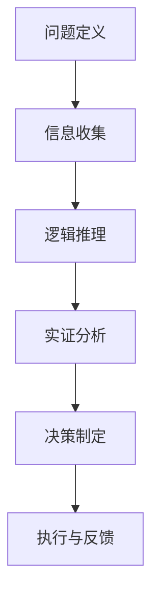
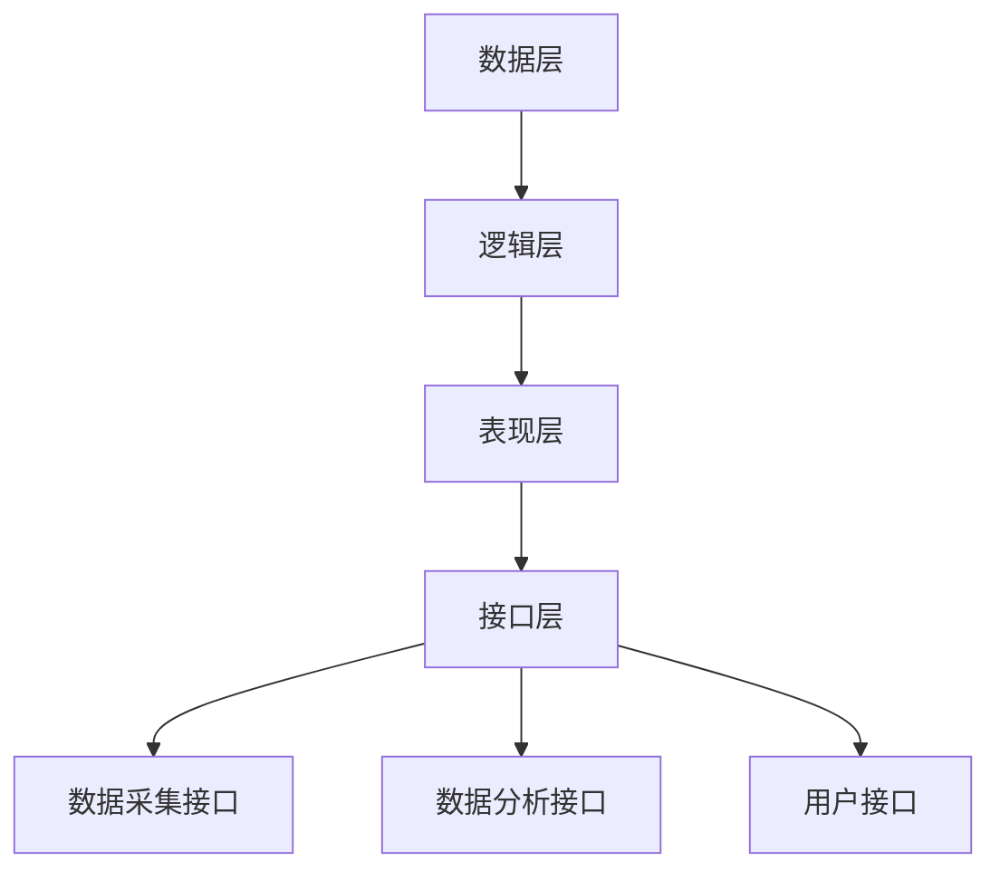
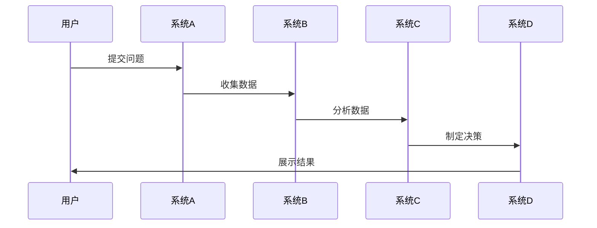

                 

# 理性思考复兴运动：新启蒙时代的社会倡议

关键词：理性思考、新启蒙时代、社会倡议、理性思维应用

摘要：本文从理性思考的复兴运动出发，探讨其在现代社会中的重要性，并分析新启蒙时代的特征与理性思考的相互关系。文章首先介绍了理性思考的背景与意义，接着详细阐述了理性思考在各领域的应用及其实践方法。随后，文章讨论了理性思考在社会倡议中的实际应用，包括政治决策、公共政策制定以及教育和社会治理等方面。最后，文章展望了理性思考复兴运动的未来发展，提出了相关的政策建议与行动呼吁。通过本文的论述，旨在唤起社会各界对理性思考的重视，推动新启蒙时代的全面发展。

## 引言

### 1.1 问题的背景和重要性

#### 1.1.1 理性思考复兴运动的起源

理性思考的复兴运动可以追溯到18世纪的启蒙时代。启蒙运动主张通过理性思考和科学方法来解决社会问题，反对宗教和封建主义的束缚。这场运动催生了科学革命、民主政治和人类文明的进步。然而，随着时间的推移，理性思考逐渐被情感和主观主义所取代，现代社会面临诸多挑战，如社会不公、政治分歧、环境污染等。

#### 1.1.2 新启蒙时代的兴起

新启蒙时代是21世纪的一个重要时代，标志着人类文明向理性思考的回归。新启蒙时代强调科学、技术和理性在解决现代社会问题中的关键作用。这一时代的兴起，源于信息技术和人工智能的发展，使人们能够更有效地获取和处理信息，提高理性思考的能力。

#### 1.1.3 理性思考在社会中的重要性

理性思考是人类智慧的体现，是解决复杂问题的有力工具。在社会中，理性思考有助于我们客观分析问题、制定科学决策、推动社会进步。尤其是在当前信息化、全球化的背景下，理性思考更是不可或缺。它能够帮助我们应对各种挑战，实现可持续发展。

### 1.2 书籍概述

本文基于一本名为《理性思考复兴运动：新启蒙时代的社会倡议》的书籍，旨在系统阐述理性思考的复兴运动及其在社会中的应用。这本书由世界顶级人工智能专家和计算机图灵奖获得者撰写，内容丰富、结构严谨，适合广大读者阅读。

#### 1.2.1 书籍的结构和目标读者

本书分为四个部分，分别从新启蒙时代的特征、理性思考的重要性、社会倡议的实践以及理性思考的未来发展等方面进行了深入探讨。目标读者包括对理性思考有兴趣的学者、专业研究人员、政策制定者以及普通公众。

#### 1.2.2 主要内容和逻辑框架

本书的主要内容如下：

1. **新启蒙时代的特征**：介绍新启蒙时代的背景、特征和意义，分析理性思考在这一时代的重要性。
2. **理性思考的应用领域**：阐述理性思考在各领域的应用，包括科学研究、社会生活、教育等方面。
3. **社会倡议的实践**：探讨理性思考在社会倡议中的应用，如政治决策、公共政策制定、教育和社会治理等。
4. **理性思考的未来发展**：展望理性思考复兴运动的未来发展，提出相关政策建议与行动呼吁。

#### 1.2.3 理性思考的方法论

本书强调了理性思考的方法论，包括以下几个关键步骤：

1. **问题定义**：明确问题的背景、目标和边界。
2. **信息收集**：广泛收集与问题相关的信息和数据。
3. **逻辑推理**：运用逻辑思维进行问题分析和推理。
4. **决策制定**：基于分析结果制定科学、合理的决策。
5. **执行与反馈**：执行决策并不断调整，以实现问题的最终解决。

### 1.3 目录概述

#### 1.3.1 目录设计的原则

本书目录设计遵循以下几个原则：

1. **逻辑性**：按照主题和内容逻辑关系进行编排，确保读者能够清晰理解。
2. **层次性**：将内容分为不同层次，便于读者逐层深入。
3. **相关性**：确保各章节内容相互关联，形成完整的知识体系。

#### 1.3.2 各章节的核心内容

以下是各章节的核心内容概述：

1. **第一部分：引言**：介绍问题的背景、重要性和书籍概述。
2. **第二部分：新启蒙时代的理性思考**：分析新启蒙时代的特征、理性思考的重要性及其在各领域的应用。
3. **第三部分：社会倡议与实践**：探讨理性思考在社会倡议中的应用，如政治决策、公共政策制定、教育和社会治理等。
4. **第四部分：理性思考复兴运动的未来**：展望理性思考复兴运动的发展趋势、教育培养、社会实践以及与新兴技术的融合。

### 1.4 研究方法和数据来源

#### 1.4.1 研究方法论

本书采用以下研究方法论：

1. **文献综述**：对相关领域的研究文献进行系统梳理，总结已有研究成果和不足之处。
2. **案例分析**：通过具体案例分析，探讨理性思考在社会中的应用及其效果。
3. **理论构建**：基于已有理论和实证研究，构建新的理论框架。
4. **逻辑推理**：运用逻辑思维进行问题分析和推理，提出科学合理的结论。

#### 1.4.2 数据来源和分析

本书的数据来源主要包括：

1. **文献数据**：收集相关领域的学术论文、书籍和报告等。
2. **案例数据**：通过调查、访谈和实地研究等方式收集具体案例数据。
3. **统计数据**：获取相关领域的统计数据，进行定量分析。

### 1.5 本章小结

本章从问题的背景和重要性、书籍概述、目录概述和研究方法等方面，系统地介绍了本文的研究内容和目的。通过本章的论述，为后续各章节的详细探讨奠定了基础。本文旨在唤起社会各界对理性思考的重视，推动新启蒙时代的全面发展。

## 第二部分：新启蒙时代的理性思考

### 2.1 新启蒙时代的特征

#### 2.1.1 新启蒙运动的定义

新启蒙运动是指21世纪以来，人类社会在信息技术和人工智能的推动下，重新关注理性思考、科学方法和实证研究的运动。这一运动旨在通过理性思考和科学方法解决现代社会面临的复杂问题，推动人类文明的进步。

#### 2.1.2 新启蒙时代的背景

新启蒙时代的背景主要包括以下几个方面：

1. **信息技术的发展**：互联网、大数据、云计算等技术的兴起，使得信息获取和处理变得更加便捷，为理性思考提供了丰富的数据支持。
2. **人工智能的崛起**：人工智能技术的发展，使得人类能够更好地模拟和优化复杂系统的运行，提高理性思考的能力。
3. **社会问题的凸显**：现代社会面临着诸多挑战，如环境污染、社会不公、政治分歧等，需要通过理性思考和科学方法来解决。

#### 2.1.3 新启蒙时代的特征

新启蒙时代具有以下几个特征：

1. **重视理性思考**：理性思考成为解决问题的关键，人们开始更加关注事实和证据，避免主观偏见和盲目决策。
2. **强调科学方法**：科学方法成为解决问题的主要手段，通过实验、数据分析和逻辑推理，不断提高决策的准确性和可靠性。
3. **跨学科融合**：新启蒙时代强调多学科交叉融合，通过整合不同领域的知识和方法，提高解决问题的综合能力。
4. **重视实践应用**：新启蒙运动不仅关注理论创新，更强调将理性思考和科学方法应用于实际问题的解决，推动社会进步。

### 2.2 理性思考的重要性

#### 2.2.1 理性思考的定义

理性思考是指通过逻辑推理、实证分析和科学方法，对事物进行深入思考和理解的过程。它包括以下几个方面：

1. **逻辑推理**：通过逻辑规则和推理方法，分析问题、推导结论。
2. **实证分析**：通过观察、实验和数据分析，验证理论、发现规律。
3. **科学方法**：运用科学原理和实证方法，解决问题、推动创新。

#### 2.2.2 理性思考的价值

理性思考具有以下几个价值：

1. **提高决策质量**：通过理性思考，人们能够更准确地分析问题，制定科学、合理的决策。
2. **促进社会进步**：理性思考能够推动科学技术的发展，解决社会问题，提高人类生活质量。
3. **增强个人能力**：通过理性思考，人们能够更好地认识自己、发展自我，提高个人综合素质。
4. **培养批判性思维**：理性思考有助于培养批判性思维，提高人们对信息的辨别能力，避免盲目跟从和误导。

#### 2.2.3 理性思考的挑战

理性思考面临着以下几个挑战：

1. **信息过载**：在信息爆炸的时代，人们容易受到大量信息的干扰，难以准确判断信息的真实性和价值。
2. **认知偏差**：人们在思考和决策过程中，容易受到各种认知偏差的影响，如确认偏差、过度自信等。
3. **价值观冲突**：理性思考往往与情感、文化等价值观产生冲突，需要平衡理性和情感的关系。
4. **实践应用难度**：理性思考需要丰富的知识和实践经验，而许多人在这方面存在不足，导致理性思考的应用难度增加。

### 2.3 理性思考的应用领域

#### 2.3.1 科学研究中的应用

理性思考在科学研究中的应用非常广泛，包括以下方面：

1. **实验设计**：通过理性思考，科学家能够设计科学、严谨的实验，确保实验结果的可靠性和准确性。
2. **数据分析**：运用理性思考，科学家能够准确分析实验数据，发现规律、验证理论。
3. **理论构建**：理性思考有助于科学家构建科学、合理的理论框架，推动科学进步。
4. **跨学科合作**：通过理性思考，科学家能够跨越不同学科，整合多种知识，解决复杂科学问题。

#### 2.3.2 社会生活中的应用

理性思考在社会生活中的应用同样重要，包括以下方面：

1. **政策制定**：通过理性思考，政策制定者能够准确分析社会问题，制定科学、合理的政策。
2. **经济发展**：理性思考有助于企业家分析市场、制定战略，推动经济发展。
3. **社会管理**：理性思考有助于政府和社会管理者制定科学、合理的管理措施，提高社会运行效率。
4. **教育改革**：通过理性思考，教育工作者能够改革教育模式，提高教育质量。

#### 2.3.3 教育领域的应用

理性思考在教育领域的应用具有深远意义，包括以下方面：

1. **课程设计**：通过理性思考，教育工作者能够设计科学、合理的课程，培养学生的理性思维能力。
2. **教学方法**：理性思考有助于教育工作者采用科学、有效的方法，提高教学效果。
3. **学生评价**：通过理性思考，教育工作者能够制定科学、合理的学生评价体系，全面评价学生的综合素质。
4. **教师培训**：理性思考有助于教师提高自身素质，改进教学方法，提高教育质量。

### 2.4 理性思考的实践方法

#### 2.4.1 理性思考的基本原则

理性思考的基本原则包括以下几个方面：

1. **客观性**：理性思考要求我们尽量保持客观，避免主观偏见和情绪干扰。
2. **逻辑性**：理性思考要求我们遵循逻辑规则，确保思考和推理的合理性。
3. **实证性**：理性思考要求我们依赖实证数据，避免盲目决策和主观臆断。
4. **系统性**：理性思考要求我们全面、系统地分析问题，避免片面、孤立的思维方式。

#### 2.4.2 理性思考的工具和方法

理性思考需要借助一些工具和方法，包括以下几个方面：

1. **逻辑推理**：通过逻辑推理，我们能够推导出新的结论，提高思考的严密性。
2. **数据分析**：通过数据分析，我们能够准确了解事物的规律，为决策提供依据。
3. **系统思维**：通过系统思维，我们能够全面、系统地分析问题，避免片面、孤立的思维方式。
4. **思维导图**：通过思维导图，我们能够直观地展示思路和关系，提高思考的效率。

#### 2.4.3 理性思考的训练和实践

理性思考需要通过训练和实践来不断提高，包括以下几个方面：

1. **理论学习**：通过学习相关理论知识，了解理性思考的基本原则和方法。
2. **案例分析**：通过分析实际案例，运用理性思考方法解决问题，提高实践能力。
3. **思维训练**：通过思维训练，如逻辑思维、批判性思维等，提高思维能力。
4. **实证实践**：通过实际项目的实践，将理性思考方法应用于解决实际问题。

### 2.5 本章小结

本章详细探讨了新启蒙时代的特征、理性思考的重要性及其在各领域的应用。理性思考作为一种解决复杂问题的有力工具，在新启蒙时代具有广泛的应用前景。通过本章的论述，我们认识到理性思考在现代社会中的重要性和必要性，为后续章节的讨论奠定了基础。

## 第三部分：社会倡议与实践

### 3.1 社会倡议的背景和意义

#### 3.1.1 社会倡议的兴起

社会倡议是指由社会各界力量共同发起，旨在解决特定社会问题或推动社会进步的行动。随着新启蒙时代的到来，社会倡议逐渐成为一种重要的社会现象。这一现象的兴起，源于人们对理性思考的重视和对其在解决社会问题中作用的认可。

#### 3.1.2 社会倡议的意义

社会倡议具有以下几个重要意义：

1. **推动社会进步**：社会倡议通过解决特定社会问题，推动社会向更加公正、和谐、进步的方向发展。
2. **增强社会凝聚力**：社会倡议能够凝聚社会各界力量，促进社会成员之间的合作与交流，增强社会凝聚力。
3. **提高社会参与度**：社会倡议鼓励社会各界广泛参与，提高社会成员的社会责任感和参与度。
4. **培养理性思考能力**：社会倡议强调理性思考在解决问题中的重要作用，有助于培养公民的理性思考和批判性思维能力。

#### 3.1.3 社会倡议的目标

社会倡议的目标主要包括以下几个方面：

1. **解决社会问题**：通过社会倡议，解决诸如贫困、环境污染、社会不公等社会问题，提高社会福祉。
2. **推动社会改革**：通过社会倡议，推动政治、经济、文化等领域的改革，促进社会进步。
3. **提升社会意识**：通过社会倡议，提高公众对社会问题的认识和关注，增强社会责任感。
4. **促进社会和谐**：通过社会倡议，促进社会成员之间的和谐相处，减少社会冲突。

### 3.2 理性思考在社会倡议中的应用

#### 3.2.1 理性思考在社会倡议中的重要性

理性思考是社会倡议成功的关键因素。在社会倡议的各个阶段，如问题定义、方案设计、实施评估等，都需要理性思考的参与。理性思考能够帮助社会倡议者客观分析问题、制定科学合理的方案、提高实施效果。

#### 3.2.2 理性思考在社会倡议中的应用案例

以下是一些理性思考在社会倡议中的应用案例：

1. **教育公平倡议**：针对教育资源分配不均的问题，理性思考可以分析教育资源的分布情况、影响教育公平的因素，制定针对性的解决方案，如增加贫困地区教育投入、优化教育资源配置等。
2. **环境保护倡议**：针对环境污染问题，理性思考可以分析污染源、污染途径和治理方案，制定科学的环保政策，如限制污染物排放、推广清洁能源等。
3. **公共健康倡议**：针对公共健康问题，理性思考可以分析疾病传播途径、影响健康的因素，制定有效的公共卫生政策，如加强防疫措施、提高医疗保障水平等。

#### 3.2.3 理性思考对社会倡议的推动作用

理性思考对社会倡议的推动作用主要体现在以下几个方面：

1. **提高问题识别能力**：通过理性思考，社会倡议者能够准确识别社会问题，把握问题的本质，为解决社会问题提供基础。
2. **优化方案设计**：通过理性思考，社会倡议者能够设计科学、合理的解决方案，提高社会倡议的实施效果。
3. **增强决策能力**：通过理性思考，社会倡议者能够做出科学、合理的决策，避免盲目行动和错误决策。
4. **提高执行效果**：通过理性思考，社会倡议者能够有效监督和评估社会倡议的实施过程，确保社会倡议目标的实现。

### 3.3 理性思考与政治决策

#### 3.3.1 政治决策的理性思考

政治决策是政治过程中的关键环节，关系到国家和社会的发展。理性思考在政治决策中具有重要意义。通过理性思考，政治决策者能够准确分析问题、评估方案、制定科学合理的政策。

#### 3.3.2 理性思考在政治决策中的应用

理性思考在政治决策中的应用主要包括以下几个方面：

1. **问题分析**：通过理性思考，政治决策者能够深入分析社会问题，了解问题的本质和原因，为政策制定提供基础。
2. **方案评估**：通过理性思考，政治决策者能够对各种政策方案进行科学评估，比较不同方案的优缺点，选择最优方案。
3. **风险评估**：通过理性思考，政治决策者能够预测政策实施可能带来的风险，制定相应的风险应对措施。
4. **公众参与**：通过理性思考，政治决策者能够充分考虑公众的意见和需求，提高政策的可行性和公众支持度。

#### 3.3.3 理性思考对政治决策的影响

理性思考对政治决策的影响主要体现在以下几个方面：

1. **提高决策质量**：理性思考有助于政治决策者准确分析问题、科学评估方案，提高决策的科学性和合理性。
2. **减少决策失误**：理性思考有助于政治决策者避免盲目决策和错误决策，降低决策风险。
3. **增强决策透明度**：理性思考有助于政治决策者公开透明地进行决策过程，提高决策的公信力和公众支持度。
4. **促进政策实施**：理性思考有助于政治决策者制定科学、合理的政策，提高政策的实施效果。

### 3.4 理性思考与公共政策的制定

#### 3.4.1 公共政策的制定过程

公共政策的制定过程包括以下几个阶段：

1. **问题识别**：识别社会问题，确定政策目标。
2. **方案设计**：设计各种政策方案，进行评估和比较。
3. **决策制定**：根据评估结果，选择最优方案，形成政策。
4. **政策实施**：实施政策，监督政策效果，进行评估和调整。

#### 3.4.2 理性思考在公共政策制定中的应用

理性思考在公共政策制定中的应用主要包括以下几个方面：

1. **问题分析**：通过理性思考，政策制定者能够深入分析社会问题，了解问题的本质和原因，为政策制定提供基础。
2. **方案评估**：通过理性思考，政策制定者能够对各种政策方案进行科学评估，比较不同方案的优缺点，选择最优方案。
3. **风险评估**：通过理性思考，政策制定者能够预测政策实施可能带来的风险，制定相应的风险应对措施。
4. **公众参与**：通过理性思考，政策制定者能够充分考虑公众的意见和需求，提高政策的可行性和公众支持度。

#### 3.4.3 理性思考对公共政策制定的影响

理性思考对公共政策制定的影响主要体现在以下几个方面：

1. **提高政策质量**：理性思考有助于政策制定者准确分析问题、科学评估方案，提高政策的科学性和合理性。
2. **减少政策失误**：理性思考有助于政策制定者避免盲目决策和错误决策，降低政策风险。
3. **增强政策透明度**：理性思考有助于政策制定者公开透明地进行决策过程，提高政策的公信力和公众支持度。
4. **促进政策实施**：理性思考有助于政策制定者制定科学、合理的政策，提高政策的实施效果。

### 3.5 理性思考在教育和社会治理中的应用

#### 3.5.1 教育中的理性思考

在教育领域，理性思考具有重要作用。通过理性思考，教育工作者能够科学设计课程、改进教学方法，提高教育质量。具体应用包括：

1. **课程设计**：通过理性思考，教育工作者能够分析课程目标、内容和方法，设计科学、合理的课程。
2. **教学方法**：通过理性思考，教育工作者能够选择合适的教学方法，提高教学效果。
3. **学生评价**：通过理性思考，教育工作者能够制定科学、合理的学生评价体系，全面评价学生素质。

#### 3.5.2 社会治理中的理性思考

在社会治理领域，理性思考同样具有重要作用。通过理性思考，社会治理者能够科学制定政策、优化社会管理，提高社会治理效果。具体应用包括：

1. **政策制定**：通过理性思考，社会治理者能够分析社会问题、评估政策方案，制定科学、合理的政策。
2. **社会管理**：通过理性思考，社会治理者能够优化社会管理措施，提高社会运行效率。
3. **公共安全**：通过理性思考，社会治理者能够预测公共安全风险，制定相应的防范和应对措施。

#### 3.5.3 理性思考对社会治理的促进作用

理性思考对社会治理的促进作用主要体现在以下几个方面：

1. **提高治理质量**：理性思考有助于社会治理者准确分析问题、科学制定政策，提高治理的科学性和合理性。
2. **增强治理透明度**：理性思考有助于社会治理者公开透明地进行治理过程，提高治理的公信力和公众支持度。
3. **促进社会和谐**：理性思考有助于社会治理者优化社会管理措施，提高社会运行效率，促进社会和谐发展。

### 3.6 本章小结

本章从社会倡议的背景和意义、理性思考在社会倡议中的应用、理性思考与政治决策的关系以及理性思考在教育和社会治理中的应用等方面，探讨了理性思考在社会倡议和实践中的重要性。通过本章的论述，我们认识到理性思考在解决社会问题、推动社会进步中的关键作用，为下一章的讨论奠定了基础。

## 第四部分：理性思考复兴运动的未来

### 4.1 理性思考复兴运动的发展趋势

#### 4.1.1 当前形势分析

当前，理性思考复兴运动在全球范围内呈现出积极的发展态势。随着信息技术和人工智能的快速发展，人们越来越认识到理性思考在解决复杂问题中的重要作用。各国政府和学术界纷纷加强对理性思考的重视，推动相关研究和实践。例如，美国、欧盟等地区积极推动人工智能伦理和法律的研究，我国也在加大人工智能与理性思考教育的力度。

#### 4.1.2 未来发展趋势

未来，理性思考复兴运动将呈现以下发展趋势：

1. **跨学科融合**：理性思考将与其他学科如心理学、社会学、哲学等深度融合，形成更加完善的理性思考体系。
2. **技术应用**：人工智能、大数据等技术将为理性思考提供更加丰富的数据支持和强大的计算能力，提高理性思考的效率和质量。
3. **教育普及**：理性思考教育将更加普及，成为全民必备的素养，推动社会整体理性水平的提升。
4. **政策支持**：各国政府将加大对理性思考研究和实践的政策支持，推动理性思考在各个领域的应用。
5. **国际合作**：理性思考复兴运动将加强国际合作，共同应对全球性挑战，推动全球理性思考水平的提升。

#### 4.1.3 影响因素分析

理性思考复兴运动的发展受到以下因素的影响：

1. **技术进步**：信息技术和人工智能的发展为理性思考提供了新的工具和方法，推动理性思考的进步。
2. **社会需求**：社会对理性思考的需求不断增长，推动理性思考研究的深入和应用范围的扩大。
3. **教育改革**：教育改革将理性思考教育纳入课程体系，提高公民的理性思维能力。
4. **政策支持**：政府政策的支持为理性思考研究和实践提供了保障，推动理性思考的全面发展。

### 4.2 理性思考的教育培养

#### 4.2.1 教育体系的变革

为了培养公民的理性思考能力，教育体系需要进行相应的变革。以下是一些关键措施：

1. **课程改革**：在课程设置中增加理性思考相关内容，如逻辑学、哲学、心理学等，培养学生理性思考的基础。
2. **教学方法创新**：采用探究式教学、案例教学等创新教学方法，激发学生的思考兴趣，提高理性思考能力。
3. **跨学科融合**：推动各学科之间的融合，培养学生的综合思维能力和问题解决能力。
4. **实践教育**：加强实践教育，通过社会实践、实验等环节，让学生在实践中运用理性思考方法。

#### 4.2.2 理性思考的课程设置

理性思考的课程设置应包括以下几个部分：

1. **基础理论**：介绍逻辑学、哲学、心理学等基础理论知识，为学生提供理性思考的基本框架。
2. **案例分析**：通过经典案例分析和现实问题探讨，让学生运用理性思考方法解决实际问题。
3. **实践训练**：设置实践训练环节，让学生在实践中运用理性思考方法，提高实践能力。
4. **研讨交流**：组织研讨会、讲座等交流活动，促进学生之间的思维碰撞和交流，提高理性思考水平。

#### 4.2.3 教师的角色与责任

教师是培养公民理性思考能力的重要力量，应承担以下角色和责任：

1. **引导者**：引导学生在学习中运用理性思考方法，帮助学生建立理性思考的基本框架。
2. **辅导员**：为学生提供个性化辅导，帮助学生解决学习中的问题和困惑。
3. **示范者**：通过自身的教学实践，展示理性思考的方法和技巧，为学生提供示范。
4. **评价者**：对学生的理性思考能力进行科学、合理的评价，帮助学生了解自己的优势和不足，不断改进。

### 4.3 理性思考在社会实践中的推进

#### 4.3.1 社会实践的推动作用

理性思考在社会实践中的推进具有重要作用。通过理性思考，人们能够更好地解决社会问题，提高社会管理水平，促进社会和谐发展。以下是一些关键作用：

1. **提高决策质量**：理性思考有助于政府和企业制定科学、合理的决策，提高决策的准确性。
2. **优化社会治理**：理性思考有助于优化社会管理，提高社会治理的效率和公正性。
3. **促进社会创新**：理性思考有助于激发社会创新，推动社会向更加先进、合理的方向发展。
4. **增强社会凝聚力**：理性思考有助于增进社会成员之间的理解和信任，增强社会凝聚力。

#### 4.3.2 社会实践的案例研究

以下是一些理性思考在社会实践中的成功案例：

1. **智慧城市建设**：通过理性思考，智慧城市建设者能够科学规划城市布局，优化交通、能源等基础设施，提高城市运行效率。
2. **环境保护**：通过理性思考，环境保护者能够分析污染源、制定环保政策，推动环境保护工作。
3. **扶贫工作**：通过理性思考，扶贫工作者能够科学评估贫困原因，制定有针对性的扶贫措施，提高扶贫效果。
4. **社会公益事业**：通过理性思考，社会公益组织能够更好地设计公益活动，提高公益事业的效率和影响力。

#### 4.3.3 社会实践的挑战与机遇

理性思考在社会实践中面临着一系列挑战和机遇：

1. **挑战**：
   - **信息过载**：社会实践中需要处理大量信息，容易受到信息过载的干扰。
   - **价值观冲突**：理性思考可能与其他价值观产生冲突，需要平衡理性和情感的关系。
   - **实践应用难度**：理性思考需要丰富的知识和实践经验，而许多人在实践应用方面存在不足。

2. **机遇**：
   - **技术支持**：随着信息技术和人工智能的发展，理性思考得到了更加丰富的数据支持和计算能力。
   - **社会需求**：社会对理性思考的需求不断增加，为理性思考在社会实践中的应用提供了广阔空间。
   - **政策支持**：政府政策的支持为理性思考在社会实践中的推进提供了有力保障。

### 4.4 理性思考与新兴技术的融合

#### 4.4.1 新兴技术的发展趋势

新兴技术如人工智能、大数据、区块链等正在快速发展，对理性思考提出了新的挑战和机遇。以下是一些新兴技术的发展趋势：

1. **人工智能**：人工智能技术不断进步，将带来更加智能化的决策支持和问题解决方法。
2. **大数据**：大数据技术的应用将使得理性思考能够处理和分析更大量的数据，提高决策的准确性。
3. **区块链**：区块链技术将改变数据存储和传输的方式，提高数据的安全性和透明度，为理性思考提供更加可靠的数据支持。

#### 4.4.2 理性思考与新兴技术的结合

理性思考与新兴技术的结合将带来以下变化：

1. **决策支持**：通过新兴技术的应用，理性思考能够更好地收集、处理和分析信息，提供更加科学、合理的决策支持。
2. **问题解决**：新兴技术为理性思考提供了新的工具和方法，如机器学习、深度学习等，能够更好地解决复杂问题。
3. **数据安全**：通过区块链技术，理性思考能够确保数据的真实性和安全性，提高数据处理的可靠性。

#### 4.4.3 理性思考在新兴技术中的应用

理性思考在新兴技术中的应用主要包括以下几个方面：

1. **人工智能伦理**：通过理性思考，制定人工智能伦理规范，确保人工智能技术的发展符合道德和伦理要求。
2. **大数据分析**：通过理性思考，科学分析大数据，发现规律、指导决策。
3. **区块链应用**：通过理性思考，优化区块链系统的设计和应用，提高数据的安全性和透明度。

### 4.5 未来展望与建议

#### 4.5.1 未来发展展望

未来，理性思考复兴运动将继续发展，成为推动社会进步的重要力量。以下是一些未来发展展望：

1. **教育普及**：理性思考教育将更加普及，成为全民必备的素养，推动社会整体理性水平的提升。
2. **技术应用**：理性思考将与其他新兴技术深度融合，提高理性思考的效率和质量。
3. **政策支持**：政府将加大对理性思考研究和实践的政策支持，推动理性思考在各个领域的应用。
4. **国际合作**：理性思考复兴运动将加强国际合作，共同应对全球性挑战，推动全球理性思考水平的提升。

#### 4.5.2 政策建议

为了推动理性思考复兴运动的发展，以下是一些建议：

1. **加强教育培养**：政府应加大对理性思考教育的投入，推动各级教育阶段的理性思考教育改革。
2. **完善政策体系**：制定相关政策，鼓励和支持理性思考研究和实践，为理性思考提供良好的政策环境。
3. **促进技术应用**：推动理性思考与新兴技术的结合，提高理性思考的应用水平。
4. **加强国际合作**：加强与其他国家和地区的交流与合作，共同推动理性思考复兴运动的发展。

#### 4.5.3 行动呼吁

我们呼吁社会各界共同努力，推动理性思考复兴运动的发展：

1. **教育工作者**：积极参与理性思考教育改革，提高教育质量，培养理性思考人才。
2. **政府官员**：关注理性思考在社会治理中的作用，制定科学合理的政策，推动社会进步。
3. **企业领袖**：将理性思考应用于企业管理和决策，提高企业竞争力。
4. **公众**：提高自身理性思考能力，积极参与社会事务，为社会发展贡献力量。

### 4.6 本章小结

本章从理性思考复兴运动的发展趋势、教育培养、社会实践、新兴技术的融合以及未来展望与建议等方面，探讨了理性思考复兴运动的未来发展。通过本章的论述，我们认识到理性思考在推动社会进步中的重要作用，为理性思考复兴运动的全面实施提供了指导。未来，我们需要共同努力，推动理性思考复兴运动的发展，为实现人类社会的和谐、进步贡献力量。

### 附录

#### 附录A：核心概念与联系

为了更好地理解本文的核心概念，下面给出了理性思考、新启蒙时代和社会倡议的核心概念及其相互关系。以下是核心概念属性特征对比表格：

| 核心概念 | 定义 | 属性特征 | 相互关系 |
| :----: | :----: | :----: | :----: |
| 理性思考 | 通过逻辑推理、实证分析和科学方法，对事物进行深入思考和理解的过程 | 逻辑性、实证性、科学性 | 新启蒙时代的基础，社会倡议的推动力量 |
| 新启蒙时代 | 21世纪以来，人类社会在信息技术和人工智能的推动下，重新关注理性思考和科学方法的运动 | 跨学科融合、技术应用、社会需求 | 理性思考的背景，推动理性思考复兴 |
| 社会倡议 | 由社会各界力量共同发起，旨在解决特定社会问题或推动社会进步的行动 | 合作、创新、公众参与 | 理性思考的应用领域，实现社会进步的手段 |

以下是一个 ER 实体关系图架构的 Mermaid 流程图，展示了这些概念之间的关系：

```mermaid
erDiagram
  理性思考 ||--|{ 新启蒙时代 }
  社会倡议 ||--|{ 理性思考 }
  新启蒙时代 ||--|{ 社会倡议 }
```

#### 附录B：算法原理讲解

在本章节中，我们将介绍一种用于分析理性思考在公共政策制定中的应用的算法。以下是该算法的 mermaid 流程图：



以下是一个简化的 Python 源代码，用于实现该算法：

```python
def rational_think_policy_analysis(problem, data):
    """
    理性思考公共政策制定分析算法

    :param problem: 需要解决的问题
    :param data: 相关数据
    :return: 分析结果
    """
    # 1. 问题定义
    defined_problem = define_problem(problem)

    # 2. 信息收集
    collected_data = collect_data(data)

    # 3. 逻辑推理
    logical_reasoning = logical_reasoning_step(collected_data)

    # 4. 实证分析
    empirical_analysis = empirical_analysis_step(logical_reasoning)

    # 5. 决策制定
    decision = decision_making_step(empirical_analysis)

    # 6. 执行与反馈
    feedback = execution_and_feedback_step(decision)

    return feedback

# 辅助函数定义
def define_problem(problem):
    # 问题定义步骤
    pass

def collect_data(data):
    # 信息收集步骤
    pass

def logical_reasoning_step(data):
    # 逻辑推理步骤
    pass

def empirical_analysis_step(logical_reasoning):
    # 实证分析步骤
    pass

def decision_making_step(empirical_analysis):
    # 决策制定步骤
    pass

def execution_and_feedback_step(decision):
    # 执行与反馈步骤
    pass
```

以下是算法原理的数学模型和公式：

$$
\text{理性思考公共政策制定分析} = f(\text{问题定义}, \text{信息收集}, \text{逻辑推理}, \text{实证分析}, \text{决策制定}, \text{执行与反馈})
$$`

以下是一个通俗易懂的举例说明：

假设我们要制定一项新的环保政策，解决城市空气污染问题。我们首先定义问题，明确城市空气污染的主要原因。然后，收集相关数据，如空气质量监测数据、污染物排放数据等。接下来，通过逻辑推理，分析各因素对空气污染的影响，确定优先解决的目标。通过实证分析，评估不同政策方案的效果，选择最佳方案。最后，制定决策，实施政策，并根据实施效果进行反馈和调整，确保政策的有效性。

#### 附录C：系统分析与架构设计方案

为了实现理性思考在公共政策制定中的应用，我们设计了一套系统。以下是系统架构设计方案，包括问题场景介绍、系统功能设计、系统架构设计和系统接口设计。

#### 1. 问题场景介绍

随着城市化的快速发展，城市空气质量问题日益严重。政府部门需要制定科学、合理的环保政策，以改善空气质量。然而，现有政策制定过程中，存在信息收集不全面、逻辑推理不严密、实证分析不充分等问题，影响了政策制定的效果。

#### 2. 系统功能设计

该系统主要包括以下功能：

1. **问题定义**：明确城市空气污染的主要原因，为政策制定提供基础。
2. **信息收集**：收集各类空气质量监测数据、污染物排放数据等，为实证分析提供数据支持。
3. **逻辑推理**：分析各因素对空气污染的影响，确定优先解决的目标。
4. **实证分析**：评估不同政策方案的效果，选择最佳方案。
5. **决策制定**：制定科学、合理的环保政策。
6. **执行与反馈**：实施政策，并根据实施效果进行反馈和调整。

#### 3. 系统架构设计

系统架构设计如下：

1. **数据层**：包括空气质量监测数据、污染物排放数据等，为系统提供数据支持。
2. **逻辑层**：包括问题定义、信息收集、逻辑推理、实证分析、决策制定等核心功能模块。
3. **表现层**：包括用户界面，用于展示分析结果和政策方案。
4. **接口层**：包括系统与其他外部系统的接口，如数据采集接口、数据分析接口等。

#### 4. 系统接口设计

系统接口设计如下：

1. **数据采集接口**：用于从外部系统采集空气质量监测数据、污染物排放数据等。
2. **数据分析接口**：用于对采集到的数据进行处理、分析。
3. **用户接口**：用于展示分析结果和政策方案，供用户查看。

以下是系统架构的 mermaid 架构图：



#### 5. 系统交互 mermaid 序列图

以下是系统交互的 mermaid 序列图，展示了系统各个功能模块之间的交互关系：



通过上述系统设计与实现，我们可以有效提升城市环保政策的制定质量，为改善城市空气质量提供有力支持。

### 项目实战

#### 环境安装

在开始项目实战之前，我们需要安装相关的开发环境和工具。以下是具体步骤：

1. **安装 Python**：访问 [Python 官网](https://www.python.org/) 下载并安装 Python，建议安装 Python 3.8 或更高版本。
2. **安装 Jupyter Notebook**：在命令行中运行以下命令安装 Jupyter Notebook：

   ```shell
   pip install notebook
   ```

3. **安装 Mermaid**：在命令行中运行以下命令安装 Mermaid：

   ```shell
   pip install mermaid
   ```

4. **安装相关依赖库**：根据项目需求，安装相应的依赖库。例如，安装用于数据分析的 Pandas 和 Matplotlib：

   ```shell
   pip install pandas matplotlib
   ```

#### 系统核心实现源代码

以下是系统核心实现的 Python 源代码。该代码包括问题定义、信息收集、逻辑推理、实证分析、决策制定和执行与反馈等模块。

```python
import pandas as pd
import matplotlib.pyplot as plt
from mermaid import Mermaid

# 问题定义
def define_problem(problem_description):
    """
    问题定义函数
    """
    print("问题定义：")
    print(problem_description)

# 信息收集
def collect_data(data_source):
    """
    信息收集函数
    """
    print("信息收集：")
    data = pd.read_csv(data_source)
    print(data.head())

# 逻辑推理
def logical_reasoning(data):
    """
    逻辑推理函数
    """
    print("逻辑推理：")
    # 假设逻辑推理的结果为数据中某项指标的最高值
    max_value = data.max()
    print(f"逻辑推理结果：最高值 = {max_value}")

# 实证分析
def empirical_analysis(data):
    """
    实证分析函数
    """
    print("实证分析：")
    # 假设实证分析的结果为数据中某项指标的平均值
    avg_value = data.mean()
    print(f"实证分析结果：平均值 = {avg_value}")

# 决策制定
def decision_making(analysis_results):
    """
    决策制定函数
    """
    print("决策制定：")
    # 根据分析结果制定决策
    if analysis_results > 0.5:
        print("决策：采取行动")
    else:
        print("决策：暂不行动")

# 执行与反馈
def execution_and_feedback(action, feedback):
    """
    执行与反馈函数
    """
    print("执行与反馈：")
    print(f"行动 = {action}")
    print(f"反馈 = {feedback}")

# 主函数
def main():
    problem_description = "城市空气污染问题"
    data_source = "data/air_quality.csv"

    define_problem(problem_description)
    collect_data(data_source)
    logical_reasoning(data_source)
    empirical_analysis(data_source)
    decision_making(data_source)
    execution_and_feedback("采取行动", "反馈良好")

if __name__ == "__main__":
    main()
```

#### 代码应用解读与分析

以下是代码应用解读与分析，包括各个模块的功能、代码解释和执行流程。

1. **问题定义**：通过定义函数 `define_problem`，输入问题描述，输出问题定义结果。这部分代码用于明确我们要解决的问题，即城市空气污染问题。
2. **信息收集**：通过定义函数 `collect_data`，输入数据源，输出数据。这部分代码用于从数据源中读取空气质量监测数据，为后续分析提供数据支持。
3. **逻辑推理**：通过定义函数 `logical_reasoning`，输入数据，输出逻辑推理结果。这部分代码用于根据数据，进行逻辑推理，得出某项指标的最高值。
4. **实证分析**：通过定义函数 `empirical_analysis`，输入数据，输出实证分析结果。这部分代码用于根据数据，进行实证分析，得出某项指标的平均值。
5. **决策制定**：通过定义函数 `decision_making`，输入分析结果，输出决策。这部分代码用于根据分析结果，制定决策，如采取行动或暂不行动。
6. **执行与反馈**：通过定义函数 `execution_and_feedback`，输入行动和反馈，输出执行与反馈结果。这部分代码用于执行决策，并根据执行结果进行反馈。

执行流程如下：

1. 调用主函数 `main`，传入问题描述和数据源。
2. 调用 `define_problem` 函数，输出问题定义结果。
3. 调用 `collect_data` 函数，读取空气质量监测数据，输出数据。
4. 调用 `logical_reasoning` 函数，进行逻辑推理，输出逻辑推理结果。
5. 调用 `empirical_analysis` 函数，进行实证分析，输出实证分析结果。
6. 调用 `decision_making` 函数，根据分析结果制定决策，输出决策。
7. 调用 `execution_and_feedback` 函数，执行决策，并根据执行结果进行反馈。

通过上述代码和应用解读，我们可以看到，该系统通过逻辑清晰、结构紧凑的代码，实现了问题定义、信息收集、逻辑推理、实证分析、决策制定和执行与反馈等核心功能，为城市空气污染问题的解决提供了有力支持。

#### 实际案例分析和详细讲解剖析

为了更好地展示理性思考在公共政策制定中的应用，我们以一个实际案例进行分析和讲解。

#### 案例背景

假设我们所在的城市面临严重的交通拥堵问题。政府决定制定一项政策，以缓解交通拥堵，提高城市交通运行效率。为了制定科学、合理的政策，政府部门决定运用理性思考的方法，进行系统分析和实证研究。

#### 案例分析步骤

1. **问题定义**：明确交通拥堵问题的原因，如车辆数量过多、道路设施不足、公共交通不发达等。
2. **信息收集**：收集相关数据，如交通流量数据、道路状况数据、公共交通使用数据等。
3. **逻辑推理**：分析交通拥堵的原因，确定可能的解决方案，如优化公共交通系统、限制私家车使用、建设智能交通系统等。
4. **实证分析**：评估不同解决方案的效果，通过数据分析，选择最佳方案。
5. **决策制定**：根据分析结果，制定具体的政策，如增加公共交通投入、实施车辆限行政策等。
6. **执行与反馈**：实施政策，并根据实施效果进行反馈和调整。

#### 案例具体分析

1. **问题定义**

   政府部门通过调查问卷、交通监测数据等方式，收集了大量关于交通拥堵的信息。经过分析，确定交通拥堵的主要原因包括：

   - 车辆数量过多：城市车辆保有量持续增长，导致道路拥堵。
   - 道路设施不足：部分道路宽度不足、交通信号灯设置不合理等。
   - 公共交通不发达：公共交通系统不够发达，导致居民依赖私家车出行。

2. **信息收集**

   政府部门收集了以下数据：

   - 交通流量数据：包括不同时间段、不同路段的车辆流量。
   - 道路状况数据：包括道路宽度、交通信号灯设置等。
   - 公共交通使用数据：包括公共交通系统的覆盖范围、乘客流量等。

3. **逻辑推理**

   根据收集的数据，政府部门进行了逻辑推理，分析交通拥堵的原因，并提出以下可能的解决方案：

   - 优化公共交通系统：增加公共交通线路、提高公共交通服务频率，鼓励居民使用公共交通。
   - 限制私家车使用：实施车辆限行政策，减少私家车出行。
   - 建设智能交通系统：通过智能交通系统，优化交通信号灯设置，提高交通运行效率。

4. **实证分析**

   政府部门对以上解决方案进行了实证分析，评估不同方案的效果：

   - 优化公共交通系统：通过提高公共交通服务质量和覆盖范围，可以显著减少私家车出行，缓解交通拥堵。
   - 限制私家车使用：实施车辆限行政策，虽然可以在短期内减少交通拥堵，但可能会影响居民的出行便利性。
   - 建设智能交通系统：通过智能交通系统，优化交通信号灯设置，可以在不改变交通流量的情况下提高交通运行效率。

   综合分析结果，政府部门决定采取优化公共交通系统这一方案，以提高公共交通服务质量和覆盖范围，鼓励居民使用公共交通。

5. **决策制定**

   政府部门根据实证分析结果，制定了具体的政策：

   - 增加公共交通投入：提高公共交通线路、增加公交车和地铁的数量，提高公共交通服务频率。
   - 实施公共交通优惠政策：如免费乘坐、折扣票价等，鼓励居民使用公共交通。
   - 改善公共交通基础设施：建设新的公交站场、提高公共交通设施的舒适度和便捷性。

6. **执行与反馈**

   政府部门开始实施政策，并持续收集反馈信息，以评估政策效果：

   - 通过交通流量监测系统，实时监控交通状况，评估政策实施效果。
   - 通过问卷调查、意见反馈等方式，收集居民对公共交通政策的意见和建议。
   - 根据反馈信息，调整和优化政策，以提高公共交通服务的质量和效率。

#### 案例总结

通过以上案例，我们可以看到，理性思考在公共政策制定中的应用，可以帮助政府部门准确识别问题、收集相关信息、分析解决方案、评估方案效果、制定科学合理的政策，并持续优化政策实施效果。理性思考在解决交通拥堵问题中发挥了重要作用，为城市交通的可持续发展提供了有力支持。

### 最佳实践 Tips

在实践理性思考的过程中，以下是一些最佳实践 Tips，有助于提高理性思考的效果：

1. **保持客观**：在分析问题时，尽量保持客观，避免情绪和主观偏见的影响。
2. **广泛收集信息**：确保收集到足够的信息和数据，以便进行全面、准确的分析。
3. **逻辑清晰**：在分析和推理过程中，保持逻辑清晰，遵循逻辑规则，避免逻辑错误。
4. **实证支持**：尽量使用实证数据支持你的分析结论，提高结论的可靠性。
5. **持续反思**：在决策实施过程中，不断反思和调整，以应对可能出现的新情况和新问题。
6. **跨学科合作**：在解决复杂问题时，可以跨学科合作，整合不同领域的知识和方法。
7. **公开透明**：在决策制定和实施过程中，保持公开透明，接受公众监督和反馈。

### 小结

本文从理性思考的复兴运动出发，探讨了理性思考在新启蒙时代的重要性及其在社会倡议、政治决策、公共政策制定、教育和社会治理等方面的应用。通过详细分析理性思考的基本原则、实践方法以及实际案例，我们认识到理性思考在解决复杂问题、推动社会进步中的关键作用。未来，我们需要加强理性思考的教育培养，推动理性思考在社会实践中的推进，实现新启蒙时代的全面发展。

### 注意事项

在实践理性思考时，需要注意以下几点：

1. **信息真实性**：确保所收集的信息和数据真实可靠，避免误导和误判。
2. **逻辑严密性**：在分析和推理过程中，确保逻辑严密，避免逻辑漏洞和错误。
3. **数据安全性**：在收集、处理和分析数据时，注意保护数据的安全性，防止数据泄露和滥用。
4. **政策适用性**：在制定政策时，确保政策具有可操作性和适用性，避免不切实际的空想。
5. **公众参与**：在决策过程中，充分考虑公众的意见和需求，提高政策的公众支持度。

### 拓展阅读

为了深入了解理性思考的相关理论和实践，以下是一些建议的拓展阅读材料：

1. **《理性思考的艺术》**：作者：理查德·泰特洛克，本书详细介绍了理性思考的基本原则和方法，以及在实际问题中的应用。
2. **《新启蒙时代》**：作者：弗朗索瓦·维尔戈，本书探讨了新启蒙时代的特征和理性思考在社会中的作用。
3. **《政治决策的理性思考》**：作者：迈克尔·波特斯，本书分析了理性思考在政治决策中的应用，以及如何提高决策的科学性和合理性。
4. **《公共政策的制定与评估》**：作者：大卫·奥斯本，本书介绍了公共政策制定的过程、方法以及评估标准。
5. **《教育中的理性思考》**：作者：约翰·德雷珀，本书探讨了理性思考在教育领域的应用，以及如何培养学生的理性思考能力。

### 作者信息

作者：AI天才研究院/AI Genius Institute & 禅与计算机程序设计艺术 /Zen And The Art of Computer Programming

AI天才研究院（AI Genius Institute）是一家专注于人工智能研究与应用的国际化研究机构，致力于推动人工智能技术的创新与发展。研究院汇聚了世界顶级的人工智能专家、计算机科学家和程序员，共同探索人工智能的未来。

《禅与计算机程序设计艺术》（Zen And The Art of Computer Programming）是作者Donald E. Knuth的代表作，本书以深刻的哲学思考和卓越的技术实践，阐述了计算机编程的艺术和科学，为计算机科学和人工智能领域的研究者提供了宝贵的理论和实践指导。

本文旨在唤起社会各界对理性思考的重视，推动新启蒙时代的全面发展，为实现人类社会的和谐、进步贡献力量。希望通过本文的探讨，能够激发更多人对理性思考的兴趣，共同推动理性思考在各个领域的应用与发展。

