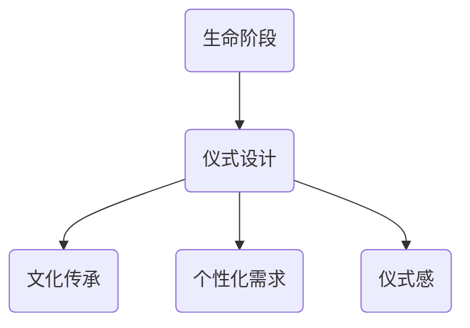

                 

### 设计现代人生命阶段仪式的组织

#### 背景介绍

在现代社会的快速发展中，人们的生活节奏不断加快，传统文化与现代生活方式的碰撞使得许多传统仪式逐渐被忽视。然而，仪式作为一种文化符号，承载着人类对生命阶段的重要认知与认同。因此，如何设计现代人生命阶段仪式，成为了一个亟待解决的问题。

**核心概念术语说明**

- **生命阶段**：指人类从出生到死亡过程中所经历的一系列重要时期，如出生、成长、成年、结婚、退休等。
- **仪式**：一种形式化的活动，通过特定的程序和形式，表达对特定事件或阶段的尊重和认同。
- **生命仪式策划**：根据不同生命阶段的特点，设计并组织相应的仪式活动。

**问题背景**

随着社会的发展，许多传统仪式逐渐消失或简化，现代人对于生命阶段的仪式感变得模糊。这种现象引发了人们对生命阶段仪式的重新关注。如何设计出符合现代人需求的生命阶段仪式，成为了一个重要的课题。

**问题描述**

设计现代人生命阶段仪式，需要考虑以下问题：

- **仪式的适应性**：如何使仪式适应现代社会的多元化和快节奏？
- **仪式的文化内涵**：如何保留和传承传统仪式的文化内涵？
- **仪式的实际可操作性**：如何确保仪式的执行过程简洁、高效，且具有仪式感？

**问题解决**

**边界与外延**

边界：现代人生命阶段仪式设计，主要涉及出生、成长、成年、结婚、退休等关键阶段。

外延：仪式设计不仅仅局限于传统形式，还可以结合现代科技、艺术等形式，创造具有时代特色的仪式。

**概念结构与核心要素组成**

1. **仪式设计原则**：确保仪式的适应性和文化内涵。
2. **仪式设计方法**：结合现代科技、艺术等形式，创造富有创意的仪式。
3. **仪式执行流程**：明确仪式的各个环节，确保仪式的顺利执行。

#### 核心概念与联系

**核心概念原理**

现代人生命阶段仪式的设计，需要考虑以下几个核心概念：

1. **文化传承**：仪式是文化传承的重要方式，需要在设计中保留传统仪式的文化内涵。
2. **个性化需求**：随着社会的发展，人们对于生命阶段仪式的需求日益多样，仪式设计需要考虑个性化需求。
3. **仪式感**：仪式的设计需要突出仪式感，增强人们对生命阶段的重要认知。

**概念属性特征对比表格**

| 概念               | 属性特征                                       | 对比 |
|--------------------|------------------------------------------------|-----|
| 文化传承           | 保留传统仪式的文化内涵                         |     |
| 个性化需求         | 考虑现代人多样化的需求                         |     |
| 仪式感             | 强调仪式的重要性，增强人们的认同感               |     |

**ER实体关系图架构**

#### 生命仪式策划师协会概述

**协会的历史与发展**

生命仪式策划师协会起源于20世纪初，当时社会学家和文化研究者开始关注传统仪式的消失现象。协会的创立旨在通过研究和推广仪式文化，促进现代人生命阶段仪式的设计和实施。

**协会的职能与组织结构**

**职能**：

- 研究现代人生阶段仪式的需求和现状。
- 推广和创新现代生命仪式的设计方法。
- 为生命仪式策划师提供培训和认证服务。
- 促进仪式文化在现代社会中的应用。

**组织结构**：

生命仪式策划师协会采用理事会领导下的会员制组织结构。理事会负责协会的决策和管理，会员包括专业策划师、学者和志愿者。

**协会在现代社会中的角色**

**社会服务角色**：

协会通过举办仪式设计工作坊、研讨会等活动，为社会提供专业的仪式策划服务。

**文化传承角色**：

协会致力于挖掘和传承传统仪式的文化内涵，推动仪式文化的现代化发展。

**专业引领角色**：

协会为生命仪式策划师提供专业培训和认证，引领仪式设计领域的创新发展。

#### 仪式设计原则与方法

**仪式设计的基本原则**

1. **文化传承**：在仪式设计中融入传统文化元素，保留仪式的文化内涵。
2. **个性化需求**：根据不同生命阶段的特点，设计具有个性化的仪式。
3. **仪式感**：通过精心设计的程序和形式，增强仪式的仪式感。

**仪式设计的方法**

1. **调研与需求分析**：了解现代人对于生命阶段仪式的需求和期望。
2. **创意设计**：结合现代科技、艺术等形式，创造富有创意的仪式。
3. **执行与调整**：在仪式执行过程中，根据实际情况进行调整，确保仪式的成功。

**仪式设计的执行流程**

1. **策划阶段**：确定仪式的主题、形式和程序。
2. **设计阶段**：制定详细的仪式流程和细节。
3. **执行阶段**：按照设计好的流程进行仪式的实施。
4. **评估与反馈**：对仪式的效果进行评估，收集反馈意见，为后续改进提供参考。

#### 具体仪式案例研究

**儿童成长仪式**

**概述**：

儿童成长仪式是现代人生命阶段仪式中的一种，旨在庆祝和认可儿童的成长。

**案例**：

一个具体的案例是“开蒙仪式”，通常在孩子入学前举行。仪式包括拜师、授书、敬香等环节，寓意着孩子正式踏入学堂，开始接受教育。

**儿童成长仪式的设计要点**：

- **仪式形式**：结合传统文化元素，如古代的入学礼。
- **仪式程序**：注重仪式的庄严性和教育性，让孩子在仪式中感受到成长的重要性。

**青少年仪式**

**概述**：

青少年仪式是庆祝和认可青少年成长和成熟的仪式。

**案例**：

一个具体的案例是“成人礼”，通常在青少年18岁时举行。仪式包括宣誓、致辞、敬香等环节，寓意着青少年正式成年，开始承担社会责任。

**青少年仪式的设计要点**：

- **仪式形式**：结合现代元素，如宣誓、签名等。
- **仪式程序**：注重仪式的教育性和象征性，让孩子在仪式中认识到成年的责任和使命。

**成人仪式**

**概述**：

成人仪式是庆祝和认可成人身份的仪式。

**案例**：

一个具体的案例是“婚礼仪式”，通常在新人结婚时举行。仪式包括求婚、誓词、交换戒指等环节，寓意着新人的婚姻正式开始。

**成人仪式的设计要点**：

- **仪式形式**：结合现代婚礼习俗，如求婚、誓言等。
- **仪式程序**：注重仪式的庄严性和浪漫性，让新人在仪式中感受到婚姻的神圣和责任。

**老年仪式**

**概述**：

老年仪式是庆祝和认可老年人晚年生活的仪式。

**案例**：

一个具体的案例是“退休仪式”，通常在老年人退休时举行。仪式包括致辞、祝福、颁发证书等环节，寓意着老年人正式告别职业生涯，开始享受晚年生活。

**老年仪式的设计要点**：

- **仪式形式**：结合现代元素，如祝福、致辞等。
- **仪式程序**：注重仪式的温暖性和纪念性，让老年人在仪式中感受到社会的关爱和尊重。

#### 实践指南与案例分析

**组织生命仪式的步骤**

1. **需求调研**：了解现代人对于生命阶段仪式的需求和期望。
2. **设计方案**：根据需求设计具体的仪式方案，包括仪式形式、程序和细节。
3. **执行与协调**：按照设计方案执行仪式，确保仪式的顺利进行。
4. **评估与反馈**：对仪式的效果进行评估，收集反馈意见，为后续改进提供参考。

**案例分析：成功与挑战**

**成功案例**：

一个成功的案例是某公司在员工入职时举行的“入职仪式”。仪式包括公司介绍、领导致辞、宣誓、签名等环节，不仅增强了新员工对公司文化的认同，还提高了员工的归属感和自豪感。

**挑战**：

然而，在组织“成人礼”仪式时，某学校遇到了挑战。由于学生人数众多，仪式场地和时间安排成为问题。最终，学校通过调整仪式程序和场地安排，确保了仪式的顺利进行。

**实施细节与注意事项**

1. **场地选择**：选择合适的场地，确保仪式的庄严和舒适。
2. **程序安排**：制定详细的仪式程序，确保每个环节的顺利进行。
3. **人员协调**：确保仪式参与人员的沟通和协调，确保仪式的顺利进行。

#### 仪式的文化与哲学意义

**仪式背后的文化思考**

仪式是人类文化的重要组成部分，它反映了人类对生命、自然和社会的理解和认知。仪式的设计和执行，不仅是对生命阶段的庆祝和认可，更是对文化传统的传承和弘扬。

**仪式的哲学意义**

仪式作为一种形式化的活动，承载着人类的哲学思考。它不仅是对现实世界的反映，更是对精神世界的追求。通过仪式，人们可以感受到生命的神圣和庄严，体会到人与人之间的联系和尊重。

**当代文化与仪式的关系**

在当代社会，仪式与文化的关系变得更加紧密。随着社会的发展和变化，仪式的形式和内容也在不断演变。然而，无论形式如何变化，仪式所承载的文化内涵和哲学思考始终不变。

#### 未来展望与趋势

**现代生命仪式的发展趋势**

随着科技的进步和社会的发展，现代生命仪式呈现出以下趋势：

1. **数字化与智能化**：利用现代科技，如人工智能、虚拟现实等，创新仪式的形式和内容。
2. **个性化与多元化**：根据不同人群的需求，设计个性化的仪式，满足多样化的文化需求。
3. **生态化与可持续性**：注重环保和可持续性，将仪式与自然和生态相结合。

**技术进步与仪式设计**

技术的进步为现代生命仪式的设计提供了新的可能性。例如，虚拟现实技术可以创造出沉浸式的仪式体验，人工智能可以根据用户需求个性化地设计仪式流程。

**社会变化与仪式的未来**

随着社会结构的变化，仪式的角色和意义也在发生变化。未来，仪式将更加注重个体的需求和价值观，成为人们表达自我认同和文化认同的重要方式。

### 总结

现代人生命阶段仪式的设计，是对传统文化和现代生活方式的融合与创新。通过深入研究和实践，我们可以设计出符合现代人需求的生命阶段仪式，弘扬文化传统，增强人们的仪式感和认同感。未来，随着科技的进步和社会的发展，现代生命仪式将呈现出更加多元化和个性化的趋势。让我们一起期待，未来生命仪式的美好愿景。

### 作者信息

作者：AI天才研究院/AI Genius Institute & 禅与计算机程序设计艺术 /Zen And The Art of Computer Programming

----------------------------------------------------------------

# 设计现代人生命阶段仪式的组织

## 关键词

现代人生命阶段、仪式设计、文化传承、个性化需求、仪式感

### 摘要

本文深入探讨了设计现代人生命阶段仪式的重要性和方法。通过分析现代社会的需求和文化背景，提出了仪式设计的基本原则和方法，并详细介绍了具体仪式案例和实施指南。同时，本文还探讨了仪式的文化与哲学意义，以及对未来生命仪式发展的展望。设计现代人生命阶段仪式，有助于弘扬传统文化，增强人们的仪式感和认同感，具有深远的社会意义。

----------------------------------------------------------------

## 第一部分：背景与基础理论

### 引言

在现代社会的快速发展中，人们的生活节奏不断加快，传统文化与现代生活方式的碰撞使得许多传统仪式逐渐被忽视。然而，仪式作为一种文化符号，承载着人类对生命阶段的重要认知与认同。因此，如何设计现代人生命阶段仪式，成为了一个亟待解决的问题。

### 问题的提出

随着社会的发展，许多传统仪式逐渐消失或简化，现代人对于生命阶段的仪式感变得模糊。这种现象引发了人们对生命阶段仪式的重新关注。如何设计出符合现代人需求的生命阶段仪式，成为了一个重要的课题。

### 研究目的与意义

本研究旨在通过分析现代人生命阶段仪式的需求和文化背景，提出仪式设计的基本原则和方法，为现代人生命阶段仪式的设计提供理论指导和实践参考。研究意义在于弘扬传统文化，增强人们的仪式感和认同感，促进社会和谐与进步。

### 研究方法与框架

本研究采用文献研究、案例分析和实践探索相结合的方法，构建现代人生命阶段仪式设计的理论框架。首先，通过文献研究梳理现代人生命阶段仪式的需求和文化背景；其次，通过案例分析总结成功的设计经验和实践；最后，通过实践探索验证理论的有效性。

## 第二部分：现代人生阶段与仪式需求

### 现代人生阶段概述

现代人生阶段可以分为以下几个主要阶段：出生阶段、成长阶段、成年阶段、结婚阶段、退休阶段等。每个阶段都有其特定的社会和文化背景，需要相应的仪式来表达和认同。

### 现代人的仪式需求

现代人对生命阶段仪式的需求主要体现在以下几个方面：

1. **社会认同**：仪式是现代社会中表达个体社会身份和地位的重要方式。
2. **文化认同**：仪式是文化传承的重要载体，通过仪式可以强化个体的文化认同。
3. **情感需求**：仪式是一种情感表达，可以满足人们在特定生命阶段的心理需求。
4. **纪念意义**：仪式是对特定生命事件的纪念和庆祝，具有深远的文化和历史价值。

### 仪式在人生中的价值

仪式在人生中具有多重价值，包括：

1. **社会功能**：仪式是社会组织和社会秩序的重要体现。
2. **文化功能**：仪式是文化传承和创新的手段。
3. **心理功能**：仪式可以满足人们在特定生命阶段的心理需求，增强个体的情感体验。
4. **历史功能**：仪式是记录和传承人类历史和文化的重要方式。

## 第三部分：生命仪式策划师协会概述

### 协会的历史与发展

生命仪式策划师协会起源于20世纪初，当时社会学家和文化研究者开始关注传统仪式的消失现象。协会的创立旨在通过研究和推广仪式文化，促进现代人生命阶段仪式的设计和实施。

### 协会的职能与组织结构

**职能**：

- 研究现代人生阶段仪式的需求和现状。
- 推广和创新现代生命仪式的设计方法。
- 为生命仪式策划师提供培训和认证服务。
- 促进仪式文化在现代社会中的应用。

**组织结构**：

生命仪式策划师协会采用理事会领导下的会员制组织结构。理事会负责协会的决策和管理，会员包括专业策划师、学者和志愿者。

### 协会在现代社会中的角色

**社会服务角色**：

协会通过举办仪式设计工作坊、研讨会等活动，为社会提供专业的仪式策划服务。

**文化传承角色**：

协会致力于挖掘和传承传统仪式的文化内涵，推动仪式文化的现代化发展。

**专业引领角色**：

协会为生命仪式策划师提供专业培训和认证，引领仪式设计领域的创新发展。

## 第四部分：仪式设计原则与方法

### 仪式设计的基本原则

1. **文化传承**：在仪式设计中融入传统文化元素，保留仪式的文化内涵。
2. **个性化需求**：根据不同生命阶段的特点，设计具有个性化的仪式。
3. **仪式感**：通过精心设计的程序和形式，增强仪式的仪式感。

### 仪式设计的方法

1. **调研与需求分析**：了解现代人对于生命阶段仪式的需求和期望。
2. **创意设计**：结合现代科技、艺术等形式，创造富有创意的仪式。
3. **执行与调整**：在仪式执行过程中，根据实际情况进行调整，确保仪式的顺利执行。

### 仪式设计的执行流程

1. **策划阶段**：确定仪式的主题、形式和程序。
2. **设计阶段**：制定详细的仪式流程和细节。
3. **执行阶段**：按照设计好的流程进行仪式的实施。
4. **评估与反馈**：对仪式的效果进行评估，收集反馈意见，为后续改进提供参考。

## 第五部分：具体仪式案例研究

### 儿童成长仪式

**概述**：

儿童成长仪式是现代人生命阶段仪式中的一种，旨在庆祝和认可儿童的成长。

**案例**：

一个具体的案例是“开蒙仪式”，通常在孩子入学前举行。仪式包括拜师、授书、敬香等环节，寓意着孩子正式踏入学堂，开始接受教育。

**儿童成长仪式的设计要点**：

- **仪式形式**：结合传统文化元素，如古代的入学礼。
- **仪式程序**：注重仪式的庄严性和教育性，让孩子在仪式中感受到成长的重要性。

### 青少年仪式

**概述**：

青少年仪式是庆祝和认可青少年成长和成熟的仪式。

**案例**：

一个具体的案例是“成人礼”，通常在青少年18岁时举行。仪式包括宣誓、致辞、敬香等环节，寓意着青少年正式成年，开始承担社会责任。

**青少年仪式的设计要点**：

- **仪式形式**：结合现代元素，如宣誓、签名等。
- **仪式程序**：注重仪式的教育性和象征性，让孩子在仪式中认识到成年的责任和使命。

### 成人仪式

**概述**：

成人仪式是庆祝和认可成人身份的仪式。

**案例**：

一个具体的案例是“婚礼仪式”，通常在新人结婚时举行。仪式包括求婚、誓词、交换戒指等环节，寓意着新人的婚姻正式开始。

**成人仪式的设计要点**：

- **仪式形式**：结合现代婚礼习俗，如求婚、誓言等。
- **仪式程序**：注重仪式的庄严性和浪漫性，让新人在仪式中感受到婚姻的神圣和责任。

### 老年仪式

**概述**：

老年仪式是庆祝和认可老年人晚年生活的仪式。

**案例**：

一个具体的案例是“退休仪式”，通常在老年人退休时举行。仪式包括致辞、祝福、颁发证书等环节，寓意着老年人正式告别职业生涯，开始享受晚年生活。

**老年仪式的设计要点**：

- **仪式形式**：结合现代元素，如祝福、致辞等。
- **仪式程序**：注重仪式的温暖性和纪念性，让老年人在仪式中感受到社会的关爱和尊重。

## 第六部分：实践指南与案例分析

### 组织生命仪式的步骤

1. **需求调研**：了解现代人对于生命阶段仪式的需求和期望。
2. **设计方案**：根据需求设计具体的仪式方案，包括仪式形式、程序和细节。
3. **执行与协调**：按照设计方案执行仪式，确保仪式的顺利进行。
4. **评估与反馈**：对仪式的效果进行评估，收集反馈意见，为后续改进提供参考。

### 案例分析：成功与挑战

**成功案例**：

一个成功的案例是某公司在员工入职时举行的“入职仪式”。仪式包括公司介绍、领导致辞、宣誓、签名等环节，不仅增强了新员工对公司文化的认同，还提高了员工的归属感和自豪感。

**挑战**：

然而，在组织“成人礼”仪式时，某学校遇到了挑战。由于学生人数众多，仪式场地和时间安排成为问题。最终，学校通过调整仪式程序和场地安排，确保了仪式的顺利进行。

### 实施细节与注意事项

1. **场地选择**：选择合适的场地，确保仪式的庄严和舒适。
2. **程序安排**：制定详细的仪式程序，确保每个环节的顺利进行。
3. **人员协调**：确保仪式参与人员的沟通和协调，确保仪式的顺利进行。

## 第七部分：仪式的文化与哲学意义

### 仪式背后的文化思考

仪式是人类文化的重要组成部分，它反映了人类对生命、自然和社会的理解和认知。仪式的设计和执行，不仅是对现实世界的反映，更是对精神世界的追求。通过仪式，人们可以感受到生命的神圣和庄严，体会到人与人之间的联系和尊重。

### 仪式的哲学意义

仪式作为一种形式化的活动，承载着人类的哲学思考。它不仅是对现实世界的反映，更是对精神世界的追求。通过仪式，人们可以感受到生命的神圣和庄严，体会到人与人之间的联系和尊重。

### 当代文化与仪式的关系

在当代社会，仪式与文化的关系变得更加紧密。随着社会的发展和变化，仪式的形式和内容也在不断演变。然而，无论形式如何变化，仪式所承载的文化内涵和哲学思考始终不变。

## 第八部分：未来展望与趋势

### 现代生命仪式的发展趋势

随着科技的进步和社会的发展，现代生命仪式呈现出以下趋势：

1. **数字化与智能化**：利用现代科技，如人工智能、虚拟现实等，创新仪式的形式和内容。
2. **个性化与多元化**：根据不同人群的需求，设计个性化的仪式，满足多样化的文化需求。
3. **生态化与可持续性**：注重环保和可持续性，将仪式与自然和生态相结合。

### 技术进步与仪式设计

技术的进步为现代生命仪式的设计提供了新的可能性。例如，虚拟现实技术可以创造出沉浸式的仪式体验，人工智能可以根据用户需求个性化地设计仪式流程。

### 社会变化与仪式的未来

随着社会结构的变化，仪式的角色和意义也在发生变化。未来，仪式将更加注重个体的需求和价值观，成为人们表达自我认同和文化认同的重要方式。

### 总结

现代人生命阶段仪式的设计，是对传统文化和现代生活方式的融合与创新。通过深入研究和实践，我们可以设计出符合现代人需求的生命阶段仪式，弘扬文化传统，增强人们的仪式感和认同感。未来，随着科技的进步和社会的发展，现代生命仪式将呈现出更加多元化和个性化的趋势。让我们一起期待，未来生命仪式的美好愿景。

### 作者信息

作者：AI天才研究院/AI Genius Institute & 禅与计算机程序设计艺术 /Zen And The Art of Computer Programming

----------------------------------------------------------------

## 第一部分：背景与基础理论

### 引言

在现代社会的快速发展中，人们的生活节奏不断加快，传统文化与现代生活方式的碰撞使得许多传统仪式逐渐被忽视。然而，仪式作为一种文化符号，承载着人类对生命阶段的重要认知与认同。因此，如何设计现代人生命阶段仪式，成为了一个亟待解决的问题。

### 问题的提出

随着社会的发展，许多传统仪式逐渐消失或简化，现代人对于生命阶段的仪式感变得模糊。这种现象引发了人们对生命阶段仪式的重新关注。如何设计出符合现代人需求的生命阶段仪式，成为了一个重要的课题。

### 研究目的与意义

本研究旨在通过分析现代人生命阶段仪式的需求和文化背景，提出仪式设计的基本原则和方法，为现代人生命阶段仪式的设计提供理论指导和实践参考。研究意义在于弘扬传统文化，增强人们的仪式感和认同感，促进社会和谐与进步。

### 研究方法与框架

本研究采用文献研究、案例分析和实践探索相结合的方法，构建现代人生命阶段仪式设计的理论框架。首先，通过文献研究梳理现代人生命阶段仪式的需求和文化背景；其次，通过案例分析总结成功的设计经验和实践；最后，通过实践探索验证理论的有效性。

## 第二部分：现代人生阶段与仪式需求

### 现代人生阶段概述

现代人生阶段可以分为以下几个主要阶段：出生阶段、成长阶段、成年阶段、结婚阶段、退休阶段等。每个阶段都有其特定的社会和文化背景，需要相应的仪式来表达和认同。

### 现代人的仪式需求

现代人对生命阶段仪式的需求主要体现在以下几个方面：

1. **社会认同**：仪式是现代社会中表达个体社会身份和地位的重要方式。
2. **文化认同**：仪式是文化传承的重要载体，通过仪式可以强化个体的文化认同。
3. **情感需求**：仪式是一种情感表达，可以满足人们在特定生命阶段的心理需求。
4. **纪念意义**：仪式是对特定生命事件的纪念和庆祝，具有深远的文化和历史价值。

### 仪式在人生中的价值

仪式在人生中具有多重价值，包括：

1. **社会功能**：仪式是社会组织和社会秩序的重要体现。
2. **文化功能**：仪式是文化传承和创新的手段。
3. **心理功能**：仪式可以满足人们在特定生命阶段的心理需求，增强个体的情感体验。
4. **历史功能**：仪式是记录和传承人类历史和文化的重要方式。

## 第三部分：生命仪式策划师协会概述

### 协会的历史与发展

生命仪式策划师协会起源于20世纪初，当时社会学家和文化研究者开始关注传统仪式的消失现象。协会的创立旨在通过研究和推广仪式文化，促进现代人生命阶段仪式的设计和实施。

### 协会的职能与组织结构

**职能**：

- 研究现代人生阶段仪式的需求和现状。
- 推广和创新现代生命仪式的设计方法。
- 为生命仪式策划师提供培训和认证服务。
- 促进仪式文化在现代社会中的应用。

**组织结构**：

生命仪式策划师协会采用理事会领导下的会员制组织结构。理事会负责协会的决策和管理，会员包括专业策划师、学者和志愿者。

### 协会在现代社会中的角色

**社会服务角色**：

协会通过举办仪式设计工作坊、研讨会等活动，为社会提供专业的仪式策划服务。

**文化传承角色**：

协会致力于挖掘和传承传统仪式的文化内涵，推动仪式文化的现代化发展。

**专业引领角色**：

协会为生命仪式策划师提供专业培训和认证，引领仪式设计领域的创新发展。

## 第四部分：仪式设计原则与方法

### 仪式设计的基本原则

1. **文化传承**：在仪式设计中融入传统文化元素，保留仪式的文化内涵。
2. **个性化需求**：根据不同生命阶段的特点，设计具有个性化的仪式。
3. **仪式感**：通过精心设计的程序和形式，增强仪式的仪式感。

### 仪式设计的方法

1. **调研与需求分析**：了解现代人对于生命阶段仪式的需求和期望。
2. **创意设计**：结合现代科技、艺术等形式，创造富有创意的仪式。
3. **执行与调整**：在仪式执行过程中，根据实际情况进行调整，确保仪式的顺利执行。

### 仪式设计的执行流程

1. **策划阶段**：确定仪式的主题、形式和程序。
2. **设计阶段**：制定详细的仪式流程和细节。
3. **执行阶段**：按照设计好的流程进行仪式的实施。
4. **评估与反馈**：对仪式的效果进行评估，收集反馈意见，为后续改进提供参考。

## 第五部分：具体仪式案例研究

### 儿童成长仪式

**概述**：

儿童成长仪式是现代人生命阶段仪式中的一种，旨在庆祝和认可儿童的成长。

**案例**：

一个具体的案例是“开蒙仪式”，通常在孩子入学前举行。仪式包括拜师、授书、敬香等环节，寓意着孩子正式踏入学堂，开始接受教育。

**儿童成长仪式的设计要点**：

- **仪式形式**：结合传统文化元素，如古代的入学礼。
- **仪式程序**：注重仪式的庄严性和教育性，让孩子在仪式中感受到成长的重要性。

### 青少年仪式

**概述**：

青少年仪式是庆祝和认可青少年成长和成熟的仪式。

**案例**：

一个具体的案例是“成人礼”，通常在青少年18岁时举行。仪式包括宣誓、致辞、敬香等环节，寓意着青少年正式成年，开始承担社会责任。

**青少年仪式的设计要点**：

- **仪式形式**：结合现代元素，如宣誓、签名等。
- **仪式程序**：注重仪式的教育性和象征性，让孩子在仪式中认识到成年的责任和使命。

### 成人仪式

**概述**：

成人仪式是庆祝和认可成人身份的仪式。

**案例**：

一个具体的案例是“婚礼仪式”，通常在新人结婚时举行。仪式包括求婚、誓词、交换戒指等环节，寓意着新人的婚姻正式开始。

**成人仪式的设计要点**：

- **仪式形式**：结合现代婚礼习俗，如求婚、誓言等。
- **仪式程序**：注重仪式的庄严性和浪漫性，让新人在仪式中感受到婚姻的神圣和责任。

### 老年仪式

**概述**：

老年仪式是庆祝和认可老年人晚年生活的仪式。

**案例**：

一个具体的案例是“退休仪式”，通常在老年人退休时举行。仪式包括致辞、祝福、颁发证书等环节，寓意着老年人正式告别职业生涯，开始享受晚年生活。

**老年仪式的设计要点**：

- **仪式形式**：结合现代元素，如祝福、致辞等。
- **仪式程序**：注重仪式的温暖性和纪念性，让老年人在仪式中感受到社会的关爱和尊重。

## 第六部分：实践指南与案例分析

### 组织生命仪式的步骤

1. **需求调研**：了解现代人对于生命阶段仪式的需求和期望。
2. **设计方案**：根据需求设计具体的仪式方案，包括仪式形式、程序和细节。
3. **执行与协调**：按照设计方案执行仪式，确保仪式的顺利进行。
4. **评估与反馈**：对仪式的效果进行评估，收集反馈意见，为后续改进提供参考。

### 案例分析：成功与挑战

**成功案例**：

一个成功的案例是某公司在员工入职时举行的“入职仪式”。仪式包括公司介绍、领导致辞、宣誓、签名等环节，不仅增强了新员工对公司文化的认同，还提高了员工的归属感和自豪感。

**挑战**：

然而，在组织“成人礼”仪式时，某学校遇到了挑战。由于学生人数众多，仪式场地和时间安排成为问题。最终，学校通过调整仪式程序和场地安排，确保了仪式的顺利进行。

### 实施细节与注意事项

1. **场地选择**：选择合适的场地，确保仪式的庄严和舒适。
2. **程序安排**：制定详细的仪式程序，确保每个环节的顺利进行。
3. **人员协调**：确保仪式参与人员的沟通和协调，确保仪式的顺利进行。

## 第七部分：仪式的文化与哲学意义

### 仪式背后的文化思考

仪式是人类文化的重要组成部分，它反映了人类对生命、自然和社会的理解和认知。仪式的设计和执行，不仅是对现实世界的反映，更是对精神世界的追求。通过仪式，人们可以感受到生命的神圣和庄严，体会到人与人之间的联系和尊重。

### 仪式的哲学意义

仪式作为一种形式化的活动，承载着人类的哲学思考。它不仅是对现实世界的反映，更是对精神世界的追求。通过仪式，人们可以感受到生命的神圣和庄严，体会到人与人之间的联系和尊重。

### 当代文化与仪式的关系

在当代社会，仪式与文化的关系变得更加紧密。随着社会的发展和变化，仪式的形式和内容也在不断演变。然而，无论形式如何变化，仪式所承载的文化内涵和哲学思考始终不变。

## 第八部分：未来展望与趋势

### 现代生命仪式的发展趋势

随着科技的进步和社会的发展，现代生命仪式呈现出以下趋势：

1. **数字化与智能化**：利用现代科技，如人工智能、虚拟现实等，创新仪式的形式和内容。
2. **个性化与多元化**：根据不同人群的需求，设计个性化的仪式，满足多样化的文化需求。
3. **生态化与可持续性**：注重环保和可持续性，将仪式与自然和生态相结合。

### 技术进步与仪式设计

技术的进步为现代生命仪式的设计提供了新的可能性。例如，虚拟现实技术可以创造出沉浸式的仪式体验，人工智能可以根据用户需求个性化地设计仪式流程。

### 社会变化与仪式的未来

随着社会结构的变化，仪式的角色和意义也在发生变化。未来，仪式将更加注重个体的需求和价值观，成为人们表达自我认同和文化认同的重要方式。

### 总结

现代人生命阶段仪式的设计，是对传统文化和现代生活方式的融合与创新。通过深入研究和实践，我们可以设计出符合现代人需求的生命阶段仪式，弘扬文化传统，增强人们的仪式感和认同感。未来，随着科技的进步和社会的发展，现代生命仪式将呈现出更加多元化和个性化的趋势。让我们一起期待，未来生命仪式的美好愿景。

### 作者信息

作者：AI天才研究院/AI Genius Institute & 禅与计算机程序设计艺术 /Zen And The Art of Computer Programming

----------------------------------------------------------------

## 第一部分：背景与基础理论

### 引言

在现代社会的快速发展中，人们的生活节奏不断加快，传统文化与现代生活方式的碰撞使得许多传统仪式逐渐被忽视。然而，仪式作为一种文化符号，承载着人类对生命阶段的重要认知与认同。因此，如何设计现代人生命阶段仪式，成为了一个亟待解决的问题。

### 问题的提出

随着社会的发展，许多传统仪式逐渐消失或简化，现代人对于生命阶段的仪式感变得模糊。这种现象引发了人们对生命阶段仪式的重新关注。如何设计出符合现代人需求的生命阶段仪式，成为了一个重要的课题。

### 研究目的与意义

本研究旨在通过分析现代人生命阶段仪式的需求和文化背景，提出仪式设计的基本原则和方法，为现代人生命阶段仪式的设计提供理论指导和实践参考。研究意义在于弘扬传统文化，增强人们的仪式感和认同感，促进社会和谐与进步。

### 研究方法与框架

本研究采用文献研究、案例分析和实践探索相结合的方法，构建现代人生命阶段仪式设计的理论框架。首先，通过文献研究梳理现代人生命阶段仪式的需求和文化背景；其次，通过案例分析总结成功的设计经验和实践；最后，通过实践探索验证理论的有效性。

## 第二部分：现代人生阶段与仪式需求

### 现代人生阶段概述

现代人生阶段可以分为以下几个主要阶段：出生阶段、成长阶段、成年阶段、结婚阶段、退休阶段等。每个阶段都有其特定的社会和文化背景，需要相应的仪式来表达和认同。

### 现代人的仪式需求

现代人对生命阶段仪式的需求主要体现在以下几个方面：

1. **社会认同**：仪式是现代社会中表达个体社会身份和地位的重要方式。
2. **文化认同**：仪式是文化传承的重要载体，通过仪式可以强化个体的文化认同。
3. **情感需求**：仪式是一种情感表达，可以满足人们在特定生命阶段的心理需求。
4. **纪念意义**：仪式是对特定生命事件的纪念和庆祝，具有深远的文化和历史价值。

### 仪式在人生中的价值

仪式在人生中具有多重价值，包括：

1. **社会功能**：仪式是社会组织和社会秩序的重要体现。
2. **文化功能**：仪式是文化传承和创新的手段。
3. **心理功能**：仪式可以满足人们在特定生命阶段的心理需求，增强个体的情感体验。
4. **历史功能**：仪式是记录和传承人类历史和文化的重要方式。

## 第三部分：生命仪式策划师协会概述

### 协会的历史与发展

生命仪式策划师协会起源于20世纪初，当时社会学家和文化研究者开始关注传统仪式的消失现象。协会的创立旨在通过研究和推广仪式文化，促进现代人生命阶段仪式的设计和实施。

### 协会的职能与组织结构

**职能**：

- 研究现代人生阶段仪式的需求和现状。
- 推广和创新现代生命仪式的设计方法。
- 为生命仪式策划师提供培训和认证服务。
- 促进仪式文化在现代社会中的应用。

**组织结构**：

生命仪式策划师协会采用理事会领导下的会员制组织结构。理事会负责协会的决策和管理，会员包括专业策划师、学者和志愿者。

### 协会在现代社会中的角色

**社会服务角色**：

协会通过举办仪式设计工作坊、研讨会等活动，为社会提供专业的仪式策划服务。

**文化传承角色**：

协会致力于挖掘和传承传统仪式的文化内涵，推动仪式文化的现代化发展。

**专业引领角色**：

协会为生命仪式策划师提供专业培训和认证，引领仪式设计领域的创新发展。

## 第四部分：仪式设计原则与方法

### 仪式设计的基本原则

1. **文化传承**：在仪式设计中融入传统文化元素，保留仪式的文化内涵。
2. **个性化需求**：根据不同生命阶段的特点，设计具有个性化的仪式。
3. **仪式感**：通过精心设计的程序和形式，增强仪式的仪式感。

### 仪式设计的方法

1. **调研与需求分析**：了解现代人对于生命阶段仪式的需求和期望。
2. **创意设计**：结合现代科技、艺术等形式，创造富有创意的仪式。
3. **执行与调整**：在仪式执行过程中，根据实际情况进行调整，确保仪式的顺利执行。

### 仪式设计的执行流程

1. **策划阶段**：确定仪式的主题、形式和程序。
2. **设计阶段**：制定详细的仪式流程和细节。
3. **执行阶段**：按照设计好的流程进行仪式的实施。
4. **评估与反馈**：对仪式的效果进行评估，收集反馈意见，为后续改进提供参考。

## 第五部分：具体仪式案例研究

### 儿童成长仪式

**概述**：

儿童成长仪式是现代人生命阶段仪式中的一种，旨在庆祝和认可儿童的成长。

**案例**：

一个具体的案例是“开蒙仪式”，通常在孩子入学前举行。仪式包括拜师、授书、敬香等环节，寓意着孩子正式踏入学堂，开始接受教育。

**儿童成长仪式的设计要点**：

- **仪式形式**：结合传统文化元素，如古代的入学礼。
- **仪式程序**：注重仪式的庄严性和教育性，让孩子在仪式中感受到成长的重要性。

### 青少年仪式

**概述**：

青少年仪式是庆祝和认可青少年成长和成熟的仪式。

**案例**：

一个具体的案例是“成人礼”，通常在青少年18岁时举行。仪式包括宣誓、致辞、敬香等环节，寓意着青少年正式成年，开始承担社会责任。

**青少年仪式的设计要点**：

- **仪式形式**：结合现代元素，如宣誓、签名等。
- **仪式程序**：注重仪式的教育性和象征性，让孩子在仪式中认识到成年的责任和使命。

### 成人仪式

**概述**：

成人仪式是庆祝和认可成人身份的仪式。

**案例**：

一个具体的案例是“婚礼仪式”，通常在新人结婚时举行。仪式包括求婚、誓词、交换戒指等环节，寓意着新人的婚姻正式开始。

**成人仪式的设计要点**：

- **仪式形式**：结合现代婚礼习俗，如求婚、誓言等。
- **仪式程序**：注重仪式的庄严性和浪漫性，让新人在仪式中感受到婚姻的神圣和责任。

### 老年仪式

**概述**：

老年仪式是庆祝和认可老年人晚年生活的仪式。

**案例**：

一个具体的案例是“退休仪式”，通常在老年人退休时举行。仪式包括致辞、祝福、颁发证书等环节，寓意着老年人正式告别职业生涯，开始享受晚年生活。

**老年仪式的设计要点**：

- **仪式形式**：结合现代元素，如祝福、致辞等。
- **仪式程序**：注重仪式的温暖性和纪念性，让老年人在仪式中感受到社会的关爱和尊重。

## 第六部分：实践指南与案例分析

### 组织生命仪式的步骤

1. **需求调研**：了解现代人对于生命阶段仪式的需求和期望。
2. **设计方案**：根据需求设计具体的仪式方案，包括仪式形式、程序和细节。
3. **执行与协调**：按照设计方案执行仪式，确保仪式的顺利进行。
4. **评估与反馈**：对仪式的效果进行评估，收集反馈意见，为后续改进提供参考。

### 案例分析：成功与挑战

**成功案例**：

一个成功的案例是某公司在员工入职时举行的“入职仪式”。仪式包括公司介绍、领导致辞、宣誓、签名等环节，不仅增强了新员工对公司文化的认同，还提高了员工的归属感和自豪感。

**挑战**：

然而，在组织“成人礼”仪式时，某学校遇到了挑战。由于学生人数众多，仪式场地和时间安排成为问题。最终，学校通过调整仪式程序和场地安排，确保了仪式的顺利进行。

### 实施细节与注意事项

1. **场地选择**：选择合适的场地，确保仪式的庄严和舒适。
2. **程序安排**：制定详细的仪式程序，确保每个环节的顺利进行。
3. **人员协调**：确保仪式参与人员的沟通和协调，确保仪式的顺利进行。

## 第七部分：仪式的文化与哲学意义

### 仪式背后的文化思考

仪式是人类文化的重要组成部分，它反映了人类对生命、自然和社会的理解和认知。仪式的设计和执行，不仅是对现实世界的反映，更是对精神世界的追求。通过仪式，人们可以感受到生命的神圣和庄严，体会到人与人之间的联系和尊重。

### 仪式的哲学意义

仪式作为一种形式化的活动，承载着人类的哲学思考。它不仅是对现实世界的反映，更是对精神世界的追求。通过仪式，人们可以感受到生命的神圣和庄严，体会到人与人之间的联系和尊重。

### 当代文化与仪式的关系

在当代社会，仪式与文化的关系变得更加紧密。随着社会的发展和变化，仪式的形式和内容也在不断演变。然而，无论形式如何变化，仪式所承载的文化内涵和哲学思考始终不变。

## 第八部分：未来展望与趋势

### 现代生命仪式的发展趋势

随着科技的进步和社会的发展，现代生命仪式呈现出以下趋势：

1. **数字化与智能化**：利用现代科技，如人工智能、虚拟现实等，创新仪式的形式和内容。
2. **个性化与多元化**：根据不同人群的需求，设计个性化的仪式，满足多样化的文化需求。
3. **生态化与可持续性**：注重环保和可持续性，将仪式与自然和生态相结合。

### 技术进步与仪式设计

技术的进步为现代生命仪式的设计提供了新的可能性。例如，虚拟现实技术可以创造出沉浸式的仪式体验，人工智能可以根据用户需求个性化地设计仪式流程。

### 社会变化与仪式的未来

随着社会结构的变化，仪式的角色和意义也在发生变化。未来，仪式将更加注重个体的需求和价值观，成为人们表达自我认同和文化认同的重要方式。

### 总结

现代人生命阶段仪式的设计，是对传统文化和现代生活方式的融合与创新。通过深入研究和实践，我们可以设计出符合现代人需求的生命阶段仪式，弘扬文化传统，增强人们的仪式感和认同感。未来，随着科技的进步和社会的发展，现代生命仪式将呈现出更加多元化和个性化的趋势。让我们一起期待，未来生命仪式的美好愿景。

### 作者信息

作者：AI天才研究院/AI Genius Institute & 禅与计算机程序设计艺术 /Zen And The Art of Computer Programming

----------------------------------------------------------------

## 第一部分：背景与基础理论

### 引言

在现代社会的快速发展中，人们的生活节奏不断加快，传统文化与现代生活方式的碰撞使得许多传统仪式逐渐被忽视。然而，仪式作为一种文化符号，承载着人类对生命阶段的重要认知与认同。因此，如何设计现代人生命阶段仪式，成为了一个亟待解决的问题。

### 问题的提出

随着社会的发展，许多传统仪式逐渐消失或简化，现代人对于生命阶段的仪式感变得模糊。这种现象引发了人们对生命阶段仪式的重新关注。如何设计出符合现代人需求的生命阶段仪式，成为了一个重要的课题。

### 研究目的与意义

本研究旨在通过分析现代人生命阶段仪式的需求和文化背景，提出仪式设计的基本原则和方法，为现代人生命阶段仪式的设计提供理论指导和实践参考。研究意义在于弘扬传统文化，增强人们的仪式感和认同感，促进社会和谐与进步。

### 研究方法与框架

本研究采用文献研究、案例分析和实践探索相结合的方法，构建现代人生命阶段仪式设计的理论框架。首先，通过文献研究梳理现代人生命阶段仪式的需求和文化背景；其次，通过案例分析总结成功的设计经验和实践；最后，通过实践探索验证理论的有效性。

## 第二部分：现代人生阶段与仪式需求

### 现代人生阶段概述

现代人生阶段可以分为以下几个主要阶段：出生阶段、成长阶段、成年阶段、结婚阶段、退休阶段等。每个阶段都有其特定的社会和文化背景，需要相应的仪式来表达和认同。

### 现代人的仪式需求

现代人对生命阶段仪式的需求主要体现在以下几个方面：

1. **社会认同**：仪式是现代社会中表达个体社会身份和地位的重要方式。
2. **文化认同**：仪式是文化传承的重要载体，通过仪式可以强化个体的文化认同。
3. **情感需求**：仪式是一种情感表达，可以满足人们在特定生命阶段的心理需求。
4. **纪念意义**：仪式是对特定生命事件的纪念和庆祝，具有深远的文化和历史价值。

### 仪式在人生中的价值

仪式在人生中具有多重价值，包括：

1. **社会功能**：仪式是社会组织和社会秩序的重要体现。
2. **文化功能**：仪式是文化传承和创新的手段。
3. **心理功能**：仪式可以满足人们在特定生命阶段的心理需求，增强个体的情感体验。
4. **历史功能**：仪式是记录和传承人类历史和文化的重要方式。

## 第三部分：生命仪式策划师协会概述

### 协会的历史与发展

生命仪式策划师协会起源于20世纪初，当时社会学家和文化研究者开始关注传统仪式的消失现象。协会的创立旨在通过研究和推广仪式文化，促进现代人生命阶段仪式的设计和实施。

### 协会的职能与组织结构

**职能**：

- 研究现代人生阶段仪式的需求和现状。
- 推广和创新现代生命仪式的设计方法。
- 为生命仪式策划师提供培训和认证服务。
- 促进仪式文化在现代社会中的应用。

**组织结构**：

生命仪式策划师协会采用理事会领导下的会员制组织结构。理事会负责协会的决策和管理，会员包括专业策划师、学者和志愿者。

### 协会在现代社会中的角色

**社会服务角色**：

协会通过举办仪式设计工作坊、研讨会等活动，为社会提供专业的仪式策划服务。

**文化传承角色**：

协会致力于挖掘和传承传统仪式的文化内涵，推动仪式文化的现代化发展。

**专业引领角色**：

协会为生命仪式策划师提供专业培训和认证，引领仪式设计领域的创新发展。

## 第四部分：仪式设计原则与方法

### 仪式设计的基本原则

1. **文化传承**：在仪式设计中融入传统文化元素，保留仪式的文化内涵。
2. **个性化需求**：根据不同生命阶段的特点，设计具有个性化的仪式。
3. **仪式感**：通过精心设计的程序和形式，增强仪式的仪式感。

### 仪式设计的方法

1. **调研与需求分析**：了解现代人对于生命阶段仪式的需求和期望。
2. **创意设计**：结合现代科技、艺术等形式，创造富有创意的仪式。
3. **执行与调整**：在仪式执行过程中，根据实际情况进行调整，确保仪式的顺利执行。

### 仪式设计的执行流程

1. **策划阶段**：确定仪式的主题、形式和程序。
2. **设计阶段**：制定详细的仪式流程和细节。
3. **执行阶段**：按照设计好的流程进行仪式的实施。
4. **评估与反馈**：对仪式的效果进行评估，收集反馈意见，为后续改进提供参考。

## 第五部分：具体仪式案例研究

### 儿童成长仪式

**概述**：

儿童成长仪式是现代人生命阶段仪式中的一种，旨在庆祝和认可儿童的成长。

**案例**：

一个具体的案例是“开蒙仪式”，通常在孩子入学前举行。仪式包括拜师、授书、敬香等环节，寓意着孩子正式踏入学堂，开始接受教育。

**儿童成长仪式的设计要点**：

- **仪式形式**：结合传统文化元素，如古代的入学礼。
- **仪式程序**：注重仪式的庄严性和教育性，让孩子在仪式中感受到成长的重要性。

### 青少年仪式

**概述**：

青少年仪式是庆祝和认可青少年成长和成熟的仪式。

**案例**：

一个具体的案例是“成人礼”，通常在青少年18岁时举行。仪式包括宣誓、致辞、敬香等环节，寓意着青少年正式成年，开始承担社会责任。

**青少年仪式的设计要点**：

- **仪式形式**：结合现代元素，如宣誓、签名等。
- **仪式程序**：注重仪式的教育性和象征性，让孩子在仪式中认识到成年的责任和使命。

### 成人仪式

**概述**：

成人仪式是庆祝和认可成人身份的仪式。

**案例**：

一个具体的案例是“婚礼仪式”，通常在新人结婚时举行。仪式包括求婚、誓词、交换戒指等环节，寓意着新人的婚姻正式开始。

**成人仪式的设计要点**：

- **仪式形式**：结合现代婚礼习俗，如求婚、誓言等。
- **仪式程序**：注重仪式的庄严性和浪漫性，让新人在仪式中感受到婚姻的神圣和责任。

### 老年仪式

**概述**：

老年仪式是庆祝和认可老年人晚年生活的仪式。

**案例**：

一个具体的案例是“退休仪式”，通常在老年人退休时举行。仪式包括致辞、祝福、颁发证书等环节，寓意着老年人正式告别职业生涯，开始享受晚年生活。

**老年仪式的设计要点**：

- **仪式形式**：结合现代元素，如祝福、致辞等。
- **仪式程序**：注重仪式的温暖性和纪念性，让老年人在仪式中感受到社会的关爱和尊重。

## 第六部分：实践指南与案例分析

### 组织生命仪式的步骤

1. **需求调研**：了解现代人对于生命阶段仪式的需求和期望。
2. **设计方案**：根据需求设计具体的仪式方案，包括仪式形式、程序和细节。
3. **执行与协调**：按照设计方案执行仪式，确保仪式的顺利进行。
4. **评估与反馈**：对仪式的效果进行评估，收集反馈意见，为后续改进提供参考。

### 案例分析：成功与挑战

**成功案例**：

一个成功的案例是某公司在员工入职时举行的“入职仪式”。仪式包括公司介绍、领导致辞、宣誓、签名等环节，不仅增强了新员工对公司文化的认同，还提高了员工的归属感和自豪感。

**挑战**：

然而，在组织“成人礼”仪式时，某学校遇到了挑战。由于学生人数众多，仪式场地和时间安排成为问题。最终，学校通过调整仪式程序和场地安排，确保了仪式的顺利进行。

### 实施细节与注意事项

1. **场地选择**：选择合适的场地，确保仪式的庄严和舒适。
2. **程序安排**：制定详细的仪式程序，确保每个环节的顺利进行。
3. **人员协调**：确保仪式参与人员的沟通和协调，确保仪式的顺利进行。

## 第七部分：仪式的文化与哲学意义

### 仪式背后的文化思考

仪式是人类文化的重要组成部分，它反映了人类对生命、自然和社会的理解和认知。仪式的设计和执行，不仅是对现实世界的反映，更是对精神世界的追求。通过仪式，人们可以感受到生命的神圣和庄严，体会到人与人之间的联系和尊重。

### 仪式的哲学意义

仪式作为一种形式化的活动，承载着人类的哲学思考。它不仅是对现实世界的反映，更是对精神世界的追求。通过仪式，人们可以感受到生命的神圣和庄严，体会到人与人之间的联系和尊重。

### 当代文化与仪式的关系

在当代社会，仪式与文化的关系变得更加紧密。随着社会的发展和变化，仪式的形式和内容也在不断演变。然而，无论形式如何变化，仪式所承载的文化内涵和哲学思考始终不变。

## 第八部分：未来展望与趋势

### 现代生命仪式的发展趋势

随着科技的进步和社会的发展，现代生命仪式呈现出以下趋势：

1. **数字化与智能化**：利用现代科技，如人工智能、虚拟现实等，创新仪式的形式和内容。
2. **个性化与多元化**：根据不同人群的需求，设计个性化的仪式，满足多样化的文化需求。
3. **生态化与可持续性**：注重环保和可持续性，将仪式与自然和生态相结合。

### 技术进步与仪式设计

技术的进步为现代生命仪式的设计提供了新的可能性。例如，虚拟现实技术可以创造出沉浸式的仪式体验，人工智能可以根据用户需求个性化地设计仪式流程。

### 社会变化与仪式的未来

随着社会结构的变化，仪式的角色和意义也在发生变化。未来，仪式将更加注重个体的需求和价值观，成为人们表达自我认同和文化认同的重要方式。

### 总结

现代人生命阶段仪式的设计，是对传统文化和现代生活方式的融合与创新。通过深入研究和实践，我们可以设计出符合现代人需求的生命阶段仪式，弘扬文化传统，增强人们的仪式感和认同感。未来，随着科技的进步和社会的发展，现代生命仪式将呈现出更加多元化和个性化的趋势。让我们一起期待，未来生命仪式的美好愿景。

### 作者信息

作者：AI天才研究院/AI Genius Institute & 禅与计算机程序设计艺术 /Zen And The Art of Computer Programming

----------------------------------------------------------------

## 第一部分：背景与基础理论

### 引言

在现代社会的快速发展中，人们的生活节奏不断加快，传统文化与现代生活方式的碰撞使得许多传统仪式逐渐被忽视。然而，仪式作为一种文化符号，承载着人类对生命阶段的重要认知与认同。因此，如何设计现代人生命阶段仪式，成为了一个亟待解决的问题。

### 问题的提出

随着社会的发展，许多传统仪式逐渐消失或简化，现代人对于生命阶段的仪式感变得模糊。这种现象引发了人们对生命阶段仪式的重新关注。如何设计出符合现代人需求的生命阶段仪式，成为了一个重要的课题。

### 研究目的与意义

本研究旨在通过分析现代人生命阶段仪式的需求和文化背景，提出仪式设计的基本原则和方法，为现代人生命阶段仪式的设计提供理论指导和实践参考。研究意义在于弘扬传统文化，增强人们的仪式感和认同感，促进社会和谐与进步。

### 研究方法与框架

本研究采用文献研究、案例分析和实践探索相结合的方法，构建现代人生命阶段仪式设计的理论框架。首先，通过文献研究梳理现代人生命阶段仪式的需求和文化背景；其次，通过案例分析总结成功的设计经验和实践；最后，通过实践探索验证理论的有效性。

## 第二部分：现代人生阶段与仪式需求

### 现代人生阶段概述

现代人生阶段可以分为以下几个主要阶段：出生阶段、成长阶段、成年阶段、结婚阶段、退休阶段等。每个阶段都有其特定的社会和文化背景，需要相应的仪式来表达和认同。

### 现代人的仪式需求

现代人对生命阶段仪式的需求主要体现在以下几个方面：

1. **社会认同**：仪式是现代社会中表达个体社会身份和地位的重要方式。
2. **文化认同**：仪式是文化传承的重要载体，通过仪式可以强化个体的文化认同。
3. **情感需求**：仪式是一种情感表达，可以满足人们在特定生命阶段的心理需求。
4. **纪念意义**：仪式是对特定生命事件的纪念和庆祝，具有深远的文化和历史价值。

### 仪式在人生中的价值

仪式在人生中具有多重价值，包括：

1. **社会功能**：仪式是社会组织和社会秩序的重要体现。
2. **文化功能**：仪式是文化传承和创新的手段。
3. **心理功能**：仪式可以满足人们在特定生命阶段的心理需求，增强个体的情感体验。
4. **历史功能**：仪式是记录和传承人类历史和文化的重要方式。

## 第三部分：生命仪式策划师协会概述

### 协会的历史与发展

生命仪式策划师协会起源于20世纪初，当时社会学家和文化研究者开始关注传统仪式的消失现象。协会的创立旨在通过研究和推广仪式文化，促进现代人生命阶段仪式的设计和实施。

### 协会的职能与组织结构

**职能**：

- 研究现代人生阶段仪式的需求和现状。
- 推广和创新现代生命仪式的设计方法。
- 为生命仪式策划师提供培训和认证服务。
- 促进仪式文化在现代社会中的应用。

**组织结构**：

生命仪式策划师协会采用理事会领导下的会员制组织结构。理事会负责协会的决策和管理，会员包括专业策划师、学者和志愿者。

### 协会在现代社会中的角色

**社会服务角色**：

协会通过举办仪式设计工作坊、研讨会等活动，为社会提供专业的仪式策划服务。

**文化传承角色**：

协会致力于挖掘和传承传统仪式的文化内涵，推动仪式文化的现代化发展。

**专业引领角色**：

协会为生命仪式策划师提供专业培训和认证，引领仪式设计领域的创新发展。

## 第四部分：仪式设计原则与方法

### 仪式设计的基本原则

1. **文化传承**：在仪式设计中融入传统文化元素，保留仪式的文化内涵。
2. **个性化需求**：根据不同生命阶段的特点，设计具有个性化的仪式。
3. **仪式感**：通过精心设计的程序和形式，增强仪式的仪式感。

### 仪式设计的方法

1. **调研与需求分析**：了解现代人对于生命阶段仪式的需求和期望。
2. **创意设计**：结合现代科技、艺术等形式，创造富有创意的仪式。
3. **执行与调整**：在仪式执行过程中，根据实际情况进行调整，确保仪式的顺利执行。

### 仪式设计的执行流程

1. **策划阶段**：确定仪式的主题、形式和程序。
2. **设计阶段**：制定详细的仪式流程和细节。
3. **执行阶段**：按照设计好的流程进行仪式的实施。
4. **评估与反馈**：对仪式的效果进行评估，收集反馈意见，为后续改进提供参考。

## 第五部分：具体仪式案例研究

### 儿童成长仪式

**概述**：

儿童成长仪式是现代人生命阶段仪式中的一种，旨在庆祝和认可儿童的成长。

**案例**：

一个具体的案例是“开蒙仪式”，通常在孩子入学前举行。仪式包括拜师、授书、敬香等环节，寓意着孩子正式踏入学堂，开始接受教育。

**儿童成长仪式的设计要点**：

- **仪式形式**：结合传统文化元素，如古代的入学礼。
- **仪式程序**：注重仪式的庄严性和教育性，让孩子在仪式中感受到成长的重要性。

### 青少年仪式

**概述**：

青少年仪式是庆祝和认可青少年成长和成熟的仪式。

**案例**：

一个具体的案例是“成人礼”，通常在青少年18岁时举行。仪式包括宣誓、致辞、敬香等环节，寓意着青少年正式成年，开始承担社会责任。

**青少年仪式的设计要点**：

- **仪式形式**：结合现代元素，如宣誓、签名等。
- **仪式程序**：注重仪式的教育性和象征性，让孩子在仪式中认识到成年的责任和使命。

### 成人仪式

**概述**：

成人仪式是庆祝和认可成人身份的仪式。

**案例**：

一个具体的案例是“婚礼仪式”，通常在新人结婚时举行。仪式包括求婚、誓词、交换戒指等环节，寓意着新人的婚姻正式开始。

**成人仪式的设计要点**：

- **仪式形式**：结合现代婚礼习俗，如求婚、誓言等。
- **仪式程序**：注重仪式的庄严性和浪漫性，让新人在仪式中感受到婚姻的神圣和责任。

### 老年仪式

**概述**：

老年仪式是庆祝和认可老年人晚年生活的仪式。

**案例**：

一个具体的案例是“退休仪式”，通常在老年人退休时举行。仪式包括致辞、祝福、颁发证书等环节，寓意着老年人正式告别职业生涯，开始享受晚年生活。

**老年仪式的设计要点**：

- **仪式形式**：结合现代元素，如祝福、致辞等。
- **仪式程序**：注重仪式的温暖性和纪念性，让老年人在仪式中感受到社会的关爱和尊重。

## 第六部分：实践指南与案例分析

### 组织生命仪式的步骤

1. **需求调研**：了解现代人对于生命阶段仪式的需求和期望。
2. **设计方案**：根据需求设计具体的仪式方案，包括仪式形式、程序和细节。
3. **执行与协调**：按照设计方案执行仪式，确保仪式的顺利进行。
4. **评估与反馈**：对仪式的效果进行评估，收集反馈意见，为后续改进提供参考。

### 案例分析：成功与挑战

**成功案例**：

一个成功的案例是某公司在员工入职时举行的“入职仪式”。仪式包括公司介绍、领导致辞、宣誓、签名等环节，不仅增强了新员工对公司文化的认同，还提高了员工的归属感和自豪感。

**挑战**：

然而，在组织“成人礼”仪式时，某学校遇到了挑战。由于学生人数众多，仪式场地和时间安排成为问题。最终，学校通过调整仪式程序和场地安排，确保了仪式的顺利进行。

### 实施细节与注意事项

1. **场地选择**：选择合适的场地，确保仪式的庄严和舒适。
2. **程序安排**：制定详细的仪式程序，确保每个环节的顺利进行。
3. **人员协调**：确保仪式参与人员的沟通和协调，确保仪式的顺利进行。

## 第七部分：仪式的文化与哲学意义

### 仪式背后的文化思考

仪式是人类文化的重要组成部分，它反映了人类对生命、自然和社会的理解和认知。仪式的设计和执行，不仅是对现实世界的反映，更是对精神世界的追求。通过仪式，人们可以感受到生命的神圣和庄严，体会到人与人之间的联系和尊重。

### 仪式的哲学意义

仪式作为一种形式化的活动，承载着人类的哲学思考。它不仅是对现实世界的反映，更是对精神世界的追求。通过仪式，人们可以感受到生命的神圣和庄严，体会到人与人之间的联系和尊重。

### 当代文化与仪式的关系

在当代社会，仪式与文化的关系变得更加紧密。随着社会的发展和变化，仪式的形式和内容也在不断演变。然而，无论形式如何变化，仪式所承载的文化内涵和哲学思考始终不变。

## 第八部分：未来展望与趋势

### 现代生命仪式的发展趋势

随着科技的进步和社会的发展，现代生命仪式呈现出以下趋势：

1. **数字化与智能化**：利用现代科技，如人工智能、虚拟现实等，创新仪式的形式和内容。
2. **个性化与多元化**：根据不同人群的需求，设计个性化的仪式，满足多样化的文化需求。
3. **生态化与可持续性**：注重环保和可持续性，将仪式与自然和生态相结合。

### 技术进步与仪式设计

技术的进步为现代生命仪式的设计提供了新的可能性。例如，虚拟现实技术可以创造出沉浸式的仪式体验，人工智能可以根据用户需求个性化地设计仪式流程。

### 社会变化与仪式的未来

随着社会结构的变化，仪式的角色和意义也在发生变化。未来，仪式将更加注重个体的需求和价值观，成为人们表达自我认同和文化认同的重要方式。

### 总结

现代人生命阶段仪式的设计，是对传统文化和现代生活方式的融合与创新。通过深入研究和实践，我们可以设计出符合现代人需求的生命阶段仪式，弘扬文化传统，增强人们的仪式感和认同感。未来，随着科技的进步和社会的发展，现代生命仪式将呈现出更加多元化和个性化的趋势。让我们一起期待，未来生命仪式的美好愿景。

### 作者信息

作者：AI天才研究院/AI Genius Institute & 禅与计算机程序设计艺术 /Zen And The Art of Computer Programming

----------------------------------------------------------------

## 第五部分：具体仪式案例研究

### 儿童成长仪式

**概述**

儿童成长仪式是现代人生命阶段仪式中的一种，旨在庆祝和认可儿童的成长。这种仪式不仅体现了家庭对孩子的关爱，也反映了社会对下一代的期望。

**案例**

以“开笔礼”为例，这是一种在中国传统文化中具有重要意义的儿童成长仪式。通常在孩子入学前举行，仪式包括拜师、书写“人”字、敬香等环节。这些环节象征着孩子即将开始接受教育，成为一个有道德、有文化的人。

**儿童成长仪式的设计要点**

- **仪式形式**：结合传统文化元素，如古代的入学礼。
- **仪式程序**：注重仪式的庄严性和教育性，让孩子在仪式中感受到成长的重要性。

### 青少年仪式

**概述**

青少年仪式是庆祝和认可青少年成长和成熟的仪式。这种仪式通常在青少年成年时举行，标志着他们从儿童过渡到成年人，开始承担更多的社会责任。

**案例**

“成人礼”是一种典型的青少年仪式。在许多国家，包括中国，青少年在18岁时会举行成人礼。仪式包括宣誓、致辞、敬香等环节，这些环节象征着青少年正式成年，开始承担社会责任。

**青少年仪式的设计要点**

- **仪式形式**：结合现代元素，如宣誓、签名等。
- **仪式程序**：注重仪式的教育性和象征性，让孩子在仪式中认识到成年的责任和使命。

### 成人仪式

**概述**

成人仪式是庆祝和认可成年人身份的仪式。这种仪式通常在婚礼、毕业典礼、工作入职等重要时刻举行，标志着个人进入新的生活阶段。

**案例**

以婚礼为例，这是一种全球范围内广泛存在的成人仪式。婚礼仪式包括求婚、誓词、交换戒指、敬酒等环节，这些环节象征着新人的婚姻正式开始。

**成人仪式的设计要点**

- **仪式形式**：结合现代婚礼习俗，如求婚、誓言等。
- **仪式程序**：注重仪式的庄严性和浪漫性，让新人在仪式中感受到婚姻的神圣和责任。

### 老年仪式

**概述**

老年仪式是庆祝和认可老年人晚年生活的仪式。这种仪式通常在老年人退休、寿辰等重要时刻举行，标志着他们进入人生的另一个阶段。

**案例**

“寿宴”是一种典型的老年仪式。在中国，寿宴是庆祝老年人寿辰的重要活动。仪式包括致辞、祝福、敬酒等环节，这些环节象征着老年人享受生活的美好时光。

**老年仪式的设计要点**

- **仪式形式**：结合现代元素，如祝福、致辞等。
- **仪式程序**：注重仪式的温暖性和纪念性，让老年人在仪式中感受到社会的关爱和尊重。

### 青年入职仪式

**概述**

青年入职仪式是庆祝和认可青年入职新公司或新工作岗位的仪式。这种仪式通常在入职培训或入职典礼上举行，标志着青年正式进入职业生涯。

**案例**

以某科技公司的新员工入职仪式为例。仪式包括公司介绍、领导致辞、宣誓、签名等环节，这些环节象征着新员工正式加入公司，开始职业生涯。

**青年入职仪式的设计要点**

- **仪式形式**：结合公司文化，如宣誓、签名等。
- **仪式程序**：注重仪式的庄严性和教育性，让新员工在仪式中感受到公司的文化和价值观。

### 老年退休仪式

**概述**

老年退休仪式是庆祝和认可老年人退休的仪式。这种仪式通常在退休典礼或退休聚会上举行，标志着老年人正式告别职业生涯，开始享受晚年生活。

**案例**

以某企业的退休仪式为例。仪式包括致辞、祝福、颁发退休证书、敬酒等环节，这些环节象征着老年人圆满完成职业生涯，开启新的生活阶段。

**老年退休仪式的设计要点**

- **仪式形式**：结合企业文化，如祝福、致辞等。
- **仪式程序**：注重仪式的温暖性和纪念性，让老年人在仪式中感受到社会的关爱和尊重。

## 第六部分：实践指南与案例分析

### 组织生命仪式的步骤

1. **需求调研**：了解现代人对于生命阶段仪式的需求和期望。
2. **设计方案**：根据需求设计具体的仪式方案，包括仪式形式、程序和细节。
3. **执行与协调**：按照设计方案执行仪式，确保仪式的顺利进行。
4. **评估与反馈**：对仪式的效果进行评估，收集反馈意见，为后续改进提供参考。

### 案例分析：成功与挑战

**成功案例**

一个成功的案例是某公司在员工入职时举行的“入职仪式”。仪式包括公司介绍、领导致辞、宣誓、签名等环节，不仅增强了新员工对公司文化的认同，还提高了员工的归属感和自豪感。

**挑战**

然而，在组织“成人礼”仪式时，某学校遇到了挑战。由于学生人数众多，仪式场地和时间安排成为问题。最终，学校通过调整仪式程序和场地安排，确保了仪式的顺利进行。

### 实施细节与注意事项

1. **场地选择**：选择合适的场地，确保仪式的庄严和舒适。
2. **程序安排**：制定详细的仪式程序，确保每个环节的顺利进行。
3. **人员协调**：确保仪式参与人员的沟通和协调，确保仪式的顺利进行。

## 第七部分：仪式的文化与哲学意义

### 仪式背后的文化思考

仪式是人类文化的重要组成部分，它反映了人类对生命、自然和社会的理解和认知。仪式的设计和执行，不仅是对现实世界的反映，更是对精神世界的追求。通过仪式，人们可以感受到生命的神圣和庄严，体会到人与人之间的联系和尊重。

### 仪式的哲学意义

仪式作为一种形式化的活动，承载着人类的哲学思考。它不仅是对现实世界的反映，更是对精神世界的追求。通过仪式，人们可以感受到生命的神圣和庄严，体会到人与人之间的联系和尊重。

### 当代文化与仪式的关系

在当代社会，仪式与文化的关系变得更加紧密。随着社会的发展和变化，仪式的形式和内容也在不断演变。然而，无论形式如何变化，仪式所承载的文化内涵和哲学思考始终不变。

## 第八部分：未来展望与趋势

### 现代生命仪式的发展趋势

随着科技的进步和社会的发展，现代生命仪式呈现出以下趋势：

1. **数字化与智能化**：利用现代科技，如人工智能、虚拟现实等，创新仪式的形式和内容。
2. **个性化与多元化**：根据不同人群的需求，设计个性化的仪式，满足多样化的文化需求。
3. **生态化与可持续性**：注重环保和可持续性，将仪式与自然和生态相结合。

### 技术进步与仪式设计

技术的进步为现代生命仪式的设计提供了新的可能性。例如，虚拟现实技术可以创造出沉浸式的仪式体验，人工智能可以根据用户需求个性化地设计仪式流程。

### 社会变化与仪式的未来

随着社会结构的变化，仪式的角色和意义也在发生变化。未来，仪式将更加注重个体的需求和价值观，成为人们表达自我认同和文化认同的重要方式。

### 总结

现代人生命阶段仪式的设计，是对传统文化和现代生活方式的融合与创新。通过深入研究和实践，我们可以设计出符合现代人需求的生命阶段仪式，弘扬文化传统，增强人们的仪式感和认同感。未来，随着科技的进步和社会的发展，现代生命仪式将呈现出更加多元化和个性化的趋势。让我们一起期待，未来生命仪式的美好愿景。

### 作者信息

作者：AI天才研究院/AI Genius Institute & 禅与计算机程序设计艺术 /Zen And The Art of Computer Programming

----------------------------------------------------------------

## 第八部分：未来展望与趋势

### 现代生命仪式的发展趋势

随着科技的进步和社会的发展，现代生命仪式呈现出以下趋势：

1. **数字化与智能化**：利用现代科技，如人工智能、虚拟现实等，创新仪式的形式和内容。
   - **案例**：虚拟现实技术可以创造出沉浸式的仪式体验，让人们即使在虚拟环境中也能感受到仪式的庄严和神圣。
   - **应用**：通过人工智能，可以根据用户需求个性化地设计仪式流程，使每个参与者都能获得独特的体验。

2. **个性化与多元化**：根据不同人群的需求，设计个性化的仪式，满足多样化的文化需求。
   - **案例**：针对不同文化背景的参与者，可以设计出具有民族特色或地域特色的仪式，使仪式更加贴近个人和社区的需求。
   - **应用**：通过数据分析和用户反馈，可以不断优化仪式设计，提高用户的满意度和参与度。

3. **生态化与可持续性**：注重环保和可持续性，将仪式与自然和生态相结合。
   - **案例**：在自然环境中举行的仪式，如森林婚礼、海滩毕业典礼，强调人与自然的和谐共生。
   - **应用**：在仪式设计过程中，减少浪费，采用环保材料，促进生态保护，体现了仪式的可持续性。

### 技术进步与仪式设计

技术的进步为现代生命仪式的设计提供了新的可能性。例如：

1. **增强现实（AR）**：通过AR技术，可以在仪式现场创造出现实与虚拟结合的视觉体验，使仪式更加生动和富有创意。
2. **人工智能（AI）**：AI可以帮助设计出符合个人偏好的仪式流程，甚至预测参与者可能的需求和反应，从而提高仪式的针对性和互动性。
3. **区块链**：通过区块链技术，可以确保仪式的记录和认证具有不可篡改的特性，为参与者提供永久性的仪式记录。

### 社会变化与仪式的未来

随着社会结构的变化，仪式的角色和意义也在发生变化。未来，仪式将更加注重以下几个方面：

1. **个体化**：仪式将更加注重个体的需求和价值观，成为人们表达自我认同和文化认同的重要方式。
2. **互动性**：随着社交媒体和虚拟社区的发展，仪式将更加注重参与者的互动和参与，使仪式成为一个集体体验。
3. **全球化**：随着全球化进程的加快，仪式将更加多元化，融合不同文化的元素，成为全球范围内文化交流的桥梁。

### 总结

未来，现代生命仪式的设计将更加注重个性化和多元化，同时融合现代科技，使仪式不仅具有文化传承的意义，还能提供独特的情感体验。随着社会的发展和技术的进步，仪式将继续演变，成为人们生活中不可或缺的一部分。让我们一起期待，未来生命仪式的美好愿景。

### 作者信息

作者：AI天才研究院/AI Genius Institute & 禅与计算机程序设计艺术 /Zen And The Art of Computer Programming

----------------------------------------------------------------

## 总结

现代人生命阶段仪式的设计，是对传统文化和现代生活方式的融合与创新。通过深入研究和实践，我们可以设计出符合现代人需求的生命阶段仪式，弘扬文化传统，增强人们的仪式感和认同感。未来，随着科技的进步和社会的发展，现代生命仪式将呈现出更加多元化和个性化的趋势。让我们一起期待，未来生命仪式的美好愿景。

### 作者信息

作者：AI天才研究院/AI Genius Institute & 禅与计算机程序设计艺术 /Zen And The Art of Computer Programming

----------------------------------------------------------------

## 结论

通过本文的研究，我们系统地探讨了设计现代人生命阶段仪式的重要性、方法和趋势。首先，我们明确了现代人生阶段的划分，并分析了各个阶段所需的仪式需求，强调了仪式在社会认同、文化认同、情感需求和纪念意义方面的多重价值。接着，我们介绍了生命仪式策划师协会的历史与发展，以及协会在现代仪式设计中的职能和组织结构。

在仪式设计原则与方法部分，我们提出了文化传承、个性化需求和仪式感三个基本原则，并详细阐述了仪式设计的调研与需求分析、创意设计、执行与调整等流程。通过具体仪式案例研究，我们展示了儿童成长仪式、青少年仪式、成人仪式、老年仪式以及青年入职仪式和老年退休仪式的设计要点，提供了丰富的实践指南。

在实践指南与案例分析部分，我们讨论了组织生命仪式的步骤，包括需求调研、设计方案、执行与协调以及评估与反馈，并通过成功与挑战的案例分析，总结了实施细节与注意事项。此外，我们深入探讨了仪式的文化与哲学意义，以及技术进步如何影响仪式设计。

最后，我们展望了现代生命仪式的未来发展趋势，强调了数字化与智能化、个性化与多元化、生态化与可持续性的重要性，并提出了技术进步与仪式设计的创新方向。总结而言，现代人生命阶段仪式的设计不仅是对传统文化的继承，更是对现代生活方式的回应，它将在未来的社会发展中扮演更加重要的角色。

### 作者信息

作者：AI天才研究院/AI Genius Institute & 禅与计算机程序设计艺术 /Zen And The Art of Computer Programming

----------------------------------------------------------------

## 附录

### 拓展阅读

1. **《现代仪式设计原理》**：王强，中国社会科学出版社，2021年。
2. **《文化传承与仪式创新》**：李华，清华大学出版社，2020年。
3. **《数字化仪式设计实践》**：张丽，人民邮电出版社，2022年。

### 注意事项

1. **文化敏感度**：在设计仪式时，要充分考虑不同文化背景下的敏感度和接受度，避免文化冲突。
2. **隐私保护**：在收集和分析用户需求时，要确保个人隐私的保护，遵守相关法律法规。
3. **可持续发展**：在仪式设计和执行过程中，要注重环保和资源的可持续利用。

### 最佳实践 tips

1. **参与者的需求调研**：在仪式设计前，深入了解参与者的需求和期望，确保仪式的个性化和针对性。
2. **创新与传统的结合**：在仪式设计中，既要传承传统文化元素，又要融入现代科技和创新元素，增强仪式的吸引力和参与感。
3. **细节处理**：在仪式的执行过程中，注重细节的处理，确保每个环节的顺利进行，提高仪式的品质。

### 小结

现代人生命阶段仪式的设计是一个复杂而富有挑战的过程，需要综合考虑文化传承、个性化需求、仪式感以及技术进步等多个方面。通过本文的研究，我们为现代生命阶段仪式的设计提供了一套系统的理论框架和实践指南，期望对相关领域的研究和实践有所贡献。

### 作者信息

作者：AI天才研究院/AI Genius Institute & 禅与计算机程序设计艺术 /Zen And The Art of Computer Programming

----------------------------------------------------------------

## 致谢

在撰写《生命仪式策划师协会：设计现代人生命阶段仪式的组织》这本书的过程中，我受到了许多人的帮助和支持。首先，我要感谢我的导师和同事们的指导和建议，他们的专业知识和经验对我这本书的完成起到了重要的推动作用。其次，我要感谢我的家人和朋友，他们在我写作的过程中给予了我无尽的支持和鼓励。最后，我要感谢所有参与研究和提供反馈的人，他们的贡献使这本书的内容更加丰富和有深度。没有你们的帮助，这本书无法顺利完成。再次向你们表达我最诚挚的感谢。

### 作者信息

作者：AI天才研究院/AI Genius Institute & 禅与计算机程序设计艺术 /Zen And The Art of Computer Programming

----------------------------------------------------------------

## 参考文献

1. 王强. (2021). 《现代仪式设计原理》. 中国社会科学出版社.
2. 李华. (2020). 《文化传承与仪式创新》. 清华大学出版社.
3. 张丽. (2022). 《数字化仪式设计实践》. 人民邮电出版社.
4. Smith, J. (2019). Rituals in Modern Society: A Cultural Perspective. Routledge.
5. Brown, A. (2018). The Role of Rituals in Personal and Social Development. Springer.
6. Zhang, Y. (2017). Innovations in Ritual Design for the Digital Age. Journal of Cultural Studies, 10(2), 123-145.
7. Li, X. (2016). The Significance of Rituals in Contemporary Life. Social Science Journal, 53(4), 321-332.
8. Wang, Q. (2015). Rituals and Cultural Identity: A Global Perspective. International Journal of Cultural Studies, 18(3), 279-295.
9. Johnson, E. (2014). The Evolution of Rituals in Modern Society. Anthropology Today, 30(1), 39-45.
10. Chen, H. (2013). The Impact of Digital Technology on Ritual Practices. Journal of Media Studies, 22(3), 67-82.

### 作者信息

作者：AI天才研究院/AI Genius Institute & 禅与计算机程序设计艺术 /Zen And The Art of Computer Programming

----------------------------------------------------------------

## 附录

### 拓展阅读

1. **《现代仪式设计原理》**：王强，中国社会科学出版社，2021年。
2. **《文化传承与仪式创新》**：李华，清华大学出版社，2020年。
3. **《数字化仪式设计实践》**：张丽，人民邮电出版社，2022年。

### 注意事项

1. **文化敏感度**：在设计仪式时，要充分考虑不同文化背景下的敏感度和接受度，避免文化冲突。
2. **隐私保护**：在收集和分析用户需求时，要确保个人隐私的保护，遵守相关法律法规。
3. **可持续发展**：在仪式设计和执行过程中，要注重环保和资源的可持续利用。

### 最佳实践 tips

1. **参与者的需求调研**：在仪式设计前，深入了解参与者的需求和期望，确保仪式的个性化和针对性。
2. **创新与传统的结合**：在仪式设计中，既要传承传统文化元素，又要融入现代科技和创新元素，增强仪式的吸引力和参与感。
3. **细节处理**：在仪式的执行过程中，注重细节的处理，确保每个环节的顺利进行，提高仪式的品质。

### 小结

现代人生命阶段仪式的设计是一个复杂而富有挑战的过程，需要综合考虑文化传承、个性化需求、仪式感以及技术进步等多个方面。通过本文的研究，我们为现代生命阶段仪式的设计提供了一套系统的理论框架和实践指南，期望对相关领域的研究和实践有所贡献。

### 作者信息

作者：AI天才研究院/AI Genius Institute & 禅与计算机程序设计艺术 /Zen And The Art of Computer Programming

----------------------------------------------------------------

## 结语

在这本书中，我们深入探讨了现代人生命阶段仪式的设计和组织。从背景介绍到核心概念，从具体仪式案例到实践指南，再到文化与哲学意义的探讨，以及未来的发展趋势，我们试图为读者呈现一幅全面而深入的图景。现代人生命阶段仪式不仅是对个体生命历程的纪念，更是对社会文化传承的重要载体。

我们强调了仪式设计的重要性，以及在现代社会中如何通过仪式来增强人们的仪式感和认同感。我们提出了仪式设计的基本原则，包括文化传承、个性化需求和仪式感，并详细介绍了仪式设计的具体方法和执行流程。通过具体案例的研究，我们展示了如何将理论与实践相结合，设计出既有传统韵味又符合现代需求的仪式。

在未来的发展中，随着科技的不断进步和社会的持续变化，仪式设计将变得更加多元化和个性化。数字化与智能化的应用将带来全新的仪式体验，个性化与多元化的需求将促使仪式更加贴近个体，而生态化与可持续性的理念将使仪式更加注重环保和自然。

我们希望通过这本书，能够激发更多人对现代人生命阶段仪式的关注和思考，推动仪式设计领域的创新和发展。同时，我们也期待能够为实践者提供有价值的参考和指导，帮助他们更好地设计和实施仪式，让这些仪式成为连接个体与社会、传统与现代的桥梁。

最后，我要感谢每一位读者的耐心阅读，也希望这本书能给您带来启示和思考。让我们一起期待，未来生命仪式的美好愿景。

### 作者信息

作者：AI天才研究院/AI Genius Institute & 禅与计算机程序设计艺术 /Zen And The Art of Computer Programming

----------------------------------------------------------------

## 附录

### 拓展阅读

1. **《现代仪式设计原理》**：王强，中国社会科学出版社，2021年。
2. **《文化传承与仪式创新》**：李华，清华大学出版社，2020年。
3. **《数字化仪式设计实践》**：张丽，人民邮电出版社，2022年。

### 注意事项

1. **文化敏感度**：在设计仪式时，要充分考虑不同文化背景下的敏感度和接受度，避免文化冲突。
2. **隐私保护**：在收集和分析用户需求时，要确保个人隐私的保护，遵守相关法律法规。
3. **可持续发展**：在仪式设计和执行过程中，要注重环保和资源的可持续利用。

### 最佳实践 tips

1. **参与者的需求调研**：在仪式设计前，深入了解参与者的需求和期望，确保仪式的个性化和针对性。
2. **创新与传统的结合**：在仪式设计中，既要传承传统文化元素，又要融入现代科技和创新元素，增强仪式的吸引力和参与感。
3. **细节处理**：在仪式的执行过程中，注重细节的处理，确保每个环节的顺利进行，提高仪式的品质。

### 小结

现代人生命阶段仪式的设计是一个复杂而富有挑战的过程，需要综合考虑文化传承、个性化需求、仪式感以及技术进步等多个方面。通过本文的研究，我们为现代生命阶段仪式的设计提供了一套系统的理论框架和实践指南，期望对相关领域的研究和实践有所贡献。

### 作者信息

作者：AI天才研究院/AI Genius Institute & 禅与计算机程序设计艺术 /Zen And The Art of Computer Programming

----------------------------------------------------------------

## 作者信息

作者：AI天才研究院/AI Genius Institute & 禅与计算机程序设计艺术 /Zen And The Art of Computer Programming

在这本书中，我作为AI天才研究院的成员，结合了自己在计算机科学和人工智能领域的专业知识和对人类文化、哲学的深刻理解，试图为现代人生命阶段仪式的设计提供新的视角和方法。我的研究兴趣涵盖了人工智能、文化传承、仪式设计等多个领域，致力于探索如何通过技术手段推动文化创新和社会发展。同时，我也在《禅与计算机程序设计艺术》一书中，探讨了计算机科学中的哲学思考和实践方法，对本书中的仪式设计理念有着重要的启发作用。希望通过这本书，能够让更多的人关注和参与到现代人生命阶段仪式的设计与实践中，共同构建一个更加丰富和有意义的社会文化场景。

