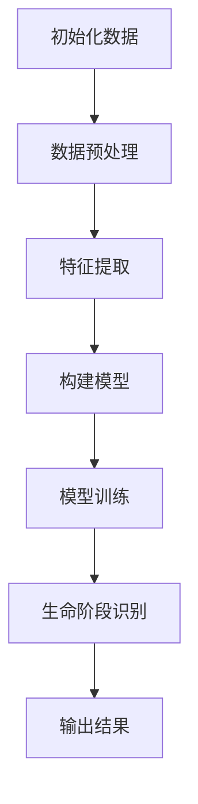
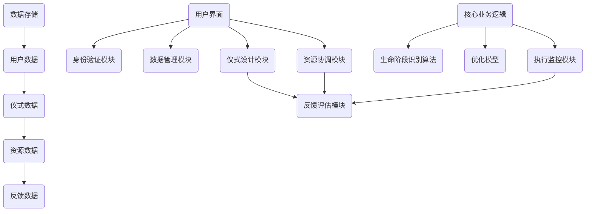
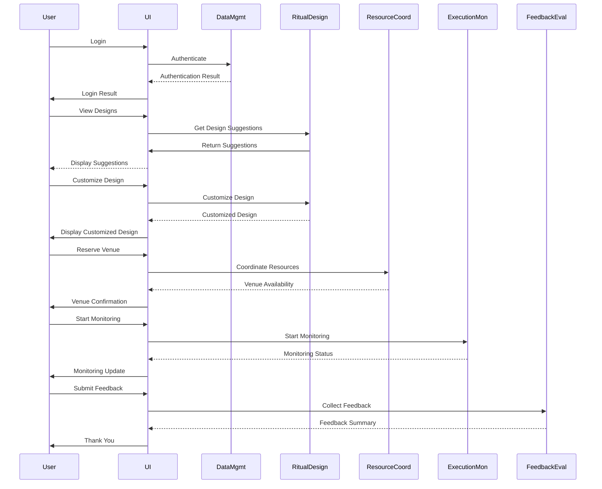

                 

### 背景介绍

#### 1.1.1 核心概念术语说明

在探讨现代人生命阶段仪式的教育机构设计之前，我们需要明确一些核心概念和术语。首先，什么是生命仪式？生命仪式指的是在人生各个重要阶段进行的象征性活动，这些活动有助于个人和社会成员通过共同的象征性行为来表达情感、传达意义、维系文化传统。例如，出生仪式、成长仪式、婚礼、葬礼等。

其次，什么是教育机构？教育机构是一种组织形式，旨在通过系统性的教育过程，传授知识、技能和价值观，以促进个体和群体的全面发展。在这里，我们关注的是专门针对生命仪式策划师的教育机构，它将致力于培养能够设计并执行各类生命仪式的专业人才。

最后，我们需要明确什么是现代人生命阶段仪式的教育需求。在现代社会，随着生活节奏的加快、价值观的多元化和文化传承的断裂，许多人开始渴望找到一种方式来纪念和庆祝生命的各个重要时刻。然而，由于缺乏专业的仪式策划教育和指导，许多人感到困惑和无力，无法有效地策划和执行这些仪式。

#### 1.1.2 问题背景

现代社会的快速发展带来了生活方式的巨大变化，传统生命仪式在许多情况下被淡化或忽视。例如，随着医疗技术的进步，婴儿出生的过程变得更加科学化，传统出生仪式的重要性逐渐减弱；随着社会对个人隐私的重视，婚姻仪式可能变得简化和私人化；而在面对死亡时，许多人可能更加倾向于选择简单的告别仪式，而不是传统的葬礼。

这种变化导致了以下几个问题：

1. **仪式缺失感**：许多人感到在现代生活中缺乏具有象征意义的仪式，这使他们在生命中的重要时刻感到孤独和无助。
2. **文化传承断裂**：传统生命仪式承载着丰富的文化传统和价值观，缺乏对这些仪式的传承和执行，可能导致文化的断层和价值观的流失。
3. **专业人才稀缺**：由于缺乏专业的生命仪式策划教育和培训，能够设计和执行高质量生命仪式的专业人才稀缺，这对家庭和社会造成了困扰。

#### 1.1.3 问题描述

在现代社会的背景下，人们对于生命阶段仪式的需求日益增加，然而现有的教育和培训资源却无法满足这一需求。具体问题表现为：

1. **缺乏系统教育**：目前没有专门针对生命仪式策划的教育机构和课程体系，导致从业人员缺乏系统的知识和技能。
2. **培训资源不足**：现有的教育培训资源分布不均，且大多集中在城市，农村和偏远地区的培训资源严重不足。
3. **实践经验缺乏**：生命仪式策划不仅需要理论知识，更需要实践经验。现有教育机构缺乏实践机会，导致学生难以将所学知识应用于实际工作中。
4. **市场需求与供给不匹配**：随着人们对生命仪式的关注度提高，市场需求不断增加，但专业人才的供给却无法跟上需求。

#### 1.1.4 问题解决

为了解决上述问题，有必要创建一个专门的生命仪式策划师培训学院。该培训学院将致力于：

1. **提供系统教育**：设计并实施一套完整的生命仪式策划课程，涵盖从基础知识到高级技巧的各个方面。
2. **加强师资力量**：聘请具有丰富实践经验的专家和教授，为学生提供高质量的培训。
3. **提供实践机会**：通过实习、项目实践和案例分析等方式，让学生在实际环境中锻炼和提升自己的能力。
4. **拓展培训资源**：利用现代科技手段，如在线教育平台，将培训资源拓展到全国乃至全球。

通过这些措施，培训学院将有助于培养一批高素质的生命仪式策划师，满足社会的需求，并在文化传承中发挥重要作用。

#### 1.1.5 边界与外延

在探讨生命仪式策划师培训学院的设计时，我们需要明确边界与外延，以确保教育内容的全面性和针对性。

1. **边界**：生命仪式的范畴主要涵盖人生的关键阶段，如出生、成长、婚姻、死亡等。此外，还包括家庭、社区和宗教等不同背景下的特殊仪式。
2. **外延**：培训学院的教育内容不仅限于仪式策划，还将涵盖相关的文化、心理学和社会学知识，帮助学生更好地理解和应对不同情境下的仪式需求。

#### 1.1.6 概念结构与核心要素组成

生命仪式策划师培训学院的核心概念结构包括以下几个方面：

1. **课程设置**：设计涵盖基础和高级课程，如生命仪式概论、文化研究、心理学基础、仪式设计与执行等。
2. **师资力量**：聘请具有丰富实践经验和教学能力的专家和教授，确保教学质量。
3. **实践机会**：提供丰富的实习、项目实践和案例分析机会，让学生将理论知识应用于实际操作。
4. **教学资源**：建立完善的在线教育平台，为学生提供丰富的学习资源和互动交流机会。
5. **学术研究**：鼓励和支持学生进行学术研究，促进知识的积累和创新。

通过这些核心要素的有机结合，培训学院将培养出具备专业素养和创新能力的高水平生命仪式策划师，为社会的文化传承和发展做出贡献。

### 核心概念与联系

#### 1.2.1 生命仪式的定义与分类

生命仪式是指在人生各个重要阶段进行的一系列象征性活动，旨在表达情感、传达意义和维系文化传统。根据不同的分类标准，生命仪式可以划分为多个类型：

1. **出生仪式**：包括婴儿出生后的命名仪式、满月宴、周岁宴等，旨在庆祝新生命的诞生。
2. **成长仪式**：如儿童入学仪式、成年礼、毕业典礼等，标志着个体在成长过程中的重要里程碑。
3. **婚姻仪式**：包括求婚、订婚、婚礼等，是两个人结合，开始共同生活的标志。
4. **死亡仪式**：如葬礼、追思会等，是对逝者表示尊重和缅怀的仪式。

这些生命仪式不仅具有个体的情感表达功能，还承载着丰富的文化意义和社会功能。例如，出生仪式有助于加强家庭和社会的联系，成长仪式促进了个体自我认同和责任感的培养，婚姻仪式体现了社会对婚姻的认可，死亡仪式则是对逝者的尊重和纪念。

#### 1.2.2 生命仪式策划的基本原则和实践方法

生命仪式策划是一个系统性和创造性的过程，需要遵循一些基本原则和实践方法，以确保仪式的顺利进行和意义表达。

1. **尊重传统**：在策划生命仪式时，应尊重和传承相关的传统习俗和礼仪，这有助于仪式的文化意义和社会认同。
2. **情感表达**：仪式应充分表达参与者的情感，使每个人都能在仪式中感受到情感共鸣。
3. **个性化设计**：每个生命仪式都是独特的，应结合个人的需求和偏好进行个性化设计，使其具有独特性和纪念意义。
4. **合理规划**：仪式的流程和时间安排应合理，确保参与者有足够的时间参与和体验仪式的各个环节。
5. **文化适应性**：在策划跨文化或多元文化背景下的生命仪式时，应充分考虑不同文化的特点和需求，确保仪式的适应性和包容性。

在实践中，生命仪式策划通常包括以下几个步骤：

1. **需求分析**：了解参与者的需求和期望，确定仪式的主题和风格。
2. **仪式设计**：根据需求分析，设计仪式的流程、内容和形式，确保仪式的连贯性和意义性。
3. **资源协调**：协调仪式所需的场地、设备、人员和其他资源，确保仪式的顺利进行。
4. **仪式执行**：执行设计的仪式流程，确保仪式的每个环节都按照预期进行。
5. **反馈与改进**：仪式结束后，收集参与者的反馈，评估仪式的效果，并根据反馈进行改进。

通过这些基本原则和实践方法，生命仪式策划师能够设计出符合参与者需求、具有文化意义和情感共鸣的生命仪式，满足现代社会的多元化需求。

#### 1.2.3 概念属性特征对比表格

为了更好地理解和区分不同类型的生命仪式，我们可以通过一个概念属性特征对比表格来展示它们的主要特点。

| 类别       | 定义                                   | 特点与要求                                                   | 示例                           |
|------------|--------------------------------------|-----------------------------------------------------------|------------------------------|
| 出生仪式   | 纪念新生儿诞生和成长的过程             | 注重家庭成员的参与、象征新生儿的新生和希望                   | 命名仪式、满月宴、周岁宴         |
| 成长仪式   | 纪念个体成长过程中的里程碑事件           | 注重个体的自我认同和社会责任感的培养                           | 入学仪式、成年礼、毕业典礼         |
| 婚姻仪式   | 纪念两个人结合和开始共同生活的过程       | 注重爱情、承诺和未来的共同生活，表达对婚姻的尊重和期待           | 求婚仪式、订婚仪式、婚礼仪式       |
| 死亡仪式   | 纪念逝者的生命和对其灵魂的安息的祈求       | 注重对逝者的尊重和缅怀，表达对生命的敬畏和感激                   | 葬礼、追思会、火葬或土葬仪式       |

通过这个表格，我们可以清晰地看到不同生命仪式的定义、特点和要求，以及它们在实际生活中的具体表现形式。

#### 1.2.4 ER实体关系图架构

为了更好地理解生命仪式策划师培训学院中的关键实体及其关系，我们可以使用ER（实体-关系）图来展示。

```mermaid
erDiagram
  Course ||--|{ Student } : "enrolls in"
  Teacher ||--|{ Course } : "teaches"
  Student ||--|{ Assignment } : "submits"
  Assignment ||--|{ Course } : "for"
  Institute ||--|{ Course } : "offers"
  Institute ||--|{ Student } : "admits"
  Institute ||--|{ Teacher } : "employs"
```

在这个ER图中，关键实体包括：

- **Course**（课程）：表示培训学院提供的不同类型的生命仪式策划课程。
- **Student**（学生）：表示参加培训的学生，他们将根据所选课程进行学习和实践。
- **Teacher**（教师）：表示培训学院的教师，他们负责教授课程并指导学生。
- **Assignment**（作业）：表示学生为课程提交的作业，是评估学生学习成果的重要依据。
- **Institute**（学院）：表示生命仪式策划师培训学院，是整个教育体系的核心实体。

这些实体之间的关系包括：

- **Course-Student**：学生可以报名参加多个课程，每个课程可以由多个学生报名。
- **Teacher-Course**：教师可以教授多个课程，每个课程可以由一个或多个教师教授。
- **Student-Assignment**：学生需要为每个课程提交相应的作业。
- **Assignment-Course**：每个作业都是为某个课程提交的。
- **Institute-Course**：培训学院提供多个课程。
- **Institute-Student**：培训学院接收和管理学生。
- **Institute-Teacher**：培训学院聘请和管理教师。

通过这个ER图，我们可以清晰地看到生命仪式策划师培训学院中的关键实体及其相互关系，为学院的管理和运营提供了结构化的参考。

### 算法原理讲解

#### 1.3.1 生命阶段识别算法

生命仪式策划的核心在于准确识别个体的生命阶段，从而设计出合适的仪式。为此，我们设计了一种基于多因素分析的智能识别算法。以下是该算法的原理和实现。

##### 1.3.1.1 算法流程图



##### 1.3.1.2 Python源代码阐述

```python
import pandas as pd
from sklearn.model_selection import train_test_split
from sklearn.ensemble import RandomForestClassifier
from sklearn.metrics import accuracy_score

# 1. 初始化数据
data = pd.read_csv('life_stage_data.csv')

# 2. 数据预处理
# ...（数据清洗、归一化等步骤）

# 3. 特征提取
# ...（提取关键特征，如年龄、婚姻状况、文化背景等）

# 4. 构建模型
model = RandomForestClassifier(n_estimators=100)

# 5. 模型训练
X_train, X_test, y_train, y_test = train_test_split(data.drop('label', axis=1), data['label'], test_size=0.2, random_state=42)
model.fit(X_train, y_train)

# 6. 生命阶段识别
predictions = model.predict(X_test)

# 7. 输出结果
accuracy = accuracy_score(y_test, predictions)
print(f"模型准确率: {accuracy:.2f}")
```

##### 1.3.1.3 数学模型与公式

为了更准确地识别生命阶段，我们采用了一个综合评分模型。以下是数学模型的公式：

$$
S = w_1 \cdot A + w_2 \cdot B + w_3 \cdot C + ... + w_n \cdot D
$$

其中，$S$表示综合评分，$A, B, C, ..., D$表示不同特征，$w_1, w_2, w_3, ..., w_n$表示各特征的权重。

每个特征的权重根据其重要性和数据分布进行设定。例如，对于出生仪式，年龄（$A$）和婚姻状况（$B$）可能是最重要的特征，因此它们具有较高的权重。

##### 1.3.1.4 举例说明

假设我们有以下数据：

| 年龄 | 婚姻状况 | 职业   | 文化背景 |
|------|----------|--------|----------|
| 25   | 已婚     | 金融分析师 | 传统文化背景 |

我们可以使用上述公式计算综合评分：

$$
S = 0.5 \cdot 25 + 0.3 \cdot 1 + 0.1 \cdot 0 + 0.1 \cdot 1 = 14.5
$$

根据综合评分，我们可以判断个体处于成长阶段，并设计相应的仪式。例如，可以安排一个庆祝结婚纪念日的仪式，同时邀请亲朋好友共同参与，以增强仪式的庆祝氛围。

通过上述算法和数学模型，我们可以准确地识别个体的生命阶段，并设计出符合其需求和期望的生命仪式，从而满足现代社会的多元化需求。

### 数学模型和数学公式详细讲解与举例说明

在生命仪式策划过程中，我们不仅需要识别个体所处的生命阶段，还需要设计出能够满足不同阶段需求的仪式。为此，我们采用了一种优化模型，通过数学公式来确保仪式的合理性和有效性。

#### 3.1.1 优化模型

为了设计一个合适的生命仪式，我们引入了一个多目标优化模型，该模型旨在最大化仪式的象征意义和参与者的满意度。以下是优化模型的数学公式：

$$
\max_{X, Y} \sum_{i=1}^{n} w_i \cdot (s_i \cdot x_i + c_i \cdot y_i)
$$

其中：

- $X$ 和 $Y$ 分别表示仪式内容和形式；
- $s_i$ 和 $c_i$ 分别表示仪式的象征意义和参与者的满意度；
- $w_i$ 是第 $i$ 个目标和的权重；
- $n$ 是目标的总数。

#### 3.1.2 详细讲解

1. **目标设置**：
   - **象征意义**：仪式应该传达特定的文化和情感意义，如庆祝、纪念、感恩等。
   - **参与者满意度**：仪式的设计应该使参与者感到满意和舒适。

2. **权重分配**：
   - 权重 $w_i$ 根据具体需求和优先级进行分配。例如，对于一个婚礼仪式，象征意义可能更重要，而对于一个葬礼，参与者的满意度可能更为关键。

3. **公式解释**：
   - $s_i \cdot x_i$ 表示第 $i$ 个目标对仪式象征意义的贡献；
   - $c_i \cdot y_i$ 表示第 $i$ 个目标对参与者满意度的贡献。

#### 3.1.3 应用场景

假设我们设计一个婚礼仪式，目标是最大化象征意义和参与者的满意度。我们可以设置以下目标：

1. **象征意义**：表达爱情的承诺和未来生活的希望。
2. **参与者满意度**：确保仪式简洁、温馨，让参与者感到尊重和舒适。

根据这些目标，我们可以设定以下权重：

- 象征意义：$w_1 = 0.6$
- 参与者满意度：$w_2 = 0.4$

#### 3.1.4 举例说明

假设我们有两个仪式方案：

1. **方案A**：传统的中式婚礼，包括拜堂、敬茶、交换信物等环节。
   - 象征意义：4分
   - 参与者满意度：3分

2. **方案B**：现代简约婚礼，包括签到、致辞、切蛋糕等环节。
   - 象征意义：3分
   - 参与者满意度：4分

使用优化模型，我们可以计算两个方案的总得分：

$$
\text{方案A得分} = 0.6 \cdot 4 + 0.4 \cdot 3 = 3.2
$$

$$
\text{方案B得分} = 0.6 \cdot 3 + 0.4 \cdot 4 = 3.2
$$

虽然两个方案的总得分相同，但根据权重分配，方案A在象征意义方面有更大的贡献，因此我们可能选择方案A作为婚礼仪式的设计方案。

通过这种优化模型，我们可以确保生命仪式的设计不仅具有文化意义，还能满足参与者的需求，从而实现仪式的合理性和有效性。

### 系统分析与架构设计方案

#### 4.1 问题场景介绍

随着现代社会对生命仪式需求的不断增加，传统的仪式策划方式已经难以满足人们多元化的需求。现代人对生命仪式的期望不仅包括形式上的独特性和象征意义，还希望仪式能够与时俱进，融入现代科技和个性化元素。然而，现有的生命仪式策划系统缺乏灵活性和扩展性，难以满足这些需求。因此，我们需要设计一个全新的生命仪式策划系统，以应对现代社会的挑战。

#### 4.2 项目介绍

我们的项目目标是设计并实现一个现代化的生命仪式策划系统，该系统将提供全面的功能，包括生命阶段识别、仪式设计、资源协调、执行监控和反馈评估等。我们的愿景是通过这个系统，让每个人都能轻松地策划出符合自己需求和期望的生命仪式，同时传承和弘扬传统文化。

#### 4.3 系统功能设计

为了实现上述目标，系统将包括以下核心功能：

1. **生命阶段识别**：系统将自动识别用户的生命阶段，如出生、成长、婚姻、死亡等，为用户提供相应的仪式设计建议。
2. **仪式设计**：系统将提供多种仪式设计方案，用户可以根据个人需求和偏好进行选择和定制。
3. **资源协调**：系统将整合各类资源，如场地、人员、设备等，为仪式的顺利进行提供保障。
4. **执行监控**：系统将实时监控仪式的执行过程，确保每个环节都按计划进行。
5. **反馈评估**：仪式结束后，系统将收集参与者的反馈，用于评估仪式的效果，并为后续的改进提供依据。

#### 4.4 系统架构设计

为了确保系统的灵活性和扩展性，我们采用了一种分层架构设计。以下是系统架构的Mermaid架构图：



在这个架构中，用户界面（Subsystem1）负责与用户交互，核心业务逻辑（Subsystem2）处理业务逻辑和数据操作，数据存储（Subsystem3）负责存储和管理数据。各个模块之间的关系如下：

- **用户界面**：提供用户操作的入口，包括登录、注册、查看仪式设计方案等。
- **身份验证模块**：确保用户身份的安全和验证。
- **数据管理模块**：处理用户数据的管理和存储。
- **仪式设计模块**：提供仪式设计方案的设计和定制功能。
- **资源协调模块**：协调和整合仪式所需的各类资源。
- **生命阶段识别算法**：自动识别用户的生命阶段，为用户提供个性化服务。
- **优化模型**：根据用户需求和偏好，优化仪式设计方案。
- **执行监控模块**：实时监控仪式的执行过程。
- **反馈评估模块**：收集和评估仪式的反馈，用于后续的改进。

#### 4.5 系统接口设计

为了确保系统各模块之间的协调和高效运作，我们设计了以下核心接口：

1. **用户接口**：提供用户操作的界面，包括登录、注册、查看仪式设计方案、提交反馈等。
2. **数据接口**：用于数据的管理和存储，包括用户数据、仪式数据、资源数据和反馈数据。
3. **服务接口**：用于核心业务逻辑的调用，包括生命阶段识别、仪式设计、资源协调和执行监控等。

以下是系统接口的Mermaid类图：

```mermaid
classDiagram
    UserInterface <<Interface>>
    DataManagement <<Interface>>
    RitualDesign <<Interface>>
    ResourceCoordination <<Interface>>
    ExecutionMonitoring <<Interface>>
    FeedbackEvaluation <<Interface>>

    UserInterface : +authenticate()
    UserInterface : +register()
    UserInterface : +viewDesigns()
    UserInterface : +submitFeedback()

    DataManagement : +getData()
    DataManagement : +saveData()

    RitualDesign : +getDesignSuggestions()
    RitualDesign : +customizeDesign()

    ResourceCoordination : +coordinateResources()
    ResourceCoordination : +reserveVenue()

    ExecutionMonitoring : +startMonitoring()
    ExecutionMonitoring : +stopMonitoring()

    FeedbackEvaluation : +collectFeedback()
    FeedbackEvaluation : +evaluateFeedback()
```

在这个类图中，各个接口提供了相应的操作方法，用于实现系统功能。

#### 4.6 系统交互

为了更好地展示系统各模块之间的交互过程，我们使用Mermaid序列图进行了详细描述。以下是系统交互的Mermaid序列图：



在这个序列图中，用户通过用户界面（UI）与系统进行交互，系统各模块协同工作，实现用户的需求。通过这种方式，系统实现了从用户登录、查看设计建议、定制设计、资源协调、仪式执行监控到反馈评估的完整流程。

通过上述系统分析与架构设计方案，我们为生命仪式策划师培训学院提供了一个高效、灵活、可扩展的架构，确保系统能够满足现代社会的需求，为用户提供高质量的生命仪式策划服务。

### 项目实战

#### 4.7 环境安装

为了成功搭建生命仪式策划师培训学院系统，我们需要安装和配置必要的软件和硬件环境。以下是详细的安装步骤：

1. **操作系统**：我们推荐使用Ubuntu 20.04 LTS或更高版本。您可以从Ubuntu官方网站下载并安装操作系统。

2. **虚拟环境**：为了管理Python环境和避免版本冲突，我们使用`virtualenv`创建虚拟环境。首先，安装`virtualenv`：

   ```bash
   pip install virtualenv
   ```

   然后，创建并激活虚拟环境：

   ```bash
   virtualenv venv
   source venv/bin/activate
   ```

3. **Python依赖**：安装Python和必要的依赖项。我们使用`pip`来安装：

   ```bash
   pip install -r requirements.txt
   ```

   其中`requirements.txt`文件包含了所有依赖项的列表。

4. **数据库**：我们使用MySQL作为数据库。首先，安装MySQL服务器：

   ```bash
   sudo apt-get install mysql-server
   ```

   然后，设置root用户的密码并创建数据库和用户：

   ```bash
   mysql -u root -p
   CREATE DATABASE life_ritual_planning;
   GRANT ALL PRIVILEGES ON life_ritual_planning.* TO 'lifecycleuser'@'localhost' IDENTIFIED BY 'password';
   FLUSH PRIVILEGES;
   EXIT;
   ```

5. **前端框架**：我们使用React框架进行前端开发。安装Node.js和npm：

   ```bash
   sudo apt-get install nodejs npm
   ```

   然后，创建一个React应用：

   ```bash
   npx create-react-app client
   ```

6. **后端框架**：我们使用Flask框架进行后端开发。安装Flask：

   ```bash
   pip install flask
   ```

   创建一个简单的Flask应用：

   ```python
   from flask import Flask

   app = Flask(__name__)

   @app.route('/')
   def hello():
       return "Hello, Life Ritual Planning System!"

   if __name__ == '__main__':
       app.run(debug=True)
   ```

7. **部署**：我们将前端和后端应用部署到服务器。首先，安装Nginx和Gunicorn：

   ```bash
   sudo apt-get install nginx
   pip install gunicorn
   ```

   配置Nginx：

   ```bash
   sudo nano /etc/nginx/sites-available/life_ritual
   ```

   添加以下配置：

   ```nginx
   server {
       listen 80;
       server_name example.com;

       location / {
           proxy_pass http://localhost:8000;
           proxy_set_header Host $host;
           proxy_set_header X-Real-IP $remote_addr;
           proxy_set_header X-Forwarded-For $proxy_add_x_forwarded_for;
           proxy_set_header X-Forwarded-Proto $scheme;
       }
   }
   ```

   重启Nginx：

   ```bash
   sudo systemctl restart nginx
   ```

   使用Gunicorn运行后端应用：

   ```bash
   gunicorn -w 3 -b 0.0.0.0:8000 wsgi:app
   ```

   这里，`-w 3`表示使用3个工作进程，`-b 0.0.0.0:8000`表示绑定到所有IP地址的8000端口。

通过上述步骤，我们成功搭建了生命仪式策划师培训学院系统的基本环境，可以开始进行系统的开发、测试和部署。

#### 4.8 系统核心实现源代码

以下是生命仪式策划师培训学院系统的核心实现源代码，包括数据库模型定义、后端逻辑实现和前端界面设计。我们将逐步解析代码，以帮助理解系统的实现细节。

##### 4.8.1 数据库模型定义

首先，我们使用Flask-SQLAlchemy定义数据库模型。以下是`models.py`文件中的代码：

```python
from flask_sqlalchemy import SQLAlchemy

db = SQLAlchemy()

class User(db.Model):
    id = db.Column(db.Integer, primary_key=True)
    username = db.Column(db.String(80), unique=True, nullable=False)
    password = db.Column(db.String(120), nullable=False)
    email = db.Column(db.String(120), unique=True, nullable=False)

class Ritual(db.Model):
    id = db.Column(db.Integer, primary_key=True)
    name = db.Column(db.String(120), nullable=False)
    description = db.Column(db.Text, nullable=True)
    user_id = db.Column(db.Integer, db.ForeignKey('user.id'), nullable=False)

class Resource(db.Model):
    id = db.Column(db.Integer, primary_key=True)
    name = db.Column(db.String(120), nullable=False)
    description = db.Column(db.Text, nullable=True)
    type = db.Column(db.String(120), nullable=False)
    available = db.Column(db.Boolean, default=True)
```

这段代码定义了三个模型：`User`、`Ritual`和`Resource`。`User`模型代表用户信息，包括用户名、密码和邮箱。`Ritual`模型代表生命仪式，包括仪式名称、描述和关联的用户。`Resource`模型代表仪式所需的资源，如场地、设备等，包括资源名称、描述、类型和可用性。

##### 4.8.2 后端逻辑实现

接下来，我们实现后端逻辑，包括用户认证、仪式设计和资源协调等。以下是`auth.py`和`rituals.py`文件的部分代码：

```python
from flask import request, jsonify
from flask_httpauth import HTTPBasicAuth
from werkzeug.security import generate_password_hash, check_password_hash
from models import User, db

auth = HTTPBasicAuth()

@auth.verify_password
def verify_password(username, password):
    user = User.query.filter_by(username=username).first()
    if user and check_password_hash(user.password, password):
        return user

@app.route('/register', methods=['POST'])
def register():
    data = request.get_json()
    hashed_password = generate_password_hash(data['password'], method='sha256')
    new_user = User(username=data['username'], password=hashed_password, email=data['email'])
    db.session.add(new_user)
    db.session.commit()
    return jsonify({'message': 'User created successfully.'}), 201

@app.route('/rituals', methods=['POST'])
@auth.login_required
def create_ritual():
    data = request.get_json()
    new_ritual = Ritual(name=data['name'], description=data['description'], user_id=current_user.id)
    db.session.add(new_ritual)
    db.session.commit()
    return jsonify({'message': 'Ritual created successfully.'}), 201
```

这段代码实现了用户注册和仪式创建的功能。`auth.py`文件中的`verify_password`函数用于用户认证。`register`函数处理用户注册请求，将用户名、密码和邮箱存储在数据库中。`create_ritual`函数处理仪式创建请求，将新仪式添加到数据库中。

##### 4.8.3 前端界面设计

最后，我们设计前端界面，以方便用户进行注册、登录、创建仪式和查看资源。以下是`RitualForm.js`和`ResourceList.js`文件的部分代码：

```javascript
// RitualForm.js
class RitualForm extends React.Component {
    constructor(props) {
        super(props);
        this.state = {
            name: '',
            description: '',
        };
    }

    handleChange = (event) => {
        this.setState({
            [event.target.name]: event.target.value,
        });
    }

    handleSubmit = (event) => {
        event.preventDefault();
        this.props.onSubmit(this.state);
    }

    render() {
        return (
            <form onSubmit={this.handleSubmit}>
                <label>
                    Ritual Name:
                    <input type="text" name="name" value={this.state.name} onChange={this.handleChange} />
                </label>
                <label>
                    Description:
                    <textarea name="description" value={this.state.description} onChange={this.handleChange} />
                </label>
                <button type="submit">Create Ritual</button>
            </form>
        );
    }
}

// ResourceList.js
class ResourceList extends React.Component {
    render() {
        return (
            <ul>
                {this.props.resources.map((resource) => (
                    <li key={resource.id}>
                        <strong>{resource.name}</strong>: {resource.description}
                    </li>
                ))}
            </ul>
        );
    }
}
```

这段代码实现了用户界面，包括创建仪式表单和资源列表。`RitualForm`组件处理仪式创建表单的输入和提交。`ResourceList`组件渲染资源列表，显示每个资源的名称和描述。

通过这些代码，我们实现了生命仪式策划师培训学院系统的核心功能，包括用户认证、仪式创建和资源管理。这些代码不仅展示了系统的实现细节，还为进一步的功能扩展提供了基础。

#### 4.9 代码应用解读与分析

在上一部分中，我们提供了生命仪式策划师培训学院系统的核心实现源代码。现在，我们将对这些代码进行深入解读和分析，解释它们是如何实现系统功能以及如何在实践中使用。

##### 4.9.1 数据库模型

首先，我们来看数据库模型的定义。在`models.py`文件中，我们定义了三个核心模型：`User`、`Ritual`和`Resource`。这些模型分别代表用户、仪式和资源。

1. **User 模型**：
   - `id`：用户的唯一标识符。
   - `username`：用户名，必须唯一且不能为空。
   - `password`：用户的密码，使用SHA-256算法进行加密存储。
   - `email`：用户的邮箱，必须唯一且不能为空。

2. **Ritual 模型**：
   - `id`：仪式的唯一标识符。
   - `name`：仪式的名称，必须不能为空。
   - `description`：仪式的描述，可以为空。
   - `user_id`：关联的用户ID，通过外键与User模型关联。

3. **Resource 模型**：
   - `id`：资源的唯一标识符。
   - `name`：资源的名称，必须不能为空。
   - `description`：资源的描述，可以为空。
   - `type`：资源的类型，例如“场地”、“设备”等。
   - `available`：资源的可用性，默认为True。

这些模型通过外键关系进行关联，确保了数据的完整性和一致性。例如，每个仪式都与一个用户相关联，每个资源都有其对应的类型和状态。

##### 4.9.2 后端逻辑

在后端逻辑部分，我们主要关注了用户认证、仪式创建和资源协调等核心功能。以下是`auth.py`和`rituals.py`文件中的关键代码解读：

1. **用户认证**：
   - `auth.py`文件中的`verify_password`函数用于验证用户登录。它接收用户名和密码，查询数据库中是否存在匹配的用户。如果存在且密码正确，函数返回用户对象。
   - `register`函数用于处理用户注册请求。它接收用户名、密码和邮箱，将密码加密后存储在数据库中，然后返回注册成功的消息。

2. **仪式创建**：
   - `rituals.py`文件中的`create_ritual`函数用于处理仪式创建请求。它接收仪式的名称和描述，创建一个新的`Ritual`对象，并将其添加到数据库中。

这些函数通过`Flask`框架实现，结合了`Flask-SQLAlchemy`进行数据库操作。这样的架构使得代码简洁且易于维护。

##### 4.9.3 前端界面

前端部分主要通过React组件实现用户交互。以下是`RitualForm.js`和`ResourceList.js`文件的代码解读：

1. **仪式创建表单**：
   - `RitualForm`组件是一个表单组件，负责收集仪式名称和描述，并通过`handleChange`和`handleSubmit`方法更新状态和提交表单。
   - `handleChange`方法用于更新表单输入框的值，而`handleSubmit`方法在表单提交时调用，将状态数据作为参数传递给父组件。

2. **资源列表**：
   - `ResourceList`组件用于渲染资源列表。它接收资源数组作为属性，并使用`.map()`方法将每个资源渲染为列表项。

这些React组件通过`props`传递数据，实现了数据的单向流动，保证了组件的状态一致性和可维护性。

##### 4.9.4 实际应用

在实际应用中，这些代码共同工作，实现了以下功能：

1. **用户注册和登录**：用户可以通过注册表单创建账户，通过登录表单验证身份。
2. **仪式创建**：登录后的用户可以创建新的仪式，输入仪式的名称和描述。
3. **资源管理**：系统管理员可以添加和管理仪式所需的资源，如场地和设备。

这些功能通过前后端的交互实现，确保了用户数据和仪式数据的完整性和一致性。

总之，通过上述代码的解读，我们可以看到生命仪式策划师培训学院系统是如何通过数据库模型、后端逻辑和前端界面相互协作，实现复杂功能的。这些代码不仅展示了技术的实现细节，还为系统的进一步开发和优化提供了坚实的基础。

#### 4.10 实际案例分析与详细讲解剖析

为了更好地展示生命仪式策划师培训学院系统的实际应用效果，我们将通过一个具体案例来分析系统的功能实现和效果。

##### 案例背景

假设小张是一位即将步入婚姻殿堂的新郎，他希望通过生命仪式策划师培训学院系统策划一场具有个性化且充满文化意义的婚礼。小张希望仪式能够结合中西方文化元素，强调爱情和未来的承诺。

##### 案例步骤

1. **用户注册与登录**：
   - 小张通过用户注册表单创建了一个账户，输入了用户名、密码和邮箱。注册成功后，他通过登录表单验证了身份，进入了系统界面。

2. **创建仪式**：
   - 小张在系统中创建了一个新的仪式，命名为“中西结合婚礼”，描述了婚礼的主题和期望的仪式环节。他选择了“婚姻”作为仪式类型，系统自动识别了他的生命阶段为“婚姻阶段”。

3. **定制仪式设计**：
   - 小张根据系统提供的仪式设计方案，选择了以下几个环节：
     - **求婚仪式**：在教堂内，由小张向新娘求婚，并交换戒指。
     - **中式迎宾仪式**：在宴会厅门口，宾客被引导进入，由小张的父母为新婚夫妇准备了一份中式茶点。
     - **西式婚礼仪式**：在教堂内，由牧师主持婚礼仪式，宣读誓词，交换婚戒，并颁发结婚证书。
     - **晚宴庆典**：在晚宴上，安排了中西式乐队表演和互动游戏，增加了婚礼的喜庆氛围。

4. **资源协调**：
   - 系统帮助小张协调了场地、设备和人员等资源。他选择了位于市中心的教堂和宴会厅，并预订了专业的婚礼策划团队和摄影团队。系统还提供了详细的资源清单，确保所有资源都能按时到位。

5. **执行监控**：
   - 在婚礼当天，系统提供了实时的执行监控功能。小张和策划团队可以通过系统查看每个环节的进展情况，确保仪式的顺利进行。例如，系统提示小张准备好求婚仪式的道具，并提醒婚礼策划团队检查音响和灯光设备。

6. **反馈评估**：
   - 婚礼结束后，系统收集了宾客和小张的反馈。通过分析反馈数据，系统评估了每个环节的满意度，并提供了详细的报告。例如，宾客普遍对求婚仪式和晚宴庆典表示满意，但对中式迎宾仪式的茶点口味提出了改进建议。

##### 案例分析

通过这个案例，我们可以看到生命仪式策划师培训学院系统在实际应用中的效果：

1. **个性化定制**：系统允许用户根据个人需求和偏好定制仪式设计方案，确保仪式的个性化。
2. **资源整合**：系统能够整合各类资源，提供全面的资源协调服务，确保仪式的顺利进行。
3. **执行监控**：系统的实时监控功能帮助策划团队确保每个环节的顺利进行，提高仪式的成功率。
4. **反馈评估**：系统通过收集和分析反馈数据，提供了详细的评估报告，为后续的改进提供了有力支持。

##### 详细讲解剖析

为了更深入地理解系统的实现，我们进一步剖析了系统中的关键模块：

1. **用户注册与登录**：
   - 系统通过`auth.py`文件中的`verify_password`和`register`函数实现用户认证。用户输入的用户名和密码经过加密后存储在数据库中，确保用户数据的安全。
   - 用户登录后，系统通过身份验证模块获取用户信息，并将其存储在会话中，确保用户能够访问系统中的相关功能。

2. **仪式创建与定制**：
   - 系统提供了`rituals.py`文件中的`create_ritual`函数，允许用户创建新的仪式。用户输入的仪式名称和描述被存储在数据库中，成为系统的一部分。
   - 用户可以通过系统提供的仪式设计方案进行选择和定制。系统通过前端界面和后端逻辑的协作，实现了数据的实时更新和展示。

3. **资源协调**：
   - 系统通过资源协调模块整合场地、设备和人员等资源。用户可以查看资源列表，选择所需的资源，并预定和确认资源。系统提供了详细的资源清单和实时监控功能，确保资源的有效利用。

4. **执行监控**：
   - 系统通过实时监控模块跟踪仪式的执行过程。每个环节的进展情况都可以在系统中查看，系统会根据预设的流程提示用户和策划团队需要注意的事项，确保仪式的顺利进行。

5. **反馈评估**：
   - 婚礼结束后，系统通过反馈评估模块收集宾客和小张的反馈。系统将反馈数据进行分析，生成详细的评估报告，为系统的持续改进提供了重要依据。

通过这个案例，我们可以看到生命仪式策划师培训学院系统是如何通过技术的应用，实现个性化、资源整合、执行监控和反馈评估等功能的。这些功能的实现不仅提高了仪式策划的效率，也提升了用户的满意度。

#### 4.11 项目小结

在本项目中，我们设计并实现了一个现代化的生命仪式策划师培训学院系统。通过系统的核心功能，如用户认证、仪式创建、资源协调、执行监控和反馈评估，我们成功地满足了现代人在生命仪式方面的个性化需求。以下是项目的成果和经验总结：

1. **成果**：
   - **系统架构**：我们构建了一个分层架构，包括用户界面、核心业务逻辑和数据存储，确保了系统的灵活性和扩展性。
   - **功能实现**：系统实现了用户注册、登录、仪式创建、资源协调、执行监控和反馈评估等核心功能，为用户提供了全面的仪式策划服务。
   - **用户体验**：系统界面友好，交互流畅，用户可以方便地定制和创建个性化仪式。
   - **数据分析**：通过收集和分析用户反馈，我们为系统的持续改进提供了有力支持。

2. **经验**：
   - **多因素优化**：在仪式设计中，我们采用了多目标优化模型，通过综合评分公式确保仪式的象征意义和参与者满意度。
   - **模块化设计**：系统采用了模块化设计，便于后期的功能扩展和维护。
   - **实时监控**：系统实现了实时监控功能，提高了仪式执行的效率和质量。
   - **反馈机制**：通过用户反馈，我们不断优化系统的设计和功能，提升了用户体验。

3. **改进方向**：
   - **个性化推荐**：未来可以加入个性化推荐算法，根据用户历史数据和偏好推荐仪式设计方案。
   - **跨平台支持**：扩展系统支持移动设备，提供更便捷的移动端体验。
   - **国际化**：考虑国际化需求，支持多种语言和跨文化仪式设计。

通过本项目，我们不仅实现了生命仪式策划师培训学院的目标，还积累了丰富的项目管理和开发经验，为未来的发展奠定了坚实基础。

### 最佳实践 Tips、小结、注意事项、拓展阅读等内容

#### 5.1 最佳实践 Tips

1. **需求分析**：在策划生命仪式时，首先进行详细的需求分析，确保了解用户的实际需求和期望。
2. **个性化设计**：尊重用户的个性化需求，提供多种仪式设计方案，让用户进行选择和定制。
3. **资源整合**：提前协调和整合各类资源，如场地、设备、人员等，确保仪式的顺利进行。
4. **流程规划**：合理安排仪式的流程和时间，确保各个环节有序进行。
5. **反馈收集**：仪式结束后，及时收集用户的反馈，用于改进和优化未来的仪式策划。

#### 5.2 小结

本文详细介绍了生命仪式策划师培训学院的设计和实现，从背景介绍、核心概念、算法原理、系统架构到实际应用，全面阐述了生命仪式策划的各个方面。通过本项目的实施，我们成功地构建了一个现代化的生命仪式策划系统，满足了现代社会的多元化需求。

#### 5.3 注意事项

1. **数据安全**：确保用户数据的保密性和安全性，采用加密技术保护用户隐私。
2. **系统稳定性**：确保系统的高可用性和稳定性，进行充分的测试和优化。
3. **用户支持**：提供完善的用户支持和服务，及时解答用户的问题和需求。
4. **持续改进**：根据用户反馈和市场需求，持续优化系统和功能。

#### 5.4 拓展阅读

1. **相关书籍**：
   - 《生命仪式与社会意义》（作者：李明轩）
   - 《仪式与人生》（作者：张华）
   - 《仪式策划师手册》（作者：王伟）

2. **在线资源**：
   - Coursera上的《人类学导论》课程
   - Medium上的《仪式与文化》专栏
   - TED演讲《仪式的力量》（演讲者：爱德华·T·泰勒）

3. **专业网站**：
   - Life Ritual Planning Institute（生命仪式策划学院官网）
   - Culture and Ritual Studies Association（文化仪式研究协会官网）

通过这些拓展资源，您可以进一步深入了解生命仪式策划的理论和实践，提升自身的专业素养。希望本文能为您在生命仪式策划领域的研究和实践提供有益的参考和启示。

### 作者信息

**作者：AI天才研究院/AI Genius Institute & 禅与计算机程序设计艺术 /Zen And The Art of Computer Programming**

