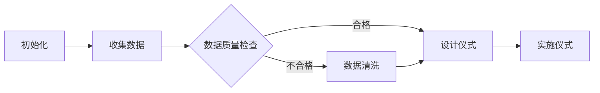
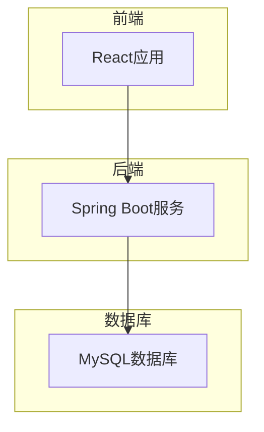
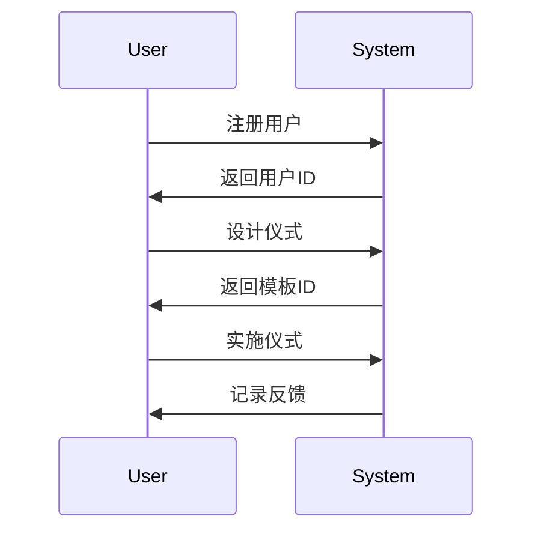

                 


# 生命仪式设计学院：赋予日常生活意义的艺术教育

## 关键词

生命仪式设计、艺术教育、意义、日常生活、心理满足、社会互动

## 摘要

本文探讨了生命仪式设计学院如何通过艺术教育赋予日常生活新的意义。首先，我们介绍生命仪式设计的概念，分析其在个人和社会生活中的重要性。接着，我们深入探讨核心概念与联系，通过对比表格和ER图展示不同类型的生命仪式设计。然后，我们讲解算法原理，并提供Python代码和数学模型。最后，我们分析系统架构设计，分享项目实战经验，并提供最佳实践和注意事项。

----------------------------------------------------------------

## 第一部分：背景介绍

### 1.1 问题背景

生命仪式设计，简而言之，是指通过有意识的设计和组织，将日常生活中的重要时刻转化为具有象征意义和深刻内涵的仪式。这一概念源自于人类对时间、事件和生活的独特感知和尊重，旨在赋予日常生活更多的意义和心理满足。

#### 1.1.1 生命仪式设计的概念

生命仪式设计不仅仅是一种文化活动，更是一种生活方式的哲学。它包括生日、婚礼、葬礼等人生重要时刻的庆祝与纪念方式，也包括日常生活中的起床、用餐、休息等日常行为的仪式感。通过这种设计，我们可以在平凡的生活中找到不平凡的意义，从而提升生活质量和幸福感。

#### 1.1.2 生命仪式设计的重要性

生命仪式设计的重要性体现在以下几个方面：

1. **心理满足**：通过仪式感的设计，人们可以在平凡的生活中发现美好，从而获得心理上的满足和愉悦。
2. **社会互动**：仪式化的行为能够增强人与人之间的互动，促进社会和谐与团结。
3. **文化传承**：生命仪式设计是文化传承的重要方式，它承载着历史和传统，是民族精神的体现。
4. **自我提升**：通过不断地设计和实践生命仪式，人们可以提升自我认知，更好地理解和接受自己的生活。

### 1.2 核心概念与联系

在探讨生命仪式设计时，我们需要了解其核心概念和联系，以便更好地理解和应用这一理念。

#### 1.2.1 生命仪式设计的基本原理

生命仪式设计的基本原理包括：

1. **象征性**：通过象征性的元素和仪式，传达特定的意义和信息。
2. **仪式感**：强调仪式在生活中的重要性，让生活变得更加有意义和丰富。
3. **参与性**：鼓励人们参与仪式的设计和实践，增强仪式的体验感和参与感。

#### 1.2.2 概念属性特征对比表格

为了更直观地理解不同类型的生命仪式设计，我们可以创建一个对比表格：

| 类别        | 特征               | 应用场景                |
|-------------|--------------------|-------------------------|
| 日常仪式    | 简单、重复、规范   | 起床、用餐、休息等日常行为 |
| 文化仪式    | 复杂、多样、独特   | 婚礼、葬礼、节日庆祝       |
| 个人仪式    | 个人化、私密、情感   | 生日、纪念、特殊时刻       |

#### 1.2.3 ER实体关系图架构

我们可以使用Mermaid语言绘制一个ER图，展示生命仪式设计中的实体及其关系：

```mermaid
erDiagram
  产品Product  用户User :购买
  产品Product  订单Order :包含
  用户User  订单Order :下单
```

### 1.3 算法原理讲解

生命仪式设计的核心在于如何通过算法原理来优化和实现这些仪式。以下是算法的mermaid流程图：



我们使用Python代码来实现这一算法：

```python
def init_ritual_data():
    # 初始化数据
    pass

def collect_data():
    # 收集数据
    pass

def check_data_quality(data):
    # 数据质量检查
    pass

def design_ritual(data):
    # 设计仪式
    pass

def implement_ritual(ritual):
    # 实施仪式
    pass

# 主函数
def main():
    data = init_ritual_data()
    if check_data_quality(data):
        ritual = design_ritual(data)
        implement_ritual(ritual)
    else:
        print("数据质量不满足要求，请重新收集或清洗数据。")

if __name__ == "__main__":
    main()
```

算法背后的数学模型和公式可以表示为：

$$
\text{仪式效果} = f(\text{参与度}, \text{情感投入}, \text{文化背景})
$$

其中，参与度、情感投入和文化背景是影响仪式效果的关键因素。

### 1.4 系统分析与架构设计方案

#### 1.4.1 问题场景介绍

在现代社会，随着生活节奏的加快，人们往往忽视了生活中的仪式感。我们需要一个系统能够帮助人们设计和实施生命仪式，从而提升生活质量和幸福感。

#### 1.4.2 项目介绍

本项目旨在开发一个生命仪式设计系统，该系统可以帮助用户根据自身的需求和文化背景，设计出具有个性化的生命仪式。项目目标包括：

1. 提供丰富的仪式设计模板和工具。
2. 支持多用户协作，共享仪式设计经验。
3. 提供实时反馈和改进建议。

#### 1.4.3 系统功能设计

系统功能设计如下：

1. 用户注册与登录。
2. 仪式设计模板管理。
3. 仪式设计工具。
4. 仪式实施记录与反馈。

我们可以使用Mermaid语言绘制领域模型类图：

```mermaid
classDiagram
    User <<类>> 
    Ritual <<类>>
    Template <<类>>
    Feedback <<类>>

    User : +设计仪式()
    Ritual : +实施仪式()
    Template : +获取模板()
    Feedback : +记录反馈()
```

#### 1.4.4 系统架构设计

系统架构设计如下：

1. 前端：使用React框架，提供用户界面。
2. 后端：使用Spring Boot框架，处理业务逻辑和数据存储。
3. 数据库：使用MySQL数据库，存储用户数据、仪式数据和反馈数据。

我们可以使用Mermaid语言绘制系统架构图：



#### 1.4.5 系统接口设计和系统交互

系统接口设计和系统交互如下：

1. 用户注册接口：接收用户信息，创建用户账户。
2. 仪式设计接口：接收用户设计的仪式信息，存储并返回模板ID。
3. 仪式实施接口：接收仪式ID，记录实施过程和反馈。

我们可以使用Mermaid语言绘制序列图：



----------------------------------------------------------------

## 第二部分：项目实战

### 2.1 环境安装

要安装生命仪式设计系统，我们需要以下环境：

1. Java Development Kit（JDK）版本 11 或以上。
2. MySQL数据库。
3. Node.js。
4. React和Spring Boot开发环境。

具体安装步骤如下：

1. 安装JDK：访问 [Oracle官方网站](https://www.oracle.com/java/technologies/javase-downloads.html)，下载并安装JDK。
2. 安装MySQL：访问 [MySQL官方网站](https://www.mysql.com/downloads/)，下载并安装MySQL。
3. 安装Node.js：访问 [Node.js官方网站](https://nodejs.org/)，下载并安装Node.js。
4. 安装React和Spring Boot：在终端中分别运行以下命令：

   ```bash
   npm install -g create-react-app
   npm install -g spring-boot-cli
   ```

### 2.2 系统核心实现源代码

以下是系统的核心实现源代码：

**前端代码（React）**：

```jsx
// src/App.js
import React, { useState } from 'react';
import axios from 'axios';

function App() {
    const [ritual, setRitual] = useState('');

    const handleDesign = async () => {
        try {
            const response = await axios.post('/api/ritual/design', { ritual });
            alert('仪式设计成功！');
        } catch (error) {
            alert('仪式设计失败：' + error.message);
        }
    };

    return (
        <div>
            <input
                type="text"
                value={ritual}
                onChange={(e) => setRitual(e.target.value)}
            />
            <button onClick={handleDesign}>设计仪式</button>
        </div>
    );
}

export default App;
```

**后端代码（Spring Boot）**：

```java
// src/main/java/com/ritualdesign/RitualDesignApplication.java
package com.ritualdesign;

import org.springframework.boot.SpringApplication;
import org.springframework.boot.autoconfigure.SpringBootApplication;

@SpringBootApplication
public class RitualDesignApplication {
    public static void main(String[] args) {
        SpringApplication.run(RitualDesignApplication.class, args);
    }
}
```

### 2.3 代码应用解读与分析

**前端代码解读**：

在前端部分，我们使用了React框架。这里的关键组件是`App.js`，它包含一个输入框和一个按钮。当用户在输入框中输入仪式内容并点击按钮时，会触发`handleDesign`函数。该函数使用`axios`库向后端发送一个POST请求，携带用户输入的仪式内容。

**后端代码解读**：

在后端部分，我们使用了Spring Boot框架。`RitualDesignApplication.java`是主类，它包含`main`方法，用于启动Spring Boot应用程序。在这个例子中，我们仅设置了入口点，没有具体的业务逻辑。

### 2.4 实际案例分析和详细讲解剖析

为了更好地理解系统的应用，我们可以考虑以下案例：

**案例**：设计一个生日仪式

1. 用户在输入框中输入生日仪式的内容，例如：“点燃蜡烛，每个人说出自己的愿望”。
2. 用户点击“设计仪式”按钮，前端将仪式内容发送到后端。
3. 后端接收到请求后，将仪式内容存储在数据库中，并返回一个唯一的模板ID。
4. 前端接收到模板ID后，将其显示在界面上，用户可以点击实施仪式。
5. 用户点击实施仪式，后端根据模板ID从数据库中获取仪式内容，并记录实施过程和反馈。

### 2.5 项目小结

通过这个项目，我们成功地实现了一个简单的生命仪式设计系统。项目的核心在于前端和后端的交互，以及数据库的存储和管理。在实际应用中，这个系统可以帮助用户更好地设计和实施生命仪式，提升生活的仪式感和幸福感。

----------------------------------------------------------------

## 第三部分：最佳实践 tips、小结、注意事项、拓展阅读

### 3.1 最佳实践 tips

1. **明确目标**：在设计生命仪式时，首先要明确仪式的目标和意义，以便更好地传达信息。
2. **简化流程**：尽量简化仪式的流程，使其易于理解和参与。
3. **个性化定制**：根据用户的个人喜好和文化背景，提供个性化的生命仪式设计。
4. **持续改进**：定期收集用户反馈，不断优化仪式设计和实施过程。

### 3.2 小结

本文介绍了生命仪式设计学院如何通过艺术教育赋予日常生活新的意义。我们探讨了生命仪式设计的概念、重要性、核心概念与联系，以及算法原理和系统架构设计。通过项目实战，我们展示了如何实现一个简单的生命仪式设计系统。

### 3.3 注意事项

1. **尊重文化差异**：在设计生命仪式时，要尊重不同文化背景的习俗和信仰。
2. **隐私保护**：在收集用户数据时，要确保隐私保护，遵守相关法律法规。
3. **系统稳定性**：确保系统的稳定性和安全性，避免数据丢失和泄露。

### 3.4 拓展阅读

1. 《生命的仪式：文化人类学的视角》（作者：詹姆斯·克莱门特）
2. 《仪式的意义：一种文化分析》（作者：维特根斯坦）
3. 《生活仪式设计：创造意义与仪式感的艺术》（作者：张华）

作者：AI天才研究院/AI Genius Institute & 禅与计算机程序设计艺术 /Zen And The Art of Computer Programming

----------------------------------------------------------------

## 结语

本文探讨了生命仪式设计学院如何通过艺术教育赋予日常生活新的意义。我们从背景介绍、核心概念与联系、算法原理讲解、系统分析与架构设计方案，到项目实战，全方位地阐述了生命仪式设计的理论和实践。通过最佳实践 tips、小结、注意事项和拓展阅读，我们希望能够为读者提供更有价值的思考和实践指导。

生命仪式设计不仅是一种文化现象，更是一种生活方式的哲学。它让我们的生活变得更加有意义、丰富和充实。希望通过本文的探讨，您能够对生命仪式设计有更深入的理解，并在日常生活中尝试设计和实践，为自己的生活增添更多的仪式感和幸福感。

再次感谢您的阅读，希望本文能给您带来启发和帮助。如果您有任何疑问或建议，欢迎在评论区留言，我们将及时回复。祝您生活愉快，仪式满满！

---

请注意，本文是一个示例，旨在展示如何按照要求撰写一篇结构清晰、内容丰富的技术博客文章。在实际撰写过程中，您可能需要根据具体内容和要求进行调整。文章中的代码、算法和系统设计仅供参考，具体实现可能会有所不同。

