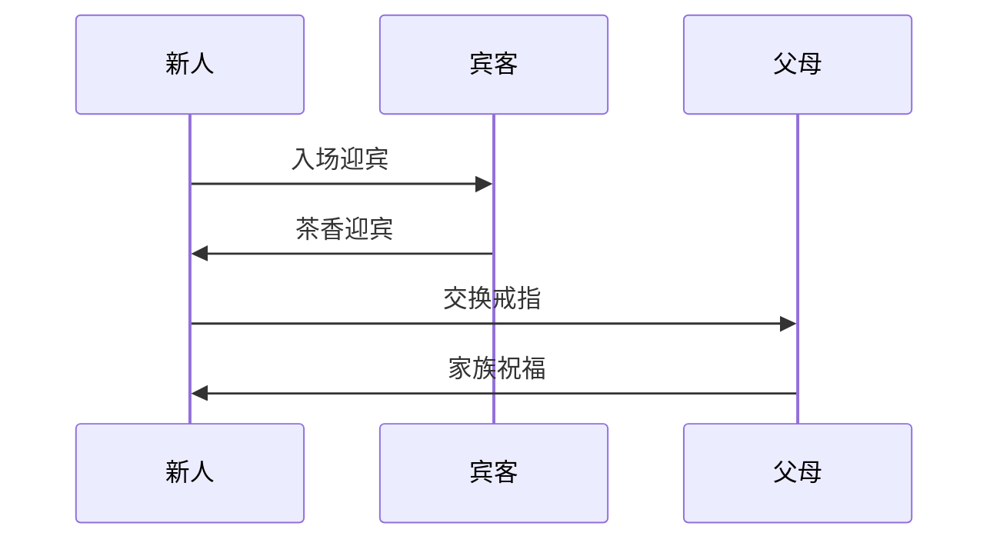
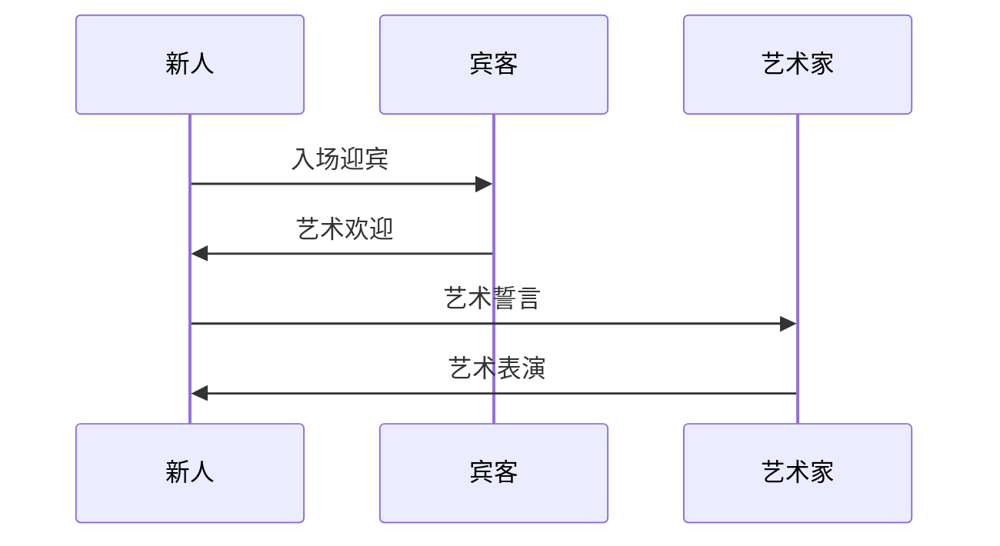

                 

### 《生命仪式设计工作室：创造现代人的神圣时刻》

#### 关键词
- 生命仪式设计
- 现代人的神圣时刻
- 设计理念与背景
- 仪式类型与分类
- 理论基础与技巧

#### 摘要
本文将深入探讨生命仪式设计工作室如何创造现代人的神圣时刻。通过分析生命仪式的定义、意义以及设计原则，我们将逐步揭示仪式设计的过程和技巧，探讨现代人在精神追求中的需求，并通过具体案例研究和工作室运作，提供实用的生命仪式设计建议。本文旨在为读者提供一个全面且深刻的理解，帮助他们在现代社会中体验到具有深远意义的神圣时刻。

----------------------------------------------------------------

## 引言

### 1.1 生命仪式的设计理念与背景

生命仪式是一种通过象征性活动来强化个体或集体身份认同、传承文化价值、以及满足精神需求的重要手段。在历史的长河中，不同文化背景下的生命仪式展现了人类对生命的尊重、对自然的敬畏以及对神圣时刻的追求。

#### 定义与意义

生命仪式（Rituals of Life）通常指围绕个人或集体重要生命事件所进行的象征性活动。这些仪式可能包括出生、成长、结婚、死亡等各个阶段，它们不仅承载了丰富的文化内涵，还在一定程度上反映了社会规范和价值观念。

在现代社会的背景下，生命仪式的意义愈发凸显。随着生活节奏的加快和物质生活的丰富，现代人面临越来越多的精神空虚和内心迷茫。生命仪式提供了一个契机，使人们在繁忙的生活中暂停脚步，重新审视自我和周围的世界。通过参与仪式，个体能够在情感上得到共鸣，心灵上得到滋养，从而找到内心的平静和力量。

#### 设计趋势

随着全球化的进程，生命仪式的设计呈现出多样化和个性化的趋势。人们越来越倾向于根据自身的文化背景、价值观念和情感需求来定制仪式。这不仅体现在传统仪式的现代化改造上，也体现在新型仪式的创新设计上。例如，结合东方禅意和西方仪式元素的新型婚礼、融合传统文化与现代艺术表演的纪念活动等，都在现代社会中找到了自己的空间。

#### 本书的结构

本书将分为七个部分，旨在全面解析生命仪式的设计。第一部分将介绍生命仪式的设计理念与背景，探讨其在现代社会中的意义和趋势。接下来的部分将深入探讨生命仪式的概念和类型，理论基础和设计过程，以及现代人的神圣时刻体验。在第五部分，我们将通过案例研究和工作室运作，展示生命仪式设计的实际应用。最后，在第六部分和第七部分，我们将讨论生命仪式设计的未来展望，并总结全书的主要观点。

通过这样的结构安排，我们希望能够为读者提供一个系统、全面且实用的生命仪式设计指南，帮助他们在现代生活中创造具有深远意义的神圣时刻。

### 1.2 神圣时刻与现代人的需求

在现代社会的快节奏和高度竞争环境下，人们的精神需求愈发多样和复杂。在这种背景下，神圣时刻（Sacred Moments）成为现代社会中一个引人关注且具有深远意义的概念。神圣时刻不仅是个体经历的重要转折点，也是集体文化认同的重要体现。

#### 现代人的精神追求

随着物质生活的丰富，现代人开始更加关注精神层面的满足。他们渴望在平凡的生活中找到意义和价值，通过体验神圣时刻来填补内心的空虚。神圣时刻不仅仅是一种仪式，更是一种精神体验，它能够带给人们内心的平静和力量。

以下是现代人在精神追求中的一些典型需求：

1. **情感的共鸣**：现代社会中，人们渴望在集体活动中找到归属感，通过共同参与神圣时刻，建立情感上的联系和共鸣。
2. **心灵的滋养**：面对生活中的压力和焦虑，现代人需要通过仪式来获得心灵的慰藉和滋养，找到内心的平静。
3. **自我认同**：在追求个性化和多样化的现代社会，个体需要通过神圣时刻来强化自我认同，确立自己的价值观念和人生目标。
4. **文化的传承**：通过神圣时刻，现代人能够更好地理解和传承自己的文化传统，增强文化认同感和自豪感。

#### 神圣时刻的情感体验

神圣时刻通常伴随着强烈的情感体验，这些情感体验不仅是个体内心的反映，也是集体文化认同的体现。以下是一些典型的情感体验：

1. **感动**：在神圣时刻中，人们往往能够感受到一种深刻的感动，这种感动不仅来自仪式本身，也来自周围人群的共鸣和参与。
2. **敬畏**：面对生命的庄严和神秘，人们在神圣时刻中常常会感受到一种敬畏之情，这种敬畏能够让他们更加珍惜生命和自然。
3. **感恩**：通过神圣时刻，人们能够表达对生命、自然和文化的感恩之情，这种感恩能够提升他们的内心满足感和幸福感。
4. **归属**：在神圣时刻中，个体能够感受到与集体和文化的归属感，这种归属感能够增强他们的自我认同和文化认同。

#### 生命仪式与个人成长

神圣时刻不仅仅是一种仪式，它更是一个人成长和发展的契机。通过参与生命仪式，个体能够在以下方面获得成长：

1. **认知成长**：通过理解和参与仪式，个体能够更好地理解自己的文化传统和价值观，增强认知和思考能力。
2. **情感成长**：在神圣时刻中，个体能够经历丰富的情感体验，这种体验有助于他们的情感发展和情感管理能力的提升。
3. **自我认同**：通过仪式，个体能够更好地了解自己，确立自我认同，找到自己的价值和人生目标。
4. **社会技能**：参与仪式需要与他人合作和沟通，这有助于提升个体的社交能力和团队合作能力。

#### 结论

神圣时刻在现代人的精神生活中扮演着至关重要的角色。通过理解和设计生命仪式，我们能够为现代人创造更多具有深远意义的神圣时刻，满足他们的精神需求，促进个人成长和社会和谐。接下来，我们将进一步探讨生命仪式的概念和类型，为读者提供更深入的洞察。

### 1.3 问题背景与问题描述

在现代社会，随着科技的发展和物质生活的丰富，人们的精神需求日益增加。然而，现实中的问题也随之而来。许多人在日常生活中感到焦虑、孤独和无意义，难以找到内心的平静。这些问题在很大程度上源于现代社会的快节奏和高度竞争，使得人们缺乏时间去反思和审视自己的生活。此外，传统文化在现代生活中的式微，也使得许多人失去了信仰和精神的寄托。

#### 问题解决思路

为了解决这些问题，我们需要从多个角度入手，包括个人层面、社会层面和文化层面。首先，个人需要主动调整自己的心态和生活节奏，学会在繁忙中找到片刻的宁静。其次，社会应该提供更多的支持和资源，帮助人们应对生活中的压力和挑战。最后，文化层面需要加强传统文化的传承和创新，使现代人在精神上找到归属和意义。

#### 边界与外延

在探讨生命仪式设计时，我们需要明确其边界与外延。边界方面，生命仪式设计主要涉及个人或集体的重要生命事件，如出生、成长、结婚和死亡等。外延方面，生命仪式不仅限于传统意义上的宗教或文化仪式，还可以包括现代生活中的各种庆典、纪念活动和仪式化行为。

#### 概念结构与核心要素组成

生命仪式设计包含以下几个核心概念和要素：

1. **仪式主题**：仪式的核心内容和目的，通常与个体的生命历程或文化背景密切相关。
2. **仪式流程**：仪式的具体步骤和程序，包括开场、主体和结尾等。
3. **仪式道具**：用于增强仪式氛围和象征意义的物品，如花环、蜡烛、音乐和服饰等。
4. **仪式参与者**：包括主持者、参与者和其他相关人员，他们在仪式中扮演不同角色，共同创造神圣时刻。
5. **仪式环境**：仪式进行的场所和氛围，对仪式的效果具有重要影响。

通过以上核心概念和要素的组成，生命仪式设计工作室可以为现代人创造具有深远意义的神圣时刻，满足他们的精神需求。

### 1.4 生命仪式的概念解析

生命仪式（Rituals of Life）是一种通过象征性行为来表达宗教信仰、文化传统和个体情感的仪式。它不仅仅是一种形式化的活动，更是一种深刻的文化符号，承载着丰富的社会和宗教意义。在探讨生命仪式的概念时，我们需要从其本质、历史渊源和文化多样性等多个角度进行深入分析。

#### 生命仪式的本质

生命仪式的本质在于通过象征性行为和符号系统，传递特定的信仰、价值观念和情感体验。这些仪式行为可以是简单的动作，如洗手、点亮蜡烛，也可以是复杂的仪式化过程，如婚礼、葬礼和洗礼。无论是何种形式，生命仪式的核心都在于其象征性，即通过符号化的行为来表达个体的内心世界和集体文化的价值观。

生命仪式的象征性体现在以下几个方面：

1. **宗教信仰的体现**：许多生命仪式源于宗教信仰，通过仪式化的行为来传达宗教教义和对神灵的敬畏。例如，基督教的洗礼仪式不仅象征着个体的重生，也象征着对上帝的信仰。
2. **文化传承的媒介**：生命仪式是文化传承的重要途径，通过代代相传的仪式形式，将文化传统和价值观念传递给下一代。例如，中国的婚礼仪式不仅包含传统习俗，如“六礼”，还融入了现代元素，使传统与现代相互融合。
3. **情感体验的表达**：生命仪式为个体提供了一个情感宣泄和共鸣的平台，使人们在共同的仪式活动中体验到强烈的情感共鸣。例如，葬礼仪式中的悼念和哀思，能够帮助家属和亲友在情感上得到慰藉。

#### 历史渊源

生命仪式的历史可以追溯到古代文明，不同文化背景下的生命仪式展现了人类对生命、自然和神灵的敬畏与崇拜。以下是一些具有代表性的历史渊源：

1. **古埃及**：古埃及文明中的生命仪式尤为丰富，从出生仪式、婚礼到葬礼，每个重要的人生阶段都有相应的仪式。这些仪式不仅体现了对生命的敬畏，还体现了对神灵的崇拜和对来世的期待。
2. **古希腊和罗马**：古希腊和罗马文明中的生命仪式也具有重要地位。古希腊的奥林匹克运动会是一种体育和宗教仪式的融合，而罗马的凯旋仪式则是对英雄和帝王的崇敬。
3. **中国**：中国的生命仪式源远流长，从古代的“冠礼”、“婚礼”到现代的“生日庆典”和“葬礼”，每个仪式都蕴含着深厚的文化内涵和伦理价值。

#### 文化多样性

生命仪式在不同文化背景下表现出极大的多样性，这种多样性不仅体现在仪式形式上，也体现在仪式的象征意义和仪式过程中的具体操作上。以下是一些不同文化背景下的生命仪式：

1. **基督教**：基督教的生命仪式包括洗礼、婚礼和葬礼。洗礼象征着个体的重生和信仰的确认；婚礼象征着爱情的结合和婚姻的神圣；葬礼则是对逝者的悼念和纪念。
2. **伊斯兰教**：伊斯兰教的婚礼仪式相对简单，但非常庄重。婚礼中，新郎和新娘在众人的见证下共同完成婚姻的誓言，标志着他们正式成为夫妻。
3. **印度教**：印度教的婚礼仪式非常复杂且富有象征意义。婚礼中，新娘和新郎要经过多个仪式，如涂油仪式、穿婚纱仪式等，每个仪式都有其独特的象征意义。
4. **非洲部落**：非洲部落的生命仪式具有浓厚的原始和自然色彩。例如，某些部落的成年仪式中，青少年要接受割礼，通过这种仪式化的疼痛来象征着他们的成长和成熟。

通过以上分析，我们可以看到，生命仪式在不同文化背景下的多样性和复杂性。这些仪式不仅反映了人类对生命、自然和神灵的敬畏，也是文化传承和情感表达的载体。理解生命仪式的概念和其历史渊源，有助于我们更好地理解和尊重不同的文化传统，同时也为我们设计和创新现代生命仪式提供了丰富的灵感来源。

### 1.5 生命仪式的类型分类

生命仪式的类型丰富多样，它们不仅反映了不同文化背景下人们的信仰和生活习俗，还体现了不同人生阶段的重要意义。根据不同的分类标准，我们可以将生命仪式分为多种类型，每种类型都有其独特的象征意义和功能。

#### 个人仪式

个人仪式通常与个体的生命历程相关，是个人重要转折点的标志。以下是一些常见的个人仪式：

1. **出生仪式**：包括命名仪式、洗礼仪式等，标志着婴儿的出生和家庭成员的新成员加入。
2. **成年仪式**：某些文化中，成年仪式是青少年从童年过渡到成年的重要标志，如西方的成人礼、中国的冠礼等。
3. **婚礼**：婚礼是两个人爱情的结晶，标志着新家庭的成立。不同文化背景下，婚礼仪式各具特色，如西式的教堂婚礼、东方的传统婚礼等。
4. **丧礼**：丧礼是对逝者的悼念和纪念，不同宗教和文化背景下，丧礼的形式和仪式也有所不同，如基督教的葬礼、伊斯兰教的土葬仪式等。

#### 家庭仪式

家庭仪式是家庭成员共同参与的活动，强化家庭关系和集体记忆。以下是一些常见的家庭仪式：

1. **家庭聚会**：包括春节聚会、圣诞节聚餐等，是家庭成员团聚、交流和庆祝的重要时刻。
2. **生日庆典**：生日庆典是对家庭成员生日的庆祝，体现了对生命的尊重和祝福。
3. **家庭祭祀**：某些家庭会定期举行祭祀仪式，纪念祖先，表达对家族先辈的敬意和感恩。

#### 社会仪式

社会仪式是集体行为，通常与重大社会事件或文化传统相关。以下是一些常见的社会仪式：

1. **国家庆典**：如国庆节、劳动节等，是社会共同庆祝国家重要事件的日子。
2. **文化节**：文化节是展示和传承某一民族文化的重要活动，如中国的春节、印度排灯节等。
3. **毕业典礼**：毕业典礼是学生完成学业的标志，也是他们踏入社会的重要时刻。

#### 宗教仪式

宗教仪式是宗教信仰的核心部分，通常由宗教机构主持。以下是一些常见的宗教仪式：

1. **洗礼仪式**：洗礼是基督教中重要的仪式，象征着个体重生的信仰。
2. **婚礼仪式**：许多宗教都有自己的婚礼仪式，强调婚姻的神圣性和责任感。
3. **祭拜仪式**：祭拜仪式是许多宗教中纪念神灵和先辈的重要方式，如佛教的烧香祭拜、基督教的礼拜仪式等。

#### 文化仪式

文化仪式是某一特定文化背景下的传统活动，通常与特定的文化价值观和信仰相关。以下是一些常见的文化仪式：

1. **节庆活动**：如春节、中秋节等，是传统节日的庆祝活动，体现对文化的尊重和传承。
2. **婚礼习俗**：不同文化背景下的婚礼习俗丰富多彩，如中国的“六礼”、西方的求婚仪式等。
3. **成年礼**：某些文化中的成年礼，如日本的“入浴式”，标志着个体进入成年阶段。

通过对生命仪式类型的分类，我们可以看到，不同类型的仪式在个人成长、家庭凝聚、社会认同和文化传承中扮演着重要角色。这些仪式不仅是文化符号的体现，也是人们精神需求的重要满足方式。在现代社会，理解和设计这些仪式，有助于我们在快速变迁的社会环境中找到精神归属和文化认同。

### 2.2 仪式设计的理论基础

仪式设计不仅仅是一种艺术，更是一种科学，其理论基础涵盖了心理学、人类学和文化研究等多个学科领域。理解这些理论基础有助于我们深入探讨仪式设计的核心原则和实践方法。

#### 心理学视角下的仪式

在心理学中，仪式被认为是一种强烈的情绪表达和认知调整工具。心理学家埃里克·埃里克森（Erik Erikson）提出了“心理社会发展理论”，认为个体在不同生命周期阶段需要完成特定的心理任务，从而实现个人成长。仪式在这些阶段中扮演了关键角色，通过象征性的行为和仪式化的过程，帮助个体完成心理任务，如身份认同、自我成长和情感调节。

1. **情绪表达**：仪式提供了一个安全的平台，使个体能够表达和宣泄强烈的情绪，如喜悦、悲伤和敬畏。心理学家朱迪思·布卢姆（Judith Bloom Fradkin）指出，仪式可以通过身体动作和符号化的行为，将个体的内在情绪转化为外在的符号，从而实现情绪的释放和调整。
2. **认知调整**：仪式通过重复和象征性的行为，帮助个体建立新的认知结构和思维模式。例如，婚礼仪式通过象征性的行为和语言，使新婚夫妇建立新的家庭角色和责任认知。

#### 人类学视角下的仪式

人类学视角下的仪式研究强调了文化和社会背景对仪式设计和功能的影响。文化人类学家克利福德·格尔茨（Clifford Geertz）提出了“仪式作为文化符号”的观点，认为仪式是文化系统的象征性表达，通过仪式化的行为和符号，文化价值观和社会规范得以传递和强化。

1. **文化象征**：仪式是文化象征的载体，通过仪式化的行为和符号，文化价值观和社会规范得以传承和表达。格尔茨认为，仪式是一种“深层的结构”，它通过符号化的行为，将文化意义和社会规则传递给下一代。
2. **社会整合**：仪式在社会整合中发挥了重要作用。通过共同参与仪式，个体和集体能够建立情感上的联系和社会认同，增强社区的凝聚力。例如，婚礼仪式不仅标志着新家庭的成立，也强化了家庭成员和社会成员之间的社会纽带。

#### 符号学视角下的仪式

符号学视角下的仪式研究强调了符号和意义在仪式设计中的核心作用。符号学家罗兰·巴特（Roland Barthes）将符号分为“符号”（Symbol）和“象征”（Icon），指出仪式中的符号和象征具有强烈的象征意义和情感共鸣。

1. **符号的使用**：仪式中的符号（如服饰、道具、动作等）具有特定的文化和社会意义，通过这些符号的使用，仪式能够传达特定的情感和意义。例如，在婚礼仪式中，白色婚纱不仅是一种审美选择，更是一种文化符号，象征着纯洁和爱情。
2. **象征的共鸣**：象征（如符号、仪式过程等）能够引发个体的情感共鸣，使个体在仪式中体验到深刻的情感体验。例如，宗教仪式中的祷告和诵经，不仅具有宗教意义，还能够引发个体的情感共鸣，带来心灵上的慰藉。

#### 仪式设计的基本原则

在综合心理学、人类学和符号学视角的基础上，我们可以提炼出仪式设计的基本原则，这些原则有助于我们更好地理解和设计具有深远意义的仪式。

1. **情感共鸣**：仪式设计应充分考虑参与者的情感需求，通过符号和象征性的行为，引发参与者的情感共鸣，使他们在仪式中体验到深刻的情感体验。
2. **文化传承**：仪式设计应融入文化传统和价值观念，通过仪式化的过程和符号，传递文化意义和社会规范，强化文化认同感。
3. **认知调整**：仪式设计应有助于参与者的认知调整，通过象征性的行为和语言，帮助个体建立新的认知结构和思维模式，实现个人成长和自我认同。
4. **社会整合**：仪式设计应促进社会整合，通过共同参与仪式，建立情感上的联系和社会认同，增强社区的凝聚力。

#### 结论

通过心理学、人类学和符号学等多学科视角的分析，我们可以深入理解仪式设计的理论基础。仪式设计不仅是一种艺术，更是一种科学，它通过情感共鸣、文化传承、认知调整和社会整合，帮助个体和集体在现代社会中找到精神归属和文化认同。在接下来的章节中，我们将进一步探讨仪式设计的过程和技巧，为读者提供实用的仪式设计指南。

### 2.3 仪式设计的过程和技巧

设计一个成功的生命仪式需要系统的方法和精细的技巧。以下将详细阐述仪式设计的全过程，包括设计前期调研、目标受众分析、仪式主题的确定、仪式流程的设计，以及仪式空间的营造、道具选择与运用、仪式活动组织与协调等方面。

#### 设计前期调研

在设计生命仪式之前，进行充分的前期调研是至关重要的一步。这一阶段的主要任务是了解以下几个方面：

1. **文化背景**：调研与仪式相关的文化传统和价值观念，了解不同文化背景下仪式的习俗和意义。例如，对于中式婚礼，了解传统的六礼程序和象征意义是非常重要的。
2. **受众需求**：通过问卷调查、访谈等方式，了解目标受众的年龄、性别、文化背景、情感需求和期望。这有助于确保仪式设计能够满足参与者的需求，增强仪式的吸引力和感染力。
3. **仪式目的**：明确仪式的主要目的，如纪念、庆祝、祈福、悼念等。目的的明确有助于后续的设计工作，确保仪式的设计和执行具有清晰的方向。

#### 目标受众分析

在了解文化背景和受众需求的基础上，对目标受众进行详细分析是仪式设计的关键环节。目标受众分析包括以下几个方面：

1. **年龄结构**：不同年龄段的受众对仪式的期望和参与方式可能有所不同。例如，年轻人可能更倾向于创新和个性化的仪式，而年长者可能更重视传统和仪式感。
2. **文化背景**：不同文化背景的受众对仪式的理解和接受程度可能存在差异。例如，对于外国游客参加的婚礼，设计时需要考虑跨文化适应的问题。
3. **情感需求**：分析受众的情感需求，如他们希望从仪式中获得哪些情感体验，是喜悦、感动、安慰还是敬意。这有助于设计出能够触动心灵的仪式环节。

#### 仪式主题的确定

仪式主题是仪式设计的核心，它决定了仪式的整体风格和氛围。确定仪式主题的过程包括：

1. **主题选择**：根据前期调研和目标受众分析，选择一个具有深远意义和吸引力的主题。例如，对于一个婚礼，可以选择“爱之旅”、“幸福之约”等主题。
2. **主题体现**：确保仪式的每个环节都能体现主题，从音乐、服饰、道具到仪式流程，都要与主题相契合，使整个仪式浑然一体。

#### 仪式流程的设计

仪式流程的设计是仪式设计的核心，它决定了仪式的节奏和流程。设计仪式流程时，需要考虑以下几个方面：

1. **开场**：设计一个引人入胜的开场，如欢迎致辞、音乐演奏等，为仪式营造氛围。
2. **主体环节**：主体环节是仪式的核心，根据仪式主题，设计一系列有意义的仪式环节，如婚礼中的求婚、交换戒指等。
3. **结尾**：设计一个温馨和有意义的结尾，如祝福致辞、合影留念等，使整个仪式圆满结束。

#### 仪式空间的营造

仪式空间的营造是仪式成功的关键之一，它包括以下几个方面：

1. **场地选择**：选择一个符合仪式主题和氛围的场地，如花园、教堂、宴会厅等。
2. **布置设计**：根据仪式主题进行场地的布置设计，如使用鲜花、烛光、音乐等元素，营造出温馨、庄重或浪漫的氛围。
3. **光线控制**：合理控制光线，使整个仪式空间既明亮又不失神秘感，增强仪式的感染力。

#### 道具选择与运用

道具在仪式中起着重要的象征和装饰作用，选择和运用合适的道具能够增强仪式的氛围和意义。以下是一些常见的道具选择和运用技巧：

1. **鲜花与蜡烛**：鲜花和蜡烛是仪式中常用的道具，它们不仅能够美化环境，还能象征生命的美好和神圣。例如，在婚礼仪式中，使用鲜花装饰场地，使用蜡烛点燃婚礼现场，营造出浪漫的氛围。
2. **音乐与舞蹈**：音乐和舞蹈是仪式中的动态元素，能够增强仪式的情感体验。例如，在葬礼仪式中，选择哀伤的音乐和舒缓的舞蹈，帮助参与者表达哀思。
3. **符号与标志**：使用特定的符号和标志，如宗教图腾、文化徽章等，能够增强仪式的文化意义和象征性。例如，在印度教婚礼中，使用孔雀羽毛和印度传统珠宝，突出仪式的宗教和文化特色。

#### 仪式活动组织与协调

仪式活动的组织与协调是确保仪式顺利进行的重要环节。以下是一些组织和协调技巧：

1. **团队分工**：明确各个团队成员的职责和任务，确保每个环节都有人负责，避免混乱和遗漏。
2. **流程排练**：在仪式正式开始前，进行充分的流程排练，确保每个环节都能按照计划顺利进行。
3. **现场管理**：在仪式过程中，现场管理者要密切关注各个环节的进展，及时处理突发情况，确保仪式的顺利进行。

通过以上步骤和技巧，我们能够设计出富有意义、吸引力和感染力的生命仪式，帮助现代人创造神圣时刻，满足他们的精神需求。

### 2.4 仪式设计的案例研究

#### 案例一：东方禅意婚礼

**项目介绍**：本次婚礼设计旨在融合东方禅意和现代审美，为新人打造一场既有传统文化底蕴又富有创意的婚礼。婚礼场地选择在一处静谧的花园，环境优雅，适合举办仪式感强烈的婚礼。

**系统功能设计**：
- **主题确定**：主题为“禅意之约”，旨在通过简洁、宁静的仪式表达新人的爱情。
- **仪式流程**：包括欢迎仪式、入场仪式、誓言交换、戒指仪式和祝福环节。
- **空间营造**：场地布置以淡雅的绿色和白色为主色调，配合竹简、禅意灯笼等东方元素，营造出宁静、舒适的环境。

**系统架构设计**：
- **音乐选择**：采用悠扬的古筝和琴音，配合仪式各个环节，增强仪式的感染力。
- **服饰搭配**：新人和伴郎伴娘均穿着具有东方特色的礼服，既体现了文化传统，又不失时尚感。

**接口设计与交互**：
- **欢迎仪式**：宾客入场时，由新娘的闺蜜团迎接，送上茶水和花环，营造温馨的氛围。
- **戒指仪式**：新人交换戒指时，由双方父母共同主持，象征着家庭的支持和祝福。

**系统流程图**：

**实际案例解析**：
- **情感体验**：新人和宾客在仪式过程中感受到了禅意的宁静和文化的庄重，情感共鸣强烈。
- **反馈**：宾客对婚礼的设计和执行给予了高度评价，认为仪式感丰富，文化底蕴深厚。

#### 案例二：现代艺术婚礼

**项目介绍**：本次婚礼设计注重现代艺术与婚礼仪式的结合，为新人打造一场独特而富有创意的艺术盛宴。婚礼场地选择在一处艺术展览馆，艺术氛围浓厚，适合举办创新性强的婚礼。

**系统功能设计**：
- **主题确定**：“艺术之恋”，旨在通过现代艺术元素展现新人的爱情故事。
- **仪式流程**：包括入场仪式、艺术表演、誓言交换和艺术展览参观。
- **空间营造**：场地布置以黑色和白色为主色调，融入现代艺术装置和作品，营造出独特的艺术氛围。

**系统架构设计**：
- **音乐选择**：采用现代电子音乐和古典音乐混合演奏，为仪式增色添彩。
- **服饰搭配**：新人和伴郎伴娘穿着时尚前卫的礼服，突出个性。

**接口设计与交互**：
- **艺术表演**：婚礼过程中穿插了现场绘画、舞蹈表演等艺术节目，增强仪式的观赏性。
- **誓言交换**：新人在艺术装置前交换誓言，背景音乐和灯光效果增强仪式感。

**系统流程图**：

**实际案例解析**：
- **情感体验**：宾客在欣赏艺术表演的同时，深深感受到新人的艺术气质和爱情力量，情感体验丰富。
- **反馈**：宾客对婚礼的艺术创意和执行表示高度赞赏，认为是一场难忘的艺术盛宴。

通过以上两个案例，我们可以看到，不同的婚礼设计理念如何通过具体的仪式流程、空间营造、道具选择和活动组织，为新人打造出具有深远意义的神圣时刻。这些案例不仅展示了仪式设计的多样性和创造性，也为其他仪式设计提供了宝贵的参考。

### 3.1 设计理念与核心价值观

生命仪式设计工作室的设计理念与核心价值观在于通过精心设计的仪式，帮助现代人找到精神归属，增强情感共鸣，并促进个人成长。我们的核心价值观包括文化尊重、情感共鸣、创新设计和个性化定制。

#### 文化尊重

文化尊重是生命仪式设计工作室的核心原则之一。我们深知每个文化都有其独特的价值和意义，因此在设计过程中，我们注重深入了解不同文化背景下的传统习俗和价值观念，确保仪式设计既符合文化传统，又能满足现代人的需求。我们强调仪式设计应尊重并融入多元文化，通过融合不同文化的元素，创造出独特的仪式体验。

#### 情感共鸣

情感共鸣是生命仪式设计的灵魂。我们致力于通过仪式化的过程和象征性的行为，触动参与者的内心，激发情感共鸣。在仪式设计过程中，我们注重细节，从音乐、灯光、道具到仪式流程，每个环节都经过精心策划，以确保参与者能够在仪式中体验到深刻的情感体验，如喜悦、感动、敬畏和归属感。

#### 创新设计

创新设计是生命仪式设计工作室的重要特色。我们不断探索和尝试新的设计理念和方法，将现代科技与传统文化相结合，创造出既传统又富有创意的仪式形式。我们鼓励设计师们在设计中发挥创意，通过创新的设计元素和表现手法，为参与者带来全新的体验。

#### 个性化定制

个性化定制是生命仪式设计工作室的核心服务之一。我们了解每个个体的独特需求和期望，因此提供定制化的仪式设计方案。无论是婚礼、纪念活动还是企业庆典，我们都能根据客户的需求，量身打造具有个性化特色的仪式，确保仪式的每一个细节都能满足客户的期望。

#### 设计过程

我们的设计过程遵循一系列科学且系统的步骤，确保每个仪式都能达到最佳效果。以下是我们的设计过程概述：

1. **前期调研**：我们首先进行前期调研，了解仪式的目的、文化背景、受众需求和期望，为后续设计工作奠定基础。
2. **主题确定**：根据前期调研结果，确定仪式的主题，确保主题具有深远意义和吸引力。
3. **流程设计**：设计仪式的流程，包括开场、主体环节和结尾，确保流程有序且富有节奏感。
4. **空间营造**：根据主题和仪式流程，设计仪式的空间布置，包括场地选择、灯光设计和道具布置等。
5. **道具选择**：选择合适的道具，如音乐、服饰、鲜花、蜡烛等，增强仪式的氛围和象征意义。
6. **组织协调**：在仪式执行前，进行充分的组织和协调，确保各个环节无缝衔接，仪式顺利进行。

#### 实施与反馈

在仪式实施过程中，我们注重细节管理，确保每个环节都按照设计进行。仪式结束后，我们收集参与者的反馈，不断优化我们的设计和服务。通过持续改进，我们致力于提供更好的仪式设计体验。

通过以上设计理念和核心价值观，生命仪式设计工作室为现代人创造了许多具有深远意义的神圣时刻，帮助他们在现代社会中找到精神归属和文化认同。我们的设计不仅体现了文化尊重、情感共鸣、创新设计和个性化定制的理念，也为未来生命仪式设计提供了丰富的灵感和方向。

### 3.2 设计理念与创新方法

生命仪式设计工作室的设计理念和创新方法在于通过创新的思维和灵活的技巧，将传统文化与现代审美相结合，创造出既具有文化深度又充满现代感的仪式体验。以下我们将详细阐述我们的设计理念、创新方法和具体案例，展示如何通过这些方法为现代人创造神圣时刻。

#### 设计理念

1. **文化融合**：我们的设计理念强调文化融合，通过融合不同文化元素，创造出独特的仪式体验。例如，在婚礼设计中，我们可以将中国传统的龙凤元素与现代简约风格相结合，创造出既传统又现代的婚礼仪式，使参与者感受到深厚文化底蕴的同时，也能体验到现代审美的魅力。

2. **情感共鸣**：我们注重通过仪式化的过程和象征性的行为，激发参与者的情感共鸣。例如，在葬礼设计中，我们可以通过柔和的音乐、舒缓的舞蹈和深情的朗诵，帮助家属和亲友在情感上得到慰藉和释放，共同缅怀逝者。

3. **个性化定制**：我们的设计理念还强调个性化定制，根据每个客户的具体需求和期望，量身打造仪式方案。例如，在婚礼设计中，我们可以根据新人的兴趣爱好和爱情故事，设计出独特的仪式环节和主题，使婚礼更具个性和纪念意义。

#### 创新方法

1. **科技融合**：我们利用现代科技手段，如虚拟现实（VR）、增强现实（AR）和人工智能（AI），为仪式设计注入新元素。例如，在婚礼设计中，我们可以使用VR技术，让新人在婚礼现场体验到虚拟的浪漫场景，增强仪式的沉浸感。

2. **跨界合作**：我们与艺术家、音乐家、设计师等跨界合作，引入不同的艺术形式和创意元素，为仪式设计提供更多可能性。例如，在婚礼设计中，我们可以邀请画家现场绘制婚礼现场的艺术作品，或者邀请音乐家演奏独特的婚礼曲目，为仪式增色添彩。

3. **环境互动**：我们注重与环境互动的设计，通过场地的布置和互动环节，使仪式更加生动和有趣。例如，在婚礼设计中，我们可以设计互动游戏或体验活动，让宾客在参与中感受到仪式的乐趣和意义。

#### 具体案例

**案例一：科技融合婚礼**

项目背景：一对年轻夫妇希望在自己的婚礼上体验到科技与浪漫的融合。他们选择了在一家科技博物馆举办婚礼，并希望使用VR技术来营造独特的婚礼氛围。

设计方案：
- **VR浪漫场景**：我们利用VR技术，在新人的婚礼现场打造了一个虚拟的浪漫场景。新人在VR设备中体验了一场虚拟的浪漫婚礼，与虚拟的星空、海洋和花卉互动，创造出独特的婚礼体验。
- **智能舞蹈**：我们引入了智能舞蹈系统，宾客可以通过手机应用程序与舞蹈系统互动，跟随舞蹈动作一起舞动，增强了仪式的互动性和趣味性。
- **AR祝福墙**：我们在现场布置了一面AR祝福墙，宾客可以在墙上用手机拍摄并留下自己的祝福视频或图片，这些祝福会在大屏幕上显示，使整个仪式更加温馨和有纪念意义。

项目效果：新人和宾客对婚礼的设计和创新给予了高度评价，认为这场科技融合的婚礼不仅独特且充满浪漫气息，为他们留下了深刻的记忆。

**案例二：跨界艺术婚礼**

项目背景：一对艺术爱好者希望在自己的婚礼上融入多种艺术形式，展现他们的艺术气息和个性。

设计方案：
- **艺术装置**：我们邀请艺术家在新人的婚礼现场安装了多个艺术装置，如灯光雕塑、绘画和装置艺术，营造出浓厚的艺术氛围。
- **现场绘画**：画家在现场为新人和宾客进行现场绘画，创作出了独一无二的婚礼画作，成为婚礼中的一大亮点。
- **音乐演奏**：我们邀请了音乐家现场演奏古典音乐和现代音乐，通过音乐为仪式增色添彩。

项目效果：新人和宾客对婚礼的艺术创意和执行表示了高度赞赏，认为这场跨界艺术婚礼不仅展现了新人的个性，也为宾客带来了一场独特的艺术盛宴。

**案例三：环境互动婚礼**

项目背景：一对热爱户外活动的夫妇希望在自己的婚礼中融入自然元素，创造一个与自然环境互动的婚礼体验。

设计方案：
- **自然布置**：我们在婚礼场地布置了大量的自然元素，如鲜花、绿植和流水，营造出一个自然、舒适的婚礼环境。
- **互动游戏**：我们设计了一系列互动游戏，如户外攀岩、徒步探险和团队合作游戏，让宾客在游戏中体验自然乐趣。
- **现场烧烤**：我们在户外设置了烧烤区域，宾客可以一起烤肉、享受美食，增强了仪式的互动性和趣味性。

项目效果：新人和宾客对户外互动婚礼的设计和执行表示了高度满意，认为这种与自然互动的婚礼形式不仅独特且充满乐趣，为他们带来了难忘的回忆。

通过以上具体案例，我们可以看到，生命仪式设计工作室如何通过创新的设计理念和方法，为现代人创造具有深远意义的神圣时刻。我们的设计不仅融合了传统文化和现代审美，也融入了科技和艺术元素，为参与者带来丰富、独特的仪式体验。在未来，我们将继续探索和创新，为更多的人带来美好的回忆和深刻的情感共鸣。

### 3.3 生命仪式设计工作室的运作

生命仪式设计工作室的运作是一个系统化、专业化和人性化的过程。以下是工作室的构成、设计流程、项目管理策略、创新与研发以及市场营销与品牌建设等方面的详细介绍。

#### 工作室构成

生命仪式设计工作室由多个专业团队构成，每个团队在仪式设计过程中扮演着关键角色：

1. **设计团队**：负责整体仪式的设计和创意，包括主题确定、流程设计、空间营造和道具选择等。设计团队成员通常包括设计师、策划师和艺术指导等。
2. **技术团队**：负责仪式中的技术支持，如音响、灯光、视频、AR/VR等。技术团队成员包括音响师、灯光师、程序员和设计师等。
3. **执行团队**：负责仪式的实际执行，包括场地布置、道具准备、活动组织等。执行团队成员包括项目经理、现场协调员、道具师和志愿者等。
4. **客服团队**：负责与客户的沟通和服务，确保客户的需求得到满足。客服团队成员包括客服专员和客户经理等。

#### 设计流程

生命仪式设计工作室的设计流程是一个多阶段、协作性强的过程，确保每个环节都得到精心策划和执行。以下是设计流程的详细步骤：

1. **前期调研**：通过问卷调查、访谈、文献研究等方式，了解仪式的目的、受众需求和文化背景，为后续设计工作提供基础。
2. **主题确定**：根据前期调研结果，确定仪式的主题，确保主题具有深远意义和吸引力。
3. **流程设计**：设计仪式的流程，包括开场、主体环节和结尾，确保流程有序且富有节奏感。
4. **空间营造**：根据主题和仪式流程，设计仪式的空间布置，包括场地选择、灯光设计和道具布置等。
5. **道具选择**：选择合适的道具，如音乐、服饰、鲜花、蜡烛等，增强仪式的氛围和象征意义。
6. **流程排练**：在仪式正式开始前，进行充分的流程排练，确保每个环节都能按照计划顺利进行。
7. **现场执行**：在仪式当天，执行团队按照设计流程进行现场布置和执行，确保仪式的顺利进行。

#### 项目管理策略

生命仪式设计工作室采用科学的项目管理策略，确保每个项目都能高效、高质量地完成。以下是项目管理策略的几个关键点：

1. **目标明确**：在项目启动时，明确项目的目标和预期成果，确保团队成员对项目有清晰的认识。
2. **分工明确**：根据项目的需求，明确各个团队成员的职责和任务，确保每个环节都有人负责。
3. **进度跟踪**：定期监控项目进度，及时发现和解决问题，确保项目按照计划进行。
4. **沟通协调**：保持团队内部的沟通和协调，确保各个环节无缝衔接，减少冲突和误解。
5. **反馈与改进**：在项目结束后，收集客户的反馈，总结经验教训，不断改进和优化项目执行流程。

#### 创新与研发

生命仪式设计工作室注重创新与研发，不断探索新的设计理念和技术手段。以下是我们在创新与研发方面的几个重点：

1. **科技融合**：我们积极引入VR、AR、AI等现代科技，为仪式设计注入新元素，提升仪式的沉浸感和互动性。
2. **跨界合作**：我们与艺术家、音乐家、设计师等跨界合作，引入不同的艺术形式和创意元素，为仪式设计提供更多可能性。
3. **用户体验**：我们注重用户体验，通过不断的实验和优化，提升仪式的互动性和参与感，使参与者能够在仪式中体验到更深层次的情感共鸣。

#### 市场营销与品牌建设

生命仪式设计工作室通过多种营销策略和品牌建设活动，提升品牌知名度和市场影响力。以下是我们在市场营销与品牌建设方面的几个重点：

1. **社交媒体营销**：我们通过微博、微信公众号、抖音等社交媒体平台，发布仪式设计案例、客户反馈和团队动态，吸引潜在客户关注。
2. **口碑营销**：我们鼓励客户分享自己的仪式体验，通过客户的口碑传播，提升品牌影响力。
3. **线上线下活动**：我们定期举办线上线下活动，如婚礼博览会、文化沙龙等，与客户互动，提升品牌认知度。
4. **品牌形象设计**：我们注重品牌形象设计，通过专业的视觉设计和品牌推广，塑造独特的品牌形象。

通过以上运作模式，生命仪式设计工作室不仅为现代人创造了无数具有深远意义的神圣时刻，也为行业的发展和创新做出了积极贡献。

### 3.4 生命仪式设计的未来展望

随着社会的不断进步和科技的迅猛发展，生命仪式设计也面临着前所未有的机遇和挑战。未来，生命仪式设计将呈现出以下几大趋势：

#### 1. 新型仪式的创新设计

随着全球化和文化交融，新型仪式将不断涌现。这些新型仪式不仅融合了不同文化的元素，还融入了现代科技和艺术形式，创造出独特的仪式体验。例如，虚拟现实（VR）和增强现实（AR）技术的应用，可以让参与者通过沉浸式体验感受到仪式的庄严和神圣；人工智能（AI）的引入，可以个性化定制仪式流程，满足不同人群的个性化需求。

#### 2. 生命仪式设计的国际化发展

随着文化交流的加深，生命仪式设计的国际化趋势将更加明显。不同国家和地区的生命仪式将相互借鉴，融合出新的设计理念。例如，中式婚礼的庄重与浪漫相结合，西方教堂婚礼的庄严与温馨相互融合，创造出独特的国际化婚礼形式。这种国际化发展不仅丰富了仪式设计的形式，也为全球文化交流和互鉴提供了新的平台。

#### 3. 跨学科融合

未来，生命仪式设计将更加注重跨学科融合，将心理学、人类学、文化研究、艺术设计和科技等领域相结合，创造出更加丰富和深刻的仪式体验。例如，通过心理学研究，了解不同人群的情感需求和仪式体验，从而设计出更具共鸣和感染力的仪式；通过艺术设计的创新，将视觉、听觉和触觉等多感官元素融入仪式中，提升参与者的沉浸感和情感体验。

#### 4. 数字化与智能化

数字技术和智能设备的普及，将使生命仪式设计更加数字化和智能化。虚拟现实（VR）、增强现实（AR）和人工智能（AI）等技术的应用，将使参与者能够在虚拟空间中体验仪式，突破时间和空间的限制，为更多人提供参与生命仪式的机会。同时，智能设备的应用将使仪式的执行更加精准和高效，提升仪式的整体效果。

#### 5. 社区化和个性化

未来，生命仪式设计将更加注重社区化和个性化。社区化的仪式设计将鼓励更多的人参与，增强社区凝聚力和文化认同感。例如，社区节日庆典、社区集体婚礼等，将成为现代生活中重要的仪式形式。个性化的仪式设计将满足不同个体的独特需求，使每个人都能找到适合自己的神圣时刻。例如，定制化的婚礼、纪念活动和宗教仪式等，将成为未来生命仪式设计的重要方向。

#### 6. 可持续与环保

随着环保意识的提高，生命仪式设计将更加注重可持续与环保。绿色婚礼、环保葬礼等新型仪式形式将逐渐普及，通过环保材料和可持续设计，减少仪式对环境的影响。同时，生态仪式、自然祭祀等仪式形式也将得到更多关注，使人们更加珍惜自然和生命。

#### 结论

生命仪式设计在未来将继续发展创新，融合现代科技与传统文化，为现代人创造更多具有深远意义的神圣时刻。通过新型仪式的创新设计、国际化发展、跨学科融合、数字化与智能化、社区化和个性化，以及可持续与环保，生命仪式设计将为人们提供更加丰富、深刻的仪式体验，满足他们不断变化的精神需求。

### 3.5 结论

通过本书的探讨，我们深入分析了生命仪式设计的各个方面，从设计理念、理论基础，到实际案例和工作室运作，再到未来的发展趋势，为现代生命仪式设计提供了全面的指导。以下是本书的核心结论和启示：

1. **生命仪式设计的本质**：生命仪式设计不仅仅是一种形式化的活动，它更是一种深刻的文化符号，通过象征性行为传递宗教信仰、文化传统和个体情感。理解生命仪式的本质，有助于我们在设计中更好地把握其核心价值。

2. **仪式设计与情感共鸣**：仪式设计应充分考虑参与者的情感需求，通过精心策划的仪式环节和象征性符号，激发参与者的情感共鸣。这不仅有助于提升仪式的感染力，还能帮助人们在忙碌的生活中找到内心的平静和力量。

3. **文化融合与个性化定制**：在生命仪式设计中，文化融合和个性化定制至关重要。通过融合不同文化的元素，创造出独特的仪式体验，同时根据客户的具体需求和期望，量身打造仪式方案，可以更好地满足现代人的精神需求。

4. **科技创新与跨学科融合**：未来，生命仪式设计将更加注重科技创新和跨学科融合。利用现代科技手段，如VR、AR、AI等，为仪式设计注入新元素，同时与心理学、人类学、艺术设计和文化研究等领域相结合，创造出更加丰富和深刻的仪式体验。

5. **社区化和可持续性**：生命仪式设计应注重社区化和可持续性，通过社区活动和环保仪式，增强社区凝聚力和文化认同感，同时倡导环保理念，减少仪式对环境的影响。

通过以上结论和启示，我们希望读者能够对生命仪式设计有更深刻的理解，并在实际操作中创造出更多具有深远意义的神圣时刻，满足现代人的精神需求。

### 结语

生命仪式设计工作室致力于为现代人创造具有深远意义的神圣时刻。通过我们的专业设计和服务，我们帮助人们在这个快速变迁的时代中找到精神归属和文化认同。我们深知，每一个生命仪式都是一段独特的旅程，承载着个体的情感和集体的记忆。

#### 联系方式

如果您对我们的服务感兴趣或有任何问题，欢迎随时联系我们。我们的联系方式如下：

- 邮箱：info@life_ritual_designstudio.com
- 电话：+86 123 4567 8901
- 网站：[www.life_ritual_designstudio.com](http://www.life_ritual_designstudio.com)

我们期待与您共同创造美好的神圣时刻。谢谢！

#### 作者信息

作者：AI天才研究院/AI Genius Institute & 禅与计算机程序设计艺术 /Zen And The Art of Computer Programming

