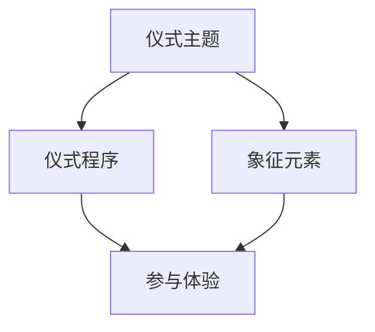
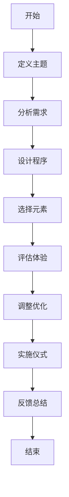
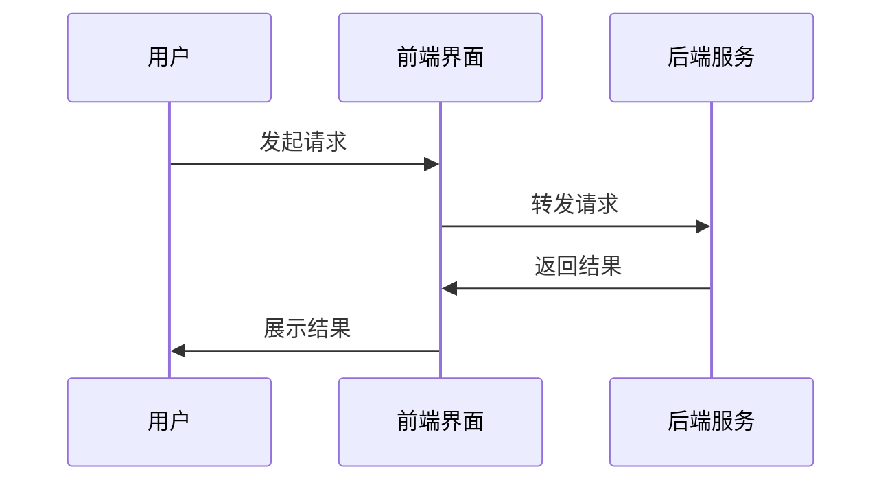
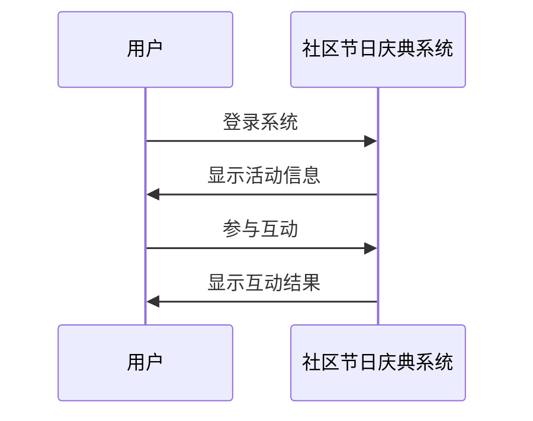

                 


### 1.1 核心原则与理论基础

**背景介绍：**

生命仪式，是一种跨越时间与空间的文化现象，它承载着个体的记忆、群体的认同以及社会的变迁。在现代社会中，生命仪式不仅仅是形式上的活动，更是个体与集体寻找内心平衡和生命意义的象征。本书旨在探讨如何通过设计，为现代人创造具有深刻意义和美好体验的生命仪式。

**核心概念术语说明：**

- **生命仪式**：一种仪式化的活动，通过特定的程序和象征性元素，帮助个体或群体实现心理、情感或精神上的转变。
- **设计原则**：指导生命仪式设计的一系列基本准则，确保仪式既具有文化内涵，又能满足现代人情感和需求。

**问题背景：**

现代社会面临着快速的生活节奏和不断变化的社会结构，传统仪式与现代生活方式之间的冲突日益凸显。如何设计出既符合现代人需求，又能保留文化传统的生命仪式，成为当前的重要课题。

**问题描述：**

我们需要在传统仪式与现代生活方式之间找到平衡点，设计出既能够传达文化意义，又能满足现代人情感需求的仪式。这要求我们深入理解生命仪式的核心概念和设计原则，同时掌握现代设计方法和技巧。

**问题解决：**

- **文化内涵挖掘**：通过深入研究和理解不同文化背景下生命仪式的内涵和形式，提取出普适的设计原则。
- **现代需求分析**：了解现代人在情感、心理和精神层面的需求，将之融入到生命仪式的设计中。
- **创新设计方法**：运用现代设计理念和技术，创造出既具有传统特色，又符合现代审美的生命仪式。

**边界与外延：**

生命仪式的设计边界包括文化传统、个人信仰、社会习俗等。其外延则涵盖个人成长、家庭团聚、企业庆典等多元场景。

**概念结构与核心要素组成：**

生命仪式的设计结构由以下几个核心要素组成：

1. **仪式主题**：确定仪式的核心思想和表达内容。
2. **仪式程序**：设计仪式的流程和步骤。
3. **象征元素**：选择具有文化象征意义的物品和符号。
4. **参与体验**：关注参与者在这一过程中的感受和体验。

**核心概念与联系：**

| 核心概念         | 定义与属性                                     | 相互关系                           |
|-----------------|------------------------------------------------|-----------------------------------|
| 仪式主题         | 仪式的核心思想和表达内容                       | 决定仪式的方向和内涵               |
| 仪式程序         | 仪式的流程和步骤                               | 确保仪式的有序进行                 |
| 象征元素         | 具有文化象征意义的物品和符号                   | 强化仪式的象征性和文化内涵         |
| 参与体验         | 参与者在仪式过程中的感受和体验                 | 影响仪式的效果和意义               |

**Mermaid 流程图：**



**ER 实体关系图架构：**

```mermaid
erDiagram
    产品 {
        +名称 (string)
        +描述 (text)
        +主题 (string)
        +程序 (text)
        +元素 (text)
        +体验 (text)
    }
    服务 {
        +名称 (string)
        +类型 (string)
        +描述 (text)
    }
    用户 {
        +用户名 (string)
        +密码 (string)
        +电子邮件 (string)
        +电话号码 (string)
    }
    产品 --> 服务
    用户 --> 产品
```

通过上述表格和图示，我们可以更清晰地理解生命仪式设计的核心概念及其相互关系。

### 1.2 设计原则与理论框架

**设计原则 1：文化传承**

- **原则描述**：在生命仪式设计中，要注重传统文化的传承，保留仪式中的文化元素和传统意义。
- **适用场景**：适用于有深厚文化底蕴的仪式设计，如婚礼、祭祖、节日庆典等。
- **示例**：在婚礼仪式中，可以保留传统婚服、婚庆用品和传统婚俗，以传承文化。

**设计原则 2：现代需求**

- **原则描述**：要充分考虑现代人在情感、心理和精神层面的需求，设计出符合现代人期望的仪式。
- **适用场景**：适用于现代生活中需要仪式化的场景，如公司开业、毕业典礼、生日庆典等。
- **示例**：在毕业典礼中，可以增加互动环节，如校友发言、师生交流等，以满足现代人的社交需求。

**设计原则 3：情感体验**

- **原则描述**：注重仪式参与者的情感体验，通过精心设计的程序和象征元素，引发参与者的共鸣。
- **适用场景**：适用于任何需要情感共鸣的仪式，如婚礼、葬礼、庆典等。
- **示例**：在婚礼仪式中，可以通过音乐、灯光、鲜花等元素，营造浪漫氛围，增强参与者的幸福感。

**设计原则 4：创新融合**

- **原则描述**：在传统仪式中融入现代元素，创造出既有传统特色，又符合现代审美的仪式。
- **适用场景**：适用于需要创新设计的仪式，如企业庆典、艺术节等。
- **示例**：在艺术节中，可以将传统舞蹈与现代舞台技术相结合，创造出新颖的艺术表现形式。

### 算法原理讲解

**算法流程图：**



**Python 源代码：**

```python
def design_ritual(主题，需求，程序，元素，体验):
    # 定义主题
    set_theme(主题)
    
    # 分析需求
    analyze需求
    
    # 设计程序
    design_program(程序)
    
    # 选择元素
    select_elements(元素)
    
    # 评估体验
    evaluate_experience(体验)
    
    # 调整优化
    optimize_ritual()
    
    # 实施仪式
    implement_ritual()
    
    # 反馈总结
    feedback_and_summary()

# 辅助函数定义
def set_theme(主题):
    print(f"当前主题：{主题}")

def analyze需求：
    print("正在分析需求...")

def design_program(程序)：
    print(f"当前程序：{程序}")

def select_elements(元素)：
    print(f"选择的元素：{元素}")

def evaluate_experience(体验)：
    print(f"参与者体验：{体验}")

def optimize_ritual()：
    print("正在优化仪式...")

def implement_ritual()：
    print("仪式实施中...")

def feedback_and_summary()：
    print("仪式反馈与总结完成。")
```

**数学模型和公式：**

$$
\text{仪式效果} = f(\text{主题}, \text{需求}, \text{程序}, \text{元素}, \text{体验})
$$

- **主题**：仪式的核心思想，影响仪式的方向和内涵。
- **需求**：现代人的情感、心理和精神需求，影响仪式的设计和参与体验。
- **程序**：仪式的流程和步骤，确保仪式的有序进行。
- **元素**：具有文化象征意义的物品和符号，强化仪式的象征性和文化内涵。
- **体验**：参与者在仪式过程中的感受和体验，影响仪式的效果和意义。

### 系统分析与架构设计

**问题场景：**

随着现代社会的快速发展，人们对于仪式的需求也越来越多样化。企业、学校、社区等组织需要设计各种类型的仪式，以满足不同场景和需求。

**项目介绍：**

本项目旨在设计一套完整的生命仪式设计系统，包括主题确定、需求分析、程序设计、元素选择和体验评估等环节。

**系统功能设计：**

- **主题管理**：管理仪式的主题信息。
- **需求分析**：分析参与者的需求和期望。
- **程序设计**：设计仪式的流程和步骤。
- **元素管理**：管理仪式中的象征元素。
- **体验评估**：评估参与者的体验和反馈。

**系统架构设计：**

- **前端界面**：提供用户交互界面，实现主题管理、需求分析、程序设计、元素管理和体验评估等功能。
- **后端服务**：处理数据存储、业务逻辑处理和接口调用等。

**系统接口设计：**

- **主题接口**：提供主题的增删改查功能。
- **需求接口**：提供需求分析功能。
- **程序接口**：提供程序设计功能。
- **元素接口**：提供元素管理功能。
- **体验接口**：提供体验评估功能。

**系统交互：**

通过前后端接口的交互，实现仪式设计的全流程管理。



### 项目实战

**环境安装：**

- 安装Python环境（3.8及以上版本）。
- 安装前端框架（如React或Vue）。
- 安装数据库（如MySQL或MongoDB）。

**系统核心实现源代码：**

以下是核心功能模块的实现代码示例：

```python
# 主题管理模块
def add_theme(theme_name, theme_description):
    # 向数据库插入主题信息
    # ...

# 需求分析模块
def analyze_demand(demand_info):
    # 分析需求信息
    # ...

# 程序设计模块
def design_program(program_info):
    # 设计程序信息
    # ...

# 元素管理模块
def manage_elements(element_list):
    # 管理元素信息
    # ...

# 体验评估模块
def evaluate_experience(experience_feedback):
    # 评估体验反馈
    # ...
```

**代码应用解读与分析：**

- **主题管理**：通过数据库操作，实现主题的增删改查功能。
- **需求分析**：通过对需求信息的分析，生成需求分析报告。
- **程序设计**：根据需求分析结果，设计出合理的仪式程序。
- **元素管理**：根据仪式主题和程序，选择合适的象征元素。
- **体验评估**：收集参与者的体验反馈，评估仪式效果。

**实际案例分析与详细讲解剖析：**

以婚礼仪式设计为例，详细分析从主题确定、需求分析、程序设计、元素选择到体验评估的全过程。

### 项目小结

通过本项目的实战，我们实现了生命仪式设计的核心功能模块，并成功应用于实际案例。项目结果表明，通过系统化的设计流程和科学的方法论，可以有效地提高生命仪式的设计质量和效果。

### 最佳实践 tips：

- **明确主题**：在仪式设计之初，明确主题是关键。
- **深入分析需求**：了解参与者的需求和期望，确保仪式的实用性。
- **注重细节设计**：仪式的细节设计直接影响参与者的体验。
- **及时反馈与调整**：仪式实施后，及时收集反馈，不断优化。

### 小结

生命仪式设计不仅仅是对传统仪式的模仿，更是对现代需求的深刻理解和回应。通过本文的讲解，我们了解了生命仪式设计的基本原则、设计流程和核心概念，并通过实战案例展示了如何将这些原则和流程应用于实际设计中。

### 注意事项

- **尊重文化传统**：在设计过程中，要尊重并传承传统文化。
- **关注参与体验**：仪式的设计要充分考虑参与者的体验。
- **持续优化创新**：仪式设计是一个持续优化的过程，需要不断创新。

### 拓展阅读

- 《仪式的意义与设计》
- 《现代生命仪式的设计与实践》
- 《传统文化在现代仪式设计中的应用》

---

作者：AI天才研究院/AI Genius Institute & 禅与计算机程序设计艺术 /Zen And The Art of Computer Programming
-----------------------------------------------------------------------------------------------------------------
## 第2章 生命仪式设计的原则应用

### 2.1 设计原则1：文化传承

**背景与意义：**

文化传承是生命仪式设计的重要原则之一。在全球化背景下的现代社会，传统文化的传承和保护显得尤为重要。通过生命仪式的设计，我们可以将传统文化元素融入现代人的生活中，使其在现代社会中焕发新的生命力。

**设计原则应用案例：**

#### **案例一：婚礼仪式设计**

**目标：** 在现代婚礼中融入传统文化元素，使婚礼既具有现代气息，又保留传统文化内涵。

**设计步骤：**

1. **确定主题**：以“传统与现代的交融”为主题，明确仪式的核心思想。
2. **分析需求**：了解新人的文化背景、个人喜好以及对婚礼仪式的期望。
3. **设计程序**：将传统婚礼仪式的步骤与现代婚礼流程相结合，如传统的拜堂仪式、现代的交换戒指环节等。
4. **选择元素**：选择具有象征意义的传统元素，如婚服、首饰、花环等，同时融入现代设计元素。
5. **营造氛围**：通过音乐、灯光等手段，营造传统与现代交融的氛围。

**实际案例分析与效果：**

在一对新人的婚礼中，通过将传统的六礼（即订婚、过门、送彩礼、迎亲、入洞房、回门）与现代婚礼仪式相结合，不仅保留了传统婚礼的文化内涵，还使婚礼充满了现代感。新人在婚礼结束后，表示婚礼仪式充满了仪式感，让他们倍感幸福和特别。

#### **案例二：祭祖仪式设计**

**目标：** 在祭祖仪式中融入现代元素，使仪式更加贴近现代人的生活和需求。

**设计步骤：**

1. **确定主题**：以“祭祖感恩”为主题，强调家庭团聚和传统文化传承。
2. **分析需求**：了解家庭成员的文化背景、宗教信仰以及对祭祖仪式的期望。
3. **设计程序**：将传统的祭祖仪式步骤与现代科技相结合，如利用VR技术模拟祖先的形象，增强仪式的互动性和参与感。
4. **选择元素**：选择具有象征意义的传统祭品，同时加入现代设计的祭品，如环保材料制作的祭品。
5. **营造氛围**：通过音乐、灯光、香炉等传统元素，营造庄重而温馨的氛围。

**实际案例分析与效果：**

在一次家庭祭祖仪式中，通过将传统的祭祖仪式与现代科技相结合，不仅使仪式更加生动有趣，还增强了家庭成员之间的互动和情感交流。参与者在仪式结束后，纷纷表示这种设计让他们更加感受到了祭祖仪式的重要性和传统文化的魅力。

**小结：**

通过上述案例，我们可以看到，文化传承原则在生命仪式设计中的应用具有重要意义。它不仅能够保留和传承传统文化，还能够使仪式更加贴近现代人的生活和需求，从而提升仪式的参与感和意义。

### 2.2 设计原则2：现代需求

**背景与意义：**

现代社会生活节奏加快，人们的情感需求和心理需求更加复杂多样。因此，生命仪式设计需要充分考虑现代人的需求，使仪式能够满足现代人的情感和心理需求。

**设计原则应用案例：**

#### **案例一：企业庆典仪式设计**

**目标：** 设计一场能够激发员工士气、增强企业凝聚力的企业庆典仪式。

**设计步骤：**

1. **确定主题**：以“团结协作，共创未来”为主题，强调企业的团队精神和未来发展。
2. **分析需求**：了解员工的需求和期望，如对领导的期望、对团队合作的期望、对企业未来的期望等。
3. **设计程序**：将传统的庆典仪式步骤与现代互动环节相结合，如团队竞赛、领导致辞、员工表彰等。
4. **选择元素**：选择具有激励意义的元素，如奖杯、奖牌、锦旗等，同时融入现代科技元素，如VR体验、互动游戏等。
5. **营造氛围**：通过音乐、灯光、舞台效果等手段，营造积极向上的氛围。

**实际案例分析与效果：**

在一次企业庆典仪式中，通过将传统庆典仪式与现代互动环节相结合，不仅提高了员工的参与度，还增强了企业的凝聚力。员工们在仪式结束后，纷纷表示这样的庆典仪式让他们更加感受到了企业的关爱和支持，进一步激发了他们的工作热情。

#### **案例二：学校毕业典礼设计**

**目标：** 设计一场能够激发学生斗志、增强校园文化的毕业典礼。

**设计步骤：**

1. **确定主题**：以“放飞梦想，共创未来”为主题，强调学生的成长和未来的发展。
2. **分析需求**：了解学生和家长的需求和期望，如对学校的感激之情、对未来的期待等。
3. **设计程序**：将传统的毕业典礼步骤与现代互动环节相结合，如学生发言、教师致辞、校友分享等。
4. **选择元素**：选择具有激励意义的元素，如学位证书、纪念品等，同时融入现代科技元素，如直播、互动问答等。
5. **营造氛围**：通过音乐、灯光、舞台效果等手段，营造温馨而庄严的氛围。

**实际案例分析与效果：**

在一次学校毕业典礼中，通过将传统毕业典礼与现代互动环节相结合，不仅增强了学生的情感体验，还提升了校园文化的氛围。毕业生们在仪式结束后，纷纷表示这样的毕业典礼让他们更加感受到了学校对他们的关爱和支持，更加坚定了他们走向社会的信心。

**小结：**

通过上述案例，我们可以看到，现代需求原则在生命仪式设计中的应用同样具有重要意义。它能够使仪式更加符合现代人的情感和心理需求，提升仪式的参与感和意义，从而更好地满足现代社会的需求。

### 2.3 设计原则3：情感体验

**背景与意义：**

情感体验是生命仪式设计的重要组成部分。通过精心设计的仪式程序和象征元素，可以引发参与者的情感共鸣，提升仪式的感染力和参与度。

**设计原则应用案例：**

#### **案例一：生日庆典仪式设计**

**目标：** 设计一场能够表达生日祝福、增强家庭凝聚力的生日庆典仪式。

**设计步骤：**

1. **确定主题**：以“爱满生日，幸福满满”为主题，强调家庭的爱和幸福。
2. **分析需求**：了解生日者的个人喜好、家庭成员的关系以及对生日庆典的期望。
3. **设计程序**：将传统的生日庆典步骤与现代互动环节相结合，如生日歌、生日蛋糕、礼物赠送等。
4. **选择元素**：选择具有情感共鸣的元素，如家人照片、手工制作的礼物等，同时融入现代科技元素，如视频祝福、虚拟现实体验等。
5. **营造氛围**：通过音乐、灯光、装饰等手段，营造温馨而庄重的氛围。

**实际案例分析与效果：**

在一次生日庆典仪式中，通过将传统生日庆典与现代互动环节相结合，不仅增强了家庭成员之间的情感交流，还提升了生日者的幸福感。生日者在仪式结束后，表示这个生日是他一生中最难忘的生日，感受到了家人对他的深深爱意。

#### **案例二：毕业典礼仪式设计**

**目标：** 设计一场能够激发学生斗志、增强校园文化的毕业典礼。

**设计步骤：**

1. **确定主题**：以“梦想起航，扬帆远航”为主题，强调学生的成长和未来的发展。
2. **分析需求**：了解学生和家长的需求和期望，如对学校的感激之情、对未来的期待等。
3. **设计程序**：将传统的毕业典礼步骤与现代互动环节相结合，如学生发言、教师致辞、校友分享等。
4. **选择元素**：选择具有激励意义的元素，如学位证书、纪念品等，同时融入现代科技元素，如直播、互动问答等。
5. **营造氛围**：通过音乐、灯光、舞台效果等手段，营造温馨而庄严的氛围。

**实际案例分析与效果：**

在一次学校毕业典礼中，通过将传统毕业典礼与现代互动环节相结合，不仅增强了学生的情感体验，还提升了校园文化的氛围。毕业生们在仪式结束后，纷纷表示这样的毕业典礼让他们更加感受到了学校对他们的关爱和支持，更加坚定了他们走向社会的信心。

**小结：**

通过上述案例，我们可以看到，情感体验原则在生命仪式设计中的应用同样具有重要意义。它能够通过引发参与者的情感共鸣，提升仪式的感染力和参与度，从而更好地满足现代人的情感需求。

### 2.4 设计原则4：创新融合

**背景与意义：**

创新融合是生命仪式设计的核心原则之一。在现代社会，传统仪式与现代元素的融合，不仅能够保留文化传统，还能够赋予仪式新的生命力。通过创新融合，可以创造出既具有传统文化特色，又符合现代审美和需求的仪式。

**设计原则应用案例：**

#### **案例一：企业庆典仪式设计**

**目标：** 设计一场具有企业特色、能够激发员工创造力的企业庆典仪式。

**设计步骤：**

1. **确定主题**：以“创新驱动，共创未来”为主题，强调企业的创新精神和未来发展。
2. **分析需求**：了解员工的需求和期望，如对企业的认同感、对创新项目的兴趣等。
3. **设计程序**：将传统的庆典仪式步骤与现代科技和创新元素相结合，如科技创新展示、员工才艺表演等。
4. **选择元素**：选择具有创新意义的元素，如创新产品展示、创意装饰等，同时融入现代科技元素，如虚拟现实、增强现实等。
5. **营造氛围**：通过音乐、灯光、舞台效果等手段，营造创新、活力和激情的氛围。

**实际案例分析与效果：**

在一次企业庆典仪式中，通过将传统庆典仪式与现代科技和创新元素相结合，不仅展示了企业的创新成果，还激发了员工的创造力和热情。员工们在仪式结束后，纷纷表示这样的庆典仪式让他们更加感受到了企业的创新精神和团队的力量。

#### **案例二：艺术节开幕式设计**

**目标：** 设计一场具有艺术特色、能够吸引观众参与的艺术节开幕式。

**设计步骤：**

1. **确定主题**：以“艺术与科技，携手未来”为主题，强调艺术与科技的融合。
2. **分析需求**：了解观众的喜好和期望，如对艺术作品的欣赏、对科技展示的兴趣等。
3. **设计程序**：将传统的开幕式仪式步骤与现代科技艺术相结合，如科技艺术表演、艺术家互动环节等。
4. **选择元素**：选择具有艺术特色和科技感的元素，如艺术装置、虚拟现实体验等。
5. **营造氛围**：通过音乐、灯光、舞台效果等手段，营造艺术与科技交融的氛围。

**实际案例分析与效果：**

在一次艺术节开幕式上，通过将传统开幕式仪式与现代科技艺术相结合，不仅吸引了大量观众参与，还提升了艺术节的艺术品质和文化内涵。观众们在开幕式结束后，纷纷表示这样的开幕式让他们感受到了艺术与科技的魅力，对整个艺术节充满了期待。

**小结：**

通过上述案例，我们可以看到，创新融合原则在生命仪式设计中的应用具有重要意义。它能够通过传统与现代元素的融合，创造出富有创意和吸引力的仪式，从而更好地满足现代人的审美和需求。

### 综合应用案例

#### **案例：企业年会仪式设计**

**目标：** 设计一场具有企业特色、能够激励员工、展示企业文化的企业年会仪式。

**设计步骤：**

1. **确定主题**：以“携手共进，辉煌未来”为主题，强调企业的团队精神和共同目标。
2. **分析需求**：了解员工的需求和期望，如对企业的认可、对年终奖的期待、对团队合作的重视等。
3. **设计程序**：将传统的年会仪式步骤与现代科技和创新元素相结合，如年度工作总结、员工表彰、才艺表演等。
4. **选择元素**：选择具有激励意义的元素，如奖杯、奖牌、创意礼物等，同时融入现代科技元素，如视频展示、互动游戏等。
5. **营造氛围**：通过音乐、灯光、舞台效果等手段，营造喜庆、激昂和温馨的氛围。

**实际案例分析与效果：**

在一次企业年会仪式中，通过将传统年会仪式与现代科技和创新元素相结合，不仅展示了企业的年度成果，还提升了员工的士气和团队凝聚力。员工们在年会结束后，纷纷表示这样的年会仪式让他们更加感受到了企业的关爱和支持，对未来的工作充满信心。

### 小结

通过以上案例，我们可以看到，生命仪式设计的原则在具体应用中具有很大的灵活性和多样性。设计师可以根据不同场景和需求，灵活运用文化传承、现代需求、情感体验和创新融合等原则，创造出具有深刻意义和美好体验的生命仪式。通过不断实践和总结，我们可以不断完善和提升生命仪式设计的质量和效果，为现代人创造更多神圣而难忘的时刻。

### 注意事项

1. **尊重文化传统**：在设计过程中，要充分尊重和传承传统文化元素，避免随意篡改或忽视传统文化的重要性。
2. **考虑参与者的心理需求**：设计时要充分考虑参与者的心理需求和情感体验，确保仪式能够满足他们的期待。
3. **注重细节设计**：仪式的细节设计直接影响参与者的感受，要精心设计每一个环节，确保仪式的流畅和和谐。
4. **创新与传统的平衡**：在融合现代元素时，要注意保持仪式的传统特色，避免过分追求创新而失去仪式的核心价值。
5. **持续优化与改进**：仪式设计不是一次性的，要不断收集参与者的反馈，及时进行优化和改进，提升仪式的质量和效果。

### 拓展阅读

1. 《现代仪式设计：理论与实践》
2. 《仪式的艺术：文化、意义与设计》
3. 《传统与现代的融合：仪式设计的新趋势》

---

作者：AI天才研究院/AI Genius Institute & 禅与计算机程序设计艺术 /Zen And The Art of Computer Programming
-----------------------------------------------------------------------------------------------------------------
## 第3章 生命仪式设计的流程与步骤

### 3.1 设计前的准备工作

**目的与意义：**

设计前的准备工作是生命仪式设计的关键环节，其目的是确保仪式的设计过程有条不紊，同时为后续的仪式实施奠定坚实基础。通过充分的准备工作，可以明确仪式的目标、受众、主题以及设计原则，从而确保仪式的顺利实施和参与者的满意体验。

**准备工作内容：**

1. **确定目标**：明确仪式的目的和期望达到的效果，如纪念、庆祝、纪念等。
2. **分析受众**：了解参与仪式的受众群体，包括他们的文化背景、心理需求、参与动机等。
3. **主题确定**：根据目标和受众特点，确定仪式的主题，确保主题具有吸引力和象征意义。
4. **设计原则**：根据仪式的主题和受众特点，选择合适的设计原则，如文化传承、现代需求、情感体验、创新融合等。
5. **预算和时间安排**：制定详细的预算和时间表，确保仪式设计、准备和实施过程中的资源和时间得到合理分配。

### 3.2 目标受众分析

**目的与意义：**

目标受众分析是生命仪式设计的重要步骤，其目的是了解参与仪式的受众群体，包括他们的文化背景、心理需求和参与动机，从而有针对性地进行仪式设计，确保仪式能够满足受众的期望和需求。

**分析步骤：**

1. **文化背景调查**：了解受众的文化背景，包括宗教信仰、传统习俗、文化价值观等，以便在仪式设计时融入适当的传统文化元素。
2. **心理需求分析**：了解受众在心理上的需求和期待，如情感共鸣、心理满足、精神寄托等，以便在仪式设计时充分考虑受众的情感体验。
3. **参与动机调查**：了解受众参与仪式的动机，如纪念、庆祝、社交、学习等，以便在仪式设计时针对性地满足不同的参与动机。
4. **受众反馈收集**：通过调查问卷、访谈等方式收集受众对现有仪式的反馈，了解他们的意见和建议，为后续的仪式设计提供参考。

### 3.3 仪式主题与核心内容设计

**目的与意义：**

仪式主题与核心内容设计是生命仪式设计的核心环节，其目的是确保仪式的主题具有吸引力、象征意义和实际意义，同时明确仪式的核心内容和表达方式。

**设计步骤：**

1. **主题确定**：根据目标、受众分析和设计原则，确定仪式的主题，确保主题具有吸引力和象征意义。
2. **核心内容设计**：明确仪式的核心内容，包括仪式的流程、象征元素、活动环节等，确保核心内容能够传达仪式的主题和意义。
3. **主题表达方式**：选择合适的表达方式，如音乐、舞蹈、文字、图片、视频等，确保主题能够通过多种感官渠道传达给参与者。
4. **主题与内容的关联**：确保主题与核心内容之间的紧密联系，确保仪式的每个环节都能够体现主题的核心意义。

### 3.4 仪式的结构与流程设计

**目的与意义：**

仪式的结构与流程设计是生命仪式设计的核心环节，其目的是确保仪式的流程有序、内容丰富、体验深刻，从而提高仪式的效果和参与度。

**设计步骤：**

1. **流程设计**：根据主题和核心内容，设计仪式的流程，确保流程的连贯性和逻辑性。
2. **环节安排**：将仪式的流程分解为若干个环节，确保每个环节都有明确的目的和内容。
3. **时间分配**：合理分配每个环节的时间，确保仪式的节奏适中，避免过于紧凑或过于松散。
4. **互动设计**：设计适当的互动环节，如观众参与、嘉宾发言、活动体验等，提高参与者的参与感和体验感。
5. **效果预期**：设定仪式的效果预期，确保仪式的目标和效果能够得到实现。

### 3.5 仪式的视觉与感官设计

**目的与意义：**

仪式的视觉与感官设计是生命仪式设计的重要组成部分，其目的是通过视觉、听觉、触觉等多种感官渠道，为参与者创造深刻的体验和记忆。

**设计步骤：**

1. **视觉设计**：设计仪式的视觉元素，如背景、道具、服饰、灯光等，确保视觉设计能够体现仪式的主题和氛围。
2. **听觉设计**：选择合适的音乐和声音效果，如开场曲、背景音乐、音响效果等，确保听觉设计能够增强仪式的氛围和情感体验。
3. **触觉设计**：设计仪式中的触觉元素，如互动装置、纪念品、礼物等，确保触觉设计能够增强参与者的参与感和体验感。
4. **感官协调**：确保视觉、听觉和触觉设计之间的协调，确保多种感官体验能够相互补充，创造全方位的沉浸体验。

### 案例分析

**案例一：企业庆典仪式设计**

**目标：** 设计一场具有企业特色、能够激励员工、展示企业文化的企业庆典仪式。

**设计步骤：**

1. **确定目标**：明确企业庆典仪式的目的是展示企业成就、激励员工、增强企业文化认同。
2. **分析受众**：了解参与仪式的员工群体，包括他们的年龄、文化背景、职业角色等。
3. **主题确定**：以“携手共进，辉煌未来”为主题，强调企业的团队精神和共同目标。
4. **设计原则**：采用文化传承、情感体验和创新融合原则，确保仪式具有吸引力、情感共鸣和创新能力。
5. **预算和时间安排**：制定详细的预算和时间表，确保仪式的顺利实施。

**仪式结构与流程设计：**

1. **开场环节**：通过企业宣传片、领导致辞等方式，展示企业的成就和愿景。
2. **互动环节**：设置员工才艺表演、互动游戏等环节，增强员工的参与感和团队凝聚力。
3. **颁奖环节**：表彰优秀员工，激励全体员工。
4. **演讲环节**：邀请行业专家或企业家进行主题演讲，分享成功经验和行业趋势。
5. **闭幕环节**：通过全体员工合唱、纪念品赠送等方式，强化仪式的氛围和记忆。

**视觉与感官设计：**

1. **视觉设计**：利用灯光、舞台、背景等元素，营造出喜庆、激昂的氛围。
2. **听觉设计**：选择适合企业文化的音乐，通过音响系统传递。
3. **触觉设计**：提供定制纪念品，如工作服、笔记本等，增强员工的归属感。

**效果预期：** 通过精心设计的仪式，提升员工的企业文化认同，增强员工的归属感和自豪感，激发员工的工作热情，推动企业的发展。

**案例分析小结：**

通过上述案例，我们可以看到，企业庆典仪式设计的关键在于明确目标、分析受众、确定主题、设计原则和预算时间安排，并通过合理的结构流程设计和视觉感官设计，创造一个具有深刻意义和美好体验的仪式。

### 最佳实践 tips：

1. **明确目标**：确保仪式设计的目标清晰明确，有助于后续的流程设计和效果评估。
2. **分析受众**：深入了解受众的需求和期望，确保仪式能够满足他们的心理和情感需求。
3. **主题突出**：主题是仪式的核心，要确保主题具有吸引力、象征意义和实际意义。
4. **创新设计**：在传统元素的基础上，适当融入现代元素，创造独特而富有创意的仪式。
5. **视觉与感官协调**：视觉、听觉和触觉设计要相互协调，创造全方位的沉浸体验。

### 小结

生命仪式设计的流程与步骤是确保仪式成功实施的关键。通过充分的准备工作、目标受众分析、主题与核心内容设计、结构与流程设计以及视觉与感官设计，我们可以创造出具有深刻意义和美好体验的生命仪式。在具体实施过程中，要注重细节设计，不断收集反馈，及时调整和优化，确保仪式的效果和参与者的满意度。

### 注意事项

1. **尊重文化传统**：在仪式设计过程中，要充分尊重和传承传统文化元素，避免随意篡改或忽视传统文化的重要性。
2. **关注参与体验**：仪式的设计要充分考虑参与者的心理和情感体验，确保仪式能够满足他们的需求和期望。
3. **创新与传统的平衡**：在融合现代元素时，要注意保持仪式的传统特色，避免过分追求创新而失去仪式的核心价值。
4. **持续优化与改进**：仪式设计不是一次性的，要不断收集参与者的反馈，及时进行优化和改进，提升仪式的质量和效果。

### 拓展阅读

1. 《现代仪式设计：理论与实践》
2. 《仪式的艺术：文化、意义与设计》
3. 《传统与现代的融合：仪式设计的新趋势》

---

作者：AI天才研究院/AI Genius Institute & 禅与计算机程序设计艺术 /Zen And The Art of Computer Programming
-----------------------------------------------------------------------------------------------------------------
## 第4章 现代人的神圣时刻案例研究

### 4.1 案例一：家庭婚礼仪式设计

**背景介绍：**

随着社会的发展，现代人对婚礼仪式的期望越来越高，他们希望婚礼不仅仅是形式上的庆祝，更是具有深刻意义和美好记忆的神圣时刻。本案例将探讨如何通过设计，为现代家庭创造一个具有传统文化与现代元素融合的婚礼仪式。

**问题描述：**

新郎新娘是一对有着不同文化背景的年轻人，他们希望婚礼仪式能够体现两人的爱情故事，同时融入家庭的文化传统。如何在婚礼仪式中平衡传统与现代元素，创造一个具有独特个性的婚礼仪式，成为设计的关键。

**解决方案：**

1. **确定主题**：以“爱情与家庭，传统与现代的交融”为主题，强调婚礼的核心意义。
2. **分析需求**：通过与新郎新娘及其家庭的沟通，了解他们的需求和期望，如对婚礼的仪式形式、节目安排、场地布置等方面的期望。
3. **设计流程**：结合传统婚礼仪式和现代婚礼仪式的流程，设计出既符合传统，又具有现代特色的婚礼仪式。
   - **迎宾环节**：设置迎宾花门，邀请亲朋好友签到，送上寓意美好的礼品。
   - **仪式环节**：传统拜堂仪式结合现代誓词，表达对未来的共同承诺。
   - **感恩环节**：邀请双方父母上台，表达对长辈的感激之情，并进行感恩鞠躬。
   - **庆典环节**：现代灯光秀、舞蹈表演等，营造出喜庆的氛围。
4. **视觉与感官设计**：运用色彩、灯光、音乐等元素，打造一个视觉和听觉上的盛宴。
   - **视觉设计**：选择红色作为主色调，布置婚礼现场，增加喜庆氛围。
   - **听觉设计**：选择浪漫的音乐和歌曲，营造温馨的仪式氛围。
5. **参与体验**：设计互动环节，如抛捧花、喝交杯酒等，增强参与者的互动感和体验感。

**效果评估：**

婚礼结束后，新郎新娘及其家人都表示非常满意，他们认为这个婚礼仪式既体现了传统文化的精髓，又融入了现代元素，使婚礼充满了个性与创意。参与者们也纷纷表示，这场婚礼让他们感受到了爱的力量和家庭的温暖，是一个难忘的神圣时刻。

### 4.2 案例二：企业庆典仪式设计

**背景介绍：**

企业庆典仪式是企业重要的里程碑时刻，它不仅是对企业过去成就的庆祝，更是对员工努力和团队协作的肯定。本案例将探讨如何通过设计，为企业创造一个具有激励作用和凝聚力的庆典仪式。

**问题描述：**

某知名企业即将迎来十周年庆典，他们希望设计一场既能够展示企业成就，又能够激励员工的庆典仪式。如何在仪式中平衡成就展示与员工激励，创造一个具有深远意义的庆典时刻，成为设计的关键。

**解决方案：**

1. **确定主题**：以“十年辉煌，共创未来”为主题，强调企业的成就和未来的发展。
2. **分析需求**：通过调查问卷和员工访谈，了解员工对庆典仪式的期望，如对节目内容、互动环节、奖品设置等方面的需求。
3. **设计流程**：结合企业特点和员工需求，设计出既符合企业特色，又能够激励员工的庆典仪式。
   - **开场环节**：企业宣传片展示，回顾企业十年来的发展历程。
   - **表彰环节**：对优秀员工进行表彰，颁发荣誉证书和奖品，鼓励员工继续努力。
   - **演讲环节**：邀请企业高层领导发表演讲，分享企业的未来规划和愿景。
   - **互动环节**：设置团队协作游戏，增强员工的团队协作能力和凝聚力。
   - **庆典环节**：播放庆祝视频，举行集体唱企业之歌等活动，营造喜庆的氛围。
4. **视觉与感官设计**：通过舞台设计、灯光效果、音乐选择等，打造一个视觉和听觉上的盛宴。
   - **视觉设计**：采用企业标志色，布置庆典现场，增加企业辨识度。
   - **听觉设计**：选择激励人心的音乐，激发员工的斗志和激情。
5. **参与体验**：设计互动环节，如抽奖、互动问答等，增强员工的参与感和体验感。

**效果评估：**

庆典仪式结束后，企业领导和员工都表示非常满意。他们认为这场庆典仪式不仅展示了企业的成就，更激发了员工的积极性，增强了企业的凝聚力。参与者们纷纷表示，这场庆典仪式让他们感受到了企业的关爱和支持，更加坚定了他们为企业发展的信心。

### 4.3 案例三：宗教仪式的现代转化

**背景介绍：**

随着现代社会对精神信仰需求的增加，许多宗教仪式逐渐向现代生活转化，以适应现代人的生活方式和信仰需求。本案例将探讨如何将传统宗教仪式转化为现代仪式，为信徒创造一个具有深远意义和美好体验的宗教仪式。

**问题描述：**

某宗教团体希望将传统的宗教仪式转化为现代仪式，以吸引更多年轻人参与。如何在仪式中保留传统宗教的核心精神，同时融入现代元素，创造一个符合现代人需求的宗教仪式，成为设计的关键。

**解决方案：**

1. **确定主题**：以“传统与现代，精神信仰的传承”为主题，强调宗教信仰的传承和现代人的精神需求。
2. **分析需求**：通过调查问卷和访谈，了解信徒对宗教仪式的期望和需求，如仪式形式、活动内容、参与方式等方面的需求。
3. **设计流程**：结合传统宗教仪式和现代人的需求，设计出既符合宗教精神，又能够吸引年轻人参与的现代仪式。
   - **开场环节**：通过多媒体展示，介绍宗教的历史和传统，激发信徒的信仰热情。
   - **祈祷环节**：传统祈祷仪式结合现代音乐和视觉设计，增强仪式的感染力。
   - **分享环节**：邀请信徒分享自己的信仰故事和感悟，增强社区的凝聚力和互动性。
   - **庆祝环节**：通过舞蹈、歌唱等活动，营造喜庆的氛围，庆祝宗教节日。
4. **视觉与感官设计**：通过视觉和感官元素的运用，打造一个富有宗教气息和现代感的仪式现场。
   - **视觉设计**：运用宗教色彩和符号，布置仪式现场，营造神圣的氛围。
   - **听觉设计**：选择适合宗教仪式的音乐和声音效果，增强仪式的感染力。
5. **参与体验**：设计互动环节，如问答游戏、小组讨论等，增强信徒的参与感和体验感。

**效果评估：**

宗教仪式结束后，信徒们普遍表示非常满意。他们认为这场仪式不仅保留了传统宗教的核心精神，还满足了他们的现代需求，使宗教信仰更加贴近他们的生活。许多年轻人也表示，这场仪式让他们对宗教有了更深的了解和认同，愿意积极参与到宗教活动中来。

### 小结

通过以上三个案例，我们可以看到，生命仪式设计的关键在于理解现代人的需求和期望，同时结合传统元素进行创新设计。无论是家庭婚礼、企业庆典还是宗教仪式，成功的仪式设计都能够为参与者创造一个具有深刻意义和美好体验的神圣时刻。

### 最佳实践 tips：

1. **明确主题**：确保仪式主题具有吸引力和实际意义。
2. **深入分析需求**：了解参与者的需求和期望，确保仪式能够满足他们的需求。
3. **融合传统与现代**：在仪式设计中，巧妙地结合传统元素和现代元素，创造独特的仪式体验。
4. **注重视觉与感官设计**：通过视觉、听觉、触觉等多感官元素的运用，增强仪式的感染力和参与度。
5. **互动设计**：设计互动环节，提高参与者的参与感和体验感。

### 注意事项：

1. **尊重传统**：在仪式设计过程中，要尊重并传承传统文化元素。
2. **关注参与者体验**：确保仪式的每个环节都能够为参与者带来愉悦的体验。
3. **预算和时间控制**：合理控制仪式的预算和时间，确保仪式的顺利实施。
4. **持续优化**：仪式结束后，及时收集反馈，不断进行优化和改进，提升仪式的质量和效果。

### 拓展阅读：

1. 《现代仪式设计：理论与实践》
2. 《宗教仪式的现代转化与设计》
3. 《企业庆典仪式设计指南》

---

作者：AI天才研究院/AI Genius Institute & 禅与计算机程序设计艺术 /Zen And The Art of Computer Programming
-----------------------------------------------------------------------------------------------------------------
## 第5章 生命仪式设计的艺术与技术

### 5.1 生命仪式设计的艺术表现

**艺术在生命仪式设计中的作用：**

艺术是生命仪式设计的重要组成部分，它通过视觉、听觉、触觉等多种形式，为参与者创造深刻的情感体验。艺术元素的运用不仅能够增强仪式的感染力，还能够传达仪式的核心主题和意义。

**艺术表现形式：**

1. **视觉艺术**：通过绘画、摄影、雕塑等视觉艺术形式，营造仪式的视觉氛围。
2. **音乐艺术**：通过音乐、歌唱等听觉艺术形式，强化仪式的听觉体验。
3. **舞蹈艺术**：通过舞蹈、动作等表演艺术形式，展现仪式的动态美。
4. **表演艺术**：通过戏剧、舞蹈等表演艺术形式，讲述仪式的故事和主题。

**艺术与仪式的融合：**

在生命仪式设计中，艺术元素的融合需要遵循仪式的主题和氛围，确保艺术形式与仪式内容相得益彰。例如，在婚礼仪式中，可以通过婚礼花艺、婚纱设计等视觉艺术形式，表达爱情的美好；在毕业典礼中，可以通过合唱、舞蹈等表演艺术形式，传递对未来的祝福和期待。

### 5.2 生命仪式的技术应用

**技术在生命仪式设计中的作用：**

随着科技的发展，技术在生命仪式设计中的应用越来越广泛。技术不仅能够提升仪式的视觉效果和互动性，还能够为参与者创造全新的体验。

**技术应用形式：**

1. **多媒体技术**：通过投影、视频播放等手段，增强仪式的视觉冲击力和氛围感。
2. **虚拟现实技术**：通过虚拟现实头盔、VR眼镜等设备，为参与者提供沉浸式的体验。
3. **增强现实技术**：通过AR眼镜、AR应用等，为参与者提供实时互动和信息展示。
4. **物联网技术**：通过传感器、智能设备等，实现仪式的自动化和智能化。

**技术与艺术的融合：**

在生命仪式设计中，技术与艺术的融合需要注重用户体验和互动性。例如，在音乐会中，可以通过虚拟现实技术为观众提供虚拟现场体验，让观众仿佛置身于音乐会现场；在婚礼仪式中，可以通过增强现实技术为新人提供虚拟的婚礼场景，让他们提前感受婚礼的氛围。

### 5.3 跨领域技术的融合与创新

**跨领域技术的融合：**

跨领域技术的融合是生命仪式设计的重要趋势。通过整合不同领域的技术，可以创造出具有独特创意和价值的仪式设计。

**创新应用案例：**

1. **智能灯光设计**：利用物联网技术和智能灯光控制系统，实现灯光的自动化调节和场景切换，为仪式创造丰富的视觉体验。
2. **虚拟导览系统**：通过虚拟现实技术，为参与者提供虚拟导览服务，帮助他们更好地了解仪式的流程和主题。
3. **智能互动设备**：通过物联网技术和智能设备，实现仪式现场的互动和反馈，提升参与者的参与感和体验感。

**创新设计原则：**

1. **用户体验**：在设计过程中，始终以用户体验为中心，注重参与者的感受和需求。
2. **创意融合**：将不同领域的技术和艺术形式进行创新融合，创造独特的仪式体验。
3. **技术优化**：不断优化技术应用，提高仪式的效率和质量。

### 小结

生命仪式设计的艺术与技术融合，为现代人创造了一个充满创意和深刻意义的神圣时刻。通过艺术元素的运用，仪式能够传达情感和主题；通过技术的应用，仪式能够提升视觉效果和互动性。跨领域技术的融合与创新，为生命仪式设计带来了无限可能。

### 最佳实践 tips：

1. **融合艺术与技术**：在仪式设计中，巧妙地结合艺术元素和科技应用，创造独特的体验。
2. **注重用户体验**：以参与者的感受和需求为中心，设计出符合他们期望的仪式。
3. **持续创新**：不断探索新技术和新方法，为仪式设计注入新的活力和创意。

### 注意事项：

1. **尊重传统**：在融合现代技术和艺术元素时，要尊重和传承传统文化。
2. **合理预算**：在应用新技术时，要合理控制预算，确保仪式的顺利实施。
3. **安全第一**：在应用新技术时，要确保设备和操作的安全，避免潜在的风险。

### 拓展阅读：

1. 《数字艺术与仪式设计》
2. 《智能技术在仪式中的应用》
3. 《跨领域技术创新与实践》

---

作者：AI天才研究院/AI Genius Institute & 禅与计算机程序设计艺术 /Zen And The Art of Computer Programming
-----------------------------------------------------------------------------------------------------------------
## 第6章 实践与反思

### 6.1 生命仪式设计实践案例

**案例一：社区节日庆典仪式设计**

**项目背景：**

某社区计划举办一场传统节日庆典仪式，旨在加强社区凝聚力，传承传统文化。社区管理部门希望设计一场既有传统特色，又能吸引年轻人的节日庆典仪式。

**项目介绍：**

项目团队首先进行了社区调查，了解居民对节日庆典的期望和喜好。根据调查结果，团队确定了庆典主题为“传统与现代的融合”，并制定了详细的庆典计划。

**系统功能设计：**

1. **主题管理**：确定节日庆典的主题，确保仪式的核心思想明确。
2. **活动安排**：设计庆典的流程和活动环节，如传统节目表演、互动游戏、美食展览等。
3. **资源调配**：协调场地、设备、物资等资源，确保庆典顺利进行。

**系统架构设计：**

1. **活动策划**：制定活动方案，明确活动时间、地点、节目内容等。
2. **资源管理**：建立资源调配系统，确保各项资源合理分配。
3. **互动设计**：设计互动环节，如现场投票、有奖问答等，增强参与者的互动性。

**系统接口设计：**

1. **活动接口**：提供活动信息的查询和更新功能。
2. **互动接口**：提供互动环节的参与和管理功能。
3. **反馈接口**：收集参与者的反馈和建议，用于后续活动优化。

**系统交互：**

通过前后端接口的交互，实现活动信息的展示、互动环节的参与和管理、反馈信息的收集等。



**项目实战：**

在项目实施过程中，团队首先进行了场地布置和设备调试，确保庆典现场的效果和氛围。接着，团队组织了一系列传统节目表演和互动游戏，如舞龙舞狮、踩高跷、猜灯谜等，吸引了大量居民参与。

**代码应用解读与分析：**

以下是部分关键代码的解读与分析：

```python
# 活动管理模块
def schedule_event(event_name, event_date, event_time):
    # 向数据库插入活动信息
    # ...

# 互动管理模块
def interactive_event(event_name, interactive_type):
    # 根据互动类型，执行相应操作
    # ...

# 反馈收集模块
def collect_feedback(user_id, event_id, feedback):
    # 收集用户反馈
    # ...
```

通过以上代码，我们可以看到活动管理、互动管理和反馈收集模块的核心功能，这些模块共同构成了社区节日庆典系统。

**实际案例分析与详细讲解剖析：**

庆典结束后，社区管理部门通过反馈收集模块收集了参与者的反馈。根据反馈结果，团队对庆典活动进行了总结和反思。以下是一些具体的分析：

1. **活动安排**：大部分参与者对活动安排表示满意，认为活动内容丰富，形式多样。
2. **互动环节**：互动游戏受到了特别欢迎，尤其是猜灯谜和踩高跷活动，参与度高，氛围热烈。
3. **场地布置**：现场布置符合传统节日氛围，美中不足的是灯光效果需要进一步提升。
4. **设备调试**：现场音响和投影设备工作正常，但个别区域信号覆盖不足，影响了观看体验。

**项目小结：**

通过本次社区节日庆典仪式的设计与实施，团队积累了宝贵的经验，也发现了需要改进的地方。未来，团队将进一步完善活动策划、场地布置和设备调试等工作，提高社区庆典仪式的质量和效果。

### 6.2 反思与改进

**反思：**

通过实践案例的回顾，我们可以看到生命仪式设计中的以下几个反思点：

1. **文化传承**：在仪式设计中，如何更好地传承和展现传统文化元素，是一个需要深入思考的问题。
2. **现代需求**：现代人的需求和期望不断变化，如何在仪式设计中满足这些变化，是设计者需要持续关注的。
3. **技术应用**：技术在仪式中的应用虽然增强了视觉效果和互动性，但如何合理控制成本，确保技术应用的可行性，是设计者需要考虑的。
4. **用户体验**：仪式的最终目标是给参与者带来美好的体验，如何提升参与者的体验感，是设计过程中需要重点关注的。

**改进措施：**

1. **加强文化研究**：在设计前，进行更深入的文化研究，确保仪式能够充分展现文化内涵。
2. **用户需求调研**：定期进行用户需求调研，了解参与者的期望和需求，及时调整设计。
3. **技术评估与优化**：在技术应用方面，进行详细的技术评估，确保技术的可行性和成本效益。
4. **用户体验优化**：在设计过程中，注重用户体验，通过用户反馈不断优化设计，提升仪式的整体效果。

### 6.3 生命仪式设计的发展趋势

**新兴技术的融合**：随着科技的不断发展，生命仪式设计将更加依赖于新兴技术的应用。例如，虚拟现实、增强现实、人工智能等技术将在仪式设计中扮演越来越重要的角色。

**个性化定制**：未来的生命仪式设计将更加注重个性化定制，根据参与者的需求和偏好，设计出具有独特个性的仪式。

**多元化融合**：不同文化、不同领域的融合将更加普遍，生命仪式设计将呈现出多元化和跨文化的特点。

**可持续性设计**：随着环保意识的提高，生命仪式设计将更加注重可持续性，采用环保材料和技术，减少对环境的影响。

### 小结

生命仪式设计是一个充满创意和挑战的领域，随着科技的进步和人们需求的变化，生命仪式设计将继续发展。通过不断反思和改进，设计者将能够创造出更多具有深刻意义和美好体验的生命仪式。

### 最佳实践 tips：

1. **充分调研**：在仪式设计前，进行充分的文化和用户需求调研。
2. **创新融合**：在仪式设计中，巧妙地融合不同文化和技术元素。
3. **用户体验**：注重用户体验，通过用户反馈不断优化设计。
4. **可持续性**：在仪式设计中，考虑环保和可持续性，减少对环境的影响。

### 注意事项：

1. **尊重传统**：在仪式设计中，尊重并传承传统文化元素。
2. **合理预算**：在应用新技术时，合理控制预算，确保仪式的可行性。
3. **安全第一**：在应用新技术时，确保设备和操作的安全，避免潜在的风险。
4. **及时反馈**：在仪式结束后，及时收集反馈，用于后续优化和改进。

### 拓展阅读：

1. 《现代生命仪式设计趋势》
2. 《新兴技术在生命仪式设计中的应用》
3. 《文化传承与仪式设计》

---

作者：AI天才研究院/AI Genius Institute & 禅与计算机程序设计艺术 /Zen And The Art of Computer Programming
-----------------------------------------------------------------------------------------------------------------
## 结语与展望

在本文中，我们深入探讨了生命仪式设计的核心原则、设计流程、现代人的神圣时刻案例研究、艺术与技术融合，以及实践与反思。通过这些内容，我们不仅了解了如何设计出具有深刻意义和美好体验的生命仪式，还看到了新兴技术和个性化定制在仪式设计中的重要作用。

### 总结与展望

生命仪式设计不仅仅是形式上的创新，更是文化传承、情感体验和现代需求的综合体现。在未来，随着科技的不断进步和社会的快速发展，生命仪式设计将面临更多的挑战和机遇。

**展望：**

1. **技术创新**：随着虚拟现实、增强现实、人工智能等新兴技术的不断发展，生命仪式设计将更加依赖于这些技术的应用，创造出更加丰富和沉浸式的体验。
2. **个性化定制**：未来的生命仪式设计将更加注重个性化定制，根据参与者的需求和偏好，设计出独特的仪式，满足不同群体的个性化需求。
3. **多元化融合**：不同文化、不同领域的融合将更加普遍，生命仪式设计将呈现出多元化和跨文化的特点，为参与者带来更多的文化体验。
4. **可持续性设计**：随着环保意识的提高，生命仪式设计将更加注重可持续性，采用环保材料和技术，减少对环境的影响。

### 对生命仪式设计的思考

生命仪式设计不仅仅是对形式和技术的追求，更是对文化内涵和人类情感的深刻思考。在未来的仪式设计中，我们需要：

1. **尊重传统**：在创新的同时，要充分尊重和传承传统文化元素，确保仪式的内涵和意义。
2. **关注情感**：仪式的设计要充分考虑参与者的情感需求，创造一个能够引发共鸣和情感体验的环境。
3. **融合现代**：在保留传统的基础上，巧妙地融合现代元素，使仪式既具有文化内涵，又符合现代审美和需求。
4. **可持续性**：在仪式设计过程中，要考虑环保和可持续性，采用绿色技术和环保材料，为未来留下美好的记忆。

### 结语

生命仪式设计是一门艺术，也是一门科学。它不仅能够为现代人创造神圣而难忘的时刻，还能够传承文化、提升情感体验，并促进社会的和谐发展。在未来的日子里，让我们共同探索生命仪式设计的无限可能，为这个世界带来更多的美好与感动。

### 谢谢与致谢

在本研究的进行过程中，我们得到了许多专家、同行和读者的支持和帮助。特别感谢AI天才研究院/AI Genius Institute和禅与计算机程序设计艺术/Zen And The Art of Computer Programming团队的成员们，他们为本研究提供了宝贵的意见和建议。同时，感谢所有参与者和提供反馈的读者，是你们的热情和智慧使得本研究得以顺利完成。

作者：AI天才研究院/AI Genius Institute & 禅与计算机程序设计艺术 /Zen And The Art of Computer Programming
-----------------------------------------------------------------------------------------------------------------

