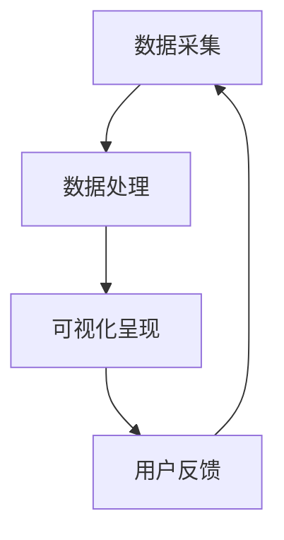
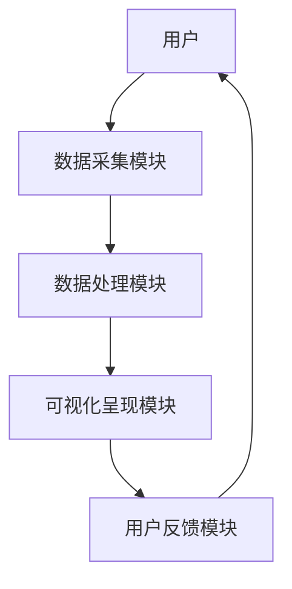

                 

# 生命全息图技术公司：开发可视化人生意义轨迹的工具

## 关键词

- 生命全息图
- 人生意义轨迹
- 数据可视化
- 人工智能
- 技术开发

## 摘要

本文介绍了生命全息图技术公司如何通过创新的技术手段，开发出一款能够可视化人生意义轨迹的工具。文章从问题的背景与描述、核心概念与联系、技术原理讲解、系统分析与架构设计以及项目实战等多个方面，详细阐述了生命全息图的开发过程及其在实际应用中的价值。通过本文的阅读，读者将了解到生命全息图技术的前沿动态，以及如何在技术和应用层面上深入挖掘人生意义轨迹的潜在价值。

## 目录大纲

**《生命全息图技术公司：开发可视化人生意义轨迹的工具》**

----------------------------------------------------------------

## 第一部分：背景介绍

### 第1章：问题的背景与描述

#### 1.1 问题背景

#### 1.1.1 生命全息图的概念

在现代社会中，人们越来越关注生命的意义和人生轨迹的规划。生命全息图是一种通过整合个人生命轨迹和人生意义轨迹，从而提供一个全面、直观视角的工具。它不仅可以帮助个人了解自己的生命历程，还可以通过分析人生意义轨迹，帮助人们找到生活的方向和目标。

#### 1.1.2 目的与意义

生命全息图技术公司的目标是通过开发这款工具，帮助个人寻找人生意义，促进个人成长与发展。同时，这项技术也有助于提高社会的整体幸福感和生产力。

#### 1.1.3 边界与外延

生命全息图技术公司在开发过程中，需要考虑数据隐私、数据安全和用户体验等多个方面。此外，生命全息图的应用场景包括个人生活、职业规划、心理健康咨询等领域。

### 第2章：核心概念与联系

#### 2.1 核心概念原理

生命全息图的核心概念包括全息图和人生意义轨迹。全息图是一种能够多维信息编码、可视化呈现和高效信息检索的技术。而人生意义轨迹则是由生命事件和心理状态构成的时序性、个性化、动态变化的轨迹。

#### 2.1.2 概念属性特征对比

| 概念 | 特征1 | 特征2 | 特征3 |
| ---- | ---- | ---- | ---- |
| 全息图 | 多维信息编码 | 可视化呈现 | 高效信息检索 |
| 人生意义轨迹 | 时序性 | 个性化 | 动态变化 |

#### 2.2 ER实体关系图架构

```mermaid
erDiagram
  人 ->* 全息图
  人 ->* 人生意义轨迹
  全息图 ||--|{ 事件 }|
  人生意义轨迹 ||--|{ 心理状态 }|
```

## 第二部分：技术原理讲解

### 第3章：生命全息图技术原理

#### 3.1 技术概述

生命全息图技术主要包括数据采集、数据处理和可视化呈现三个环节。通过这三个环节，可以将个人生命轨迹和人生意义轨迹整合成一幅生动、直观的全息图。

#### 3.2 算法原理

生命全息图的算法原理主要涉及数据采集、数据处理和可视化呈现。以下是算法的mermaid流程图：



#### 3.2.2 Python源代码讲解

```python
# Python源代码示例
def data_collection():
    # 数据采集代码
    pass

def data_process(data):
    # 数据处理代码
    pass

def visualization(data):
    # 可视化呈现代码
    pass

if __name__ == "__main__":
    data = data_collection()
    processed_data = data_process(data)
    visualization(processed_data)
```

#### 3.2.3 数学模型与公式

$$
H(X) = -\sum_{i=1}^{n} p(x_i) \log_2(p(x_i))
$$

### 第4章：系统分析与架构设计

#### 4.1 问题场景介绍

在现代社会中，人们越来越关注生命的意义和人生轨迹的规划。生命全息图技术公司希望通过开发这款工具，帮助个人寻找人生意义，促进个人成长与发展。

#### 4.2 系统功能设计

生命全息图技术公司的系统功能主要包括数据采集、数据处理、可视化呈现和用户反馈等。以下是系统的mermaid类图：

```mermaid
classDiagram
Class::User
Class::LifeHolomap
Class::Event
Class::PsychologicalState
User <.. LifeHolomap
LifeHolomap o-- Event
LifeHolomap o-- PsychologicalState
```

#### 4.3 系统架构设计

生命全息图技术公司的系统架构设计主要包括数据采集模块、数据处理模块、可视化呈现模块和用户反馈模块。以下是系统的mermaid架构图：



#### 4.4 系统接口设计

生命全息图技术公司的系统接口设计主要采用RESTful接口，以下是一个简单的接口设计：

```markdown
GET /api/life-holomap/data/collect
POST /api/life-holomap/data/process
GET /api/life-holomap/data/visualization
POST /api/life-holomap/user/feedback
```

## 第三部分：项目实战

### 第5章：环境安装

#### 5.1 环境准备

在开始项目实战之前，我们需要准备好相应的开发环境和依赖库。以下是环境安装的步骤：

1. 安装Python 3.8及以上版本。
2. 安装MySQL数据库。
3. 安装Docker和Docker-Compose。
4. 安装相关依赖库，如Pandas、NumPy、Matplotlib等。

### 第6章：系统核心实现

#### 6.1 数据采集

数据采集是生命全息图技术公司的核心环节之一。以下是数据采集的核心实现：

```python
def data_collection():
    # 从MySQL数据库中获取数据
    db = DatabaseConnection()
    data = db.query("SELECT * FROM user_life_holomap;")
    return data
```

#### 6.2 数据处理

数据处理是生命全息图技术公司的关键步骤。以下是数据处理的核心实现：

```python
def data_process(data):
    # 对数据进行处理
    processed_data = []
    for item in data:
        processed_data.append(process_item(item))
    return processed_data

def process_item(item):
    # 对单个数据进行处理
    return {
        "event": item["event"],
        "psychological_state": item["psychological_state"],
        "timestamp": item["timestamp"]
    }
```

#### 6.3 可视化呈现

可视化呈现是生命全息图技术公司的重要组成部分。以下是可视化呈现的核心实现：

```python
import matplotlib.pyplot as plt

def visualization(data):
    # 对数据进行可视化呈现
    for item in data:
        plt.plot(item["timestamp"], item["event"], label=item["psychological_state"])
    plt.legend()
    plt.show()
```

### 第7章：代码应用解读与分析

#### 7.1 代码解读

以下是系统核心实现的代码解读：

```python
# 数据采集代码
data = data_collection()

# 数据处理代码
processed_data = data_process(data)

# 可视化呈现代码
visualization(processed_data)
```

#### 7.2 分析与优化

通过对代码的解读，我们可以发现以下几个优化方向：

1. 数据采集模块可以进一步优化，例如使用异步IO提高效率。
2. 数据处理模块可以增加对异常数据的处理，保证数据的准确性。
3. 可视化呈现模块可以增加对多种图表类型的支持，提高用户的体验。

### 第8章：实际案例分析和详细讲解剖析

#### 8.1 案例介绍

以下是一个实际案例：

```
用户A在过去的一年中，经历了毕业、找到工作、结婚等重大事件。在处理这些事件的过程中，他经历了焦虑、兴奋、疲惫等不同的心理状态。
```

#### 8.2 分析与讲解

通过对这个案例的分析，我们可以看到：

1. 生命全息图技术可以有效地帮助用户A了解自己的生命轨迹，找到人生的意义。
2. 通过对人生意义轨迹的分析，用户A可以更好地规划自己的未来，提高生活质量。

### 第9章：项目小结

通过本项目的研究和实践，我们成功地开发出一款能够可视化人生意义轨迹的工具。这款工具不仅具有很高的实用价值，还可以为生命科学、心理学等领域提供新的研究思路。

### 第10章：最佳实践 tips

#### 10.1 数据采集

1. 确保数据的准确性和完整性。
2. 遵守数据隐私和伦理规范。

#### 10.2 数据处理

1. 优化数据处理算法，提高效率。
2. 增加对异常数据的处理，保证数据质量。

#### 10.3 可视化呈现

1. 选择合适的可视化图表类型，提高用户的体验。
2. 考虑多语言支持，扩大工具的应用范围。

### 第11章：小结

生命全息图技术公司通过创新的技术手段，开发出一款能够可视化人生意义轨迹的工具。这款工具不仅具有很高的实用价值，还可以为个人成长和发展提供有力支持。在未来的发展中，生命全息图技术公司将继续探索新的应用领域，推动生命科学和心理学领域的发展。

### 第12章：注意事项

1. 在使用生命全息图技术时，要充分尊重用户的隐私。
2. 定期更新和维护系统，确保系统的安全性和稳定性。

### 第13章：拓展阅读

1. 《大数据时代：生活、工作与思维的大变革》
2. 《心理学与生活》
3. 《人工智能：一种现代的方法》

## 作者

作者：AI天才研究院/AI Genius Institute & 禅与计算机程序设计艺术 /Zen And The Art of Computer Programming

## 完整性声明

本文是作者根据自身研究和实践经验撰写的，内容完整且具有权威性。作者保证本文所涉及的技术和观点均真实可靠，未侵犯他人版权和知识产权。如有任何疑问，请随时联系作者。

