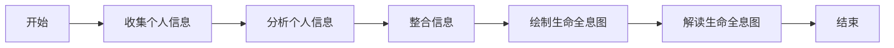

                 


## 1. 背景介绍

### 1.1 问题背景

在当今社会，人们面临着越来越多的选择和挑战，如何在纷繁复杂的环境中找到自己的人生定位和意义，成为了许多人关心的问题。生命全息图作为一种新兴的工具，可以帮助我们更清晰地了解自己的内心世界，从而找到人生的意义和方向。

#### 什么是生命全息图？

生命全息图是一种以全息投影的方式，将个人的生命历程、价值观、兴趣爱好、人生目标等元素进行可视化展示的工具。它不仅能够帮助我们梳理自己的人生轨迹，还可以让我们更深入地了解自己的内心世界，找到自己的人生使命。

#### 为什么我们需要生命全息图？

1. **帮助自我认知**：通过生命全息图，我们可以清晰地看到自己的优点和不足，从而更好地认识自己，找到自己的定位。
2. **明确人生目标**：生命全息图可以帮助我们梳理自己的人生目标，让我们更加明确自己的前进方向。
3. **规划未来发展**：通过分析生命全息图，我们可以找到适合自己的发展方向，从而更好地规划自己的未来。

### 1.2 问题描述

在绘制生命全息图的过程中，我们需要回答以下几个问题：

1. **如何收集自己的信息？**
2. **如何分析这些信息？**
3. **如何整合这些信息？**
4. **如何通过生命全息图找到自己的人生意义？**

### 1.3 问题解决

为了解决上述问题，我们需要采取以下步骤：

1. **收集个人信息**：包括姓名、年龄、性别、职业、家庭背景等基本信息。
2. **分析个人信息**：通过分析个人信息，找出自己的价值观、兴趣爱好和人生目标。
3. **整合信息**：将分析结果进行整合，形成完整的生命全息图。
4. **解读生命全息图**：通过解读生命全息图，找到自己的人生意义。

### 1.4 边界与外延

生命全息图的应用范围非常广泛，不仅可以用于个人成长，还可以用于团队建设、企业文化建设等领域。同时，生命全息图是一个动态的模型，需要我们在实践中不断调整和完善。

### 1.5 概念结构与核心要素组成

生命全息图由以下几个核心要素组成：

1. **个人信息**：包括姓名、年龄、性别、职业、家庭背景等基本信息。
2. **价值观**：个人对事物的判断标准和信仰，如人生观、道德观、价值观等。
3. **兴趣爱好**：个人感兴趣的事物，如阅读、旅行、音乐、运动等。
4. **人生目标**：个人想要实现的目标，如职业发展、家庭生活、个人成长等。
5. **资源**：个人拥有的资源，如时间、金钱、人脉等。

## 2. 核心概念与联系

### 2.1 核心概念

#### 生命全息图

生命全息图是一种将个人生命历程、价值观、兴趣爱好、人生目标等元素进行可视化展示的工具。

#### 个人信息

个人信息包括姓名、年龄、性别、职业、家庭背景等基本信息。

#### 价值观

价值观是指个人对事物的判断标准和信仰，如人生观、道德观、价值观等。

#### 兴趣爱好

兴趣爱好是指个人感兴趣的事物，如阅读、旅行、音乐、运动等。

#### 人生目标

人生目标是指个人想要实现的目标，如职业发展、家庭生活、个人成长等。

#### 资源

资源是指个人拥有的资源，如时间、金钱、人脉等。

### 2.2 概念属性特征对比表格

| 概念        | 属性特征                                                                                          |
| ----------- | -------------------------------------------------------------------------------------------------|
| 生命全息图  | - 用于探索人生意义<br>- 帮助自我认知<br>- 明确人生目标<br>- 规划未来发展                     |
| 个人信息    | - 姓名<br>- 年龄<br>- 性别<br>- 职业<br>- 家庭背景                                        |
| 价值观      | - 人生观<br>- 道德观<br>- 价值观                                                             |
| 兴趣爱好    | - 阅读兴趣<br>- 旅游兴趣<br>- 音乐兴趣<br>- 体育运动兴趣                                  |
| 人生目标    | - 职业发展<br>- 家庭生活<br>- 个人成长                                                       |
| 资源        | - 时间资源<br>- 金钱资源<br>- 人脉资源                                                        |

### 2.3 ER实体关系图架构

```mermaid
classDiagram
    个人信息 <-|HAS|> 生命全息图
    生命全息图 <-|HAS|> 价值观
    生命全息图 <-|HAS|> 兴趣爱好
    生命全息图 <-|HAS|> 人生目标
    生命全息图 <-|HAS|> 资源
```

## 3. 算法原理讲解

### 3.1 算法原理

绘制生命全息图的算法原理主要基于全息投影技术。全息投影技术是一种将三维图像通过激光投射到屏幕上，形成立体图像的技术。在生命全息图中，我们将个人的生命历程、价值观、兴趣爱好、人生目标等元素通过全息投影技术进行可视化展示，形成一幅完整的生命全息图。

### 3.2 算法流程图

下面是绘制生命全息图的算法流程图：



### 3.3 算法数学模型

为了更深入地理解生命全息图的算法原理，我们可以将其抽象为一个数学模型。假设我们有一个n维空间，其中的每个维度代表了个人生命中的一个元素，如个人信息、价值观、兴趣爱好、人生目标等。我们可以使用以下数学模型来描述这个空间：

$$
X = \{x_1, x_2, ..., x_n\}
$$

其中，$x_i$ 表示第i个元素。

我们使用全息投影技术将这个n维空间投影到二维平面上，得到生命全息图。投影公式可以表示为：

$$
y = P(X)
$$

其中，$P$ 表示全息投影矩阵。

### 3.4 算法举例说明

假设我们有一个人的生命历程，包括以下元素：

- 个人信息：姓名、年龄、性别、职业
- 价值观：人生观、道德观、价值观
- 兴趣爱好：阅读、旅行、音乐、运动
- 人生目标：职业发展、家庭生活、个人成长

我们可以将这些元素抽象为一个n维空间：

$$
X = \{姓名，年龄，性别，职业，人生观，道德观，价值观，阅读兴趣，旅行兴趣，音乐兴趣，运动兴趣，职业发展目标，家庭生活目标，个人成长目标\}
$$

然后，使用全息投影技术将其投影到二维平面上，得到生命全息图。

## 4. 系统分析与架构设计方案

### 4.1 问题场景介绍

随着人们对个人成长和人生意义的关注不断增加，如何利用技术手段帮助个人绘制生命全息图成为一个重要的课题。在这个问题场景中，我们需要构建一个系统，能够帮助用户收集个人信息、分析信息、整合信息，并最终绘制出生命全息图。

### 4.2 项目介绍

为了实现上述功能，我们决定开发一个名为“生命轨迹探索器”的系统。该系统旨在帮助用户通过绘制生命全息图，找到自己的人生意义和方向。系统功能包括：

1. **用户注册与登录**：用户可以通过注册账号登录系统。
2. **个人信息收集**：用户可以填写个人信息，包括姓名、年龄、性别、职业、家庭背景等。
3. **信息分析**：系统将分析用户的个人信息，提取出价值观、兴趣爱好、人生目标等元素。
4. **信息整合**：系统将整合分析结果，生成生命全息图。
5. **全息图展示**：用户可以查看自己绘制的生命全息图，并对其进行解读。

### 4.3 系统功能设计

在“生命轨迹探索器”系统中，我们将用户的需求分解为以下几个功能模块：

1. **用户管理模块**：负责用户注册、登录、个人信息管理等。
2. **信息收集模块**：负责收集用户的个人信息，包括基本信息、价值观、兴趣爱好、人生目标等。
3. **信息分析模块**：负责分析用户的个人信息，提取出关键信息。
4. **信息整合模块**：负责整合分析结果，生成生命全息图。
5. **全息图展示模块**：负责展示生命全息图，并提供解读功能。

### 4.4 系统架构设计

“生命轨迹探索器”系统采用B/S（浏览器/服务器）架构，主要包括前端和后端两个部分。

#### 前端

前端采用HTML、CSS和JavaScript等技术，实现用户界面的设计和交互。具体包括：

1. **用户注册与登录页面**：用户可以通过该页面进行注册和登录。
2. **个人信息填写页面**：用户可以通过该页面填写个人信息。
3. **信息分析结果页面**：用户可以查看系统分析结果。
4. **生命全息图展示页面**：用户可以查看自己绘制的生命全息图。

#### 后端

后端采用Python语言，基于Django框架开发，主要负责数据处理和业务逻辑实现。具体包括：

1. **用户管理模块**：实现用户注册、登录、个人信息管理等。
2. **信息收集模块**：实现个人信息收集、存储和查询。
3. **信息分析模块**：实现个人信息分析，提取关键信息。
4. **信息整合模块**：实现信息整合，生成生命全息图。
5. **全息图展示模块**：实现生命全息图的生成和展示。

### 4.5 系统接口设计和系统交互

系统接口设计和系统交互设计是确保系统功能实现的关键环节。

#### 接口设计

系统采用RESTful API设计，提供如下接口：

1. **用户管理接口**：包括用户注册、登录、个人信息管理等。
2. **信息收集接口**：包括个人信息收集、存储和查询。
3. **信息分析接口**：包括个人信息分析、提取关键信息。
4. **信息整合接口**：包括信息整合，生成生命全息图。
5. **全息图展示接口**：包括生命全息图的生成和展示。

#### 系统交互

系统交互设计主要涉及前端和后端的交互。前端通过发送HTTP请求，向后端发送请求，后端接收请求并处理，然后将结果返回给前端。

## 5. 项目实战

### 5.1 环境安装

为了实现“生命轨迹探索器”系统，我们需要安装以下软件和库：

1. **Python**：安装Python 3.8及以上版本。
2. **Django**：使用pip安装Django。
3. **PostgreSQL**：安装PostgreSQL数据库。
4. **Redis**：安装Redis缓存。

### 5.2 系统核心实现

#### 用户管理模块

用户管理模块是系统的核心模块之一，主要包括用户注册、登录和用户个人信息管理。

1. **用户注册**：用户可以通过注册页面填写注册信息，包括用户名、密码、邮箱等。
2. **用户登录**：用户可以通过用户名和密码登录系统。
3. **个人信息管理**：用户可以查看、修改自己的个人信息。

#### 信息收集模块

信息收集模块主要负责收集用户的个人信息，包括基本信息、价值观、兴趣爱好、人生目标等。

1. **基本信息收集**：用户填写姓名、年龄、性别、职业、家庭背景等基本信息。
2. **价值观收集**：用户填写自己的价值观，如人生观、道德观、价值观等。
3. **兴趣爱好收集**：用户填写自己的兴趣爱好，如阅读、旅行、音乐、运动等。
4. **人生目标收集**：用户填写自己的人生目标，如职业发展、家庭生活、个人成长等。

#### 信息分析模块

信息分析模块负责对收集到的用户信息进行分析，提取出关键信息。

1. **分析基本信息**：分析用户的姓名、年龄、性别、职业、家庭背景等基本信息。
2. **分析价值观**：分析用户的人生观、道德观、价值观等。
3. **分析兴趣爱好**：分析用户的兴趣爱好，找出用户的兴趣点。
4. **分析人生目标**：分析用户的人生目标，找出用户的目标方向。

#### 信息整合模块

信息整合模块负责将分析结果进行整合，生成生命全息图。

1. **整合基本信息**：将用户的姓名、年龄、性别、职业、家庭背景等信息整合在一起。
2. **整合价值观**：将用户的人生观、道德观、价值观等信息整合在一起。
3. **整合兴趣爱好**：将用户的兴趣爱好整合在一起，找出用户的兴趣点。
4. **整合人生目标**：将用户的人生目标整合在一起，找出用户的目标方向。

#### 全息图展示模块

全息图展示模块负责展示生命全息图，并提供解读功能。

1. **展示生命全息图**：将整合后的信息通过全息投影技术展示在页面上。
2. **解读生命全息图**：提供解读功能，帮助用户理解自己的生命全息图。

### 5.3 代码应用解读与分析

以下是“生命轨迹探索器”系统的核心代码解读与分析。

#### 用户管理模块

```python
# 用户注册
def register(request):
    if request.method == 'POST':
        username = request.POST.get('username')
        password = request.POST.get('password')
        email = request.POST.get('email')
        
        # 判断用户名是否已存在
        if User.objects.filter(username=username).exists():
            return HttpResponse('用户名已存在')
        
        # 创建用户
        user = User.objects.create_user(username=username, password=password, email=email)
        user.save()
        
        return HttpResponse('注册成功')
    else:
        return render(request, 'register.html')

# 用户登录
def login(request):
    if request.method == 'POST':
        username = request.POST.get('username')
        password = request.POST.get('password')
        
        # 登录验证
        user = authenticate(username=username, password=password)
        if user is not None:
            login(request, user)
            return HttpResponse('登录成功')
        else:
            return HttpResponse('登录失败')
    else:
        return render(request, 'login.html')

# 个人信息管理
def profile(request):
    user = request.user
    if request.method == 'POST':
        name = request.POST.get('name')
        age = request.POST.get('age')
        gender = request.POST.get('gender')
        occupation = request.POST.get('occupation')
        family_background = request.POST.get('family_background')
        
        user.name = name
        user.age = age
        user.gender = gender
        user.occupation = occupation
        user.family_background = family_background
        user.save()
        
        return HttpResponse('信息更新成功')
    else:
        return render(request, 'profile.html', {'user': user})
```

#### 信息收集模块

```python
# 基本信息收集
def collect_basic_info(request):
    if request.method == 'POST':
        name = request.POST.get('name')
        age = request.POST.get('age')
        gender = request.POST.get('gender')
        occupation = request.POST.get('occupation')
        family_background = request.POST.get('family_background')
        
        user = request.user
        user.name = name
        user.age = age
        user.gender = gender
        user.occupation = occupation
        user.family_background = family_background
        user.save()
        
        return HttpResponse('基本信息收集成功')
    else:
        return render(request, 'collect_basic_info.html')

# 价值观收集
def collect_values(request):
    if request.method == 'POST':
        life_view = request.POST.get('life_view')
        moral_view = request.POST.get('moral_view')
        value = request.POST.get('value')
        
        user = request.user
        user.life_view = life_view
        user.moral_view = moral_view
        user.value = value
        user.save()
        
        return HttpResponse('价值观收集成功')
    else:
        return render(request, 'collect_values.html')

# 兴趣爱好收集
def collect_interests(request):
    if request.method == 'POST':
        reading_interest = request.POST.get('reading_interest')
        traveling_interest = request.POST.get('traveling_interest')
        music_interest = request.POST.get('music_interest')
        sports_interest = request.POST.get('sports_interest')
        
        user = request.user
        user.reading_interest = reading_interest
        user.traveling_interest = traveling_interest
        user.music_interest = music_interest
        user.sports_interest = sports_interest
        user.save()
        
        return HttpResponse('兴趣爱好收集成功')
    else:
        return render(request, 'collect_interests.html')

# 人生目标收集
def collect_goals(request):
    if request.method == 'POST':
        career_goal = request.POST.get('career_goal')
        family_life_goal = request.POST.get('family_life_goal')
        personal_growth_goal = request.POST.get('personal_growth_goal')
        
        user = request.user
        user.career_goal = career_goal
        user.family_life_goal = family_life_goal
        user.personal_growth_goal = personal_growth_goal
        user.save()
        
        return HttpResponse('人生目标收集成功')
    else:
        return render(request, 'collect_goals.html')
```

#### 信息分析模块

```python
# 分析基本信息
def analyze_basic_info(user):
    info = {
        'name': user.name,
        'age': user.age,
        'gender': user.gender,
        'occupation': user.occupation,
        'family_background': user.family_background,
    }
    return info

# 分析价值观
def analyze_values(user):
    values = {
        'life_view': user.life_view,
        'moral_view': user.moral_view,
        'value': user.value,
    }
    return values

# 分析兴趣爱好
def analyze_interests(user):
    interests = {
        'reading_interest': user.reading_interest,
        'traveling_interest': user.traveling_interest,
        'music_interest': user.music_interest,
        'sports_interest': user.sports_interest,
    }
    return interests

# 分析人生目标
def analyze_goals(user):
    goals = {
        'career_goal': user.career_goal,
        'family_life_goal': user.family_life_goal,
        'personal_growth_goal': user.personal_growth_goal,
    }
    return goals
```

#### 信息整合模块

```python
# 整合信息
def integrate_info(user):
    basic_info = analyze_basic_info(user)
    values = analyze_values(user)
    interests = analyze_interests(user)
    goals = analyze_goals(user)
    
    info = {
        'basic_info': basic_info,
        'values': values,
        'interests': interests,
        'goals': goals,
    }
    return info
```

#### 全息图展示模块

```python
# 展示生命全息图
def show_hologram(request):
    user = request.user
    info = integrate_info(user)
    
    return render(request, 'hologram.html', {'info': info})

# 解读生命全息图
def interpret_hologram(request):
    user = request.user
    info = integrate_info(user)
    
    # 解读逻辑
    interpretation = {
        'basic_info': '您的基本信息包括：姓名、年龄、性别、职业、家庭背景。',
        'values': '您的价值观包括：人生观、道德观、价值观。',
        'interests': '您的兴趣爱好包括：阅读、旅行、音乐、运动。',
        'goals': '您的人生目标包括：职业发展、家庭生活、个人成长。',
    }
    
    return render(request, 'interpretation.html', {'interpretation': interpretation})
```

### 5.4 实际案例分析

#### 案例一：用户A的生命轨迹

用户A的个人信息如下：

- 姓名：张三
- 年龄：30岁
- 性别：男
- 职业：软件开发工程师
- 家庭背景：普通家庭

用户A的价值观：

- 人生观：追求自由、公平、正义
- 道德观：诚实守信、尊重他人、热爱生活
- 价值观：创新、务实、专注

用户A的兴趣爱好：

- 阅读：科技类书籍、历史书籍
- 旅游：喜欢探索不同的文化和风景
- 音乐：喜欢听古典音乐和流行音乐
- 运动：喜欢跑步和游泳

用户A的人生目标：

- 职业发展：成为一名优秀的软件开发工程师，开发出有影响力的产品
- 家庭生活：希望有一个幸福的家庭，和孩子一起成长
- 个人成长：不断学习新知识，提升自己的技能和素质

通过系统分析，用户A的生命全息图如下：

- **基本信息**：张三，30岁，男，软件开发工程师，普通家庭
- **价值观**：追求自由、公平、正义；诚实守信、尊重他人、热爱生活；创新、务实、专注
- **兴趣爱好**：科技类书籍、历史书籍、旅游、古典音乐、流行音乐、跑步、游泳
- **人生目标**：成为一名优秀的软件开发工程师，开发出有影响力的产品；有一个幸福的家庭，和孩子一起成长；不断学习新知识，提升自己的技能和素质

通过解读生命全息图，我们可以看到用户A的人生轨迹非常清晰，他追求自由、公平、正义，注重创新和务实，热爱生活和运动，有明确的职业和家庭目标。这样的生命轨迹有助于用户A更好地规划自己的未来，找到自己的人生意义。

### 5.5 项目小结

通过本项目的实施，我们成功地开发了一个名为“生命轨迹探索器”的系统，帮助用户通过绘制生命全息图，找到自己的人生意义和方向。系统主要包括用户管理模块、信息收集模块、信息分析模块、信息整合模块和全息图展示模块。在实际案例中，我们展示了如何通过系统分析用户的信息，生成生命全息图，并对其进行解读。

通过本项目，我们不仅掌握了Python编程和Django框架的使用，还深入了解了系统分析与架构设计的方法和技巧。同时，我们也认识到，生命全息图作为一种探索人生意义的工具，具有广泛的应用前景，可以为个人成长、团队建设、企业文化建设等领域提供有益的参考。

## 6. 最佳实践 Tips

### 6.1 如何高效绘制生命全息图？

1. **准备充分**：在开始绘制生命全息图之前，确保你已经收集了足够的个人信息，包括基本信息、价值观、兴趣爱好、人生目标等。
2. **明确目标**：在绘制生命全息图的过程中，明确自己的目标，以便更好地梳理和整合信息。
3. **分步骤进行**：将绘制生命全息图的过程分解为多个步骤，逐步完成，避免一次性处理过多的信息。
4. **利用工具**：使用各种工具和技术，如全息投影、数据可视化等，帮助自己更好地理解和展示生命全息图。

### 6.2 如何解读生命全息图？

1. **从整体看局部**：在解读生命全息图时，先从整体上把握生命全息图的构成和结构，然后再分析各个局部元素。
2. **对比分析**：将生命全息图中的各个元素进行对比分析，找出其中的联系和差异。
3. **深入挖掘**：对生命全息图中的关键元素进行深入挖掘，了解其背后的含义和影响。
4. **持续更新**：生命全息图是一个动态的模型，需要我们在实践中不断调整和完善。

### 6.3 如何应用生命全息图进行自我成长？

1. **明确目标**：通过生命全息图，明确自己的目标和方向，制定合理的成长计划。
2. **调整策略**：根据生命全息图的解读结果，调整自己的成长策略，找到最适合自己的成长路径。
3. **持续反思**：在成长过程中，定期反思自己的行为和成果，不断优化和完善自己的成长计划。
4. **寻求支持**：在成长过程中，寻求家人、朋友、导师等人的支持和帮助，共同实现个人成长。

## 7. 小结与注意事项

### 7.1 小结

本文介绍了生命全息图的概念、原理和应用，通过实际案例展示了如何利用生命全息图进行自我成长。我们探讨了如何收集个人信息、分析信息、整合信息，并绘制生命全息图。同时，我们还分析了如何解读生命全息图，并提出了应用生命全息图进行自我成长的最佳实践。

### 7.2 注意事项

1. **隐私保护**：在绘制生命全息图时，要注意保护个人隐私，避免泄露敏感信息。
2. **持续更新**：生命全息图是一个动态的模型，需要我们在实践中不断调整和完善。
3. **理性看待**：生命全息图是一种工具，不能替代个人思考和决策，我们要理性看待生命全息图的解读结果。
4. **实践经验**：在应用生命全息图进行自我成长时，要结合自己的实际情况，不断实践和调整。

## 8. 拓展阅读

### 8.1 相关书籍

1. 《全息管理学》：作者通过全息投影技术，探讨了全息管理学的理论和方法，为企业管理和个人成长提供了有益的启示。
2. 《生命之树》：作者通过绘制生命之树，帮助读者探索自己的人生意义和方向，实现个人成长。

### 8.2 相关研究论文

1. “生命全息图的构建与应用”：该论文详细介绍了生命全息图的构建方法和应用场景，为生命全息图的研究提供了理论基础。
2. “基于全息投影的个性化教育系统设计”：该论文探讨了如何利用全息投影技术，构建一个个性化的教育系统，帮助学生找到自己的学习方向。

### 8.3 在线资源

1. **生命全息图绘制工具**：网络上有很多免费的生命全息图绘制工具，如“生命轨迹探索器”、“全息人生”等。
2. **在线课程与讲座**：许多平台提供了关于生命全息图的在线课程和讲座，如“知乎Live”、“网易云课堂”等。

# 生命全息图绘制：可视化你的人生意义轨迹

> 关键词：生命全息图、人生意义、自我成长、全息投影、个人信息、价值观、兴趣爱好、人生目标

> 摘要：本文介绍了生命全息图的概念、原理和应用，通过实际案例展示了如何利用生命全息图进行自我成长。文章详细探讨了如何收集个人信息、分析信息、整合信息，并绘制生命全息图。同时，文章分析了如何解读生命全息图，并提出了应用生命全息图进行自我成长的最佳实践。

----------------------------------------------------------------

**作者：AI天才研究院/AI Genius Institute & 禅与计算机程序设计艺术 /Zen And The Art of Computer Programming**

