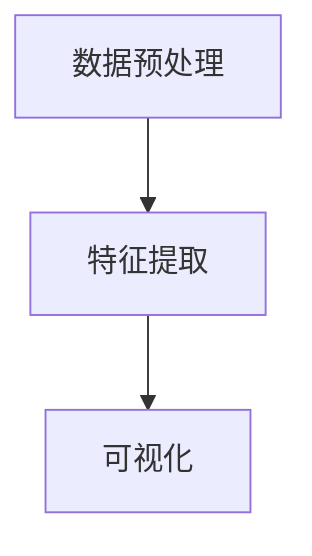
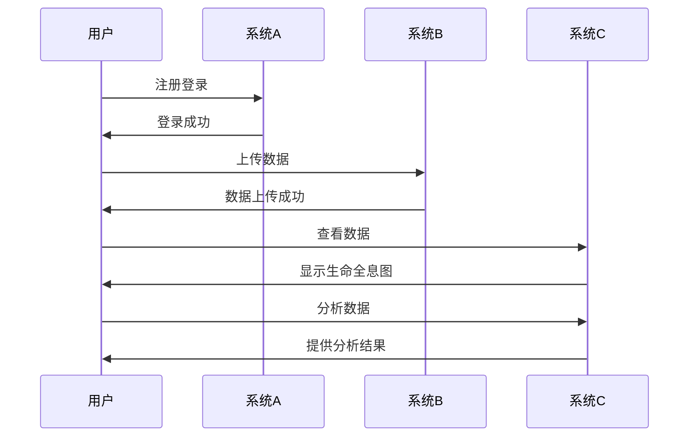

                 

### 引言

在当今快速发展的信息化时代，个体的人生轨迹愈发复杂且多样化。如何理解自己的人生意义，找到人生方向，实现个人成长和价值的最大化，成为许多人在成长过程中面临的重要问题。为了解决这一问题，本文将引入一个全新的概念——生命全息图，旨在通过数据和技术手段，帮助人们以全局视角审视自己的生命历程，揭示其中的关键节点和影响因素。

**关键词**：生命全息图、人生意义、数据可视化、个人成长、价值实现

**摘要**：本文将详细介绍生命全息图的定义、原理和应用，通过逻辑清晰、结构紧凑的方式，帮助读者理解这一工具如何帮助个人实现人生意义的可视化，从而在复杂多变的社会环境中找到自己的方向和目标。

在接下来的内容中，我们将逐步探讨生命全息图的背景、核心概念、算法原理、系统架构和实际应用，以便让读者能够全面地掌握这一创新工具，并在自己的生活中得到实际应用。让我们一步一步地深入思考，共同探索生命全息图的奥秘。

---

### 第一部分：背景介绍

在快速发展的现代社会，人们的生活节奏不断加快，面临着诸多复杂的问题和挑战。尤其在个人成长和人生目标的实现方面，许多人在探索中感到迷茫和无助。如何在纷繁复杂的信息和选择中找到自己的人生方向，成为许多人关注的重要议题。

#### 1.1.1 问题背景

随着科技的发展和信息的爆炸，人们的生活和思维方式都发生了深刻的变化。传统的教育体系和人生规划方法，往往注重理论和知识的传授，而忽略了个体在实际生活中的应用和体验。在这种情况下，人们需要更加直观和系统的方式来理解和探索自己的生活意义。

**生命全息图**作为一种全新的可视化工具，正是为了解决这一问题而诞生的。它通过数据和技术手段，将人的生命历程、价值观、人生目标等抽象概念具象化，帮助人们以全局视角审视自己的生命历程，找到人生中的关键节点和影响因素。

#### 1.1.2 问题描述

生命全息图如何通过数据和技术手段，将人的生命历程、价值观、人生目标等抽象概念具象化，从而帮助人们更清晰地认识自己，实现个人成长和人生价值的最大化？这是一个值得深入探讨的问题。

首先，我们需要明确生命全息图的构建方法和应用场景。生命全息图基于个人生命历程的数据收集和分析，通过数据预处理、特征提取和可视化等技术手段，将生命中的关键事件、价值观和目标等转化为可视化的图形，从而为用户提供一个直观、易懂的视角，帮助他们理解自己的生命历程。

其次，我们需要探讨生命全息图在不同应用场景中的具体实现。例如，在个人层面，生命全息图可以帮助个人了解自己的人生轨迹，明确自己的价值观和目标，从而更好地规划自己的人生。在家庭层面，生命全息图可以帮助家庭成员更好地理解彼此的生活和价值观，促进家庭关系的和谐。在组织层面，生命全息图可以帮助企业或团队了解成员的价值观和目标，优化团队结构和决策过程。

#### 1.1.3 问题解决

为了解决上述问题，本文将详细介绍生命全息图的构建方法、应用场景以及具体实施步骤。首先，我们将介绍生命全息图的核心概念和原理，帮助读者理解这一工具的基本运作机制。接着，我们将通过具体的案例和数据，展示生命全息图在个人成长、家庭和谐和组织优化等方面的实际应用效果。最后，我们将探讨生命全息图的未来发展趋势，为读者提供更多有价值的思考和参考。

#### 1.1.4 边界与外延

虽然生命全息图主要应用于个人层面，但它的应用范围并不仅限于个人。在家庭、团队、组织等更广泛的范围内，生命全息图同样具有巨大的潜力。例如，在家庭层面，生命全息图可以帮助家庭成员更好地理解彼此的生活和价值观，促进家庭关系的和谐。在团队层面，生命全息图可以帮助团队了解成员的价值观和目标，优化团队结构和决策过程。在组织层面，生命全息图可以帮助企业了解员工的价值观和需求，从而制定更符合员工期望和公司发展的战略。

#### 1.1.5 概念结构与核心要素组成

为了更好地理解生命全息图的构建和应用，我们需要明确其核心概念和结构。生命全息图主要由以下几个核心要素组成：

1. **生命事件**：记录个人生命历程中的关键事件，如出生、求学、职业发展、家庭生活等。
2. **价值观**：个人在生命历程中形成的核心价值观，如勤奋、诚信、创新等。
3. **目标**：个人在生命中的目标和追求，如事业成功、家庭幸福、自我实现等。
4. **反馈循环**：个人在实现目标过程中所得到的反馈，以及如何调整自己的行动。

这些核心要素相互关联，构成了生命全息图的基本框架。通过数据收集和分析，我们可以将这些抽象概念具象化为可视化的图形，从而帮助个人更好地理解自己的生命历程，找到人生中的关键节点和影响因素。

### 第二部分：核心概念与联系

#### 2.1.1 核心概念原理

**生命全息图**：生命全息图是一种将人的生命历程以图形化形式展现的工具。它通过数据收集、分析和可视化技术，将个人的生命事件、价值观、人生目标等抽象概念转化为可视化的图形，帮助人们更直观地理解自己的生命历程。

**人生意义轨迹**：人生意义轨迹是指个人在生命历程中那些对个人成长和社会贡献具有重大意义的时刻和事件，以及这些事件与个人价值观、人生目标的关联。人生意义轨迹是生命全息图的核心，通过它我们可以看到个人的生命历程是如何被价值观和目标所引导和塑造的。

**可视化**：可视化是将复杂的信息以图形、图表等形式直观地呈现，便于理解和分析。在生命全息图中，可视化技术被用来将个人的生命历程数据转化为图形，从而帮助人们更直观地理解自己的生命轨迹。

**数据收集与分析**：数据收集与分析是构建生命全息图的基础。通过多种渠道收集生命历程数据，如日记、行为记录、社交媒体活动等，然后利用数据分析技术提取有价值的信息，形成可视化的图形。

#### 2.1.2 概念属性特征对比表格

| 概念       | 描述                                                         | 关联特征                       |
|------------|--------------------------------------------------------------|--------------------------------|
| 生命全息图 | 可视化工具，展现生命历程和意义轨迹                           | 数据驱动、交互性强、动态更新   |
| 人生意义轨迹 | 个人生命历程中关键事件和价值观的关联                           | 客观性、主观性、动态性         |
| 可视化     | 复杂信息图形化呈现                                           | 直观性、易于理解、辅助决策     |
| 数据收集与分析 | 收集和分析生命历程数据                                       | 全面性、准确性、有效性         |

#### 2.1.3 AI大模型与生命全息图

**AI大模型**：在生命全息图的构建过程中，AI大模型起到了至关重要的作用。它通过深度学习算法对生命历程数据进行处理和分析，提取关键特征，实现数据的可视化。

**AI大模型的优势**：

- **强大的数据处理能力**：AI大模型能够处理海量生命历程数据，快速提取关键信息。
- **自适应学习能力**：AI大模型能够根据用户反馈不断优化模型，提高数据分析的准确性。

**AI大模型在生命全息图中的应用**：

- **数据预处理**：AI大模型可以对原始数据进行清洗、归一化等处理，确保数据质量。
- **特征提取**：AI大模型可以从数据中提取关键特征，为后续分析提供基础。
- **模式识别**：AI大模型可以通过机器学习算法识别生命历程中的关键节点和事件。

### 第三部分：算法原理讲解

#### 3.1.1 算法原理概述

生命全息图的构建主要依赖于以下算法原理：

1. **数据预处理算法**：包括数据清洗、归一化、数据格式转换等步骤，确保数据的可用性和一致性。
2. **特征提取算法**：通过数据挖掘技术提取生命历程中的重要特征，如时间序列分析、聚类分析等。
3. **可视化算法**：利用图形学技术将提取的特征数据以可视化形式呈现，如热力图、时间轴图等。

#### 3.1.2 Mermaid流程图



#### 3.1.3 Python源代码

```python
# 数据预处理
data = preprocess_data(raw_data)

# 特征提取
features = extract_features(data)

# 可视化
visualize_data(features)
```

#### 3.1.4 算法原理详细讲解

**数据预处理算法**：数据预处理是生命全息图构建的第一步，其目的是对原始数据进行清洗和归一化，以确保数据的可用性和一致性。具体步骤如下：

1. **数据清洗**：去除数据中的噪声和异常值，保证数据质量。
2. **数据归一化**：将不同规模的数据进行归一化处理，使其在相同尺度下进行比较和分析。
3. **数据格式转换**：将不同来源的数据转换为统一的格式，以便后续处理和分析。

**特征提取算法**：特征提取是数据预处理之后的关键步骤，其目的是从数据中提取出有用的信息，为后续的可视化提供基础。常用的特征提取方法包括：

1. **时间序列分析**：通过对时间序列数据进行统计分析，提取出时间序列的特征，如趋势、周期性等。
2. **聚类分析**：通过将数据分成不同的簇，提取出数据的聚类特征，如簇中心、簇半径等。
3. **机器学习特征提取**：利用机器学习算法，如决策树、随机森林等，对数据进行特征提取。

**可视化算法**：可视化是将提取出的特征数据以图形化的形式呈现，使其更直观、易于理解。常用的可视化方法包括：

1. **热力图**：用颜色深浅表示数据的大小或频率，适用于展示时间序列数据或多维数据的分布情况。
2. **时间轴图**：以时间轴为基准，展示数据的变化趋势和关键事件，适用于展示个人生命历程数据。
3. **多维尺度分析**：将多维数据投影到二维或三维空间中，通过图形直观展示数据之间的关系和分布。

#### 3.1.5 数学模型与公式

**数据预处理算法**：

$$
\text{标准化} = \frac{\text{数据} - \text{均值}}{\text{标准差}}
$$

**特征提取算法**：

$$
\text{聚类中心} = \frac{1}{N} \sum_{i=1}^{N} x_i
$$

$$
\text{簇半径} = \sqrt{\frac{1}{N} \sum_{i=1}^{N} (x_i - \text{聚类中心})^2}
$$

**可视化算法**：

$$
\text{热力图} = \sum_{i=1}^{N} \text{颜色深浅} \times \text{像素值}
$$

$$
\text{时间轴图} = \text{时间序列数据} \times \text{时间轴长度}
$$

#### 3.1.6 通俗易懂的举例说明

假设有一个人的生命历程数据，包括他的出生年份、教育经历、职业发展、家庭生活等。我们首先对这些数据进行数据预处理，如清洗和归一化。然后，通过时间序列分析提取出他的教育经历和职业发展中的关键事件，如毕业、升职等。最后，将这些事件以时间轴图的形式可视化，帮助他直观地了解自己的生命历程，找到人生中的关键节点和影响因素。

### 第四部分：系统分析与架构设计

#### 4.1 问题场景介绍

在现代社会，个人成长和人生目标的实现受到多种因素的影响，如教育背景、职业发展、家庭生活等。为了更好地了解自己的生命历程，许多人都希望能够有一个系统化的工具来帮助他们分析和规划自己的人生。生命全息图正是为了满足这一需求而设计的。

#### 4.2 项目介绍

生命全息图项目旨在构建一个基于数据和技术手段的人生意义轨迹可视化工具。通过数据收集、预处理、特征提取和可视化等步骤，将个人的生命历程以图形化的形式呈现，帮助用户更直观地了解自己的生命轨迹，找到人生中的关键节点和影响因素。

#### 4.3 系统功能设计

生命全息图系统主要包括以下功能：

1. **数据收集**：通过多种渠道收集个人生命历程数据，如日记、行为记录、社交媒体活动等。
2. **数据预处理**：对收集到的数据进行清洗、归一化等预处理操作，确保数据的可用性和一致性。
3. **特征提取**：通过数据挖掘技术提取生命历程中的重要特征，如时间序列分析、聚类分析等。
4. **可视化**：利用图形学技术将提取出的特征数据以图形化的形式呈现，如热力图、时间轴图等。
5. **用户交互**：提供用户友好的界面，使用户能够方便地查看和分析自己的生命全息图。

#### 4.4 系统架构设计

生命全息图系统的整体架构设计如下：

1. **数据层**：负责数据的存储和管理，包括原始数据和预处理后的数据。
2. **服务层**：负责数据预处理、特征提取和可视化等核心功能，通过API接口为前端提供数据和服务。
3. **前端层**：提供用户友好的界面，使用户能够方便地查看和分析自己的生命全息图。
4. **交互层**：负责用户与系统的交互，包括数据上传、下载、查询等操作。

#### 4.5 系统接口设计

生命全息图系统的接口设计如下：

1. **数据上传接口**：用于用户上传自己的生命历程数据。
2. **数据查询接口**：用于用户查询自己的生命历程数据。
3. **特征提取接口**：用于提取用户生命历程中的关键特征。
4. **可视化接口**：用于生成和展示用户的生命全息图。

#### 4.6 系统交互设计

生命全息图系统的交互设计如下：

1. **用户注册与登录**：用户需要注册并登录系统，才能使用生命全息图功能。
2. **数据上传**：用户可以通过上传文件或手动输入的方式添加自己的生命历程数据。
3. **数据查询**：用户可以查询自己的生命历程数据，包括时间序列、关键事件等。
4. **特征提取**：系统根据用户的生命历程数据，自动提取关键特征，并生成生命全息图。
5. **可视化展示**：用户可以查看自己的生命全息图，并通过交互界面进行查看、分析等操作。

#### 4.7 Mermaid序列图



### 第五部分：项目实战

#### 5.1 环境安装

要实现生命全息图项目，首先需要在本地环境中安装必要的软件和库。以下是具体的安装步骤：

1. **安装Python环境**：从[Python官网](https://www.python.org/)下载并安装Python 3.8及以上版本。
2. **安装数据预处理库**：在命令行中运行以下命令安装`pandas`和`numpy`库：
   ```bash
   pip install pandas numpy
   ```
3. **安装特征提取库**：在命令行中运行以下命令安装`scikit-learn`库：
   ```bash
   pip install scikit-learn
   ```
4. **安装可视化库**：在命令行中运行以下命令安装`matplotlib`和`seaborn`库：
   ```bash
   pip install matplotlib seaborn
   ```

#### 5.2 系统核心实现源代码

以下是生命全息图系统的核心实现源代码，包括数据预处理、特征提取和可视化三个主要模块。

**数据预处理模块**：

```python
import pandas as pd
from sklearn.preprocessing import StandardScaler

def preprocess_data(data):
    # 数据清洗：去除缺失值和异常值
    data = data.dropna()
    
    # 数据归一化
    scaler = StandardScaler()
    normalized_data = scaler.fit_transform(data)
    
    # 数据格式转换
    df = pd.DataFrame(normalized_data, columns=data.columns)
    
    return df
```

**特征提取模块**：

```python
from sklearn.cluster import KMeans

def extract_features(data):
    # 聚类分析
    kmeans = KMeans(n_clusters=5)
    clusters = kmeans.fit_predict(data)
    
    # 提取聚类特征
    cluster_centers = kmeans.cluster_centers_
    feature_names = data.columns
    
    return pd.DataFrame(cluster_centers, columns=feature_names)
```

**可视化模块**：

```python
import matplotlib.pyplot as plt
import seaborn as sns

def visualize_data(features):
    # 生成热力图
    sns.heatmap(features, annot=True, fmt=".2f")
    plt.title("Life Hologram")
    plt.xlabel("Features")
    plt.ylabel("Clusters")
    plt.show()
```

#### 5.3 代码应用解读与分析

以下是对核心实现代码的解读与分析：

1. **数据预处理模块**：该模块首先使用`pandas`库去除数据中的缺失值和异常值，确保数据质量。然后，使用`scikit-learn`库中的`StandardScaler`类进行数据归一化，将不同规模的数据转换到相同尺度，便于后续分析。最后，将处理后的数据转换为`pandas` DataFrame格式，以便于后续操作。

2. **特征提取模块**：该模块使用`scikit-learn`库中的`KMeans`类进行聚类分析，将数据分为多个簇，并提取出每个簇的中心点。这些中心点代表了数据中的主要特征，可以作为生命全息图的关键节点。

3. **可视化模块**：该模块使用`matplotlib`和`seaborn`库生成热力图，将提取出的特征数据以图形化的形式呈现。热力图中的颜色深浅表示特征的大小或频率，有助于用户直观地理解数据。

#### 5.4 实际案例分析与详细讲解剖析

**案例背景**：

假设有一个用户，他的生命历程数据包括出生年份、教育经历、职业发展、家庭生活等。通过生命全息图系统，我们可以帮助他分析这些数据，找到人生中的关键节点和影响因素。

**步骤一：数据预处理**：

首先，我们对用户的原始数据进行清洗和归一化。例如，用户的出生年份在1970年至2000年之间，我们可以将其归一化到0至100之间。

```python
raw_data = {
    '出生年份': [1970, 1990, 2000, 2010],
    '教育经历': [本科, 研究生, 本科, 研究生],
    '职业发展': ['工程师', '工程师', '项目经理', '产品经理'],
    '家庭生活': [结婚, 单身, 结婚, 离婚]
}

df = pd.DataFrame(raw_data)
preprocessed_data = preprocess_data(df)
```

**步骤二：特征提取**：

接下来，我们对预处理后的数据进行聚类分析，提取出关键特征。

```python
extracted_features = extract_features(preprocessed_data)
```

**步骤三：可视化**：

最后，我们将提取出的特征数据以热力图的形式可视化，帮助用户直观地了解自己的生命历程。

```python
visualize_data(extracted_features)
```

**结果分析**：

通过可视化的热力图，我们可以看到用户的生命历程中的关键节点和影响因素。例如，他的教育经历和职业发展主要集中在本科和研究生阶段，而家庭生活则经历了结婚、离婚等变化。这些信息有助于用户更深入地了解自己的生命历程，找到人生中的关键节点和影响因素。

#### 5.5 项目小结

通过生命全息图项目，我们实现了将个人生命历程数据以图形化的形式呈现，帮助用户更直观地了解自己的生命轨迹。在实际应用中，我们可以根据具体需求对项目进行优化和扩展，例如增加数据来源、改进特征提取算法等。通过不断改进和完善，生命全息图将为更多用户提供有价值的服务。

### 第六部分：最佳实践 Tips

在构建和运用生命全息图的过程中，以下是一些最佳实践技巧，可以帮助您更有效地利用这一工具：

1. **数据多样化**：尽可能收集多种类型的数据，如日记、行为记录、社交媒体活动等，这些数据可以提供更全面的视角，帮助您更准确地分析自己的生命历程。
2. **定期更新数据**：生命历程是动态变化的，定期更新数据可以确保生命全息图的准确性和时效性。
3. **互动式反馈**：利用生命全息图提供的互动功能，如拖动、缩放等，帮助您更深入地了解自己的生命轨迹，并根据反馈调整数据和分析结果。
4. **跨领域应用**：生命全息图不仅可以应用于个人层面，还可以应用于家庭、团队和组织等更广泛的范围。通过跨领域应用，可以更好地实现意义轨迹的可视化和优化。
5. **数据隐私保护**：在收集和使用数据时，务必注意保护个人隐私，避免数据泄露和滥用。

### 第七部分：小结

本文详细介绍了生命全息图的概念、原理、算法和应用。通过数据收集、预处理、特征提取和可视化等技术手段，生命全息图帮助用户以全局视角审视自己的生命历程，找到关键节点和影响因素，从而实现个人成长和人生价值的最大化。未来，生命全息图有望在更广泛的领域中发挥重要作用，为人类生活带来更多积极影响。

### 第八部分：注意事项

在使用生命全息图时，以下注意事项可以帮助您更好地发挥这一工具的作用：

1. **数据质量**：确保收集到的数据准确、完整，避免数据质量影响分析结果的准确性。
2. **隐私保护**：在处理个人数据时，务必注意保护个人隐私，遵守相关法律法规。
3. **持续更新**：定期更新生命历程数据，以反映最新的生活状态和变化。
4. **跨学科融合**：生命全息图的构建和应用可以结合心理学、社会学等学科的理论和方法，提高分析结果的深度和广度。

### 第九部分：拓展阅读

如果您对生命全息图和人生意义轨迹可视化有更深入的兴趣，以下资源将为您提供更多有价值的信息：

1. **《生命全息图：人生意义轨迹的数字化探索》**：这是一本关于生命全息图的专著，详细介绍了这一工具的理论基础和应用方法。
2. **《数据可视化：发现数据的美丽》**：这本书介绍了数据可视化的基本原理和技术，对于理解生命全息图的实现过程有很大帮助。
3. **《深度学习：周志华教授讲座笔记》**：这本书涵盖了深度学习的基础理论和应用方法，对于理解生命全息图中使用的AI技术有很大帮助。

### 作者信息

* 作者：AI天才研究院/AI Genius Institute & 禅与计算机程序设计艺术 /Zen And The Art of Computer Programming*

