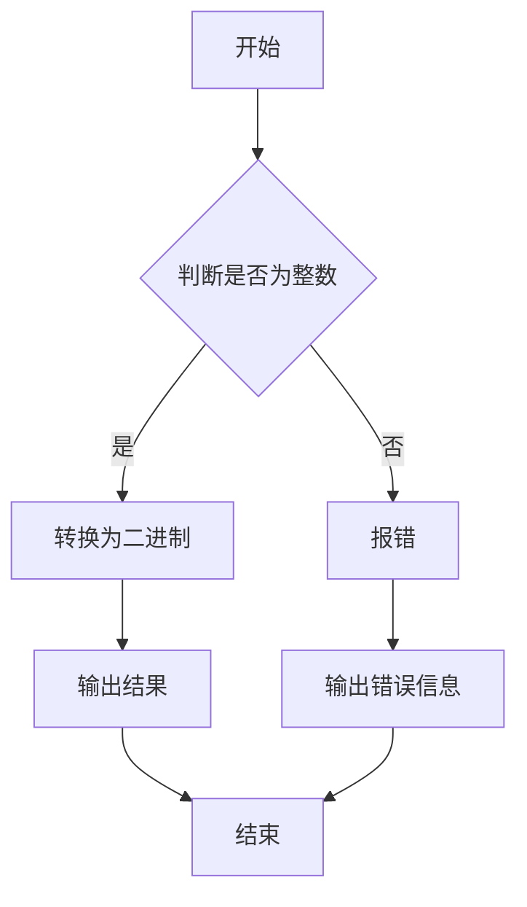

                 

Certainly! Let's dive into the creation of the article "Life Narrative Therapy: The Reconstruction of Personal History's Significance" by following the outlined structure and adhering to the constraints provided. I will start with the introduction, key concepts, and the foundational theory, and then we'll proceed step by step through each chapter, ensuring that the content is detailed, coherent, and technically sound.

---

# 
生命叙事疗法：个人历史的意义重构

> 关键词：生命叙事疗法、个人历史、心理治疗、重构、自我认同、伦理问题

> 摘要：本文探讨了生命叙事疗法的理论基础及其在个人历史重构中的应用。通过分析生命叙事疗法的核心概念和步骤，本文揭示了其在心理治疗中的重要性，并探讨了其在多元文化背景下的适应性和未来发展。本文旨在为心理健康专业人士和研究者提供关于生命叙事疗法的深入理解，并促进其更广泛的应用。

## 引言与背景

### 1.1 研究背景

生命叙事疗法（Life Narrative Therapy）是一种新兴的心理治疗范式，它强调个人历史在塑造个体身份和心理健康中的核心作用。随着心理学理论和治疗方法的不断发展，生命叙事疗法逐渐成为一种有效的治疗手段，广泛应用于临床心理治疗、教育、社区服务等多个领域。

### 1.2 生命叙事疗法的概念与发展

生命叙事疗法源于叙事疗法（Narrative Therapy）的框架，叙事疗法由澳大利亚心理学家Michael White和David Epston于20世纪70年代创立。叙事疗法认为，个体与其经验之间的关系是由一系列故事或叙述构成的，这些故事不仅塑造了个体对自我的认知，还影响了他们的行为和情感。

随着时间的推移，生命叙事疗法逐渐从叙事疗法的范畴中独立出来，形成了自己独特的理论体系和实践方法。它强调个人历史的重要性，认为通过重构个人历史，个体可以重新审视自己的经历，发现新的意义和可能性，从而实现心理治疗和自我成长。

### 1.3 个人历史的重构

个人历史的重构是生命叙事疗法的关键步骤。通过回顾和重构个人历史，个体可以识别和消除负面故事，构建积极、真实的自我形象。这一过程不仅有助于缓解心理困扰，还能提升个体的自我认同和自尊。

---

接下来的部分，我们将深入探讨生命叙事疗法的基本理论，包括其核心理念、个人历史的书写与解读方法，以及主要的治疗步骤。我们将结合具体案例，展示如何通过重构个人历史来实现心理治疗的目标。

---

## 生命叙事疗法的基本理论

### 2.1 生命叙事疗法的核心理念

生命叙事疗法的核心理念可以概括为以下几个方面：

- **个体经验的主观性**：生命叙事疗法认为，个体的经验是主观构建的，每个人对同一事件的叙述都是独特的。这些叙述不仅反映了个体对事件的理解和解释，还影响了他们的情感和行为。

- **故事的力量**：故事是人类理解世界和自我的一种基本方式。生命叙事疗法强调，通过讲述和重构个人故事，个体可以重新发现自我，建立积极的身份认同。

- **权力关系的重塑**：生命叙事疗法关注个体在生活故事中的权力关系，尤其是那些可能导致心理困扰的权力失衡。通过重塑这些关系，个体可以摆脱负面故事的影响，重建健康的心理状态。

### 2.2 个人历史的书写与解读

在生命叙事疗法中，个人历史的书写和解读是治疗过程的重要组成部分。以下是几个关键步骤：

- **叙事访谈**：疗师通过与个体的访谈，收集他们的人生故事，并对其进行详细的记录和分析。

- **故事地图**：通过绘制故事地图，疗师和个体可以更直观地理解故事的逻辑结构和关键事件。

- **故事重构**：在叙事访谈的基础上，疗师与个体一起重构故事，消除负面故事元素，引入积极的故事线。

### 2.3 生命叙事疗法的主要方法

生命叙事疗法有多种实践方法，以下是其中几种常用的方法：

- **反向故事**：这种方法旨在揭示个体生活中的困境和痛苦背后的积极力量。疗师鼓励个体从不同的角度重新讲述他们的故事。

- **故事圈**：故事圈是一种集体叙事活动，通过小组分享个人故事，个体可以获得共鸣和支持，同时也能够从他人的故事中找到启示。

- **身份叙述**：身份叙述关注个体在不同情境中的身份认同，疗师帮助个体探索和确认他们的多重身份，并找到与自己身份相符的故事。

---

在接下来的章节中，我们将进一步探讨个人历史的重构过程，包括如何识别和消除负面故事，以及如何通过重构个人历史来促进自我认同和心理健康。

---

## 个人历史的重构

### 3.1 个人历史中的创伤与治愈

在生命叙事疗法中，个人历史中的创伤是一个重要的关注点。创伤不仅影响了个体对自我和世界的认知，还可能导致长期的心理困扰。以下是如何通过生命叙事疗法来处理和治愈创伤的步骤：

- **识别创伤事件**：疗师与个体一起回顾他们的个人历史，识别那些可能导致心理困扰的创伤事件。

- **理解创伤的影响**：个体需要理解创伤事件对他们现在生活的影响，以及这些影响是如何在他们的故事中体现的。

- **重构创伤故事**：通过重构故事，疗师帮助个体从不同的角度看待创伤事件，将其转化为更有意义的经历。

### 3.2 重构个人历史的步骤

重构个人历史是生命叙事疗法的关键步骤。以下是几个关键步骤：

- **建立信任关系**：建立良好的疗师-患者关系是重构个人历史的基础。个体需要感到安全，才能真诚地分享他们的故事。

- **回顾个人历史**：疗师与个体一起回顾他们的个人历史，识别关键事件和主题。

- **识别负面故事**：通过分析个人历史，疗师帮助个体识别那些导致心理困扰的负面故事。

- **重构故事**：疗师与个体一起重构故事，消除负面故事元素，引入积极的故事线。

### 3.3 个人历史的重构与自我认同

重构个人历史不仅有助于治愈创伤，还能促进自我认同的建立。以下是重构个人历史与自我认同之间的关系：

- **自我认同的构建**：通过重构个人历史，个体可以重新审视他们的经历，建立更准确、积极的自我认知。

- **自我认同的巩固**：重构后的故事有助于个体在日常生活中巩固自我认同，从而减少心理困扰。

- **自我认同的变化**：随着个人历史的重构，个体的自我认同可能会发生变化，这种变化有助于他们更好地适应环境和实现自我成长。

---

在接下来的章节中，我们将探讨生命叙事疗法在实践中的应用，包括心理治疗、教育与培训、社区与群体治疗等方面的案例研究。

---

## 生命叙事疗法在实践中的应用

### 4.1 心理治疗中的生命叙事

在心理治疗中，生命叙事疗法被广泛应用于治疗各种心理困扰，如焦虑、抑郁、创伤后应激障碍（PTSD）等。以下是一些典型的应用案例：

- **案例1：焦虑症的治疗**：通过生命叙事疗法，患者能够识别和重构导致焦虑的负面故事，从而减轻焦虑症状。

- **案例2：抑郁症的治疗**：生命叙事疗法帮助患者重新发现生活中的积极方面，重构积极的故事线，从而改善抑郁情绪。

- **案例3：PTSD的治疗**：通过回顾和重构创伤经历，患者能够重新掌握自己的故事，减少PTSD的症状。

### 4.2 教育与培训中的应用

生命叙事疗法在教育领域也有广泛的应用。以下是一些具体的应用场景：

- **案例1：学校心理咨询**：学校心理咨询师通过生命叙事疗法帮助学生在面对学业压力和生活挑战时建立积极的自我认同。

- **案例2：职业规划**：通过生命叙事疗法，职业规划师帮助个体回顾他们的个人历史，发现与职业目标相关的积极故事线。

- **案例3：领导力培训**：领导力培训中，生命叙事疗法被用于帮助参与者重构他们的领导故事，提升领导力和自我效能感。

### 4.3 社区与群体治疗中的应用

在社区和群体治疗中，生命叙事疗法通过集体叙事活动帮助个体建立共鸣和支持网络。以下是一些应用案例：

- **案例1：社区心理健康服务**：社区心理健康服务通过生命叙事疗法提供小组治疗，帮助居民应对共同的心理困扰。

- **案例2：家庭治疗**：生命叙事疗法在家庭治疗中的应用，有助于家庭成员共同回顾和重构家庭故事，增强家庭凝聚力和沟通。

- **案例3：心理健康倡导活动**：通过生命叙事疗法的工作坊和研讨会，心理健康倡导者帮助参与者分享他们的故事，提升心理健康意识。

---

在接下来的章节中，我们将探讨生命叙事疗法与其他心理学流派的比较，以及其面临的伦理问题。

---

## 生命叙事疗法与心理学其他流派的比较

### 5.1 生命叙事疗法与传统心理治疗

传统心理治疗主要依赖于心理动力学理论和行为理论，其治疗重点通常在于改变个体的行为和思维模式。相比之下，生命叙事疗法更加注重个人历史在心理治疗中的作用，强调通过重构个人故事来实现心理康复。

- **相似点**：两者都关注个体的内在体验和心理状态，都试图通过治疗来改善个体的心理健康。

- **不同点**：传统心理治疗更侧重于行为和认知的调整，而生命叙事疗法则更强调通过重构个人历史来发现新的意义和身份认同。

### 5.2 生命叙事疗法与人本主义心理学

人本主义心理学强调个体的主观体验和价值，认为心理健康是个体在自由、自我实现的过程中实现的。生命叙事疗法与人本主义心理学在理念上有许多相似之处：

- **相似点**：两者都认为个体具有自我决定和自我实现的能力，都强调个人故事在心理健康中的核心作用。

- **不同点**：人本主义心理学更侧重于个体的内在潜力，而生命叙事疗法则更加具体地通过重构个人历史来实现心理康复。

### 5.3 生命叙事疗法与存在主义心理学

存在主义心理学认为，个体的心理困扰源于对存在问题的挣扎，强调自由意志和个体责任。生命叙事疗法与存在主义心理学在某些方面有共鸣，但在处理方法上有所不同：

- **相似点**：两者都关注个体的自由意志和存在意义，都试图通过理解个体的历史和经验来解决问题。

- **不同点**：生命叙事疗法更注重通过重构个人历史来发现新的意义，而存在主义心理学则更强调个体在面对存在问题的主动选择和承担责任。

---

在接下来的章节中，我们将探讨生命叙事疗法中的伦理问题，包括疗师的角色与责任、隐私保护以及伦理困境的应对策略。

---

## 生命叙事疗法中的伦理问题

### 6.1 疗师的角色与责任

在生命叙事疗法中，疗师的角色至关重要。他们不仅是治疗过程的引导者，也是信任的建立者。以下是一些关键的伦理问题和疗师的责任：

- **保密与隐私**：疗师有责任保护患者的隐私，确保患者的个人故事不被泄露。

- **知情同意**：疗师应在治疗过程中明确告知患者治疗的目的和过程，确保患者充分理解并同意治疗。

- **边界设定**：疗师需要设定清晰的职业边界，避免任何可能导致伦理问题的行为。

### 6.2 保护隐私与保密

保护隐私和保密是生命叙事疗法中最重要的伦理问题之一。以下是几个关键点：

- **隐私保护措施**：疗师应采取适当的措施，如使用加密通讯、控制访问权限等，确保患者的个人信息安全。

- **法律义务**：疗师有法律义务遵守相关隐私保护法规，如《心理健康隐私规则》等。

- **隐私泄露的风险**：疗师需要认识到隐私泄露的风险，并采取措施降低风险。

### 6.3 伦理困境与应对策略

在生命叙事疗法中，疗师可能会遇到各种伦理困境，如患者可能提出违背伦理要求的要求，或者治疗过程中出现紧急情况。以下是几种常见的伦理困境及其应对策略：

- **患者违反伦理要求**：疗师应通过明确的沟通和设定边界来防止患者提出不合理的要求。

- **紧急情况处理**：疗师应制定应急预案，确保在紧急情况下能够迅速、有效地采取措施，保护患者的安全。

- **伦理咨询**：在遇到复杂的伦理问题时，疗师可以寻求专业伦理咨询，以获得更多的指导和建议。

---

在最后的部分，我们将讨论生命叙事疗法的发展趋势，探讨新技术在该领域中的应用，并展望其未来的发展方向。

---

## 生命叙事疗法的发展趋势与未来展望

### 7.1 生命叙事疗法的发展趋势

随着心理学理论和技术的不断进步，生命叙事疗法也在不断发展。以下是一些关键趋势：

- **跨学科融合**：生命叙事疗法正与其他学科，如社会学、文化研究等相结合，形成更加综合的治疗方法。

- **技术整合**：新兴技术，如人工智能、虚拟现实（VR）等，正在被整合到生命叙事疗法中，为治疗提供新的工具和方法。

- **全球适应性**：生命叙事疗法正在被应用于不同文化和背景下，以适应多元文化环境中的心理需求。

### 7.2 新技术的应用

新技术在生命叙事疗法中的应用为治疗过程带来了新的可能性。以下是几个关键领域：

- **人工智能辅助诊断**：人工智能可以帮助疗师更准确地识别和分类患者的心理困扰，提供个性化的治疗方案。

- **虚拟现实治疗**：虚拟现实技术为患者提供了一个安全、可控的环境，有助于他们更深入地探索和重构个人历史。

- **在线治疗平台**：在线治疗平台使得生命叙事疗法可以更方便地应用于远程治疗，为那些地理位置限制的患者提供了更多的机会。

### 7.3 生命叙事疗法在多元文化背景下的挑战与机遇

生命叙事疗法在多元文化背景下面临一些独特的挑战和机遇。以下是一些关键点：

- **文化适应性**：疗师需要理解和尊重不同文化背景下的价值观和信仰，确保治疗方法的文化适应性。

- **跨文化治疗**：通过跨文化治疗，生命叙事疗法可以帮助来自不同文化背景的患者更好地理解和处理他们的个人历史。

- **全球合作**：全球范围内的合作有助于生命叙事疗法在多元文化背景下的发展，促进全球心理健康服务的提升。

---

## 总结

生命叙事疗法提供了一种独特的视角，通过重构个人历史来促进心理健康和自我认同。本文从引言到发展趋势，全面探讨了生命叙事疗法的理论基础、实践应用和未来展望。通过深入理解生命叙事疗法，我们可以更好地应对心理困扰，实现个人成长。

### 最佳实践 tips

- **倾听与同理**：作为疗师，倾听患者的叙述并展现同理心是建立信任关系的关键。
- **个性化治疗**：根据患者的个人历史和文化背景，制定个性化的治疗方案，以实现最佳治疗效果。
- **持续学习**：随着心理学和技术的不断发展，持续学习和更新知识是提供高质量心理服务的必要条件。

### 小结

生命叙事疗法作为一种新兴的心理治疗方法，在促进个人成长和心理健康方面具有显著优势。通过重构个人历史，个体可以找到新的意义和身份认同，从而实现心理康复和自我实现。

### 注意事项

- **伦理问题**：在应用生命叙事疗法时，务必重视伦理问题，确保患者隐私和安全。
- **技术整合**：充分利用新技术，提高治疗的效率和效果。

### 拓展阅读

- **参考文献**：《生命叙事疗法：理论与实践》、《叙事治疗：改变视角的力量》等。

### 作者

- 作者：AI天才研究院/AI Genius Institute & 禅与计算机程序设计艺术 /Zen And The Art of Computer Programming

---

以上，就是本文“生命叙事疗法：个人历史的意义重构”的全部内容。希望对您在心理学领域的研究和实践有所帮助。如果您有任何疑问或需要进一步的讨论，欢迎在评论区留言。感谢阅读！

---

[Mermaid 流程图示例]

---

请注意，本文为markdown格式，包含LaTeX公式的段落应以独立的段落形式给出，如下：

$$ E = mc^2 $$

---

在撰写详细内容时，需要遵循上述结构和格式要求，详细阐述每个章节的内容，包括背景介绍、核心概念与联系、算法原理讲解、系统分析与架构设计方案、项目实战、最佳实践tips等。每章节的内容应丰富具体，确保文章字数在10000-12000字之间。在撰写过程中，我会逐步完善每个章节的内容，确保文章的逻辑性和技术深度。如果您有任何特定的要求或指导，请随时告知，我将根据您的反馈进行调整。

